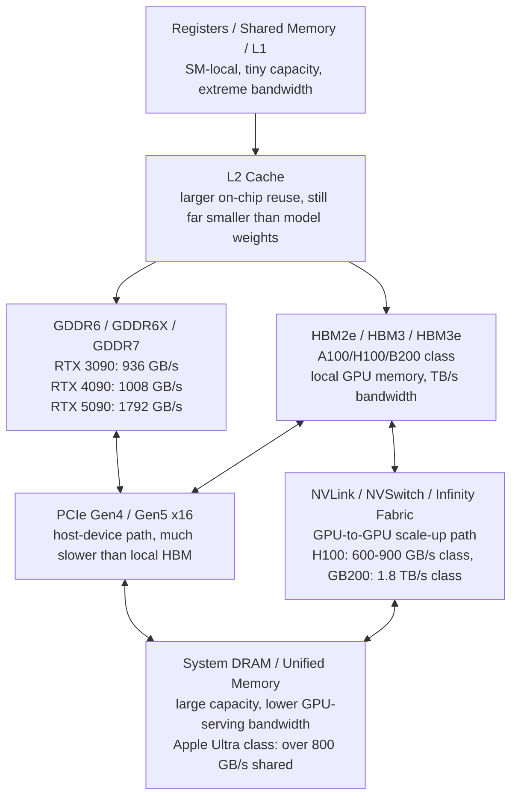
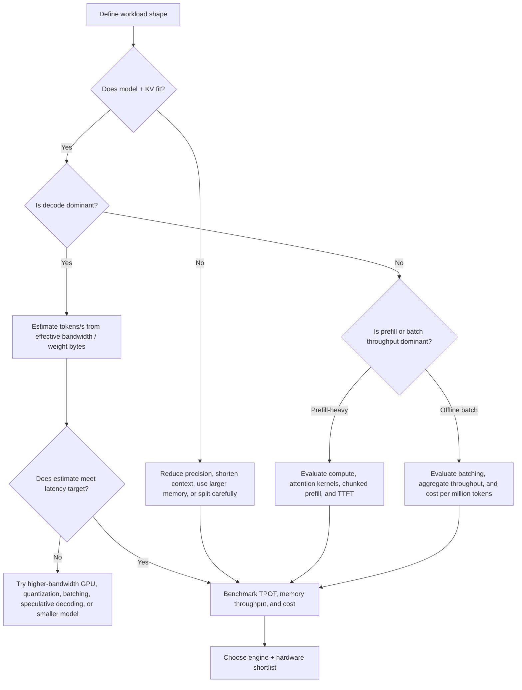

> **Complexity**: `[COMPLEX]`
>
> **Time to Complete**: 3-4 hours
>
> **Prerequisites**: [Home AI Operations and Cost Model](module-1.5-home-ai-operations-cost-model/), basic matrix multiplication, and familiarity with LLM prefill and decode phases

---

## Learning Outcomes

- **Compare** HBM, GDDR, system DRAM, NVLink, and PCIe by bandwidth, capacity, latency, cost, and operational fit for LLM inference.
- **Calculate** arithmetic intensity for LLM prefill and decode workloads from model size, precision, batch size, and sequence length.
- **Predict** decode tokens per second from model weight bytes and observed bandwidth, then validate the prediction against benchmark telemetry.
- **Evaluate** why HBM data-center GPUs outperform consumer GDDR cards for decode throughput despite similar advertised TFLOPS.
- **Design** an engine and hardware shortlist that starts with bandwidth math before adding VRAM capacity, batching, pricing, and software fit.

## Why This Module Matters

Hypothetical scenario: your team has a local prototype that runs an 8B model well enough on a consumer GPU, so the first production estimate is built around the same instinct: buy cards with enough VRAM, count the advertised TFLOPS, and assume the inference engine will handle the rest. The first load test is confusing. Prefill looks healthy, the GPU reports bursts of high compute utilization, but long responses feel slow and adding more raw FLOPS does not improve per-user decode latency the way the spreadsheet promised.

The missing idea is that LLM inference has two very different personalities. Prefill processes the prompt in a large parallel chunk, which can use tensor cores efficiently when the batch or sequence is large enough. Decode generates one token at a time, and each step repeatedly streams model weights and attention state through the memory hierarchy. In the decode phase, the GPU often waits for bytes more than it waits for math. Memory bandwidth, not VRAM capacity alone, becomes the first-order limit.

This module gives you a practical way to reason before you shop, rent, or tune an engine. You will build a simple roofline-style model, estimate arithmetic intensity, predict tokens per second from model weight size and effective bandwidth, and learn when that estimate is too simple because KV cache traffic, batching, quantization, interconnect, or engine scheduling changes the shape of the workload. The point is not to replace benchmarking. The point is to arrive at a benchmark with a defensible prediction.

If you completed the previous cost-model module, this is where the hardware line item becomes more precise. A GPU with enough memory capacity can still be a poor decode device if its memory bandwidth is low, and a GPU with spectacular tensor throughput can still underdeliver when every new token forces a large read from memory. Senior infrastructure decisions start by asking which resource is scarce. For decode-heavy LLM serving, the scarce resource is often bytes per second.

## 1. Decode Is a Memory Problem Before It Is a Math Problem

Autoregressive LLM inference has a useful split: prefill reads the prompt and builds the initial KV cache, while decode extends the answer one token at a time. The same model and the same GPU can behave like two different systems across those phases. Prefill resembles a warehouse moving pallets with forklifts: many tokens are processed together, tensor cores get larger matrix operations, and the cost of loading weights can be shared across many token positions. Decode resembles a checkout counter handling one customer at a time: the system repeats a small step many times, and each step needs fast access to a large amount of already stored information.

For a dense transformer, every generated token uses the model weights. At batch size one, a simplified decode step has to read roughly the full weight set from GPU memory while doing a comparatively small amount of work per byte loaded. Real kernels use caches, fusion, quantization, grouped-query attention, and batching, so the exact traffic is not simply the model file size. The first-order estimate is still powerful because it explains why a GPU can advertise hundreds or thousands of TFLOPS and still produce only dozens of single-user tokens per second on a large model.

The phrase "memory-bound" means that the limiting resource is moving bytes from memory to compute units, not performing arithmetic once those bytes arrive. If the tensor cores are ready for more work but the next operands are still traveling from HBM or GDDR, compute units sit underused. That is why a decode-heavy workload can improve when you reduce weight bytes with quantization, improve KV cache locality, raise the active batch enough to reuse weight loads, or move to a GPU with much higher memory bandwidth.

The phrase "compute-bound" means that memory can feed data fast enough and the limiting resource is math throughput. Long prompts in prefill can often move closer to this regime because each loaded weight participates in many token positions. Batch size has a similar effect: if the engine can process many active sequences together, the weight read can serve more than one token of useful work. That is the simple intuition behind arithmetic intensity, which is the ratio of useful operations to bytes moved from the slower memory tier.

Here is the practical rule that keeps the rest of the module grounded: VRAM capacity answers "can the model and working set fit?" Memory bandwidth answers "how quickly can the GPU keep generating once it fits?" You need both, but they answer different questions. A 70B model that does not fit is a capacity failure. An 8B model that fits but decodes slowly is often a bandwidth, batching, or engine-efficiency failure.

Pause and predict: if a model fits entirely in a 24 GB card and also fits entirely in an 80 GB card, which card should decode faster at batch size one: the card with more unused capacity, or the card with higher memory bandwidth? Write down the answer before you continue, because this is the mistake that causes many hardware spreadsheets to overvalue VRAM once the model already fits.

The card with higher memory bandwidth usually has the decode advantage, assuming the software stack can use the hardware and the model is not bottlenecked somewhere else. Extra unused capacity helps concurrency, longer context, larger models, and safer headroom, but it does not automatically make a single decode stream faster. Once capacity is sufficient, the next question is how many bytes per second can be moved through the local memory path.

## 2. The Memory Hierarchy: HBM, GDDR, DRAM, NVLink, and PCIe

GPU memory is not one flat bucket. It is a hierarchy of small, fast storage close to the compute units and larger, slower storage farther away. Registers and shared memory are extremely fast but tiny. L2 cache is larger and still on the GPU, but it is nowhere near large enough to hold all weights for modern LLMs. HBM or GDDR is the main local GPU memory where model weights and KV cache usually live. System DRAM is much larger on many hosts, but crossing from the GPU to host memory is much slower than reading local VRAM.

HBM, or High Bandwidth Memory, is stacked memory placed close to the accelerator package through advanced packaging. It costs more and is harder to supply, but it gives data-center GPUs their decode advantage. H100 SXM lists 80 GB of HBM3 and 3.35 TB/s of memory bandwidth, while GB200-class Blackwell systems expose much higher HBM3e bandwidth at rack and superchip scale. AMD MI300X similarly uses 192 GB of HBM3 with 5.3 TB/s peak bandwidth, which is why it is a serious LLM-inference part rather than just a large-memory card.

GDDR, the graphics-memory family used on consumer GPUs, is cheaper and easier to place around a card. It can be very fast, especially with GDDR7 on newer cards, but the memory interface and packaging are different from HBM. The RTX 3090, RTX 4090, and RTX 5090 illustrate the progression: roughly 936 GB/s, 1008 GB/s, and 1792 GB/s peak bandwidth respectively in NVIDIA's published architecture materials. Those are impressive numbers for local inference, but HBM-equipped data-center accelerators still sit in a higher bandwidth class.

System DRAM is the capacity safety net. It is where the CPU lives, where offloaded weights might sit, and where some hierarchical KV-cache systems spill state when local GPU memory is scarce. DRAM can be large and comparatively inexpensive per gigabyte, but using it in the decode loop changes performance sharply because the data must cross a host link. Apple Ultra systems are a special case worth understanding: unified memory gives the CPU and GPU access to a shared pool with more than 800 GB/s of bandwidth on recent Ultra chips, trading a large coherent memory pool against lower bandwidth than high-end HBM accelerators.

NVLink, NVSwitch, Infinity Fabric, and PCIe are interconnects, not substitutes for local memory bandwidth. They matter when the model is split across GPUs, when KV cache is transferred between prefill and decode workers, or when a scheduler moves state between devices. H100 lists NVLink bandwidth in the hundreds of GB/s and PCIe Gen5 in a much lower class; GB200 NVL72 pushes the scale-up fabric far higher for large multi-GPU inference. The key point is that even excellent interconnect is usually slower than local HBM, so unnecessary cross-device traffic can destroy the estimate you made from local bandwidth.



The diagram deliberately shows HBM and GDDR as alternative local-memory families rather than as layers that every GPU has together. A data-center accelerator normally uses HBM because it is designed to feed compute at high throughput and high utilization. A consumer card normally uses GDDR because it balances cost, gaming workloads, board design, and market constraints. For LLM decode, the practical question is which local-memory family can stream the model and KV state fast enough for the latency and throughput target.

| Hardware example | Local memory family | Published capacity signal | Published bandwidth signal | Decode implication |
|---|---|---:|---:|---|
| RTX 3090 | GDDR6X | 24 GB | 936 GB/s | Strong low-cost local card when the model fits, but bandwidth is below HBM accelerators. |
| RTX 4090 | GDDR6X | 24 GB | 1008 GB/s | Excellent consumer decode baseline for 7B-13B class models, capacity-limited for larger FP16 workloads. |
| RTX 5090 | GDDR7 | 32 GB | 1792 GB/s | Higher consumer bandwidth and capacity, still below B200/H100/MI300X HBM tiers. |
| H100 SXM | HBM3 | 80 GB | 3.35 TB/s | High decode throughput and more concurrency headroom when engine efficiency is good. |
| H100 NVL | HBM3 | 94 GB per GPU | 3.9 TB/s | Tuned for larger LLM inference with more memory and strong NVLink pairing. |
| GB200 superchip | HBM3e | 384 GB across two Blackwell GPUs | 16 TB/s across two GPUs | Rack-scale inference part where bandwidth, capacity, and NVLink are designed together. |
| MI300X | HBM3 | 192 GB | 5.3 TB/s | Large-memory HBM option that can hold bigger models or more KV cache per accelerator. |
| M2 Ultra / M3 Ultra | Unified memory | 192 GB / 512 GB class | 800+ GB/s shared | Attractive for very large local models when capacity matters more than top decode speed. |

Before running any benchmark, make two separate columns in your notes: local memory capacity and local memory bandwidth. Capacity decides which precision and context lengths are possible. Bandwidth predicts decode speed once the workload fits. Cost per gigabyte and cost per GB/s are different economic lenses, and mixing them creates bad comparisons. A large unified-memory desktop can be a great local experimentation machine while still losing single-stream decode speed to a smaller HBM accelerator because its bytes per second are lower.

The cost lens is especially important because memory technologies price different resources differently. GDDR cards often give a learner good dollars-per-gigabyte and acceptable dollars-per-GB/s for small local models, but they provide limited capacity and weaker scale-up options. HBM accelerators cost much more because the package buys bandwidth, capacity, reliability features, and data-center integration together. Unified-memory systems can look expensive as general computers but inexpensive as large local memory pools when the alternative is renting multiple accelerators just to fit a quantized model.

Do not compare those categories with one blended score. A fair comparison asks whether the workload is capacity-bound, bandwidth-bound, interconnect-bound, or operations-bound. If the workload is capacity-bound, a large unified-memory box may be rational even with lower decode speed. If the workload is bandwidth-bound and latency-sensitive, HBM may justify its rental cost quickly. If the workload is occasional and small, a consumer card or API endpoint can be more sensible than owning a server-class device that waits idle most of the month.

## 3. Arithmetic Intensity and the Roofline Test

Arithmetic intensity is the amount of useful math you perform for each byte you move from the slower memory tier. In a roofline model, you compare arithmetic intensity against the hardware ratio of peak compute to peak memory bandwidth. If the workload's arithmetic intensity is below that ratio, the workload is memory-bound. If it is above that ratio, the workload can become compute-bound, assuming kernels, scheduling, and software overhead are not the new limiting factor.

The roofline test is a model, not a prophecy. It ignores many details that matter in production: cache hit rate, tensor-core tile shape, attention kernel design, quantization format, activation traffic, scheduler overhead, and whether the benchmark uses one user or a large batch. It is still useful because it gives you a first answer to the most expensive question: are you buying math you cannot feed, or memory bandwidth you will actually use?

Use this simplified relationship as the starting point. Arithmetic intensity equals useful FLOPs divided by bytes transferred from slow memory. A decode step for a dense model does roughly two floating-point operations per parameter per active sequence, while the weights occupy `parameters x bytes_per_parameter`. If batch size is one and the weights are FP16 or BF16, the simplified decode intensity is roughly one FLOP per byte before considering KV traffic. That is far below the roofline threshold of modern tensor-core GPUs.

```text
arithmetic_intensity = useful_FLOPs / bytes_moved_from_slow_memory

roofline_threshold = peak_compute_FLOPs_per_second / peak_memory_bytes_per_second

if arithmetic_intensity < roofline_threshold:
    likely memory-bound
else:
    likely compute-bound or limited by another overhead
```

For FP16 decode at batch size one, the rough calculation is easy. Let `P` be parameter count and let each parameter occupy two bytes. The model does about `2 x P` FLOPs for one token and reads about `2 x P` bytes of weights, which gives about one FLOP per byte. If the active batch is eight and the engine can use one weight read for eight token positions, the intensity rises toward eight FLOPs per byte. That is better, but it is still much lower than the compute-to-bandwidth ratio of high-end tensor-core GPUs.

Prefill looks different because the same loaded weights are applied to many prompt tokens. For a batch size of one and a sequence length of 2048, the simplified prefill intensity is about 2048 FLOPs per byte in FP16, because each weight participates across many token positions. That can push prefill toward compute-bound behavior, especially when the engine creates large enough matrix operations. This is why long prompts can show high compute utilization while single-user decode still feels bandwidth-limited.

| Workload phase | Simplified useful FLOPs | Simplified weight bytes | Approximate intensity at FP16 | Likely bottleneck |
|---|---:|---:|---:|---|
| Decode, batch 1 | `2 x P` | `2 x P` | `1 FLOP/byte` | Memory bandwidth |
| Decode, batch 8 | `16 x P` | `2 x P` | `8 FLOPs/byte` | Usually memory bandwidth |
| Prefill, batch 1, sequence 2048 | `4096 x P` | `2 x P` | `2048 FLOPs/byte` | Often compute or mixed |
| Prefill, batch 4, sequence 2048 | `16384 x P` | `2 x P` | `8192 FLOPs/byte` | Compute, attention, or scheduling |

Pause and predict: if an H100 has much higher FP16 tensor throughput than an RTX 4090, why might the single-user decode gap be closer to the memory-bandwidth ratio than to the TFLOPS ratio? The answer is that batch-one decode cannot create enough operations per byte to keep tensor cores busy. The GPU with more TFLOPS is ready to do more math, but the workload does not deliver enough math per byte loaded.

The roofline threshold makes this visible. An H100 SXM lists about 1979 TFLOPS of FP16 tensor throughput with sparsity and 3.35 TB/s of memory bandwidth. Even if you avoid debating exact sparse versus dense marketing numbers, the compute-to-bandwidth ratio is hundreds of FLOPs per byte. Batch-one FP16 decode at roughly one FLOP per byte is nowhere close. The model is not asking the GPU to do enough math per byte, so bandwidth dominates.

The same reasoning explains why quantization changes decode speed more reliably than it changes prefill speed. If FP16 weights become 8-bit weights, the bytes per parameter roughly halve, so the memory-bound decode estimate can improve substantially if the hardware and kernels handle the format efficiently. If 4-bit weights are used, the byte traffic can fall further, but dequantization overhead, kernel quality, outlier handling, and accuracy constraints enter the decision. Quantization is not magic; it is a byte-reduction strategy with compute and quality tradeoffs.

KV cache adds a second memory stream. During decode, attention needs keys and values from previous tokens. For short contexts and small batches, model weight reads often dominate. For long contexts, large batches, or architectures with large KV state, KV cache traffic can become a major part of the memory budget. That is why PagedAttention, prefix caching, KV quantization, and hierarchical KV-cache systems matter: they do not change the model's intelligence, but they change how many bytes must move for each useful token.

The useful professional habit is to write the simple estimate first, then list the omitted traffic. Start with model weight bytes. Add KV cache bytes when context is long or batch is high. Add interconnect bytes when the model is split across GPUs. Add host-transfer bytes when weights or KV state are offloaded. Each addition tells you which benchmark metric to inspect: memory throughput, cache hit rate, interconnect utilization, time per output token, or time to first token.

Arithmetic intensity also helps you avoid a common benchmarking trap: changing several variables at once and then inventing a story after the fact. If you switch from FP16 to INT4, increase batch size, enable prefix caching, and move from one GPU family to another, the result may improve for four different reasons. A roofline note lets you isolate the likely mechanism. Lower precision reduces bytes, larger batch raises reuse, prefix caching avoids repeated prefill, and higher-bandwidth memory raises the ceiling for the remaining byte stream.

The model is most useful when you treat it as a falsifiable prediction. Write the expected bottleneck before the run, then ask which measurement would prove you wrong. If memory throughput is low while TPOT is high, the bottleneck might be scheduler overhead, CPU sampling, synchronization, or a kernel that fails to use the hardware well. If memory throughput is high and TPOT tracks the bandwidth ratio, the simple model did its job. Either result is better than a benchmark with no hypothesis attached.

## 4. Predicting Decode Tokens Per Second From Bandwidth

The simplest decode prediction is bandwidth divided by bytes per generated token. For a dense FP16 model at batch size one, the first approximation is that each generated token streams the model weights once. That gives a clear formula: predicted tokens per second equals effective memory bandwidth divided by model weight bytes. Use effective bandwidth, not only peak bandwidth, when you have a measured benchmark, because kernels rarely sustain the theoretical maximum across a complete serving workload.

```text
weight_bytes = parameters x bytes_per_parameter

peak_decode_tokens_per_second = advertised_memory_bandwidth / weight_bytes

practical_decode_tokens_per_second = observed_effective_bandwidth / weight_bytes
```

Now apply it to the required exercise configuration: Llama-3-8B at FP16, batch size one, sequence length 2048. The weight estimate is approximately `8,000,000,000 parameters x 2 bytes`, or about 16 GB in decimal units. The sequence length matters for KV cache and attention work, but the weight-streaming first approximation starts with the same 16 GB per generated token. That rough number is intentionally easy to remember: an 8B FP16 model is a 16 GB weight stream.

On an RTX 4090, NVIDIA's architecture material lists 1008 GB/s of memory bandwidth. Divide 1008 GB/s by about 16 GB per token and the optimistic roofline-style prediction is about 63 tokens per second for batch-one decode before overhead. If the observed serving path sustains 65 percent of peak bandwidth, the practical estimate becomes about 41 tokens per second. If a benchmark reports far less, you should inspect engine settings, quantization format, CPU overhead, sampling overhead, clocks, thermals, and whether the workload is actually batch one.

On an H100 SXM, NVIDIA lists 3.35 TB/s of HBM3 bandwidth. Treating that as 3350 GB/s and dividing by about 16 GB per token gives an optimistic prediction of about 209 tokens per second. At 65 percent effective bandwidth, the practical estimate is about 136 tokens per second. That does not mean every H100 benchmark will show exactly that number; it means a batch-one FP16 decode result in that neighborhood is plausible, while a claim of many hundreds of single-user FP16 tokens per second should trigger questions about batching, quantization, speculative decoding, or measurement boundaries.

```text
Llama-3-8B FP16 weight estimate:
  8,000,000,000 parameters x 2 bytes = 16,000,000,000 bytes
  decimal estimate: about 16 GB

RTX 4090 peak estimate:
  1008 GB/s / 16 GB = about 63 tokens/s
  65 percent effective bandwidth: about 41 tokens/s

H100 SXM peak estimate:
  3350 GB/s / 16 GB = about 209 tokens/s
  65 percent effective bandwidth: about 136 tokens/s
```

That estimate is deliberately incomplete in three useful ways. First, it assumes the weight stream dominates, which is often reasonable for small-context batch-one decode but becomes less true as context and batch grow. Second, it assumes the precision is truly FP16 for the weight bytes; quantized weights change the numerator by reducing bytes per parameter. Third, it assumes the benchmark measures generated tokens from the decode phase, not prompt tokens processed during prefill or aggregate throughput across many concurrent requests.

For a 2048-token context, KV cache is not free. A Llama-3-style 8B model with grouped-query attention has much smaller KV state than a full multi-head KV design, but attention still reads previous keys and values during decode. A rough FP16 KV estimate for this class is about hundreds of megabytes at 2048 tokens for one sequence, which is smaller than the 16 GB weight stream but large enough to affect kernels and cache behavior. At 32K or 128K context, the KV term can stop being a footnote.

This is why benchmark validation must separate metrics. Time to first token includes prefill and scheduling. Time per output token focuses on decode. Aggregate output tokens per second across many users includes batching effects. A database backfill with many requests can show thousands of output tokens per second on an H100 because the engine is batching and using the GPU differently from a single interactive stream. Neither number is fake, but they answer different capacity-planning questions.

Before running a benchmark, write down the prediction and the assumptions. A good note says: "Llama-3-8B FP16, batch one, 2048 context, weight stream about 16 GB, RTX 4090 bandwidth roofline about 63 tok/s peak, practical estimate about 41 tok/s at 65 percent bandwidth." After the benchmark, record time per output token, output tokens per second, GPU memory throughput if available, and GPU clocks. The gap between prediction and measurement is where learning happens.

When the measured number is lower than predicted, investigate from the outside inward. First confirm that the benchmark is actually measuring decode and not including model load, prompt prefill, tokenizer setup, or network queueing in the same number. Then check GPU clocks, power limits, thermals, and memory-controller utilization. Only after those basics should you blame the model or the engine. Many disappointing local-inference runs are caused by quiet operational details such as reduced power limits, background desktop load, slow sampling code, or a benchmark command that measured end-to-end latency instead of TPOT.

When the measured number is higher than predicted, do not assume the math failed. Ask whether the workload used quantized weights, speculative decoding, a larger active batch, prefix reuse, or aggregate throughput across many requests. Each of those can legitimately raise output tokens per second beyond a batch-one FP16 weight-stream estimate. The right response is to update the assumption column, not to discard the bandwidth model. Good measurements explain why they beat the simple estimate.

## 5. Why HBM Data-Center GPUs Win Decode Throughput

HBM-equipped data-center GPUs win decode throughput because they combine high local memory bandwidth, larger capacity, stronger interconnect, and server-oriented software paths. The bandwidth part is the easiest to calculate. H100 SXM's 3.35 TB/s is more than three times an RTX 4090's 1008 GB/s. MI300X's 5.3 TB/s is higher again. A GB200-class Blackwell configuration exposes even more HBM3e bandwidth. If batch-one decode is memory-bound, those ratios matter immediately.

Capacity still matters, but in a different way. HBM data-center parts typically have far more VRAM than consumer cards, which allows larger models, higher precision, longer context, and more concurrent KV cache. That additional capacity often increases throughput indirectly because the engine can keep more requests active and batch decode steps more effectively. The mistake is saying capacity causes speed by itself. Capacity creates room for a better schedule; bandwidth determines how fast the local memory can feed that schedule.

Interconnect matters when one GPU is not enough. Consumer multi-GPU systems often rely on PCIe, and modern consumer cards generally do not provide the same NVLink topology available in data-center systems. When tensor parallelism splits a model across GPUs, every decode step can require communication. If the interconnect is slow, adding GPUs may increase capacity but fail to improve latency as expected. H100 NVL, HGX, and GB200 systems are designed around high-bandwidth GPU-to-GPU communication because large-model inference needs the memory and interconnect story to work together.

Software maturity matters as much as hardware in production. vLLM, SGLang, TensorRT-LLM, FlashInfer, and related kernels contain many choices about paged KV cache, attention backends, prefix caching, CUDA graphs, speculative decoding, and quantized formats. The same card can look excellent or mediocre depending on whether the engine uses the right kernels for the model architecture and precision. Bandwidth math tells you what is possible; engine quality determines how close you get.

Cost makes the decision non-obvious. A data-center accelerator may deliver much higher decode throughput, but it also costs far more to buy or rent. A consumer GPU may be a better local learning device or small private workload device when the model fits and the throughput target is modest. A large unified-memory Mac may be a better fit when the main challenge is fitting a very large quantized model locally, even if tokens per second are lower. The professional decision is not "HBM always wins"; it is "HBM wins when decode throughput and concurrency justify the price."

There are also workloads where the HBM advantage matters less. Short-output classification, embedding jobs, offline prompt backfills, and long-prefill small-output workloads may be dominated by prefill, CPU preprocessing, tokenizer overhead, storage, or orchestration. Modal's high-throughput guidance explicitly distinguishes workloads with large contexts and small outputs from long decode phases, because they stress hardware differently. If your workload is prefill-heavy, the first bottleneck may not be single-token decode bandwidth.

Pause and choose: you must support a private chat assistant for ten engineers, each with long multi-turn sessions and streaming answers. You can rent one H100 or several consumer cards with enough combined VRAM. Which option would you test first, and what measurement would decide? A strong answer starts with workload shape: long decode, concurrent users, KV cache growth, and possible multi-GPU communication. The deciding measurements are time per output token, aggregate output tokens per second under realistic concurrency, memory throughput, and cost per acceptable token.

## 6. Engine Selection Starts With the Bandwidth Model

Engine selection should begin with workload shape and bandwidth math, not with a favorite project name. vLLM, SGLang, TensorRT-LLM, llama.cpp, MLX, and managed endpoints all make different tradeoffs. Some optimize high-throughput serving with continuous batching and paged KV cache. Some are excellent for local experimentation. Some expose production metrics and deployment primitives. Some are tied to specific hardware backends. The right first question is: what bytes move per token, and which engine reduces or schedules those bytes best for this workload?

For decode-heavy serving, prioritize engines that manage KV cache efficiently and keep the GPU fed without wasting memory. PagedAttention partitions KV cache into blocks so memory does not need to be one large contiguous allocation, which reduces fragmentation and improves batching headroom. Prefix caching lets repeated prompt prefixes reuse prior KV state instead of recomputing or reloading everything. SGLang's RadixAttention generalizes prefix reuse for multi-call programs, which matters when agents, few-shot prompts, or tree-style reasoning reuse large prompt prefixes.

For long-context applications, inspect KV cache features before celebrating capacity. A 128K context can turn KV cache into a primary memory consumer, and each decode step may read a large history. KV quantization, chunked prefill, prefix caching, and hierarchical KV systems can change whether the workload fits and whether it performs. The danger is choosing hardware by model weights alone while ignoring the growing memory footprint of active conversations.

For batch backfills, the arithmetic-intensity story changes. If the engine can batch many prompts and outputs, weight reads are shared across more token positions, and the workload can move closer to compute-bound or mixed behavior. This is why aggregate tokens-per-second numbers from batch benchmarks can be much higher than interactive single-user streaming numbers. Use batch benchmarks for offline throughput planning, and use time-per-output-token under realistic concurrency for chat planning.

For cost planning, turn the bandwidth model into a cost-per-token filter. Estimate the tokens per second each candidate can deliver for your workload, multiply by rental or amortized cost, and then check whether latency constraints are met. A cheap card that misses latency is not cheap for an interactive product. An expensive HBM accelerator that sits idle under a tiny workload is also not cheap. The bandwidth model gives you a first pass before you run the expensive benchmark matrix.

Here is a simple engine-first checklist. If decode is memory-bound, ask how the engine reduces bytes per token through quantization, KV cache layout, prefix reuse, speculative decoding, or batching. If prefill is compute-bound, ask how the engine uses tensor cores, chunked prefill, attention kernels, and CUDA graphs. If the model is split across GPUs, ask how much communication each token requires and whether the interconnect can keep up. If the workload is interactive, ask for TPOT and tail latency, not only aggregate throughput.

```text
Bandwidth-first shortlist:
  1. Does the model plus KV cache fit at the required precision and context?
  2. Is decode likely memory-bound from arithmetic intensity?
  3. What is the weight-stream tokens/s estimate from effective bandwidth?
  4. Which engine features reduce KV, prefix, or weight traffic?
  5. Which benchmark validates TPOT, TTFT, throughput, and memory throughput?
  6. What is the cost per acceptable token under realistic concurrency?
```

The important discipline is ordering. Do not start by arguing whether vLLM or SGLang is "faster" in general. Ask whether your workload is decode-heavy, prefill-heavy, prefix-reuse-heavy, structured-output-heavy, or capacity-limited. Then select the engine whose scheduling and memory features attack that specific bottleneck. Product names change, but the byte movement remains.

This ordering also prevents premature scale-out. If a single GPU misses the target because the model is too large, splitting across GPUs may be correct. If a single GPU misses the target because decode is bandwidth-bound, splitting across slow interconnect can make latency worse while making the diagram look more impressive. If a single GPU misses the target because prompt prefill dominates, the answer may be chunked prefill, better attention kernels, prefix caching, or a different prompt design. The bandwidth model does not choose the engine by itself, but it keeps the first benchmark honest.

Finally, remember that inference engines are part of an operating system for tokens. They allocate memory, schedule competing work, evict cache blocks, batch compatible requests, and expose metrics that tell you whether the design is healthy. That is why a memory hierarchy module belongs before a product-selection module. Once you can explain which bytes move where, engine features stop sounding like marketing checkboxes and start looking like specific interventions in a constrained system.

## Patterns & Anti-Patterns

Good inference infrastructure starts with patterns that make the limiting resource explicit. The following patterns are not vendor preferences; they are ways to avoid buying, renting, or tuning in the dark. Each pattern has a scaling edge where it stops being enough, so treat the table as a design-review prompt rather than as a universal recipe.

| Pattern | When to Use It | Why It Works | Scaling Considerations |
|---|---|---|---|
| Bandwidth-first sizing | Before selecting a GPU for decode-heavy LLM serving | It estimates the upper bound from weight bytes and effective bandwidth before price or brand bias enters | Add KV traffic, batching, and interconnect once context, concurrency, or tensor parallelism grows. |
| Capacity-then-bandwidth filtering | When comparing local hardware, rented GPUs, and managed endpoints | It first removes candidates that cannot fit the model and working set, then ranks remaining options by decode bandwidth | A model that fits barely may still fail under real KV cache, adapters, or safety headroom. |
| Benchmark by phase | When validation numbers disagree with predictions | Separating TTFT, TPOT, input tokens/s, and output tokens/s reveals whether prefill, decode, or scheduling is limiting | Use workload-specific prompts and concurrency, because synthetic batch results can hide interactive pain. |
| Prefix and KV reuse | When prompts share system text, documents, chat history, or few-shot examples | Reusing KV state avoids repeated prefill and can reduce both latency and memory work | Cache eviction, privacy boundaries, multi-tenant isolation, and hit-rate observability become necessary. |
| Cost per acceptable token | When two candidates have different speed and price | It compares throughput only after latency and quality constraints are satisfied | Include idle time, reserved capacity, queueing, operational toil, and data-transfer costs. |

Anti-patterns are usually shortcuts that confuse one hardware property for the whole system. They are attractive because they make selection feel easy: pick the largest VRAM, highest TFLOPS, newest GPU, or fastest blog benchmark. The problem is that LLM inference is phase-dependent. A shortcut that works for one phase can be actively misleading for another.

| Anti-pattern | What Goes Wrong | Better Alternative |
|---|---|---|
| Choosing by VRAM capacity alone | The model fits, but decode latency is poor because bandwidth is too low | Treat capacity as the first gate and bandwidth as the first speed estimate. |
| Choosing by advertised TFLOPS alone | Decode cannot create enough arithmetic intensity to use the compute | Compare arithmetic intensity to the roofline threshold before valuing extra FLOPS. |
| Comparing single-user chat to batch throughput | A benchmark looks impressive but does not predict streaming latency | Measure TPOT for interactive use and aggregate tokens/s for offline throughput separately. |
| Ignoring KV cache growth | Long-context or concurrent sessions run out of memory or slow sharply | Estimate KV bytes by context and batch, then test prefix caching and KV quantization. |
| Splitting across GPUs without interconnect math | Capacity increases but latency stalls because communication dominates | Estimate bytes crossing PCIe, NVLink, or fabric per decode step before scaling out. |

The positive pattern behind every row is the same: name the scarce resource, then choose the optimization that reduces pressure on that resource. If the scarce resource is HBM bandwidth, quantization and batching may help. If the scarce resource is HBM capacity, KV quantization and shorter context may help. If the scarce resource is interconnect, a different parallelism strategy may help. If the scarce resource is engineering time, a managed endpoint may beat a technically elegant self-hosted stack.

## Decision Framework

Start with the workload, not the product. The first branch is whether the workload is interactive decode, offline throughput, long-context prefill, or capacity-constrained experimentation. Interactive decode cares about time per output token and tail latency. Offline throughput cares about aggregate tokens per second at a cost target. Long-context prefill cares about prompt processing and attention kernels. Capacity-constrained experimentation cares about fitting the model at all, even if output speed is modest.



Use the following decision matrix in design reviews. It intentionally separates the first question from the final choice. You are not deciding whether H100, RTX 4090, MI300X, Apple Ultra, or B200 is "best." You are deciding which constraint matters enough to pay for and which constraints can be relaxed without damaging the product or learning goal.

| Primary constraint | First calculation | Hardware direction | Engine direction | Warning sign |
|---|---|---|---|---|
| Single-user decode latency | `effective_bandwidth / weight_bytes` | Higher bandwidth local memory, often HBM for production | Efficient decode kernels, quantization, speculative decoding | TFLOPS rise but TPOT barely improves. |
| Many concurrent chats | Weight bytes plus KV bytes per active sequence | More HBM capacity and bandwidth, strong scheduler headroom | Continuous batching, PagedAttention, prefix caching | GPU has free compute but KV allocation blocks new requests. |
| Long shared prompts | Prefill cost and prefix reuse rate | Enough capacity for cached prefixes | APC, RadixAttention, hierarchical cache when needed | Same document is prefilling repeatedly. |
| Rare large local model | Model size after quantization plus context KV | Large unified memory or rented large-VRAM GPU | Local engine that supports the quantization format | Model fits only by offloading and becomes painfully slow. |
| Offline batch processing | Aggregate input and output tokens per second | Best cost per throughput after utilization | High-throughput vLLM/SGLang/TensorRT-LLM setup | Benchmark reports great aggregate throughput but misses interactive SLOs. |
| Multi-GPU larger model | Bytes crossing interconnect per token | NVLink/NVSwitch or high-bandwidth fabric | Tensor parallelism tuned to topology | More GPUs add capacity but not latency improvement. |

This decision framework also protects cost. HBM GPUs are expensive because they buy bandwidth, capacity, reliability, and data-center integration. Consumer cards are attractive because their cost per card is lower and local ownership can be enough for smaller models. Unified-memory desktops are attractive because they can hold very large quantized models in one shared memory pool. The best choice is the cheapest option that meets the bottleneck, not the most impressive spec sheet.

## Design Review Checklist

Use this checklist when someone brings a GPU or inference-engine recommendation to a design review. The goal is not to slow the team down with ceremony. The goal is to make hidden assumptions visible while the decision is still cheap to change. A recommendation that cannot answer these questions may still be directionally right, but it is not ready for a purchase order, rental commitment, or production migration.

### 1. Fit Before Speed

First ask whether the model, precision, adapters, KV cache, and safety headroom fit at the required context length and concurrency. Do not let a model-loading success become the only capacity test. A server that loads an 8B model at startup can still fail when active conversations, tool traces, structured-output retries, or multiple LoRA adapters consume the remaining memory. Capacity planning must include the working set, not only the checkpoint.

- Record model weight bytes at the intended precision.
- Estimate KV cache bytes at target context and active batch.
- Reserve headroom for fragmentation, runtime buffers, adapters, and observability.
- State what will be reduced first if the fit margin disappears.

### 2. Speed After Fit

Once fit is plausible, ask whether decode speed is limited by memory bandwidth, compute, interconnect, or overhead. This is where the arithmetic-intensity calculation belongs. If the workload is batch-one FP16 decode, the reviewer should expect a bandwidth-bound shape unless the engine is doing something that changes the bytes per token. If the workload is offline batch prefill, the reviewer should expect a very different profile and should not reuse the chat-latency estimate.

- Write the arithmetic-intensity estimate for the dominant phase.
- Compare it with the compute-to-bandwidth ratio of the candidate hardware.
- Predict tokens per second from effective bandwidth and weight bytes.
- Name the measurement that would falsify the bottleneck assumption.

### 3. Benchmark Shape

A benchmark is only useful when it looks like the workload. Many public numbers are true but irrelevant because they aggregate many requests, use shorter contexts, use a different precision, disable expensive sampling, or report input and output tokens together. The design-review question is not whether the benchmark is impressive. The question is whether it measures the same thing the service must deliver to users.

- Separate TTFT, TPOT, input tokens per second, and output tokens per second.
- Record input length, output length, batch size, concurrency, and precision.
- Mark whether the number is single-stream, interactive multi-user, or offline batch.
- Include GPU memory throughput, interconnect utilization, and cache hit rate when available.

### 4. Engine Features

Engine features should map to bottlenecks. Paged KV cache helps memory allocation and batching headroom. Prefix caching helps repeated prompt prefixes. Chunked prefill helps long prompts coexist with active decoding. Speculative decoding helps when a draft model can predict acceptable tokens cheaply. Quantized KV cache helps capacity and bandwidth, but only if the attention kernel handles dequantization efficiently. A feature list without a bottleneck map is just a shopping list.

- Identify which feature reduces weight traffic, KV traffic, prefill time, or scheduler overhead.
- Check whether the feature supports the model architecture and precision you plan to run.
- Verify that the feature exposes metrics, because unobservable cache behavior is hard to tune.
- Test feature interactions instead of assuming each optimization adds independently.

### 5. Scale-Out Risk

Scale-out is the easiest place to hide a bad memory model. Splitting a model across GPUs can be necessary, but it can also turn a local-memory problem into an interconnect problem. The review should ask whether tensor parallelism, pipeline parallelism, expert parallelism, or disaggregated prefill/decode changes the per-token byte path. If the design cannot describe which bytes cross which link, it is not ready for production.

- Draw the per-token path across local memory and interconnect.
- Estimate communication volume for the chosen parallelism strategy.
- Prefer topology-aware benchmarks over generic multi-GPU claims.
- Include failure and maintenance costs for larger GPU groups.

### 6. Cost Boundary

Finally ask where the cost boundary sits. A high-bandwidth accelerator may be cheaper per acceptable token when it meets latency with fewer replicas. A consumer card may be cheaper for a learner who accepts lower throughput and owns the hardware already. A managed endpoint may be cheaper when operations time dominates. The correct cost comparison uses the same workload, the same quality target, and the same latency target across options.

- Convert predicted and measured throughput into cost per acceptable token.
- Include idle capacity, reserved instances, power, cooling, and operational time where relevant.
- Keep local learning value separate from production delivery cost.
- Define the usage threshold that would trigger a hardware or engine change.

### 7. Exit Criteria

Every bandwidth model should have exit criteria. Without them, a team keeps tuning long after the evidence says the design is mismatched. Exit criteria might say that if batch-one TPOT misses the target by more than a fixed margin after quantization and engine tuning, the team must test higher-bandwidth hardware. They might also say that if cache hit rate is low after prompt redesign, prefix caching should not be treated as a capacity plan.

- Define the maximum acceptable TPOT for the user experience.
- Define the minimum acceptable throughput per dollar for offline work.
- Define the longest context length that must be supported without offload.
- Define the point where model quality loss from quantization is no longer acceptable.

### 8. Review Artifact

The final artifact should be a short table, not a giant spreadsheet nobody trusts. It should show the workload, model bytes, KV estimate, candidate bandwidth, predicted TPOT, measured TPOT, source count, and decision. A reviewer should be able to tell which assumption matters most within a minute. If the decision depends on a hidden benchmark notebook, missing prompt distribution, or undocumented precision change, the review is not finished.

- Include the exact model, precision, engine version, and hardware.
- Include both predicted and measured numbers in the same units.
- Link to the source spec or benchmark for every fixed hardware number.
- State the decision and the next measurement that could overturn it.
- Name the user-facing SLO that the hardware choice is meant to protect.
- Keep the raw benchmark command near the result so the test can be repeated.

## Did You Know?

- H100 SXM's published HBM3 bandwidth is 3.35 TB/s, which is more than three times the RTX 4090's 1008 GB/s GDDR6X bandwidth even before considering server features.
- The RTX 5090's GDDR7 subsystem reaches 1792 GB/s in NVIDIA's published RTX Blackwell architecture material, a large consumer-card jump that still sits below current high-end HBM accelerators.
- Apple M2 Ultra and M3 Ultra systems use a unified-memory pool with more than 800 GB/s of bandwidth, which can make them compelling for fitting very large local models even when peak decode speed trails HBM GPUs.
- The PagedAttention paper reports near-zero KV cache waste as a goal of its memory-management design, which is why modern inference discussions often sound like operating-system memory management.

## Common Mistakes

| Mistake | Why It Happens | How to Fix It |
|---|---|---|
| Treating VRAM capacity as the decode-speed metric | Capacity is visible in shopping filters, while bandwidth requires reading the spec sheet and understanding the workload phase | Use capacity as a fit gate, then calculate bandwidth-limited tokens per second for models that fit. |
| Comparing TFLOPS across GPUs without arithmetic intensity | Vendor pages highlight compute, and prefill benchmarks can make compute look like the whole story | Compute arithmetic intensity for decode and compare it with the hardware roofline threshold before valuing extra tensor throughput. |
| Mixing prefill tokens and decode tokens in one throughput number | Benchmark dashboards often report aggregate tokens per second, which hides whether the prompt or generated answer dominated | Track TTFT, TPOT, input tokens per second, output tokens per second, and concurrency as separate measurements. |
| Ignoring KV cache when context length grows | Weight size is easy to estimate, but KV cache depends on layers, KV heads, head dimension, precision, batch, and sequence length | Estimate KV bytes for the target context and batch, then test paged KV cache, prefix reuse, and KV quantization. |
| Assuming multi-GPU always reduces latency | More GPUs add capacity, but tensor parallelism introduces communication on every token | Estimate interconnect traffic and prefer high-bandwidth NVLink or a smaller model when PCIe communication dominates. |
| Using peak bandwidth as observed bandwidth | Published bandwidth is a ceiling, while real serving includes kernels, cache behavior, clocks, scheduling, and sampling | Use peak for the first estimate, then replace it with measured effective bandwidth from benchmark telemetry. |
| Benchmarking only the happy path | A single short prompt hides long-context behavior, cache eviction, thermal limits, and queueing | Benchmark realistic prompt lengths, output lengths, concurrency, and repeated-prefix patterns before committing to hardware. |
| Choosing an engine before naming the bottleneck | Teams often start with familiar tools instead of workload physics | Select engine features after deciding whether the pressure is weight bandwidth, KV capacity, prefill compute, interconnect, or operational cost. |

## Quiz

<details>
<summary>Question 1: Your team can run a 7B model on both an RTX 4090 and an H100, and the model fully fits on both cards. Which comparison best predicts batch-one decode speed?</summary>

A. Compare unused VRAM after the model loads.

B. Compare local memory bandwidth and effective engine utilization.

C. Compare CPU core count on the host.

D. Compare disk bandwidth used to load the model at startup.

**Answer: B.** Once the model and KV cache fit, unused capacity does not directly generate tokens faster. Batch-one decode is usually memory-bound, so local memory bandwidth and the engine's ability to sustain it are the best first predictors. CPU and disk can matter for startup, tokenization, or overhead, but they are not the first-order decode limit when the GPU is actively generating. The correct next step is to calculate weight bytes per token and validate with TPOT and memory-throughput telemetry.

</details>

<details>
<summary>Question 2: You estimate Llama-3-8B FP16 decode at batch size one on an RTX 4090. Which arithmetic-intensity estimate is the best starting point?</summary>

A. About one FLOP per byte, because `2 x parameters` FLOPs and `2 x parameters` bytes are both in the same range.

B. About 2048 FLOPs per byte, because the context length is 2048.

C. About 1008 FLOPs per byte, because the card has 1008 GB/s of bandwidth.

D. About zero FLOPs per byte, because decode only copies memory.

**Answer: A.** For batch-one FP16 decode, the simplified dense-model estimate is roughly `2 x P` FLOPs and `P x 2 bytes` of weight traffic, which gives about one FLOP per byte before adding KV and overhead. Option B is closer to the simplified prefill intuition, where each loaded weight participates across many prompt tokens. Option C confuses hardware bandwidth with workload arithmetic intensity. Option D is wrong because decode performs matrix-vector work, even though memory movement often limits the pace.

</details>

<details>
<summary>Question 3: A benchmark claims 2000 output tokens per second on one H100 for an 8B model, while your batch-one bandwidth estimate predicted about 136 tokens per second at realistic efficiency. What should you check first?</summary>

A. Whether the benchmark is aggregating many batched requests rather than measuring one interactive stream.

B. Whether H100 has no memory-bandwidth limit.

C. Whether the model has more parameters than documented.

D. Whether PCIe disk loading is included in every token.

**Answer: A.** Aggregate throughput across many requests can be much higher than batch-one streaming because the engine reuses weight reads across a larger active batch and keeps the GPU busier. That does not invalidate the batch-one estimate; it means the benchmark is answering a different question. H100 absolutely has a memory-bandwidth limit, and model parameter count would not explain a higher number. Disk loading usually affects startup, not every generated token once the model is resident.

</details>

<details>
<summary>Question 4: Your long-context chat service has acceptable speed at 2K context but slows sharply at 32K context even though model weights fit easily. Which diagnosis is most plausible?</summary>

A. KV cache traffic and attention work have become a major decode cost.

B. The model weights became larger because the prompt became longer.

C. The GPU forgot how to use tensor cores.

D. The tokenizer is definitely the only bottleneck.

**Answer: A.** Longer context increases the amount of key and value history that attention must consult during decode, so KV cache traffic can become a major part of the memory budget. Model weights do not grow because the prompt is longer, although the working set does. Tensor cores still exist, but the workload may not feed them efficiently. Tokenization can matter in some systems, but a context-length-dependent TPOT slowdown points first toward KV and attention behavior.

</details>

<details>
<summary>Question 5: A design proposes tensor-parallel inference across four consumer GPUs connected only by PCIe because the combined VRAM is large enough. What question should block approval until answered?</summary>

A. How many bytes cross the interconnect per decode step, and can PCIe carry them without dominating TPOT?

B. Whether the combined CUDA core count looks larger than one H100.

C. Whether the model files can be downloaded quickly enough.

D. Whether the GPUs have the same fan style.

**Answer: A.** Multi-GPU inference is not only a capacity problem; it is also a communication problem. Tensor parallelism can require synchronization and data exchange during every token, so PCIe can become the bottleneck even when combined VRAM is sufficient. CUDA core count does not answer the interconnect question. Download speed and cooling details matter operationally, but they do not replace per-token communication math.

</details>

<details>
<summary>Question 6: You are selecting between a large unified-memory desktop and a rented H100 for occasional private experiments with a huge quantized model. Which recommendation is most defensible?</summary>

A. Always choose H100 because HBM bandwidth is higher.

B. Always choose unified memory because capacity is larger.

C. Compare whether the model fits locally, whether decode speed is acceptable, and whether rental cost is justified by the time saved.

D. Ignore bandwidth because quantization removes memory traffic.

**Answer: C.** The right answer depends on the constraint. Unified memory can be excellent when fitting a huge quantized model locally is the main requirement and modest speed is acceptable. H100 can be better when decode throughput or concurrency justifies rental cost. Quantization reduces bytes, but it does not remove memory traffic or eliminate the need to validate speed.

</details>

<details>
<summary>Question 7: A team chooses an inference engine because it won a public benchmark, but their production workload has repeated long system prompts and multi-step agent calls. What should they evaluate before finalizing?</summary>

A. Prefix caching, RadixAttention-style reuse, KV cache hit rate, and TTFT under repeated-prefix traffic.

B. Only the benchmark's highest aggregate tokens per second.

C. Only the model's license text.

D. Only the number of examples in the engine repository.

**Answer: A.** Repeated long prompts and multi-step agent calls are exactly where prefix and KV reuse can change latency and cost. A public aggregate benchmark may not exercise that reuse pattern, so it can rank engines differently from production. Licensing and project health matter, but they are not substitutes for workload-specific memory behavior. The team should benchmark repeated-prefix traffic and inspect cache hit rate, TTFT, TPOT, and eviction behavior.

</details>

## Hands-On Exercise

Goal: build a bandwidth-first prediction for Llama-3-8B FP16 at batch size one and sequence length 2048, compare RTX 4090 against H100, and then validate the prediction against a measured benchmark or a benchmark report that separates decode output tokens from prefill input tokens. The point is not to get a perfect number. The point is to create a prediction that is specific enough to be wrong in an instructive way.

Use a worksheet with columns named `assumption`, `value`, `source`, `calculation`, and `benchmark result`. Keep every unit explicit. Most mistakes in this exercise come from mixing GB and GiB, mixing peak and observed bandwidth, or comparing aggregate throughput against single-stream decode. Pick decimal GB for the simple estimate unless you deliberately choose GiB and keep it consistent.

- [ ] Record the model and workload: Llama-3-8B, FP16 weights, batch size one, sequence length 2048, decode-focused prediction, and output tokens per second as the metric.

<details>
<summary>Solution guidance</summary>

Write the workload before writing the hardware. A good line is: `Llama-3-8B FP16, batch=1, seq=2048, predict decode output tokens/s from weight bandwidth, then validate with TPOT or output tokens/s.` This prevents you from accidentally using a prefill-heavy benchmark or a high-concurrency batch number as if it were single-user streaming speed. If your actual model is quantized, complete the FP16 exercise first, then repeat with the quantized byte size.

</details>

- [ ] Calculate weight bytes for the FP16 model, using `8,000,000,000 parameters x 2 bytes`, and record the result in GB.

<details>
<summary>Solution guidance</summary>

The simple weight estimate is `16,000,000,000 bytes`, or about `16 GB` in decimal units. Real checkpoint size can differ because embeddings, metadata, tied weights, quantization containers, and implementation details vary, but the first-principles estimate is the right starting point. If you use GiB, the value is about 14.9 GiB, so do not mix that number with decimal GB/s without noting the conversion. The conclusion will not change: this is a large byte stream per generated token.

</details>

- [ ] Compute the peak bandwidth prediction for RTX 4090 and H100 SXM using `tokens_per_second = memory_bandwidth_GBps / weight_GB`.

<details>
<summary>Solution guidance</summary>

For RTX 4090, use `1008 GB/s / 16 GB`, which gives about `63 tokens/s` at the idealized peak. For H100 SXM, use `3350 GB/s / 16 GB`, which gives about `209 tokens/s` at the idealized peak. These are ceilings for the simplified model, not promises. The H100 estimate is roughly the bandwidth ratio higher because batch-one decode is far closer to memory-bound than compute-bound.

</details>

- [ ] Replace peak bandwidth with an observed-efficiency assumption, such as 65 percent, and calculate a practical prediction for each GPU.

<details>
<summary>Solution guidance</summary>

At 65 percent effective bandwidth, RTX 4090 becomes about `1008 x 0.65 / 16 = 41 tokens/s`. H100 SXM becomes about `3350 x 0.65 / 16 = 136 tokens/s`. You can choose a different efficiency if you have measured memory-throughput telemetry, but label it clearly. This step is where a spec-sheet estimate becomes an operational hypothesis.

</details>

- [ ] Add a KV cache note for sequence length 2048, explaining whether you expect weight traffic or KV traffic to dominate for this batch-one exercise.

<details>
<summary>Solution guidance</summary>

For an 8B grouped-query model at 2048 context and batch size one, weight traffic is usually the dominant first-order term, while KV traffic is still worth noting. Your note should say that the 16 GB weight stream is the main simplified estimate, but attention over the existing context adds extra reads and kernel work. If you repeat the exercise at 32K context or high concurrency, the KV term becomes much more important. This is the bridge from toy math to production planning.

</details>

- [ ] Validate against a measured benchmark that reports decode behavior, such as TPOT, output tokens per second, or engine benchmark output for the same model family and hardware.

<details>
<summary>Solution guidance</summary>

If you have the hardware and vLLM installed, run a latency or serving benchmark that separates output-token timing from prefill. If you do not have the hardware, use a published benchmark only if it states model, precision, hardware, batch or concurrency, input length, output length, and whether the number is aggregate throughput or single-stream latency. A valid validation note might say: `Measured 38 tok/s on RTX 4090, prediction 41 tok/s, difference likely from sampling, clocks, and KV reads.` Another valid note might say: `Published H100 number is aggregate batch throughput, so it is not comparable to the batch-one prediction.`

</details>

- [ ] Write a final recommendation: which hardware would you shortlist for interactive decode, which would you use for local learning, and what benchmark would you require before purchase or rental.

<details>
<summary>Solution guidance</summary>

A strong recommendation separates product goals. For interactive production decode with concurrency, H100-class HBM hardware deserves the first benchmark because its bandwidth and capacity create more headroom. For local learning or private small-model use, RTX 4090-class hardware can be economically sensible if the model fits and the target TPOT is modest. Before purchase or rental, require a benchmark with realistic prompt length, output length, concurrency, precision, engine version, TPOT, TTFT, and cost per acceptable token.

</details>

Success criteria:

- [ ] Your worksheet separates capacity, bandwidth, arithmetic intensity, and cost instead of collapsing them into one hardware score.
- [ ] The Llama-3-8B FP16 weight estimate is calculated from parameters and bytes per parameter.
- [ ] RTX 4090 and H100 peak decode predictions are calculated from published memory bandwidth.
- [ ] A practical prediction replaces peak bandwidth with an explicit observed-efficiency assumption.
- [ ] KV cache is discussed as an additional decode memory stream, especially for longer context or higher concurrency.
- [ ] The validation benchmark is classified as single-stream decode, interactive concurrency, or offline aggregate throughput.
- [ ] The final recommendation names the bottleneck that drove the hardware and engine shortlist.

## Sources

- [NVIDIA H100 GPU specifications](https://www.nvidia.com/en-us/data-center/h100/)
- [NVIDIA GeForce RTX 50 Series announcement](https://www.nvidia.com/en-us/geforce/news/rtx-50-series-graphics-cards-gpu-laptop-announcements/)
- [NVIDIA RTX Blackwell GPU Architecture whitepaper](https://images.nvidia.com/aem-dam/Solutions/geforce/blackwell/nvidia-rtx-blackwell-gpu-architecture.pdf)
- [NVIDIA GB200 NVL72 specifications](https://www.nvidia.com/en-sg/data-center/gb200-nvl72/)
- [AMD Instinct MI300 series microarchitecture](https://instinct.docs.amd.com/develop/gpu-arch/mi300.html)
- [Apple introduces M2 Ultra](https://www.apple.com/newsroom/2023/06/apple-introduces-m2-ultra/)
- [Apple reveals M3 Ultra](https://www.apple.com/ie/newsroom/2025/03/apple-reveals-m3-ultra-taking-apple-silicon-to-a-new-extreme/)
- [Tim Dettmers: Which GPU(s) to Get for Deep Learning](https://timdettmers.com/2023/01/30/which-gpu-for-deep-learning/)
- [Efficient Memory Management for Large Language Model Serving with PagedAttention](https://arxiv.org/abs/2309.06180)
- [vLLM automatic prefix caching implementation](https://docs.vllm.ai/en/v0.6.0/automatic_prefix_caching/details.html)
- [SGLang documentation](https://docs.sglang.io/index.html)
- [LMSYS: Fast and Expressive LLM Inference with RadixAttention and SGLang](https://www.lmsys.org/blog/2024-01-17-sglang/)
- [Modal: High-performance LLM inference](https://modal.com/docs/guide/high-performance-llm-inference)
- [Modal: Run LLM inference at maximum throughput](https://modal.com/docs/examples/vllm_throughput)
- [Hazy Research: GPUs Go Brrr](https://hazyresearch.stanford.edu/blog/2024-05-12-tk)
- [vLLM v0.6.0 performance update](https://vllm.ai/blog/2024-09-05-perf-update)
