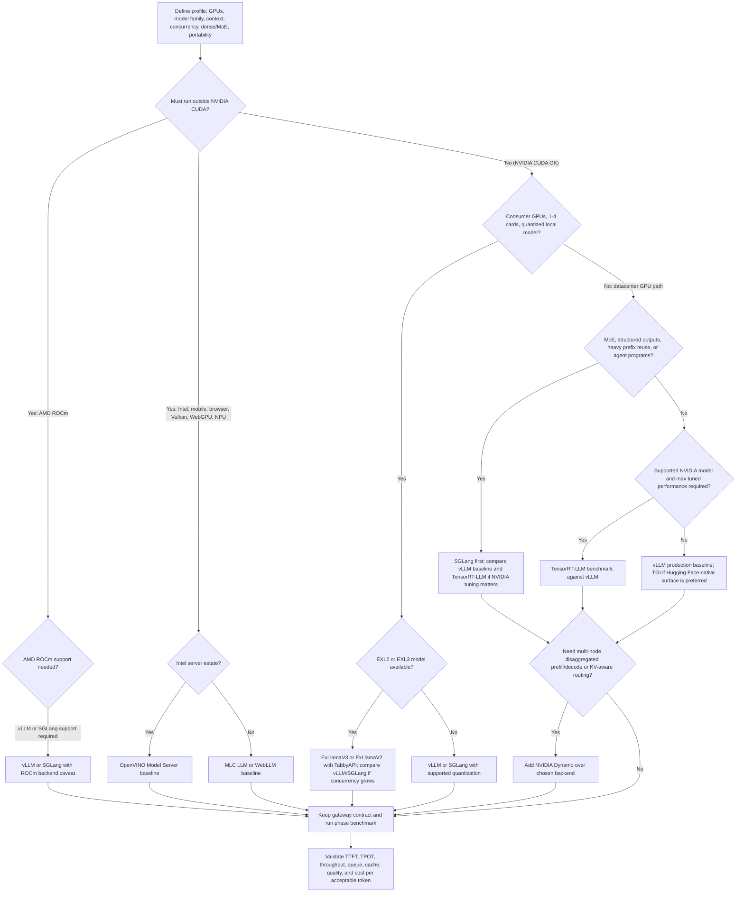

> **Complexity**: `[COMPLEX]`
>
> **Time to Complete**: 3-4 hours
>
> **Prerequisites**: [GPU Memory Hierarchy and Bandwidth Math for LLM Inference](module-1.6-memory-bandwidth-math/), basic LLM prefill/decode vocabulary, and familiarity with HTTP model-serving APIs

---

## Learning Outcomes

- **Map** ExLlamaV2, ExLlamaV3, vLLM, SGLang, TensorRT-LLM, NVIDIA Dynamo, TGI, and LMDeploy to their target hardware tier and workload class.
- **Select** an engine for a profile that specifies GPU count, model family, context length, concurrency, dense versus MoE architecture, and NVIDIA-only versus portable requirements.
- **Diagnose** the production failure modes that justify rejecting Ollama as a serving engine: no continuous batching, no concurrency safety, a blocking request model, and no observability.
- **Plan** an upgrade path from Ollama or llama.cpp to a production engine while preserving the application contract through an OpenAI-compatible gateway.
- **Compare** engine maturity across deployment surface, observability, quantization support, model coverage, and operational cost.

## Why This Module Matters

Hypothetical scenario: your team has a useful internal assistant running on a workstation. The prototype uses Ollama because it was easy to install, the API was simple, and the first ten users were patient because the tool was clearly experimental. Then the product group asks for the same assistant behind a shared service. The prompt now includes a long policy document, three users hit the model at once, one request blocks another, and the GPU sits in a strange middle ground where it is expensive but not actually busy.

This is the point where "use vLLM" is helpful but incomplete. vLLM is often the right first production answer, but it is not the only production answer. SGLang may be better when the workload has structured outputs, repeated prompt prefixes, or large MoE routing pressure. TensorRT-LLM may be the NVIDIA-max path when the model is supported and the team can afford compilation, tuning, and a narrower hardware target. ExLlamaV2 and ExLlamaV3 may be the correct local CUDA answer for a two-card workstation serving a small group, while NVIDIA Dynamo is not an engine replacement so much as the orchestration layer above engines when prefill, decode, KV routing, and cluster scheduling become the actual problem.

For the historical angle on why architectural constraints around KV memory matter for infrastructure choices, see [Chapter 73: The Algorithmic Response](../../ai-history/ch-73-the-algorithmic-response/) in the AI-history sequence.

The previous module taught you to ask whether the workload is constrained by memory capacity, memory bandwidth, interconnect, or scheduler behavior before you buy hardware. This module turns that diagnosis into an engine decision. You will build a deterministic decision flow, compare the engines by their natural habitat, and learn how to migrate from a learner runtime without rewriting the application layer. The outcome is not a memorized ranking. The outcome is a design review habit: name the workload, name the hardware tier, name the failure mode, then choose the smallest production engine that solves that specific constraint.

## 1. Production Engine Selection Starts After Bandwidth Math

An inference engine is the operating system for token generation. It decides which requests enter the active batch, how KV cache memory is allocated, when prompt processing is interleaved with decode, which quantized kernels are legal for a model, and what metrics operators can inspect when the service misses its latency target. A model loader can make one prompt work. A production inference engine keeps many prompts working while preserving predictable latency, utilization, and recovery behavior.

That distinction matters because LLM inference has two phases with different bottlenecks. Prefill processes the prompt and builds the KV cache, so it can often use more compute parallelism. Decode generates one token at a time, so it frequently becomes memory-bandwidth limited. A production engine earns its keep by scheduling those phases, reusing cache where possible, avoiding memory fragmentation, and exposing enough telemetry to prove that the GPU is busy for the right reason rather than merely allocated.

The hardware profile narrows the engine list before model preference enters the conversation. A single consumer NVIDIA card running EXL2 or EXL3 quantized models is a different environment from an eight-H100 node serving BF16 or FP8 models. A portable edge deployment that must run on Intel CPU, integrated GPU, or NPU is different again. A cluster with separate prefill and decode pools is not just "more GPUs"; it is a distributed system with KV transfers, routing, worker health, queueing, and topology-aware scheduling.

Here is the mental model. The application should talk to a stable model gateway. The gateway should route to an engine-specific backend. The engine should own scheduling, cache management, and kernel selection. The GPU fleet should be replaceable behind that boundary. If your app code imports an engine-specific Python class directly in every business workflow, you have coupled product behavior to serving mechanics and made the next migration harder than it needed to be.

```text
            application code
                  |
                  v
        +-------------------+
        | model API gateway |
        | auth, quotas, SLO |
        +-------------------+
                  |
                  v
        +-------------------+
        | inference engine  |
        | batch, KV, kernel |
        +-------------------+
                  |
                  v
        +-------------------+
        | GPU or accelerator|
        | memory, fabric    |
        +-------------------+
```

Pause and predict: if an application currently calls `http://127.0.0.1:11434/api/chat` directly from five different services, what will be harder: changing the model name, or changing the serving engine? The engine change will be harder because every caller has learned Ollama-specific request behavior. A gateway boundary converts that problem into configuration, compatibility testing, and traffic migration rather than product-code archaeology.

The first production question is not "Which engine is fastest?" It is "Which engine is fastest for this workload on this hardware under this operational contract?" A batch document summarizer that can tolerate queueing wants aggregate throughput. A chat assistant wants low time per output token and stable tail latency. A structured extraction service wants constrained decoding that does not destroy throughput. A MoE model wants expert routing, expert placement, and communication overlap rather than a generic dense-model schedule.

The second production question is whether the engine has a deployment surface your team can operate. A single command is not automatically immature, and a Kubernetes deployment is not automatically mature. The issue is whether the surface exposes health checks, metrics, batching controls, model loading controls, version pinning, failure isolation, and rollback mechanics. A small team with one 4090 may be better served by TabbyAPI over ExLlamaV3 than by pretending to run a data-center stack. A platform team with hundreds of GPUs needs the opposite answer.

Cost sits underneath every branch. Continuous batching, paged KV cache, prefix reuse, and quantization are not only performance features; they are cost controls. They let the same hardware accept more useful tokens before another replica is needed. Cost spikes when the engine under-batches, when long prompts evict useful cache, when observability emits high-cardinality logs for every token, when cross-node KV traffic grows unexpectedly, or when an expensive HBM accelerator sits idle because the application sends only occasional batch-one requests.

## 2. Engine Families and Their Natural Hardware Homes

The production-tier landscape is easier to reason about when you stop treating all engines as substitutes. ExLlamaV2 and ExLlamaV3 are optimized for local CUDA inference on consumer NVIDIA hardware and quantized formats. vLLM and SGLang are general production engines that cover a broad range of open models and server workloads. TensorRT-LLM is the NVIDIA datacenter optimization path when you want deep integration with NVIDIA kernels, Triton, and tuned serving. NVIDIA Dynamo is the distributed orchestration layer above engines when routing and cluster behavior dominate. TGI, LMDeploy, MLC LLM, and OpenVINO cover important niches rather than forming one universal second tier.

| Engine | Natural hardware tier | Strong workload class | Production surface | Main caution |
|---|---|---|---|---|
| ExLlamaV2 | 1-2 consumer NVIDIA GPUs | EXL2 quantized local chat, small private services | Library plus TabbyAPI-style server | NVIDIA/CUDA centered, less mature fleet observability |
| ExLlamaV3 | 1-4 consumer NVIDIA GPUs | EXL3 quantized models, local OpenAI-compatible serving, emerging multimodal | TabbyAPI recommended server, dynamic batching | Fast-moving project, some features still explicitly missing |
| vLLM | NVIDIA, AMD, TPU, CPU-adjacent backends depending on support | Broad production default, OpenAI-compatible serving, PagedAttention | Server, metrics, Kubernetes production stack options | Model or feature support can lag cutting-edge architectures |
| SGLang | NVIDIA, AMD, Intel, TPU, and large GPU clusters depending on backend | Structured outputs, prefix reuse, MoE, disaggregated serving | Server, router/gateway, distributed features | More knobs, more value when workload uses its strengths |
| TensorRT-LLM | NVIDIA datacenter GPUs | NVIDIA-max performance for supported models and tuned deployments, including tensor and pipeline parallelism options | `trtllm-serve`, Triton backend, NGC-style workflow | Compilation, tuning, and NVIDIA-only assumptions |
| NVIDIA Dynamo | Multi-node GPU clusters | Disaggregated prefill/decode, KV-aware routing, dynamic worker scaling | Distributed runtime and orchestration framework | Adds distributed-system complexity; it is not a small-node default |
| TGI | NVIDIA and common Hugging Face deployment targets | Simple production serving for popular HF models | Launcher, tracing, Prometheus metrics, tensor parallelism | Less flexible than vLLM/SGLang for some newer optimization paths |
| LMDeploy | CUDA-focused and OpenMMLab ecosystem | TurboMind, persistent batch, VLM/InternLM-friendly serving | OpenAI-compatible server, metrics, quantization workflows | Model-specific support matrix matters |
| MLC LLM | Portable local and edge targets | WebGPU, Vulkan, iOS, Android, cross-platform local serving | REST, Python, JavaScript, mobile APIs | Compilation workflow and edge constraints differ from datacenter serving |
| OpenVINO Model Server | Intel CPU, GPU, and NPU paths | Intel estate, enterprise CPU/GPU/NPU serving, OpenAI-compatible endpoints | Model server with GenAI pipelines | NPU path uses stateful pipeline rather than continuous batching |

ExLlamaV2 is the classic consumer-CUDA specialist. Its README describes EXL2 as a quantization format that supports 2, 3, 4, 5, 6, and 8-bit weights, including mixed bitrates within the model. That matters because a 24 GB card cannot serve large dense models in FP16, but it can sometimes serve aggressive quantized variants that are useful for local chat, small private assistants, or evaluation. The design center is not a public multi-tenant service with rich autoscaling. The design center is making modern consumer NVIDIA GPUs do useful local inference with strong speed and tight VRAM budgets.

ExLlamaV3 keeps that consumer-CUDA center but pushes toward a broader engine shape. The project README describes a new EXL3 format based on QTIP (QTIP itself is a published quantization framework, arXiv:2406.11235), with flexible tensor-parallel and expert-parallel inference for consumer setups, continuous dynamic batching, speculative decoding, 2-8 bit cache quantization, multimodal support, and TabbyAPI as the recommended OpenAI-compatible server. It also lists missing items such as LoRA support and ROCm support. That combination is exactly how you should read a fast-moving specialist: impressive local capability, but production fit depends on whether your required model, adapters, hardware, and observability expectations match the current project surface.

vLLM is the broad production default because it combines a simple serving path with real scheduler and KV-cache machinery. The vLLM project describes PagedAttention, advanced scheduling, continuous batching, and a drop-in OpenAI-compatible API. The PagedAttention paper explains why this matters: naive KV cache management wastes memory through fragmentation and redundant duplication, which reduces batch size and throughput. vLLM's production metrics docs expose operational signals through a `/metrics` endpoint on the OpenAI-compatible API server, which is the difference between hoping the scheduler is healthy and actually graphing it.

SGLang is best understood as a runtime for structured language-model programs, not only as another chat server. The SGLang paper describes a frontend language plus runtime, with RadixAttention for KV-cache reuse and compressed finite state machines for faster structured-output decoding. Current SGLang docs emphasize RadixAttention, prefix caching, continuous batching, paged attention, structured outputs, quantization, multi-LoRA batching, and multiple parallelism modes. If your workload is agentic, JSON-heavy, few-shot-heavy, prefix-reuse-heavy, or MoE-heavy, SGLang belongs near the top of the shortlist.

TensorRT-LLM is the "pay the NVIDIA complexity tax for NVIDIA performance" branch. Its documentation describes in-flight batching, also called continuous or iteration-level batching, as a way to interleave context and generation phases for higher throughput. It also supports tensor and pipeline parallelism in multi-GPU deployments. The same documentation covers paged KV cache, chunked context, and INT8 or FP8 KV cache modes. The `trtllm-serve` workflow provides an OpenAI-compatible API and benchmark harnesses, while the Triton TensorRT-LLM backend exposes production deployment patterns such as inflight fused batching. This is powerful, but it is not the most portable or lowest-friction option.

NVIDIA Dynamo is different because it is not merely another model process. Dynamo's architecture docs describe a high-throughput, low-latency framework for generative and reasoning models in multi-node distributed environments, with support for TensorRT-LLM, vLLM, SGLang, and other backends. The key ideas are disaggregated prefill and decode, dynamic GPU scheduling, LLM-aware routing, accelerated transfer through NIXL, and KV cache offloading. Use Dynamo when the cluster is the hard part. Do not use it to make a single workstation feel more serious.

TGI remains valuable when the team wants a Hugging Face-native production serving experience. Its docs describe Text Generation Inference as a toolkit for deploying and serving LLMs with tracing, Prometheus metrics, tensor parallelism, token streaming, continuous batching, Flash Attention, Paged Attention, quantization options, and structured-output guidance. It is especially attractive when the deployment standard is already Hugging Face oriented and the model family is well-supported. It is less compelling when your workload specifically needs SGLang's structured-program runtime, vLLM's broad ecosystem, or TensorRT-LLM's NVIDIA-tuned path.

LMDeploy is a strong niche when TurboMind or the OpenMMLab ecosystem is a good fit. The LMDeploy docs describe persistent batch, also known as continuous batching in other projects, an extendable KV cache manager, blocked KV cache, dynamic split-and-fuse, tensor parallelism, and quantization support. That makes it a real serving candidate rather than a toy. The caution is support fit: model architecture, KV quantization, VLM support, and backend choice must be checked against the current support matrix before a design review treats it as interchangeable with vLLM or SGLang.

MLC LLM and OpenVINO represent the portability branch. MLC LLM describes itself as a machine-learning compiler and high-performance deployment engine with a unified MLCEngine across REST server, Python, JavaScript, iOS, Android, and web deployment. OpenVINO Model Server documents GenAI serving with continuous batching, paged attention, stateful and continuous-batching servable types, and OpenAI-compatible chat or completions APIs. These are not usually the first choices for a high-concurrency H100 service, but they matter when the production estate is CPU-heavy, Intel-heavy, browser-based, mobile, or edge constrained.

The practical map is therefore not a league table. If the profile says "two RTX cards, EXL3 quant, ten trusted users, local OpenAI-compatible API," ExLlamaV3 with TabbyAPI is defensible. If it says "H100 cluster, dense model, broad support, fast iteration," vLLM is a defensible first benchmark. If it says "DeepSeek-style MoE, expert imbalance, structured outputs, prefix reuse," SGLang deserves the first serious test. If it says "supported NVIDIA model, tuned datacenter deployment, Triton integration," TensorRT-LLM belongs in the benchmark. If it says "multi-node disaggregated prefill/decode with KV-aware routing," Dynamo enters above the engine.

Pause and choose: a team owns four RTX 4090 cards in one workstation, wants to serve a quantized 70B chat model to a dozen internal users, and has no Kubernetes team. Which branch should they test before renting H100s? A strong answer starts with ExLlamaV3 or ExLlamaV2 if the model is available in EXL3 or EXL2, then compares against vLLM only if concurrency and observability requirements exceed the local specialist's operational surface. Renting H100s may still win later, but it should not be the first assumption.

## 3. Why Ollama Stays Learner-Scale

Ollama is useful, and that is exactly why it becomes dangerous in production conversations. It provides a local REST API, easy model management, a friendly developer workflow, and enough compatibility for prototypes. The problem is that the features that make a tool pleasant on a laptop are not the same features that make a serving tier predictable under concurrent traffic. Production is not defined by whether one HTTP request returns a token stream. Production is defined by what happens when many requests compete, one request becomes long, a model reloads, the queue fills, and the operator needs to explain the latency graph.

The required rejection test is specific: do not use Ollama for production when the service needs continuous batching, concurrency safety, a non-blocking request model, and engine-level observability. Continuous batching means the scheduler can insert and remove requests at token-step boundaries so the GPU keeps useful work in flight. A blocking request model means a long generation can hold scarce execution slots while other requests wait behind it. Concurrency safety means admission control, resource isolation, predictable queue behavior, and SLO-aware limits rather than merely accepting multiple sockets. Observability means metrics for running requests, waiting requests, KV pressure, scheduler iteration size, token latency, and failures.

Ollama's own FAQ describes configurable concurrency through settings such as maximum loaded models, number of parallel requests per model, and maximum queue size. It also notes that parallel request processing increases context size by the number of parallel requests, which means memory demand scales with the concurrency setting. That is an important operational clue. A queue and a parallelism knob can be useful for a local service, but they do not equal the scheduler model of vLLM, SGLang, TensorRT-LLM, or TGI, where continuous batching and production metrics are first-class features.

The failure mode usually looks like under-batching and invisible queueing. One request enters decode and streams tokens. Another request arrives, but the runtime cannot continuously merge it into the active decode step in the way a production engine would. If parallelism is increased, memory usage grows because each parallel request expands context allocation. If the queue fills, clients see timeouts or rejections without the operator having the same scheduler-level metrics they would get from a production engine. The result is a service that looks cheap because it started quickly, then becomes expensive because nobody can tune it confidently.

The clean migration rule is to keep Ollama behind the same gateway contract you expect to use later. If the application calls an OpenAI-compatible `/v1/chat/completions` endpoint through a gateway, then the backend can move from Ollama to TGI, vLLM, SGLang, TensorRT-LLM, or ExLlamaV3 with less product-code churn. If the application depends directly on Ollama-specific endpoints, streaming quirks, model tags, or local lifecycle behavior, the migration becomes a rewrite disguised as an engine upgrade.

Use Ollama for learning, demos, quick local evaluation, privacy-sensitive personal tools, and early prompt exploration. Do not use it as the production serving answer when multiple users, SLOs, autoscaling, observability, and high utilization matter. That boundary is not a criticism of Ollama. It is the same boundary that separates SQLite on a laptop from a production database cluster: the developer experience is excellent, but the operational contract is different.

Here is a practical rejection checklist. If any line is mandatory, pick a production engine instead of arguing that the prototype worked yesterday.

| Requirement | Why Ollama is the wrong production default | Production engine capability to require |
|---|---|---|
| Continuous batching | Requests are not scheduled as token-step batch members in the same way as production engines | vLLM, SGLang, TensorRT-LLM, TGI, or LMDeploy scheduler support |
| Concurrency safety | Parallel knobs do not provide full SLO-aware admission control, isolation, and scheduler metrics | Explicit queue limits, per-tenant policy, backpressure, and metrics |
| Non-blocking request model | Long generations can monopolize scarce execution capacity and push others into queueing | Iteration-level scheduling, chunked prefill, and tail-latency controls |
| Observability | Basic endpoint stats are not enough to debug KV pressure, scheduler occupancy, or token latency | Prometheus or OpenTelemetry metrics with request, queue, and cache signals |
| Fleet operations | Local model lifecycle does not equal rolling deploy, rollback, autoscaling, or canary rollout | Server images, health checks, deployment manifests, and version pinning |

Exercise scenario: you are asked to "just put the Ollama box behind Nginx" because it already has the model loaded. The correct response is not a lecture about fashionable tools. Ask for the SLO, the expected concurrent users, the longest prompt, the longest output, the required metrics, and the rollback plan. If those answers require production behavior, the engine must change even if the model and prompt stay the same.

## 4. Upgrade Without Rewriting the Application Layer

The easiest engine migration is the one you prepared before you needed it. Put a small gateway in front of the runtime, and make the application depend on the gateway contract rather than the engine contract. The gateway can be a dedicated API service, an internal reverse proxy with policy, or a model-router component. The important part is that it owns authentication, request shape, model aliases, tenant quotas, timeouts, retries, and the mapping from product names to backend engines.

OpenAI-compatible APIs are useful here because many production engines expose them. vLLM advertises a drop-in OpenAI-compatible API. TensorRT-LLM's `trtllm-serve` provides an OpenAI-compatible server. TGI, MLC LLM, TabbyAPI for ExLlama, and LMDeploy all provide compatible or near-compatible serving paths for common chat and completion workflows. Compatibility is not perfect, especially around tool calling, structured outputs, streaming, log probabilities, and model-specific parameters, but it gives you a stable migration seam.

The first migration step is inventory, not deployment. Record the current model, quantization, prompt lengths, output lengths, concurrency, client timeout, streaming behavior, and response schema. Then classify the workload using the bandwidth lens from the previous module: decode-heavy, prefill-heavy, long-context, structured-output-heavy, MoE-heavy, capacity-limited, or portability-limited. Only after that should you pick a candidate engine. Otherwise you risk replacing a simple runtime with a complex runtime that solves the wrong problem.

The second step is to preserve model aliases. The product should ask for `support-assistant-prod`, not `Qwen3-32B-AWQ-on-node-seven`. The gateway maps aliases to concrete engines and models. During migration, the alias can send one percent of traffic to vLLM, SGLang, or TensorRT-LLM while the rest remains on the old backend. For internal tools, the same pattern lets power users compare engines without teaching every caller a new endpoint.

```yaml
models:
  support-assistant-prod:
    contract: openai-chat
    default_timeout_seconds: 90
    backends:
      - name: current-ollama-dev
        weight: 0
        base_url: http://127.0.0.1:11434
        notes: learner runtime retained only for rollback drills
      - name: vllm-h100-a
        weight: 90
        base_url: http://127.0.0.1:8000/v1
        required_metrics:
          - time_to_first_token
          - time_per_output_token
          - waiting_requests
          - kv_cache_usage
      - name: sglang-structured-b
        weight: 10
        base_url: http://127.0.0.1:31000/v1
        required_metrics:
          - constrained_decode_latency
          - prefix_cache_hit_rate
          - running_requests
          - queue_depth
```

The third step is a compatibility test suite. Send the same prompts, tool-call requests, streaming requests, JSON-schema requests, timeout cases, and long-context cases to every candidate backend. Record response validity and latency separately. A backend that returns valid JSON slowly may still be useful for an offline extraction job. A backend that returns fast but malformed structured output may be unacceptable for an agent that calls tools without human review.

```bash
.venv/bin/python - <<'PY'
profiles = [
    {
        "name": "consumer_cuda_private_chat",
        "gpus": "2 x RTX 4090",
        "model": "70B quantized",
        "context": 8192,
        "concurrency": 8,
        "structured": False,
        "moe": False,
        "portable": False,
    },
    {
        "name": "h100_structured_extraction",
        "gpus": "8 x H100",
        "model": "32B dense",
        "context": 32768,
        "concurrency": 128,
        "structured": True,
        "moe": False,
        "portable": False,
    },
]

for profile in profiles:
    if profile["portable"]:
        engine = "MLC LLM or OpenVINO"
    elif "RTX" in profile["gpus"] and "quantized" in profile["model"]:
        engine = "ExLlamaV3 first, then vLLM or SGLang if serving needs exceed TabbyAPI"
    elif profile["structured"] or profile["moe"]:
        engine = "SGLang first, with vLLM as baseline and TensorRT-LLM if NVIDIA tuning is required"
    else:
        engine = "vLLM baseline, TensorRT-LLM benchmark if NVIDIA-only performance matters"
    print(f"{profile['name']}: {engine}")
PY
```

Pause and predict: why does the helper return "SGLang first" for structured extraction even though vLLM may be the default production engine elsewhere? The answer is that structured-output decoding changes the bottleneck. A runtime designed around language-model programs and constrained decoding may reduce retries, parsing failures, and latency variance even if a generic chat benchmark looks similar.

The fourth step is benchmarking by phase. Measure time to first token, time per output token, aggregate input tokens per second, aggregate output tokens per second, queue delay, cache hit rate, GPU memory usage, and error rate. Do not collapse them into one "tokens per second" number. A migration can improve aggregate throughput while harming interactive latency, or improve JSON validity while adding acceptable latency. Production selection is a multi-objective decision, so the benchmark table must preserve the objectives.

The fifth step is an exit plan. Define what evidence will make you stop tuning a candidate. For example, if TensorRT-LLM misses the model coverage requirement after two build attempts, move on. If ExLlamaV3 cannot expose the metrics required by the shared-service SLO, keep it for private local use. If vLLM meets latency but structured output retries are high, test SGLang before adding application-side parsing hacks. Exit criteria prevent engine selection from turning into sunk-cost debugging.

## 5. Maturity, Observability, Quantization, and Cost Tradeoffs

Production maturity has several dimensions, and teams often over-focus on the one they can see in a benchmark chart. Throughput is important, but it is only one dimension. Deployment surface tells you how the engine rolls forward and back. Observability tells you whether you can debug queueing, cache pressure, and tail latency. Quantization support tells you whether the model fits and whether the kernels stay efficient. Model coverage tells you whether the next model family will be blocked by engine support. Cost tells you whether the answer still makes sense at realistic utilization.

| Engine | Deployment surface | Observability surface | Quantization fit | Best maturity signal |
|---|---|---|---|---|
| vLLM | OpenAI-compatible server, Docker, production stack integrations | `/metrics` endpoint, scheduler and cache metrics | Broad support including common weight and KV options | Fast baseline for many open models with real serving controls |
| SGLang | Server, router/gateway, distributed serving features | Runtime metrics and router-level visibility depending on deployment | FP4, FP8, INT4, AWQ, GPTQ, multi-LoRA paths in docs | Strong structured-output, prefix-reuse, and MoE story |
| TensorRT-LLM | `trtllm-serve`, Triton backend, NGC workflow | NVIDIA serving and Triton ecosystem metrics | FP8, INT8, INT4, KV cache modes for supported paths | Highest value when model support and NVIDIA tuning align |
| Dynamo | Distributed orchestration over engines | Cluster events, routing, KV placement, worker signals | Backend-dependent because Dynamo orchestrates engines | Useful when prefill/decode separation and KV-aware routing dominate |
| TGI | Hugging Face launcher and production server | OpenTelemetry tracing and Prometheus metrics | bitsandbytes, GPTQ, and common HF model paths | Good Hugging Face-native production default |
| ExLlamaV3 | Library plus TabbyAPI server | Depends on server layer and local instrumentation | EXL3 weights, 2-8 bit cache quantization | Strong local CUDA specialist for quantized consumer GPU service |
| LMDeploy | OpenAI-compatible server, TurboMind, PyTorch engine | Production metrics in LMDeploy docs | Weight-only, KV quantization, AWQ/GPTQ-oriented workflows | Strong when supported model family matches TurboMind/PyTorch backend |
| OpenVINO | Model server and GenAI pipelines | Model-server operational surface | Intel-oriented optimized precision paths | Strong when Intel CPU/GPU/NPU estate is the deployment constraint |

The cost lens starts with GPU type, but it does not end there. A consumer card can be cheap per hour if you own it and the workload is modest, but it can be expensive per useful token if the service is under-batched, unobservable, and constantly restarted by hand. A rented H100 can be expensive per hour but cheaper per acceptable token if continuous batching and high memory bandwidth let one replica handle the traffic that would otherwise require several weaker machines. A cluster stack can be wasteful if it adds operators and networking before the single-node profile is understood.

Quantization changes both cost and risk. EXL2 and EXL3 are powerful because they target tight VRAM budgets on consumer GPUs. TensorRT-LLM FP8 or INT8 paths can be powerful because they align with datacenter NVIDIA hardware and optimized kernels. TGI, vLLM, SGLang, LMDeploy, MLC LLM, and OpenVINO all have their own quantization support boundaries. The key production habit is to test quality, latency, and failure behavior together. A quantization format that fits the model but breaks tool calling or structured extraction is not a successful production optimization.

MoE models add another maturity dimension because the hard part is not only fitting weights. Tokens route to experts, experts may be imbalanced, and communication can dominate when expert parallelism crosses devices. SGLang's expert-parallelism docs describe load balancing through EPLB and overlap techniques that hide communication behind computation. Dynamo's architecture emphasizes LLM-aware routing and KV-aware placement at cluster scale. If the model is MoE, the decision flow must ask about expert placement and routing metrics, not only tensor parallel size.

Observability should be treated as a feature requirement. For vLLM, production metrics through `/metrics` are part of the operational contract. For TGI, the docs call out OpenTelemetry tracing and Prometheus metrics. For TensorRT-LLM, the surrounding NVIDIA and Triton ecosystem matters. For ExLlama-based local serving, you may need to add gateway metrics, GPU exporter metrics, and careful server instrumentation to compensate for a smaller production surface. If the team cannot answer "how many requests are waiting, how much KV cache is used, and which phase dominates latency," the engine is not ready for shared production traffic.

Cost spikes often hide in the spaces between engines. Long prompts can raise TTFT and cache pressure. Structured-output retries can double work while dashboards show only successful requests. Multi-GPU tensor parallelism can add interconnect overhead that makes more GPUs look slower for interactive latency. Dynamo-style disaggregation can improve throughput at scale, but it can also introduce KV transfer bottlenecks if topology and transfer libraries are not tuned. Metrics must include the queue, the cache, the fabric, and the application-visible latency, not only GPU utilization.

## 6. Worked Example: Defend an Engine Shortlist

Imagine a design review with three proposed services. The first is a private engineering assistant on two consumer NVIDIA cards. The second is a document extraction service on H100s that must return valid JSON for every accepted request. The third is an enterprise internal chatbot in an Intel-heavy environment where the platform team already operates model servers beside other CPU and GPU workloads. A weak review asks which engine the loudest engineer prefers. A strong review asks which constraint is decisive before any engine name is allowed on the whiteboard.

For the private engineering assistant, the decisive constraint is local CUDA capacity and quantized model availability. If the team already has a 70B EXL3 model that fits across the workstation, ExLlamaV3 is a serious first candidate because it is built for that world. The benchmark should still include a vLLM or SGLang comparison if the service is expected to grow beyond trusted users, but the initial design does not need a cluster scheduler. The rejection metric is not only raw speed. Reject the local specialist if the service cannot expose the metrics, concurrency limits, and failure behavior that the shared users require.

For the document extraction service, the decisive constraint is structured output under concurrency. A malformed response is not a small inconvenience if downstream code files an incorrect ticket, calls a tool with missing fields, or silently drops evidence. SGLang deserves the first benchmark because its runtime and docs explicitly target structured outputs and language-model programs. vLLM remains a strong baseline, and TensorRT-LLM may become relevant if the team needs NVIDIA-tuned performance after validating schema behavior. The rejection metric should include JSON-schema validity, retry rate, TTFT, TPOT, and queue delay under realistic long prompts.

For the Intel-heavy enterprise chatbot, the decisive constraint is portability and operational fit. If the platform team must use Intel CPU, GPU, or NPU capacity that is already purchased and monitored, OpenVINO Model Server belongs in the first test even if a CUDA benchmark somewhere looks faster. MLC LLM becomes the comparison when portability extends to browser, mobile, Vulkan, or WebGPU use. The benchmark must be honest about target devices: an NPU stateful path and a CPU or GPU continuous-batching path are different serving behaviors, so the team should not average them into one generic "OpenVINO" result.

The next design-review move is to separate "first engine" from "fallback engine." A first engine is the one most aligned with the profile. A fallback engine is the next rational experiment if the first engine misses a required metric. This prevents false commitment. ExLlamaV3 first does not mean ExLlamaV3 forever. SGLang first does not mean vLLM is wrong. OpenVINO first does not mean CUDA is irrelevant. It means the team is testing the most profile-specific hypothesis before spending time on broader or more complex alternatives.

Every shortlist also needs a "do not test yet" column. Do not test Dynamo for the two-card workstation because there is no multi-node routing problem. Do not test TensorRT-LLM first for the Intel estate because the hardware requirement excludes the main value proposition. Do not keep Ollama in the production shortlist because the required production failure modes are already known. Saying "not yet" is a useful engineering act because it protects time, cloud budget, and review attention from options that are impressive but mismatched.

Finally, write the metric that would change the decision. For the workstation, the decision changes if ExLlamaV3 queueing becomes unacceptable at the required concurrency or if the selected quantization fails task quality. For the extraction service, the decision changes if SGLang does not improve structured validity or prefix reuse enough to justify its operational knobs. For the Intel estate, the decision changes if OpenVINO cannot support the required model feature or endpoint contract on the selected device. A defensible decision is one that includes its own falsification path.

This worked example is the mindset to carry into real deployments. Engine selection is not a brand contest and not a permanent identity. It is a sequence of testable claims: this hardware tier, this model family, this context length, this concurrency, this output contract, this observability requirement, and this cost boundary point to this first engine. If the measurements disagree, the same framework tells you where to move next.

## Patterns & Anti-Patterns

Good engine selection patterns make constraints explicit before tooling preference enters the room. The patterns below are written as design-review moves because production inference is rarely a pure library choice. You are choosing an operating model for tokens, memory, accelerators, and people.

| Pattern | When to Use It | Why It Works | Scaling Considerations |
|---|---|---|---|
| Gateway-first migration | Moving from Ollama, llama.cpp, or a notebook to shared serving | It preserves the application contract while backends change | Add auth, quotas, timeout policy, and model aliases before traffic grows |
| vLLM baseline benchmark | You need a broad production default for open models | It gives a strong PagedAttention and continuous-batching baseline quickly | Compare against SGLang or TensorRT-LLM when workload-specific needs appear |
| SGLang for structure or MoE | Outputs must follow schemas, prompts share prefixes, or expert routing matters | It targets language-model programs, constrained decoding, prefix reuse, and expert parallelism | Router, EP, and disaggregation settings need deliberate tuning |
| TensorRT-LLM for NVIDIA-max paths | The model is supported and the team can tune for NVIDIA datacenter GPUs | Compilation and optimized kernels can beat general-purpose paths | Build time, support matrix, and rollback strategy become part of operations |
| ExLlama for private CUDA service | Consumer NVIDIA cards and EXL2/EXL3 models match the requirement | It extracts strong local performance from tight VRAM budgets | Add gateway metrics and avoid pretending it is a large fleet platform |
| Dynamo after single-node proof | Prefill/decode separation, KV routing, or multi-node scheduling dominates | It orchestrates engines and workers around cluster-scale inference behavior | Network topology, KV transfer, and worker planning become first-order risks |

Anti-patterns are attractive because they compress a hard systems decision into one familiar label. The cost is that the omitted constraint usually returns later as a latency incident, a model-support gap, or a migration rewrite.

| Anti-pattern | What Goes Wrong | Better Alternative |
|---|---|---|
| "Use vLLM" as the whole decision | vLLM may be right, but structured outputs, MoE, NVIDIA tuning, or consumer quantization may need a different path | Use vLLM as a baseline, then test the branch that matches the workload |
| Production Ollama | No continuous batching, no concurrency safety, blocking request model, no observability | Keep Ollama for learning and move production traffic behind a gateway to a serving engine |
| GPU-count selection | More GPUs are added before interconnect, KV cache, or scheduler limits are known | Estimate memory, bandwidth, context, and communication before scaling out |
| Benchmarking only tokens per second | Aggregate throughput hides TTFT, TPOT, queue delay, retries, and malformed output | Report phase metrics and workload-specific success criteria |
| Choosing quantization by fit alone | The model loads but quality, tool calling, or kernel efficiency fails | Validate fit, quality, latency, and schema behavior as one gate |
| Adding Dynamo too early | A single-node serving problem becomes a distributed-systems problem | Prove a single-node or single-pool bottleneck before disaggregating |

The positive pattern behind every row is boring but reliable: isolate the application contract, benchmark the bottleneck, then choose the engine that removes that bottleneck with the least operational complexity. That rule will outlive today's engine rankings.

## Decision Framework

Use this decision flow as a deterministic first pass. It does not replace benchmarking, but it prevents the first benchmark from being random. Start with portability and hardware, then narrow by workload shape, then verify model support, deployment surface, and observability.



Now turn the flowchart into review questions. If the answer is consumer NVIDIA and quantized local models, ask whether EXL2 or EXL3 exists and whether TabbyAPI gives enough operational surface. If the answer is broad datacenter serving, ask whether vLLM meets the SLO before adding specialized complexity. If the answer is structured generation or MoE, ask whether SGLang's runtime features directly reduce retries, prefix recomputation, or expert imbalance. If the answer is NVIDIA-only maximum throughput, ask whether TensorRT-LLM supports the exact model and whether the team can own the build and tuning loop.

The final branch is cluster orchestration. Dynamo should enter when a single engine process is no longer the right unit of optimization. That usually means disaggregated prefill and decode, KV-aware routing, dynamic GPU scheduling, or multi-tier KV cache management. If you cannot yet show that prefill and decode have different scaling needs in your workload, Dynamo is probably early. If you can show that long prompts need separate prefill workers and decode workers need protected memory bandwidth, Dynamo becomes a serious candidate.

| Profile | First engine to test | Second engine to test | Why |
|---|---|---|---|
| Two RTX 4090s, 70B EXL3, eight internal users | ExLlamaV3 with TabbyAPI | vLLM | Consumer CUDA quantization is the natural fit, but vLLM tests production serving headroom |
| Eight H100s, Llama-class dense model, mixed chat traffic | vLLM | TensorRT-LLM | vLLM gives a fast baseline; TensorRT-LLM tests NVIDIA-tuned upside |
| H100 cluster, DeepSeek-style MoE, expert imbalance risk | SGLang | TensorRT-LLM or vLLM | Expert parallelism and load balancing are first-order concerns |
| Long-context RAG with repeated system and document prefixes | SGLang | vLLM | Prefix reuse and structured programs may reduce TTFT and retries |
| Hugging Face-native service with common model family | TGI | vLLM | TGI provides a simple production surface with tracing and metrics |
| Intel CPU/GPU estate with enterprise model server requirements | OpenVINO Model Server | MLC LLM | Hardware estate and deployment standards dominate raw CUDA performance |
| Browser or mobile local inference | MLC LLM or WebLLM | OpenVINO where Intel edge applies | Portability is the hard requirement |
| Multi-node prefill/decode separation | Dynamo over vLLM/SGLang/TensorRT-LLM | Single-engine baseline retained | Cluster routing and KV transfer are now the bottleneck |

The decision is complete only after you attach metrics. A selected engine without a metric plan is a preference. A selected engine with TTFT, TPOT, throughput, queue depth, cache usage, structured-output validity, model quality, and cost per acceptable token is an engineering decision.

## Did You Know?

- vLLM's PagedAttention paper reports 2-4x throughput improvement at the same latency level compared with earlier systems such as FasterTransformer and Orca, with larger gains for longer sequences, larger models, and more complex decoding.
- The ExLlamaV2 README reports that EXL2 can mix quantization levels to hit average bitrates between 2 and 8 bits per weight, and it describes a Llama2 70B test fitting on a single 24 GB GPU at 2.55 bits per weight with a 2048-token context.
- NVIDIA Dynamo's architecture docs describe it as engine agnostic, with support for TensorRT-LLM, vLLM, SGLang, and other backends, which is why it belongs above the engine layer in the decision tree.
- OpenVINO Model Server documentation distinguishes continuous-batching servables from stateful servables and notes that CPU and GPU devices default to continuous batching while NPU deployment uses the stateful type.

## Common Mistakes

| Mistake | Why It Happens | How to Fix It |
|---|---|---|
| Ollama in production | The prototype worked, so the team ignores no continuous batching, no concurrency safety, a blocking request model, and no observability | Keep Ollama for learner-scale use and migrate shared traffic behind a gateway to vLLM, SGLang, TGI, TensorRT-LLM, or another production engine |
| Choosing by benchmark winner | Public benchmarks use different prompts, output lengths, batch sizes, precision, and endpoints | Rebuild the benchmark with your prompt distribution, concurrency, schema requirements, and phase metrics |
| Treating Dynamo as an engine replacement | Dynamo appears next to engines in architecture diagrams, so teams expect it to load models by itself | Pick the backend engine first, then add Dynamo only when cluster routing, disaggregation, or KV placement is the problem |
| Ignoring model-family support | The engine looks strong in general but lacks support for the exact architecture, attention variant, adapter, or quantization | Check the support matrix and run a minimal compatibility test before performance tuning |
| Using TensorRT-LLM without owning the tuning loop | The team wants NVIDIA-max performance but underestimates build, config, benchmark, and rollback work | Assign ownership for engine builds, profiles, configs, artifacts, and fallback paths before selecting it |
| Picking ExLlama for a public multi-tenant fleet | Local CUDA speed is mistaken for fleet maturity | Use ExLlama for private consumer-GPU service, and add a gateway plus metrics if it graduates beyond trusted users |
| Collapsing observability to GPU utilization | The GPU looks busy while users still see slow first tokens or long queue delays | Track TTFT, TPOT, queue depth, running requests, KV cache usage, cache hit rate, and error classes |
| Optimizing fit before quality | Aggressive quantization makes the model fit but breaks reasoning, tool calls, or structured outputs | Gate quantization on task quality, schema validity, and latency together |

## Quiz

<details>
<summary>Scenario 1: Map each engine to hardware tier and workload class. Your lab has two RTX 4090 cards, a 70B EXL3 quant, eight trusted users, and no Kubernetes team. Which engine family should you test first?</summary>

Start with ExLlamaV3 through TabbyAPI, because the profile is consumer NVIDIA hardware, a quantized EXL3 model, and a small trusted user group. vLLM is a useful comparison if concurrency or operational requirements grow, but it is not automatically the first answer for this local CUDA setup. TensorRT-LLM and Dynamo would add datacenter and cluster complexity that the profile does not justify yet.
</details>

<details>
<summary>Scenario 2: Select an engine for a profile with eight H100 GPUs, a dense Llama-family model, mixed chat traffic, and a requirement for fast iteration. What is the first benchmark?</summary>

Use vLLM as the first benchmark because it provides a broad production baseline with PagedAttention, continuous batching, an OpenAI-compatible server, and production metrics. Then benchmark TensorRT-LLM if NVIDIA-only tuned performance is worth the extra build and configuration work. The decision should compare TTFT, TPOT, queue delay, output throughput, and cost per acceptable token rather than a single throughput number.
</details>

<details>
<summary>Scenario 3: Diagnose Ollama failure modes. A team wants to put an Ollama workstation behind a reverse proxy for twenty users. Which production risks must you name?</summary>

Name the specific serving failures: no continuous batching, no concurrency safety, a blocking request model, and no observability at the engine-scheduler level. Ollama may expose local APIs and configurable queue or parallel settings, but that is not the same as production admission control, token-step scheduling, and scheduler metrics. The fix is to put a gateway in front of a production engine and keep Ollama only as a development or rollback reference.
</details>

<details>
<summary>Scenario 4: Plan an upgrade path. The application currently calls an Ollama endpoint directly from several services. How do you migrate without rewriting the application layer?</summary>

Introduce a model gateway and move callers to a stable OpenAI-compatible contract before changing the backend engine. Create model aliases, record timeout and streaming expectations, and run compatibility tests for chat, tools, JSON schemas, long prompts, and errors. After that boundary exists, you can shift traffic from Ollama to vLLM, SGLang, TGI, TensorRT-LLM, or ExLlamaV3 by configuration and canary policy instead of scattered product-code edits.
</details>

<details>
<summary>Scenario 5: Compare engine maturity. A benchmark says LMDeploy, TGI, vLLM, and SGLang all meet median latency. What maturity dimensions decide the production choice?</summary>

Compare deployment surface, observability, quantization support, model-family coverage, structured-output behavior, and operator familiarity. If the team is Hugging Face-native and wants tracing plus Prometheus quickly, TGI may be attractive. If structured outputs or MoE routing matter, SGLang may beat a median-latency tie. If broad model support and simple production metrics matter most, vLLM may remain the safer baseline.
</details>

<details>
<summary>Scenario 6: Your workload is DeepSeek-style MoE on a multi-GPU cluster and latency spikes when expert traffic is imbalanced. Which engine branch should move up the list?</summary>

SGLang should move up because its expert-parallelism features and EPLB integration directly target MoE routing imbalance. TensorRT-LLM and vLLM can still be benchmarked, but the first hypothesis is not generic dense-model throughput. The team should inspect expert placement, dispatch and combine communication, overlap settings, and per-expert utilization rather than only GPU memory usage.
</details>

<details>
<summary>Scenario 7: A manager asks whether NVIDIA Dynamo should replace vLLM. How should you correct the framing?</summary>

Dynamo should be framed as orchestration above engines, not as a simple replacement for vLLM. It can coordinate backends such as vLLM, SGLang, and TensorRT-LLM when multi-node disaggregated serving, KV-aware routing, dynamic GPU scheduling, or cache offloading is required. If a single-node vLLM deployment has not yet been benchmarked and shown to hit a cluster-scale bottleneck, adding Dynamo is premature.
</details>

## Hands-On Exercise

Exercise scenario: you are the reviewer for three proposed inference deployments. Your job is to turn vague engine preferences into defensible decisions. You will classify each workload, choose a first and second benchmark engine, define a migration boundary, and write the metrics that would make you reject the first choice. You do not need GPUs for this exercise because the skill is design review, not speed testing.

Create a working note in your scratch directory, then use the decision flow from this module to fill it in. The profiles are intentionally different. Profile A is a two-card RTX workstation serving a quantized 70B local assistant to trusted users. Profile B is an H100 service for structured JSON extraction over long documents. Profile C is an Intel-heavy enterprise estate that wants an OpenAI-compatible endpoint for moderate internal traffic.

```bash
mkdir -p /tmp/kubedojo-engine-review
cat > /tmp/kubedojo-engine-review/profiles.json <<'JSON'
[
  {
    "name": "profile-a-consumer-cuda",
    "gpus": "2 x RTX 4090",
    "model": "70B EXL3 quantized",
    "context_tokens": 8192,
    "concurrency": 8,
    "structured_outputs": false,
    "moe": false,
    "portable_required": false
  },
  {
    "name": "profile-b-structured-h100",
    "gpus": "8 x H100",
    "model": "32B dense",
    "context_tokens": 32768,
    "concurrency": 128,
    "structured_outputs": true,
    "moe": false,
    "portable_required": false
  },
  {
    "name": "profile-c-intel-estate",
    "gpus": "Intel CPU/GPU/NPU estate",
    "model": "8B instruct",
    "context_tokens": 4096,
    "concurrency": 32,
    "structured_outputs": false,
    "moe": false,
    "portable_required": true
  }
]
JSON
```

**Task 1: Classify the workload shape.** For each profile, write whether the dominant decision is consumer quantization, structured-output serving, portability, MoE routing, NVIDIA-max tuning, or cluster orchestration. Do not name the engine first; name the constraint first.

<details>
<summary>Solution</summary>

Profile A is consumer quantization because the hardware is local RTX and the model is already EXL3 quantized. Profile B is structured-output serving on datacenter NVIDIA hardware because JSON validity, long context, and concurrency are the distinguishing constraints. Profile C is portability because the Intel estate determines the first branch before CUDA-specific engines can enter the conversation.
</details>

**Task 2: Select the first and second engine for each profile.** Use the decision framework, then write one sentence explaining what evidence would change your mind.

<details>
<summary>Solution</summary>

Profile A should test ExLlamaV3 with TabbyAPI first and vLLM second if serving needs exceed the local specialist's surface. Profile B should test SGLang first because structured outputs and long-context prefix behavior matter, then vLLM as the general baseline or TensorRT-LLM if NVIDIA tuning is a hard requirement. Profile C should test OpenVINO Model Server first when Intel operations are the deployment standard, with MLC LLM as the portability comparison if browser, mobile, or Vulkan-style deployment matters more.
</details>

**Task 3: Define the migration boundary.** Write a gateway contract with model alias, request timeout, required response format, and backend URL for the first selected engine. Keep the application unaware of the concrete engine.

<details>
<summary>Solution</summary>

The model alias should be product-facing, such as `internal-assistant-prod`, while the backend can point to a concrete engine endpoint. The timeout should reflect the user experience rather than the engine default. The response format should state whether plain chat, JSON schema, tools, or streaming is required. The backend URL should be owned by configuration so the team can canary a second engine without touching application code.
</details>

**Task 4: Write rejection metrics.** For each profile, define at least three measurements that would make you reject the first engine and move to the second.

<details>
<summary>Solution</summary>

Profile A might reject ExLlamaV3 if required metrics are unavailable, if concurrency creates unacceptable queueing, or if the selected EXL3 model fails quality checks. Profile B might reject SGLang if structured-output validity is not better than vLLM, if TPOT misses the SLO, or if prefix cache hit rate is low after prompt normalization. Profile C might reject OpenVINO if the chosen device path lacks the required model feature, if NPU stateful serving does not meet concurrency needs, or if the OpenAI-compatible endpoint cannot satisfy the application's tool or schema contract.
</details>

**Task 5: Add the Ollama production diagnosis.** If any proposal uses Ollama as the final production engine, write the rejection note you would put in a design review.

<details>
<summary>Solution</summary>

The rejection note should say that Ollama remains acceptable for development and learner-scale local inference, but it does not satisfy the production serving contract because the required failure modes are no continuous batching, no concurrency safety, a blocking request model, and no observability. The proposed fix is not to expose the Ollama box through a reverse proxy. The fix is to introduce a gateway and move production traffic to a serving engine with scheduler metrics and continuous batching.
</details>

Success criteria:

- [ ] Map each profile to a hardware tier and workload class before naming an engine.
- [ ] Select a first and second engine for each profile using the deterministic decision flow.
- [ ] Diagnose the Ollama production failure modes with the exact operational reasons.
- [ ] Plan an upgrade path that preserves the application contract through a gateway.
- [ ] Compare engine maturity by deployment surface, observability, quantization support, and cost.

## Sources

- [vLLM project overview](https://vllm.ai/)
- [Efficient Memory Management for Large Language Model Serving with PagedAttention](https://arxiv.org/abs/2309.06180)
- [vLLM production metrics documentation](https://docs.vllm.ai/en/v0.12.0/usage/metrics/)
- [vLLM automatic prefix caching design](https://docs.vllm.ai/en/latest/design/automatic_prefix_caching.html)
- [SGLang paper: Efficient Execution of Structured Language Model Programs](https://arxiv.org/abs/2312.07104)
- [SGLang documentation](https://docs.sglang.io/)
- [SGLang structured outputs documentation](https://docs.sglang.io/docs/advanced_features/structured_outputs)
- [SGLang expert parallelism documentation](https://docs.sglang.io/docs/advanced_features/expert_parallelism)
- [TensorRT-LLM GPT attention, in-flight batching, and KV cache documentation](https://nvidia.github.io/TensorRT-LLM/advanced/gpt-attention.html)
- [TensorRT-LLM trtllm-serve benchmarking documentation](https://nvidia.github.io/TensorRT-LLM/commands/trtllm-serve/run-benchmark-with-trtllm-serve.html)
- [NVIDIA Triton TensorRT-LLM backend documentation](https://docs.nvidia.com/deeplearning/triton-inference-server/user-guide/docs/tensorrtllm_backend/README.html)
- [NVIDIA Dynamo architecture documentation](https://docs.dynamo.nvidia.com/dynamo/v-0-9-0/design-docs/overall-architecture)
- [NVIDIA Dynamo disaggregated serving documentation](https://docs.nvidia.com/dynamo/dev/components/router/disaggregated-serving)
- [Hugging Face Text Generation Inference documentation](https://huggingface.co/docs/text-generation-inference/main/en/index)
- [ExLlamaV2 README](https://github.com/turboderp-org/exllamav2)
- [ExLlamaV3 README](https://github.com/turboderp-org/exllamav3)
- [ExLlamaV3 releases](https://github.com/turboderp-org/exllamav3/releases)
- [LMDeploy documentation](https://lmdeploy.readthedocs.io/)
- [LMDeploy TurboMind architecture documentation](https://lmdeploy.readthedocs.io/en/v0.4.0/inference/turbomind.html)
- [MLC LLM project documentation](https://llm.mlc.ai/)
- [OpenVINO Model Server efficient LLM serving documentation](https://docs.openvino.ai/2025/model-server/ovms_docs_llm_reference.html)
- [Ollama concurrency FAQ](https://github.com/ollama/ollama/blob/main/docs/faq.mdx)

## Next Module

Continue to [Benchmarking LLM Inference: TTFT, TPOT, and Workload-Aware Load Shaping](module-1.8-inference-benchmarking/) to measure the chosen engine against the workload classification you arrived at in this module.
