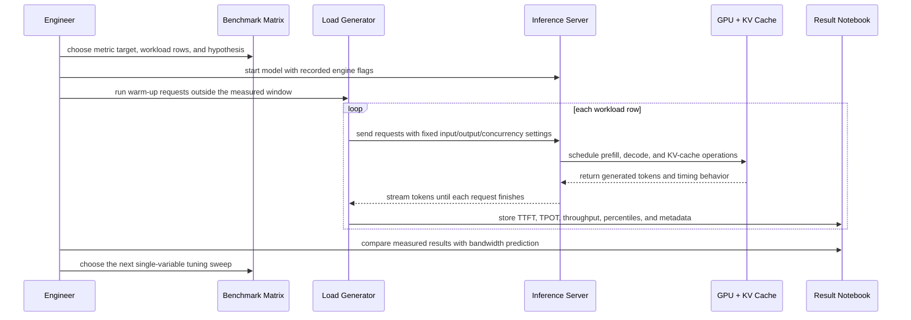
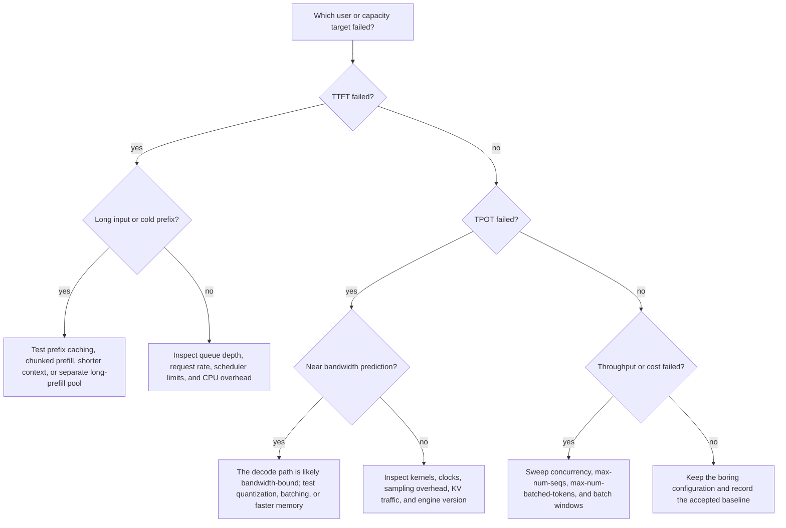

> **Complexity**: `[COMPLEX]`
>
> **Time to Complete**: 3-4 hours
>
> **Prerequisites**: [GPU Memory Hierarchy and Bandwidth Math for LLM Inference](module-1.6-memory-bandwidth-math/), [Production Inference Engines](module-1.7-production-inference-engines/), and the prefill/decode overview in [High-Performance LLM Inference: vLLM and sglang](module-1.3-vllm-sglang-inference/)

---

## Learning Outcomes

- **Diagnose** LLM serving latency by defining TTFT, TPOT, p50, p95, p99 latency, throughput, prompt token rate, and output token rate, then matching each metric to the user or capacity question it answers.
- **Design** a workload-aware benchmark matrix that varies prompt length, output length, concurrency, request rate, and prefix-cache reuse with vLLM `benchmarks/benchmark_serving.py` or the current `vllm bench serve` command.
- **Interpret** benchmark results to distinguish memory-bound decode, compute-bound prefill, scheduler saturation, cold-cache artifacts, and tail-latency failure on production hardware.
- **Tune** `max-num-seqs`, `max-num-batched-tokens`, `gpu-memory-utilization`, and prefix caching from measured evidence instead of copying default values.
- **Compare** observed TPOT and throughput against the bandwidth-math prediction from module 1.6, then decide whether the gap points to hardware limits, engine behavior, or workload shape.

## Why This Module Matters

Hypothetical scenario: your team has a working chat assistant on one GPU, and the demo feels fast with two engineers clicking around. The launch plan says the same node should handle a department of active users because the average request in the demo returned in under two seconds. On launch day, dashboards disagree with the demo: some users see a first token quickly but then watch output crawl, while others wait several seconds before the stream begins.

The mistake was not choosing the wrong inference engine. The mistake was measuring the wrong thing. An average end-to-end latency number hid the difference between time to first token, time per output token, prompt processing throughput, output-token throughput, and tail latency under concurrency. A single prompt shape hid the workload mix. A warm manual demo hid queueing, prefix-cache behavior, and the way long prompts interfere with active decode streams.

Benchmarking is the discipline that turns "the model feels slow" into a falsifiable diagnosis. You will define the metrics that matter, build a benchmark matrix that reflects real traffic, run a structured vLLM serving benchmark, and interpret the result against the bandwidth math you learned in module 1.6. The goal is not to crown one engine forever. The goal is to measure your stack in a way that tells you what to tune, what to buy, and what not to promise.

This module deliberately does not re-teach the full prefill and decode mechanics from module 1.3. You should already know that prompt processing and token generation stress the system differently. Here, the focus is measurement: which clocks to start, which percentiles to trust, which knobs to sweep, and how to connect the numbers back to memory bandwidth, compute saturation, cache reuse, and cost per useful token.

## 1. Metrics That Map to User Pain and Capacity Planning

The first benchmarking habit is to name the question before naming the metric. A product manager asking whether chat feels responsive is not asking the same question as a platform engineer sizing GPUs for overnight summarization. A single "latency" number cannot answer both questions. LLM serving has a visible front edge, a streaming middle, and a final completion boundary, so each part needs a separate measurement.

Time to first token, usually written TTFT, measures how long the user waits before seeing the first generated token. It includes request queueing, tokenization, prompt prefill, scheduler delay, and generation of the first output token. TTFT is the metric that decides whether a streaming interface feels alive. A low output-token rate can still feel tolerable if TTFT is quick, but a high TTFT makes the product feel frozen even when the rest of the response streams quickly.

Time per output token, usually written TPOT or inter-token latency, measures the spacing between generated tokens after the first token appears. TPOT is the user's reading-speed metric. If TTFT is the restaurant host greeting you, TPOT is the pace at which plates arrive at the table. A system with good TTFT and poor TPOT starts confidently, then visibly stalls through the answer. A system with poor TTFT and good TPOT waits too long, then catches up after the user has already lost patience.

End-to-end latency measures the time from request submission to final token received. It matters for non-streaming APIs, offline jobs, and batch workflows where the user or downstream system only cares when the whole answer is done. It is less helpful by itself for streaming chat because it blends the first-token wait with the decode stream. Two responses can have the same end-to-end latency and feel completely different if one starts immediately and drips slowly while the other waits, then streams quickly.

Percentiles describe the distribution instead of the average. A p50 value is the median request, p95 is slower than ninety-five percent of requests, and p99 is slower than ninety-nine percent of requests. Tail latency matters because LLM serving stacks often degrade unevenly: a few long prompts, cache misses, or queue bursts can punish a minority of users while the average looks healthy. If your dashboard only shows mean latency, it can call an incident "normal" while support tickets tell a different story.

Throughput is also not one number. Request throughput measures completed requests per second. Output token throughput measures generated tokens per second across the system. Prompt token throughput measures input tokens processed per second during prefill. Total token throughput adds prompt and output tokens, which can be useful for engine internals but dangerous for product planning. A benchmark with huge prompts and one-token answers can report impressive total tokens per second while being irrelevant to chat decode capacity.

The cleanest benchmark reports TTFT, TPOT, end-to-end latency, request throughput, prompt token throughput, output token throughput, and the percentile view for the user-facing metrics. It also records the workload shape: input length, output length, concurrency, request rate, cache policy, sampling settings, model, precision, hardware, driver, engine version, and serving flags. Metrics without workload metadata are like weather reports without a location.

Here is the mental model to keep nearby while reading benchmark output. TTFT is dominated by queueing and prefill work, especially for long prompts or cold prefixes. TPOT is dominated by decode scheduling, memory bandwidth, KV-cache traffic, and batching behavior. End-to-end latency is the sum of the parts and should be interpreted after the parts, not before them. Throughput is the capacity view, but it only means something when the workload shape is explicit.

```text
Streaming request timeline

client sends request
        |
        | queueing + tokenization + prefill + first decode step
        v
first token visible  <--- TTFT ends here
        |
        | token gap, token gap, token gap
        v
last token visible   <--- end-to-end latency ends here

TPOT describes the average gap between generated tokens after the first token.
```

Pause and predict: if a benchmark improves request throughput by batching more aggressively but p99 TTFT doubles, did the system get better? The answer depends on the product. For offline summarization, the change may be excellent. For a live assistant, it may be a regression because the slowest visible starts are now worse.

The cost lens begins here because every metric creates a different cost target. Interactive chat often pays for low TTFT and acceptable p95 TPOT, even if that leaves some aggregate throughput unused. Batch summarization often pays for output tokens per dollar, even if individual requests wait in a queue. Retrieval-augmented generation can pay heavily for prefill because repeated long context inflates prompt tokens. If you do not choose the metric first, you cannot choose the cheapest acceptable configuration.

The most common mistake is to chase maximum tokens per second and call it capacity. That number is useful only when it is output-token throughput for the workload you actually serve, at the latency percentiles your users can tolerate. A GPU can produce a high aggregate token rate under a synthetic batch while still giving poor p99 TTFT for bursty chat. Capacity planning starts with the user contract, not the peak benchmark screenshot.

## 2. Design the Workload Before You Run the Tool

A benchmark is a controlled argument with your infrastructure. The argument is weak when every request has the same prompt length, the same output length, the same request timing, and no cache variation. Real LLM traffic is shaped by short follow-up questions, long pasted documents, system prompts, tool traces, multi-turn context, and uneven bursts. A useful benchmark does not copy production perfectly, but it should preserve the workload features that change bottlenecks.

Start with input length and output length because they stress different parts of the serving stack. Short prompts with long outputs emphasize decode, so TPOT and output-token throughput become central. Long prompts with short outputs emphasize prefill, so TTFT and prompt-token throughput become central. Long prompts with long outputs stress both phases and grow KV cache over the request lifetime. A single prompt-length sweep misses those regime changes.

Concurrency and request rate are separate knobs. Concurrency says how many requests are active at once. Request rate says how quickly new requests arrive. Infinite request rate with a fixed prompt count can be useful for finding saturation, but it is not the same as a user population arriving over time. A steady request rate can reveal queueing and tail-latency behavior that a closed, all-at-once benchmark hides.

Prefix-cache reuse deserves its own row in the matrix. Many chat, agent, and retrieval systems reuse large system prompts, tool instructions, few-shot examples, or document prefixes. If the benchmark always uses random prompts, it may understate production prefix-cache benefits. If the benchmark repeats a single warm prefix, it may overstate them. A fair matrix includes cold-prefix and warm-prefix cases, then reports the prefix policy instead of burying it in the command history.

Sampling settings also matter because they can add CPU work, synchronization, and output-length variance. A deterministic benchmark with fixed output length is excellent for isolating engine behavior. A stochastic benchmark with realistic stop conditions is better for product realism. Use both when stakes are high: deterministic sweeps to find bottlenecks, then realistic traffic replay to validate the operational conclusion.

The benchmark methodology should look like an experiment, not a one-line command. Write a hypothesis, warm the server, run a baseline, change one variable, collect metrics, compare against the hypothesis, and only then move to the next variable. If you change concurrency, prompt length, cache policy, and engine flags at the same time, the result may be interesting, but it will not tell you why performance changed.



The matrix below is a practical starting point for one model on one GPU. It is small enough to run in an afternoon, but it covers the regimes that usually mislead teams. Treat it as a scaffold, then replace the numbers with your real prompt distribution, expected output length, and concurrency target. The exact values matter less than the discipline of testing short, long, cold, warm, low-concurrency, and saturated cases separately.

| Row | Input tokens | Output tokens | Concurrency | Request rate | Prefix reuse | Primary question |
|---|---:|---:|---:|---:|---|---|
| A | 256 | 128 | 1 | 1 req/s | cold | What is the single-user interactive baseline? |
| B | 2048 | 128 | 1 | 1 req/s | cold | How much does long prefill raise TTFT? |
| C | 256 | 1024 | 1 | 1 req/s | cold | What is the single-stream decode speed? |
| D | 2048 | 1024 | 8 | unlimited | cold | Where does the mixed workload saturate? |
| E | 4096 | 256 | 16 | steady | warm shared prefix | How much does prefix reuse reduce TTFT? |
| F | production p50 | production p90 | target | production estimate | mixed | Does the synthetic conclusion survive realism? |

Before running this, what output do you expect from row C compared with row B? Row B should mostly expose TTFT pressure from longer prefill, while row C should expose TPOT and output-token throughput because the answer is longer. If those expectations are reversed, the benchmark is teaching you that queueing, cache behavior, or engine scheduling is more important than the simple phase model for this configuration.

Good workload design includes a stopping rule. Decide in advance what would make a configuration acceptable, such as p95 TTFT under one second, p95 TPOT under forty milliseconds, p99 request latency under a product-specific limit, and cost below a target per million output tokens. Without a stopping rule, benchmark work expands into endless tuning. With a stopping rule, you can say "good enough," save the flags, and move to reliability testing.

After synthetic rows expose the shape of the bottleneck, add a small production-trace replay if you can do it safely. The replay does not need user content; tokenized length buckets, output-length targets, arrival timing, and prefix categories are often enough. This protects privacy while preserving the properties that change serving behavior. A trace replay can reveal that your synthetic matrix missed burstiness, a dominant system prompt, a frequent short follow-up pattern, or a rare long-document path that creates most p99 pain.

Keep personally identifiable data and proprietary prompts out of benchmark fixtures unless your organization has a reviewed process for handling them. You can usually build a representative benchmark from histograms, redacted prompt templates, and synthetic payloads that match token lengths. The benchmark's job is to stress the inference stack, not to preserve customer text. Privacy-preserving workload modeling is also easier to share across teams, which makes independent review and later regression testing much more practical.

The cost dimension should be recorded in the same table as performance. Add hardware rental price or amortized cost, estimated watts if you own the node, and output tokens per dollar for each accepted row. A configuration that wins raw throughput can lose cost if it requires expensive headroom to keep p99 stable. A cheaper configuration can win when it meets the user-facing percentile target with fewer idle resources.

## 3. Run a Structured vLLM Serving Benchmark

vLLM's current documentation points users to `vllm bench serve` for online serving throughput, while the historical `benchmarks/benchmark_serving.py` file in the repository now acts as a compatibility pointer to the CLI. The issue for this module explicitly asks for the source-tree script invocation because many teams still have runbooks, older branches, or copied commands using that path. In a new setup, prefer the CLI; in a source checkout, keep the old path visible so you can recognize both forms.

The server must already be running before the client benchmark starts. That separation matters because model loading is not serving latency, and including it in every run makes the data useless for tuning. Start the server once, wait until it is ready, send warm-up requests that are not counted, then run the measured workload rows. Record the server command beside every result because engine flags define the experiment.

```bash
vllm serve meta-llama/Meta-Llama-3.1-8B-Instruct \
  --host 127.0.0.1 \
  --port 8000 \
  --max-model-len 8192 \
  --gpu-memory-utilization 0.90 \
  --max-num-seqs 64 \
  --max-num-batched-tokens 8192 \
  --enable-prefix-caching
```

Use a small warm-up before the measured run. Warm-up reduces noise from one-time initialization, CUDA graph capture, tokenizer setup, memory allocation, and cache population. It does not mean you should hide cold-cache behavior forever. It means you should measure cold and warm cases deliberately instead of mixing them accidentally in the same row.

```bash
vllm bench serve \
  --backend vllm \
  --base-url http://127.0.0.1:8000 \
  --endpoint /v1/completions \
  --model meta-llama/Meta-Llama-3.1-8B-Instruct \
  --dataset-name random \
  --num-prompts 16 \
  --request-rate 1 \
  --random-input-len 256 \
  --random-output-len 64 \
  --percentile-metrics ttft,tpot,itl \
  --metric-percentiles 50,95,99
```

Now run the same shape with the source-tree compatibility path when your environment is a vLLM checkout. The command below assumes you are one directory above the cloned `vllm` repository and that its virtual environment is already installed. If your repository layout differs, keep the arguments and adjust only the executable path. The benchmark target remains the running server at `127.0.0.1`.

```bash
.venv/bin/python vllm/benchmarks/benchmark_serving.py \
  --backend vllm \
  --base-url http://127.0.0.1:8000 \
  --endpoint /v1/completions \
  --model meta-llama/Meta-Llama-3.1-8B-Instruct \
  --dataset-name random \
  --num-prompts 64 \
  --request-rate inf \
  --max-concurrency 8 \
  --random-input-len 2048 \
  --random-output-len 256 \
  --random-prefix-len 0 \
  --percentile-metrics ttft,tpot,itl \
  --metric-percentiles 50,95,99 \
  --save-result \
  --result-dir results/inference-benchmarks \
  --result-filename llama31-8b-row-d.json
```

The command uses the random dataset because it lets you control input and output lengths without needing a private production trace. That is useful for isolating bottlenecks, but it is not a replacement for traffic replay. Random tokens do not reproduce conversation turns, retrieval context, function-call schemas, or stop-sequence behavior. Treat the random dataset as the wind tunnel and production replay as the road test.

Prefix-cache testing needs a separate run because the result is only meaningful when you know whether prefixes repeat. vLLM's benchmark options include random prefix length controls in recent versions, and SGLang exposes its own serving benchmark for parity testing. The exact flag names can change across releases, so pin the engine version in your notes and store the benchmark command with the result file. A benchmark without the version is not reproducible.

```bash
vllm bench serve \
  --backend vllm \
  --base-url http://127.0.0.1:8000 \
  --endpoint /v1/completions \
  --model meta-llama/Meta-Llama-3.1-8B-Instruct \
  --dataset-name random \
  --num-prompts 128 \
  --request-rate 4 \
  --max-concurrency 16 \
  --random-input-len 4096 \
  --random-output-len 256 \
  --random-prefix-len 2048 \
  --percentile-metrics ttft,tpot,itl \
  --metric-percentiles 50,95,99 \
  --save-result \
  --result-dir results/inference-benchmarks \
  --result-filename llama31-8b-prefix-warm.json
```

If you use another engine, keep the methodology and swap the client. SGLang documents `sglang.bench_serving` for online serving benchmarks with TTFT and TPOT-style metrics. NVIDIA GenAI-Perf can benchmark OpenAI-compatible and Triton/NIM-style endpoints and reports TTFT, inter-token latency, output-token throughput, and request throughput. Ray's LLMPerf is useful when you need concurrent API load testing across providers or deployments. The client can change; the matrix, metadata, and interpretation discipline should not.

Results should be stored as data, not screenshots. Save JSON or CSV output, store the exact command, capture engine logs, and write a one-paragraph hypothesis before each sweep. A simple directory layout is enough: one folder per model and hardware target, one result file per matrix row, and a small notes file that records the interpretation. Fancy dashboards can come later; reproducible evidence comes first.

Capture the negative context too. Record when a benchmark was run on a shared node, when another process used GPU memory, when a model was served with a different tokenizer, or when a result came from a deprecated command path. These notes feel mundane during the run, but they explain otherwise mysterious differences when the same module is repeated after a driver upgrade, engine upgrade, model swap, or workload change. Good benchmark notes age well.

```text
results/inference-benchmarks/
  llama31-8b/
    hardware.md
    server-flags.md
    row-a-short-chat.json
    row-b-long-prefill.json
    row-c-long-decode.json
    row-d-saturation.json
    row-e-prefix-warm.json
    interpretation.md
```

Do not benchmark on a workstation that is quietly doing other GPU work unless that is the production condition you intend to measure. Desktop compositors, notebooks, monitoring agents, data loaders, thermal throttling, power limits, and background model processes all show up as unexplained variance. If the benchmark result matters, isolate the node or record the interference. Reproducibility begins with admitting what else was running.

## 4. Interpret Results Against Bandwidth Math

The best benchmark starts with a prediction. Module 1.6 gave you the bandwidth habit: estimate weight bytes, estimate practical memory bandwidth, and predict a rough decode token rate before the run. This does not replace measurement. It gives the measurement something to argue with. If observed TPOT lands near the bandwidth prediction, you probably found a memory-bound decode regime. If it misses badly, the gap is the next investigation target.

Use TPOT to connect the benchmark to decode bandwidth. Convert TPOT to per-user output tokens per second by taking its reciprocal. A TPOT of twenty-five milliseconds is roughly forty output tokens per second for that stream. Then compare that against the model weight stream estimate and the expected effective bandwidth of the GPU. The exact estimate will be imperfect, but the order of magnitude should make sense.

```text
per_stream_output_tokens_per_second = 1000 / TPOT_ms

rough_weight_bytes = parameters * bytes_per_parameter

rough_decode_tokens_per_second = effective_memory_bandwidth_bytes_per_second / rough_weight_bytes
```

Imagine an 8B model in FP16, which is roughly sixteen gigabytes of weight bytes. If a GPU effectively feeds the decode path at about six hundred gigabytes per second, a simple weight-stream estimate predicts about thirty-seven output tokens per second before KV-cache traffic and scheduler overhead. If the measured single-stream TPOT is around twenty-seven milliseconds, the result is close to the prediction. If TPOT is one hundred milliseconds, the benchmark is telling you to look beyond the simple weight stream.

A low measured token rate can come from several causes. The engine may be using a slow kernel for the model architecture or quantization format. The request may include long context, making KV-cache traffic significant. The server may be queueing decode behind prefill work. CPU sampling or detokenization may be visible at low concurrency. The GPU may be power-limited, thermally throttled, or sharing memory bandwidth with another process. The benchmark narrows the question; telemetry answers it.

TTFT should be interpreted beside prompt length and prefix-cache policy. If TTFT rises almost linearly with input tokens at concurrency one, prefill work is the likely driver. If TTFT is stable at concurrency one but explodes at concurrency sixteen, scheduler queueing or batch interference is more likely. If warm-prefix TTFT is dramatically lower than cold-prefix TTFT, prefix caching is doing real work. If warm-prefix TTFT does not improve, either the prefixes are not actually reused or the cache is being evicted before reuse.

Prompt token throughput helps distinguish compute-bound prefill from queueing. A long-prompt run can show high prompt tokens per second while TTFT is still unacceptable for chat because the request is simply too large for the user contract. That is not a broken GPU; it is a workload and product-design fact. The right response might be chunked prefill, shorter retrieved context, prefix caching, or an interface that sets expectations for long-document work.

Output token throughput helps distinguish single-user interactivity from total capacity. Aggregate output tokens per second should increase with concurrency until the server saturates, then flatten or degrade. Per-user TPOT may worsen as aggregate throughput rises because batching trades individual stream smoothness for system efficiency. That tradeoff is not a bug when it is intentional. It is a bug when nobody knows which side of the tradeoff the product requires.

p99 is where scheduling mistakes show up. A healthy p50 with a terrible p99 often means a minority of requests are hitting queue bursts, cache misses, long-prefix interference, or memory pressure. In LLM serving, those tails matter because users notice frozen streams and because retry behavior can amplify load. Tail latency is not just a statistical ornament; it is a failure-mode detector.

The diagnosis table below is intentionally operational. Use it after a run before touching engine flags. Start from the symptom, pick the likely bottleneck, and choose the next measurement that would confirm or disprove it. This keeps tuning from becoming random flag cargo-culting.

| Symptom | Likely regime | Confirm with | First response |
|---|---|---|---|
| TTFT grows with input length at low concurrency | Prefill cost | Prompt token throughput and GPU compute utilization | Test chunked prefill, shorter context, or prefix reuse. |
| TPOT is high at concurrency one | Memory-bound or inefficient decode | Memory bandwidth counters and bandwidth prediction | Check precision, kernels, power limits, and quantization. |
| p99 TTFT spikes while p50 stays healthy | Queueing or mixed workload interference | Request queue depth and per-row prompt lengths | Shape request rate and isolate long-prefill traffic. |
| Aggregate output throughput rises but per-user TPOT worsens | Batching tradeoff | Per-concurrency TPOT and throughput curves | Pick the concurrency that meets the product percentile. |
| Warm-prefix run matches cold-prefix run | Cache miss or eviction | Prefix-cache hit logs and prompt construction | Verify identical prefixes and cache capacity. |
| Throughput is far below bandwidth prediction | Non-memory bottleneck or bad setup | CPU, GPU clocks, kernel choice, engine logs | Remove interference and test a simpler deterministic row. |

Pause and predict: you run row C with one request at a time and see poor TPOT, but GPU memory bandwidth counters are low. Is the workload memory-bound? Not yet. Low bandwidth with poor TPOT suggests the system is failing to feed the GPU, blocked on CPU overhead, using inefficient kernels, waiting on synchronization, or measuring something other than pure decode. A memory-bound diagnosis needs high memory pressure, not just slow tokens.

This is the point where benchmarking closes the loop with module 1.6. Theory predicted which resource should matter. The benchmark tells you whether the production stack actually reached that resource. When theory and measurement agree, you can size hardware with more confidence. When they disagree, you have a concrete debugging path instead of a vague belief that the model is slow.

## 5. Tune Serving Knobs and Shape Load From Evidence

The three vLLM knobs named in the issue are not magic performance switches. `max-num-seqs` limits how many sequences can be active in a scheduling step. `max-num-batched-tokens` limits the number of tokens the engine can process in one iteration. `gpu-memory-utilization` tells vLLM how much GPU memory it may reserve for the model executor and KV cache. Each knob trades throughput, latency, memory headroom, and out-of-memory risk differently.

Start with a baseline that is boring and reproducible. Use one model, one precision, one hardware target, one prompt distribution, and conservative serving flags. Run the matrix, record the metrics, and only then change one knob. A good sweep changes `max-num-seqs` while holding `max-num-batched-tokens` fixed, then changes `max-num-batched-tokens` while holding `max-num-seqs` fixed, and only later adjusts memory utilization. The order matters because interactions can hide the cause of a result.

Increasing `max-num-seqs` can improve aggregate throughput when the GPU has room to batch more active decodes. It can also worsen TTFT or TPOT tails if the scheduler accepts more work than the system can serve smoothly. If a higher value improves output-token throughput but p99 TTFT violates the product target, the setting is not free capacity. It is a deliberate choice to prioritize throughput over tail responsiveness.

Increasing `max-num-batched-tokens` can help prefill-heavy workloads because the engine can process larger token batches per iteration. It can also reserve more activation memory and reduce room for KV cache, depending on engine version and model behavior. If long prompts are starving decode streams, the answer may be chunked prefill or traffic shaping rather than simply raising the token cap. Measure TTFT and TPOT together after every change.

Raising `gpu-memory-utilization` gives the engine more memory to work with, often increasing KV-cache capacity and concurrency headroom. It also leaves less safety margin for fragmentation, other processes, driver overhead, and unexpected workload growth. A value that is stable in a clean benchmark can fail in a production node with monitoring, sidecars, or multi-tenant GPU use. Treat high utilization as an evidence-backed decision, not a badge of expertise.

Prefix caching is a workload-aware knob, not a universal speed boost. It helps when requests reuse exact prefixes that remain in cache long enough to be reused. It does little when prompts are random, personalized from the first token, or evicted under pressure. Measure cold and warm prefix rows separately, then decide whether application prompt construction should be changed to make reusable prefixes explicit and stable.

Load shaping is often more powerful than flag tuning. Separate short interactive chat from long document analysis when their latency contracts differ. Put a request-rate limit in front of the engine so bursts do not convert into p99 incidents. Route very long prompts to a pool tuned for prefill, and keep a decode-sensitive pool for short chat. If you mix every workload into one queue, the benchmark matrix will show good averages and bad user stories.

Cost-aware load shaping asks which traffic deserves scarce HBM time. Interactive users may need low TTFT, while offline summaries can wait for a cheaper batch window. Warm-prefix agent runs may be cheaper when prompt templates are stable, while one-off long documents may belong on a lower-priority queue. The cheapest architecture is rarely the one with the highest peak throughput; it is the one that spends expensive decode capacity on latency-sensitive work and schedules tolerant work where it hurts less.

When comparing engines, keep the same workload matrix. vLLM, SGLang, TGI, TensorRT-LLM, NIM, and managed APIs can all look best under a benchmark designed around their strengths. That does not make benchmark results dishonest, but it does make them conditional. If your application depends on repeated prefixes, structured generation, very long context, or high request-rate bursts, the benchmark must include that condition for every candidate.

The final tuning artifact should be a small decision record. It should state the workload target, accepted flags, rejected flags, measured percentiles, cost estimate, and the reason the team stopped tuning. That record is more valuable than a chart pasted into chat because it explains the tradeoff. Six weeks later, when traffic changes, the next engineer can rerun the same matrix and know whether the system drifted or the workload changed.

Do not hide rejected configurations. A rejected sweep that shows p99 TTFT collapse at higher concurrency is useful evidence for capacity planning, autoscaling policy, and incident response. When traffic grows, the team can revisit the rejection with a new hardware target or engine version instead of rediscovering the same cliff. Benchmark archives are most valuable when they show the boundary between acceptable and unacceptable behavior.

Here is the evidence loop in one sentence: predict with bandwidth math, measure with a workload matrix, tune one knob, validate percentiles, record cost, and stop when the user-facing target is met. If the loop feels slow, remember that guessing at GPU serving settings is slower in production. Benchmarks are cheaper than overbuying accelerators or debugging an incident with no baseline.

## Patterns & Anti-Patterns

Benchmarking patterns are reusable because the same failure modes appear across engines. The exact flags change, but the engineering discipline does not. Good teams design a matrix, isolate variables, record metadata, test tails, and connect results to a resource model. Weak teams run one command on a warm system, copy the largest throughput number, and discover the missing tail behavior after users arrive.

| Pattern | When to Use | Why It Works | Scaling Considerations |
|---|---|---|---|
| Hypothesis-first benchmark | Any tuning or hardware comparison | It forces you to state what metric should move and why. | Store hypotheses with result files so future runs can compare intent and outcome. |
| Phase-shaped workload rows | Chat, RAG, agents, and batch summarization | Short/long input and output rows expose prefill and decode regimes separately. | Add production trace replay after synthetic rows identify likely bottlenecks. |
| Cold and warm prefix pair | Systems with stable prompts, tools, or few-shot examples | It separates raw prefill cost from prefix-cache benefit. | Track cache hit rate and eviction as concurrency rises. |
| Percentile-driven acceptance | Interactive products and shared services | p95 and p99 catch user-visible tails that averages hide. | Tie acceptance to SLOs, not benchmark leaderboard values. |
| Cost-per-accepted-token | Hardware, cloud, or engine selection | It compares only configurations that satisfy latency requirements. | Include idle headroom and batch windows, not just peak throughput. |

Anti-patterns tend to come from impatience. LLM serving has many interacting parts, so the fastest command often produces the least useful result. A benchmark that cannot explain whether a change helped TTFT, TPOT, throughput, or cost is not a shortcut. It is an expensive anecdote with numbers attached.

| Anti-pattern | What Goes Wrong | Better Alternative |
|---|---|---|
| One giant saturation run | It finds a peak number but hides the path to saturation. | Sweep concurrency and request rate in controlled rows. |
| Average-only reporting | Tail latency incidents disappear behind good means. | Report p50, p95, and p99 for TTFT, TPOT, and request latency. |
| Mixing cold and warm cache | Prefix-cache benefit becomes impossible to quantify. | Run explicit cold-prefix and warm-prefix rows. |
| Changing many flags at once | You cannot attribute the improvement or regression. | Change one variable per sweep after a stable baseline. |
| Counting prompt tokens as capacity | Prefill-heavy tests inflate "tokens per second" for chat planning. | Separate prompt token throughput from output token throughput. |
| Ignoring the bandwidth prediction | You cannot tell whether the stack reached the expected hardware limit. | Compare TPOT and throughput against module 1.6 estimates. |

The pattern that matters most is boring reproducibility. A future engineer should be able to rerun the benchmark, see the same workload rows, and understand why each flag was chosen. If the benchmark only lives in terminal scrollback, the organization has not learned. It has merely observed.

## Decision Framework

Use this framework when a benchmark result looks good or bad and the next step is unclear. The purpose is to avoid reflexively buying more GPU or raising every concurrency knob. The right move depends on which metric failed, which workload row failed, and whether the result matches the bandwidth prediction. A disciplined framework keeps tuning tied to evidence.



If TTFT fails first, do not start by tuning decode. Look at prompt length, queueing, prefix-cache behavior, and prefill scheduling. Long-context RAG systems often need prompt discipline before they need a larger GPU. If the user asks short questions but TTFT is still poor, inspect request arrival bursts, queue depth, tokenizer overhead, and whether long requests share the same pool.

If TPOT fails first, compare it with the bandwidth prediction. When measured decode speed is close to the prediction, the system may be doing exactly what the hardware allows. The choices are then quantization, more effective batching, speculative decoding, a different memory tier, or a different latency promise. When measured decode speed is far below prediction, investigate engine efficiency, kernel selection, power state, CPU overhead, and measurement boundaries before buying hardware.

If throughput fails but TTFT and TPOT are healthy, you may simply need more parallelism or a batch-oriented queue. Sweep concurrency and request rate until the percentile target starts to break. The useful capacity point is the highest throughput that still meets the latency contract, not the highest throughput the benchmark can force through the server. Saturation beyond the contract is academically interesting and operationally dangerous.

If cost fails, classify the workload by tolerance. Interactive traffic may justify premium HBM capacity because users pay with attention when TTFT or TPOT is bad. Offline work can often move to cheaper time windows, lower-priority queues, or slower hardware. Repeated-prefix workloads can sometimes save money through prompt construction and cache policy rather than hardware. Cost tuning is workload design, not only vendor negotiation.

If every metric passes, stop. Record the baseline, pin the versions, and move on to reliability, observability, and rollout safety. Many teams damage good systems by chasing a benchmark number that no user contract requires. A boring configuration with known headroom is an asset. An over-tuned configuration that only one engineer understands is a future incident.

## Did You Know?

- vLLM's current `benchmarks/benchmark_serving.py` file in the main repository is a small compatibility wrapper that tells users to run `vllm bench serve`, which is why modern runbooks should record both the old path and the current CLI form.
- NVIDIA's NIM benchmarking documentation defines ITL as TPOT and explicitly separates it from TTFT so that decode behavior is not blurred with the first-token path.
- MLPerf Inference separates benchmark scenarios and availability categories, which is a reminder that a result is only comparable when the load pattern and system category are comparable.
- Chatbot Arena is a model-quality benchmark based on pairwise human preference, not an inference-latency benchmark, so it can help choose what to serve but not how many GPUs the service needs.

## Common Mistakes

| Mistake | Why It Happens | How to Fix It |
|---|---|---|
| Benchmarking with cold cache by accident | The first measured run includes initialization, allocation, and prefix misses. | Run warm-up outside the measured window, then run explicit cold-cache and warm-cache rows. |
| Running one prompt-length sweep | It feels simpler than building a matrix, but it hides prefill/decode regime changes. | Test short-input, long-input, short-output, long-output, and mixed rows separately. |
| Ignoring p99 | The average looks good enough, especially in small demos. | Report p50, p95, and p99 for TTFT, TPOT, and end-to-end latency. |
| Combining prompt and output tokens | Total tokens per second looks impressive but can mislead chat capacity planning. | Separate prompt token throughput from output token throughput in every result table. |
| Changing many serving flags together | Teams want quick wins and copy a full command from another environment. | Change one knob per sweep and keep the same workload row. |
| Treating prefix caching as automatic savings | Reused prefixes may not be byte-identical, warm, or resident under load. | Measure cold-prefix and warm-prefix cases, then inspect cache hit behavior. |
| Accepting peak throughput that violates TTFT | Saturation runs make the hardware look efficient while users wait. | Choose the highest throughput that still meets the percentile-based user contract. |

## Quiz

<details><summary>Question 1: Your chat service reports excellent average end-to-end latency, but support tickets complain that answers often pause for long stretches after the first word appears. Which metrics should you inspect first, and why?</summary>

Inspect TPOT or ITL percentiles first, especially p95 and p99, because the complaint describes slow streaming after the first token. TTFT may still be healthy, which is why average end-to-end latency can hide the problem. Also compare aggregate output throughput with per-user TPOT because batching can improve system throughput while making individual streams less smooth. The likely next step is a concurrency sweep that shows where TPOT tails begin to break.

</details>

<details><summary>Question 2: A long-document RAG benchmark has poor TTFT but normal TPOT once generation starts. What workload feature is probably driving the result, and what would you test next?</summary>

The symptom points toward prefill, queueing before prefill, or cold-prefix cost rather than decode speed. Long retrieved context means the server must process many prompt tokens before the first generated token can appear. The next test should compare shorter context, warm prefix reuse, chunked prefill if available, and a separate long-prefill pool. You should also report prompt token throughput so the diagnosis is grounded in data rather than a guess.

</details>

<details><summary>Question 3: You increase `max-num-seqs`, aggregate output throughput rises, and p99 TTFT gets much worse. Did the tuning succeed?</summary>

It succeeded only if the workload is throughput-first and p99 TTFT is outside the user contract. For interactive chat, that result is usually a regression because the system admitted more active work than it could serve with acceptable tail latency. The right interpretation is that the knob exposed a throughput versus responsiveness tradeoff. Pick the highest setting that still meets the percentile target, not the setting with the largest token count.

</details>

<details><summary>Question 4: Your measured single-stream TPOT is far slower than the bandwidth estimate from module 1.6, but GPU memory bandwidth counters are also low. What does that suggest?</summary>

It suggests you have not proven a memory-bandwidth bottleneck. A true memory-bound decode path should usually show strong pressure on the memory subsystem. Low bandwidth with poor TPOT points toward CPU overhead, sampling overhead, synchronization, inefficient kernels, power limits, queueing, or a benchmark that includes more than decode. Simplify the workload, check clocks and engine logs, and rerun a deterministic single-stream row before changing hardware.

</details>

<details><summary>Question 5: A benchmark with random prompts shows no benefit from prefix caching, but production uses a large stable system prompt. Should you disable prefix caching?</summary>

No, because the benchmark did not include the workload condition that makes prefix caching valuable. Random prompts are useful for cold-prefix isolation, but they cannot measure repeated-prefix reuse. Run a paired benchmark with identical shared prefixes and record TTFT, cache hit behavior, and eviction under concurrency. Then decide whether prompt construction and cache capacity make prefix caching useful in production.

</details>

<details><summary>Question 6: A vendor result reports very high total tokens per second for an LLM server. What information do you need before using that number for chat capacity planning?</summary>

You need to know input length, output length, concurrency, request rate, prompt token throughput, output token throughput, latency percentiles, hardware, engine version, precision, and cache policy. Total tokens per second can be inflated by long prompts with short outputs, which does not represent decode-heavy chat capacity. For chat planning, output-token throughput and TPOT percentiles matter more than blended token totals. You should also compare the workload shape with your production trace.

</details>

<details><summary>Question 7: Your p50 TTFT and TPOT pass, but p99 request latency fails during mixed long-context and short-chat traffic. What architectural change would you evaluate before buying more GPUs?</summary>

Evaluate load shaping before hardware expansion. Separate long-prefill requests from short interactive chat, add request-rate limits, and consider a pool tuned for document workloads. Mixed queues let long prompts interfere with decode-sensitive traffic, which can create p99 failures even when median behavior is healthy. If isolation fixes the tail, the bottleneck was scheduling policy as much as raw accelerator capacity.

</details>

## Hands-On Exercise

In this lab, you will build a benchmark plan for one OpenAI-compatible vLLM endpoint, run synthetic workload rows, and write a short interpretation that connects the measurements to bandwidth math. The lab is designed for a GPU host with vLLM already installed. If you do not have a GPU available, you can still complete the matrix design, command review, and interpretation steps using saved output from a teammate or a prior run.

### Setup

Create a results directory before you start. Keep every command and result file because the final answer is not the benchmark table alone. The final answer is the reasoning that explains which workload row failed, which resource was likely limiting, and which serving knob you would tune next.

```bash
mkdir -p results/inference-benchmarks/llama31-8b
```

Start the server with explicit flags. You may change the model to one that fits your hardware, but keep the same model for every row in the exercise. If your environment uses an authenticated model, configure access outside the benchmark command and avoid storing secrets in the result notes.

```bash
vllm serve meta-llama/Meta-Llama-3.1-8B-Instruct \
  --host 127.0.0.1 \
  --port 8000 \
  --max-model-len 8192 \
  --gpu-memory-utilization 0.90 \
  --max-num-seqs 64 \
  --max-num-batched-tokens 8192 \
  --enable-prefix-caching
```

### Task 1: Define the metric contract

Write a short contract for the application you are benchmarking. Choose whether the workload is interactive chat, long-document RAG, offline summarization, or mixed traffic. Then choose acceptable p95 TTFT, p95 TPOT, p99 request latency, and output tokens per dollar. This forces the benchmark to answer an engineering decision instead of chasing a generic maximum.

<details><summary>Solution guide</summary>

A strong contract is specific enough to reject a bad result. For example: "Interactive chat must keep p95 TTFT below one second, p95 TPOT below forty milliseconds, p99 request latency below fifteen seconds for 256 input tokens and 512 output tokens, and cost below the team's accepted budget per million output tokens." Your values can differ, but they must state metric, percentile, workload shape, and cost target. If a contract only says "as fast as possible," it is not a benchmark contract.

</details>

### Task 2: Design three workload rows

Create three rows: one short-chat row, one long-prefill row, and one long-decode row. Keep the model, hardware, precision, and server flags fixed. For each row, state the expected bottleneck before running it. Your expectation should mention TTFT, TPOT, prompt token throughput, output token throughput, or bandwidth prediction.

<details><summary>Solution guide</summary>

A good set might use 256 input and 128 output tokens for short chat, 4096 input and 128 output tokens for long prefill, and 256 input with 1024 output tokens for long decode. The long-prefill row should predict higher TTFT and higher prompt-token pressure. The long-decode row should predict that TPOT and output-token throughput dominate interpretation. The short row becomes the baseline that tells you whether the server is healthy before stress is added.

</details>

### Task 3: Run the vLLM serving benchmark

Run the short-chat row with the current vLLM CLI, then run one row with the historical source-tree invocation if you are in or above a vLLM checkout. Save output to result files and capture the exact command. If the compatibility script exits with a deprecation message in your version, record that fact and rerun the same row with `vllm bench serve`.

```bash
vllm bench serve \
  --backend vllm \
  --base-url http://127.0.0.1:8000 \
  --endpoint /v1/completions \
  --model meta-llama/Meta-Llama-3.1-8B-Instruct \
  --dataset-name random \
  --num-prompts 64 \
  --request-rate 2 \
  --max-concurrency 8 \
  --random-input-len 256 \
  --random-output-len 128 \
  --percentile-metrics ttft,tpot,itl \
  --metric-percentiles 50,95,99 \
  --save-result \
  --result-dir results/inference-benchmarks/llama31-8b \
  --result-filename row-a-short-chat.json
```

```bash
.venv/bin/python vllm/benchmarks/benchmark_serving.py \
  --backend vllm \
  --base-url http://127.0.0.1:8000 \
  --endpoint /v1/completions \
  --model meta-llama/Meta-Llama-3.1-8B-Instruct \
  --dataset-name random \
  --num-prompts 64 \
  --request-rate inf \
  --max-concurrency 8 \
  --random-input-len 2048 \
  --random-output-len 256 \
  --percentile-metrics ttft,tpot,itl \
  --metric-percentiles 50,95,99 \
  --save-result \
  --result-dir results/inference-benchmarks/llama31-8b \
  --result-filename row-d-source-path.json
```

<details><summary>Solution guide</summary>

The important success condition is not that your numbers match someone else's GPU. The success condition is that each result file can be traced back to one workload row, one server command, and one hypothesis. If your version tells you the historical script has moved to the CLI, that is expected in current vLLM and should be recorded. Rerun with `vllm bench serve` using the same arguments so your dataset still has a measured row.

</details>

### Task 4: Interpret memory-bound versus compute-bound behavior

Convert the reported TPOT into per-stream output tokens per second and compare it with your rough bandwidth prediction from module 1.6. Then compare TTFT across short-input and long-input rows. Write three sentences: one about decode, one about prefill, and one about whether the measurement matched the prediction.

<details><summary>Solution guide</summary>

If TPOT is close to the bandwidth-derived decode estimate, call out memory-bound decode as the likely regime and explain the assumptions. If TTFT grows sharply with input length while TPOT stays similar, call out prefill cost rather than decode. If neither result matches the prediction, list the missing telemetry you need, such as memory bandwidth counters, GPU clocks, engine logs, prefix-cache hit rate, or queue depth. The goal is to make the next measurement obvious.

</details>

### Task 5: Tune one knob and rerun one row

Choose exactly one knob: `max-num-seqs`, `max-num-batched-tokens`, or `gpu-memory-utilization`. Change it in the server command, restart the server, rerun one benchmark row, and compare the same metrics. Do not change the model, prompt lengths, output lengths, request rate, or concurrency during this task.

<details><summary>Solution guide</summary>

If you raise `max-num-seqs`, expect possible aggregate throughput improvement with possible tail-latency cost. If you raise `max-num-batched-tokens`, expect the prefill-heavy row to be the most relevant, but watch for memory pressure. If you raise `gpu-memory-utilization`, watch whether concurrency headroom improves without instability. A good interpretation says which metric moved, whether the move helped the contract, and whether the cost or risk changed.

</details>

### Success Criteria

- [ ] Define TTFT, TPOT, p95, p99, prompt token throughput, output token throughput, and the user or capacity question each metric answers.
- [ ] Design a workload-aware benchmark matrix that varies prompt length, output length, concurrency, request rate, and prefix-cache reuse.
- [ ] Run a vLLM serving benchmark with `benchmarks/benchmark_serving.py` or `vllm bench serve`, saving command metadata and result output.
- [ ] Interpret whether the result shows memory-bound decode, compute-bound prefill, scheduler saturation, cold-cache artifacts, or tail-latency failure.
- [ ] Tune one of `max-num-seqs`, `max-num-batched-tokens`, or `gpu-memory-utilization` from measured evidence instead of defaults.
- [ ] Compare observed TPOT and output throughput against the bandwidth-math prediction from module 1.6 and explain the remaining gap.

## Sources

- https://docs.vllm.ai/en/latest/api/vllm/benchmarks/serve/
- https://github.com/vllm-project/vllm/blob/main/benchmarks/benchmark_serving.py
- https://docs.vllm.ai/en/latest/configuration/engine_args/
- https://docs.vllm.ai/en/latest/features/automatic_prefix_caching/
- https://github.com/ray-project/llmperf
- https://docs.nvidia.com/nim/benchmarking/llm/latest/metrics.html
- https://docs.nvidia.com/deeplearning/triton-inference-server/archives/triton-inference-server-2510/user-guide/docs/perf_analyzer/genai-perf/README.html
- https://docs.sglang.io/docs/developer_guide/benchmark_and_profiling
- https://github.com/huggingface/optimum-benchmark
- https://huggingface.co/docs/text-generation-inference/main/en/index
- https://mlcommons.org/benchmarks/inference-datacenter/
- https://github.com/mlcommons/inference
- https://www.lmsys.org/blog/2023-05-03-arena/
- https://arxiv.org/abs/2403.04132
- https://arxiv.org/abs/2309.06180

## Next Module

Next, revisit [High-Performance LLM Inference: vLLM and sglang](module-1.3-vllm-sglang-inference/) with the benchmarking lens you now have, so engine features become measurable tradeoffs instead of abstract claims.
