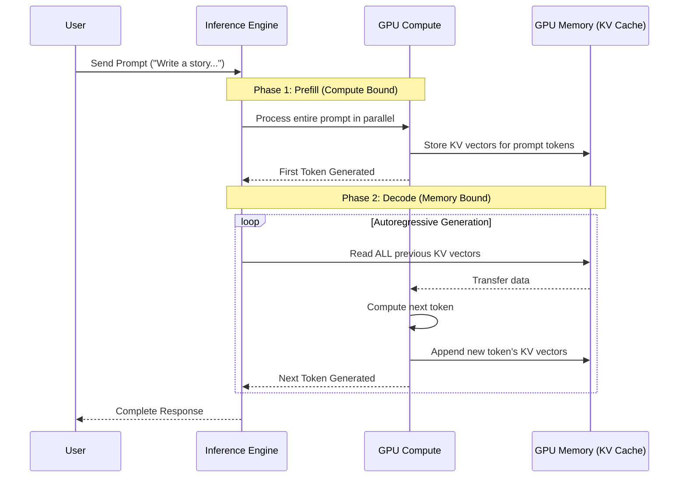
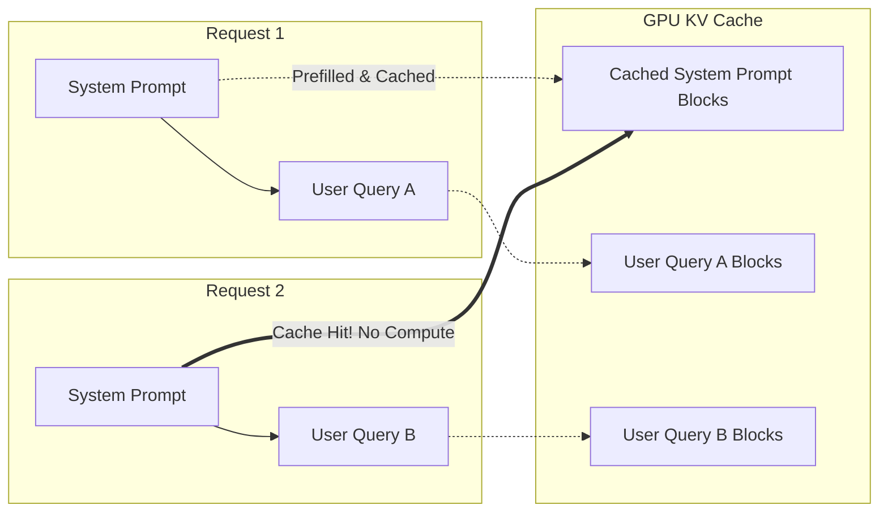

## Why This Module Matters

In late 2023, a rapidly growing AI native startup offering an AI coding assistant experienced a catastrophic service degradation during a product launch. As user concurrency spiked from a baseline of 500 simultaneous requests to over 8,000, their legacy inference infrastructure—relying on naive Hugging Face Transformers static batching—collapsed. The system began dropping requests, and Time to First Token (TTFT) degraded from 200 milliseconds to over 30 seconds. The startup was burning through a massive cloud budget, paying for thousands of A100 GPUs, yet utilizing less than 15% of the actual GPU memory bandwidth due to fragmented key-value (KV) caches and inefficient batching. 

The financial impact was severe. The company lost an estimated $2.5 million in potential recurring revenue within a single week due to user churn and negative social media sentiment. Their engineering team scrambled to mitigate the issue by over-provisioning hardware, which temporarily stopped the bleeding but pushed their daily infrastructure costs to unsustainable levels. The root cause was not a lack of raw compute power, but a fundamental misunderstanding of LLM memory management and inference bottlenecks. The system was memory-bound, spending the majority of its time moving data rather than computing matrix multiplications.

To survive, the company completely overhauled its serving stack over a grueling two-week sprint, migrating to vLLM. By implementing PagedAttention and continuous batching, they increased their serving throughput by 14x on the exact same hardware footprint. This migration not only saved the company from bankruptcy by slashing their cloud bill by 85%, but it also restored sub-second latency for their users. Understanding modern inference engines like vLLM and sglang is no longer an optional optimization; it is the fundamental requirement for deploying generative AI models economically and reliably at scale.

## Learning Outcomes

By the end of this module, you will be able to:
*   **Evaluate** the architectural differences between static batching and continuous batching in the context of LLM inference throughput.
*   **Diagnose** memory fragmentation issues in naive LLM serving implementations and explain how PagedAttention resolves them.
*   **Design** a high-throughput inference architecture using vLLM or sglang for models like Llama 4 or DeepSeek V3, balancing latency and throughput requirements.
*   **Implement** advanced inference optimizations including prefix caching, chunked prefill, and speculative decoding to maximize hardware utilization.
*   **Compare** the performance profiles of vLLM and sglang specifically for structured output generation and complex prompting workflows.

## The Anatomy of LLM Inference: Prefill and Decode

To understand why engines like vLLM and sglang exist, we must first break down how an autoregressive Large Language Model generates text. Inference occurs in two distinct phases: the **Prefill** phase and the **Decode** phase. 

During the prefill phase, the model processes the entire input prompt simultaneously. It computes the Key and Value (KV) vectors for every token in the prompt and stores them in GPU memory (the KV cache). This phase is heavily compute-bound. The GPU is performing massive matrix multiplications, and high utilization is easily achieved because the operations are highly parallelizable across the sequence length.

The decode phase is entirely different. The model generates one token at a time. To generate the next token, it must read the entire KV cache of all previous tokens from High Bandwidth Memory (HBM) into the GPU's streaming multiprocessors (SMs). It computes the new token, appends its KV vectors to the cache, and repeats. This phase is severely memory-bandwidth bound. The arithmetic intensity (the ratio of compute operations to memory bytes accessed) is very low.



When serving multiple users, naive implementations process requests sequentially or use static batching, where requests are grouped together and padded to the length of the longest request in the batch. This results in massive GPU memory waste due to padding and internal fragmentation, limiting the maximum batch size. Since the decode phase is memory-bandwidth bound, the only way to increase overall throughput is to increase the batch size, which allows the GPU to process multiple tokens while loading the KV cache once. 

> **Stop and think**: If a model requires 20GB of weights to load into memory, and an A100 GPU has 80GB of memory, how do you maximize the use of the remaining 60GB? What happens if your batch size is too small?

## PagedAttention: The Core of vLLM

The breakthrough that enabled vLLM to dominate the open-source inference landscape was **PagedAttention**. Inspired by virtual memory and paging in traditional operating systems, PagedAttention eliminates the need to allocate contiguous blocks of memory for the KV cache.

In traditional attention mechanisms, the KV cache for a sequence is stored in a contiguous tensor. Because the final length of the generated text is unknown at the start, the system must over-allocate memory based on the maximum possible generation length. This leads to internal fragmentation (allocated but unused memory) and external fragmentation (small gaps between allocations). Research showed that in naive systems, up to 60-80% of KV cache memory was wasted.

PagedAttention divides the KV cache into fixed-size blocks (e.g., blocks of 16 or 32 tokens). These blocks do not need to be contiguous in physical GPU memory. A block table maps the logical blocks of a sequence to physical blocks in memory. 

```mermaid
graph TD
    subgraph Logical View (Per Request)
        Seq1[Sequence 1 Logical Blocks<br>Block 0, Block 1, Block 2]
        Seq2[Sequence 2 Logical Blocks<br>Block 0, Block 1]
    end

    subgraph Block Table
        BT1_0[Logical 0 -> Physical 5]
        BT1_1[Logical 1 -> Physical 2]
        BT1_2[Logical 2 -> Physical 8]
        BT2_0[Logical 0 -> Physical 1]
        BT2_1[Logical 1 -> Physical 9]
    end

    subgraph Physical GPU Memory (KV Cache)
        P0[Physical Block 0]
        P1[Physical Block 1 (Seq 2)]
        P2[Physical Block 2 (Seq 1)]
        P3[Physical Block 3]
        P4[Physical Block 4]
        P5[Physical Block 5 (Seq 1)]
        P6[Physical Block 6]
        P7[Physical Block 7]
        P8[Physical Block 8 (Seq 1)]
        P9[Physical Block 9 (Seq 2)]
    end

    Seq1 --> BT1_0
    Seq1 --> BT1_1
    Seq1 --> BT1_2
    
    Seq2 --> BT2_0
    Seq2 --> BT2_1

    BT1_0 --> P5
    BT1_1 --> P2
    BT1_2 --> P8
    
    BT2_0 --> P1
    BT2_1 --> P9
```

Because blocks are allocated on demand, PagedAttention virtually eliminates memory waste. This near-zero waste allows vLLM to cram significantly more sequences into a single batch. Since decode operations are memory-bound, a larger batch size directly translates to higher throughput (tokens per second) with only a marginal increase in latency per token. Furthermore, PagedAttention allows physical blocks to be shared across different sequences, which is highly beneficial for complex sampling methods like parallel decoding or beam search.

## Continuous Batching (Iteration-Level Scheduling)

Static batching waits for all requests in a batch to complete before starting the next batch. If Request A finishes in 10 tokens, but Request B takes 500 tokens, the compute resources allocated for Request A sit idle for 490 iterations. 

vLLM utilizes **Continuous Batching** (also known as in-flight batching or iteration-level scheduling). The scheduler operates at the token iteration level. As soon as Request A emits its final token (e.g., `<EOS>`), it is immediately evicted from the batch. The scheduler then pulls a new request from the queue and inserts it into the active batch for the very next token generation step.

This means the batch size is dynamically adjusted every single iteration, keeping GPU utilization consistently high. The inference engine is constantly churning, mixing prefill operations for new requests with decode operations for existing requests.

### Implementing vLLM in Production

Deploying vLLM is straightforward due to its OpenAI-compatible server. Here is an example of how a platform engineering team might deploy a Llama model using vLLM in a Kubernetes environment.

```yaml
apiVersion: apps/v1
kind: Deployment
metadata:
  name: vllm-llama-deployment
  labels:
    app: vllm
spec:
  replicas: 2
  selector:
    matchLabels:
      app: vllm
  template:
    metadata:
      labels:
        app: vllm
    spec:
      containers:
      - name: vllm-server
        image: vllm/vllm-openai:v0.6.0
        command: ["python3", "-m", "vllm.entrypoints.openai.api_server"]
        args:
        - "--model"
        - "meta-llama/Llama-3-70B-Instruct"
        - "--tensor-parallel-size"
        - "4" # Running across 4 GPUs
        - "--gpu-memory-utilization"
        - "0.90"
        - "--max-model-len"
        - "8192"
        resources:
          limits:
            nvidia.com/gpu: "4"
        ports:
        - containerPort: 8000
```

Notice the `--tensor-parallel-size` argument. For large models like a 70B parameter model, a single GPU does not have enough VRAM to hold the weights and the KV cache. vLLM natively supports Megatron-LM style Tensor Parallelism, splitting the model's matrices across multiple GPUs on the same node, allowing them to compute attention and feed-forward layers synchronously.

## Advanced Optimizations: Prefix Caching and Chunked Prefill

As inference engines matured, engineers realized that PagedAttention was just the foundation. New bottlenecks emerged, specifically around long system prompts and massive context windows.

### Automatic Prefix Caching (APC)

In many applications (like chat interfaces or agents), users send the exact same massive system prompt over and over again. Computing the KV cache for a 4,000-token system prompt takes significant compute time for every single request. 

Prefix caching allows vLLM to hash the blocks of the prompt. If a new request shares the exact same prefix as a previously processed request (which is still in memory), vLLM simply points the new request's block table to the existing physical blocks in the KV cache. This bypasses the prefill compute phase entirely for that portion of the prompt, drastically reducing Time to First Token (TTFT).



### Chunked Prefill

When an engine mixes continuous batching with new requests, a massive new request (e.g., 32k tokens) can cause a severe latency spike for all other requests currently in the decode phase. The GPU must pause decoding to compute the massive prefill, causing a stutter in the generated output for active users.

Chunked prefill solves this by breaking the prefill phase into smaller chunks. Instead of prefilling 32k tokens at once, the engine might prefill 1,024 tokens alongside the decode operations of the active batch, then prefill the next 1,024 tokens on the next iteration. This smooths out latency and prevents long prompts from starving active decoding sessions.

> **Pause and predict**: Imagine your team just deployed a 100k-context documentation Q&A bot. During peak hours, simple "hello" messages take 5 seconds to generate their first token whenever someone else uploads a massive PDF. Based on the chunked prefill mechanism, how would enabling this feature change the experience for both the PDF uploader and the users saying "hello"?

## sglang: RadixAttention and Structured Generation

While vLLM pioneered PagedAttention, **sglang** (developed by researchers at LMSYS/Berkeley) introduced **RadixAttention**. sglang is built for complex prompting workflows: agentic loops, few-shot prompting, and heavily structured JSON generation.

In vLLM, prefix caching is a reactive optimization based on block hashing. RadixAttention in sglang maintains the KV cache as a Radix Tree. This means it proactively manages prefixes across all active and recently finished requests. It is significantly more efficient at sharing KV caches for highly complex, branching prompt structures (e.g., Tree of Thoughts, or multiple agents sharing a context).

Furthermore, sglang excels at constrained decoding (e.g., forcing the LLM to output valid JSON matching a specific schema). Traditional engines process the output token by token, running a regex or grammar parser on CPU to mask out invalid tokens at every step, causing massive overhead. sglang utilizes a compressed finite state machine (FSM) compiled in advance, allowing it to jump ahead. If the schema requires the string `"user_id": "`, sglang will not generate those tokens individually; it will forcefully append them to the sequence, bypassing the model's forward pass entirely for the structural scaffolding.

### Throughput vs. Latency Tradeoffs

When deploying these systems, platform engineers must tune parameters based on the product requirements. There is a fundamental tradeoff between throughput (tokens per second across all users) and latency (Time to First Token and Inter-Token Latency for a single user).

| Metric | Goal | Configuration Action | Tradeoff |
| :--- | :--- | :--- | :--- |
| **Max Throughput** (e.g., Batch offline data processing) | Process highest volume of data per hour. | Increase maximum batch size (`--max-num-seqs`). Allocate maximum VRAM to KV Cache. | Increases TTFT and Inter-Token Latency. Individual requests take longer, but total volume is higher. |
| **Lowest TTFT** (e.g., Chatbot responsiveness) | Start generating text instantly. | Prioritize prefill operations. Reduce maximum batch size. | Lowers overall system throughput. Hardware is underutilized. |
| **Smooth Decoding** (e.g., Reading streaming text) | Prevent stutters during generation. | Enable Chunked Prefill. Set strict latency SLAs in the scheduler. | Slightly delays TTFT for long-context requests to protect decoding requests. |

## Did You Know?

*   Before PagedAttention, memory fragmentation in LLM inference could lead to up to **80%** of GPU memory being allocated but completely unusable.
*   By implementing continuous batching and PagedAttention, vLLM achieved up to **24x** higher throughput compared to Hugging Face Transformers upon its initial release.
*   The Radix Tree structure used in sglang's RadixAttention allows for exact prefix matching in **O(L)** time, where L is the length of the sequence, making it highly efficient for branching agentic workflows.
*   Speculative decoding, an advanced feature in modern engines, uses a tiny "draft" model to predict tokens and a large "target" model to verify them, sometimes increasing generation speed by **2.5x** without modifying the target model's weights.

## Common Mistakes

| Mistake | Why it happens | How to fix it |
| :--- | :--- | :--- |
| **Running out of VRAM (OOM) at startup.** | Setting `--gpu-memory-utilization` to 1.0. The engine needs a small amount of memory for PyTorch context and activations outside the KV cache. | Set `--gpu-memory-utilization 0.90` (or lower if running other processes). |
| **Low throughput with small batch sizes.** | Misunderstanding memory bounds. Using small batch sizes leaves SMs idle during the decode phase. | Increase concurrency testing. Allow the engine to scale the batch size dynamically up to the memory limit. |
| **Ignoring Tensor Parallelism.** | Attempting to load a model larger than a single GPU's VRAM using standard Hugging Face device maps, resulting in slow interconnect overhead. | Use native `--tensor-parallel-size N` to leverage high-speed NVLink for synchronous matrix splitting. |
| **Not using Prefix Caching for Chatbots.** | Forgetting to enable automatic prefix caching when a massive system prompt is prepended to every single user query. | Enable `--enable-prefix-caching`. Ensure the system prompt is completely identical across requests. |
| **Spikes in inter-token latency.** | Large prefill requests are blocking the decode operations of active batch requests. | Enable Chunked Prefill to distribute the prefill compute across multiple iterations. |
| **Using generic inference for strict JSON.** | Forcing JSON via prompts alone, leading to high token usage and occasional formatting errors. | Use engines like sglang or vLLM's guided decoding with JSON schema constraints to enforce structure at the logits level. |
| **Failing to monitor KV Cache usage.** | Treating the inference engine as a black box. If the KV cache is consistently 100% full, requests will queue up indefinitely. | Monitor Prometheus metrics exported by vLLM (e.g., `vllm:gpu_cache_usage_perc`). Scale out replicas when it hits >85%. |

## Quiz

<details>
<summary>1. A machine learning team reports that their newly deployed inference server is only utilizing 20% of the GPU compute capacity, yet it cannot accept any more concurrent requests. What is the most likely architectural bottleneck?</summary>
The system is memory-bound due to the KV cache filling up. Because the decode phase has low arithmetic intensity, the compute units (SMs) sit idle while waiting for KV cache data to be transferred from memory. The system cannot accept more requests because there is no physical memory left to allocate for new KV cache blocks, even though the compute units have spare cycles.
</details>

<details>
<summary>2. You are tasked with deploying a customer support chatbot. The system prompt is 2,500 tokens, and user queries average 50 tokens. Which vLLM feature is absolutely critical to minimize Time to First Token (TTFT)?</summary>
Automatic Prefix Caching (APC) is critical. Because every request shares the exact same 2,500-token system prompt, APC allows vLLM to compute the KV cache for the system prompt once. Subsequent requests will hit the cache, completely bypassing the heavy prefill compute phase for those 2,500 tokens, drastically reducing TTFT.
</details>

<details>
<summary>3. Your infrastructure team is replacing a legacy Hugging Face Transformers deployment with vLLM on the same A100 GPU cluster. Previously, the system could only handle a batch size of 8 before crashing with Out of Memory (OOM) errors, despite metrics showing only 40% actual memory utilization. Why will migrating to vLLM's PagedAttention architecture immediately allow you to increase this batch size without adding more hardware?</summary>
The legacy system was severely limited by internal and external memory fragmentation caused by contiguous memory allocation. Because it had to pre-allocate maximum potential sequence lengths in contiguous blocks, 60% of the GPU's memory was reserved but unused, leading to OOM errors at small batch sizes. PagedAttention solves this by treating the KV cache like virtual memory, allocating fixed-size, non-contiguous blocks only as tokens are generated. This dynamic allocation virtually eliminates memory waste, freeing up the "trapped" 60% of VRAM so the scheduler can pack significantly more concurrent requests into the batch, thereby maximizing throughput on the exact same hardware.
</details>

<details>
<summary>4. During a high-traffic event, active users complain that the chatbot's text generation stutters and pauses mid-sentence. You notice that these pauses correlate with other users submitting massive 20k-token documents for summarization. How do you architect a solution?</summary>
You must implement Chunked Prefill. Currently, the massive prefill operations are monopolizing the GPU compute, starving the decode operations of the active batch. Chunked prefill will break the 20k-token prefill into smaller segments, interleaving them with the decode steps of active users, thereby smoothing out the inter-token latency and eliminating the stutters.
</details>

<details>
<summary>5. You are building an agentic workflow that utilizes Tree of Thoughts prompting. The prompt branches into multiple parallel generation paths that share a large, complex history. Would you prioritize deploying vLLM or sglang, and why?</summary>
You would prioritize sglang. Its RadixAttention mechanism uses a Radix Tree to proactively manage and share KV caches across complex, branching prompt structures. It is significantly more efficient than vLLM's hash-based prefix caching for workflows where multiple generation paths share heavily overlapping, structured contexts.
</details>

<details>
<summary>6. A data engineering team is using your vLLM cluster overnight to summarize 50,000 historical customer support tickets, while a small team of night-shift agents uses the same cluster for live chat assistance. The data engineers complain that their job takes too long, but when you increase the `--max-num-seqs` parameter to process more tickets simultaneously, the night-shift agents report the chat interface has become unusable. What fundamental tradeoff is causing this conflict, and how does the batch size configuration directly impact both workloads?</summary>
This conflict illustrates the fundamental architectural tension between optimizing for total throughput versus individual request latency. By increasing the maximum sequence limit, you are allowing the scheduler to pack a massive number of offline batch requests into the GPU simultaneously. While this dramatically increases the total tokens processed per second (throughput) by keeping the GPU's compute units fully saturated, it forces every single request—including the live chat queries—to wait much longer in the queue and during the decode phase for their turn to compute. To serve the interactive UI effectively, you must artificially restrict the batch size, which ensures low Time to First Token (TTFT) and smooth generation for the agents, but forces the data engineers to process fewer tickets concurrently.
</details>

## Hands-On Exercise: Deploying and Profiling vLLM

In this exercise, you will deploy a local vLLM instance, send concurrent requests, and profile the impact of continuous batching and prefix caching.

**Prerequisites:** A Linux environment with Docker, an NVIDIA GPU (at least 16GB VRAM, e.g., T4, RTX 4080, or A10g), and the NVIDIA Container Toolkit installed.

**Task 1: Launch the vLLM Server**
Start a vLLM server using Docker, hosting a small instruction-tuned model (e.g., Qwen 2.5 1.5B). Enable prefix caching.

<details>
<summary>Solution</summary>

```bash
docker run --gpus all \
  -v ~/.cache/huggingface:/root/.cache/huggingface \
  -p 8000:8000 \
  --ipc=host \
  vllm/vllm-openai:v0.6.0 \
  --model Qwen/Qwen2.5-1.5B-Instruct \
  --enable-prefix-caching \
  --gpu-memory-utilization 0.8
```
*Wait for the server to report `Uvicorn running on http://0.0.0.0:8000`.*
</details>

**Task 2: Write a Load Testing Script**
Write a Python script using `asyncio` and `aiohttp` to send 20 concurrent requests to the server. All requests should use an identical long system prompt (simulate this with a large paragraph of text) and a unique short user query.

<details>
<summary>Solution</summary>

```python
import asyncio
import aiohttp
import time

SYSTEM_PROMPT = "You are a highly detailed technical assistant. " * 200 # Simulate long prompt
URL = "http://localhost:8000/v1/chat/completions"

async def fetch(session, index):
    payload = {
        "model": "Qwen/Qwen2.5-1.5B-Instruct",
        "messages": [
            {"role": "system", "content": SYSTEM_PROMPT},
            {"role": "user", "content": f"Briefly explain concept number {index} in physics."}
        ],
        "max_tokens": 50
    }
    start_time = time.time()
    async with session.post(URL, json=payload) as response:
        await response.json()
        end_time = time.time()
        return end_time - start_time

async def main():
    async with aiohttp.ClientSession() as session:
        tasks = [fetch(session, i) for i in range(20)]
        results = await asyncio.gather(*tasks)
        print(f"Average latency: {sum(results)/len(results):.2f} seconds")
        print(f"Max latency: {max(results):.2f} seconds")

if __name__ == "__main__":
    asyncio.run(main())
```
</details>

**Task 3: Analyze Prefix Caching**
Run your script twice in a row. Observe the latency differences between the first run and the second run.

<details>
<summary>Solution</summary>

Run the script: `python load_test.py`. 
During the first run, the first request will trigger a massive prefill computation for the simulated long system prompt. Subsequent requests in that batch, and definitely in the second run, will experience drastically lower latency. The second run will be significantly faster overall because the KV cache for the `SYSTEM_PROMPT` is fully populated and shared across all 20 concurrent requests via PagedAttention and Prefix Caching.
</details>

**Task 4: Query Prometheus Metrics**
vLLM exposes metrics automatically. Use `curl` to fetch the metrics and grep for KV cache utilization.

<details>
<summary>Solution</summary>

```bash
curl -s http://localhost:8000/metrics | grep vllm:gpu_cache_usage_perc
```
*Output should look similar to `vllm:gpu_cache_usage_perc{model_name="..."} 0.15`. This indicates 15% of the allocated KV cache blocks are currently in use.*
</details>

**Success Checklist:**
- [ ] vLLM container started successfully without Out of Memory errors.
- [ ] Load testing script executed 20 concurrent connections.
- [ ] Observed latency reduction demonstrating prefix cache hits.
- [ ] Successfully queried and interpreted the `gpu_cache_usage_perc` Prometheus metric.

## Next Module

Now that you understand how to maximize single-node throughput using vLLM and sglang, the next challenge is managing state and routing across a distributed cluster of these engines. In the next module, **Module 6.4: Multi-Node Inference and Semantic Routing**, we will explore how to use tools like Ray Serve and Lorax to route incoming requests to specific GPUs based on cached prefixes and LoRA adapter states, ensuring high availability and optimal cluster-wide utilization.