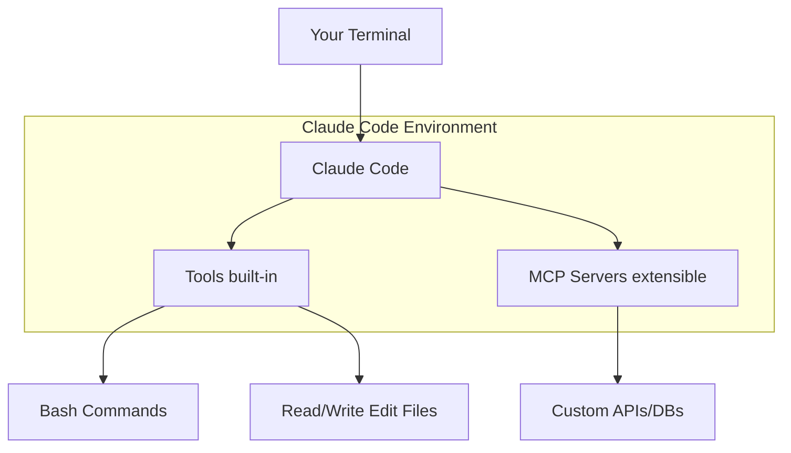
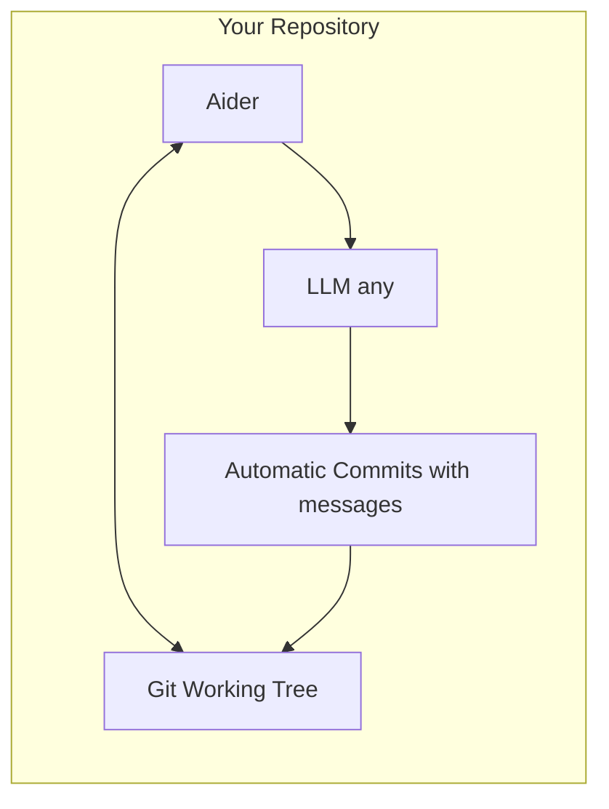
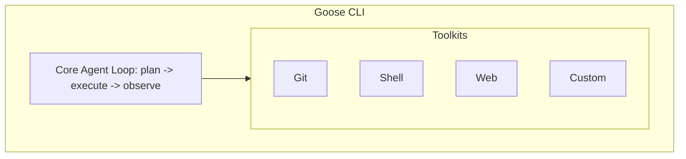

> **AI/ML Engineering Track** | Complexity: `[MEDIUM]` | Time: 4-6
**Prerequisites**: Module 01 (AI-Driven Development), Module 1.4 (Agent-First IDEs)

---

## The Night the Terminal Became Intelligent

In October 2024, a major financial services provider suffered a cascading failure in their core transaction routing system. A malformed deployment script introduced a subtle race condition affecting a fleet of legacy Python microservices deployed across headless Linux servers. The financial impact was immediate and severe, halting processing for approximately fourteen million dollars in transactions per hour. Engineers were connecting directly into production bastion hosts, completely stripped of their familiar Integrated Development Environments and visual debugging tools.

Without graphical interfaces, traditional debugging slowed to an excruciating crawl. The incident response team attempted to manually scan through millions of lines of code while the outage dragged into its third hour. The deadlock broke when a single site reliability engineer deployed a command-line AI coding agent directly to the bastion host. By scoping the agent's context to the transaction routing directories and instructing it to analyze the exact stack traces failing in real-time, the agent synthesized a flawless patch across multiple interdependent files in under four minutes.

This incident underscores a critical reality for modern infrastructure engineers: your most severe problems will not happen inside a comfortable graphical editor. They will happen in raw terminals, inside containers, and on remote servers. Command-line AI coding agents bridge this gap, bringing the full analytical power of Large Language Models directly to the lowest levels of your system architecture. Understanding how to operate these tools is no longer a novelty; it is a fundamental requirement for incident resolution, systemic automation, and modern infrastructure engineering.

---

## What You'll Be Able to Do

By the end of this module, you will be able to:
- **Design** a custom Model Context Protocol integration to extend agent capabilities into legacy databases and internal network systems.
- **Implement** an automated error-recovery pipeline using non-interactive CLI agents to triage and resolve test failures programmatically.
- **Evaluate** the economic, security, and operational trade-offs between GUI-based and CLI-based AI coding workflows.
- **Diagnose** production failures in headless environments by scoping AI context to relevant system logs and executing targeted codebase modifications.
- **Compare** the execution models, system requirements, and architectural limits of modern CLI utilities including Claude Code, Aider, and Gemini CLI.

---

## Theory: The Power of the Command Line

While agent-first development environments wrap artificial intelligence capabilities in polished graphical interfaces, CLI-based coding agents take a fundamentally different architectural approach. They integrate directly into the terminal subsystem, binding to the standard input and standard output streams that developers use to orchestrate their operating systems. This provides an execution model that values composability, automation, and headless operation over visual aesthetics. 

Think of a graphical IDE agent as an assistant who works exclusively inside a well-lit studio. They are incredibly effective when you are sitting right next to them, looking at the same canvas. A CLI agent, conversely, is an assistant equipped with a flashlight and a toolkit who will follow you down into the basement, crawl into the ventilation shafts, and repair the plumbing. The CLI agent operates natively wherever a secure shell connection can reach.

The Unix philosophy, established decades ago, dictates that systems should consist of small, highly focused programs that do one thing well and communicate via universal text streams. CLI agents honor this philosophy. They do not attempt to reinvent text editing, source control, or window management. Instead, they act as intelligent text processors that read project files, analyze standard error streams from failed compilations, and output exact diffs. You can pipe a failing test report directly into a CLI agent, instruct it to diagnose the failure, and pipe its output directly into a logging aggregator.

> **Pause and predict**: If you pass an entire monorepo to a CLI agent without scoping the context, what will happen to the language model's reasoning capabilities, and why?

---

## The CLI Agent Landscape

The ecosystem of command-line agents is rapidly expanding, with distinct philosophies driving the development of each major tool. Understanding the technical specifications, architectural limits, and intended use cases for each framework is essential for building resilient automated pipelines.

### Claude Code: Deep Integration and Extensibility

Claude Code serves as Anthropic's official terminal tool, explicitly engineered to handle complex, multi-step tasks by deeply analyzing the active workspace. It provides dedicated terminal commands supporting a non-interactive execution mode designated by the `-p` flag, alongside highly advanced session management features. While earlier iterations allowed installation via `npm install -g @anthropic-ai/claude-code`, this approach is explicitly marked as deprecated in favor of robust native installers provided directly by Anthropic. System prerequisites for execution are stringent: environments must run macOS 13.0+, Ubuntu 20.04+, Debian 10+, or Alpine 3.19+, and legacy npm-based installations require a minimum of Node.js 18+. 

The application handles its own lifecycle through an auto-update mechanism that features configurable channels. This mechanism defaults to the `latest` channel while allowing opt-in for `stable` releases, and permits manual intervention via the `claude update` command. Extensibility is achieved natively; the CLI configures the Model Context Protocol directly using the `claude mcp` subcommand, facilitating immediate integration with external MCP servers. When instantiating the agent, developers utilize model selection flags that recognize specific shorthand aliases, such as `sonnet` and `opus`, defined within the tool's core settings.



Claude Code relies heavily on programmatic hooks and slash commands to align the language model with enterprise practices. Hooks allow the execution of rigid shell commands whenever the AI modifies a file, ensuring formatting tools always run. 

```json
// ~/.config/claude-code/settings.json
{
  "hooks": {
    "PostToolUse": [
      {
        "matcher": "Edit",
        "command": "prettier --write $FILE_PATH"
      }
    ],
    "PreCommit": [
      {
        "command": "npm run lint"
      }
    ]
  }
}
```

The Model Context Protocol extends Claude Code's capabilities to interact with external databases and version control systems without relying on insecure external plugins.

```json
// MCP server configuration
{
  "mcpServers": {
    "database": {
      "command": "mcp-postgres",
      "args": ["postgresql://localhost/mydb"]
    },
    "github": {
      "command": "mcp-github",
      "env": {"GITHUB_TOKEN": "..."}
    }
  }
}
```

Slash commands act as macro expansions, injecting rigid validation criteria into the AI's prompt before execution begins.

```markdown
<!-- .claude/commands/review.md -->
Review this code for:
1. Security vulnerabilities
2. Performance issues
3. Best practices violations

Focus on: $ARGUMENTS
```

Global repository contexts are managed through a foundational markdown file. This file ensures that the agent never deviates from established architectural mandates, such as relying strictly on specific Object-Relational Mappers instead of executing raw database queries.

```markdown
# CLAUDE.md

## Project Overview
This is a FastAPI backend serving React frontend.

## Conventions
- Use pydantic for all data validation
- Async functions for all I/O
- Tests in pytest, aim for 80% coverage

## Don't
- Never commit .env files
- Don't use raw SQL, always use SQLAlchemy ORM
```

```bash
# Install
npm install -g @anthropic-ai/claude-code

# Start interactive session
claude

# Non-interactive with prompt
claude -p "explain this file" < src/main.py

# With specific model
claude --model claude-sonnet-4-20250514
```

### Aider: Git-Native Pair Programming

Aider represents a specialized, Git-native AI pair-programming tool purposefully designed for direct terminal execution. The recommended installation pipeline utilizes an isolated installer flow triggered via `aider-install`, which natively supports Python environments ranging from versions 3.8 to 3.13. For alternative environments, deployment is equally supported through pip, pipx, and custom Homebrew-style install scripts. Aider distinguishes itself through massive language compatibility, supporting over one hundred distinct programming languages. Its core architectural advantage lies in its profound integration with the local git binary, effectively managing, tracking, and automatically committing all AI-generated code changes directly within the local working tree.



By binding directly to git, Aider guarantees that no AI modification is ever lost or blended invisibly into a monolithic file state. 

```bash
$ aider
> Add input validation to the User model

# Aider edits the file and commits:
# "feat: Add input validation to User model"
# - Added email format validation
# - Added password strength requirements
# - Added age range check
```

Aider natively maintains a persistent understanding of multiple files simultaneously, coordinating complex refactoring efforts across application routers, core domain models, and testing suites.

```bash
$ aider src/models/user.py src/api/routes.py tests/test_user.py

> Refactor User to use dataclass and update all usages
```

Accessibility and rapid input are facilitated through dedicated voice capture modules.

```bash
$ aider --voice
 Listening...
"Add a rate limiting middleware that allows 100 requests per minute per IP"
```

For massive architectural overhauls, Aider exposes an architect mode that halts execution and forces the developer to approve the proposed system design before any code is mutated.

```bash
$ aider --architect

> Implement user authentication with JWT

Planning...
1. Create auth service module
2. Add JWT utility functions
3. Create login/register endpoints
4. Add auth middleware
5. Update user model with password hash
6. Add tests

Proceed? [y/n]
```

Model flexibility allows organizations to dictate precisely which language model processes their proprietary codebase, supporting both commercial API endpoints and locally hosted neural networks.

```bash
# OpenAI
$ aider --model gpt-5

# Anthropic
$ aider --model claude-4.6-sonnet

# Local models via Ollama
$ aider --model ollama/deepseek-coder

# Any OpenAI-compatible API
$ aider --openai-api-base http://localhost:8000/v1
```

```bash
# Install
pip install aider-chat

# Start with files
aider src/main.py src/utils.py

# With specific model
aider --model gpt-5

# Voice mode
aider --voice
```

### Goose: Extensible Toolkits

Goose relies on a modular architecture to expand its capabilities. It utilizes python-based toolkits to connect standard LLM reasoning to disparate enterprise systems.



Developers can define completely isolated python classes that decorate internal logic with the `@tool` directive, exposing legacy systems directly to the autonomous agent.

```python
# Custom toolkit example
from goose.toolkit import Toolkit, tool

class DatabaseToolkit(Toolkit):
    """Tools for database operations."""

    @tool
    def query(self, sql: str) -> str:
        """Execute a SQL query and return results."""
        return self.db.execute(sql)

    @tool
    def schema(self, table: str) -> str:
        """Get the schema for a table."""
        return self.db.get_schema(table)
```

```bash
# Install
pip install goose-ai

# Start session
goose session start

# With specific toolkit
goose session start --toolkit developer github
```

### OpenAI Codex CLI

The OpenAI Codex CLI is a terminal-based coding agent that executes locally on the developer's machine. It possesses the capability to deeply inspect a repository, aggressively edit files in place, and run arbitrary commands within the current working directory. Installation and execution rely strictly on Node Package Manager via the command `npm i -g @openai/codex`, after which the agent is invoked using the `codex` command. Upgrading the agent requires executing `npm i -g @openai/codex@latest`. The tool natively supports macOS and Linux environments, while Windows support remains officially marked as experimental. Developed for maximum speed and execution efficiency, the underlying architecture is built entirely in Rust. Furthermore, the OpenAI Codex CLI is completely open source and operates under the Apache-2.0 license. Access requires a ChatGPT Plus, Pro, Business, Edu, or Enterprise plan, and the initial execution run mandates an interactive ChatGPT authentication flow or direct API-key authentication. Once authenticated, the CLI provides robust terminal controls for model selection, alternative modeling configurations, and explicit approval gateways.

### Gemini CLI

Google's Gemini CLI operates as an open-source terminal AI agent governed by the Apache-2.0 licensing model. The official documentation strictly recommends utilizing modern operating systems, specifically macOS 15+, Windows 11 24H2+, or Ubuntu 20.04+, paired with a minimum runtime of Node.js 20.0.0+. Execution requires a standard shell system such as Bash, Zsh, or PowerShell, along with continuous internet connectivity to access backend reasoning engines. The distribution strategy accommodates diverse engineering environments, offering installation pathways via npm, Homebrew, MacPorts, and Anaconda. Upon installation, the interface is accessed via the `gemini` executable command. The development cycle tracks three distinct release channels—stable, preview, and nightly—which map directly to package manager tags including `latest`, `preview`, and `nightly`. For cloud-native developers, the Gemini CLI provides immediate utility as it ships entirely pre-installed within both Google Cloud Shell and Google Cloud Workstations.

### GitHub Copilot CLI

The GitHub Copilot CLI extends standard repository tooling directly into the terminal and is available across all Copilot tier plans, though access remains subject to organizational and enterprise policy enablement. The agent offers broad platform compatibility, fully supporting Linux, macOS, and Windows architectures, utilizing PowerShell or Windows Subsystem for Linux for the latter. Installation targets multiple package managers, including npm requiring Node.js 22+, as well as native system installers like Winget and Homebrew. Usage models are flexible, supporting both direct programmatic invocations and fully interactive sessions initiated by typing `copilot`. The default reasoning engine powering the CLI is Claude Sonnet 4.5, although comprehensive configuration options permit users to modify the active model selection. For highly complex, multi-stage operations, the tool provides an advanced autopilot mode capable of executing sequences autonomously without requiring interactive prompting between individual steps. To maintain context across long-running development efforts, the Copilot CLI persists complete session data locally within the `~/.copilot/session-state/` directory. This architecture not only supports seamlessly resuming suspended sessions but also exposes detailed insights and history tracking through the `/chronicle` command.

```bash
$ gh copilot suggest "find all Python files modified in the last week"
git log --since="1 week ago" --name-only --pretty=format: -- "*.py" | sort -u
```

```bash
$ q "create an S3 bucket with versioning enabled"
```

> **Stop and think**: When an incident occurs in a highly secure, air-gapped production environment, how does the architecture of a locally running CLI agent provide a critical advantage over a cloud-dependent IDE extension?

---

## Comparing CLI Agents

Evaluating which agent to deploy depends strictly on the engineering environment's constraints, the necessity for robust source control guarantees, and the requirement for deep system extensibility.

| Feature | Claude Code | Aider | Goose |
|---------|-------------|-------|-------|
| **Git Integration** | Manual commits | Auto-commits | Manual |
| **Multi-file Editing** | Yes | Yes | Yes |
| **Extensibility** | MCP servers | Limited | Toolkits |
| **Voice Input** | No | Yes | No |
| **Model Support** | Claude only | Multi-model | Multi-model |
| **Custom Commands** | Slash commands | Limited | Toolkits |
| **Project Context** | CLAUDE.md | .aider files | Config |
| **IDE Integration** | Yes (plugins) | No | No |
| **Open Source** | No | Yes | Yes |

When assessing financial impact, the underlying cost of API tokens must be balanced against the staggering reduction in manual engineering hours.

| Approach | Monthly Cost | Speed Multiplier | Best For |
|----------|-------------|------------------|----------|
| Manual coding | $0 (just salary) | 1x baseline | Learning, interviews |
| GitHub Copilot | $19/month | 1.3-1.5x | Autocomplete, snippets |
| Cursor Pro | $20/month | 1.5-2x | IDE-centric workflows |
| Aider + gpt-5 | ~$30-100/month API | 2-3x | Git-native development |
| Aider + Claude | ~$20-80/month API | 2-3x | Complex reasoning |
| Claude Code | ~$50-200/month API | 2-4x | Multi-step automation |
| Aider + Local (Ollama) | $0-5/month | 1.5-2x | Privacy, offline, cost savings |

---

## Building CLI Workflows

The true power of terminal-based coding agents emerges when they are integrated into automated continuous execution loops. By decoupling the agent from a human operator, organizations can process massive technical debt, execute codebase-wide vulnerability patching, and construct self-healing continuous integration pipelines.

Piping data directly into a non-interactive execution mode allows external shell logic to handle repository state while the AI agent focuses purely on analysis.

```bash
#!/bin/bash
# review-pr.sh - Automated PR review

PR_NUMBER=$1
DIFF=$(gh pr diff $PR_NUMBER)

echo "$DIFF" | claude-code -p "Review this diff for:
1. Security issues
2. Performance concerns
3. Test coverage gaps

Output as markdown checklist."
```

Chaining tools together creates self-healing loops. A standard testing framework can output a stack trace, which a shell script evaluates. If the execution code returns a failure, the script automatically summons the AI to remediate the broken codebase.

```bash
#!/bin/bash
# smart-fix.sh - Diagnose and fix issues

# Step 1: Run tests to find failures
pytest --tb=short 2>&1 | tee test_output.txt

# Step 2: If tests fail, use Aider to fix
if [ $? -ne 0 ]; then
  aider --message "Fix the failing tests shown in test_output.txt" \
        --file test_output.txt \
        $(grep -l "FAILED" test_output.txt | head -5)
fi
```

Integrating these commands directly into GitHub Actions translates to a persistent, tireless code reviewer that analyzes every pull request asynchronously before a human engineer ever opens the interface.

```yaml
# .github/workflows/ai-review.yml
name: AI Code Review

on: [pull_request]

jobs:
  review:
    runs-on: ubuntu-latest
    steps:
      - uses: actions/checkout@v4

      - name: AI Review
        run: |
          gh pr diff ${{ github.event.pull_request.number }} | \
          claude-code -p "Review this PR for issues" > review.md

      - name: Post Comment
        uses: actions/github-script@v7
        with:
          script: |
            const review = require('fs').readFileSync('review.md', 'utf8');
            github.rest.issues.createComment({
              owner: context.repo.owner,
              repo: context.repo.repo,
              issue_number: ${{ github.event.pull_request.number }},
              body: review
            });
```

---

## Advanced Patterns

Command-line execution requires meticulous management of the underlying model's context window. Throwing an entire unindexed file tree at an agent degrades performance and wastes financial resources.

```bash
# Only include relevant files
aider src/auth/*.py tests/test_auth.py
```

```bash
# Don't include your entire codebase
aider **/*.py  # Overwhelming!
```

Prompt design inside terminal applications differs significantly from web chat behaviors. You must be aggressively specific about structural requirements.

```bash
# Too vague
> "improve the code"

# Better
> "Refactor the UserService class to:
> 1. Use dependency injection for the database connection
> 2. Add type hints to all methods
> 3. Extract email validation to a separate utility
> Keep the public API unchanged."
```

Because external LLM API endpoints can fail, time out, or produce hallucinated code, rigid programmatic retry logic is a fundamental requirement for background execution.

```bash
#!/bin/bash
MAX_RETRIES=3
RETRY=0

while [ $RETRY -lt $MAX_RETRIES ]; do
  aider --message "Fix any remaining test failures" && break
  RETRY=$((RETRY + 1))
  echo "Attempt $RETRY failed, retrying..."
  sleep 2
done
```

---

## Common Mistakes and How to Avoid Them

| Mistake | Why it happens | How to fix |
|---------|----------------|------------|
| Overloading Context | Adding entire directories exhausts the LLM's working memory, causing hallucinations and driving up API costs. | Supply only the specific files necessary for the targeted change using explicit paths. |
| Vague Prompts | Developers assume the CLI agent shares the visual context of an IDE, which it does not. | Provide explicit instructions detailing constraints, expected patterns, and precise file targets. |
| Ignoring Git History | Relying on the agent for massive, sweeping changes without committing creates an unreviewable monolith. | Use agents like Aider that automatically commit incremental, atomic changes to the working tree. |
| Missing Context Files | The agent lacks knowledge of system architecture, leading to code that violates project conventions. | Define global repository rules in files like `CLAUDE.md` to ensure the agent aligns with architectural guidelines. |
| Manual Repetition | Treating the CLI agent as a chat bot instead of a programmable shell utility wastes engineering time. | Wrap agent invocations inside bash scripts or CI/CD pipelines to process files programmatically. |
| Bypassing Verification | Trusting AI-generated code without secondary validation introduces silent regression bugs into production. | Chain the agent execution with test runners to explicitly verify behavior before committing the result. |
| Incorrect Agent Selection | Using an interactive agent for a non-interactive pipeline halts execution waiting for user input. | Utilize flags like `-p` in Claude Code or autopilot modes in Copilot CLI for background execution. |
| Ignoring System Requirements | Running modern CLI agents on outdated runtimes causes native binary or library dependency failures. | Verify environments meet specific baselines, such as Node.js 18+ for Claude Code or Node.js 22+ for Copilot CLI. |

```bash
#  Bad: Adding entire codebase
aider **/*.py  # "I'll just add everything!"

#  Good: Focused context
aider src/auth/login.py src/auth/session.py tests/test_auth.py
```

```bash
#  Bad: Too vague
> "make it better"
> "fix the bugs"
> "improve performance"

#  Good: Specific and actionable
> "Add input validation to the create_user function: email must be valid format,
>  password must be 8+ chars with 1 number, username must be alphanumeric 3-20 chars.
>  Raise ValueError with descriptive messages for each validation failure."
```

```bash
#  Bad: Letting changes pile up
> "refactor the entire module"
> "also add tests"
> "and update the docs"
# Now you have one massive commit you can't easily undo

#  Good: Incremental changes
> "refactor the User class to use dataclass"
# Review commit, verify it works
> "add tests for the refactored User class"
# Review commit, verify tests pass
> "update docstrings to reflect new structure"
```

```bash
#  Bad: Every session
> "We use FastAPI with Pydantic models. All async. SQLAlchemy for ORM.
>  Tests in pytest. Don't use raw SQL. Use type hints everywhere..."
```

```markdown
# CLAUDE.md
## Tech Stack
- FastAPI + Pydantic + SQLAlchemy (async)
- PostgreSQL 15, Redis for caching
- pytest for testing, 80% coverage required

## Conventions
- All I/O functions must be async
- Use repository pattern for database access
- Type hints on all public functions
- No raw SQL—use ORM or named queries
```

```bash
#  Bad: Manual repetition
$ aider
> "fix the type error in file1.py"
$ aider
> "fix the type error in file2.py"
# Repeat 20 times...

#  Good: Scripted automation
$ mypy src/ --json | jq -r '.[] | .file' | sort -u | while read f; do
    aider --message "fix type errors" "$f"
done
```

---

## Production War Stories

A massive infrastructure startup building Kubernetes tooling faced a critical challenge: they needed to ship fifteen major bug fixes across eight disjointed repositories within a single execution sprint. The engineering team of three was entirely overwhelmed with community contributions and isolated bug reports. Each fix required understanding incredibly complex legacy code, making highly specific changes, writing accompanying test logic, and crafting clear git commit messages. 

The solution was completely abandoning graphical IDE review. Each engineer paired directly with an instance of Aider, configured with repository-specific markdown context files that mapped out the namespace architectures. Over five days, fifteen bug fixes were flawlessly shipped to production. Aider autonomously generated the necessary test routines and explicitly managed the git commits, ensuring the message syntax met strict project requirements. The developers reported that utilizing the CLI agent completely eliminated the cognitive fatigue associated with discovering legacy module boundaries, allowing them to focus entirely on the architectural consequences of the deployments. 

In another instance, an enterprise e-commerce platform experienced massive database corruption exactly at midnight on a major holiday release cycle. The primary database engineer was unreachable, and the secondary on-call developer lacked expert-level diagnostic SQL proficiency. Because the organization had previously established Claude Code running inside their bastion instances and integrated it natively to a read-only PostgreSQL replica via a custom MCP server, they bypassed the deadlock. 

The responding developer simply described the symptoms to the terminal agent. The CLI agent instantly extracted the schema, formulated a complex query, discovered the exact corruption pattern, and synthesized a highly surgical UPDATE statement designed to remediate the isolated rows. It further detailed an immediate rollback plan. Because the agent ran entirely within the audited command line environment, the resolution took twenty-three minutes instead of the estimated three hours. Hundreds of thousands of dollars in checkout revenue were preserved purely because the execution environment supported terminal-based AI agents.

---

## Did You Know?

> **Did You Know?**
>
> The Model Context Protocol (MCP) was introduced by Anthropic in November 2024 as an open standard for connecting AI models to external data sources. Within exactly three months of its release, over 200 community-built servers had been published, covering integrations from standard Postgres databases to advanced Kubernetes clusters.

> **Did You Know?**
>
> Stack Overflow's 2024 Developer Survey found that 72 percent of professional developers use the command line daily, which represents a significant increase from 63 percent in 2020. This sustained growth in terminal adoption provides the perfect ecosystem for CLI-native AI coding agents to flourish.

> **Did You Know?**
>
> Aider was originally created in early 2023 and quickly scaled to process millions of AI-assisted edits on a monthly basis. By late 2024, the tool consistently ranked in the top tier on the SWE-bench coding benchmark, demonstrating the raw power of tight version control integration over standalone chat interfaces.

> **Did You Know?**
>
> The Gemini CLI was built from the ground up as an open-source terminal AI agent utilizing the Apache-2.0 license, and its official documentation as of April 2026 recommends macOS 15+, Windows 11 24H2+, and Ubuntu 20.04+ alongside Node.js 20.0.0+ for optimal performance.

---

## Hands-On Practice

> **Lab Prerequisites — API Key Required**: Aider (used in Tasks 2 and 4) requires an active LLM API key. Before starting, export one of the following in your shell:
> ```bash
> export ANTHROPIC_API_KEY="sk-ant-..."
> # OR
> export OPENAI_API_KEY="sk-..."
> ```
> Without this, both Aider invocations fail immediately with an authentication error. If you do not have a key, register at https://console.anthropic.com (Anthropic) or https://platform.openai.com (OpenAI) before proceeding.

This comprehensive lab will walk you through the fundamental mechanics of utilizing CLI coding agents programmatically. You must execute these commands sequentially. Ensure you have python installed in your local environment.

### Task 1: Environment Preparation and Initialization

**Objective**: Create an isolated repository and establish a baseline script.

**Instructions**:
1. Open your terminal.
2. Execute the setup bash commands to create the environment.

```bash
# Initialize a fresh directory
mkdir -p /tmp/cli-agent-lab && cd /tmp/cli-agent-lab

# Initialize git tracking
git init
git config user.email "lab@example.com"
git config user.name "Lab User"

# Generate a baseline legacy functional script
cat << 'EOF' > user_service.py
def process_user(email, age):
    if age < 18:
        return "Minor"
    return "Adult"
EOF

# Commit the initial state
git add user_service.py
git commit -m "Initial commit of user service"
```

<details>
<summary>Checkpoint Verification</summary>
Run `git status` to confirm the working tree is completely clean and `user_service.py` is safely tracked. The output must state: `nothing to commit, working tree clean`.
</details>

### Task 2: Automated Refactoring with Aider

**Objective**: Utilize a terminal AI pair-programmer to execute an architectural rewrite without manual keystrokes.

**Instructions**:
1. Install the Aider agent globally in your environment.
2. Target the specific file and provide an unambiguous prompt.

```bash
# Install the agent via pip
pip install aider-chat

# Execute the agent, passing the target file and the instruction
aider --yes user_service.py --message "Convert this functional script into a User dataclass with an explicit email validator method. Retain the age logic as a property."
```

<details>
<summary>Checkpoint Verification</summary>
Run `git log -n 1`. You will see that Aider automatically generated a semantic commit message detailing the exact structural modifications it applied to the codebase. Execute `cat user_service.py` to observe the generated dataclass.
</details>

### Task 3: Building a Testing Harness

**Objective**: Validate the newly refactored code by constructing an automated unit test.

**Instructions**:
1. Write a basic testing file targeting the dataclass.
2. Execute standard testing tools.

```bash
# Generate the unit test
cat << 'EOF' > test_user_service.py
import pytest
from user_service import User

def test_minor_user():
    u = User(email="test@test.com", age=16)
    assert u.status == "Minor"
EOF

# Install testing dependencies
pip install pytest

# Run the test suite
pytest test_user_service.py
```

<details>
<summary>Checkpoint Verification</summary>
The pytest runner will output a clean pass if the AI correctly implemented the `status` property in Task 2. If it fails, you are perfectly positioned for the next automation loop.
</details>

### Task 4: Constructing a Self-Healing Pipeline

**Objective**: Combine testing logic and agent execution into an autonomous error-recovery script.

**Instructions**:
1. Introduce an intentional syntax bug into `test_user_service.py` (e.g., removing a colon).
2. Create a bash script that automatically identifies test failures and dispatches the AI to resolve them.

```bash
# Intentionally break the test file by removing an assertion dependency
# sed -i.bak works identically on both macOS and Linux (creates a .bak backup)
sed -i.bak 's/assert/assrt/g' test_user_service.py

# Construct the auto-fix pipeline
cat << 'EOF' > smart-fix.sh
#!/bin/bash
pytest --tb=short 2>&1 | tee test_output.txt

if [ ${PIPESTATUS[0]} -ne 0 ]; then
  echo "Failure detected. Dispatching AI agent..."
  aider --yes --message "Fix the failing tests shown in test_output.txt. Do not modify the underlying domain model." \
        --read test_output.txt test_user_service.py
fi
EOF

# Execute the pipeline
chmod +x smart-fix.sh
./smart-fix.sh
```

<details>
<summary>Checkpoint Verification</summary>
The shell script will execute pytest, identify the failure code, trigger Aider, supply the stack trace and the broken file directly into context, and Aider will execute a git commit fixing the typo without user intervention.
</details>

**Success Checklist**:
- [ ] You established an isolated, git-tracked directory.
- [ ] Aider successfully converted a raw python function into a structured class.
- [ ] The git history accurately reflects autonomous commit messages.
- [ ] The `smart-fix.sh` script successfully routed standard output errors into the agent's context window.

---

## Deliverables

### Primary Deliverable: CLI Agent Automation Toolkit

Build a Python toolkit that provides:

1. **Multi-Agent Orchestrator**: Script that routes tasks to appropriate CLI agent based on installation paths.
2. **Context Manager**: Intelligent file selection for agent context to avoid buffer limits.
3. **Workflow Templates**: Pre-built automation scripts for standard testing cycles.
4. **Metrics Dashboard**: Track agent usage, success rates, token costs.

**File:** `examples/module_01.5/deliverable_cli_agent_toolkit.py`

**Success Criteria:**
- All demonstration functions execute without raw compilation errors.
- The pipeline correctly handles standard output streams and standard error logging.
- The context manager accurately scopes execution to single directories to optimize API consumption.

---

## Knowledge Check

<details>
<summary>1. You are configuring an automated script to execute a code review on every pull request using Anthropic's official CLI tool. The environment is Ubuntu 20.04. How should you invoke the tool to prevent it from stalling while waiting for manual input?</summary>
You must use the `-p` flag when executing the Claude Code binary. This flag specifically forces the application into non-interactive execution mode. By passing the prompt string and piping standard input simultaneously, the tool processes the context, outputs the completion, and immediately returns the exit code to the shell without hanging.
</details>

<details>
<summary>2. Your team uses `pytest` for testing and requires 80% coverage. You notice that your CLI coding agent consistently generates code without accompanying tests, violating your conventions. What is the most robust way to resolve this globally for the project?</summary>
You must establish a foundational `CLAUDE.md` context file in the root of the repository. This file serves as persistent global memory that the agent parses prior to execution. By defining strict testing constraints within this document, the agent is forced to align its architectural decisions with enterprise mandates during every invocation.
</details>

<details>
<summary>3. An engineer attempts to install the OpenAI Codex CLI on a standard Ubuntu workstation but the installation fails. They executed `apt-get install codex`. What is the correct installation procedure and underlying runtime requirement?</summary>
The OpenAI Codex CLI is distributed strictly through the Node Package Manager ecosystem. The correct installation command is `npm i -g @openai/codex`. The host machine must have a functional Node.js runtime installed; executing advanced Debian package manager commands will fundamentally fail as the package does not exist in standard apt repositories.
</details>

<details>
<summary>4. You are tasked with analyzing an isolated transaction failure inside a legacy Python service. You have instantiated an Aider session. What is the most efficient way to supply context to the LLM without degrading its reasoning capability?</summary>
You must supply only the explicit files directly involved in the transaction logic. Executing a command like `aider src/auth/login.py tests/test_auth.py` aggressively narrows the context window. Providing the entire directory structure clogs the LLM's memory buffers, resulting in severe reasoning hallucinations and unnecessary token expenditure.
</details>

<details>
<summary>5. Your security policy strictly mandates that developer tool updates cannot occur automatically without explicit approval. You are managing a fleet of Claude Code installations. Which configuration must you monitor, and what command controls manual updates?</summary>
You must manage the application's auto-update channel configuration, shifting it away from the default `latest` stream to more controlled patterns. Engineers must then be trained to execute the manual `claude update` command only after organizational approval is explicitly provided by the security review team.
</details>

<details>
<summary>6. A critical production database is displaying unexpected query latency. You want to instruct an AI agent to analyze the schema directly from the terminal. Which extensibility framework would you utilize to securely bridge the agent to the PostgreSQL instance?</summary>
You must utilize the Model Context Protocol (MCP). By configuring the CLI to connect to an `mcp-postgres` server, the AI gains dynamic read capability into the external database schemas without relying on vulnerable, hard-coded internal plugins. This standardizes the connection mechanism across any supported LLM model.
</details>

<details>
<summary>7. You are writing a shell script that iterates over a list of files containing type errors, utilizing Aider to fix them. The script frequently stops processing when a file requires a complex refactor, breaking the pipeline. How should you structure the execution?</summary>
The bash script must implement explicit error handling and retry mechanics. Encapsulating the `aider` invocation inside a `while` loop that monitors the execution exit code ensures that if the agent fails or times out, the pipeline programmatically retries the operation up to a maximum threshold before abandoning the sequence.
</details>

<details>
<summary>8. Your enterprise organization utilizes GitHub Copilot CLI for infrastructure automation. You need to execute a complex, multi-stage deployment sequence that generates YAML manifests and applies them, but you cannot monitor the terminal constantly. How should you invoke the agent?</summary>
You should utilize the explicit autopilot mode available within the Copilot CLI. This feature is specifically designed to execute lengthy, multi-step programmatic tasks consecutively without pausing to prompt the developer for manual confirmation between isolated architectural actions.
</details>

---

## Further Reading

- [Claude Code Documentation](https://docs.anthropic.com/claude-code)
- [Aider Documentation](https://aider.chat/docs)
- [Goose GitHub Repository](https://github.com/block/goose)
- [SWE-bench Leaderboard](https://swebench.com)
- [Aider Benchmarks](https://aider.chat/benchmarks)

---

## Next Steps

You now understand the profound architectural differences between graphical AI extensions and raw, terminal-based CLI agents. The selection criteria depend solely on your operational constraints and the need for programmatic automation.

[Proceed to Module 02: Prompt Engineering Fundamentals](/ai-ml-engineering/ai-native-development/module-02-prompt-fundamentals/) — Begin constructing robust logical constraints to force deterministic outputs from chaotic language models.