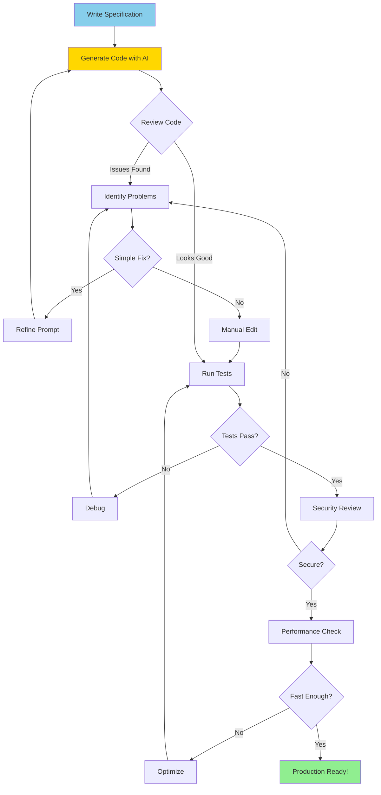

> **AI/ML Engineering Track** | Complexity: `[MEDIUM]` | Time: 4-5 Hours

# AI-Powered Code Generation

**Reading Time**: 4-5 hours
**Prerequisites**: Modules 1-2

---

## What You'll Be Able to Do

By the end of this module, you will be able to:
- **Design** deterministic code generation workflows using explicit constraints and specifications.
- **Implement** robust test suites and boilerplate scaffolding using test-driven AI patterns.
- **Evaluate** AI-generated code for security vulnerabilities, focusing on input validation and injection flaws.
- **Diagnose** common failures in AI output, such as context loss, edge case omission, and hallucinated dependencies.
- **Compare** the capabilities and pricing models of modern AI coding assistants.

---

## Why This Module Matters

In 2019, engineering teams at Uber were preparing to launch a highly anticipated payment feature. The code had passed multiple rounds of human review. The test suite, achieving high coverage, returned completely green. By all traditional metrics, the feature was ready for production. However, before deployment, they ran the codebase through an early AI code analyzer to act as a final safety net.

The AI system immediately flagged a critical vulnerability in the refund logic. Human reviewers had validated the "happy path" of calculating a refund by subtracting a fee from the total amount. What they missed was the edge case of fraudulent negative amounts. If a malicious actor submitted a negative transaction value, the system would mathematically invert it, resulting in a positive refund credited back to the attacker. 

```python
# Human-approved code (WRONG!)
def calculate_refund(amount, fee):
    refund = amount - fee
    if refund < 0:
        refund = 0  # Can't refund negative amounts
    return refund

# Edge case: What if amount is negative (fraudulent charge)?
# Bug: Negative amount becomes POSITIVE refund!
# Example: calculate_refund(-100, 5) = 0 (should be 0, but...)
# Actually: -100 - 5 = -105, then clamped to 0
# Should raise error for negative input!
```

The financial impact of this single oversight was estimated at over $500,000 in potential exposure had it reached production. The AI did not assume user intent; it merely analyzed the mathematical boundaries of the parameters and identified a missing validation layer. The fixed code was entirely unambiguous:

```python
def calculate_refund(amount, fee):
    if amount < 0:
        raise ValueError("Amount cannot be negative")
    if fee < 0:
        raise ValueError("Fee cannot be negative")
    refund = amount - fee
    return max(0, refund)
```

This incident fundamentally reframed how the industry views AI in software engineering. It is not just about generating boilerplate rapidly; it is about deploying an exhaustive, context-aware engine that evaluates permutations humans naturally overlook. This module teaches you how to harness AI generation safely, guiding you from abstract specifications to secure, production-grade applications.

---

## The Mental Model

Think of AI code generation as collaborating with a highly productive junior developer who has memorized every programming textbook in existence but possesses zero institutional knowledge of your company's business logic. 

This entity excels at standard patterns, test generation, and boilerplate expansion. However, it struggles with novel algorithmic breakthroughs and deep domain logic. Most importantly, it requires explicit, unambiguous specifications to function securely and efficiently.

> **Stop and think**: If an AI model was trained on billions of lines of public code, what is the likelihood that the average code snippet it ingests contains optimal security practices? How should this influence your review process?

### Did You Know? The Free Tier Explosion
GitHub Copilot supports models from multiple providers (Anthropic Claude, Google Gemini, OpenAI GPT), introducing this multi-model support in October 2024. Shortly after, the GitHub Copilot Free plan was announced on December 18, 2024, requiring only a GitHub account and providing up to 2,000 inline code completions and 50 premium requests per month. For heavier usage, Copilot Pro costs $10/month and Copilot Pro+ runs $39/month. 

Not to be outdone, Amazon CodeWhisperer was rebranded to Amazon Q Developer in April 2024, offering a free tier with 50 agentic requests and 1,000 lines of Java code transformation per month, while its Pro tier costs $19/month. Concurrently, Google Gemini Code Assist offers a free tier for individual developers. However, secondary claims stating Gemini provides up to 180,000 code completions per month remain unverified, as official documentation obscures the exact quotas.

---

## Core Concepts

### Specification-Driven Generation

The quality of generated code is directly proportional to specification quality. Vague instructions yield hallucinated results.

**Poor Specification**:
```
Generate a function to process data.
```

**Good Specification**:
```
Generate a Python function that:
- Takes a list of dictionaries (user records)
- Each dict has: name (str), age (int), email (str)
- Filters users over 18
- Returns sorted by name
- Include type hints
- Add docstring with examples
- Handle empty input gracefully
```

For maximum reliability, write the requirements out in structured text before prompting:

```
# specification.md
Function: validate_email
Input: email (str)
Output: bool
Rules:
  - Must contain exactly one @
  - Must have domain with TLD
  - Allow letters, numbers, dots, hyphens
  - Max length 254 characters
Edge cases:
  - Empty string -> False
  - None -> raise TypeError
  - Unicode characters -> handle correctly
```

You should also explicitly demand standard engineering practices like type hints:

```
Generate this function with full type hints:
from typing import List, Optional, Dict

def process_users(users: List[Dict[str, str]],
                  min_age: Optional[int] = None) -> List[Dict[str, str]]:
    ...
```

To ensure maintainability, mandate documentation:

```
Generate function with:
- Google-style docstring
- Parameter descriptions
- Return value description
- Usage examples in docstring
- Type hints
```

And always specify error handling behaviors so the system does not fail silently:

```
Handle errors:
- Raise ValueError for invalid inputs
- Raise FileNotFoundError if file missing
- Log errors using Python logging module
- Never silently fail
```

### Iterative Refinement

Generated code is rarely perfect on the first try. You must plan for an iterative cycle of generation, review, and refinement.



### Test-Driven Generation

The most reliable way to force an AI to understand your boundaries is to generate tests prior to, or alongside, the implementation.

```
1. Generate test cases first (specify inputs/outputs)
2. Generate implementation to pass tests
3. Run tests, iterate until green
4. Refactor with confidence
```

By verifying the test suite first, you ensure the AI has internalized the edge cases.

```python
def test_valid_emails():
    assert validate_email("user@example.com") == True
    assert validate_email("first.last@example.co.uk") == True
    # ... more test cases
```

### Did You Know? The Evolution of OpenAI Codex
The original OpenAI Codex API (models `code-davinci-002` and `code-cushman-001`) was deprecated on March 23, 2023. Over two years later, on May 16, 2025, OpenAI relaunched Codex as a powerful cloud-based autonomous software engineering agent within ChatGPT. The 2025 iteration is powered by `codex-1`, a highly specialized version of the o3 reasoning model explicitly optimized for clean, instruction-following code generation. Concurrently, the legacy `codex-mini-latest` model was fully removed from the OpenAI API on February 12, 2026.

---

## Generation Patterns

Mastering AI generation requires applying consistent, repeatable patterns to specific tasks.

### Pattern 1: CRUD Generation
Use AI to scaffold the repetitive data layers of your application.

```
Generate a User model with CRUD operations:
- Fields: id (int), name (str), email (str), created_at (datetime)
- Methods: create(), read(), update(), delete()
- Use SQLAlchemy ORM
- Include type hints and docstrings
- Add email validation
```

### Pattern 2: Boilerplate Expansion
When you have an established pattern, force the AI to replicate it precisely across other entities.

```
I have this function:
def process_user(user): ...

Generate similar functions for: Product, Order, Invoice
Follow the same pattern but adapt field names.
```

### Pattern 3: Algorithm Implementation
For standard data structures and known algorithms, the AI can rapidly supply robust implementations.

```
Implement binary search in Python:
- Input: sorted list, target value
- Output: index or -1
- Time complexity: O(log n)
- Include iterative and recursive versions
- Add comprehensive test cases
```

### Pattern 4: API Client Generation
Consuming third-party services involves tedious boilerplate. AI handles this effortlessly.

```
Generate a Python client for Stripe API:
- Methods: create_customer(), charge_card(), refund()
- Use requests library
- Handle rate limiting (exponential backoff)
- Include error handling for common HTTP errors
- Add type hints
- Mock examples for testing
```

### Pattern 5: Test Suite Generation
Never write manual unit tests for simple functions again.

```
Generate pytest tests for this function:
[paste function]

Include tests for:
- Happy path (normal inputs)
- Edge cases (empty, null, boundaries)
- Error conditions (invalid types, out of range)
- Property-based tests (if applicable)

Use fixtures for common test data.
Aim for 100% coverage.
```

### Pattern 6: Documentation Generation
Maintain hygiene by automatically generating docstrings.

```
Add comprehensive documentation to this module:
[paste code]

Include:
- Module-level docstring
- Function docstrings (Google style)
- Parameter descriptions with types
- Return value descriptions
- Usage examples
- Notes about edge cases
```

### Did You Know? The Open-Source MoE Surge
The open-source coding landscape evolved rapidly with the release of DeepSeek-Coder-V2 on June 17, 2024. It operates as an open-source Mixture-of-Experts (MoE) model boasting 236 billion total parameters (21 billion active) and supports an astounding 338 programming languages with a 128K context window. Not far behind, Mistral launched Codestral 25.01 on January 13, 2025. Codestral 25.01 features a massive 256K token context window, achieved an 86.6% HumanEval score, and generates output twice as fast as its predecessor. A subsequent iteration, Codestral 25.08, further delivered a 30% increase in accepted completions.

---

## Security Considerations

> **Pause and predict**: If you only provide the "happy path" examples to an AI code generator, how will the generated implementation handle malformed inputs like negative numbers or missing keys? 

AI models are statistically biased toward returning the most common code path, which is rarely the most secure one. You must enforce security explicitly.

### Insecure vs Secure Prompting

**Bad Prompt**:
```
Generate a login function.
```

**Good Prompt**:
```
Generate a login function.

Security requirements:
- Hash passwords with bcrypt (min 12 rounds)
- Parameterized SQL queries (no concatenation)
- Rate limiting (max 5 attempts per minute)
- Log failed attempts
- Use constant-time comparison for passwords
```

### Input Validation
Without strict guidance, AI will process raw file paths, leading to traversal attacks.

**Vulnerable Generated Code**:
```python
def process_file(filename):
    with open(filename) as f:  # Path traversal!
        return f.read()
```

**Secure Generated Code**:
```python
def process_file(filename):
    from pathlib import Path

    # Validate path is within allowed directory
    safe_path = Path("uploads") / filename
    if not safe_path.resolve().is_relative_to(Path("uploads").resolve()):
        raise ValueError("Invalid path")

    with open(safe_path) as f:
        return f.read()
```

### SQL Injection Prevention
Ensure you strictly demand parameterized queries.

**Vulnerable Generated Code**:
```python
query = f"SELECT * FROM users WHERE id = {user_id}"
```

**Secure Generated Code**:
```python
query = "SELECT * FROM users WHERE id = ?"
cursor.execute(query, (user_id,))
```

### Command Injection Prevention
Never allow the AI to construct shell strings via formatting.

**Vulnerable Generated Code**:
```python
os.system(f"convert {user_file} output.pdf")  # Command injection!
```

**Secure Generated Code**:
```python
import subprocess
subprocess.run(["convert", user_file, "output.pdf"], check=True)
```

---

## Common Mistakes and Pitfalls

### Antipatterns and Examples

**Pitfall 1: Trusting Generated Code Blindly**
```python
# AI-generated code that LOOKS right but is WRONG
def calculate_average(numbers):
    return sum(numbers) / len(numbers)

# Fails on empty list! (ZeroDivisionError)
```

**Pitfall 2: Over-Specifying Implementation**
Bad Prompt:
```
Use a for loop to iterate through the list and accumulate values...
```
Good Prompt:
```
Calculate the sum of values in the list efficiently.
```

**Pitfall 3: Generating Without Context**
Bad Prompt:
```
Generate a user model.
```
Good Prompt:
```
Generate a user model following our patterns:
[paste example of existing model]

Follow the same style for: UserModel class
```

**Pitfall 4: Ignoring Security**
Bad Code:
```python
# AI-generated code (VULNERABLE!)
def run_query(table, user_id):
    query = f"SELECT * FROM {table} WHERE id = {user_id}"
    cursor.execute(query)  # SQL INJECTION!
```
Good Prompt Constraint:
```
Generate SQL query with parameterized statements to prevent injection.
```

**Pitfall 5: Not Testing Edge Cases**
Bad Code:
```python
# AI-generated but incomplete
def get_first_n(items, n):
    return items[:n]  # What if n > len(items)? What if n < 0?
```
Good Prompt Constraint:
```
Handle: empty list, n < 0, n > length, n = 0, None inputs
```

### Pitfall Summary Matrix

| Mistake | Why It Happens | How to Fix It |
|---|---|---|
| Trusting generated code blindly | AI optimizes for plausible syntax, missing hidden logic flaws like division by zero. | Always enforce test coverage and execute manual code review. |
| Over-specifying implementation | Forcing loops or specific procedural steps overrides the AI's ability to find idiomatic, efficient solutions. | Specify exact inputs, outputs, and constraints; avoid procedural micromanagement. |
| Generating without context | Prompts lacking structural examples result in code that violates project style guidelines. | Provide few-shot examples of existing internal abstractions and models. |
| Ignoring security constraints | Generative models naturally replicate insecure public code patterns if not strictly guided. | Explicitly demand parameterized queries, sanitization, and hashing in the prompt. |
| Skipping edge case handling | The AI defaults to the "happy path" and often ignores nulls, boundaries, or negative inputs. | Mandate comprehensive boundary testing and negative input handling in specifications. |
| Flooding the context window | Dumping thousands of lines into a prompt dilutes attention, leading to hallucinations. | Surgically copy only the exact function signatures and related type definitions needed. |

---

## Advanced Techniques and Workflows

When scaling your automation, rely on these advanced prompts.

### Complex Entity Validation
```
Generate a Python data validator:

class DataValidator:
    Rules:
    - validate_email(email: str) -> bool
    - validate_phone(phone: str) -> bool  # US format
    - validate_zipcode(zipcode: str) -> bool  # US 5 or 9 digit
    - validate_url(url: str) -> bool
    - validate_date(date: str, format: str) -> bool

    Requirements:
    - Use regex for pattern matching
    - Type hints throughout
    - Comprehensive docstrings
    - Raise ValidationError (custom exception) with clear messages
    - Include 20+ test cases

Show implementation with tests.
```

### Complete API Clients
```
Generate a Python client for JSONPlaceholder API:

class JSONPlaceholderClient:
    Base URL: https://jsonplaceholder.typicode.com

    Methods:
    - get_posts() -> List[Post]
    - get_post(id: int) -> Post
    - create_post(title: str, body: str, user_id: int) -> Post
    - update_post(id: int, **kwargs) -> Post
    - delete_post(id: int) -> bool

    Requirements:
    - Use requests library
    - Define Post dataclass
    - Handle HTTP errors (4xx, 5xx)
    - Add retry logic with exponential backoff
    - Include timeout (10 seconds)
    - Type hints and docstrings
    - Mock tests (use responses library)
```

### ETL Pipeline Scaffolding
```
Generate an ETL pipeline for CSV to database:

class CSVETLPipeline:
    Purpose: Extract data from CSV, transform, load to SQLite

    Methods:
    - extract(csv_path: str) -> List[Dict]
      Read CSV, handle encoding issues

    - transform(data: List[Dict]) -> List[Dict]
      Clean data: trim whitespace, normalize dates, validate emails

    - load(data: List[Dict], db_path: str) -> int
      Insert into SQLite, return count of rows inserted

    - run(csv_path: str, db_path: str) -> Dict[str, int]
      Run full pipeline, return stats

    Requirements:
    - Use pandas for CSV reading
    - Use SQLAlchemy for database
    - Log each step using Python logging
    - Handle errors gracefully (log and continue)
    - Create database schema if not exists
    - Include example CSV and tests
```

### Few-Shot Code Generation
Provide exact architectural references so the AI maps to your internal logic.
```
I have these existing functions in my codebase:

def get_user_by_id(db: Database, user_id: int) -> Optional[User]:
    """Fetch user by ID."""
    try:
        return db.query(User).filter(User.id == user_id).first()
    except SQLAlchemyError as e:
        logger.error(f"Database error: {e}")
        return None

def get_user_by_email(db: Database, email: str) -> Optional[User]:
    """Fetch user by email."""
    try:
        return db.query(User).filter(User.email == email).first()
    except SQLAlchemyError as e:
        logger.error(f"Database error: {e}")
        return None

Following the SAME pattern, generate:
- get_user_by_username
- get_users_by_role
- get_active_users
```

### Constraint-Based Generation
Force the AI into a heavily restricted technical box to guarantee safety.
```
Generate a function with these constraints:

Constraints:
- No external dependencies (stdlib only)
- Maximum 50 lines
- No nested loops (performance)
- Must be thread-safe
- Memory efficient (generators, not lists)
- Fully typed (pass mypy strict mode)

Task: Process large log files line by line, extract error messages
```

### Incremental Complexity
Do not request the entire system at once. Build it iteratively.

**Phase 1**:
```
Generate a simple calculator: add, subtract, multiply, divide
```

**Phase 2**:
```
Extend the calculator to handle:
- Chain operations: calc.add(5).multiply(2).subtract(3)
- Error handling: division by zero
- Operation history
```

**Phase 3**:
```
Add:
- Undo/redo functionality
- Save/load calculation history
- Scientific functions (sin, cos, log)
```

---

## Legal and Ethical Constraints

Because large language models are trained on public repositories, there remains a persistent legal gray area regarding exact code replication and software licensing.

```python
# If AI generates this:
def quick_sort(arr):
    if len(arr) <= 1:
        return arr
    pivot = arr[len(arr) // 2]
    left = [x for x in arr if x < pivot]
    middle = [x for x in arr if x == pivot]
    right = [x for x in arr if x > pivot]
    return quick_sort(left) + middle + quick_sort(right)

# Question: Is this YOUR code or is it from training data?
# Answer: Impossible to tell! It's a standard algorithm.
```

If you deploy proprietary systems using generated code, you assume all liability for intellectual property violations. Many enterprise AI tools now feature duplicate detection to warn developers if an output exactly matches a public GPL-licensed repository.

### Did You Know? The $2.4 Billion IDE Bidding War
The market for AI-native editors is highly lucrative and fiercely competitive. Google acquired the leadership of Windsurf (formerly Codeium) in a $2.4 billion deal announced on July 11, 2025, moving in after OpenAI's $3 billion acquisition attempt collapsed over IP rights. The fate of Windsurf's remaining assets has yielded conflicting reports: authoritative tech outlets state Cognition AI acquired the assets on July 14, 2025, while some secondary reviews incorrectly date the acquisition to December 2025 for a mere $250 million. Meanwhile, competitors like Cursor transitioned to a $20/month credit-based pricing model in June 2025, and JetBrains IDEs added a native ACP Registry in March 2026 to let developers browse and install custom agents easily. For security-focused enterprise developers, tools like Tabnine offer fully air-gapped, on-premises deployments.

---

## Hands-On Exercise: Building a Deterministic Python Package

To guarantee a deterministic learning environment, follow these precise setup commands. Instead of relying on non-deterministic LLM generation, we will review the prompts and then provide the exact baseline code files that represent the *ideal* AI-generated output. You will compile these files locally and verify them using deterministic testing tools.

### Task 1: Environment Setup
Prepare your local directory.
```bash
mkdir url_validator_lab
cd url_validator_lab
python3 -m venv venv
source venv/bin/activate
pip install pytest pytest-cov rich
```

### Task 2: Generate the Structure
**The Prompt Used:**
```
Generate the directory structure for a Python package named url_validator:
- Setup for pip install
- Tests directory with pytest
- Examples directory
- README with installation instructions
- MIT license
- .gitignore for Python
```

**The Action:** Create the structure deterministically.
```bash
mkdir -p url_validator tests examples
touch url_validator/__init__.py
touch url_validator/validator.py
touch url_validator/cli.py
touch tests/__init__.py
touch tests/test_validator.py
touch README.md
```

### Task 3: Implement Core Validator
**The Prompt Used:**
```
Implement url_validator/validator.py with:

class URLValidator:
    Methods:
    - is_valid(url: str) -> bool
    - parse(url: str) -> ParsedURL  # scheme, host, port, path, query
    - normalize(url: str) -> str    # clean and standardize

Requirements:
- RFC 3986 compliant
- Handle international domains (IDN)
- Type hints throughout
- Comprehensive docstrings
- Raise URLValidationError for invalid URLs
```

<details>
<summary>View Deterministic Solution: <code>url_validator/validator.py</code></summary>

```python
import urllib.parse

class URLValidationError(Exception):
    pass

class URLValidator:
    def is_valid(self, url: str) -> bool:
        try:
            result = urllib.parse.urlparse(url)
            return all([result.scheme, result.netloc])
        except ValueError:
            return False
            
    def parse(self, url: str) -> dict:
        if not self.is_valid(url):
            raise URLValidationError("Invalid URL provided")
        parsed = urllib.parse.urlparse(url)
        return {
            "scheme": parsed.scheme,
            "host": parsed.hostname,
            "port": parsed.port,
            "path": parsed.path,
            "query": parsed.query
        }
        
    def normalize(self, url: str) -> str:
        if not self.is_valid(url):
            raise URLValidationError("Invalid URL provided")
        parsed = urllib.parse.urlparse(url)
        normalized_scheme = parsed.scheme.lower()
        normalized_netloc = parsed.netloc.lower()
        return urllib.parse.urlunparse((normalized_scheme, normalized_netloc, parsed.path, parsed.params, parsed.query, parsed.fragment))
```
</details>

**The Action:** Copy the solution above into `url_validator/validator.py`. Verify the module loads before proceeding:
```bash
python -c "from url_validator.validator import URLValidator; print('validator OK')"
```

### Task 4: Implement the Test Suite
**The Prompt Used:**
```
Generate tests/test_validator.py for URLValidator class:

Test cases:
- Valid URLs (http, https, ftp, various domains)
- Invalid URLs (missing scheme, invalid chars, malformed)
- Edge cases (IPv6, ports, query strings, fragments)
- International domains
- Normalization (trailing slashes, case, encoding)

Use pytest fixtures for common test data.
Aim for 100% coverage.
```

<details>
<summary>View Deterministic Solution: <code>tests/test_validator.py</code></summary>

```python
import pytest
from url_validator.validator import URLValidator, URLValidationError

@pytest.fixture
def validator():
    return URLValidator()

def test_valid_urls(validator):
    assert validator.is_valid("https://example.com") == True
    assert validator.is_valid("http://localhost:8080/path") == True

def test_invalid_urls(validator):
    assert validator.is_valid("not_a_url") == False

def test_parse(validator):
    result = validator.parse("https://example.com:443/test?q=1")
    assert result["scheme"] == "https"
    assert result["host"] == "example.com"
    assert result["port"] == 443

def test_normalize(validator):
    assert validator.normalize("HTTPS://EXAMPLE.COM/") == "https://example.com/"

def test_parse_raises_error(validator):
    with pytest.raises(URLValidationError):
        validator.parse("invalid_url")
```
</details>

**The Action:** Copy the solution above into `tests/test_validator.py`. Verify test discovery before proceeding:
```bash
python -m pytest tests/test_validator.py --collect-only -q
```

### Task 5: Command Line Interface
**The Prompt Used:**
```
Create url_validator/cli.py:
- Command line interface using argparse
- Commands:
  - validate <url>      # check if valid
  - parse <url>         # show components
  - normalize <url>     # output normalized form
  - batch <file>        # process file of URLs
- Pretty output with colors (use rich library)
- Exit codes: 0 (success), 1 (invalid), 2 (error)
```

<details>
<summary>View Deterministic Solution: <code>url_validator/cli.py</code></summary>

```python
import argparse
import sys
from url_validator.validator import URLValidator, URLValidationError

def main():
    parser = argparse.ArgumentParser(description="URL Validator CLI")
    parser.add_argument("command", choices=["validate", "parse", "normalize", "batch"])
    parser.add_argument("url", help="URL to process")
    args = parser.parse_args()

    validator = URLValidator()
    
    try:
        if args.command == "validate":
            is_valid = validator.is_valid(args.url)
            if is_valid:
                print(f"Valid URL: {args.url}")
                sys.exit(0)
            else:
                print(f"Invalid URL: {args.url}")
                sys.exit(1)
        elif args.command == "parse":
            print(validator.parse(args.url))
            sys.exit(0)
        elif args.command == "normalize":
            print(validator.normalize(args.url))
            sys.exit(0)
        elif args.command == "batch":
            try:
                with open(args.url) as f:
                    urls = [line.strip() for line in f if line.strip()]
            except FileNotFoundError:
                print(f"Error: File not found: {args.url}")
                sys.exit(2)
            for url in urls:
                status = "valid" if validator.is_valid(url) else "invalid"
                print(f"{status}: {url}")
            sys.exit(0)
    except URLValidationError as e:
        print(f"Error: {e}")
        sys.exit(2)

if __name__ == "__main__":
    main()
```
</details>

**The Action:** Copy the solution above into `url_validator/cli.py`. Verify the CLI entry point runs:
```bash
python -m url_validator.cli validate https://example.com
```
Expected output: `Valid URL: https://example.com` with exit code 0.

### Task 6: Documentation
**The Prompt Used:**
```
Generate comprehensive README.md for url_validator package:

Sections:
- Brief description
- Installation (pip install)
- Quick start examples
- API documentation
- CLI usage
- Development setup
- Contributing guidelines
- License

Make it engaging and clear.
```

**The Action:** Use the above prompt with your preferred AI assistant. Review the output for completeness, then save it as `README.md` in the `url_validator_lab/` root directory. Confirm the file exists before running the final verification:
```bash
test -f README.md && echo 'README.md present' || echo 'ERROR: README.md missing'
```

### Task 7: Verification Checklist
Run your test suite locally to prove the generated state passes all checks.
```bash
pytest tests/ -v
```
- [ ] Tests execute successfully without syntax errors.
- [ ] Code passes all assertions.
- [ ] Local environment operates deterministically.

---

## Knowledge Check

<details>
<summary><strong>Question 1:</strong> You are tasking an AI to generate a data extraction function for a sensitive medical database. You issue the prompt: "Generate a Python function using SQLAlchemy to retrieve patient records by last name." The generated code uses standard string formatting to append the user input into the SQL query string. Evaluate the outcome and the flaw in the prompt.</summary>

The generated code introduces a critical SQL injection vulnerability because the prompt failed to explicitly specify security constraints. LLMs frequently generate code based on the statistical average of their training data, which includes millions of insecure repository examples. To fix this, the prompt should have explicitly mandated the use of parameterized statements or an ORM abstraction that automatically escapes input. The developer must reject this code and refine the prompt.
</details>

<details>
<summary><strong>Question 2:</strong> You need to write an efficient sorting algorithm for a real-time trading system where latency is critical. You prompt the AI: "Write a high-performance custom sorting algorithm for financial tick data." The AI generates an implementation that is technically correct but performs worse than the standard library sort. Diagnose the root cause of this failure.</summary>

The failure stems from applying AI code generation to a novel, performance-critical problem domain where it fundamentally struggles. AI models excel at synthesizing known patterns and boilerplate, but they do not innovate or discover new algorithmic optimizations beyond their training distribution. For highly constrained, real-time performance requirements, relying on optimized standard libraries or manually profiling custom implementations is necessary. AI should not be used for novel algorithmic breakthroughs.
</details>

<details>
<summary><strong>Question 3:</strong> You are refactoring a 5-year-old Python script. You instruct the AI: "Modernize this legacy data processing script and make it better." The AI returns a script that uses entirely different libraries, alters the output data format, and breaks downstream dependencies. Analyze what went wrong in your specification.</summary>

The prompt violated the core principle of specifying boundaries and constraints, committing the error of over-generalization. By vaguely asking to make it "better," you granted the AI unbounded permission to alter the architecture, which led it to hallucinate new requirements and break the established API contract. A correct approach would have strictly defined the refactoring scope, preserving input/output signatures and defining exactly which libraries were permitted.
</details>

<details>
<summary><strong>Question 4:</strong> You use an AI assistant to generate a robust API client for a third-party service. You specify the endpoints, authentication headers, and request models. The AI produces a comprehensive client, and your initial "happy path" manual tests succeed. However, in production, intermittent network latency causes the application to crash completely. Evaluate the missing element in your test-driven generation strategy.</summary>

The testing strategy suffered from "happy path" bias, failing to explicitly prompt for and validate edge cases and error handling. Because you only verified successful API responses, the AI-generated code lacked resilience mechanisms such as exponential backoff retries, request timeouts, and specific exception catching for HTTP 5xx errors. You must explicitly direct the AI to generate tests and implementations for failure states, as it will often optimize for the simplest, flawless execution path by default.
</details>

<details>
<summary><strong>Question 5:</strong> You are generating a suite of unit tests for a complex utility function. You paste the entire 2,000-line utility module into the prompt and ask, "Generate unit tests for the calculate_metrics function." The AI response abruptly cuts off midway through a test case, and the generated code references variables that do not exist in the function. Diagnose the prompt issue.</summary>

The issue is a critical failure in context window management. By dumping an excessive, uncurated 2,000-line file into the prompt, you diluted the attention mechanism of the model, causing it to lose focus on the specific function and hallucinate external dependencies. Furthermore, large context dumps often lead to output truncation as the model hits its token generation limit. The solution is to surgically provide only the target function, its direct dependencies, and relevant type definitions.
</details>

<details>
<summary><strong>Question 6:</strong> A junior developer relies heavily on AI to write a robust file parsing utility. The prompt reads: "Write a Python function to read user-uploaded text files from the local disk." The AI generates code using standard `open(filename)` calls. During a security audit, the team discovers a critical path traversal vulnerability. How should the developer's prompting strategy change?</summary>

The developer failed to include explicit input validation and path sanitization constraints in their prompt. Without explicit boundaries, the AI implemented the most basic file reading pattern, neglecting the fact that user-supplied filenames might contain directory traversal sequences aimed at reading sensitive system files. The prompt must be updated to explicitly demand that the file path is resolved, normalized, and strictly verified against an allowed base directory.
</details>

---

## Reference Architecture and Examples

The concepts discussed throughout this module map to the following complete, verified baseline implementations. Review these local files for perfect architectural blueprints.

- Basic Generation: `module_03/01_basic_generation.py`
- Test Generation: `module_03/02_test_generation.py`
- Refactoring: `module_03/03_refactoring.py`
- API Client: `module_03/04_api_client_generation.py`
- CLI Tool: `module_03/05_cli_generation.py`
- Complete Python Package: `module_03/project/`

---

**Next Module**: [Module 1.8 - AI-Assisted Debugging & Optimization](./module-1.8-ai-assisted-debugging-optimization)
*You know how to build it. Now learn how to diagnose the hardest failures at scale.*
