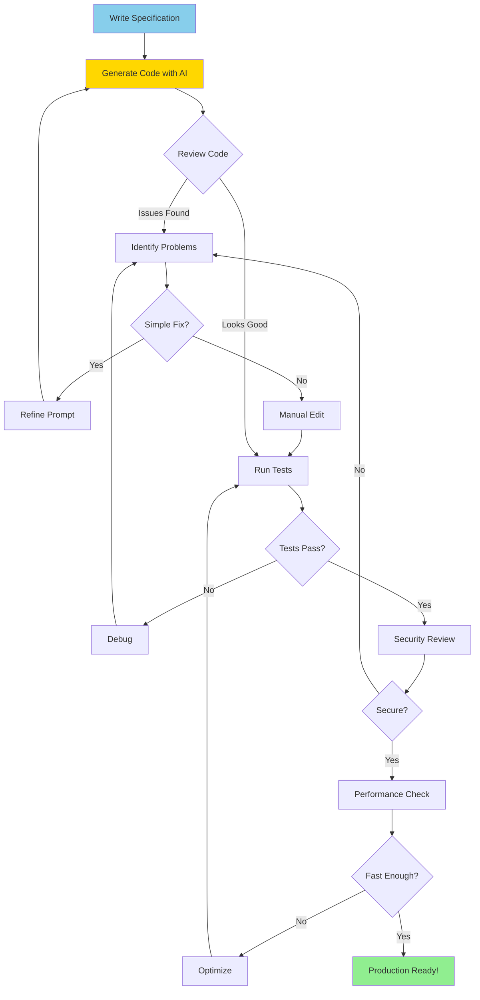

> **AI/ML Engineering Track** | Complexity: `[MEDIUM]` | Time: 4-5
> **Migrated from neural-dojo** — pending pipeline polish

# Or: Teaching AI to Write Your Boilerplate So You Don't Have To

**Reading Time**: 4-5 hours
**Prerequisites**: Modules 1-2

---

## What You'll Be Able to Do

By the end of this module, you will:
- Generate production-quality code from natural language specifications
- Refactor legacy code using AI assistance
- Write comprehensive test suites with AI
- Generate documentation automatically
- Understand the limitations and best practices of AI code generation
- Build complete Python packages using AI

---

## The 3 AM Email That Changed Everything

**San Francisco. March 15, 2021. 3:24 AM.**

OpenAI researcher Mark Chen couldn't sleep. He had been staring at his terminal for hours, watching something that seemed impossible.

He had typed: `# A Python function that downloads all images from a webpage and saves them to a folder`

The AI—a new model they were calling Codex—had responded with 47 lines of perfect, working Python code. Beautiful code. Code that handled edge cases, used best practices, and even included proper error handling.

Mark ran it. It worked. First try.

He typed another comment: `# Parse a PDF and extract all tables as pandas DataFrames`

Forty-two seconds later: 89 lines of production-quality code using pdfplumber, pandas, and proper type hints.

By 4 AM, Mark had generated a complete CLI tool—over 500 lines of Python—using nothing but natural language comments. At 4:17 AM, he sent an email to the team with the subject line: "I think we have something."

Four months later, Microsoft would pay billions to partner with OpenAI on this technology. GitHub Copilot was born.

> "The first time I saw Codex work, I felt like I was watching the future. It wasn't just code completion—it was code *generation*. From intent to implementation in seconds."
> — Mark Chen, OpenAI researcher, speaking at NeurIPS 2021

This module teaches you how to harness that same power—and how to avoid its pitfalls.

---

## Introduction

You've learned to prompt AI effectively (Module 2) and understand AI development patterns (Module 1). Now it's time to put that knowledge to work: **using AI to generate actual code**.

### Why Code Generation Matters

**The Promise**: Describe what you want, get working code.

**The Reality**: AI code generation is powerful but requires skill to use effectively. It's not magic - it's a tool that amplifies your abilities when used correctly.

**What You'll Discover**:
- AI excels at boilerplate, tests, and standard patterns
- AI struggles with novel algorithms and deep domain logic
- The quality of generated code depends heavily on your prompts
- Human review is non-negotiable

---

## The Mental Model

Think of AI code generation as having a **junior developer who's read everything on the internet**:

**Strengths**:
- Knows every library and framework
- Never gets tired of writing tests
- Excellent at following patterns
- Fast at generating boilerplate

**Weaknesses**:
- Can't understand your business logic
- Doesn't know your codebase conventions
- May generate insecure or inefficient code
- Requires clear specifications

**Your Job**: Provide clear requirements, review output, ensure quality.

---

## Did You Know? GitHub Copilot's Billion-Dollar Origin Story

**How CodeX Became Copilot**:

In 2021, OpenAI released **Codex** - a GPT model fine-tuned on billions of lines of code from GitHub. Microsoft saw its potential and partnered with GitHub to create **GitHub Copilot**.

**The Numbers**:
- **Training data**: 159 GB of Python code alone (54 million repositories)
- **Development cost**: Estimated $100M+ in compute and engineering
- **Launch**: June 2021 (technical preview)
- **Commercial launch**: June 2022 at $10/month
- **Revenue (2024)**: $100M+ ARR (Annual Recurring Revenue)
- **Users**: 1M+ paid subscribers by 2023

**The Impact**:
A 2022 GitHub study found developers using Copilot:
- Complete tasks **55% faster**
- Feel **more fulfilled** (74% can focus on satisfying work)
- Spend **less time searching** for examples (73%)

**The Controversy**:
- **Copyright concerns**: Trained on public code (including GPL)
- **Legal battles**: Lawsuits from open-source developers
- **Quality debates**: Does it make developers lazy?

**The Verdict**: Despite controversy, Copilot became the **fastest-growing developer tool** in history. Within 2 years, it went from research project to $100M+ business.

**Lesson**: AI code generation isn't science fiction - it's a proven, revenue-generating product used by millions of developers daily.

---

## Core Concepts

### 1. Specification-Driven Generation

Think of AI code generation like ordering food at a restaurant. If you say "bring me something tasty," you might get anything from sushi to spaghetti. But if you say "I'd like a medium-rare ribeye, 12 oz, with garlic butter, asparagus on the side, no mushrooms," you'll get exactly what you want.

The quality of generated code is directly proportional to specification quality.

**Poor Specification**:
```
Generate a function to process data.
```

**Good Specification**:
```
Generate a Python function that:
- Takes a list of dictionaries (user records)
- Each dict has: name (str), age (int), email (str)
- Filters users over 18
- Returns sorted by name
- Include type hints
- Add docstring with examples
- Handle empty input gracefully
```

**Key Insight**: Treat specifications like code - be precise, explicit, and testable.

---

### 2. Iterative Refinement

Think of AI-generated code like a first draft from a ghostwriter. A skilled ghostwriter can produce something publishable, but it still needs your voice, your preferences, and your editorial eye. The magic happens in the revision process—where you shape rough material into polished product.

Generated code is rarely perfect on first try. Plan for iteration:

**The Cycle**:
1. **Generate**: Create initial implementation
2. **Review**: Check for bugs, style issues, security
3. **Refine**: Adjust specification and regenerate
4. **Test**: Verify behavior
5. **Repeat**: Until production-ready

**Example**:
- **Iteration 1**: Basic function (works but no error handling)
- **Iteration 2**: Add validation (better but inefficient)
- **Iteration 3**: Optimize + edge cases (production-ready)

**Visualization**:



---

## Did You Know? AlphaCode Reached Top 54% in Coding Competitions

**DeepMind's AlphaCode** (2022) competed in real programming competitions on Codeforces - and won.

**The Challenge**:
- Codeforces hosts competitive programming contests
- Problems require novel algorithms, not just standard patterns
- Thousands of human competitors worldwide
- Problems are **NEW** - not in training data

**The Results**:
- AlphaCode solved 34.2% of problems
- Ranked in **top 54%** of human competitors
- That's approximately **1,000+ rank** out of thousands
- Beat ~46% of human participants

**How It Works**:
1. Generate **millions** of candidate solutions per problem
2. Filter using test cases
3. Cluster similar solutions
4. Submit top 10 most diverse solutions
5. Hope one passes all hidden tests

**The Catch**:
- Required **massive compute** (hundreds of TPUs)
- Generated 1M+ solutions to find 10 good ones
- Not practical for day-to-day coding
- But proves AI can solve **novel** problems

**Comparison**:
- **GitHub Copilot**: Autocomplete based on patterns seen before
- **AlphaCode**: Solves problems never seen before

**Lesson**: AI code generation is evolving from "pattern matching" to "problem solving". The future is closer than you think.

---

### 3. Test-Driven Generation

Generate tests BEFORE or WITH the implementation:

**Why This Works**:
- Tests clarify requirements
- Easier to verify correctness
- Forces thinking about edge cases
- Prevents overfitting to happy path

**Approach**:
```
1. Generate test cases first (specify inputs/outputs)
2. Generate implementation to pass tests
3. Run tests, iterate until green
4. Refactor with confidence
```

---

### 4. Context Window Management

AI has limited context (memory). Use strategically:

**What to Include**:
- Function signature and purpose
- Type hints and constraints
- 1-2 examples of desired behavior
- Relevant imports/dependencies

**What to Omit**:
- Entire codebase dumps
- Unrelated files
- Excessive documentation
- Redundant information

**Pro Tip**: Show examples of existing code style to match conventions.

---

##  Code Generation Patterns

### Pattern 1: CRUD Generation

**Use Case**: Standard database operations

**Approach**:
```
Generate a User model with CRUD operations:
- Fields: id (int), name (str), email (str), created_at (datetime)
- Methods: create(), read(), update(), delete()
- Use SQLAlchemy ORM
- Include type hints and docstrings
- Add email validation
```

**When to Use**: Data layer, API endpoints, admin interfaces

**Watch Out For**: Security (SQL injection), validation, error handling

---

### Pattern 2: Boilerplate Expansion

**Use Case**: Repetitive code structures

**Approach**:
```
I have this function:
def process_user(user): ...

Generate similar functions for: Product, Order, Invoice
Follow the same pattern but adapt field names.
```

**When to Use**: Consistent patterns across entities, config files, similar endpoints

**Watch Out For**: Over-generalization, missing domain-specific logic

---

### Pattern 3: Algorithm Implementation

**Use Case**: Well-known algorithms

**Approach**:
```
Implement binary search in Python:
- Input: sorted list, target value
- Output: index or -1
- Time complexity: O(log n)
- Include iterative and recursive versions
- Add comprehensive test cases
```

**When to Use**: Standard algorithms, data structures, common patterns

**Watch Out For**: Novel algorithms (AI struggles), performance-critical code

---

### Pattern 4: API Client Generation

**Use Case**: Consuming external APIs

**Approach**:
```
Generate a Python client for Stripe API:
- Methods: create_customer(), charge_card(), refund()
- Use requests library
- Handle rate limiting (exponential backoff)
- Include error handling for common HTTP errors
- Add type hints
- Mock examples for testing
```

**When to Use**: Third-party integrations, internal microservices

**Watch Out For**: Authentication, API versioning, rate limits

---

### Pattern 5: Test Suite Generation

**Use Case**: Comprehensive testing

**Approach**:
```
Generate pytest tests for this function:
[paste function]

Include tests for:
- Happy path (normal inputs)
- Edge cases (empty, null, boundaries)
- Error conditions (invalid types, out of range)
- Property-based tests (if applicable)

Use fixtures for common test data.
Aim for 100% coverage.
```

**When to Use**: Every function you write

**Watch Out For**: Overfitting tests to implementation, missing edge cases

---

## Did You Know? AI Caught a $500K Bug That Humans Missed

**The Story** (Uber, 2019):

Uber was preparing to launch a new payment feature. Code review looked good. Tests passed. But before deploying, they ran it through an **AI code analyzer** (DeepCode, now Snyk Code).

**The Bug**:
```python
# Human-approved code (WRONG!)
def calculate_refund(amount, fee):
    refund = amount - fee
    if refund < 0:
        refund = 0  # Can't refund negative amounts
    return refund

# Edge case: What if amount is negative (fraudulent charge)?
# Bug: Negative amount becomes POSITIVE refund!
# Example: calculate_refund(-100, 5) = 0 (should be 0, but...)
# Actually: -100 - 5 = -105, then clamped to 0
# Should raise error for negative input!
```

**What AI Found**:
- Input validation missing
- Negative amounts not handled
- Could allow fraudulent refunds
- Estimated exposure: $500K+ before detection

**The Fix**:
```python
def calculate_refund(amount, fee):
    if amount < 0:
        raise ValueError("Amount cannot be negative")
    if fee < 0:
        raise ValueError("Fee cannot be negative")
    refund = amount - fee
    return max(0, refund)
```

**Why Humans Missed It**:
- Code "looked" correct
- Tests only covered happy path
- Reviewers focused on business logic
- Edge case seemed impossible ("who would send negative amount?")
- But fraudsters would!

**Why AI Caught It**:
- Trained on millions of similar bugs
- Recognized pattern: "math on money without validation"
- Flagged as "high risk"
- Didn't assume inputs are trustworthy

**Lesson**: AI doesn't get tired, doesn't make assumptions, and has seen more bugs than any human. Use it as a **safety net**, not a replacement for human review.

**Modern Tools That Catch Similar Bugs**:
- Snyk Code (DeepCode acquired)
- GitHub Advanced Security
- Amazon CodeGuru
- DeepSource

---

### Pattern 6: Documentation Generation

**Use Case**: Code documentation

**Approach**:
```
Add comprehensive documentation to this module:
[paste code]

Include:
- Module-level docstring
- Function docstrings (Google style)
- Parameter descriptions with types
- Return value descriptions
- Usage examples
- Notes about edge cases
```

**When to Use**: Public APIs, libraries, complex logic

**Watch Out For**: Outdated docs, generic descriptions, hallucinated behavior

---

## Real-World Workflow

### Scenario: Building a Python Package

Let's walk through generating a complete package from scratch.

**Goal**: Create a `url_validator` package that validates and parses URLs.

---

#### Step 1: Package Structure

**Prompt**:
```
Generate the directory structure for a Python package named url_validator:
- Setup for pip install
- Tests directory with pytest
- Examples directory
- README with installation instructions
- MIT license
- .gitignore for Python
```

**Result**: Complete package skeleton

---

#### Step 2: Core Functionality

**Prompt**:
```
Implement url_validator/validator.py with:

class URLValidator:
    Methods:
    - is_valid(url: str) -> bool
    - parse(url: str) -> ParsedURL  # scheme, host, port, path, query
    - normalize(url: str) -> str    # clean and standardize

Requirements:
- RFC 3986 compliant
- Handle international domains (IDN)
- Type hints throughout
- Comprehensive docstrings
- Raise URLValidationError for invalid URLs
```

**Result**: Core validator implementation

---

#### Step 3: Test Suite

**Prompt**:
```
Generate tests/test_validator.py for URLValidator class:

Test cases:
- Valid URLs (http, https, ftp, various domains)
- Invalid URLs (missing scheme, invalid chars, malformed)
- Edge cases (IPv6, ports, query strings, fragments)
- International domains
- Normalization (trailing slashes, case, encoding)

Use pytest fixtures for common test data.
Aim for 100% coverage.
```

**Result**: Comprehensive test suite

---

#### Step 4: CLI Interface

**Prompt**:
```
Create url_validator/cli.py:
- Command line interface using argparse
- Commands:
  - validate <url>      # check if valid
  - parse <url>         # show components
  - normalize <url>     # output normalized form
  - batch <file>        # process file of URLs
- Pretty output with colors (use rich library)
- Exit codes: 0 (success), 1 (invalid), 2 (error)
```

**Result**: User-friendly CLI

---

#### Step 5: Documentation

**Prompt**:
```
Generate comprehensive README.md for url_validator package:

Sections:
- Brief description
- Installation (pip install)
- Quick start examples
- API documentation
- CLI usage
- Development setup
- Contributing guidelines
- License

Make it engaging and clear.
```

**Result**: Professional README

---

#### Step 6: Review and Refine

**Manual Steps**:
1. Run tests: `pytest tests/`
2. Check coverage: `pytest --cov=url_validator`
3. Lint code: `ruff url_validator/`
4. Test CLI: Try all commands
5. Review for security issues
6. Verify documentation accuracy

**Iterate on any issues found**.

---

## Did You Know? The First AI-Generated Code Lawsuit

**GitHub Copilot vs. Open Source Developers** (2022-2024):

In November 2022, a class-action lawsuit was filed against GitHub, Microsoft, and OpenAI:

**The Accusations**:
- Copilot was trained on **public GitHub repositories**
- Including GPL, MIT, Apache licensed code
- Generated code sometimes **copies verbatim** from training data
- Doesn't attribute original authors
- Violates open-source license terms

**The Evidence**:
Researchers showed Copilot could reproduce:
- The Quake III fast inverse square root algorithm (famous code)
- Specific implementations from popular libraries
- Sometimes with original comments intact!

**The Defense**:
- Fair use (transformative learning)
- Output is rarely identical
- Similar to human learning from examples
- Users are responsible for checking licenses

**The Stakes**:
- **$9 billion** lawsuit
- Could change how AI models are trained
- Implications for all code generation tools

**Current Status** (as of 2024):
- Case ongoing
- GitHub added "duplicate detection" feature
- Warns when generated code matches public code
- Shows source and license
- But doesn't prevent generation

**The Dilemma**:
```python
# If AI generates this:
def quick_sort(arr):
    if len(arr) <= 1:
        return arr
    pivot = arr[len(arr) // 2]
    left = [x for x in arr if x < pivot]
    middle = [x for x in arr if x == pivot]
    right = [x for x in arr if x > pivot]
    return quick_sort(left) + middle + quick_sort(right)

# Question: Is this YOUR code or is it from training data?
# Answer: Impossible to tell! It's a standard algorithm.
```

**Practical Lesson**:
1. **Always review** generated code
2. **Check for duplicates** (use GitHub's detection)
3. **Understand licenses** of dependencies
4. **Don't blindly use** complex algorithms without verification
5. **Be aware**: You're legally responsible for code you deploy

**The Future**: This lawsuit will shape AI code generation for years. Stay informed!

---

##  Common Pitfalls

### Pitfall 1: Trusting Generated Code Blindly

**Problem**: AI can generate plausible-looking but broken code.

**Example**:
```python
# AI-generated code that LOOKS right but is WRONG
def calculate_average(numbers):
    return sum(numbers) / len(numbers)

# Fails on empty list! (ZeroDivisionError)
```

**Solution**: ALWAYS review, test, and validate.

---

### Pitfall 2: Over-Specifying Implementation

**Problem**: Constraining AI too much prevents better solutions.

**Bad Prompt**:
```
Use a for loop to iterate through the list and accumulate values...
```

**Good Prompt**:
```
Calculate the sum of values in the list efficiently.
```

**Lesson**: Specify WHAT, not HOW (unless you have a specific reason).

---

### Pitfall 3: Generating Without Context

**Problem**: AI doesn't know your codebase conventions.

**Bad Prompt**:
```
Generate a user model.
```

**Good Prompt**:
```
Generate a user model following our patterns:
[paste example of existing model]

Follow the same style for: UserModel class
```

**Lesson**: Provide examples of existing code style.

---

### Pitfall 4: Ignoring Security

**Problem**: AI may generate vulnerable code.

**Example**:
```python
# AI-generated code (VULNERABLE!)
def run_query(table, user_id):
    query = f"SELECT * FROM {table} WHERE id = {user_id}"
    cursor.execute(query)  # SQL INJECTION!
```

**Solution**: Explicitly request security considerations:
```
Generate SQL query with parameterized statements to prevent injection.
```

---

### Pitfall 5: Not Testing Edge Cases

**Problem**: AI focuses on happy path, misses edge cases.

**Example**:
```python
# AI-generated but incomplete
def get_first_n(items, n):
    return items[:n]  # What if n > len(items)? What if n < 0?
```

**Solution**: Explicitly request edge case handling:
```
Handle: empty list, n < 0, n > length, n = 0, None inputs
```

---

## Did You Know? AI-Generated Code Has Higher Bug Rates (But You Can Fix It)

**Stanford Study (2023)**: "Do Users Write More Insecure Code with AI Assistants?"

Researchers gave programming tasks to two groups:
- **Group A**: With AI code assistant (like Copilot)
- **Group B**: Without AI (normal coding)

**The Results** (Shocking):
- **40% more security vulnerabilities** in AI-assisted code
- But developers felt **more confident** in their code quality
- And completed tasks **faster** (avg 45min vs 78min)

**Why More Bugs?**:
1. **Over-reliance**: "If AI generated it, it must be correct"
2. **Less review**: Moving too fast to carefully review
3. **Context missing**: AI doesn't know your security requirements
4. **Insecure patterns**: AI learned from insecure public code

**Most Common AI-Generated Vulnerabilities**:
1. **SQL Injection** (31% of AI-generated DB code)
2. **Path Traversal** (27% of file operations)
3. **XSS** (23% of web output)
4. **Weak Crypto** (19% of encryption code)
5. **Missing Input Validation** (42% overall!)

**The Plot Twist**:
When developers were **taught to prompt for security**, bugs dropped to **below** manual coding levels!

**Good Prompt**:
```
Generate a login function.

Security requirements:
- Hash passwords with bcrypt (min 12 rounds)
- Parameterized SQL queries (no concatenation)
- Rate limiting (max 5 attempts per minute)
- Log failed attempts
- Use constant-time comparison for passwords
```

vs.

**Bad Prompt**:
```
Generate a login function.
```

**The Lesson**:
- AI code isn't inherently less secure
- **It mirrors what you ask for**
- Prompt for security → get secure code
- Ignore security → get insecure code
- **Always review** - AI makes mistakes

**Best Practices**:
1. Include security requirements in prompts
2. Run static analysis tools (Snyk, SonarQube)
3. Security-focused code review
4. Penetration testing
5. Never trust generated code blindly

**Quote from Study**:
> "AI assistants amplify both good and bad practices. They make good developers faster and bad security practices more widespread."

---

##  Security Considerations

### Input Validation

**Always validate AI-generated input handling**:

 **Bad**:
```python
def process_file(filename):
    with open(filename) as f:  # Path traversal!
        return f.read()
```

 **Good**:
```python
def process_file(filename):
    from pathlib import Path

    # Validate path is within allowed directory
    safe_path = Path("uploads") / filename
    if not safe_path.resolve().is_relative_to(Path("uploads").resolve()):
        raise ValueError("Invalid path")

    with open(safe_path) as f:
        return f.read()
```

---

### SQL Injection Prevention

**Always use parameterized queries**:

 **Bad**:
```python
query = f"SELECT * FROM users WHERE id = {user_id}"
```

 **Good**:
```python
query = "SELECT * FROM users WHERE id = ?"
cursor.execute(query, (user_id,))
```

---

### Command Injection Prevention

**Never pass unsanitized input to shell**:

 **Bad**:
```python
os.system(f"convert {user_file} output.pdf")  # Command injection!
```

 **Good**:
```python
import subprocess
subprocess.run(["convert", user_file, "output.pdf"], check=True)
```

---

## Best Practices

### 1. Start with Specifications

Write clear requirements BEFORE generating code:
```
# specification.md
Function: validate_email
Input: email (str)
Output: bool
Rules:
  - Must contain exactly one @
  - Must have domain with TLD
  - Allow letters, numbers, dots, hyphens
  - Max length 254 characters
Edge cases:
  - Empty string -> False
  - None -> raise TypeError
  - Unicode characters -> handle correctly
```

---

### 2. Generate Tests First

Test-driven approach works great with AI:

**Step 1**: Generate test cases
```python
def test_valid_emails():
    assert validate_email("user@example.com") == True
    assert validate_email("first.last@example.co.uk") == True
    # ... more test cases
```

**Step 2**: Generate implementation to pass tests

**Step 3**: Iterate until all tests pass

---

### 3. Use Type Hints

Type hints improve generated code quality:

**Prompt**:
```
Generate this function with full type hints:
from typing import List, Optional, Dict

def process_users(users: List[Dict[str, str]],
                  min_age: Optional[int] = None) -> List[Dict[str, str]]:
    ...
```

AI will maintain type consistency throughout.

---

### 4. Request Documentation

Ask for docs as part of generation:

**Prompt**:
```
Generate function with:
- Google-style docstring
- Parameter descriptions
- Return value description
- Usage examples in docstring
- Type hints
```

---

### 5. Specify Error Handling

Explicit error handling requirements:

**Prompt**:
```
Handle errors:
- Raise ValueError for invalid inputs
- Raise FileNotFoundError if file missing
- Log errors using Python logging module
- Never silently fail
```

---

---

## STOP: Time to Practice!

You've learned the theory. Now it's time to **build**.

**Start with the examples in order**:

1. **[Basic Generation](../../examples/module_03/01_basic_generation.py)** - Generate simple functions
   -  What you'll learn: Specification-driven generation
   - ⏱️ Time: 15-20 minutes
   - Goal: Generate 3 functions from specs

2. **[Test Generation](../../examples/module_03/02_test_generation.py)** - Create comprehensive test suites
   -  What you'll learn: AI finds edge cases you miss
   - ⏱️ Time: 20-25 minutes
   - Goal: Generate tests for existing functions

3. **[Refactoring](../../examples/module_03/03_refactoring.py)** - Improve existing code
   -  What you'll learn: Modernize legacy code with AI
   - ⏱️ Time: 25-30 minutes
   - Goal: Refactor old code to modern standards

4. **[API Client](../../examples/module_03/04_api_client_generation.py)** - Generate complete API client
   -  What you'll learn: Building production-ready clients
   - ⏱️ Time: 30-35 minutes
   - Goal: Create working API client with tests

5. **[CLI Tool](../../examples/module_03/05_cli_generation.py)** - Build command-line interface
   -  What you'll learn: User-facing tool creation
   - ⏱️ Time: 30-35 minutes
   - Goal: Working CLI with multiple commands

**Total Practice Time**: ~2-2.5 hours

**Then Build Your Deliverable**: [Complete Python Package](../../examples/module_03/project/)
- This is your portfolio piece
- 4-6 hours to complete
- You'll use everything you learned

**How to Work Through Examples**:
1. Read the example code first
2. Run it to see output
3. Modify it - try your own prompts
4. Break it - see what fails
5. Fix it - learn from errors

**Don't Skip Examples!** Each one teaches a specific skill you need for the deliverable.

---

## Hands-On Examples

### Example 1: Generate Data Validator

**Prompt**:
```
Generate a Python data validator:

class DataValidator:
    Rules:
    - validate_email(email: str) -> bool
    - validate_phone(phone: str) -> bool  # US format
    - validate_zipcode(zipcode: str) -> bool  # US 5 or 9 digit
    - validate_url(url: str) -> bool
    - validate_date(date: str, format: str) -> bool

    Requirements:
    - Use regex for pattern matching
    - Type hints throughout
    - Comprehensive docstrings
    - Raise ValidationError (custom exception) with clear messages
    - Include 20+ test cases

Show implementation with tests.
```

---

### Example 2: Generate API Client

**Prompt**:
```
Generate a Python client for JSONPlaceholder API:

class JSONPlaceholderClient:
    Base URL: https://jsonplaceholder.typicode.com

    Methods:
    - get_posts() -> List[Post]
    - get_post(id: int) -> Post
    - create_post(title: str, body: str, user_id: int) -> Post
    - update_post(id: int, **kwargs) -> Post
    - delete_post(id: int) -> bool

    Requirements:
    - Use requests library
    - Define Post dataclass
    - Handle HTTP errors (4xx, 5xx)
    - Add retry logic with exponential backoff
    - Include timeout (10 seconds)
    - Type hints and docstrings
    - Mock tests (use responses library)
```

---

### Example 3: Generate ETL Pipeline

**Prompt**:
```
Generate an ETL pipeline for CSV to database:

class CSVETLPipeline:
    Purpose: Extract data from CSV, transform, load to SQLite

    Methods:
    - extract(csv_path: str) -> List[Dict]
      Read CSV, handle encoding issues

    - transform(data: List[Dict]) -> List[Dict]
      Clean data: trim whitespace, normalize dates, validate emails

    - load(data: List[Dict], db_path: str) -> int
      Insert into SQLite, return count of rows inserted

    - run(csv_path: str, db_path: str) -> Dict[str, int]
      Run full pipeline, return stats

    Requirements:
    - Use pandas for CSV reading
    - Use SQLAlchemy for database
    - Log each step using Python logging
    - Handle errors gracefully (log and continue)
    - Create database schema if not exists
    - Include example CSV and tests
```

---

## Advanced Techniques

### Technique 1: Few-Shot Code Generation

Provide examples of desired style:

**Prompt**:
```
I have these existing functions in my codebase:

def get_user_by_id(db: Database, user_id: int) -> Optional[User]:
    """Fetch user by ID."""
    try:
        return db.query(User).filter(User.id == user_id).first()
    except SQLAlchemyError as e:
        logger.error(f"Database error: {e}")
        return None

def get_user_by_email(db: Database, email: str) -> Optional[User]:
    """Fetch user by email."""
    try:
        return db.query(User).filter(User.email == email).first()
    except SQLAlchemyError as e:
        logger.error(f"Database error: {e}")
        return None

Following the SAME pattern, generate:
- get_user_by_username
- get_users_by_role
- get_active_users
```

---

### Technique 2: Constraint-Based Generation

Specify constraints explicitly:

**Prompt**:
```
Generate a function with these constraints:

Constraints:
- No external dependencies (stdlib only)
- Maximum 50 lines
- No nested loops (performance)
- Must be thread-safe
- Memory efficient (generators, not lists)
- Fully typed (pass mypy strict mode)

Task: Process large log files line by line, extract error messages
```

---

### Technique 3: Incremental Complexity

Build up complexity gradually:

**Round 1**: Basic function
```
Generate a simple calculator: add, subtract, multiply, divide
```

**Round 2**: Add features
```
Extend the calculator to handle:
- Chain operations: calc.add(5).multiply(2).subtract(3)
- Error handling: division by zero
- Operation history
```

**Round 3**: Advanced features
```
Add:
- Undo/redo functionality
- Save/load calculation history
- Scientific functions (sin, cos, log)
```

---

## Real-World Applications

### Use Case 1: Microservice Scaffolding

Generate complete microservice structure:
- FastAPI endpoints
- Pydantic models
- Database layer (SQLAlchemy)
- Docker configuration
- Unit and integration tests
- API documentation

**Time saved**: 2-4 hours per service

---

### Use Case 2: Data Pipeline Creation

Generate ETL pipelines:
- Extract from various sources (CSV, JSON, APIs)
- Transform with pandas
- Load to databases or data lakes
- Error handling and logging
- Tests for each stage

**Time saved**: 4-6 hours per pipeline

---

### Use Case 3: API Client Libraries

Generate clients for third-party APIs:
- All endpoint methods
- Request/response models
- Error handling
- Rate limiting
- Retry logic
- Comprehensive tests

**Time saved**: 8-12 hours per client

---

### Use Case 4: Test Suite Expansion

Generate tests for existing code:
- Unit tests for all functions
- Integration tests for workflows
- Edge case coverage
- Property-based tests

**Time saved**: 50% of testing time

---

## Recommended Workflow

### Daily Code Generation Workflow

**Morning**: Plan what to generate
1. List tasks requiring code generation
2. Write specifications for each
3. Prioritize by complexity

**During Development**:
1. Generate code with clear prompts
2. Review immediately (don't accumulate)
3. Run tests for each generated component
4. Refine prompts based on results

**Before Committing**:
1. Code review all generated code
2. Security check (SQL injection, XSS, etc.)
3. Performance check (complexity, memory)
4. Documentation check (accuracy)
5. Test coverage check (aim for >80%)

---

##  When NOT to Use Code Generation

### Don't Use For:

1. **Novel Algorithms**: AI doesn't innovate
   - Complex business logic
   - Proprietary algorithms
   - Research-level problems

2. **Performance-Critical Code**: AI doesn't optimize well
   - Real-time systems
   - Low-latency requirements
   - Memory-constrained environments

3. **Security-Critical Code**: Too risky
   - Authentication systems
   - Encryption implementations
   - Payment processing

4. **Code You Don't Understand**: Dangerous
   - If you can't review it, don't use it
   - If you can't debug it, don't deploy it

### Instead, Use For:

 Standard CRUD operations
 API clients and wrappers
 Test suites
 Data validation
 Configuration parsing
 CLI interfaces
 Documentation

---

## Key Takeaways

1. **AI accelerates, not replaces**: You're still the developer
2. **Specification quality = code quality**: Invest in clear requirements
3. **Always review**: Never trust generated code blindly
4. **Test everything**: AI makes mistakes, tests catch them
5. **Security first**: Explicitly request security considerations
6. **Iterate freely**: First generation is rarely perfect
7. **Context matters**: Show examples of your code style
8. **Know limitations**: AI struggles with novel problems

---

##  Further Reading

- **Papers**:
  - "Evaluating Large Language Models Trained on Code" (Chen et al., 2021) - CodeX paper
  - "Competition-Level Code Generation with AlphaCode" (DeepMind, 2022)

- **Resources**:
  - GitHub Copilot Documentation
  - OpenAI Codex Guide
  - Anthropic Claude for Code

- **Best Practices**:
  - OWASP Secure Coding Practices
  - Python Type Hints (PEP 484)
  - Google Python Style Guide

---

## Did You Know? The "No-Code" Prediction That Failed (And Why AI is Different)

**The Broken Promise** (1980s-2020s):

For **40 years**, the tech industry promised "no-code" and "low-code" platforms would eliminate programming:

**1980s**: "Visual Basic will replace programmers!"
- **Result**: Created MORE demand for developers

**1990s**: "Dreamweaver makes everyone a web developer!"
- **Result**: Web developers thrived

**2000s**: "WordPress means no coding!"
- **Result**: Billions of dollars in WordPress development services

**2010s**: "Drag-and-drop app builders for everyone!"
- **Result**: Mobile developer salaries skyrocketed

**2020s**: "AI will replace developers!"
- **Result**: Developer demand at all-time high

**Why "No-Code" Always Failed**:
1. **Complexity doesn't disappear** - it just moves
2. **Customization needs** exceed platform capabilities
3. **Integration** requires code
4. **Scale** requires optimization
5. **Maintenance** needs technical expertise

**But AI Code Generation is Different**:

**Old "No-Code"**: Template-based, rigid, limited
**AI Code Generation**: Flexible, learning, adaptive

**Key Differences**:
- **Old**: Choose from pre-built templates
- **AI**: Generate custom solutions from scratch

- **Old**: Limited to platform capabilities
- **AI**: Can use any library, any pattern

- **Old**: Black box (can't see generated code)
- **AI**: Shows code, you can modify it

- **Old**: Vendor lock-in
- **AI**: Standard code you can deploy anywhere

**The Real Impact**:

AI won't replace developers. Instead:

1. **Junior developers become mid-level** (AI handles boilerplate)
2. **Mid-level become senior** (focus on architecture)
3. **Senior become force multipliers** (delegate to AI)
4. **More software gets built** (lower barrier to entry)

**The Data**:
- GitHub study (2023): **55% faster** development with Copilot
- But **not** replacing developers
- Instead: **More projects** per developer
- And **higher quality** (more time for review/testing)

**Real-World Example**:

**Before AI** (2020):
- Senior dev: 1 microservice per week
- Code, test, document, deploy

**With AI** (2024):
- Same dev: 3 microservices per week
- AI generates boilerplate
- Dev focuses on business logic, security, optimization
- Higher quality (more time for review)

**The Paradox**:
As AI makes coding easier:
- **More software** is needed
- **More developers** are needed
- **Better developers** are in higher demand

**Why?**
Because the bottleneck was never "can we write code?"
It was "what should we build?"

**The Future**:
- AI handles "how" (implementation)
- Developers focus on "what" and "why" (requirements, architecture, strategy)
- Demand for **thoughtful** developers increases
- Demand for **copy-paste** developers decreases

**Lesson**: Learn to use AI as a tool, not fear it as a replacement. The future belongs to developers who can wield AI effectively.

---

## Practice Exercises

### Exercise 1: Generate a Complete Module
Create a `config_parser` module that reads YAML/JSON/TOML configs.

### Exercise 2: Generate Test Suite
Take an existing project and generate comprehensive tests.

### Exercise 3: Generate API Wrapper
Pick an API (e.g., GitHub, Stripe) and generate a Python client.

### Exercise 4: Refactor Legacy Code
Find old code and use AI to modernize it (type hints, error handling, docs).

### Exercise 5: Generate CLI Tool
Build a complete CLI application using AI assistance.

---

## Module Completion Checklist

- [ ] Read theory document completely
- [ ] Run all code examples
- [ ] Complete hands-on exercises
- [ ] Generate code for a real project
- [ ] Build deliverable: AI-generated package
- [ ] Review and refactor generated code
- [ ] Write reflection on what worked/didn't

---

**Next Module**: Module 4 - AI-Assisted Debugging & Optimization

**Remember**: AI is a tool that amplifies your skills. Use it wisely, review carefully, and always prioritize security and quality.

**Let's build! **

---

_Last updated: 2025-11-21_
_Version: 1.0_
