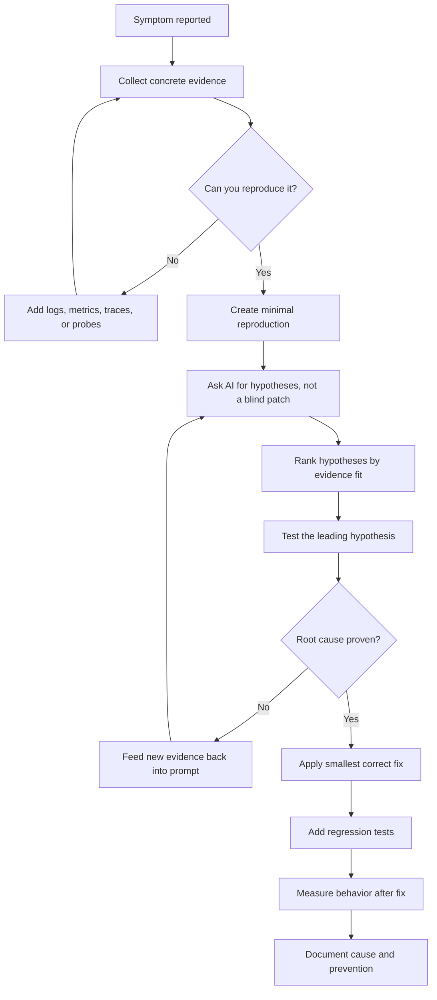
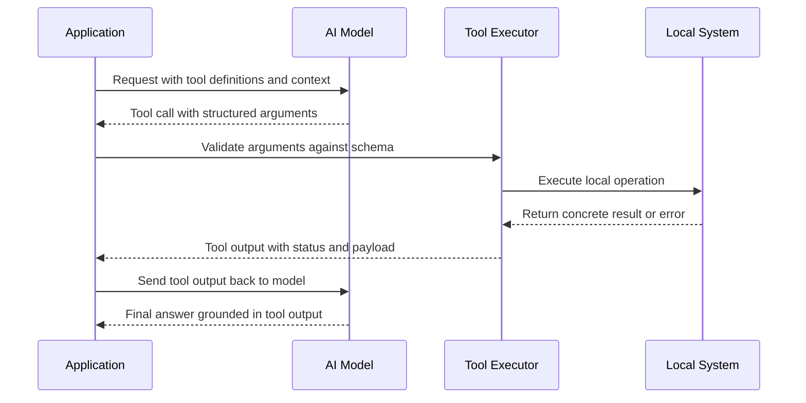
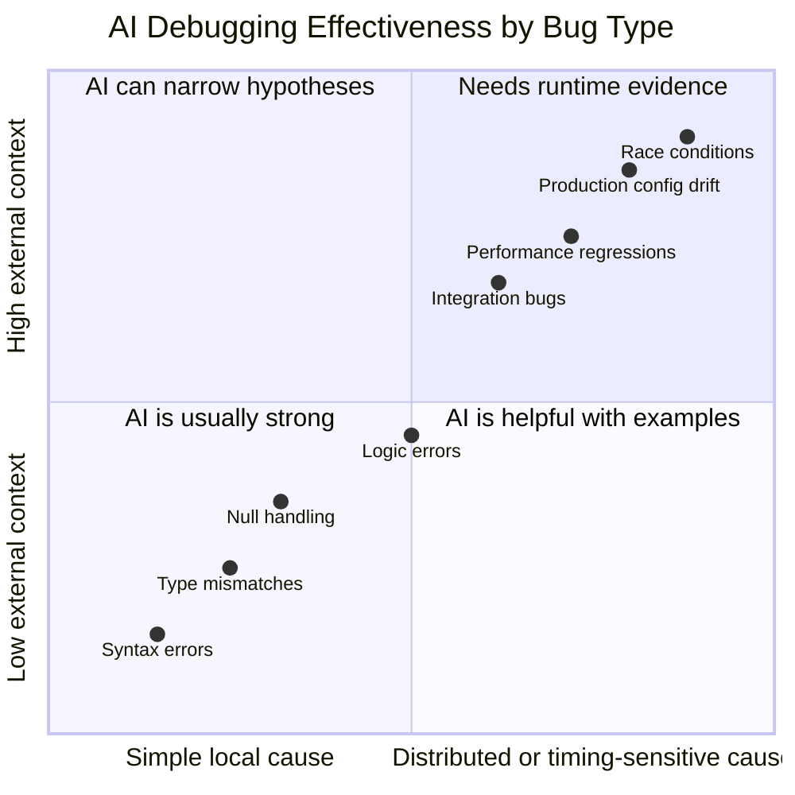
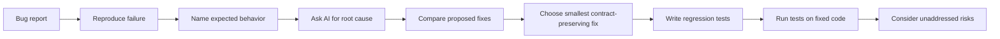
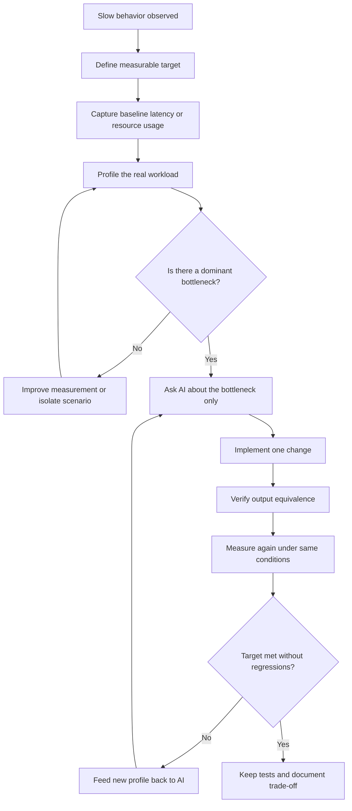
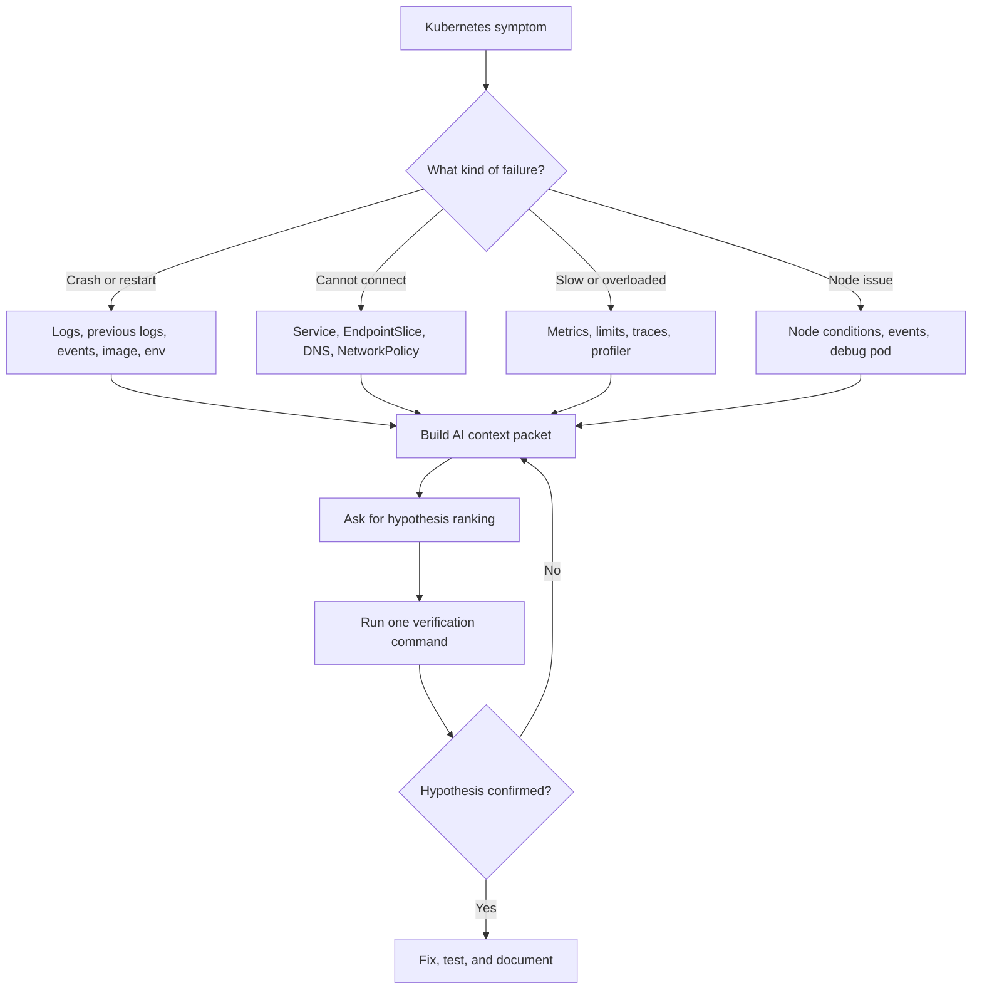
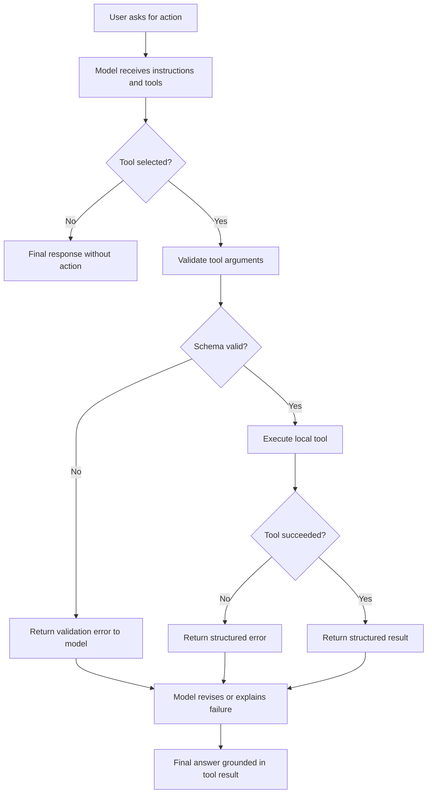
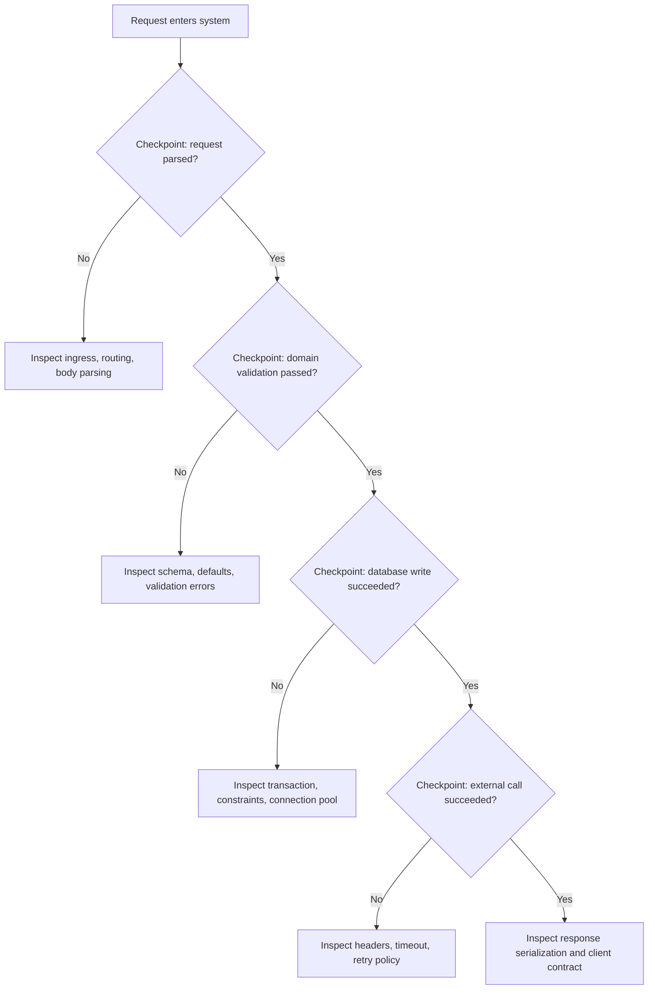

> **AI/ML Engineering Track** | Complexity: `[MEDIUM]` | Time: 4-5 hours
>
> **Prerequisites**: Modules 1.1-1.7, basic Python, basic Git, basic Kubernetes troubleshooting, and comfort reading stack traces.

## Learning Outcomes

By the end of this module, you will be able to:

- **Debug** application failures by turning vague symptoms into reproducible evidence, minimal test cases, and structured AI prompts.
- **Compare** AI-assisted debugging strategies across syntax errors, logic bugs, integration failures, concurrency defects, and performance regressions.
- **Evaluate** AI-generated fixes by checking root-cause fit, edge cases, regression coverage, and operational blast radius before applying changes.
- **Design** a cloud-native debugging workflow that combines logs, traces, metrics, Kubernetes debug tools, and AI-assisted hypothesis refinement.
- **Optimize** slow code paths by profiling first, asking targeted questions, validating equivalent behavior, and measuring the actual speedup.

## Why This Module Matters

The same risk pattern is covered in *Infrastructure as Code*: the canonical *Knight Capital 2012* incident shows how partial rollouts and weak feature-flag controls can turn a production release into an availability crisis. <!-- incident-xref: knight-capital-2012 -->

That story matters because modern debugging rarely looks like a tidy compiler error. A user reports a slow checkout, a Kubernetes Pod restarts with no obvious message, a tool call silently omits a field, or a model-generated patch fixes the visible exception while corrupting an edge case. The pressure pushes teams toward guessing, and guessing is expensive because every unverified change creates a second incident inside the first one.

AI can reduce that pressure, but only when you use it as part of a disciplined debugging system. A model can summarize a stack trace, propose likely causes, compare fixes, and suggest tests, yet it cannot observe your production system unless you provide evidence. It can reason impressively from examples, yet it can also invent APIs, misread business rules, and produce fixes that pass the happy path while failing the contract your users depend on.

This module teaches AI-assisted debugging as a professional workflow rather than a shortcut. You will learn how to collect useful context, ask for analysis instead of blind rewrites, verify proposed fixes with tests, and use traditional tools such as profilers, logs, `kubectl`, and Git history as evidence sources. The goal is not to let AI debug for you; the goal is to become the engineer who can direct the investigation, challenge the answer, and prove the fix.

## Core Content

### 1. The Debugging Contract: Evidence Before Advice

The most important shift in AI-assisted debugging is treating the model as an analysis partner that consumes evidence, not as an oracle that receives frustration. When a prompt says only “this is broken,” the model fills missing details with common patterns from training data. Sometimes that guess lands close enough, but professional debugging cannot depend on luck because the cost of a wrong fix grows with system complexity.

A reliable debugging workflow starts with a contract: every claim should connect to observed behavior, and every proposed fix should connect to a testable hypothesis. The AI can help you form hypotheses faster, but you still own the evidence. If you cannot reproduce the failure, you ask the model where to instrument. If you can reproduce it, you ask the model to compare expected and actual behavior. If a fix seems plausible, you ask what it assumes and what would falsify it.



The workflow above is deliberately circular because debugging is rarely solved in one pass. A first prompt might identify an off-by-one error, but a later test might reveal that `n=0` has a separate failure mode. A first optimization might reduce CPU time in isolation, but a later benchmark might show that database round trips dominate the request. Each loop should reduce uncertainty, not merely produce more code.

A strong context packet contains the failure, the environment, the suspected boundary, and the prior attempts. That packet is more useful than a large paste of unrelated source because it tells the model what to attend to. The difference between “here is my whole service” and “this endpoint changed after this diff and now fails for this input” is the difference between generic advice and targeted analysis.

```text
Debug this failure systematically.

Runtime:
- Python 3.12
- FastAPI 0.115
- PostgreSQL 16
- SQLAlchemy 2.x
- Running in Kubernetes behind an ingress controller

Symptom:
- POST /checkout returns HTTP 500 only when the cart contains a discount code.
- The same request succeeds locally when the discount code is omitted.

Expected:
- A valid discount code should reduce the final total and return HTTP 200.

Actual:
- The service raises AttributeError: 'dict' object has no attribute 'amount'.

Evidence:
- Full stack trace is below.
- The failure started after commit abc123 changed the serializer.
- Unit tests cover carts without discounts but not carts with discounts.

Please:
1. Identify the most likely root cause.
2. Explain why this error occurs.
3. Propose two fixes with trade-offs.
4. Suggest a regression test that fails on the current code.
5. Identify what additional evidence would change your conclusion.
```

Notice that the prompt asks for reasoning, alternatives, and tests before asking for code. That ordering protects you from “first answer bias,” where the model emits the most common patch and you accept it because it looks syntactically clean. The prompt also invites disconfirmation, which is valuable because a good debugging assistant should tell you when the evidence is insufficient.

> **Active learning prompt:** Before reading further, take the context packet above and identify the single sentence that most reduces the search space. If you chose the commit reference or the `dict` versus object mismatch, you are thinking like a debugger because both point toward a serialization boundary rather than a random framework failure.

The same structure works for tiny scripts and distributed systems. The scope changes, but the pattern remains: state what happened, state what should have happened, show the smallest evidence that distinguishes the two, and ask for analysis that can be verified. A senior engineer using AI well is not writing more dramatic prompts; they are creating cleaner experimental conditions.

The most common beginner mistake is asking the model to fix code before you understand what the code is supposed to guarantee. Consider a function that returns a user display name. If the model adds `if user is None: return None`, the exception disappears, but every caller now has to handle an undocumented `None` result. The bug may move from the failing line to a downstream template, API response, or database field.

```python
class User:
    def __init__(self, name):
        self.name = name

def display_name(user):
    return user.name.strip().title()

def demo():
    user = User(" ada lovelace ")
    print(display_name(user))

if __name__ == "__main__":
    demo()
```

The code above is runnable and passes for the normal case, yet it says nothing about invalid input. A careless AI prompt might produce a permissive patch that hides bad data. A better prompt asks the model to infer the contract, compare possible contracts, and explain which one matches the surrounding system. That distinction matters because debugging is not just removing errors; it is restoring the intended behavior.

```text
The function below crashes when user is None.

Do not patch it yet. First infer the likely contract from the name and caller behavior.
Then compare these options:
1. Raise a clear ValueError when user is None.
2. Return "Unknown" when user is None.
3. Return None and require callers to handle it.

For each option, explain which downstream failures it prevents and which failures it could hide.
```

A useful model response might recommend raising `ValueError` in a domain service, returning `"Unknown"` in a presentation-only layer, or rejecting the input earlier in request validation. The right answer depends on the boundary. That is why AI-assisted debugging works best when you include where the code lives, who calls it, and what the caller expects.

```python
class User:
    def __init__(self, name):
        self.name = name

def display_name(user):
    if user is None:
        raise ValueError("display_name requires a User, got None")
    if not isinstance(user.name, str) or not user.name.strip():
        return "Unknown"
    return user.name.strip().title()

def test_display_name_normalizes_text():
    assert display_name(User(" ada lovelace ")) == "Ada Lovelace"

def test_display_name_rejects_missing_user():
    try:
        display_name(None)
    except ValueError as exc:
        assert "requires a User" in str(exc)
    else:
        raise AssertionError("display_name(None) should raise ValueError")

def test_display_name_handles_blank_name():
    assert display_name(User("   ")) == "Unknown"

if __name__ == "__main__":
    test_display_name_normalizes_text()
    test_display_name_rejects_missing_user()
    test_display_name_handles_blank_name()
    print("tests passed")
```

This fixed version is not merely more defensive; it encodes decisions. Missing users are invalid and should be rejected, while blank names are valid but displayed safely. When you ask AI to debug, you should force the same distinction. The model can generate options quickly, but you should choose the option that preserves the contract.

The debugging contract also applies to AI tooling itself. When your application calls a model with tools, failures often occur at the boundary between natural language, structured arguments, local tool execution, and final response generation. A model may call the right tool with the wrong schema, your executor may return a malformed payload, or the final response may ignore the tool result. You need traces that show each step.



When this flow fails, do not paste the whole application and ask why the agent is confused. Capture the request, the tool schema, the model’s tool call, the executor result, and the final response. Ask the AI to compare the schema contract to the actual arguments. In many real incidents, the bug is not that the model “reasoned badly”; the bug is that the tool boundary accepted ambiguous or partial data.

```python
import json
from jsonschema import validate, ValidationError

tool_schema = {
    "type": "object",
    "properties": {
        "ticket_id": {"type": "string"},
        "priority": {"type": "string", "enum": ["low", "medium", "high"]},
    },
    "required": ["ticket_id", "priority"],
    "additionalProperties": False,
}

def validate_tool_call(arguments_json):
    arguments = json.loads(arguments_json)
    validate(instance=arguments, schema=tool_schema)
    return arguments

def demo():
    good_call = '{"ticket_id": "INC-123", "priority": "high"}'
    bad_call = '{"ticket": "INC-123", "priority": "urgent"}'

    print(validate_tool_call(good_call))

    try:
        validate_tool_call(bad_call)
    except ValidationError as exc:
        print(f"schema rejected bad call: {exc.message}")

if __name__ == "__main__":
    demo()
```

This example uses schema validation to make the failure observable before the tool touches production state. In real AI-native systems, strict schemas and clear validation errors are debugging tools, not just safety features. They turn a vague complaint such as “the agent filed the wrong ticket” into a precise failure such as “the model emitted `ticket` instead of `ticket_id`, and the executor rejected the call.”

### 2. Bug Categories: Where AI Helps, Where It Misleads

AI models are strongest when the bug matches a common pattern and the relevant context fits into the prompt. Syntax errors, type mismatches, missing imports, obvious null handling, and many framework misuses are good fits because the model has seen thousands of similar examples. The model’s pattern recognition becomes less reliable when the failure depends on runtime timing, hidden state, proprietary business rules, or production-only configuration.

A useful senior habit is to classify the bug before asking for help. Classification tells you how much evidence the model needs and how skeptical you should be of the answer. A syntax error may need only the error and the surrounding code. A race condition may need logs, timing diagrams, thread dumps, or a deterministic stress test. A performance issue needs profiler output before advice is meaningful.



The lower-left category is where AI can feel almost magical. If Python reports a missing colon, JavaScript reports an undefined property, or Go reports an unused variable, the model can usually explain the error and fix the code immediately. Even there, you should still read the fix because syntactic correctness does not guarantee domain correctness.

```python
def get_last_n_items(items, n):
    return items[-n-1:]

def demo():
    data = [1, 2, 3, 4, 5]
    expected = [4, 5]
    actual = get_last_n_items(data, 2)
    print(f"expected={expected}")
    print(f"actual={actual}")
    assert actual == expected

if __name__ == "__main__":
    demo()
```

This off-by-one bug is a good AI target because the expected and actual outputs make the problem concrete. The model can compare the slice boundary and explain that `-n-1` includes one extra item. However, a senior prompt should also ask about `n=0`, negative `n`, and values larger than the list. The first fix may solve the demonstrated case while leaving the function contract underdefined.

```python
def get_last_n_items(items, n):
    if n < 0:
        raise ValueError("n must be non-negative")
    if n == 0:
        return []
    return items[-n:]

def test_returns_last_two_items():
    assert get_last_n_items([1, 2, 3, 4, 5], 2) == [4, 5]

def test_zero_returns_empty_list():
    assert get_last_n_items([1, 2, 3], 0) == []

def test_negative_n_is_rejected():
    try:
        get_last_n_items([1, 2, 3], -1)
    except ValueError as exc:
        assert "non-negative" in str(exc)
    else:
        raise AssertionError("negative n should be rejected")

def test_n_larger_than_list_returns_all_items():
    assert get_last_n_items([1, 2, 3], 10) == [1, 2, 3]

if __name__ == "__main__":
    test_returns_last_two_items()
    test_zero_returns_empty_list()
    test_negative_n_is_rejected()
    test_n_larger_than_list_returns_all_items()
    print("tests passed")
```

Logic errors become easier when you give the model a truth table or examples. Without examples, the model may rewrite the function into something that looks reasonable but does not match your domain. With examples, it can compare behavior and infer the intended rule. This is why “expected versus actual” is often more valuable than a long narrative.

Integration bugs require more boundary evidence. A service may fail because a header is missing, a token audience changed, a JSON field changed type, a database column contains old data, or a proxy strips a value. AI can help connect those clues, but you must provide the request, response, relevant configuration, and the contract from the upstream or downstream system.

```python
import requests

API_TOKEN = "example-token"

def send_webhook(event, user_id):
    headers = {"Authorization": f"Bearer {API_TOKEN}"}
    response = requests.post(
        "https://api.partner.example/webhook",
        json={"event": event, "user_id": user_id},
        timeout=5,
    )
    return response.status_code

def explain_bug():
    return "headers is constructed but never passed to requests.post"

if __name__ == "__main__":
    print(explain_bug())
```

The bug is simple once isolated: `headers` exists but is not used. Yet in production, the symptom might be buried under retries, proxy logs, and a generic `401 Unauthorized`. The AI can spot the omitted parameter if you show both the code and the captured outgoing request. Without the captured request, it might speculate about token expiration, clock skew, or partner downtime.

```python
import requests

API_TOKEN = "example-token"

def send_webhook(event, user_id, post=requests.post):
    headers = {"Authorization": f"Bearer {API_TOKEN}"}
    response = post(
        "https://api.partner.example/webhook",
        headers=headers,
        json={"event": event, "user_id": user_id},
        timeout=5,
    )
    return response.status_code

class FakeResponse:
    status_code = 202

def fake_post(url, headers, json, timeout):
    assert headers["Authorization"].startswith("Bearer ")
    assert json["event"] == "user_signup"
    assert timeout == 5
    return FakeResponse()

def test_send_webhook_passes_authorization_header():
    assert send_webhook("user_signup", "user-123", post=fake_post) == 202

if __name__ == "__main__":
    test_send_webhook_passes_authorization_header()
    print("tests passed")
```

Concurrency bugs need even more care. AI can identify unsafe patterns, but it cannot prove timing behavior from a static paste alone. If two threads read `count=0`, both increment locally, and both write `1`, the lost update is plausible. To turn that plausible story into debugging evidence, you need stress tests, locks, atomic operations, or tracing around the shared state.

```python
import threading

class Counter:
    def __init__(self):
        self.count = 0

    def increment(self):
        current = self.count
        self.count = current + 1

def run_counter():
    counter = Counter()
    threads = [threading.Thread(target=counter.increment) for _ in range(1000)]
    for thread in threads:
        thread.start()
    for thread in threads:
        thread.join()
    print(counter.count)

if __name__ == "__main__":
    run_counter()
```

This code may appear to work in some runs, which is exactly why concurrency debugging is dangerous. A model can explain that the read-modify-write sequence is not protected, but you should still reproduce the behavior under load or reason from the runtime’s guarantees. The fix is not “add a lock somewhere”; the fix is to protect the invariant that updates to `count` are serialized.

```python
import threading

class Counter:
    def __init__(self):
        self._count = 0
        self._lock = threading.Lock()

    def increment(self):
        with self._lock:
            self._count += 1

    @property
    def count(self):
        with self._lock:
            return self._count

def test_counter_reaches_expected_value():
    counter = Counter()
    threads = [threading.Thread(target=counter.increment) for _ in range(1000)]
    for thread in threads:
        thread.start()
    for thread in threads:
        thread.join()
    assert counter.count == 1000

if __name__ == "__main__":
    test_counter_reaches_expected_value()
    print("tests passed")
```

Performance bugs are another category where AI can mislead if you skip measurement. Asking a model to “make this faster” invites local micro-optimizations because the model has no profiler. It might rewrite loops, use comprehensions, or add caching without knowing whether the slow path is CPU, database, network, allocation, or lock contention.

> **Active learning prompt:** A request takes eight seconds. The model suggests replacing a `for` loop with a list comprehension in a helper function. What evidence would you need before accepting the change? A strong answer mentions profiler data, call counts, input sizes, behavior equivalence tests, and an after-measurement.

The senior move is to classify before prompting. If the failure is deterministic and local, ask for code analysis. If the failure is environmental, ask for a differential checklist. If the failure is timing-sensitive, ask for instrumentation and reproduction strategy. If the failure is performance-related, profile first and ask about the measured bottleneck.

### 3. Worked Example: From Failure to Verified Fix

A worked example makes the debugging workflow concrete. We will use a small Python function because the mechanics are visible, but the same sequence applies to a service endpoint. The function computes a discounted total, and the bug appears only when the cart does not qualify for a discount.

```python
def calculate_total(items):
    subtotal = sum(item["price"] for item in items)
    if subtotal >= 100:
        discount = subtotal * 0.10
    return subtotal - discount

def demo():
    cart = [{"name": "book", "price": 30}, {"name": "cable", "price": 20}]
    print(calculate_total(cart))

if __name__ == "__main__":
    demo()
```

Running this script raises `UnboundLocalError` because `discount` is assigned only inside the conditional branch. The beginner response is to paste the exception and ask for a fix. The senior response is to provide the expected behavior for both branches, ask for the root cause, and request tests that prove the fix.

```text
This function fails for carts below 100 but works for carts at or above 100.

Expected:
- Items totaling 50 should return 50.
- Items totaling 120 should return 108 after a ten percent discount.

Actual:
- Items totaling 50 raise UnboundLocalError because discount is not defined.

Please:
1. Explain the root cause in terms of control flow.
2. Provide two correct fixes and compare readability.
3. Add regression tests for both branches.
4. Identify any money-handling concern this example still ignores.
```

The prompt asks for a money-handling concern because a realistic implementation might need decimals rather than floats. That does not mean every teaching example must become production accounting software. It means you are training yourself to ask what the simple fix still leaves outside the boundary, which is a senior debugging habit.

```python
def calculate_total(items):
    subtotal = sum(item["price"] for item in items)
    discount = 0
    if subtotal >= 100:
        discount = subtotal * 0.10
    return subtotal - discount

def test_no_discount_branch():
    cart = [{"name": "book", "price": 30}, {"name": "cable", "price": 20}]
    assert calculate_total(cart) == 50

def test_discount_branch():
    cart = [{"name": "monitor", "price": 120}]
    assert calculate_total(cart) == 108

def test_boundary_gets_discount():
    cart = [{"name": "keyboard", "price": 100}]
    assert calculate_total(cart) == 90

if __name__ == "__main__":
    test_no_discount_branch()
    test_discount_branch()
    test_boundary_gets_discount()
    print("tests passed")
```

This fix initializes `discount` before the branch, so both paths have a defined value. The tests align with the bug report because one test exercises the failing branch, one exercises the already-working branch, and one checks the boundary where the rule changes. A model can generate this quickly, but you should inspect whether each test would fail on the original bug.

The worked example also demonstrates why you should not stop at “the error is gone.” If the model had changed the condition from `>= 100` to `> 100`, the example would still pass for 120 and 50 but fail at exactly 100. Boundary tests protect the business rule. AI is useful here because it can suggest boundary cases, but the rule must come from you or the domain.



The same pattern works for stack traces. You should ask the AI to focus on your frames, not to summarize every framework line. Many stack traces are long because frameworks add middleware, routers, serializers, and generated code. The root cause usually appears where your data crosses a boundary or where your assumption meets a different type.

```text
Read this stack trace as a debugging assistant.

Instructions:
- Focus on frames from files under src/.
- Treat framework frames as routing context unless they transform data.
- Identify the first line where my code receives a value of the wrong type.
- Explain why the value is likely a dict instead of an Item object.
- Suggest the next inspection command or log line.
```

That prompt style forces the model to locate the transition point. If the error is `AttributeError: 'dict' object has no attribute 'price'`, the useful question is not “how do I access dict keys?” The useful question is “why did this layer receive dictionaries when the contract says objects?” That difference separates symptom patching from root-cause debugging.

A model-generated fix should pass four checks before you apply it. First, it should explain the actual failure, not a nearby failure. Second, it should preserve the intended contract rather than inventing a new one. Third, it should include a regression test that fails before the fix. Fourth, it should not broaden permissions, swallow exceptions, or remove validation simply to make the error disappear.

```text
Review your proposed fix against these checks:
1. Which exact observed failure does it fix?
2. Which input contract does it enforce?
3. Which regression test fails before the fix and passes after it?
4. What new behavior could this introduce for existing callers?
5. What log, metric, or trace would confirm the fix in production?
```

This review prompt is especially useful when you are tired or under incident pressure. It slows the model down and makes the answer auditable. You are not asking for more words; you are asking for the reasoning that determines whether the patch is safe.

### 4. Optimization: Profile First, Then Ask the Model

Optimization is debugging with a stopwatch. The bug is not a wrong value; the bug is that the system spends too much time, memory, money, or capacity producing the value. AI can help identify algorithmic complexity, database anti-patterns, unnecessary allocations, and caching opportunities, but only after you identify where the time actually goes.

Premature optimization is particularly tempting with AI because the model can rewrite code instantly. That speed can create a false sense of progress. If a request spends seventy percent of its time waiting on database queries, rewriting a five-line formatting function might make the code prettier while the user sees no improvement. Profiling protects you from optimizing whatever is easiest to paste.



The first question in optimization is not “how do we make it faster?” It is “what does faster mean for this workload?” A batch job may need lower total runtime. An API endpoint may need lower p95 latency. A Kubernetes workload may need lower CPU so the Horizontal Pod Autoscaler stops scaling unnecessarily. A model-serving system may need lower token cost or lower tail latency.

```python
import random
import timeit

def find_common_users_slow(left, right):
    common = []
    for user in left:
        if user in right:
            common.append(user)
    return common

def find_common_users_fast(left, right):
    right_lookup = set(right)
    return [user for user in left if user in right_lookup]

def demo():
    random.seed(7)
    left = [random.randint(1, 20000) for _ in range(5000)]
    right = [random.randint(1, 20000) for _ in range(5000)]

    assert sorted(find_common_users_slow(left, right)) == sorted(find_common_users_fast(left, right))

    slow_time = timeit.timeit(lambda: find_common_users_slow(left, right), number=20)
    fast_time = timeit.timeit(lambda: find_common_users_fast(left, right), number=20)

    print(f"slow={slow_time:.4f}s")
    print(f"fast={fast_time:.4f}s")
    print(f"speedup={slow_time / fast_time:.1f}x")

if __name__ == "__main__":
    demo()
```

This example is a good AI optimization target because the bottleneck is clear: membership checks against a list are repeated many times. The optimized version converts `right` to a set, changing repeated membership checks from linear scanning to average constant-time lookup. The assertion matters because speed without equivalent behavior is not optimization; it is a bug with better timing.

When you ask AI about performance, include input sizes and call counts. A model may correctly identify that an algorithm is `O(n^2)`, but the business impact depends on whether `n` is ten or ten million. It may recommend caching, but caching can introduce stale data, memory growth, and invalidation complexity. The prompt should force the trade-off into the answer.

```text
Profiling shows this function consumes 68 percent of endpoint time.

Function:
[paste the specific function]

Context:
- Called once per request.
- Typical input size is 5,000 users.
- p95 request latency target is 300 ms.
- Current p95 is 1.8 seconds.
- Memory headroom per Pod is about 300 MiB.
- Output order must match the left input list.

Please:
1. Explain the current time complexity.
2. Propose an optimized version that preserves output order.
3. State memory trade-offs.
4. Provide an equivalence test.
5. Suggest what metric should improve after deployment.
```

Database optimization needs the same discipline. Many slow endpoints are not slow because Python loops are inefficient; they are slow because each loop triggers a database query. AI can identify the N+1 query pattern when you provide ORM code and query counts. It cannot infer query counts from source alone unless you include enough ORM behavior.

```python
def serialize_users(users):
    return [
        {
            "id": user.id,
            "name": user.name,
            "post_titles": [post.title for post in user.posts],
        }
        for user in users
    ]
```

This code may be fine if `user.posts` is already loaded. It may be disastrous if every access lazily hits the database. The correct prompt includes logs or profiler output showing query counts. Ask the model whether eager loading, explicit joins, prefetching, or a separate aggregate query best matches the access pattern.

```text
This endpoint serializes 200 users and emits 201 SQL queries.
The first query loads users, and each later query loads posts for one user.

Here is the serializer and ORM query:
[paste code]

Recommend a fix for SQLAlchemy 2.x.
Explain whether joined loading, select-in loading, or a manual aggregate query is better here.
Include a test or instrumentation check that prevents the query count from returning.
```

Performance work in Kubernetes adds another layer because process-level measurements and cluster-level measurements answer different questions. `kubectl top` can show CPU and memory usage, but it depends on Metrics Server and is not a high-resolution profiler. Application profiling tells you where code spends time. Distributed tracing tells you whether time is local, remote, or waiting. AI can help interpret all three, but you should not substitute one for another.

After `kubectl` has been introduced, this module uses `k` as the common alias for `kubectl`. You can define it in a shell with `alias k=kubectl` if your environment uses that convention. The alias is convenient during incident work, but scripts and documentation should remain clear enough that another engineer can follow the commands without guessing.

```bash
kubectl top pod -n payments
k logs -n payments deploy/checkout-api --since=15m
k describe pod -n payments checkout-api-abc123
```

These commands collect symptoms, not root causes. High CPU tells you where to look, logs tell you what the application reported, and `describe` tells you whether Kubernetes restarted, throttled, or failed to schedule the Pod. A strong AI prompt includes the relevant snippets and asks what evidence is missing, rather than asking the model to invent a production diagnosis.

### 5. Cloud-Native Debugging With AI and Kubernetes

Kubernetes debugging is a context-management problem. The failure may live in application code, container image contents, environment variables, resource limits, network policy, service discovery, DNS, storage, node pressure, or control-plane state. AI can help organize the search, but only if you provide the right Kubernetes objects and avoid drowning the model in unrelated YAML.

Start with the smallest object that demonstrates the failure. For a crashing Pod, gather the Pod status, recent events, container logs, and deployment change history. For a networking issue, gather Service selectors, EndpointSlices, NetworkPolicies, and a test from a Pod in the same namespace. For a performance issue, gather resource requests, limits, recent metrics, and application profiler output.



A distroless container makes this especially clear. You may not have a shell, package manager, or diagnostic tools inside the application image, and that is a good production-hardening choice. The debugging move is not to rebuild the image with `curl` and `bash` under pressure. The debugging move is to use Kubernetes debug workflows, such as an ephemeral container or a copied Pod, to inspect the environment without changing the application image contract.

```bash
k debug -n payments pod/checkout-api-abc123 -it --image=busybox:1.36 --target=checkout-api
```

The command above is an example of attaching a temporary debugging container to a running Pod. In a real cluster, the exact command depends on permissions, runtime support, and the debugging image you choose. The useful AI prompt should include the command you ran, the error you received, the Pod spec, and whether the target container shares process namespace visibility.

```text
I am debugging a distroless container in Kubernetes.

Goal:
- Inspect DNS resolution and network connectivity from the same Pod context.
- Avoid rebuilding the production image with debugging tools.

Evidence:
- Pod name: checkout-api-abc123
- Namespace: payments
- Target container: checkout-api
- Debug command and output:
[paste command and output]

Please:
1. Explain whether an ephemeral container or copied Pod is more appropriate.
2. Identify the RBAC or feature-gate issue if the command fails.
3. Suggest the next safest verification command.
```

Control-plane and node debugging require additional skepticism. A model can explain common failure modes, but it should not be asked to guess cluster health from a single timeout. You need events, component status, node conditions, and relevant endpoint responses. Kubernetes v1.35+ structured diagnostic endpoints can be especially useful because machine-parseable output is easier for AI to inspect consistently.

```bash
k get events -A --sort-by=.lastTimestamp
k get nodes -o wide
k describe node worker-1
```

When feeding Kubernetes output to AI, redact secrets and reduce noise. Do not paste every object in a production namespace if the failure concerns one Deployment. Include labels, selectors, container names, ports, readiness probes, recent events, and the exact command output. Ask the model to verify selector matching, port alignment, and probe behavior before jumping to exotic causes.

```text
Debug this Service routing failure.

Symptom:
- Requests to Service checkout return connection refused.
- The Pod is Running and Ready.

Evidence:
[paste Service YAML]
[paste EndpointSlice YAML]
[paste Pod labels]
[paste container ports]
[paste recent events]

Please:
1. Compare Service selector labels to Pod labels.
2. Compare Service targetPort to containerPort.
3. Explain the most likely mismatch.
4. Suggest one kubectl command to prove it.
```

This prompt style catches a common problem: the Service selector does not match the Pod labels, or `targetPort` points to a name that the container does not define. AI is good at comparing structured snippets when you ask it to perform a specific comparison. It is less reliable when you ask a vague question such as “why is my Kubernetes app broken?”

Kubernetes metrics need interpretation as well. `kubectl top` depends on Metrics Server and can lag shortly after Pod creation. If the model tells you that missing metrics prove the Pod is idle, challenge that conclusion. Missing metrics might mean the metrics pipeline is not installed, not ready, delayed, or blocked. The absence of data is itself a debugging signal, not proof of health.

```bash
k top pod -n payments
k get deployment -n kube-system metrics-server
k logs -n kube-system deploy/metrics-server --tail=80
```

In production, you should combine cluster-level signals with application-level signals. A high CPU Pod might be doing legitimate work, stuck in a retry loop, processing oversized requests, or suffering from a hot loop introduced by a code change. Feed the model CPU graphs, request rates, error rates, and profiler output together. Ask it to separate correlation from causation.

### 6. Debugging AI-Native Systems and Tool Calls

AI-native applications add a new class of bugs because part of the system is probabilistic while the surrounding application still requires deterministic contracts. A tool-calling workflow might fail because the tool schema is too permissive, the model chooses the wrong tool, the executor accepts invalid arguments, the tool output lacks enough structure, or the final response ignores a failure. Debugging these systems requires traces that preserve every boundary.

A useful trace contains the user request, model instructions, tool definitions, selected tool call, validated arguments, tool execution result, model follow-up, and final response. You do not need to log secrets or full personal data. You do need enough structured evidence to replay the decision. Without that trace, teams often blame “the model” when the real problem is an ambiguous schema or an executor that silently coerces bad input.



Strict schemas are essential because they turn model variability into explicit pass or fail outcomes. If a tool expects `{"cluster": "prod", "namespace": "payments"}`, it should reject `{"env": "production", "ns": "payments"}` rather than guessing. Silent coercion looks helpful until it sends an action to the wrong environment.

```python
import json
from dataclasses import dataclass

@dataclass
class ScaleRequest:
    namespace: str
    deployment: str
    replicas: int

def parse_scale_request(arguments_json):
    payload = json.loads(arguments_json)
    required = {"namespace", "deployment", "replicas"}
    missing = required - payload.keys()
    extra = payload.keys() - required

    if missing:
        raise ValueError(f"missing required fields: {sorted(missing)}")
    if extra:
        raise ValueError(f"unexpected fields: {sorted(extra)}")
    if not isinstance(payload["replicas"], int) or payload["replicas"] < 0:
        raise ValueError("replicas must be a non-negative integer")

    return ScaleRequest(
        namespace=payload["namespace"],
        deployment=payload["deployment"],
        replicas=payload["replicas"],
    )

def test_valid_scale_request():
    request = parse_scale_request('{"namespace":"payments","deployment":"checkout","replicas":3}')
    assert request.replicas == 3

def test_rejects_alias_fields():
    try:
        parse_scale_request('{"ns":"payments","deployment":"checkout","replicas":3}')
    except ValueError as exc:
        assert "missing required fields" in str(exc)
    else:
        raise AssertionError("alias field should be rejected")

if __name__ == "__main__":
    test_valid_scale_request()
    test_rejects_alias_fields()
    print("tests passed")
```

This example is intentionally local and deterministic. It does not call a model, Kubernetes, or an external API. That makes it a good regression test for the executor boundary. When an AI-native application fails, isolate deterministic parts first: schemas, validators, tool dispatch, permission checks, and result formatting. Then examine model behavior with clean traces.

Tool-call debugging also needs permission awareness. A model might correctly choose a tool that the user is not allowed to run. The application should return a structured authorization failure, not let the tool partly execute. When you ask AI to debug an authorization problem, include the requested action, user role, policy decision, and whether any side effect occurred.

```text
Debug this AI tool authorization failure.

Scenario:
- User asked the assistant to scale deployment checkout in namespace payments.
- Model selected scale_deployment with valid arguments.
- Executor returned permission_denied.
- User role is incident-viewer, which can read workloads but cannot mutate them.

Please:
1. Explain whether the model, schema, or authorization layer failed.
2. Recommend the user-facing response.
3. Recommend an audit log entry.
4. Identify any test that should prevent accidental mutation.
```

A strong answer should say that the model and schema may have behaved correctly, while the authorization layer correctly blocked the action. This distinction matters because not every failed tool call is a bug. Some failures are successful enforcement of a policy, and your final response should explain the boundary rather than hide it.

Tool output design affects debuggability. A vague output such as `"failed"` forces the model to guess. A structured output with `status`, `error_code`, `message`, and `next_safe_actions` gives the model material to produce a useful final answer. This is true whether your tool calls Kubernetes, a ticketing system, a search index, or a code execution sandbox.

```json
{
  "status": "error",
  "error_code": "permission_denied",
  "message": "Role incident-viewer cannot patch deployments in namespace payments.",
  "next_safe_actions": [
    "show deployment status",
    "generate escalation request",
    "explain required permission"
  ]
}
```

The final debugging principle for AI-native systems is to evaluate behavior with scenarios, not just unit tests. Unit tests validate validators and executors. Scenario tests validate whether the assistant asks for clarification, refuses unsafe action, chooses the correct tool, and grounds its final response in tool output. A model upgrade, prompt change, or schema edit can change behavior even when code tests still pass.

### 7. Debugging Patterns for Senior Practice

Binary search debugging is useful when the failure hides inside a long path. The idea is simple: place a checkpoint near the middle of the workflow, determine whether the failure happens before or after that point, and repeat. AI helps by suggesting meaningful checkpoints and the values that should be logged at each checkpoint.



The checkpoint values should be safe, specific, and temporary. Logging entire request bodies can leak sensitive data. Logging only “got here” may not be enough to distinguish a bad state. A good AI prompt asks for low-risk instrumentation: identifiers, branch decisions, counts, durations, and sanitized error categories.

```text
I need to binary-search this checkout workflow.

Steps:
1. Parse request.
2. Validate cart.
3. Reserve inventory.
4. Apply discount.
5. Charge payment.
6. Write order.
7. Emit event.

Symptom:
- Customer sees HTTP 500 after payment succeeds.
- Some orders are missing the emitted event.

Please suggest temporary checkpoints that avoid logging secrets.
For each checkpoint, state what value to log and what conclusion each result supports.
```

Differential debugging is the pattern for “works here, fails there.” The difference might be operating system, architecture, dependency version, environment variable, feature flag, database engine, locale, time zone, file-system case sensitivity, or data shape. AI is good at generating a comparison matrix, but you must provide the environments honestly.

```text
The same test passes locally and fails in CI.

Local:
- macOS
- Python 3.12
- SQLite
- Case-insensitive file system
- FEATURE_NEW_SERIALIZER=false

CI:
- Linux
- Python 3.12
- PostgreSQL
- Case-sensitive file system
- FEATURE_NEW_SERIALIZER=true

Failure:
[paste error]

Please rank the environment differences by likelihood.
For the top three, propose a command or test that would confirm or eliminate it.
```

Regression debugging is the pattern for “it worked before.” Git history becomes evidence. The model can inspect a diff and identify changed assumptions, but it needs the failing test and the relevant diff, not a broad complaint. `git bisect` can find the first bad commit; AI can then explain why that commit broke the behavior.

```bash
git bisect start
git bisect bad
git bisect good main~20
```

Once Git selects a commit, you run the same test and mark it good or bad. When the first bad commit is found, feed the model the diff, the failing test, and the intended behavior. Ask for causal analysis rather than a rewrite. The question should be “which changed assumption explains the failure?” because regression fixes often require restoring an invariant, not reverting an entire feature.

Hypothesis-driven debugging keeps the investigation disciplined. A hypothesis should be specific enough to test and narrow enough to fail. “Kubernetes is broken” is not a hypothesis. “The Service selector no longer matches the Pod label after the deployment template rename” is a hypothesis because you can prove it with `k get service`, `k get pods --show-labels`, and EndpointSlice output.

A good AI prompt can maintain a hypothesis table. Ask for hypothesis, supporting evidence, contradicting evidence, next check, and expected result. This reduces the chance that the conversation becomes a chain of unrelated suggestions. It also makes incident handoff easier because another engineer can see what has already been tested.

| Hypothesis | Evidence That Supports It | Evidence That Would Weaken It | Next Check |
|---|---|---|---|
| Service selector mismatch | Pod is Ready but Service has no endpoints | EndpointSlice contains the Pod IP | Compare Service selector to Pod labels |
| Missing Authorization header | Partner returns 401 and trace lacks header | Captured request includes valid header | Inspect outgoing request capture |
| N+1 query regression | Query count grows with users | Query count stays constant under load | Enable query logging for one request |
| Race condition in counter | Failures appear only under concurrency | Single-thread stress reproduces it | Run deterministic stress test with locking check |

The table is not just documentation; it is a thinking tool. When AI suggests a new cause, put it in the table and ask what evidence would distinguish it from the current leading cause. This keeps the model from wandering into plausible but untested narratives.

Senior debugging also includes rollback judgment. If the system is actively harming users, the correct first move may be rollback, feature-flag disablement, rate limiting, or traffic shifting before root-cause analysis is complete. AI can help list mitigation options, but the team must understand blast radius, data integrity, and operational risk.

```text
We have an active production incident.

Symptom:
- Checkout error rate rose from 0.2 percent to 18 percent after deployment 2026.04.26.3.
- Payment authorization may succeed before the service returns HTTP 500.
- Rollback is available, but database migrations also shipped.

Please:
1. Separate immediate mitigation from root-cause debugging.
2. List risks of rollback with the migration.
3. Suggest the safest evidence to collect before changing traffic.
4. Draft a regression test idea after the incident is stable.
```

This prompt is different from a normal debugging prompt because it prioritizes safety. During an incident, the right answer might be “stop the bleeding first, then debug from preserved evidence.” AI can accelerate both steps, but it should never pressure you into applying an unreviewed code patch directly to production.

## Did You Know?

- The word “debugging” became famous in computing culture partly because engineers documented a real moth found in the Harvard Mark II, but software faults existed long before that anecdote.
- The Therac-25 accidents showed that software defects, weak interfaces, and inadequate safety engineering can combine into catastrophic real-world harm.
- See *Infrastructure as Code* for the Knight Capital 2012 incident, where rollout safety, rollback strategy, and feature-flag hygiene are taught as production-first debugging fundamentals. <!-- incident-xref: knight-capital-2012 -->
- The Mars Climate Orbiter loss remains a classic reminder that interface contracts must include units, assumptions, and validation, not just field names.

## Common Mistakes

| Mistake | Why It Fails | Better Practice |
|---|---|---|
| Asking “fix this” with no context | The model fills missing details with common patterns, which can produce a plausible patch for the wrong problem. | Provide expected behavior, actual behavior, environment, recent changes, and the smallest reproduction you can create. |
| Accepting the first AI patch | The first answer often removes the visible exception without preserving the caller contract or business rule. | Ask for alternatives, trade-offs, assumptions, and a regression test before applying the change. |
| Skipping reproduction | Without a repeatable failure, you cannot prove that a fix changed the failing condition rather than merely changing nearby code. | Reproduce locally, in a test, or through targeted instrumentation before trusting the proposed root cause. |
| Profiling after optimization | This encourages cosmetic rewrites and makes it impossible to show whether the change improved the real bottleneck. | Capture a baseline, profile the workload, optimize the measured hot path, and measure again under comparable conditions. |
| Treating missing Kubernetes metrics as proof of no load | `kubectl top` depends on Metrics Server and can lag, so missing data may reflect the metrics pipeline rather than the workload. | Check Metrics Server health, wait for data availability, and combine cluster metrics with application logs or traces. |
| Logging too much during incidents | Full payloads, tokens, headers, and personal data can create security incidents while trying to debug reliability incidents. | Log sanitized identifiers, branch decisions, counts, timings, and structured error categories. |
| Letting tool executors coerce vague AI arguments | Silent coercion can turn `prod` into the wrong cluster, accept bad field names, or execute an unintended action. | Enforce strict schemas, reject unknown fields, return structured errors, and test authorization boundaries. |
| Removing validation to make tests pass | A permissive fix may hide bad input and move the failure deeper into the system. | Preserve or strengthen contracts, then update tests to reflect intended behavior rather than accidental behavior. |

## Quiz

1. Your team deployed a serializer change, and an endpoint now raises `AttributeError: 'dict' object has no attribute 'price'`. The AI suggests changing `item.price` to `item["price"]`. What should you check before accepting that fix?
   <details>
   <summary>Answer</summary>
   Check whether the function is supposed to receive dictionaries or domain objects at that boundary. The suggested patch may handle the symptom, but it could hide a broken serializer contract upstream. You should inspect the recent diff, the caller contract, representative input, and add a regression test that proves the correct type or intentionally updates the contract.
   </details>

2. A Kubernetes Pod is Running and Ready, but requests to its Service fail. You paste the Deployment YAML into an AI assistant, and it recommends increasing CPU limits. What evidence should you provide instead to debug the routing failure?
   <details>
   <summary>Answer</summary>
   Provide the Service selector, Pod labels, EndpointSlice output, targetPort, containerPort, and recent events. CPU limits are not the leading concern for a Service routing failure. The useful investigation compares selector matching and port mapping, then verifies whether the Pod appears as an endpoint for the Service.
   </details>

3. A model-generated optimization changes a nested loop to a set lookup and reports a large speedup in a local benchmark. Your endpoint still has poor p95 latency in production. What debugging step should come next?
   <details>
   <summary>Answer</summary>
   Profile the real endpoint path and compare where time is spent after the change. The local benchmark may have optimized a real function while production latency is dominated by database calls, remote services, locks, or serialization. You should verify behavior equivalence, capture production-like profiling or tracing data, and ask the AI to interpret the new bottleneck.
   </details>

4. An AI assistant proposes returning `None` when `display_name(user)` receives `user=None`. The exception disappears, but a template later fails when calling `.upper()` on the result. What debugging principle was violated?
   <details>
   <summary>Answer</summary>
   The fix changed the function contract without checking downstream callers. The original bug was not fully resolved; it was moved to a later boundary. A better process would compare possible contracts, choose whether missing users should be rejected or displayed as a fallback, and add tests for both the invalid input and caller behavior.
   </details>

5. During an incident, checkout errors rose after a deployment, and payments may be authorized before the service returns HTTP 500. The AI suggests a code patch. What should you ask the AI to separate before discussing the patch?
   <details>
   <summary>Answer</summary>
   Ask it to separate immediate mitigation from root-cause debugging. The team may need to stop harm through rollback, traffic shifting, feature-flag disablement, or queue pausing before applying a patch. The debugging plan should preserve evidence, assess rollback risk with migrations, and only then move toward a verified fix and regression tests.
   </details>

6. Your AI-native application calls a `scale_deployment` tool with `{"ns":"payments","deployment":"checkout","replicas":"3"}`. The executor silently converts the fields and scales production. What design flaw allowed this failure?
   <details>
   <summary>Answer</summary>
   The executor accepted ambiguous and incorrectly typed arguments instead of enforcing a strict schema. It should reject unknown field names such as `ns`, require `namespace`, require `replicas` to be an integer, and apply authorization checks before mutation. The model’s variability must be constrained at tool boundaries.
   </details>

7. A race condition appears only during high concurrency. The AI correctly identifies an unprotected read-modify-write sequence and suggests adding a lock. What should your verification include?
   <details>
   <summary>Answer</summary>
   Verification should include a stress or concurrency test that fails or is risky under the old implementation and passes with the lock, plus review of all access paths to the shared state. You should protect reads and writes consistently, confirm the lock does not create unacceptable contention or deadlock, and document the invariant being protected.
   </details>

8. A developer runs `k top pod` immediately after creating a Pod and receives no metrics. The AI says the Pod is not consuming CPU. How should you correct that conclusion?
   <details>
   <summary>Answer</summary>
   Missing `kubectl top` output does not prove the Pod is idle. The command depends on Metrics Server, and metrics may be delayed shortly after Pod creation. Check Metrics Server health, wait for the metrics pipeline when appropriate, and use application logs or direct profiling if you need immediate evidence.
   </details>

## Hands-On Exercise

In this exercise, you will practice the complete AI-assisted debugging loop on a local bug and a local optimization problem. You will create a minimal reproduction, write the prompt you would give to an AI assistant, implement a verified fix, and measure an optimization without depending on external services.

### Step 1: Create a local lab directory

Run these commands from the KubeDojo repository root so the existing project virtual environment is available. The lab files live under a temporary scratch directory and do not need to be committed.

```bash
mkdir -p .scratch/ai-assisted-debugging-lab
cd .scratch/ai-assisted-debugging-lab
```

Success criteria for this step:

- [ ] You created an isolated lab directory.
- [ ] You are not editing production application files.
- [ ] You know how to return to the repository root after the exercise.

### Step 2: Create a failing minimal reproduction

Create a file with a control-flow bug. The function works when a discount applies but fails when no discount applies.

```bash
cat << 'PY' > discount_bug.py
def calculate_total(items):
    subtotal = sum(item["price"] for item in items)
    if subtotal >= 100:
        discount = subtotal * 0.10
    return subtotal - discount

def main():
    cart = [{"name": "book", "price": 30}, {"name": "cable", "price": 20}]
    expected = 50
    actual = calculate_total(cart)
    print(f"expected={expected}")
    print(f"actual={actual}")
    assert actual == expected

if __name__ == "__main__":
    main()
PY

../../.venv/bin/python discount_bug.py
```

Success criteria for this step:

- [ ] The script fails with `UnboundLocalError`.
- [ ] You can explain which branch leaves `discount` undefined.
- [ ] You have a minimal reproduction that does not require a web server, database, or Kubernetes cluster.

### Step 3: Draft the AI debugging prompt

Write a prompt in a file so you can inspect whether it contains evidence instead of frustration. The prompt should ask for root-cause analysis, alternatives, tests, and remaining risks.

```bash
cat << 'TEXT' > prompt.txt
This Python function fails for carts below 100 but works for carts at or above 100.

Expected behavior:
- A cart totaling 50 should return 50.
- A cart totaling 120 should return 108.
- A cart totaling exactly 100 should return 90.

Actual behavior:
- The cart totaling 50 raises UnboundLocalError because discount is not defined.

Code:
[paste discount_bug.py here]

Please:
1. Explain the root cause in terms of control flow.
2. Provide two correct fixes and compare readability.
3. Add regression tests for no-discount, discount, and boundary cases.
4. Identify one money-handling concern this simplified example ignores.
TEXT

sed -n '1,120p' prompt.txt
```

Success criteria for this step:

- [ ] The prompt includes expected and actual behavior.
- [ ] The prompt asks for explanation before code.
- [ ] The prompt asks for tests that align with the failure.
- [ ] The prompt asks for at least one limitation of the simplified example.

### Step 4: Implement the verified fix and regression tests

Replace the buggy script with a fixed implementation and tests. The tests should prove the no-discount branch, discount branch, and boundary behavior.

```bash
cat << 'PY' > discount_bug.py
def calculate_total(items):
    subtotal = sum(item["price"] for item in items)
    discount = 0
    if subtotal >= 100:
        discount = subtotal * 0.10
    return subtotal - discount

def test_no_discount_branch():
    cart = [{"name": "book", "price": 30}, {"name": "cable", "price": 20}]
    assert calculate_total(cart) == 50

def test_discount_branch():
    cart = [{"name": "monitor", "price": 120}]
    assert calculate_total(cart) == 108

def test_boundary_gets_discount():
    cart = [{"name": "keyboard", "price": 100}]
    assert calculate_total(cart) == 90

def main():
    test_no_discount_branch()
    test_discount_branch()
    test_boundary_gets_discount()
    print("debugging tests passed")

if __name__ == "__main__":
    main()
PY

../../.venv/bin/python discount_bug.py
```

Success criteria for this step:

- [ ] The script prints `debugging tests passed`.
- [ ] The original failure branch is covered by a regression test.
- [ ] The boundary case is covered by a regression test.
- [ ] You can explain why the fix preserves the intended contract.

### Step 5: Create and measure an optimization target

Now create a small performance script. It includes a slow list-membership implementation and a faster set-based implementation.

```bash
cat << 'PY' > optimization_lab.py
import random
import timeit

def find_common_users_slow(left, right):
    common = []
    for user in left:
        if user in right:
            common.append(user)
    return common

def find_common_users_fast(left, right):
    right_lookup = set(right)
    return [user for user in left if user in right_lookup]

def main():
    random.seed(7)
    left = [random.randint(1, 20000) for _ in range(5000)]
    right = [random.randint(1, 20000) for _ in range(5000)]

    slow_result = sorted(find_common_users_slow(left, right))
    fast_result = sorted(find_common_users_fast(left, right))
    assert slow_result == fast_result

    slow_time = timeit.timeit(lambda: find_common_users_slow(left, right), number=20)
    fast_time = timeit.timeit(lambda: find_common_users_fast(left, right), number=20)

    print(f"slow={slow_time:.4f}s")
    print(f"fast={fast_time:.4f}s")
    print(f"speedup={slow_time / fast_time:.1f}x")

if __name__ == "__main__":
    main()
PY

../../.venv/bin/python optimization_lab.py
```

Success criteria for this step:

- [ ] The script verifies equivalent output before reporting speed.
- [ ] The faster implementation improves the measured runtime.
- [ ] You can explain why converting `right` to a set changes the lookup cost.
- [ ] You can explain the memory trade-off introduced by the set.

### Step 6: Write a senior-level AI optimization prompt

Create a prompt that would help an AI assistant reason about the measured bottleneck without guessing. Include the function, input size, behavior constraint, and verification requirement.

```bash
cat << 'TEXT' > optimization_prompt.txt
Profiling and timeit show that find_common_users_slow dominates this local workload.

Context:
- left contains about 5,000 user IDs.
- right contains about 5,000 user IDs.
- Output order must match the left input list.
- Duplicate IDs from left should be preserved if they appear in right.
- The optimized version must produce equivalent output.

Please:
1. Explain the time complexity of the slow implementation.
2. Explain why a set improves membership checks.
3. State the memory trade-off.
4. Provide an equivalence test.
5. Explain what measurement would prove the optimization helped.
TEXT

sed -n '1,120p' optimization_prompt.txt
```

Success criteria for this step:

- [ ] The prompt includes input sizes and constraints.
- [ ] The prompt asks for complexity analysis and trade-offs.
- [ ] The prompt requires an equivalence test.
- [ ] The prompt asks for measurement rather than trusting the rewrite.

### Step 7: Reflect on transfer to Kubernetes and AI tools

Write a short incident note that maps the same workflow to a cloud-native system. The goal is not to run a cluster; the goal is to practice choosing evidence.

```bash
cat << 'TEXT' > incident_note.txt
Scenario:
A checkout Deployment in Kubernetes became slow after a release, and an AI assistant suggested rewriting a helper function.

Evidence I would collect before changing code:
- Application profiler output for the slow endpoint.
- Request latency and error-rate metrics for the release window.
- Pod CPU and memory usage, if Metrics Server is healthy and data is available.
- Logs showing retries, database query counts, or external call timeouts.
- The Git diff for the release that introduced the slowdown.

Question for AI:
Given this evidence, separate code-level bottlenecks from infrastructure or dependency bottlenecks.
Rank hypotheses, state what would prove each one, and recommend the smallest safe next check.
TEXT

sed -n '1,160p' incident_note.txt
```

Success criteria for this step:

- [ ] Your note separates evidence collection from code changes.
- [ ] Your note includes at least one application signal and one Kubernetes signal.
- [ ] Your note asks the AI to rank hypotheses instead of guessing.
- [ ] Your note identifies the smallest safe next check.

## Next Module

**Module 1.9: Building with AI Coding Assistants**

You have learned how to diagnose failures, challenge model-generated fixes, protect contracts with regression tests, and optimize only after measurement. In the next module, you will move from debugging into feature delivery, learning how to use AI coding assistants to plan, implement, review, and verify larger changes without losing architectural control.

## Sources

- [kubectl debug reference](https://kubernetes.io/docs/reference/kubectl/generated/kubectl_debug/) — Official `kubectl debug` reference covering pod copies, ephemeral containers, and node-debug workflows.
- [Debug Running Pods](https://kubernetes.io/docs/tasks/debug/debug-application/debug-running-pod/) — Kubernetes task guide with practical debugging patterns for running Pods and ephemeral containers.
- [Debugging Kubernetes Nodes with Kubectl](https://kubernetes.io/docs/tasks/debug/debug-cluster/kubectl-node-debug/) — Kubernetes documentation for node-level debugging prerequisites and usage.
- [Kubernetes zPages](https://kubernetes.io/docs/reference/instrumentation/zpages/) — Reference for structured z-page endpoints and negotiated response formats such as JSON output.
- [kubectl top reference](https://kubernetes.io/docs/reference/kubectl/generated/kubectl_top) — Official `kubectl top` reference describing its dependency on Metrics Server.
- [Metrics Server](https://github.com/kubernetes-sigs/metrics-server) — Upstream project documentation explaining Metrics Server's autoscaling focus and default 15-second scrape interval.
- [kubectl top pod reference](https://kubernetes.io/docs/reference/kubectl/generated/kubectl_top/kubectl_top_pod/) — Kubernetes reference noting Pod metrics availability details and common timing caveats.
- [OpenAI Function Calling Guide](https://platform.openai.com/docs/guides/function-calling?api-mode=respon) — Primary OpenAI guide for tool-calling flow, strict mode, and structured argument validation.
- [New tools and features in the Responses API](https://openai.com/index/new-tools-and-features-in-the-responses-api/) — OpenAI announcement summarizing Responses API support for remote MCP servers, image generation, Code Interpreter, and file search.
- [OpenAI Docs MCP](https://platform.openai.com/docs/docs-mcp) — OpenAI documentation for the public read-only MCP server used to access developer docs.
- [OpenAI Web Search Guide](https://platform.openai.com/docs/guides/tools-web-search?api-mode=responses) — OpenAI guide for Responses web-search tool behavior, supported modes, and model availability constraints.
