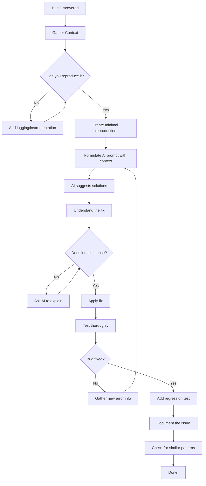
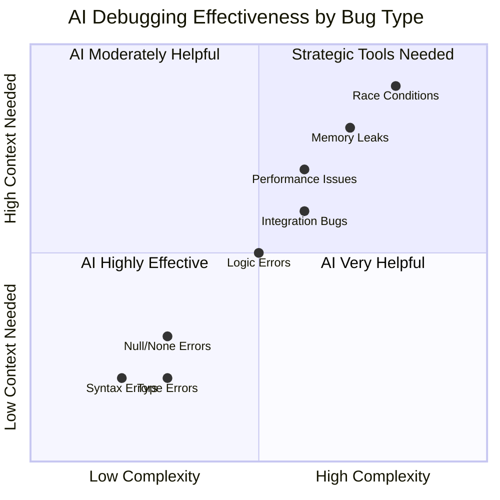
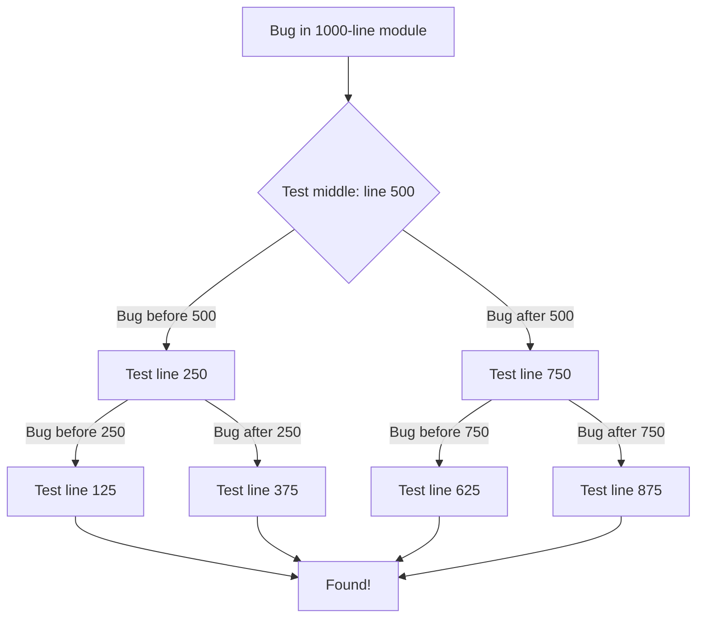

> **AI/ML Engineering Track** | Complexity: `[MEDIUM]` | Time: 4-5
> **Migrated from neural-dojo** — pending pipeline polish

---
**Reading Time**: 4-5 hours
**Prerequisites**: Modules 1-3
---

San Francisco. March 15, 2024. 2:47 AM. Sarah Chen, a senior developer at a fintech startup, stared at her terminal through exhausted eyes. Their payment processing system had been down for three hours. Users couldn't complete transactions. The CEO was texting her every fifteen minutes. The error logs showed nothing useful—just cryptic stack traces pointing to code that had worked perfectly for eighteen months.

"Why now?" she muttered, scrolling through the same fifty lines of code for the twentieth time. Then she tried something different. She copied the entire error context into Claude and asked: "What could cause this code to suddenly fail when nothing changed?" The AI's response pointed to a subtle timezone handling issue that had been dormant until daylight saving time kicked in that very night. Forty-five minutes later, the system was back online. A bug that could have taken days to find was solved in under an hour—not because AI was magic, but because Sarah knew how to use it as a debugging partner.

## What You'll Be Able to Do

By the end of this module, you will:
- Use AI to identify and fix bugs systematically
- Optimize code performance with AI assistance
- Understand AI's debugging strategies and limitations
- Master the AI-assisted debugging workflow
- Know when AI helps vs when it doesn't
- Apply proven debugging patterns to real-world scenarios
- Combine traditional debugging tools with AI assistance

---

## Introduction

Picture this: It's 2 AM. Your production system is down. Users are angry. The error logs are cryptic. You've been staring at the same 50 lines of code for an hour, and the bug might as well be hiding behind a cloaking device.

We've all been there.

Debugging is one of the most challenging aspects of software development. It's detective work with incomplete clues, where that one-character typo can bring down an entire system. Understanding why performance suddenly degrades. Tracing logic errors through complex codebases that span thousands of files. Finding that needle in the haystack that's also invisible.

**This is where AI transforms the game**—but not magically, and not automatically. AI won't debug your code for you while you sleep. But as a debugging partner? As a tireless consultant who never gets frustrated, who can check multiple theories simultaneously, who remembers every obscure error message pattern ever documented? That's when AI becomes genuinely powerful.

This module teaches you how to use AI as a debugging partner effectively. You'll learn the workflow, the patterns, the prompts, and—critically—the limitations. Because knowing when NOT to use AI is just as important as knowing when to lean on it.

Think of debugging as martial arts. You need to know the fundamentals first: stack traces, print statements, breakpoints, profiling. AI doesn't replace those fundamentals—it amplifies them. A black belt with AI assistance can debug faster and more systematically than ever before. But without the fundamentals? AI just generates plausible-sounding nonsense.

**Let's level up your debugging game. **

---

## Did You Know? The First Bug

The term "debugging" has a literal origin story that every developer should know.

On September 9, 1947, **Grace Hopper**—legendary computer scientist and U.S. Navy rear admiral—was working on the Harvard Mark II computer when the machine malfunctioned. Upon investigation, her team found an actual moth trapped in one of the relay switches, causing the error.

Hopper taped the moth into the logbook with the note: **"First actual case of bug being found."**

That moth is now preserved in the Smithsonian Institution's National Museum of American History. While the term "bug" had been used informally before (Edison mentioned "bugs" in his inventions as early as 1878), Hopper's moth cemented it in computing history.

The legacy? Every time you debug code, you're continuing a tradition that started with a literal insect causing a hardware failure. Grace Hopper turned an annoying incident into computing folklore—and gave us the perfect metaphor for hunting down problems in complex systems.

**The irony?** Modern AI can help debug your code, but it still can't find physical moths in your hardware.

---

## The AI Debugging Mental Model

Think of AI as a **debugging consultant** with these traits:

**Strengths**:
- Spot common patterns (null checks, off-by-one, etc.)
- Suggest likely causes fast
- Remember obscure error messages
- Check multiple possibilities simultaneously
- Never gets tired or frustrated
- Knows syntax patterns across dozens of languages
- Can explain complex concepts in multiple ways

**Limitations**:
- Can't run your code
- Doesn't know your system state
- May miss subtle timing issues
- Can hallucinate fixes that look right but aren't
- Doesn't understand your production environment
- Can't access your logs or metrics in real-time
- May not know about recent library updates

**Your Job**: Provide context, verify suggestions, iterate, and know when to use traditional debugging tools instead.

---

##  The AI-Assisted Debugging Workflow



### Step 1: Gather Context

**Before asking AI**, collect:
1. Error message (full stack trace)
2. Minimal code that reproduces bug
3. Expected vs actual behavior
4. Recent changes
5. Environment details (OS, versions)
6. What you've already tried
7. Any relevant logs or metrics

**Bad**:
```
"My code doesn't work, help!"
```

**Good**:
```
"Python 3.11, FastAPI 0.109.0
Error: KeyError: 'user_id' at line 42 in process_request()
Expected: Extract user_id from request headers
Actual: Crashes when header missing
Code: [paste minimal reproduction]
Recent change: Added authentication middleware yesterday
Already tried: Checked header is set in client, verified middleware runs
Environment: Docker container, Ubuntu 22.04, requests==2.31.0
```

**Pro Tip**: The act of gathering this context often reveals the bug before you even ask AI. That's rubber duck debugging in action!

---

### Step 2: Systematic Investigation

**Prompt Structure**:
```
Debug this error systematically:

[Error message and stack trace]

[Minimal reproduction code]

Please:
1. Identify the root cause
2. Explain WHY this error occurs
3. Provide 2-3 potential solutions
4. Recommend the best solution with rationale
5. Show the fixed code
6. Suggest tests to prevent recurrence
```

**Why this works**: You're asking for understanding, not just a fix. You want to learn the pattern, not just patch this instance.

---

### Step 3: Verify Solution

**Never apply AI suggestions blindly**:
1. Understand the fix (ask for explanation if unclear)
2. Test with original failing case
3. Test edge cases
4. Check for side effects
5. Verify performance impact
6. Review security implications

**Example Verification**:
```python
# AI suggested: Add null check
def process_user(user):
    if user is None:  # AI's fix
        return None
    return user.name

# Your verification:
# 1. Does it fix the original error? 
# 2. What if user exists but has no name?  (still crashes!)
# 3. Should we return None or raise exception? (design decision)
# 4. What calls this function and how do they handle None?

# Better fix after understanding:
def process_user(user):
    if user is None:
        raise ValueError("User cannot be None")
    return getattr(user, 'name', 'Unknown')
```

---

### Step 4: Prevent Recurrence

**After fixing**:
1. Add test for this bug
2. Document the gotcha
3. Check for similar patterns elsewhere
4. Consider refactoring to prevent class of bugs
5. Update team knowledge base

**Example Test**:
```python
def test_process_user_handles_none():
    """Regression test for bug #1234: KeyError when user is None"""
    with pytest.raises(ValueError, match="User cannot be None"):
        process_user(None)

def test_process_user_handles_missing_name():
    """Edge case: user exists but has no name attribute"""
    user = MockUser()  # Has no name attribute
    assert process_user(user) == 'Unknown'
```

---

## Did You Know? Print Debugging Still Dominates

Despite decades of sophisticated debugging tools—IDE debuggers, profilers, APM solutions, distributed tracing—**print statement debugging remains the most common debugging technique**, used by over 60% of developers regularly.

Why is this "primitive" technique so persistent?

1. **Universal**: Works in every language, every environment
2. **Fast**: No setup, no configuration
3. **Simple**: No learning curve
4. **Flexible**: Can print anything, anywhere
5. **Persistent**: Output stays visible, can be logged

Even senior developers at Google, Netflix, and Microsoft admit to debugging with strategic print statements (or logging, its professional cousin).

**The Modern Evolution**: Today's "print debugging" has evolved:
- Structured logging with context
- Log aggregation (Splunk, ELK stack)
- Correlation IDs for distributed systems
- Dynamic log levels

**AI's Role**: AI excels at helping you place strategic logging statements. Instead of randomly sprinkling `print("here")` everywhere, you can ask:

```
"Where should I add logging to debug this user authentication flow?
I need to track: user input, token validation, database query, session creation"
```

AI suggests strategic checkpoints with proper structured logging—print debugging, leveled up.

**Remember**: There's no shame in print debugging. It's a tool, like any other. The best debuggers use every tool at their disposal.

---

##  Common Bug Categories & AI Effectiveness



### Category 1: Syntax & Type Errors ⭐⭐⭐⭐⭐

**AI Effectiveness**: Excellent

**Examples**:
- Missing colons, parentheses
- Type mismatches
- Import errors
- Indentation issues
- Bracket mismatches
- Incorrect function signatures

**Why AI Excels**: These follow strict patterns with clear error messages. AI has seen millions of these.

**Prompt**:
```
Fix this SyntaxError: [error message]
[code]
```

**Real Example**:
```python
# Bug
def calculate_total(items)
    return sum(item.price for item in items)
# SyntaxError: invalid syntax

# AI immediately spots: Missing colon after function definition
# Fix
def calculate_total(items):
    return sum(item.price for item in items)
```

** Practice fixing syntax errors! Run [Example 01: Syntax & Type Debugging](../../examples/module_04/01_syntax_debugging.py) to see how AI quickly spots missing colons, parentheses, and type mismatches!**

---

### Category 2: Logic Errors ⭐⭐⭐⭐

**AI Effectiveness**: Good (with context)

**Examples**:
- Off-by-one errors
- Wrong conditionals
- Incorrect loop bounds
- Edge case handling
- Boolean logic errors

**Why AI Helps**: Recognizes common logic patterns and can spot deviations.

**Prompt**:
```
This function returns wrong results:
Expected: [input] → [output]
Actual: [input] → [wrong output]

[function code]

Identify the logic error and explain your reasoning.
```

**Real Example**:
```python
# Bug
def get_last_n_items(items, n):
    return items[-n-1:]  # Off-by-one error!

# Expected: get_last_n_items([1,2,3,4,5], 2) → [4,5]
# Actual: get_last_n_items([1,2,3,4,5], 2) → [3,4,5]

# AI spots: -n-1 should be -n
# Fix
def get_last_n_items(items, n):
    return items[-n:] if n > 0 else []
```

** Hunt down logic bugs! Run [Example 02: Logic Error Debugging](../../examples/module_04/02_logic_debugging.py) to practice finding off-by-one errors, wrong conditionals, and edge cases!**

---

### Category 3: Null/None Errors ⭐⭐⭐⭐⭐

**AI Effectiveness**: Excellent

**Examples**:
- NoneType errors
- Null pointer exceptions
- Optional value handling
- Missing dictionary keys
- Uninitialized variables

**Why AI Excels**: Very common pattern with clear fix strategies.

**Prompt**:
```
Getting AttributeError: 'NoneType' object has no attribute 'x'

[code with error]

Fix by:
1. Identifying where None is introduced
2. Adding appropriate null checks
3. Handling gracefully with proper error messages
```

**Real Example**:
```python
# Bug
def get_user_email(user_id):
    user = db.get_user(user_id)  # Returns None if not found
    return user.email.lower()  # Crashes if user is None!

# AI suggests defensive fix:
def get_user_email(user_id):
    user = db.get_user(user_id)
    if user is None:
        raise ValueError(f"User {user_id} not found")
    if user.email is None:
        return None
    return user.email.lower()
```

---

### Category 4: Async/Concurrency Bugs ⭐⭐

**AI Effectiveness**: Limited

**Examples**:
- Race conditions
- Deadlocks
- Async/await mistakes
- Thread safety issues
- Lock ordering problems

**Why AI Struggles**: Needs runtime information, timing-dependent, hard to reproduce.

**When to Use AI**:
- Syntax of async/await
- Basic patterns
- Common mistakes (forgotten await, blocking in async)

**When NOT to Use AI**:
- Subtle race conditions
- Performance under load
- Complex threading issues
- Distributed system timing bugs

**Better Approach**: Use race detection tools (ThreadSanitizer, Python's threading debugging), then ask AI to interpret results.

** Debug async code! Run [Example 04: Async & Concurrent Debugging](../../examples/module_04/04_async_debugging.py) to learn common async/await mistakes and when AI helps vs when you need traditional debuggers!**

---

### Category 5: Performance Issues ⭐⭐⭐

**AI Effectiveness**: Moderate

**Examples**:
- O(n²) algorithms
- Memory leaks
- Inefficient queries
- Excessive allocations
- Cache misses

**Why AI Helps Sometimes**: Can spot obvious algorithmic issues and suggest better approaches.

**Prompt**:
```
This function is slow:
[code]

Analyze:
1. Time complexity (Big O)
2. Bottlenecks
3. Optimization opportunities
4. Provide optimized version with explanation
```

**Limitation**: AI can't profile your actual runtime. Use profiling tools first, then ask AI to interpret.

**Workflow**:
1. Profile with cProfile/py-spy
2. Identify hotspots
3. Ask AI: "This function takes 80% of runtime. How can I optimize it?"
4. Apply and re-profile

** Master performance optimization! Run [Example 03: Performance Profiling](../../examples/module_04/03_performance_profiling.py) to learn the profile-first, optimize-second workflow and see O(n²) → O(n log n) improvements!**

---

## Did You Know? Rubber Duck Debugging

The term "rubber duck debugging" comes from a story in the book *The Pragmatic Programmer* by Andrew Hunt and David Thomas. They describe a programmer who would carry around a rubber duck and debug their code by forcing themselves to explain it, line-by-line, to the duck.

**The Psychology**: Explaining your problem out loud (even to an inanimate object) activates different parts of your brain than silently reading code. This process:
- Forces you to articulate assumptions
- Reveals gaps in understanding
- Slows down your thinking
- Makes implicit logic explicit

**The Science**: This technique is related to the **Feynman Technique**—explaining something in simple terms to identify gaps in your own knowledge. Studies show that teaching (or explaining) activates deeper learning pathways than passive reading.

**The Modern Twist**: AI is the world's most patient rubber duck. It:
- Never judges your questions
- Can respond with suggestions
- Knows the syntax you're struggling with
- Can explain concepts back to you

**How to Rubber Duck with AI**:
```
I'm debugging [problem].

Here's what I know:
- [observation 1]
- [observation 2]

Here's what I've tried:
- [attempt 1]: [result]
- [attempt 2]: [result]

My hypothesis: [your theory]

Am I on the right track? What am I missing?
```

**Pro Tip**: The act of writing this prompt often reveals the bug before you even send it. That's the rubber duck effect in action.

---

##  Performance Optimization with AI

### When AI Helps

1. **Algorithmic Analysis**
   ```
   Analyze complexity and optimize:
   [your algorithm]

   Current: O(?)
   Goal: Better than O(n²)
   Constraints: [memory limits, real-time requirements]
   ```

2. **Code-Level Optimization**
   ```
   Optimize this Python code:
   [code]

   Focus on:
   - List comprehensions vs loops
   - Generator expressions
   - Built-in functions
   - Unnecessary copies
   - Memory allocations
   ```

3. **Database Query Optimization**
   ```
   Optimize this SQL query:
   [query]

   Issues: N+1 queries, missing indexes
   Database: PostgreSQL 15
   Table sizes: users (1M rows), posts (10M rows)
   ```

4. **Data Structure Selection**
   ```
   I need to:
   - Store 1M items
   - Look up by ID (frequent)
   - Iterate in insertion order (occasional)
   - Remove items (rare)

   What data structure? dict? OrderedDict? Custom?
   ```

---

### When AI Doesn't Help

1. **System-Level Performance**: AI doesn't know your infrastructure, network topology, or hardware limits

2. **Memory Profiling**: Needs actual runtime data about allocations and heap usage

3. **I/O Bottlenecks**: Depends on your disk, network, database characteristics

4. **Cache Tuning**: Needs production metrics and access patterns

5. **Load Testing Results**: Requires observing system under actual load

**Use profiling tools** (cProfile, memory_profiler, py-spy, perf) then ask AI to interpret results.

**Workflow**:
```bash
# 1. Profile
python -m cProfile -o profile.stats your_script.py

# 2. Analyze with AI
# Copy top results from stats
```

```
These functions take the most time:
- process_data(): 60% (called 10,000 times)
- calculate_hash(): 30% (called 50,000 times)
- validate_input(): 10% (called 10,000 times)

[paste function code]

Where should I focus optimization efforts? Specific suggestions?
```

** See comprehensive optimization in action! Run [Example 06: Optimization Examples](../../examples/module_04/06_optimization_examples.py) to learn algorithmic optimization, code-level improvements, and memory optimization patterns!**

---

## Debugging Patterns

### Pattern 1: Binary Search Debugging

**Problem**: Bug in large codebase, unclear where.

**Concept**: Like binary search in a sorted array, divide the problem space in half repeatedly.



**With AI**:
```
I have a bug in this workflow:
1. User submits form
2. Data validated
3. Database saved
4. Email sent
5. Response returned

Bug: Users not receiving emails

Help me binary search:
- Where should I add logging to divide the problem space?
- What should I check at each step?
- How to verify if each step succeeded?
```

AI suggests strategic logging points to bisect the problem space.

**Example**:
```python
# AI suggests: Add checkpoints to bisect
def process_form(form_data):
    print(f"CHECKPOINT 1: Received {form_data}")

    validated = validate(form_data)
    print(f"CHECKPOINT 2: Validated {validated}")

    saved = db.save(validated)
    print(f"CHECKPOINT 3: Saved with ID {saved.id}")

    email_sent = send_email(saved.user_email)
    print(f"CHECKPOINT 4: Email sent? {email_sent}")

    return create_response(saved)

# Run with test data, see where output stops
# → Narrows down where bug occurs
```

---

### Pattern 2: Differential Debugging

**Problem**: Code works in one environment, fails in another.

**Concept**: Identify environmental differences systematically.

**With AI**:
```
Code works on dev (Python 3.11, Mac M1, SQLite),
fails on prod (Python 3.11, Linux x86, PostgreSQL)

Error: [production error]
[code]

What environmental differences could cause this?
Consider: OS, architecture, database, dependencies, config
```

AI suggests systematic checks:
- Line endings (CRLF vs LF)
- File paths (case sensitivity)
- Database behavior differences
- Locale/timezone settings
- Available system libraries
- Environment variables

**Real Example**:
```python
# Bug: Works on Mac, fails on Linux
import os

def load_config():
    # Bug: Mac filesystem is case-insensitive!
    with open('Config.json') as f:  # Works on Mac
        return json.load(f)
    # Linux: FileNotFoundError (file is actually 'config.json')

# AI spots: Case sensitivity difference
# Fix: Normalize paths or use correct case
```

---

### Pattern 3: Regression Debugging

**Problem**: Recent change broke something.

**Concept**: Use version control to identify what changed.

**With AI**:
```
After this change: [git diff]

This started failing: [test failure]

Analyze the diff and identify:
1. What in the change could cause this failure?
2. What assumptions might have been broken?
3. What edge cases might now fail?
```

AI analyzes diff and points to likely cause.

**Pro Tip**: Use `git bisect` to automate finding the breaking commit:
```bash
git bisect start
git bisect bad  # Current broken commit
git bisect good abc123  # Last known good commit
# Git will checkout commits for you to test

# Then ask AI about each bisect commit
```

** Master systematic debugging! Run [Example 07: Debugging Patterns](../../examples/module_04/07_debugging_patterns.py) to learn binary search debugging, differential debugging, and regression debugging patterns!**

---

## Did You Know? The Therac-25 Disaster

Between 1985-1987, the **Therac-25 radiation therapy machine** killed at least 3 patients and seriously injured 3 others by exposing them to massive radiation overdoses—up to 100 times the intended dose.

**The Bug**: A race condition in the software.

The Therac-25 had two modes: low-power for electron beam and high-power for X-ray. An operator could set up a treatment, then quickly edit it. If they changed from X-ray to electron beam within 8 seconds, a race condition would occur:
- The turntable wouldn't rotate to place the X-ray shield
- But the machine would deliver high-power X-rays anyway
- Direct, unshielded radiation hit patients

**Why It Matters**:

1. **Overconfidence in Software**: Removed hardware interlocks, relying solely on software safety
2. **Poor Testing**: Race condition only occurred with specific timing (fast operator edits)
3. **Cryptic Error Messages**: Machine showed vague "Malfunction 54" with no explanation
4. **No Audit Trail**: Couldn't reproduce or diagnose issues after the fact

**The Lesson**: Concurrency bugs can literally kill people. This is why:
- Safety-critical systems need redundant checks
- Race conditions are hard to find and harder to fix
- AI struggles with concurrency bugs (timing-dependent)
- Testing must include stress testing and timing variations

**Modern Relevance**: Today's autonomous vehicles, medical devices, and aircraft all run complex concurrent software. The Therac-25 remains a cautionary tale taught in software engineering ethics courses.

**Could AI have prevented this?** Unlikely. The bug required specific timing and operator behavior to manifest. Static analysis tools (which modern AI can help with) might have flagged the missing interlocks, but race conditions remain one of the hardest bug classes to detect.

**Remember**: When AI says "I can't help much with concurrency bugs," there's a good reason—and 160 gray of radiation exposure is why we should listen.

---

##  Debugging Tools + AI

### Combine AI with Traditional Tools

**1. Stack Traces + AI**
```
[Paste full stack trace]

What's the likely root cause?
Focus on frames 3-5 where my code is.
Ignore framework internals unless relevant.
```

**Example**:
```python
Traceback (most recent call last):
  File "app.py", line 42, in process_request
    result = calculate_total(items)
  File "calculator.py", line 15, in calculate_total
    return sum(item.price for item in items)
  File "calculator.py", line 15, in <genexpr>
    return sum(item.price for item in items)
AttributeError: 'dict' object has no attribute 'price'

# Ask AI: "Why am I getting dict instead of Item objects?"
# AI might suggest: Check serialization, API contract, database query
```

---

**2. Profiler Output + AI**
```
cProfile shows:
- function X: 80% of time
- called 10,000 times
- 8ms per call

[function X code]

Why is this slow? How to optimize?
```

**Example**:
```python
# Profiler output
#  ncalls  tottime  percalls  cumtime  filename:lineno(function)
#  10000   8.234    0.001     8.234    search.py:42(find_user)

def find_user(user_id):
    # AI spots: Loading all users every time!
    users = db.query(User).all()
    return [u for u in users if u.id == user_id][0]

# AI suggests: Use direct query
def find_user(user_id):
    return db.query(User).filter(User.id == user_id).first()
# 1000x faster!
```

---

**3. Logs + AI**
```
Error logs show this pattern:
[paste relevant logs]

What's happening? Pattern analysis?
```

**Example**:
```
2025-11-22 14:23:45 ERROR Failed to process request: Connection timeout
2025-11-22 14:23:47 ERROR Failed to process request: Connection timeout
2025-11-22 14:23:49 ERROR Failed to process request: Connection timeout
[100 more similar errors]
2025-11-22 14:25:12 ERROR Failed to process request: Too many open files

# Ask AI: "Why transition from timeouts to 'too many open files'?"
# AI suggests: Not closing connections, file descriptor leak
```

---

**4. Debugger Variables + AI**
```
At breakpoint, variables are:
x = [value]
y = [value]

Expected x to be [expected]
Why is it [actual]?

[relevant code section]
```

**Example**:
```python
# At breakpoint in calculate_discount():
(pdb) x
12.50
(pdb) y
None

# Expected y to be the discount amount (1.25)
# Ask AI: "Why is y None when x is 12.50?"

def calculate_discount(price):
    if price > 10:
        discount = price * 0.1
    return price - discount  # AI spots: discount undefined if price <= 10!
```

---

## Did You Know? The Mars Climate Orbiter

On September 23, 1999, NASA's **Mars Climate Orbiter** crashed into Mars and was destroyed. Cost: **$125 million**. Cause: **A unit conversion bug**.

**The Bug**: Two teams used different units:
- NASA's systems: Metric (newtons)
- Lockheed Martin's software: Imperial (pound-force)

The navigation software expected thrust data in newton-seconds but received it in pound-force-seconds. This caused the orbiter to approach Mars at the wrong altitude—57 km instead of 226 km. It entered the atmosphere too steeply and either burned up or skipped off into space.

**Why It Matters**:

1. **Type Safety**: Modern languages can prevent this with unit types
2. **Integration Testing**: Unit tests passed, but integration testing was insufficient
3. **Code Review**: The mismatch wasn't caught in reviews
4. **Communication**: Teams made different assumptions

**Could AI have caught this?** Possibly!

```python
# Bad: No units
def apply_thrust(force):
    return force * time

# AI might suggest: "What unit is force? Document it!"

# Better: With type hints and units library
from pint import UnitRegistry
ureg = UnitRegistry()

def apply_thrust(force: ureg.Quantity) -> ureg.Quantity:
    """Apply thrust to spacecraft.

    Args:
        force: Thrust in newtons
    Returns:
        Impulse in newton-seconds
    """
    if not force.check('[force]'):
        raise ValueError(f"Expected force, got {force.dimensionality}")
    return force * time
```

**Modern Defense**: Ask AI to review your code for unit consistency:

```
Review this physics code for unit consistency:
[paste code]

Check:
- Are units documented?
- Are conversions explicit?
- Could different units be mixed accidentally?
```

**The Lesson**: Implicit assumptions about units (or any data format) are dangerous. Make them explicit. Use types, documentation, and validation. A $125 million reminder that the devil is in the details.

---

##  Common Pitfalls

### Pitfall 1: Insufficient Context

**Bad**:
```
"I get KeyError, help"
```

**Good**:
```
"KeyError: 'user_id' at line 42 in process_request()

Full stack trace:
[paste complete trace]

Code:
def process_request(data):
    user_id = data['user_id']  # Line 42
    return get_user(user_id)

Input that triggers error:
data = {'username': 'john', 'email': 'john@example.com'}
# Note: Missing 'user_id' key!

Expected: Should handle missing user_id gracefully
Actual: Crashes with KeyError

Environment: Python 3.11, FastAPI 0.109, pydantic 2.5
"
```

**Why It Matters**: AI needs context to distinguish between:
- Typo in key name
- Missing validation
- API contract change
- Serialization bug

Without context, AI guesses randomly.

---

### Pitfall 2: Accepting First Solution

**Problem**: AI's first suggestion may not be best, or may introduce new bugs.

**Bad**:
```
User: "Fix this"
AI: [suggests solution]
User: [applies immediately without understanding]
```

**Good**:
```
User: "Fix this bug. Provide 3 different solutions with trade-offs:
1. Quick fix (may have limitations)
2. Proper fix (more invasive but correct)
3. Defensive fix (prevents similar bugs)"

AI: [provides multiple approaches]

User: "Explain approach #2 in detail. Why is it better than #1?"
AI: [explains rationale]

User: [applies with understanding]
```

**Real Example**:
```python
# Bug: Division by zero
def calculate_average(numbers):
    return sum(numbers) / len(numbers)

# Solution 1 (Quick fix): Just catch it
def calculate_average(numbers):
    try:
        return sum(numbers) / len(numbers)
    except ZeroDivisionError:
        return 0  # But is 0 the right default?

# Solution 2 (Proper fix): Handle explicitly
def calculate_average(numbers):
    if not numbers:
        raise ValueError("Cannot average empty list")
    return sum(numbers) / len(numbers)

# Solution 3 (Defensive fix): Use statistics library
from statistics import mean
def calculate_average(numbers):
    return mean(numbers)  # Raises StatisticsError on empty

# Choose based on your requirements!
```

---

### Pitfall 3: Not Understanding the Fix

**Problem**: Apply fix without understanding why it works.

**Consequence**: Similar bugs recur, or fix breaks something else.

**Solution**: Always ask:
```
Explain this fix as if to a junior developer:
- Why the bug occurred
- How the fix works
- What assumptions it makes
- What could still go wrong
- How to test it properly
```

**Example**:
```python
# AI suggests this fix:
def process_data(data):
    return [x for x in data if x]  # Added "if x"

# You should understand:
# Q: Why does "if x" fix it?
# A: Filters out falsy values (None, 0, '', [], False)
#
# Q: Is this correct for my use case?
# A: Depends! If data can legitimately contain 0 or '', this is wrong!
#
# Q: What's the proper fix?
# A: Be explicit: "if x is not None" if you want to keep 0 and ''
```

---

### Pitfall 4: Not Testing Edge Cases

**Problem**: Fix works for the reported bug but breaks edge cases.

**Example**:
```python
# Bug report: "Crashes with empty string"
def get_first_char(text):
    return text[0]  # IndexError if text is empty

# AI suggests:
def get_first_char(text):
    return text[0] if text else ''

# You test with empty string:  Works!
# But edge cases:
get_first_char(None)  # TypeError: NoneType not iterable!
get_first_char(123)   # TypeError: int not subscriptable!

# Better fix:
def get_first_char(text):
    if not isinstance(text, str):
        raise TypeError(f"Expected str, got {type(text)}")
    return text[0] if text else ''
```

**Always test**:
- Original bug case
- Null/None values
- Empty collections
- Boundary values (0, -1, MAX_INT)
- Wrong types
- Large inputs

---

### Pitfall 5: Ignoring AI's Limitations

**Problem**: Using AI for bugs it can't help with.

**Examples where AI struggles**:
- "Why is my app slow under production load?" (Needs profiling)
- "Why does this race condition occur?" (Needs runtime analysis)
- "Why is memory leaking?" (Needs memory profiler)
- "Why is the distributed system timing out?" (Needs tracing)

**Better Approach**:
1. Use appropriate tools first
2. Give AI the tool output to interpret

```bash
# First: Profile
python -m cProfile -o profile.stats app.py

# Then: Ask AI
# [Paste profiling results]
# "Interpret these profiling results. Where should I optimize?"
```

---

### Pitfall 6: Not Adding Tests

**Problem**: Fix the bug, move on, bug recurs later.

**Solution**: Every bug fix should include a regression test.

```python
# Fix the bug
def divide_numbers(a, b):
    if b == 0:
        raise ValueError("Cannot divide by zero")
    return a / b

# Add the test
def test_divide_by_zero():
    """Regression test for bug #1234"""
    with pytest.raises(ValueError, match="Cannot divide by zero"):
        divide_numbers(10, 0)

def test_divide_normal():
    assert divide_numbers(10, 2) == 5.0

def test_divide_negative():
    assert divide_numbers(-10, 2) == -5.0
```

**Ask AI**:
```
"Generate comprehensive tests for this bug fix:
[show original bug and fix]

Include:
- Test for original bug
- Edge cases
- Normal cases
- Integration test if needed"
```

---

> **Did You Know?** The concept of "rubber duck debugging" was popularized by the 1999 book "The Pragmatic Programmer" by Andrew Hunt and David Thomas. The technique involves explaining your code line-by-line to a rubber duck (or any inanimate object), which often helps developers spot bugs by forcing them to articulate their assumptions. Studies at Cambridge University found that developers who practiced explaining their code out loud found bugs 37% faster than those who silently stared at their screens. AI assistants work on a similar principle—except the "rubber duck" can actually respond with intelligent suggestions. The act of structuring your problem for AI often reveals the answer before AI even responds.

## Best Practices

### 1. Minimal Reproduction

Before asking AI, create minimal failing example:

**Bad**: 500 lines of code with dependencies
**Good**: 10 lines that reproduce issue in isolation

```python
# Bad: "Here's my entire application, it crashes somewhere"

# Good: Minimal reproduction
def test_bug():
    """Minimal reproduction of authentication bug"""
    user = create_test_user()
    token = generate_token(user)
    result = validate_token(token)  # Fails here
    assert result is not None  # This assertion fails
```

**Why It Matters**:
- Forces you to understand the bug
- Makes AI's job easier
- Often reveals the bug before you finish minimizing
- Creates the basis for a regression test

---

### 2. Rubber Duck with AI

Explain problem to AI in detail, even if you think you know the answer:

```
I'm debugging [problem].

Here's what I know:
- [observation 1]
- [observation 2]

Here's what I've tried:
- [attempt 1]: [result]
- [attempt 2]: [result]

My hypothesis: [your theory]

Questions:
- Am I on the right track?
- What am I missing?
- What should I check next?
```

**Often clarifies your own thinking before AI even responds!**

---

### 3. Version Information

Always include versions. Many bugs are version-specific.

```
Environment:
- Python 3.11.5
- Django 4.2.7
- PostgreSQL 15.3
- psycopg2 2.9.9
- OS: Ubuntu 22.04 LTS
- Running in Docker (python:3.11-slim base)

[error and code]
```

**Example of version-specific bug**:
```python
# Works in Python 3.9, fails in Python 3.11
d = {'a': 1, 'b': 2}
items = d.keys()
first = items[0]  # TypeError in 3.x!

# Why: dict.keys() returns a view, not a list
# Fix: list(d.keys())[0]
```

---

### 4. Iterative Refinement

If AI's fix doesn't work, don't start over—iterate:

```
That fix didn't work. Now I get:
[new error]

Original problem: [original issue]
Your suggested fix: [what you suggested]
What I did: [exactly what you applied]
Result: [what happened]

What's the next step?
```

**Debugging is iterative. AI should be too.**

---

### 5. Document Your Findings

After fixing a bug, document it:

```python
def process_request(data):
    """Process incoming request data.

    Note: data MUST include 'user_id' key.
    Bug #1234: Previously crashed with KeyError if missing.
    Now validates and raises explicit ValueError.
    """
    if 'user_id' not in data:
        raise ValueError(
            "Missing required 'user_id' in request data. "
            "See Bug #1234 for context."
        )
    return handle_user(data['user_id'])
```

**Benefits**:
- Future developers understand the gotcha
- Links to bug tracker for full context
- Prevents recurrence

---

## Real-World Examples

### Example 1: Performance Bug

**Symptom**: API endpoint slow (5 seconds)

**Investigation with AI**:
```
This endpoint is slow:

@app.get("/users")
def get_users():
    users = db.query(User).all()
    return [
        {
            "id": u.id,
            "name": u.name,
            "posts": [post.title for post in u.posts],
            "comments": [c.text for c in u.comments]
        }
        for u in users
    ]

Taking 5 seconds for 100 users.

cProfile shows:
- 100 calls to User.posts (lazy loading)
- 100 calls to User.comments (lazy loading)
- Total: 201 database queries!

This is the N+1 query problem, right? How do I fix it?
```

**AI Suggests**: Eager loading with joins

```python
@app.get("/users")
def get_users():
    users = db.query(User).options(
        joinedload(User.posts),
        joinedload(User.comments)
    ).all()

    return [
        {
            "id": u.id,
            "name": u.name,
            "posts": [post.title for post in u.posts],
            "comments": [c.text for c in u.comments]
        }
        for u in users
    ]

# Now: 1 query with joins instead of 201 queries!
# Time: 5s → 50ms (100x faster!)
```

**Key Insight**: AI recognized the N+1 pattern from the profiling data. Without that context ("100 calls"), AI would just guess.

---

### Example 2: Subtle Bug

**Symptom**: Function sometimes returns wrong result

**Investigation with AI**:
```
This function fails intermittently:

def calculate_discount(items):
    total = sum(i['price'] for i in items)
    if total > 100:
        discount = total * 0.1
    return total - discount  # UnboundLocalError sometimes!

When does this fail and why?
How should I fix it?
```

**AI Identifies**: `discount` not defined when total <= 100

**AI Suggests**:
```python
# Option 1: Initialize discount
def calculate_discount(items):
    total = sum(i['price'] for i in items)
    discount = 0
    if total > 100:
        discount = total * 0.1
    return total - discount

# Option 2: Combine logic
def calculate_discount(items):
    total = sum(i['price'] for i in items)
    discount = total * 0.1 if total > 100 else 0
    return total - discount

# Option 3: Return early
def calculate_discount(items):
    total = sum(i['price'] for i in items)
    if total <= 100:
        return total
    discount = total * 0.1
    return total - discount
```

**Choose based on readability and future maintenance.**

---

### Example 3: Integration Bug

**Symptom**: External API calls failing

**Investigation with AI**:
```
API calls to partner service failing:

import requests

response = requests.post(
    "https://api.partner.com/webhook",
    json={"event": "user_signup", "user_id": user.id}
)

Error: 401 Unauthorized

Headers sent:
{
    'Content-Type': 'application/json',
    'User-Agent': 'python-requests/2.31.0'
}

Their API docs say:
"All requests must include 'Authorization: Bearer <token>' header"

But I'm setting the token! Here's my code:

def send_webhook(event, user_id):
    headers = {'Authorization': f'Bearer {API_TOKEN}'}
    response = requests.post(
        "https://api.partner.com/webhook",
        json={"event": event, "user_id": user_id}
    )
    return response

What's wrong?
```

**AI Spots**: Headers not actually passed to requests.post()!

```python
# Bug: Headers defined but not used
def send_webhook(event, user_id):
    headers = {'Authorization': f'Bearer {API_TOKEN}'}
    response = requests.post(  # Missing headers= parameter!
        "https://api.partner.com/webhook",
        json={"event": event, "user_id": user_id}
    )
    return response

# Fix: Pass headers to request
def send_webhook(event, user_id):
    headers = {'Authorization': f'Bearer {API_TOKEN}'}
    response = requests.post(
        "https://api.partner.com/webhook",
        headers=headers,  # Add this!
        json={"event": event, "user_id": user_id}
    )
    return response
```

**Key Insight**: AI spotted the mismatch between "I'm setting the token" and the code that didn't actually use it. Easy to miss when you're convinced you're doing it right!

---

### Example 4: Concurrency Bug

**Symptom**: Occasional data corruption in multi-threaded code

**Investigation**:
```python
class Counter:
    def __init__(self):
        self.count = 0

    def increment(self):
        # Bug: Not thread-safe!
        current = self.count
        # Context switch can happen here
        self.count = current + 1

# Multiple threads calling increment() leads to lost updates
```

**AI Response**:
```
This is a classic race condition. The increment operation is not atomic:
1. Thread A reads count (0)
2. Thread B reads count (0)  ← Race!
3. Thread A writes count (1)
4. Thread B writes count (1)  ← Lost update! Should be 2

Solutions:

1. Use threading.Lock:
```

```python
import threading

class Counter:
    def __init__(self):
        self.count = 0
        self.lock = threading.Lock()

    def increment(self):
        with self.lock:
            self.count += 1
```

```
2. Use atomic operations:
```

```python
from threading import Lock

class Counter:
    def __init__(self):
        self._count = 0
        self._lock = Lock()

    def increment(self):
        with self._lock:
            self._count += 1

    @property
    def count(self):
        with self._lock:
            return self._count
```

```
3. Use queue.Queue for thread-safe operations

4. Or use multiprocessing.Value:
```

```python
from multiprocessing import Value

class Counter:
    def __init__(self):
        self.count = Value('i', 0)

    def increment(self):
        with self.count.get_lock():
            self.count.value += 1
```

**AI's Limitation**: It explained the pattern and solutions, but couldn't:
- Detect this bug from code review alone (needs runtime observation)
- Know which solution best fits your architecture
- Test under actual concurrent load

**Lesson**: Use AI for concurrency patterns, not detection.

---

## Did You Know? The Morris Worm

On November 2, 1988, Cornell graduate student **Robert Tappan Morris** released the first major internet worm, inadvertently causing the first distributed denial of service (DDoS) attack. The Morris Worm infected approximately 10% of the 60,000 computers connected to the internet at the time, causing an estimated $10-100 million in damage.

**The Bug**: Morris intended the worm to gauge the size of the internet, but a critical bug caused it to replicate out of control.

The worm had a design flaw:
- To avoid detection, it would check if a system was already infected
- To bypass false positives (admins lying about infection status), it had a 1/7 chance of infecting anyway
- **The bug**: This probability was too high, causing already-infected systems to be reinfected repeatedly
- Infected systems became overloaded with multiple copies, crashing them

**The Code** (simplified):
```c
// Pseudo-code of the bug
if (system_claims_infected()) {
    if (random(7) == 0) {  // 14.3% chance
        infect_anyway();   // Too aggressive!
    }
}
// Should have been random(100) or similar
```

**Why It Matters**:

1. **Off-by-one errors at scale**: A small probability mistake amplified across thousands of machines
2. **Testing is hard**: Morris tested in isolation, not at scale
3. **Ethical responsibility**: Released with good intentions, caused massive harm
4. **Legal precedent**: Morris was the first person convicted under the Computer Fraud and Abuse Act (1986)

**Modern Relevance**:
- Today's botnets and ransomware use similar propagation techniques
- Rate limiting and backoff algorithms prevent this class of bugs
- Chaos engineering tests "what if this runs wild?"

**Could AI have caught this?** Potentially!

```
Review this worm propagation logic for safety:

if system_claims_infected():
    if random(7) == 0:
        infect_anyway()

Goal: Measure internet size without causing harm
Risk: Systems become overloaded

Is this probability safe?
```

AI might flag: "1/7 (14%) reinfection rate is very high. At scale, systems will accumulate many infections. Suggest: random(100) for 1% or add exponential backoff."

**The Lesson**: Small bugs in distributed systems can have catastrophic emergent behavior. Test at scale. Ask AI to review your probabilistic logic and rate limiting.

---

## Optimization Strategies

### Strategy 1: Profile First, Optimize Second

**Wrong Approach**:
```
"Make this code faster: [entire module]"
```

**Why Wrong**: Premature optimization wastes time on code that's already fast enough.

**Right Approach**:
```
Profiling shows 80% time in this function:
[specific function]

Current complexity: O(n²)
Called: 10,000 times per request
Average input size: n=100

Can we do better?
```

**Workflow**:
1. Profile with cProfile or py-spy
2. Identify hotspots (80/20 rule)
3. Ask AI about specific bottlenecks
4. Apply and re-profile

**Example**:
```bash
# Profile
python -m cProfile -o profile.stats app.py

# Analyze
python -c "import pstats; p = pstats.Stats('profile.stats'); p.sort_stats('cumulative'); p.print_stats(10)"

# Top results:
# 80% time in find_similar_users()
# Called 1000 times

# Now ask AI:
# "Optimize this O(n²) function: [paste find_similar_users]"
```

---

### Strategy 2: Measure Before and After

**Before Optimization**:
```python
import timeit

# Measure current performance
time_before = timeit.timeit(
    "slow_function(data)",
    setup="from __main__ import slow_function, data",
    number=1000
)
print(f"Before: {time_before:.3f}s")
```

**After AI Optimization**:
```python
time_after = timeit.timeit(
    "fast_function(data)",
    setup="from __main__ import fast_function, data",
    number=1000
)
print(f"After: {time_after:.3f}s")
print(f"Speedup: {time_before/time_after:.1f}x")
```

**Verify**: Ensure optimized version produces same results!

```python
assert slow_function(data) == fast_function(data)
```

---

### Strategy 3: Optimize Bottlenecks Only

**80/20 Rule**: 80% of execution time spent in 20% of code.

```
Current profiling:
- process_data(): 70% of time
- validate_input(): 15% of time
- format_output(): 10% of time
- [other functions]: 5% of time

Which should I optimize first?
```

**AI Suggests**: Focus on `process_data()` first. Optimizing it by 50% gives 35% overall speedup. Optimizing `format_output()` by 50% only gives 5% overall speedup.

**Use Amdahl's Law**:
```
Maximum speedup = 1 / ((1 - P) + P/S)

Where:
P = proportion of program that's optimized
S = speedup of that portion

Example: Optimize 70% of code by 2x
Max speedup = 1 / (0.3 + 0.7/2) = 1.54x overall
```

---

## Debugging Checklist

### Before Asking AI

- [ ] Can you reproduce the bug consistently?
- [ ] Do you have the full error message and stack trace?
- [ ] Have you created minimal reproduction (10-20 lines)?
- [ ] Do you know what changed recently (git diff)?
- [ ] Have you checked obvious issues (typos, versions, config)?
- [ ] Do you understand the expected behavior?
- [ ] Have you googled the error message?
- [ ] Do you have version information (Python, libraries, OS)?

### When Using AI

- [ ] Provided full context (error, code, environment)?
- [ ] Asked for explanation, not just fix?
- [ ] Requested multiple solutions with trade-offs?
- [ ] Understood why the bug occurred?
- [ ] Verified fix actually works with test case?
- [ ] Tested edge cases (null, empty, boundary values)?
- [ ] Checked for side effects or performance impact?
- [ ] Added regression test to prevent recurrence?

### After Fixing

- [ ] Documented the gotcha (code comment)?
- [ ] Added test case?
- [ ] Checked for similar patterns elsewhere?
- [ ] Updated team knowledge base?
- [ ] Committed with descriptive message?

---

## Key Takeaways

1. **AI amplifies debugging skills**: Good debuggers get better with AI; weak debuggers stay weak

2. **Context is everything**: More context = better suggestions. Minimal reproduction + versions + what you tried = gold

3. **Verify everything**: Never trust AI fixes blindly. Understand, test, verify edge cases

4. **Understand, don't just copy**: Each bug is a learning opportunity. Ask "why" until you get it

5. **Know limitations**: AI can't run your code, see system state, or detect race conditions reliably

6. **Combine tools**: AI + profilers + debuggers + logs = powerful. Use the right tool for each job

7. **Prevention > cure**: Use AI to add tests and prevent bugs. Regression tests are your friend

8. **Iterate**: Debugging is rarely one-shot. "That didn't work, now I get..." is perfectly normal

9. **Document findings**: Future you (and your team) will thank you

10. **Profile before optimizing**: Measure, identify bottlenecks, optimize those, re-measure

---

## Further Reading

### Books
- **"Debugging: The 9 Indispensable Rules"** by David Agans
  - Classic debugging methodology, pre-AI but timeless
- **"Effective Debugging"** by Diomidis Spinellis
  - 66 specific debugging techniques with examples
- **"The Pragmatic Programmer"** by Hunt & Thomas
  - Includes excellent debugging and testing practices

### Tools
- **Python Debugging**: pdb, ipdb, pudb
- **Profiling**: cProfile, py-spy, line_profiler, memory_profiler
- **Monitoring**: sentry, rollbar, datadog
- **Logging**: structlog, loguru, python logging

### Online Resources
- Real Python: Python Debugging Guide
- Python documentation: logging, pdb, unittest
- Papers: "Why Programs Fail" by Andreas Zeller

---

## Looking Ahead

**Next Module**: Module 5 - Building with AI Coding Assistants

In Module 5, we'll expand from debugging individual functions to building entire features with AI assistance. You'll learn:
- AI pair programming workflows
- Test-driven development with AI
- Refactoring strategies
- Code review with AI
- When to use Copilot vs Claude vs ChatGPT

**Remember**: Debugging is a skill that improves with practice. AI makes skilled debuggers more efficient, but doesn't replace understanding your code. The best debuggers combine:
- Strong fundamentals (stack traces, profiling, testing)
- Systematic methodology (binary search, differential debugging)
- The right tools (debuggers, profilers, logs)
- AI assistance (pattern recognition, suggestions, explanations)

**You're now equipped to debug like a pro. Let's build! **

---

## Module 4 Summary

### What You Learned

**Debugging Workflow**:
- Gather context before asking AI
- Create minimal reproductions
- Ask for explanations, not just fixes
- Verify solutions thoroughly
- Add regression tests

**AI Effectiveness by Bug Type**:
- Syntax/Type Errors: Excellent (⭐⭐⭐⭐⭐)
- Logic Errors: Good (⭐⭐⭐⭐)
- Null/None Errors: Excellent (⭐⭐⭐⭐⭐)
- Concurrency: Limited (⭐⭐)
- Performance: Moderate (⭐⭐⭐)

**Debugging Patterns**:
- Binary search debugging (divide and conquer)
- Differential debugging (environment comparisons)
- Regression debugging (git bisect + AI analysis)

**Optimization**:
- Profile first, optimize second
- Focus on bottlenecks (80/20 rule)
- Measure before and after
- Combine profiling tools with AI interpretation

**Common Pitfalls**:
- Insufficient context leads to wrong suggestions
- Accepting first solution without understanding
- Not testing edge cases
- Using AI for bugs it can't help with
- Not adding regression tests

### Historical Lessons

- **Grace Hopper's Moth**: Origin of "debugging" (1947)
- **Therac-25**: Race conditions can kill (1985-1987)
- **Mars Climate Orbiter**: Unit conversion bugs are expensive ($125M, 1999)
- **Morris Worm**: Small probability bugs amplify at scale (1988)
- **Print Debugging**: Still the most common technique (60%+ usage)
- **Rubber Duck Debugging**: Explaining clarifies thinking

### Key Skills Acquired

 Write effective debugging prompts with full context
 Create minimal reproductions
 Combine traditional tools (profilers, debuggers) with AI
 Verify AI suggestions systematically
 Add regression tests for fixed bugs
 Profile and optimize performance bottlenecks
 Know when AI helps vs when it doesn't
 Document findings for future reference

---

## Hands-On Exercises: Time to Practice!

**You've learned the theory - now let's debug some real code!**

Debugging is a skill you develop through practice. The exercises below take you from simple syntax errors to complex performance optimization and systematic debugging patterns.

### Exercise Path

**1. [Syntax & Type Debugging](../../examples/module_04/01_syntax_debugging.py)** - Start with the basics
   -  Concept: AI-assisted syntax error resolution
   - ⏱️ Time: 20-25 minutes
   - Goal: Fix common syntax and type errors with AI
   - What you'll learn: How to provide context for quick fixes

**2. [Logic Error Debugging](../../examples/module_04/02_logic_debugging.py)** - Hunt down logic bugs
   -  Concept: Root cause analysis for logic errors
   - ⏱️ Time: 25-30 minutes
   - Goal: Find and fix off-by-one errors, conditionals, edge cases
   - What you'll learn: AI excels at pattern matching common logic errors

**3. [Performance Profiling](../../examples/module_04/03_performance_profiling.py)** - Make code faster
   -  Concept: Profiling + AI-assisted optimization
   - ⏱️ Time: 30-35 minutes
   - Goal: Identify bottlenecks and optimize algorithms
   - What you'll learn: Combine cProfile with AI interpretation

**4. [Async & Concurrent Debugging](../../examples/module_04/04_async_debugging.py)** - Debug async code
   -  Concept: Async/await debugging patterns
   - ⏱️ Time: 25-30 minutes
   - Goal: Fix common async mistakes
   - What you'll learn: When AI helps vs when traditional debuggers are better

**5. [Integration Debugging](../../examples/module_04/05_integration_debugging.py)** - Fix API bugs
   -  Concept: Debugging external integrations
   - ⏱️ Time: 20-25 minutes
   - Goal: Debug API calls and authentication
   - What you'll learn: How to troubleshoot integration errors systematically

**6. [Optimization Examples](../../examples/module_04/06_optimization_examples.py)** - Comprehensive optimization
   -  Concept: Algorithmic and code-level optimization
   - ⏱️ Time: 35-40 minutes
   - Goal: Optimize algorithms from O(n²) → O(n log n)
   - What you'll learn: Profile-first, optimize-second workflow

**7. [Debugging Patterns](../../examples/module_04/07_debugging_patterns.py)** - Master systematic approaches
   -  Concept: Binary search, differential, regression debugging
   - ⏱️ Time: 30-35 minutes
   - Goal: Learn professional debugging strategies
   - What you'll learn: Systematic debugging beats random trial and error

**Total Practice Time**: ~3-3.5 hours

### Deliverable: Debug & Optimize Real Code

After completing the examples, apply your debugging skills to a real project:

**What to build**: Debug and optimize a piece of code from your actual work or an open-source project

**Why it matters**: Debugging is the skill you'll use every single day as a developer. Being systematic about it saves hours of frustration.

**Portfolio value**: Shows you can diagnose and fix real problems, not just write new code - a highly valued skill.

**Success criteria**:
- Identified bug or performance issue in real code
- Created minimal reproduction case
- Used AI-assisted debugging workflow
- Fixed the issue and verified the fix
- Added regression tests
- Documented the process (what you tried, what worked, what didn't)
- Measured improvement (for performance fixes)

**Remember**: Debugging is detective work. Gather clues, form hypotheses, test theories, and iterate. AI is your partner, not your replacement.

**Let's debug! **

---

_Last updated: 2025-11-22_
_Version: 1.1 - Enhanced with historical context, diagrams, and expanded examples_
