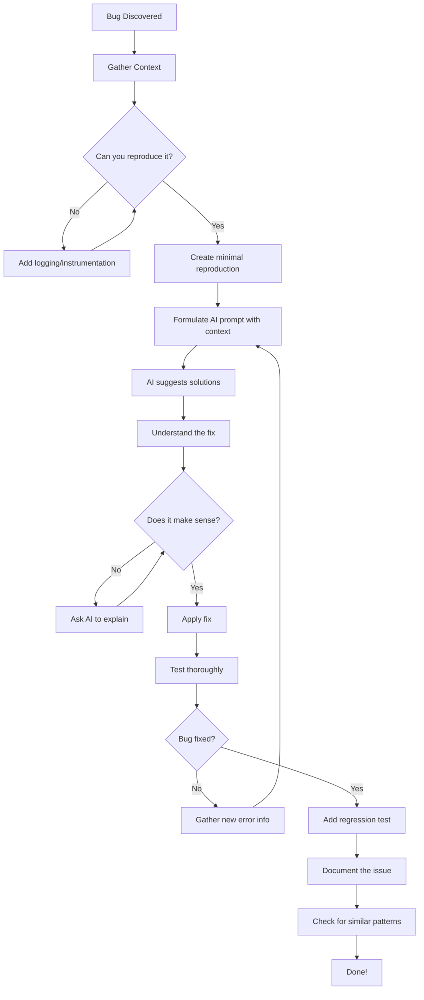
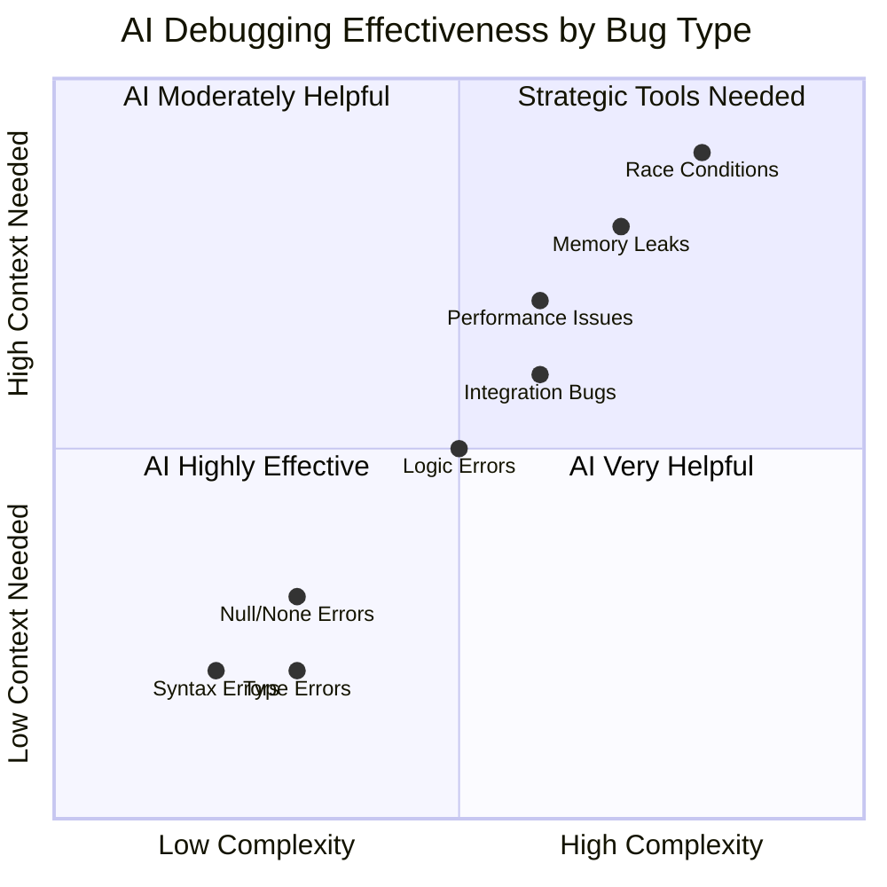
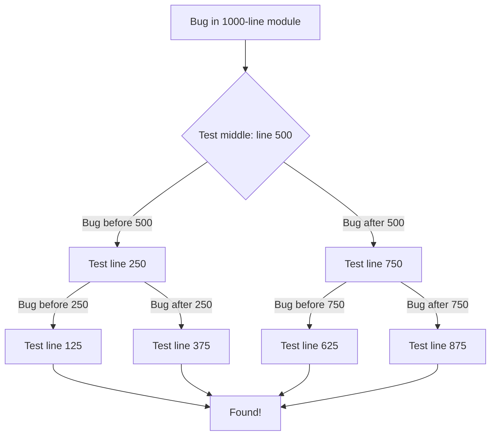

> **AI/ML Engineering Track** | Complexity: `[MEDIUM]` | Time: 4-5 hours

**Prerequisites**: Modules 1-3

## Why This Module Matters

August 1, 2012. 9:30 AM. Knight Capital Group, a major American financial services firm, deployed a new version of their trading software. Within minutes, the system began executing millions of erroneous trades. The engineering team scrambled to debug the issue in real-time, staring at logs and frantically trying to roll back the deployment. By 10:15 AM, just forty-five minutes later, the company had lost four hundred and sixty million dollars. The root cause was a repurposed software flag that accidentally triggered dormant, obsolete code. A faster debugging and diagnostic process could have saved hundreds of millions of dollars and preserved the company's independence.

In modern software engineering, the cost of a bug is measured in downtime, revenue loss, and reputational damage. Debugging is no longer just about fixing typos; it is about diagnosing complex, distributed systems under extreme pressure. When you are staring at a cryptic stack trace at two in the morning, traditional methods often fall short.

This is where AI-assisted debugging becomes a critical force multiplier. By combining rigorous engineering methodologies with the pattern-recognition capabilities of artificial intelligence, developers can drastically reduce the time it takes to identify root causes and implement robust solutions. This module transforms debugging from a stressful guessing game into a systematic, predictable discipline.

## What You Will Be Able to Do

By the end of this module, you will:
- Diagnose complex logic and performance issues using AI-assisted binary search and differential debugging techniques.
- Implement automated regression tests to verify AI-generated bug fixes and prevent recurrence.
- Evaluate the effectiveness of AI debugging across different bug categories, from syntax errors to race conditions.
- Design cloud-native debugging workflows utilizing Kubernetes ephemeral containers and structured metrics.
- Integrate modern AI tool-calling workflows to automate troubleshooting pipelines.

## The AI-Assisted Debugging Mental Model

Artificial intelligence is not a magic wand that fixes your code while you sleep. It is an indefatigable debugging consultant. It has been trained on vast numbers of stack traces, can often reason about obscure frameworks, and does not suffer from human cognitive fatigue. However, it cannot run your application, it does not understand your unique business logic, and it is prone to hallucinating plausible but incorrect fixes if given inadequate context.

The professional developer treats the AI as a junior peer: providing comprehensive context, challenging its assumptions, and exhaustively verifying its outputs.

[DIAGRAM-1]


[CODE-1]


### Step 1: Gather Context

The quality of an AI's debugging assistance is directly proportional to the context it receives. Giving an AI a vague complaint yields useless guesses. Providing a precise, minimally reproducible environment yields surgical fixes.

**Bad Approach**:
[CODE-2]
```
"My code doesn't work, help!"
```

**Good Approach**:
[CODE-3]
```
"Python 3.11, FastAPI 0.109.0
Error: KeyError: 'user_id' at line 42 in process_request()
Expected: Extract user_id from request headers
Actual: Crashes when header missing
Code: [paste minimal reproduction]
Recent change: Added authentication middleware yesterday
Already tried: Checked header is set in client, verified middleware runs
Environment: Docker container, Ubuntu 22.04, requests==2.31.0
```

> **Stop and think**: Why is specifying the exact version of the framework critical? Many frameworks introduce breaking changes in minor versions; an AI might suggest a fix using an API that was deprecated in your specific version.

You must also avoid the pitfall of providing insufficient context:
[CODE-40]
```
"I get KeyError, help"
```

Instead, provide the full trace and environmental context:
[CODE-41]
```
"KeyError: 'user_id' at line 42 in process_request()

Full stack trace:
[paste complete trace]

Code:
def process_request(data):
    user_id = data['user_id']  # Line 42
    return get_user(user_id)

Input that triggers error:
data = {'username': 'john', 'email': 'john@example.com'}
# Note: Missing 'user_id' key!

Expected: Should handle missing user_id gracefully
Actual: Crashes with KeyError

Environment: Python 3.11, FastAPI 0.109, pydantic 2.5
"
```

Version information is paramount. A bug might only exist in a specific runtime.
[CODE-53]
```
Environment:
- Python 3.11.5
- Django 4.2.7
- PostgreSQL 15.3
- psycopg2 2.9.9
- OS: Ubuntu 22.04 LTS
- Running in Docker (python:3.11-slim base)

[error and code]
```

Here is an example of a version-specific bug that AI can easily catch if given the correct context:
[CODE-54]
```python
# Works in Python 3.9, fails in Python 3.11
d = {'a': 1, 'b': 2}
items = d.keys()
first = items[0]  # TypeError in 3.x!

# Why: dict.keys() returns a view, not a list
# Fix: list(d.keys())[0]
```

### Step 2: Systematic Investigation

When you have the context, ask the AI to perform a structured analysis rather than just outputting code.
[CODE-4]
```
Debug this error systematically:

[Error message and stack trace]

[Minimal reproduction code]

Please:
1. Identify the root cause
2. Explain WHY this error occurs
3. Provide 2-3 potential solutions
4. Recommend the best solution with rationale
5. Show the fixed code
6. Suggest tests to prevent recurrence
```

Using this structured prompt forces the AI to break down the problem logically. If you simply ask for a fix, you fall into a common trap:
[CODE-42]
```
User: "Fix this"
AI: [suggests solution]
User: [applies immediately without understanding]
```

Instead, solicit multiple solutions and understand the trade-offs:
[CODE-43]
```
User: "Fix this bug. Provide 3 different solutions with trade-offs:
1. Quick fix (may have limitations)
2. Proper fix (more invasive but correct)
3. Defensive fix (prevents similar bugs)"

AI: [provides multiple approaches]

User: "Explain approach #2 in detail. Why is it better than #1?"
AI: [explains rationale]

User: [applies with understanding]
```

Consider this scenario involving division by zero:
[CODE-44]
```python
# Bug: Division by zero
def calculate_average(numbers):
    return sum(numbers) / len(numbers)

# Solution 1 (Quick fix): Just catch it
def calculate_average(numbers):
    try:
        return sum(numbers) / len(numbers)
    except ZeroDivisionError:
        return 0  # But is 0 the right default?

# Solution 2 (Proper fix): Handle explicitly
def calculate_average(numbers):
    if not numbers:
        raise ValueError("Cannot average empty list")
    return sum(numbers) / len(numbers)

# Solution 3 (Defensive fix): Use statistics library
from statistics import mean
def calculate_average(numbers):
    return mean(numbers)  # Raises StatisticsError on empty

# Choose based on your requirements!
```

### Step 3: Verify the Solution

Do not blindly paste AI-generated code into your application. Verify that it solves the root cause and does not introduce side effects.
[CODE-5]
```python
# AI suggested: Add null check
def process_user(user):
    if user is None:  # AI's fix
        return None
    return user.name

# Your verification:
# 1. Does it fix the original error? 
# 2. What if user exists but has no name?  (still crashes!)
# 3. Should we return None or raise exception? (design decision)
# 4. What calls this function and how do they handle None?

# Better fix after understanding:
def process_user(user):
    if user is None:
        raise ValueError("User cannot be None")
    return getattr(user, 'name', 'Unknown')
```

If you do not understand the fix, you must ask the AI for a breakdown.
[CODE-45]
```
Explain this fix as if to a junior developer:
- Why the bug occurred
- How the fix works
- What assumptions it makes
- What could still go wrong
- How to test it properly
```

For instance, a simple truthiness check might hide a deeper architectural flaw:
[CODE-46]
```python
# AI suggests this fix:
def process_data(data):
    return [x for x in data if x]  # Added "if x"

# You should understand:
# Q: Why does "if x" fix it?
# A: Filters out falsy values (None, 0, '', [], False)
#
# Q: Is this correct for my use case?
# A: Depends! If data can legitimately contain 0 or '', this is wrong!
#
# Q: What's the proper fix?
# A: Be explicit: "if x is not None" if you want to keep 0 and ''
```

### Step 4: Prevent Recurrence

Once the fix is validated, you must write automated tests to help ensure the bug does not return. A bug fix without a regression test is merely a temporary patch.
[CODE-6]
```python
def test_process_user_handles_none():
    """Regression test for bug #1234: KeyError when user is None"""
    with pytest.raises(ValueError, match="User cannot be None"):
        process_user(None)

def test_process_user_handles_missing_name():
    """Edge case: user exists but has no name attribute"""
    user = MockUser()  # Has no name attribute
    assert process_user(user) == 'Unknown'
```

If you are unsure how to test the specific edge case, ask the AI to generate the test suite:
[CODE-50]
```
"Generate comprehensive tests for this bug fix:
[show original bug and fix]

Include:
- Test for original bug
- Edge cases
- Normal cases
- Integration test if needed"
```

A complete testing implementation ensures that edge cases like zero division are covered:
[CODE-49]
```python
# Fix the bug
def divide_numbers(a, b):
    if b == 0:
        raise ValueError("Cannot divide by zero")
    return a / b

# Add the test
def test_divide_by_zero():
    """Regression test for bug #1234"""
    with pytest.raises(ValueError, match="Cannot divide by zero"):
        divide_numbers(10, 0)

def test_divide_normal():
    assert divide_numbers(10, 2) == 5.0

def test_divide_negative():
    assert divide_numbers(-10, 2) == -5.0
```

Documenting the bug and the rationale for the fix is equally crucial.
[CODE-56]
```python
def process_request(data):
    """Process incoming request data.

    Note: data MUST include 'user_id' key.
    Bug #1234: Previously crashed with KeyError if missing.
    Now validates and raises explicit ValueError.
    """
    if 'user_id' not in data:
        raise ValueError(
            "Missing required 'user_id' in request data. "
            "See Bug #1234 for context."
        )
    return handle_user(data['user_id'])
```

## Common Bug Categories and AI Effectiveness

Not all bugs are created equal. AI models excel at specific categories of debugging while struggling profoundly with others.

[DIAGRAM-2]


[CODE-8]


### Category 1: Syntax & Type Errors

AI effectiveness is exceptionally high here. These follow strict grammatical rules that models have extensively memorized.
[CODE-9]
```
Fix this SyntaxError: [error message]
[code]
```

Example of a missing colon:
[CODE-10]
```python
# Bug
def calculate_total(items)
    return sum(item.price for item in items)
# SyntaxError: invalid syntax

# AI immediately spots: Missing colon after function definition
# Fix
def calculate_total(items):
    return sum(item.price for item in items)
```

### Category 2: Logic Errors

AI effectiveness is good, provided you supply the expected versus actual outputs.
[CODE-11]
```
This function returns wrong results:
Expected: [input] → [output]
Actual: [input] → [wrong output]

[function code]

Identify the logic error and explain your reasoning.
```

Off-by-one errors are classic logic bugs that AI easily resolves:
[CODE-12]
```python
# Bug
def get_last_n_items(items, n):
    return items[-n-1:]  # Off-by-one error!

# Expected: get_last_n_items([1,2,3,4,5], 2) → [4,5]
# Actual: get_last_n_items([1,2,3,4,5], 2) → [3,4,5]

# AI spots: -n-1 should be -n
# Fix
def get_last_n_items(items, n):
    return items[-n:] if n > 0 else []
```

### Category 3: Null/None Errors

AI is highly effective at identifying missing null checks.
[CODE-13]
```
Getting AttributeError: 'NoneType' object has no attribute 'x'

[code with error]

Fix by:
1. Identifying where None is introduced
2. Adding appropriate null checks
3. Handling gracefully with proper error messages
```

Adding defensive programming structures:
[CODE-14]
```python
# Bug
def get_user_email(user_id):
    user = db.get_user(user_id)  # Returns None if not found
    return user.email.lower()  # Crashes if user is None!

# AI suggests defensive fix:
def get_user_email(user_id):
    user = db.get_user(user_id)
    if user is None:
        raise ValueError(f"User {user_id} not found")
    if user.email is None:
        return None
    return user.email.lower()
```

Failing to test edge cases around nulls is a frequent oversight:
[CODE-47]
```python
# Bug report: "Crashes with empty string"
def get_first_char(text):
    return text[0]  # IndexError if text is empty

# AI suggests:
def get_first_char(text):
    return text[0] if text else ''

# You test with empty string:  Works!
# But edge cases:
get_first_char(None)  # TypeError: NoneType not iterable!
get_first_char(123)   # TypeError: int not subscriptable!

# Better fix:
def get_first_char(text):
    if not isinstance(text, str):
        raise TypeError(f"Expected str, got {type(text)}")
    return text[0] if text else ''
```

### Category 4: Concurrency and Race Conditions

AI struggles heavily with concurrency bugs because they depend on runtime timing and non-deterministic scheduling. However, AI can identify unsafe patterns when pointed to the correct code.
[CODE-63]
```python
class Counter:
    def __init__(self):
        self.count = 0

    def increment(self):
        # Bug: Not thread-safe!
        current = self.count
        # Context switch can happen here
        self.count = current + 1

# Multiple threads calling increment() leads to lost updates
```

The AI can explain the race condition:
[CODE-64]
```
This is a classic race condition. The increment operation is not atomic:
1. Thread A reads count (0)
2. Thread B reads count (0)  ← Race!
3. Thread A writes count (1)
4. Thread B writes count (1)  ← Lost update! Should be 2

Solutions:

1. Use threading.Lock:
```

And propose multiple concurrent safety mechanisms:
[CODE-65]
```python
import threading

class Counter:
    def __init__(self):
        self.count = 0
        self.lock = threading.Lock()

    def increment(self):
        with self.lock:
            self.count += 1
```

[CODE-66]
```
2. Use atomic operations:
```

[CODE-67]
```python
from threading import Lock

class Counter:
    def __init__(self):
        self._count = 0
        self._lock = Lock()

    def increment(self):
        with self._lock:
            self._count += 1

    @property
    def count(self):
        with self._lock:
            return self._count
```

[CODE-68]
```
3. Use queue.Queue for thread-safe operations

4. Or use multiprocessing.Value:
```

[CODE-69]
```python
from multiprocessing import Value

class Counter:
    def __init__(self):
        self.count = Value('i', 0)

    def increment(self):
        with self.count.get_lock():
            self.count.value += 1
```

## Debugging Patterns

### Pattern 1: Binary Search Debugging

When a bug resides in a monolithic block of logic, use a binary search approach. Add logging to the midpoint, observe if the error occurs before or after, and repeat.

[DIAGRAM-3]


[CODE-23]


You can explicitly instruct an AI to assist in bisecting the logic:
[CODE-24]
```
I have a bug in this workflow:
1. User submits form
2. Data validated
3. Database saved
4. Email sent
5. Response returned

Bug: Users not receiving emails

Help me binary search:
- Where should I add logging to divide the problem space?
- What should I check at each step?
- How to verify if each step succeeded?
```

The AI will insert print statements or logging calls strategically:
[CODE-25]
```python
# AI suggests: Add checkpoints to bisect
def process_form(form_data):
    print(f"CHECKPOINT 1: Received {form_data}")

    validated = validate(form_data)
    print(f"CHECKPOINT 2: Validated {validated}")

    saved = db.save(validated)
    print(f"CHECKPOINT 3: Saved with ID {saved.id}")

    email_sent = send_email(saved.user_email)
    print(f"CHECKPOINT 4: Email sent? {email_sent}")

    return create_response(saved)

# Run with test data, see where output stops
# → Narrows down where bug occurs
```

### Pattern 2: Differential Debugging

When software operates correctly in development but fails in production, you must diff the environments.
[CODE-26]
```
Code works on dev (Python 3.11, Mac M1, SQLite),
fails on prod (Python 3.11, Linux x86, PostgreSQL)

Error: [production error]
[code]

What environmental differences could cause this?
Consider: OS, architecture, database, dependencies, config
```

A common differential bug is file system case sensitivity:
[CODE-27]
```python
# Bug: Works on Mac, fails on Linux
import os

def load_config():
    # Bug: Mac filesystem is case-insensitive!
    with open('Config.json') as f:  # Works on Mac
        return json.load(f)
    # Linux: FileNotFoundError (file is actually 'config.json')

# AI spots: Case sensitivity difference
# Fix: Normalize paths or use correct case
```

### Pattern 3: Regression Debugging

If a recent commit caused a test failure, feed the AI the `git diff` and ask for a localized analysis.
[CODE-28]
```
After this change: [git diff]

This started failing: [test failure]

Analyze the diff and identify:
1. What in the change could cause this failure?
2. What assumptions might have been broken?
3. What edge cases might now fail?
```

You can automate finding the broken commit using Git:
[CODE-29]
```bash
git bisect start
git bisect bad  # Current broken commit
git bisect good abc123  # Last known good commit
# Git will checkout commits for you to test

# Then ask AI about each bisect commit
```

## Cloud-Native Debugging with Kubernetes

Modern applications are distributed, running across hundreds of cloud instances. You must incorporate Kubernetes troubleshooting tools into your AI debugging workflows.

When debugging live workloads in Kubernetes, the `kubectl debug` command is your primary tool. It supports debugging workflows for workloads and nodes, including [creating pod copies, injecting ephemeral containers, and instantiating node-host-namespace debug pods](https://kubernetes.io/docs/reference/kubectl/generated/kubectl_debug/).

> **Stop and think**: If an application container is stripped of its shell (a distroless image), how do you run diagnostic commands inside the pod?

The solution is Ephemeral Containers. To attach a debugging container to a running pod, you might use a command like `kubectl debug -f pod.yaml`. Note that using this specific YAML workflow [requires the `EphemeralContainers` feature to be enabled](https://kubernetes.io/docs/reference/kubectl/generated/kubectl_debug/). Ephemeral containers reached a `stable` feature-state in Kubernetes v1.25, having graduated from beta in v1.23.

If you need to debug the underlying node, remember that debugging nodes with `kubectl` [requires a cluster server version of at least 1.2](https://kubernetes.io/docs/tasks/debug/debug-cluster/kubectl-node-debug/).

Kubernetes v1.35 introduced a powerful capability for AI-assisted debugging: structured, machine-parseable debugging z-page responses for control-plane endpoints to support automated tooling. This [structured z-page output in Kubernetes 1.35 is enabled via `Accept` headers and returns versioned JSON responses](https://kubernetes.io/docs/reference/instrumentation/zpages/) (for example, targeting `statusz` with API version fields such as `Accept: application/json;v=v1alpha1;g=config.k8s.io;as=Statusz`). You can pass these JSON blobs directly into an AI model for rapid control-plane diagnostics.

### Profiling Kubernetes Workloads

To gather performance context before asking an AI for optimizations, you might use `kubectl top`. However, [`kubectl top` requires the Metrics Server to be installed and running in the cluster](https://kubernetes.io/docs/reference/kubectl/generated/kubectl_top).

Be aware of its limitations: [The Kubernetes Metrics Server is intended for autoscaling pipelines (like HPA and VPA) and is not a replacement for full monitoring systems. In its documented configuration, it collects resource metrics every 15 seconds](https://github.com/kubernetes-sigs/metrics-server) and positions itself purely as a lightweight component for autoscaling. Furthermore, [`kubectl top pod` output can be unavailable for a few minutes after Pod creation due to metrics pipeline delay](https://kubernetes.io/docs/reference/kubectl/generated/kubectl_top/kubectl_top_pod/).

## Debugging AI Tooling Integrations

When building AI-native applications, you will inevitably debug the communication layer between your code and the AI provider.

OpenAI models its tool calling via a five-step flow:
1. Define tools in the request.
2. Receive a tool call from the model.
3. Execute the tool locally.
4. Send the output back to the model.
5. Receive the final response.

To prevent formatting errors, ensure you use OpenAI's [strict-mode function calling, which relies on structured outputs and enforces schema adherence for tool arguments](https://platform.openai.com/docs/guides/function-calling?api-mode=respon).

As you build these integrations, note that the OpenAI Assistants API is deprecated and scheduled for shutdown on 2026-08-26. You must migrate to the Responses/Conversations APIs.

OpenAI announced in May 2025 that the [Responses API now supports remote Model Context Protocol (MCP) servers, image generation, the code interpreter, and improved file search tooling across major model families (including GPT-4o, GPT-4.1, and the o-series)](https://openai.com/index/new-tools-and-features-in-the-responses-api/). If you are building documentation tools, OpenAI documents a [public MCP server at `https://developers.openai.com/mcp` for read-only documentation access](https://platform.openai.com/docs/docs-mcp).

If you are integrating search, note that the [OpenAI web search tooling in Responses supports non-reasoning and agentic modes, but is not available for `gpt-5` with minimal reasoning and `gpt-4.1-nano` in this context](https://platform.openai.com/docs/guides/tools-web-search?api-mode=responses).

## Performance Optimization

When addressing performance, do not blindly request an optimization rewrite.
[CODE-72]
```
"Make this code faster: [entire module]"
```

Instead, profile first. Identify the bottleneck, assess the time complexity, and ask the AI specifically about that section.
[CODE-73]
```
Profiling shows 80% time in this function:
[specific function]

Current complexity: O(n²)
Called: 10,000 times per request
Average input size: n=100

Can we do better?
```

Using tools like `cProfile` yields concrete data to feed the model.
[CODE-74]
```bash
# Profile
python -m cProfile -o profile.stats app.py

# Analyze
python -c "import pstats; p = pstats.Stats('profile.stats'); p.sort_stats('cumulative'); p.print_stats(10)"

# Top results:
# 80% time in find_similar_users()
# Called 1000 times

# Now ask AI:
# "Optimize this O(n²) function: [paste find_similar_users]"
```

When an AI struggles because it cannot run a profiler, you must bridge the gap:
[CODE-48]
```bash
# First: Profile
python -m cProfile -o profile.stats app.py

# Then: Ask AI
# [Paste profiling results]
# "Interpret these profiling results. Where should I optimize?"
```

Measure your execution time before deploying a fix.
[CODE-75]
```python
import timeit

# Measure current performance
time_before = timeit.timeit(
    "slow_function(data)",
    setup="from __main__ import slow_function, data",
    number=1000
)
print(f"Before: {time_before:.3f}s")
```

Measure again afterward:
[CODE-76]
```python
time_after = timeit.timeit(
    "fast_function(data)",
    setup="from __main__ import fast_function, data",
    number=1000
)
print(f"After: {time_after:.3f}s")
print(f"Speedup: {time_before/time_after:.1f}x")
```

And verify the output is identical!
[CODE-77]
```python
assert slow_function(data) == fast_function(data)
```

Focus only on the bottlenecks using the 80/20 rule.
[CODE-78]
```
Current profiling:
- process_data(): 70% of time
- validate_input(): 15% of time
- format_output(): 10% of time
- [other functions]: 5% of time

Which should I optimize first?
```

The maximum speedup is governed by Amdahl's Law.
[CODE-79]
```
Maximum speedup = 1 / ((1 - P) + P/S)

Where:
P = proportion of program that's optimized
S = speedup of that portion

Example: Optimize 70% of code by 2x
Max speedup = 1 / (0.3 + 0.7/2) = 1.54x overall
```

In Python, the profiler output directly indicates where AI should focus.
[CODE-21]
```bash
# 1. Profile
python -m cProfile -o profile.stats your_script.py

# 2. Analyze with AI
# Copy top results from stats
```

Feed the top results to the assistant:
[CODE-22]
```
These functions take the most time:
- process_data(): 60% (called 10,000 times)
- calculate_hash(): 30% (called 50,000 times)
- validate_input(): 10% (called 10,000 times)

[paste function code]

Where should I focus optimization efforts? Specific suggestions?
```

You can also rely on AI to conduct algorithmic analysis.
[CODE-15]
```
This function is slow:
[code]

Analyze:
1. Time complexity (Big O)
2. Bottlenecks
3. Optimization opportunities
4. Provide optimized version with explanation
```

Or to provide specific tactical optimization patterns:
[CODE-17]
```
   Analyze complexity and optimize:
   [your algorithm]

   Current: O(?)
   Goal: Better than O(n²)
   Constraints: [memory limits, real-time requirements]
   ```

[CODE-18]
```
   Optimize this Python code:
   [code]

   Focus on:
   - List comprehensions vs loops
   - Generator expressions
   - Built-in functions
   - Unnecessary copies
   - Memory allocations
   ```

It can analyze inefficient database operations:
[CODE-19]
```
   Optimize this SQL query:
   [query]

   Issues: N+1 queries, missing indexes
   Database: PostgreSQL 15
   Table sizes: users (1M rows), posts (10M rows)
   ```

Or recommend memory-efficient data structures:
[CODE-20]
```
   I need to:
   - Store 1M items
   - Look up by ID (frequent)
   - Iterate in insertion order (occasional)
   - Remove items (rare)

   What data structure? dict? OrderedDict? Custom?
   ```

## Combine AI with Traditional Tools

A professional does not abandon traditional tracing methods; they use AI to interpret the trace outputs.

Feed stack traces directly to bypass framework internals:
[CODE-30]
```
[Paste full stack trace]

What's the likely root cause?
Focus on frames 3-5 where my code is.
Ignore framework internals unless relevant.
```

The AI can identify type issues hidden deep in the trace:
[CODE-31]
```python
Traceback (most recent call last):
  File "app.py", line 42, in process_request
    result = calculate_total(items)
  File "calculator.py", line 15, in calculate_total
    return sum(item.price for item in items)
  File "calculator.py", line 15, in <genexpr>
    return sum(item.price for item in items)
AttributeError: 'dict' object has no attribute 'price'

# Ask AI: "Why am I getting dict instead of Item objects?"
# AI might suggest: Check serialization, API contract, database query
```

When interpreting profiler traces, the AI can spot architectural antipatterns:
[CODE-32]
```
cProfile shows:
- function X: 80% of time
- called 10,000 times
- 8ms per call

[function X code]

Why is this slow? How to optimize?
```

For instance, identifying an N+1 query issue inside a loop:
[CODE-33]
```python
# Profiler output
#  ncalls  tottime  percalls  cumtime  filename:lineno(function)
#  10000   8.234    0.001     8.234    search.py:42(find_user)

def find_user(user_id):
    # AI spots: Loading all users every time!
    users = db.query(User).all()
    return [u for u in users if u.id == user_id][0]

# AI suggests: Use direct query
def find_user(user_id):
    return db.query(User).filter(User.id == user_id).first()
# 1000x faster!
```

System log analysis is another critical synergy:
[CODE-34]
```
Error logs show this pattern:
[paste relevant logs]

What's happening? Pattern analysis?
```

The AI can connect the dots between cascading failures:
[CODE-35]
```
2025-11-22 14:23:45 ERROR Failed to process request: Connection timeout
2025-11-22 14:23:47 ERROR Failed to process request: Connection timeout
2025-11-22 14:23:49 ERROR Failed to process request: Connection timeout
[100 more similar errors]
2025-11-22 14:25:12 ERROR Failed to process request: Too many open files

# Ask AI: "Why transition from timeouts to 'too many open files'?"
# AI suggests: Not closing connections, file descriptor leak
```

When stepping through code in an interactive debugger (`pdb`), use AI to resolve logical paradoxes:
[CODE-36]
```
At breakpoint, variables are:
x = [value]
y = [value]

Expected x to be [expected]
Why is it [actual]?

[relevant code section]
```

Example: A variable remains undefined due to a logical oversight.
[CODE-37]
```python
# At breakpoint in calculate_discount():
(pdb) x
12.50
(pdb) y
None

# Expected y to be the discount amount (1.25)
# Ask AI: "Why is y None when x is 12.50?"

def calculate_discount(price):
    if price > 10:
        discount = price * 0.1
    return price - discount  # AI spots: discount undefined if price <= 10!
```

> **Pause and predict**: If you step over the `if price > 10` block when `price = 8`, what will the runtime do when it reaches the return statement? It throws an `UnboundLocalError`.

Even basic "print debugging" benefits from AI placement strategies. Ask where to inject the logs:
[CODE-7]
```
"Where should I add logging to debug this user authentication flow?
I need to track: user input, token validation, database query, session creation"
```

Rubber duck debugging is greatly enhanced when the duck replies back. Detail your hypothesis explicitly:
[CODE-16]
```
I'm debugging [problem].

Here's what I know:
- [observation 1]
- [observation 2]

Here's what I've tried:
- [attempt 1]: [result]
- [attempt 2]: [result]

My hypothesis: [your theory]

Am I on the right track? What am I missing?
```

Expand on this by explicitly requesting validation of your logic:
[CODE-52]
```
I'm debugging [problem].

Here's what I know:
- [observation 1]
- [observation 2]

Here's what I've tried:
- [attempt 1]: [result]
- [attempt 2]: [result]

My hypothesis: [your theory]

Questions:
- Am I on the right track?
- What am I missing?
- What should I check next?
```

If the first attempt fails, feed the failure back to iterate:
[CODE-55]
```
That fix didn't work. Now I get:
[new error]

Original problem: [original issue]
Your suggested fix: [what you suggested]
What I did: [exactly what you applied]
Result: [what happened]

What's the next step?
```

### Comprehensive Examples

**Performance Bug via N+1 Queries**
[CODE-57]
```
This endpoint is slow:

@app.get("/users")
def get_users():
    users = db.query(User).all()
    return [
        {
            "id": u.id,
            "name": u.name,
            "posts": [post.title for post in u.posts],
            "comments": [c.text for c in u.comments]
        }
        for u in users
    ]

Taking 5 seconds for 100 users.

cProfile shows:
- 100 calls to User.posts (lazy loading)
- 100 calls to User.comments (lazy loading)
- Total: 201 database queries!

This is the N+1 query problem, right? How do I fix it?
```

The fix involves eager loading:
[CODE-58]
```python
@app.get("/users")
def get_users():
    users = db.query(User).options(
        joinedload(User.posts),
        joinedload(User.comments)
    ).all()

    return [
        {
            "id": u.id,
            "name": u.name,
            "posts": [post.title for post in u.posts],
            "comments": [c.text for c in u.comments]
        }
        for u in users
    ]

# Now: 1 query with joins instead of 201 queries!
# Time: 5s → 50ms (100x faster!)
```

**Subtle Logical Misdirection**
[CODE-59]
```
This function fails intermittently:

def calculate_discount(items):
    total = sum(i['price'] for i in items)
    if total > 100:
        discount = total * 0.1
    return total - discount  # UnboundLocalError sometimes!

When does this fail and why?
How should I fix it?
```

AI proposes multiple deterministic paths:
[CODE-60]
```python
# Option 1: Initialize discount
def calculate_discount(items):
    total = sum(i['price'] for i in items)
    discount = 0
    if total > 100:
        discount = total * 0.1
    return total - discount

# Option 2: Combine logic
def calculate_discount(items):
    total = sum(i['price'] for i in items)
    discount = total * 0.1 if total > 100 else 0
    return total - discount

# Option 3: Return early
def calculate_discount(items):
    total = sum(i['price'] for i in items)
    if total <= 100:
        return total
    discount = total * 0.1
    return total - discount
```

**Integration Header Omission**
[CODE-61]
```
API calls to partner service failing:

import requests

response = requests.post(
    "https://api.partner.com/webhook",
    json={"event": "user_signup", "user_id": user.id}
)

Error: 401 Unauthorized

Headers sent:
{
    'Content-Type': 'application/json',
    'User-Agent': 'python-requests/2.31.0'
}

Their API docs say:
"All requests must include 'Authorization: Bearer <token>' header"

But I'm setting the token! Here's my code:

def send_webhook(event, user_id):
    headers = {'Authorization': f'Bearer {API_TOKEN}'}
    response = requests.post(
        "https://api.partner.com/webhook",
        json={"event": event, "user_id": user_id}
    )
    return response

What's wrong?
```

The AI spots the variable that was declared but never passed:
[CODE-62]
```python
# Bug: Headers defined but not used
def send_webhook(event, user_id):
    headers = {'Authorization': f'Bearer {API_TOKEN}'}
    response = requests.post(  # Missing headers= parameter!
        "https://api.partner.com/webhook",
        json={"event": event, "user_id": user_id}
    )
    return response

# Fix: Pass headers to request
def send_webhook(event, user_id):
    headers = {'Authorization': f'Bearer {API_TOKEN}'}
    response = requests.post(
        "https://api.partner.com/webhook",
        headers=headers,  # Add this!
        json={"event": event, "user_id": user_id}
    )
    return response
```

Always start by generating a minimal reproduction script.
[CODE-51]
```python
# Bad: "Here's my entire application, it crashes somewhere"

# Good: Minimal reproduction
def test_bug():
    """Minimal reproduction of authentication bug"""
    user = create_test_user()
    token = generate_token(user)
    result = validate_token(token)  # Fails here
    assert result is not None  # This assertion fails
```

## War Stories and Lessons

History provides brutal lessons about bugs that spiral out of control. The Morris Worm showed how an aggressively self-replicating network worm could overload systems across the early internet.
[CODE-70]
```c
// Pseudo-code of the bug
if (system_claims_infected()) {
    if (random(7) == 0) {  // 14.3% chance
        infect_anyway();   // Too aggressive!
    }
}
// Should have been random(100) or similar
```

If the author had access to modern AI, they could have modeled the emergent behavior:
[CODE-71]
```
Review this worm propagation logic for safety:

if system_claims_infected():
    if random(7) == 0:
        infect_anyway()

Goal: Measure internet size without causing harm
Risk: Systems become overloaded

Is this probability safe?
```

Similarly, the Mars Climate Orbiter crashed because different engineering teams used incompatible units of measurement.
[CODE-38]
```python
# Bad: No units
def apply_thrust(force):
    return force * time

# AI might suggest: "What unit is force? Document it!"

# Better: With type hints and units library
from pint import UnitRegistry
ureg = UnitRegistry()

def apply_thrust(force: ureg.Quantity) -> ureg.Quantity:
    """Apply thrust to spacecraft.

    Args:
        force: Thrust in newtons
    Returns:
        Impulse in newton-seconds
    """
    if not force.check('[force]'):
        raise ValueError(f"Expected force, got {force.dimensionality}")
    return force * time
```

An AI code review could easily spot implicit assumptions regarding physical units.
[CODE-39]
```
Review this physics code for unit consistency:
[paste code]

Check:
- Are units documented?
- Are conversions explicit?
- Could different units be mixed accidentally?
```

## Common Mistakes

| Mistake | Why It Fails | Fix Strategy |
|---|---|---|
| **Pasting undocumented code** | The AI lacks environmental context (library versions, runtime config), leading to generic or deprecated suggestions. | Provide full trace, framework versions, and your specific intent. |
| **Accepting the first output** | Models default to the most probabilistic quick-fix, which may handle the symptom but ignore the architectural root cause. | Demand three distinct solutions and a comparison of their trade-offs. |
| **Omitting regression tests** | A patched bug without an automated test is highly likely to reappear during the next refactoring cycle. | Instruct the AI to generate a unit test that fails on the buggy code and passes on the fix. |
| **Relying on AI for timing bugs** | Concurrency bugs and race conditions depend on live thread scheduling that static code analysis cannot observe. | Use tools like ThreadSanitizer or log traces, and ask the AI to analyze the output. |
| **Ignoring the metric delay** | `kubectl top pod` output is unavailable for several minutes immediately after pod creation. | Wait for the metrics pipeline delay to clear before attempting to debug autoscaling behavior. |
| **Misusing the Assistants API** | The Assistants API is deprecated and slated for shutdown on 2026-08-26. | Migrate automation workflows to the Responses or Conversations APIs immediately. |

## Did You Know?

- One famous early computing anecdote involved a moth found in a relay of the Harvard Mark II, helping popularize the language of "bugs" and "debugging."
- The Therac-25 accidents between 1985 and 1987 showed how software defects and weak safety engineering in medical systems can lead to lethal overdoses.
- On August 1, 2012, the Knight Capital Group lost $460 million in exactly 45 minutes because a repurposed software flag accidentally triggered obsolete trading code.
- The Mars Climate Orbiter was lost in 1999 after a navigation failure involving incompatible English and metric units, becoming a classic lesson in interface contracts and verification.

## Knowledge Check

<details>
<summary>1. A developer is investigating a Kubernetes pod that is repeatedly crashing. They want to inject a diagnostic shell without altering the original deployment. What Kubernetes feature (stable as of v1.25) must be enabled to use `kubectl debug -f pod.yaml`?</summary>
The `EphemeralContainers` feature must be enabled in the cluster. This feature allows administrators to attach a temporary container holding debugging tools directly to a running pod, which is especially vital when dealing with distroless images.
</details>

<details>
<summary>2. You are attempting to debug an unresponsive control-plane endpoint in a Kubernetes 1.35 cluster. How can you retrieve structured, machine-parseable diagnostics directly from the endpoint?</summary>
You must pass a specific `Accept` header to the endpoint. By sending a request with an `Accept: application/json;v=v1alpha1;g=config.k8s.io;as=Statusz` header, the control plane will return versioned, structured z-page JSON that can be fed into an AI for automated analysis.
</details>

<details>
<summary>3. A developer notices their application is consuming excessive memory. They run `kubectl top pod` immediately after deployment, but no metrics are returned. Why did this command fail, and what infrastructure component is required?</summary>
The command failed because there is a pipeline delay of a few minutes after a pod is created before metrics populate. Additionally, `kubectl top` requires the Kubernetes Metrics Server to be installed, which collects data every 15 seconds strictly to support autoscaling, not high-resolution monitoring.
</details>

<details>
<summary>4. You are migrating an internal AI troubleshooting pipeline that previously utilized the OpenAI Assistants API. Why is this migration urgent, and what should you transition to?</summary>
The migration is critical because the Assistants API is deprecated and scheduled for shutdown on 2026-08-26. Workflows must be updated to leverage the newer Responses or Conversations APIs, which support advanced features like remote MCP server execution.
</details>

<details>
<summary>5. When applying AI to performance optimization, why is it considered an antipattern to supply an entire module and ask the AI to "make it faster"?</summary>
Providing an entire module violates the principle of profiling first. It encourages premature optimization of code blocks that have minimal impact on execution time. You should usually use a tool like `cProfile` to identify the bottleneck, then ask the AI to specifically optimize that precise function.
</details>

<details>
<summary>6. You need your AI assistant to read live internal documentation hosted on a custom network. What protocol and public endpoint does OpenAI recommend for modeling this connection?</summary>
OpenAI recommends utilizing the Model Context Protocol (MCP). To understand how to implement it, you can consult their public, read-only MCP server deployed at `https://developers.openai.com/mcp` for documentation access.
</details>

## Hands-On Exercise: Master AI Debugging

In this exercise, you will create a localized environment to practice the AI-assisted debugging lifecycle. You will generate a script containing a subtle logic error, execute it, feed the failure to an AI prompt, and systematically implement the verified fix.

### Step 1: Environment Setup

First, create a clean directory and initialize your environment.

```bash
mkdir -p ~/kubedojo-debugging-lab
cd ~/kubedojo-debugging-lab
python3 -m venv .venv
source .venv/bin/activate
```

### Step 2: Generate the Buggy Script

Create a script that attempts to extract the last `n` items from a list, but contains a classic off-by-one logic error.

```bash
cat << 'EOF' > logic_bug.py
def get_last_n_items(items, n):
    # Off-by-one error exists here
    return items[-n-1:]

data = [1, 2, 3, 4, 5]
expected = [4, 5]
actual = get_last_n_items(data, 2)

print(f"Expected: {expected}")
print(f"Actual:   {actual}")

assert actual == expected, "Output does not match expected result!"
EOF
```

### Step 3: Execute and Capture the Failure

Run the script to observe the failure. This provides the minimal reproduction context you need.

```bash
python3 logic_bug.py
```

*Expected Output:*
You should see that the function actually returns `[3, 4, 5]` instead of `[4, 5]`, followed by an AssertionError.

### Step 4: Formulate the AI Prompt

Draft a prompt to identify the issue. Do not ask for a blind rewrite; use the systematic investigation structure.

```text
This function returns wrong results:
Expected: [1, 2, 3, 4, 5], 2 -> [4, 5]
Actual: [1, 2, 3, 4, 5], 2 -> [3, 4, 5]

def get_last_n_items(items, n):
    return items[-n-1:]

Identify the logic error and explain your reasoning. Provide the corrected code.
```

### Step 5: Implement the Fix and Regression Test

Modify the file to include the correct slice syntax and a formal regression test.

<details>
<summary>Click here to view the verified solution script</summary>

```python
def get_last_n_items(items, n):
    # Corrected slice syntax handling n=0 edge cases safely
    return items[-n:] if n > 0 else []

def test_get_last_n_items():
    assert get_last_n_items([1, 2, 3, 4, 5], 2) == [4, 5]
    assert get_last_n_items([1, 2, 3, 4, 5], 0) == []
    print("All tests passed successfully.")

if __name__ == "__main__":
    test_get_last_n_items()
```

Run the corrected script:
```bash
cat << 'EOF' > logic_bug.py
def get_last_n_items(items, n):
    return items[-n:] if n > 0 else []

def test_get_last_n_items():
    assert get_last_n_items([1, 2, 3, 4, 5], 2) == [4, 5]
    assert get_last_n_items([1, 2, 3, 4, 5], 0) == []
    print("All tests passed successfully.")

if __name__ == "__main__":
    test_get_last_n_items()
EOF

python3 logic_bug.py
```
</details>

**Success Checklist:**
- [ ] You isolated the execution environment.
- [ ] You empirically triggered the AssertionError.
- [ ] You formulated a systematic context prompt.
- [ ] You implemented the fix alongside an automated edge-case test.

## Reference Links
- Syntax & Type Debugging: `module_04/01_syntax_debugging.py`
- Logic Error Debugging: `module_04/02_logic_debugging.py`
- Performance Profiling: `module_04/03_performance_profiling.py`
- Async & Concurrent Debugging: `module_04/04_async_debugging.py`
- Integration Debugging: `module_04/05_integration_debugging.py`
- Optimization Examples: `module_04/06_optimization_examples.py`
- Debugging Patterns: `module_04/07_debugging_patterns.py`
- Example 01: Syntax & Type Debugging: `module_04/01_syntax_debugging.py`
- Example 02: Logic Error Debugging: `module_04/02_logic_debugging.py`
- Example 03: Performance Profiling: `module_04/03_performance_profiling.py`
- Example 04: Async & Concurrent Debugging: `module_04/04_async_debugging.py`
- Example 06: Optimization Examples: `module_04/06_optimization_examples.py`
- Example 07: Debugging Patterns: `module_04/07_debugging_patterns.py`

## Next Module

**Module 1.9: Building with AI Coding Assistants**

You have mastered the art of diagnosing failures and verifying algorithmic changes. In the next module, we will pivot to creation. You will learn how to orchestrate complex feature implementations utilizing AI pair-programming workflows, ensuring architectural integrity while drastically accelerating your development velocity.

## Sources

- [kubectl debug reference](https://kubernetes.io/docs/reference/kubectl/generated/kubectl_debug/) — Official `kubectl debug` reference covering pod copies, ephemeral containers, and node-debug workflows.
- [Debug Running Pods](https://kubernetes.io/docs/tasks/debug/debug-application/debug-running-pod/) — Kubernetes task guide with practical debugging patterns for running Pods and ephemeral containers.
- [Debugging Kubernetes Nodes with Kubectl](https://kubernetes.io/docs/tasks/debug/debug-cluster/kubectl-node-debug/) — Kubernetes documentation for node-level debugging prerequisites and usage.
- [Kubernetes zPages](https://kubernetes.io/docs/reference/instrumentation/zpages/) — Reference for structured z-page endpoints and negotiated response formats such as JSON output.
- [kubectl top reference](https://kubernetes.io/docs/reference/kubectl/generated/kubectl_top) — Official `kubectl top` reference describing its dependency on Metrics Server.
- [Metrics Server](https://github.com/kubernetes-sigs/metrics-server) — Upstream project documentation explaining Metrics Server's autoscaling focus and default 15-second scrape interval.
- [kubectl top pod reference](https://kubernetes.io/docs/reference/kubectl/generated/kubectl_top/kubectl_top_pod/) — Kubernetes reference noting Pod metrics availability details and common timing caveats.
- [OpenAI Function Calling Guide](https://platform.openai.com/docs/guides/function-calling?api-mode=respon) — Primary OpenAI guide for tool-calling flow, strict mode, and structured argument validation.
- [New tools and features in the Responses API](https://openai.com/index/new-tools-and-features-in-the-responses-api/) — OpenAI announcement summarizing Responses API support for remote MCP servers, image generation, Code Interpreter, and file search.
- [OpenAI Docs MCP](https://platform.openai.com/docs/docs-mcp) — OpenAI documentation for the public read-only MCP server used to access developer docs.
- [OpenAI Web Search Guide](https://platform.openai.com/docs/guides/tools-web-search?api-mode=responses) — OpenAI guide for Responses web-search tool behavior, supported modes, and model availability constraints.
