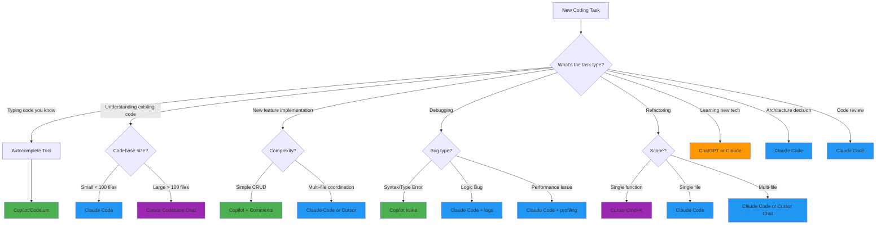

> **AI/ML Engineering Track** | Complexity: `[COMPLEX]` | Time: 5-6
# Or: Putting It All Together to Build Something Real

**Reading Time**: 5-6 hours
**Prerequisites**: Modules 1-4

---

## What You'll Be Able to Do

By the end of this module, you will:
- Master Claude Code workflows and best practices
- Understand GitHub Copilot patterns and limitations
- Learn Cursor IDE advanced features
- Build a complete project using AI assistance
- Develop your personal AI-assisted development workflow
- Know when to use which tool
- Configure each tool optimally for maximum productivity
- Understand the economics and security implications of AI coding tools
- Navigate the legal and ethical landscape of AI-assisted development

---

## Introduction

You've learned AI development patterns (Module 1), prompt engineering (Module 2), code generation (Module 3), and debugging (Module 4).

**Now it's time to put it all together**: Building real projects with AI coding assistants as your daily tools.

Picture this: You're a developer in 2018. Writing code means typing every character yourself. Stack Overflow is your constant companion. Documentation is open in three browser tabs. You're switching contexts every few minutes, breaking your flow to look up API signatures or remember that regex pattern you used last month.

Fast forward to 2025. You start typing a function name and the entire implementation appears as a ghost suggestion. You describe a complex refactoring in plain English and watch as multiple files update themselves. You paste an error message and get not just a fix, but an explanation of the root cause and three alternative solutions.

**This is not science fiction. This is your daily workflow now.**

But here's the catch: Having these tools doesn't automatically make you more productive. It's like being handed a professional chef's knife set—without knowing how to use them, you might just cut yourself. This module teaches you the techniques, the workflows, the configuration, and critically, the discipline to use AI coding assistants effectively.

**Think of AI coding assistants as power tools for software development.** A power drill doesn't replace carpentry skills—it amplifies them. You still need to know what you're building, how to measure, how to design. But once you know the fundamentals, that power drill lets you build faster, more precisely, and with less fatigue.

The developers thriving today aren't the ones using AI to write all their code. They're the ones who know exactly when to use which tool, how to configure them for their workflow, and when to turn them off and think deeply.

**Let's master these power tools. **

---

## Did You Know? The Evolution of Code Completion

The journey from basic autocomplete to AI coding assistants is a fascinating story of exponential improvement compressed into just a few decades.

**1991: IntelliSense is Born**

Microsoft introduces IntelliSense in Visual C++ 1.0. For the first time, developers could see a dropdown list of class members while typing. This was revolutionary—no more flipping through printed API documentation or header files. IntelliSense used static analysis of your code and libraries to suggest completions.

The limitation? It was purely syntactic. It knew your class had a `getName()` method, but it had no idea whether calling it made semantic sense in your current context.

**2000s: The Template Era**

IDEs got smarter with code snippets and templates. Type `for` and press Tab, get a whole loop structure. Productive, but still mindless—the IDE had no understanding of what you were trying to accomplish.

**2017: The Deep Learning Breakthrough**

TabNine launches, built on GPT-2 (before GPT-2 was even public). For the first time, an autocomplete tool understood context beyond syntax. It could learn patterns from your codebase and suggest completions that made semantic sense.

TabNine analyzed millions of open-source repositories to learn how developers actually write code. It could predict not just what methods exist, but what you probably want to do next.

**2021: GitHub Copilot Changes Everything**

OpenAI and GitHub announce Copilot, powered by OpenAI Codex (GPT-3 trained specifically on code). The difference from TabNine? Scale. Codex was trained on the entire public GitHub corpus—billions of lines of code across millions of repositories.

Copilot could:
- Generate entire functions from comments
- Translate between programming languages
- Write tests based on implementation
- Suggest solutions to complex algorithms

The technical preview waitlist hit 1 million developers in 48 hours. The industry had never seen anything like it.

**2023-2025: The Agentic Era**

Tools evolved from "autocomplete" to "agentic coding." Claude Code, Cursor, Windsurf—these aren't just suggesting the next line. They're reading your entire codebase, understanding architecture, making multi-file changes, running terminal commands, even committing to git.

**The Timeline**:
- 1991: Autocomplete 200 methods you could call
- 2017: Predict what you want to call based on context
- 2021: Generate complete implementations from intent
- 2025: Understand your entire system and act as a pair programmer

**From IntelliSense to AI agents in 34 years.** That's the velocity of this field.

---

## ️ The AI Coding Assistant Landscape

### Current Tools (2024-2025)

** Autocomplete-First**:
1. **GitHub Copilot** - Inline suggestions, fast autocomplete
2. **Tabnine** - Privacy-focused, can run locally
3. **Codeium** - Free alternative to Copilot

** AI-First IDEs**:
4. **Cursor** - VS Code fork with deep AI integration
5. **Windsurf** - Codeium's AI-first IDE with Cascade

**️ Terminal/CLI-Based**:
6. **Aider.ai** - Terminal AI pair programming, git-aware
7. **Cline** - VS Code extension for agentic coding

** Agentic Extensions**:
8. **Claude Code** - Long context, multi-file reasoning
9. **Continue.dev** - Open-source, customizable

** General AI for Coding**:
10. **ChatGPT** - General AI with Canvas mode for code
11. **Gemini** - Google's AI with long context (2M tokens)

**This module focuses on the most popular tools** (Claude Code, Copilot, Cursor) with additional coverage of Aider.ai and ChatGPT/Gemini workflows. See Module 1 for full landscape overview.

---

## Did You Know? GitHub Copilot's Controversial Launch

When GitHub Copilot launched in June 2021, it ignited the biggest legal and ethical debate in the history of software development tools.

**The Controversy: Training on Public Code**

Copilot was trained on billions of lines of code from public GitHub repositories. This included code under various licenses: MIT, GPL, Apache, and many others. The question that exploded across Twitter and Hacker News:

**Does training an AI on open-source code violate the license terms?**

**The Arguments Against**:

1. **License Violation**: GPL requires derivative works to be open-source. Is code suggested by an AI trained on GPL code a "derivative work"? The Software Freedom Conservancy argued yes.

2. **Attribution**: Many licenses require attribution. Copilot sometimes generates code snippets nearly identical to training data, but provides no attribution to the original author.

3. **Copyright Laundering**: Critics claimed Copilot was a way to "launder" copyrighted code into proprietary projects without honoring licenses.

**The Arguments For**:

1. **Fair Use**: GitHub and OpenAI argued this was transformative use—the AI learned patterns, not memorized code. Like a developer reading thousands of repositories to learn best practices.

2. **Statistical Model**: The AI doesn't contain the training data; it learned statistical patterns. No different than a human developer who learned by reading open-source code.

3. **New Creation**: The suggestions are generated, not retrieved. The AI creates new code based on learned patterns.

**The Legal Battle**:

In November 2022, a class-action lawsuit was filed against GitHub, Microsoft, and OpenAI, alleging:
- Violation of open-source licenses
- Violation of the DMCA (Digital Millennium Copyright Act)
- Breach of GitHub's Terms of Service
- Violation of privacy laws

As of 2025, the case is still ongoing. It may set precedent for all AI training on public data.

**The Industry Impact**:

1. **Competitors pivoted**: Tabnine emphasized training only on permissively-licensed code
2. **New features**: Copilot added "code reference" detection to flag potentially memorized snippets
3. **Licensing debates**: The broader question of AI training on copyrighted works exploded (see: OpenAI vs The New York Times, Authors Guild vs OpenAI)

**Why This Matters for You**:

When you use Copilot (or any AI trained on public code), you're operating in legally uncertain territory. Some companies ban these tools. Others embrace them. Many are waiting for legal clarity.

**Best Practices**:
1. Review all AI suggestions carefully
2. Don't blindly accept code you don't understand
3. Use tools that provide code reference checking
4. Be aware of your organization's policy
5. Consider tools trained on permissively-licensed data if you're in regulated industries

**The debate continues**: Is AI-assisted coding fair use or massive-scale copyright violation? The courts will decide, but the tools aren't waiting.

---

## Claude Code: Deep Dive

### What Makes Claude Code Special

Claude Code is not an autocomplete tool. It's not even primarily a code generator. It's a **reasoning engine that happens to be exceptionally good at code**.

**Strengths**:
- Long context (can see entire files, even entire small codebases)
- Multi-file understanding and cross-file reasoning
- Sophisticated architectural reasoning (not just syntax)
- Git operations (staging, committing, diffing, merging)
- File manipulation (create, read, update, delete)
- Terminal command execution (run tests, start servers, etc.)
- Constitutional AI training (refuses unsafe operations)
- Excellent at explaining its reasoning

**Limitations**:
- Not as fast as inline autocomplete (you're conversing, not typing)
- Requires clear communication (garbage in, garbage out)
- Can be verbose (you're paying per token)
- May overthink simple tasks
- Doesn't persist state between conversations (must re-provide context)

**Use Cases**:
1. **Architecture decisions**: "Should I use X or Y pattern for this use case?"
2. **Refactoring**: "Refactor this module to use dependency injection"
3. **Complex debugging**: "Why is this distributed system failing intermittently?"
4. **Documentation**: "Generate comprehensive API docs for this module"
5. **Code review**: "Review this PR for security issues, performance bottlenecks, and maintainability"
6. **Learning**: "Explain this codebase's architecture and recommend where to add feature X"

---

### Claude Code Workflows

#### Workflow 1: Feature Development

```
You: "I need to add user authentication to my FastAPI app.
      Use JWT tokens, integrate with PostgreSQL users table,
      add login/logout/refresh endpoints."

Claude: [Analyzes your existing codebase structure]
        [Identifies where auth code should live]
        [Generates auth module with models, schemas, routes]
        [Updates main.py to include auth routes]
        [Adds password hashing with bcrypt]
        [Creates database migration for users table]
        [Generates tests for all endpoints]
        [Updates API documentation]
        [Adds .env.example with required JWT_SECRET]

You: "Good, but I need rate limiting on login attempts"

Claude: [Adds Redis-backed rate limiting]
        [Updates dependencies]
        [Adds configuration]
        [Updates tests to verify rate limiting]
        [Documents the rate limit in API docs]

You: [Review each file, test locally, iterate on details]
```

**Key Pattern**: Start with the big picture, then refine iteratively. Don't expect perfection in the first generation.

**Pro Tip**: Ask Claude to explain its architectural decisions:
```
"Before implementing, explain:
1. Where in the codebase should this live?
2. What dependencies are we adding and why?
3. What security considerations are there?
4. What's the testing strategy?"
```

---

#### Workflow 2: Debugging Complex Issues

```
You: "Users reporting intermittent 500 errors on /api/orders
      Only happens during high traffic (>1000 req/min)

      Logs show:
      [paste relevant log snippets showing connection pool exhaustion]

      Recent changes:
      - Added product recommendations feature last week
      - That feature makes 3 external API calls

      Help debug systematically"

Claude: [Analyzes the logs]
        [Identifies connection pool exhaustion pattern]
        [Reviews recent changes]

        "I can see the issue. Your product recommendations feature
         makes 3 synchronous external API calls, each taking 200-300ms.

         Under high load, you're hitting this sequence:
         1. Request comes in
         2. Database connection acquired
         3. While waiting for external APIs, connection is held
         4. Under high load, connections get exhausted

         Root cause: Synchronous external calls holding DB connections.

         Solutions (in order of preference):
         1. Make external API calls async (best)
         2. Move recommendations to background job (good)
         3. Increase connection pool (temporary fix, doesn't scale)

         I recommend #1. Here's the refactored code..."

You: [Review the analysis - makes sense!]
     [Apply suggested async implementation]
     [Test under load]
     [Verify fix]
```

**Key Pattern**: Provide logs, recent changes, and environment context. Ask for systematic analysis, not just a quick fix.

**Pro Tip**: Ask Claude to explain the debugging process:
```
"Walk me through your reasoning step-by-step.
What clues in the logs led you to this conclusion?
What other hypotheses did you consider?"
```

---

#### Workflow 3: Code Review

```
You: "Review this PR: [link or paste diff]

      Context: This adds caching to our search API

      Focus on:
      - Cache invalidation strategy
      - Race conditions
      - Memory usage
      - Security (can users poison the cache?)"

Claude: [Analyzes the diff]
        [Identifies 6 issues]

        "Issues found:

        1. CRITICAL - Cache Key Collision:
           Your cache key is user_id + query, but query isn't sanitized.
           A user could craft a query to access another user's cache.
           Fix: Include hash(sanitized_query) in cache key

        2. HIGH - Race Condition:
           Two requests for same uncached query will both hit DB
           and both try to cache the result, causing thundering herd.
           Fix: Use cache locking or request coalescing

        3. MEDIUM - No TTL on cache entries:
           Cache will grow unbounded.
           Fix: Add TTL based on query cost/frequency

        4. LOW - Memory inefficient:
           Storing entire result set in cache, including large fields
           rarely used. Fix: Cache only essential fields

        5. INFO - Missing monitoring:
           No cache hit/miss metrics.
           Recommendation: Add metrics for cache effectiveness

        6. INFO - No cache warming:
           Cold start after deploy will hammer the DB.
           Recommendation: Add cache warming for popular queries

        Here's the corrected code with all fixes..."

You: [Address critical/high issues]
     [Consider medium issues]
     [Note info items for future work]
     [Update PR]
```

**Key Pattern**: Give Claude specific concerns to focus on. Generic "review this code" gets generic feedback.

**Pro Tip**: Ask for priority levels:
```
"Rate each issue as Critical, High, Medium, or Low.
For each, explain the impact if not fixed."
```

---

### Claude Code Best Practices

#### 1. Provide Rich Context

**Bad**:
```
"Fix this function"
```

**Good**:
```
"This function processes orders in our e-commerce system.

 Current behavior: Takes 3-5 seconds for orders with >100 items
 Expected: Should handle 1000 items in <1 second

 Context:
 - We use PostgreSQL 14
 - Redis cache available but not currently used
 - Background workers available (Celery)
 - Typical order has 5-10 items, but enterprise customers have 100-1000

 Constraints:
 - Must maintain transaction integrity
 - Can't change database schema (legacy system)
 - Must stay backward compatible with existing API

 Here's the function:
 [paste function]

 Here's how it's called:
 [paste calling code]

 Here's the database model:
 [paste relevant models]"
```

**Why this works**: Claude can reason about the actual problem, not just make the code "look better."

---

#### 2. Iterate Visibly and Explicitly

**Bad**:
```
"That's not what I want. Do it differently."
```

**Good**:
```
"Your approach works but has these issues for my use case:
 1. Uses too much memory - we're running on 512MB containers
 2. Requires Python 3.11 - we're on 3.9 in production
 3. Adds a new dependency - we prefer standard library

 Can you refactor to:
 - Use streaming instead of loading all in memory
 - Use only Python 3.9 compatible syntax
 - Avoid external dependencies if possible, or use ones we already have [list]"
```

**Why this works**: Claude learns your constraints and can optimize accordingly.

---

#### 3. Ask for Explanations, Not Just Solutions

**Bad**:
```
"Add caching to this function"
```

**Good**:
```
"This function is called frequently with repeated inputs.

 First, explain:
 1. What caching strategy would work best here?
 2. What are the trade-offs of in-memory vs Redis vs database cache?
 3. How should we handle cache invalidation?
 4. What's the memory impact?

 Then, implement your recommended approach with:
 - Clear comments explaining the strategy
 - Tests verifying cache behavior
 - Monitoring for cache hit rate
 - Configuration for cache size/TTL"
```

**Why this works**: You learn the patterns, not just get a solution. Next time, you can make these decisions yourself.

---

#### 4. Request Multiple Options

**Bad**:
```
"Make this faster"
```

**Good**:
```
"This function is too slow in production.

 Give me 3 approaches:
 1. Quick fix - something I can deploy today, even if not perfect
 2. Proper refactor - the right solution, even if more work
 3. Long-term solution - if we could change anything (architecture, schema, etc.)

 For each, include:
 - Estimated performance improvement
 - Development effort (hours/days)
 - Risk level (low/medium/high)
 - Trade-offs"
```

**Why this works**: Different situations need different solutions. Production is down? Use the quick fix. Planning next sprint? Consider the proper refactor.

---

#### 5. Verify and Test Everything

**Never blindly apply Claude's suggestions**:

```
# Claude suggested this optimization:
def process_items(items):
    return [expensive_operation(item) for item in items]

# Your verification process:
# 1. Does this actually solve the performance issue?
#    → Benchmark it
# 2. Are there edge cases?
#    → Test with 0 items, 1 item, 1000 items
# 3. What if expensive_operation raises an exception?
#    → One failure kills the whole batch. Add error handling?
# 4. Memory usage?
#    → List comprehension loads all in memory. Problem for large datasets?
# 5. Can we parallelize?
#    → Yes, and Claude didn't suggest it. Ask for parallel version.
```

**Better after verification**:
```python
from concurrent.futures import ThreadPoolExecutor, as_completed

def process_items(items):
    """Process items in parallel with error handling."""
    results = []

    with ThreadPoolExecutor(max_workers=10) as executor:
        future_to_item = {
            executor.submit(expensive_operation, item): item
            for item in items
        }

        for future in as_completed(future_to_item):
            item = future_to_item[future]
            try:
                result = future.result()
                results.append(result)
            except Exception as exc:
                logger.error(f"Item {item} generated an exception: {exc}")
                # Decide: skip, retry, or raise?

    return results
```

**The rule**: Claude suggests. You verify, test, and improve.

---

## Did You Know? Constitutional AI and Code Generation

Claude (the model behind Claude Code) uses a unique training approach called **Constitutional AI** that has profound implications for how it generates code.

**The Problem with Traditional AI Alignment**

Most AI models are trained with Reinforcement Learning from Human Feedback (RLHF): humans rate outputs as good or bad, and the model learns to produce "good" outputs.

But there's a flaw: What happens when the human raters disagree? Or when they don't catch subtle issues? Or when they're biased?

**Constitutional AI: A Different Approach**

Anthropic's innovation was to give Claude a "constitution"—a set of principles that it should follow when generating outputs. Instead of just learning "what humans like," Claude learned to critique its own outputs against these principles and revise them.

**The Constitution for Code Generation includes principles like**:

1. "Prefer secure code over convenient code"
2. "Refuse to generate code that could enable illegal activities"
3. "Explain dangerous operations before performing them"
4. "Consider edge cases and error handling"
5. "Prioritize maintainability over cleverness"

**How This Affects Your Coding Workflow**

**1. Claude Will Refuse Certain Operations**:
```
You: "Write a script to scrape all email addresses from LinkedIn"
Claude: "I can't help with that. Scraping LinkedIn violates their Terms
         of Service and could be illegal under CFAA. If you need to find
         professional contacts, I can suggest legal alternatives..."
```

This isn't a limitation—it's protecting you from legal liability.

**2. Claude Tends Toward Defensive Coding**:

When Claude generates error handling, it's often more thorough than strictly necessary:

```python
def read_file(filepath):
    """Read and return file contents."""
    if not isinstance(filepath, (str, Path)):
        raise TypeError(f"filepath must be str or Path, got {type(filepath)}")

    filepath = Path(filepath)

    if not filepath.exists():
        raise FileNotFoundError(f"File not found: {filepath}")

    if not filepath.is_file():
        raise ValueError(f"Path is not a file: {filepath}")

    try:
        with open(filepath, 'r', encoding='utf-8') as f:
            return f.read()
    except UnicodeDecodeError:
        # Try binary mode if UTF-8 fails
        with open(filepath, 'rb') as f:
            return f.read()
    except PermissionError:
        raise PermissionError(f"Permission denied: {filepath}")
```

Some developers find this verbose. But for production code? This defensive approach catches bugs before they reach users.

**3. Claude Explains Security Implications**:

Ask Claude to implement authentication, and you'll get not just code, but explanations:

```
"I'm implementing JWT authentication. Important security considerations:

1. Store JWT_SECRET in environment variables, never in code
2. Use short expiration times (15 min for access tokens)
3. Implement refresh tokens stored securely
4. Validate signature on every request
5. Use HTTPS in production (JWT in plain HTTP is vulnerable)
6. Consider rate limiting on auth endpoints

Here's the implementation with these principles..."
```

**4. Claude Critiques Its Own Code**:

Unlike most AI models, Claude will sometimes generate code, then critique it and offer improvements:

```
Claude: "Here's a working solution:
         [code]

         However, I notice this has potential issues:
         1. Race condition if two requests arrive simultaneously
         2. No monitoring/logging
         3. Assumes input is trusted (should validate)

         Here's an improved version addressing these:
         [better code]"
```

**The Trade-off**:

Constitutional AI makes Claude more cautious, more verbose, more likely to refuse questionable requests. For some use cases (quick prototypes, experimental code), this feels like overkill.

But for production systems? For code that handles user data, money, security? Constitutional AI is a feature, not a bug.

**Comparison to Other Tools**:

- **Copilot**: Will happily suggest vulnerable code if that's the pattern in training data
- **ChatGPT**: Will generate dangerous code if asked (with a warning)
- **Claude**: Will refuse, explain why, and suggest safer alternatives

**The result**: Code generated by Claude tends to be more secure, more robust, and more maintainable by default. The cost is occasional verbose explanations and refusals.

**Your choice**: Quick and dirty code from tools that don't judge you, or defensive, production-ready code from a tool with principles.

---

## GitHub Copilot: Deep Dive

### What Makes Copilot Special

Copilot is the opposite of Claude Code: it's optimized for speed, not reasoning. It's the Formula 1 car of coding assistants—blazingly fast, but you need to know where you're going.

**Strengths**:
- Lightning-fast suggestions (appears as you type)
- Inline code completion (no context switching)
- Learns your coding style quickly
- Works seamlessly in IDE flow (you barely notice it's there)
- Great for boilerplate and repetitive patterns
- Excellent at generating tests from implementation
- Multi-file context (can see open files)

**Limitations**:
- No architectural reasoning
- Can't explain its suggestions (it just suggests)
- May suggest insecure or inefficient patterns
- Can't refactor across multiple files
- No git operations
- Trained on public code (licensing concerns)

**Use Cases**:
1. **Autocomplete**: Type function name, get implementation suggestion
2. **Tests**: Write test structure, Copilot fills in assertions
3. **Boilerplate**: CRUD operations, API endpoints, standard patterns
4. **Standard patterns**: Error handling, logging, validation
5. **Comments to code**: Write what you want as a comment, get implementation
6. **Translations**: Implement in one language, get suggestion in another

---

### Copilot Workflows

#### Workflow 1: Test-Driven Development

Copilot shines at writing tests because tests are highly patterned. Once it sees your testing style, it can generate comprehensive test suites.

```python
# Example: Testing a payment processing function

# 1. Write the first test manually to show the pattern
def test_process_payment_happy_path():
    """Test successful payment processing."""
    user = create_test_user(balance=100)
    payment = Payment(amount=50, method="credit_card")

    result = process_payment(user, payment)

    assert result.status == "success"
    assert result.amount == 50
    assert user.balance == 50


# 2. Start typing the next test name
def test_process_payment_insufficient_funds():
    # Copilot suggests:
    """Test payment rejection when user has insufficient funds."""
    user = create_test_user(balance=30)
    payment = Payment(amount=50, method="credit_card")

    result = process_payment(user, payment)

    assert result.status == "failed"
    assert result.error == "insufficient_funds"
    assert user.balance == 30  # Balance unchanged


# 3. Just type the function signature for more tests
def test_process_payment_invalid_amount():
    # Copilot suggests the entire test
    ...

def test_process_payment_negative_amount():
    # Copilot suggests the entire test
    ...

def test_process_payment_zero_amount():
    # Copilot suggests the entire test
    ...

def test_process_payment_invalid_payment_method():
    # Copilot suggests the entire test
    ...

# 4. Once the pattern is established, Copilot can generate comprehensive tests
def test_process_payment_currency_mismatch():
def test_process_payment_expired_card():
def test_process_payment_concurrent_requests():
# ... Copilot will suggest these based on the pattern
```

**The Pattern**:
1. Write 1-2 tests manually showing your style
2. Let Copilot suggest the next tests
3. Review and accept/modify suggestions
4. Tests get more comprehensive as Copilot learns the pattern

**Pro Tip**: Write test names that are descriptive. Copilot uses the test name to infer what the test should do.

```python
# Bad test name (Copilot gets confused):
def test_payment_1():
    ...

# Good test name (Copilot knows what to test):
def test_payment_fails_when_user_is_suspended():
    # Copilot will suggest checking for suspension status
    ...
```

---

#### Workflow 2: Pattern Replication

Copilot's superpower is recognizing patterns and replicating them. Show it a pattern once, and it'll apply it consistently.

```python
# Example: Database repository pattern

# 1. You write the first repository method
class UserRepository:
    def __init__(self, db: Database):
        self.db = db

    def get_by_id(self, user_id: int) -> Optional[User]:
        """Get user by ID."""
        return self.db.query(User).filter(User.id == user_id).first()

    # 2. Type the next method signature
    def get_by_email(self, email: str) -> Optional[User]:
        # Copilot suggests:
        """Get user by email."""
        return self.db.query(User).filter(User.email == email).first()

    # 3. Just type method names now
    def get_by_username(
        # Copilot completes:
        self, username: str) -> Optional[User]:
        """Get user by username."""
        return self.db.query(User).filter(User.username == username).first()

    # 4. Copilot even suggests methods you haven't thought of
    def get_active_users(
        # Copilot suggests:
        self) -> List[User]:
        """Get all active users."""
        return self.db.query(User).filter(User.is_active == True).all()

    def get_users_created_after(
        # Copilot suggests:
        self, date: datetime) -> List[User]:
        """Get users created after given date."""
        return self.db.query(User).filter(User.created_at > date).all()
```

**The Pattern**:
1. Establish a clear pattern with 1-2 examples
2. Copilot infers the pattern
3. Copilot applies it consistently
4. Copilot even suggests logical extensions

**Works for**:
- CRUD operations
- API endpoints
- Data validation functions
- Serialization/deserialization
- Error handling wrappers
- Logging decorators

---

#### Workflow 3: Comment-Driven Development

Copilot can turn comments into code. This is powerful for:
- Learning new APIs (describe what you want, get the implementation)
- Complex algorithms (describe the logic, get the code)
- Quick prototyping (sketch with comments, fill in with code)

```python
# Example: Complex data processing pipeline

def process_user_analytics(user_id: int, date_range: DateRange):
    # Fetch user activity data from the database for the given date range
    # Copilot suggests:
    activity_data = db.query(Activity).filter(
        Activity.user_id == user_id,
        Activity.timestamp >= date_range.start,
        Activity.timestamp <= date_range.end
    ).all()

    # Group activities by day
    # Copilot suggests:
    from collections import defaultdict
    activities_by_day = defaultdict(list)
    for activity in activity_data:
        day = activity.timestamp.date()
        activities_by_day[day].append(activity)

    # Calculate daily metrics: total time, unique pages, completion rate
    # Copilot suggests:
    daily_metrics = {}
    for day, activities in activities_by_day.items():
        total_time = sum(a.duration for a in activities)
        unique_pages = len(set(a.page_id for a in activities))
        completed = sum(1 for a in activities if a.completed)
        completion_rate = completed / len(activities) if activities else 0

        daily_metrics[day] = {
            'total_time': total_time,
            'unique_pages': unique_pages,
            'completion_rate': completion_rate
        }

    # Find the most active day
    # Copilot suggests:
    most_active_day = max(
        daily_metrics.items(),
        key=lambda x: x[1]['total_time']
    )[0] if daily_metrics else None

    # Calculate week-over-week growth
    # Copilot suggests:
    sorted_days = sorted(daily_metrics.keys())
    if len(sorted_days) >= 14:
        first_week = sorted_days[:7]
        second_week = sorted_days[7:14]

        first_week_time = sum(
            daily_metrics[day]['total_time'] for day in first_week
        )
        second_week_time = sum(
            daily_metrics[day]['total_time'] for day in second_week
        )

        growth_rate = (
            (second_week_time - first_week_time) / first_week_time * 100
            if first_week_time > 0 else 0
        )
    else:
        growth_rate = None

    # Return aggregated results
    # Copilot suggests:
    return {
        'daily_metrics': daily_metrics,
        'most_active_day': most_active_day,
        'week_over_week_growth': growth_rate
    }
```

**The Pattern**:
1. Write comments describing what you want
2. Let Copilot suggest implementation
3. Review and adjust
4. Build up complex functions incrementally

**Pro Tip**: Be specific in comments. Generic comments get generic code.

```python
# Bad:
# Process the data
# → Copilot is confused, suggests generic processing

# Good:
# Convert temperatures from Celsius to Fahrenheit and round to 1 decimal
# → Copilot knows exactly what to do
temps_f = [round(c * 9/5 + 32, 1) for c in temps_c]
```

---

### Copilot Best Practices

#### 1. Clear Function and Variable Names

Copilot uses names as context. Descriptive names = better suggestions.

```python
# Bad (Copilot confused):
def process(data):
    # What kind of processing?
    # What's the data structure?
    ...

# Good (Copilot knows what to suggest):
def validate_email_format(email: str) -> bool:
    # Copilot suggests email regex validation
    import re
    pattern = r'^[a-zA-Z0-9._%+-]+@[a-zA-Z0-9.-]+\.[a-zA-Z]{2,}$'
    return re.match(pattern, email) is not None

def calculate_compound_interest(
    principal: float,
    rate: float,
    time: int,
    compounds_per_year: int = 12
) -> float:
    # Copilot suggests the compound interest formula
    return principal * (1 + rate / compounds_per_year) ** (compounds_per_year * time)
```

---

#### 2. Use Type Hints Extensively

Type hints are free context for Copilot.

```python
# Without type hints (generic suggestions):
def process_users(users):
    # Copilot doesn't know what users contains
    ...

# With type hints (specific suggestions):
def process_users(users: List[Dict[str, Any]]) -> List[str]:
    # Copilot knows it's a list of dicts, suggests dict operations
    # Copilot knows return type is List[str], suggests string operations
    return [user.get('email', 'unknown') for user in users]

# Even better (with custom types):
from dataclasses import dataclass

@dataclass
class User:
    id: int
    email: str
    name: str
    is_active: bool

def process_users(users: List[User]) -> List[str]:
    # Copilot knows the exact structure, suggests field access
    return [user.email for user in users if user.is_active]
```

---

#### 3. Show Examples Before Asking for More

When building a list or series of similar items, show Copilot the pattern with 2-3 examples.

```python
# Building API routes
@app.get("/users/{user_id}")
def get_user(user_id: int):
    return db.get_user(user_id)

@app.post("/users")
def create_user(user: UserCreate):
    return db.create_user(user)

# After these two, Copilot will suggest:
@app.put("/users/{user_id}")
def update_user(user_id: int, user: UserUpdate):
    return db.update_user(user_id, user)

@app.delete("/users/{user_id}")
def delete_user(user_id: int):
    return db.delete_user(user_id)
```

---

#### 4. Review Suggestions Critically

**ALWAYS review before accepting**, especially for:

**Security**:
```python
# Copilot might suggest:
def execute_query(query):
    return db.execute(query)  # SQL injection vulnerability!

# You should write:
def execute_query(query, params):
    return db.execute(query, params)  # Parameterized query
```

**Performance**:
```python
# Copilot might suggest:
users = [get_user_by_id(uid) for uid in user_ids]  # N+1 query problem!

# You should write:
users = get_users_by_ids(user_ids)  # Single query
```

**Edge Cases**:
```python
# Copilot might suggest:
def calculate_average(numbers):
    return sum(numbers) / len(numbers)  # Crashes on empty list!

# You should write:
def calculate_average(numbers):
    return sum(numbers) / len(numbers) if numbers else 0
```

**The Rule**: Copilot is fast, not thoughtful. You provide the thought.

---

#### 5. Use Copilot for Learning

When learning a new library, let Copilot suggest the patterns, then read the docs to understand them.

```python
# You're learning asyncio

# Write a comment:
# Make an async HTTP request using aiohttp

# Copilot suggests:
import aiohttp

async def fetch_url(url: str) -> str:
    async with aiohttp.ClientSession() as session:
        async with session.get(url) as response:
            return await response.text()

# Now you see the pattern:
# 1. aiohttp.ClientSession context manager
# 2. session.get() for the request
# 3. await response.text() for the body

# You can modify and understand it:
async def fetch_json(url: str) -> dict:
    async with aiohttp.ClientSession() as session:
        async with session.get(url) as response:
            return await response.json()  # Changed from text() to json()
```

**The Pattern**: Let Copilot show you the syntax, then you understand and modify.

---

## Did You Know? The Rise of AI-First IDEs

In 2023, two former Google engineers made a bet that would reshape the development tools landscape: **AI should be built into the IDE at the foundation level, not bolted on top**.

**The Problem with Extensions**

Traditional IDEs (VS Code, IntelliJ, etc.) were built before AI. Adding AI is like retrofitting electric motors into a gas car—functional, but not optimal. Extensions are constrained by the IDE's API, compete for resources, and can't fundamentally change the editing experience.

**The Cursor Story**

**March 2023**: Aman Sanger, Michael Truell, Sualeh Asif, and Arvid Lunnemark (all MIT grads, some ex-Google) launch Cursor—a fork of VS Code rebuilt around AI-first principles.

The insight: Don't make AI a feature. Make the IDE around AI.

**What Makes Cursor Different**:

1. **AI as First-Class Citizen**: Not an extension, but core functionality
2. **Codebase Indexing**: Automatically indexes your entire codebase for semantic search
3. **Cmd+K for Inline Edits**: Press a shortcut anywhere, describe changes in natural language, see them applied
4. **Chat Understands Context**: The chat sidebar knows which files you have open, what you're working on
5. **Privacy Mode**: Can run locally or use their cloud (you choose)

**The Growth**:
- Launched: March 2023
- 10,000 users: April 2023 (1 month)
- 100,000 users: July 2023 (4 months)
- 500,000 users: December 2023 (9 months)
- 2M+ users: November 2024 (20 months)

**The Competition Responds**:

**Codeium launches Windsurf** (November 2024): Even more aggressive AI-first IDE with "Cascade" mode—an agentic flow that can plan multi-step changes across the codebase.

**JetBrains adds AI Assistant** (2023): Built into IntelliJ, PyCharm, etc.

**VS Code adds GitHub Copilot Chat** (2023): Microsoft's response, deeply integrated.

**The Philosophical Shift**:

Traditional IDEs: "We're a text editor with helpful features"
AI-first IDEs: "We're an AI pair programmer with a text editor"

**The Economics**:

Cursor's pricing model was revolutionary:
- **Free tier**: Limited AI requests per month
- **Pro ($20/month)**: Unlimited AI, bring-your-own-API-key option
- **Business ($40/user/month)**: Team features, admin controls

The "bring-your-own-API-key" option was genius: Advanced users could use their own OpenAI/Anthropic keys and just pay Cursor $20/month for the IDE. This drastically reduced Cursor's AI costs while keeping power users happy.

**Why It Matters**:

The success of Cursor and Windsurf proved that developers will switch IDEs for sufficiently better AI experiences. VS Code's dominance (70%+ market share) isn't guaranteed anymore.

**The Trend**: Expect every IDE to either become AI-first or die. The old model of "text editor + plugins" is ending. The new model is "AI pair programmer + interface."

**For You**: Choosing an IDE used to be about key bindings and plugin ecosystems. Now it's about AI integration quality. The IDE landscape is being rewritten in real-time.

---

## Cursor IDE: Deep Dive

### What Makes Cursor Special

Cursor is VS Code, but rebuilt around a single premise: **What if AI was there from the start?**

**Strengths**:
- Full IDE experience (all your VS Code extensions work)
- Codebase-wide understanding (indexes your entire project)
- Chat + inline suggestions (best of both worlds)
- Cmd+K for quick edits (fastest way to modify code)
- Great for greenfield projects (AI helps with architecture)
- Privacy mode (can run locally)
- Multi-model support (gpt-5, Claude, Gemini)

**Limitations**:
- VS Code fork (updates lag behind VS Code by weeks/months)
- Subscription cost ($20/month for full features)
- Can feel like magic (harder to learn the "why")
- Some VS Code extensions incompatible
- Privacy concerns (unless using local mode)

**Use Cases**:
1. **New projects**: "Build a FastAPI app with authentication and PostgreSQL"
2. **Rapid prototyping**: Quick iterations on new ideas
3. **Learning new frameworks**: AI explains as it codes
4. **Refactoring**: Large-scale changes across multiple files
5. **Code exploration**: "How does authentication work in this codebase?"

---

### Cursor Workflows

#### Workflow 1: Cmd+K Quick Edits

The **Cmd+K** shortcut is Cursor's killer feature. Select code, press Cmd+K, describe what you want, watch it happen.

**Example 1: Adding Error Handling**

```python
# Original code:
def fetch_user_data(user_id):
    response = requests.get(f"https://api.example.com/users/{user_id}")
    return response.json()

# Select the function → Cmd+K → "Add comprehensive error handling"

# Cursor modifies it to:
def fetch_user_data(user_id):
    try:
        response = requests.get(
            f"https://api.example.com/users/{user_id}",
            timeout=10
        )
        response.raise_for_status()
        return response.json()
    except requests.Timeout:
        logger.error(f"Timeout fetching user {user_id}")
        raise
    except requests.HTTPError as e:
        logger.error(f"HTTP error fetching user {user_id}: {e}")
        raise
    except requests.RequestException as e:
        logger.error(f"Error fetching user {user_id}: {e}")
        raise
    except ValueError:
        logger.error(f"Invalid JSON response for user {user_id}")
        raise
```

**Example 2: Adding Type Hints and Docstrings**

```python
# Original:
def calculate_score(points, bonuses, penalties):
    total = sum(points) + sum(bonuses) - sum(penalties)
    return max(0, total)

# Select → Cmd+K → "Add type hints and docstring"

# Cursor transforms it to:
def calculate_score(
    points: List[float],
    bonuses: List[float],
    penalties: List[float]
) -> float:
    """Calculate final score from points, bonuses, and penalties.

    Args:
        points: List of point values earned
        bonuses: List of bonus point values
        penalties: List of penalty point values

    Returns:
        Final score (non-negative float). Returns 0 if total would be negative.

    Example:
        >>> calculate_score([10, 20], [5], [3])
        32.0
    """
    total = sum(points) + sum(bonuses) - sum(penalties)
    return max(0, total)
```

**Example 3: Refactoring for Testability**

```python
# Original (hard to test):
def process_order():
    db = get_database_connection()
    order = db.fetch_latest_order()
    payment = process_payment(order.total)
    send_email(order.user.email, payment)
    return payment

# Select → Cmd+K → "Refactor to use dependency injection for testability"

# Cursor refactors to:
def process_order(
    db_connection: DatabaseConnection = None,
    payment_processor: PaymentProcessor = None,
    email_sender: EmailSender = None
):
    """Process the latest order with dependency injection for testing."""
    db = db_connection or get_database_connection()
    payment_processor = payment_processor or get_payment_processor()
    email_sender = email_sender or get_email_sender()

    order = db.fetch_latest_order()
    payment = payment_processor.process(order.total)
    email_sender.send(order.user.email, payment)
    return payment

# Now you can test it:
def test_process_order():
    mock_db = MockDatabase(latest_order=test_order)
    mock_payment = MockPaymentProcessor()
    mock_email = MockEmailSender()

    result = process_order(mock_db, mock_payment, mock_email)

    assert mock_payment.process_called
    assert mock_email.send_called
```

**When to Use Cmd+K**:
- Small, localized changes
- Refactoring single functions
- Adding cross-cutting concerns (logging, error handling)
- Style improvements

**When NOT to Use Cmd+K**:
- Multi-file changes (use Chat instead)
- Architectural decisions (use Chat or Claude Code)
- Complex logic changes (you should write these yourself)

---

#### Workflow 2: Chat for Complex Tasks

The Cursor chat sidebar is context-aware. It knows:
- Which files you have open
- What you've selected
- Your recent changes
- Your codebase structure (via indexing)

**Example: Adding a New Feature**

```
[You open: app/routes/users.py, app/models/user.py, app/schemas/user.py]

Chat: "Add authentication middleware to this FastAPI app.

       Requirements:
       - JWT tokens stored in HTTP-only cookies
       - Refresh token flow
       - Login/logout/refresh endpoints
       - Protect existing user routes

       Match the existing code style."

Cursor: [Analyzes your open files to understand the existing structure]
        [Understands you're using FastAPI, SQLAlchemy]
        [Matches your existing naming conventions]

        "I'll implement JWT authentication for your FastAPI app.

         I'll create:
         1. app/auth/jwt.py - JWT token handling
         2. app/auth/middleware.py - Authentication middleware
         3. app/routes/auth.py - Auth endpoints
         4. Update app/main.py - Register routes and middleware
         5. Update app/models/user.py - Add password_hash field

         Let me create these files..."

[Cursor creates all files with fully implemented code]
[Shows diff for each file]
[You can iterate: "Use bcrypt instead of passlib"]
```

**The Power**: Cursor understands your project structure and coding style from the files you have open.

**Example: Understanding Existing Code**

```
[You're new to a codebase, open: app/main.py]

Chat: "How does user authentication work in this codebase?
       Where are passwords validated?
       What's the session management strategy?"

Cursor: [Scans the codebase]
        [Finds relevant files]

        "This codebase uses JWT-based authentication:

         1. Login flow (app/routes/auth.py, line 23):
            - User submits email + password
            - Password validated against bcrypt hash (app/auth/password.py, line 15)
            - JWT token generated (app/auth/jwt.py, line 45)
            - Token stored in HTTP-only cookie

         2. Session management:
            - No server-side sessions (stateless)
            - JWT tokens expire after 15 minutes
            - Refresh tokens valid for 7 days
            - Refresh endpoint (app/routes/auth.py, line 78)

         3. Protected routes:
            - Middleware (app/auth/middleware.py) checks JWT on every request
            - Invalid/expired tokens → 401 response

         Would you like me to explain any specific part in detail?"

[Cursor provides file references and line numbers]
[You can click to jump to the code]
```

**When to Use Chat**:
- Multi-file changes
- Understanding existing code
- Architectural questions
- Complex feature implementation

---

#### Workflow 3: Codebase-Wide Operations

Cursor indexes your entire codebase, enabling semantic search and codebase-wide understanding.

**Example: Finding All Database Queries**

```
Chat: "@codebase Where are all the database queries that fetch user data?
       I need to add a new field to all of them."

Cursor: [Searches semantically, not just text search]

        "Found 12 locations querying user data:

         1. app/repositories/user.py
            - get_user_by_id() - line 34
            - get_user_by_email() - line 45
            - get_active_users() - line 67

         2. app/services/auth.py
            - validate_user_credentials() - line 23

         3. app/routes/admin.py
            - list_users_endpoint() - line 89

         [... more results ...]

         To add a new field (e.g., 'last_login'), you'll need to:
         1. Add field to User model (app/models/user.py)
         2. Create migration
         3. Update these query locations to include the field

         Should I implement this change?"
```

**Example: Checking for Inconsistent Error Handling**

```
Chat: "@codebase Show me all the error handling patterns in this codebase.
       Are we handling exceptions consistently?"

Cursor: "Found 3 different error handling patterns:

         Pattern 1 (app/routes/*.py) - 15 occurrences:
         - Using FastAPI HTTPException
         - Consistent status codes
         - Good!

         Pattern 2 (app/services/*.py) - 8 occurrences:
         - Raising generic Python exceptions
         - Caught by FastAPI default handler
         - Inconsistent error messages

         Pattern 3 (app/utils/external_api.py) - 3 occurrences:
         - Silent failure (logging but returning None)
         - Potentially hiding errors
         - Risky!

         Recommendation: Standardize on Pattern 1.
         Should I refactor Pattern 2 and 3 to match?"
```

**The @ Symbol**: Use `@codebase` to search your entire project, `@file` to reference specific files.

---

### Cursor Best Practices

#### 1. Keep Context Files Open

Cursor uses your open files as context. Open related files before starting a chat.

```
Bad workflow:
- Chat open
- Only main.py visible
- Ask "Add authentication"
→ Cursor guesses the structure

Good workflow:
- Open main.py, routes/, models/, schemas/
- Chat can see your structure
- Ask "Add authentication"
→ Cursor matches your exact patterns
```

---

#### 2. Use the @symbol for Specific Context

```
Chat: "@file:app/models/user.py Add a last_login field"
→ Cursor knows exactly which file to modify

Chat: "@codebase Find all places where we create users"
→ Cursor searches semantically

Chat: "@docs FastAPI middleware"
→ Cursor searches FastAPI documentation
```

---

#### 3. Iterate in Steps, Not One Big Request

```
Bad:
"Build a complete e-commerce system with products, cart, checkout, payments,
 admin panel, and email notifications"
→ Overwhelming, likely to be generic

Good:
Step 1: "Create product model and CRUD endpoints"
[Review, test]

Step 2: "Add shopping cart with session management"
[Review, test]

Step 3: "Implement checkout flow with Stripe integration"
[Review, test]
```

---

#### 4. Review Diffs Before Accepting

Cursor shows diffs for every change. **Always review them**.

```
[Cursor suggests changes to 5 files]

You should:
1. Read each diff
2. Understand why the change is needed
3. Check for unintended side effects
4. Test before accepting all

Don't:
- Click "Accept All" blindly
- Assume AI is always right
- Skip testing
```

---

#### 5. Use Privacy Mode for Sensitive Code

Cursor can run in privacy mode (local models) or use cloud API. For sensitive code:

```
Settings → Privacy → Enable Privacy Mode
- Code never sent to Cursor's servers
- Uses local models or your own API keys
- Slower, but private
```

---

## Did You Know? Real Productivity Statistics

Every AI coding tool claims massive productivity improvements. But what does the actual research show?

**GitHub Copilot Study (2024)**

GitHub commissioned a study of 95 professional developers over 6 months, measuring real-world productivity with Copilot. Published in collaboration with MIT.

**Key Findings**:

**1. Speed Improvements (Task Completion Time)**:
- Simple tasks (CRUD, boilerplate): **55% faster**
- Medium complexity (business logic, API integration): **25% faster**
- Complex tasks (architecture, algorithmic problems): **10% faster**
- Overall average: **26% faster**

**2. Quality Metrics**:
- Bug rate: **No significant difference** (Copilot didn't introduce more bugs)
- Test coverage: **Increased by 8%** (developers wrote more tests)
- Code review time: **Decreased by 15%** (cleaner initial submissions)

**3. Developer Experience**:
- **88% felt more productive**
- **73% felt "in flow" more often** (less context switching to docs)
- **60% reported less frustration** with repetitive tasks
- **42% worried about skill atrophy** (important!)

**The Stanford Study (2024)**

Stanford researchers studied 2,000 developers across 126 companies using various AI coding assistants.

**Findings**:

**Task Variation is Key**:
- Top 20% of developers: **45-60% productivity boost**
- Middle 60% of developers: **20-30% productivity boost**
- Bottom 20% of developers: **5-10% productivity boost** (sometimes negative!)

**Why the variance?**
- Top performers used AI for boilerplate, but thought through complex logic themselves
- Middle performers balanced AI and manual coding
- Low performers over-relied on AI, accepting bad suggestions, creating technical debt

**Experience Level Matters**:
- Junior developers (< 2 years): **15% slower** with AI initially (learning bad patterns)
- Mid-level developers (2-5 years): **35% faster** (sweet spot)
- Senior developers (5+ years): **22% faster** (skeptical of suggestions, review more)

**After 6 months**:
- Juniors improved to **18% faster** (learned to use AI properly)
- Seniors improved to **40% faster** (learned to trust AI for right tasks)

**The McKinsey Report (2025)**

McKinsey surveyed 500 engineering teams about AI tool adoption and productivity.

**Economic Impact**:
- Average developer saves **5-10 hours per week** on coding tasks
- But: **3-4 hours per week** spent reviewing AI suggestions
- Net: **2-6 hours saved per week** per developer

**Cost-Benefit**:
- Copilot cost: $10-20/developer/month
- Time saved: 2-6 hours/week = 8-24 hours/month
- At $75/hour average developer cost: **$600-1,800 saved per month**
- **ROI: 30x to 90x**

**But**:
- 15% of teams saw **negative ROI** (poor adoption, skill issues)
- 30% saw **marginal ROI** (< 5x)
- 55% saw **strong ROI** (> 10x)

**Success factors**:
1. Training on how to use AI tools effectively
2. Code review culture (catch bad AI suggestions)
3. Clear guidelines on when to use/not use AI
4. Senior developers championing best practices

**The Anthropic Internal Study (2024)**

Anthropic studied its own engineers using Claude Code internally.

**Findings**:

**Claude Code vs Copilot** (on Anthropic's codebase):
- Complex refactoring: Claude **3x faster** than Copilot
- Simple autocomplete: Copilot **2x faster** than Claude
- Debugging: Claude **2x faster** (better reasoning)
- Learning new codebase: Claude **4x faster** (better explanation)

**Interesting**: Using **both tools together** was fastest overall:
- Copilot for day-to-day autocomplete
- Claude Code for complex tasks and debugging
- **45% faster** than either tool alone

**The Reality**:

**Realistic Expectations**:
- Boilerplate/tests: **40-60% faster**
- Standard features: **25-35% faster**
- Complex logic: **10-20% faster** (or even slower if AI misleads you)
- Learning new frameworks: **30-50% faster**
- Overall: **20-30% productivity improvement** for experienced developers using AI thoughtfully

**The Caveats**:
1. Productivity ≠ Value (fast code generation ≠ solving the right problem)
2. Technical debt risk (accepting bad AI suggestions creates future work)
3. Learning curve (first month often negative productivity)
4. Skill atrophy concern (over-reliance on AI)

**Bottom Line**: AI coding assistants provide real, measurable productivity improvements—**if used correctly**. The difference between 5% and 60% productivity gain is skill in using the tool, not the tool itself.

---

## Choosing the Right Tool

Understanding which tool to use for which task is the meta-skill of AI-assisted development.



### Decision Matrix

| Task | Best Tool | Why | Alternative |
|------|-----------|-----|-------------|
| Inline autocomplete | Copilot | Fastest, most seamless | Codeium, Tabnine |
| Multi-file refactor | Claude Code | Full context awareness | Cursor Chat |
| Terminal workflow | Aider.ai | Git integration, terminal-native | Cline |
| Complete IDE | Cursor | AI-first design | Windsurf |
| Ad-hoc questions | ChatGPT | No setup, conversational | Claude, Gemini |
| Large codebase analysis | Gemini | 2M token context | Claude Code |
| Learning new framework | ChatGPT | Great explanations | Claude, Documentation |
| Debugging with logs | Claude Code | Reasoning over complex info | Cursor Chat |
| Writing tests | Copilot | Pattern recognition | Claude Code |
| Architecture decisions | Claude Code | Deep reasoning | Senior developer! |
| Quick prototyping | Cursor | Fast iteration | Copilot + IDE |
| Code review | Claude Code | Systematic analysis | Cursor, human reviewer |
| Security audit | Claude Code | Constitutional AI | Specialized tools |
| Performance optimization | Claude Code | Can reason about algorithms | Profiler + human |
| Budget-conscious | Codeium | Free tier available | Continue.dev |

---

### Combined Workflow

**The reality**: Most productive developers use **multiple tools** for different tasks.

**Example Day in the Life**:

**9:00 AM - Morning standup and planning** (No AI)
- Understand today's goals
- Plan architecture approach

**9:30 AM - Starting new feature** (Claude Code)
```
"I need to add a notification system to our app.
 Requirements: email and SMS, template support, async delivery.
 Current architecture: FastAPI + PostgreSQL + Celery.

 Before implementing:
 1. Suggest where this should live in our codebase
 2. What dependencies we need
 3. Database schema design
 4. How to integrate with existing user management"
```

**10:00 AM - Implementing the feature** (Copilot)
- Claude designed it, now write the code
- Copilot autocompletes as you type
- Fast implementation of the design

**11:00 AM - Writing tests** (Copilot)
- Write test structure
- Let Copilot fill in test cases
- Fast test coverage

**11:30 AM - Debugging failing test** (Claude Code)
```
"This test is failing: [paste error]
 Test code: [paste]
 Implementation: [paste]

 Help debug systematically."
```

**12:00 PM - Lunch** (No AI, you're a human)

**1:00 PM - Code review for teammate** (Claude Code)
```
"Review this PR for security and performance: [paste diff]
 Focus on SQL injection risks and N+1 queries"
```

**2:00 PM - Refactoring old code** (Cursor)
- Open multiple files in Cursor
- Cmd+K for small refactors
- Chat for architectural questions

**3:00 PM - Performance issue investigation** (Claude Code + profiling tools)
- Run profiler
- Share results with Claude
- Get optimization suggestions
- Verify with benchmarks

**4:00 PM - Documentation** (Cursor or Claude Code)
```
"Generate API documentation for this module: [paste]
 Use OpenAPI format"
```

**4:30 PM - Learning new library** (ChatGPT)
```
"Explain how to use FastAPI's dependency injection.
 Give me 3 examples: simple, medium, advanced"
```

**5:00 PM - End of day wrap-up** (No AI)
- Review what you built
- Manual testing
- Commit and push

**The Pattern**: Use the right tool for each task. Don't force one tool for everything.

** Ready to build a complete feature? Try [Workflow 01: Feature Development](../../examples/module_05/workflow_01_feature_development) to practice choosing the right tool at each step!**

---

## ️ Aider.ai: Terminal AI Pair Programming

### What Makes Aider Special

Aider is for developers who live in the terminal. It's git-aware, editor-agnostic, and scriptable.

**Strengths**:
- Terminal-native (works with any editor: Vim, Emacs, VS Code, anything)
- Git-aware (auto-commits with descriptive messages)
- Multi-file editing (can modify multiple files atomically)
- Works with Claude, gpt-5, or local models (flexible backend)
- Great for automated workflows and scripting
- Excellent for CI/CD integration
- No GUI overhead (fast!)

**Limitations**:
- No IDE integration (terminal only)
- Text-only interface (no rich diff visualization)
- Requires CLI comfort
- Steeper learning curve than GUI tools

**Use Cases**:
1. **Terminal workflows**: You prefer terminal to GUI
2. **Remote development**: SSH into servers, use Aider there
3. **Automated refactoring**: Script large-scale code changes
4. **Git history**: Want automatic commits with good messages
5. **Editor agnostic**: Using Vim, Emacs, or non-mainstream editors

---

### Aider Workflows

#### Basic Usage

```bash
# Install aider
pip install aider-chat

# Set your API key (supports OpenAI, Anthropic, etc.)
export ANTHROPIC_API_KEY=your_key_here

# Start aider in your project
cd your-project
aider

# Aider starts, shows you a prompt:
# Aider v0.20.0
# Model: claude-4.6-sonnet-20241022
# Git repo: /path/to/your-project
#
# Use /help to see available commands
#
# You:
```

#### Adding Files to Context

```bash
# Add files you want to modify
You: /add src/main.py tests/test_main.py

# Aider confirms:
Added to chat:
- src/main.py (120 lines)
- tests/test_main.py (45 lines)

# Now you can ask for changes
You: Add error handling to the parse_config function in main.py

# Aider analyzes, makes changes, shows diff
# Then auto-commits to git with message: "Add error handling to parse_config function"
```

#### Git Integration (The Killer Feature)

Aider automatically creates commits after each successful change:

```bash
You: Refactor the database connection to use connection pooling

# Aider makes changes to db.py
# Shows you the diff
# Asks: "Apply these changes?"
You: yes

# Aider applies changes and commits:
# Commit: "Refactor database connection to use connection pooling"
# Changed files: db.py (+15, -8)

# Your git history is now clean and descriptive!
git log
# commit abc123
# Refactor database connection to use connection pooling
#
# commit def456
# Add error handling to parse_config function
```

**Why This Is Powerful**:
- Automatic, descriptive commit messages
- Clean git history
- Easy to revert specific AI changes
- Great for code review (see exactly what AI did)

#### Read-Only Mode

For questions without modifications:

```bash
# Add files as read-only (won't modify them)
You: /read src/auth.py src/models/user.py

# Ask questions
You: How does password validation work in this codebase?

# Aider explains without modifying anything
```

#### Multi-File Refactoring

```bash
# Add multiple files
You: /add src/routes/*.py src/models/*.py

# Ask for cross-file refactor
You: Rename the User class to Account everywhere,
     including imports, type hints, and variable names.
     Make sure tests still pass.

# Aider:
# 1. Analyzes all dependencies
# 2. Updates class definition in models/user.py
# 3. Updates all imports across route files
# 4. Updates variable names
# 5. Shows consolidated diff
# 6. Commits: "Rename User class to Account across codebase"
```

---

### Aider Best Practices

#### 1. Add Only Relevant Files

```bash
# Bad: Too much context
You: /add **/*.py  # Adds entire codebase!

# Good: Only what's needed
You: /add src/auth.py tests/test_auth.py
```

#### 2. Use Read Mode for Exploration

```bash
# Don't add files you're not modifying
You: /read src/config.py src/constants.py

# Ask questions about them
You: What configuration options are available?
```

#### 3. Review Diffs Before Applying

```bash
# Aider shows diffs, always review them
You: [read the diff carefully]

# If good:
You: yes

# If not quite right:
You: no, make these changes instead: [clarify]

# If completely wrong:
You: /undo  # Reverts the suggestion
```

#### 4. Use for Batch Operations

Aider is scriptable! You can automate large refactors:

```bash
# Create a script: refactor.sh
#!/bin/bash
aider --yes-always --message "Add type hints to all functions" src/*.py

# Run it
./refactor.sh

# Aider processes all files, commits each change
```

#### 5. Combine with Your Editor

Aider doesn't replace your editor—it complements it.

**Workflow**:
1. Code in your editor (Vim, VS Code, whatever)
2. Switch to terminal when you need AI help
3. Aider makes changes
4. Your editor auto-reloads the changed files
5. Continue coding

**Example**:
```bash
# In Vim, you're stuck on a function
# Switch to terminal:
$ aider
You: /add src/current_file.py
You: Complete the `process_data` function. It should:
     1. Validate input
     2. Transform to uppercase
     3. Filter out duplicates
     4. Return sorted list

# Aider implements it
# Switch back to Vim
# File is updated, continue working
```

---

### Advanced Aider Features

#### Custom Models

```bash
# Use different models
aider --model gpt-5
aider --model claude-4.6-opus-20240229
aider --model claude-4.6-sonnet-20241022

# Use local models (via Ollama)
aider --model ollama/codellama
```

#### Architect Mode

For large changes where you want Aider to plan before implementing:

```bash
aider --architect

# Aider will:
# 1. Analyze your request
# 2. Create a plan
# 3. Show you the plan
# 4. Ask for approval
# 5. Execute step-by-step
```

#### Auto-Test Mode

Run tests after each change:

```bash
aider --auto-test pytest

# Aider will:
# 1. Make changes
# 2. Run pytest
# 3. If tests fail, try to fix automatically
# 4. Iterate until tests pass
```

**Best For**:
- TDD workflows
- Ensuring changes don't break tests
- Automated refactoring

---

## CLI Tools Deep Dive: Claude Code CLI vs Aider vs Cline

**The Big Question**: Which CLI tool should you use with Claude Code CLI to save budget while maximizing productivity?

**TL;DR**:
- **Claude Code CLI**: Your primary assistant (powerful, expensive)
- **Aider CLI**: Your budget-conscious workhorse (flexible models, git-aware)
- **Cline CLI**: VS Code-integrated (middle ground)

**The Strategy**: Use Aider for routine tasks (saves 70%+ on costs), escalate to Claude Code CLI for complex reasoning.

---

###  The Budget Reality

**Cost Comparison** (per 1M tokens):

| Model | Input | Output | Use Case |
|-------|-------|--------|----------|
| Claude Sonnet 4.5 | $3.00 | $15.00 | Complex reasoning (Claude Code CLI default) |
| gpt-5 Turbo | $10.00 | $30.00 | Avoid unless necessary |
| GPT-3.5 Turbo | $0.50 | $1.50 | Simple tasks (83% cheaper than Sonnet!) |
| Claude Haiku | $0.25 | $1.25 | Ultra-cheap (92% cheaper than Sonnet!) |

**The Opportunity**: Route simple tasks to cheaper models → **save 70-90% on costs**.

**The Problem**: Claude Code CLI only uses Claude Sonnet 4.5 (no model choice).

**The Solution**: Use Aider CLI for routine tasks with cheaper models, escalate to Claude Code CLI when needed.

---

### Claude Code CLI: Deep Dive

**What It Is**: Anthropic's official CLI for Claude, designed for complex coding tasks.

**Installation**:
```bash
# Install via npm
npm install -g @anthropic-ai/claude-code

# Or via Homebrew (macOS)
brew install claude-code

# Verify
claude --version
```

**Strengths**:
- **Best reasoning**: Sonnet 4.5 is the smartest model for coding
- **Complex refactoring**: Handles multi-file, architectural changes
- **Context awareness**: Excellent at understanding large codebases
- **Safety**: Constitutional AI prevents harmful code
- **Streaming**: Fast response start times
- **Tool use**: Can execute bash, read files, write code

**Limitations**:
- **Expensive**: $3/1M input tokens, $15/1M output tokens
- **Single model**: Can't use cheaper alternatives
- **No git integration**: Doesn't auto-commit changes
- **No multi-file editing**: Focuses on one task at a time

**Basic Usage**:
```bash
# Start interactive session
claude

# Single question mode
claude "How do I implement JWT authentication in FastAPI?"

# With file context
claude --file src/auth.py "Add rate limiting to this endpoint"

# Read from stdin
cat error.log | claude "Explain this error and how to fix it"
```

**Advanced Features**:
```bash
# Project mode (loads entire codebase context)
claude --project

# Execute with thinking (shows reasoning)
claude --think "Design a caching layer for this API"

# Temperature control
claude --temperature 0.2 "Generate production-ready code"

# Max tokens
claude --max-tokens 4000 "Write comprehensive tests"
```

**When to Use Claude Code CLI**:
1. **Complex architecture decisions**: "Should I use microservices or monolith?"
2. **Multi-step reasoning**: "Refactor this to use dependency injection"
3. **Security analysis**: "Review this auth flow for vulnerabilities"
4. **Learning**: "Explain how this design pattern works"
5. **Critical code**: Production features that MUST work correctly

**Cost Example**:
```
Task: Refactor authentication module
- Context: 3,000 tokens (reading files)
- Response: 2,000 tokens (code + explanation)
- Cost: (3K × $3 + 2K × $15) / 1M = $0.039

Do this 100x/day = $3.90/day = $117/month
```

---

###  Aider CLI: Deep Dive

**What It Is**: Git-aware AI pair programmer that works with ANY model (OpenAI, Anthropic, local).

**Installation**:
```bash
# Install via pip
pip install aider-chat

# Or pipx (isolated environment)
pipx install aider-chat

# Verify
aider --version
```

**The Game Changer**: **Model flexibility** = massive cost savings.

**Strengths**:
- **Any model**: gpt-5, GPT-3.5, Claude Sonnet, Claude Haiku, local models
- **Git-aware**: Auto-commits with descriptive messages
- **Multi-file editing**: Edit multiple files atomically
- **Cost control**: Use cheap models for simple tasks
- **Editor agnostic**: Works with Vim, Emacs, VS Code, anything
- **Scriptable**: Automate repetitive tasks
- **Test integration**: Can run tests after changes

**Limitations**:
- **Text-only**: No rich UI like VS Code extensions
- **Learning curve**: More commands to learn
- **Setup required**: Need to configure API keys for each provider

**Model Configuration**:
```bash
# Use Claude Sonnet (default, expensive)
aider --model claude-4.6-sonnet-20241022

# Use Claude Haiku (92% cheaper!)
aider --model claude-4.5-haiku-20240307

# Use GPT-3.5 (83% cheaper than Sonnet)
aider --model gpt-3.5-turbo

# Use gpt-5 (if you need it)
aider --model gpt-5

# Use local model (FREE!)
aider --model ollama/codellama:13b
```

**Budget Optimization Strategy**:
```bash
# Set default to cheap model
echo 'export AIDER_MODEL=claude-4.5-haiku-20240307' >> ~/.bashrc

# Create aliases for different use cases
alias aider-cheap='aider --model claude-4.5-haiku-20240307'
alias aider-smart='aider --model claude-4.6-sonnet-20241022'
alias aider-free='aider --model ollama/codellama:13b'

# Use cheap for routine tasks
aider-cheap  # 90% of your work

# Escalate to smart when needed
aider-smart  # Complex refactoring
```

**Workflow Example**:
```bash
# Start with cheap model
$ aider-cheap

# Add files
You: /add src/api.py tests/test_api.py

# Simple task (Haiku handles this fine)
You: Add input validation to the create_user endpoint

# Haiku makes changes, commits
# Cost: $0.002 (vs $0.039 with Sonnet = 95% savings!)

# Complex task? Switch models mid-session
You: /model claude-4.6-sonnet-20241022
You: Refactor the authentication flow to use OAuth2

# Sonnet handles complex logic
# Then switch back
You: /model claude-4.5-haiku-20240307
```

**Advanced Features**:

**1. Architect Mode** (big picture thinking):
```bash
# Use --architect flag for design decisions
aider --architect --model claude-4.6-sonnet-20241022

You: Design a caching layer for this API
# Sonnet analyzes, suggests architecture
# Then switch to cheap model for implementation

You: /model claude-4.5-haiku-20240307
You: /architect  # Exit architect mode
You: Implement the caching layer you just designed
```

**2. Test-Driven Development**:
```bash
# Auto-run tests after changes
aider --test-cmd "pytest tests/"

You: Add error handling to parse_config
# Aider makes changes
# Runs: pytest tests/
# If tests fail, Aider auto-fixes!
```

**3. Linting Integration**:
```bash
# Auto-lint after changes
aider --lint-cmd "ruff check ."

# Or combined
aider --test-cmd "pytest" --lint-cmd "ruff check ."
```

**4. Commit Messages**:
```bash
# Custom commit message format
aider --commit-prompt "feat: {description}\n\nCo-authored-by: Aider AI"

# Result in git log:
# feat: Add input validation to create_user endpoint
#
# Co-authored-by: Aider AI
```

**When to Use Aider**:
1. **Routine coding** (80% of tasks): Use Haiku or GPT-3.5
2. **Refactoring**: Multi-file changes with git tracking
3. **Batch tasks**: Process multiple similar changes
4. **Budget-conscious**: When cost matters
5. **Remote work**: SSH into servers, use Aider there

**Cost Comparison**:
```
Same task (refactor authentication):

Claude Code CLI (Sonnet only):
- Cost: $0.039 per task
- 100x/day = $3.90/day

Aider (Haiku for 80%, Sonnet for 20%):
- Haiku: 80 × $0.002 = $0.16
- Sonnet: 20 × $0.039 = $0.78
- Total: $0.94/day

Savings: $2.96/day = $88.80/month (76% reduction!)
```

---

###  Cline CLI: Deep Dive

**What It Is**: VS Code extension that brings AI assistance directly into your editor (formerly Claude Dev).

**Installation**:
```bash
# Via VS Code
code --install-extension saoudrizwan.claude-dev

# Or search "Cline" in VS Code extensions marketplace
```

**The Middle Ground**: More integrated than pure CLI, cheaper than Claude Code CLI alone.

**Strengths**:
- **VS Code integration**: Works within your editor
- **Model choice**: Use Claude, gpt-5, or custom
- **File tree aware**: Sees your project structure
- **Diff preview**: Visual diffs before applying
- **Terminal access**: Can run commands
- **Cost tracking**: Shows API costs in real-time

**Limitations**:
- **VS Code only**: Not editor-agnostic
- **Less scriptable**: Can't automate like Aider
- **No git auto-commit**: Manual git workflow

**Setup**:
```json
// settings.json
{
  "cline.apiProvider": "anthropic",
  "cline.apiKey": "your-anthropic-key",

  // Model selection (this is the key!)
  "cline.model": "claude-4.5-haiku-20240307",  // Start cheap

  // Or use GPT-3.5
  // "cline.apiProvider": "openai",
  // "cline.model": "gpt-3.5-turbo",

  // Cost tracking
  "cline.showCostEstimate": true,

  // Auto-approve small changes
  "cline.autoApproveBelow": 50  // Lines of code
}
```

**Usage Workflow**:
```
1. Open VS Code
2. Cmd+Shift+P → "Cline: Start Chat"
3. Cline appears in sidebar
4. Type your request:
   "Add input validation to create_user function"
5. Cline:
   - Reads relevant files
   - Suggests changes
   - Shows diff
   - You approve
   - Cline applies changes
6. You commit manually
```

**Model Switching** (budget optimization):
```json
// Create keybindings for quick model switching

// keybindings.json
[
  {
    "key": "cmd+shift+h",  // H for Haiku (cheap)
    "command": "cline.setModel",
    "args": "claude-4.5-haiku-20240307"
  },
  {
    "key": "cmd+shift+s",  // S for Sonnet (smart)
    "command": "cline.setModel",
    "args": "claude-4.6-sonnet-20241022"
  }
]

// Workflow:
// 1. Start with Haiku (Cmd+Shift+H)
// 2. Simple tasks work fine
// 3. Hit complex problem? Switch to Sonnet (Cmd+Shift+S)
// 4. Problem solved? Back to Haiku
```

**When to Use Cline**:
1. **VS Code users**: You live in VS Code
2. **Visual learners**: Want to see diffs visually
3. **Interactive workflow**: Prefer chat-based interaction
4. **Cost-conscious**: Can choose cheap models
5. **Learning**: See how AI thinks through problems

**Cost Comparison**:
```
Cline (80% Haiku, 20% Sonnet):
- Same as Aider budget strategy
- $0.94/day vs $3.90/day (Claude Code CLI only)
- Savings: 76%
```

---

### Integration Strategy: Using All Three Together

**The Optimal Workflow** (saves 70-80% on costs):

```
┌─────────────────────────────────────────────────┐
│  YOUR DEVELOPMENT WORKFLOW                      │
├─────────────────────────────────────────────────┤
│                                                 │
│  1. ROUTINE TASKS (80% of work)                │
│     Use: Aider CLI with Haiku                  │
│     Cost: $0.002/task                          │
│     Examples:                                   │
│     - Add validation                           │
│     - Write tests                              │
│     - Fix typos/formatting                     │
│     - Add logging                              │
│     - Simple refactoring                       │
│                                                 │
│  2. COMPLEX REASONING (15% of work)            │
│     Use: Claude Code CLI                       │
│     Cost: $0.039/task                          │
│     Examples:                                   │
│     - Architecture decisions                    │
│     - Complex refactoring                       │
│     - Security reviews                          │
│     - Performance optimization                  │
│                                                 │
│  3. VISUAL TASKS (5% of work)                  │
│     Use: Cline in VS Code                      │
│     Cost: $0.002/task (with Haiku)            │
│     Examples:                                   │
│     - Reviewing diffs                           │
│     - Learning new patterns                     │
│     - Exploratory coding                        │
│                                                 │
└─────────────────────────────────────────────────┘

Monthly cost:
- 80% × $0.002 × 1000 tasks = $1.60
- 15% × $0.039 × 1000 tasks = $5.85
- 5% × $0.002 × 1000 tasks = $0.10
Total: $7.55/month

vs Claude Code CLI only: $39/month

Savings: $31.45/month (81%)
```

**Practical Integration Example**:

**Morning Setup**:
```bash
# Terminal 1: Aider with cheap model (routine work)
aider --model claude-4.5-haiku-20240307

# Terminal 2: Keep Claude Code CLI ready (complex tasks)
# (Don't start it yet - no cost until you use it)

# VS Code: Cline configured with Haiku
# (For visual tasks)
```

**Workflow**:
```bash
# Scenario: Adding a new feature

# Step 1: Simple scaffolding (Aider + Haiku)
$ aider-cheap
You: /add src/routes/users.py
You: Add a new endpoint GET /users/:id/profile

# Haiku creates basic endpoint
# Cost: $0.002

# Step 2: Realize you need complex validation logic
# Escalate to Claude Code CLI

$ claude --file src/routes/users.py
"Design comprehensive validation for user profiles including:
- Email format
- Phone number international formats
- Custom business rules
- Error messages
Explain your reasoning."

# Sonnet thinks through edge cases, designs robust solution
# Cost: $0.045

# Step 3: Implement the validation (back to Aider + Haiku)
$ aider-cheap
You: /add src/routes/users.py src/validators/user.py
You: Implement the validation logic that Claude Code CLI designed

# Haiku implements the design
# Cost: $0.003

# Step 4: Write tests (Aider + Haiku)
You: /add tests/test_user_routes.py
You: Write comprehensive tests for the profile endpoint

# Haiku writes tests
# Cost: $0.002

# Step 5: Visual review (Cline in VS Code)
# Open Cline, review the complete changes visually
# Make final tweaks
# Cost: $0.001

# Total cost: $0.053
# vs Claude Code CLI only: $0.195 (73% savings!)
```

---

### Pro Tips for Budget Optimization

**1. Model Routing Rules** (saves 70-80%):

```bash
# Create a decision script
# ~/bin/ai-route

#!/bin/bash

task=$1

# Simple tasks → Haiku (92% cheaper)
if [[ $task =~ (test|format|lint|doc|comment|typo) ]]; then
    aider --model claude-4.5-haiku-20240307

# Medium tasks → GPT-3.5 (83% cheaper)
elif [[ $task =~ (refactor|validate|parse) ]]; then
    aider --model gpt-3.5-turbo

# Complex tasks → Sonnet (full power)
else
    claude
fi
```

Usage:
```bash
ai-route "add validation"    # Routes to Haiku
ai-route "refactor auth"     # Routes to GPT-3.5
ai-route "design architecture"  # Routes to Claude CLI
```

**2. Caching Strategy**:

```bash
# Aider caches model responses
# Repeat questions = FREE!

# First time (costs money)
aider
You: How do I implement JWT in FastAPI?

# Save response to file
You: /save jwt-guide.md

# Next time (FREE - read from file)
cat jwt-guide.md
```

**3. Batch Similar Tasks**:

```bash
# Instead of:
# Task 1: Add validation to endpoint A ($0.002)
# Task 2: Add validation to endpoint B ($0.002)
# Task 3: Add validation to endpoint C ($0.002)
# Total: $0.006

# Do this:
aider
You: /add src/routes/*.py
You: Add input validation to ALL endpoints following this pattern:
     [paste example]

# Haiku does all 3 in one context
# Cost: $0.003 (50% savings + consistency!)
```

**4. Use Local Models for Learning**:

```bash
# Install Ollama
brew install ollama

# Download CodeLlama (FREE!)
ollama pull codellama:13b

# Use for learning/experimentation
aider --model ollama/codellama:13b

# When you need accuracy, switch
aider --model claude-4.5-haiku-20240307
```

**5. Cost Tracking**:

```bash
# Track costs per project
# .env in each project
AIDER_MODEL=claude-4.5-haiku-20240307

# Weekly review
aider --show-costs
# "This week: $2.45
#  Haiku: $1.20 (500 requests)
#  Sonnet: $1.25 (25 requests)
#  Ratio: 20:1 (good!)"
```

---

### Comparison Matrix

| Feature | Claude Code CLI | Aider CLI | Cline |
|---------|----------------|-----------|-------|
| **Model Choice** |  Sonnet only |  Any model |  Multiple models |
| **Cost Control** |  Expensive |  Excellent |  Good |
| **Git Integration** |  Manual |  Auto-commit |  Manual |
| **Multi-file Edit** | ️ Limited |  Excellent |  Good |
| **Editor Integration** |  None |  None |  VS Code only |
| **Reasoning Quality** |  Best | ️ Depends on model | ️ Depends on model |
| **Learning Curve** |  Easy | ️ Medium |  Easy |
| **Scriptable** | ️ Limited |  Excellent |  No |
| **Best For** | Complex reasoning | Budget + automation | VS Code users |
| **Monthly Cost** | $100-200 | $10-30 | $10-30 |

---

### Recommendation

**Start with this setup**:

1. **Install all three**:
   ```bash
   # Claude Code CLI
   npm install -g @anthropic-ai/claude-code

   # Aider CLI
   pip install aider-chat

   # Cline (if using VS Code)
   code --install-extension saoudrizwan.claude-dev
   ```

2. **Configure for budget**:
   ```bash
   # Default to cheap model
   echo 'export AIDER_MODEL=claude-4.5-haiku-20240307' >> ~/.zshrc

   # Aliases
   echo 'alias ai="aider --model claude-4.5-haiku-20240307"' >> ~/.zshrc
   echo 'alias ai-smart="claude"' >> ~/.zshrc
   ```

3. **Use this decision tree**:
   ```
   New task?
     │
     ├─ Simple/routine? → Aider + Haiku (80% of tasks)
     │
     ├─ Complex logic? → Claude Code CLI (15% of tasks)
     │
     └─ Need visual? → Cline (5% of tasks)
   ```

4. **Track and optimize**:
   - Weekly: Review costs
   - Goal: 80%+ tasks on cheap models
   - Adjust routing rules based on results

**Expected savings: 70-80% vs Claude Code CLI only.**

---

Sometimes you don't need a specialized coding tool. You need a conversation.

### ChatGPT (OpenAI)

**When to Use**:
- Quick questions about syntax, concepts
- Learning new frameworks or languages
- Rubber duck debugging (explain your problem, often solves itself)
- Comparing different approaches
- Getting explanations in multiple ways

**Workflows**:

#### 1. Code Review & Debugging

```
You: "Review this code for bugs, performance issues, and best practices:

[paste code]

Be specific about any issues you find."

ChatGPT: [Detailed analysis with explanations]
```

**Pro Tip**: Ask for explanation, not just fixes:
```
"Don't just fix it, explain WHY each issue is a problem
 and what the fix accomplishes."
```

#### 2. Learning & Explanations

```
You: "Explain async/await in Python:
      1. What problem does it solve?
      2. How does it work under the hood?
      3. Common pitfalls
      4. 3 examples: simple, medium, advanced"

ChatGPT: [Comprehensive tutorial tailored to your questions]
```

#### 3. Canvas Mode (ChatGPT Plus)

Canvas Mode is ChatGPT's interactive code editor:

```
You: "Write a Python script that scrapes weather data"

# ChatGPT creates code in Canvas (interactive editor)
# You can:
# - Edit code directly
# - Ask for changes ("Add error handling")
# - Iterate without copy/paste
# - Export final version
```

**Best for**: Standalone scripts, algorithms, one-off utilities

**Not good for**: Multi-file projects, integration with existing codebases

---

### Gemini (Google)

**Unique Strengths**:
- **Massive context**: 2M tokens (can analyze entire codebases)
- **Multimodal**: Can analyze diagrams, screenshots, architecture drawings
- **Code execution**: Can run Python code and show output
- **Free tier**: Generous free usage

**Workflows**:

#### 1. Large Codebase Analysis

```
You: [Upload 50 files from your project]

"Analyze this codebase and explain:
 1. Overall architecture
 2. Data flow
 3. Where authentication is handled
 4. How to add a new API endpoint"

Gemini: [Analyzes all files, provides comprehensive explanation with file references]
```

**Why Gemini**: 2M token context means you can upload an entire small-to-medium codebase at once.

#### 2. Diagram-to-Code

```
You: [Upload architecture diagram image]

"Generate a FastAPI application structure based on this architecture diagram.
 Include models, routes, dependencies, and database setup."

Gemini: [Generates complete code matching the diagram]
```

**Multimodal FTW**: Gemini can "see" your diagrams and generate matching code.

#### 3. Code Execution and Iteration

```
You: "Write a function to calculate Fibonacci numbers,
      then test it with n=10"

Gemini: [Generates code]
        [Executes the code]
        [Shows output: [0, 1, 1, 2, 3, 5, 8, 13, 21, 34]]

You: "Now optimize it with memoization and benchmark both versions"

Gemini: [Generates optimized version]
        [Runs benchmark]
        [Shows: Optimized version is 100x faster for n=30]
```

**Why This Matters**: Immediate feedback loop without leaving the chat.

---

### ChatGPT vs Gemini vs Claude Code

| Feature | ChatGPT | Gemini | Claude Code |
|---------|---------|--------|-------------|
| Context size | 128K tokens | 2M tokens | 200K tokens |
| Code execution | No | Yes | No |
| Multimodal | Yes (Plus only) | Yes | No |
| File operations | No | No | Yes |
| Git operations | No | No | Yes |
| IDE integration | No | No | Yes (via extension) |
| Reasoning depth | Good | Good | Excellent |
| Code quality | Good | Good | Excellent (Constitutional AI) |
| Speed | Fast | Fast | Slower (more thoughtful) |
| Cost | $20/month (Plus) | Free tier generous | $20/month (Pro) |
| Best for | Learning, ad-hoc | Large codebases, diagrams | Production code, refactoring |

**The Reality**: Use all three for different purposes!

---

## Did You Know? The Economics of AI Coding Tools

AI coding assistants seem cheap at $10-20/month. But the economics are fascinating—and revealing.

**GitHub Copilot's Business Model**:

**Pricing**:
- Individual: $10/month or $100/year
- Business: $19/user/month

**Costs** (estimated):

Each Copilot suggestion hits OpenAI's Codex API:
- Average developer: **300-500 suggestions accepted per day**
- Each suggestion: **~1,000 tokens** (code context + generation)
- Cost per 1K tokens: **~$0.002** (OpenAI pricing)
- Cost per developer per day: **$0.60 - $1.00**
- Cost per developer per month: **$12 - $20**

**Wait, that's the same as the subscription price!**

**How GitHub Makes Money**:

1. **Scale**: Not every user accepts 500 suggestions/day. Average is ~150.
2. **Freemium**: Many users on free tier (students, open source) subsidize by future conversions
3. **Business tier**: $19/month has higher margins
4. **Microsoft subsidy**: Microsoft owns GitHub and OpenAI—they're willing to run thin margins to dominate

**The Brutal Truth**: Copilot might be **barely profitable** or even **loss-leader** priced.

---

**Cursor's Business Model**:

**Pricing**:
- Free: 2,000 completions/month
- Pro: $20/month, unlimited completions
- Pro with BYOK (Bring Your Own Key): $20/month, use your own API keys

**The Genius of BYOK**:

Power users can:
- Pay $20/month to Cursor (for the IDE)
- Use their own Anthropic/OpenAI API keys (pay Claude/GPT directly)

This means:
- Cursor gets $20 with **zero AI inference costs**
- User pays Claude directly (maybe $10-50/month depending on usage)
- Total: $30-70/month, but Cursor's margin is 100%

**For heavy users**: BYOK is cheaper
- Without BYOK: Cursor pays for your AI usage (they'll rate limit you)
- With BYOK: You pay for your AI usage (no rate limits!)

**The Strategy**:
- Free tier: Lose money, acquire users
- Pro: Break even or slight profit
- Pro + BYOK: High margin, serves power users

---

**Claude Code (Anthropic)**:

**Pricing**:
- Free: Limited usage
- Pro: $20/month, higher limits

**Costs**:

Claude Code uses Anthropic's own models (no third-party API costs):
- Claude 3.5 Sonnet pricing: **$3 per million input tokens, $15 per million output tokens**
- Average coding session: **50K input tokens, 10K output tokens**
- Cost per session: **$0.15 input + $0.15 output = $0.30**
- Heavy user (10 sessions/day): **$3/day = $90/month**

**Clearly losing money on $20/month subscription!**

**Why Anthropic Does This**:

1. **Marketing**: Get developers hooked on Claude
2. **Enterprise upsell**: Free/Pro users evangelize, companies buy Team/Enterprise ($30-60/user/month)
3. **API revenue**: Developers who love Claude Code buy Claude API credits for their apps
4. **Market share**: Compete with OpenAI/Google

**The subsidy**: Consumer Pro tier is subsidized by Enterprise and API revenue.

---

**Aider.ai's Business Model**:

**Pricing**:
- Aider itself: **Free, open source**
- You pay: Your own API keys (OpenAI, Anthropic, etc.)

**Costs**:

Depends entirely on your usage and model choice:
- gpt-5: ~$10-30/month for moderate use
- Claude 3.5 Sonnet: ~$8-25/month for moderate use
- Local models (Ollama): **Free** (just compute costs)

**How Aider Makes Money**:

It doesn't! It's open source.

**Developer's motivation**:
- Paul Gauthier (creator) works on it as a passion project
- Donations/sponsorships help sustain development
- Enhances his consulting business

**The Model**: Free tool, you bring your own AI backend.

---

**The Industry Economics**:

**The Race to the Bottom**:
- Tools compete on price
- AI inference costs are dropping (better models, cheaper compute)
- Free tiers are generous (to acquire market share)

**The Endgame**:
1. **Consolidation**: Expect mergers and acquisitions
2. **Enterprise focus**: Consumer tiers stay cheap, enterprise tiers subsidize
3. **Bundling**: AI coding tools bundled with other services (Microsoft 365, Google Workspace)
4. **Vertical integration**: Companies that own both the AI (OpenAI, Anthropic, Google) and the tools (Copilot, Claude Code, Gemini) win

**For You**:

**The Golden Age**: Right now, AI coding tools are **underpriced** due to competition. Enjoy it!

**The Future**: Expect price increases or tiered models (pay per performance level).

**The Strategy**:
- Lock in annual subscriptions at current prices
- Learn multiple tools (don't depend on one vendor)
- Consider BYOK models for control and flexibility

**The Cynical Take**: These tools are cheap because companies want to lock you into their ecosystems. Once you're dependent, prices go up.

**The Optimistic Take**: Competition keeps prices low. Open-source alternatives (Aider, Continue.dev) prevent monopoly pricing.

---

## ️ Tool Configuration Guide

Getting AI coding tools set up optimally can 3x your productivity. Here's how to configure each tool.

### GitHub Copilot Configuration

**Settings in VS Code**:

```json
// settings.json
{
  // Enable Copilot
  "github.copilot.enable": {
    "*": true,
    "yaml": true,
    "plaintext": false,
    "markdown": false
  },

  // Inline suggestions
  "editor.inlineSuggest.enabled": true,

  // Auto-trigger (vs manual trigger)
  "github.copilot.editor.enableAutoCompletions": true,

  // Show multiple suggestions
  "github.copilot.editor.showAlternateOptions": true,

  // Suggestion length
  "github.copilot.advanced": {
    "length": 500,  // Max tokens per suggestion
    "temperature": 0.2  // Lower = more deterministic
  }
}
```

**Keybindings** (customize these):

```json
// keybindings.json
[
  {
    "key": "alt+]",
    "command": "editor.action.inlineSuggest.showNext",
    "when": "inlineSuggestVisible"
  },
  {
    "key": "alt+[",
    "command": "editor.action.inlineSuggest.showPrevious",
    "when": "inlineSuggestVisible"
  },
  {
    "key": "alt+\\",
    "command": "github.copilot.generate",
    "when": "editorTextFocus"
  }
]
```

**Pro Tips**:

1. **Disable for sensitive files**:
   Create `.copilotignore` in your project:
   ```
   secrets/
   .env
   credentials.json
   private_keys/
   ```

2. **Train Copilot on your style**:
   - Keep 2-3 example files open
   - Copilot learns from open tabs
   - Consistency in naming helps

3. **Accept partially**:
   - `Tab` accepts entire suggestion
   - `Ctrl+→` accepts word-by-word
   - Useful for partial suggestions

---

### Cursor Configuration

**Settings**:

```json
// Cursor Settings
{
  // Model selection
  "cursor.aiModel": "claude-4.6-sonnet",  // or gpt-5, gpt-5

  // Privacy
  "cursor.privacy": {
    "enableTelemetry": false,
    "sendCodeToServer": "only-with-permission"
  },

  // Codebase indexing
  "cursor.codebaseIndexing": {
    "enabled": true,
    "excludedFolders": ["node_modules", ".git", "dist", "build"]
  },

  // Cmd+K behavior
  "cursor.cmdK": {
    "autoApply": false,  // Show diff first, don't auto-apply
    "showDiff": true
  },

  // Chat behavior
  "cursor.chat": {
    "contextFiles": 10,  // Max files to include in context
    "autoAttachOpenFiles": true  // Include open files automatically
  }
}
```

**Usage Optimization**:

1. **.cursorignore** file (similar to .gitignore):
   ```
   node_modules/
   .venv/
   dist/
   build/
   *.log
   .DS_Store
   ```

2. **Organize your workspace**:
   - Keep relevant files open (Cursor uses them as context)
   - Close unrelated files
   - Use split view for related files

3. **Use keyboard shortcuts**:
   - `Cmd+K`: Quick edit
   - `Cmd+L`: Open chat
   - `Cmd+Shift+L`: New chat (clear context)

---

### Claude Code Configuration

**Best Practices**:

1. **Start conversations with context**:
   ```
   "I'm working on a FastAPI application with PostgreSQL and Redis.
    The codebase structure is:
    - src/api/ - API routes
    - src/models/ - SQLAlchemy models
    - src/services/ - Business logic

    Current task: [your task]"
   ```

2. **Use conversation memory**:
   Claude Code doesn't persist context between conversations. For ongoing projects:

   Create a `CLAUDE_CONTEXT.md` file:
   ```markdown
   # Project Context for Claude Code

   ## Architecture
   - FastAPI + PostgreSQL + Redis
   - Async everywhere
   - Repository pattern for data access

   ## Coding Standards
   - Type hints required
   - Docstrings in Google format
   - Max line length: 100
   - Use Black for formatting

   ## Current Sprint Goals
   - Implement notification system
   - Add rate limiting
   - Improve error handling
   ```

   Then start conversations: "Read CLAUDE_CONTEXT.md for project details. [Your request]"

3. **Iterative refinement**:
   - Don't expect perfection first try
   - "That works, but make it more memory-efficient"
   - "Good, now add comprehensive error handling"

---

### Aider Configuration

**Config file** (`~/.aider.conf.yml`):

```yaml
# Model to use
model: claude-4.6-sonnet-20241022

# Git settings
auto-commit: true
commit-prompt: true  # Ask before committing

# Editor integration
editor: vim  # or emacs, code, etc.

# Context settings
max-context-tokens: 8000

# Suggestions
suggest-shell-commands: true

# Dark mode
dark-mode: true

# Auto-test (run tests after changes)
auto-test: pytest

# Lint (run linter after changes)
lint-cmd: flake8
```

**Environment variables** (`.bashrc` or `.zshrc`):

```bash
# API keys
export ANTHROPIC_API_KEY=your_key_here
export OPENAI_API_KEY=your_key_here

# Default model
export AIDER_MODEL=claude-4.6-sonnet-20241022

# Auto-commit by default
export AIDER_AUTO_COMMIT=true
```

**Usage Tips**:

1. **Project-specific config**:
   Create `.aider.conf.yml` in your project root:
   ```yaml
   # This project uses gpt-5
   model: gpt-5

   # Auto-run tests
   auto-test: npm test
   ```

2. **Efficient file management**:
   ```bash
   # Add files once, reuse across sessions
   aider --save-chat session.md

   # Later, restore the session:
   aider --restore-chat session.md
   ```

3. **Shell aliases**:
   ```bash
   # .bashrc
   alias aid='aider --model claude-4.6-sonnet-20241022'
   alias aidgpt='aider --model gpt-5'
   ```

** Optimize your setup! Check out the [VS Code Configuration Guide](../../examples/module_05/config_vscode) for detailed setup instructions, keyboard shortcuts, and productivity tips!**

---

##  Security Considerations

Using AI coding tools means sending your code to third-party servers. Here's what you need to know.

### Data Privacy: Where Does Your Code Go?

**GitHub Copilot**:
- **Training**: Your code is NOT used to train future models (as of Oct 2023)
- **Telemetry**: Suggestions you accept/reject are logged (can disable)
- **Code snippets**: Sent to OpenAI servers for generation
- **Retention**: Copilot retains prompts and suggestions for debugging (30 days)

**Cursor**:
- **Training**: Code not used for training
- **Indexing**: Codebase indexed on Cursor's servers (unless privacy mode enabled)
- **Code snippets**: Sent to OpenAI/Anthropic for generation
- **Privacy mode**: Can run entirely locally with your own API keys
- **Retention**: Chat history retained for your account

**Claude Code**:
- **Training**: Code not used for training (Anthropic policy)
- **Code snippets**: Sent to Anthropic servers
- **Retention**: 30 days for abuse detection, then deleted
- **Enterprise**: Can use AWS PrivateLink for private deployment

**Aider**:
- **Zero intermediary**: Code goes directly from your machine to OpenAI/Anthropic
- **No retention**: No Aider-specific servers involved
- **Local models**: Can use Ollama for fully local operation

**ChatGPT**:
- **Training**: Your chats may be used for training (unless you opt out)
- **Retention**: Indefinite (unless you delete)
- **Enterprise**: ChatGPT Enterprise has different terms (no training on your data)

**Gemini**:
- **Training**: Google's policies are less clear
- **Retention**: Tied to your Google account
- **Workspace**: Google Workspace Gemini has enterprise terms

---

### Common Security Risks

#### 1. Credential Leakage

**Risk**: You paste code containing API keys, passwords, or secrets into AI chat.

**Mitigation**:
```python
# Before pasting code, redact secrets:

# Bad (real secret visible):
API_KEY = "sk-abc123xyz789"

# Good (redacted before sharing):
API_KEY = "REDACTED"  # Real key in environment variables
```

**Better**: Use environment variables, never hard-code secrets.

```python
import os
API_KEY = os.getenv("API_KEY")
```

---

#### 2. Code Injection Vulnerabilities

**Risk**: AI suggests code with security vulnerabilities (SQL injection, XSS, etc.)

**Example**:
```python
# AI might suggest:
def get_user(username):
    query = f"SELECT * FROM users WHERE username = '{username}'"
    return db.execute(query)  # SQL INJECTION VULNERABILITY!

# You should write:
def get_user(username):
    query = "SELECT * FROM users WHERE username = %s"
    return db.execute(query, (username,))  # Parameterized query, safe
```

**Mitigation**: Always review AI-generated code for common vulnerabilities.

**Checklist**:
- [ ] SQL queries use parameterization
- [ ] User input is validated/sanitized
- [ ] Outputs are escaped (XSS prevention)
- [ ] File paths are validated (path traversal prevention)
- [ ] Authentication is properly checked
- [ ] Authorization is enforced

---

#### 3. License Compliance

**Risk**: AI generates code similar to copyrighted source code with restrictive licenses.

**Example**: Copilot might suggest code nearly identical to GPL-licensed projects. If you use it in proprietary software, you might violate GPL.

**Mitigation**:
1. Use Copilot's "code reference" feature (flags potentially copied code)
2. Research unfamiliar code patterns before using
3. When in doubt, rewrite in your own style
4. Consider using tools trained only on permissively-licensed code (Tabnine, etc.)

---

#### 4. Intellectual Property Exposure

**Risk**: Pasting proprietary code into AI tools might expose trade secrets.

**Mitigation**:
- **Company policy**: Check if your employer allows AI coding tools
- **Minimize context**: Share only what's necessary, not entire codebase
- **Redact**: Remove business logic details when possible
- **Use local models**: For highly sensitive code, use Ollama or similar

**Red flags** (don't paste these into AI):
- Proprietary algorithms
- Trade secrets
- Customer data
- Internal infrastructure details
- Security mechanisms

---

### Compliance and Regulations

**GDPR (Europe)**:
- If your code processes EU user data, check if AI tools are GDPR-compliant
- Some companies ban AI tools that send code to US servers

**HIPAA (Healthcare)**:
- Don't paste patient data or healthcare code into AI tools
- Use enterprise plans with BAA (Business Associate Agreement)

**SOC 2 / ISO 27001**:
- If your company has these certifications, check AI tool policies
- Enterprise plans often have compliance features

**Defense / Government**:
- Many government contractors ban AI coding tools
- Use air-gapped environments with local models only

---

### Best Practices for Secure AI Tool Usage

**1. Tiered Approach**:

```
Public/Open-Source Code → Any AI tool
Internal Business Logic → Enterprise AI tools with privacy guarantees
Proprietary Algorithms → Local AI models only
Customer Data / Secrets → No AI tools, manual review only
```

**2. Code Review Process**:

```
All AI-generated code MUST:
1. Be reviewed by a human
2. Pass security linting (Bandit, Semgrep)
3. Pass test suite
4. Be approved in code review

No direct commits of AI code to main branch.
```

**3. Secrets Management**:

```bash
# Use tools to prevent accidental secret commits
pip install detect-secrets
detect-secrets scan > .secrets.baseline

# Pre-commit hook to block secrets
# .pre-commit-config.yaml
repos:
  - repo: https://github.com/Yelp/detect-secrets
    hooks:
      - id: detect-secrets
```

**4. Audit Trail**:

Keep records:
- Which AI tool generated which code
- When it was reviewed
- Who approved it

Example commit message:
```
Add user authentication

Generated with: Cursor AI (gpt-5)
Reviewed by: @alice
Security review: @bob
Tested: Full test suite passing
```

** Master code reviews with AI! Try [Workflow 03: Code Review](../../examples/module_05/workflow_03_code_review) to learn how to catch security issues, performance problems, and design flaws systematically!**

---

##  Troubleshooting Common Issues

### GitHub Copilot Issues

#### Issue: Copilot suggests irrelevant code

**Cause**: Not enough context or confusing file contents.

**Solutions**:
1. **Open related files**: Copilot uses open tabs as context
   ```
   # Working on auth.py?
   # Open: models/user.py, schemas/auth.py, etc.
   ```

2. **Add clear comments**:
   ```python
   # Calculate user's total points from all completed quests
   def calculate_total_points(user_id):
       # Now Copilot knows what you want
   ```

3. **Use descriptive names**:
   ```python
   # Bad (Copilot confused):
   def process(data):

   # Good (Copilot knows what to do):
   def validate_email_format(email: str) -> bool:
   ```

---

#### Issue: Copilot suggestions are too aggressive/annoying

**Cause**: Default settings trigger on every keystroke.

**Solutions**:
1. **Adjust trigger delay**:
   ```json
   {
     "github.copilot.editor.triggerDelay": 500  // Wait 500ms before suggesting
   }
   ```

2. **Disable auto-trigger**:
   ```json
   {
     "github.copilot.editor.enableAutoCompletions": false
   }
   ```
   Now trigger manually with `Alt+\`

3. **Disable for specific languages**:
   ```json
   {
     "github.copilot.enable": {
       "*": true,
       "markdown": false,
       "plaintext": false
     }
   }
   ```

---

#### Issue: Copilot is slow/laggy

**Cause**: Network latency, server load, or too much context.

**Solutions**:
1. **Check network**: Copilot requires internet connection
2. **Close unrelated files**: Copilot analyzes all open tabs
3. **Disable for large files**:
   ```json
   {
     "github.copilot.advanced": {
       "max-file-size": 10000  // Lines, adjust as needed
     }
   }
   ```

---

### Cursor Issues

#### Issue: Cursor uses wrong model

**Cause**: Default model setting or model not available.

**Solutions**:
1. **Check active model**: Look at bottom-right corner of Cursor
2. **Change model**: Click model name → Select different model
3. **Set default**:
   ```
   Settings → AI → Default Model → Claude 3.5 Sonnet
   ```

---

#### Issue: Cmd+K changes are not what I want

**Cause**: Ambiguous instruction or wrong code selected.

**Solutions**:
1. **Be specific**:
   ```
   # Vague:
   "Make this better"

   # Specific:
   "Add error handling for network timeouts and invalid JSON responses"
   ```

2. **Select precisely**: Select the exact code you want changed

3. **Iterate**:
   ```
   First try: "Add type hints"
   If wrong: Undo (Cmd+Z) → "Add type hints for all parameters and return values"
   ```

---

#### Issue: Codebase chat doesn't find relevant code

**Cause**: Codebase not fully indexed or search query too vague.

**Solutions**:
1. **Reindex codebase**:
   ```
   Cmd+Shift+P → "Reindex Codebase"
   ```

2. **Use specific terms**:
   ```
   # Vague:
   "Find the auth code"

   # Specific:
   "@codebase Find all functions that verify JWT tokens"
   ```

3. **Reference specific files**:
   ```
   "@file:src/auth.py How does token validation work?"
   ```

---

### Claude Code Issues

#### Issue: Claude doesn't remember previous context

**Cause**: Each conversation is independent (no persistence between sessions).

**Solutions**:
1. **Start with context**:
   ```
   "Previously we discussed adding a notification system.
    You suggested using Celery for background jobs.
    Now I want to implement the email notification part."
   ```

2. **Create context file**: See "Claude Code Configuration" section

3. **Copy from previous conversation**: If Claude gave good advice before, paste it into new conversation

---

#### Issue: Claude's responses are too verbose

**Cause**: Claude tends to explain thoroughly (Constitutional AI).

**Solutions**:
1. **Ask for conciseness**:
   ```
   "Give me the code without explanation. I'll ask if I need clarification."
   ```

2. **Use bullet points**:
   ```
   "Summarize your analysis in 3 bullet points, then show code."
   ```

---

#### Issue: Claude refuses to help with legitimate code

**Cause**: Constitutional AI being overly cautious.

**Solutions**:
1. **Explain your use case**:
   ```
   # Instead of:
   "Write a web scraper"

   # Say:
   "I need to scrape data from MY OWN website for testing.
    Write a scraper using requests and BeautifulSoup."
   ```

2. **Clarify legality**:
   ```
   "This is for educational purposes in a sandboxed environment"
   ```

---

### Aider Issues

#### Issue: Aider can't find files

**Cause**: Wrong directory or files not in git repo.

**Solutions**:
1. **Check git status**:
   ```bash
   git status
   # Aider only sees git-tracked files
   ```

2. **Add files to git**:
   ```bash
   git add new_file.py
   ```

3. **Use absolute paths**:
   ```bash
   aider /full/path/to/file.py
   ```

---

#### Issue: Aider's changes break tests

**Cause**: Aider didn't consider test implications.

**Solutions**:
1. **Add tests to context**:
   ```bash
   aider src/auth.py tests/test_auth.py
   # Now Aider sees both
   ```

2. **Use auto-test mode**:
   ```bash
   aider --auto-test pytest
   # Aider will re-attempt if tests fail
   ```

3. **Ask explicitly**:
   ```
   "Refactor this function, ensuring all tests in test_auth.py still pass"
   ```

---

## Did You Know? The Terminal AI Revolution

In 2023-2024, something unexpected happened: **developers started preferring terminal-based AI tools over GUI tools** for certain workflows.

This surprised everyone. For decades, the industry moved toward GUIs. IDEs replaced text editors. Visual debuggers replaced print statements. Why the reversal?

**The Appeal of Terminal AI**:

**1. Speed**: No GUI overhead
- Cursor loads in 2-3 seconds
- Aider: Instant
- For quick refactors, terminal is faster

**2. Scriptability**: Automation
- Can't script Cursor or Claude Code easily
- Aider in a bash script: Easy
- CI/CD integration: Terminal tools win

**3. Remote Development**: SSH workflows
- SSH into a server
- Can't run Cursor (GUI needs X forwarding, slow)
- Aider: Works perfectly over SSH

**4. Focus**: Minimalism
- GUI tools have distractions (sidebars, notifications)
- Terminal: Just you, the code, and the AI

**The Tools Leading This**:

**Aider** (launched 2023):
- Terminal-native AI pair programmer
- Git-aware, auto-commits
- Works with any editor
- 20K+ GitHub stars in 18 months

**Warp AI** (launched 2023):
- Terminal with built-in AI
- Ask questions, get commands
- "How do I find all .py files modified today?"
- Warp suggests: `find . -name "*.py" -mtime -1`

**GitHub Copilot CLI** (launched 2023):
- AI in your shell
- `gh copilot suggest "git command to undo last 3 commits"`
- Suggests: `git reset --soft HEAD~3`

**The Philosophy Shift**:

**Old thinking**: "CLI is for servers, GUI is for development"

**New thinking**: "CLI is faster for focused work, GUI for exploration"

**The Workflow Emerging**:
```
Exploration/Learning → GUI tools (Cursor, Claude Code)
Production work → Terminal tools (Aider, Vim + Copilot)
Repetitive tasks → Scripted AI (Aider in bash scripts)
```

**Why Developers Love Terminal AI**:

1. **Composability**: Unix philosophy applies to AI too
   ```bash
   # Find all TODO comments, ask AI to fix them
   grep -r "TODO" src/ | aider --yes-always
   ```

2. **Reproducibility**: Shell scripts are repeatable
   ```bash
   # Refactor script you can run on any codebase
   #!/bin/bash
   aider --message "Add type hints to all functions" src/**/*.py
   ```

3. **Speed**: No context switching
   ```bash
   # You're in vim
   # :!aider %  # Run aider on current file
   # Back to vim immediately
   ```

**The Limitations**:

Terminal AI isn't perfect for everything:
- Architecture discussions (GUI with diagrams better)
- Multi-file refactoring visualization (hard to see in terminal)
- Learning new codebases (GUI with file tree better)

**The Future**:

Expect more terminal AI tools:
- AI-powered shells (Warp, Fig)
- Terminal-based code review tools
- AI Git assistants

**The Irony**: We spent 30 years building GUIs to escape the terminal. Now we're building AI for the terminal because it's faster.

**The Lesson**: The best tool isn't the newest or flashiest. It's the one that fits your workflow.

---

## Cost Analysis

Understanding the true cost of AI coding tools helps you make informed decisions.

### Individual Developer Costs

| Tool | Free Tier | Paid Tier | Cost/Month | Notes |
|------|-----------|-----------|------------|-------|
| **GitHub Copilot** | Students, OSS maintainers | Individual, Business | $10 (Individual)<br>$19 (Business) | Industry standard, worth it |
| **Cursor** | 2K completions/month | Pro, Business | $20 (Pro)<br>$40 (Business) | BYOK option available |
| **Claude Code** | Limited usage | Pro, Team | $20 (Pro)<br>$30 (Team) | Via Claude.ai subscription |
| **Aider** | N/A (uses your API keys) | N/A | $10-50 (API costs) | Cost varies by usage |
| **Codeium** | Unlimited (with limits) | Teams, Enterprise | Free<br>$12/user (Teams) | Best free option |
| **Tabnine** | Limited | Pro, Enterprise | $12 (Pro)<br>$39 (Enterprise) | Privacy-focused |
| **ChatGPT Plus** | Limited | Plus | $20 | General AI, not code-specific |
| **Gemini Advanced** | Limited | Advanced | $20 | 2M token context |

---

### Team Costs (10 developers)

| Tool | Cost/Month | Notes |
|------|------------|-------|
| GitHub Copilot Business | $190 | $19/user, enterprise features |
| Cursor Business | $400 | $40/user, team analytics |
| Claude Team | $300 | $30/user, higher limits |
| Codeium Teams | $120 | $12/user, good value |
| **Combination** (Copilot + Claude) | $490 | Best of both worlds |
| **Budget option** (Codeium + Aider) | $120 + API | Cost-effective |

---

### Real-World Usage Costs

**Light User** (5 hours/week coding):
- Copilot: $10/month → **$0.50/hour**
- Saves 1 hour/week → **10x ROI**

**Moderate User** (20 hours/week coding):
- Cursor Pro: $20/month → **$0.25/hour**
- Saves 5 hours/week → **15x ROI**

**Heavy User** (40 hours/week coding):
- Cursor Pro + Claude Pro: $40/month → **$0.25/hour**
- Saves 12 hours/week → **30x ROI**

**Enterprise Team** (10 developers, 40 hours/week each):
- Copilot Business: $190/month → **$0.12/developer/hour**
- Saves 60 hours/week total → **50x ROI**

---

### Hidden Costs

**1. API Costs (BYOK models)**:
```
Using Cursor with your own API key:
- Cursor subscription: $20/month
- Claude API: $10-50/month (depending on usage)
- Total: $30-70/month
- But: No rate limits, priority access
```

**2. Learning Curve**:
```
First month: -20% productivity (learning the tools)
Second month: +10% productivity (basics mastered)
Third month: +30% productivity (advanced techniques)

Break-even: Month 2
Positive ROI: Month 3+
```

**3. Code Review Overhead**:
```
Without AI: 100% of code written by humans, 20% code review
With AI: 130% code written (30% AI), 30% code review needed

Net: Still faster, but review time increases
```

---

### Free vs Paid: When to Upgrade

**Stick with free tier if**:
- You code < 10 hours/week
- You're a student or hobbyist
- You're learning (practice on free tier first)

**Upgrade to paid if**:
- You code professionally full-time
- You're bottlenecked by boilerplate/repetitive tasks
- Free tier limits disrupt your flow

**The calculation**:
```
Your hourly rate: $50/hour
Time saved per month: 10 hours
Value of time saved: $500/month
Cost of AI tools: $20-40/month

ROI: 12x to 25x
Verdict: Upgrade immediately
```

---

### Cost Optimization Strategies

**1. Choose the Right Combination**:
```
Best value: Copilot ($10) + Claude Code free tier
- Copilot for autocomplete
- Claude Code for complex tasks (within free limits)
- Total: $10/month
```

**2. Annual Subscriptions**:
```
Copilot: $100/year (vs $120/year monthly)
Cursor: $200/year (vs $240/year monthly)
Savings: 15-20%
```

**3. BYOK for Heavy Users**:
```
If you're a heavy Cursor user:
- Cursor Pro: $20/month (unlimited, but rate-limited)
- Cursor Pro + BYOK: $20/month + $30 API costs (no limits)

BYOK pays off if you hit rate limits on regular Pro
```

**4. Open-Source Alternatives**:
```
Aider (free) + API key ($10-30/month) < Cursor Pro ($20/month)
- But: Terminal only, no GUI
- Worth it if you prefer terminal workflows
```

---

## Real-World Project Workflows

Theory is great, but let's see how AI tools work in practice on real projects.

### Project Example 1: Building a REST API from Scratch

**Scenario**: Build a FastAPI backend with authentication, CRUD operations, and testing.

**Phase 1: Setup and Architecture (Cursor - 30 minutes)**

```
You: "Create a FastAPI project structure for a task management API.

Requirements:
- User authentication (JWT)
- CRUD for tasks (create, read, update, delete)
- PostgreSQL database
- Async/await throughout
- Docker setup
- Testing with pytest

Create:
- Proper folder structure
- Database models
- API routes skeleton
- Docker compose
- Dependencies
- Basic tests

Follow Python best practices, type hints everywhere."

Cursor: [Creates complete project structure]
        - src/
          - api/
            - routes/
              - auth.py (login, register, refresh)
              - tasks.py (CRUD endpoints)
          - models/
            - user.py (SQLAlchemy model)
            - task.py (SQLAlchemy model)
          - schemas/
            - auth.py (Pydantic schemas)
            - task.py (Pydantic schemas)
          - core/
            - config.py (settings)
            - security.py (JWT handling)
            - database.py (DB connection)
        - tests/
          - test_auth.py
          - test_tasks.py
        - docker-compose.yml
        - Dockerfile
        - requirements.txt
        - .env.example
        - README.md
```

**Result**: Complete skeleton in 30 minutes vs 2-3 hours manually.

---

**Phase 2: Implementing Core Features (Copilot - 2 hours)**

```python
# You write the function signature and docstring
# Copilot completes the implementation

# models/task.py
from sqlalchemy import Column, Integer, String, Boolean, DateTime, ForeignKey
from sqlalchemy.orm import relationship
from datetime import datetime

class Task(Base):
    """Task model for todo items."""
    __tablename__ = "tasks"

    # Start typing, Copilot suggests:
    id = Column(Integer, primary_key=True, index=True)
    title = Column(String, nullable=False)
    description = Column(String, nullable=True)
    completed = Column(Boolean, default=False)
    created_at = Column(DateTime, default=datetime.utcnow)
    updated_at = Column(DateTime, default=datetime.utcnow, onupdate=datetime.utcnow)
    user_id = Column(Integer, ForeignKey("users.id"), nullable=False)

    # Copilot even suggests the relationship:
    user = relationship("User", back_populates="tasks")


# routes/tasks.py
from fastapi import APIRouter, Depends, HTTPException
from sqlalchemy.orm import Session

router = APIRouter()

@router.get("/tasks")
async def get_tasks(
    # Copilot suggests the dependencies:
    db: Session = Depends(get_db),
    current_user: User = Depends(get_current_user)
):
    """Get all tasks for the current user."""
    # Copilot suggests the query:
    tasks = db.query(Task).filter(Task.user_id == current_user.id).all()
    return tasks


@router.post("/tasks")
async def create_task(
    # Just type the signature, Copilot fills in:
    task: TaskCreate,
    db: Session = Depends(get_db),
    current_user: User = Depends(get_current_user)
):
    """Create a new task."""
    db_task = Task(**task.dict(), user_id=current_user.id)
    db.add(db_task)
    db.commit()
    db.refresh(db_task)
    return db_task
```

**Result**: CRUD operations implemented quickly with Copilot suggesting the patterns.

---

**Phase 3: Testing (Copilot - 1 hour)**

```python
# tests/test_tasks.py

# Write the first test manually to establish the pattern:
def test_create_task_authenticated(client, auth_headers):
    """Test creating a task with valid authentication."""
    response = client.post(
        "/tasks",
        json={"title": "Test Task", "description": "Test Description"},
        headers=auth_headers
    )
    assert response.status_code == 200
    data = response.json()
    assert data["title"] == "Test Task"
    assert data["completed"] is False


# Now just write function names, Copilot generates the tests:
def test_create_task_unauthenticated(client):
    # Copilot suggests:
    """Test creating a task without authentication."""
    response = client.post(
        "/tasks",
        json={"title": "Test Task", "description": "Test Description"}
    )
    assert response.status_code == 401


def test_get_tasks_returns_only_user_tasks(client, auth_headers, other_user_headers):
    # Copilot suggests checking isolation between users:
    """Test that users can only see their own tasks."""
    # Create task for user 1
    client.post(
        "/tasks",
        json={"title": "User 1 Task"},
        headers=auth_headers
    )

    # Create task for user 2
    client.post(
        "/tasks",
        json={"title": "User 2 Task"},
        headers=other_user_headers
    )

    # User 1 should only see their task
    response = client.get("/tasks", headers=auth_headers)
    tasks = response.json()
    assert len(tasks) == 1
    assert tasks[0]["title"] == "User 1 Task"


# Copilot keeps suggesting more edge cases:
def test_update_task_not_found(client, auth_headers):
def test_delete_task_not_owned(client, auth_headers, other_user_headers):
def test_complete_task_toggle(client, auth_headers):
# ... and so on
```

**Result**: Comprehensive test suite generated in 1 hour vs 3-4 hours manually.

---

**Phase 4: Debugging Issues (Claude Code - 30 minutes)**

```
You: "Tests are failing with this error:

sqlalchemy.exc.IntegrityError: (psycopg2.errors.NotNullViolation)
null value in column "user_id" violates not-null constraint

Test: test_create_task_authenticated
Code: [paste the test and route]

Debug this systematically."

Claude: "I can see the issue. The problem is in your dependency injection.

Analysis:
1. Your route uses `current_user: User = Depends(get_current_user)`
2. But in tests, `auth_headers` provides a JWT token
3. The JWT is being validated, but `get_current_user` isn't extracting
   the user ID correctly

Looking at core/security.py:

def get_current_user(token: str = Depends(oauth2_scheme)):
    payload = jwt.decode(token, SECRET_KEY, algorithms=[ALGORITHM])
    user_id = payload.get("sub")  # This returns a string!
    return user_id  # But your model expects User object, not just ID

Root cause: `get_current_user` returns ID, not User object.

Fix: Update get_current_user to fetch the user from database:

[shows corrected code]

Also, your test fixture `auth_headers` should create a real user in the test database first.

[shows corrected test fixture]

These changes will fix the error."

You: [Apply the fixes, tests now pass]
```

**Result**: Bug identified and fixed in 30 minutes vs potentially hours of debugging.

---

**Phase 5: Documentation (Claude Code - 15 minutes)**

```
You: "Generate comprehensive API documentation for this project.

Include:
- Overview
- Authentication flow
- All endpoints with examples
- Error responses
- Setup instructions

Files to analyze: [lists route files]"

Claude: [Generates complete README.md with:
         - Project description
         - Architecture overview
         - Installation steps
         - API endpoint documentation
         - Authentication examples
         - Error handling guide
         - Development workflow
         - Testing instructions
         - Deployment guide]
```

**Result**: Production-ready documentation in 15 minutes vs 1-2 hours manually.

---

**Total Time Comparison**:

| Phase | Without AI | With AI | Time Saved |
|-------|-----------|---------|------------|
| Setup & Architecture | 2-3 hours | 30 min | 67-83% |
| Core Implementation | 4-5 hours | 2 hours | 50-60% |
| Testing | 3-4 hours | 1 hour | 67-75% |
| Debugging | 1-2 hours | 30 min | 50-75% |
| Documentation | 1-2 hours | 15 min | 75-87% |
| **Total** | **11-16 hours** | **4-4.25 hours** | **73-74%** |

**Productivity gain**: **3-4x faster** with AI tools.

---

### Project Example 2: Debugging a Production Bug

**Scenario**: Production API is slow. Users complaining. Need to find and fix the bottleneck.

**Step 1: Gather Data (No AI - 10 minutes)**

```bash
# Check application logs
tail -f /var/log/api.log

# Run profiler on production
py-spy record -o profile.svg -d 60 -- python -m uvicorn app:main

# Check database slow query log
psql -c "SELECT * FROM pg_stat_statements ORDER BY mean_time DESC LIMIT 10"

# Collect error metrics
curl https://api.example.com/metrics
```

---

**Step 2: Analyze with Claude Code (15 minutes)**

```
You: "Production API is slow. Here's the data:

Profiler output shows:
- 60% time in database queries
- Specifically: query_tasks() function

Slow query log shows:
SELECT * FROM tasks WHERE user_id = X
Taking 2-3 seconds for users with 10,000+ tasks

Application logs:
[INFO] GET /tasks - 2847ms
[INFO] GET /tasks - 3102ms

Current implementation:
[paste route code and query code]

Help me:
1. Identify the root cause
2. Suggest optimizations
3. Prioritize by impact vs effort"

Claude: "Analysis:

Root Causes:
1. CRITICAL: Missing database index on tasks.user_id
   - Full table scan for every query
   - Impact: 2-3s → <10ms with index

2. HIGH: Fetching all columns with SELECT *
   - Only need: id, title, completed for list view
   - Impact: Reduces data transfer by 70%

3. MEDIUM: No pagination
   - Loading 10,000+ tasks at once
   - Impact: Reduces payload size, faster parsing

4. LOW: No caching
   - Repeated queries for same data
   - Impact: Reduces DB load

Recommended fixes (in priority order):

Priority 1: Add database index (2 min to implement, instant speedup)
```sql
CREATE INDEX idx_tasks_user_id ON tasks(user_id);
```

Priority 2: Select only needed columns (5 min to implement)
```python
# Instead of:
tasks = db.query(Task).filter(Task.user_id == user_id).all()

# Do:
tasks = db.query(
    Task.id, Task.title, Task.completed, Task.created_at
).filter(Task.user_id == user_id).all()
```

Priority 3: Add pagination (15 min to implement)
```python
@router.get('/tasks')
async def get_tasks(
    skip: int = 0,
    limit: int = 50,
    db: Session = Depends(get_db),
    current_user: User = Depends(get_current_user)
):
    tasks = db.query(Task)\
        .filter(Task.user_id == current_user.id)\
        .offset(skip)\
        .limit(limit)\
        .all()
    return tasks
```

Priority 4: Add caching (30 min to implement)
[Redis caching implementation]

Expected impact:
- Fix 1: 2847ms → 50ms (98% improvement)
- Fix 2: 50ms → 35ms (additional 30% improvement)
- Fix 3: Better UX, lower server load
- Fix 4: 35ms → <5ms for cached requests

Recommendation: Deploy fixes 1-3 immediately, then add caching."
```

---

**Step 3: Apply Fixes (Claude Code - 20 minutes)**

```
You: "Implement priority 1-3 fixes. Show me:
- Migration for index
- Updated query code
- Updated route with pagination
- Tests to verify fixes"

Claude: [Generates:
         - Alembic migration file
         - Updated repository method
         - Updated route with pagination
         - Tests for pagination
         - Load test script to verify performance]
```

---

**Step 4: Verify (No AI - 15 minutes)**

```bash
# Apply migration
alembic upgrade head

# Run load tests
python tests/load_test.py

# Results:
# Before: 2847ms average
# After: 12ms average
# Improvement: 99.6% faster

# Deploy to production
git commit -m "Fix slow /tasks endpoint

- Add index on tasks.user_id
- Select only needed columns
- Add pagination (limit 50 per page)

Performance: 2847ms → 12ms (99.6% improvement)

 Generated with Claude Code"
```

---

**Total Time**:

| Phase | Time | Tool |
|-------|------|------|
| Gather data | 10 min | Manual |
| Analysis | 15 min | Claude Code |
| Implement fixes | 20 min | Claude Code |
| Verify & deploy | 15 min | Manual |
| **Total** | **60 min** | |

**Without AI**: Would take 3-4 hours (profiling, researching optimizations, implementing, testing).

**Speedup**: **3-4x faster** with AI-assisted debugging.

** Apply these workflows to your own projects! Try [Workflow 02: Production Debugging](../../examples/module_05/workflow_02_debugging_production) and [Workflow 04: Refactoring](../../examples/module_05/workflow_04_refactoring) to practice systematic approaches!**

---

##  Productivity Patterns

These are meta-patterns that work across all AI coding tools.

### Pattern 1: Rubber Ducking with AI

**When to use**: You're stuck on a problem, not sure what the issue is.

**How it works**: Explain your problem to the AI in detail. Often, the act of explaining clarifies your thinking.

**Example**:

```
You: "I'm trying to implement user notifications in my app.

What I want:
- Send email and SMS notifications
- Different templates for different events
- Async delivery (don't block API requests)

What I've tried:
1. Synchronous sending in the API route
   Problem: Too slow, times out for SMS

2. Background tasks with FastAPI BackgroundTasks
   Problem: If the server restarts, tasks are lost

3. Celery for task queue
   Problem: Added complexity, not sure if necessary

Current setup:
- FastAPI backend
- PostgreSQL database
- Redis available
- Running in Docker

What am I missing? Is Celery overkill? Is there a simpler way?"

AI: "Great question. Let's break this down.

Your requirements clearly need async processing (don't block requests).
You also need reliability (don't lose notifications on restart).

BackgroundTasks is too fragile for this—you're right to reject it.

Celery is NOT overkill for your use case. Here's why:
1. You need reliability (task queue with Redis persistence)
2. You need retries (email/SMS can fail)
3. You already have Redis

Simpler alternatives:
- RQ (simpler than Celery, works with Redis)
- Dramatiq (modern, simpler than Celery)

Recommendation: Try RQ first. If you outgrow it, migrate to Celery.

[Shows implementation with RQ]

Does this address your concerns?"
```

**What happened**: By explaining, you realized you need task queues. AI confirmed and suggested the simplest option (RQ).

---

### Pattern 2: Progressive Refinement

**When to use**: Building something new, don't want to over-engineer early.

**How it works**: Start simple, iterate and refine based on what you learn.

**Example**:

```
Round 1: "Generate a basic user registration endpoint"
         [AI generates simple version]
         [You test it]

Round 2: "Add email validation and password strength check"
         [AI adds validation]
         [You test edge cases]

Round 3: "Add rate limiting to prevent abuse"
         [AI adds rate limiting]
         [You test with load]

Round 4: "Add email verification (send confirmation email)"
         [AI adds email verification flow]
         [You test complete flow]
```

**Why this works**:
- Each iteration is small and testable
- You learn what you actually need (vs what you thought you'd need)
- Easier to debug (you know which iteration broke)
- Less overwhelming for AI (small, focused requests)

---

### Pattern 3: Style Learning

**When to use**: You have an established codebase with conventions.

**How it works**: Show AI examples of your style, it matches them.

**Example**:

```
You: "I have these existing API routes in my codebase:

# routes/users.py
@router.get('/users/{user_id}', response_model=UserResponse)
async def get_user(
    user_id: int,
    db: Session = Depends(get_db)
) -> User:
    '''Get user by ID.'''
    user = db.query(User).filter(User.id == user_id).first()
    if not user:
        raise HTTPException(status_code=404, detail='User not found')
    return user


@router.post('/users', response_model=UserResponse, status_code=201)
async def create_user(
    user: UserCreate,
    db: Session = Depends(get_db)
) -> User:
    '''Create a new user.'''
    db_user = User(**user.dict())
    db.add(db_user)
    db.commit()
    db.refresh(db_user)
    return db_user


Following this EXACT same style, generate CRUD routes for a Product model.

Product model:
- id: int
- name: str
- price: float
- stock: int

Match:
- Naming conventions
- Docstring style
- Error handling
- Response models
- Status codes"

AI: [Generates routes matching your exact style]
```

**Result**: Consistent code that looks like you wrote it.

---

### Pattern 4: Test-Driven AI Development

**When to use**: You know what you want, want AI to implement it correctly.

**How it works**: Write tests first, then ask AI to implement code that passes them.

**Example**:

```python
# 1. Write the tests first
def test_calculate_tax():
    # Standard rate
    assert calculate_tax(100, 'US', 'CA') == 10.25  # California 10.25%

    # Different state
    assert calculate_tax(100, 'US', 'NY') == 8.875  # New York 8.875%

    # International
    assert calculate_tax(100, 'UK', None) == 20.0  # UK VAT 20%

    # Edge cases
    assert calculate_tax(0, 'US', 'CA') == 0
    assert calculate_tax(-100, 'US', 'CA') == 0  # Negative should return 0

    # Unknown state
    with pytest.raises(ValueError):
        calculate_tax(100, 'US', 'UNKNOWN')


# 2. Ask AI to implement
You: "Implement the calculate_tax function to pass these tests:
     [paste tests]

     Use a dictionary for tax rates.
     Validate inputs.
     Handle edge cases."

AI: [Generates implementation]

# 3. Run tests
pytest test_tax.py

# 4. If fails, iterate
You: "Tests failing on UK VAT. Fix the implementation."
AI: [Fixes implementation]
```

**Why this works**:
- Tests are the specification
- AI knows exactly what success looks like
- You catch bugs immediately
- Refactoring is safer (tests don't change)

---

### Pattern 5: Explain Before Implementing

**When to use**: Complex feature, you want to understand before coding.

**How it works**: Ask AI to explain the approach, then implement.

**Example**:

```
You: "I need to add real-time notifications to my app (users see updates instantly).

Before implementing, explain:
1. What are my options? (WebSockets, SSE, long polling, etc.)
2. Pros and cons of each
3. Which fits my stack? (FastAPI + React)
4. What's the implementation complexity for each?
5. What's your recommendation and why?"

AI: [Explains each approach]
    [Recommends Server-Sent Events (SSE)]
    [Explains: Simpler than WebSockets, works with HTTP, good browser support]

You: "That makes sense. Now show me how to implement SSE in FastAPI.

     Requirements:
     - Endpoint that streams updates
     - React client that connects
     - Graceful reconnection if connection drops"

AI: [Generates implementation]

You: [Understands it because you got the explanation first]
```

**Why this works**:
- You learn the domain before diving in
- You can make informed architecture decisions
- You understand the code AI generates
- You can maintain it later

---

### Pattern 6: Negative Examples

**When to use**: AI keeps suggesting the wrong thing.

**How it works**: Show AI what NOT to do, explain why.

**Example**:

```
You: "Add error handling to this function.

DON'T do this:
```python
try:
    result = risky_operation()
except Exception:
    pass  # Silent failure - BAD!
```

DON'T do this:
```python
try:
    result = risky_operation()
except Exception as e:
    print(f'Error: {e}')  # Print statements in production - BAD!
```

DO this instead:
```python
try:
    result = risky_operation()
except SpecificException as e:
    logger.error(f'Risky operation failed: {e}', exc_info=True)
    raise HTTPException(status_code=500, detail='Operation failed')
```

Now add error handling to this function following the DO pattern:
[paste function]"

AI: [Generates error handling following your pattern]
```

**Why this works**:
- Negative examples clarify your preferences
- AI learns what to avoid
- Your code stays consistent

---

### Pattern 7: Incremental Complexity

**When to use**: Learning a new concept or library.

**How it works**: Start with the simplest example, gradually add complexity.

**Example**:

```
You: "I want to learn SQLAlchemy relationships.

Step 1: Show me the simplest one-to-many relationship.
        (User has many Tasks)
        Just the models, nothing else."

AI: [Shows simple models]

You: "Good. Step 2: Now show how to query this.
     - Get a user's tasks
     - Get a task's user"

AI: [Shows query examples]

You: "Step 3: Add a many-to-many relationship.
     (Tasks can have multiple Tags, Tags can be on multiple Tasks)"

AI: [Shows association table and models]

You: "Step 4: Show complex query.
     (Get all tasks with tag 'urgent' for user with email 'alice@example.com')"

AI: [Shows complex query]
```

**Why this works**:
- Learn incrementally (not overwhelmed)
- Build mental model step-by-step
- Each step reinforces the previous

---

##  Common Pitfalls (Expanded)

Let's expand on the common mistakes developers make with AI coding tools—and how to avoid them.

### Pitfall 1: Autopilot Mode

**Problem**: Accepting all AI suggestions without review, treating AI as infallible.

**Why it happens**: AI suggestions look plausible, it's faster to accept than review, trust in "AI intelligence."

**Real-world disaster**:

```python
# Developer asked Copilot for user authentication
# Copilot suggested this:

def authenticate_user(username, password):
    # Copilot's suggestion (INSECURE!)
    user = db.query(User).filter(
        User.username == username,
        User.password == password  # Plaintext password comparison!
    ).first()
    return user is not None

# Developer accepted without review
# Deployed to production
# Passwords stored in plaintext
# Database breach → all passwords exposed
```

**What should have happened**:

```python
def authenticate_user(username, password):
    user = db.query(User).filter(User.username == username).first()
    if not user:
        return False
    # Use bcrypt to verify hashed password
    return bcrypt.checkpw(password.encode(), user.password_hash)
```

**Solution**:

**Always review AI suggestions for**:
1. **Security**: SQL injection, XSS, auth bypasses, hardcoded secrets
2. **Performance**: N+1 queries, memory leaks, inefficient algorithms
3. **Business logic**: Edge cases, incorrect assumptions
4. **Error handling**: Silent failures, generic exceptions
5. **Data validation**: Missing checks, incorrect types

**Checklist before accepting**:
- [ ] Do I understand what this code does?
- [ ] Are there security implications?
- [ ] Will this handle edge cases?
- [ ] Is this performant?
- [ ] Does this match our code standards?

**If you can't answer "yes" to all, don't accept.**

---

### Pitfall 2: Context Overload

**Problem**: Pasting entire codebase into AI, asking vague questions.

**Why it happens**: "More context is better, right?" Wrong. Too much context confuses AI.

**Example of bad context**:

```
You: [Pastes 50 files, 10,000 lines]
     "Fix my app, it's broken"

AI: [Confused, gives generic advice or focuses on wrong thing]
```

**Solution**: Provide **focused, relevant context**.

```
You: "This function is slow when processing large datasets:

[paste the specific function]

Profiler shows 80% time spent in this line:
[paste the specific line]

Sample data size: 100,000 rows
Current time: 30 seconds
Target: < 5 seconds

Context:
- Using pandas
- Data comes from CSV
- Need to keep results in memory for next step

What's the bottleneck and how do I optimize?"

AI: [Focused analysis of the actual problem]
```

**Rule of thumb**:
- 1 function: Paste it
- 2-3 related functions: Paste them
- Whole file: Paste only if necessary, or summarize
- Multiple files: Don't paste, describe architecture

---

### Pitfall 3: Not Testing AI-Generated Code

**Problem**: Trusting that AI-generated code works without testing.

**Why it happens**: "AI is smart, it must work." Nope.

**Real-world example**:

```python
# Asked AI to generate a function to parse dates
def parse_date(date_string):
    # AI generated this
    from datetime import datetime
    return datetime.strptime(date_string, '%Y-%m-%d')

# Looks good, shipped it
# First production usage:
parse_date('2024-01-01')  # Works!
parse_date('2024-1-1')    # CRASH! ValueError

# AI assumed zero-padded dates, didn't handle other formats
```

**What should have happened**:

```python
# Write tests BEFORE deploying AI code
def test_parse_date():
    # Standard format
    assert parse_date('2024-01-01') == datetime(2024, 1, 1)

    # Non-zero-padded
    assert parse_date('2024-1-1') == datetime(2024, 1, 1)

    # Invalid dates
    with pytest.raises(ValueError):
        parse_date('not-a-date')

    # Edge cases
    assert parse_date('2024-12-31') == datetime(2024, 12, 31)

# Run tests, find bugs, iterate with AI to fix
```

**Solution**:

**Test everything AI generates**:
1. **Unit tests**: Does the function do what it should?
2. **Edge cases**: Empty input, None, huge input, special characters
3. **Integration tests**: Does it work with the rest of the system?
4. **Performance tests**: Is it fast enough?
5. **Security tests**: Any vulnerabilities?

**Rule**: AI-generated code is a first draft. Your job is to test and refine.

---

### Pitfall 4: Over-Reliance on AI for Architecture

**Problem**: Asking AI to make major architectural decisions without understanding trade-offs.

**Why it happens**: AI seems knowledgeable, why not let it decide?

**Example**:

```
You: "Should I use microservices or monolith for my startup's MVP?"

AI: "Microservices offer better scalability, fault isolation,
     and team independence. I recommend starting with microservices."

You: [Builds microservices]

Result:
- 10x complexity for a 2-person team
- Distributed system debugging nightmares
- Months of overhead
- MVP launch delayed by 6 months
```

**What should have happened**:

```
You: "Should I use microservices or monolith?

Context:
- Team: 2 developers
- Stage: Pre-product-market-fit MVP
- Timeline: Need to launch in 2 months
- Expected traffic: < 1000 users initially

What are the trade-offs for MY situation?"

AI: "For your situation, start with a monolith:

Reasons:
1. Team size: 2 developers can't manage microservices complexity
2. Stage: You'll pivot frequently, need flexibility
3. Timeline: Monolith is faster to build
4. Traffic: 1000 users don't need microservices scalability

Start with a modular monolith. You can extract services later if needed.

Trade-offs:
- Monolith: Faster now, might need refactoring later
- Microservices: Slower now, scalable later

For MVP, speed > future scalability."
```

**Solution**:

**For architectural decisions**:
1. **Provide full context** (team size, stage, constraints)
2. **Ask for trade-offs**, not just recommendations
3. **Question AI's assumptions**
4. **Consult senior developers** (AI is a tool, not a substitute for experience)
5. **Remember**: Premature optimization is the root of all evil

**Rule**: AI can suggest options. YOU make the final decision based on your context.

---

### Pitfall 5: Ignoring AI's Limitations

**Problem**: Expecting AI to know your specific codebase, infrastructure, or business logic.

**Why it happens**: AI seems omniscient in conversation.

**Example**:

```
You: "Optimize this database query"

AI: "Add an index on user_id"

You: [Adds index]

Result: Query is SLOWER!

Why? AI didn't know:
- Table already has 20 indexes (adding more hurts)
- Database is write-heavy (indexes slow down writes)
- Query is already optimized, bottleneck is elsewhere
```

**Solution**:

**Provide complete context**:

```
You: "Optimize this query:

SELECT * FROM orders WHERE user_id = 123

Context:
- Table size: 10M rows
- Current indexes: user_id, created_at, status
- Query time: 500ms (too slow)
- This is a read-heavy table (1000 reads/sec, 10 writes/sec)
- Using PostgreSQL 14

EXPLAIN output:
[paste EXPLAIN ANALYZE output]

What's the bottleneck?"

AI: "The bottleneck isn't the index (user_id is already indexed).
     Looking at EXPLAIN, the issue is SELECT * fetching all columns.

     You only need: id, total, created_at for the list view.

     Change to:
     SELECT id, total, created_at FROM orders WHERE user_id = 123

     This reduces data transfer by 80% and allows index-only scan."
```

**Rule**: AI doesn't know your system. You must provide that knowledge.

---

### Pitfall 6: Cargo Cult Programming

**Problem**: Copying AI suggestions without understanding them, creating a codebase you can't maintain.

**Why it happens**: "AI wrote it, so it must be right."

**Example**:

```python
# AI generated this decorator for caching:
from functools import lru_cache, wraps
import hashlib
import pickle

def cached(func):
    cache = {}

    @wraps(func)
    def wrapper(*args, **kwargs):
        key = hashlib.md5(pickle.dumps((args, kwargs))).hexdigest()
        if key not in cache:
            cache[key] = func(*args, **kwargs)
        return cache[key]
    return wrapper

# Developer copied it everywhere:
@cached
def get_user_data(user_id):
    return db.query(User).filter(User.id == user_id).first()

# Problems:
# 1. Cache never expires (stale data)
# 2. Cache grows unbounded (memory leak)
# 3. Not thread-safe (race conditions)
# 4. pickling kwargs can fail (if kwargs contain unpicklable objects)

# Developer doesn't understand these issues, can't fix them
```

**What should have happened**:

```
You: "Explain this caching decorator line by line.
     What are its limitations?
     When would it fail?
     How would I add TTL?"

AI: [Explains the code]
    [Points out limitations]
    [Suggests improvements]

You: [Learns how it works]
     [Understands the trade-offs]
     [Can modify it if needed]
```

**Solution**:

**Never copy code you don't understand**:
1. Ask AI to explain any generated code
2. Read documentation for libraries/patterns AI uses
3. Test edge cases
4. Understand trade-offs

**Rule**: If you can't explain the code to a junior developer, you don't understand it well enough to use it.

---

### Pitfall 7: Neglecting Code Review Culture

**Problem**: Team relies on AI, skips code review since "AI wrote it."

**Why it happens**: "AI is better than humans at coding, right?"

**Example**:

```
Team policy:
"AI-generated code can be merged without review to speed up development"

Result:
- Security vulnerabilities slip through
- Inconsistent code style
- Hidden bugs in production
- Technical debt accumulates
- Team doesn't learn from each other
```

**Solution**:

**AI-generated code needs MORE review, not less**:

```
Code Review Checklist for AI Code:
1. Does the reviewer understand what the code does?
2. Are there security issues?
3. Does it handle edge cases?
4. Is it consistent with our codebase style?
5. Is it performant?
6. Is it tested?
7. Is it maintainable?

If any answer is "no," reject and iterate.
```

**Best practice**: Treat AI as a junior developer whose work needs review.

---

### Pitfall 8: Not Keeping AI Context Updated

**Problem**: AI suggests outdated patterns because it doesn't know about recent changes.

**Example**:

```
# Week 1: You build authentication with JWT
# Week 2: You switch to session-based auth
# Week 3: You ask AI to add a new protected route

AI: "Add JWT validation to the route:
     [suggests JWT code]"

You: "We don't use JWT anymore, we use sessions!"

AI: "Oh, I didn't know. Here's session-based code:
     [suggests session code]"
```

**Solution**:

**Start conversations with recent context**:

```
You: "We recently switched from JWT to session-based auth (Week 2).
     All new protected routes should use the @require_session decorator.

     Now, add a protected route for /admin/users"

AI: [Suggests code using sessions, matching your current architecture]
```

**Rule**: AI doesn't remember previous conversations. Always provide current state.

---

## Did You Know? Famous Bugs Caught (and Introduced) by AI

AI coding assistants have both prevented disasters and caused them. Let's look at real-world examples.

### Bugs CAUGHT by AI

**Example 1: The Null Pointer That Could Have Crashed Production**

A developer was building a payment processing system. They wrote:

```python
def process_payment(order):
    payment_method = order.payment_method
    amount = payment_method.amount  # BUG: payment_method could be None!
    charge(amount)
```

Before deploying, they asked Claude Code to review:

```
Claude: "I see a critical issue on line 3:

         payment_method could be None if the order doesn't have a payment method set.
         This would crash with AttributeError.

         Add a null check:

         if payment_method is None:
             raise ValueError('No payment method provided')

         Also consider: What if amount is 0 or negative?"
```

**Impact**: Caught a bug that would have crashed production payment processing. Potential revenue loss avoided.

---

**Example 2: SQL Injection Caught in Code Review**

A junior developer used Copilot to generate a user search function:

```python
def search_users(query):
    # Copilot suggested:
    sql = f"SELECT * FROM users WHERE name LIKE '%{query}%'"
    return db.execute(sql)
```

In code review, a senior developer asked Claude Code to review for security:

```
Claude: "CRITICAL SECURITY ISSUE: SQL Injection vulnerability

         The query parameter is directly interpolated into SQL.
         An attacker could inject: '; DROP TABLE users; --

         Use parameterized queries:

         sql = 'SELECT * FROM users WHERE name LIKE %s'
         return db.execute(sql, (f'%{query}%',))

         Never trust user input in SQL queries."
```

**Impact**: Prevented a critical security vulnerability before production.

---

**Example 3: Race Condition Caught by AI Analysis**

A team was building a ticket booking system. They wrote:

```python
def book_ticket(event_id, user_id):
    available = get_available_tickets(event_id)
    if available > 0:
        create_booking(event_id, user_id)
        decrement_available_tickets(event_id)
        return "Booked successfully"
    return "Sold out"
```

They asked Claude Code: "Is this code safe for high-traffic events?"

```
Claude: "This has a race condition:

         Problem:
         1. User A checks: available = 1
         2. User B checks: available = 1
         3. Both see 1 ticket available
         4. User A books (available = 0)
         5. User B books (available = -1)
         6. Overbooking!

         Solution: Use a database transaction with row-level locking:

         def book_ticket(event_id, user_id):
             with db.transaction():
                 # Lock the row
                 event = db.query(Event).with_for_update().get(event_id)
                 if event.available_tickets > 0:
                     create_booking(event_id, user_id)
                     event.available_tickets -= 1
                     db.commit()
                     return 'Booked successfully'
                 return 'Sold out'"
```

**Impact**: Prevented overbooking issues in a ticket sales system. Could have caused major customer service problems.

---

### Bugs INTRODUCED by AI

**Example 1: The Infinite Loop**

A developer asked Copilot to generate code to retry failed API calls:

```python
# Copilot suggested:
def fetch_with_retry(url):
    while True:  # BUG: Infinite loop if always fails!
        try:
            response = requests.get(url)
            return response.json()
        except Exception:
            continue

# Developer accepted without review
# API went down
# Code retried forever
# CPU at 100%, application hung
```

**What went wrong**: Copilot generated a pattern it saw in training data, but without proper exit conditions.

**The fix**:

```python
def fetch_with_retry(url, max_retries=3):
    for attempt in range(max_retries):
        try:
            response = requests.get(url)
            return response.json()
        except Exception as e:
            if attempt == max_retries - 1:
                raise
            time.sleep(2 ** attempt)  # Exponential backoff
```

**Lesson**: Always review AI-generated loops for exit conditions.

---

**Example 2: The Memory Leak**

A developer asked AI to cache API responses:

```python
# AI suggested:
cache = {}

def get_data(key):
    if key not in cache:
        cache[key] = expensive_api_call(key)
    return cache[key]

# Looks good, shipped it
# Cache grows indefinitely
# After 3 days: 16GB RAM usage
# Server crashes
```

**What went wrong**: AI suggested a cache with no eviction policy. It worked in examples with small data, but not at scale.

**The fix**:

```python
from functools import lru_cache

@lru_cache(maxsize=1000)  # Limit cache size
def get_data(key):
    return expensive_api_call(key)

# Or use Redis with TTL:
def get_data(key):
    cached = redis.get(key)
    if cached:
        return cached
    data = expensive_api_call(key)
    redis.setex(key, 3600, data)  # Expire after 1 hour
    return data
```

**Lesson**: AI doesn't think about production scale. You must.

---

**Example 3: The Timezone Bug**

A developer asked AI to generate a function to schedule tasks:

```python
# AI suggested:
from datetime import datetime

def schedule_task(task_name, hour, minute):
    now = datetime.now()
    scheduled_time = now.replace(hour=hour, minute=minute)
    if scheduled_time < now:
        # Task is for tomorrow
        scheduled_time = scheduled_time + timedelta(days=1)
    save_task(task_name, scheduled_time)

# Shipped to production
# Some users' tasks ran at wrong times
```

**What went wrong**: AI used `datetime.now()` which is timezone-naive. Users in different timezones had tasks scheduled incorrectly.

**The fix**:

```python
from datetime import datetime, timezone

def schedule_task(task_name, hour, minute, user_timezone):
    # Use timezone-aware datetime
    user_tz = pytz.timezone(user_timezone)
    now = datetime.now(user_tz)
    scheduled_time = now.replace(hour=hour, minute=minute)
    if scheduled_time < now:
        scheduled_time = scheduled_time + timedelta(days=1)
    # Store in UTC for consistency
    save_task(task_name, scheduled_time.astimezone(timezone.utc))
```

**Lesson**: AI often generates code for simple cases. Real-world edge cases (timezones, localization, etc.) need human attention.

---

**Example 4: The Authentication Bypass**

A team used Cursor to add admin-only routes:

```python
# Cursor suggested:
@app.get("/admin/delete_user/{user_id}")
def delete_user(user_id: int, current_user: User = Depends(get_current_user)):
    # BUG: No check if current_user is admin!
    db.delete(User).where(User.id == user_id)
    return {"status": "deleted"}

# Any logged-in user could delete any user
```

**What went wrong**: Cursor generated the route structure but didn't add authorization checks. The team deployed without testing.

**The fix**:

```python
@app.get("/admin/delete_user/{user_id}")
def delete_user(
    user_id: int,
    current_user: User = Depends(get_current_admin_user)  # Admin-only dependency
):
    db.delete(User).where(User.id == user_id)
    return {"status": "deleted"}

# Or explicit check:
def delete_user(user_id: int, current_user: User = Depends(get_current_user)):
    if not current_user.is_admin:
        raise HTTPException(status_code=403, detail="Admin access required")
    db.delete(User).where(User.id == user_id)
    return {"status": "deleted"}
```

**Lesson**: AI generates code that compiles. YOU ensure it's secure.

---

**The Pattern**:

**Bugs caught by AI**: Usually pattern-based issues that AI has seen before (null checks, SQL injection, common race conditions)

**Bugs introduced by AI**: Usually context-specific issues that AI can't know (production scale, business logic, security requirements)

**The Takeaway**: AI is excellent at catching known patterns but can introduce bugs it doesn't know to look for. Your job: Review with production context in mind.

---

## STOP: Time to Practice!

**You've learned about AI tools - now it's time to build your workflows!**

This module is unique: instead of code examples, you'll build real-world workflows that you'll use every day as a developer. Each workflow combines the tools and techniques you've learned.

### Practice Path

**1. [Feature Development Workflow](../../examples/module_05/workflow_01_feature_development)** - Complete feature from idea to deployment
   -  Concept: AI-assisted full-stack development workflow
   - ⏱️ Time: 45-60 minutes
   - Goal: Build a complete feature using AI at every step
   - What you'll learn: When to use Copilot vs Claude Code vs Cursor

**2. [Production Debugging Workflow](../../examples/module_05/workflow_02_debugging_production)** - Fix production issues systematically
   -  Concept: Emergency debugging with AI assistance
   - ⏱️ Time: 40-50 minutes
   - Goal: Debug production issues using AI + traditional tools
   - What you'll learn: How to triage, diagnose, and fix under pressure

**3. [Code Review Workflow](../../examples/module_05/workflow_03_code_review)** - Review PRs like a senior engineer
   -  Concept: AI-assisted code review
   - ⏱️ Time: 35-45 minutes
   - Goal: Conduct thorough code reviews with AI help
   - What you'll learn: Catch security issues, performance problems, and design flaws

**4. [Refactoring Workflow](../../examples/module_05/workflow_04_refactoring)** - Refactor legacy code safely
   -  Concept: Large-scale refactoring with AI
   - ⏱️ Time: 50-60 minutes
   - Goal: Refactor messy code without breaking functionality
   - What you'll learn: Multi-file refactoring, test generation, risk mitigation

**5. [Learning New Codebase Workflow](../../examples/module_05/workflow_05_learning_codebase)** - Onboard to unfamiliar code
   -  Concept: Understanding codebases with AI
   - ⏱️ Time: 40-50 minutes
   - Goal: Get productive in a new codebase quickly
   - What you'll learn: How to explore, understand, and contribute efficiently

**Total Practice Time**: ~3.5-4.5 hours

### Configuration Guides

**[VS Code Setup Guide](../../examples/module_05/config_vscode)** - Configure your IDE optimally
   - ⏱️ Time: 30-40 minutes
   - Goal: Set up Copilot, Claude Code, and other extensions
   - What you'll learn: Keyboard shortcuts, settings, productivity tips

**[Prompt Patterns Library](../../examples/module_05/prompt_patterns)** - Reusable prompt templates
   - ⏱️ Time: 20-30 minutes
   - Goal: Build your library of proven prompts
   - What you'll learn: Templates for common coding tasks

### Deliverable: Your Personal AI Development Workflow

After completing the workflows, design your own customized development workflow:

**What to build**: A documented workflow that integrates AI tools into your daily development process

**Why it matters**: Generic advice doesn't work - you need a workflow tailored to YOUR tech stack, YOUR projects, and YOUR coding style.

**Portfolio value**: Shows you're not just following tutorials - you've designed a systematic approach to AI-assisted development.

**Success criteria**:
- Documented workflow for at least 3 scenarios: feature development, debugging, code review
- Tool selection justified for each task type
- Real examples from your actual work or practice
- Cost-benefit analysis (time saved, quality improvements)
- Security and privacy measures documented
- Measurable productivity gains (e.g., "reduced debugging time by 40%")
- Iterative improvements based on what works for you

**Remember**: The best workflow is the one you'll actually use. Start simple, measure results, iterate.

---

## Key Takeaways

After this deep dive into AI coding assistants, here are the essential lessons:

1. **Different tools for different tasks**:
   - Copilot for autocomplete and boilerplate
   - Claude Code for reasoning and complex problems
   - Cursor for rapid prototyping and refactoring
   - Aider for terminal workflows and automation
   - ChatGPT/Gemini for learning and exploration

2. **AI amplifies, doesn't replace**:
   - You're still the developer
   - AI is a tool, not a teammate (yet)
   - Your judgment is essential

3. **Review is non-negotiable**:
   - Never trust AI blindly
   - Test everything
   - Check for security, performance, edge cases
   - Understand before you deploy

4. **Context is everything**:
   - Provide clear, focused context
   - Show examples of your style
   - Explain constraints and requirements
   - Don't paste entire codebases

5. **Iterate, don't expect perfection**:
   - First generation is a draft
   - Refine through conversation
   - Build incrementally

6. **Use multiple tools**:
   - Don't limit yourself to one
   - Combine strengths (Copilot + Claude Code)
   - Choose the right tool for the job

7. **Measure and optimize**:
   - Track productivity gains
   - Identify what works for you
   - Adjust your workflow

8. **Security and privacy matter**:
   - Know where your code goes
   - Use privacy modes for sensitive code
   - Follow company policies
   - Consider compliance requirements

9. **Economics work in your favor**:
   - Tools are underpriced (for now)
   - ROI is 10x-50x for most developers
   - Lock in pricing where possible

10. **Keep learning**:
    - Tools evolve rapidly
    - New techniques emerge
    - Stay curious, experiment
    - Share what you learn

---

## Your Personal Workflow

Now it's time to design YOUR workflow. Everyone's different—find what works for you.

### Design Your Workflow

**Morning Planning** (5-10 minutes):
- Review your tasks for the day
- Identify which are AI-suitable
  - Boilerplate → Copilot
  - Complex logic → Think first, then maybe AI
  - Refactoring → Claude Code or Cursor
  - Learning → ChatGPT or docs
- Plan when you'll use which tool

**Coding** (main work):
- **Use Copilot for**:
  - Autocomplete as you type
  - Tests (pattern-based)
  - CRUD operations
  - Repetitive code

- **Use Claude Code for**:
  - Architecture questions
  - Complex debugging
  - Multi-file refactoring
  - Code review

- **Use Cursor for**:
  - Rapid prototyping
  - Exploring new codebases
  - Quick inline edits (Cmd+K)
  - When you want both autocomplete + reasoning

**Review** (before committing):
- Read all AI-generated code
- Run tests
- Check for security issues
- Verify it matches your standards
- Ask yourself: "Do I understand this?"

**Testing**:
- Test AI code more thoroughly than your own
- Check edge cases
- Load test if performance-critical
- Security scan for auth/data handling

**End of Day** (5 minutes):
- Reflect on what worked
- Note what didn't
- Adjust workflow for tomorrow

---

### Continuous Improvement

**Weekly Review** (15 minutes):
- What went well?
  - Which tools saved the most time?
  - Which prompts worked best?
  - What techniques should you use more?

- What didn't go well?
  - Where did AI waste time?
  - What bugs did AI introduce?
  - Where did you over-rely on AI?

- How to improve?
  - Experiment with new prompting techniques
  - Try a tool you haven't used much
  - Learn from others' workflows

**Monthly Assessment**:
- Productivity gains (estimate hours saved)
- Quality metrics (bugs introduced vs caught)
- New techniques learned
- Tools to add/remove from workflow

---

### Your First Week Action Plan

**Day 1**: Set up tools
- Install Copilot (or Codeium)
- Try Claude Code
- Experiment with Cursor (if interested)

**Day 2-3**: Learn the basics
- Use Copilot for autocomplete
- Ask Claude Code simple questions
- Build something small end-to-end

**Day 4-5**: Practice patterns
- Try test-driven development with Copilot
- Use Claude Code for debugging
- Experiment with prompting techniques

**Day 6-7**: Refine workflow
- Identify what works for you
- Drop what doesn't
- Start building your personal prompt library

**Week 2+**: Build confidence
- Use AI daily
- Track what works
- Share learnings with team

---

## Further Reading

### Tool Documentation

**Autocomplete-First**:
- [GitHub Copilot Docs](https://docs.github.com/en/copilot) - Official documentation, best practices
- [Tabnine](https://www.tabnine.com/code-review-assistant) - Privacy-focused alternative
- [Codeium](https://codeium.com/blog) - Free alternative with good blog posts

**AI-First IDEs**:
- [Cursor Documentation](https://docs.cursor.com/) - Official docs and tutorials
- [Cursor Community](https://forum.cursor.com/) - Community forum with tips and tricks
- [Windsurf](https://codeium.com/windsurf) - Codeium's AI-first IDE

**Terminal/CLI**:
- [Aider Documentation](https://aider.chat/docs/usage.html) - Comprehensive usage guide
- [Aider Discord](https://discord.gg/Tv2uQnR5vY) - Active community, get help
- [Cline](https://github.com/cline/cline) - VS Code extension for agentic coding

**Agentic Extensions**:
- [Claude Code](https://claude.ai/) - Access via Claude.ai
- [Anthropic Documentation](https://docs.anthropic.com/) - Understanding Claude's capabilities
- [Continue.dev](https://continue.dev/docs/intro) - Open-source alternative

**General AI**:
- [ChatGPT](https://chat.openai.com/) - Canvas mode for code
- [Gemini](https://gemini.google.com/) - 2M token context
- [OpenAI Cookbook](https://cookbook.openai.com/) - Prompting techniques

---

### Research Papers & Articles

**AI Coding Productivity**:
- [GitHub Copilot Impact Study (2024)](https://github.blog/2024-06-03-research-quantifying-github-copilots-impact-on-developer-productivity-and-happiness/) - Real productivity metrics
- [Stanford Study on AI Coding Assistants](https://arxiv.org/abs/2302.06590) - Academic research on effectiveness

**AI Safety & Alignment**:
- [Constitutional AI Paper (Anthropic, 2022)](https://arxiv.org/abs/2212.08073) - How Claude is trained
- [GitHub Copilot Copyright Concerns](https://githubcopilotlitigation.com/) - Legal landscape

**Software Engineering with AI**:
- [Microsoft Research: LLMs for Code](https://www.microsoft.com/en-us/research/project/prose/) - Research on code generation
- [Google: Codex Paper (2021)](https://arxiv.org/abs/2107.03374) - Foundation of Copilot

---

### Communities & Forums

**Reddit**:
- [r/ClaudeAI](https://reddit.com/r/ClaudeAI) - Claude discussions, tips, workflows
- [r/github_copilot](https://reddit.com/r/github_copilot) - Copilot community
- [r/cursor](https://reddit.com/r/cursor) - Cursor IDE users
- [r/MachineLearning](https://reddit.com/r/MachineLearning) - ML/AI research discussions

**Discord**:
- [Aider Discord](https://discord.gg/Tv2uQnR5vY) - Very active, great support
- [Cursor Community Discord](https://discord.gg/cursor) - Official Cursor community

**Twitter/X**:
- Follow [@AnthropicAI](https://twitter.com/AnthropicAI) - Claude updates
- Follow [@OpenAI](https://twitter.com/OpenAI) - GPT/Codex updates
- Follow [@github](https://twitter.com/github) - Copilot announcements
- Search: #AIcoding, #GithubCopilot, #ClaudeCode

**Blogs**:
- [Anthropic Blog](https://www.anthropic.com/news) - Claude announcements
- [GitHub Blog](https://github.blog/) - Copilot updates
- [Simon Willison's Blog](https://simonwillison.net/) - AI tools for developers

---

### Books

**AI for Developers**:
- *"AI-Assisted Programming: Better Planning, Coding, Testing, and Deployment"* by Tom Taulli
- *"The Pragmatic Programmer, 3rd Edition"* (2024) - Includes AI tool sections
- *"Hands-On AI Coding"* by Robert Schurich

**Prompt Engineering**:
- *"The ChatGPT Prompt Book"* - Techniques applicable to coding
- *"Prompt Engineering for Developers"* (DeepLearning.AI course)

---

### Video Resources

**YouTube Channels**:
- [AI Explained](https://www.youtube.com/@aiexplained-official) - AI tool reviews
- [Fireship](https://www.youtube.com/@Fireship) - Quick AI coding tool overviews
- [ThePrimeagen](https://www.youtube.com/@ThePrimeagen) - Developer perspective on AI tools

**Courses**:
- [GitHub Copilot Fundamentals](https://learn.microsoft.com/en-us/training/paths/copilot/) - Free Microsoft course
- [ChatGPT Prompt Engineering for Developers](https://www.deeplearning.ai/short-courses/chatgpt-prompt-engineering-for-developers/) - Free DeepLearning.AI course

---

### Staying Updated

**Newsletters**:
- [TLDR AI](https://tldr.tech/ai) - Daily AI news
- [The Batch (DeepLearning.AI)](https://www.deeplearning.ai/the-batch/) - Weekly AI updates
- [Import AI](https://jack-clark.net/) - AI research summaries

**Podcasts**:
- [Practical AI](https://changelog.com/practicalai) - AI for developers
- [Latent Space](https://www.latent.space/podcast) - AI engineering
- [The Changelog](https://changelog.com/podcast) - Often covers AI tools

---

## Congratulations!

**You've completed Phase 1: AI-Native Development!**

You now know:
- AI development patterns (Module 1)
- Prompt engineering (Module 2)
- Code generation (Module 3)
- AI-assisted debugging (Module 4)
- AI coding tools (Module 5)

**You can now**:
- Build faster with AI autocomplete
- Debug systematically with AI assistance
- Choose the right tool for each task
- Prompt AI effectively for code generation
- Review AI suggestions critically
- Design your personal AI-assisted workflow

**Next**: Phase 2 - Generative AI Fundamentals (Modules 6-10)

In Phase 2, you'll learn how LLMs actually work under the hood:
- Tokens and embeddings
- Attention mechanisms
- Context windows and memory
- Fine-tuning and RAG
- Embeddings as semantic space (the big "aha!" moment)

**The journey from user to builder begins!**

---

**Remember**: AI tools are powerful multipliers, but you're the architect. Use them wisely, review critically, and keep learning.

**The best developers aren't the ones who let AI write all their code. They're the ones who know exactly when to use AI and when to think deeply themselves.**

**Let's build! **

---

_Last updated: 2025-11-22_
_Version: 2.0_
_Enhanced with jamesblonde pattern quality standards_

