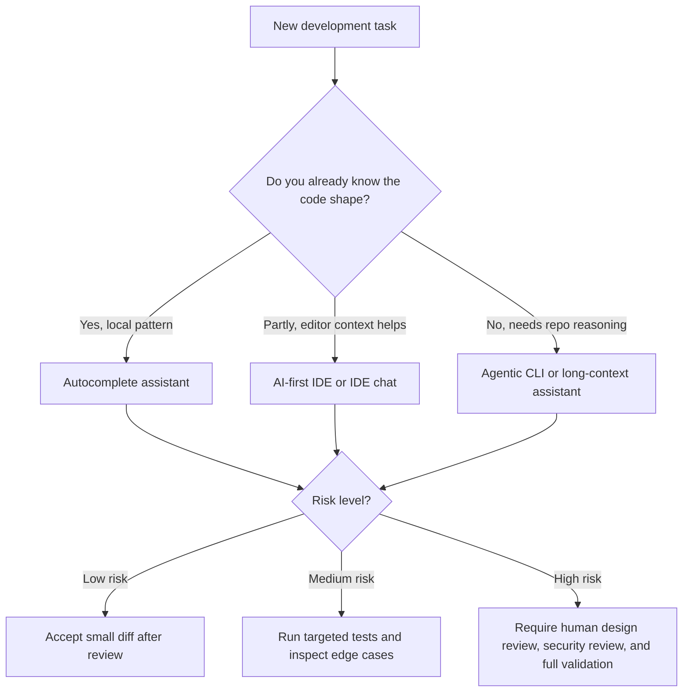
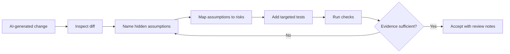
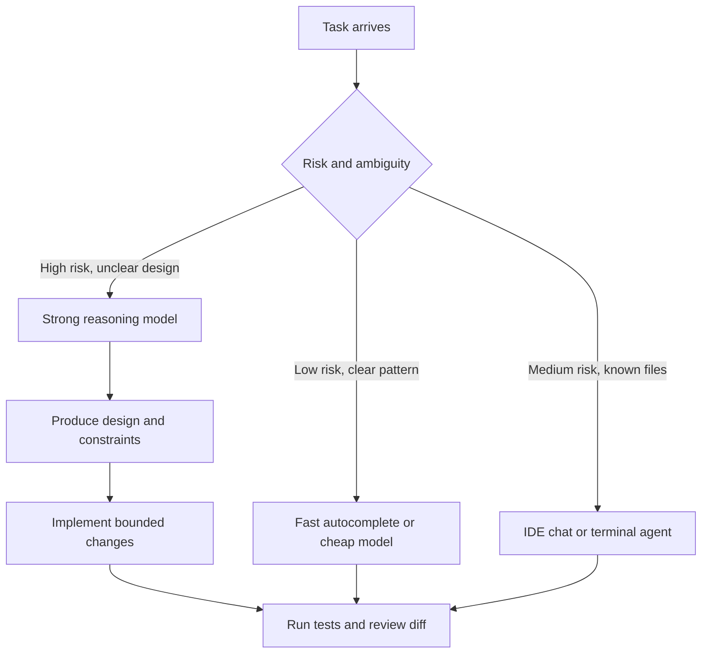

> **Domain:** AI/ML Engineering Track | **Complexity:** `[COMPLEX]` | **Time:** 5-6 hours | **Prerequisites:** Prompt engineering fundamentals, Git workflow, basic testing, secure coding basics, and experience with at least one IDE or terminal workflow

## Learning Outcomes

By the end of this module, you will be able to:

- **Design** a multi-tool AI development workflow that routes work across autocomplete, IDE chat, terminal agents, and long-context reasoning tools.
- **Evaluate** coding-assistant choices using task complexity, context sensitivity, security exposure, review burden, and operating cost.
- **Debug** AI-assisted changes by combining logs, tests, diffs, prompts, and human reasoning into a repeatable validation loop.
- **Implement** cost-aware prompting and model-routing patterns that preserve engineering quality while reducing unnecessary token spend.
- **Diagnose** common AI-introduced defects such as missing edge cases, unsafe dependency choices, stale context assumptions, and over-broad refactors.

## Why This Module Matters

A platform team at a healthcare software company adopted AI coding assistants across every repository in one quarter. At first, the story looked like a success. Small endpoints appeared faster, unit tests grew overnight, and junior engineers could navigate unfamiliar services with less waiting. Leadership saw the first metrics and assumed the organization had simply become more productive.

Then an incident review told a different story. An AI-generated caching decorator had been accepted during a rushed performance fix, and nobody noticed that it had no eviction policy, no size limit, and no monitoring. The service behaved well in staging, where data volume was small, but production traffic turned the cache into an unbounded memory sink. The outage lasted long enough to trigger contractual penalties, and the most uncomfortable sentence in the review was not technical at all: "The assistant wrote it, and we trusted it."

That failure was not caused by using AI. It was caused by using AI without a workflow. Coding assistants can accelerate thoughtful engineering, but they can also accelerate bad assumptions, weak tests, hidden security problems, and expensive tool usage. The difference is not whether a developer uses Claude Code, Copilot, Cursor, Aider, ChatGPT, Gemini, or another tool. The difference is whether the developer knows how to route tasks, constrain context, validate output, and decide when a human must slow down.

This module teaches AI-assisted development as an engineering discipline rather than a collection of productivity tricks. You will start with the smallest useful workflow, then add context management, multi-tool routing, security controls, cost optimization, and independent practice. By the end, you should be able to look at a coding task and choose not only what prompt to write, but also which assistant should receive it, what evidence it needs, what output you will reject, and how you will prove the result is production-ready.

## 1. The Mental Model: Assistants Are Different Tools, Not One Tool

The first mistake many teams make is treating every AI coding assistant as a smarter version of autocomplete. That mental model hides the important differences between tools. Some assistants are optimized for fast local suggestions, some for codebase-wide editing, some for terminal-native patching, and some for long-context reasoning. A senior workflow does not ask, "Which assistant is best?" It asks, "Which assistant matches this task, this risk level, and this review budget?"

Autocomplete tools such as GitHub Copilot are strongest when the developer already knows the shape of the code. They are useful for repetitive tests, obvious transformations, familiar framework patterns, and filling in predictable code after a clear name, type signature, or example. Their speed is the point. Their weakness is that they usually do not perform deep architectural reasoning before suggesting a line.

IDE-native assistants such as Cursor and Windsurf are strongest when the developer needs codebase context while still staying inside the editor. They can inspect open files, search semantically, propose multi-file changes, and show diffs in a familiar interface. Their weakness is that broad context can become noisy. If the developer attaches too much of the repository, the model may follow irrelevant patterns or propose changes that look consistent but touch more files than necessary.

Terminal or agentic assistants such as Claude Code and Aider are strongest when work spans files, commands, tests, and Git. They can read files, make patches, run checks, inspect failures, and iterate. Their weakness is that they are powerful enough to change too much when the task is vague. A good user narrows their scope, names constraints, and reviews the diff before trusting the result.

General chat assistants such as ChatGPT, Claude, and Gemini are useful for explanation, architecture comparison, log analysis, and large-context exploration when connected to the right context. Their weakness is that pasted code loses project affordances such as tests, file boundaries, lint rules, and local conventions. They are often excellent reasoning partners, but the final implementation still needs to be grounded in the repository.



The diagram is intentionally simple because routing should start simple. First identify whether the task is local, contextual, or architectural. Then identify the risk level. A low-risk documentation cleanup and a high-risk authentication refactor do not deserve the same assistant, the same prompt, or the same validation budget.

> **Check for understanding:** You need to add three tests that follow an existing pattern in one file. Which tool class should you try first, and what would make you escalate to a stronger reasoning tool?

A useful rule is to spend the least reasoning power that can responsibly solve the problem. That does not mean choosing the cheapest model blindly. It means matching model capability to risk. Using a large reasoning model to generate a repetitive test fixture may waste money and time. Using a lightweight autocomplete suggestion to redesign authorization boundaries may save seconds while creating weeks of damage.

| Task Shape | Better First Tool | Why It Fits | Escalate When |
|---|---|---|---|
| Repeating a known unit-test pattern | Copilot or similar autocomplete | The pattern is already visible and local | The generated cases miss security, concurrency, or data isolation risks |
| Explaining an unfamiliar module | Cursor codebase chat or Claude Code | The task needs file references and relationships | The answer conflicts with tests or runtime behavior |
| Editing one selected function | Cursor Cmd+K or IDE inline edit | The scope is constrained and the diff is visible | The function depends on hidden callers or shared contracts |
| Multi-file refactor | Claude Code, Aider, or Cursor chat | The task requires coordinated changes and checks | The assistant proposes unrelated cleanup or broad rewrites |
| Architecture decision | Claude, ChatGPT, Gemini, or Claude Code | The task needs options, trade-offs, and constraints | The recommendation ignores operational, security, or cost limits |
| Production incident debugging | Claude Code with logs, diffs, and tests | The task needs evidence-driven reasoning | The output jumps to fixes before explaining hypotheses |
| Secret-bearing or regulated code | Local model or manual workflow | The exposure risk dominates convenience | The task can be reduced to redacted structure and synthetic examples |

This routing table is not a law. It is a starting point for disciplined judgment. The table becomes useful when you treat each row as a hypothesis: "This tool should be enough because the task has these properties." If the hypothesis fails, you escalate deliberately instead of thrashing between assistants.

## 2. Context Control: Give Enough, Not Everything

AI coding assistants are highly sensitive to context. Too little context produces generic output that ignores your codebase. Too much context raises cost, slows the workflow, and can distract the model with irrelevant patterns. The practical skill is to provide the smallest context bundle that contains the task, the constraints, the examples, and the validation signal.

A strong prompt usually has four parts. First, it states the goal in operational terms, such as "add pagination to the task list endpoint without changing the response schema." Second, it provides the relevant files or snippets. Third, it names constraints such as language version, framework conventions, security requirements, and dependency limits. Fourth, it defines how success will be checked, such as passing a specific test file or preserving a particular API contract.

A weak prompt often asks for an outcome without boundaries. "Make this better" can produce style changes, dependency additions, unrelated refactors, and hidden behavior changes. A stronger prompt says what "better" means: lower latency, fewer queries, safer error handling, clearer types, smaller memory use, or more predictable tests. The assistant cannot optimize for your actual goal unless you name it.

Here is a worked example. A developer sees a slow FastAPI endpoint and wants help. A poor assistant interaction would paste the endpoint alone and ask for optimization. A better interaction includes logs, the query, the data size, the existing tests, and the deployment constraint that schema changes require a migration review.

```python
# app/routes/tasks.py
from fastapi import APIRouter, Depends
from sqlalchemy.orm import Session

router = APIRouter()

@router.get("/tasks")
def list_tasks(
    db: Session = Depends(get_db),
    current_user: User = Depends(get_current_user),
):
    return (
        db.query(Task)
        .filter(Task.user_id == current_user.id)
        .order_by(Task.created_at.desc())
        .all()
    )
```

A useful prompt for this code would not simply say "make it faster." It would say: "This endpoint takes about three seconds for users with many tasks. The list view only renders id, title, completed, and created_at. We cannot change the public route path, but adding optional pagination parameters is acceptable. Propose the smallest safe change, explain the database risk, and include tests for default and custom pagination."

That prompt gives the assistant enough context to reason about shape, performance, compatibility, and tests. It also prevents a common failure mode: the assistant rewriting the whole route layer, changing response semantics, or adding caching before checking the database query. Good context reduces both hallucination and overengineering.

```python
# A minimal, reviewable direction the assistant might produce:
@router.get("/tasks")
def list_tasks(
    skip: int = 0,
    limit: int = 50,
    db: Session = Depends(get_db),
    current_user: User = Depends(get_current_user),
):
    limit = min(limit, 100)

    return (
        db.query(Task.id, Task.title, Task.completed, Task.created_at)
        .filter(Task.user_id == current_user.id)
        .order_by(Task.created_at.desc())
        .offset(skip)
        .limit(limit)
        .all()
    )
```

This answer still needs review. The route may have a declared response model that expects full Task objects. The ORM projection may return row tuples instead of the schema shape the API currently emits. Pagination parameters may need validation with FastAPI `Query`. The point is not that the assistant is done; the point is that the context led it toward a small, testable solution instead of a sprawling rewrite.

> **Check for understanding:** Before accepting the optimized endpoint above, what contract would you inspect first: database performance, response shape, authentication, or logging? Explain why your choice changes the validation order.

Context control also protects privacy. Developers often paste more than the assistant needs, including secrets, customer records, or proprietary algorithms. You should classify code before sharing it with a remote assistant. Public examples and open-source patterns are low risk. Internal business logic may require enterprise controls. Customer data, secrets, private keys, and regulated records should not be pasted into general tools. Redaction is not a bureaucratic ritual; it is part of engineering the workflow.

```ascii
+---------------------------+---------------------------+---------------------------+
| Context Type              | Assistant Exposure        | Safer Handling            |
+---------------------------+---------------------------+---------------------------+
| Public framework code     | Low concern               | Use normal AI workflow    |
| Internal service logic    | Depends on policy         | Use enterprise controls   |
| Proprietary algorithm     | High concern              | Use local or approved AI  |
| Customer data or secrets  | Not acceptable            | Redact or handle manually |
+---------------------------+---------------------------+---------------------------+
```

The safest context is often synthetic. Instead of sharing a real customer payload, create a small representative example with fake values. Instead of pasting an entire private algorithm, describe the interface, constraints, and failure mode. If the assistant can solve the problem from structure and tests, it does not need the sensitive data.

## 3. Tool Workflows: From Simple Completion to Agentic Development

A beginner workflow uses an assistant to write code. A professional workflow uses assistants to shorten feedback loops while preserving control. That distinction matters because most AI failures happen when the assistant becomes the only feedback loop. Your compiler, tests, linter, profiler, threat model, and code review still matter.

Start with autocomplete when the path is obvious. Give the tool a strong name, a type signature, and one example. For test generation, write the first test yourself so the assistant can copy your style. This works because autocomplete is pattern-sensitive. It performs better when you show it the shape of the solution rather than asking it to invent one from nothing.

```python
def test_create_project_requires_owner(client, auth_headers):
    response = client.post(
        "/projects",
        json={"name": "migration-plan"},
        headers=auth_headers,
    )

    assert response.status_code == 201
    assert response.json()["name"] == "migration-plan"


def test_create_project_rejects_empty_name(client, auth_headers):
    # A good autocomplete assistant can infer the pattern from the test above.
    response = client.post(
        "/projects",
        json={"name": ""},
        headers=auth_headers,
    )

    assert response.status_code == 422
```

The assistant can continue with other tests, but you remain responsible for coverage quality. It may generate happy paths while missing authorization boundaries, duplicate names, Unicode input, race conditions, or tenant isolation. The professional move is to use the assistant for speed, then ask yourself what risk category the generated tests did not cover.

Move to an IDE assistant when you need to edit selected code with surrounding context. Cursor-style quick edits are excellent for adding type hints, extracting a helper, improving error handling, or refactoring a function for dependency injection. The constraint is that you should select a small region and describe the exact transformation. Small scope produces reviewable diffs.

```python
def fetch_profile(user_id):
    response = requests.get(f"https://profiles.example.test/users/{user_id}")
    return response.json()
```

A precise edit request would be: "Add timeout handling, HTTP status validation, and JSON decode handling. Keep the function synchronous. Do not introduce new dependencies. Raise `ProfileServiceError` for caller-visible failures." That instruction is better than "make robust" because it tells the assistant the error boundary, dependency policy, and runtime model.

Move to an agentic CLI when the task requires coordinated file changes and command feedback. A terminal agent can update implementation, tests, and documentation while running targeted checks after each step. This is powerful, but it also increases the need for scope control. Give it ownership boundaries: which files may change, which files are read-only context, which tests to run, and which style rules are non-negotiable.

```bash
# Example Aider-style session
aider src/routes/projects.py src/services/projects.py tests/test_projects.py

# Request:
# Add owner-only project deletion.
# Keep route paths unchanged.
# Update tests for success, non-owner rejection, and missing project.
# Do not modify database models.
```

The boundaries are doing real work here. Without them, an assistant might decide to add a model field, change route naming, rewrite unrelated service code, or update fixtures outside the task. When you specify "do not modify database models," you force the assistant to solve within the current data model or explain why it cannot.

Move to a long-context reasoning tool when you need architectural comparison, incident analysis, or codebase explanation. In those cases, ask the assistant to produce hypotheses before fixes. A debugging prompt should include evidence and request reasoning: logs, recent changes, failing tests, metrics, and the exact symptom. The output you want is not "try this patch." The output you want is a ranked explanation of likely causes, evidence for each, and a validation plan.

```text
Production symptom:
- POST /checkout intermittently returns 500 during traffic spikes.
- Error logs show connection pool exhaustion.
- Recent change added recommendation calls inside checkout.

Please analyze:
1. What hypotheses fit this evidence?
2. What additional data would distinguish them?
3. Which fix is safest to test first?
4. What regression tests or load tests should we add?
```

That prompt gives the assistant a debugging role instead of a patch-generation role. If it immediately produces code without connecting evidence to hypotheses, push it back. A good assistant interaction can and should be iterative.

> **Check for understanding:** Your assistant suggests increasing a database connection pool from 20 to 100. What evidence would tell you whether that is a fix, a temporary mitigation, or a dangerous distraction?

## 4. Worked Example: Debugging an AI-Introduced Bug

Now we will walk through a complete example before you practice independently later. The scenario is common: an assistant added caching to fix latency, tests passed, and production later showed memory growth. The goal is to debug the assistant's change using a repeatable validation loop.

The original service fetched feature flags for a user. It was slow because the same flags were loaded repeatedly during a request. An assistant proposed a process-wide cache. The diff looked simple, the unit test still passed, and the team merged it during a busy sprint.

```python
# flags.py
from typing import Any

_flag_cache: dict[int, dict[str, Any]] = {}

def get_flags(user_id: int, db) -> dict[str, Any]:
    if user_id in _flag_cache:
        return _flag_cache[user_id]

    flags = db.fetch_flags_for_user(user_id)
    _flag_cache[user_id] = flags
    return flags
```

The bug is subtle only if you focus on the immediate latency problem. Once you ask operational questions, the risk becomes obvious. The cache has no time-to-live, no maximum size, no invalidation when flags change, no tenant boundary beyond user ID, and no metrics. It also stores mutable dictionaries, so a caller can accidentally mutate the cached value for future callers.

A rigorous assistant prompt after noticing memory growth should not be "fix the cache." It should request diagnosis and constraints: "This cache was AI-generated to reduce repeated database reads. Production memory grows over time. Feature flags can change during the day. The service runs multiple worker processes. Diagnose the risks in this implementation, then propose the smallest safe replacement with tests for expiration and mutation isolation."

A strong answer would explain that an in-process cache may still be acceptable if the risk is bounded. For example, a small TTL cache with copy-on-read behavior may solve repeated reads inside short windows without pretending to be a distributed source of truth. If flag freshness is strict, the answer should recommend Redis or a request-scoped cache instead. The correct solution depends on the freshness requirement.

```python
# flags.py
from cachetools import TTLCache
from copy import deepcopy
from typing import Any

_flag_cache: TTLCache[int, dict[str, Any]] = TTLCache(maxsize=5000, ttl=60)

def get_flags(user_id: int, db) -> dict[str, Any]:
    cached = _flag_cache.get(user_id)
    if cached is not None:
        return deepcopy(cached)

    flags = db.fetch_flags_for_user(user_id)
    _flag_cache[user_id] = deepcopy(flags)
    return flags
```

This version is better, but it introduces a dependency. A responsible workflow now asks whether `cachetools` is already approved, whether the dependency is maintained, whether the TTL fits product requirements, and whether deep copying is too expensive for the payload size. The assistant fixed one problem and created decisions that humans must evaluate.

A test should prove the behavior that caused the incident, not just prove that a value is returned. Good tests check boundedness indirectly through configuration, expiration behavior, and mutation isolation. They also make the engineering intent visible to future maintainers.

```python
def test_get_flags_returns_copy_from_cache(fake_db):
    fake_db.fetch_flags_for_user.return_value = {"beta": True}

    first = get_flags(10, fake_db)
    first["beta"] = False

    second = get_flags(10, fake_db)

    assert second == {"beta": True}
    assert fake_db.fetch_flags_for_user.call_count == 1


def test_get_flags_cache_has_bounded_size():
    assert _flag_cache.maxsize == 5000
```

This worked example demonstrates the validation loop you should use throughout AI-assisted development. Identify the assistant's assumption, connect it to an operational risk, constrain the replacement, and test the behavior that matters. Do not only test that the new code runs. Test that it fails safely under the condition that made the original code dangerous.



This loop is also useful for cost control. If the assistant produces a poor patch, do not keep asking broad follow-up questions. Narrow the failure. Say exactly which assumption was wrong and what evidence should drive the next attempt. Specific feedback costs fewer tokens and produces better work.

## 5. Cost-Aware Model Routing Without Lowering Quality

AI coding cost has two parts: direct spend and review spend. Direct spend includes subscriptions, API calls, context size, and model choice. Review spend includes developer time spent reading diffs, fixing hallucinations, rerunning tests, and cleaning up over-broad changes. A cheap model that creates a risky diff can be more expensive than a stronger model used once for a bounded decision.

The practical strategy is model routing. Use cheaper or faster tools for low-risk, pattern-heavy tasks. Use stronger reasoning tools for architecture, security-sensitive changes, incident debugging, concurrency, data migrations, and cross-service contracts. Then return to cheaper tools for mechanical implementation once the design is clear.



For example, writing five validation tests that match an existing pattern is a good fit for autocomplete or a lightweight model. Designing an OAuth2 migration across multiple services is not. Once a senior model helps you decide the migration plan, a cheaper tool may be able to apply repetitive changes file by file. That split keeps expensive reasoning focused where it matters.

| Work Type | Suggested Routing | Cost Risk | Quality Risk | Validation Gate |
|---|---|---|---|---|
| Boilerplate tests | Autocomplete or lightweight model | Low | Missing edge cases | Human test review plus test run |
| Single-function cleanup | IDE quick edit | Low to medium | Changed behavior | Focused unit tests |
| Multi-file feature | Agentic CLI or IDE chat | Medium | Scope creep | Diff review plus targeted suite |
| Security-sensitive auth change | Strong reasoning model first | Worth the spend | Severe regression | Threat review plus full tests |
| Production incident analysis | Strong reasoning model with evidence | Worth the spend | Wrong root cause | Metrics, logs, and rollback plan |
| Documentation from stable code | Lightweight model | Low | Incorrect claims | Compare against implementation |
| Large codebase explanation | Long-context assistant | Medium to high | Stale or noisy context | Verify cited files manually |

Token discipline is part of cost discipline. Do not paste an entire repository when three files and one failing test are enough. Do not include logs spanning days when the relevant error window is ten minutes. Do not ask for a full tutorial when you need a two-option trade-off. Clear prompts are not only better pedagogy; they are cheaper operations.

A useful prompt pattern is "design with expensive model, implement with bounded tool." In the first step, ask a strong model to compare approaches, state risks, and choose a design. In the second step, give a terminal or IDE assistant the chosen design and exact files. In the third step, use tests and review to decide whether the implementation matches the design.

```text
Step 1, reasoning model:
Compare Redis cache, request-scoped cache, and in-process TTL cache for this endpoint.
Use our constraints: stale data acceptable for 30 seconds, no new infrastructure this sprint,
and memory limit of 512 MiB per container. Recommend one option and explain failure modes.

Step 2, implementation assistant:
Implement the recommended in-process TTL cache only in src/flags.py and tests/test_flags.py.
Do not change public function signatures. Add tests for TTL expiry and mutation isolation.

Step 3, validation:
Run the targeted tests, inspect the diff, and check whether the implementation follows the chosen constraints.
```

> **Check for understanding:** A teammate wants to use the strongest available model for every task because "quality matters." How would you explain the difference between responsible quality spending and wasteful overuse?

Cost optimization must never become an excuse to weaken review. The goal is not to make AI usage as cheap as possible. The goal is to buy the right amount of reasoning for the risk at hand, then keep the rest of the workflow disciplined. Cheap automation is useful only when the validation loop is strong enough to catch what it misses.

## 6. Security, Privacy, and Compliance Boundaries

AI coding assistants introduce two categories of security risk. The first is output risk: the assistant may generate vulnerable code, unsafe defaults, missing authorization checks, weak cryptography, shell injection, SQL injection, or insecure dependency usage. The second is input risk: the developer may send sensitive code, secrets, customer records, or regulated data to a tool that is not approved for that exposure.

Output risk should be handled like any other code risk, but with extra skepticism around familiar-looking snippets. Assistants frequently produce plausible code that has one missing security property. A SQL query may look clean but interpolate input. A JWT implementation may validate signatures but skip expiration. A file upload handler may check extension but not content type or size. Your review should ask what an attacker controls and what trust boundary the code crosses.

```python
# Unsafe assistant suggestion:
def get_user_by_email(email: str, db):
    query = f"SELECT * FROM users WHERE email = '{email}'"
    return db.execute(query).fetchone()


# Safer version:
def get_user_by_email(email: str, db):
    query = "SELECT * FROM users WHERE email = %s"
    return db.execute(query, (email,)).fetchone()
```

The unsafe version is short, readable, and dangerous. That is why "looks reasonable" is not an adequate review standard. The correct review question is not "Does this code resemble code I have seen before?" The correct question is "What happens when hostile input reaches this line?"

Input risk requires policy before tooling. A team should decide which repositories, file types, and data categories may be used with which assistants. Enterprise tools may offer contractual privacy guarantees, local models may reduce exposure, and general chat tools may be appropriate only for public examples. Developers should not be forced to improvise privacy rules during a production incident.

```ascii
+----------------------+--------------------------+-----------------------------+
| Data Category        | Example                  | AI Handling Rule            |
+----------------------+--------------------------+-----------------------------+
| Public code          | Open-source utility      | General tools acceptable    |
| Internal logic       | Pricing workflow         | Approved enterprise tools   |
| Regulated data       | Patient or payment data  | Do not paste into chat      |
| Secrets              | API keys, tokens         | Never paste; rotate if sent |
+----------------------+--------------------------+-----------------------------+
```

Dependency suggestions deserve special attention. Assistants often introduce libraries because it makes the generated code shorter. A senior developer treats every new dependency as a supply-chain decision. Before accepting it, check whether the project already has an equivalent library, whether the dependency is maintained, whether its license fits, whether it increases attack surface, and whether the functionality is small enough to implement with the standard library.

> **Check for understanding:** An assistant fixes a bug by adding a package you have never used. What checks should happen before that package appears in a commit?

Security prompts should be explicit. Instead of asking "review this," ask for specific threat classes: injection, authorization bypass, secret handling, unsafe deserialization, path traversal, race conditions, and dependency risk. Specific focus produces better findings and makes the assistant less likely to spend its attention on style comments.

```text
Review this diff as a security reviewer.
Focus only on:
1. Authorization boundaries
2. User-controlled input reaching SQL, shell, filesystem, or templates
3. Secret exposure in logs or errors
4. Dependency and configuration risk

For each issue, include impact, exploit path, and a minimal fix.
Do not comment on formatting unless it affects security.
```

That prompt narrows the review and improves signal. It also gives you a structure for your own human review. The assistant is not the authority; it is a second pass that may catch what you missed.

## 7. Building a Multi-Tool Workflow

A mature AI-native workflow has phases. It starts with framing, moves through generation, validates with local evidence, and ends with review documentation. The assistant is involved in several phases, but it does not own the entire process. You own the task definition, the acceptance criteria, and the decision to merge.

The workflow below is a practical default for feature work. First, use a reasoning assistant to clarify design if the task is ambiguous. Second, use autocomplete or an IDE assistant for small local edits. Third, use a terminal agent for coordinated changes and tests when the feature spans files. Fourth, use an assistant for focused review, but compare its findings against your own inspection.

```ascii
+--------------------+-------------------------+------------------------------+
| Phase              | Human Responsibility    | Assistant Responsibility     |
+--------------------+-------------------------+------------------------------+
| Frame              | Define goal and risk    | Ask clarifying questions     |
| Design             | Choose constraints      | Compare viable approaches    |
| Implement          | Control scope           | Generate bounded changes     |
| Validate           | Decide evidence needed  | Run or suggest checks        |
| Review             | Accept or reject diff   | Find risks and omissions     |
| Document           | Record decisions        | Draft summary and examples   |
+--------------------+-------------------------+------------------------------+
```

For a small task, this workflow may take minutes. For a risky task, it may take hours. The important habit is not ceremony; it is alignment. The same outcome should appear in the learning objective, the prompt, the code change, the test, and the review summary. If those artifacts do not match, the workflow is drifting.

A feature example makes this concrete. Suppose you need to add owner-only deletion to a project API. The task touches authorization, route behavior, tests, and documentation. It is not a good candidate for blind autocomplete because a missing ownership check is a security bug. It is also not large enough for an architecture committee. A balanced workflow would use a reasoning prompt to identify risks, then a bounded terminal agent to implement, then a security-focused review prompt.

```text
Design prompt:
We need owner-only deletion for projects.
Current API has project owners and collaborators.
Deletion must be allowed only for owners.
Collaborators may read and update some fields but must not delete.
What files and tests should change, and what authorization edge cases matter?
```

```text
Implementation prompt:
Implement owner-only deletion using the existing authorization style.
Modify only src/routes/projects.py, src/services/projects.py, and tests/test_projects.py.
Add tests for owner success, collaborator rejection, anonymous rejection, and missing project.
Do not change database models or route paths.
```

```text
Review prompt:
Review the resulting diff only for authorization bypass and regression risk.
Check whether a collaborator can delete a project through any path.
Check whether error codes reveal information beyond existing behavior.
```

The structure prevents two common problems. It prevents under-scoping, where the assistant edits only the route and misses service-level reuse. It also prevents over-scoping, where the assistant redesigns the permission model. A good workflow keeps the assistant boxed into the right problem.

## Did You Know?

1. Early code completion tools were mostly syntax-aware, but modern assistants infer intent from names, comments, types, tests, and neighboring files. This means your code style directly changes assistant quality.

2. The most expensive AI-assisted change is often not the API bill. It is the human time spent reviewing an oversized diff that solved a small problem by touching unrelated files.

3. Long context can reduce hallucination when the relevant evidence is included, but it can increase confusion when unrelated files dominate the prompt. More context is not automatically better context.

4. AI-generated tests can create false confidence when they mirror the implementation instead of challenging it. Strong tests encode expected behavior, edge cases, and failure modes independently from the generated code.

## Common Mistakes

| Mistake | Why It Fails | Better Practice |
|---|---|---|
| Accepting autocomplete because it compiles | Compilers do not check authorization, cost, privacy, or product intent | Review generated code against the risk category before accepting |
| Pasting an entire repository into a long-context tool | Irrelevant context increases cost and may distract the model | Provide the smallest bundle of files, logs, tests, and constraints that explains the task |
| Asking "make this better" | The assistant may optimize for style, abstraction, or patterns you did not want | Define the quality target, such as latency, safety, readability, or testability |
| Using the strongest model for every task | Expensive reasoning gets wasted on predictable local work | Route low-risk patterns to cheaper tools and reserve strong models for ambiguity or risk |
| Letting an agent modify unrelated files | Broad diffs hide regressions and slow review | Name allowed write files and read-only context before the agent starts |
| Trusting AI-generated tests without inspecting them | Tests may reproduce the same mistaken assumption as the implementation | Add behavior-focused cases for edge conditions, failure modes, and security boundaries |
| Ignoring new dependencies suggested by assistants | A small import can add license, maintenance, and supply-chain risk | Check existing libraries, maintenance status, license, and necessity before committing |
| Treating AI review as approval | Assistants can miss context, misunderstand policy, or overfocus on style | Use AI review as one input before human review and project-specific validation |

## Quiz

### Question 1

Your team needs to add three new validation tests to a file that already contains ten similar tests. The validation rules are simple, the implementation is not changing, and the risk is low. A teammate wants to open a long-context reasoning session and attach the whole repository. What workflow would you recommend?

<details>
<summary>Answer</summary>

Use autocomplete or a lightweight assistant first, because the task is local, repetitive, and pattern-heavy. Start by writing or selecting one representative test so the assistant follows the existing style, then review the generated cases for missing edge conditions. Attaching the whole repository would add cost and noise without improving the likely result. Escalate only if the tests reveal unclear behavior or cross-file dependencies.
</details>

### Question 2

An assistant proposes a fix for a production latency issue by adding an in-memory dictionary cache. The patch improves the benchmark, and all existing unit tests pass. The cached data can change during the day, and the service runs for weeks between restarts. What should you check before accepting the fix?

<details>
<summary>Answer</summary>

Check whether the cache has a TTL, size bound, invalidation strategy, mutation safety, and observability. Passing existing tests is not enough because the incident risk is operational rather than purely functional. You should add tests or checks for expiration and bounded behavior, then decide whether in-process caching is acceptable given freshness requirements. If freshness or multi-process consistency matters, Redis or request-scoped caching may be safer.
</details>

### Question 3

A developer pastes a real customer payload into a general chat assistant to debug a parsing error. The assistant finds the bug quickly. During review, you notice the payload included names, account IDs, and billing metadata. How should the team change its workflow?

<details>
<summary>Answer</summary>

The team should classify data before using AI tools and prohibit customer data in unapproved assistants. For this kind of debugging, the developer should create a synthetic payload that preserves the structure and failure condition without exposing real records. If real data is required, the work must move to an approved environment with the correct privacy controls. The team should also assess whether the exposed data requires incident handling under its policy.
</details>

### Question 4

Cursor suggests a multi-file refactor that renames a service method and updates many callers. The diff also reformats unrelated files and changes a helper function that was not mentioned in your prompt. What is the best response?

<details>
<summary>Answer</summary>

Do not accept the full diff. Narrow the task by naming the allowed files and the exact behavior-preserving rename, then ask the assistant to regenerate or manually apply only the relevant changes. Unrelated formatting and helper changes increase review burden and can hide regressions. A good multi-file AI workflow keeps the diff aligned with one concern.
</details>

### Question 5

Your organization pays per token for model usage. A teammate proposes routing all tasks to a cheap model to reduce spend. Another teammate proposes routing all tasks to the strongest model to reduce mistakes. How would you evaluate both proposals?

<details>
<summary>Answer</summary>

Both proposals ignore task risk. Cheap models are appropriate for low-risk, clear, repetitive work, but they may be costly in review time if used for complex security or architecture decisions. Strong models are appropriate for ambiguous, high-risk reasoning, but they waste money on simple pattern completion. A better policy routes by task complexity, context sensitivity, security exposure, and validation cost.
</details>

### Question 6

An AI assistant generates an authentication middleware that validates a JWT signature and loads the user. The code looks clean, but protected routes still allow suspended users. What prompt and validation step would help diagnose this?

<details>
<summary>Answer</summary>

Ask the assistant to review the authentication flow specifically for authorization state transitions, including suspended, deleted, and disabled users. Provide the middleware, user model, and route dependency code. Then add tests proving that suspended users receive the expected rejection on protected routes. The key is to distinguish authentication, which proves identity, from authorization, which decides what that identity may do.
</details>

### Question 7

A terminal agent is asked to "add notifications" and returns a large patch with email, SMS, templates, queue workers, migrations, and a new dependency. The code may be useful, but the diff is too large to review safely. What should have happened before implementation?

<details>
<summary>Answer</summary>

The task should have been split into design and bounded implementation phases. First, ask for options and trade-offs: delivery mechanism, queue choice, template storage, retry behavior, and failure handling. Then implement one slice, such as email notification persistence or a single queue worker, with explicit file boundaries and tests. Large agentic patches are risky when the prompt does not define scope.
</details>

## Hands-On Exercise: Build and Validate a Multi-Tool AI Workflow

In this exercise, you will practice the integrated workflow independently. You do not need to use the exact commercial tools named in this module; use the closest equivalents available to you. The goal is to prove that you can route tasks, constrain context, manage cost, and validate AI-generated output rather than simply generating code.

Scenario: You maintain a small task-management API. The `/tasks` list endpoint is slow for users with many tasks, and the team also wants safer deletion behavior. You will design a workflow that uses at least two assistant types: one for reasoning or review, and one for implementation or local generation.

Use a toy repository, an existing project, or a small sample service you create for this exercise. If you create a sample, include one route or function that lists tasks, one route or function that deletes tasks, and at least one test file. Keep the scope small enough that you can inspect every generated line.

1. Frame the task before using an assistant. Write a short task brief that states the performance symptom, the deletion rule, allowed files, constraints, and validation commands. Include at least one explicit non-goal, such as "do not change database schema" or "do not add new dependencies."

2. Ask a reasoning assistant to compare approaches. Request at least two options for improving list performance and at least two authorization risks for deletion. Require the assistant to explain trade-offs before producing code. Save or paste the recommendation into your notes.

3. Use an implementation assistant for a bounded patch. Provide only the relevant files and the chosen design. Instruct it to modify a limited set of files and to add tests for the behavior you care about. Reject or revise the output if it touches unrelated files.

4. Run validation locally. Execute the targeted tests first, then any broader checks that fit your project. If tests fail, ask the assistant to explain the failure using the test output and diff rather than guessing. Apply only the minimal correction.

5. Perform a focused AI review. Ask a different assistant, model, or prompt mode to review only the final diff for performance regression, authorization bypass, dependency risk, and over-broad changes. Compare its findings with your own review.

6. Record the cost and routing decision. Estimate which steps used expensive reasoning, which used cheap or fast generation, and where human review took the most time. Decide whether your routing was appropriate or whether a simpler tool would have been enough.

Success criteria:

- [ ] Your task brief names the goal, constraints, allowed files, validation command, and at least one non-goal.
- [ ] Your reasoning step compares options before implementation and includes trade-offs, not just a patch.
- [ ] Your implementation step uses bounded context and avoids unrelated file changes.
- [ ] Your tests cover at least one performance-related behavior or query-shape assumption and one deletion authorization edge case.
- [ ] Your validation notes include test output or a clear description of what passed and what failed.
- [ ] Your review step identifies at least one risk category, even if no issue is found.
- [ ] Your final notes explain why each assistant type was selected and whether the cost was justified.
- [ ] You can point to at least one generated suggestion you rejected or modified, and explain why.

If you complete the exercise well, you should have more than working code. You should have an audit trail that shows how the work was framed, how the tool was selected, how the assistant was constrained, how the result was validated, and how human judgment remained in control.

## Next Module

Continue to [Module 1.10: AI-Native Testing and Review Workflows](./module-1.10-ai-native-testing-and-review-workflows/).
