> **AI/ML Engineering Track** | Complexity: `[COMPLEX]` | Time: 5-6 Hours

## What You'll Be Able to Do

- **Design** distributed training workflows using XGBoost 3.2.0 on CPU clusters via Dask.
- **Evaluate** the performance of scikit-learn's `HistGradientBoostingRegressor` against classical statistical models for sequential tabular data.
- **Diagnose** data leakage and target look-ahead bias in temporal feature engineering pipelines.
- **Debug** convergence issues, flat-line predictions, and monotonic constraint violations in gradient boosting trees.
- **Implement** robust forecasting pipelines combining classical statistics, tree-based models, and modern deep learning methodologies.

## Why This Module Matters

In early 2024, a leading European logistics firm transitioned their entire global capacity planning system from classical ARIMA models to a massively distributed XGBoost architecture. They were tracking over 10,000 distinct sequential trends representing shipping routes, vehicle maintenance cycles, and warehouse capacities. Single-series statistical models were failing under the weight of complex cross-route dependencies, weather impacts, and holiday effects, requiring immense manual data imputation and parameter tuning from the engineering staff.

By leveraging XGBoost's gradient boosting capabilities combined with heavily engineered temporal lag and rolling-window features, the engineering team achieved a 14% improvement in forecast accuracy within the first month. This translated directly to avoiding empty shipping containers and over-booked maritime vessels, saving the organization over $42 million in operational costs within six months. The distributed tree model natively handled missing sensor data and non-linear holiday patterns that previously broke their classical pipelines, proving the immense financial value of modern approaches.

Understanding how to bridge the rigid world of Gradient Boosting with the fluid nature of classical time series gives you a massive competitive advantage as an AI/ML Engineer. It represents the intersection of structured tabular mastery and temporal sequence awareness. If you can translate temporal relationships into tabular features, you can apply the sheer computational force of modern boosting libraries to almost any real-world forecasting or anomaly detection problem.

## The Gradient Boosting Revolution

Gradient boosting builds an ensemble of shallow decision trees sequentially. Each new tree focuses exclusively on correcting the residual errors left behind by the previous trees. Modern frameworks have heavily optimized this mathematical approach for scale and hardware acceleration, abandoning the exhaustive search approaches of early implementations.

### The Foundation: scikit-learn 1.8.0

Released in December 2025, scikit-learn 1.8.0 establishes a robust foundation for modern machine learning pipelines. The classic `sklearn.ensemble.GradientBoostingRegressor` is an additive, forward stage-wise boosting model that fits trees on negative gradients. By default, it operates with `loss='squared_error'` and `n_estimators=100`. While highly accurate, this implementation evaluates every potential split point across all features, making it notoriously slow for massive datasets.

To solve this, engineers turn to `sklearn.ensemble.HistGradientBoostingRegressor`. Designed specifically for datasets where `n_samples >= 10_000`, this histogram-based variant bins continuous features into discrete intervals, drastically accelerating the training process. Version 1.8.0 also expands native Array API support and introduces compatibility with CPython 3.14 free-threading. By executing in a free-threaded Python environment, multi-core CPU inference can bypass the Global Interpreter Lock (GIL), enabling massive parallelism for real-time model serving.

Furthermore, `HistGradientBoostingRegressor` allows developers to enforce physical realities through monotonic constraints. These constraints are encoded as `1` (strictly increasing), `0` (no constraint), and `-1` (strictly decreasing). For example, you can force the model to learn that as an item's price increases, predicted consumer demand must either stay flat or decrease, preventing the trees from overfitting to historical noise.

### Distributed Scale: XGBoost 3.2.0

When datasets grow beyond the memory capacity of a single machine, engineers rely on XGBoost. XGBoost is an optimized distributed gradient boosting library licensed under Apache-2.0. It provides parallel tree boosting and is explicitly designed for seamless execution in distributed environments.

XGBoost 3.2.0 introduces several critical architectural capabilities required for modern deployments:
- **Vector-Leaf Multi-Target Trees**: Trees can now output multi-dimensional vectors natively, eliminating the need for wrapper regressors when predicting multiple targets. Note that monotonic constraints are currently unavailable for vector outputs.
- **Global Device Execution**: Hardware targeting is now controlled by the global `device` parameter, which defaults to `cpu`. It accepts specific targets like `cuda`, `cuda:<ordinal>`, `gpu`, and `gpu:<ordinal>`.
- **Tree Construction Methods**: The `tree_method` parameter controls the splitting algorithm (`auto`, `exact`, `approx`, and `hist`). When set to `auto`, it is functionally equivalent to the highly optimized `hist` method.
- **Gradient-Based Sampling**: This statistical optimization is now supported on both CPU and GPU for supported hardware configurations.
- **CLI Deprecation**: The legacy command-line interface has been entirely removed as of 3.2.0, enforcing Python/C++ API usage.

XGBoost distributes Python wheels across Linux (x86_64 and aarch64), Windows (x86_64), and macOS (x86_64 and Apple Silicon), with `pip install xgboost` remaining the canonical installation command. For GPU workloads, XGBoost requires CUDA 12.0 and compute capability 5.0. Models are structurally interoperable; a model trained on a heavy GPU cluster can be serialized and deployed for inference on lightweight CPU edges without modification. Multi-node, multi-GPU training is officially supported via integrations with Dask, Spark, and PySpark, which are frequently orchestrated on Kubernetes v1.35+ clusters.

## Real-World Success Stories

To understand the sheer power of gradient boosting in production environments, consider how top engineering organizations leverage these models at scale.

**Amazon: 300 Million Forecasts Daily**
Amazon's retail demand forecasting system is one of the most formidable machine learning pipelines in existence. Every single day, the platform generates over 300 million distinct time series forecasts to predict inventory needs for individual items across global fulfillment centers. A mere 1% improvement in forecast accuracy directly translates to hundreds of millions of dollars saved annually. Amazon utilizes massively distributed gradient boosting models capable of cross-learning. By feeding the model engineered lag features and categorical item embeddings, the global model learns that the seasonal demand spike for winter coats in Seattle is structurally similar to the demand spike for rain gear in London, transferring knowledge across series.

**Industry Implementations**
- **Uber**: Uber utilizes massive ensembles of gradient boosting models for network-wide ETA (Estimated Time of Arrival) prediction. By transforming sequence routes into tabular features (historical lags, current traffic density, weather vectors), XGBoost delivers millisecond-latency predictions across millions of active daily rides.
- **Capital One**: Within their fraud detection architectures, Capital One relies on XGBoost's speed and interpretability. Gradient boosting natively handles missing transaction data while successfully capturing non-linear fraud sequences far faster than deep neural networks.
- **Netflix**: Content demand forecasting requires anticipating short-term viewing bursts alongside multi-year genre trends. Global tree-based models predict viewing volume by correlating localized time series data with broader cultural shifts.
- **Instacart**: Predicting grocery demand involves the added complexity of perishable goods and substitution modeling. Instacart uses hierarchical modeling combined with weather features to reduce food waste by 20%.

## Sequential Data: The Special Case for Boosting

While XGBoost and `HistGradientBoostingRegressor` are the undisputed champions of tabular data, they are frequently adapted for sequences by applying sliding chronological windows. This technique converts raw temporal data into structured tabular features.

> **Pause and predict**: If you feed an XGBoost model raw timestamps and target values, will it be able to extrapolate a trend into the future?
> *Answer: No. Tree-based models cannot extrapolate values outside the range seen in training. You must engineer trend features or detrend the data first.*

### What Makes It Special?

Unlike static tabular data, the chronological order of sequential data is the primary source of truth. You cannot randomly shuffle the rows of a time series without destroying the underlying signal and introducing catastrophic data leakage.

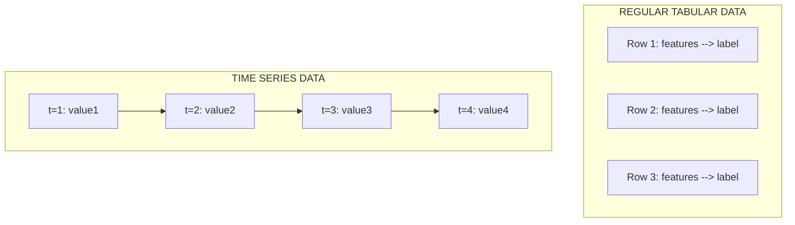

Every temporal sequence can be mathematically decomposed into three distinct components:

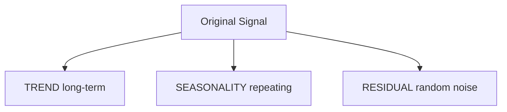

**The Grocery Store Analogy**: Imagine tracking daily milk sales:
- **Trend**: Sales slowly increasing as neighborhood population grows
- **Seasonality**: Higher on weekends (families cook more), lower mid-week
- **Weekly pattern**: People buy on payday (biweekly)
- **Residual**: Random - maybe a recipe went viral on social media today

This structural pattern applies universally across diverse engineering domains:

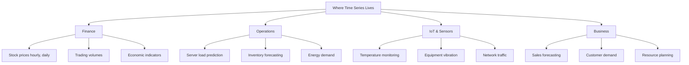

### Stationarity

A series is defined as strictly stationary if its statistical properties—specifically its mean, variance, and autocorrelation—remain constant over time. Most classical statistical models assume or require stationarity to generate valid predictions. While tree models like XGBoost handle non-stationarity slightly better because they can split nodes based on structural shifts, they still fail at trend extrapolation.

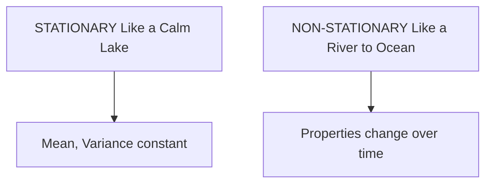

```python
# Non-stationary: Yesterday's patterns don't apply to tomorrow
# Because the underlying process is changing!

# Example: Stock price in 2020 vs 2024
# - Different economic conditions
# - Different company size
# - Different market sentiment
# Can't just extrapolate!

# Solution: Make it stationary through DIFFERENCING
# Instead of predicting price, predict CHANGE in price
#
# price_t → change_t = price_t - price_{t-1}
```

To mathematically verify stationarity, engineers use the Augmented Dickey-Fuller (ADF) test. The ADF test evaluates a null hypothesis that the series possesses a unit root (making it non-stationary).

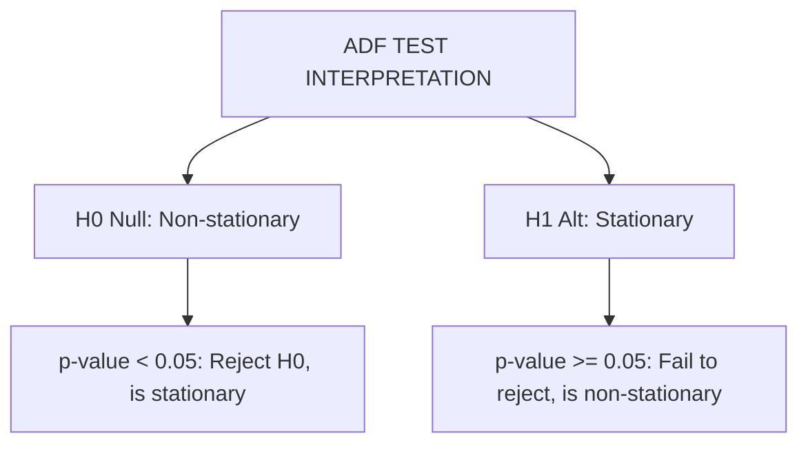

## Classical Baselines: ARIMA and Prophet

Before investing compute resources into distributed XGBoost clusters, senior ML engineers establish rigorous baselines using simpler models. This ensures that the complexity of a gradient boosting pipeline is actually yielding mathematical dividends.

### The ARIMA Family

ARIMA (AutoRegressive Integrated Moving Average) models are the traditional gold standard of forecasting. They rely exclusively on the series' own autocorrelations and differencing rules to project future states.

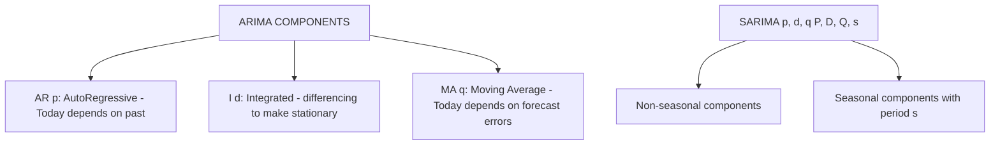

#### Understanding SARIMA Parameters
The SARIMA model extends standard ARIMA architectures by explicitly modeling seasonal structural components. The full notation is expressed as $\text{SARIMA}(p, d, q)(P, D, Q)_s$, representing two distinct sets of behavioral rules.
- **Non-seasonal components:**
  - $p$: Trend autoregression order (the number of historical lag observations integrated into the regression).
  - $d$: Trend difference order (the number of times raw observations must be differenced to achieve stationarity).
  - $q$: Trend moving average order (the scope of the moving average window applied to historical forecast errors).
- **Seasonal components:**
  - $P$: Seasonal autoregressive order, controlling how current cycles depend on equivalent periods in previous cycles.
  - $D$: Seasonal difference order, applied to explicitly remove repeating seasonal trends.
  - $Q$: Seasonal moving average order.
  - $s$: The exact number of sequential time steps that constitute a single full seasonal period (e.g., 12 for monthly data with an annual cycle, or 24 for hourly data tracking daily patterns).

#### Choosing p and q: Analyzing ACF and PACF Plots

Configuring an ARIMA model requires identifying the correct order for the AR ($p$) and MA ($q$) terms. This is achieved by plotting the Autocorrelation Function (ACF) and Partial Autocorrelation Function (PACF).
- **ACF** measures the correlation between a time series and its delayed (lagged) variations.
- **PACF** measures the correlation between a time series and its lags, but critically removes the indirect effects of the time steps in between.

By analyzing the decay patterns of these plots, you can deduce the optimal statistical architecture:

| Pattern Manifestation | Autoregressive AR(p) | Moving Average MA(q) | Mixed ARMA(p,q) |
|---|---|---|---|
| **ACF Plot** | Tails off exponentially | Cuts off abruptly after lag *q* | Tails off exponentially |
| **PACF Plot** | Cuts off abruptly after lag *p* | Tails off exponentially | Tails off exponentially |

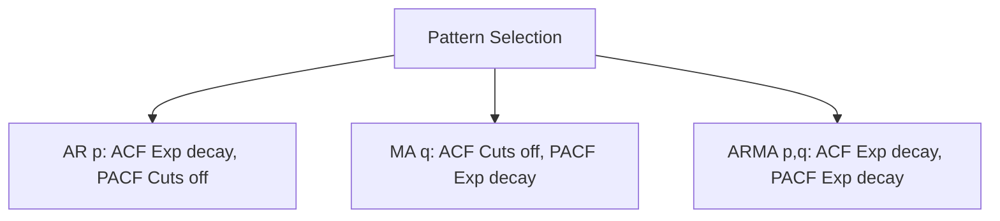

### Facebook Prophet

Developed by Facebook's core data science team, Prophet takes a vastly different approach. Instead of calculating historical lags, Prophet frames forecasting as a curve-fitting optimization problem utilizing an additive formulation.

#### The Mathematical Architecture of Prophet
The core additive equation driving Prophet's forecasting engine is formulated as:
$y(t) = g(t) + s(t) + h(t) + \epsilon_t$

Where the components operate independently:
- **Trend $g(t)$**: Modeled primarily as a piecewise linear structure, $g(t) = (k + a(t))t + (m + b(t))$, where $k$ is the baseline growth rate, $a(t)$ introduces explicit rate adjustments at algorithmically detected changepoints, $m$ serves as the offset parameter, and $b(t)$ guarantees continuous connectivity across shifts. For systems bound by physical limits, this is swapped for a logistic growth model incorporating a maximum carrying capacity constraint $C$.
- **Seasonality $s(t)$**: Modeled dynamically using a robust Fourier series, allowing the algorithm to trace continuous and arbitrary periodic shapes: $s(t) = \sum_{n=1}^N \left( a_n \cos\left(\frac{2\pi nt}{P}\right) + b_n \sin\left(\frac{2\pi nt}{P}\right) \right)$. The variable $P$ dictates the expected cyclical period (such as 365.25 for annual tracking).
- **Holidays $h(t)$**: A categorical indicator matrix for distinct operational anomalies that behave outside natural seasonality.

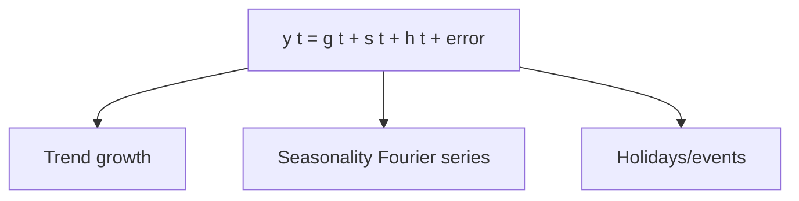

Prophet is exceptionally skilled at identifying changepoints—moments in time where the fundamental trajectory of the dataset shifts.

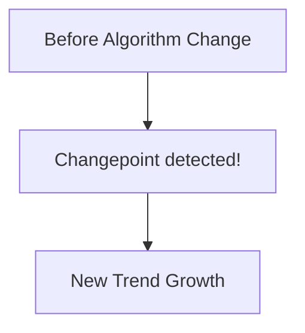

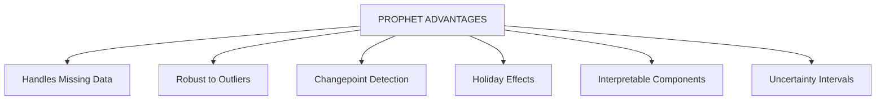

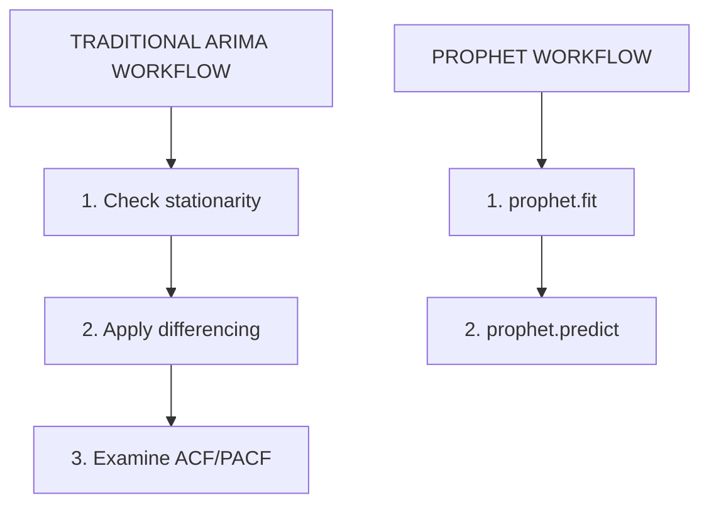

## Deep Learning vs Gradient Boosting

A frequent architectural debate arises: when do you choose an LSTM or Transformer network over a distributed XGBoost model? The decision almost entirely depends on the dataset volume, noise ratio, and the complexity of cross-series relationships.

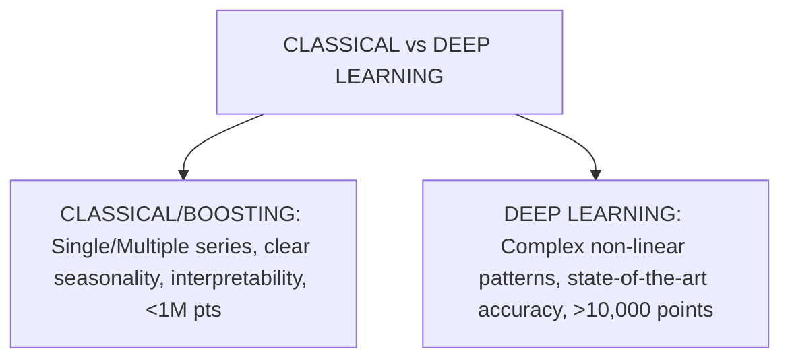

### Recurrent Neural Networks (RNN) and LSTMs

Unlike XGBoost, which evaluates isolated rows of tabular features, LSTMs (Long Short-Term Memory networks) possess internal memory cells. They inherently process chronological ordering step-by-step, bypassing the need for manual lag feature engineering. However, basic RNNs suffer from vanishing gradients when sequence dependencies stretch too far into the past.

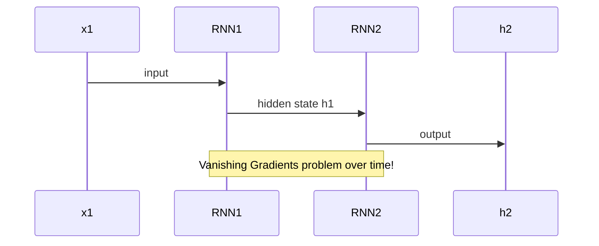

To counter vanishing gradients, LSTMs employ complex gating mechanisms to explicitly control what information is remembered, forgotten, and outputted at each chronological step.

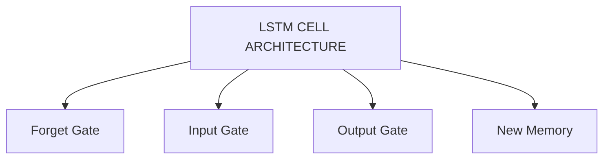

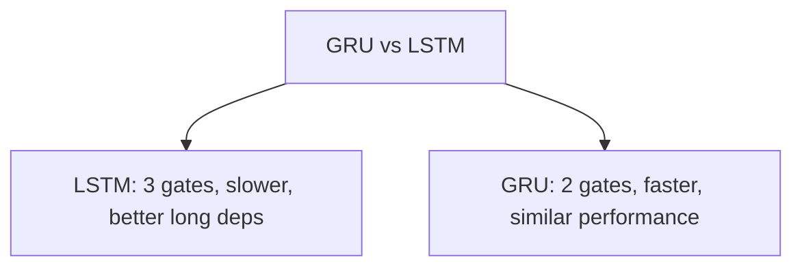

### Transformers

For truly massive, unstructured sequential datasets, Transformer architectures have superseded LSTMs. Transformers process the entire sequence simultaneously via self-attention mechanisms, granting the network direct, unmitigated access to all historical time steps without relying on sequential hidden states.

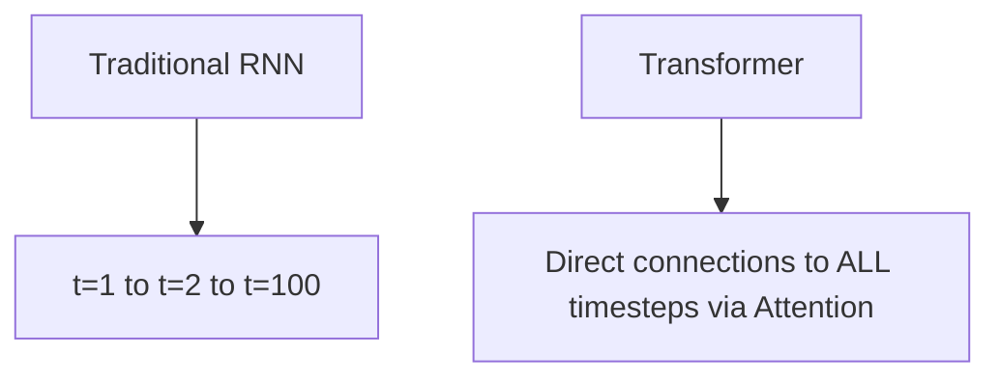

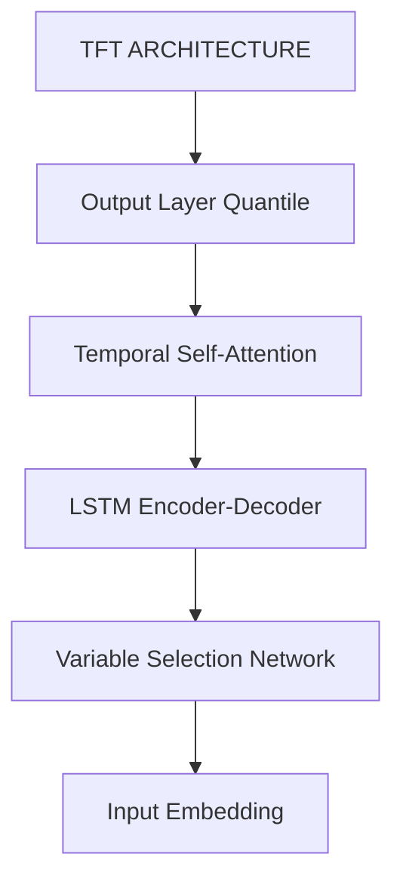

## Feature Engineering for XGBoost

Because tree-based algorithms lack native chronological awareness, engineers must translate time into discrete tabular columns. This process—feature engineering—is the single most important determinant of an XGBoost model's success. 

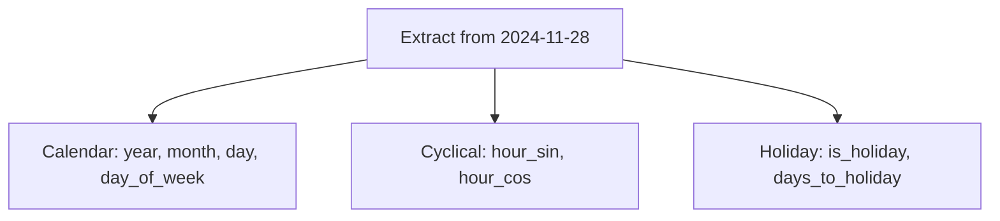

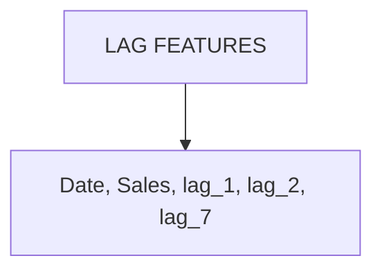

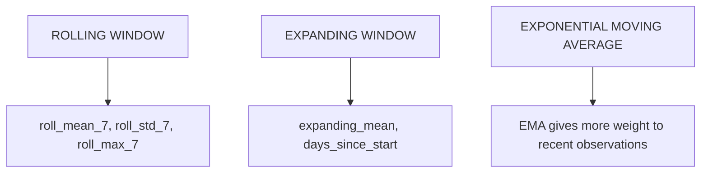

*Note on EMA:* `EMA_t = α × value_t + (1-α) × EMA_{t-1}`. A lower α (e.g. 0.1) produces a slow EMA with long memory, while a higher α (e.g. 0.5) focuses on recent values.

> **Stop and think**: If you utilize a rolling mean spanning the past 7 days to engineer a feature column, what mathematically happens to the very first 6 rows of your dataset?
> *Answer: You will generate missing values (NaNs). You must architecturally decide whether to drop these initial rows entirely, apply backfilling techniques, or implement an expanding window calculation for the beginning of the sequence before passing the tensor to XGBoost.*

## Model Selection and Ensembles

Navigating model selection requires assessing the cardinality of your series alongside data volume.

Think of choosing a time series model like choosing a transportation method. **Simple Exponential Smoothing** is like walking: basic, reliable, works for short distances. **ARIMA** is like driving a car: more powerful, handles trends and patterns, but requires skill. **Prophet** is like using a taxi: easy to call, good default choices. **Deep Learning (LSTM/Transformer)** is like operating a commercial aircraft: powerful, efficient at scale, but absolute overkill for short trips.

```mermaid
graph TD
    A[Start] --> B{How many series?}
    B -->|< 10| C[ARIMA/Prophet]
    B -->|> 100| D[Global Model]
    D --> E{> 10k points?}
    E -->|Yes| F[Transformer/TFT]
    E -->|No| G[LightGBM/XGBoost + Lags]
```

```mermaid
graph TD
    A[ENSEMBLE HYBRID] --> B[LightGBM/XGBoost + Lags]
    A --> C[Stacking]
    A --> D[Weighted Avg Classical + DL]
```

```mermaid
graph TD
    A[CLASSICAL METHODS] --> B[ARIMA/SARIMA]
    A --> C[Prophet]
    D[DEEP LEARNING] --> E[LSTM/GRU]
    D --> F[Transformer/TFT]
```

## Anomaly Detection

In production systems, forecasting models establish the expected baseline. When real-world telemetry deviates from this baseline by a statistically significant margin, it triggers anomaly alerts.

```mermaid
graph TD
    A[TYPES OF ANOMALIES] --> B[POINT ANOMALY: single unusual value]
    A --> C[CONTEXTUAL ANOMALY: normal in summer, anomaly in winter]
    A --> D[COLLECTIVE ANOMALY: sequence that is unusual]
```

```mermaid
graph TD
    A[Statistical Methods] --> B[Z-SCORE METHOD]
    A --> C[IQR METHOD Robust to outliers]
    D[Machine Learning] --> E[ISOLATION FOREST]
    D --> F[AUTOENCODERS]
```

#### Autoencoders for Deep Anomaly Detection
Autoencoders are specialized feedforward neural networks explicitly designed to identify complex structural anomalies. They are constructed in two mirrored halves: an encoder that compresses sequential input into a restricted, lower-dimensional latent space manifold, and a decoder that attempts to reconstruct the original sequence from this compressed state.

During the training phase, the autoencoder exclusively ingests "normal" historical sequences, learning the foundational statistical shape of the system. Once deployed, the network calculates the Reconstruction Error (typically Mean Squared Error) between incoming live telemetry and its attempted reconstruction. If a sequence contains structural anomalies, the network's compressed latent space will lack the required feature vocabulary to rebuild it accurately. Anomalies are definitively flagged when this reconstruction error exceeds a dynamically calculated statistical threshold, frequently set at $\mu + 3\sigma$ of the historical training error distribution. This architecture is uniquely capable of detecting subtle, multi-variate collective anomalies that traditional point-based Z-score evaluations entirely miss.

```mermaid
graph TD
    A[REAL-WORLD EXAMPLES] --> B[Fraud Detection]
    A --> C[Server Monitoring]
    A --> D[Manufacturing]
    A --> E[Finance]
```

Anomalies must be calculated and routed efficiently to prevent alert fatigue.

```mermaid
flowchart TD
    Metrics --> Kafka --> FlinkProcessor --> AnomalyScorer
    AnomalyScorer --> FeatureStore[Feature Store Redis+S3]
    AnomalyScorer --> AlertRouter --> PagerDuty
```

## Multiple Time Series and Hierarchies

The true advantage of XGBoost emerges when modeling thousands of distinct series concurrently. By vectorizing the output and feeding contextual identity flags into the input tensor, engineers can execute singular, highly accurate global models.

```mermaid
graph TD
    A[SINGLE TIME SERIES] --> B[One model per series, O n to train]
    C[MULTIPLE TIME SERIES] --> D[One global XGBoost model for ALL series]
```

```mermaid
graph TD
    A[Total Company] --> B[Region A]
    A --> C[Region B]
    B --> D[Store 1]
    B --> E[Store 2]
```

## Practical Considerations

Executing these methodologies requires meticulous defensive programming.

### Handling Missing Data

```mermaid
graph TD
    A[STRATEGIES FOR MISSING VALUES] --> B[Forward Fill LOCF]
    A --> C[Backward Fill]
    A --> D[Linear Interpolation]
    A --> E[Seasonal Interpolation]
    A --> F[Model-Based Imputation]
```

### Evaluation Metrics

Selecting the correct metric dictates how the model's loss function prioritizes errors. 

#### Mathematical Formulas for Forecasting Efficacy
- **MAE (Mean Absolute Error)**: $\text{MAE} = \frac{1}{n} \sum_{t=1}^n |y_t - \hat{y}_t|$
  This strictly treats all errors linearly. It is highly interpretable for business stakeholders as it reports error magnitude directly in the units of the original dataset.
- **RMSE (Root Mean Square Error)**: $\text{RMSE} = \sqrt{\frac{1}{n} \sum_{t=1}^n (y_t - \hat{y}_t)^2}$
  By squaring the error differentials before averaging them, RMSE aggressively and exponentially penalizes large algorithmic deviations and unexpected outliers.
- **MAPE (Mean Absolute Percentage Error)**: $\text{MAPE} = \frac{100\%}{n} \sum_{t=1}^n \left| \frac{y_t - \hat{y}_t}{y_t} \right|$
  This provides a strictly scale-independent percentage. However, the calculation catastrophically fails (producing infinite outputs) if the target value $y_t$ is zero or close to zero.
- **SMAPE (Symmetric MAPE)**: $\text{SMAPE} = \frac{100\%}{n} \sum_{t=1}^n \frac{|y_t - \hat{y}_t|}{(|y_t| + |\hat{y}_t|)/2}$
  SMAPE resolves the infinite output issue found in traditional MAPE while retaining scale independence, though it artificially biases forecasts lower.
- **MASE (Mean Absolute Scaled Error)**: $\text{MASE} = \frac{\text{MAE}}{\text{MAE}_{\text{naive}}}$
  MASE compares the engineered model's absolute error against the baseline absolute error of a naive, one-step-ahead forecast generated purely on the training set. If MASE < 1, the model is mathematically outperforming the naive baseline.

```mermaid
graph TD
    A[FORECASTING METRICS] --> B[MAE: Mean Absolute Error]
    A --> C[RMSE: Root Mean Square Error]
    A --> D[MAPE: Mean Absolute Percentage Error]
    A --> E[SMAPE: Symmetric MAPE]
    A --> F[MASE: Mean Absolute Scaled Error]
```

```mermaid
graph TD
    A[WHICH TO USE?] --> B[Business: MAE]
    A --> C[Scale comparison: MAPE/SMAPE]
    A --> D[Academic: MASE]
    A --> E[Optimization: RMSE]
```

### Avoiding Data Leakage

Randomly splitting time series data guarantees catastrophic failure in production due to look-ahead bias. You must implement sequential Walk-Forward validation arrays.

```mermaid
graph TD
    A[WRONG: Random k-fold] --> B[Future leaks into Past!]
    C[CORRECT: Time-based Walk-forward] --> D[Train on past, Test on future]
```

```mermaid
graph TD
    subgraph Walk-Forward Validation
    Fold1[Fold 1: Train Jan-Mar --> Test Apr]
    Fold2[Fold 2: Train Jan-Apr --> Test May]
    Fold3[Fold 3: Train Jan-May --> Test Jun]
    end
    Fold1 --> Fold2
    Fold2 --> Fold3
```

## Production War Stories

Theoretical algorithms frequently fail against harsh production realities.

### The $50 Million Inventory Mistake
A retail forecasting team deployed a model that learned a massive pattern: "March represents a catastrophic panic buying spike," entirely due to historical COVID-19 data. When March 2022 arrived without a pandemic, the model over-forecasted wildly, resulting in $50 million of dead inventory.
**The Fix**: Always implement automated regime change detection to verify the foundational integrity of the data stream before trusting the model.

```python
# The Fix: Regime detection before forecasting
def detect_regime_change(series, window=30, threshold=2.0):
    """Detect when the underlying pattern has fundamentally changed."""
    rolling_mean = series.rolling(window).mean()
    rolling_std = series.rolling(window).std()

    # Check if recent data is wildly different from historical patterns
    recent_zscore = (series.iloc[-window:].mean() - rolling_mean.iloc[-window*2:-window].mean()) / rolling_std.iloc[-window*2:-window].mean()

    if abs(recent_zscore) > threshold:
        print(f"REGIME CHANGE DETECTED: z-score = {recent_zscore:.2f}")
        print("   Consider retraining on post-change data only!")
        return True
    return False

# Usage: Run before every forecast cycle
if detect_regime_change(sales_data):
    model = retrain_on_recent_data(sales_data, months=3)
else:
    model = use_full_historical_model(sales_data)
```

### The 0.01% That Cost Millions
A quantitative finance team constructed a trading model with 99.99% directional accuracy during backtesting. They had mistakenly calculated the Relative Strength Index (RSI) across the *entire* continuous dataset before generating the time-based splits. The model was using future price movements to predict past price movements.

```python
# WRONG: Look-ahead bias (what they did)
def calculate_rsi_wrong(df):
    """This code looks at the ENTIRE series, including future!"""
    df['RSI'] = talib.RSI(df['close'], timeperiod=14)  # Calculated on ALL data
    return df

# CORRECT: Point-in-time calculation
def calculate_rsi_correct(df, current_idx):
    """Only use data available at the time of prediction."""
    # Only calculate on data up to current_idx
    historical_data = df.loc[:current_idx, 'close']
    return talib.RSI(historical_data, timeperiod=14).iloc[-1]

# Or use expanding window approach
def create_features_safely(df):
    """Create features using only past data at each point."""
    features = pd.DataFrame(index=df.index)

    for i in range(14, len(df)):
        # At time i, we only know prices 0 to i-1
        historical = df['close'].iloc[:i]
        features.loc[df.index[i], 'RSI'] = calculate_rsi_on_history(historical)

    return features
```

### The Anomaly That Wasn't
An infrastructure team monitored 50,000 servers. They applied static threshold limits to CPU loads. Because morning traffic naturally spikes every day at 9:00 AM, the static system generated 10,000 false-positive anomaly alerts every single morning, causing the operations team to completely ignore the alerts.

```python
# WRONG: Static threshold (what they did)
def detect_anomaly_naive(value, historical_mean, historical_std):
    z_score = (value - historical_mean) / historical_std
    return abs(z_score) > 3  # Static threshold

# CORRECT: Seasonally-adjusted detection
def detect_anomaly_seasonal(value, timestamp, historical_data):
    """Account for hour-of-day and day-of-week patterns."""
    hour = timestamp.hour
    day = timestamp.dayofweek

    # Get historical values for same hour and day
    similar_times = historical_data[
        (historical_data.index.hour == hour) &
        (historical_data.index.dayofweek == day)
    ]

    if len(similar_times) < 10:
        # Not enough history for this time slot
        return False, "Insufficient history"

    seasonal_mean = similar_times.mean()
    seasonal_std = similar_times.std()

    z_score = (value - seasonal_mean) / (seasonal_std + 1e-6)

    if abs(z_score) > 3:
        return True, f"Anomaly: z={z_score:.2f} vs typical for {hour}:00 on {day}"
    return False, "Normal"
```

## Debugging and Troubleshooting

When architectural complexities scale, forecasting implementations inevitably break. Below are the definitive symptoms, diagnostic steps, and resolutions for core pipeline failures.

### Building the Ensemble Baseline
Before debugging a complex model, it is critical to construct a baseline ensemble. If your hyper-tuned XGBoost model fails to outperform a naive combination of classical models, your feature engineering is flawed.

```python
def ensemble_forecast(series, forecast_horizon):
    """
    Simple ensemble combining ARIMA, Prophet, and naive baseline.
    """
    from statsmodels.tsa.arima.model import ARIMA
    from prophet import Prophet
    import pandas as pd
    import numpy as np

    forecasts = {}

    # 1. Naive baseline (last value repeated)
    forecasts['naive'] = np.full(forecast_horizon, series.iloc[-1])

    # 2. ARIMA
    try:
        arima = ARIMA(series, order=(5, 1, 2))
        arima_fit = arima.fit()
        forecasts['arima'] = arima_fit.forecast(steps=forecast_horizon).values
    except:
        forecasts['arima'] = forecasts['naive']

    # 3. Prophet
    try:
        prophet_df = pd.DataFrame({'ds': series.index, 'y': series.values})
        model = Prophet(yearly_seasonality=True, weekly_seasonality=True)
        model.fit(prophet_df)
        future = model.make_future_dataframe(periods=forecast_horizon)
        forecasts['prophet'] = model.predict(future)['yhat'].iloc[-forecast_horizon:].values
    except:
        forecasts['prophet'] = forecasts['naive']

    # Simple average ensemble
    ensemble = np.mean([forecasts['naive'], forecasts['arima'], forecasts['prophet']], axis=0)

    return ensemble, forecasts
```

### Symptom: Model Predicts a Flat Line
**Symptoms:** You execute a forecasting run across a wide temporal horizon, and the output is a perfectly flat, horizontal line that ignores all recent trends.
**Diagnosis:** The model cannot locate any mathematically exploitable signal, meaning the autocorrelation is practically zero. It determines that predicting the historical mean is the safest mathematical path to minimize the RMSE loss function.
**Fix:** Analyze the ACF/PACF plots and coefficient of variation. Check if a naive forecast (repeating the last known value) outperforms the mean forecast. If so, structure exists but your model is failing to learn it.

```python
# Check if your series has predictable patterns
from statsmodels.graphics.tsaplots import plot_acf
import matplotlib.pyplot as plt

def diagnose_flat_predictions(series):
    """Diagnose why model predicts flat line."""
    # Check autocorrelation
    fig, ax = plt.subplots(figsize=(10, 4))
    plot_acf(series.dropna(), lags=40, ax=ax)
    plt.title("Autocorrelation - Strong patterns = tall bars")
    plt.show()

    # Check variance
    print(f"Mean: {series.mean():.4f}")
    print(f"Std Dev: {series.std():.4f}")
    print(f"Coefficient of Variation: {series.std()/series.mean()*100:.1f}%")

    # Check if naive forecast is better
    naive_mae = abs(series - series.shift(1)).mean()
    mean_mae = abs(series - series.mean()).mean()
    print(f"\nNaive (y_t = y_{t-1}) MAE: {naive_mae:.4f}")
    print(f"Mean prediction MAE: {mean_mae:.4f}")

    if naive_mae < mean_mae:
        print(" Series has predictable structure (naive beats mean)")
    else:
        print(" Series might be unpredictable (mean beats naive)")
```

### Symptom: Predictions Are Always One Step Behind
**Symptoms:** Upon visual inspection, your predicted trend line perfectly matches the actual trend line, but it is visually shifted exactly one time step to the right.
**Diagnosis:** Severe data leakage. The model discovered that the easiest way to minimize loss is to simply copy the value of the most recent lag feature (`lag_1`). It acts as a naive forecaster without actually learning the underlying generative pattern.
**Fix:** Calculate the Pearson correlation coefficient between your predictions and the lag-1 actuals. If the correlation is higher than the prediction-to-actual correlation, you must aggressively prune overlapping lag features.

```python
# Common leak: Target at t-1 included as feature for predicting t
# The model learns: y_t ≈ y_{t-1} (just copy previous value)

# Check for this:
def check_for_lag_leak(predictions, actuals):
    """Detect if predictions are just lagged actuals."""
    # Correlation with lag-1 actual
    corr_lag1 = np.corrcoef(predictions[1:], actuals[:-1])[0, 1]
    # Correlation with actual
    corr_actual = np.corrcoef(predictions, actuals)[0, 1]

    print(f"Correlation with lag-1 actual: {corr_lag1:.4f}")
    print(f"Correlation with actual: {corr_actual:.4f}")

    if corr_lag1 > corr_actual:
        print(" LEAK DETECTED: Predictions track lagged values!")
        print("   Check your features for data leakage")
```

### Symptom: Production Performance is Catastrophic
**Symptoms:** The model reports a phenomenal MAE during the training and validation phases, but immediately fails upon deployment, predicting impossible values.
**Diagnosis:** This indicates a fundamental divergence between the training environment and the production environment. This is typically caused by unmitigated overfitting, data leakage injected during the cross-validation setup, or a fundamental regime shift in the live telemetry.
**Fix:** Validate the integrity ratios between train, validation, and production metrics.

```python
def validate_training_integrity(model_metrics, production_metrics):
    """Check if training performance is realistic."""
    train_mae = model_metrics['train_mae']
    val_mae = model_metrics['val_mae']
    prod_mae = production_metrics['mae']

    print(f"Training MAE: {train_mae:.4f}")
    print(f"Validation MAE: {val_mae:.4f}")
    print(f"Production MAE: {prod_mae:.4f}")

    # Warning signs
    if train_mae < val_mae * 0.5:
        print(" Training much better than validation - likely overfitting")

    if prod_mae > val_mae * 2:
        print(" Production 2x worse than validation - check for:")
        print("   1. Data leakage in validation")
        print("   2. Regime change in production")
        print("   3. Feature pipeline differences")

    ratio = prod_mae / val_mae
    if 0.8 < ratio < 1.2:
        print(" Production performance matches expectations")
```

### Symptom: ARIMA Convergence Failures
**Symptoms:** Your `statsmodels` pipeline constantly throws maximum iteration warnings or fails to compute the Hessian matrix during optimization.
**Diagnosis:** The optimization algorithm (like `lbfgs`) has encountered a complex topological space where the gradient is flat or unstable, preventing it from locating the global minimum for the AR and MA coefficients.
**Fix:** Wrap the fitting process in a robust block that cycles through multiple solver methods (`bfgs`, `powell`, `nm`, `cg`) until a stable AIC score is achieved.

```python
from statsmodels.tsa.arima.model import ARIMA
import warnings

def fit_arima_robust(series, order, max_attempts=5):
    """Fit ARIMA with multiple optimization attempts."""

    methods = ['lbfgs', 'bfgs', 'powell', 'nm', 'cg']
    best_model = None
    best_aic = np.inf

    for method in methods[:max_attempts]:
        try:
            with warnings.catch_warnings():
                warnings.simplefilter("ignore")

                model = ARIMA(series, order=order)
                fitted = model.fit(method=method)

                if fitted.aic < best_aic:
                    best_aic = fitted.aic
                    best_model = fitted
                    print(f"Method {method}: AIC={fitted.aic:.2f} ")

        except Exception as e:
            print(f"Method {method}: Failed ({str(e)[:50]})")

    if best_model is None:
        print("All methods failed. Try:")
        print("1. Check for missing values")
        print("2. Try simpler order (lower p, q)")
        print("3. Ensure data is numeric")

    return best_model
```

### Symptom: Prophet Training is Too Slow
**Symptoms:** Fitting a Facebook Prophet model across a large historical dataset takes hours per series, breaking your SLA constraints.
**Diagnosis:** Prophet is executing computationally expensive MCMC (Markov Chain Monte Carlo) sampling for uncertainty intervals and evaluating an excessive number of changepoint matrices.
**Fix:** Force the model into a fast-execution mode using MAP (Maximum A Posteriori) estimation by setting `mcmc_samples=0` and aggressively reducing the Fourier terms for seasonality.

```python
from prophet import Prophet

def fast_prophet_fit(df, quick_mode=True):
    """Configure Prophet for faster training."""

    if quick_mode:
        model = Prophet(
            # Reduce MCMC samples (default is 1000)
            mcmc_samples=0,  # Use MAP estimation instead

            # Reduce changepoint detection
            n_changepoints=10,  # Default is 25

            # Simplify seasonality
            yearly_seasonality=5,  # Fewer Fourier terms (default 10)
            weekly_seasonality=3,  # Default is 3

            # Disable uncertainty intervals for speed
            uncertainty_samples=0
        )
    else:
        model = Prophet()  # Full accuracy mode

    model.fit(df)
    return model

# Also consider: sample your data for initial exploration
# Full data for final model only
```

## Economics of Forecasting

Understanding the financial architecture of machine learning deployments ensures you design systems that actually generate ROI.

| Industry | Use Case | 1% Accuracy Gain Value | Typical Investment |
|----------|----------|------------------------|-------------------|
| **Retail** | Demand forecasting | $50M+ (inventory costs) | $500K |
| **Energy** | Load forecasting | $10M+ (grid balance) | $1M |
| **Finance** | Trading signals | $100M+ (alpha capture) | $5M |
| **Logistics** | Capacity planning | $20M+ (fleet optimization) | $300K |
| **Healthcare** | Patient volume | $5M+ (staffing costs) | $200K |

| Factor | Build Custom | Use Prophet/Auto-ARIMA | Buy Platform |
|--------|-------------|------------------------|--------------|
| Time series count | >10,000 | <100 | 100-10,000 |
| Customization need | High | Low | Medium |
| Team expertise | Deep ML | Basic stats | Varies |
| Time to value | 6-12 months | 1-2 weeks | 1-3 months |
| Annual cost | $500K+ | $50K | $100K-300K |

```mermaid
graph TD
    A[TOTAL ANNUAL COST: 500K to 2M] --> B[Infrastructure 40%]
    A --> C[Personnel 50%]
    A --> D[Tools & Services 10%]
    B --> B1[Compute for training: 5K-50K/mo]
    B --> B2[Real-time inference: 2K-20K/mo]
    B --> B3[Data storage: 1K-10K/mo]
    B --> B4[Monitoring systems: 1K-5K/mo]
    C --> C1[Data scientists: 2-5 FTEs]
    C --> C2[ML engineers: 1-3 FTEs]
    C --> C3[Domain experts: 0.5-1 FTE]
    D --> D1[Cloud ML platforms]
    D --> D2[Feature stores]
    D --> D3[Experiment tracking]
```

## Historical Context

Understanding where time series methods came from helps appreciate their design decisions and limitations.

### The Classical Era (1920s-1970s)
Time series forecasting began with simple moving averages in the 1920s, used primarily for economic forecasting and quality control in manufacturing. The field was transformed in the 1950s when Robert Brown developed exponential smoothing while working at the U.S. Navy's Office of Operations Research. Brown needed to forecast demand for submarine spare parts—a problem where recent data should matter more than old data. His exponentially weighted moving average became the foundation for modern forecasting.

The next revolution came in 1970 when George Box and Gwilym Jenkins published their seminal book on ARIMA models. Box was a statistician at the University of Wisconsin, and Jenkins worked at the University of Lancaster. Their methodology—identify, estimate, diagnose, forecast—remained the dominant paradigm for three decades. Box famously noted, "All models are wrong, but some are useful," capturing the pragmatic philosophy that still guides forecasting today.

### The Machine Learning Era (2000s-2010s)
The rise of machine learning brought new approaches to time series. Recurrent Neural Networks (RNNs) were proposed as early as 1986 by David Rumelhart, but the vanishing gradient problem limited their practical use. Sepp Hochreiter and Jürgen Schmidhuber solved this in 1997 with Long Short-Term Memory (LSTM) networks, but computing power wasn't sufficient to train them effectively until the 2010s.

Meanwhile, practical forecasters discovered that gradient boosting with hand-crafted features often outperformed neural networks. The M Competitions (Makridakis Competitions), running since 1982, provided rigorous benchmarks. In the 2018 M4 competition, a hybrid approach combining exponential smoothing with neural networks won—showing that classical and modern methods could complement each other.

### The Transformer Era (2017-Present)
The introduction of Transformers in 2017 (Vaswani et al.'s "Attention Is All You Need") revolutionized natural language processing and eventually time series. The attention mechanism solved the fundamental problem that plagued RNNs: how to directly connect distant timesteps without information degrading through sequential processing.

Google's Temporal Fusion Transformer (2020) adapted these ideas specifically for time series, adding variable selection networks to handle the many exogenous variables common in forecasting problems. Amazon's DeepAR and Facebook's Prophet (2017) democratized sophisticated forecasting, making it accessible to practitioners without deep statistical training.

Today, we're in an exciting period where classical methods, gradient boosting, and deep learning each have their place. The key insight from decades of research: no single method dominates. The best practitioners understand the strengths of each approach and choose based on their specific problem, data, and constraints.

## Further Reading

### Papers
- "Time Series Analysis: Forecasting and Control" (Box & Jenkins, 1970) - The foundational text that defined modern time series analysis
- "Time Series Forecasting with Prophet" (Taylor & Letham, 2017) - Facebook's accessible forecasting framework
- "Temporal Fusion Transformers" (Lim et al., 2020) - State-of-the-art deep learning for interpretable forecasting
- "N-BEATS: Neural Basis Expansion Analysis" (Oreshkin et al., 2020) - Pure deep learning without hand-crafted features
- "Deep Learning for Time Series Forecasting" (Lim & Zohren, 2021) - Comprehensive survey of modern methods
- "The M5 Accuracy Competition: Results, Findings and Conclusions" (Makridakis et al., 2022) - Empirical insights from the largest forecasting competition

### Libraries
- **statsmodels**: ARIMA, exponential smoothing, and classical statistical methods
- **Prophet**: Facebook's forecasting library, excellent for daily data with seasonality
- **GluonTS**: Amazon's deep learning time series toolkit with DeepAR and other models
- **Darts**: Unified interface for classical, ML, and deep learning methods
- **sktime**: scikit-learn compatible time series with consistent API
- **pytorch-forecasting**: PyTorch-based deep learning models including TFT
- **NeuralProphet**: Prophet-like interface with neural network backends

## Key Takeaways

- **XGBoost's True Power**: Tree-based models like XGBoost and `HistGradientBoostingRegressor` excel on massive datasets by leveraging global cross-learning across thousands of temporal series concurrently, dramatically outperforming isolated statistical models.
- **The Look-Ahead Bias Threat**: Temporal data structure cannot be randomly shuffled. Attempting a standard `train_test_split` on sequential data leads to data leakage, producing catastrophic failures in production. Always utilize time-based walk-forward splits.
- **Hardware Agnosticism**: XGBoost 3.2.0 allows seamless distributed execution across multi-GPU environments via the global `device` parameter, integrating seamlessly with Dask and PySpark on Kubernetes architectures.
- **Stationarity Fundamentals**: Before modeling, utilize ADF tests to detect stationarity. Extrapolating non-stationary data requires strict differencing or engineered rolling features to ensure stability.
- **Control Through Constraints**: You can tame unpredictable tree ensembles by imposing strict monotonic constraints, forcing the model to adhere to known physical and economic laws.

## Did You Know?
- Amazon's demand forecasting system processes over 300 million independent time series daily. Improving their ensemble accuracy by a mere 1% reliably saves the organization over $100 million annually in combined inventory and logistics costs.
- George Box and Gwilym Jenkins developed the foundational ARIMA mathematical methodology in 1970, originally creating it to strictly predict and control the temperatures inside industrial gas furnaces.
- The Long Short-Term Memory (LSTM) network architecture was originally published by researchers in 1997, yet it remained largely unutilized in industry until 2014 when GPU computational power made the matrix operations economically viable.
- During the high-profile 2020 M5 Forecasting Competition (which required predicting 42,840 series of historical Walmart sales data), LightGBM (a gradient boosting library structurally similar to XGBoost) famously and decisively defeated vastly more complex deep learning neural networks.

## Common Mistakes

| Mistake | Why | Fix |
|---|---|---|
| **Random train/test split** | Destroys temporal order; leaks future to past. | Time-based walk-forward split (e.g. 80% past, 20% future). |
| **First-order differencing seasonal data** | Removes trend but misses seasonality. | Difference the season (e.g. `diff(12)`) then `diff(1)`. |
| **`center=True` on rolling means** | Uses future data in the window. | Use `center=False` and `.shift(1)`. |
| **Too short training window** | Misses long-term cyclicality. | Use at least 2 full cycles of the longest seasonality. |
| **Comparing MAPE across series** | Punishes low-volume series unfairly. | Use scale-independent MASE. |
| **Ignoring Monotonic Constraints** | Tree models can overfit noise in trends. | Set monotonic_cst in HistGradientBoostingRegressor. |
| **Running single models on 1M series** | Exponential training time; misses global patterns. | Use a global XGBoost model predicting all series together. |

```python
#  WRONG: Random train/test split destroys temporal structure
from sklearn.model_selection import train_test_split
X_train, X_test, y_train, y_test = train_test_split(X, y, test_size=0.2)
# Future data can leak into training!

#  CORRECT: Time-based split preserves temporal order
split_idx = int(len(X) * 0.8)
X_train, X_test = X[:split_idx], X[split_idx:]
y_train, y_test = y[:split_idx], y[split_idx:]
# Training only sees past, testing only sees future
```

```python
#  WRONG: Only first-order differencing for seasonal data
diff_wrong = series.diff(1)  # Removes trend but not seasonality

#  CORRECT: Seasonal differencing for seasonal data
# For monthly data with yearly seasonality:
diff_correct = series.diff(12)  # Remove yearly pattern
diff_correct = diff_correct.diff(1)  # Then remove trend
```

```python
#  WRONG: Rolling features that look into the future
df['moving_avg'] = df['sales'].rolling(window=7, center=True).mean()
#                                                    ^^^^^ Uses 3 future days!

#  CORRECT: Only use past data
df['moving_avg'] = df['sales'].rolling(window=7, center=False).mean().shift(1)
#                                               ^^^^^ Only past ^^^^^^ Exclude current
```

```python
#  WRONG: Training only on last 3 months
model = Prophet()
model.fit(df[df['ds'] > '2024-09-01'])  # Misses yearly seasonality!

#  CORRECT: Include at least 2 full cycles of your longest seasonality
# For yearly seasonality, use 2+ years of data
model = Prophet()
model.fit(df[df['ds'] > '2022-09-01'])  # Captures 2 full years
```

```python
#  WRONG: Comparing MAPE across very different series
mape_product_a = 5.2   # Sales: $1M/month
mape_product_b = 45.3  # Sales: $100/month (!)

# Product B seems terrible, but 45% of $100 is only $45 error!
# Product A at 5% of $1M is $50,000 error!

#  CORRECT: Use scale-independent metrics or absolute errors
# Option 1: Compare MAE in dollars
mae_a = 50000  # Much larger actual impact
mae_b = 45     # Tiny actual impact

# Option 2: Use MASE (Mean Absolute Scaled Error)
# Compares your model to a naive baseline on the same series
mase_a = 0.8   # 20% better than naive
mase_b = 1.2   # 20% worse than naive (worry about this one!)
```

## Quiz

<details>
<summary>1. A retail firm has 15,000 individual SKUs to forecast daily. Which architecture is most appropriate?</summary>
A global model (like XGBoost or LightGBM) trained across all time series concurrently is the optimal choice here. Global models exploit cross-series learning by finding shared patterns across related items, drastically reducing the computational overhead compared to training 15,000 individual statistical instances. Furthermore, tree-based models natively handle sparse historical data, which is common in massive retail item catalogs.
</details>

<details>
<summary>2. Your HistGradientBoostingRegressor model captures long-term trends perfectly but makes nonsensical spikes in pricing predictions during standard validation. How can you constrain it?</summary>
You must apply monotonic constraints via the `monotonic_cst` parameter during initialization. By mapping features like historical price to a strictly decreasing constraint (-1), the gradient boosted trees are mathematically forced to only execute node splits that obey the law of demand. This prevents the model from overfitting to short-term noisy periods where prices and sales may have spuriously spiked together.
</details>

<details>
<summary>3. Your team is migrating a massive sequential dataset to a multi-node Kubernetes cluster with NVIDIA GPUs. The legacy training pipeline uses `tree_method='exact'`, causing out-of-memory errors and extremely long training times. How should you reconfigure the XGBoost 3.2.0 parameters to solve this?</summary>
To resolve out-of-memory constraints on large hardware, you must configure the `tree_method` parameter to `hist` (or `auto`, which automatically utilizes the histogram approach in version 3.2.0). The exact tree method evaluates every continuous feature's explicit split point, consuming unsustainable amounts of memory. By contrast, the histogram method bins continuous variables into discrete intervals, drastically slashing memory requirements while allowing the CUDA-enabled cluster to process the data in parallel.
</details>

<details>
<summary>4. You train a forecasting model using a standard `train_test_split(X, y)` function from scikit-learn. Why is this a catastrophic mistake?</summary>
A standard train/test split randomly shuffles rows before allocating them, fundamentally destroying the chronological integrity of the dataset. Sequence modeling mandates strict temporal ordering to prevent look-ahead bias and data leakage. By shuffling, the model inadvertently ingests data from the future to predict the past, resulting in a model that performs flawlessly during validation but fails catastrophically when deployed to production.
</details>

<details>
<summary>5. Why does XGBoost generally require engineered lag features, while an LSTM does not?</summary>
XGBoost operates exclusively on independent, row-wise tabular data, possessing no inherent architectural awareness of chronological sequence or the passage of time. Consequently, temporal relationships must be explicitly encoded as discrete columns, such as `lag_1` or `rolling_mean_7`, before training can commence. Conversely, recurrent architectures like LSTMs maintain internal memory cell states via input and forget gates, allowing them to naturally ingest sequential tensors and parse dependencies over multiple time steps without manual feature engineering.
</details>

<details>
<summary>6. You deploy a model utilizing scikit-learn 1.8.0. You notice memory and threading performance issues on multi-core CPU inference. How might Python 3.14 help?</summary>
Scikit-learn version 1.8.0 introduced robust experimental support for Python 3.14's free-threading capabilities. Historically, Python's Global Interpreter Lock (GIL) prevented true parallel execution of threads in CPU-bound inference workloads. By executing the application within a free-threaded CPython environment, the HistGradientBoostingRegressor can leverage simultaneous multi-core inference, maximizing hardware utilization and substantially reducing latency in high-throughput prediction environments.
</details>

<details>
<summary>7. Your team is forecasting daily energy grid loads. During exploratory data analysis, the ADF test yields a p-value of 0.85. The junior engineer suggests immediately fitting an ARIMA(2,0,1) model to the raw data. Why will this fail, and what sequence of transformations is required before applying the model?</summary>
A p-value of 0.85 (which is >= 0.05) indicates that we fail to reject the null hypothesis; the series is definitively non-stationary. Classical methods like ARIMA rely on constant mean and variance over time to produce mathematically valid predictions. Fitting directly to raw non-stationary data will result in models that fail to extrapolate trends entirely. The team must first apply sequential differencing (creating a new series of changes between consecutive steps) until the ADF test yields a p-value < 0.05, thereby identifying the correct 'd' parameter required for the underlying ARIMA architecture.
</details>

<details>
<summary>8. Design a real-time anomaly detection system for server metrics processing 5 million points per minute.</summary>
To handle five million events per minute, a highly concurrent streaming architecture utilizing Apache Kafka and Apache Flink is strictly required. The anomaly scoring mechanism must compute a dynamically adjusted seasonal baseline by constantly updating rolling statistical metrics within an in-memory datastore like Redis. To minimize alert fatigue for the operations team, the system should combine multiple continuous signals—such as a Z-score deviation cross-referenced against an Isolation Forest output—before transmitting a correlated incident payload to PagerDuty.
</details>

## Hands-On Exercises

To successfully complete the lab sequence, you must execute these scripts sequentially within an isolated development environment.

### Lab Setup
Run the following commands to create the environment and bootstrap the synthetic temporal dataset.

```bash
# 1. Create and activate a virtual environment
python3 -m venv xgboost_env
source xgboost_env/bin/activate

# 2. Install dependencies (ensuring non-interactive deployment)
pip install --quiet xgboost==3.2.0 scikit-learn==1.8.0 "dask[distributed]" prophet statsmodels torch matplotlib
```

Create a bootstrapping script named `setup_data.py`:
```python
import pandas as pd
import numpy as np

# Synthetic Data Generation
np.random.seed(42)
dates = pd.date_range(start='2020-01-01', end='2023-12-31', freq='D')
trend = np.linspace(10, 50, len(dates))
seasonality = 10 * np.sin(2 * np.pi * dates.dayofyear / 365.25)
noise = np.random.normal(0, 2, len(dates))

sales = np.clip(trend + seasonality + noise, 0, None)
df = pd.DataFrame({'date': dates, 'sales': sales, 'value': sales}).set_index('date')

# Save for reference in below exercises
df.to_csv('sales.csv')
df.to_csv('data.csv')
print("Synthetic data generated: sales.csv, data.csv")
```

Execute the payload generation:
```bash
python setup_data.py
```

Verify creation success:
```bash
ls -l *.csv
```

### Exercise 1: Build Complete ARIMA Pipeline
Engineer a robust ARIMA flow by writing the following to `task1_arima.py` and executing it.

<details>
<summary>View Solution</summary>

```python
"""
Complete ARIMA forecasting pipeline with proper evaluation.
"""
import pandas as pd
import numpy as np
from statsmodels.tsa.stattools import adfuller
from statsmodels.tsa.arima.model import ARIMA
from statsmodels.graphics.tsaplots import plot_acf, plot_pacf
import matplotlib.pyplot as plt
from sklearn.metrics import mean_absolute_error, mean_squared_error

def check_stationarity(series, significance=0.05):
    """
    Test for stationarity using Augmented Dickey-Fuller test.

    Returns True if series is stationary (p-value < significance).
    """
    result = adfuller(series.dropna())
    adf_stat = result[0]
    p_value = result[1]

    print(f"ADF Statistic: {adf_stat:.4f}")
    print(f"p-value: {p_value:.4f}")

    if p_value < significance:
        print(" Series IS stationary (reject null hypothesis)")
        return True
    else:
        print(" Series is NOT stationary (fail to reject null)")
        return False

def make_stationary(series, max_diff=2):
    """
    Apply differencing until series is stationary.

    Returns (transformed_series, number_of_differences).
    """
    current = series.copy()
    d = 0

    while not check_stationarity(current) and d < max_diff:
        d += 1
        current = current.diff().dropna()
        print(f"\nAfter {d} difference(s):")

    return current, d

def select_arima_order(series, max_p=5, max_q=5):
    """
    Use information criteria to select best ARIMA(p,d,q) parameters.
    """
    # Make stationary first
    stationary, d = make_stationary(series)

    # Grid search over p and q
    best_aic = np.inf
    best_order = None

    for p in range(max_p + 1):
        for q in range(max_q + 1):
            try:
                model = ARIMA(series, order=(p, d, q))
                fitted = model.fit()

                if fitted.aic < best_aic:
                    best_aic = fitted.aic
                    best_order = (p, d, q)
                    print(f"ARIMA({p},{d},{q}): AIC={fitted.aic:.2f}")
            except:
                continue

    print(f"\nBest order: ARIMA{best_order} with AIC={best_aic:.2f}")
    return best_order

def walk_forward_validation(series, order, test_size=30):
    """
    Evaluate ARIMA using walk-forward validation (time-respecting CV).

    At each step:
    1. Train on all data up to time t
    2. Predict time t+1
    3. Move forward and repeat
    """
    history = list(series[:-test_size])
    predictions = []
    actuals = list(series[-test_size:])

    for i in range(test_size):
        # Fit model on history
        model = ARIMA(history, order=order)
        fitted = model.fit()

        # Predict next value
        forecast = fitted.forecast(steps=1)[0]
        predictions.append(forecast)

        # Add actual to history (simulates getting new data)
        history.append(actuals[i])

        if (i + 1) % 10 == 0:
            print(f"Progress: {i + 1}/{test_size} predictions")

    # Calculate metrics
    mae = mean_absolute_error(actuals, predictions)
    rmse = np.sqrt(mean_squared_error(actuals, predictions))

    print(f"\nWalk-Forward Validation Results:")
    print(f"MAE: {mae:.4f}")
    print(f"RMSE: {rmse:.4f}")

    return predictions, actuals, mae, rmse

# Example usage:
df = pd.read_csv('sales.csv', parse_dates=['date'], index_col='date')
series = df['sales']
order = select_arima_order(series)
predictions, actuals, mae, rmse = walk_forward_validation(series, order)
```
</details>

```bash
python task1_arima.py
```

### Exercise 2: Prophet vs ARIMA Comparison
Write `task2_compare.py` to calculate algorithmic divergence.

<details>
<summary>View Solution</summary>

```python
"""
Head-to-head comparison of Prophet and ARIMA on the same dataset.
"""
import pandas as pd
import numpy as np
from prophet import Prophet
from statsmodels.tsa.arima.model import ARIMA
from sklearn.metrics import mean_absolute_error
import matplotlib.pyplot as plt

def prepare_prophet_data(series):
    """Convert pandas Series to Prophet format (ds, y columns)."""
    df = pd.DataFrame({
        'ds': series.index,
        'y': series.values
    })
    return df

def compare_forecasters(series, forecast_horizon=30):
    """
    Compare Prophet vs ARIMA on the same train/test split.
    """
    # Split data
    train = series[:-forecast_horizon]
    test = series[-forecast_horizon:]

    results = {}

    # --- PROPHET ---
    print("Training Prophet...")
    prophet_df = prepare_prophet_data(train)
    prophet_model = Prophet(
        yearly_seasonality=True,
        weekly_seasonality=True,
        daily_seasonality=False
    )
    prophet_model.fit(prophet_df)

    # Make future dataframe
    future = prophet_model.make_future_dataframe(periods=forecast_horizon)
    prophet_forecast = prophet_model.predict(future)
    prophet_preds = prophet_forecast['yhat'].iloc[-forecast_horizon:].values

    results['Prophet'] = {
        'predictions': prophet_preds,
        'mae': mean_absolute_error(test.values, prophet_preds)
    }

    # --- ARIMA ---
    print("Training ARIMA...")
    # Using auto-selected order (you'd use select_arima_order in practice)
    arima_model = ARIMA(train, order=(5, 1, 2))
    arima_fitted = arima_model.fit()
    arima_preds = arima_fitted.forecast(steps=forecast_horizon)

    results['ARIMA'] = {
        'predictions': arima_preds,
        'mae': mean_absolute_error(test.values, arima_preds)
    }

    # --- COMPARISON ---
    print("\n" + "=" * 50)
    print("COMPARISON RESULTS")
    print("=" * 50)
    for name, data in results.items():
        print(f"{name:15} MAE: {data['mae']:.4f}")

    # Determine winner
    winner = min(results.keys(), key=lambda k: results[k]['mae'])
    print(f"\n Winner: {winner}")

    # Plot comparison
    plt.figure(figsize=(12, 6))
    plt.plot(test.index, test.values, 'k-', label='Actual', linewidth=2)
    plt.plot(test.index, results['Prophet']['predictions'], 'b--', label='Prophet')
    plt.plot(test.index, results['ARIMA']['predictions'], 'r--', label='ARIMA')
    plt.legend()
    plt.title('Prophet vs ARIMA Forecast Comparison')
    plt.xlabel('Date')
    plt.ylabel('Value')
    plt.tight_layout()
    plt.savefig('forecast_comparison.png')

    return results

# Analyze Prophet components
def analyze_prophet_components(model, forecast):
    """Visualize what Prophet learned about trend and seasonality."""
    fig = model.plot_components(forecast)
    plt.tight_layout()
    plt.savefig('prophet_components.png')

    # Extract component strengths
    trend_range = forecast['trend'].max() - forecast['trend'].min()
    yearly_range = forecast['yearly'].max() - forecast['yearly'].min()

    print(f"\nComponent Analysis:")
    print(f"Trend range: {trend_range:.2f}")
    print(f"Yearly seasonality range: {yearly_range:.2f}")
    print(f"Ratio (seasonality/trend): {yearly_range/trend_range:.2%}")

df = pd.read_csv('sales.csv', parse_dates=['date'], index_col='date')
compare_forecasters(df['sales'])
```
</details>

```bash
python task2_compare.py
```
```bash
# Checkpoint: Verify that the diagnostic visualizations were generated successfully
ls -l *.png
```

### Exercise 3: Evaluate HistGradientBoostingRegressor vs ARIMA
Write `task3_hist_boost.py` to evaluate the 1.8.0 histogram capabilities.

<details>
<summary>View Solution</summary>

```python
"""
Evaluate HistGradientBoostingRegressor with lag features.
"""
import pandas as pd
import numpy as np
from sklearn.ensemble import HistGradientBoostingRegressor
from sklearn.metrics import mean_absolute_error

# Load data
df = pd.read_csv('sales.csv', parse_dates=['date'], index_col='date')

# Engineer Features (Lag and cyclical)
df['lag_1'] = df['sales'].shift(1)
df['lag_7'] = df['sales'].shift(7)
df['dayofyear'] = df.index.dayofyear
df = df.dropna()

X = df[['lag_1', 'lag_7', 'dayofyear']]
y = df['sales']

# Time-respecting split
split_idx = int(len(X) * 0.8)
X_train, X_test = X.iloc[:split_idx], X.iloc[split_idx:]
y_train, y_test = y.iloc[:split_idx], y.iloc[split_idx:]

# Define HistGradientBoostingRegressor with monotonic constraints on lag_1
# lag_1 mapped to index 0 -> must be monotonically increasing (1)
hgb = HistGradientBoostingRegressor(max_iter=100, monotonic_cst=[1, 0, 0])
hgb.fit(X_train, y_train)

# Predict and evaluate
preds = hgb.predict(X_test)
mae = mean_absolute_error(y_test, preds)
print(f"HistGradientBoostingRegressor MAE: {mae:.4f}")
```
</details>

```bash
python task3_hist_boost.py
```

### Exercise 4: Distributed XGBoost Training with Dask
Draft `task4_dask_xgboost.py` to establish local distributed topology.

<details>
<summary>View Solution</summary>

```python
"""
Distributed training using Dask and XGBoost 3.2.0.
"""
import dask.dataframe as dd
from dask.distributed import Client, LocalCluster
import xgboost as xgb
import pandas as pd

# Setup local Dask cluster
cluster = LocalCluster(n_workers=2, threads_per_worker=2)
client = Client(cluster)
print("Dask Cluster Initialized!")

# Load data into distributed dataframe
pdf = pd.read_csv('sales.csv')
pdf['lag_1'] = pdf['sales'].shift(1)
pdf = pdf.dropna()
ddf = dd.from_pandas(pdf, npartitions=2)

X = ddf[['lag_1']]
y = ddf['sales']

# Initialize Distributed XGBoost
# In version 3.2.0, tree_method='auto' effectively acts as 'hist'
dask_model = xgb.dask.DaskXGBRegressor(tree_method='auto', n_estimators=50)

# Train the model over the cluster
dask_model.client = client
dask_model.fit(X, y)

print("Distributed XGBoost Training Complete!")
```
</details>

```bash
python task4_dask_xgboost.py
```

### Exercise 5: LSTM Time Series Model
Build `task5_lstm.py` to compare tree ensembles against deep memory cells.

<details>
<summary>View Solution</summary>

```python
"""
LSTM model for time series forecasting with proper sequence creation.
"""
import numpy as np
import pandas as pd
import torch
import torch.nn as nn
from torch.utils.data import DataLoader, TensorDataset
from sklearn.preprocessing import MinMaxScaler
from sklearn.metrics import mean_absolute_error

class LSTMForecaster(nn.Module):
    """
    LSTM architecture for time series prediction.
    """
    def __init__(self, input_size=1, hidden_size=64, num_layers=2, dropout=0.2):
        super().__init__()
        self.hidden_size = hidden_size
        self.num_layers = num_layers

        self.lstm = nn.LSTM(
            input_size=input_size,
            hidden_size=hidden_size,
            num_layers=num_layers,
            batch_first=True,
            dropout=dropout
        )

        self.fc = nn.Linear(hidden_size, 1)

    def forward(self, x):
        # x shape: (batch, sequence_length, input_size)
        lstm_out, _ = self.lstm(x)

        # Take the last output
        last_output = lstm_out[:, -1, :]

        # Predict
        prediction = self.fc(last_output)
        return prediction

def create_sequences(data, look_back=30):
    """
    Create input sequences and targets for LSTM training.

    Given [1, 2, 3, 4, 5] with look_back=3:
    X = [[1,2,3], [2,3,4]]
    y = [4, 5]
    """
    X, y = [], []
    for i in range(len(data) - look_back):
        X.append(data[i:(i + look_back)])
        y.append(data[i + look_back])
    return np.array(X), np.array(y)

def train_lstm_forecaster(series, look_back=30, epochs=100, batch_size=32):
    """
    Complete LSTM training pipeline with proper time split.
    """
    # Scale data to [0, 1]
    scaler = MinMaxScaler()
    scaled_data = scaler.fit_transform(series.values.reshape(-1, 1))

    # Create sequences
    X, y = create_sequences(scaled_data.flatten(), look_back)

    # Time-based split (80% train, 20% test)
    split_idx = int(len(X) * 0.8)
    X_train, X_test = X[:split_idx], X[split_idx:]
    y_train, y_test = y[:split_idx], y[split_idx:]

    print(f"Training samples: {len(X_train)}")
    print(f"Test samples: {len(X_test)}")

    # Convert to PyTorch tensors
    X_train = torch.FloatTensor(X_train).unsqueeze(-1)
    y_train = torch.FloatTensor(y_train).unsqueeze(-1)
    X_test = torch.FloatTensor(X_test).unsqueeze(-1)
    y_test = torch.FloatTensor(y_test).unsqueeze(-1)

    # Create DataLoader
    train_dataset = TensorDataset(X_train, y_train)
    train_loader = DataLoader(train_dataset, batch_size=batch_size, shuffle=False)
    # Note: shuffle=False for time series!

    # Initialize model
    model = LSTMForecaster()
    criterion = nn.MSELoss()
    optimizer = torch.optim.Adam(model.parameters(), lr=0.001)

    # Training loop
    model.train()
    for epoch in range(epochs):
        total_loss = 0
        for batch_X, batch_y in train_loader:
            optimizer.zero_grad()
            outputs = model(batch_X)
            loss = criterion(outputs, batch_y)
            loss.backward()
            optimizer.step()
            total_loss += loss.item()

        if (epoch + 1) % 20 == 0:
            print(f"Epoch {epoch+1}/{epochs}, Loss: {total_loss/len(train_loader):.6f}")

    # Evaluate
    model.eval()
    with torch.no_grad():
        predictions = model(X_test)

    # Inverse transform to original scale
    preds_original = scaler.inverse_transform(predictions.numpy())
    actuals_original = scaler.inverse_transform(y_test.numpy())

    mae = mean_absolute_error(actuals_original, preds_original)
    print(f"\nTest MAE: {mae:.4f}")

    return model, scaler, mae

df = pd.read_csv('data.csv', index_col='date', parse_dates=True)
model, scaler, mae = train_lstm_forecaster(df['value'], look_back=30)
```
</details>

```bash
python task5_lstm.py
```

### Exercise 6: Build Anomaly Detection System
Develop `task6_anomaly.py` to trigger statistical deviations.

<details>
<summary>View Solution</summary>

```python
"""
Production-ready time series anomaly detection with seasonal baselines.
"""
import pandas as pd
import numpy as np
from datetime import datetime, timedelta
from collections import defaultdict

class SeasonalAnomalyDetector:
    """
    Anomaly detector that learns hour-of-day and day-of-week patterns.
    """

    def __init__(self, z_threshold=3.0, min_samples=20):
        self.z_threshold = z_threshold
        self.min_samples = min_samples
        # Store baselines by (hour, day_of_week)
        self.baselines = defaultdict(lambda: {'values': [], 'mean': None, 'std': None})

    def fit(self, series):
        """
        Learn normal patterns from historical data.

        series: pd.Series with DatetimeIndex
        """
        for timestamp, value in series.items():
            key = (timestamp.hour, timestamp.dayofweek)
            self.baselines[key]['values'].append(value)

        # Calculate statistics for each time slot
        for key, data in self.baselines.items():
            values = np.array(data['values'])
            if len(values) >= self.min_samples:
                # Use robust statistics (median and MAD) for outlier resistance
                data['mean'] = np.median(values)
                mad = np.median(np.abs(values - data['mean']))
                data['std'] = 1.4826 * mad  # Scale MAD to approximate std

                # Fallback to regular std if MAD is 0
                if data['std'] < 1e-6:
                    data['std'] = np.std(values)
            else:
                data['mean'] = None
                data['std'] = None

        print(f"Fitted on {len(series)} points")
        print(f"Unique time slots learned: {len(self.baselines)}")

        return self

    def detect(self, timestamp, value):
        """
        Check if a value is anomalous given its timestamp.

        Returns (is_anomaly, details_dict)
        """
        key = (timestamp.hour, timestamp.dayofweek)
        baseline = self.baselines[key]

        if baseline['mean'] is None:
            return False, {
                'status': 'insufficient_history',
                'message': f'Not enough data for {timestamp.hour}:00 on day {timestamp.dayofweek}'
            }

        z_score = (value - baseline['mean']) / (baseline['std'] + 1e-10)

        is_anomaly = abs(z_score) > self.z_threshold

        return is_anomaly, {
            'status': 'anomaly' if is_anomaly else 'normal',
            'value': value,
            'expected': baseline['mean'],
            'z_score': z_score,
            'threshold': self.z_threshold,
            'timestamp': timestamp
        }

    def detect_batch(self, series):
        """
        Run detection on a batch of data, returning all anomalies.
        """
        anomalies = []
        for timestamp, value in series.items():
            is_anomaly, details = self.detect(timestamp, value)
            if is_anomaly:
                anomalies.append(details)

        print(f"Found {len(anomalies)} anomalies in {len(series)} points")
        print(f"Anomaly rate: {len(anomalies)/len(series)*100:.2f}%")

        return anomalies

# Usage example:
df = pd.read_csv('data.csv', index_col='date', parse_dates=True)
train_data = df['value']['2020-01-01':'2022-06-30']
detector = SeasonalAnomalyDetector(z_threshold=3.0)
detector.fit(train_data)

test_data = df['value']['2022-07-01':'2023-12-31']
anomalies = detector.detect_batch(test_data)
for a in anomalies[:5]:
    print(f"{a['timestamp']}: value={a['value']:.2f}, expected={a['expected']:.2f}, z={a['z_score']:.2f}")
```
</details>

```bash
python task6_anomaly.py
```

## Next Steps
You have now fully bridged gradient boosting architectures with complex temporal data sequencing workflows. 

**Up Next:** [Module 1.3: Time Series Forecasting](/ai-ml-engineering/classical-ml/module-1.3-time-series-forecasting/) — Apply tree-based models to sequential business problems, understand deep leakage in temporal datasets, and learn exactly when boosted ensembles empirically outperform more complex neural network approaches.