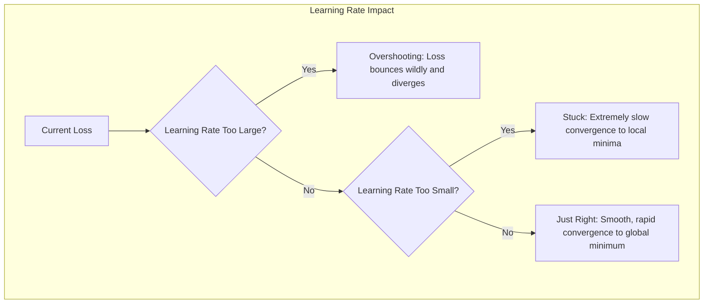
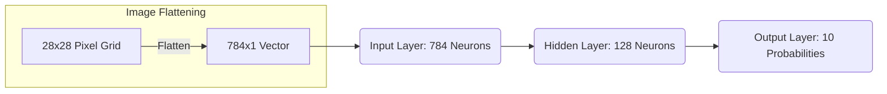

> **AI/ML Engineering Track** | Complexity: `[MEDIUM]` | Time: 6-8 Hours

## The $500 Million Black Box: Why Understanding the Math Matters

In late 2021, the real estate giant Zillow announced it was shutting down its "Zillow Offers" division, a massive operation dedicated to algorithmically buying and selling homes. The cost of this failure? A staggering $500+ million write-down and the layoff of roughly 25% of the company's workforce. The catastrophic financial loss was directly tied to the failure of their predictive machine learning models.

Zillow's models, which relied heavily on complex algorithmic architectures, had failed to accurately forecast housing prices during volatile market shifts caused by external economic events. The models kept aggressively buying houses at inflated prices even as the market began to cool. The engineers treating their predictive engines as infallible black boxes failed to diagnose the underlying distribution shifts and exploding error gradients in their financial risk metrics. They trusted the output without critically evaluating the internal loss landscapes and backpropagation dynamics of their architectures.

When you use a modern deep learning framework like PyTorch, it is dangerously easy to abstract away the mathematics. You can build a multi-layer neural network with five lines of code. But when the model fails—when it silently memorizes noise, suffers from vanishing gradients, or collapses under real-world data drift—calling a simple `.fit()` method will not save you. This module bridges the gap between theoretical mathematics and modern implementation. By building a network from scratch, you will become the engineer who can diagnose catastrophic failures that cost companies millions.

## Learning Outcomes

By the end of this module, you will be able to:
- **Design** a multi-layer neural network architecture from first principles, understanding the mathematical role of every weight and bias matrix.
- **Implement** forward and backward propagation algorithms from scratch using raw Python and NumPy to demystify underlying framework magic.
- **Diagnose** vanishing and exploding gradient problems by analyzing activation function outputs and plotting loss curves.
- **Evaluate** the PyTorch 2.11.0 ecosystem, selecting the correct CUDA targets and hardware compatibility libraries for modern infrastructure.
- **Debug** failing model training loops by isolating and resolving errors in weight initialization, learning rates, or tensor shape mismatches.

## The Day a Machine Learned to See: When Math Became Magic

**Toronto. December 3, 2012. 4:47 PM.**

Geoffrey Hinton was staring at his computer screen, trying to process what he was seeing. For thirty years, he'd been a voice in the wilderness, insisting that neural networks could work if we just had enough data and computing power. His colleagues had called him stubborn. Funding agencies had called him delusional. The AI winters had frozen out most of his peers.

But today was different.

The ImageNet Large Scale Visual Recognition Challenge results were in. Hinton's team—two graduate students, Alex Krizhevsky and Ilya Sutskever—had entered a neural network called "AlexNet." The best competing systems achieved error rates around 26%. AlexNet achieved 15.3%.

Hinton read the number again: **15.3%**.

Not slightly better. Not incrementally improved. A single neural network had reduced the error rate by more than 10 percentage points—a jump so large that reviewers initially assumed it was a mistake.

> "I remember thinking: this changes everything. The ideas we'd been developing for decades—they actually work. We just needed scale."
> — Geoffrey Hinton, reflecting on the moment in 2017

The phone started ringing. Colleagues who'd dismissed neural networks for years suddenly wanted to know more. Within months, Google acquired Hinton's startup for $44 million. Within a year, neural networks would be the dominant paradigm in AI. Within a decade, they would power everything from voice assistants to self-driving cars to ChatGPT.

But here's the remarkable part: **the core algorithm that made AlexNet work was invented in 1986.** The math hadn't changed. The architecture was similar to networks from the 1990s. What changed was data (ImageNet providing millions of labeled images), compute (GPUs making training fast), and new techniques (like ReLU, dropout, and batch norm solving training issues).

## Introduction: What IS a Neural Network?

You have likely interacted with neural networks through sophisticated APIs. You have seen them generate human-like text, recognize complex images, and transcribe speech in real time. But what is actually happening inside the memory of the GPU? Stripped of the philosophical hype, a neural network is strictly a mathematical function.

It is a highly complex, deeply nested, parameterized function that maps inputs to outputs. The entire process of "machine learning" is simply a continuous optimization problem: finding the exact correct parameters (numerical weights) that make the function cleanly approximate the relationship between your input data and your desired output labels.

Imagine a massive soundboard in a recording studio with millions of individual sliders. Each slider is a parameter. When you train a neural network, an algorithm automatically adjusts all those sliders simultaneously based on mathematical feedback until the resulting audio sounds perfect. The physical architecture of the network determines how the sliders are wired together, but the calculus-based learning algorithm does all the heavy lifting.

```
Neural Network = f(x; θ)

Where:
  x = input (image, text, numbers)
  θ = parameters (weights and biases)
  f = the function we're learning
```

Before we dive into how PyTorch automates this vast mathematical orchestration, we must understand the raw mechanics from the ground up.

### The Modern Framework: PyTorch 2.11.0 Context

While we will learn the math from scratch, it is critical to know where the industry stands today. As of March 23, 2026, the latest stable release of PyTorch is **2.11.0**. 

You must navigate official documentation with technical skepticism: the PyTorch documentation version selector sometimes inconsistently advertises v2.9.0 as the stable release. However, we base our architectural decisions on the authoritative package metadata from PyPI and the official GitHub releases, both of which unequivocally confirm that 2.11.0 is the current stable truth.

PyTorch 2.11.0 requires C++17 under the hood and supports Python versions from 3.10 through 3.14 (with 3.14t marked as experimental). It is officially supported on Linux (glibc>=2.17), macOS 10.15+, and Windows 7/Server 2008 R2+. The stable binary support covers CUDA 12.6, CUDA 12.8, and experimental CUDA 13.0 architectures. Crucially, PyTorch 2.11 dropped support for the older Volta (SM 7.0) architecture in the 12.8 and 12.9 pre-built binaries, while simultaneously expanding support for cutting-edge Blackwell hardware. By understanding the underlying NumPy mathematics in this module, you are learning the exact blueprint of what PyTorch's C++ and CUDA backend executes at blinding speeds.

### The Tumultuous History of Neural Networks

Neural networks are not a new concept; their history is defined by periods of intense hype followed by crushing technological winters. The first mathematical model of a neuron was proposed in 1943 by Warren McCulloch and Walter Pitts in their paper "A Logical Calculus of the Ideas Immanent in Nervous Activity," proposing to "show how neurons might be connected to perform logical operations." In 1958, Frank Rosenblatt built the Mark I Perceptron, generating massive but premature hype (with The New York Times claiming it would eventually "walk, talk, see, write, reproduce itself and be conscious of its existence"). In 1969, Marvin Minsky and Seymour Papert published a book titled *Perceptrons*, which mathematically proved that early single-layer neural networks could not solve non-linear problems like the XOR logic gate, famously concluding that the perceptron was "worthy of study despite (and even because of!) its severe limitations." This devastating critique starved the field of funding, plunging researchers into the first "AI Winter."

The field lay dormant until 1986, when researchers including Geoffrey Hinton, David Rumelhart, and Ronald Williams published a landmark paper demonstrating that multi-layer networks could overcome this limitation using an algorithm called backpropagation (a solution actually discovered earlier by Paul Werbos in 1974 and David Parker in 1985). While this reignited interest, computers of the 1980s and 1990s were far too slow to train deep architectures. Support Vector Machines (SVMs) and Random Forests dominated the industry, triggering a second, milder AI Winter for neural networks, during which Hinton later noted he "was pretty much the only person in the world who still believed in neural networks."

The watershed moment arrived in 2012. A team led by Alex Krizhevsky utilized consumer-grade NVIDIA GPUs to train a massive, deep Convolutional Neural Network called AlexNet. By parallelizing the matrix multiplications on graphics hardware, AlexNet shattered all existing records in the ImageNet computer vision competition. This breakthrough proved that deep networks were theoretically sound—they just needed the immense computational horsepower of the GPU era.

> **Stop and think**: If a neural network is just a mathematical function $f(x; \theta)$, what does it mean when the model "hallucinates" or gives a confident but wrong answer? *It means the parameters $\theta$ have found a local minimum that satisfies the training data but fails to generalize to unseen inputs $x$.*

## The Building Block: A Single Neuron

To understand the massive architectures driving today's AI, we must start with the fundamental atomic unit: the artificial neuron.

### The Biological Inspiration

The biological neuron is a microscopic decision-making unit residing in the nervous system. It operates on a remarkably simple physical principle: accumulate chemical signals from neighbors, and if the total electrical potential crosses a specific threshold, transmit a new signal downstream.

1. It receives chemical signals through its **dendrites**.
2. If the combined electrical potential exceeds a strict threshold in the **cell body**, an action potential is triggered.
3. The electrical spike travels down the **axon** to influence thousands of other connected neurons.

```
    Dendrites          Cell Body         Axon
    (inputs)           (processing)      (output)

    x₁ ─────┐
            │
    x₂ ─────┼──────► [ Σ + f ] ──────► y
            │
    x₃ ─────┘
```

### The Artificial Neuron

An artificial neuron perfectly models this biological process using pure arithmetic and programmatic logic. It takes a series of numerical inputs, multiplies each by a specific weight (representing the strength of the synaptic connection), adds a bias (representing the inherent cellular threshold to fire), and passes the final result through an activation function.

```python
def neuron(inputs, weights, bias):
    # 1. Weighted sum of inputs
    z = sum(x * w for x, w in zip(inputs, weights)) + bias

    # 2. Apply activation function
    output = activation(z)

    return output
```

Mathematically, this logic is expressed flawlessly as a vector dot product:

```
z = w₁x₁ + w₂x₂ + ... + wₙxₙ + b = w·x + b
y = f(z)
```

Where:
- **x** = inputs (the raw features of your data vector)
- **w** = weights (the learned parameters defining connection strength)
- **b** = bias (an offset shifting the activation threshold)
- **f** = activation function (determining how the sum translates to an output signal)
- **y** = output prediction

## Activation Functions: Introducing Non-Linearity

If we only used weighted sums without any further processing, no matter how many billions of neurons we connected together, the entire network would collapse mathematically into a single, flat linear equation. The physical universe and complex data distributions are wildly non-linear. To learn complex, curving, abstract patterns, we must intentionally inject mathematical non-linearity into the system using activation functions.

### Sigmoid (The Classic)
Historically the most popular choice, it smoothly squashes any input value into a rigid range between 0 and 1. While it suffers from vanishing gradients for very large or small inputs (where the curve flattens out to zero), it remains strictly necessary for the final output layer of binary classification tasks.

```
σ(z) = 1 / (1 + e^(-z))
```

### Tanh (Hyperbolic Tangent)
Tanh squashes outputs to a range between -1 and 1. Because it is zero-centered, it forces the data to maintain a mean close to zero, which helps gradient descent converge considerably faster than Sigmoid. However, it still suffers from vanishing gradients at extreme positive and negative inputs.

```
tanh(z) = (e^z - e^(-z)) / (e^z + e^(-z))
```

### ReLU (Rectified Linear Unit)
The absolute workhorse of the modern deep learning revolution. It operates on a brutally simple conditional: it returns the exact input if it is positive, and purely zero if it is negative. It is computationally dirt cheap to execute and single-handedly solves the vanishing gradient problem for positive values, allowing deep networks to learn rapidly.

```
ReLU(z) = max(0, z)
```

### Leaky ReLU
A modern variation of ReLU designed specifically to prevent "dead neurons"—neurons that get stuck receiving negative inputs and outputting zero forever, completely destroying their ability to update. Leaky ReLU allows a tiny, fractional non-zero gradient when the input is negative, keeping the neuron mathematically alive.

```
LeakyReLU(z) = z if z > 0 else 0.01 * z
```

Here is a visual intuition of how these mathematical functions drastically shape the signal output:

```
Visualization of Activation Functions:

Sigmoid:                ReLU:
    1 ─────────            │     ╱
      │      ╱             │    ╱
  0.5 │─────╱              │   ╱
      │    ╱               │  ╱
    0 ─────                └──────
     -5    0    5         -2  0  2  4
```

> **Pause and predict**: If you use a ReLU activation function and initialize all your weights to large negative numbers, what will happen during the first forward pass? *The network will output pure zeros, the gradients will be zero, and the network will be effectively "dead" and unable to learn.*

## Network Architecture: Stacking Neurons

A single neuron sitting alone can only draw a straight, rigid line through a dataset. To learn complex conceptual representations, we must arrange thousands of neurons into interconnected architectural layers. This creates a Multi-Layer Perceptron (MLP), frequently referred to as a dense or fully-connected neural network.

```
Input Layer    Hidden Layer(s)    Output Layer
    x₁ ─────┐
            ├──► h₁ ─────┐
    x₂ ─────┼            ├──► y₁
            ├──► h₂ ─────┤
    x₃ ─────┼            ├──► y₂
            ├──► h₃ ─────┘
    x₄ ─────┘

    Features   Learned         Predictions
               Representations
```

### Why This Architecture Matters

Deep neural networks perform a process known as hierarchical feature extraction. They do not just blindly memorize data; they progressively decompose it into higher-level abstract concepts. The early layers learn simple geometric primitives, while deeper layers combine those basic geometries into rich semantic understanding.

```
Image Recognition Example:

Layer 1: Edges and colors
Layer 2: Textures and patterns
Layer 3: Parts (eyes, wheels)
Layer 4: Objects (faces, cars)
```

### Matrix Formulation

In a production environment, we absolutely never use standard Python `for` loops to iterate over individual neurons. Modern hardware processing units (especially NVIDIA GPUs) are heavily optimized to perform massive, simultaneous matrix multiplications. We vectorize the operations mathematically to process entire batches of data concurrently.

```python
# Single sample
z = W @ x + b     # Linear transformation
a = activation(z)  # Non-linearity

# Batch of samples
Z = W @ X + b     # X is (features, batch_size)
A = activation(Z)
```

When you call `torch.matmul(W, X)` in your Python script using PyTorch, the framework bypasses Python entirely, dispatching this exact matrix operation to highly tuned C++ and CUDA libraries running directly on the graphics card memory.

## Forward Propagation & The Loss Function

Forward propagation is the sequential act of passing raw input data completely through the network architecture to generate a final prediction. We implement this structurally by stringing matrix multiplications together, layer by layer, carrying the activated outputs forward.

```python
def forward(X, parameters):
    """
    Forward propagation through L layers.

    Args:
        X: Input data (n_features, m_samples)
        parameters: Dict with W1, b1, W2, b2, ..., WL, bL

    Returns:
        AL: Final output
        caches: Intermediate values (needed for backprop)
    """
    caches = []
    A = X
    L = len(parameters) // 2  # Number of layers

    # Hidden layers (with ReLU)
    for l in range(1, L):
        A_prev = A
        W = parameters[f'W{l}']
        b = parameters[f'b{l}']

        Z = W @ A_prev + b
        A = relu(Z)

        caches.append((A_prev, W, b, Z))

    # Output layer (with sigmoid for binary classification)
    W = parameters[f'W{L}']
    b = parameters[f'b{L}']

    Z = W @ A + b
    AL = sigmoid(Z)

    caches.append((A, W, b, Z))

    return AL, caches
```

Consider the dimensionality of a standard 2-layer network processing a batch of `m` images:

```
Input: X (784 features - flattened 28x28 image)
Hidden: 128 neurons with ReLU
Output: 10 neurons with softmax (digits 0-9)

Forward pass:
1. Z1 = W1 @ X + b1      # (128, 784) @ (784, m) = (128, m)
2. A1 = ReLU(Z1)         # (128, m)
3. Z2 = W2 @ A1 + b2     # (10, 128) @ (128, m) = (10, m)
4. A2 = softmax(Z2)      # (10, m) - probabilities for each class
```

### Measuring Failure: The Loss Function

To actually learn from its mistakes, the network must possess a mathematical way to know exactly how wrong its final prediction was. We rigorously quantify this wrongness using a designated Loss Function (also known as a Cost Function).

**Binary Cross-Entropy Loss**
Strictly used for binary (yes/no) classification tasks. It heavily penalizes the network when it makes confident but completely incorrect predictions.

```
L(y, ŷ) = -[y * log(ŷ) + (1-y) * log(1-ŷ)]
```

When averaged over `m` total training samples in a batch, it scales cleanly:
```
J = -(1/m) * Σ[y * log(ŷ) + (1-y) * log(1-ŷ)]
```

**Intuition**:
- If y=1 and ŷ=1: loss ≈ 0 (correct and confident)
- If y=1 and ŷ=0: loss → ∞ (wrong and confident)


**Categorical Cross-Entropy Loss**
Used for multi-class classification tasks where only one correct category exists (like classifying digits 0 through 9).

```
L(y, ŷ) = -Σ yᵢ * log(ŷᵢ)
```
Where y is one-hot encoded (e.g., [0,0,1,0,0,0,0,0,0,0] for digit "2").


**Mean Squared Error (MSE)**
Primarily used for continuous regression tasks (predicting raw floating-point numbers, like forecasting regional housing prices).

```
J = (1/m) * Σ(y - ŷ)²
```

## Backpropagation: The Engine of Learning

Forward propagation gives us a structural answer. The chosen loss function objectively tells us how wrong the answer is. **Backpropagation** is the miraculous mathematical engine that tells us exactly *who to blame* for the error.

Backpropagation iteratively computes the gradient of the loss function with respect to every single numerical parameter in the entire network. It calculates precisely how a microscopic, fractional change in one specific weight embedded deep inside a hidden layer would ultimately impact the final output error. 

### The Chain Rule

At its core, backpropagation is nothing more than the calculus chain rule applied iteratively and recursively backward through the network's computational graph.

```
dy/dx = dy/dg * dg/dx
```

Translated into neural network terminology, the derivatives flow in reverse:
```
Loss ← Output ← Hidden ← ... ← Input ← Parameters
```

To manually derive the analytical gradients for our 2-layer dense network, we work backward layer by layer from the final loss calculation.

```
Z1 = W1 @ X + b1
A1 = ReLU(Z1)
Z2 = W2 @ A1 + b2
A2 = sigmoid(Z2)
L = cross_entropy(Y, A2)
```

**1. Output Layer Gradients:**
```
dL/dZ2 = A2 - Y     # For sigmoid + cross-entropy
```

**2. Output Layer Parameters:**
```
dL/dW2 = (1/m) * dZ2 @ A1.T
dL/db2 = (1/m) * sum(dZ2, axis=1)
```

**3. Hidden Layer Gradients:**
```
dL/dA1 = W2.T @ dZ2
dL/dZ1 = dL/dA1 * ReLU'(Z1)    # Element-wise
```

**4. Hidden Layer Parameters:**
```
dL/dW1 = (1/m) * dZ1 @ X.T
dL/db1 = (1/m) * sum(dZ1, axis=1)
```

### Implementing Backpropagation from Scratch

This backward flowing algorithm is the foundational code that makes the entire field of deep learning possible. Notice carefully how the intermediate values (caches) strategically saved during the forward pass are rapidly utilized here to calculate the local derivatives.

```python
def backward(AL, Y, caches):
    """
    Backward propagation through L layers.

    Args:
        AL: Final output from forward prop
        Y: True labels
        caches: Intermediate values from forward prop

    Returns:
        gradients: Dict with dW1, db1, dW2, db2, ..., dWL, dbL
    """
    gradients = {}
    L = len(caches)
    m = AL.shape[1]

    # Output layer (sigmoid + cross-entropy)
    dAL = -(Y / AL) + (1 - Y) / (1 - AL)

    # For sigmoid: dZ = dA * sigmoid'(Z) = dA * A * (1 - A)
    A_prev, W, b, Z = caches[L-1]
    dZ = AL - Y  # Simplified for sigmoid + cross-entropy

    gradients[f'dW{L}'] = (1/m) * dZ @ A_prev.T
    gradients[f'db{L}'] = (1/m) * np.sum(dZ, axis=1, keepdims=True)
    dA_prev = W.T @ dZ

    # Hidden layers (ReLU)
    for l in reversed(range(L-1)):
        A_prev, W, b, Z = caches[l]

        # ReLU derivative: 1 if Z > 0, else 0
        dZ = dA_prev * (Z > 0)

        gradients[f'dW{l+1}'] = (1/m) * dZ @ A_prev.T
        gradients[f'db{l+1}'] = (1/m) * np.sum(dZ, axis=1, keepdims=True)

        if l > 0:
            dA_prev = W.T @ dZ

    return gradients
```

Here is a visual representation of how the raw data flows forward to create the prediction, and how the critical error gradients flow backward to inform the weight updates:

```
Forward:  X ───► Z1 ───► A1 ───► Z2 ───► A2 ───► Loss
                ↑        ↑        ↑        ↑
               W1       ---      W2       ---

Backward: dX ◄─── dZ1 ◄─── dA1 ◄─── dZ2 ◄─── dA2 ◄─── dLoss
                  ↓               ↓
                 dW1             dW2
                 db1             db2
```

### The PyTorch Advantage: Autograd

You have just witnessed the rigorous mathematics required to derive backpropagation for a minuscule two-layer network. Now, imagine attempting to do this exact calculus by hand for a modern Transformer model comprising 100 billion parameters distributed across 500 dynamic layers. It is mathematically intractable for human engineers to write and maintain error-free backpropagation code at that staggering scale.

This specific bottleneck is why PyTorch exists and dominates modern research. PyTorch is built around a revolutionary core module called **Autograd**. As you perform standard Python math operations on PyTorch tensors, Autograd dynamically builds a highly detailed computational graph in the background memory. When you simply invoke the `.backward()` method on your final loss variable, PyTorch automatically traverses this graph in reverse and perfectly calculates the exact analytical gradients for millions of parameters, utilizing the precise chain rule principles you just learned.

## Gradient Descent & The Training Loop

With our mathematically precise gradients calculated, we know exactly how to alter our weights to reduce the network's error. The overarching process of iteratively applying these gradient updates to the parameters is called Gradient Descent.

```python
def update_parameters(parameters, gradients, learning_rate):
    """
    Update parameters using gradient descent.

    θ = θ - α * ∂L/∂θ
    """
    L = len(parameters) // 2

    for l in range(1, L + 1):
        parameters[f'W{l}'] -= learning_rate * gradients[f'dW{l}']
        parameters[f'b{l}'] -= learning_rate * gradients[f'db{l}']

    return parameters
```

### Why Gradient Descent Works

Imagine you're blindfolded on a hilly landscape, trying to find the lowest point. You can't see anything, but you can feel the slope under your feet. Here's your strategy:

1. Feel the slope under your feet (compute gradient)
2. Take a step downhill (update parameters)
3. Repeat until you can't go lower

The gradient always points "uphill," so going in the opposite direction takes you "downhill" toward lower loss. It's like water flowing downhill—it always finds the path of steepest descent, eventually settling in a valley.

The remarkable thing is that this simple strategy works even in spaces with millions of dimensions. In a neural network with 10 million parameters, you're navigating a 10-million-dimensional landscape—far beyond human imagination—but the math doesn't care. Gradient descent still finds the way down.

### Variants of Gradient Descent

The function above outlines the raw concept of gradient descent, but in production, we must choose how much data to process before executing the update step.
- **Batch Gradient Descent**: Uses the entire dataset to compute the gradient before updating the weights once. It provides a highly stable error gradient, but it is computationally paralyzing to hold millions of records in GPU memory simultaneously.
- **Stochastic Gradient Descent (SGD)**: Computes the gradient and updates the weights for a single training example at a time. It is extremely fast, but the path to the mathematical minimum is incredibly noisy and erratic.
- **Mini-Batch Gradient Descent**: The undisputed industry standard. We chunk the massive dataset into smaller batches (e.g., 32 or 64 samples). This perfectly leverages the highly parallel architecture of modern GPUs, processing the batch efficiently as a single matrix multiplication while offering a smooth and rapid convergence path.

### Learning Rate Dynamics

The learning rate scalar ($\alpha$) strictly defines the size of the mathematical step we take in the direction indicated by the gradient. Tuning this specific hyperparameter is the most critical aspect of training stabilization.

```
Too small: Slow convergence, may get stuck
Too large: Overshooting, unstable training
Just right: Smooth convergence to minimum

Loss
  │
  │  ╲      Learning rate too large
  │   ╲╱╲ (overshooting)
  │      ╲
  │       ───── Just right
  │
  └────────────── iterations
```

The underlying consequences of learning rate misconfiguration can be modeled as follows:



### The Complete Training Loop

Combining forward propagation, loss calculation, backward propagation, and iterative gradient descent gives us the finalized, autonomous training loop.

```python
def train(X, Y, layer_dims, learning_rate=0.01, num_iterations=1000):
    """
    Train a neural network.

    Args:
        X: Training data (n_features, m_samples)
        Y: Labels (n_classes, m_samples)
        layer_dims: List of layer sizes [n_x, n_h1, n_h2, ..., n_y]
        learning_rate: Step size for gradient descent
        num_iterations: Number of training iterations

    Returns:
        parameters: Trained weights and biases
        costs: Loss history
    """
    # Initialize parameters
    parameters = initialize_parameters(layer_dims)
    costs = []

    for i in range(num_iterations):
        # Forward propagation
        AL, caches = forward(X, parameters)

        # Compute cost
        cost = compute_cost(AL, Y)
        costs.append(cost)

        # Backward propagation
        gradients = backward(AL, Y, caches)

        # Update parameters
        parameters = update_parameters(parameters, gradients, learning_rate)

        # Print progress
        if i % 100 == 0:
            print(f"Iteration {i}: cost = {cost:.4f}")

    return parameters, costs
```

## Practical Application: MNIST Digit Recognition

To empirically prove that our ground-up network architecture works, we will train it on MNIST, the universally acknowledged "Hello World" dataset of machine learning consisting of handwritten numerical digits.

### MNIST Trivia
Before jumping into the code, it is worth understanding the legacy of this dataset. MNIST stands for Modified National Institute of Standards and Technology. AI pioneer Yann LeCun created the dataset in 1998 to rigorous test early Convolutional Neural Networks designed to automatically read bank checks. The dataset is an eclectic mix of high school students' and Census Bureau employees' handwriting. The raw images were size-normalized and explicitly anti-aliased into a 28x28 pixel bounding box, guaranteeing that the mathematical center of mass of the digit is perfectly aligned in the grid.

```
Training: 60,000 images
Test:     10,000 images
Size:     28x28 pixels (784 features when flattened)
Classes:  10 (digits 0-9)

Sample images:
┌────────┐ ┌────────┐ ┌────────┐
│   ██   │ │    █   │ │  ███   │
│  █  █  │ │   ██   │ │     █  │
│ █    █ │ │    █   │ │   ██   │
│ █    █ │ │    █   │ │     █  │
│  ████  │ │   ███  │ │  ███   │
└────────┘ └────────┘ └────────┘
    0          1          2
```

We conceptually flatten these 2D images into 1D vectors to feed them into our dense network architecture:



### Why MNIST?

1. **Small enough**: Can train on CPU in minutes
2. **Hard enough**: Requires real learning
3. **Well-understood**: Benchmark results available
4. **Visual**: Easy to interpret results

### The "Drosophila of Machine Learning"
MNIST is often called the "fruit fly of machine learning" - a simple model organism for experimenting. Just as biologists use fruit flies to understand genetics, ML researchers use MNIST to test new ideas.

### It's Actually Too Easy Now
Modern techniques achieve >99.5% accuracy on MNIST. Researchers have moved on to harder datasets like:
- **CIFAR-10**: 60,000 color images in 10 classes
- **ImageNet**: 14 million images in 20,000+ classes
- **Fashion-MNIST**: Harder clothing items (drop-in MNIST replacement)

### Human Performance
Humans achieve about 97.5% accuracy on MNIST (yes, some digits are ambiguous!). A well-tuned neural network can beat human performance.

### Expected Accuracy Baselines

Understanding baseline performance is critical before evaluating a model's success. 

| Model | Accuracy |
|-------|----------|
| Random guessing | 10% |
| Simple neural net (no hidden layers) | ~92% |
| 2-layer neural net | ~97% |
| CNN (state of art) | ~99.8% |

## Critical Implementation Details

If you attempt to write the theoretical math directly into a Python script, it will frequently crash due to the rigid numerical limits of physical computing architecture.

### Weight Initialization

Initializing all matrix weights purely to zero instantly destroys the network's ability to learn. Because every neuron starts identically, they all calculate the exact same gradients during backpropagation, remaining identical forever. We utilize He Initialization specifically for ReLU networks to maintain statistical variance across deep layers.

```python
# BAD: All zeros (all neurons learn the same thing)
W = np.zeros((n_out, n_in))

# BAD: Large random (exploding activations)
W = np.random.randn(n_out, n_in) * 100

# GOOD: Xavier/Glorot initialization
W = np.random.randn(n_out, n_in) * np.sqrt(1 / n_in)

# BETTER: He initialization (for ReLU)
W = np.random.randn(n_out, n_in) * np.sqrt(2 / n_in)
```

**Why He initialization?**
- Keeps variance of activations roughly constant across layers
- Prevents vanishing/exploding gradients
- Named after **Kaiming He** (Microsoft Research, 2015)


### Numerical Stability

Computing raw mathematical exponentials can rapidly overflow 64-bit float memory limits, resulting in catastrophic `NaN` errors. We must intentionally add mathematical safety clips to our functions.

```python
# BAD: Can overflow/underflow
def sigmoid(z):
    return 1 / (1 + np.exp(-z))

# GOOD: Numerically stable
def sigmoid(z):
    z = np.clip(z, -500, 500)  # Prevent overflow
    return 1 / (1 + np.exp(-z))

# Cross-entropy with stability
def cross_entropy(y, y_hat):
    epsilon = 1e-15
    y_hat = np.clip(y_hat, epsilon, 1 - epsilon)
    return -np.mean(y * np.log(y_hat) + (1 - y) * np.log(1 - y_hat))
```

```python
def softmax(z):
    """
    Softmax function for multi-class classification.
    Converts logits to probabilities that sum to 1.
    """
    # Subtract max for numerical stability
    exp_z = np.exp(z - np.max(z, axis=0, keepdims=True))
    return exp_z / np.sum(exp_z, axis=0, keepdims=True)
```

### Visualizing the Training Progress

Visual diagnostics are the fastest way to assess training health. Always plot your loss curves over time.

```python
plt.plot(costs)
plt.xlabel('Iteration')
plt.ylabel('Loss')
plt.title('Training Loss')
```

A healthy loss curve:
```
Loss
  │
2.0├───╲
   │    ╲
1.0├─────╲────
   │       ╲──────
0.5├───────────────
   │
   └─────────────────
   0    500   1000  iterations
```

Translated into a sequence showing how data cascades iteratively through the loop components:

```mermaid
sequenceDiagram
    participant Data as Training Data
    participant Forward as Forward Pass
    participant Loss as Loss Function
    participant Back as Backpropagation
    participant Opt as Optimizer

    loop Every Iteration
        Data->>Forward: X, Y
        Forward->>Loss: Predictions (A)
        Loss-->>Loss: Calculate Error vs Y
        Loss->>Back: Error Gradients (dA)
        Back-->>Back: Apply Chain Rule
        Back->>Opt: Parameter Gradients (dW, db)
        Opt-->>Opt: Update Weights (W = W - alpha*dW)
    end
```

By heavily utilizing matplotlib, you can plot decision boundaries and inspect the actual learned weights:

```python
def plot_decision_boundary(model, X, Y):
    # Create grid
    x_min, x_max = X[0, :].min() - 0.5, X[0, :].max() + 0.5
    y_min, y_max = X[1, :].min() - 0.5, X[1, :].max() + 0.5
    xx, yy = np.meshgrid(np.arange(x_min, x_max, 0.01),
                         np.arange(y_min, y_max, 0.01))

    # Predict on grid
    Z = model(np.c_[xx.ravel(), yy.ravel()].T)
    Z = Z.reshape(xx.shape)

    # Plot
    plt.contourf(xx, yy, Z, alpha=0.8)
    plt.scatter(X[0, :], X[1, :], c=Y, edgecolors='black')
```

For MNIST, first-layer weights can be visualized as 28x28 images:

```python
# Reshape and plot weights
for i in range(10):
    plt.subplot(2, 5, i+1)
    plt.imshow(W1[i].reshape(28, 28), cmap='gray')
    plt.axis('off')
```

## Practical Exercises

Before advancing to pure framework development, you must conquer the fundamental architectural limitations that plagued early AI research. 

### Exercise 1: Implement a Perceptron

Build a single-layer perceptron that can learn:
- AND gate
- OR gate
- (Show it fails on XOR)

### Exercise 2: 2-Layer XOR Network

```
Exercise 2: 2-Layer XOR Network
Input: [0,0] → Output: 0
Input: [0,1] → Output: 1
Input: [1,0] → Output: 1
Input: [1,1] → Output: 0
```
*Goal: Successfully implement a NumPy network capable of perfectly learning the XOR function using a hidden layer, proving you have bypassed the fatal flaw identified in the 1969 Perceptrons book.*

### Exercise 3: MNIST Classifier

Build a network that achieves >95% accuracy on MNIST:
- Architecture: 784 → 128 → 64 → 10
- Activation: ReLU (hidden), Softmax (output)
- Loss: Cross-entropy
- Optimizer: Mini-batch gradient descent

### Exercise 4: Hyperparameter Exploration

Experiment with:
- Learning rate: 0.001, 0.01, 0.1, 1.0
- Hidden layer sizes: 32, 64, 128, 256
- Number of layers: 1, 2, 3
- Batch size: 16, 32, 64, 128

## Did You Know? 

1. **Conda Support Dropped:** The PyTorch 2.11 release fully drops official Conda publishing, a systemic decision formally announced back in the 2.6 release. Official installation guidance strictly recommends standard `pip` as the primary binary package manager across Linux, macOS, and Windows.
2. **Ecosystem Fragmentation:** The PyTorch package ecosystem maintains highly asynchronous versioning. While PyTorch itself sits at 2.11.0, the Torchvision library (vital for image manipulation) tracks stable release v0.26. Torchaudio is currently at v2.10.0, and Torchtext sits at v0.18.0.
3. **Universal Function Approximators:** A single neural network hidden layer theoretically has the mathematical power to map and approximate ANY continuous function in existence, according to the Universal Approximation Theorem rigorously proven by George Cybenko in 1989.
   **So why go deep?**
   - Deep networks are exponentially more efficient.
   - A function that needs 2^n neurons in a shallow network might need only n layers.
4. **The Lottery Ticket Hypothesis:** A revolutionary 2019 MIT paper by Jonathan Frankle and Michael Carlin demonstrated that massive deep neural networks contain tiny, sparsely connected subnetworks (the "winning tickets") that can independently match the exact accuracy of the giant model. We intentionally over-parameterize networks just to drastically improve the mathematical odds of randomly initializing one of these winning tickets!
5. **The Vanishing Gradient Problem:** For decades, training deep networks was nearly impossible because gradients would shrink exponentially as they propagated backward. The historical solutions that unlocked deep architectures included ReLU activations (2010), Batch Normalization (2015), and Skip Connections via ResNet (2015).

## Common Mistakes

| Mistake | Why It Happens | How To Fix It |
|---------|----------------|---------------|
| **All-Zero Initialization** | Assigning `np.zeros()` to weights. | All neurons compute identical gradients and learn the exact same features. Use He Initialization (`np.random.randn() * np.sqrt(2/n)`). |
| **Exploding Gradients** | Using large random weights during initialization or a high learning rate. | Loss results in `NaN` (Not a Number) because values exceed 64-bit float limits. Clip gradients and lower the learning rate. |
| **Dying ReLUs** | A large negative bias causes the neuron output to be permanently negative, meaning the ReLU gradient is permanently zero. | The neuron "dies" and stops learning. Use Leaky ReLU or lower the learning rate. |
| **Shape Mismatch Errors** | Matrix multiplication rules violated: `(A, B) @ (C, D)` requires `B == C`. | Print `tensor.shape` relentlessly during forward passes. Transpose weight matrices carefully. |
| **Using Softmax with BCE Loss** | Mixing multi-class activations with binary loss functions. | The math breaks down. Use Sigmoid with Binary Cross-Entropy, and Softmax with Categorical Cross-Entropy. |
| **Forgetting to Zero Gradients** | In PyTorch, gradients accumulate by default. | If you don't call `.zero_grad()` before `.backward()`, your updates will combine errors from previous batches, ruining training. |
| **Wrong CUDA Target** | Installing PyTorch with a CUDA version incompatible with the host driver (e.g., trying to use CUDA 13.0 on an older driver). | Verify driver with `nvidia-smi` and install the correct wheel. `pip install torch` defaults to 13.0 in PyTorch 2.11; override if needed. |

## Quiz

<details>
<summary>1. Scenario: You are building a binary classifier to detect fraud. You use ReLU in the hidden layers and ReLU in the final output layer. During training, the loss refuses to converge and predictions wildly fluctuate. What is structurally wrong?</summary>

The output layer for a binary classifier must output a calculated probability strictly bounded between 0 and 1. The ReLU function outputs an unbounded range of values from 0 to infinity. The required loss function (Binary Cross-Entropy) expects normalized inputs bound mathematically between [0, 1] and will fail drastically when fed arbitrarily large positive numbers from the terminal ReLU layer. You must immediately change the final layer activation to a Sigmoid function to restore architectural integrity.
</details>

<details>
<summary>2. Scenario: Your training loss curve drops significantly for the first 10 iterations, then begins violently oscillating up and down, never settling at a low value. What is the most likely culprit?</summary>

Your designated learning rate is excessively high for the current loss landscape. The gradient descent steps are so large that the mathematical optimizer is repeatedly "overshooting" the absolute minimum of the valley, bouncing violently back and forth on the steep walls. You should reduce the learning rate by a factor of 10, observe the stabilization of the curve, and try the training loop again.
</details>

<details>
<summary>3. Scenario: You are tasked with building a deep neural network to predict complex housing market fluctuations. You design an architecture with 50 dense hidden layers to capture deep hierarchical patterns, but you intentionally decide to skip all activation functions to speed up tensor processing. After a week of training on a GPU cluster, your massive model performs exactly the same as a simple single-layer linear regression script. Why did your deep architecture fail to learn complex, curving patterns?</summary>

Without non-linear activation functions injecting curves into the mathematical boundaries, the entire network—no matter how many deep layers it physically possesses—collapses algebraically into a single, flat linear transformation (`W*X + b`). The massive sequential matrix multiplications of 50 linear layers can be simplified structurally into one single equivalent weight matrix. The mathematical non-linearity is strictly required; it is the sole mechanism that allows the network to intricately bend and warp its decision boundaries to solve complex, real-world regression problems that simple linear models cannot possibly capture.
</details>

<details>
<summary>4. Scenario: You have an input matrix X of shape (784, 32) and a weight matrix W1. You attempt to compute the forward pass `Z1 = W1 @ X + b1` but receive a matrix shape mismatch error. If your hidden layer is designed to have 128 neurons, what must the exact shape of W1 be to mathematically resolve this error, and why?</summary>

The exact shape of W1 must be (128, 784). In matrix multiplication `W1 @ X`, the inner dimensions must match. Since X has 784 features as its rows (shape 784 x 32), W1 must have 784 columns to successfully compute the dot product. To satisfy the architectural design of 128 neurons in the hidden layer, W1 must output 128 rows. Therefore, the weight matrix must be dimensionally initialized as (128, 784).
</details>

<details>
<summary>5. Scenario: Your engineering team is maintaining a legacy computer vision neural network written entirely in pure NumPy matrix operations. The model architecture needs to be updated weekly to include new dynamic branching, varying batch sizes, and experimental nested layers. However, every time an architectural change is made, a senior engineer has to spend three grueling days manually deriving and coding the calculus chain rule equations. How does migrating the codebase to PyTorch's "Autograd" module structurally eliminate this developmental bottleneck?</summary>

The Autograd engine completely eliminates the painful necessity to manually derive, verify, and hardcode the backpropagation chain rule equations for every newly invented architecture. It dynamically and autonomously builds a highly detailed computational graph during the forward pass in real time, securely tracking every mathematical operation in memory. When `.backward()` is executed, Autograd automatically calculates the exact, analytical gradients for all registered parameters instantly, making rapid architectural prototyping and complex dynamic deep learning structurally possible and totally error-free.
</details>

<details>
<summary>6. Scenario: You inadvertently initialize all the individual weights in your multi-layer dense network to exactly `0.5` instead of utilizing a randomized distribution. What specific mathematical failure will occur during the training loop?</summary>

The entire network architecture will suffer from an unrecoverable symmetry breaking failure. Because every single neuron situated in a given hidden layer starts with the exact same mathematical weights, they will all receive the exact same calculated gradient updates during the backpropagation pass. They will continuously evolve identically over time, effectively reducing the entire layer's immense representational power down to that of a single, highly redundant neuron.
</details>

## Hands-On Exercise: Math to PyTorch Implementation

In this rigorous laboratory exercise, we will seamlessly transition from the pure foundational NumPy mathematics to utilizing robust PyTorch 2.11.0 tensors alongside the Autograd engine. We will manually implement a simple targeted computation and rigorously verify that PyTorch's automatic differentiation engine perfectly matches our hand-calculated mathematical derivatives.

### Environment Setup
Verify your terminal environment is executing Python 3.10+ and install the PyTorch 2.11.0 binary precisely via `pip` (the officially recommended binary package manager across all architectures).
```bash
python3 -m venv .venv && source .venv/bin/activate
pip install torch==2.11.0
```

Start the Python interactive shell to execute the following tasks:

```bash
python3
```

### Task 1: Initialize Tensors with Gradients
Create specific PyTorch tensors representing a single artificial neuron's raw inputs, operational weights, and specific bias. You must explicitly instruct the PyTorch framework to begin tracking gradient histories for the operational parameters.

<details>
<summary>Solution: Task 1</summary>

```python
import torch

# Inputs (no gradient tracking needed)
x = torch.tensor([1.0, 2.0, 3.0])

# Parameters (require gradients!)
w = torch.tensor([0.5, 0.1, 0.2], requires_grad=True)
b = torch.tensor(0.0, requires_grad=True)

print("Tensors initialized successfully.")
```
</details>

### Task 2: Implement the Forward Pass
Calculate the preliminary pre-activation vector `z` by utilizing the mathematical dot product, and correctly apply a standard ReLU activation function to retrieve the final predicted output `y`.

<details>
<summary>Solution: Task 2</summary>

```python
# Weighted sum (dot product) + bias
z = torch.dot(x, w) + b

# ReLU Activation
y = torch.relu(z)

print(f"Forward pass output: {y.item()}")
```
</details>

### Task 3: Trigger Autograd
Define an arbitrary dummy target scalar value, rapidly calculate the Mean Squared Error deviation loss, and immediately trigger PyTorch's internal backpropagation engine to resolve the graph.

<details>
<summary>Solution: Task 3</summary>

```python
target = torch.tensor(1.0)

# Mean Squared Error
loss = (y - target) ** 2

# Trigger backpropagation (this replaces our manual backward() function)
loss.backward()

print(f"Loss: {loss.item()}")
```
</details>

### Task 4: Verify the Gradients
Rigorously inspect the generated calculated gradients stored directly within the `.grad` attribute of the weights and bias. Compare them conceptually and mathematically to what the standard calculus chain rule would produce by hand.

<details>
<summary>Solution: Task 4</summary>

```python
print("Gradient of loss wrt weights (dL/dw):", w.grad)
print("Gradient of loss wrt bias (dL/db):", b.grad)

# The chain rule manually:
# dL/dy = 2 * (y - target)
# dy/dz = 1 (since z was positive, ReLU derivative is 1)
# dz/dw = x
# Therefore dL/dw = 2 * (y - target) * x
manual_grad = 2 * (y.item() - target.item()) * x
print("Manual Gradient:", manual_grad)

assert torch.allclose(w.grad, manual_grad), "Gradients do not match!"
```
</details>

**Success Checklist:**
- [ ] You have successfully installed the PyTorch 2.11.0 wheel explicitly via `pip`.
- [ ] You flawlessly instantiated floating-point tensors equipped with `requires_grad=True`.
- [ ] You successfully executed a structured forward pass using pure PyTorch mathematical primitives.
- [ ] You executed the `.backward()` trigger and strictly verified the `.grad` computational properties populated correctly against manual calculations.

## Deliverables

To definitively complete this foundational module, you must submit the following functional artifacts directly to your assigned version control repository for code review:

1. **Neural Network Toolkit (Main Deliverable)**: A comprehensive Python script (`numpy_network.py`) properly implementing the complete pure-NumPy forward and backward propagation execution loops. Must include configurable architecture (any number of layers), support for multiple activations, model save/load functionality, performance benchmarks, and a CLI interface.
2. **MNIST Classifier**: Train your custom NumPy network on the MNIST dataset (Exercise 3), achieving >95% accuracy. Visualize training progress and show misclassified examples.
3. **PyTorch Autograd Notebook**: A documented Jupyter Notebook (`pytorch_autograd.ipynb`) containing all robust solutions to the PyTorch Hands-On Exercise, empirically verifying that your precise manual gradient math computations perfectly match PyTorch's `.grad` backend outputs utilizing `torch.allclose`.
4. **Architecture Notes**: A brief, technically precise markdown report (`architecture_notes.md`) evaluating and explaining exactly how radically changing the scalar learning rate from `0.01` up to `10.0` violently affected your plotted loss curve.

## Further Reading

To deepen your mathematical foundations and physical intuition before advancing, consult the following authoritative resources:

### Foundational Papers
- [Backpropagation (Rumelhart et al., 1986)](https://www.nature.com/articles/323533a0)
- [Gradient-Based Learning (LeCun et al., 1998)](http://yann.lecun.com/exdb/publis/pdf/lecun-98.pdf)
- [Deep Learning (Hinton, 2006)](https://www.cs.toronto.edu/~hinton/absps/fastnc.pdf)

### Books and Core Textbooks
- "Neural Networks and Deep Learning" by Michael Nielsen (free online)
- "Deep Learning" by Ian Goodfellow, Yoshua Bengio, and Aaron Courville. This is the definitive, industry-standard mathematical textbook explaining deep learning geometric fundamentals.
- "Pattern Recognition and Machine Learning" by Christopher M. Bishop. An exceptionally robust resource outlining the deep probabilistic and statistical foundations of predictive machine learning models.

### Video Lectures
- "Neural Networks" Series by 3Blue1Brown (YouTube). An incredibly intuitive, visually stunning breakdown of the rigorous matrix calculus and backpropagation geometry powering these algorithms.
- "Neural Networks: Zero to Hero" by Andrej Karpathy.
- "CS231n: Convolutional Neural Networks for Visual Recognition" (Stanford University). Andrej Karpathy's world-class, foundational university lectures diving deep into visual recognition implementation.

## Key Takeaways

1. **A neural network is just a function.** Specifically, it's a parameterized function f(x; θ) where learning means finding good values for θ. All the magic is in the parameters.

2. **Forward propagation is function composition.** Each layer transforms its input: Z = W @ A + b, then A = activation(Z). Stack enough layers, and you can approximate any function.

3. **Loss functions measure wrongness.** Cross-entropy for classification, MSE for regression. The lower the loss, the better the predictions match reality.

4. **Backpropagation is just the chain rule.** It assigns credit and blame to each parameter by computing how much changing that parameter would change the loss. No magic, just calculus.

5. **Gradient descent navigates the loss landscape.** By repeatedly moving in the direction that reduces loss most steeply, we find good parameter values—even in spaces with millions of dimensions.

6. **Activation functions provide non-linearity.** Without them, stacking linear layers would just produce another linear function. ReLU is the modern standard because it avoids vanishing gradients.

7. **Initialization matters.** He initialization keeps gradients flowing through deep networks. Bad initialization can kill training before it starts.

8. **The core ideas are old; the results are new.** Backpropagation (1986), convolutions (1989), and gradient descent (centuries old) power modern AI. What changed was data, compute, and clever tricks.

## Next Steps

With the rigorous mathematical foundations securely locked in and fully verified against PyTorch's underlying C++ execution engine, you are completely ready to tackle [Module 1.3: Training Neural Networks](./module-1.3-training-neural-networks).

In the subsequent module, we will stop building flat tensors manually and begin leveraging PyTorch's high-level `torch.nn` module, training loops, and optimization tooling to build and train models at practical scale. You have learned the mathematical foundations; now it is time to turn them into working systems.
