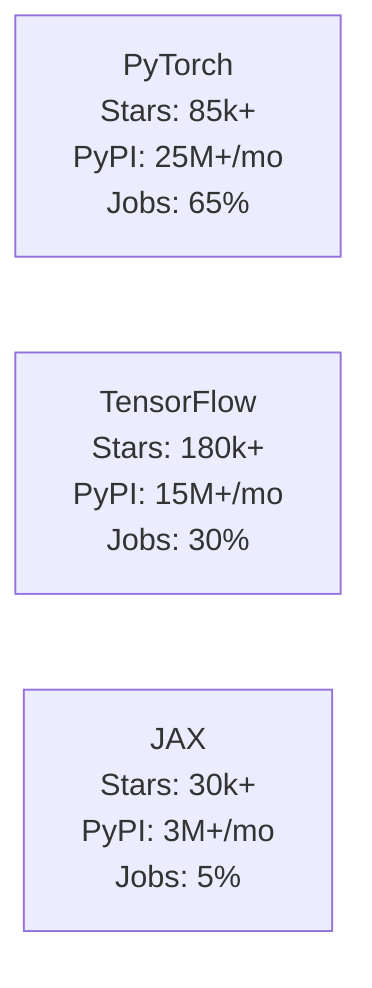
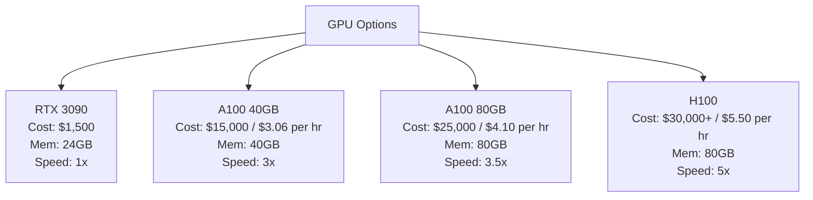
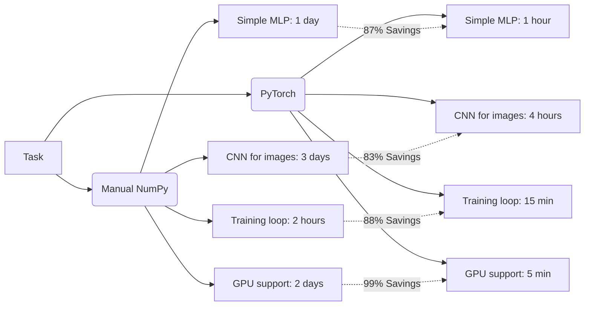
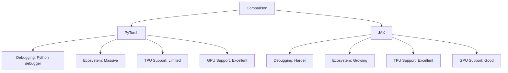

## Why This Module Matters

In late 2021, real estate giant Zillow announced it was abruptly shutting down its iBuying division, Zillow Offers. The algorithmic failure resulted in a massive $500 million write-down and the layoff of 25% of the company's workforce. The culprit was a machine learning model that failed to accurately predict housing prices during the unpredictable macroeconomic shifts of the pandemic. Their neural networks were deployed with immense financial leverage, yet they exhibited fragile behaviors when real-world data drifted from the distributions they had been trained on. When algorithms govern hundreds of millions of dollars in capital, understanding exactly how they are trained, optimized, and debugged is not a theoretical luxury—it is a critical necessity for engineering survival.

Similarly, consider the "Million-Dollar Gradient Explosion" incident in November 2021. A San Francisco fintech startup woke up at 3:47 AM to discover their primary deep learning trading model producing garbage predictions. Customer trades were being incorrectly rejected, and automated losses mounted to $1.2 million. After four frantic hours of system diagnostics, the root cause was discovered: a junior engineer had "optimized" the training script by deleting a single line of code that zeroed the model's gradients. Without it, the gradients accumulated over 10,000 backward passes, exploding to infinity, converting to NaNs, and corrupting the entire network's mathematical structure. The fix took one line. The outage cost a fortune. 

Training neural networks is a discipline fraught with these invisible cliffs. You are building systems that learn complex representations of the world, and minor misconfigurations in gradient flows, data types, or device assignments can silently devastate model performance. This module bridges the gap between theoretical calculus and production-grade engineering, introducing you to the power of modern dynamic computational graphs.

## What You'll Be Able to Do

By the end of this module, you will be able to:
- **Design** complex neural network architectures using the `nn.Module` paradigm and its component layers.
- **Implement** rigorous, end-to-end training and evaluation loops optimized for GPU memory constraints.
- **Diagnose** silent failures in gradient tracking, memory allocation, and tensor broadcasting.
- **Compare** the performance characteristics and syntactic elegance of dynamic computational graphs against manual backpropagation.

## Section 1: The Framework Wars and the Shift to Dynamic Graphs

In 2015, Google released TensorFlow. It was immensely powerful, backed by Google's engineering resources, and quickly became the dominant deep learning framework. However, researchers ran into a severe bottleneck: the framework relied heavily on static computational graphs. 

Under the static graph paradigm, you were forced to define your entire computation abstractly, compile it into an immutable structure, and then push data through it using a dedicated session. It felt less like programming and more like writing an arcane configuration file.

```python
# TensorFlow 1.x - The pain was real
import tensorflow as tf

# Step 1: Define placeholders (not real data yet!)
x = tf.placeholder(tf.float32, shape=[None, 784])
y = tf.placeholder(tf.float32, shape=[None, 10])

# Step 2: Build the graph (nothing runs!)
W = tf.Variable(tf.zeros([784, 10]))
logits = tf.matmul(x, W)

# Step 3: Create a session
with tf.Session() as sess:
    sess.run(tf.global_variables_initializer())  # Initialize
    result = sess.run(logits, feed_dict={x: data})  # Finally run!
```

Debugging this system was notorious. You could not simply insert a print statement to inspect a variable, because the variable did not hold a value until the session was actively running. 

In response to this friction, Soumith Chintala and Adam Paszke at Facebook AI Research created PyTorch in 2016. They introduced a radical counter-philosophy: **define-by-run**. Instead of pre-compiling a static graph, PyTorch constructs the computational graph dynamically as your standard Python code executes. 

```python
# PyTorch - The relief was immediate
import torch

x = torch.randn(32, 784)  # This creates actual data!
W = torch.randn(784, 10, requires_grad=True)

logits = x @ W  # This actually computes the result!
print(logits.shape)  # You can just print it!
```

This flexibility caused PyTorch to aggressively take over the research landscape. By 2019, it was the framework of choice for the vast majority of academic publications.

| Framework | GitHub Stars | PyPI Downloads/Month | Job Postings |
|-----------|-------------|---------------------|--------------|
| PyTorch | 85,000+ | 25M+ | 65% |
| TensorFlow | 180,000+ | 15M+ | 30% |
| JAX | 30,000+ | 3M+ | 5% |

We can visualize this industry dominance via the following framework ecosystem graph:



## Section 2: Tensors - The Universal Container

A tensor is essentially a multi-dimensional array. While the concept is mathematically straightforward, tensors act as the universal data container in deep learning. An image, a time-series audio file, or a massive block of text must all be converted into numerical tensors before a neural network can process them.

| Dimensions | Math Name | Real Example | Shape |
|------------|-----------|--------------|-------|
| 0 | Scalar | The temperature right now: 72.5°F | `[]` |
| 1 | Vector | Today's hourly temperatures: [68, 70, 72, 75, 73] | `[5]` |
| 2 | Matrix | A grayscale image with pixel values | `[28, 28]` |
| 3 | 3D Tensor | A color image (RGB channels × height × width) | `[3, 224, 224]` |
| 4 | 4D Tensor | A batch of color images | `[32, 3, 224, 224]` |
| 5 | 5D Tensor | A batch of video clips (batch × frames × channels × H × W) | `[8, 16, 3, 224, 224]` |

The hierarchy of tensor dimensionality can be mapped out logically:

```mermaid
graph TD
    A[0D: Scalar<br>Temperature 72.5°F<br>Shape: `[]`] --> B[1D: Vector<br>Hourly Temps<br>Shape: `[5]`]
    B --> C[2D: Matrix<br>Grayscale Image<br>Shape: `[28, 28]`]
    C --> D[3D: Tensor<br>Color Image<br>Shape: `[3, 224, 224]`]
    D --> E[4D: Tensor<br>Batch of Images<br>Shape: `[32, 3, 224, 224]`]
    E --> F[5D: Tensor<br>Batch of Video Clips<br>Shape: `[8, 16, 3, 224, 224]`]
```

### Why Use Tensors Over Standard Arrays?

You might wonder why we need a specialized tensor library when Python already has NumPy. The answer lies in automatic differentiation and hardware acceleration. NumPy excels at computation, but it has no native mechanism for tracking the gradients necessary for backpropagation. 

```python
# NumPy: Just computation
import numpy as np
x = np.array([2.0, 3.0])
y = x ** 2  # [4, 9]
# Now compute dy/dx manually? Good luck!

# PyTorch: Computation + gradient tracking
import torch
x = torch.tensor([2.0, 3.0], requires_grad=True)
y = (x ** 2).sum()  # 13
y.backward()        # Compute gradients automatically
print(x.grad)       # tensor([4., 6.]) - that's dy/dx = 2x!
```

Furthermore, PyTorch tensors natively interface with hardware accelerators. Moving a matrix from system RAM to a dedicated GPU is trivial:

```python
# CPU tensor
x = torch.randn(1000, 1000)

# GPU tensor - one line!
x_gpu = x.cuda()  # or x.to('cuda')
```

### Instantiating Tensors

You will routinely create tensors from raw data structures:

```python
import torch

# From a simple list
x = torch.tensor([1, 2, 3, 4, 5])
print(x)  # tensor([1, 2, 3, 4, 5])

# From nested lists (creates a matrix)
matrix = torch.tensor([[1, 2, 3],
                       [4, 5, 6]])
print(matrix.shape)  # torch.Size([2, 3])
```

However, deep learning largely revolves around initializing arrays dynamically based on specific probability distributions:

```python
# Zeros and ones - common for initialization
zeros = torch.zeros(3, 4)       # 3×4 matrix of zeros
ones = torch.ones(2, 3, 4)      # 2×3×4 tensor of ones

# Random values - essential for weight initialization
uniform = torch.rand(5, 5)      # Uniform between [0, 1)
normal = torch.randn(5, 5)      # Normal distribution (mean=0, std=1)

# Sequences - useful for indices and positions
sequence = torch.arange(0, 10, 2)    # [0, 2, 4, 6, 8]
linspace = torch.linspace(0, 1, 5)   # [0.0, 0.25, 0.5, 0.75, 1.0]

# Identity matrix - useful in linear algebra
identity = torch.eye(4)  # 4×4 identity matrix
```

When building layers, you frequently need to generate a new tensor that perfectly matches the dimensions of an incoming tensor:

```python
x = torch.randn(3, 4, 5)

# Create zeros/ones with the same shape, dtype, and device
zeros_like_x = torch.zeros_like(x)
ones_like_x = torch.ones_like(x)
random_like_x = torch.randn_like(x)
```

### Investigating Tensor Metadata

You must always monitor the metadata assigned to your tensors. A massive percentage of debugging involves tracing shape misalignments.

```python
t = torch.randn(3, 4, 5)

# Shape: The dimensions of the tensor
print(t.shape)      # torch.Size([3, 4, 5])
print(t.size())     # Same thing, method form

# Data type: What kind of numbers
print(t.dtype)      # torch.float32 (default for randn)

# Device: Where the tensor lives
print(t.device)     # cpu (or cuda:0, cuda:1, etc.)

# Number of dimensions
print(t.ndim)       # 3

# Total number of elements
print(t.numel())    # 60 (3 × 4 × 5)
```

> **Stop and think**: If a tensor has the shape `[32, 3, 224, 224]`, what does each specific dimension represent in a standard image classification task? Why are there exactly four dimensions instead of three?

### Deep Dive: Data Types Matter

The precision of your tensors directly dictates memory consumption. Using standard 32-bit floats is standard, but you must be precise with your initializations.

```python
# Creating tensors with specific types
weights = torch.randn(100, 100, dtype=torch.float32)
indices = torch.tensor([0, 5, 3, 7], dtype=torch.long)
image = torch.randint(0, 256, (3, 224, 224), dtype=torch.uint8)

# Converting between types
weights_half = weights.half()      # to float16
weights_back = weights_half.float()  # back to float32
```

The introduction of automatic mixed precision allows the network to dynamically drop down to 16-bit precision where safe, drastically accelerating training speeds while halving memory overhead:

```python
# Modern training uses automatic mixed precision
with torch.cuda.amp.autocast():
    output = model(input)  # Automatically uses fp16 where safe
```

PyTorch and NumPy share a foundational memory bridge. You can convert between them seamlessly without triggering heavy memory copying operations, provided they exist on the CPU:

```python
import numpy as np

# NumPy → PyTorch (shared memory!)
numpy_array = np.array([1, 2, 3, 4, 5])
tensor = torch.from_numpy(numpy_array)

# They share memory - changes propagate!
numpy_array[0] = 100
print(tensor)  # tensor([100, 2, 3, 4, 5]) - changed too!

# If you want a copy instead:
tensor_copy = torch.tensor(numpy_array)  # Independent copy

# PyTorch → NumPy
tensor = torch.randn(3, 4)
numpy_array = tensor.numpy()  # Shared memory (if on CPU)

# Safe conversion (handles GPU tensors too)
numpy_array = tensor.detach().cpu().numpy()
```

## Section 3: Autograd - The Magic Behind Deep Learning

Manual backpropagation involves meticulously calculating partial derivatives via the chain rule. PyTorch automates this via Autograd, an engine that maps out the history of every operation applied to a tensor.

### The Computational Graph

When a tensor is created with `requires_grad=True`, it signals PyTorch to begin constructing a directed acyclic graph of mathematical operations. 

```python
# Create a tensor that tracks gradients
x = torch.tensor([2.0, 3.0], requires_grad=True)

# Perform operations - PyTorch records them!
y = x ** 2        # y = [4, 9]
z = y.sum()       # z = 13

# Compute gradients
z.backward()

# Gradients are stored in .grad
print(x.grad)     # tensor([4., 6.])
```

Instead of tracking complex internal caches, all calculations are hidden behind a single method call:

```python
loss.backward()  # That's it. Gradients for every parameter.
```

When computational complexity increases, the chain rule executes identically without developer intervention:

```python
x = torch.tensor([1.0, 2.0, 3.0], requires_grad=True)

# Complex computation with multiple steps
y = x * 2          # y = [2, 4, 6]
z = y ** 2         # z = [4, 16, 36]
loss = z.mean()    # loss = 56/3 ≈ 18.67

# One backward call - all gradients computed!
loss.backward()

print(x.grad)  # tensor([2.6667, 5.3333, 8.0000])
```

### The Gradient Accumulation Trap

PyTorch gradients accumulate by default. If you call `.backward()` multiple times in sequence, the new gradients are added to the existing ones rather than overwriting them. 

```python
x = torch.tensor([1.0], requires_grad=True)

y = x * 2
y.backward()
print(x.grad)  # tensor([2.])

y = x * 3
y.backward()
print(x.grad)  # tensor([5.]) - Not 3! It's 2 + 3!
```

> **Pause and predict**: Look at the gradient accumulation snippet above. If we ran `y.backward()` a third time with `y = x * 5`, what would the exact numerical value of `x.grad` be? 

To prevent catastrophic gradient explosions across epochs, you must explicitly zero out the accumulated buffers:

```python
x.grad.zero_()  # Zero out accumulated gradients
y = x * 4
y.backward()
print(x.grad)  # tensor([4.]) - Fresh gradient
```

When evaluating a model, you do not want PyTorch allocating memory to track gradients. You must detach the tensor from the computational graph:

```python
x = torch.tensor([2.0], requires_grad=True)
y = x ** 2

# Detach: Creates a new tensor, no gradient tracking
z = y.detach()
print(z.requires_grad)  # False

# Or use no_grad context
with torch.no_grad():
    z = y * 2
    print(z.requires_grad)  # False
```

### Did You Know? The Secret History of Automatic Differentiation
Automatic differentiation was not invented for modern deep learning. The reverse-mode automatic differentiation algorithm that powers PyTorch's Autograd engine was actually published by Seppo Linnainmaa in 1970 as part of his master's thesis for tracking rounding errors in computational physics. Backpropagation in neural networks is simply this 1970 algorithm applied natively to the matrix multiplication graphs of deep learning models.

## Section 4: Building Neural Networks with nn.Module

The `torch.nn` module provides an object-oriented paradigm for constructing complex architectures. Every network must inherit from `nn.Module`.

```python
import torch.nn as nn

class SimpleNetwork(nn.Module):
    def __init__(self, input_size, hidden_size, output_size):
        super().__init__()  # Always call this first!

        # Define layers (registered automatically!)
        self.fc1 = nn.Linear(input_size, hidden_size)
        self.fc2 = nn.Linear(hidden_size, output_size)
        self.relu = nn.ReLU()

    def forward(self, x):
        # Define how data flows through the network
        x = self.fc1(x)
        x = self.relu(x)
        x = self.fc2(x)
        return x

# Create the network
model = SimpleNetwork(784, 128, 10)

# Forward pass - just call the model!
x = torch.randn(32, 784)  # Batch of 32 images
output = model(x)         # Calls forward() automatically
print(output.shape)       # torch.Size([32, 10])
```

Layers instantiated inside `__init__` are automatically registered as parameters. The `nn.Linear` layer represents standard dense connectivity:

```python
# Linear: y = xW^T + b
layer = nn.Linear(in_features=784, out_features=128)

# What it creates internally:
# - weight: [128, 784] matrix
# - bias: [128] vector (optional, bias=True by default)
```

Non-linear activation functions destroy the linearity of the mathematical transformations, allowing the network to approximate complex curves:

```python
# As modules (use in __init__)
nn.ReLU()           # max(0, x) - most common
nn.LeakyReLU(0.01)  # Allows small negative values
nn.GELU()           # Used in transformers (smoother than ReLU)
nn.Sigmoid()        # Squashes to [0, 1]
nn.Tanh()           # Squashes to [-1, 1]

# As functions (use in forward)
import torch.nn.functional as F
output = F.relu(x)
output = F.gelu(x)
```

We also integrate normalizers and dropout layers for training stability and regularization:

```python
nn.BatchNorm1d(num_features)  # Normalize across batch
nn.LayerNorm(normalized_shape)  # Normalize across features (transformers)
```

```python
nn.Dropout(p=0.5)  # 50% of elements set to zero during training
```

For strictly linear feed-forward architectures, the `nn.Sequential` wrapper bypasses the need for custom classes:

```python
model = nn.Sequential(
    nn.Linear(784, 256),
    nn.ReLU(),
    nn.Dropout(0.2),
    nn.Linear(256, 128),
    nn.ReLU(),
    nn.Dropout(0.2),
    nn.Linear(128, 10)
)

# Works exactly like a custom nn.Module
output = model(input)
```

You can introspect the parameter count and architecture hierarchy natively:

```python
model = SimpleNetwork(784, 128, 10)

# Print model structure
print(model)
# SimpleNetwork(
#   (fc1): Linear(in_features=784, out_features=128, bias=True)
#   (fc2): Linear(in_features=128, out_features=10, bias=True)
#   (relu): ReLU()
# )

# List all parameters with names
for name, param in model.named_parameters():
    print(f"{name}: {param.shape}")
# fc1.weight: torch.Size([128, 784])
# fc1.bias: torch.Size([128])
# fc2.weight: torch.Size([10, 128])
# fc2.bias: torch.Size([10])

# Count total parameters
total = sum(p.numel() for p in model.parameters())
print(f"Total parameters: {total:,}")  # 101,770
```

## Section 5: The Training Loop and Optimization

To evaluate network convergence, you must establish a loss criterion. For categorical predictions, Cross-Entropy dominates:

```python
# Cross-entropy loss - the workhorse of classification
criterion = nn.CrossEntropyLoss()

# It expects:
# - Input: Raw logits (NOT softmaxed!)  Shape: [batch, num_classes]
# - Target: Class indices (NOT one-hot!)  Shape: [batch]

logits = torch.randn(32, 10)          # Raw network output
labels = torch.randint(0, 10, (32,))  # Class labels 0-9
loss = criterion(logits, labels)
```

For continuous regression predictions:

```python
criterion = nn.MSELoss()   # Mean squared error
criterion = nn.L1Loss()    # Mean absolute error
```

Optimizers ingest the gradients generated by the loss and systematically update the model's registered parameters:

```python
import torch.optim as optim

# SGD: Simple, but needs tuning
optimizer = optim.SGD(model.parameters(), lr=0.01, momentum=0.9)

# Adam: Usually works well out of the box
optimizer = optim.Adam(model.parameters(), lr=0.001)

# AdamW: Adam with proper weight decay (recommended for transformers)
optimizer = optim.AdamW(model.parameters(), lr=0.001, weight_decay=0.01)
```

### Did You Know? The Adam Story
The Adam optimizer was published in 2014, fusing Momentum scaling with the adaptive learning rates of RMSprop. However, researchers discovered a subtle but mathematically severe flaw in how Adam applied weight decay for regularization. In 2017, the AdamW variant was introduced to explicitly decouple weight decay from the gradient update formula, instantly resulting in massively improved generalization across all major Transformer architectures.

The fundamental structure of the training loop is absolute. You will write this sequence hundreds of times:

```python
model = SimpleNetwork(784, 128, 10)
criterion = nn.CrossEntropyLoss()
optimizer = optim.Adam(model.parameters(), lr=0.001)

for epoch in range(num_epochs):
    model.train()  # Enable training mode (dropout, batchnorm behave differently)

    for batch_idx, (data, labels) in enumerate(train_loader):
        # 1. Zero gradients from previous batch
        optimizer.zero_grad()

        # 2. Forward pass
        outputs = model(data)

        # 3. Compute loss
        loss = criterion(outputs, labels)

        # 4. Backward pass (compute gradients)
        loss.backward()

        # 5. Update weights
        optimizer.step()

        if batch_idx % 100 == 0:
            print(f"Epoch {epoch}, Batch {batch_idx}, Loss: {loss.item():.4f}")
```

During validation sweeps, gradients are unnecessary and structural layers like dropout must be disabled:

```python
model.eval()  # Evaluation mode

correct = 0
total = 0

with torch.no_grad():  # Don't compute gradients
    for data, labels in test_loader:
        outputs = model(data)
        _, predicted = outputs.max(1)  # Get predicted class
        total += labels.size(0)
        correct += (predicted == labels).sum().item()

accuracy = 100 * correct / total
print(f"Accuracy: {accuracy:.2f}%")
```

## Section 6: GPU Computing

Hardware acceleration shifts matrix multiplications from the CPU to thousands of parallel GPU cores. 

```python
# Check if CUDA (GPU) is available
if torch.cuda.is_available():
    print(f"GPU: {torch.cuda.get_device_name(0)}")
    print(f"GPU Count: {torch.cuda.device_count()}")
else:
    print("No GPU available, using CPU")

# The standard pattern: create a device variable
device = torch.device("cuda" if torch.cuda.is_available() else "cpu")

# Move tensors
x = torch.randn(1000, 1000)
x_gpu = x.to(device)

# Move models (moves all parameters)
model = SimpleNetwork(784, 128, 10).to(device)

# Create tensors directly on GPU
y = torch.randn(1000, 1000, device=device)
```

The training loop adjusts minimally; you merely port the raw input tensors to the target device prior to execution:

```python
device = torch.device("cuda" if torch.cuda.is_available() else "cpu")

model = SimpleNetwork(784, 128, 10).to(device)
criterion = nn.CrossEntropyLoss()
optimizer = optim.Adam(model.parameters(), lr=0.001)

for epoch in range(num_epochs):
    for data, labels in train_loader:
        # Move data to GPU
        data = data.to(device)
        labels = labels.to(device)

        optimizer.zero_grad()
        outputs = model(data)
        loss = criterion(outputs, labels)
        loss.backward()
        optimizer.step()
```

### Deep Dive: GPU Memory Gotchas

GPU VRAM is aggressively limited. Accidental memory leakage will crash your application entirely.

```python
# BAD - keeps entire computation graph!
losses = []
for batch in loader:
    loss = criterion(model(batch), labels)
    losses.append(loss)  # Full tensor with gradient graph!

# GOOD - just keep the number
losses = []
for batch in loader:
    loss = criterion(model(batch), labels)
    losses.append(loss.item())  # Just the Python float
```

The exact same concept applies when computing intermediate performance metrics:

```python
# BAD - builds computation graph unnecessarily
accuracy = (model(data).argmax(1) == labels).float().mean()

# GOOD - no gradient tracking needed
with torch.no_grad():
    accuracy = (model(data).argmax(1) == labels).float().mean()
```

You can programmatically audit your VRAM ceilings at any time:

```python
print(f"Allocated: {torch.cuda.memory_allocated() / 1e9:.2f} GB")
print(f"Reserved: {torch.cuda.memory_reserved() / 1e9:.2f} GB")
```

Understanding cloud economics is critical when renting these specific hardware accelerators:

| GPU | Purchase Cost | Cloud Cost (AWS) | Memory | Speed |
|-----|--------------|------------------|--------|-------|
| RTX 3090 | $1,500 | - | 24GB | 1x |
| A100 40GB | $15,000 | $3.06/hr | 40GB | 3x |
| A100 80GB | $25,000 | $4.10/hr | 80GB | 3.5x |
| H100 | $30,000+ | $5.50/hr | 80GB | 5x |



## Section 7: Data Loading and Checkpointing

PyTorch handles all data batching and background threading natively.

```python
from torch.utils.data import DataLoader, TensorDataset

# Create a dataset from tensors
X = torch.randn(1000, 784)
y = torch.randint(0, 10, (1000,))
dataset = TensorDataset(X, y)

# Create a data loader
loader = DataLoader(
    dataset,
    batch_size=32,       # Samples per batch
    shuffle=True,        # Shuffle each epoch (for training)
    num_workers=4,       # Parallel data loading processes
    pin_memory=True      # Faster GPU transfer
)

# Iterate
for batch_x, batch_y in loader:
    print(batch_x.shape, batch_y.shape)  # [32, 784], [32]
```

You can pull heavily standardized academic datasets directly through the ecosystem:

```python
from torchvision import datasets, transforms

# Define preprocessing
transform = transforms.Compose([
    transforms.ToTensor(),              # PIL Image → Tensor
    transforms.Normalize((0.1307,), (0.3081,))  # MNIST mean/std
])

# Load MNIST
train_data = datasets.MNIST('./data', train=True, download=True, transform=transform)
test_data = datasets.MNIST('./data', train=False, download=True, transform=transform)

# Create loaders
train_loader = DataLoader(train_data, batch_size=64, shuffle=True)
test_loader = DataLoader(test_data, batch_size=1000)
```

Serializing models ensures you do not lose hundreds of hours of compute time:

```python
# Save just the weights (recommended)
torch.save(model.state_dict(), 'model_weights.pth')

# Load
model = SimpleNetwork(784, 128, 10)  # Create architecture first
model.load_state_dict(torch.load('model_weights.pth'))
model.eval()  # Set to evaluation mode
```

Checkpoints should contain multi-variable state mappings:

```python
# Save checkpoint
checkpoint = {
    'epoch': epoch,
    'model_state_dict': model.state_dict(),
    'optimizer_state_dict': optimizer.state_dict(),
    'loss': loss,
}
torch.save(checkpoint, 'checkpoint.pth')

# Load checkpoint
checkpoint = torch.load('checkpoint.pth')
model.load_state_dict(checkpoint['model_state_dict'])
optimizer.load_state_dict(checkpoint['optimizer_state_dict'])
start_epoch = checkpoint['epoch']
```

### Did You Know? The .pth Security Risk
PyTorch saves model artifacts using standard Python pickling architectures. Because `pickle` can embed arbitrary code inside a payload, a loaded model can silently execute catastrophic shell commands on your host machine. 
```python
# This could run malicious code!
model = torch.load('untrusted_model.pth')  # Dangerous!
```
Never load untrusted `.pth` weights directly. Modern pipelines are shifting to the `safetensors` format, which strips all executable payloads to guarantee pure numerical loading.

## Section 8: The Productivity Multiplier

Let's evaluate the fundamental shift from manual programming to PyTorch operations.

```python
# Forward pass - tracking everything manually
def forward(self, X):
    self.cache = {'A0': X}
    A = X
    for l in range(1, len(self.layer_dims)):
        Z = self.params[f'W{l}'] @ A + self.params[f'b{l}']
        A = self.activation_fn(Z)
        self.cache[f'A{l}'] = A
    return A

# Backward pass - chain rule by hand
def backward(self, Y):
    m = Y.shape[1]
    dA = -(Y / self.cache[f'A{L}'])

    for l in reversed(range(1, L + 1)):
        dZ = dA * self.activation_derivative(self.cache[f'A{l}'])
        self.grads[f'dW{l}'] = (1/m) * dZ @ self.cache[f'A{l-1}'].T
        self.grads[f'db{l}'] = (1/m) * np.sum(dZ, axis=1, keepdims=True)
        dA = self.params[f'W{l}'].T @ dZ
```

Versus PyTorch elegance:

```python
class Network(nn.Module):
    def __init__(self, input_size, hidden_size, output_size):
        super().__init__()
        self.fc1 = nn.Linear(input_size, hidden_size)
        self.fc2 = nn.Linear(hidden_size, output_size)

    def forward(self, x):
        x = F.relu(self.fc1(x))
        return self.fc2(x)

# Training - all the complexity hidden
outputs = model(inputs)
loss = criterion(outputs, labels)
loss.backward()  # All gradients computed!
optimizer.step()  # All weights updated!
```

This productivity multiplier is directly quantifiable across standard engineering operations:

| Task | Manual NumPy | PyTorch | Savings |
|------|-------------|---------|---------|
| Simple MLP | 1 day | 1 hour | 87% |
| CNN for images | 3 days | 4 hours | 83% |
| LSTM/Transformer | 1 week | 1 day | 86% |
| Training loop | 2 hours | 15 min | 88% |
| GPU support | 1-2 days | 5 min | 99% |



### The Key Insight
```python
# Module 26: Dozens of lines of careful gradient computation
# PyTorch:
loss.backward()
```

### Industry Context: The JAX Challenger

While PyTorch is the definitive leader, Google's JAX library heavily focuses on functional transformations rather than stateful modules. 

```python
# JAX: Transform functions, not tensors
import jax
import jax.numpy as jnp

def loss_fn(params, x, y):
    predictions = predict(params, x)
    return jnp.mean((predictions - y) ** 2)

# Get gradient function by transforming loss_fn
grad_fn = jax.grad(loss_fn)
gradients = grad_fn(params, x, y)
```

| Aspect | PyTorch | JAX |
|--------|---------|-----|
| Debugging | Python debugger works | Harder (functional transforms) |
| Ecosystem | Massive (HuggingFace, etc.) | Growing |
| TPU support | Exists but limited | Excellent (Google's TPUs) |
| GPU support | Excellent | Good |
| Learning curve | Moderate | Steep |
| Production tooling | TorchServe, ONNX | Less mature |



### Did You Know? The Future: torch.compile()
In 2022, PyTorch 2.0 shipped with a revolutionary compiler engine allowing teams to maintain their dynamic, fully debuggable python codebase during research, but seamlessly compile it down into a highly optimized static graph for deployment speeds exceeding 200%.
```python
model = MyModel()
model = torch.compile(model)  # That's it!
```

To support cross-platform inferences, PyTorch exports natively into the Open Neural Network Exchange (ONNX) format:

```python
# Export to ONNX
dummy_input = torch.randn(1, 3, 224, 224)
torch.onnx.export(model, dummy_input, "model.onnx")

# Run in ONNX Runtime (optimized for production)
import onnxruntime as ort
session = ort.InferenceSession("model.onnx")
output = session.run(None, {"input": numpy_input})
```

## Common Mistakes and How to Avoid Them

| Mistake | Why It Destroys Performance | Fix |
|---------|-----------------------------|-----|
| Forgetting `model.eval()` | Leaves Dropout active and applies batch-specific BatchNorm statistics during inference, creating massive prediction degradation. | Always call `model.eval()` before validation loops and `model.train()` when returning to training. |
| In-Place Tensor Operations | Modifying tensors with trailing underscore functions destroys intermediate mathematical values Autograd needs for backpropagation calculation. | Utilize out-of-place operations exclusively when dealing with graph-tracked tensors. |
| The Wrong Loss Objective | Using `MSELoss` for categorical classification tasks is mathematically unstable as it assumes continuous targets. | Enforce `CrossEntropyLoss` for discrete class categorizations. |
| Hardware Device Mismatch | Computations cannot traverse the PCIe bus automatically. Weight tensors on GPU and input tensors on CPU will critically crash the environment. | Explicitly apply `.to(device)` checks against all inputs prior to triggering model inferences. |
| Raw Python Layer Lists | Utilizing standard lists causes `nn.Module` to ignore internal layer parameters, removing them entirely from optimization scope. | Register sequentially indexed dynamic layers exclusively via PyTorch's `nn.ModuleList`. |
| Ignoring Gradient Resets | Gradients accumulate endlessly. Failing to zero them results in an explosive combination of all historical graph operations, usually generating immediate NaNs. | Declare `optimizer.zero_grad()` prior to every single model forward pass. |
| Caching Entire Graphs | Appending full tensor logs inside reporting arrays leaks massive VRAM footprint trees over epochs. | Append `loss.item()` to retrieve standard disconnected scalars instead of active tensor elements. |
| Double Softmaxing Outputs | PyTorch's `CrossEntropyLoss` function automatically applies the softmax distribution. Calling it explicitly creates log-space instability. | Return raw, unnormalized logits straight out of the network's terminal layer. |

Reference the exact syntax errors generated by these mistakes below:

```python
# Mistake #1
#  WRONG - dropout and batchnorm are still in training mode!
model.load_state_dict(torch.load('model.pth'))
predictions = model(test_data)  # Results will be wrong!

#  CORRECT - always switch to eval mode for inference
model.load_state_dict(torch.load('model.pth'))
model.eval()  # Critical!
with torch.no_grad():
    predictions = model(test_data)
```

```python
# Mistake #2
#  WRONG - in-place operations can break gradient computation
x = torch.tensor([1.0, 2.0], requires_grad=True)
y = x.relu_()  # In-place operation (notice the underscore)
z = y.sum()
z.backward()  # RuntimeError: gradient computation requires non-inplace operations

#  CORRECT - use out-of-place operations
x = torch.tensor([1.0, 2.0], requires_grad=True)
y = x.relu()  # Out-of-place (returns new tensor)
z = y.sum()
z.backward()  # Works!
print(x.grad)  # tensor([1., 1.])
```

```python
# Mistake #3
#  WRONG - MSELoss for classification
criterion = nn.MSELoss()
loss = criterion(outputs, labels.float())  # Numerically unstable!

#  CORRECT - CrossEntropyLoss for classification
criterion = nn.CrossEntropyLoss()
loss = criterion(outputs, labels)  # Proper log-softmax handling
```

```python
# Mistake #4
#  WRONG - model on GPU, data on CPU
model = Model().cuda()
data = torch.randn(32, 784)  # On CPU by default!
output = model(data)  # RuntimeError: Input and parameter tensors are not on the same device

#  CORRECT - ensure everything is on the same device
device = torch.device('cuda' if torch.cuda.is_available() else 'cpu')
model = Model().to(device)
data = torch.randn(32, 784).to(device)
output = model(data)  # Works!
```

```python
# Mistake #5
#  WRONG - layers won't be registered as parameters!
class BadModel(nn.Module):
    def __init__(self):
        super().__init__()
        self.layers = [nn.Linear(10, 10) for _ in range(5)]  # Python list

# Check registered parameters:
model = BadModel()
print(list(model.parameters()))  # Empty! Layers aren't registered!

#  CORRECT - use nn.ModuleList
class GoodModel(nn.Module):
    def __init__(self):
        super().__init__()
        self.layers = nn.ModuleList([nn.Linear(10, 10) for _ in range(5)])

model = GoodModel()
print(len(list(model.parameters())))  # 10 (5 weights + 5 biases)
```

## Hands-On Exercise: Procedural Mastery

In this lab, you will progressively build, debug, and accelerate functional PyTorch workflows from start to finish.

### Step 1: Environment Preparation
Create your workspace and install PyTorch natively:
1. `mkdir pytorch-lab && cd pytorch-lab`
2. `python3 -m venv venv`
3. `source venv/bin/activate`
4. `pip install torch torchvision numpy`

### Step 2: Gradient Exploration
Create a file named `explore_gradients.py` and paste the following baseline code exactly:

```python
# Create tensors and compute gradients
import torch
x = torch.tensor([1.0, 2.0, 3.0], requires_grad=True)

# Try different operations and predict gradients before running:
# 1. y = x.sum() - what's x.grad?
# 2. y = (x ** 2).sum() - what's x.grad?
# 3. y = x.mean() - what's x.grad?
# 4. y = x.max() - what's x.grad? (hint: sparse!)

# Verify your predictions with backward() and print x.grad
```

**Action**: Add the backward calls independently, ensure you zero out the gradients (`x.grad.zero_()`) between tests, and print the gradients. 

<details>
<summary><strong>View Solution</strong></summary>

```python
import torch
x = torch.tensor([1.0, 2.0, 3.0], requires_grad=True)

# 1. Sum
y1 = x.sum()
y1.backward()
print("Sum grad:", x.grad) # tensor([1., 1., 1.])
x.grad.zero_()

# 2. Squared Sum
y2 = (x ** 2).sum()
y2.backward()
print("Squared grad:", x.grad) # tensor([2., 4., 6.])
x.grad.zero_()

# 3. Mean
y3 = x.mean()
y3.backward()
print("Mean grad:", x.grad) # tensor([0.3333, 0.3333, 0.3333])
x.grad.zero_()

# 4. Max
y4 = x.max()
y4.backward()
print("Max grad:", x.grad) # tensor([0., 0., 1.])
```
</details>

### Step 3: Build the MNIST Classifier
Create a file named `train_mnist.py`. Paste the following exact configuration payload:

```python
# Requirements:
# - 2-3 hidden layers
# - Dropout for regularization
# - Adam optimizer
# - CrossEntropyLoss
# - Training and validation loop
# - Achieve >98% accuracy

# Starter code:
import torch
import torch.nn as nn
import torch.optim as optim
from torchvision import datasets, transforms
from torch.utils.data import DataLoader

transform = transforms.Compose([
    transforms.ToTensor(),
    transforms.Normalize((0.1307,), (0.3081,))
])

train_data = datasets.MNIST('./data', train=True, download=True, transform=transform)
# ... complete the implementation
```

**Action**: Replace the comment with a full `nn.Module` class definition containing two dense layers. Instantiate your loss criterion and optimizer. Write a full `num_epochs` iteration loop implementing the core 5-step sequence (Zero, Forward, Loss, Backward, Step).

<details>
<summary><strong>View Solution</strong></summary>

```python
# Complete implementation
class Net(nn.Module):
    def __init__(self):
        super().__init__()
        self.fc1 = nn.Linear(784, 128)
        self.dropout = nn.Dropout(0.2)
        self.fc2 = nn.Linear(128, 10)
        self.relu = nn.ReLU()
        
    def forward(self, x):
        x = x.view(-1, 784) # Flatten image
        x = self.fc1(x)
        x = self.relu(x)
        x = self.dropout(x)
        x = self.fc2(x)
        return x

model = Net()
criterion = nn.CrossEntropyLoss()
optimizer = optim.Adam(model.parameters(), lr=0.001)
train_loader = DataLoader(train_data, batch_size=64, shuffle=True)

model.train()
for epoch in range(1): # Reduced for quick testing
    for batch_idx, (data, labels) in enumerate(train_loader):
        optimizer.zero_grad()
        outputs = model(data)
        loss = criterion(outputs, labels)
        loss.backward()
        optimizer.step()
        if batch_idx % 100 == 0:
            print(f'Batch {batch_idx}, Loss: {loss.item():.4f}')
```
</details>

### Step 4: GPU Benchmarking
Create a file named `benchmark_gpu.py` containing the following framework code:

```python
import time
import torch

def benchmark(device, size=4096, iterations=100):
    x = torch.randn(size, size, device=device)
    y = torch.randn(size, size, device=device)

    # Warmup
    for _ in range(10):
        z = x @ y

    if device.type == 'cuda':
        torch.cuda.synchronize()

    start = time.time()
    for _ in range(iterations):
        z = x @ y

    if device.type == 'cuda':
        torch.cuda.synchronize()

    elapsed = time.time() - start
    return elapsed / iterations

# Compare and create a plot of speedup vs matrix size
```

**Action**: Add driver code at the bottom of the script that loops through matrix sizes `[1024, 2048, 4096]`. Invoke `benchmark()` for both 'cpu' and 'cuda' string references. Print out the ratio of the CPU time versus the CUDA time.

<details>
<summary><strong>View Solution</strong></summary>

```python
if __name__ == '__main__':
    sizes = [1024, 2048, 4096]
    for size in sizes:
        print(f"\nBenchmarking size: {size}x{size}")
        cpu_time = benchmark(torch.device('cpu'), size)
        print(f"CPU Time: {cpu_time:.5f}s")
        
        if torch.cuda.is_available():
            gpu_time = benchmark(torch.device('cuda'), size)
            speedup = cpu_time / gpu_time
            print(f"GPU Time: {gpu_time:.5f}s")
            print(f"GPU Speedup: {speedup:.2f}x")
        else:
            print("CUDA not available for comparison.")
```
</details>

### Step 5: Debugging Challenge
Create `debug_model.py`. Paste the deliberately broken training file:

```python
# This code has 5 bugs. Find and fix them all!
import torch
import torch.nn as nn
import torch.optim as optim

class BuggyModel(nn.Module):
    def __init__(self):
        # Bug 1: Missing something here
        self.layers = [nn.Linear(784, 128), nn.Linear(128, 10)]

    def forward(self, x):
        for layer in self.layers:
            x = layer(x)
        return x

model = BuggyModel()
criterion = nn.MSELoss()  # Bug 2: Wrong loss for classification
optimizer = optim.SGD(model.parameters(), lr=0.1)

for epoch in range(10):
    for data, labels in train_loader:
        # Bug 3: Missing something before forward pass
        outputs = model(data)
        loss = criterion(outputs, labels)  # Bug 4: labels need processing
        loss.backward()
        optimizer.step()

    # Bug 5: Evaluation without proper mode switching
    accuracy = (model(test_data).argmax(1) == test_labels).float().mean()
```

**Action**: Correct the five bugs. 
1. Missing `super().__init__()` and usage of standard Python lists.
2. Wrong objective criterion.
3. Gradient accumulation error.
4. Input flattening failures / label types.
5. Missing `eval()` and `no_grad()`.

<details>
<summary><strong>View Solution</strong></summary>

```python
import torch
import torch.nn as nn
import torch.optim as optim

class BuggyModel(nn.Module):
    def __init__(self):
        super().__init__() # Fix 1a: Added init
        self.layers = nn.ModuleList([nn.Linear(784, 128), nn.Linear(128, 10)]) # Fix 1b: Use ModuleList

    def forward(self, x):
        x = x.view(-1, 784) # Hidden fix to flatten data
        for layer in self.layers:
            x = layer(x)
        return x

model = BuggyModel()
criterion = nn.CrossEntropyLoss()  # Fix 2: Switched to classification loss
optimizer = optim.SGD(model.parameters(), lr=0.1)

for epoch in range(1):
    model.train() # Switch to train mode
    for data, labels in train_loader: # Assuming train_loader is defined from earlier
        optimizer.zero_grad() # Fix 3: Zero gradients!
        outputs = model(data)
        loss = criterion(outputs, labels) # Fix 4: Handled internally by CrossEntropy
        loss.backward()
        optimizer.step()

    # Fix 5: Switched to eval and no_grad
    model.eval()
    with torch.no_grad():
        accuracy = (model(data).argmax(1) == labels).float().mean() # using dummy data here
```
</details>


## Knowledge Check Quiz

<details>
<summary><strong>Question 1:</strong> You deploy an NLP module that handles text inference. After passing several hundred batches without issue, the service hard-crashes citing severe Out of Memory (OOM) alerts. What specifically was omitted from the script?</summary>

**Answer**: 
The inference pipeline is missing the `with torch.no_grad():` wrapping directive. During a default inference loop, PyTorch automatically constructs dense computational graphs in the background so that `.backward()` calculations can fire. Without explicitly blocking gradient operations, the graph structures persist, eventually draining the system's VRAM entirely.
</details>

<details>
<summary><strong>Question 2:</strong> You instantiate a custom network architecture utilizing `self.my_layers = [nn.Linear(10, 10)]`. Upon initiating training, the model’s loss remains permanently stationary, and `model.parameters()` appears empty. Why did the network fail to train?</summary>

**Answer**: 
Standard Python lists intentionally bypass the framework's strict module introspection checks. PyTorch cannot discover, register, or forward tensor variables into optimization if layers are hidden inside a native list element. The layer must be encapsulated within a `nn.ModuleList` array to expose its internal weights to the `optim` engine.
</details>

<details>
<summary><strong>Question 3:</strong> During a binary classification task, you swap out `CrossEntropyLoss` for `MSELoss` because you only have two distinct categories. Why does your model training abruptly stall into a pattern of severe numerical volatility?</summary>

**Answer**: 
`MSELoss` measures strictly continuous errors over boundless domains, heavily penalizing deviations via squares. Probabilistic classification outcomes are rigorously bounded between 0 and 1. Attempting to fit categorical bounds using a continuous curve results in exponentially diminishing gradients as the values shift away from zero, generating sluggish and unstable performance outcomes.
</details>

<details>
<summary><strong>Question 4:</strong> You notice that your custom logging script, which appends `loss` records into a historical array per batch step, generates memory spikes that align exactly with your batch count progression. What specific mistake was made in your logging array?</summary>

**Answer**: 
You appended the active tensor output directly via `array.append(loss)` instead of invoking the extraction method `array.append(loss.item())`. Pushing an active tensor into a permanent Python array inherently anchors the exact massive computational tree responsible for formulating that tensor, completely severing garbage collection routines for thousands of parameters.
</details>

<details>
<summary><strong>Question 5:</strong> Immediately following epoch one, your training script generates output losses containing `NaN` properties, cascading failure throughout the network and crashing validation accuracy. What explicit training step sequence was ignored?</summary>

**Answer**: 
You forgot to clear out previous momentum calculations via `optimizer.zero_grad()`. By skipping this line, Autograd blindly combines the new backward pass gradients straight into the existing ones mathematically. As batches multiply, the scalar values inflate exponentially into infinity boundaries and then degrade into intractable Not-a-Number calculations.
</details>

<details>
<summary><strong>Question 6:</strong> You are evaluating test data accuracy inside a validation loop. The network's validation metrics fluctuate wildly every time you scan the identical set of input arrays. What method did you neglect to trigger on the model object?</summary>

**Answer**: 
The model was never switched into its internal state flag of `model.eval()`. Since the network still functionally operates as if it were training, its native `nn.Dropout` architectures are randomly severing variable neuron activations in the background. Enforcing the eval switch bypasses regularizing interference layers.
</details>

## Next Steps

You've mastered the mechanical foundations of modern deep learning, but you are currently training architectures against pristine, small-scale datasets like MNIST. What happens when your layers refuse to normalize properly across millions of real-world parameter vectors? 

In **Module 1.4: Training Deep Networks**, you will learn how to stabilize mathematically deep neural graphs utilizing advanced architectures including Batch Normalization frameworks, intensive weight initialization patterns, learning rate scheduling techniques, and sophisticated debugging strategies.