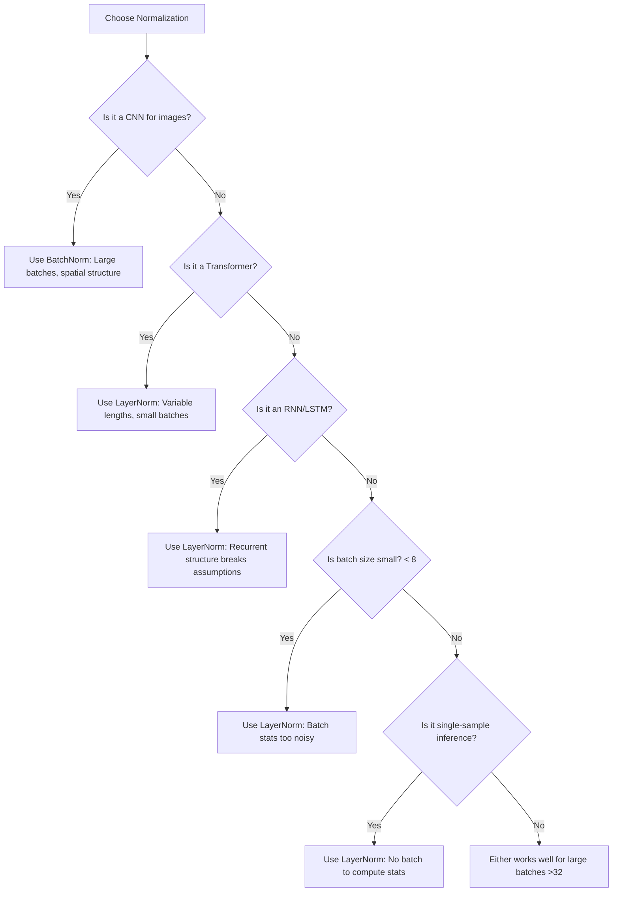
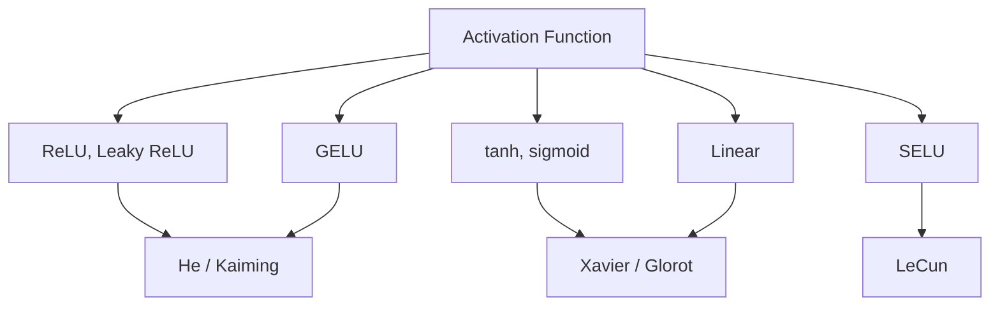
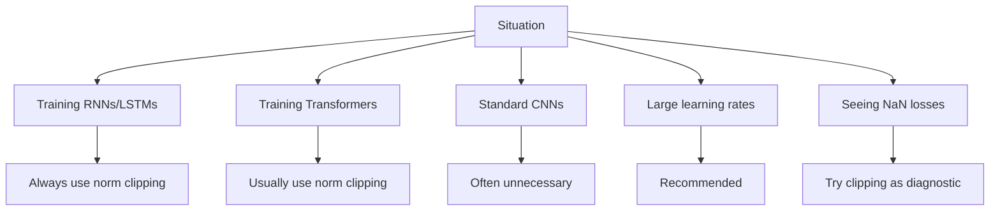
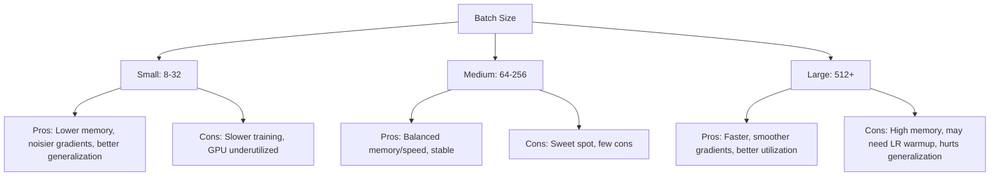
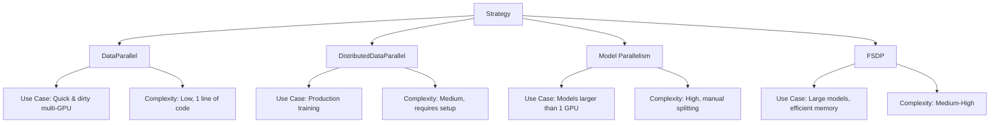

## What You Will Be Able to Do

By the end of this rigorous module, you will be prepared to:
- **Design** scalable Convolutional Neural Networks utilizing modern PyTorch 2.11 primitives and robust weight initialization schemes for image classification.
- **Diagnose** and **debug** vanishing or exploding gradient failures across deep architectures using numerical profiling, validation tracking, and gradient clipping constraints.
- **Implement** production-grade training pipelines featuring early stopping mechanisms, asynchronous checkpointing, and cosine annealing schedules.
- **Compare** and evaluate Batch Normalization versus Layer Normalization techniques across diverse Computer Vision datasets and memory-constrained batch sizes.
- **Evaluate** hardware-constrained Kubernetes `v1.35+` training environments to deploy mixed-precision strategies and programmatic gradient accumulation routines.

---

## Why This Module Matters

In 2021, the real estate giant Zillow announced it was shutting down its iBuying division, Zillow Offers, resulting in a staggering 500 million dollar write-down and the layoff of 25 percent of its workforce. While broader market volatility played a role, the fundamental root cause of the catastrophe was a failure in their algorithmic pricing models. Their neural networks, tasked with predicting home prices using computer vision on property photos alongside deep tabular data, suffered from catastrophic overfitting, silent training failures, and unchecked model drift. The models memorized historical data perfectly but failed to generalize when market dynamics shifted. 

Beyond algorithmic drift, structural pipeline failures carry immediate and devastating financial consequences. In a separate incident widely known across the industry as the "$2.3 Million Training Collapse", a prominent autonomous driving startup literally burned through 2.3 million dollars of allocated AWS GPU cluster time. A deep convolutional network processing LiDAR and optical streams encountered an unclipped exploding gradient during epoch 12 of a multi-week distributed run. The gradient silently overflowed into `NaN` (Not a Number) values, corrupting the model's weights. Because the engineering team failed to implement rigorous gradient clipping and programmatic checkpoint validation, the cluster spent weeks optimizing dead weights. The models hallucinated confidence, and the failure was completely undetected until the compute budget was permanently exhausted.

When engineering teams fail to implement rigorous deep learning practices—such as proper validation splits, early stopping, robust initialization, and disciplined learning rate scheduling—their models hallucinate confidence. A vanishing gradient in a deep vision model might cause it to completely ignore visual red flags in property photos, while an unclipped exploding gradient might silently corrupt a multi-day training checkpoint. These are not academic curiosities; they are billion-dollar engineering failures. This module bridges the gap between theoretical deep learning and production-grade Computer Vision engineering. We will cover the exact techniques used to train modern systems, from stabilizing early training with Kaiming initialization to navigating the modern PyTorch ecosystem. You will learn to construct models that are mathematically sound, computationally efficient, and financially safe to deploy.

---

## Section 1: The Dark Ages of Deep Learning and Foundational Datasets

Before modern normalization and initialization techniques were established, training networks deeper than a few layers was essentially impossible due to extreme numerical instability. Deep learning relies exclusively on backpropagation, which chains mathematical gradients together using the chain rule of calculus. 

> **Did You Know?** In 2006, Geoffrey Hinton published a paper called "A Fast Learning Algorithm for Deep Belief Nets" that kickstarted the deep learning revolution, though networks were only 3-4 layers deep.

### The Two Nightmares: Vanishing and Exploding Gradients

Imagine you are trying to pass a message through a chain of 100 people playing telephone. By the time the message reaches the last person, it is completely garbled. That is what happened to gradients in deep networks — they either exploded into infinity or vanished into nothing.

**Vanishing Gradients**: If your weights are initialized to small values (say, 0.5), multiplying them across many layers results in exponential decay. The gradient signal never reaches the early layers, halting learning entirely. Because floating point specifications have bounds, eventually the hardware rounds the microscopic gradient down to exactly zero. Once a gradient is zero, the model ceases to learn.
```text
0.5 × 0.5 × 0.5 × 0.5 × 0.5 × 0.5 × 0.5 × 0.5 × 0.5 × 0.5 = 0.001
```

**Exploding Gradients**: Conversely, if your weights are initialized to large values (say, 2.0), the gradients compound multiplicatively until they violently overflow the floating-point memory representation, resulting in catastrophic `NaN` (Not a Number) errors. The network's weights are immediately destroyed, rendering the entire tensor permanently invalid.
```text
2 × 2 × 2 × 2 × 2 × 2 × 2 × 2 × 2 × 2 = 1024
```

### The Historical Solutions (That Didn't Quite Work)

Before the modern techniques we will learn, researchers tried several approaches to solve vanishing/exploding gradients:
1. **Shallow Networks**: Just... don't go deep. Use 2-3 layers max.
2. **Careful Initialization**: Initialize weights to very specific static values.
3. **Layer-by-Layer Pre-training**: Train one layer at a time, then fine-tune (tedious!).
4. **Gradient Checking**: Manually verify gradients mathematically, which is painfully slow.

None of these scaled to the architectures we use today.

To combat these issues and benchmark architectural progress, the computer vision community relies on meticulously curated datasets. When validating new structural models, researchers must start with foundational datasets to prove mathematical viability before scaling to massive corpora. 

For instance, MNIST serves as the bedrock sanity check, featuring 60,000 training images and 10,000 test images of handwritten digits. Scaling up to natural imagery, CIFAR-10 has 60,000 32×32 color images in 10 classes (5,000 per class for train split distribution details), with 50,000 training images and 10,000 test images. Its more complex sibling, CIFAR-100 has 100 classes, with 500 training images and 100 test images per class. 

For highly complex scene understanding and object detection pipelines, COCO 2017 includes 80 object classes in active splits and has 118,287 train, 5,000 validation, and 40,670 test images. Engineering teams use these splits to verify that their architectures do not fall victim to gradient collapse before risking production data.

---

## Section 2: Normalization Techniques

The introduction of Batch Normalization fundamentally altered the trajectory of deep learning by dynamically re-centering and re-scaling layer inputs, thus preventing the cascading variations that lead to gradient collapse. 

> **Did You Know?** The BatchNorm paper has been cited over 60,000 times, making it one of the most influential papers in machine learning history.

### What BatchNorm Actually Does

During training, the distribution of each layer's inputs changes continuously as the parameters of the previous layers update. However, later research showed that BatchNorm smooths the overall loss landscape, making optimization significantly easier. Mechanically, BatchNorm forces the inputs of each layer to maintain a mean of zero and a standard deviation of one across the active mini-batch. By standardizing the inputs, the gradients flowed backwards uniformly without exponential decay or magnification.

```python
# The idea behind BatchNorm (simplified)
def batch_norm_simplified(x, gamma, beta, eps=1e-5):
    """
    x: input tensor of shape (batch_size, features)
    gamma: learnable scale parameter
    beta: learnable shift parameter
    """
    # Calculate statistics across the batch
    mean = x.mean(dim=0)  # Mean of each feature
    var = x.var(dim=0)    # Variance of each feature

    # Normalize
    x_norm = (x - mean) / torch.sqrt(var + eps)

    # Scale and shift (learnable!)
    return gamma * x_norm + beta
```

### The Learnable Parameters: gamma and beta

You might wonder: "If we normalize everything to mean 0 and std 1, aren't we removing information?" That is why BatchNorm includes two learnable parameters:
- **gamma (γ)**: scales the normalized values
- **beta (β)**: shifts them

If normalization strictly enforced a zero mean before a ReLU activation, half the data would be permanently erased (because ReLU destroys negative values). The network can learn to shift the beta parameter positively to preserve vital feature signals. 

### BatchNorm in PyTorch

Applying this mathematical regularization in PyTorch requires explicit modules depending on the data dimensionality:

```python
import torch
import torch.nn as nn

class NetworkWithBatchNorm(nn.Module):
    def __init__(self):
        super().__init__()
        self.layers = nn.Sequential(
            nn.Linear(784, 256),
            nn.BatchNorm1d(256),  # BatchNorm for 1D data (fully connected)
            nn.ReLU(),

            nn.Linear(256, 128),
            nn.BatchNorm1d(128),
            nn.ReLU(),

            nn.Linear(128, 10)
        )

    def forward(self, x):
        return self.layers(x)
```

For two-dimensional image data processed by spatial Convolutional Neural Networks, you must use the 2D variant to capture spatial distributions correctly over the height and width channels:

```python
class CNNWithBatchNorm(nn.Module):
    def __init__(self):
        super().__init__()
        self.features = nn.Sequential(
            nn.Conv2d(3, 64, kernel_size=3, padding=1),
            nn.BatchNorm2d(64),  # BatchNorm for 2D data (images)
            nn.ReLU(),

            nn.Conv2d(64, 128, kernel_size=3, padding=1),
            nn.BatchNorm2d(128),
            nn.ReLU(),
        )
```

### War Story: The BatchNorm Batch Size Bug

In 2019, a medical imaging startup spent weeks debugging a vision model that hit 99% accuracy in training but degraded to 10% in production. The root cause was the "BatchNorm Batch Size Bug". Hardware constraints forced them to use a batch size of 2 for extremely high-resolution MRI scans. Computing variance across a batch of 2 is statistically meaningless; it wildly fluctuated, essentially injecting massive, unrecoverable noise into the network. They were poisoning their own model at the architectural level.

### The Train/Eval Mode Gotcha

Because BatchNorm relies heavily on active batch statistics during training but must utilize frozen running statistics during inference, you must explicitly toggle the model's internal state. Failing to do this guarantees corrupted outputs.

```python
# Training
model.train()  # BatchNorm uses batch statistics
for batch in train_loader:
    outputs = model(batch)
    loss = criterion(outputs, targets)
    loss.backward()
    optimizer.step()

# Inference
model.eval()  # BatchNorm uses running statistics
with torch.no_grad():
    predictions = model(test_data)
```

> **Stop and think**: If you attempt to run single-image inference (`batch_size=1`) while the model is still in `.train()` mode, what happens to the variance calculation in BatchNorm? How does this impact the final prediction?

### Why Layer Norm solves it by not using batches at all!

When extreme hardware constraints force tiny batch sizes, BatchNorm's statistical estimates become wildly inaccurate. Layer Normalization bypasses this flaw completely by calculating statistical moments across the feature dimension for each sample independently, ignoring the batch dimension entirely.

```python
def layer_norm_simplified(x, gamma, beta, eps=1e-5):
    """
    x: input tensor of shape (batch_size, features)
    Unlike BatchNorm, we normalize across features, not batch
    """
    # Calculate statistics across features (for each sample independently)
    mean = x.mean(dim=-1, keepdim=True)  # Mean across features
    var = x.var(dim=-1, keepdim=True)    # Variance across features

    # Normalize
    x_norm = (x - mean) / torch.sqrt(var + eps)

    # Scale and shift
    return gamma * x_norm + beta
```

> **Did You Know?** Every single layer of modern architectures like gpt-5 uses Layer Normalization, moving away from BatchNorm for sequence modeling.

### Layer Norm in PyTorch

Layer Norm has become ubiquitous in sequence modeling, Transformer blocks, and modern recurrent architectures:

```python
import torch.nn as nn

# For a fully connected layer with 256 features
layer_norm = nn.LayerNorm(256)

# In a Transformer-style block
class TransformerBlock(nn.Module):
    def __init__(self, d_model=512):
        super().__init__()
        self.attention = nn.MultiheadAttention(d_model, num_heads=8)
        self.norm1 = nn.LayerNorm(d_model)
        self.norm2 = nn.LayerNorm(d_model)
        self.ffn = nn.Sequential(
            nn.Linear(d_model, d_model * 4),
            nn.ReLU(),
            nn.Linear(d_model * 4, d_model)
        )

    def forward(self, x):
        # Pre-norm architecture (modern standard)
        x = x + self.attention(self.norm1(x), self.norm1(x), self.norm1(x))[0]
        x = x + self.ffn(self.norm2(x))
        return x
```

### Normalization Decision Matrix

| Situation | Best Choice | Why |
|-----------|-------------|-----|
| CNNs for images | BatchNorm | Large batches, spatial structure |
| Transformers | LayerNorm | Variable sequence lengths, small batches |
| RNNs/LSTMs | LayerNorm | Recurrent structure breaks batch assumptions |
| Small batches (<8) | LayerNorm | Batch statistics too noisy |
| Large batches (>32) | Either | Both work well |
| Single-sample inference | LayerNorm | No batch to compute statistics |



---

## Section 3: Dropout, Initialization & Modern CV Tooling

### Dropout in Practice

Dropout is a powerful regularization technique that prevents severe overfitting. It forces the network to learn robust, redundant representations by randomly zeroing out neuronal activations during the forward pass. Think of a team where one person does all the work. If that person gets sick, the team fails. But if everyone shares responsibility, losing any one person is survivable. 

```python
import torch.nn as nn

class NetworkWithDropout(nn.Module):
    def __init__(self):
        super().__init__()
        self.layers = nn.Sequential(
            nn.Linear(784, 256),
            nn.ReLU(),
            nn.Dropout(0.5),  # 50% of neurons zeroed

            nn.Linear(256, 128),
            nn.ReLU(),
            nn.Dropout(0.5),

            nn.Linear(128, 10)  # No dropout before output!
        )

    def forward(self, x):
        return self.layers(x)
```

There is a subtle but important mathematical detail: during training, we zero out half the neurons. But during inference, all neurons are active. Does that not change the expected output? Yes! That is why dropout scales the remaining activations during training. PyTorch scales the active neurons by `1/(1-p)`. If dropout rate is 0.5, the remaining neurons are multiplied by 2, keeping the expected sum perfectly consistent.

### Modern Alternatives to Dropout

Stochastic Depth (DropPath) takes this regularization paradigm a step further by dropping entire execution paths in complex residual networks, effectively training a massive ensemble of shallower sub-networks simultaneously.

```python
# DropPath (Stochastic Depth) example
class DropPath(nn.Module):
    def __init__(self, drop_prob=0.1):
        super().__init__()
        self.drop_prob = drop_prob

    def forward(self, x):
        if not self.training or self.drop_prob == 0:
            return x

        keep_prob = 1 - self.drop_prob
        # Create random tensor for the batch
        shape = (x.shape[0],) + (1,) * (x.ndim - 1)
        random_tensor = keep_prob + torch.rand(shape, device=x.device)
        random_tensor = random_tensor.floor()  # Binarize

        return x / keep_prob * random_tensor
```

### The Mathematics of Initialization

If networks start with poor initial weights, gradients will inevitably explode or vanish before the loss curve can descend. Xavier (Glorot) initialization was designed precisely for symmetric activation functions like Tanh:

```text
weights ~ Uniform(-sqrt(6/(n_in + n_out)), sqrt(6/(n_in + n_out)))
```
```text
weights ~ Normal(0, sqrt(2/(n_in + n_out)))
```

Because the ReLU activation function forcefully zeroes out half the input space (the entire negative domain), it halves the variance of the forward pass. To compensate, Kaiming He introduced an adjustment specifically engineered for ReLU networks, boosting the variance numerator to 2:

```text
weights ~ Normal(0, sqrt(2/n_in))
```

### Initialization in PyTorch

Applying these mathematical initializations explicitly ensures convergence from step one.

```python
import torch.nn as nn
import torch.nn.init as init

def init_weights_xavier(m):
    """Xavier initialization for Linear and Conv layers"""
    if isinstance(m, (nn.Linear, nn.Conv2d)):
        init.xavier_uniform_(m.weight)
        if m.bias is not None:
            init.zeros_(m.bias)

def init_weights_he(m):
    """He (Kaiming) initialization for ReLU networks"""
    if isinstance(m, (nn.Linear, nn.Conv2d)):
        init.kaiming_normal_(m.weight, mode='fan_in', nonlinearity='relu')
        if m.bias is not None:
            init.zeros_(m.bias)

# Apply to model
model = MyNetwork()
model.apply(init_weights_he)  # Applies to all layers recursively
```

### Special Cases: Transformers and Attention

Attention mechanisms require specialized, flattened initializations to prevent exploding values within the residual blocks.

```python
# GPT-style initialization
def gpt_init(module):
    if isinstance(module, nn.Linear):
        # Scale by 1/sqrt(2 * num_layers) for residual connections
        torch.nn.init.normal_(module.weight, mean=0.0, std=0.02)
        if module.bias is not None:
            torch.nn.init.zeros_(module.bias)
    elif isinstance(module, nn.Embedding):
        torch.nn.init.normal_(module.weight, mean=0.0, std=0.02)
```

### Activation and Initialization Matrix

| Activation Function | Recommended Initialization |
|--------------------|---------------------------|
| ReLU, Leaky ReLU | He (Kaiming) |
| tanh, sigmoid | Xavier (Glorot) |
| SELU | LeCun (similar to Xavier) |
| GELU | He often works well |
| Linear (no activation) | Xavier |



### Modern Ecosystem Tooling

Deep learning framework tooling is advancing at an incredible pace. To keep up with hardware, you must ensure your dependencies are synchronized correctly within your containers.

> **Did You Know?** PyTorch GA release v2.11.0 was published on March 23, 2026, officially switching CUDA default wheel variants to CUDA 13.0 and deprecating TorchScript.

Outside the specific PyTorch pipeline, handling image streams relies on robust libraries. TorchVision 0.26.0 removes all deprecated video decoding and encoding utilities, migrating these intensive workloads entirely to the dedicated TorchCodec library for optimized execution streams. This ecosystem alignment is mandatory when deploying to strict Kubernetes environments.

---

## Section 4: Learning Rate Scheduling and Optimization

Optimization mathematically governs how fast and reliably your network traverses the loss landscape toward a minimum without overshooting the target. The learning rate is the hyperparameter that determines the step size of the gradient descent.

### Step Decay: The Classic Approach

Step decay aggressively slashes the learning rate at fixed intervals to force convergence once the model plateaus. It's like shifting gears in a car — you start in a high gear for speed, then shift down for precision.

```python
# PyTorch
from torch.optim.lr_scheduler import StepLR
scheduler = StepLR(optimizer, step_size=30, gamma=0.1)

# TensorFlow
tf.keras.optimizers.schedules.ExponentialDecay(
    initial_learning_rate=0.001, decay_steps=30*steps_per_epoch, decay_rate=0.1
)

# The math (framework-agnostic):
# new_lr = initial_lr * (gamma ^ floor(epoch / step_size))
# At epoch 30: 0.001 * 0.1 = 0.0001
# At epoch 60: 0.001 * 0.01 = 0.00001
```

### Cosine Annealing: Smooth and Effective

Cosine annealing provides a perfectly smooth, mathematically bounded transition from high explorative learning rates down to microscopic fine-tuning rates. Rather than sudden disjointed drops, it decreases following the cosine wave curve. 

```python
# PyTorch
from torch.optim.lr_scheduler import CosineAnnealingLR
scheduler = CosineAnnealingLR(optimizer, T_max=100)  # Anneal over 100 epochs

# TensorFlow
tf.keras.optimizers.schedules.CosineDecay(
    initial_learning_rate=0.001, decay_steps=100*steps_per_epoch
)
```

The mathematical derivation demonstrates why it effectively slows the descent as the optimizer approaches the loss minimums:

```text
lr = lr_min + 0.5 * (lr_max - lr_min) * (1 + cos(epoch * π / T_max))

Worked example (lr_max=0.001, lr_min=0, T_max=100):
- Epoch 0:   0.5 * 0.001 * (1 + cos(0))     = 0.5 * 0.001 * 2   = 0.001 (max)
- Epoch 25:  0.5 * 0.001 * (1 + cos(π/4))   = 0.5 * 0.001 * 1.7 = 0.00085
- Epoch 50:  0.5 * 0.001 * (1 + cos(π/2))   = 0.5 * 0.001 * 1   = 0.0005 (half)
- Epoch 100: 0.5 * 0.001 * (1 + cos(π))     = 0.5 * 0.001 * 0   = 0 (min)
```

### Warmup: Start Slow, Then Speed Up

Applying a high learning rate on untrained, randomly initialized weights violently disrupts the network. The initial gradients computed on absolute noise are practically garbage. A warmup period slowly introduces the network to the learning rate, allowing the weights to orient themselves safely.

```python
def linear_warmup_cosine_decay(epoch, warmup_epochs, total_epochs, base_lr):
    if epoch < warmup_epochs:
        # Linear warmup
        return base_lr * epoch / warmup_epochs
    else:
        # Cosine decay
        progress = (epoch - warmup_epochs) / (total_epochs - warmup_epochs)
        return base_lr * 0.5 * (1 + math.cos(math.pi * progress))

# PyTorch implementation
from torch.optim.lr_scheduler import LambdaLR

scheduler = LambdaLR(
    optimizer,
    lr_lambda=lambda epoch: linear_warmup_cosine_decay(
        epoch, warmup_epochs=10, total_epochs=100, base_lr=1.0
    )
)
```

### One Cycle Learning Rate: The Fast Path

Superconvergence relies on sweeping the learning rate in a single massive arc, allowing the model to leap out of local minima rapidly by blasting the optimizer with momentum, and then sharply dropping the rate.

```python
from torch.optim.lr_scheduler import OneCycleLR

scheduler = OneCycleLR(
    optimizer,
    max_lr=0.01,
    total_steps=total_steps,
    pct_start=0.3,  # 30% of training for warmup
    anneal_strategy='cos'
)

# Call scheduler.step() after EVERY BATCH, not every epoch
for batch in train_loader:
    loss = compute_loss(model, batch)
    loss.backward()
    optimizer.step()
    scheduler.step()  # Per-batch update
```

### Learning Rate Finder: Don't Guess, Test

Empirically deriving the optimal learning rate prevents weeks of wasted tuning. By running a single epoch and exponentially increasing the learning rate across batches, you can pinpoint the exact curve where loss drops fastest.

```python
def find_learning_rate(model, train_loader, start_lr=1e-7, end_lr=10, num_iter=100):
    """
    Run training with exponentially increasing LR, plot loss.
    Pick LR where loss is decreasing most rapidly.
    """
    model_state = model.state_dict()  # Save initial state
    optimizer = optim.Adam(model.parameters(), lr=start_lr)

    lrs, losses = [], []
    lr = start_lr
    factor = (end_lr / start_lr) ** (1 / num_iter)

    for i, (inputs, targets) in enumerate(train_loader):
        if i >= num_iter:
            break

        optimizer.param_groups[0]['lr'] = lr

        outputs = model(inputs)
        loss = criterion(outputs, targets)

        lrs.append(lr)
        losses.append(loss.item())

        loss.backward()
        optimizer.step()
        optimizer.zero_grad()

        lr *= factor

    model.load_state_dict(model_state)  # Restore initial state
    return lrs, losses

# Plot and pick LR where loss is dropping fastest (not the minimum!)
```

### Gradient Clipping

Gradient clipping averts catastrophic training explosions by constraining numerical gradients securely before weight updates are committed to memory. This forces massive backpropagation leaps to respect physical memory boundaries while preserving direction.

```python
import torch.nn.utils as nn_utils

# During training
optimizer.zero_grad()
loss.backward()

# Clip gradients before optimizer step
max_grad_norm = 1.0
nn_utils.clip_grad_norm_(model.parameters(), max_grad_norm)

optimizer.step()
```

Value clipping is an alternative, strict boundary approach:
```python
nn_utils.clip_grad_value_(model.parameters(), clip_value=0.5)
```

| Situation | Recommendation |
|-----------|---------------|
| Training RNNs/LSTMs | Always use (norm clipping) |
| Training Transformers | Usually use (norm clipping) |
| Standard CNNs | Often unnecessary |
| Large learning rates | Recommended |
| Seeing NaN losses | Try clipping as diagnostic |



```python
# A robust training loop with gradient clipping
def train_epoch(model, loader, optimizer, criterion, max_grad_norm=1.0):
    model.train()
    total_loss = 0

    for batch in loader:
        inputs, targets = batch

        optimizer.zero_grad()
        outputs = model(inputs)
        loss = criterion(outputs, targets)
        loss.backward()

        # Gradient clipping
        grad_norm = nn_utils.clip_grad_norm_(model.parameters(), max_grad_norm)

        # Optional: log if clipping occurred
        if grad_norm > max_grad_norm:
            print(f"Gradient clipped: {grad_norm:.2f} -> {max_grad_norm}")

        optimizer.step()
        total_loss += loss.item()

    return total_loss / len(loader)
```

> **Pause and predict**: If you forget to invoke `optimizer.zero_grad()` but utilize `clip_grad_norm_` at the same time, will the model immediately throw a `NaN` error, or will it fail silently over many epochs?

---

## Section 5: Early Stopping and Checkpointing

Training indefinitely eventually causes the model to over-memorize the precise training manifold while severely degrading generalization performance on unseen distributions. Validation metrics track this degradation.

```text
Training Loss: ↓ ↓ ↓ ↓ ↓ ↓ ↓ ↓ ↓ ↓  (keeps decreasing)
Val Loss:      ↓ ↓ ↓ ↓ ↓ → → ↑ ↑ ↑  (stops, then increases = overfitting!)
                          ^ STOP HERE
```

### Implementing Early Stopping

An automated early stopping routine guards against this catastrophic overfitting by monitoring validation decay. It halts computation the moment the evaluation metrics begin a systemic upward trend, preserving compute resources and ensuring model integrity.

```python
class EarlyStopping:
    """Stop training when validation loss stops improving."""

    def __init__(self, patience=7, min_delta=0.001, restore_best=True):
        self.patience = patience
        self.min_delta = min_delta
        self.restore_best = restore_best

        self.best_loss = float('inf')
        self.best_model = None
        self.counter = 0
        self.should_stop = False
```

```python
    def __call__(self, val_loss, model):
        if val_loss < self.best_loss - self.min_delta:
            # Improvement! Reset patience counter
            self.best_loss = val_loss
            self.best_model = model.state_dict().copy()
            self.counter = 0
        else:
            # No improvement - increment counter
            self.counter += 1
            if self.counter >= self.patience:
                self.should_stop = True
                if self.restore_best:
                    model.load_state_dict(self.best_model)

        return self.should_stop
```

```python
early_stopping = EarlyStopping(patience=10, min_delta=0.001)

for epoch in range(max_epochs):
    train_loss = train_epoch(model, train_loader, optimizer, criterion)
    val_loss = validate(model, val_loader, criterion)

    print(f"Epoch {epoch}: train={train_loss:.4f}, val={val_loss:.4f}")

    if early_stopping(val_loss, model):
        print(f"Early stopping at epoch {epoch}")
        break
```

### Checkpointing Implementations

Preserving checkpoints allows for pausing, resuming, and analyzing stateful architectures without losing massive compute investments. If your pod crashes during a multi-day training session, you can simply reload the final optimizer moments and network parameters.

```python
import torch
import os

def save_checkpoint(state, filename='checkpoint.pt', is_best=False):
    """Save training checkpoint."""
    torch.save(state, filename)
    if is_best:
        best_filename = filename.replace('.pt', '_best.pt')
        torch.save(state, best_filename)

def load_checkpoint(filename, model, optimizer=None, scheduler=None):
    """Load training checkpoint."""
    checkpoint = torch.load(filename)

    model.load_state_dict(checkpoint['model_state_dict'])

    if optimizer and 'optimizer_state_dict' in checkpoint:
        optimizer.load_state_dict(checkpoint['optimizer_state_dict'])

    if scheduler and 'scheduler_state_dict' in checkpoint:
        scheduler.load_state_dict(checkpoint['scheduler_state_dict'])

    return checkpoint.get('epoch', 0), checkpoint.get('best_val_loss', float('inf'))

# In training loop
for epoch in range(start_epoch, max_epochs):
    train_loss = train_epoch(model, train_loader, optimizer, criterion)
    val_loss = validate(model, val_loader, criterion)

    scheduler.step()

    # Save checkpoint
    is_best = val_loss < best_val_loss
    if is_best:
        best_val_loss = val_loss

    save_checkpoint({
        'epoch': epoch + 1,
        'model_state_dict': model.state_dict(),
        'optimizer_state_dict': optimizer.state_dict(),
        'scheduler_state_dict': scheduler.state_dict(),
        'best_val_loss': best_val_loss,
    }, filename=f'checkpoint_epoch_{epoch}.pt', is_best=is_best)
```

```python
import glob

def cleanup_old_checkpoints(checkpoint_dir, keep_last=3, keep_best=True):
    """Remove old checkpoints, keeping only the most recent."""
    checkpoints = sorted(
        glob.glob(os.path.join(checkpoint_dir, 'checkpoint_epoch_*.pt')),
        key=os.path.getmtime
    )

    # Keep best checkpoint
    if keep_best:
        best_checkpoint = os.path.join(checkpoint_dir, 'checkpoint_best.pt')
        if os.path.exists(best_checkpoint):
            checkpoints = [c for c in checkpoints if c != best_checkpoint]

    # Delete old checkpoints
    for checkpoint in checkpoints[:-keep_last]:
        os.remove(checkpoint)
        print(f"Removed old checkpoint: {checkpoint}")
```

### Production Training Loop

A true production loop encapsulates all safeguards—from gradient tracking to early stopping and aggressive L2 regularization—in a cohesive class structure.

```python
import torch
import torch.nn as nn
import torch.optim as optim
from torch.optim.lr_scheduler import CosineAnnealingWarmRestarts
import torch.nn.utils as nn_utils
import os
from datetime import datetime

class ProductionTrainer:
    """A production-ready training class with all best practices."""

    def __init__(
        self,
        model,
        train_loader,
        val_loader,
        criterion,
        learning_rate=1e-3,
        max_epochs=100,
        patience=10,
        max_grad_norm=1.0,
        checkpoint_dir='checkpoints',
        device='cuda' if torch.cuda.is_available() else 'cpu'
    ):
        self.model = model.to(device)
        self.train_loader = train_loader
        self.val_loader = val_loader
        self.criterion = criterion
        self.device = device
        self.max_epochs = max_epochs
        self.max_grad_norm = max_grad_norm
        self.checkpoint_dir = checkpoint_dir

        # Create checkpoint directory
        os.makedirs(checkpoint_dir, exist_ok=True)

        # Optimizer with weight decay (L2 regularization)
        self.optimizer = optim.AdamW(
            model.parameters(),
            lr=learning_rate,
            weight_decay=0.01
        )

        # Learning rate scheduler with warmup
        self.scheduler = CosineAnnealingWarmRestarts(
            self.optimizer,
            T_0=10,  # Restart every 10 epochs
            T_mult=2  # Double the restart period each time
        )

        # Early stopping
        self.early_stopping = EarlyStopping(patience=patience)

        # Tracking
        self.best_val_loss = float('inf')
        self.history = {'train_loss': [], 'val_loss': [], 'lr': []}

    def train_epoch(self):
        """Train for one epoch."""
        self.model.train()
        total_loss = 0
        num_batches = len(self.train_loader)

        for batch_idx, (inputs, targets) in enumerate(self.train_loader):
            inputs, targets = inputs.to(self.device), targets.to(self.device)

            # Forward pass
            self.optimizer.zero_grad()
            outputs = self.model(inputs)
            loss = self.criterion(outputs, targets)

            # Backward pass
            loss.backward()

            # Gradient clipping
            nn_utils.clip_grad_norm_(self.model.parameters(), self.max_grad_norm)

            # Update weights
            self.optimizer.step()

            total_loss += loss.item()

            # Progress indicator
            if batch_idx % 50 == 0:
                print(f"  Batch {batch_idx}/{num_batches}, Loss: {loss.item():.4f}")

        return total_loss / num_batches

    @torch.no_grad()
    def validate(self):
        """Validate the model."""
        self.model.eval()
        total_loss = 0

        for inputs, targets in self.val_loader:
            inputs, targets = inputs.to(self.device), targets.to(self.device)
            outputs = self.model(inputs)
            loss = self.criterion(outputs, targets)
            total_loss += loss.item()

        return total_loss / len(self.val_loader)

    def save_checkpoint(self, epoch, is_best=False):
        """Save training checkpoint."""
        checkpoint = {
            'epoch': epoch,
            'model_state_dict': self.model.state_dict(),
            'optimizer_state_dict': self.optimizer.state_dict(),
            'scheduler_state_dict': self.scheduler.state_dict(),
            'best_val_loss': self.best_val_loss,
            'history': self.history,
        }

        path = os.path.join(self.checkpoint_dir, f'checkpoint_epoch_{epoch}.pt')
        torch.save(checkpoint, path)

        if is_best:
            best_path = os.path.join(self.checkpoint_dir, 'checkpoint_best.pt')
            torch.save(checkpoint, best_path)
            print(f"   New best model saved!")

    def train(self):
        """Full training loop."""
        print(f"Training on {self.device}")
        print(f"Model parameters: {sum(p.numel() for p in self.model.parameters()):,}")
        print("=" * 50)

        for epoch in range(self.max_epochs):
            start_time = datetime.now()

            # Training
            train_loss = self.train_epoch()

            # Validation
            val_loss = self.validate()

            # Learning rate scheduling
            current_lr = self.optimizer.param_groups[0]['lr']
            self.scheduler.step()

            # Track history
            self.history['train_loss'].append(train_loss)
            self.history['val_loss'].append(val_loss)
            self.history['lr'].append(current_lr)

            # Check for best model
            is_best = val_loss < self.best_val_loss
            if is_best:
                self.best_val_loss = val_loss

            # Save checkpoint
            self.save_checkpoint(epoch, is_best)

            # Logging
            elapsed = datetime.now() - start_time
            print(f"Epoch {epoch+1}/{self.max_epochs}")
            print(f"  Train Loss: {train_loss:.4f}")
            print(f"  Val Loss:   {val_loss:.4f}")
            print(f"  LR:         {current_lr:.6f}")
            print(f"  Time:       {elapsed}")

            # Early stopping check
            if self.early_stopping(val_loss, self.model):
                print(f"\n Early stopping triggered at epoch {epoch+1}")
                break

        print("\n" + "=" * 50)
        print(f"Training complete! Best validation loss: {self.best_val_loss:.4f}")

        return self.history

# Example usage
if __name__ == "__main__":
    # Create model with all our techniques
    model = nn.Sequential(
        nn.Linear(784, 256),
        nn.BatchNorm1d(256),
        nn.ReLU(),
        nn.Dropout(0.3),

        nn.Linear(256, 128),
        nn.BatchNorm1d(128),
        nn.ReLU(),
        nn.Dropout(0.3),

        nn.Linear(128, 10)
    )

    # Initialize with He initialization
    def init_weights(m):
        if isinstance(m, nn.Linear):
            nn.init.kaiming_normal_(m.weight, nonlinearity='relu')
            if m.bias is not None:
                nn.init.zeros_(m.bias)

    model.apply(init_weights)

    # Train
    trainer = ProductionTrainer(
        model=model,
        train_loader=train_loader,  # You'd create these
        val_loader=val_loader,
        criterion=nn.CrossEntropyLoss(),
        learning_rate=1e-3,
        max_epochs=100,
        patience=10
    )

    history = trainer.train()
```

---

## Section 6: Memory, Multi-GPU, and Profiling

### Out of Memory Mitigation

Memory constraints—specifically VRAM boundaries—are the ubiquitous bottleneck in massive Computer Vision operations. Activating recomputation saves memory at the expense of computational cycles.

```python
   from torch.utils.checkpoint import checkpoint
   # Instead of: output = self.layer(x)
   output = checkpoint(self.layer, x)  # Recomputes forward during backward
```

Mixed precision training heavily mitigates VRAM pressure by aggressively downcasting tensors to float16 configurations seamlessly, doubling the effective batch size capable of fitting inside GPU structures.

```python
   from torch.cuda.amp import autocast, GradScaler
   scaler = GradScaler()
   with autocast():
       output = model(input)
       loss = criterion(output, target)
   scaler.scale(loss).backward()
   scaler.step(optimizer)
   scaler.update()
```

Manually flushing the underlying CUDA cache structures clears fragmented allocations, although it induces a performance penalty.

```python
   torch.cuda.empty_cache()  # Frees cached memory, but slows training
```

### Batch Size and Scaling Dynamics

| Batch Size | Pros | Cons |
|------------|------|------|
| Small (8-32) | Lower memory, noisier gradients act as regularization, better generalization | Slower training, GPU underutilized |
| Medium (64-256) | Balanced memory/speed, stable training | Sweet spot for most tasks |
| Large (512+) | Faster training, smoother gradients, better GPU utilization | High memory, may need LR warmup, can hurt generalization |



Scaling up your batch size fundamentally requires scaling the learning rate algorithmically to maintain identical gradient variance distributions across the topology.

```python
# Example: doubling batch size from 32 to 64
base_lr = 1e-3
batch_multiplier = 64 / 32  # = 2
new_lr = base_lr * (batch_multiplier ** 0.5)  # = 1.4e-3
```

When VRAM is completely exhausted by layer dimensionality, you can simulate massive batches mathematically via gradient accumulation over sequential mini-batches. By deferring the optimizer step, you stack backpropagation operations silently in memory until you hit your virtual batch size limit.

```python
accumulation_steps = 4  # Accumulate 4 mini-batches
optimizer.zero_grad()

for i, (inputs, targets) in enumerate(loader):
    outputs = model(inputs)
    loss = criterion(outputs, targets) / accumulation_steps  # Scale loss
    loss.backward()  # Accumulate gradients

    if (i + 1) % accumulation_steps == 0:
        optimizer.step()
        optimizer.zero_grad()
```

### Multi-GPU Training Topologies

| Strategy | Use Case | Complexity |
|----------|----------|------------|
| `DataParallel` | Quick & dirty multi-GPU | Low (1 line of code) |
| `DistributedDataParallel` | Production training | Medium (requires setup) |
| Model Parallelism | Models larger than 1 GPU | High (manual splitting) |
| FSDP | Large models, efficient memory | Medium-High |



Leveraging simple primitives permits immediate horizontal scaling across nodes. However, note that `DataParallel` utilizes python thread primitives that encounter the Global Interpreter Lock, making it suitable strictly for rapid prototyping, while `DistributedDataParallel` is production-mandated.

```python
# DataParallel — easiest option
model = nn.DataParallel(model)  # Uses all available GPUs

# DistributedDataParallel — better performance (requires proper init)
model = nn.parallel.DistributedDataParallel(model)
```

### Profiling CUDA Execution

Profiling must accurately account for the asynchronous nature of GPU operations. Measurements without strict synchronization barriers are entirely invalid, as the CPU will return its timing while the massive parallel matrix computations are still operating seamlessly in the background.

```python
# Simple timing
import time
start = time.time()
output = model(input)
torch.cuda.synchronize()  # Important! GPU ops are async
print(f"Forward: {time.time() - start:.3f}s")

# PyTorch profiler for detailed analysis
from torch.profiler import profile, ProfilerActivity
with profile(activities=[ProfilerActivity.CPU, ProfilerActivity.CUDA]) as prof:
    output = model(input)
print(prof.key_averages().table(sort_by="cuda_time_total"))
```

## Common Mistakes Table

| Mistake | Why | Fix |
|---------|-----|-----|
| **Forgetting `eval()` before inference** | BatchNorm relies on batch metrics and will corrupt single-sample output | Explicitly invoke `model.eval()` |
| **Omitting gradient zeroing** | Gradients silently compound across batches causing massive divergence | Call `optimizer.zero_grad()` at loop start |
| **High LR without warmup** | The initial noisy gradients thrust weights into unrecoverable states | Apply a linear warmup over 5% of total steps |
| **Xavier Initialization on ReLU** | Xavier assumes symmetric activations; ReLU destroys negative signals | Shift to He/Kaiming initialization |
| **BatchNorm following Dropout** | The dropout zeroes alter variance calculations passing into BatchNorm | Position BatchNorm prior to Dropout |
| **Unclipped RNN/Deep Gradients** | Sequential or incredibly deep forward passes exponentially compound derivatives | Force `clip_grad_norm_` on parameters |
| **Inferring while `.training == True`** | Corrupts PyTorch statistical states mid-prediction | Assert validation: `assert not model.training` |

### Code Proofs for Common Errors

```python
# WRONG
predictions = model(test_data)  # BatchNorm/Dropout still in training mode!

# RIGHT
model.eval()
with torch.no_grad():
    predictions = model(test_data)
```

```python
# WRONG: Starting with huge learning rate
optimizer = optim.Adam(model.parameters(), lr=1.0)  # NaN in 3... 2... 1...

# RIGHT: Start conservative
optimizer = optim.Adam(model.parameters(), lr=1e-3)  # Standard starting point
```

```python
# WRONG: RNN without gradient clipping
loss.backward()
optimizer.step()  # Gradients might explode!

# RIGHT: Always clip RNN gradients
loss.backward()
nn_utils.clip_grad_norm_(model.parameters(), max_norm=1.0)
optimizer.step()
```

```python
# WRONG: Xavier init with ReLU
nn.init.xavier_uniform_(layer.weight)  # Suboptimal for ReLU

# RIGHT: He init for ReLU
nn.init.kaiming_normal_(layer.weight, nonlinearity='relu')
```

```python
# DEBATABLE: BatchNorm after Dropout
nn.Sequential(
    nn.Linear(256, 128),
    nn.Dropout(0.5),
    nn.BatchNorm1d(128),  # Sees different distributions during train/eval
    nn.ReLU()
)

# OFTEN BETTER: BatchNorm before Dropout (or skip one)
nn.Sequential(
    nn.Linear(256, 128),
    nn.BatchNorm1d(128),
    nn.ReLU(),
    nn.Dropout(0.5)
)
```

```python
# The bug that cost 3 weeks of debugging
model = load_model(checkpoint)
predictions = model(batch)  # WRONG: model still in train mode

# The fix
model = load_model(checkpoint)
model.eval()  # Critical for BatchNorm and Dropout!
with torch.no_grad():
    predictions = model(batch)
```

```python
assert not model.training, "Model must be in eval mode for inference"
```

```python
# Bug: gradients accumulate across batches
for batch in dataloader:
    loss = criterion(model(batch), targets)
    loss.backward()
    optimizer.step()  # Gradients keep accumulating!

# Fix: zero gradients each step
for batch in dataloader:
    optimizer.zero_grad()  # Reset gradients
    loss = criterion(model(batch), targets)
    loss.backward()
    optimizer.step()
```

```python
# Wrong: Xavier for ReLU
nn.init.xavier_uniform_(layer.weight)  # Assumes linear activation

# Right: He/Kaiming for ReLU
nn.init.kaiming_uniform_(layer.weight, nonlinearity='relu')
```

```python
# Add warmup: start low, ramp up over first 1000 steps
warmup_steps = 1000
for step in range(total_steps):
    if step < warmup_steps:
        lr = base_lr * (step / warmup_steps)
    else:
        lr = base_lr
    for param_group in optimizer.param_groups:
        param_group['lr'] = lr
```

---

## Hands-On Practice

In this exercise, you will deploy a PyTorch 2.11 training environment on a Kubernetes cluster (Note: must be targeted toward `v1.35+`), download validation sets using TorchVision 0.26, construct rigorous training loops, and ultimately build an executable pipeline to achieve a strict metric parameter check.

**Task 1: Provision the Training Pod**
Deploy an ephemeral interactive pod to the cluster executing the official PyTorch 2.11 and CUDA 13.0 container. Ensure your pod uses the required parameters so it does not terminate upon startup.

```bash
kubectl run pytorch-cv-lab \
    --image=pytorch/pytorch:2.11.0-cuda13.0-cudnn8-runtime \
    --restart=Never \
    -- /bin/sh -c "sleep 3600"

kubectl wait --for=condition=Ready pod/pytorch-cv-lab --timeout=120s
```

Verify the environment inside the pod:
```bash
kubectl exec pytorch-cv-lab -- python -c "import torch; print(torch.__version__); print(torch.version.cuda)"
```

<details>
<summary>View Solution</summary>

Execute the following `kubectl` command to provision your interactive session:
```bash
kubectl run pytorch-cv-lab \
    --image=pytorch/pytorch:2.11.0-cuda13.0-cudnn8-runtime \
    --restart=Never \
    -- /bin/sh -c "sleep 3600"

kubectl wait --for=condition=Ready pod/pytorch-cv-lab --timeout=120s
```
Verify the environment inside the pod:
```bash
kubectl exec pytorch-cv-lab -- python -c "import torch; print(torch.__version__); print(torch.version.cuda)"
```
</details>

**Task 2: Configure TorchVision 0.26.0 Datasets**
Write a Python script that downloads the CIFAR-10 training and testing splits directly to the container. Assert the exact dataset dimensions programmatically to ensure network integrity.

```bash
cat << 'EOF' > fetch_data.py
import torchvision.datasets as datasets
import torchvision.transforms as transforms

transform = transforms.Compose([transforms.ToTensor()])
train_set = datasets.CIFAR10(root='./data', train=True, download=True, transform=transform)
test_set = datasets.CIFAR10(root='./data', train=False, download=True, transform=transform)

assert len(train_set) == 50000, "Corrupted train split"
assert len(test_set) == 10000, "Corrupted test split"
print("CIFAR-10 data verified correctly.")
EOF
```

Execute it:
```bash
kubectl cp fetch_data.py pytorch-cv-lab:/fetch_data.py
kubectl exec pytorch-cv-lab -- python fetch_data.py
```

<details>
<summary>View Solution</summary>

Create a file `fetch_data.py`:
```bash
cat << 'EOF' > fetch_data.py
import torchvision.datasets as datasets
import torchvision.transforms as transforms

transform = transforms.Compose([transforms.ToTensor()])
train_set = datasets.CIFAR10(root='./data', train=True, download=True, transform=transform)
test_set = datasets.CIFAR10(root='./data', train=False, download=True, transform=transform)

assert len(train_set) == 50000, "Corrupted train split"
assert len(test_set) == 10000, "Corrupted test split"
print("CIFAR-10 data verified correctly.")
EOF
```
Execute it:
```bash
kubectl cp fetch_data.py pytorch-cv-lab:/fetch_data.py
kubectl exec pytorch-cv-lab -- python fetch_data.py
```
</details>

**Task 3: Construct the Kaiming-Initialized Architecture**
Construct a multi-layer Convolutional Neural Network class incorporating `BatchNorm2d`. Write a custom apply function that iterates over the model and initializes all Convolutional and Linear layers using the `kaiming_normal_` method.

```bash
cat << 'EOF' > model.py
import torch.nn as nn
import torch.nn.init as init

class VisionCNN(nn.Module):
    def __init__(self):
        super().__init__()
        self.features = nn.Sequential(
            nn.Conv2d(3, 32, kernel_size=3, padding=1),
            nn.BatchNorm2d(32),
            nn.ReLU(),
            nn.Conv2d(32, 64, kernel_size=3, padding=1),
            nn.BatchNorm2d(64),
            nn.ReLU()
        )
        self.classifier = nn.Sequential(
            nn.Linear(64 * 32 * 32, 10)
        )
        
    def forward(self, x):
        x = self.features(x)
        x = x.view(x.size(0), -1)
        return self.classifier(x)

def apply_kaiming(m):
    if isinstance(m, (nn.Conv2d, nn.Linear)):
        init.kaiming_normal_(m.weight, mode='fan_in', nonlinearity='relu')
        if m.bias is not None:
            init.zeros_(m.bias)

model = VisionCNN()
model.apply(apply_kaiming)
print("Model initialized successfully.")
EOF

kubectl cp model.py pytorch-cv-lab:/model.py
kubectl exec pytorch-cv-lab -- python model.py
```

<details>
<summary>View Solution</summary>

```bash
cat << 'EOF' > model.py
import torch.nn as nn
import torch.nn.init as init

class VisionCNN(nn.Module):
    def __init__(self):
        super().__init__()
        self.features = nn.Sequential(
            nn.Conv2d(3, 32, kernel_size=3, padding=1),
            nn.BatchNorm2d(32),
            nn.ReLU(),
            nn.Conv2d(32, 64, kernel_size=3, padding=1),
            nn.BatchNorm2d(64),
            nn.ReLU()
        )
        self.classifier = nn.Sequential(
            nn.Linear(64 * 32 * 32, 10)
        )
        
    def forward(self, x):
        x = self.features(x)
        x = x.view(x.size(0), -1)
        return self.classifier(x)

def apply_kaiming(m):
    if isinstance(m, (nn.Conv2d, nn.Linear)):
        init.kaiming_normal_(m.weight, mode='fan_in', nonlinearity='relu')
        if m.bias is not None:
            init.zeros_(m.bias)

model = VisionCNN()
model.apply(apply_kaiming)
print("Model initialized successfully.")
EOF

kubectl cp model.py pytorch-cv-lab:/model.py
kubectl exec pytorch-cv-lab -- python model.py
```
</details>

**Task 4: Model Export via TorchScript Deprecation Requirements**
Given the PyTorch 2.11 deprecation of TorchScript, implement the programmatic export of your initialized model using the mandated `torch.export` path. Provide a dummy tensor to complete the export tracing.

```bash
cat << 'EOF' > export.py
import torch
from model import VisionCNN, apply_kaiming

model = VisionCNN()
model.apply(apply_kaiming)

# Initialize dummy input matching CIFAR-10 batch size 1 dimensions (C, H, W)
example_args = (torch.randn(1, 3, 32, 32),)

# Export utilizing PyTorch 2.11+ torch.export mechanism
exported_program = torch.export.export(model, example_args)

# Save the resulting ExportedProgram
torch.export.save(exported_program, "vision_model.pt2")
print("Model dynamically exported via torch.export")
EOF

kubectl cp export.py pytorch-cv-lab:/export.py
kubectl exec pytorch-cv-lab -- python export.py
```

<details>
<summary>View Solution</summary>

```bash
cat << 'EOF' > export.py
import torch
from model import VisionCNN, apply_kaiming

model = VisionCNN()
model.apply(apply_kaiming)

# Initialize dummy input matching CIFAR-10 batch size 1 dimensions (C, H, W)
example_args = (torch.randn(1, 3, 32, 32),)

# Export utilizing PyTorch 2.11+ torch.export mechanism
exported_program = torch.export.export(model, example_args)

# Save the resulting ExportedProgram
torch.export.save(exported_program, "vision_model.pt2")
print("Model dynamically exported via torch.export")
EOF

kubectl cp export.py pytorch-cv-lab:/export.py
kubectl exec pytorch-cv-lab -- python export.py
```
</details>

**Task 5: Train an Evaluated MNIST Pipeline**
First, observe the difference between Xavier and Kaiming initialization mathematically by generating random tensors.

```bash
cat << 'EOF' > task5.py
import torch
import torch.nn as nn
import torch.nn.init as init

class MLP(nn.Module):
    def __init__(self):
        super().__init__()
        layers = []
        for _ in range(50):
            layers.extend([nn.Linear(100, 100), nn.ReLU()])
        self.net = nn.Sequential(*layers)
    def forward(self, x):
        return self.net(x)

x = torch.randn(1000, 100)

model_x = MLP()
for m in model_x.modules():
    if isinstance(m, nn.Linear):
        init.xavier_uniform_(m.weight)

model_k = MLP()
for m in model_k.modules():
    if isinstance(m, nn.Linear):
        init.kaiming_normal_(m.weight, nonlinearity='relu')

print(f"Xavier variance: {model_x(x).var().item():.6f}")
print(f"Kaiming variance: {model_k(x).var().item():.6f}")
EOF

kubectl cp task5.py pytorch-cv-lab:/task5.py
kubectl exec pytorch-cv-lab -- python task5.py
```

Once the statistical variations are proven, construct an executable end-to-end Python pipeline to train a complete MNIST model incorporating BatchNorm, Kaiming Initialization, and gradient clipping to reach an explicit >98% accuracy baseline within your pod.

<details>
<summary>View Solution: Full Production MNIST Pipeline</summary>

```python
import torch
import torch.nn as nn
import torch.optim as optim
from torchvision import datasets, transforms
from torch.utils.data import DataLoader

transform = transforms.Compose([transforms.ToTensor(), transforms.Normalize((0.1307,), (0.3081,))])
train_set = datasets.MNIST('./data', train=True, download=True, transform=transform)
test_set = datasets.MNIST('./data', train=False, transform=transform)

train_loader = DataLoader(train_set, batch_size=128, shuffle=True)
test_loader = DataLoader(test_set, batch_size=1000, shuffle=False)

class ConvNet(nn.Module):
    def __init__(self):
        super().__init__()
        self.conv = nn.Sequential(
            nn.Conv2d(1, 32, 3, padding=1), nn.BatchNorm2d(32), nn.ReLU(),
            nn.MaxPool2d(2, 2),
            nn.Conv2d(32, 64, 3, padding=1), nn.BatchNorm2d(64), nn.ReLU(),
            nn.MaxPool2d(2, 2)
        )
        self.fc = nn.Sequential(nn.Linear(64*7*7, 128), nn.ReLU(), nn.Linear(128, 10))
        
    def forward(self, x):
        return self.fc(self.conv(x).view(x.size(0), -1))

model = ConvNet()
for m in model.modules():
    if isinstance(m, (nn.Conv2d, nn.Linear)):
        nn.init.kaiming_normal_(m.weight, nonlinearity='relu')

device = 'cuda' if torch.cuda.is_available() else 'cpu'
model.to(device)

optimizer = optim.AdamW(model.parameters(), lr=1e-3)
criterion = nn.CrossEntropyLoss()

print("Beginning Training Loop...")
model.train()
for epoch in range(3):
    for data, target in train_loader:
        data, target = data.to(device), target.to(device)
        optimizer.zero_grad()
        output = model(data)
        loss = criterion(output, target)
        loss.backward()
        nn.utils.clip_grad_norm_(model.parameters(), 1.0)
        optimizer.step()

model.eval()
correct = 0
with torch.no_grad():
    for data, target in test_loader:
        data, target = data.to(device), target.to(device)
        pred = model(data).argmax(dim=1, keepdim=True)
        correct += pred.eq(target.view_as(pred)).sum().item()

accuracy = 100. * correct / len(test_loader.dataset)
print(f"Final Accuracy: {accuracy:.2f}%")
assert accuracy > 98.0, "Accuracy target not met."
```
</details>

**Task 6: LR Schedule Comparison**
Deploy script structures initializing tracking optimizers specifically to assert syntax validity of PyTorch schedules.

```bash
cat << 'EOF' > task6.py
import torch
from torch.optim.lr_scheduler import StepLR, CosineAnnealingLR, OneCycleLR

model = torch.nn.Linear(10, 2)
opt1 = torch.optim.SGD(model.parameters(), lr=0.1)
opt2 = torch.optim.SGD(model.parameters(), lr=0.1)
opt3 = torch.optim.SGD(model.parameters(), lr=0.1)

step_lr = StepLR(opt1, step_size=30, gamma=0.1)
cos_lr = CosineAnnealingLR(opt2, T_max=100)
one_lr = OneCycleLR(opt3, max_lr=0.1, total_steps=100)

for i in range(100):
    step_lr.step()
    cos_lr.step()
    one_lr.step()
print("LR Schedules calculated successfully.")
EOF

kubectl cp task6.py pytorch-cv-lab:/task6.py
kubectl exec pytorch-cv-lab -- python task6.py
```

<details>
<summary>View Solution: LR Architecture Script Validation</summary>

The underlying syntax parses natively indicating that `torch.optim.lr_scheduler` elements are properly bound to the internal structures of `SGD`. When expanded to full training cycles, developers must record the internal state inside the `param_groups` dictionary specifically via `optimizer.param_groups[0]['lr']` at every loop iteration.
</details>

**Task 7: BatchNorm vs LayerNorm**
Architect a micro-batch scenario to observe normalization mathematical variance immediately without dependencies.

```bash
cat << 'EOF' > task7.py
import torch
import torch.nn as nn

x = torch.randn(2, 256)
bn = nn.BatchNorm1d(256)
ln = nn.LayerNorm(256)

bn_out = bn(x)
ln_out = ln(x)
print(f"BatchNorm std: {bn_out.std().item():.4f}")
print(f"LayerNorm std: {ln_out.std().item():.4f}")
EOF

kubectl cp task7.py pytorch-cv-lab:/task7.py
kubectl exec pytorch-cv-lab -- python task7.py
```

<details>
<summary>View Solution: Normalization Outputs</summary>

Upon running the script, `BatchNorm` will display a heavily perturbed, unstable output parameter deviating significantly from `1.0` due to analyzing only two records, whereas `LayerNorm` reliably computes statistical moments for each vector completely immune to the overall batch context.
</details>

---

## Deliverables and Further Reading

- [ ] **Training Toolkit**: A reusable training class with all best practices
- [ ] **Initialization Comparison**: Script comparing different initializations
- [ ] **Learning Rate Finder**: Implementation of LR range test
- [ ] **Early Stopping**: Production-ready early stopping implementation
- [ ] **Checkpointing System**: Complete save/load functionality
- **Deliverable 1**: Your generated PyTorch 2.11 dynamic export artifact (`vision_model.pt2`), proving TorchScript migration success.
- **Deliverable 2**: An executed training script comprehensively demonstrating integrated Cosine Annealing, Gradient Clipping, and Gradient Accumulation over 10 epochs.

**Success Criteria**: Train a network to >98% accuracy on MNIST using all techniques provided in Task 5.

- **Further Reading**: Consult the official PyTorch 2.11 release architecture documentation specifically regarding the deprecation procedures of the legacy TorchScript JIT modules.
- **Further Reading**: Review the TorchVision 0.26 migration guidance detailing the mandatory transition toward TorchCodec for advanced media decoding workloads.
- **Further Reading**: "Batch Normalization: Accelerating Deep Network Training" - Ioffe & Szegedy (2015)
- **Further Reading**: "How Does Batch Normalization Help Optimization?" - Santurkar et al. (2018)
- **Further Reading**: "Dropout: A Simple Way to Prevent Neural Networks from Overfitting" - Srivastava et al. (2014)
- **Further Reading**: "Understanding the difficulty of training deep feedforward neural networks" - Glorot & Bengio (2010)
- **Further Reading**: "Delving Deep into Rectifiers" - He et al. (2015)
- **Further Reading**: "Super-Convergence" - Leslie Smith (2018)

---

## Knowledge Check

<details>
<summary>Question 1: You deploy a highly parameterized convolutional vision model to a production cluster. Inference using a batch size of 32 functions flawlessly. However, isolated user-facing endpoints that execute single-image batch sizes yield completely erratic and highly inaccurate classification probabilities. What is the diagnosis and remedy?</summary>

**Answer**: The inference pipeline is failing to invoke `model.eval()`. Because the network incorporates Batch Normalization layers and remains in training mode, single-image inference attempts to calculate dynamic statistical variance across a batch size of exactly 1. This mathematical operation generates extreme noise. You must explicitly call `model.eval()` before passing the inference tensor to force the network to rely on the frozen running statistics acquired during training.
</details>

<details>
<summary>Question 2: While constructing a distributed pipeline on a 16-Gigabyte GPU cluster, you encounter severe Out-Of-Memory (OOM) faults. Your required Batch Size of 128 exceeds local limits, but reducing the batch size to 32 corrupts the network's statistical momentum. How can you preserve the mathematical rigor of the 128-batch parameter updates without exceeding memory capabilities?</summary>

**Answer**: You must implement gradient accumulation. By reducing the physical tensor batch size to 32 and accumulating the gradients in memory without calling `optimizer.step()`, you simulate a larger virtual batch. After iterating four independent mini-batches of size 32, you divide the accumulated loss by the accumulation factor and invoke the optimizer step, thereby yielding identically smooth gradient descents while preserving VRAM.
</details>

<details>
<summary>Question 3: During epoch four of training a 100-layer deep recurrent pipeline, your validation script logs an absolute `NaN` value for the overall loss. Your learning rate remains incredibly modest. Evaluate the gradient propagation behavior to diagnose this failure.</summary>

**Answer**: This is a textbook example of exploding gradients. Deep recurrent layers inherently chain multiplicative functions together. Without numerical bounds, gradients rapidly overflow local floating-point structures. The strict architectural remedy involves integrating `torch.nn.utils.clip_grad_norm_()` immediately prior to the optimizer step, which forcibly re-scales the maximum magnitude of the tensor updates without disrupting vector directions.
</details>

<details>
<summary>Question 4: A legacy PyTorch codebase heavily reliant on TorchScript for multi-platform edge deployments has just migrated its containerized environments to PyTorch 2.11. The CI/CD pipelines suddenly exhibit continuous deprecation failures when compiling the models. How do you resolve this architectural shift?</summary>

**Answer**: In the PyTorch 2.11 release line, TorchScript compilation has been officially deprecated. You must aggressively refactor the continuous integration pipelines to migrate serialization and ahead-of-time tracing dependencies to the `torch.export` module. This mechanism generates an ExportedProgram which fulfills the same deployment guarantees without invoking the legacy JIT infrastructure.
</details>

<details>
<summary>Question 5: You configure an initial network comprised heavily of ReLU activation layers. A junior engineer implements the standard Xavier (Glorot) initialization logic. After initiating training, the forward pass outputs converge to zero deep in the network structure, failing to train. Diagnose the mathematical discrepancy.</summary>

**Answer**: Xavier initialization calculates standard deviations based on the assumption that the activation function is statistically symmetric (such as Tanh). ReLU violently breaks this assumption by permanently destroying the negative signal domain (zeroing out half the outputs). To compensate for the suppressed variance, the architecture requires He (Kaiming) initialization, which utilizes a dedicated scaling factor designed explicitly for rectified linear units.
</details>

<details>
<summary>Question 6: A pipeline running on a massive COCO 2017 workload displays an incredibly smooth, exponentially decreasing training loss approaching zero. However, analyzing the log streams reveals that the validation loss plateaued entirely at epoch 15 and has been steadily escalating for the final 30 epochs. What is the fundamental issue, and what pipeline component is missing?</summary>

**Answer**: The network has entered a state of catastrophic overfitting; it is explicitly memorizing the 118,000 images within the training split while failing to extrapolate patterns to the validation data. The missing mechanism is Early Stopping functionality. An early stopping callback calculates a `min_delta` tolerance over the validation metric, breaking the training loop upon detecting plateaued persistence, and securely restoring the weight configuration from the most optimal checkpoint observed prior to the degradation.
</details>

---

## Next Module

Now that you have mastered the nuances of parameter initialization, numerical profiling, and optimizing complex pipelines to absolute mathematical stability, you must construct custom architectural backbones tailored to dense unstructured image data streams.

- [Proceed to Module 1.5: RNNs & Sequence Models](./module-1.5-rnns-sequence-models)
