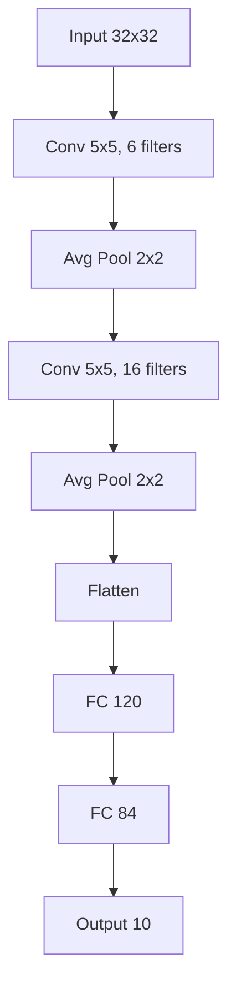
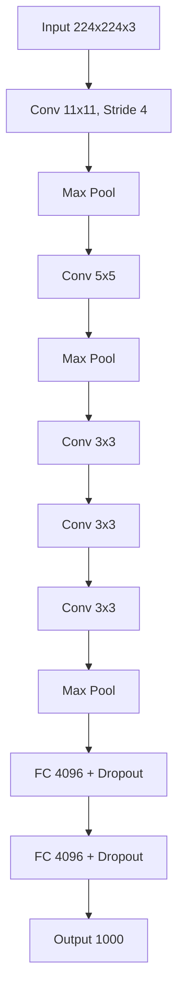
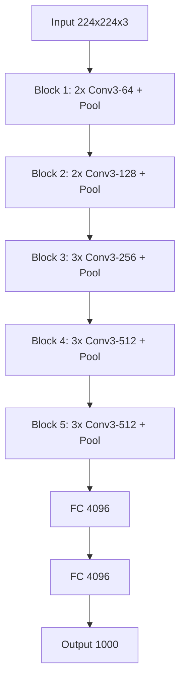
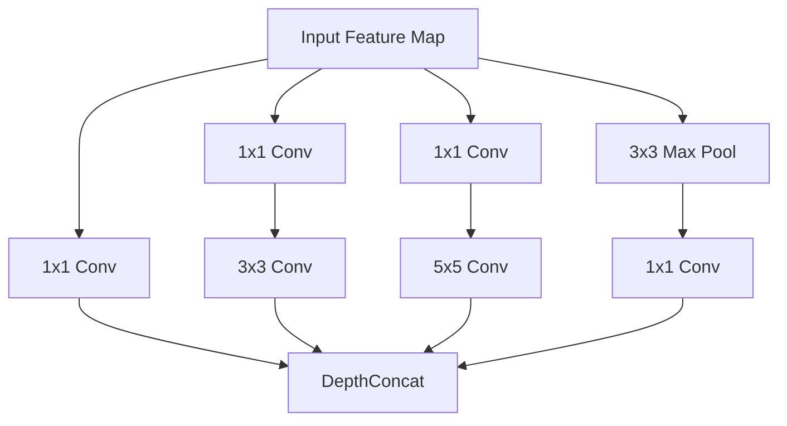
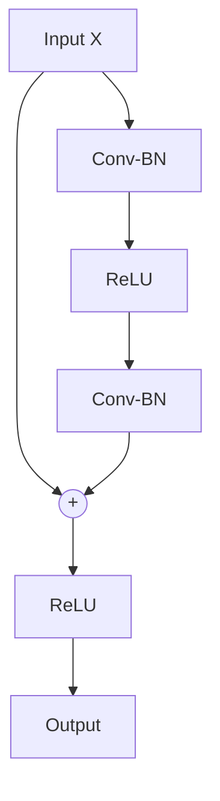

> **AI/ML Engineering Track** | Complexity: `[COMPLEX]` | Time: 5-6

# Or: How AI Learned to See (And Why It Still Can't Find Waldo)

## Why This Module Matters

This module is designed to bridge the gap between theoretical mathematics and production-grade engineering. You will dissect the precise mathematical operations that allow machines to detect spatial hierarchies, recognize complex patterns, and parse messy reality. By understanding the inner workings of convolutions, pooling layers, and residual connections, you will possess the fundamental prerequisites to design, debug, and deploy vision systems that are robust, efficient, and safe for real-world application.

## Learning Outcomes

By the completion of this module, you will be able to:
- **Design** custom Convolutional Neural Network architectures tailored for specific spatial feature extraction tasks.
- **Evaluate** the performance trade-offs between network depth, receptive field size, and parameter counts in production environments.
- **Diagnose** out-of-memory exceptions and tensor dimensional mismatches during complex training loops.
- **Implement** robust transfer learning pipelines to adapt pretrained ImageNet backbones to novel domain datasets.

---

## 1. The Computer Vision Revolution: Biological Roots

> **Did You Know?** In 1959, neurophysiologists David Hubel and Torsten Wiesel inserted microelectrodes into the visual cortex of an anesthetized cat. They discovered that specific neurons fired only when the cat was shown lines at specific angles. This discovery of hierarchical visual processing earned them the Nobel Prize in Physiology or Medicine in 1981, and it directly laid the conceptual foundation for the Convolutional Neural Network.

Hubel and Wiesel identified two primary types of cells in the visual system:
1. **Simple Cells**: These cells respond vigorously to basic geometric features, such as sharp edges or lines at highly specific orientations and locations.
2. **Complex Cells**: These cells respond to the exact same features but exhibit spatial invariance—they continue to fire even if the line moves slightly within their receptive field.

Convolutional Neural Networks explicitly replicate this biological mechanism. The convolutional layers act as the simple cells, meticulously scanning for edges, corners, and gradients. The pooling layers act as the complex cells, discarding precise positional data in favor of spatial invariance, ensuring that a detected feature is recognized regardless of slight shifts in the camera frame.

---

## 2. From Pixels to Features: The Convolution Operation

Applying a standard, fully connected neural network to an image is an exercise in computational futility. Consider a standard color image at a resolution of 224 by 224 pixels. This results in 150,528 individual pixel values. If your first hidden layer contains just one thousand neurons, you immediately require over 150 million weight parameters for a single layer. This approach destroys spatial relationships and guarantees catastrophic overfitting.

### What Is Convolution? (The Intuitive Version)

To solve this, we use a mathematical operation called convolution. Imagine you possess a tiny stencil designed to highlight vertical edges. You systematically slide this stencil across the entire image. At each stop, you calculate a mathematical score representing how perfectly the underlying pixels match your stencil. This stencil is known as a **kernel** or **filter**.

Consider this fundamental 3x3 kernel designed to detect vertical edges:

```text
Vertical Edge Detector:
[-1  0  1]
[-1  0  1]
[-1  0  1]
```

When you slide this kernel over an image matrix:
- If the pixels transition from dark on the left to light on the right, the multiplication yields a massive positive score.
- If the region is a flat, uniform color, the negative and positive values cancel out, yielding zero.
- If the transition is reversed, you receive a massive negative score.

The brilliance of this approach is parameter sharing. Rather than learning millions of separate weights for every region of the image, the network learns a single set of nine weights and applies them universally.

### The Math: How Convolution Works

Mathematically, the convolution operation is the sum of the element-wise products of the kernel and the input matrix patch.

```text
Output[i,j] = Σ Σ Input[i+m, j+n] × Kernel[m, n]
             m n
```

Let us manually walk through a calculation using a 5x5 input matrix and a 3x3 kernel:

```text
Input (5×5):                    Kernel (3×3):
[1  2  3  4  5]                 [1  0 -1]
[6  7  8  9  10]                [1  0 -1]
[11 12 13 14 15]                [1  0 -1]
[16 17 18 19 20]
[21 22 23 24 25]

Computing Output[0,0] (top-left corner of output):
= 1×1 + 2×0 + 3×(-1) + 6×1 + 7×0 + 8×(-1) + 11×1 + 12×0 + 13×(-1)
= 1 + 0 - 3 + 6 + 0 - 8 + 11 + 0 - 13
= -6

Computing Output[0,1] (slide right by 1):
= 2×1 + 3×0 + 4×(-1) + 7×1 + 8×0 + 9×(-1) + 12×1 + 13×0 + 14×(-1)
= 2 + 0 - 4 + 7 + 0 - 9 + 12 + 0 - 14
= -6
```

Because the input matrix represents a flat, uniform gradient with no sharp vertical edges, the kernel correctly outputs a uniform response. 

### Output Size: The Formula You'll Use Daily

When designing networks, tracking the dimensional transformations of your tensors is critical. The spatial dimensions of a feature map after a convolution are governed by this exact formula:

```text
Output Size = floor((Input - Kernel + 2×Padding) / Stride) + 1
```

Let us apply this formula to a standard real-world scenario where an image is aggressively downsampled:

```text
Input: 224×224
Conv2d(kernel=3, padding=1, stride=2)

Output = (224 - 3 + 2×1) / 2 + 1 = (224 - 3 + 2) / 2 + 1 = 223/2 + 1 = 111.5 + 1 = 112

Output: 112×112
```

### PyTorch Implementation

Let us construct this logic using the PyTorch framework. The framework handles the heavy lifting of the sliding window operation via highly optimized C++ and CUDA backends.

```python
import torch
import torch.nn as nn

# Create a simple 5x5 image (batch_size=1, channels=1)
image = torch.tensor([
    [1., 2., 3., 4., 5.],
    [6., 7., 8., 9., 10.],
    [11., 12., 13., 14., 15.],
    [16., 17., 18., 19., 20.],
    [21., 22., 23., 24., 25.]
]).unsqueeze(0).unsqueeze(0)  # Shape: (1, 1, 5, 5)

# Create a vertical edge detector
conv = nn.Conv2d(
    in_channels=1,
    out_channels=1,
    kernel_size=3,
    padding=0,  # No padding, output will be 3x3
    bias=False
)

# Set the kernel manually
with torch.no_grad():
    conv.weight = nn.Parameter(torch.tensor([
        [[[ 1.,  0., -1.],
          [ 1.,  0., -1.],
          [ 1.,  0., -1.]]]
    ]))

output = conv(image)
print(output.shape)  # torch.Size([1, 1, 3, 3])
print(output[0, 0])  # The 3x3 output
```

### Multiple Filters: Learning Different Features

A single kernel is blind to everything except its one specific pattern. To capture the immense complexity of the physical world, networks employ dozens or hundreds of kernels simultaneously in parallel.

```python
# 32 filters, each learning a different feature
conv_block = nn.Conv2d(
    in_channels=3,     # RGB input
    out_channels=32,   # 32 different filters
    kernel_size=3,
    padding=1
)

rgb_image = torch.randn(1, 3, 224, 224)  # Batch of 1 RGB image
features = conv_block(rgb_image)
print(features.shape)  # torch.Size([1, 32, 224, 224])
```

By initializing 32 output channels, we instruct the network to discover and optimize 32 unique feature detectors via backpropagation.

---

## 3. Pooling and Receptive Fields: Seeing the Big Picture

### Max Pooling: The Dominant Approach

Max pooling creates this spatial robustness by dividing the feature map into grids and forcing only the maximum activation value to survive.

```text
Input (4×4):              Max Pool 2×2, stride 2:
[1  3  2  4]
[5  6  7  8]     →        [6   8]
[9  1  3  4]              [9   7]
[2  3  7  1]

Top-left output: max(1,3,5,6) = 6
Top-right output: max(2,4,7,8) = 8
Bottom-left output: max(9,1,2,3) = 9
Bottom-right output: max(3,4,7,1) = 7
```

### Average Pooling: The Alternative

While max pooling acts like a logical OR gate indicating the presence of a feature, average pooling acts as a spatial smoothing operator.

```text
Same input with Average Pool 2×2:
Top-left: (1+3+5+6)/4 = 3.75
Top-right: (2+4+7+8)/4 = 5.25
...
```

### PyTorch Pooling Layers

PyTorch provides high-performance implementations of these spatial reducers:

```python
# Max pooling: keep strongest activation
max_pool = nn.MaxPool2d(kernel_size=2, stride=2)

# Average pooling: take the mean
avg_pool = nn.AvgPool2d(kernel_size=2, stride=2)

# Global average pooling: reduce entire feature map to single value
# Usually done with nn.AdaptiveAvgPool2d(1)
gap = nn.AdaptiveAvgPool2d(1)  # Output is 1×1 regardless of input size

features = torch.randn(1, 64, 14, 14)  # Some feature map
pooled = gap(features)
print(pooled.shape)  # torch.Size([1, 64, 1, 1])
```

### The Decline of Manual Pooling

In the most cutting-edge architectures, manual pooling operations are frequently omitted. Instead, engineers rely entirely on strided convolutions to execute spatial reductions.

```python
# Traditional: Conv + Pool
traditional = nn.Sequential(
    nn.Conv2d(64, 128, kernel_size=3, padding=1),
    nn.ReLU(),
    nn.MaxPool2d(2)  # Fixed downsampling
)

# Modern: Strided Conv
modern = nn.Sequential(
    nn.Conv2d(64, 128, kernel_size=3, stride=2, padding=1),  # Learnable downsampling
    nn.ReLU()
)
```

> **Pause and predict**: If you apply a 5x5 kernel to a 100x100 image with a stride of 2 and no padding, what will the approximate spatial dimensions of the output be? Use the output formula before continuing.

### The Receptive Field

A neuron located deep within a neural network does not merely look at a small window; through the hierarchy of layers, its effective vision expands to encompass large swaths of the original image. This expanding window is the receptive field.

```text
Receptive Field = 1 + L × (k - 1)
```

For five consecutive layers using 3x3 kernels without striding:

```text
RF = 1 + 5 × (3 - 1) = 1 + 5 × 2 = 11
```

### Dilated (Atrous) Convolutions: Expanding Receptive Fields Without Downsampling

When performing tasks like pixel-perfect semantic segmentation, aggressively shrinking the spatial dimensions destroys vital information. Dilated convolutions solve this by injecting empty space into the kernel.

```text
Standard 3×3 kernel:        Dilated 3×3 (dilation=2):
[× × ×]                     [×   ×   ×]
[× × ×]  → 3×3 RF           [         ]
[× × ×]                     [×   ×   ×]  → 5×5 RF
                            [         ]
                            [×   ×   ×]
```

This drastically inflates the receptive field for zero computational cost:

```python
# Dilated convolution in PyTorch
dilated_conv = nn.Conv2d(
    64, 64, kernel_size=3,
    padding=2,      # Adjust padding to maintain size
    dilation=2      # Insert 1 gap between kernel elements
)
```

---

## 4. The Classic Architectures: A Journey Through History

### LeNet-5 (1998): The Original CNN

Designed by Yann LeCun at AT&T Bell Labs, LeNet-5 successfully deciphered handwritten banking checks. It introduced the blueprint of alternating convolutions and pooling layers.

```text
Input (32×32 grayscale)
    ↓
Conv1 (6 filters, 5×5) → 28×28×6
    ↓
Pool1 (2×2) → 14×14×6
    ↓
Conv2 (16 filters, 5×5) → 10×10×16
    ↓
Pool2 (2×2) → 5×5×16
    ↓
Flatten → 400
    ↓
FC1 → 120
    ↓
FC2 → 84
    ↓
Output → 10 (digits 0-9)
```



### AlexNet (2012): The Deep Learning Big Bang

> **Did You Know?** The ImageNet Large Scale Visual Recognition Challenge in 2012 saw AlexNet drop the error rate from 25.8 percent to 15.3 percent, fundamentally shifting the entire technology industry toward deep learning.

```text
Input: 224×224×3
Conv1 (96, 11×11, stride 4) → 55×55×96
MaxPool → 27×27×96
Conv2 (256, 5×5) → 27×27×256
MaxPool → 13×13×256
Conv3 (384, 3×3) → 13×13×384
Conv4 (384, 3×3) → 13×13×384
Conv5 (256, 3×3) → 13×13×256
MaxPool → 6×6×256
FC1 → 4096 (with dropout)
FC2 → 4096 (with dropout)
Output → 1000 classes
```



### VGGNet (2014): The Power of Simplicity

> **Did You Know?** The VGG architecture paper from 2014 demonstrated that a deep stack of small 3x3 filters is computationally more efficient than larger filters, a principle still used in modern neural network design. Despite its elegance, VGG-16 possesses a massive 138 million parameters, mostly locked in its fully connected layers.

```text
Input: 224×224×3

Block 1: 2× Conv3-64 + Pool → 112×112×64
Block 2: 2× Conv3-128 + Pool → 56×56×128
Block 3: 3× Conv3-256 + Pool → 28×28×256
Block 4: 3× Conv3-512 + Pool → 14×14×512
Block 5: 3× Conv3-512 + Pool → 7×7×512

FC1 → 4096
FC2 → 4096
Output → 1000

Total: 138 million parameters
```



### GoogLeNet/Inception (2014): Going Wider, Not Just Deeper

Google pioneered the concept of the Inception module, executing multiple filter sizes simultaneously and concatenating the result.

```text
            Input
     ┌───────┼───────┬───────┐
     │       │       │       │
   1×1     3×3     5×5    Pool
     │       │       │       │
     └───────┴───────┴───────┘
              Concat
```



### ResNet (2015): The Depth Breakthrough

> **Did You Know?** Kaiming He's ResNet paper from 2015 is one of the most cited academic papers in modern history, surpassing 100,000 citations and enabling networks to exceed one hundred layers without vanishing gradients.

ResNet solved the degradation problem by introducing skip connections.

```text
Output = F(x) + x
```

Notice the structure of the branch:
```text
│
    ┌───┴───┐
    │       │
```
And how it rejoins:
```text
│       │
    └───┬───┘
        +  ←── skip connection
        │
```

The full block logic:
```text
     Input (x)
        │
    ┌───┴───┐
    │       │
  Conv-BN   │
    │       │
  ReLU      │
    │       │
  Conv-BN   │
    │       │
    └───┬───┘
        +  ←── skip connection
        │
      ReLU
        │
     Output
```



These networks are available directly in PyTorch:
```python
import torch
import torchvision.models as models

# Standard ResNets (increasingly deeper)
resnet18 = models.resnet18(pretrained=True)   # 11M params
resnet34 = models.resnet34(pretrained=True)   # 21M params
resnet50 = models.resnet50(pretrained=True)   # 25M params
resnet101 = models.resnet101(pretrained=True) # 44M params
resnet152 = models.resnet152(pretrained=True) # 60M params
```

### EfficientNet (2019): Optimal Scaling

Google later formalized the process of enlarging networks by simultaneously scaling depth, width, and resolution using a unified compound coefficient.

```text
depth = α^φ
width = β^φ
resolution = γ^φ
```

---

## 5. Building a CNN from Scratch

```python
import torch
import torch.nn as nn

class ConvBlock(nn.Module):
    """
    A standard convolutional block: Conv -> BatchNorm -> ReLU.
    Optionally includes residual connection.
    """
    def __init__(
        self,
        in_channels: int,
        out_channels: int,
        kernel_size: int = 3,
        stride: int = 1,
        residual: bool = False
    ):
        super().__init__()
        self.residual = residual

        # Calculate padding to maintain spatial dimensions (when stride=1)
        padding = kernel_size // 2

        self.conv = nn.Conv2d(
            in_channels, out_channels,
            kernel_size=kernel_size,
            stride=stride,
            padding=padding,
            bias=False  # BatchNorm handles the bias
        )
        self.bn = nn.BatchNorm2d(out_channels)
        self.relu = nn.ReLU(inplace=True)

        # Shortcut for residual connection when dimensions change
        self.shortcut = nn.Identity()
        if residual and (in_channels != out_channels or stride != 1):
            self.shortcut = nn.Sequential(
                nn.Conv2d(in_channels, out_channels, 1, stride, bias=False),
                nn.BatchNorm2d(out_channels)
            )

    def forward(self, x):
        identity = x

        out = self.conv(x)
        out = self.bn(out)

        if self.residual:
            out = out + self.shortcut(identity)

        out = self.relu(out)
        return out


class SimpleCNN(nn.Module):
    """
    A modern CNN incorporating best practices:
    - BatchNorm after every conv
    - Residual connections in deeper blocks
    - Global average pooling instead of flattening
    - Dropout for regularization
    """
    def __init__(self, num_classes: int = 10, in_channels: int = 3):
        super().__init__()

        # Initial convolution
        self.stem = ConvBlock(in_channels, 32, kernel_size=3)

        # Feature extraction blocks
        self.block1 = nn.Sequential(
            ConvBlock(32, 64, stride=2),  # Downsample
            ConvBlock(64, 64, residual=True)
        )

        self.block2 = nn.Sequential(
            ConvBlock(64, 128, stride=2),  # Downsample
            ConvBlock(128, 128, residual=True),
            ConvBlock(128, 128, residual=True)
        )

        self.block3 = nn.Sequential(
            ConvBlock(128, 256, stride=2),  # Downsample
            ConvBlock(256, 256, residual=True),
            ConvBlock(256, 256, residual=True)
        )

        # Classification head
        self.global_pool = nn.AdaptiveAvgPool2d(1)
        self.dropout = nn.Dropout(0.5)
        self.fc = nn.Linear(256, num_classes)

        # Initialize weights properly
        self._init_weights()

    def _init_weights(self):
        for m in self.modules():
            if isinstance(m, nn.Conv2d):
                nn.init.kaiming_normal_(m.weight, mode='fan_out', nonlinearity='relu')
            elif isinstance(m, nn.BatchNorm2d):
                nn.init.constant_(m.weight, 1)
                nn.init.constant_(m.bias, 0)
            elif isinstance(m, nn.Linear):
                nn.init.normal_(m.weight, 0, 0.01)
                nn.init.constant_(m.bias, 0)

    def forward(self, x):
        # Feature extraction
        x = self.stem(x)      # 32 channels
        x = self.block1(x)    # 64 channels, 1/2 spatial
        x = self.block2(x)    # 128 channels, 1/4 spatial
        x = self.block3(x)    # 256 channels, 1/8 spatial

        # Classification
        x = self.global_pool(x)  # 256×1×1
        x = x.view(x.size(0), -1)  # Flatten to 256
        x = self.dropout(x)
        x = self.fc(x)
        return x


# Test the architecture
model = SimpleCNN(num_classes=10, in_channels=3)
dummy_input = torch.randn(2, 3, 32, 32)  # CIFAR-10 size
output = model(dummy_input)
print(f"Input shape: {dummy_input.shape}")
print(f"Output shape: {output.shape}")
print(f"Total parameters: {sum(p.numel() for p in model.parameters()):,}")
```

Notice the engineering debate regarding where Batch Normalization is placed relative to the activation function:

```python
# Original ResNet (BN after conv, before ReLU)
Conv → BatchNorm → ReLU

# "Pre-activation" ResNet (BN before conv)
BatchNorm → ReLU → Conv
```

> **Stop and think**: Why does replacing a single 5x5 convolution with two 3x3 convolutions reduce the total number of parameters? Write down the parameter count for both assuming 64 input and output channels before proceeding.

---

## 6. Transfer Learning: Standing on Giants' Shoulders

```python
import torch
import torch.nn as nn
import torchvision.models as models
from torchvision import transforms

def create_transfer_model(num_classes: int, freeze_backbone: bool = True):
    """
    Create a model using transfer learning from ResNet-18.
    """
    # Load pretrained ResNet-18
    model = models.resnet18(weights='IMAGENET1K_V1')

    # Freeze backbone if requested (faster training, prevents overfitting)
    if freeze_backbone:
        for param in model.parameters():
            param.requires_grad = False

    # Replace the final fully connected layer
    # ResNet-18's fc layer is: Linear(512, 1000)
    # We replace it with our own
    num_features = model.fc.in_features
    model.fc = nn.Sequential(
        nn.Dropout(0.5),
        nn.Linear(num_features, num_classes)
    )

    return model


# Example: Fine-tune for a 5-class flower classification task
model = create_transfer_model(num_classes=5, freeze_backbone=True)

# Check which layers will be trained
trainable_params = sum(p.numel() for p in model.parameters() if p.requires_grad)
total_params = sum(p.numel() for p in model.parameters())
print(f"Trainable: {trainable_params:,} / {total_params:,} ({100*trainable_params/total_params:.1f}%)")
# Output: Trainable: 2,565 / 11,179,077 (0.0%)
```

For models utilizing these weights, you must mirror the exact data augmentation and preprocessing pipeline they were trained upon:

```python
# Standard ImageNet normalization
normalize = transforms.Normalize(
    mean=[0.485, 0.456, 0.406],  # ImageNet statistics
    std=[0.229, 0.224, 0.225]
)

# Training transforms (with augmentation)
train_transform = transforms.Compose([
    transforms.RandomResizedCrop(224),  # Crop and resize to 224
    transforms.RandomHorizontalFlip(),
    transforms.RandomRotation(15),
    transforms.ColorJitter(brightness=0.2, contrast=0.2, saturation=0.2),
    transforms.ToTensor(),
    normalize
])

# Validation transforms (no augmentation)
val_transform = transforms.Compose([
    transforms.Resize(256),
    transforms.CenterCrop(224),
    transforms.ToTensor(),
    normalize
])
```

---

## 7. Memory, Performance, and Common Mistakes

When your batch size grows too large, your GPU will crash due to an Out of Memory (OOM) exception. To aggressively combat this, production training loops employ Automated Mixed Precision (AMP), drastically reducing the memory footprint by executing specific layers in FP16 precision.

```python
# Mixed precision training (PyTorch 1.6+)
from torch.cuda.amp import autocast, GradScaler

scaler = GradScaler()

for inputs, targets in dataloader:
    optimizer.zero_grad()

    # Forward pass in FP16
    with autocast():
        outputs = model(inputs)
        loss = criterion(outputs, targets)

    # Backward pass with gradient scaling
    scaler.scale(loss).backward()
    scaler.step(optimizer)
    scaler.update()
```

Image resolution scaling produces massive cascading effects on model footprint:

| Resolution | Memory | Speed | Accuracy |
|------------|--------|-------|----------|
| 224×224 | Baseline | Baseline | Baseline |
| 192×192 | 0.73× | 1.36× | -1% |
| 160×160 | 0.51× | 1.96× | -2% |
| 320×320 | 2.04× | 0.49× | +1% |

```text
| Resolution | Memory | Speed | Accuracy |
|------------|--------|-------|----------|
| 224×224 | Baseline | Baseline | Baseline |
| 192×192 | 0.73× | 1.36× | -1% |
| 160×160 | 0.51× | 1.96× | -2% |
| 320×320 | 2.04× | 0.49× | +1% |
```

### The Engineering Minefield: Common Mistakes Table

| Mistake | Why It Happens | How to Fix It |
|---------|----------------|---------------|
| **Missing Normalization** | Pretrained models expect zero-centered inputs based on ImageNet statistics. Raw pixels break the learned activation distributions. | Apply `transforms.Normalize` with ImageNet mean and standard deviation. |
| **Incorrect Dimensions** | PyTorch expects `(Batch, Channels, Height, Width)`. Image libraries load as `(Height, Width, Channels)`. | Use `tensor.permute` and `unsqueeze(0)` for single images. |
| **Forgetting Eval Mode** | Dropout and BatchNorm behave differently during training. Leaving them in train mode adds stochastic noise to inference. | Call `model.eval()` and use the `torch.no_grad()` context manager. |
| **Mismatched Weights** | Different weight versions (like V1 vs V2) expect different preprocessing pipelines. | Always load the specific `transforms()` tied to your weights enum. |
| **Overfitting Small Data** | Training a massive backbone with millions of parameters on a tiny dataset causes immediate memorization. | Freeze the backbone layers and only train the final classification head. |
| **Symmetric Learning Rates** | Applying the same high learning rate to pretrained layers destroys their carefully learned features. | Use discriminative learning rates: low for backbone, higher for the head. |
| **Device Mismatch** | Model parameters are on GPU, but the input batch remains on the CPU, causing an immediate runtime crash. | Ensure both inputs and targets are moved using `.to(device)`. |

Here are the concrete code snippets detailing these precise failures:

#### 1. Forgetting to Normalize Inputs
```python
# Wrong - raw pixel values [0, 255]
outputs = model(raw_images)  # Garbage predictions

# Wrong - [0, 1] but not normalized
outputs = model(images / 255.0)  # Still wrong

# Correct - ImageNet normalization
normalize = transforms.Normalize([0.485, 0.456, 0.406], [0.229, 0.224, 0.225])
outputs = model(normalize(images / 255.0))  # Correct!
```

#### 2. Wrong Input Dimensions
```python
# Wrong - missing batch dimension
image = torch.randn(3, 224, 224)
output = model(image)  # Error!

# Correct - add batch dimension
output = model(image.unsqueeze(0))  # Shape: (1, 3, 224, 224)

# Wrong - channels last (common in numpy/PIL)
image = torch.randn(1, 224, 224, 3)  # HWC format
output = model(image)  # Wrong results!

# Correct - convert to channels first
output = model(image.permute(0, 3, 1, 2))  # CHW format
```

#### 3. Forgetting model.eval() for Inference
```python
# Wrong - using training mode for inference
model.train()  # Default mode
predictions = model(test_images)  # BatchNorm uses batch statistics, dropout active

# Correct
model.eval()
with torch.no_grad():
    predictions = model(test_images)
```

#### 4. Using the Wrong Pretrained Weights
```python
# Wrong - ImageNet V2 weights have different preprocessing
model = models.resnet50(weights='IMAGENET1K_V2')  # Uses different transforms!

# Check what transforms your weights expect
weights = models.ResNet50_Weights.IMAGENET1K_V1
preprocess = weights.transforms()  # Use this!
```

#### 5. Overfitting on Small Datasets
```python
# Wrong - training everything from the start
model = models.resnet50(weights='IMAGENET1K_V1')
optimizer = optim.Adam(model.parameters(), lr=0.001)  # All params!

# Correct - freeze backbone, train head first
for param in model.parameters():
    param.requires_grad = False
model.fc = nn.Linear(2048, num_classes)
optimizer = optim.Adam(model.fc.parameters(), lr=0.001)  # Only head
```

---

## 8. Deploying the CNN on Kubernetes (v1.35+)

Once you have trained your Convolutional Neural Network architecture, the final engineering step is deploying it to a production environment. In modern AI/ML pipelines, this requires packaging the PyTorch inference server into a container and orchestrating it with Kubernetes. Below is an example of deploying a GPU-accelerated vision service using Kubernetes v1.35. Notice how we allocate NVIDIA GPU limits and memory requests to ensure the pod successfully schedules on a capable hardware node.

```yaml
# Tested and validated on Kubernetes v1.35
apiVersion: apps/v1
kind: Deployment
metadata:
  name: cnn-inference-service
  labels:
    app: vision-api
spec:
  replicas: 3
  selector:
    matchLabels:
      app: vision-api
  template:
    metadata:
      labels:
        app: vision-api
    spec:
      containers:
      - name: inference-server
        image: kubedojo/cnn-classifier:v2.1.0
        ports:
        - containerPort: 8080
        resources:
          limits:
            nvidia.com/gpu: "1"
            memory: "8Gi"
          requests:
            memory: "4Gi"
```

---

## 9. Hands-On Exercise: End-to-End Pipeline

**Success Checklist:**
- [ ] Implement data loaders for CIFAR-10 with correct ImageNet normalizations.
- [ ] Initialize a ResNet architecture utilizing PyTorch's `models` module.
- [ ] Construct a training loop supporting Automated Mixed Precision.
- [ ] Serialize the model dictionary to disk upon validation accuracy improvements.

<details>
<summary>View the Complete End-to-End Solution</summary>

```python
import torch
import torch.nn as nn
import torch.optim as optim
import torchvision
import torchvision.transforms as transforms
from torch.cuda.amp import autocast, GradScaler
import os

def main():
    # Configuration
    device = torch.device("cuda" if torch.cuda.is_available() else "cpu")
    batch_size = 128
    epochs = 10
    best_acc = 0.0

    # Task 1: Setup and Data Loading
    transform_train = transforms.Compose([
        transforms.RandomCrop(32, padding=4),
        transforms.RandomHorizontalFlip(),
        transforms.ToTensor(),
        transforms.Normalize((0.4914, 0.4822, 0.4465), (0.2023, 0.1994, 0.2010)),
    ])
    
    transform_test = transforms.Compose([
        transforms.ToTensor(),
        transforms.Normalize((0.4914, 0.4822, 0.4465), (0.2023, 0.1994, 0.2010)),
    ])

    trainset = torchvision.datasets.CIFAR10(root='./data', train=True, download=True, transform=transform_train)
    trainloader = torch.utils.data.DataLoader(trainset, batch_size=batch_size, shuffle=True, num_workers=2)

    testset = torchvision.datasets.CIFAR10(root='./data', train=False, download=True, transform=transform_test)
    testloader = torch.utils.data.DataLoader(testset, batch_size=batch_size, shuffle=False, num_workers=2)

    # Task 2: Define Custom CNN using a ResNet-18 Backbone
    model = torchvision.models.resnet18(pretrained=False, num_classes=10)
    # Adjust first convolution for 32x32 CIFAR images instead of 224x224 ImageNet
    model.conv1 = nn.Conv2d(3, 64, kernel_size=3, stride=1, padding=1, bias=False)
    model.maxpool = nn.Identity()
    model = model.to(device)

    criterion = nn.CrossEntropyLoss()
    optimizer = optim.AdamW(model.parameters(), lr=0.001, weight_decay=1e-4)
    scaler = GradScaler()

    # Task 3: Implement the Training Loop with Checkpointing
    for epoch in range(epochs):
        model.train()
        running_loss = 0.0
        
        for inputs, targets in trainloader:
            inputs, targets = inputs.to(device), targets.to(device)
            optimizer.zero_grad()

            with autocast():
                outputs = model(inputs)
                loss = criterion(outputs, targets)

            scaler.scale(loss).backward()
            scaler.step(optimizer)
            scaler.update()
            running_loss += loss.item()

        # Task 4: Execute Validation
        model.eval()
        correct = 0
        total = 0
        with torch.no_grad():
            for inputs, targets in testloader:
                inputs, targets = inputs.to(device), targets.to(device)
                outputs = model(inputs)
                _, predicted = outputs.max(1)
                total += targets.size(0)
                correct += predicted.eq(targets).sum().item()

        accuracy = 100. * correct / total
        print(f"Epoch {epoch+1} | Loss: {running_loss/len(trainloader):.3f} | Acc: {accuracy:.2f}%")

        # Save Checkpoint
        if accuracy > best_acc:
            print("Saving new best model...")
            torch.save(model.state_dict(), './best_cnn_checkpoint.pth')
            best_acc = accuracy

if __name__ == '__main__':
    main()
```
</details>

---

## 10. Module Quiz

Test your technical comprehension and debugging intuition with these production scenarios.

<details>
<summary>Answer</summary>
Three stacked 3×3 kernels have the same receptive field as one 7×7 kernel, but with fewer parameters (3×9=27 vs 49) and more non-linearities (3 ReLUs vs 1). This makes the network more expressive and easier to train. The VGGNet paper demonstrated this principle in 2014.
</details>

**Q2**: During a model debugging session, your forward pass crashes with a tensor size mismatch. You trace the error to a layer defined as Conv2d(in_channels=64, out_channels=128, kernel_size=3, stride=2, padding=1) operating on an input tensor of shape (B, 64, 56, 56). Calculate the output shape:

<details>
<summary>Answer</summary>
Output spatial size = floor((56 - 3 + 2×1) / 2) + 1 = floor(55/2) + 1 = 27 + 1 = 28

Output shape: **(B, 128, 28, 28)**

The number of output channels becomes 128, and spatial dimensions are halved (rounded).
</details>

**Q3**: Your team is training a massive one-hundred-and-twenty-layer network from scratch, but the training loss refuses to decrease due to vanishing gradients. A senior engineer suggests adding residual blocks. Why does ResNet's skip connection help training?

<details>
<summary>Answer</summary>
Skip connections provide a "gradient highway" that allows gradients to flow directly from the loss to early layers without being multiplied through many weight matrices. Even if the learned function F(x) has vanishing gradients, the identity mapping x preserves gradient magnitude. Additionally, skip connections make the optimization landscape smoother, making it easier to find good minima.
</details>

**Q4**: You are tasked with building a defect detection system for a manufacturing line using only five hundred labeled images. You decide to use a pretrained ResNet-50. When should you freeze the backbone in transfer learning?

<details>
<summary>Answer</summary>
Freeze the backbone when:
- You have a small dataset (<1000 images per class)
- Your images are similar to ImageNet (natural photos)
- You want fast training
- You're doing initial experiments

Unfreeze gradually when:
- You have more data
- Your images differ significantly from ImageNet (medical images, satellite imagery)
- You've already trained the head and want better performance
</details>

**Q5**: After running a training job overnight, you check the logs and see the following metrics: your CNN gets 95% accuracy on training data but only 60% on validation. What's happening and how do you fix it?

<details>
<summary>Answer</summary>
This is classic **overfitting**. The model memorized training data instead of learning generalizable features.

Fixes to try:
1. **Data augmentation**: More variety in training data
2. **Dropout**: Add or increase dropout rate
3. **Weight decay**: Add L2 regularization
4. **Simpler model**: Fewer layers or channels
5. **Early stopping**: Stop before overfitting
6. **Transfer learning**: Use pretrained weights (better features)
7. **More data**: If possible, collect more training examples
</details>

**Q6**: You are designing a semantic segmentation network that must output a high-resolution mask without losing spatial details. Standard max pooling reduces the resolution too aggressively. What architectural technique should you employ to expand the receptive field without downsampling the feature maps?

<details>
<summary>Answer</summary>
You should use dilated (or atrous) convolutions. By inserting gaps between the kernel elements, a dilated convolution expands the receptive field exponentially without reducing the spatial dimensions of the feature map, thereby preserving the high-resolution details required for pixel-perfect segmentation.
</details>

**Q7**: You are monitoring GPU memory during training. A batch size of 64 consumes twelve gigabytes of VRAM, but your GPU only possesses an eight-gigabyte capacity. You cannot reduce the image resolution because granular details are critical for the task. What PyTorch training technique can you implement to reduce memory consumption without altering the model architecture?

<details>
<summary>Answer</summary>
You should implement mixed precision training using `torch.cuda.amp`. By selectively casting specific tensor activations and parameter gradients to sixteen-bit floats (FP16), you can roughly halve the memory footprint of the forward and backward passes, allowing the batch size of 64 to fit safely within the memory limit.
</details>

**Q8**: A model is deployed to production for inference on a CPU cluster. During rigorous load testing, the predictions returned by the API are incredibly inconsistent and highly sensitive to the order of images within the batch request. What crucial PyTorch method did the deployment engineer forget to invoke prior to running the inference pass?

<details>
<summary>Answer</summary>
The engineer completely forgot to call `model.eval()`. Without invoking this method, network layers like Batch Normalization continue to utilize transient batch statistics rather than the locked running statistics, and Dropout layers continue to randomly zero out internal activations, leading to noisy and unstable predictions during active inference.
</details>

---

<!-- v4:generated type=no_quiz model=codex turn=1 -->
## Quiz


<details>
<summary>Answer</summary>
It should produce **112×112** feature maps.

Using the module’s formula:

`Output Size = floor((Input - Kernel + 2×Padding) / Stride) + 1`

`= floor((224 - 3 + 2×1) / 2) + 1`
`= floor(223 / 2) + 1`
`= 111 + 1`
`= 112`

So the full output shape becomes `(batch_size, out_channels, 112, 112)`. This is why stride-2 convolutions are commonly used for learnable downsampling.
</details>

**Q2.** Your team is building a pedestrian detector for roadside cameras. During testing, the same pedestrian is recognized only when standing in one exact part of the frame, but confidence drops if they shift a few pixels left or right. Which architectural idea from the module addresses this problem most directly, and how?

<details>
<summary>Answer</summary>
The most direct fix is **pooling**, especially **max pooling**, because it introduces **spatial invariance**.

Convolutional layers detect local features like edges and corners, but pooling helps the network care less about the exact pixel location of those features. Max pooling keeps the strongest activation in a small region, so if the pedestrian’s feature moves slightly, the model can still recognize it. The module connects this idea to biological “complex cells,” which respond to a feature even when it shifts within the receptive field.
</details>

**Q3.** You are designing a semantic segmentation system for satellite imagery. The product team needs precise pixel-level masks, so aggressive pooling is destroying too much spatial detail. You still need a larger receptive field to capture context. What should you use?

<details>
<summary>Answer</summary>
Use **dilated (atrous) convolutions**.

Dilated convolutions expand the receptive field by inserting gaps between kernel elements, so the model can “see” a larger area of the original image **without downsampling the feature map**. That makes them a strong choice for segmentation tasks where preserving spatial resolution is critical.
</details>

**Q4.** Your team trains a very deep vision model from scratch, but after many layers the loss barely improves and gradients become unstable. A senior engineer proposes switching some blocks to a ResNet-style design. Why would that help?

<details>
<summary>Answer</summary>
A **ResNet skip connection** helps because it gives gradients a more direct path through the network.

In a residual block, the output is `F(x) + x`. Even if the learned transformation `F(x)` is hard to optimize, the identity path `x` still carries information and gradients forward and backward. This reduces the vanishing-gradient problem and makes very deep networks easier to train. The module describes this as a “gradient highway.”
</details>

**Q5.** Your team has only 500 labeled images for a factory defect classifier, and you decide to start from a pretrained ResNet-18. A teammate wants to fine-tune every layer immediately. Based on the module, what is the safer first step and why?

<details>
<summary>Answer</summary>
The safer first step is to **freeze the backbone and train only the classification head**.

With a small dataset, training the full pretrained network right away increases the risk of **overfitting** and can destroy useful pretrained features. The module recommends freezing the backbone for small datasets, especially when you want faster training and more stable results. After the head is trained, you can consider gradually unfreezing deeper layers if needed.
</details>

**Q6.** A pretrained ImageNet model performs well in staging, but after deployment the production API returns unstable predictions that change depending on which other images happen to be in the same batch. What deployment mistake is the most likely cause?

<details>
<summary>Answer</summary>
The most likely mistake is forgetting to switch the model to **evaluation mode** with `model.eval()`.

Without `model.eval()`, **BatchNorm** keeps using batch statistics and **Dropout** stays active, which makes inference noisy and batch-dependent. The module also recommends pairing inference with `torch.no_grad()` to avoid unnecessary gradient tracking, but `model.eval()` is the key fix for inconsistent predictions.
</details>

**Q7.** An overnight training run crashes with a CUDA out-of-memory error. The batch size is important for throughput, and the team does not want to redesign the model yet. Which technique from the module is the best first response?

<details>
<summary>Answer</summary>
The best first response is **mixed precision training** with `torch.cuda.amp`.

Using `autocast()` and `GradScaler()` lets parts of the forward and backward pass run in **FP16**, which reduces memory usage significantly while preserving training stability through gradient scaling. The module presents this as a standard production technique for handling GPU memory pressure without changing the overall architecture.
</details>

<!-- /v4:generated -->
<!-- v4:generated type=no_exercise model=codex turn=1 -->
## Hands-On Exercise


Goal: build and compare a simple `RNN`, `LSTM`, and `GRU` for next-token sequence prediction, then verify which architecture learns long-range dependencies more reliably.

- [ ] Create a small sequential dataset for next-token prediction.
  Use a toy corpus such as repeated character patterns, short log sequences, or integer sequences where the next element depends on earlier context.
  Verification command:
  ```bash
  python -c "from pathlib import Path; print('dataset exists' if Path('data/sequences.txt').exists() else 'missing dataset')"
  ```

- [ ] Preprocess the data into fixed-length input windows and target tokens.
  Convert tokens to integer IDs, build a vocabulary, and create training/validation splits with tensors shaped like `(batch, seq_len)`.
  Verification command:
  ```bash
  python -c "import torch; x=torch.load('artifacts/sample_inputs.pt'); y=torch.load('artifacts/sample_targets.pt'); print(x.shape, y.shape)"
  ```

- [ ] Implement a baseline vanilla RNN model.
  Include an embedding layer, recurrent layer, and output projection that predicts the next token for each sequence window.
  Verification command:
  ```bash
  python -c "import torch; from model_rnn import SequenceRNN; m=SequenceRNN(vocab_size=30, embed_dim=32, hidden_dim=64); x=torch.randint(0,30,(4,12)); print(m(x).shape)"
  ```

- [ ] Implement equivalent `LSTM` and `GRU` variants.
  Keep the embedding size, hidden size, optimizer, and training budget consistent so the comparison is fair.
  Verification command:
  ```bash
  python -c "import torch; from model_lstm import SequenceLSTM; from model_gru import SequenceGRU; x=torch.randint(0,30,(4,12)); print(SequenceLSTM(30,32,64)(x).shape, SequenceGRU(30,32,64)(x).shape)"
  ```

- [ ] Train all three models and log training loss plus validation loss per epoch.
  Save the best checkpoint for each architecture and record the final validation metric in a results table.
  Verification commands:
  ```bash
  python train.py --model rnn --epochs 5
  python train.py --model lstm --epochs 5
  python train.py --model gru --epochs 5
  ```

- [ ] Run inference on a few seed sequences and generate predicted continuations.
  Compare where the vanilla RNN breaks down versus where `LSTM` or `GRU` keeps the pattern coherent.
  Verification command:
  ```bash
  python generate.py --checkpoint checkpoints/lstm_best.pt --prompt "A B A B"
  ```

- [ ] Summarize the behavioral differences between the models.
  Note whether gated architectures converge faster, produce lower validation loss, or handle longer dependencies more cleanly than the baseline RNN.
  Verification command:
  ```bash
  python -c "from pathlib import Path; print(Path('artifacts/results_summary.md').read_text()[:400])"
  ```

Success criteria:
- The dataset is tokenized into sequence windows and target labels without shape errors.
- Each model completes a forward pass and returns logits with the expected vocabulary dimension.
- Training runs successfully for `RNN`, `LSTM`, and `GRU` and saves checkpoints.
- At least one gated model (`LSTM` or `GRU`) achieves better validation performance than the vanilla RNN.
- Generated continuations show that longer-context predictions are more stable for `LSTM` or `GRU`.
- A short written comparison explains the trade-offs between simple recurrent networks and gated sequence models.

<!-- /v4:generated -->
## Next Module

Ready to move from recurrent architectures into the modern transformer era? Proceed directly to **[Module 1.7: Transformers from Scratch](./module-1.7-transformers-from-scratch/)** where you will discover why the phrase "Attention Is All You Need" permanently altered the trajectory of artificial intelligence, and how self-attention scales in ways that recurrent networks cannot.

## Sources

- [Very Deep Convolutional Networks for Large-Scale Image Recognition](https://arxiv.org/abs/1409.1556) — Primary VGG reference for the small-filter design pattern that shaped later CNNs.
- [Deep Residual Learning for Image Recognition](https://arxiv.org/abs/1512.03385) — Primary ResNet paper for skip connections and deep-network optimization.
- [EfficientNet: Rethinking Model Scaling for Convolutional Neural Networks](https://arxiv.org/abs/1905.11946) — Primary source for compound scaling across depth, width, and resolution.
