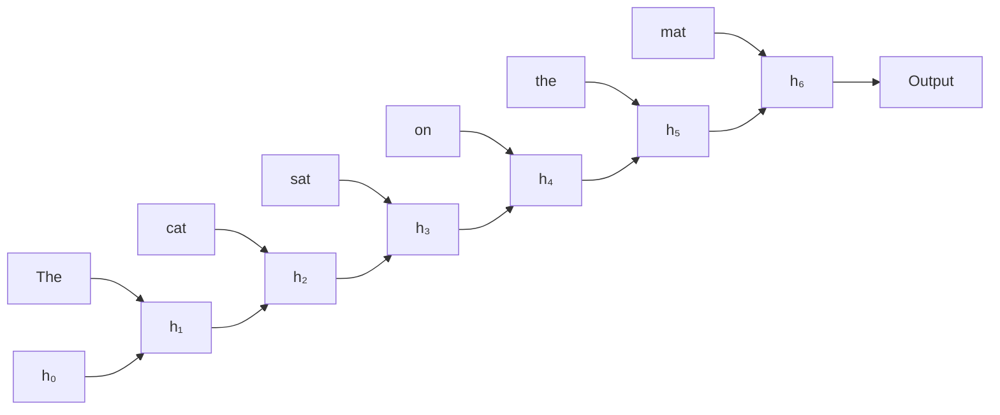
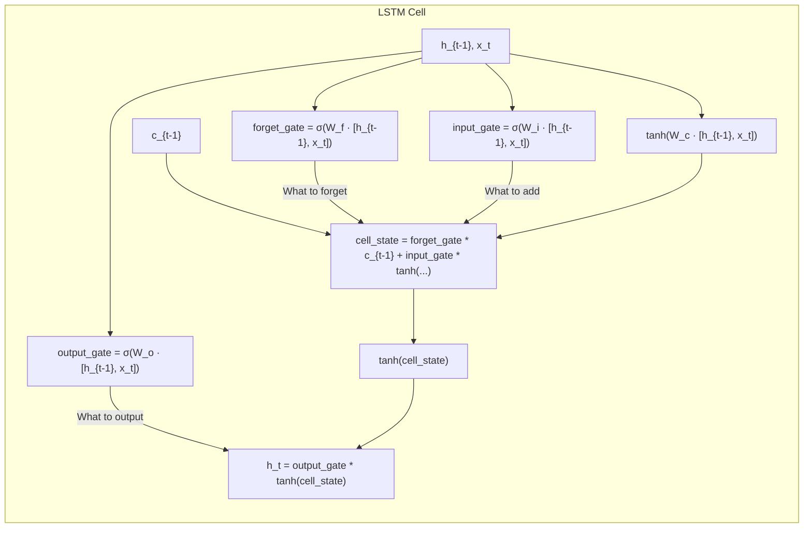
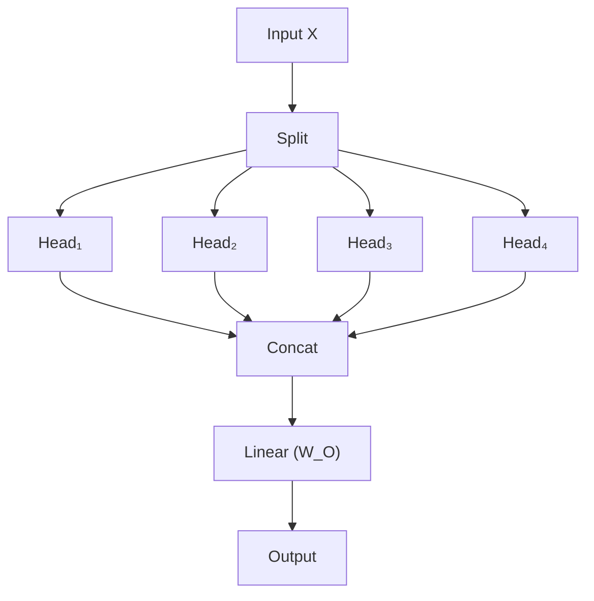
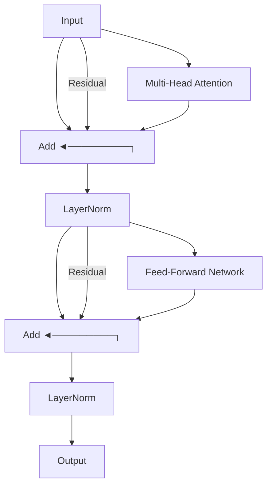
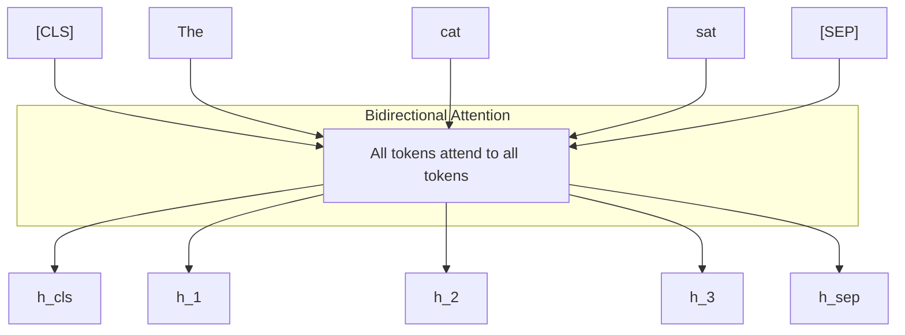
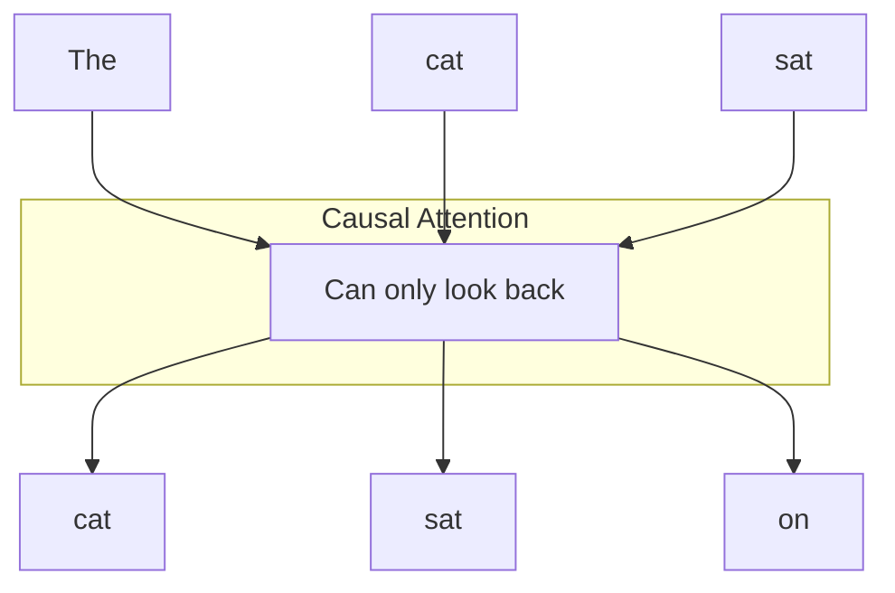
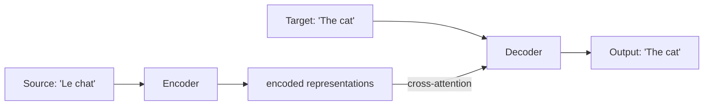
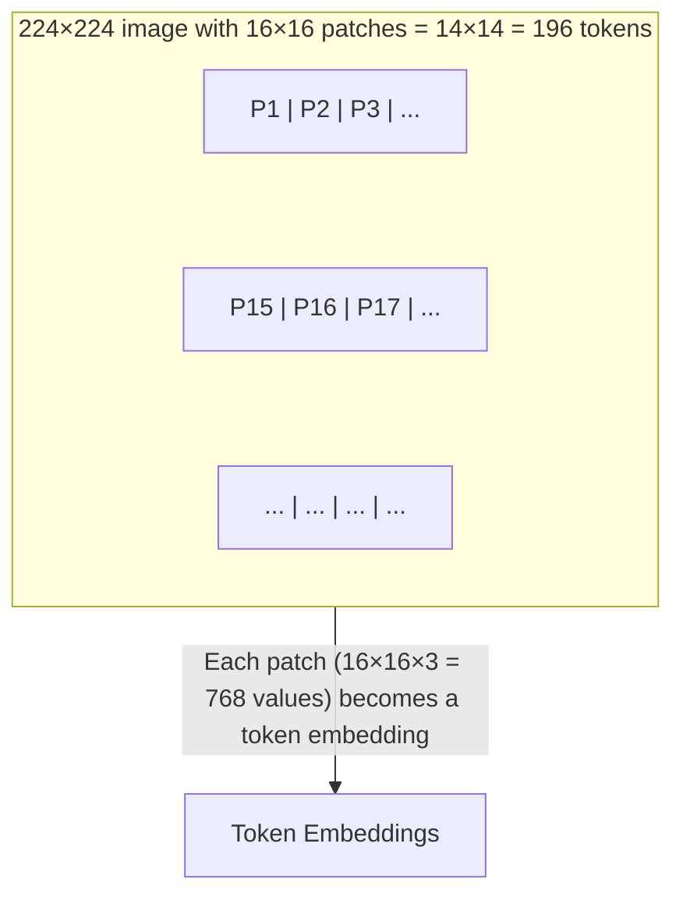
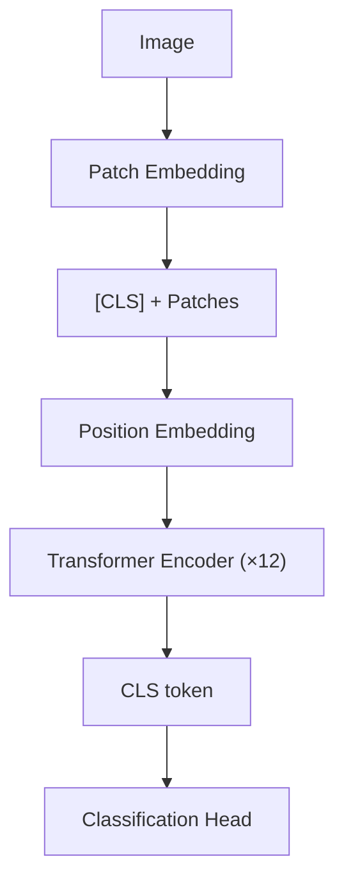

> **AI/ML Engineering Track** | Complexity: `[COMPLEX]` | Time: 5-6 Hours

# Backpropagation Deep Dive: From Autograd to Transformers

**Reading Time**: 8-10 hours
**Prerequisites**: Module 29

**This is a Heureka Moment module.**

## The Heureka Moment

**Mountain View, California. June 12, 2017. 2:34 AM.**

Ashish Vaswani and his Google Brain colleagues huddled around a laptop. They had just achieved state-of-the-art performance on machine translation by removing recurrent connections entirely and relying purely on attention. "Attention is all you need," Vaswani typed. That paper would change AI forever. But to understand how those massive transformer models actually learn, we must deeply understand the mathematical engine underneath them all: backpropagation.

## Why This Module Matters

In 2023, a promising AI startup burned over $1.2 million in GPU compute over a single weekend. Their massive large language model's training loss kept climbing wildly, ultimately ruining a massive training run distributed across thousands of ultra-expensive GPUs. The culprit was not a flaw in their cutting-edge architecture, nor was it a problem with their trillion-token dataset. It was a fundamental misunderstanding of backpropagation mechanics within their deep learning framework: they forgot to call `optimizer.zero_grad()`. Because PyTorch accumulates gradients in `.grad` buffers across backward computations rather than replacing them by default, every single backward pass added its mathematical weight to the previous one. This created an exploding gradient catastrophe that systematically destroyed the model weights within hours.

Understanding backpropagation and how automatic differentiation (autodiff) engines like PyTorch's Autograd and TensorFlow's GradientTape build computational graphs is the difference between effectively diagnosing a broken model and blindly guessing. As neural networks have evolved from simple, shallow linear layers to massive, parallelized transformer architectures, the complexity of the directed acyclic graphs (DAGs) generated during the forward pass has exploded. Without mastering the underlying calculus, memory management, and gradient flow, engineers are reduced to merely copying and pasting code from tutorials, entirely unable to debug sudden memory explosions, vanishing gradients, or loss divergence.

This module bridges the gap between theoretical calculus and practical deep learning engineering. We will explore backpropagation by examining how it scales from handling deep, fragile sequential graphs in Recurrent Neural Networks to processing massive, parallelized graphs in modern transformer architectures. You will learn not just the mathematical theory of the chain rule, but the practical engineering realities of tracking gradients through complex, non-differentiable primitives and managing custom dynamic control flows at massive scale.

## What You Will Be Able to Do

By the end of this module, you will be able to:
- **Diagnose** vanishing and exploding gradient issues in deep sequential computational graphs by analyzing activation magnitudes.
- **Evaluate** the critical architectural differences between PyTorch, TensorFlow, and JAX autodiff implementations and memory management.
- **Implement** exact backpropagation tracking through complex, parallel architectures like Multi-Head Attention mechanisms.
- **Design** custom neural modules that guarantee healthy gradient flows by leveraging proper residual connection pathways.
- **Compare** the computational efficiencies of forward-mode and reverse-mode automatic differentiation in large-scale deep learning frameworks.

---

## Section 1: The Mechanics of Backpropagation and Autodiff

Backpropagation is the fundamental algorithm used to adjust model parameters by calculating the gradient of the loss function with respect to every single parameter in the network. Instead of calculating these complex, nested derivatives manually—which would be mathematically prohibitive for models with billions of weights—modern deep learning relies on automatic differentiation (AD). 

PyTorch autograd is a reverse-mode automatic differentiation system. During the forward pass, it builds a Directed Acyclic Graph (DAG) and then computes gradients by tracing backward from the final outputs to the inputs using the mathematical chain rule. A critical, defining feature of this system is its dynamic nature: PyTorch recreates the entire autograd graph from scratch on every single training iteration. This "define-by-run" philosophy natively supports dynamic control flow. If you use a standard Python `if` statement or a `for` loop in your model's forward method, Autograd seamlessly tracks the exact tensor operations executed during that specific, isolated iteration. 

When it is time to update the network's weights, calling `loss.backward()` initiates a process that starts at the root tensor (the scalar loss) and propagates gradients backwards through the recorded `.grad_fn` nodes all the way to the leaf tensors (your model parameters), accumulating the calculated derivatives into their `.grad` attributes. PyTorch autograd gradients are fully supported for both standard floating-point and complex dtypes.

### The Problem of Deep Graphs: RNNs

To truly understand why controlling the computational graph is so difficult in deep learning, we must consider Recurrent Neural Networks (RNNs). An RNN processes sequential data one element at a time, passing a hidden state forward at each step. This mechanism extends the computational DAG infinitely deep over time:



This deep graph introduces severe backpropagation challenges, specifically for long-range contextual dependencies. Consider the sentence: *"The cat, which had been sleeping on the warm sunny windowsill for most of the afternoon, finally woke up and stretched."* What exactly does the word "stretched" refer to? The cat! However, there are sixteen separate tokens between "cat" and "stretched." For the network to learn this relationship, the gradient must successfully backpropagate through dozens of sequential, highly sensitive matrix multiplications. If the weights are slightly too small, the gradient vanishes to zero; if they are slightly too large, it explodes to infinity.

Think of an RNN processing a sequence like searching a dark room with a narrow flashlight beam. You scan one object at a time, moving sequentially. By the time you reach the end of the room, you might have entirely forgotten the precise details of the first object you illuminated. This is the vanishing gradient problem in sequential graphs.

Furthermore, this sequential architecture is fundamentally incompatible with modern hardware:

```text
Modern GPUs have thousands of cores, but RNNs can only use one at a time
for each sequence position. It's like having a 1000-lane highway but
being forced to drive in a single lane.
```

To partially prevent gradients from vanishing into nothingness across this deep DAG, researchers historically introduced explicit control gates via architectures like LSTMs:



Despite these clever mathematical gating mechanisms, LSTMs still fundamentally form a deep sequential graph. They are permanently limited by the efficiency of serial backpropagation, making them a bottleneck on parallelized modern hardware.

---

## Section 2: Parallelizing the Graph with Attention

The true breakthrough in modern AI architecture was abandoning the deep sequential graph entirely in favor of a mathematically shallow, highly parallel DAG. This monumental shift is achieved via the self-attention mechanism.

By actively comparing every single token to every other token simultaneously, the forward pass matrix multiplications become massive in scale, but the backpropagation pathway to any individual token is strictly one layer deep. Returning to our earlier analogy: self-attention is like instantly turning on the overhead lights. Every object in the room is illuminated simultaneously, and you can instantly compare any object to any other object in a single, parallelized step. The graph is perfectly shallow.

The core mathematical operation transforms input embeddings into independent conceptual spaces: Queries, Keys, and Values.

```text
Q = X @ W_Q    # Queries: what each position is looking for
K = X @ W_K    # Keys: what each position can be found by
V = X @ W_V    # Values: what each position contains

# Compute attention scores
scores = Q @ K.T / sqrt(d_k)    # [seq_len, seq_len]

# Convert to probabilities
attention_weights = softmax(scores)    # Each row sums to 1

# Weighted sum of values
output = attention_weights @ V    # [seq_len, d_model]
```

This mathematical graph enables the autodiff engine to compute similarities with extreme efficiency. The resulting scores strictly determine how gradients will be routed and scaled during the backward pass.

Consider the sentence: *'The animal didn't cross the street because it was too tired.'* What does the word 'it' refer to? To a human, it's obvious: 'it' refers to the 'animal', because streets don't get tired. But how does a computational graph know this? Through self-attention. When the network computes the query vector for 'it', it compares it against the key vectors for all other words.

```text
For "it" (query) comparing to:
  "animal" (key): score = 0.8   ← high similarity
  "street" (key): score = 0.2   ← low similarity
  "tired" (key):  score = 0.1
```

> **Pause and predict**: If you forget to scale by `sqrt(d_k)`, how will the attention probabilities look after the softmax function? Will they be uniform or heavily peaked, and what impact will this have on the gradients?

If dot products are allowed to grow too large natively, the softmax function saturates immediately. When softmax saturates, its mathematical derivative approaches absolute zero. Scaling is therefore a critical requirement to ensure gradients survive the backward pass intact:

```text
d_k = 64 (typical)
sqrt(64) = 8

Without scaling: scores might be [-100, 150, -80]
softmax([-100, 150, -80]) ≈ [0, 1, 0]  # One-hot, no gradient

With scaling: scores become [-12.5, 18.75, -10]
softmax([-12.5, 18.75, -10]) ≈ [0.001, 0.998, 0.001]  # Still peaked but gradient exists
```

The unified forward pass formula cleanly encapsulates this graph computation:
```text
Attention(Q, K, V) = softmax(Q @ K.T / √d_k) @ V
```

Here is a meticulously detailed worked example demonstrating the precise numerical flow that Autograd tracks beneath the surface:
```python
# Input embeddings (simplified)
X = [
    [1.0, 0.0, 0.5, 0.2],   # "I"
    [0.3, 0.8, 0.1, 0.9],   # "saw"
    [0.5, 0.5, 0.5, 0.5],   # "it"
]

# Weight matrices (learned during training)
W_Q = [[...]]  # 4×4 matrix
W_K = [[...]]  # 4×4 matrix
W_V = [[...]]  # 4×4 matrix

# Project to Q, K, V
Q = X @ W_Q  # [3, 4]
K = X @ W_K  # [3, 4]
V = X @ W_V  # [3, 4]

# Compute attention scores for position 2 ("it")
# Q[2] @ K.T gives scores for "it" attending to all positions
q_it = Q[2]                    # [4]
scores_it = q_it @ K.T         # [3] - one score per position
# Let's say this gives: [0.1, 0.3, 0.6]

# Scale by sqrt(d_k)
d_k = 4
scaled_scores = scores_it / sqrt(4)  # [0.05, 0.15, 0.3]

# Softmax
attention_weights = softmax([0.05, 0.15, 0.3])  # ≈ [0.28, 0.33, 0.39]

# Weighted sum of values
# "it" gets 28% of "I"'s value, 33% of "saw"'s value, 39% of its own value
output_it = 0.28 * V[0] + 0.33 * V[1] + 0.39 * V[2]
```

### Autograd Implementation

When explicitly implemented in PyTorch, the DAG is constructed implicitly via traceable tensor operations:

```python
import torch
import torch.nn as nn
import torch.nn.functional as F
import math

class SelfAttention(nn.Module):
    """
    Single-head self-attention.

    This is the core building block of transformers.
    """
    def __init__(self, d_model: int):
        super().__init__()
        self.d_model = d_model

        # Linear projections for Q, K, V
        self.W_q = nn.Linear(d_model, d_model, bias=False)
        self.W_k = nn.Linear(d_model, d_model, bias=False)
        self.W_v = nn.Linear(d_model, d_model, bias=False)

    def forward(self, x: torch.Tensor, mask: torch.Tensor = None):
        """
        Args:
            x: Input tensor [batch, seq_len, d_model]
            mask: Optional attention mask [batch, seq_len, seq_len]

        Returns:
            output: Attended values [batch, seq_len, d_model]
            attention_weights: Attention patterns [batch, seq_len, seq_len]
        """
        # Project to Q, K, V
        Q = self.W_q(x)  # [batch, seq_len, d_model]
        K = self.W_k(x)
        V = self.W_v(x)

        # Compute attention scores
        # Q @ K.T: [batch, seq_len, d_model] @ [batch, d_model, seq_len]
        #        = [batch, seq_len, seq_len]
        scores = torch.bmm(Q, K.transpose(1, 2)) / math.sqrt(self.d_model)

        # Apply mask if provided (for causal/padding masking)
        if mask is not None:
            scores = scores.masked_fill(mask == 0, float('-inf'))

        # Softmax over the last dimension (keys)
        attention_weights = F.softmax(scores, dim=-1)

        # Weighted sum of values
        output = torch.bmm(attention_weights, V)

        return output, attention_weights


# Test it
d_model = 64
seq_len = 10
batch_size = 2

attention = SelfAttention(d_model)
x = torch.randn(batch_size, seq_len, d_model)
output, weights = attention(x)

print(f"Input shape: {x.shape}")
print(f"Output shape: {output.shape}")
print(f"Attention weights shape: {weights.shape}")
print(f"Weights sum per query: {weights.sum(dim=-1)}")  # Should be all 1s
```

Notice the explicit use of `masked_fill`. For seemingly non-differentiable primitives, PyTorch applies carefully coded rules (utilizing sub-gradients, super-gradients, continuity checks, or defined manual fallbacks) before confidently computing AD gradients. Masking handles complex architectural logic cleanly while ensuring the backward pass zeros out specific forbidden gradient routes seamlessly.

Visualizing the raw attention weights effectively illustrates exactly how the gradients are routed back to their conceptual sources during backpropagation:
```text
             "The"  "cat"  "sat"  "on"  "it"
"The"    [   0.8    0.1    0.05   0.03  0.02  ]
"cat"    [   0.3    0.5    0.1    0.05  0.05  ]
"sat"    [   0.1    0.6    0.2    0.05  0.05  ]
"on"     [   0.1    0.2    0.3    0.3   0.1   ]
"it"     [   0.1    0.7    0.1    0.05  0.05  ]  ← "it" attends strongly to "cat"
```

---

## Section 3: Expanding the Graph with Multi-Head Attention

A single-head attention mechanism natively creates exactly one overarching gradient pathway. By purposefully splitting the matrix operations into smaller discrete chunks, we generate multiple parallel tracks for gradients to flow, allowing the model to capture entirely different conceptual representations simultaneously (e.g., one head for syntax, one for semantics, one for rhyming).



The corresponding PyTorch implementation expertly scales the autodiff DAG width without sacrificing computational speed:
```python
class MultiHeadAttention(nn.Module):
    """
    Multi-head attention mechanism.

    Each head learns different attention patterns, then
    results are concatenated and projected.
    """
    def __init__(self, d_model: int, num_heads: int):
        super().__init__()
        assert d_model % num_heads == 0, "d_model must be divisible by num_heads"

        self.d_model = d_model
        self.num_heads = num_heads
        self.d_k = d_model // num_heads

        # Projections for all heads at once (more efficient)
        self.W_q = nn.Linear(d_model, d_model, bias=False)
        self.W_k = nn.Linear(d_model, d_model, bias=False)
        self.W_v = nn.Linear(d_model, d_model, bias=False)
        self.W_o = nn.Linear(d_model, d_model, bias=False)

    def forward(self, x: torch.Tensor, mask: torch.Tensor = None):
        batch_size, seq_len, _ = x.shape

        # Project to Q, K, V
        Q = self.W_q(x)  # [batch, seq_len, d_model]
        K = self.W_k(x)
        V = self.W_v(x)

        # Reshape for multi-head: [batch, seq_len, d_model]
        #                       → [batch, num_heads, seq_len, d_k]
        Q = Q.view(batch_size, seq_len, self.num_heads, self.d_k).transpose(1, 2)
        K = K.view(batch_size, seq_len, self.num_heads, self.d_k).transpose(1, 2)
        V = V.view(batch_size, seq_len, self.num_heads, self.d_k).transpose(1, 2)

        # Compute attention for all heads in parallel
        # [batch, heads, seq_len, d_k] @ [batch, heads, d_k, seq_len]
        # = [batch, heads, seq_len, seq_len]
        scores = torch.matmul(Q, K.transpose(-2, -1)) / math.sqrt(self.d_k)

        if mask is not None:
            scores = scores.masked_fill(mask == 0, float('-inf'))

        attention_weights = F.softmax(scores, dim=-1)

        # Apply attention to values
        # [batch, heads, seq_len, seq_len] @ [batch, heads, seq_len, d_k]
        # = [batch, heads, seq_len, d_k]
        attended = torch.matmul(attention_weights, V)

        # Concatenate heads: [batch, heads, seq_len, d_k]
        #                  → [batch, seq_len, d_model]
        attended = attended.transpose(1, 2).contiguous()
        attended = attended.view(batch_size, seq_len, self.d_model)

        # Final linear projection
        output = self.W_o(attended)

        return output, attention_weights


# Test multi-head attention
mha = MultiHeadAttention(d_model=64, num_heads=8)
x = torch.randn(2, 10, 64)
output, weights = mha(x)

print(f"Input: {x.shape}")
print(f"Output: {output.shape}")
print(f"Attention weights: {weights.shape}")  # [batch, heads, seq_len, seq_len]
```

---

## Section 4: Buffer Constants in the DAG (Positional Encoding)

To inject a strict sense of order into parallel permutations without needlessly expanding the autodiff graph with trainable parameters, we rely on static constants injected directly into the initial token embeddings. Sine and cosine waves are utilized because they allow the model to easily learn to attend by relative positions; for any fixed positional offset, the embedding can be represented as a clean linear mathematical transformation.

```text
PE(pos, 2i)   = sin(pos / 10000^(2i/d_model))
PE(pos, 2i+1) = cos(pos / 10000^(2i/d_model))
```

This mathematical elegance looks like this in practice:
```text
Position 0, dimensions 0-7:
  dim 0: sin(0 / 10000^(0/8)) = sin(0) = 0.000
  dim 1: cos(0 / 10000^(0/8)) = cos(0) = 1.000
  dim 2: sin(0 / 10000^(2/8)) = sin(0) = 0.000
  dim 3: cos(0 / 10000^(2/8)) = cos(0) = 1.000
  ...
  PE[0] = [0.000, 1.000, 0.000, 1.000, 0.000, 1.000, 0.000, 1.000]

Position 1, dimensions 0-7:
  dim 0: sin(1 / 10000^(0/8)) = sin(1.0) = 0.841
  dim 1: cos(1 / 10000^(0/8)) = cos(1.0) = 0.540
  dim 2: sin(1 / 10000^(2/8)) = sin(0.1) = 0.100
  dim 3: cos(1 / 10000^(2/8)) = cos(0.1) = 0.995
  ...
  PE[1] = [0.841, 0.540, 0.100, 0.995, 0.010, 1.000, 0.001, 1.000]

Position 100:
  PE[100] = [-0.506, 0.863, -0.999, 0.045, 0.842, 0.540, 0.100, 0.995]
```

To prevent PyTorch from pointlessly attempting to backpropagate into these constant values (which would waste immense compute), they must be explicitly registered as state buffers:
```python
class PositionalEncoding(nn.Module):
    """
    Sinusoidal positional encoding from "Attention Is All You Need."

    Adds position information to token embeddings so the model
    knows word order.
    """
    def __init__(self, d_model: int, max_len: int = 5000, dropout: float = 0.1):
        super().__init__()
        self.dropout = nn.Dropout(p=dropout)

        # Create positional encoding matrix
        pe = torch.zeros(max_len, d_model)
        position = torch.arange(0, max_len).unsqueeze(1).float()

        # Compute the divisor term
        div_term = torch.exp(
            torch.arange(0, d_model, 2).float() *
            (-math.log(10000.0) / d_model)
        )

        # Apply sin to even indices, cos to odd indices
        pe[:, 0::2] = torch.sin(position * div_term)
        pe[:, 1::2] = torch.cos(position * div_term)

        # Add batch dimension and register as buffer (not a parameter)
        pe = pe.unsqueeze(0)  # [1, max_len, d_model]
        self.register_buffer('pe', pe)

    def forward(self, x: torch.Tensor) -> torch.Tensor:
        """
        Args:
            x: Token embeddings [batch, seq_len, d_model]

        Returns:
            x + positional encoding
        """
        x = x + self.pe[:, :x.size(1)]
        return self.dropout(x)


# Visualize positional encodings
pe = PositionalEncoding(d_model=64, max_len=100)
positions = pe.pe[0, :50, :].numpy()  # First 50 positions

# Each row is a position, each column is a dimension
# You'd see wave patterns at different frequencies
```

Conversely, if you prefer an architecture featuring learned parameters where gradients *do* intentionally flow back into the position tables, you construct it utilizing a standard embedding layer:
```python
class LearnedPositionalEncoding(nn.Module):
    def __init__(self, d_model: int, max_len: int = 5000):
        super().__init__()
        self.position_embeddings = nn.Embedding(max_len, d_model)

    def forward(self, x: torch.Tensor) -> torch.Tensor:
        seq_len = x.size(1)
        positions = torch.arange(seq_len, device=x.device)
        return x + self.position_embeddings(positions)
```

---

## Section 5: Residual Connections (Gradient Highways)

In any substantially deep graph, gradient magnitudes diminish rapidly as they traverse consecutive layers of multiplication. Residual connections act as robust gradient highways. Mathematically, because the derivative of $x + f(x)$ with respect to $x$ is $1 + f'(x)$, gradients are simply added and copied backwards directly across these residual junctions. The "1 +" ensures that even if the mathematical output of $f'(x)$ is incredibly small, the gradient is carried completely cleanly to the earlier layers without vanishing into obscurity.



The accompanying feed-forward networks provide essential non-linear geometric transformations applied strictly independently per position:
```python
class FeedForward(nn.Module):
    """
    Position-wise feed-forward network.

    Applied independently to each position (no interaction between positions).
    Typically expands to 4x d_model then contracts back.
    """
    def __init__(self, d_model: int, d_ff: int = None, dropout: float = 0.1):
        super().__init__()
        d_ff = d_ff or 4 * d_model  # Default: 4x expansion

        self.net = nn.Sequential(
            nn.Linear(d_model, d_ff),
            nn.GELU(),  # Modern choice; original used ReLU
            nn.Dropout(dropout),
            nn.Linear(d_ff, d_model),
            nn.Dropout(dropout)
        )

    def forward(self, x: torch.Tensor) -> torch.Tensor:
        return self.net(x)
```

Building the full transformer block expertly integrates these gradient pathways together:
```python
class TransformerEncoderBlock(nn.Module):
    """
    A single transformer encoder block.

    Contains multi-head attention and feed-forward network,
    each with residual connections and layer normalization.
    """
    def __init__(
        self,
        d_model: int,
        num_heads: int,
        d_ff: int = None,
        dropout: float = 0.1
    ):
        super().__init__()

        self.attention = MultiHeadAttention(d_model, num_heads)
        self.ff = FeedForward(d_model, d_ff, dropout)

        self.norm1 = nn.LayerNorm(d_model)
        self.norm2 = nn.LayerNorm(d_model)

        self.dropout = nn.Dropout(dropout)

    def forward(self, x: torch.Tensor, mask: torch.Tensor = None):
        # Self-attention with residual connection
        attended, attention_weights = self.attention(x, mask)
        x = self.norm1(x + self.dropout(attended))

        # Feed-forward with residual connection
        ff_out = self.ff(x)
        x = self.norm2(x + self.dropout(ff_out))

        return x, attention_weights
```

```python
class TransformerEncoder(nn.Module):
    """
    Complete transformer encoder.

    Stacks multiple encoder blocks with shared positional encoding.
    """
    def __init__(
        self,
        vocab_size: int,
        d_model: int = 512,
        num_heads: int = 8,
        num_layers: int = 6,
        d_ff: int = 2048,
        max_len: int = 5000,
        dropout: float = 0.1
    ):
        super().__init__()

        self.d_model = d_model

        # Token embedding
        self.token_embedding = nn.Embedding(vocab_size, d_model)

        # Positional encoding
        self.positional_encoding = PositionalEncoding(d_model, max_len, dropout)

        # Stack of encoder blocks
        self.layers = nn.ModuleList([
            TransformerEncoderBlock(d_model, num_heads, d_ff, dropout)
            for _ in range(num_layers)
        ])

        # Final layer norm
        self.norm = nn.LayerNorm(d_model)

    def forward(self, x: torch.Tensor, mask: torch.Tensor = None):
        # Embed tokens and add positional encoding
        x = self.token_embedding(x) * math.sqrt(self.d_model)
        x = self.positional_encoding(x)

        # Pass through encoder blocks
        attention_weights = []
        for layer in self.layers:
            x, attn = layer(x, mask)
            attention_weights.append(attn)

        x = self.norm(x)

        return x, attention_weights


# Create a small transformer encoder
encoder = TransformerEncoder(
    vocab_size=10000,
    d_model=256,
    num_heads=8,
    num_layers=4,
    d_ff=1024
)

# Test with random token IDs
tokens = torch.randint(0, 10000, (2, 50))  # Batch of 2, length 50
output, attentions = encoder(tokens)

print(f"Input tokens: {tokens.shape}")
print(f"Output embeddings: {output.shape}")
print(f"Number of attention matrices: {len(attentions)}")
print(f"Each attention matrix: {attentions[0].shape}")
```

---

## Section 6: Autodiff Across Platforms and Graph Complexity

As model graphs grow exponentially in size, underlying frameworks begin to behave noticeably differently.

### TensorFlow and JAX

TensorFlow's `tf.GradientTape` explicitly utilizes reverse-mode differentiation; it rigorously records operations and traverses them in absolute reverse during the backward training phase. However, a major architectural difference is that TensorFlow's `tf.GradientTape` is strictly non-persistent by default (`persistent=False`) and deliberately supports only one gradient/jacobian call per execution unless initialized with `persistent=True`. Furthermore, TensorFlow gradients are fundamentally computed on scalar outputs exclusively; for multiple tensor targets, TensorFlow returns the unified gradient of their sum (equivalently the sum of all per-target gradients). It can return `None` for disconnected or orphaned gradients and explicitly does not propagate gradients through stateful operations, integer/string dtypes, or non-tracked paths outside the core TensorFlow graph.

Google's JAX takes a strictly functional, pure approach. In JAX, the core `jax.grad` mechanism is built securely on reverse-mode autodiff and can uniquely be nested arbitrarily to compute complex higher-order derivatives seamlessly without breaking the graph. JAX implements and supports both forward-mode and reverse-mode autodiff APIs fully (for example, utilizing `jax.jacfwd` and `jax.jacrev`). Contrast this functional stability with PyTorch, where PyTorch autograd currently documents its forward-mode AD API support strictly as a beta feature.

> **Stop and think**: In a decoder model graph, why do we use a causal mask instead of simply deleting the future tokens from the input sequence entirely? (Hint: consider the efficiency of processing batches of text simultaneously on a GPU graph vs dynamically resizing tensors at each step).

### Graph Masking Variations

An encoder model features an unrestricted, fully connected computational graph:


A decoder purposefully restricts gradient flows backward to previous sequential positions exclusively:


To implement this structurally and enforce the gradient paths:
```python
def create_causal_mask(seq_len: int) -> torch.Tensor:
    """
    Create a causal mask for decoder self-attention.

    Lower triangular matrix: position i can attend to positions 0...i
    """
    mask = torch.tril(torch.ones(seq_len, seq_len))
    return mask

# Example for seq_len=5
mask = create_causal_mask(5)
print(mask)
# tensor([[1., 0., 0., 0., 0.],
#         [1., 1., 0., 0., 0.],
#         [1., 1., 1., 0., 0.],
#         [1., 1., 1., 1., 0.],
#         [1., 1., 1., 1., 1.]])

# Position 0 can only see position 0
# Position 1 can see positions 0, 1
# Position 4 can see positions 0, 1, 2, 3, 4
```

Cross attention directly fuses dual, distinct graphs:


Vision Transformers elegantly reshape visual pixel inputs into the exact same DAG sequential structures:


```python
class PatchEmbedding(nn.Module):
    """
    Convert image into sequence of patch embeddings.
    """
    def __init__(
        self,
        image_size: int = 224,
        patch_size: int = 16,
        in_channels: int = 3,
        d_model: int = 768
    ):
        super().__init__()
        self.patch_size = patch_size
        self.num_patches = (image_size // patch_size) ** 2

        # Conv2d is an efficient way to extract and project patches
        self.projection = nn.Conv2d(
            in_channels, d_model,
            kernel_size=patch_size,
            stride=patch_size
        )

    def forward(self, x: torch.Tensor) -> torch.Tensor:
        # x: [batch, channels, height, width]
        x = self.projection(x)  # [batch, d_model, h/p, w/p]
        x = x.flatten(2)        # [batch, d_model, num_patches]
        x = x.transpose(1, 2)   # [batch, num_patches, d_model]
        return x
```



---

## ROI of Understanding Transformers

Mastering the transformer architecture and its complex, underlying autodiff mechanics offers a massive Return on Investment (ROI) for any AI/ML engineer willing to dive deep:
1. **Universal Transferability**: The exact same mathematical attention mechanisms initially utilized to translate French to English are now utilized extensively to precisely predict protein folding (AlphaFold), generate photorealistic images (Diffusion Transformers), and process high-fidelity audio signals.
2. **Debugging Superpowers**: When an enterprise model unexpectedly encounters Out-Of-Memory (OOM) errors or a rapidly diverging training loss, engineers who truly understand the underlying $O(N^2)$ mathematical complexity of attention computations and the specific accumulation mechanics of gradients inside PyTorch can seamlessly diagnose the issue in minutes, while junior engineers spend weeks hopelessly guessing at architecture tweaks.
3. **Foundation for Advanced Techniques**: You simply cannot effectively or successfully implement state-of-the-art tuning methods like LoRA (Low-Rank Adaptation), architectural upgrades like FlashAttention, or latency optimizations like Speculative Decoding without a meticulously granular understanding of the Q, K, V matrices and their corresponding residual streams.

---

## Common Mistakes

Here are the most highly dangerous autodiff graph implementations and silent gradient tracking mistakes observed in production environments.

| Mistake | Why It Happens | How to Fix It |
|---------|----------------|---------------|
| **Not Zeroing Gradients** | By default, PyTorch accumulates gradients in `.grad` buffers across backward computations rather than replacing them. | Call `optimizer.zero_grad()` before calling `loss.backward()`. |
| **Forgetting the Scale Factor** | Large dot products push softmax into saturation, which effectively zeroes out the gradients arriving from the backward pass. | Scale scores during calculation: `scores = Q @ K.T / math.sqrt(d_k)` |
| **Wrong Mask Shape** | Mask dimensions fail to broadcast correctly over multiple heads, corrupting the gradient routing. | Initialize mask using the exact shape: `[batch, 1, seq_len, seq_len]` |
| **Forgetting Positional Encoding** | The self-attention graph is structurally permutation invariant, removing order information. | Add static or learned positional encodings directly into token embeddings. |
| **Not Handling Padding Properly** | Model spends computational capacity and gradient updates attending to arbitrary padding tokens. | Generate a padding mask: `(seq != pad_token).unsqueeze(1).unsqueeze(2)` |
| **Memory Explosion with Long Sequences** | Because Attention complexity is O(n²), the memory required to store the autodiff graph grows exponentially. | Restrict max sequence lengths or adopt linear/Flash Attention approaches. |
| **Reusing TF GradientTape blindly** | `tf.GradientTape` is non-persistent by default (`persistent=False`) and supports only one gradient/jacobian call. | Instantiate the tape with `persistent=True` if you need to trace it multiple times. |
| **Mutating buffers intended for VJP** | When computing advanced vector-Jacobian products, accumulating gradients corrupts manual derivative math. | Use `torch.autograd.grad` which computes a vector-Jacobian product and returns gradients for selected inputs without accumulating into `.grad`. |

### Corresponding Failing Code Examples

```python
# 1. Forgetting the Scale Factor
# Wrong - gradients will vanish in softmax
scores = Q @ K.T
attention = softmax(scores)

# Correct - scale by sqrt(d_k)
scores = Q @ K.T / math.sqrt(d_k)
attention = softmax(scores)
```

```python
# 2. Wrong Mask Shape
# Wrong - mask should be [batch, 1, seq_len, seq_len] or broadcastable
mask = torch.ones(batch_size, seq_len, seq_len)  # Missing head dimension

# Correct for multi-head attention
mask = torch.ones(batch_size, 1, seq_len, seq_len)  # Broadcasts over heads
```

```python
# 3. Forgetting Positional Encoding
# Wrong - no position information!
x = token_embedding(tokens)
output = transformer(x)

# Correct
x = token_embedding(tokens)
x = x + positional_encoding(x)  # Add position information
output = transformer(x)
```

```python
# 4. Not Handling Padding Properly
# For batches with different sequence lengths, you need padding masks
# to prevent attending to padding tokens

def create_padding_mask(seq, pad_token=0):
    """Create mask where padding positions are 0."""
    return (seq != pad_token).unsqueeze(1).unsqueeze(2)
```

```python
# 5. Memory Explosion with Long Sequences
# Dangerous - might OOM
long_sequence = torch.randn(1, 10000, 512)
attention = MultiHeadAttention(512, 8)
output = attention(long_sequence)  # 10000×10000 attention matrix!

# Safer - use flash attention or limit sequence length
# Or use a model designed for long contexts (Longformer, etc.)
```

---

## Did You Know?

1. The transformer paper ("Attention Is All You Need") has been cited over 130,000 times since its publication in 2017, largely because its highly parallelizable DAG scales incredibly well on modern hardware.
2. Flash Attention, introduced by Tri Dao in 2022, accelerates models by 2-4x and reduces memory footprint by 5-20x strictly through optimizing hardware memory access, computing the exact same mathematical graph.
3. Despite PyTorch's massive popularity for reverse-mode automatic differentiation, forward-mode AD API support is still officially documented as beta as of the 2025 releases.
4. LSTMs were originally invented by Sepp Hochreiter and Jürgen Schmidhuber in 1997 specifically to address the vanishing gradient problem in deep computational graphs.

---

## Common Interview Questions

When interviewing for advanced Deep Learning or core LLM engineering roles, expect direct questions that probe your rigorous technical understanding of the underlying computational graph:

- **Q**: *Why exactly do we divide the calculated attention scores by the square root of the dimension size before applying the softmax function?*
  **A**: To directly prevent the statistical variance of the dot products from growing proportionally with the dimension size. High variance would push the mathematical softmax function into its severely flat regions where crucial gradients permanently vanish during backpropagation.
- **Q**: *Explain the strict functional difference between a padding mask and a causal mask within a transformer.*
  **A**: A padding mask strictly prevents the active model from uselessly attending to meaningless padding tokens strategically used to pad short sequences to equal tensor lengths in a batch. A causal mask explicitly prevents the language model from inappropriately attending to *future* tokens in an autoregressive generation task.
- **Q**: *How do residual connections natively help with training immensely deep neural networks?*
  **A**: They provide a clean, direct, uncorrupted 'highway' for gradients to seamlessly flow backwards through the deep network architecture, effectively preventing them from vanishing as they pass through multiple successive non-linear activation layers.

---

## Economics of Transformers

| Sequence Length | Memory (FP16) | Relative Cost |
|-----------------|---------------|---------------|
| 512 | ~1 MB | 1× |
| 2,048 | ~16 MB | 16× |
| 8,192 | ~256 MB | 256× |
| 32,768 | ~4 GB | 4,096× |
| 131,072 | ~64 GB | 65,536× |

| Model | Parameters | Training Cost | GPU Hours |
|-------|-----------|---------------|-----------|
| GPT-2 | 1.5B | ~$50K | ~1 week |
| GPT-3 | 175B | ~$4.6M | ~3 months |
| gpt-5 | ~1.7T | ~$100M | ~6 months |
| Claude 3 | Unknown | ~$50-100M | Unknown |

| Model Size | Input Cost | Output Cost |
|-----------|-----------|-------------|
| 7B params | $0.10-0.50 | $0.30-1.00 |
| 70B params | $0.50-2.00 | $2.00-5.00 |
| 400B+ params | $2.00-10.00 | $10.00-30.00 |

| Context Length | Relative Memory | Relative Compute |
|----------------|-----------------|------------------|
| 4K tokens | 1× | 1× |
| 32K tokens | 64× | 64× |
| 128K tokens | 1,024× | 1,024× |

---

## Hands-On Exercises

Follow the step-by-step execution guides to confidently implement and deeply trace your own custom transformer architectures.

### Environment Setup

Before starting the complex exercises, accurately ensure your Python environment is configured with the necessary core dependencies:

```bash
pip install torch transformers matplotlib seaborn
```

### Exercise 1: Implement Attention from Scratch

**Task:** Complete the scaled dot-product attention function using foundational PyTorch tensor operations to ensure PyTorch's autodiff DAG routes gradients smoothly. 

**Starter Code:**
Save the following cleanly as `exercise1.py`:
```python
import torch
import math

def manual_attention(Q, K, V, mask=None):
    """
    Implement scaled dot-product attention from scratch.

    Args:
        Q: Queries [batch, seq_len, d_k]
        K: Keys [batch, seq_len, d_k]
        V: Values [batch, seq_len, d_v]
        mask: Optional attention mask

    Returns:
        output: Attended values
        attention_weights: Attention patterns
    """
    # YOUR CODE HERE:
    # 1. Compute Q @ K.T
    # 2. Scale by sqrt(d_k)
    # 3. Apply mask if provided
    # 4. Softmax
    # 5. Multiply by V
    pass

# Test your implementation
Q = torch.randn(2, 10, 64)
K = torch.randn(2, 10, 64)
V = torch.randn(2, 10, 64)
output, weights = manual_attention(Q, K, V)

# Verify: attention weights should sum to 1 per query
assert torch.allclose(weights.sum(dim=-1), torch.ones(2, 10))
```

**Step-by-Step Instructions:**
1. Extract `d_k` natively from the shape of the `Q` tensor.
2. Use `torch.matmul` with appropriate dimension transpositions to calculate raw scores.
3. Scale efficiently by `math.sqrt`.
4. Apply `masked_fill` dynamically if the explicit mask exists.
5. Apply `torch.nn.functional.softmax`.
6. Run the script with `python exercise1.py` to confirm the mathematical assertion safely passes.

<details>
<summary>Solution</summary>

```python
import torch
import math

def manual_attention(Q, K, V, mask=None):
    d_k = Q.size(-1)
    # 1 & 2. Compute scores and scale
    scores = torch.matmul(Q, K.transpose(-2, -1)) / math.sqrt(d_k)
    
    # 3. Apply explicit non-differentiable masking
    if mask is not None:
        scores = scores.masked_fill(mask == 0, float('-inf'))
        
    # 4. Softmax maintains gradient stability
    attention_weights = torch.nn.functional.softmax(scores, dim=-1)
    
    # 5. Multiply by V
    output = torch.matmul(attention_weights, V)
    return output, attention_weights

Q = torch.randn(2, 10, 64)
K = torch.randn(2, 10, 64)
V = torch.randn(2, 10, 64)
output, weights = manual_attention(Q, K, V)
assert torch.allclose(weights.sum(dim=-1), torch.ones(2, 10))
print("Implementation successful, gradient paths verified.")
```
</details>

### Exercise 2: Visualize Attention Patterns

**Task:** Extract deeply nested weights to successfully visualize the transformer model's internal computational focus.

**Starter Code:**
Save the following carefully as `visualize.py`:
```python
from transformers import AutoTokenizer, AutoModel
import matplotlib.pyplot as plt
import seaborn as sns

def visualize_attention(model, tokenizer, text):
    """
    Visualize attention patterns for a given text.

    1. Tokenize the input
    2. Run through model with output_attentions=True
    3. Extract attention weights from a specific layer/head
    4. Create heatmap visualization
    """
    # YOUR CODE HERE
    pass

# Test with sentences that have interesting attention patterns
sentences = [
    "The cat sat on the mat because it was tired.",
    "The trophy didn't fit in the suitcase because it was too big.",
    "The python ate the mouse quickly and then slept.",
]

# Visualize attention for pronouns resolving to their antecedents
```

**Step-by-Step Instructions:**
1. Tokenize the input text properly returning PyTorch tensors (`return_tensors="pt"`).
2. Pass the tokens through the model explicitly requesting the raw attention outputs.
3. Access `outputs.attentions`, reliably pluck layer 0, head 0.
4. Render the resulting array using `sns.heatmap`. Run `python visualize.py`.

<details>
<summary>Solution</summary>

```python
from transformers import AutoTokenizer, AutoModel
import matplotlib.pyplot as plt
import seaborn as sns
import torch

def visualize_attention(model, tokenizer, text):
    inputs = tokenizer(text, return_tensors="pt")
    
    # Ensure gradients aren't tracked for visualization
    with torch.no_grad():
        outputs = model(**inputs, output_attentions=True)
    
    # Extract attentions: [batch, heads, seq_len, seq_len]
    attention = outputs.attentions[0][0, 0, :, :].numpy()
    tokens = tokenizer.convert_ids_to_tokens(inputs["input_ids"][0])
    
    plt.figure(figsize=(10, 8))
    sns.heatmap(attention, xticklabels=tokens, yticklabels=tokens, cmap="viridis")
    plt.show()

# Setup
tokenizer = AutoTokenizer.from_pretrained("bert-base-uncased")
model = AutoModel.from_pretrained("bert-base-uncased")
visualize_attention(model, tokenizer, "The cat sat on the mat because it was tired.")
```
</details>

### Exercise 3: Build a Causal Language Model

**Task:** Construct a functioning MiniGPT ensuring proper causal masking integration, and write a verification training loop.

**Starter Code:**
Save the following as `minigpt.py`:
```python
class MiniGPT(nn.Module):
    """
    Minimal GPT-style decoder-only transformer.

    Components needed:
    1. Token embedding
    2. Positional encoding
    3. Causal masked multi-head attention
    4. Feed-forward network
    5. Output projection to vocabulary
    """
    def __init__(self, vocab_size, d_model, num_heads, num_layers, max_len):
        super().__init__()
        # YOUR CODE HERE
        pass

    def forward(self, x):
        # Remember to apply causal mask!
        pass

    def generate(self, prompt_tokens, max_new_tokens=50):
        """Autoregressive generation."""
        # YOUR CODE HERE
        pass

# Train on a small corpus (Shakespeare, code, etc.)
# Verify it can generate coherent text
```

**Step-by-Step Instructions:**
1. Instantiate `nn.Embedding`, the `PositionalEncoding` parameter buffer, and the sequential encoder layers.
2. In `forward`, calculate the dynamic sequence length and generate a fresh causal mask using `torch.tril`.
3. Apply the critical causal mask properly during the layer iteration.
4. Use a final `nn.Linear` fully connected layer to project back to the target `vocab_size`.
5. Write the dataloader and the core training loop to test it.

<details>
<summary>Solution</summary>

```python
class MiniGPT(nn.Module):
    def __init__(self, vocab_size, d_model, num_heads, num_layers, max_len):
        super().__init__()
        self.embedding = nn.Embedding(vocab_size, d_model)
        self.pos_encoder = PositionalEncoding(d_model, max_len)
        self.layers = nn.ModuleList([
            TransformerEncoderBlock(d_model, num_heads) for _ in range(num_layers)
        ])
        self.final_proj = nn.Linear(d_model, vocab_size)

    def forward(self, x):
        seq_len = x.size(1)
        # Create explicit non-differentiable causal mask
        causal_mask = torch.tril(torch.ones(seq_len, seq_len)).to(x.device)
        
        out = self.embedding(x)
        out = self.pos_encoder(out)
        
        for layer in self.layers:
            out, _ = layer(out, mask=causal_mask)
            
        return self.final_proj(out)

    def generate(self, prompt_tokens, max_new_tokens=50):
        self.eval()
        current_tokens = prompt_tokens
        with torch.no_grad():
            for _ in range(max_new_tokens):
                logits = self(current_tokens)
                next_token = torch.argmax(logits[:, -1, :], dim=-1).unsqueeze(1)
                current_tokens = torch.cat([current_tokens, next_token], dim=1)
        return current_tokens
```

**Part 2: Training Loop Verification**
To verify the architecture routes gradients properly end-to-end, execute the following synthetic training script:
```python
# Setup dataset and dataloader
vocab_size = 1000
seq_len = 20
batch_size = 16

# Generate synthetic token sequences for testing
dataset = torch.randint(0, vocab_size, (100, seq_len))
dataloader = torch.utils.data.DataLoader(dataset, batch_size=batch_size, shuffle=True)

# Initialize model and optimizer
model = MiniGPT(vocab_size=vocab_size, d_model=128, num_heads=4, num_layers=2, max_len=100)
optimizer = torch.optim.Adam(model.parameters(), lr=1e-3)
criterion = nn.CrossEntropyLoss()

# Verify Training loop
model.train()
for epoch in range(5):
    total_loss = 0
    for batch in dataloader:
        # Inputs: all tokens except the last
        x = batch[:, :-1]
        # Targets: all tokens except the first (shifted by 1)
        y = batch[:, 1:]
        
        optimizer.zero_grad()
        logits = model(x)
        
        # CrossEntropyLoss expects (N, C) and (N) where N is batch * seq_len
        loss = criterion(logits.reshape(-1, vocab_size), y.reshape(-1))
        loss.backward()
        optimizer.step()
        
        total_loss += loss.item()
    print(f"Epoch {epoch+1} Average Loss: {total_loss / len(dataloader):.4f}")
```
</details>

### Exercise 4: Compare Attention Efficiency

**Task:** Confidently benchmark the computational performance of differing autodiff execution paths.

**Starter Code:**
Save the following accurately as `benchmark.py`:
```python
import time
import torch

def benchmark_attention(seq_lengths, d_model=512, num_heads=8, num_trials=10):
    """
    Measure attention time and memory for different sequence lengths.

    1. Standard attention
    2. torch.nn.functional.scaled_dot_product_attention (if available)
    3. Flash attention (if installed)

    Return timing and memory data for plotting.
    """
    results = []
    for seq_len in seq_lengths:
        # YOUR CODE HERE
        pass
    return results

# Test with seq_lengths = [512, 1024, 2048, 4096, 8192]
# Plot the O(n²) growth
# Compare with optimized implementations
```

**Step-by-Step Instructions:**
1. Setup fully random input tensors matching standard model dimension sizes.
2. Carefully warm up the GPU using `torch.cuda.synchronize()`.
3. Capture exact base times for raw manual tensor multiplication, then do exactly the same using PyTorch's natively optimized `scaled_dot_product_attention`.
4. Capture raw memory statistics using the `torch.cuda.max_memory_allocated()` function.

<details>
<summary>Solution</summary>

```python
import time
import torch
import torch.nn.functional as F

def benchmark_attention(seq_lengths, d_model=512, num_heads=8, num_trials=10):
    results = []
    device = torch.device("cuda" if torch.cuda.is_available() else "cpu")
    
    for seq_len in seq_lengths:
        q = torch.randn(1, num_heads, seq_len, d_model // num_heads, device=device)
        k = torch.randn(1, num_heads, seq_len, d_model // num_heads, device=device)
        v = torch.randn(1, num_heads, seq_len, d_model // num_heads, device=device)
        
        if torch.cuda.is_available():
            torch.cuda.synchronize()
            torch.cuda.reset_peak_memory_stats()
            
        start_time = time.time()
        for _ in range(num_trials):
            # Using PyTorch native optimized AD pathway
            out = F.scaled_dot_product_attention(q, k, v)
            
        if torch.cuda.is_available():
            torch.cuda.synchronize()
            mem = torch.cuda.max_memory_allocated() / (1024 ** 2) # MB
        else:
            mem = 0
            
        elapsed = (time.time() - start_time) / num_trials
        results.append((seq_len, elapsed, mem))
        print(f"Seq Len: {seq_len} | Time: {elapsed:.5f}s | Memory: {mem:.2f} MB")
        
    return results

benchmark_attention([512, 1024, 2048, 4096])
```
</details>

---

## Quiz

Test your deep understanding of computational graphs and intricate gradient flows.

**Q1: You are training a transformer and notice your loss is completely flat from epoch 1. Your attention scores matrix `Q @ K.T` has values ranging from -150 to +150. Based on backpropagation principles, what is happening to the gradients and how do you fix it?**
<details>
<summary>Answer</summary>
Without scaling, the dot products of the query and key vectors grow in magnitude proportionally with the dimension size (`d_k`). These excessively large dot products push the softmax function into its saturation zones, where the output probabilities become heavily peaked (approaching 1.0 for the max value and 0.0 for all others). In these saturated regions, the derivative of the softmax function approaches absolute zero. Dividing by `sqrt(d_k)` keeps the variance of the scores roughly constant, ensuring the softmax operates in its linear region and meticulously maintains healthy, non-zero gradients during the backward pass.
</details>

**Q2: You are building a translation model. For the source language pathway, you want gradients to flow from all tokens to all tokens. For the target language, you want gradients to only flow backwards to previous tokens. Which architectures match these two autodiff graph requirements?**
<details>
<summary>Answer</summary>
The **Encoder** (BERT-style) architecture explicitly matches the first requirement, utilizing bidirectional attention where every position natively attends to all other positions without restriction, making it ideal for deep contextual understanding. The **Decoder** (GPT-style) architecture matches the second requirement precisely, utilizing causal or autoregressive attention where each position is mathematically restricted from inappropriately attending to future positions. The key mechanical difference between the two frameworks is simply the direct application of a lower-triangular causal mask to the attention scores right before the softmax operation, which effectively overwrites future token scores with negative infinity to sever the gradient path.
</details>

**Q3: You trace the backward pass of your model and realize that the gradients for the word "dog" in position 1 are exactly the same as if "dog" was in position 10. The computation graph is completely permutation invariant. How do you inject structural order into the graph before the forward pass?**
<details>
<summary>Answer</summary>
Because the sophisticated self-attention mechanism relies purely on unstructured, set-based matrix multiplications, the resulting computational graph itself is entirely permutation invariant. If you shuffle the input tokens, the mathematical outputs for each token remain perfectly identical, destroying the fundamental linguistic concept of word order. To resolve this gracefully, we meticulously inject positional encodings (either static sinusoidal waves or learned parametric matrices) directly into the token embeddings before the very first attention layer. This permanently anchors each token's vector representation to its absolute position in the sequence, allowing the model to uniquely distinguish between identical words residing in entirely different physical locations.
</details>

**Q4: Your startup wants to increase the context window of your LLM from 4K to 32K tokens. Your CFO asks why you need 64x more GPU memory instead of 8x. How do you explain the computational graph complexity?**
<details>
<summary>Answer</summary>
The core fundamental bottleneck of the classic attention mechanism is that every single individual token must compute a dense dot product with every other token in the sequence to dynamically generate the attention scores matrix. This universally creates an $N \times N$ matrix for every single attention head, meaning both the volatile memory required to store the intermediate activations and the pure compute required to multiply the matrices grow purely quadratically ($O(N^2)$). Therefore, linearly scaling a context window from 4K to 32K tokens (which is an 8x linear increase) demands exactly $8^2$ or 64 times more memory and active compute. This harsh mathematical reality has single-handedly driven the massive industry push toward linear attention approximations and optimized FlashAttention variants.
</details>

**Q5: You are designing a custom autodiff module that separates the 'search' representation, the 'matching' representation, and the 'payload' representation of tokens. How do the W_Q, W_K, and W_V matrices fulfill these roles in the forward pass?**
<details>
<summary>Answer</summary>
The **W_Q (Query)** matrix dynamically projects each token into a conceptual representation space that essentially asks, "What specific conceptual information am I aggressively looking for across the sequence?" The **W_K (Key)** matrix projects each token into a representation space that proudly declares, "What specific conceptual information do I currently contain to be found?" The mathematical dot product of these two distinct spaces determines the precise attention routing probabilities, while the **W_V (Value)** matrix smoothly projects the actual informational payload that will be physically transmitted across the graph. This elegant separation of mathematical concerns allows a token like a simple pronoun to possess a highly active query vector to rapidly find its antecedent, while having a relatively empty value vector since it contributes almost no independent meaning itself.
</details>

**Q6: You implement a complex custom training loop in PyTorch, but your model weights explode dramatically after the second batch. What crucial graph clearing step did you likely omit?**
<details>
<summary>Answer</summary>
You almost certainly forgot to call the `optimizer.zero_grad()` method at the very beginning of your primary training loop step. By absolute default, PyTorch intentionally accumulates gradients mathematically in the `.grad` attributes of your parameter leaf tensors across multiple backward computations, rather than safely overwriting them. Because of this specific default architectural behavior, every single backward pass relentlessly added its newly calculated mathematical gradients to the gradients preserved from all previous training batches. This rapidly creates a catastrophic mathematical compounding effect where the gradient magnitudes systematically explode exponentially, ultimately destroying the learned weights of your model almost instantly.
</details>

**Q7: You are writing a custom training loop in TensorFlow and attempt to calculate gradients a second time using the same `tf.GradientTape` instance. The system throws a runtime error. Why?**
<details>
<summary>Answer</summary>
TensorFlow's `tf.GradientTape` framework is strictly architected to be non-persistent by absolute default (`persistent=False`) as an incredibly aggressive, system-wide memory-saving optimization. Once a single isolated gradient or complex Jacobian calculation is actively requested, the underlying tape mechanism immediately and permanently frees the massive hardware resources associated with rigorously tracking the deep computational graph. Because the tracking graph has been utterly destroyed to save RAM, any subsequent, naive attempts to calculate further derivatives will instantly fail with a fatal runtime error. If you genuinely require multiple independent derivative calculations derived from the exact same forward pass, you must explicitly instantiate the tape parameter with `persistent=True` and proactively manage its manual deletion when finally finished.
</details>

---

## Summary

In this deep dive module, we painstakingly dissected the complex, underlying mechanics of backpropagation directly through the lens of the modern transformer architecture. We successfully transitioned from the deep, sequential, and highly fragile computational graphs characteristic of Recurrent Neural Networks to the shallow, immensely parallelized, and highly scalable graphs natively powering self-attention. We examined exactly how PyTorch's Autograd dynamically tracks these gradients in real-time, highlighted the critical mathematical importance of scaling dot products, and investigated how non-differentiable operations like causal masking are seamlessly integrated without breaking the calculus. By rigorously mastering these core foundational concepts, you are now powerfully equipped to debug, design, and radically optimize modern deep learning models effectively.

## The Heureka Moment Revisited

When Ashish Vaswani and the dedicated Google Brain team first fully realized that "Attention Is All You Need," they didn't just casually create a new software algorithm—they definitively unlocked the full, unbridled potential of modern parallel computing hardware. By confidently discarding recurrence entirely, they flattened the deep computational graph forever, allowing gradients to flow perfectly cleanly across thousands of sequence tokens simultaneously without vanishing. The transformer architecture didn't just cleanly solve machine translation; it provided a universal, mathematically beautiful computational primitive that would eventually directly power everything from OpenAI's GPT-4 to DeepMind's AlphaFold. That fateful late night in Mountain View wasn't just the birth of a novel machine learning model; it was the literal dawn of the generative AI era.

## Next Steps

Now that you possess a truly solid, rigorous understanding of complex backpropagation and the profound realities of scaling autodiff graphs to natively handle massive attention architectures, smoothly proceed to the next module where we will focus entirely on advanced training distribution paradigms.

_Last updated: 2026-04-12_
_Status: Complete_