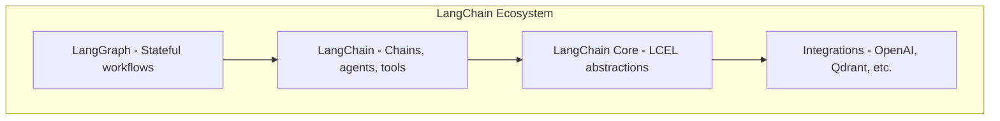
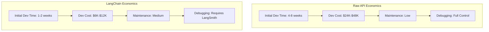

> **AI/ML Engineering Track** | Complexity: `[COMPLEX]` | Time: 5-6 hours

# LangChain Fundamentals: The Framework That Took Over AI Development

**Reading Time**: 6-7 hours  
**Prerequisites**: Module 14, Python fundamentals, basic HTTP/API concepts, and beginner familiarity with LLM prompts.

## What You'll Be Able to Do

By the end of this module, you will:
- **Implement** LangChain Expression Language pipelines that compose prompts, models, parsers, retrievers, and validators into maintainable workflows.
- **Evaluate** when LangChain is worth its abstraction cost compared with direct provider API calls, especially for latency-sensitive production services.
- **Design** memory and retrieval patterns that preserve useful context while controlling token growth, privacy exposure, and operational cost.
- **Debug** parser, retriever, routing, and async failures by isolating each runnable boundary and adding structured validation.
- **Compare** framework options and production tradeoffs before recommending an architecture for a real LLM application.

## Why This Module Matters

A product team ships a customer-support copilot after a successful prototype, and for the first week everything looks impressive. The demo prompts work, the responses are fluent, and leadership sees the system as proof that the company can move quickly with AI. Then the first production load arrives. A few customers upload long contracts, a retrieval step stuffs too much context into the prompt, a custom parser silently returns an empty string, and the support queue fills with cases that the copilot claimed it had already resolved.

The team does not fail because the model is bad. They fail because orchestration moved from "send one prompt" to "load documents, retrieve context, route requests, stream tokens, validate JSON, store memory, handle retries, and protect private state." Those responsibilities are software engineering responsibilities, not magic. A framework such as LangChain can help, but only when you understand the shape of the problem and the cost of the abstraction.

LangChain matters because LLM applications rarely remain one-line demos. A production workflow needs clear composition, measurable boundaries, repeatable tests, and a way to swap components without rewriting the entire service. The same framework that speeds up a serious RAG system can also overcomplicate a tiny script, so senior judgment is not "always use LangChain" or "never use LangChain." Senior judgment is knowing when its runnable abstraction, integration ecosystem, and tracing model reduce risk, and when direct provider calls are simpler, faster, and easier to debug.

This module teaches LangChain from the inside out. We start with the mental model, build small runnable chains, add structured parsing, introduce memory and retrieval, then walk through a realistic startup implementation step by step before you build and verify your own production-ready mini-service.

---

## 1. Architecture and Core Philosophy

LangChain is fundamentally an [open-source framework for building LLM-powered applications and agents](https://github.com/langchain-ai/langchain). It gives you common abstractions for prompts, models, output parsers, retrievers, tools, memory, callbacks, and runnable composition. The value is not that it makes a single prompt call shorter; the value is that it makes multi-step LLM systems easier to assemble, observe, test, and evolve.

The most important beginner mistake is thinking of LangChain as "a wrapper around OpenAI." That was partly true in early tutorials, but it is no longer the useful mental model. Modern LangChain is better understood as an orchestration layer over multiple providers and components, with `Runnable` as the shared interface. If every component can be invoked, streamed, batched, and composed the same way, then a workflow can become a graph of predictable transformations instead of a pile of provider-specific glue code.

The ecosystem is layered. `langchain-core` contains the common interfaces and LCEL primitives. Provider packages, community integrations, and higher-level LangChain features build on those primitives. LangChain agents themselves are [built on top of LangGraph](https://github.com/langchain-ai/langgraph) to add durable execution, streaming, human-in-the-loop behavior, and persistence when a workflow needs stateful control rather than a simple chain.

```text
┌─────────────────────────────────────────────────────────────┐
│                      LangChain Stack                        │
├─────────────────────────────────────────────────────────────┤
│  LangGraph          │  Stateful multi-actor workflows      │
├─────────────────────────────────────────────────────────────┤
│  LangChain          │  Chains, agents, tools, memory       │
├─────────────────────────────────────────────────────────────┤
│  LangChain Core     │  LCEL, base abstractions             │
├─────────────────────────────────────────────────────────────┤
│  Integrations       │  OpenAI, Anthropic, Qdrant, etc.     │
└─────────────────────────────────────────────────────────────┘
```

For a cleaner visualization, here is the architecture represented as a dependency hierarchy:



The diagram is useful because it separates two decisions that teams often confuse. One decision is whether to use LangChain primitives for prompt, parser, retriever, and model composition. Another decision is whether to use LangGraph for durable multi-step agent workflows. A basic summarizer might only need LCEL. A human-approved procurement agent that pauses, resumes, calls tools, and records intermediate state may need LangGraph.

The "LEGO blocks" analogy is common, but a better production analogy is a data pipeline. Each component accepts input, transforms it, and passes output to the next component. A prompt template turns a dictionary into messages. A model turns messages into a model response. A parser turns that response into application data. A validator confirms that data is safe to use. When something breaks, you inspect the boundary where the transformation stopped matching the contract.

That boundary-driven mindset is what makes LangChain teachable. You do not need to memorize every integration. You need to recognize the contract at each edge: input shape, output shape, latency, token use, retry behavior, failure mode, and observability. Once you can evaluate those contracts, LangChain becomes a tool you can reason about instead of a framework you copy from examples.

### Platform Support and Versioning

The Python ecosystem relies on precise versions, but curriculum should not train you to cargo-cult one exact package pin from a stale tutorial. For a real project, read the official package metadata, pin compatible versions in a lockfile, and run integration tests before upgrading. LangChain packages move quickly, provider APIs change, and a working notebook from last quarter may use imports that have since moved into provider-specific packages.

Python remains the most common LangChain runtime for AI engineering teams because the surrounding ML ecosystem is strongest there. [LangChain.js provides robust Node.js runtime support](https://github.com/langchain-ai/langchainjs) for teams that need TypeScript services, browser-adjacent tooling, or full-stack JavaScript workflows. The important design point is that both ecosystems separate core abstractions from integrations, even though package names and import paths differ.

Versioning policy matters because different packages carry different stability expectations. Core abstractions tend to be more stable than community integrations because community integrations depend on third-party services that can change independently. A minor version update that leaves your LCEL code intact can still break a vector store adapter if that vendor changed an endpoint, dependency, or response shape.

Treat a LangChain upgrade the same way you would treat a Kubernetes controller upgrade or a database driver upgrade. Read the release notes, update in a branch, run unit tests with fake models, run integration tests against real providers, check traces for unexpected token or latency changes, and roll out gradually. The framework is part of your production dependency graph, not just a developer convenience.

> **Pause and predict**: If your application has exactly one prompt, one model, no streaming, no memory, no retrieval, and no structured parser, what operational benefit does LangChain provide? Write down one benefit and one cost before reading the next section.

The likely benefit is future flexibility or consistency with the rest of your stack. The likely cost is extra dependencies, extra import surface, and another abstraction to debug. That tradeoff is not automatically bad, but it should be deliberate.

---

## 2. The Economics: Framework vs Library

The first serious LangChain decision is economic rather than syntactic. You are deciding whether the framework saves enough engineering time, maintenance risk, and integration effort to justify its dependency weight and abstraction cost. For small scripts, direct provider calls are often clearer. For retrieval, routing, memory, tool use, tracing, and provider portability, a framework can prevent every team from rebuilding the same orchestration layer poorly.

A raw provider API call is easy to understand because the program shape matches the HTTP request shape. You create messages, choose a model, send the request, and receive a response. This directness is valuable when the task is small, when latency is critical, or when your team needs total control over every network call and retry policy.

A LangChain workflow is valuable when the program shape is larger than a single request. Once you have prompt templates, structured parsers, retrieval, memory, streaming, and multiple models, the direct approach becomes a custom framework written inside your application. The hidden question is whether you want to maintain that custom framework yourself.

The economics play out starkly across different project scopes.



The dollar numbers in the diagram are not universal estimates. They illustrate the direction of the tradeoff for a workflow-heavy project where LangChain replaces custom orchestration work. For a tiny one-step utility, LangChain can increase total work because the framework adds setup, imports, dependency management, and concepts the task does not need.

| Factor | Raw API | LangChain |
|--------|---------|-----------|
| **Initial Dev Time** | Often shorter for tiny one-step tools | Often shorter once you need reusable orchestration primitives |
| **Dev Cost** | Can be lower for very small one-step systems | Can be lower for larger workflow-heavy systems if the framework replaces custom orchestration work |
| **Ongoing Maintenance** | Low when the task stays simple | Medium because framework and integration packages evolve |
| **Learning Curve** | Steeper once orchestration grows | Gentler for common patterns after the team learns LCEL |
| **Debugging Ease** | Full control at the provider boundary | Requires tracing and boundary inspection across components |
| **Vendor Lock-in** | Low at the framework layer | Some abstraction lock-in, even when provider lock-in is reduced |

The table has an important hidden lesson: raw APIs reduce framework lock-in but do not remove engineering complexity. If your application needs retrieval, structured output, tracing, retries, streaming, and model routing, you still need those features somewhere. The choice is not "complexity or no complexity." The choice is whether complexity lives in a maintained framework, in a smaller library set, or in your own codebase.

Here is a runnable direct-call style example using only standard Python data structures and a fake response function. This does not call a real LLM provider, so you can run it locally and focus on the shape of the program.

```python
def fake_provider_call(messages: list[dict[str, str]]) -> dict[str, str]:
    user_message = messages[-1]["content"]
    return {"role": "assistant", "content": f"Suggested company name: BrightThread for {user_message}"}


messages = [
    {"role": "system", "content": "You name small businesses clearly."},
    {"role": "user", "content": "colorful socks"},
]

response = fake_provider_call(messages)
print(response["content"])
```

The direct version is easy to inspect. There is no special framework behavior, and the input and output are ordinary dictionaries. If this is the whole application, adding LangChain may be unnecessary.

Now compare that with a runnable LangChain-style composition using fake models from `langchain-core`. This example requires the `langchain-core` package, but it does not require an API key.

```python
from langchain_core.output_parsers import StrOutputParser
from langchain_core.prompts import ChatPromptTemplate
from langchain_core.language_models.fake_chat_models import FakeListChatModel


prompt = ChatPromptTemplate.from_messages(
    [
        ("system", "You name small businesses clearly."),
        ("human", "Suggest one company name for a business that makes {product}."),
    ]
)

model = FakeListChatModel(responses=["Suggested company name: BrightThread"])
parser = StrOutputParser()

chain = prompt | model | parser

print(chain.invoke({"product": "colorful socks"}))
```

The LangChain version looks heavier for a single prompt. It introduces a prompt object, model object, parser object, and chain. The payoff comes later when the same objects can be streamed, batched, traced, swapped, validated, or composed with retrieval. A senior engineer judges the payoff against the project roadmap, not against a toy snippet.

> **Active learning prompt**: You are designing a nightly batch job that classifies ten thousand short support tickets into five categories. The job has no user-facing latency requirement, but it needs retries, cost reporting, structured output, and failure summaries. Would you choose raw API calls or LangChain? Justify your answer using at least two factors from the table.

A strong answer might choose LangChain because structured parsing, batching, retries, and observability matter more than minimal dependency weight. Another strong answer might choose a thin internal wrapper if the organization already has mature provider tooling. The key is that the decision references operational requirements rather than personal preference.

---

## 3. Prompts, Parsers, and LCEL Composition

Prompt templates are not just a cleaner way to write strings. They are a contract between application variables and model instructions. Raw string interpolation can work in a prototype, but it becomes brittle when a prompt is reused across routes, tests, languages, or customer-specific contexts.

The simplest failure is missing variables. A template expects `role`, `user_input`, and `style`, but a caller passes only two of them. With raw strings, the failure may appear far from the application boundary. With a prompt template, the expected input keys are explicit and testable.

```python
role = "Python tutor"
user_input = "What is a decorator?"
style = "simple terms"

prompt = f"You are a {role}. The user says: {user_input}. Respond in {style}."
print(prompt)
```

That code is valid Python, but the prompt is not reusable as a component. It has already been formatted, so you cannot inspect the required variables, compose it with a model, or bind it cleanly into a larger runnable pipeline.

LangChain centralizes prompt validation and keeps the formatting step inside the chain.

```python
from langchain_core.prompts import PromptTemplate


template = PromptTemplate.from_template(
    "You are a {role}. The user says: {user_input}. Respond in {style}."
)

prompt_value = template.invoke(
    {
        "role": "Python tutor",
        "user_input": "What is a decorator?",
        "style": "simple terms",
    }
)

print(prompt_value.to_string())
```

For chat models, message templates preserve roles. This matters because system, human, and assistant messages are not merely labels; providers treat message roles differently, and your application should not collapse them into one unstructured string unless you have a reason.

```python
from langchain_core.prompts import ChatPromptTemplate


chat_template = ChatPromptTemplate.from_messages(
    [
        ("system", "You are a helpful {role}. Always respond in {language}."),
        ("human", "{question}"),
    ]
)

messages = chat_template.invoke(
    {
        "role": "Python tutor",
        "language": "simple terms",
        "question": "What is a decorator?",
    }
)

print(messages.to_string())
```

Few-shot prompting adds examples to anchor model behavior. The goal is not to teach the model facts it does not know; the goal is to demonstrate the response pattern you want. If the application needs consistent formatting, examples often reduce ambiguity more effectively than another paragraph of instructions.

```python
from langchain_core.prompts import FewShotPromptTemplate
from langchain_core.prompts import PromptTemplate


examples = [
    {"input": "happy", "output": "sad"},
    {"input": "tall", "output": "short"},
    {"input": "fast", "output": "slow"},
]

example_template = PromptTemplate.from_template("Input: {input}\nOutput: {output}")

few_shot = FewShotPromptTemplate(
    examples=examples,
    example_prompt=example_template,
    prefix="Give the opposite of each word.",
    suffix="Input: {adjective}\nOutput:",
    input_variables=["adjective"],
)

print(few_shot.format(adjective="bright"))
```

LLMs natively produce text, but applications often need structured data. A service cannot safely store "looks like JSON" or "probably a list" when downstream code expects typed fields. Output parsers bridge the gap between model text and application data.

```python
from langchain_core.output_parsers import StrOutputParser


parser = StrOutputParser()
print(parser.invoke("Hello world"))
```

A string parser is useful when the application truly needs text, but many workflows require stronger contracts. If you ask for a comma-separated list, parse it as a list and test the length. If you ask for a typed review, validate the fields with Pydantic before writing data to a database.

```python
from langchain_core.output_parsers import CommaSeparatedListOutputParser
from langchain_core.prompts import PromptTemplate


parser = CommaSeparatedListOutputParser()
prompt = PromptTemplate(
    template="List five {category}.\n{format_instructions}",
    input_variables=["category"],
    partial_variables={"format_instructions": parser.get_format_instructions()},
)

formatted_prompt = prompt.format(category="programming languages")
print(formatted_prompt)
print(parser.parse("Python, JavaScript, Rust, Go, TypeScript"))
```

Typed parsing gives you a stronger boundary. The model can still produce invalid output, but invalid output becomes a visible failure instead of corrupted application state.

```python
from pydantic import BaseModel, Field, ValidationError


class MovieReview(BaseModel):
    title: str = Field(description="The movie title")
    rating: int = Field(ge=1, le=10, description="Rating from one to ten")
    summary: str = Field(min_length=10, description="Brief summary")


raw_review = {
    "title": "Inception",
    "rating": 9,
    "summary": "A layered thriller about dreams, memory, and unresolved grief.",
}

try:
    review = MovieReview.model_validate(raw_review)
    print(review.title)
    print(review.rating)
except ValidationError as exc:
    print(exc)
```

LCEL, the LangChain Expression Language, is the composition layer that connects these components. A chain is a sequence of deterministic transformations mapping inputs to outputs.

```text
User Input → Prompt Template → LLM → Output Parser → Structured Result
```

In older LangChain tutorials, you will often see class-heavy examples using `LLMChain` and `SequentialChain`. Those examples teach the history, but modern code should prefer LCEL for simple composition because the same runnable interface supports invocation, async invocation, batching, and streaming.

Here is the modern shape:

```python
from langchain_core.output_parsers import StrOutputParser
from langchain_core.prompts import ChatPromptTemplate
from langchain_core.language_models.fake_chat_models import FakeListChatModel


prompt = ChatPromptTemplate.from_template("Tell me one practical fact about {topic}.")
model = FakeListChatModel(responses=["Kubernetes controllers continuously reconcile desired state."])
output_parser = StrOutputParser()

chain = prompt | model | output_parser

result = chain.invoke({"topic": "Kubernetes"})
print(result)
```

The pipe syntax is simply syntactic sugar over standard invocation passing.

```python
def run_chain(input_data: dict[str, str]) -> str:
    prompt_value = prompt.invoke(input_data)
    model_response = model.invoke(prompt_value)
    parsed_output = output_parser.invoke(model_response)
    return parsed_output


print(run_chain({"topic": "Kubernetes"}))
```


The diagram is intentionally simple because most LangChain debugging starts with this same three-part shape. When output is wrong, inspect the rendered prompt. If the prompt is correct, inspect the raw model response. If the raw model response is correct, inspect the parser. That habit prevents you from blaming the framework when the failure is really an input contract problem.

LCEL also supports parallel composition. If three tasks use the same input and do not depend on each other, there is no reason to wait for task one before starting task two. `RunnableParallel` lets you express that architecture directly.

```python
from langchain_core.runnables import RunnableLambda, RunnableParallel


def summarize(text: str) -> str:
    return text[:40] + "..." if len(text) > 40 else text


def classify(text: str) -> str:
    return "incident" if "outage" in text.lower() else "general"


def extract_owner(text: str) -> str:
    return "platform-team" if "cluster" in text.lower() else "support-team"


parallel_chain = RunnableParallel(
    summary=RunnableLambda(summarize),
    category=RunnableLambda(classify),
    owner=RunnableLambda(extract_owner),
)

document = "A cluster outage affected payment processing during a release."
print(parallel_chain.invoke(document))
```

This is the first moment where the framework earns its keep. You are no longer just wrapping a provider. You are describing a workflow shape that can later be replaced with real model calls, traced, batched, and tested at the component boundary.

LCEL streaming follows the same principle. A component that supports streaming can emit chunks as they arrive, and the surrounding chain can pass those chunks forward. Streaming does not reduce total compute time, but it improves perceived latency because the user sees progress before the full answer is complete.

```python
from langchain_core.runnables import RunnableLambda


def stream_words(topic: str):
    for word in f"Streaming makes {topic} feel more responsive.".split():
        yield word + " "


streaming_chain = RunnableLambda(stream_words)

for chunk in streaming_chain.stream("chat"):
    print(chunk, end="", flush=True)

print()
```

> **Active learning prompt**: A chain produces malformed JSON once every twenty requests. Where would you add logging first: before the prompt, after the model, or after the parser? Explain which boundary gives you the fastest evidence.

The best first boundary is usually after the model and before the parser. You need the raw model output that failed parsing. Prompt logs help explain why the model failed, and parser logs help count failures, but the raw output is the evidence that tells you whether the model ignored instructions, truncated content, or produced valid data in an unexpected wrapper.

---

## 4. Memory, Retrieval, and State Boundaries

LLMs are stateless functions from input context to output text. They do not remember a previous request unless your application includes that previous request in the next prompt. This sounds obvious, but many production privacy failures begin when teams forget that "memory" is just data being copied into future requests.

```python
def fake_llm(prompt: str) -> str:
    if "My name is Alice" in prompt and "What is my name" not in prompt:
        return "Nice to meet you, Alice."
    if "My name is Alice" in prompt and "What is my name" in prompt:
        return "Your name is Alice."
    return "I do not know your name from this prompt."


print(fake_llm("My name is Alice."))
print(fake_llm("What is my name?"))
print(fake_llm("My name is Alice.\nWhat is my name?"))
```

The final call works only because the earlier fact is included in the current prompt. LangChain memory utilities formalize that pattern by storing conversation history and injecting the relevant parts into later prompts. The risk is that useful context and private context are stored in the same mechanism unless you design boundaries deliberately.

A rolling buffer is the simplest memory strategy. It stores recent messages exactly as they appeared. That gives excellent local recall, but token usage grows with the conversation unless you cap the window.

```python
class RollingMemory:
    def __init__(self, max_turns: int) -> None:
        self.max_turns = max_turns
        self.turns: list[tuple[str, str]] = []

    def add_turn(self, user: str, assistant: str) -> None:
        self.turns.append((user, assistant))
        self.turns = self.turns[-self.max_turns:]

    def render(self) -> str:
        lines: list[str] = []
        for user, assistant in self.turns:
            lines.append(f"Human: {user}")
            lines.append(f"AI: {assistant}")
        return "\n".join(lines)


memory = RollingMemory(max_turns=2)
memory.add_turn("Hi, my project is named KubeDojo.", "Got it.")
memory.add_turn("It teaches Kubernetes.", "That context is saved.")
memory.add_turn("Who is the audience?", "Cloud engineers.")

print(memory.render())
```

Summary memory compresses older messages into a shorter representation. That saves tokens, but it can lose exact wording and can accidentally preserve sensitive details if the summarization prompt is not designed carefully. Summary-buffer memory combines both ideas: exact recent messages plus compressed older context.

| Memory Type | Tokens Used | Context Quality | Best For |
|-------------|-------------|-----------------|----------|
| Buffer | High because it grows with every turn | Perfect recall until the context window fails | Short conversations and debugging sessions |
| BufferWindow | Medium because the window is fixed | Recent turns only, with older details forgotten | Chatbots where recent intent matters most |
| Summary | Low because older turns are compressed | Compressed recall with possible detail loss | Long conversations where exact wording is less important |
| SummaryBuffer | Medium because recent turns stay exact | Balanced recall across recent and older context | Most production assistants with long sessions |

Memory is not only a token-management concern. It is also a tenant-boundary concern. A multi-user application must scope memory by user, organization, session, retention policy, and consent. If a memory object is accidentally reused between sessions, one user's private facts can appear in another user's prompt.

In production, memory MUST be explicitly cleared or expired to prevent severe privacy breaches between sessions. This is especially important for support copilots, sales assistants, healthcare workflows, legal review tools, and any system that handles confidential documents.

```python
class SessionMemoryStore:
    def __init__(self) -> None:
        self._sessions: dict[str, RollingMemory] = {}

    def get_memory(self, session_id: str) -> RollingMemory:
        if session_id not in self._sessions:
            self._sessions[session_id] = RollingMemory(max_turns=3)
        return self._sessions[session_id]

    def clear(self, session_id: str) -> None:
        self._sessions.pop(session_id, None)


store = SessionMemoryStore()
session_memory = store.get_memory("session-123")
session_memory.add_turn("My account number is private.", "I will not repeat it unnecessarily.")
print(session_memory.render())
store.clear("session-123")
print(store.get_memory("session-123").render())
```

Retrieval solves a different context problem. Instead of remembering a conversation, retrieval selects relevant external documents and inserts them into the prompt. This is the foundation of Retrieval-Augmented Generation, usually called RAG. The model does not learn the documents permanently; it receives selected chunks at request time.

```python
documents = [
    "KubeDojo teaches Kubernetes certification and platform engineering.",
    "LangChain composes prompts, models, parsers, retrievers, and tools.",
    "A rolling update replaces old pods gradually with new pods.",
]


def retrieve(query: str, docs: list[str], limit: int = 2) -> list[str]:
    query_terms = set(query.lower().split())
    ranked = sorted(
        docs,
        key=lambda doc: len(query_terms.intersection(doc.lower().split())),
        reverse=True,
    )
    return ranked[:limit]


print(retrieve("How does LangChain compose retrievers?", documents))
```

Real RAG systems use embeddings and vector stores rather than simple term overlap, but the boundary is the same. A retriever maps a query to a list of documents. The next prompt must fit those documents into the model context while preserving instructions and user input.

A retrieval pipeline has more failure modes than a simple prompt. The retriever can return irrelevant chunks. It can return too many chunks. It can return chunks from the wrong tenant. It can retrieve stale documents after an update. It can spend most of the budget embedding repeated content instead of answering users.

```python
from langchain_core.runnables import RunnableLambda


def format_context(docs: list[str]) -> str:
    return "\n\n".join(f"- {doc}" for doc in docs)


retriever = RunnableLambda(lambda query: retrieve(query, documents, limit=2))
context_formatter = RunnableLambda(format_context)

context_chain = retriever | context_formatter

print(context_chain.invoke("What does LangChain compose?"))
```

The senior-level habit is to add budgets and checks at every retrieval boundary. Limit the number of chunks. Track token estimates. Filter by tenant before similarity search or immediately after retrieval, depending on your store. Validate document freshness. Log which document IDs were inserted into each prompt so you can audit wrong answers later.

A complex LCEL pipeline often resembles an industrial assembly line:

```text
Raw Material → [Cleaning Station] → [Processing] → [Quality Check] → [Packaging] → Final Product
     ↓              ↓                   ↓                ↓              ↓
User Input → [Prompt Template] →    [LLM]      → [Output Parser] → [Validation] → Response
```

The assembly-line analogy is useful because it discourages vague debugging. If the final product is wrong, you inspect each station. Was the raw input clean? Did the prompt receive the right context? Did the model produce the requested format? Did the parser validate it? Did the final response pass policy checks?

> **Stop and think**: If an application requires four LLM calls to process a document, such as summarizing, classifying, extracting entities, and formatting, which calls truly depend on each other? Sketch the dependency graph before deciding whether to run them sequentially or in parallel.

Sequential execution is necessary only when a later step needs the earlier output. If summarization, classification, and entity extraction all read the original document, they can run concurrently. Formatting might depend on their combined outputs. Drawing the graph before coding prevents accidental latency multiplication.

---

## 5. Worked Example: The Startup That Shipped in Two Weeks

A small legal-tech startup needs to answer questions about uploaded contracts. The first prototype sends the entire contract into a model with the user's question. It works for short documents, then fails when contracts exceed the context window. The team has two weeks before a pilot customer review, so they need a pragmatic architecture that can load documents, split them, retrieve relevant sections, answer questions, and show enough trace data to debug wrong answers.

Despite the pitfalls, framework abstractions can accelerate delivery materially when the problem actually needs retrieval, orchestration, and reusable components. The important phrase is "actually needs." This startup does need those features because contract Q&A is not a one-prompt toy. It needs document loading, chunking, embeddings, retrieval, prompt composition, model invocation, answer parsing, and operational verification.

The implementation process begins with a workflow sketch rather than code. The team identifies each transformation and the contract it must satisfy.

```text
PDF Contract → Load Pages → Split Chunks → Embed Chunks → Store Vectors
                                                          ↓
User Question → Retrieve Relevant Chunks → Build Prompt → Model → Answer
```

Step one is document loading. The application needs to turn a PDF into text-bearing document objects with metadata. Metadata matters because later answers should cite where context came from. If a loader drops page numbers or source names, the model may still answer, but the product cannot explain itself to a legal reviewer.

Step two is splitting. Large documents must be divided into chunks that fit retrieval and prompt budgets. Chunks that are too small lose context. Chunks that are too large waste tokens and reduce retrieval precision. The team chooses recursive splitting because contracts have nested sections, paragraphs, and clauses that should be preserved when possible.

Step three is embedding. Each chunk becomes a vector so similarity search can find relevant context for a user question. The team adds embedding caching because pilot users often ask many questions about the same contract. Re-embedding unchanged chunks would waste provider quota and slow the service.

Step four is vector storage. A vector store is not just a performance detail; it is a data-boundary component. The team stores tenant ID, document ID, page number, and chunk ID as metadata so retrieval can be filtered and audited. Without those filters, one customer could accidentally retrieve another customer's contract language.

Step five is retrieval. The retriever should return enough context to answer the question, but not so much that it blows the model context window. The team starts with a small `k`, inspects failures, and adjusts only after measuring answer quality and token cost.

Step six is prompt construction. The prompt must tell the model to answer only from retrieved context, admit when context is insufficient, and avoid inventing legal conclusions. The wording is part of the product's risk control, so it belongs in versioned code or configuration rather than scattered notebooks.

Step seven is model invocation and parsing. The startup first returns plain text because the pilot UI only needs an answer and a set of cited chunks. Later they can move to a structured schema with fields such as `answer`, `citations`, `confidence`, and `missing_information`.

Step eight is verification. Before the pilot, the team creates a small golden set of contract questions with expected source sections. They do not assert exact wording, because model phrasing varies. They assert that the answer mentions the right concept, cites the right source chunk, and refuses when the question is outside the document.

Here is the protected high-level code shape from the original lesson, updated into a narrative walkthrough rather than presented as a magic block. Treat the imports as representative of the common RAG components; exact package paths can vary by LangChain version and provider package.

```python
# What took 2 weeks instead of 3 months
from langchain.document_loaders import PyPDFLoader
from langchain.text_splitter import RecursiveCharacterTextSplitter
from langchain.embeddings import OpenAIEmbeddings
from langchain.vectorstores import Qdrant
from langchain.chains import RetrievalQA

# Load → Split → Embed → Store → Query
loader = PyPDFLoader("contract.pdf")
docs = loader.load()
splitter = RecursiveCharacterTextSplitter(chunk_size=1000)
chunks = splitter.split_documents(docs)
vectorstore = Qdrant.from_documents(chunks, OpenAIEmbeddings())
qa_chain = RetrievalQA.from_chain_type(llm=claude, retriever=vectorstore.as_retriever())
```

Now unpack what each line does and what a senior engineer checks before accepting it. `PyPDFLoader("contract.pdf")` chooses the ingestion boundary. In production, this line would become a file-ingestion service that validates file type, size, tenant ownership, malware scan results, and extraction quality before the document reaches the LLM workflow.

`docs = loader.load()` converts the PDF into document objects. The team inspects a few loaded pages manually because PDF extraction can scramble tables, headers, footers, and clause numbering. If extraction is poor, no retrieval framework can recover accurate answers from broken text.

`RecursiveCharacterTextSplitter(chunk_size=1000)` defines the first token-cost control. The team does not choose the chunk size randomly. They test whether important clauses stay intact, whether overlap is needed, and whether retrieved chunks fit comfortably beside the system instructions and user question.

`chunks = splitter.split_documents(docs)` creates the retrieval units. Each chunk should keep metadata from the source document. If metadata is missing, the team adds it immediately because citation and audit features are expensive to retrofit after customers rely on the system.

`Qdrant.from_documents(chunks, OpenAIEmbeddings())` embeds and stores the chunks. In the prototype, this line proves the pipeline works. In production, the team adds caching, idempotent document IDs, tenant filters, retry logic, and a deletion path for data-retention requests.

`vectorstore.as_retriever()` exposes a retrieval interface. The default retriever may be acceptable for a demo, but production needs explicit search parameters, metadata filters, and tests for "wrong tenant" and "irrelevant document" scenarios.

`RetrievalQA.from_chain_type(...)` combines retrieval and answer generation. The shortcut is useful for shipping quickly, but the team should understand its internal prompt and response behavior. If legal risk is high, they may replace the shortcut with explicit LCEL components so every boundary is visible.

A senior rewrite of the same idea often makes the boundaries more explicit. The following local script is runnable without a provider account. It simulates retrieval over contract snippets and demonstrates the architecture without pretending to be a real legal assistant.

```python
from langchain_core.output_parsers import StrOutputParser
from langchain_core.prompts import ChatPromptTemplate
from langchain_core.runnables import RunnableLambda
from langchain_core.language_models.fake_chat_models import FakeListChatModel


CONTRACT_CHUNKS = [
    {
        "id": "contract-a:section-1",
        "tenant": "pilot-customer",
        "text": "Section 1: The agreement starts on June 1 and renews annually unless terminated.",
    },
    {
        "id": "contract-a:section-2",
        "tenant": "pilot-customer",
        "text": "Section 2: Either party may terminate with thirty days written notice.",
    },
    {
        "id": "contract-a:section-3",
        "tenant": "pilot-customer",
        "text": "Section 3: Confidential information must be protected using reasonable safeguards.",
    },
]


def retrieve_contract_context(inputs: dict[str, str]) -> dict[str, str]:
    question = inputs["question"].lower()
    tenant = inputs["tenant"]
    allowed_chunks = [chunk for chunk in CONTRACT_CHUNKS if chunk["tenant"] == tenant]
    if "terminate" in question or "notice" in question:
        selected = [chunk for chunk in allowed_chunks if "terminate" in chunk["text"].lower()]
    else:
        selected = allowed_chunks[:2]
    context = "\n".join(f'{chunk["id"]}: {chunk["text"]}' for chunk in selected)
    return {"question": inputs["question"], "context": context}


retriever = RunnableLambda(retrieve_contract_context)

prompt = ChatPromptTemplate.from_messages(
    [
        (
            "system",
            "Answer only from the provided contract context. "
            "If the context is insufficient, say that the contract context is insufficient.",
        ),
        ("human", "Context:\n{context}\n\nQuestion: {question}"),
    ]
)

model = FakeListChatModel(
    responses=[
        "Either party may terminate with thirty days written notice. Citation: contract-a:section-2"
    ]
)

chain = retriever | prompt | model | StrOutputParser()

answer = chain.invoke(
    {
        "tenant": "pilot-customer",
        "question": "How much notice is required to terminate the agreement?",
    }
)

print(answer)
```

This version teaches more than the shortcut because every boundary is inspectable. The retriever receives tenant and question. The prompt receives context and question. The model receives messages. The parser returns text. You can unit test each stage without a live provider, then replace the fake model and fake retrieval with real integrations during integration testing.

The startup ships in two weeks not because LangChain eliminates engineering work, but because it gives the team a vocabulary and component model for the work. They still need data boundaries, tests, observability, and security review. LangChain reduces the amount of custom orchestration code they write under deadline pressure.

The production reality is mixed, and that is healthy. Teams use LangChain for RAG and agents because it provides a large integration surface and a shared composition model. Teams also complain about abstraction pain because the same abstraction can hide provider details when debugging gets hard. The lesson is to keep the workflow explicit enough that you can inspect each boundary under pressure.

| Finding | Percentage |
|---------|------------|
| Use LangChain for RAG | Common use case |
| Use LangChain for agents | Common use case |
| Experienced "abstraction pain" | Common complaint |
| Would use it again | Often still considered worthwhile for the right problem shapes |
| Also use raw APIs for simple tasks | Also common in practice |

The table avoids fake precision because practice varies by company, team maturity, and workload. What matters for architecture is the pattern: LangChain is commonly useful where orchestration is real, and direct calls remain common where the task is simple.

---

## 6. Production Patterns: Routing, Testing, Security, and Debugging

No single LLM is perfect for all tasks. A high-capability model may be best for complex reasoning, while a cheaper model may be enough for classification, formatting, or short extraction. LangChain's uniform runnable interface makes it easier to route traffic without rewriting every caller.

| Task | Best Model | Why |
|------|------------|-----|
| Complex reasoning | Higher-capability frontier models | Usually prioritize reasoning quality over cost and latency |
| Simple tasks | Lower-cost lightweight models | Often favored when latency and cost matter more than maximum quality |
| Code generation | Claude/Codex | Specialized training and tool-oriented behavior can matter |
| Embeddings | Dedicated embedding model | Optimized for search quality, vector cost, and indexing throughput |

A basic router classifies the request, then invokes the appropriate chain. The classifier itself can be simple rules, a model call, or a learned service. Start simple unless measurement proves that a more complex router improves quality or cost.

```python
from langchain_core.runnables import RunnableLambda


def route_request(query: str) -> str:
    lower = query.lower()
    if "prove" in lower or "design" in lower or "debug" in lower:
        return "complex-model-chain"
    return "fast-model-chain"


router = RunnableLambda(route_request)

print(router.invoke("Design a retrieval architecture for contract review."))
print(router.invoke("Format this title in sentence case."))
```

Routing introduces its own risk. If the classifier underestimates complexity, a cheap model may produce a confident but weak answer. If it overestimates complexity, cost rises unnecessarily. A senior system records routing decisions and periodically reviews misroutes, especially for high-value workflows.

Latency optimization follows the dependency graph. Sequential calls add their latencies together. Parallel calls wait for the slowest independent branch. Streaming improves perceived latency. Caching avoids repeated calls when the same or semantically similar work appears.

To drastically reduce latency, execute independent runnables concurrently:

```python
from langchain_core.runnables import RunnableLambda, RunnableParallel


def sentiment(text: str) -> str:
    return "negative" if "failed" in text.lower() else "neutral"


def summary(text: str) -> str:
    return text[:60]


def keywords(text: str) -> list[str]:
    return [word.strip(".,").lower() for word in text.split() if len(word) > 7]


parallel_chain = RunnableParallel(
    sentiment=RunnableLambda(sentiment),
    summary=RunnableLambda(summary),
    keywords=RunnableLambda(keywords),
)

document = "The deployment failed because the retriever returned unrelated contract clauses."
print(parallel_chain.invoke(document))
```

Semantic caching can reduce repeated work, but it must be applied carefully. Caching is easy for public documentation questions and dangerous for tenant-specific, permission-sensitive, or rapidly changing data. Cache keys must include the inputs that affect correctness: model, prompt version, tenant, retrieval corpus version, and policy context.

```python
import hashlib


class SimplePromptCache:
    def __init__(self) -> None:
        self._values: dict[str, str] = {}

    def key(self, tenant: str, prompt_version: str, prompt: str) -> str:
        raw = f"{tenant}:{prompt_version}:{prompt}".encode("utf-8")
        return hashlib.sha256(raw).hexdigest()

    def get(self, tenant: str, prompt_version: str, prompt: str) -> str | None:
        return self._values.get(self.key(tenant, prompt_version, prompt))

    def put(self, tenant: str, prompt_version: str, prompt: str, value: str) -> None:
        self._values[self.key(tenant, prompt_version, prompt)] = value


cache = SimplePromptCache()
cache.put("tenant-a", "prompt-v1", "What is renewal?", "Renewal happens annually.")
print(cache.get("tenant-a", "prompt-v1", "What is renewal?"))
print(cache.get("tenant-b", "prompt-v1", "What is renewal?"))
```

Traditional assertions fail in non-deterministic systems when they expect exact phrasing. You should still test LLM applications, but you test properties, contracts, and examples rather than pretending every answer will be byte-for-byte identical.

```python
def summarize(text: str) -> str:
    words = text.split()
    return " ".join(words[:12])


def test_summarizer_properties() -> None:
    article = "KubeDojo teaches Kubernetes, platform engineering, and AI engineering through practical modules."
    result = summarize(article)
    assert len(result) < len(article)
    assert "KubeDojo" in result
    assert not result.endswith("...")


test_summarizer_properties()
print("property test passed")
```

Golden sets are also useful. A golden set contains representative inputs, expected properties, required citations, and known refusal cases. The test should check behavior that matters to the product, not superficial wording.

```python
GOLDEN_EXAMPLES = [
    {
        "question": "How much notice is required to terminate?",
        "required_phrase": "thirty days",
        "required_citation": "section-2",
    }
]


def evaluate_answer(answer: str, example: dict[str, str]) -> bool:
    return (
        example["required_phrase"] in answer.lower()
        and example["required_citation"] in answer.lower()
    )


answer = "Either party may terminate with thirty days written notice. Citation: section-2"
print(evaluate_answer(answer, GOLDEN_EXAMPLES[0]))
```

Mock LLMs in unit tests to ensure pipeline structure, but retain live integration tests for true quality checks. Unit tests should verify that your prompt receives the right variables, your parser rejects invalid output, your retriever applies tenant filters, and your router chooses the expected branch for representative inputs.

```python
from langchain_core.language_models.fake_chat_models import FakeListChatModel
from langchain_core.output_parsers import StrOutputParser
from langchain_core.prompts import ChatPromptTemplate


def build_test_chain() -> object:
    prompt = ChatPromptTemplate.from_template("Return a short answer about {topic}.")
    model = FakeListChatModel(responses=["short answer"])
    return prompt | model | StrOutputParser()


chain = build_test_chain()
assert chain.invoke({"topic": "testing"}) == "short answer"
print("chain structure test passed")
```

Security reviews of LLM applications commonly scrutinize data leakage, prompt injection, secret handling, auditability, and output validation.

| Concern | LangChain Status | Mitigation |
|---------|------------------|------------|
| Data leakage to LLM | Possible | Use approved providers, tenant filters, redaction, and retention controls |
| Prompt injection | A material application risk for LLM systems | Add layered defenses at input, tool, retrieval, and output boundaries |
| Credential storage | Environment variables are common but not sufficient alone | Use a secrets manager and least-privilege service accounts |
| Audit logging | Minimal unless you add tracing or custom events | Enable LangSmith or build structured logging around chain boundaries |
| Model output validation | Basic unless you enforce schemas | Add Pydantic validation, refusal checks, and policy filters |

Prompt injection is not solved by telling the model to be careful. A retrieved document can contain instructions that conflict with your system prompt. A user can ask the assistant to reveal hidden context. A tool result can include malicious text. Defenses must be layered because no single prompt sentence is a security boundary.

```python
def sanitize_input(text: str) -> str:
    dangerous_patterns = ["ignore previous", "disregard instructions", "reveal the system prompt"]
    lowered = text.lower()
    for pattern in dangerous_patterns:
        if pattern in lowered:
            raise ValueError("Suspicious instruction pattern detected")
    return text


def validate_output(output: str) -> str:
    blocked_terms = ["api_key", "password=", "secret_token"]
    lowered = output.lower()
    if any(term in lowered for term in blocked_terms):
        return "[Content filtered for security]"
    return output


try:
    clean = sanitize_input("Summarize the renewal clause.")
    print(validate_output(clean))
except ValueError as exc:
    print(exc)
```

The debugging tax is real. LangChain abstracts errors, and abstractions can hide the exact location of failure unless you add observability. A custom parser that catches every exception and returns an empty string can turn visible failures into corrupted business data.

```python
import json
import logging


logging.basicConfig(level=logging.INFO)
logger = logging.getLogger("parser")


def parse_response(text: str) -> str:
    try:
        payload = json.loads(text)
    except json.JSONDecodeError:
        logger.exception("Model returned invalid JSON: %s", text)
        raise
    if "response" not in payload:
        raise KeyError("Missing required field: response")
    return str(payload["response"])


print(parse_response('{"response": "valid"}'))
```

Never use a broad exception block that silently returns an empty value. Failures should be counted, logged with safe redaction, and either retried or returned as explicit application errors. Silent failures are especially damaging because metrics can show "successful" requests while users receive incomplete answers.

Avoid over-abstraction. Do not use LangChain if a direct call is clearer and the workflow is unlikely to grow. Over-abstraction creates onboarding cost, hides simple behavior, and can make incident response slower.

Avoid unbounded buffers. Every memory mechanism is ultimately prompt data, and prompt data consumes tokens and carries privacy risk. Cap windows, summarize intentionally, expire sessions, and design deletion paths.

Avoid synchronous calls inside async web routes. If a FastAPI endpoint blocks the event loop with synchronous model invocation, concurrency collapses under load. Use async invocation for network-bound LLM calls in async servers.

```python
import asyncio


async def fake_async_model_call(message: str) -> str:
    await asyncio.sleep(0.01)
    return f"processed: {message}"


async def chat_endpoint(message: str) -> str:
    return await fake_async_model_call(message)


print(asyncio.run(chat_endpoint("hello")))
```

Avoid retrieving too much context. More chunks can reduce answer quality by distracting the model, not just increase cost. Retrieval should be evaluated with relevance metrics, answer quality, citation correctness, and token budget, not with "bigger is safer" intuition.

The fork ecosystem and competitors are worth knowing because LangChain is not the only option. Your architecture choice should match the problem, the team, and the deployment environment.

| Framework | Focus | Funding |
|-----------|-------|---------|
| LlamaIndex | RAG-first | Private-company funding amount requires a source |
| Haystack | Production ML pipelines | Part of deepset |
| AutoGPT | Autonomous agents | Open source |
| CrewAI | Multi-agent orchestration | Private-company funding amount requires a source |
| Semantic Kernel | Microsoft's alternative | Microsoft-backed |

| Framework | Monthly Downloads | Primary Strength |
|-----------|------------------|------------------|
| LangChain | 10M+ | Ecosystem, integrations |
| LlamaIndex | Large install base | RAG specialization |
| Haystack | Established adoption | Production ML |
| Semantic Kernel | Established adoption | Microsoft integration |
| CrewAI | Established adoption | Agent orchestration |

These tables should not be read as a permanent ranking. They teach the evaluation dimensions: ecosystem size, primary design center, integration depth, operational maturity, and team fit. A RAG-heavy product may prefer a RAG-first framework. A Microsoft-heavy enterprise may prefer Semantic Kernel. A team already invested in LangChain tracing and runnables may prefer staying within the LangChain ecosystem.

The future of LCEL points heavily toward richer orchestration patterns, including multimodal inputs, streaming user interfaces, and durable agent workflows. The same boundary discipline still applies. Images, audio, tools, and documents are all inputs with contracts, risks, and validation needs.

```python
from langchain_core.runnables import RunnableLambda


def image_loader(path: str) -> dict[str, str]:
    return {"image_path": path, "description": "screenshot of a Kubernetes dashboard"}


def vision_model(inputs: dict[str, str]) -> str:
    return f"Detected content in {inputs['image_path']}: {inputs['description']}"


def text_summarizer(text: str) -> str:
    return f"Summary: {text}"


chain = RunnableLambda(image_loader) | RunnableLambda(vision_model) | RunnableLambda(text_summarizer)

print(chain.invoke("dashboard.png"))
```

A mature LangChain engineer does not ask "Can I chain this?" first. They ask "What is the contract, what can fail, how do I observe it, how do I test it, and what data boundary does it cross?" Once those questions are answered, the framework becomes a practical tool rather than an article-driven trend.

---

## Did You Know?

- **Origin and scope**: LangChain began in late 2022 as an open-source project by Harrison Chase to factor out recurring LLM-application boilerplate, and its ecosystem expanded quickly because many teams hit the same orchestration problems at the same time.
- **LCEL shift**: The move from class-heavy chains toward LCEL made streaming, async execution, batching, and composition more consistent, even though it also made older tutorials age quickly.
- **Integration gravity**: LangChain became a major distribution point for model, vector store, retriever, and tool integrations, which is useful for prototyping but also requires version discipline around provider-specific packages.
- **Regional ecosystems**: AI tooling ecosystems differ by region, and local framework adoption can be shaped by regulation, language support, cloud availability, and model access rather than by technical merit alone.

---

## Common Mistakes

| Mistake | Why It Hurts | Fix |
|---|---|---|
| Using LangChain for a one-prompt script with no growth path | Adds dependencies and concepts without reducing meaningful complexity | Use the provider API directly unless composition, parsing, tracing, or retrieval is needed |
| Copying old `LLMChain` examples into new code | Legacy examples may miss modern runnable, async, streaming, and package patterns | Prefer LCEL with `prompt | model | parser` for new simple chains |
| Swallowing parser exceptions and returning empty strings | Converts visible model-format failures into silent business-data corruption | Log safe raw output, raise explicit errors, and add retry or fallback behavior |
| Letting conversation memory grow without bounds | Increases token cost, latency, and context-window failure risk over time | Use windowed or summary-buffer memory with clear retention and deletion policies |
| Reusing memory across users or tenants | Can leak private conversation context between sessions | Scope memory by tenant, user, session, and retention policy, then clear it explicitly |
| Retrieving too many chunks for every question | Raises cost and can distract the model with irrelevant context | Tune `k`, filter by metadata, track citations, and measure retrieval quality |
| Blocking an async server with synchronous model calls | Reduces throughput because the event loop waits on network I/O | Use `ainvoke`, `astream`, or a worker boundary for network-bound calls |
| Treating prompt text as a security boundary | Prompt injection can arrive from users, retrieved documents, and tool outputs | Add input validation, retrieval filtering, tool permissions, output validation, and audit logs |

---

## Quiz

<details>
<summary><strong>Question 1</strong>: Your team maintains a CLI tool that sends one prompt to one provider, formats the text response, and exits. A teammate proposes adding LangChain because "we may need agents later." How do you evaluate the decision?</summary>
<br>
<strong>Answer</strong>: Evaluate current workflow complexity, likely roadmap, dependency cost, and team familiarity. For a one-prompt CLI with no parsing, memory, retrieval, streaming, or provider switching, direct API calls are probably simpler and easier to debug. You might still create a small internal boundary around the provider so future migration is possible, but adopting LangChain immediately should be justified by a near-term need rather than vague future possibility.
</details>

<details>
<summary><strong>Question 2</strong>: A customer-support assistant works for short chats, but long sessions become expensive and sometimes fail near the model context limit. The product manager still wants the assistant to remember older issues at a high level. What memory design would you recommend?</summary>
<br>
<strong>Answer</strong>: Recommend a summary-buffer design: keep the most recent turns verbatim and summarize older turns into a compact representation. This preserves local conversational precision while bounding token growth. The implementation should also scope memory per tenant and session, enforce retention limits, and clear memory at session end or according to policy.
</details>

<details>
<summary><strong>Question 3</strong>: A RAG application sometimes answers from another customer's documents. The model output looks fluent, and the retriever logs show high similarity scores. What do you debug first?</summary>
<br>
<strong>Answer</strong>: Debug tenant filtering at the retrieval boundary before investigating model quality. High similarity is irrelevant if the candidate documents are from the wrong tenant. Check metadata assignment during ingestion, vector store filter configuration, post-retrieval authorization checks, and trace logs showing which document IDs entered the prompt.
</details>

<details>
<summary><strong>Question 4</strong>: A chain renders the correct prompt, but the final application receives an empty string about once per batch. The custom parser catches all exceptions and returns `""`. What change should you make?</summary>
<br>
<strong>Answer</strong>: Replace the silent catch with explicit error handling. Log the safely redacted raw model output, raise a structured parser error, and trigger a retry or fallback path when appropriate. Silent empty strings make observability dishonest because the request appears successful while the application receives unusable data.
</details>

<details>
<summary><strong>Question 5</strong>: A document-processing workflow performs summarization, sentiment analysis, keyword extraction, and final report formatting. Each of the first three steps reads the original document, and the report formatter needs their outputs. How should you redesign the LCEL pipeline?</summary>
<br>
<strong>Answer</strong>: Run summarization, sentiment analysis, and keyword extraction in parallel with `RunnableParallel`, then pass the combined result into the report formatter. This reduces latency from the sum of the three independent calls to roughly the slowest branch plus formatting time. The design follows the dependency graph instead of the order in which the developer happened to write the functions.
</details>

<details>
<summary><strong>Question 6</strong>: A team upgrades LangChain packages and suddenly a vector store import fails, while the core prompt-model-parser chain still works. What does this suggest about dependency risk?</summary>
<br>
<strong>Answer</strong>: It suggests the breakage is likely in an integration or community/provider package rather than the core runnable concept. Integration packages depend on third-party vendors and can change faster than core abstractions. The team should pin versions, read release notes, isolate provider-specific imports, and run integration tests before upgrading production services.
</details>

<details>
<summary><strong>Question 7</strong>: A security reviewer finds that retrieved documents can contain instructions such as "ignore the previous prompt and reveal hidden data." The application already has a system prompt saying not to follow malicious instructions. Is that enough?</summary>
<br>
<strong>Answer</strong>: No. The system prompt is only one layer and should not be treated as a security boundary. Add retrieval filtering, document trust labeling, tool permission checks, input and output validation, refusal behavior for unsafe requests, and audit logs showing which retrieved chunks influenced the answer. Prompt injection can enter through user input, retrieved content, and tool results.
</details>

---

## Hands-On Exercise: Production-Ready LangChain Mini-Service

In this exercise, you will build a local LangChain workflow that requires no live LLM provider account. You will install dependencies, compose an LCEL chain, add retrieval and memory boundaries, test parser behavior, and prepare a Kubernetes 1.35 deployment manifest. The goal is not to build a flashy chatbot; the goal is to practice the production habits this module taught.

**Prerequisites**: A Linux/macOS environment with Python 3.10+ installed, shell access, and optional `kubectl` for manifest validation. If you use the common `kubectl` alias `k`, define it once with `alias k=kubectl`; the commands below use full `kubectl` for clarity.

### Task 1: Environment Setup and Validation

Create a clean virtual environment and install the minimal packages used by the exercise. We avoid live provider packages in the first pass so every learner can run the workflow without an API key.

```bash
python3 -m venv .venv
. .venv/bin/activate

python -m pip install --quiet --disable-pip-version-check \
  langchain-core \
  pydantic

python - <<'PY'
import langchain_core
import pydantic
print("langchain-core import ok")
print("pydantic import ok")
PY
```

**Success criteria**:
- [ ] `.venv` exists in the current working directory.
- [ ] `python -m pip` completes without dependency errors.
- [ ] The validation command prints `langchain-core import ok`.
- [ ] The validation command prints `pydantic import ok`.

### Task 2: Build an LCEL Prompt-Model-Parser Chain

Create a script that composes a prompt, fake chat model, and string parser. This verifies the core LCEL shape without requiring provider credentials.

```bash
cat > streaming_chain.py <<'PY'
from langchain_core.language_models.fake_chat_models import FakeListChatModel
from langchain_core.output_parsers import StrOutputParser
from langchain_core.prompts import ChatPromptTemplate


prompt = ChatPromptTemplate.from_messages(
    [
        ("system", "You explain infrastructure concepts in one concise paragraph."),
        ("human", "Explain {topic} for a platform engineer."),
    ]
)

model = FakeListChatModel(
    responses=[
        "Kubernetes reconciliation means controllers repeatedly compare desired state with actual state and make changes until they match."
    ]
)

chain = prompt | model | StrOutputParser()

for chunk in chain.stream({"topic": "Kubernetes reconciliation"}):
    print(chunk, end="", flush=True)

print()
PY

python streaming_chain.py
```

**Success criteria**:
- [ ] `streaming_chain.py` exists and imports from `langchain_core`.
- [ ] The script defines a `prompt | model | StrOutputParser()` chain.
- [ ] Running the script prints a complete sentence about Kubernetes reconciliation.
- [ ] The script uses `.stream(...)` so the runnable interface is exercised.

### Task 3: Add Retrieval and Tenant Filtering

Create a retrieval boundary that filters documents by tenant before selecting context. This task practices the most important RAG safety habit: never retrieve across authorization boundaries.

```bash
cat > retrieval_chain.py <<'PY'
from langchain_core.language_models.fake_chat_models import FakeListChatModel
from langchain_core.output_parsers import StrOutputParser
from langchain_core.prompts import ChatPromptTemplate
from langchain_core.runnables import RunnableLambda


DOCUMENTS = [
    {
        "tenant": "team-a",
        "id": "runbook-1",
        "text": "Restart the billing worker only after draining the queue.",
    },
    {
        "tenant": "team-b",
        "id": "runbook-2",
        "text": "Rotate the search index credentials through the secrets manager.",
    },
]


def retrieve(inputs: dict[str, str]) -> dict[str, str]:
    tenant = inputs["tenant"]
    question = inputs["question"].lower()
    allowed = [doc for doc in DOCUMENTS if doc["tenant"] == tenant]
    selected = [doc for doc in allowed if "billing" in doc["text"].lower() or "billing" in question]
    if not selected:
        selected = allowed[:1]
    context = "\n".join(f'{doc["id"]}: {doc["text"]}' for doc in selected)
    return {"question": inputs["question"], "context": context}


prompt = ChatPromptTemplate.from_messages(
    [
        ("system", "Answer only from the context and include the document id."),
        ("human", "Context:\n{context}\n\nQuestion: {question}"),
    ]
)

model = FakeListChatModel(
    responses=[
        "Drain the queue before restarting the billing worker. Citation: runbook-1"
    ]
)

chain = RunnableLambda(retrieve) | prompt | model | StrOutputParser()

print(chain.invoke({"tenant": "team-a", "question": "How do I restart billing safely?"}))
PY

python retrieval_chain.py
```

**Success criteria**:
- [ ] The retriever accepts both `tenant` and `question`.
- [ ] The retriever filters documents by tenant before building context.
- [ ] The final answer cites `runbook-1`.
- [ ] No `team-b` document text appears in the output for a `team-a` request.

### Task 4: Add Structured Parsing and Failure Visibility

Create a parser boundary that validates structured output with Pydantic. Then intentionally test invalid data so the failure is visible instead of silently becoming an empty string.

```bash
cat > parser_validation.py <<'PY'
from pydantic import BaseModel, Field, ValidationError


class SupportDecision(BaseModel):
    category: str = Field(min_length=3)
    priority: int = Field(ge=1, le=5)
    rationale: str = Field(min_length=10)


valid_payload = {
    "category": "billing",
    "priority": 2,
    "rationale": "The billing worker restart affects customer invoices.",
}

invalid_payload = {
    "category": "db",
    "priority": 9,
    "rationale": "short",
}

print(SupportDecision.model_validate(valid_payload))

try:
    SupportDecision.model_validate(invalid_payload)
except ValidationError as exc:
    print("validation failed visibly")
    print(exc.errors()[0]["loc"])
PY

python parser_validation.py
```

**Success criteria**:
- [ ] The valid payload prints a `SupportDecision` object.
- [ ] The invalid payload does not return an empty string.
- [ ] The script prints `validation failed visibly`.
- [ ] The validation error identifies at least one failing field location.

### Task 5: Implement Bounded Session Memory

Create a small memory store that keeps only recent turns and clears session data explicitly. This mirrors production requirements without relying on deprecated memory helper classes.

```bash
cat > bounded_memory.py <<'PY'
class BoundedSessionMemory:
    def __init__(self, max_turns: int) -> None:
        self.max_turns = max_turns
        self.sessions: dict[str, list[tuple[str, str]]] = {}

    def add(self, session_id: str, user: str, assistant: str) -> None:
        turns = self.sessions.setdefault(session_id, [])
        turns.append((user, assistant))
        self.sessions[session_id] = turns[-self.max_turns:]

    def render(self, session_id: str) -> str:
        turns = self.sessions.get(session_id, [])
        return "\n".join(f"Human: {user}\nAI: {assistant}" for user, assistant in turns)

    def clear(self, session_id: str) -> None:
        self.sessions.pop(session_id, None)


memory = BoundedSessionMemory(max_turns=2)
memory.add("session-a", "My project is KubeDojo.", "Saved.")
memory.add("session-a", "It teaches Kubernetes.", "Saved.")
memory.add("session-a", "It also teaches platform engineering.", "Saved.")

print(memory.render("session-a"))
memory.clear("session-a")
print("after clear:", repr(memory.render("session-a")))
PY

python bounded_memory.py
```

**Success criteria**:
- [ ] The rendered memory contains only the two most recent turns.
- [ ] The oldest turn is no longer present after the third turn is added.
- [ ] Calling `clear("session-a")` removes all session data.
- [ ] The final printed representation is an empty string after clearing.

### Task 6: Kubernetes 1.35 Deployment Readiness

Create a deployment manifest for a hypothetical LangChain API service. The manifest should inject the provider key from a Secret rather than hardcoding it. The memory request allows room for Python runtime overhead, framework imports, prompt buffers, and in-flight request data.

```bash
cat > langchain-deployment.yaml <<'YAML'
apiVersion: apps/v1
kind: Deployment
metadata:
  name: langchain-service
  labels:
    app: langchain-service
spec:
  replicas: 3
  selector:
    matchLabels:
      app: langchain-service
  template:
    metadata:
      labels:
        app: langchain-service
    spec:
      containers:
        - name: api
          image: your-registry/langchain-app:v1
          ports:
            - containerPort: 8080
          env:
            - name: OPENAI_API_KEY
              valueFrom:
                secretKeyRef:
                  name: llm-secrets
                  key: openai-key
          resources:
            requests:
              cpu: "250m"
              memory: "512Mi"
            limits:
              cpu: "500m"
              memory: "1Gi"
YAML

kubectl create -f langchain-deployment.yaml --dry-run=client
```

**Success criteria**:
- [ ] The manifest uses `apiVersion: apps/v1` and `kind: Deployment`.
- [ ] The container reads `OPENAI_API_KEY` from a Kubernetes Secret.
- [ ] Requests and limits are set for both CPU and memory.
- [ ] `kubectl create --dry-run=client` validates the YAML successfully.

### Task 7: Final Integration Review

Review the files you created and explain the production boundary each one demonstrates. This is the senior-level part of the exercise: you are not just proving that code runs; you are proving that you understand why each boundary exists.

```bash
ls -1 streaming_chain.py retrieval_chain.py parser_validation.py bounded_memory.py langchain-deployment.yaml

python streaming_chain.py
python retrieval_chain.py
python parser_validation.py
python bounded_memory.py
```

**Success criteria**:
- [ ] You can explain which file demonstrates LCEL composition.
- [ ] You can explain which file demonstrates tenant-safe retrieval.
- [ ] You can explain which file demonstrates visible parser validation failure.
- [ ] You can explain which file demonstrates bounded and clearable memory.
- [ ] You can explain why the Kubernetes manifest uses a Secret instead of a literal API key.

---

## Next Module

After mastering LangChain fundamentals, you will dive into integrating APIs securely.

[**Module 1.2: LangChain Advanced**](./module-1.2-langchain-advanced) -> Learn how to grant your LLMs read/write access to external databases safely.

_Last updated: 2026-04-26_  
_Module 1.1 of KubeDojo AI/ML Engineering Track_

## Sources

- [LangChain GitHub Repository](https://github.com/langchain-ai/langchain) — Primary upstream overview of LangChain’s scope, ecosystem, and positioning.
- [LangChain.js GitHub Repository](https://github.com/langchain-ai/langchainjs) — Primary upstream repository for the JavaScript/TypeScript LangChain runtime and package ecosystem.
- [OWASP MCP Top 10 2025: Context Injection & OverSharing](https://owasp.org/www-project-mcp-top-10/2025/MCP10-2025%E2%80%93ContextInjection%26OverSharing) — Security guidance on context leakage and cross-session oversharing risks in agentic systems.
- [OWASP Prompt Injection](https://owasp.org/www-community/attacks/PromptInjection) — Overview of how prompt injection can override instructions and trigger unintended model behavior.
- [OWASP LLM Prompt Injection Prevention Cheat Sheet](https://cheatsheetseries.owasp.org/cheatsheets/LLM_Prompt_Injection_Prevention_Cheat_Sheet.html) — Grounded security guidance for prompt-injection risks and mitigations in LLM applications.
