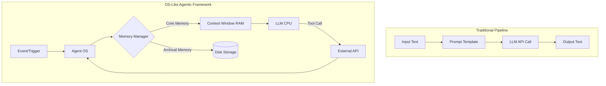
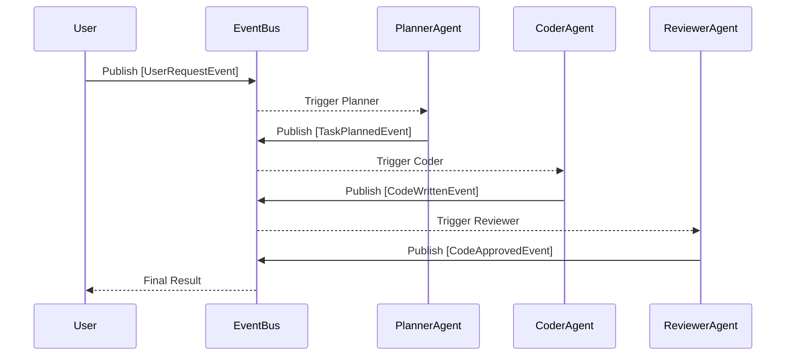

## Learning Outcomes

By the end of this module, you will be able to:
- Design stateful, multi-agent systems using supervisor and worker patterns to solve complex, multi-step engineering problems without human intervention.
- Implement OS-like persistent memory management using Letta to bypass strict context window limitations and maintain long-term conversation coherency.
- Evaluate the architectural tradeoffs between AutoGen, CrewAI, and LangGraph for concurrent orchestration to select the optimal framework for a given workload.
- Diagnose infinite loops and context-exhaustion failures in event-driven multi-agent communication networks.
- Compare pub-sub agent architectures against traditional conversational group chats to optimize token usage and system resilience.

## Why This Module Matters

In November 2021, real estate giant Zillow was forced to shut down its "Zillow Offers" iBuying division, resulting in a write-down of over $500 million and the layoff of roughly 25 percent of its workforce. Public reporting attributed the collapse to an algorithmic pricing engine that continued acquiring homes without a broader supervisory mechanism to recognize macroeconomic shifts or synthesize historical context over time ([CNBC coverage of the Zillow Offers shutdown](https://www.cnbc.com/2021/11/02/zillow-shuts-down-homes-flipping-business-will-lay-off-25percent-of-staff.html)). The system lacked what modern next-generation agentic frameworks provide: hierarchical oversight, persistent memory, and the ability to pause and reflect on state changes. The algorithms could not communicate with one another to debate market volatility, leading to a massive accumulation of overpriced inventory.

When developers build complex Large Language Model (LLM) applications today, they often rely on naive chaining or single-agent loops. As these systems scale to handle enterprise workloads, they inevitably suffer from context window exhaustion, hallucination loops, and an absolute inability to course-correct. A single agent trying to execute a trading strategy, manage customer service refunds, or write an entire codebase will fail the moment it loses the context of its previous actions. Relying purely on the LLM's stateless API is akin to running a computer program without a hard drive or operating system. It works for a few seconds, but eventually, it crashes under the weight of its own amnesia.

Next-generation frameworks like Letta (formerly MemGPT), AutoGen, CrewAI, and LangGraph introduce paradigms borrowed directly from operating systems and human organizational structures. By implementing persistent memory paging, event-driven state machines, and dedicated supervisor agents, these frameworks allow AI systems to pause, reflect, delegate, and maintain long-term coherence across thousands of interactions. Mastering these architectures is the fundamental difference between building a fragile, stateless toy and deploying a resilient, enterprise-grade autonomous system capable of operating continuously for days, weeks, or even years.

The modules earlier in this sub-track introduced individual building blocks—tool calling, memory primitives, LangGraph basics, MCP integration. This module zooms out to the **orchestration plane**: how those blocks compose when multiple agents run concurrently, compete for context, and must terminate safely. If you leave with one durable skill, make it this: whenever you add another agent to a workflow, ask what memory it reads, what events it publishes, who may stop the run, and what artifact proves completion. Framework names will change; those four questions remain the same.

> **Go deeper:** For retrieval boundaries, dynamic context, and Symphony-style orchestration at framework scale, see [Retrieval, Tools, and Memory Boundaries](/ai/ai-engineering-foundations/module-2.3-retrieval-tools-and-memory-boundaries/), [Dynamic Context Orchestration](/ai/ai-engineering-foundations/module-2.4-dynamic-context-orchestration/), and [Symphony](/ai/ai-engineering-foundations/module-4.1-symphony-work-orchestration-as-applied-harness/).

> **Agentic-framework landscape snapshot — as of 2026-06. Capabilities and versions change fast; verify before relying on specifics.**
>
> | Framework | Current line (verify upstream) | Primary orchestration shape | Memory posture |
> |---|---|---|---|
> | **Letta** | PyPI `letta-client` / server releases in the [Letta repo](https://github.com/letta-ai/letta) | Single-agent runtime with self-editing memory blocks | OS-like core/archival/recall paging |
> | **AutoGen** | Layered **0.4+** stack: Core (event-driven) + AgentChat + Extensions ([0.4 launch post](https://devblogs.microsoft.com/autogen/autogen-reimagined-launching-autogen-0-4/)) | Pub/sub events, teams, supervisor patterns | Conversation + optional memory extensions |
> | **CrewAI** | `crewai` on PyPI; hierarchical/sequential processes per [official docs](https://docs.crewai.com/en/concepts/processes) | Role-based crews with manager delegation | Task output passing between agents |
> | **LangGraph** | **v1.x** stability release ([LangGraph v1 notes](https://docs.langchain.com/oss/python/releases/langgraph-v1)) | Explicit graph nodes/edges with typed state | State object passed node-to-node |

## The Evolution from Pipelines to OS-Like Agents

The first generation of LLM orchestration tools, primarily LangChain pipelines and simple [ReAct (Reasoning and Acting)](https://arxiv.org/abs/2210.03629) loops, treated language models as simple transformation functions. Data went in, text came out, and state was managed manually by the developer wrapping the API call. As use cases grew more complex, developers realized that advanced reasoning requires iterative problem-solving. However, these early loops still ran entirely within the volatile memory of the LLM's context window. When the window filled up, the system collapsed.

Modern agentic frameworks treat the LLM not as a mere transformation function, but as the Central Processing Unit (CPU) of a virtual computer. This mental model is critical for understanding next-generation architectures. In this extended analogy:
- The LLM acts as the CPU, executing instructions, processing logic, and making routing decisions based on its inputs.
- The context window is the RAM (Random Access Memory), providing fast, immediate access to relevant data, but severely constrained in size and highly volatile.
- External databases (like vector stores or SQL databases) act as Disk Storage, holding vast amounts of historical data that is too large to fit in RAM.
- The Agentic Framework acts as the Operating System, managing memory paging, process scheduling, and inter-process communication (IPC) between multiple discrete agents running concurrently.



By adopting this OS-level perspective, developers can build agents that run perpetually. Instead of starting from scratch on every user prompt, the agent wakes up when an event occurs, retrieves relevant historical data from disk, updates its immediate RAM context, executes a task, writes the results back to disk, and goes back to sleep. The durable lesson is not which Python package you import first; it is that long-running agents need explicit **memory tiering**, **scheduling**, and **IPC** primitives the same way operating systems do. Framework APIs rename these primitives every few months, but the underlying problem—finite context, unbounded history—does not go away.

The pipeline-to-OS shift also changes how you reason about failure. A pipeline fails at the step boundary: bad JSON, timeout, missing key. An OS-like agent fails across time: stale memory, runaway tool loops, supervisor starvation, or workers that never release a lock on shared state. Production systems therefore need termination budgets, heartbeat files, and observability hooks at the orchestration layer, not only at the LLM call layer.

Consider a concrete contrast. A classic retrieval-augmented generation pipeline might: embed a user query, fetch five chunks, stuff them into a prompt, call the model once, and return an answer. If the user's question references a decision made twelve meetings ago, the pipeline has no intrinsic mechanism to fetch that decision unless the retrieval query happens to surface it. You bolt on session tables, Redis caches, and custom summarizers—reimplementing pieces of an operating system ad hoc. An OS-like agent instead treats "what happened twelve meetings ago" as a page fault: the runtime notices missing context, retrieves from archival storage, promotes a compressed summary into core memory, and resumes execution. The difference is not cosmetic; it changes how you test the system. Pipeline tests assert per-step IO; agent tests must assert memory invariants over hundreds of turns.

Early ReAct loops added iteration—think, act, observe—but still kept all observations in one growing transcript. That works until the transcript exceeds the model's effective attention budget. Research on long-context models consistently shows that middle sections of very long prompts receive weaker attention than beginnings and endings, which means brute-force stuffing is not a substitute for paging. Next-gen frameworks make paging a first-class API so application developers stop encoding memory policy inside prompt templates that nobody can audit six months later.

> **Pause and predict**: If the context window is RAM and the vector database is Disk Storage, what happens when an agent needs to recall a conversation from three months ago that is highly relevant to a current task, but the core memory is full? How does the framework handle the retrieval without overflowing the context limit?

## Orchestration Topologies: The Durable Spine

Before comparing vendor packages, learn the orchestration topologies that outlast any release note. Every multi-agent system you build will map to one or more of these patterns, sometimes layered together.

**Supervisor/worker** is the most common enterprise pattern. A supervisor agent (or deterministic controller) assigns work, reviews output, and decides when to stop. Workers specialize: one writes code, one runs tests, one checks policy. The durable risk is **supervisor bottlenecking**—if the supervisor re-reads every worker transcript verbatim, context grows linearly with team size. Mitigate with structured handoffs: workers return JSON summaries, not essays. In mature implementations, the supervisor never sees raw tool logs—only normalized `WorkerResult` objects with fields like `status`, `artifacts`, `open_questions`, and `confidence`. That discipline keeps the supervisor's context small enough to make routing decisions even after dozens of subtasks.

**Event-driven pub/sub** decouples producers and consumers. Agents publish typed events to a bus; subscribers react asynchronously. This mirrors microservices and fits webhook triggers (GitHub issue opened, alert fired, file uploaded). The durable risk is **orphan events** and **cyclic subscriptions**—agent A publishes, agent B reacts and publishes back to A's topic, and the bus never quiesces. Mitigate with deduplication keys, max hop counts, and dead-letter queues. Version your event schemas the same way you version REST payloads: additive fields are safe, renamed fields break subscribers silently. A lightweight `schema_version` integer on every event saves weeks of debugging when one agent upgrades before its peers.

**Role-based crews** encode organizational structure: each agent has a role, goal, and backstory; a manager delegates tasks. This excels when human teams already think in RACI charts. The durable risk is **cross-delegation deadlocks** when peers can assign work to each other without a single routing authority. Roles also encode **prompt boundaries**: a "Security Analyst" should not silently become a "Deploy Engineer" because another agent delegated DevOps work sideways. Clear roles reduce capability creep; they do not eliminate the need for tool permission lists on each agent.

**Graph/deterministic orchestration** makes the workflow itself the source of truth. Nodes are functions or agents; edges are allowed transitions; state is a typed object checked at compile or runtime. This excels when compliance or safety requires auditable paths. The durable risk is **brittleness**—every new branch requires graph surgery, unlike emergent debate in conversational systems. Teams mitigate brittleness by keeping graphs shallow: stable regulatory spines with fat nodes that encapsulate inner AutoGen or CrewAI teams. The outer graph changes rarely; inner teams experiment frequently behind a stable interface.

```
  Supervisor/worker          Event-driven pub/sub         Role-based crew          Graph orchestration
  -----------------          --------------------         ---------------          -------------------
       [Supervisor]              [Event Bus]               [Manager]                 [Start]
        /    |    \               /    |    \               /   |   \                    |
    [W1] [W2] [W3]          [A] [B] [C]              [R1] [R2] [W]              [KYC]-->[Risk]-->[Decision]
```

None of these topologies eliminates the need for **loop safety**. Every topology needs: a maximum step count, a wall-clock timeout, a token budget, and a structured completion signal. Text keywords like `TERMINATE` are convenient in demos and dangerous in production because models emit them inside code comments, log lines, or user-facing copy.

When teams mix topologies, document which layer owns termination. A LangGraph outer shell might enforce compliance nodes while an inner AutoGen team brainstorms fixes. Without a shared token budget, the inner team can consume the entire session allowance before the outer graph reaches the approval node. A durable pattern is **budget inheritance**: child teams receive capped `max_turns` and return only a structured `TeamResult` object upward. Another durable pattern is **checkpointed rollback**: LangGraph persists state after each node; if an inner crew fails, the graph rewinds to the last good checkpoint instead of corrupting downstream state with half-finished debate transcripts.

Choosing a topology is an engineering tradeoff, not a popularity contest. Event-driven pub/sub minimizes coupling when integrations multiply—each new subscriber should not require editing the publisher's code. Graph orchestration minimizes compliance risk when paths must be provable. Role-based crews minimize prompt engineering when your organization already describes work as roles and deliverables. Supervisor/worker minimizes chaos when you have a clear quality gate but need flexible worker implementations. Mature platforms frequently compose all four: graph for outer lifecycle, supervisor for quality, pub/sub for external triggers, and role prompts for specialist behavior inside workers.

## Letta (formerly MemGPT): Persistent Memory Paging

Letta was born out of the MemGPT research paper published by UC Berkeley, which identified a fundamental limitation in generative AI: context windows, no matter how large they grow, will eventually fill up in long-running applications ([MemGPT paper](https://arxiv.org/abs/2310.08560)). Furthermore, stuffing very large prompts into every interaction can be slow, costly, and can hurt model performance, so long-running systems usually need retrieval or memory management rather than brute-force context stuffing. The project renamed its framework to **Letta** while reserving **MemGPT** for the self-editing memory *pattern* ([Letta naming clarification](https://www.letta.com/blog/memgpt-and-letta)).

Letta solves this by implementing a tiered memory system natively integrated with the LLM's function-calling capabilities:

1. **Core Memory**: A small, persistent block of text typically included in the LLM's system prompt. It contains the agent's persona, its current immediate goals, and critical facts about the user. It is highly constrained.
2. **Archival Memory**: A massive, searchable database (usually a vector store) that holds the complete history of interactions and external documents. It is generally not passed to the LLM in its entirety.
3. **Recall Memory**: A chronological log of recent conversational events, used to maintain the immediate flow of a dialogue before it is archived.

The major innovation of Letta is that the LLM itself is given explicit tools to edit its own memory structure. It can search archival storage, append or replace core memory blocks, and compact conversation history when configured. When the agent realizes it needs more space in its Core Memory, it can summarize existing facts and push data to archival storage, effectively paging memory in and out of RAM autonomously.

Letta is a **full agent runtime**, not merely a memory plugin. Agents persist in a database, expose an API, and can be inspected through the Agent Development Environment. That integration is powerful when Letta is your orchestration layer; it is a coupling cost when you already run LangGraph or CrewAI and only wanted vector recall.

### Example: Initializing a Letta Agent

Below is an **illustrative** implementation using the current `letta-client` SDK shape documented in the [Letta quickstart](https://docs.letta.com/quickstart/). Pin versions from the landscape snapshot before deploying.

```python
import os
from letta_client import Letta

# Illustrative — connect to Letta Cloud or self-hosted server
client = Letta(api_key=os.environ["LETTA_API_KEY"])

# Core memory blocks map to the MemGPT "persona" and "human" partitions
agent = client.agents.create(
    model="openai/gpt-4.1",
    memory_blocks=[
        {
            "label": "persona",
            "value": (
                "You are a senior site reliability engineer. Diagnose anomalies "
                "and maintain uptime. Search archival memory for incident history."
            ),
        },
        {
            "label": "human",
            "value": "User is a junior developer who often forgets database lock checks.",
        },
    ],
    context_window_limit=8192,  # Deliberately constrain working set
)

response = client.agents.messages.create(
    agent_id=agent.id,
    input="The production database is timing out again. Just like last month.",
)

for message in response.messages:
    print(message)
```

Notice the parameter `context_window_limit=8192`. Why configure this below the model's maximum capacity? We set this limit to force the agent to actively page memory out to archival storage rather than lazily filling up the context window until it crashes. Additionally, a deliberately small working context forces the agent to rely on retrieval and summarization instead of endlessly growing the prompt, and very long prompts can suffer from "lost in the middle" failures where models under-attend to mid-prompt facts. By artificially constraining the RAM, you test and enforce the agent's memory management capabilities, ensuring consistent reliability.

In the background, if the agent needs to know what happened last month, it pauses the conversation, issues a function call to search archival memory for phrases like "database timeout", reads retrieved results into its temporary context window, and then formulates a final, highly contextual response to the user.

Operationally, you should treat Letta memory blocks like database schemas. Persona blocks change rarely; human blocks change when user facts change; scratch blocks can hold ephemeral plans that the agent deletes after task completion. Archival search quality depends on embedding models and chunking policy—the framework supplies the paging mechanism, but your ingestion pipeline still owns chunk boundaries and metadata filters. When archival retrieval returns irrelevant incidents, the failure is often indexing, not the LLM. Conversely, when core memory balloons because the agent refuses to summarize, tighten `context_window_limit` in staging and measure how often compaction tools fire before production.

Letta also illustrates **sleep-time compute** concepts emerging in stateful agent research: background threads that refine memory while the user is idle. Whether you enable those threads depends on cost and privacy policy, but the durable idea is that memory maintenance should not compete with latency-sensitive turns. Batch compaction during idle windows mirrors how operating systems flush dirty pages when load drops.

When evaluating Letta against bolt-on vector memory in another framework, compare operational surfaces: Who compacts memory? Who pays for embedding writes? Who debugs a wrong recall? Letta centralizes those answers inside one runtime; composable stacks distribute them across your graph, your ETL, and your embedding pipeline. Neither approach is universally superior—Letta reduces integration labor when memory is the product; composable stacks reduce lock-in when orchestration already exists.

## AutoGen: Event-Driven Multi-Agent Systems

While Letta focuses heavily on single-agent long-term memory management, AutoGen focuses intensely on multi-agent communication and distributed problem-solving. Early AutoGen versions relied on a conversational `GroupChat` paradigm, where agents took turns speaking in a simulated chat room, much like humans in a Slack channel. While intuitive, this approach scaled poorly and consumed massive amounts of tokens as the chat history grew. Developers could watch billing dashboards climb while agents restated the same plan in different words—a failure mode that looks like "model stupidity" but is actually **shared transcript bloat**. Separating transport (events) from presentation (optional human-readable logs) is how you keep multi-agent systems financially viable at enterprise query volumes.

Starting with AutoGen **0.4+**, the framework embraced a layered, **event-driven** architecture documented in Microsoft's [AutoGen 0.4 launch post](https://devblogs.microsoft.com/autogen/autogen-reimagined-launching-autogen-0-4/). **AutoGen Core** implements asynchronous message exchange; **AgentChat** provides a higher-level task API; **Extensions** host integrations. Agents publish and consume messages through a runtime, decoupling delivery from handler logic—closer to actor-model microservices than a single growing transcript.

This architectural shift mirrors microservices in modern backend software engineering. It prevents the entire system from locking up if one agent takes too long to respond. More importantly, it allows for complex orchestration topologies, such as:
- **Fan-out**: One planning agent delegates to five worker agents simultaneously.
- **Fan-in**: A supervisor agent aggregates concurrent results from multiple workers.



### The Supervisor Pattern

The Supervisor pattern is a critical component of multi-agent quality assurance. A supervisor agent acts as the orchestrator and judge. It assigns tasks to workers, evaluates their output, and decides whether a task is officially complete or if it requires additional rework cycles.

```python
# Illustrative AutoGen 0.4+ AgentChat — see official quickstart for pinned versions
import asyncio
from autogen_agentchat.agents import AssistantAgent
from autogen_agentchat.teams import RoundRobinGroupChat
from autogen_agentchat.ui import Console
from autogen_ext.models.openai import OpenAIChatCompletionClient

async def main() -> None:
    model_client = OpenAIChatCompletionClient(model="gpt-4o")

    supervisor = AssistantAgent(
        name="Supervisor",
        model_client=model_client,
        system_message=(
            "You manage the coding process. Delegate implementation to Coder. "
            "When output passes review, reply with JSON: {\"is_complete\": true}."
        ),
    )
    coder = AssistantAgent(
        name="Coder",
        model_client=model_client,
        system_message="You write Python based on Supervisor instructions.",
    )

    team = RoundRobinGroupChat([supervisor, coder], max_turns=8)
    await Console(team.run_stream(
        task="Parse CSV revenue column and compute median; delegate coding."
    ))
    await model_client.close()

asyncio.run(main())
```

Notice `max_turns=8` on the team. Why cap turns in production? Uncapped conversational teams can debate indefinitely, burning tokens while never reaching a completion predicate. In a background CI/CD job or Kubernetes worker, there is no human at the terminal to interrupt a runaway loop. Turn caps, wall-clock timeouts, and structured completion JSON are mandatory guardrails beneath the LLM layer.

> **Stop and think**: In the illustrative setup above, the supervisor signals completion through JSON. If the Coder generates a script that logs the word `TERMINATE` inside a comment, does a text-based termination predicate still fail safely? How does structured output reduce accidental early shutdown?

### Group Chat Versus Pub/Sub: Token Economics

The durable reason to migrate from turn-based group chat to event-driven messaging is not fashion—it is cost and tail latency. In group chat, every agent often re-reads the entire transcript each turn. With four agents and twenty turns, you may pay for eighty full-context passes. Pub/sub lets handlers subscribe to **typed events** carrying compact payloads: `TaskPlanned`, `CodeWritten`, `TestsFailed`. Workers append summaries to shared state instead of theatrical dialogue. That shift can reduce tokens per successful task by an order of magnitude in coding workflows, though you trade away some emergent creativity. For enterprise automation—ticket triage, compliance checks, ETL remediation—you usually prefer predictable cost over open-ended brainstorming.

AutoGen's AgentChat layer still offers group chat patterns for prototyping; Core layer fits when you deploy agents as separate processes or languages. That split is itself a durable lesson: keep exploratory conversation APIs for notebooks, but run production on event contracts you can version, audit, and replay.

## CrewAI: Role-Based Concurrent Orchestration

CrewAI takes its core inspiration from real-world corporate structures. It organizes AI systems into distinct units: Agents, Tasks, and Crews. The primary differentiator for CrewAI is its opinionated **process execution models**—**Sequential** and **Hierarchical**—documented in the [CrewAI processes guide](https://docs.crewai.com/en/concepts/processes). Sequential execution passes each task's output forward as context; hierarchical execution introduces a manager that plans, delegates, and validates without pre-assigning every task at authoring time.

In CrewAI's Hierarchical process, a manager agent or manager model oversees task execution and delegation. The manager acts as an executive: it evaluates the overarching objective, breaks it down into sub-tasks, assigns them to the most capable agents within the crew, and reviews their work concurrently. This mimics a traditional engineering team's chain of command, which many enterprises already document in runbooks.

### Example: Defining a Crew with a Manager

```python
# Illustrative CrewAI — pin crewai version from landscape snapshot
from crewai import Agent, Task, Crew, Process

researcher = Agent(
    role="Senior Data Analyst",
    goal="Uncover deep trends in the cloud computing market",
    backstory="An expert analyst with a decade of experience in tech trends.",
    verbose=True,
    allow_delegation=False,
)

writer = Agent(
    role="Tech Content Strategist",
    goal="Craft compelling narratives from raw analytical data",
    backstory="A renowned tech writer known for simplifying complex topics.",
    verbose=True,
    allow_delegation=False,
)

research_task = Task(
    description="Identify the top 3 growth areas in cloud infrastructure for the upcoming year.",
    expected_output="A bulleted list of 3 growth areas with supporting metrics.",
    agent=researcher,
)

writing_task = Task(
    description="Draft a 500-word blog post based on the research findings.",
    expected_output="A markdown formatted blog post ready for publication.",
    agent=writer,
)

tech_crew = Crew(
    agents=[researcher, writer],
    tasks=[research_task, writing_task],
    process=Process.hierarchical,
    manager_llm="gpt-4o",
    verbose=True,
)

result = tech_crew.kickoff()
print("Final Output:", result)
```

CrewAI is heavily optimized for production environments where roles must be strictly enforced. By actively disallowing delegation on the lower-level worker agents (`allow_delegation=False`), developers can force all cross-agent communication to route back upward through the Manager. This ensures strict oversight and prevents the "infinite loop" scenario where peer agents continuously assign tasks back and forth to each other in a conversational deadlock. When you need managers with tools, consult current docs—manager tool support has shifted across releases, and a common workaround is a dedicated tool-runner agent referenced in the manager prompt.

Sequential versus hierarchical selection is another durable tradeoff. Sequential crews behave like assembly lines: predictable, easy to debug, but slow when tasks could run in parallel. Hierarchical crews add manager overhead per decision but shine when task order depends on intermediate quality—research must pass a sanity check before writing, for example. Neither mode removes the need for explicit `expected_output` strings; those outputs become contracts the manager uses to decide whether to accept work or send it back. Vague expected outputs produce vague manager judgments, which in turn produce rewrite loops that look like model failures but are actually specification failures.

## LangGraph and Deterministic Orchestration

While Letta, AutoGen, and CrewAI grant agents significant autonomy to determine their operational flow, LangGraph takes a fundamentally different approach. Built alongside the LangChain ecosystem, LangGraph treats multi-agent workflows as explicit graphs: nodes (agents, functions, human-in-the-loop checkpoints) and edges (allowed transitions). State is a typed object—commonly a `TypedDict` in LangGraph v1—that flows node to node under developer control ([LangGraph v1 release notes](https://docs.langchain.com/oss/python/releases/langgraph-v1)).

LangGraph v1 emphasizes stability for the graph runtime while LangChain's `create_agent` builds higher-level loops on top of the same execution model. For compliance-heavy flows—loan approval, security review gates, regulated data handling—you often want **predictable paths** more than emergent debate. Conditional edges let you branch on structured state fields (`risk_score > threshold`) instead of parsing free-form model prose.

### Illustrative LangGraph State Machine

```python
# Illustrative LangGraph v1 — verify imports against pinned langgraph release
from typing import TypedDict
from langgraph.graph import StateGraph, START, END

class ReviewState(TypedDict):
    code: str
    security_passed: bool
    summary: str

def security_gate(state: ReviewState) -> ReviewState:
    # Deterministic check before LLM creativity
    state["security_passed"] = "eval(" not in state["code"]
    return state

def summarize(state: ReviewState) -> ReviewState:
    state["summary"] = "Approved" if state["security_passed"] else "Rejected"
    return state

builder = StateGraph(ReviewState)
builder.add_node("security_gate", security_gate)
builder.add_node("summarize", summarize)
builder.add_edge(START, "security_gate")
builder.add_edge("security_gate", "summarize")
builder.add_edge("summarize", END)

graph = builder.compile()
print(graph.invoke({"code": "print('ok')", "security_passed": False, "summary": ""}))
```

This pattern guarantees the security gate executes before summarization. An autonomous chat room might skip a step under pressure; a graph will not unless you explicitly add an edge.

LangGraph's production value often appears in **human-in-the-loop** and **checkpointing**. You can mark nodes that require human approval before sensitive tools execute, storing partial state in a checkpointer (database or Redis) between invocations. That durability matters for audits: regulators ask what the system knew at decision time, not what the latest chat message says. Graph snapshots provide a defensible timeline. The cost is engineering time—every new regulatory rule becomes a graph change—but that cost is explicit and reviewable in pull requests, unlike tacit prompt tweaks buried in a supervisor's system message.

Conditional edges deserve careful testing. Models propose routes; graphs enforce allowed routes. A durable pattern is to let the LLM populate a state field `proposed_next_step`, then use a deterministic Python function to validate that the proposal is in an allowlist before transitioning. This separates **creativity** from **commit**: the model suggests, the runtime commits only legal moves.

## Failure Modes: Loops, Context Exhaustion, and Deadlocks

Multi-agent systems fail in recurring ways that single-agent demos hide.

**Infinite debate loops** occur when critic and implementer agents optimize different objectives—style versus correctness, security versus velocity—and neither satisfies the other's stopping criterion. Symptoms include flat output quality with rising token charts. Fixes combine `max_turns`, revision budgets in supervisor prompts, and escalation to a human or stronger judge model after N cycles. Another underused fix is **objective narrowing**: tell the critic exactly which rubric dimensions it may score (security severity 1–3) and forbid commentary elsewhere. Open-ended "improve this" instructions are invitations to infinite polish.

**Context exhaustion** appears when every agent appends full transcripts to shared memory. Even million-token windows do not save you when quadratic growth meets multi-day runs. Fixes: summarizer nodes, structured handoffs, external retrieval (Letta archival, vector stores), and discarding raw tool payloads after embedding salient facts. Treat summarization as a **lossy compression** step with explicit fidelity requirements: financial workflows may forbid dropping numeric identifiers, while brainstorming workflows may tolerate aggressive compression. Document what summarizers are allowed to forget.

**Deadlocks** arise when agents wait on each other's delegation. CrewAI peer delegation and cyclic AutoGen subscriptions are common culprits. Fixes: single routing authority, `allow_delegation=False` on workers, and timeout-based cancellation that publishes a compensating "abort" event. Model deadlocks too: Agent A waits for Agent B's critique, while B waits for A's revised draft because prompts were written assuming sequential human email etiquette. Machines do not resolve social stalemates; only explicit timeouts and escalation paths do.

**Premature termination** happens when orchestrators grep for keywords like `TERMINATE` inside model output. Any code-generation task can accidentally emit the keyword. Fixes: JSON schema completion flags, tool-based `finish_task` calls, or graph `END` nodes reachable only through typed state.

**Silent hangs** occur when frameworks expect stdin (`human_input_mode="ALWAYS"`) inside containers. Kubernetes liveness probes then restart pods that were merely waiting for input. Fixes: autonomous input modes, exec probes on heartbeat files, and startup probes that distinguish cold start from deadlock ([Kubernetes probe docs](https://kubernetes.io/docs/tasks/configure-pod-container/configure-liveness-readiness-startup-probes/)).

Diagnosing these failures requires layered telemetry. At minimum, instrument: per-agent turn count, cumulative input tokens, tool error rate, time since last heartbeat, and graph node or event type currently executing. When turn count rises while output entropy falls—the agents paraphrase each other—you likely have a debate loop. When tokens rise linearly with turn count but business metrics flatline, you likely have context creep without summarization. When all agents idle but queues grow, you likely have a deadlock or blocked human-approval node. Framework-specific dashboards help, but the durable metrics are topology-agnostic.

Recovery strategies should be tiered. Soft recovery retries with a cheaper summarizer model to compress state. Hard recovery cancels in-flight delegations, writes a partial result object, and escalates to a human ticket with the last good checkpoint attached. Catastrophic recovery terminates the pod and reloads state from an external store—acceptable only when checkpoints are idempotent. Designing these tiers before launch prevents on-call engineers from improvising `kubectl delete pod` as your primary retry mechanism.

## Comparative Analysis

Choosing the right framework depends on the degree of autonomy, statefulness, and predictability required by your target system architecture. Present these frameworks as **peers** mapped to durable capabilities—not as a single winner.

| Capability axis | LangGraph | Letta | AutoGen | CrewAI |
|---|---|---|---|---|
| **Primary orchestration shape** | Explicit graph nodes/edges | Single-agent runtime + memory tools | Event-driven Core + AgentChat teams | Role/task crews with manager |
| **State management** | Typed state object per step | Core/archival/recall paging | Shared runtime + message history | Task outputs as context |
| **Concurrency model** | Parallel branches where graph allows | Background memory threads optional | Async fan-out/fan-in via runtime | Manager-coordinated delegation |
| **Predictability** | High—developer owns edges | Medium—agent edits memory | Medium–low—emergent dialog possible | Medium—manager enforces roles |
| **Long-horizon memory** | Bring-your-own store + graph checkpoints | Native self-editing tiers | Extension-dependent | Task-scoped unless you add store |
| **Compliance-friendly audit trail** | Graph path + state snapshots | Memory block history | Event logs if instrumented | Task result artifacts |

LangGraph fits when you must prove a workflow followed regulatory order. Letta fits when one persistent agent must remember months of user context. AutoGen fits when heterogeneous agents subscribe to enterprise events. CrewAI fits when work decomposes naturally into roles with a manager coordinator. Hybrid stacks are common: LangGraph for outer compliance shell, Letta or a vector store for memory, AutoGen or CrewAI for inner specialist teams.

Selection exercises should score **dimensions**, not brands. Ask: How long must memory persist? Who owns routing—developer graph, manager LLM, or emergent chat? What is the cost of a wrong step? How many external systems emit triggers? What audit artifact must legal receive? Plot answers on those axes and the Rosetta table above becomes a decision worksheet instead of a feature checklist. When two frameworks score similarly, prefer the one whose observability hooks match your existing stack—metrics you cannot export are failures waiting in staging.

Finally, plan migration paths. Teams rarely rewrite orchestration overnight. A durable rollout moves **termination and memory policy** first—structured completion, summarization, token caps—then swaps transport (chat to events), then consolidates runtimes. Each phase delivers safety wins even if framework names on the architecture diagram change again next quarter.

## Hypothetical Scenario: Deploying Autonomous Agents to Kubernetes

Hypothetical scenario: After developing a multi-agent auditing workflow, you wrap the Python orchestration process in a container and schedule it on Kubernetes. The deployment keeps failing liveness checks even though logs show the LLM is still generating text.

Hypothetical scenario: The root cause is twofold. First, the developer left `human_input_mode="ALWAYS"` (or an equivalent blocking stdin setting) in the agent configuration, so the process waits forever for terminal input inside a non-interactive pod. Second, the liveness probe watches a heartbeat file that agents only update after a full debate cycle completes; during long multi-agent turns, the probe times out and kubelet restarts the container mid-run.

Hypothetical scenario: The remediation path is to enforce fully autonomous input modes, cap `max_turns`, emit heartbeats after each event handled (not only at task completion), and separate **liveness** from **readiness**. Liveness should answer "is the process wedged?" Readiness should answer "can this pod accept new work?" An agent mid-turn may be unhealthy for new requests but still alive—if your probe conflates the two, you will restart healthy workers during long LLM calls.

Hypothetical scenario: Also budget CPU and memory for parallel tool calls. Multi-agent fan-out can spike memory when five workers each load large documents simultaneously. Kubernetes resource limits without agent-side concurrency caps produce OOMKilled pods that look like application bugs in framework logs.

Hypothetical scenario: Use a public base image you can actually pull in lab environments:

```yaml
apiVersion: apps/v1
kind: Deployment
metadata:
  name: auditing-supervisor
  namespace: ai-orchestration
spec:
  replicas: 1
  selector:
    matchLabels:
      app: auditing-supervisor
  template:
    metadata:
      labels:
        app: auditing-supervisor
    spec:
      containers:
      - name: supervisor
        image: python:3.12-slim
        command: ["python", "/app/run_review.py"]
        env:
        - name: OPENAI_API_KEY
          valueFrom:
            secretKeyRef:
              name: openai-credentials
              key: api-key
        livenessProbe:
          exec:
            command: ["cat", "/tmp/agent_heartbeat"]
          initialDelaySeconds: 30
          periodSeconds: 10
        # Separate readiness from liveness: liveness answers "is the process
        # wedged?"; readiness answers "can this pod accept new work?" An agent
        # mid-turn may be unready for new requests but still alive — don't
        # conflate them, or you will restart healthy workers during long calls.
        # readinessProbe:
        #   httpGet:
        #     path: /ready
        #     port: 8080
        #   initialDelaySeconds: 10
        #   periodSeconds: 5
```

This manifest illustrates how Kubernetes provides a system-level safety net beneath application-level framework guardrails: if an agent deadlocks and stops updating its heartbeat file, the kubelet can restart the pod per the [liveness probe documentation](https://kubernetes.io/docs/tasks/configure-pod-container/configure-liveness-readiness-startup-probes/).

Wrapping agent frameworks for Kubernetes also forces you to decide **where state lives**. Ephemeral pod filesystems lose in-memory conversation state on restart unless you externalize checkpoints to Redis, S3, or the framework's native persistence (Letta's database, LangGraph checkpointers). A common anti-pattern is scaling replicas above one without idempotent workflow IDs—two pods then race on the same external ticket queue. Durable deployments pair horizontal scaling with partition keys: one active worker per business entity until checkpoints make handoffs safe.

## Did You Know?

1. [The original MemGPT paper was published in October 2023](https://arxiv.org/abs/2310.08560), introducing LLMs managing their own memory tiering via standard function calls—the pattern now associated with Letta agents.
2. [AutoGen 0.4 was a ground-up redesign](https://devblogs.microsoft.com/autogen/autogen-reimagined-launching-autogen-0-4/) adopting asynchronous, event-driven messaging between agents rather than relying solely on monolithic group chat transcripts.
3. CrewAI's hierarchical process requires an explicit `manager_llm` or `manager_agent` and can reassign tasks dynamically instead of only following a fixed sequential list ([processes documentation](https://docs.crewai.com/en/concepts/processes)).
4. [LangGraph reached v1](https://docs.langchain.com/oss/python/releases/langgraph-v1) as a stability-focused agent runtime aligned with LangChain v1, deprecating several prebuilt helpers in favor of composable graph primitives.

Across all four frameworks, the research community converged on the same insight independently: LLM applications that run longer than a coffee break need an orchestration layer that owns memory, messaging, and termination. The packaging differs; the systems problem does not. When you evaluate a fifth or sixth framework later this year, map it to the topology and memory columns in the snapshot table first—only then drill into release-note feature bullets. That habit keeps your architecture documentation stable even when README banners change weekly. Teach the durable spine once; refresh the dated snapshot table every quarter.

## Common Mistakes

| Mistake | Why It Happens | How To Fix It |
|---|---|---|
| Overloading Core Memory | Developers dump all context into Letta's core memory instead of archival. | Keep core memory strictly for persona and immediate state. Move reference data to vector stores. |
| The Infinite Debate Loop | Two agents in AutoGen disagree and continuously critique each other without progress. | Implement a strict `max_turns` limit or a hard timeout in the Supervisor configuration. |
| Hallucinated Tool Signatures | Agents invent parameters for tools that do not exist in the environment. | Use strict Pydantic schemas for all tool inputs and enable syntax validation before the tool executes. |
| Premature Termination | The termination keyword naturally occurs in the output payload (e.g., code comments). | Use a structured output format (JSON) with an explicit boolean flag `{"is_complete": true}` instead of raw text parsing. |
| Context Window Creep | In sequential processes, appending every agent's full output to the shared context eventually exceeds limits. | Use a Summarizer agent between major steps to compress the context before passing it to the next worker. |
| Cross-Delegation Chaos | In CrewAI, allowing all agents to delegate to all other agents creates deadlocks. | Restrict delegation (`allow_delegation=False`) for lower-level workers and enforce hierarchical routing. |
| Ignoring Rate Limits | Concurrent orchestration fires off dozens of API requests simultaneously. | Implement robust retry logic with exponential backoff and connection pooling at the framework level. |
| Mixing Volatile Version Facts Into Prose | Tutorial pins API shapes that changed last month, confusing learners. | Quarantine versions in a dated snapshot; teach orchestration topologies and memory paging as the durable spine. |

## Quiz

<details>
<summary>1. A financial institution needs an automated system to approve loans. The workflow requires strict adherence to regulatory steps: KYC check, credit pull, risk calculation, and final decision. Which framework is most appropriate and why?</summary>
LangGraph is the most appropriate framework for this scenario. The strict compliance and regulatory requirements demand high predictability and deterministic routing. LangGraph allows developers to define explicit edges and conditional nodes, ensuring that the system cannot bypass a step (like the KYC check) due to agent hallucination. By forcing the state to flow through defined nodes, it provides an auditable trail that regulators require.
</details>

<details>
<summary>2. You are designing a virtual companion application where the AI must remember user preferences, past conversations, and life events spanning several years. Which architecture solves this best?</summary>
Letta is the ideal architecture for a long-running virtual companion. Its OS-like persistent memory paging allows it to keep immediate persona constraints in Core Memory while paging vast amounts of historical conversational data into and out of Archival Memory. This prevents context window exhaustion while maintaining a seamless illusion of long-term memory. Over months of interaction, the agent can recall past events without overwhelming the LLM token limits.
</details>

<details>
<summary>3. In an AutoGen setup, you notice that your Coder agent and Reviewer agent are stuck in an endless loop. The Reviewer constantly asks for minor stylistic changes, and the Coder complies, but introduces new stylistic errors. How do you resolve this?</summary>
This is the "Infinite Debate Loop" mistake. To resolve it, configure a `max_turns` limit on the team to force a hard stop. Additionally, update the Supervisor's system prompt to enforce a maximum number of revision cycles, or explicitly instruct the Reviewer to ignore minor stylistic issues and only flag functional bugs. By capping turns, the system is forced to yield back to the supervisor or user for a final decision.
</details>

<details>
<summary>4. When designing a CrewAI system, a developer notices that tasks are taking significantly longer to complete, and logs show workers assigning tasks back and forth to each other endlessly. What configuration is missing?</summary>
The developer has likely left `allow_delegation=True` on the worker agents without implementing a clear hierarchy. This causes Cross-Delegation Chaos, where peers delegate tasks to each other in a loop to avoid doing the work. The fix is to set `allow_delegation=False` on the workers and utilize a Hierarchical process where only the Manager dictates task assignment. This ensures strict oversight and a clear chain of command during execution.
</details>

<details>
<summary>5. You want an agentic system that triggers a specific workflow whenever a new GitHub issue is opened. The system should scale easily if you decide to add more agents later to handle Slack notifications based on the same issue. Which AutoGen architecture supports this best?</summary>
The event-driven architecture introduced in AutoGen 0.4+ is best suited for this. When the GitHub issue is opened, an event is published to the runtime. The initial agent subscribes to perform its workflow. Later, a Slack notification agent can subscribe to the same event topic without rewriting existing handlers, demonstrating fan-out scalability. This decoupled design avoids rewriting monolithic chat transcripts when you add subscribers.
</details>

<details>
<summary>6. Your multi-agent system is tasked with writing a tutorial on Linux process management. Midway through generation, the workflow stops and marks complete even though only half the tutorial is written. You use the string 'TERMINATE' as your completion flag. What likely caused this premature shutdown, and how should you redesign the completion criteria?</summary>
Parsing raw text is fragile because the LLM might emit the keyword inside a code comment, hypothetical example, or log line. That triggers premature termination. The robust solution is structured output schemas (like JSON) where completion is signaled via a dedicated boolean field, or a tool call such as `finish_task` that the orchestrator alone interprets.
</details>

<details>
<summary>7. You are migrating an agentic system from LangGraph to Letta. In LangGraph, you passed a massive dictionary of the user's entire account history between every node. Replicating that pattern in Letta's core memory quickly exhausts tokens. Why does this mismatch occur, and how should Letta handle this data instead?</summary>
LangGraph manages ephemeral execution state between nodes for a single run (often checkpointed externally). Letta manages persistent memory across sessions by paging between small Core Memory and large Archival Memory. Continuously stuffing full history into core blocks defeats Letta's tiering model; the agent should search archival storage and promote only relevant slices into core memory per turn.
</details>

<details>
<summary>8. Your observability dashboard shows token usage growing super-linearly while answer quality plateaus. Agents are in a pub/sub topology with no turn cap. Which durable guardrail combination addresses both cost and quality?</summary>
Combine event deduplication keys (prevent cyclic republication), a global `max_turns` or hop count, summarization between fan-in stages, and structured supervisor JSON completion. Pub/sub solves coupling, not termination—loop safety primitives remain mandatory.
</details>

## Hands-On Exercise

In this exercise, you will deploy an executable multi-agent automated code review system. We will configure the architecture, provision specialized workers, apply context compression, and emit a structured JSON completion state.

### Task 1: Environment Provisioning

First, prepare your workspace by creating an isolated virtual environment and installing orchestration libraries. Pin package versions from the landscape snapshot before production use. This lab intentionally mocks LLM calls so you can validate orchestration guardrails—heartbeat files, JSON completion, delegation flags—without spending tokens. In production, swap the mock function for AgentChat or CrewAI entrypoints while keeping the same termination schema and probe sidecars.

```bash
mkdir -p ~/kubedojo/agents-lab
cd ~/kubedojo/agents-lab
python3 -m venv .venv
source .venv/bin/activate
# Lab uses flexible ranges so learners install the latest; in production, pin
# exact versions from the dated landscape snapshot above before deploying.
pip install "autogen-agentchat>=0.4.0" "crewai>=0.22.0" pydantic
```

Verify your installation by checking the installed packages:
```bash
pip list | grep -E "autogen|crewai"
```

### Task 2: Define the Manager Persona and Context Compression

Create a new file named `manager_config.py`. You will write the system prompt for the Manager agent, explicitly defining its responsibilities: receiving code, delegating to experts, and compressing context to prevent token exhaustion.

```bash
cat << 'EOF' > manager_config.py
MANAGER_PROMPT = """
You are the Lead Code Reviewer. Your objective is to ensure code quality across security, performance, and style. 
You will receive source code. You must delegate specific analysis tasks to the Security, Performance, and Style experts. 
Do not perform the analysis yourself. Once all three experts return their reports, synthesize their findings into a single, cohesive final summary document.
"""

# To compress context, we instruct the workers to return strict bullet points.
WORKER_INSTRUCTION = "Provide your feedback as a strictly bulleted list of high-priority issues only, maximum 200 words. Discard minor or low-priority observations."
EOF
```

### Task 3: Implement the Workflow Constraints

Create the main executable file `run_review.py`. This script simulates setting up the multi-agent system, enforcing the delegation constraints, and preventing infinite loops by capping auto-replies.

```bash
cat << 'EOF' > run_review.py
import json
import time

def simulate_agent_execution():
    # Illustrative mock — replace with AgentChat/Crew calls in production.
    # These are framework-neutral guardrail names so the termination logic stays
    # the lesson, not any one SDK: `max_consecutive_auto_reply` is AutoGen's reply
    # cap (in CrewAI you'd cap with a task-level `max_iter` or the manager's prompt);
    # `allow_delegation` is CrewAI's delegation switch.
    security_agent_config = {
        "max_consecutive_auto_reply": 3,
        "allow_delegation": False,
    }
    print(f"Enforcing guardrails: {security_agent_config}")

    # Heartbeat for Kubernetes liveness illustration
    with open("/tmp/agent_heartbeat", "w") as heartbeat:
        heartbeat.write(str(time.time()))

    output_state = {
        "status": "completed",
        "final_report_summary": (
            "The code has 2 security vulnerabilities, 1 performance bottleneck, "
            "and passes style checks. See detailed logs."
        ),
        "is_ready_for_user": True,
    }

    with open("review_results.json", "w") as f:
        json.dump(output_state, f, indent=2)

    print("Multi-agent workflow completed. Output written to review_results.json")

if __name__ == "__main__":
    simulate_agent_execution()
EOF
```

### Task 4: Execute the Code Review Multi-Agent System

Run your orchestration script. Ensure that the python process executes successfully without hanging.

```bash
python run_review.py
```

### Task 5: Verify Structured Output

Inspect the output file to verify the termination condition produced a robust, structured JSON schema.

```bash
cat review_results.json
```

### Solutions and Success Checklist

Before marking the lab complete, rehearse the failure injections you would run in staging: delete the heartbeat file mid-run to confirm your probe restarts the pod; lower `max_consecutive_auto_reply` to one to confirm the workflow exits with partial JSON instead of hanging; and grep logs for the substring `TERMINATE` to confirm nothing in your completion path depends on it. These three checks catch the majority of production agent outages that frameworks cannot fix automatically.

Verify your final output matches the required structured state exactly. The below solutions reflect the theoretical design choices mapped directly into the code you just executed.

<details>
<summary>View Solutions</summary>

**Solution 1:** CrewAI is highly optimal here due to its native Hierarchical process. It automatically provisions a Manager agent to coordinate specialized workers (Security, Performance, Style) and handles the task delegation and aggregation seamlessly.

**Solution 2:** 
`System Prompt:` "You are the Lead Code Reviewer. Your objective is to ensure code quality across security, performance, and style. You will receive source code. You must delegate specific analysis tasks to the Security, Performance, and Style experts. Do not perform the analysis yourself. Once all three experts return their reports, synthesize their findings into a single, cohesive final summary document."

**Solution 3:** 
To compress context, introduce an intermediary "Summarizer Agent" or instruct each expert via their task description: "Provide your feedback as a strictly bulleted list of high-priority issues only, maximum 200 words. Discard minor or low-priority observations." This prevents the manager from receiving massive text dumps.

**Solution 4:**
```json
{
  "status": "completed",
  "final_report_summary": "The code has 2 security vulnerabilities, 1 performance bottleneck, and passes style checks. See detailed logs.",
  "is_ready_for_user": true
}
```

**Solution 5:**
Cap the Security Analyst's reply budget — in AutoGen this is `max_consecutive_auto_reply=3`; in the role-based CrewAI framing recommended in Solution 1, you enforce the same limit with a task-level `max_iter` or through the manager's delegation prompt. Furthermore, add to the Security Analyst's system prompt: "Identify only critical and high-severity vulnerabilities. If a vulnerability cannot be definitively proven within two analytical steps, log it as a 'warning' and complete your task. Do not attempt to iteratively rewrite the code yourself."
</details>

**Success Checklist:**
- [ ] Framework selected aligns with the requirement for concurrent specialized orchestration.
- [ ] Manager persona strictly enforces delegation rather than doing the work itself.
- [ ] Context compression strategy is explicitly defined to protect the final synthesis step.
- [ ] Termination uses strongly typed structured data, not a fragile text string.
- [ ] Safeguards are in place to prevent analytical deadlocks or infinite loops.

## Next Module

Now that you understand how to orchestrate multiple agents, manage persistent state, and prevent catastrophic context exhaustion, it is time to deploy these complex systems into production environments. Operating agents locally is one thing; running them at scale is another. In the next module, we will explore the cloud infrastructure required to host multi-agent systems, dealing with asynchronous task queues, system observability, and managing the financial costs of autonomous API usage.

**Continue to:** [MLOps & LLMOps](/ai-ml-engineering/mlops/) — Operationalize your agents: CI/CD for ML, experiment tracking, deployment, and monitoring before you scale the inference stack.

## Sources

- [arxiv.org: 2210.03629](https://arxiv.org/abs/2210.03629) — The original ReAct paper is the primary source for the named reasoning-and-acting method.
- [arxiv.org: 2310.08560](https://arxiv.org/abs/2310.08560) — The arXiv record shows the initial MemGPT submission introducing self-editing memory tiers.
- [CNBC: Zillow Offers shutdown](https://www.cnbc.com/2021/11/02/zillow-shuts-down-homes-flipping-business-will-lay-off-25percent-of-staff.html) — Public reporting on the iBuying division write-down cited in the opening motivation.
- [kubernetes.io: configure liveness readiness startup probes](https://kubernetes.io/docs/tasks/configure-pod-container/configure-liveness-readiness-startup-probes/) — Official documentation for exec-based liveness checks and container restarts on probe failure.
- [Letta GitHub Repository](https://github.com/letta-ai/letta) — Open-source stateful-agent framework that grew out of MemGPT research.
- [Letta quickstart](https://docs.letta.com/quickstart) — Current `letta-client` SDK shapes for agent creation and messaging.
- [MemGPT is now part of Letta](https://www.letta.com/blog/memgpt-and-letta) — Naming clarification between the MemGPT pattern and the Letta framework.
- [AutoGen GitHub Repository](https://github.com/microsoft/autogen) — Official repository for the layered AutoGen ecosystem.
- [AutoGen 0.4 launch post](https://devblogs.microsoft.com/autogen/autogen-reimagined-launching-autogen-0-4/) — Microsoft documentation of the event-driven 0.4 redesign.
- [CrewAI processes documentation](https://docs.crewai.com/en/concepts/processes) — Authoritative description of sequential and hierarchical crew execution.
- [LangGraph GitHub Repository](https://github.com/langchain-ai/langgraph) — Official repository for graph-based agent orchestration.
- [LangGraph v1 release notes](https://docs.langchain.com/oss/python/releases/langgraph-v1) — Stability-focused v1 runtime changes and deprecations.
