# Agent Memory & Planning

> **AI/ML Engineering Track** | Complexity: `[COMPLEX]` | Time: 5-6 hours
>
> **Reading Time**: 8-9 hours
>
> **Prerequisites**: Prompt engineering fundamentals, retrieval-augmented generation, basic Python, API error handling, and Module 1.5
>
> **Heureka Moment**: An agent becomes reliable when memory, planning, tools, budgets, and verification are engineered as one controlled system.

---

## Learning Outcomes

By the end of this module, you will be able to:

- **Design** a hybrid memory architecture that separates working context, durable facts, episodic history, and compressed summaries according to task risk and retrieval needs.
- **Compare** Plan-and-Execute, ReWOO, Tree of Thought, and reactive planning patterns using latency, token cost, failure recovery, and dependency structure as decision criteria.
- **Trace** a complex agent task from user request through memory retrieval, plan construction, tool execution, replanning, verification, and durable learning.
- **Evaluate** multi-agent coordination topologies and choose supervisor, swarm, hierarchical, or debate patterns for realistic production scenarios.
- **Debug** runaway agent behavior by applying execution budgets, reflection limits, memory hygiene, tool governance, and observability metrics.

---

## Why This Module Matters

In February 2024, Air Canada was held legally liable for hallucinations generated by its customer service chatbot after the system incorrectly promised a bereavement discount that the company later refused to honor. The dollar amount was small compared with the cost of a major outage, but the lesson was larger than the award: a conversational system can create real obligations when users rely on it. A stateless chatbot can already cause harm when it gives a confident wrong answer, and an autonomous agent with memory, tools, and repeated execution loops can multiply that harm across databases, payment systems, support workflows, and infrastructure APIs.

A senior engineer should treat an agent as a distributed system, not as a clever prompt. Once the model can remember user facts, call tools, revise plans, and keep working after an error, it has state, side effects, control flow, and failure modes. Those are software engineering concerns, and they need the same seriousness you would bring to queues, retries, transactions, rate limits, audit logs, and incident response. The agent's intelligence does not remove the need for architecture; it increases the cost of weak architecture.

This module teaches agent memory and planning from first principles, then connects those ideas to production-grade constraints. You will start with the simplest memory problem, add retrieval and summarization, compare planning algorithms, examine multi-agent topologies, and finish with a fully traced worked example. The goal is not to memorize pattern names. The goal is to make defensible design decisions when an agent must complete a complex task safely, cheaply, and observably.

---

## Part 1: What Changes When a Model Becomes an Agent

A plain chat model receives a prompt and returns a response, but an agent repeatedly chooses actions that affect the world. That difference sounds small until you inspect the control loop. A chatbot can be wrong once, while an agent can be wrong, store the wrong conclusion, retrieve it later, use it to choose a tool, call the tool, observe a failure, replan from the bad observation, and then persist the whole episode as a misleading precedent.

The core engineering question is therefore not "Can the model reason?" but "What state and authority does the system give to that reasoning?" Memory determines what the model sees, planning determines what sequence it attempts, tools determine what side effects it can create, and budgets determine when the system stops. A reliable agent is built by designing those boundaries explicitly instead of hoping the model will remain well behaved.

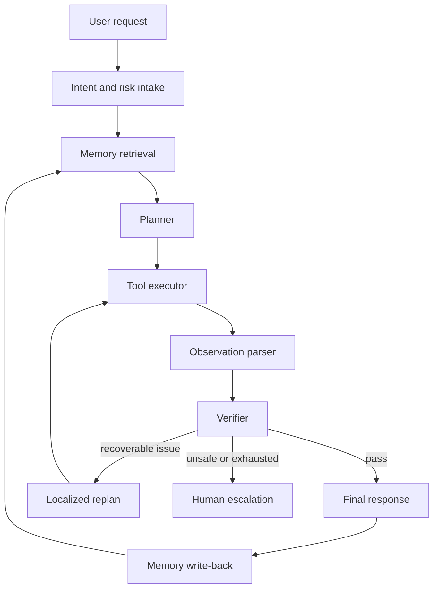

The diagram is deliberately circular because production agents are loops. Every loop needs a stopping condition, and every side effect needs a policy boundary. If you do not specify those boundaries, you have still made a design decision; you have chosen unbounded behavior by default.

The beginner mental model is "memory helps the agent remember things." The senior mental model is "memory is a state management layer with consistency, retention, retrieval, privacy, and staleness problems." The beginner mental model is "planning helps the agent break down tasks." The senior mental model is "planning is a control strategy whose cost and failure recovery depend on the dependency graph between tool calls."

Before we build the parts, keep one principle in view: an agent should only receive the context and authority needed for the current task. More memory, more tools, more reflection, and more autonomy are not automatically better. They increase capability, but they also increase latency, token cost, attack surface, and the number of ways the system can fail.

> **Active learning prompt:** Imagine a support agent that can issue refunds, look up orders, and remember customer preferences. Which single design mistake would be most dangerous: no long-term memory, no planning step, no tool permission policy, or no execution budget? Choose one before reading further, then compare your answer against the failure modes in later sections.

---

## Part 2: Agent Memory Systems

An agent without memory behaves like a brilliant temporary worker who forgets every previous shift. It may answer the current question well, but it cannot carry forward a user's preferences, previous failed attempts, open tasks, or lessons from past incidents. The tempting fix is to store everything, but that creates a different problem: the agent drowns in outdated facts, duplicate messages, and low-value chatter.

The right design separates memory by purpose. Recent dialogue belongs in working context because exact wording matters. Durable facts belong in long-term memory because the agent may need them tomorrow. Completed workflows belong in episodic memory because the sequence and outcome matter. Older conversation belongs in summaries because raw logs are too expensive to keep injecting into prompts.

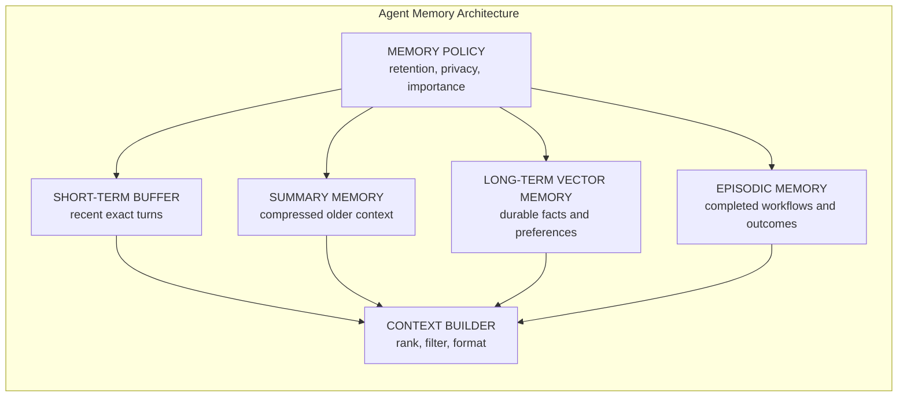

Short-term memory is the rolling buffer of recent messages. It is the highest-fidelity memory because it preserves exact phrasing, tool results, and unresolved references like "that second option." It is also the easiest memory to misuse because engineers often append messages until the context window is full. When the buffer grows without policy, relevant recent details compete with old filler, and the model may miss the thing it needs.

Long-term memory stores durable facts such as "the user prefers concise output," "the team deploys with Argo CD," or "the billing account was migrated last month." In modern agents this is often implemented with embeddings and vector search, but vector similarity is not a database transaction log. A sentence about an old address can look semantically similar to a sentence about a new address, so metadata, recency, and conflict resolution matter.

Episodic memory stores complete experiences rather than isolated facts. An episode might capture "the agent investigated a failed rollout, found that a readiness probe path changed, patched the manifest, and verified recovery." That memory is useful because future debugging tasks often resemble previous incidents structurally, even when the exact service name changes. Episodic memory helps the agent reuse a successful strategy without pretending that the old answer is automatically the new answer.

Summary memory compresses older conversation into a small representation. It is not a replacement for source-of-truth data, and it should not be treated as legally exact. A summary is useful for continuity, but it can omit details, overgeneralize, or freeze a conclusion that later became stale. Good agents mark summaries as summaries and retrieve original records when exactness matters.

| Memory Type | Best Use | Main Risk | Production Guardrail |
|---|---|---|---|
| Short-term buffer | Exact recent dialogue, unresolved references, immediate tool outputs | Token exhaustion and distraction from stale turns | Fixed window, role filtering, and task-aware trimming |
| Long-term vector memory | Durable facts, preferences, reusable knowledge, semantic recall | Stale or conflicting facts retrieved by similarity alone | Metadata filters, recency weighting, conflict resolution |
| Episodic memory | Past workflows, incident patterns, successful procedures, lessons learned | Treating old outcomes as guaranteed current truth | Store outcome, environment, date, and verification evidence |
| Summary memory | Continuity across long conversations without full logs | Compression loses edge cases and exact commitments | Link summaries to source turns and refresh after major decisions |
| Policy memory | User consent, retention rules, sensitivity classifications | Sensitive data retained or injected into prompts incorrectly | Privacy tags, TTLs, redaction, and access checks |

A reliable memory layer makes write decisions as carefully as read decisions. Many weak agents ask "what should I retrieve?" but ignore "what should I store?" That omission creates memory hoarding, where every greeting, repeated question, and temporary draft becomes searchable forever. A mature design evaluates importance, sensitivity, freshness, and conflict before writing.

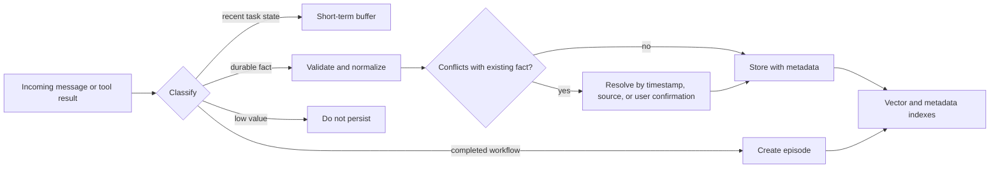

The classification step is where many production systems succeed or fail. If the user says, "My temporary hotel address this week is 12 Pine Street," the memory should not overwrite the user's permanent address unless the system has a field model that distinguishes temporary and permanent addresses. If the user says, "Forget my previous phone number," the system needs deletion or invalidation semantics, not another vector entry that says the previous phone number should be forgotten.

A useful retrieval pipeline ranks candidate memories by more than similarity. It can apply hard filters first, such as tenant, user, sensitivity, and data domain. It can then score by semantic relevance, recency, source reliability, and importance. Finally, it should format retrieved memory for the model with clear labels so the model can distinguish facts, summaries, and similar past episodes.

```python
from __future__ import annotations

from dataclasses import dataclass, field
from datetime import datetime, timezone
from math import sqrt
from typing import Iterable


@dataclass
class MemoryRecord:
    content: str
    embedding: list[float]
    kind: str
    user_id: str
    source: str
    importance: float
    created_at: datetime = field(default_factory=lambda: datetime.now(timezone.utc))
    expires_at: datetime | None = None
    invalidated: bool = False


class SimpleEmbeddingModel:
    """Deterministic toy embedding model for local examples, not production use."""

    def embed(self, text: str) -> list[float]:
        buckets = [0.0, 0.0, 0.0, 0.0]
        for index, char in enumerate(text.lower()):
            buckets[index % len(buckets)] += (ord(char) % 31) / 31
        return buckets


class MemoryStore:
    """Small runnable memory store that combines metadata filtering and similarity scoring."""

    def __init__(self, embedding_model: SimpleEmbeddingModel) -> None:
        self.embedding_model = embedding_model
        self.records: list[MemoryRecord] = []

    def store(self, content: str, *, kind: str, user_id: str, source: str, importance: float) -> None:
        if importance < 0.3:
            return
        record = MemoryRecord(
            content=content,
            embedding=self.embedding_model.embed(content),
            kind=kind,
            user_id=user_id,
            source=source,
            importance=min(importance, 2.0),
        )
        self.records.append(record)

    def retrieve(self, query: str, *, user_id: str, allowed_kinds: Iterable[str], limit: int = 5) -> list[MemoryRecord]:
        now = datetime.now(timezone.utc)
        query_embedding = self.embedding_model.embed(query)
        allowed = set(allowed_kinds)
        scored: list[tuple[float, MemoryRecord]] = []

        for record in self.records:
            if record.user_id != user_id or record.kind not in allowed or record.invalidated:
                continue
            if record.expires_at is not None and record.expires_at <= now:
                continue
            similarity = self._cosine_similarity(query_embedding, record.embedding)
            age_hours = max((now - record.created_at).total_seconds() / 3600, 0.0)
            recency = 1.0 / (1.0 + age_hours / 72.0)
            score = similarity * 0.65 + record.importance * 0.25 + recency * 0.10
            scored.append((score, record))

        scored.sort(key=lambda item: item[0], reverse=True)
        return [record for _, record in scored[:limit]]

    @staticmethod
    def _cosine_similarity(left: list[float], right: list[float]) -> float:
        dot = sum(a * b for a, b in zip(left, right))
        left_norm = sqrt(sum(a * a for a in left))
        right_norm = sqrt(sum(b * b for b in right))
        if left_norm == 0 or right_norm == 0:
            return 0.0
        return dot / (left_norm * right_norm)


if __name__ == "__main__":
    store = MemoryStore(SimpleEmbeddingModel())
    store.store(
        "User prefers release summaries with risk, rollback, and verification sections.",
        kind="preference",
        user_id="u-123",
        source="chat",
        importance=1.4,
    )
    store.store(
        "User said hello during onboarding.",
        kind="conversation",
        user_id="u-123",
        source="chat",
        importance=0.1,
    )
    matches = store.retrieve(
        "How should I format the release note?",
        user_id="u-123",
        allowed_kinds=["preference", "episode"],
    )
    for match in matches:
        print(f"{match.kind}: {match.content}")
```

The example is intentionally small, but it shows the mechanism that matters. The store refuses low-importance chatter, filters by user and kind before ranking, and mixes similarity with importance and recency. A production system would use a real embedding model and database, but the design pressure is the same: retrieval should be relevant, authorized, fresh enough, and labeled.

> **Active learning prompt:** Suppose a user says, "I used to prefer Terraform, but our team has moved all new infrastructure work to Crossplane." Which memory records should be created, updated, or invalidated? Write your answer in terms of facts, timestamps, and conflict handling rather than vague "remember this" behavior.

Memory also needs observability because failed recall often looks like model incompetence from the outside. A user asks, "What repository did we decide to use?" and the agent answers incorrectly. The root cause may be a missing write, an overly strict metadata filter, a weak query rewrite, a stale summary, a vector ranking issue, or a context builder that dropped the correct record after retrieval. Debugging requires logging each stage separately.

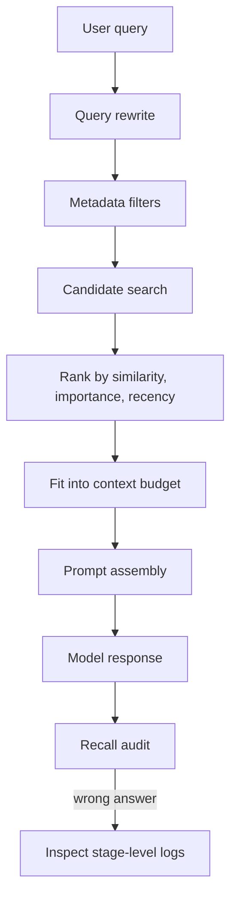

Senior teams often test memory with scenario fixtures rather than isolated unit tests. A fixture can create three conflicting addresses, one deletion request, one preference update, and one old episode, then verify that the context builder includes the current address and excludes the deleted one. This is how you catch the difference between "the vector store works" and "the agent remembers correctly under realistic conflict."

---

## Part 3: Planning Algorithms

Planning turns an agent from a reactive responder into a task executor. The planner decides which steps are needed, which tools to use, which dependencies exist between steps, and when to stop. A planning algorithm is not just a prompt style; it is an execution strategy with cost, latency, and recovery behavior.

The simplest agent pattern is reactive: observe the current state, decide the next action, execute it, observe the result, and repeat. This is flexible, but it spends a model call at each turn and can drift when the task is long. More structured patterns create a plan first, execute known steps, and only replan when evidence changes. More deliberative patterns explore multiple possible solutions before committing to one.

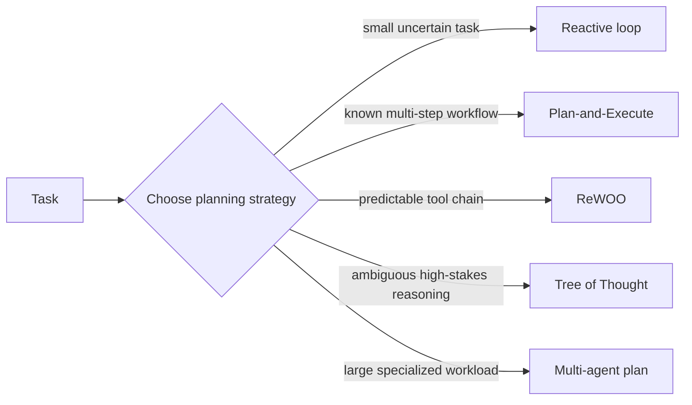

The key decision is dependency structure. If each step depends heavily on the previous observation, a reactive loop or localized replanning may be necessary. If most tool calls are predictable from the start, upfront planning reduces repeated reasoning. If the task requires comparing several candidate strategies, Tree of Thought can improve answer quality at the cost of extra model calls. If the task requires different expertise areas, multi-agent coordination can reduce cognitive overload.

| Planning Pattern | Best Fit | Weak Fit | Cost Profile | Failure Recovery |
|---|---|---|---|---|
| Reactive loop | Uncertain tasks where each observation changes the next action | Predictable workflows with many repetitive tool calls | Many small model calls and growing context | Natural but can drift or loop |
| Plan-and-Execute | Workflows with clear ordered steps and moderate uncertainty | Tasks where early observations invalidate the whole plan | One planning call plus execution calls | Needs explicit replan hooks |
| ReWOO | Deterministic tool chains where evidence can be gathered upfront | Exploratory debugging where tool output changes strategy | Low model-call count and predictable execution | Weak unless planner anticipated branches |
| Tree of Thought | Hard reasoning, design trade-offs, and ambiguous decisions | Simple lookup or high-volume tasks | Expensive because branches are generated and scored | Strong for reasoning, not side effects |
| Multi-agent planning | Work requiring distinct specialist perspectives | Small tasks where coordination overhead dominates | More calls and orchestration complexity | Depends on supervisor or routing constraints |

Plan-and-Execute is usually the first production pattern to implement because it is understandable, testable, and easy to constrain. The planner produces structured steps, the executor runs each step, and the verifier checks whether the result satisfies the task. The mistake is treating the generated plan as sacred. A plan is a hypothesis about how to solve the task, and execution may reveal that the hypothesis needs local repair.

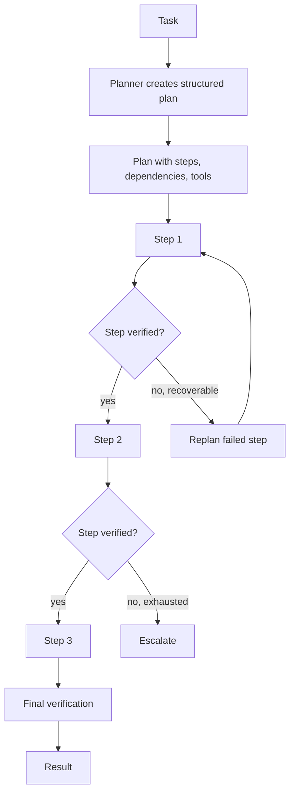

A structured plan should include step identifiers, dependencies, tool names, typed inputs, expected outputs, retry policy, and verification criteria. Without those fields, the executor is forced to infer too much from natural language. That inference becomes brittle when the model changes wording, a tool returns an unexpected shape, or a later step needs evidence from an earlier one.

```python
from __future__ import annotations

from dataclasses import dataclass, field
from enum import Enum
from typing import Callable


class StepStatus(str, Enum):
    PENDING = "pending"
    COMPLETE = "complete"
    FAILED = "failed"


@dataclass
class PlanStep:
    step_id: str
    description: str
    tool: str
    tool_input: dict[str, str]
    depends_on: list[str] = field(default_factory=list)
    expected_key: str = "result"
    retries: int = 1
    status: StepStatus = StepStatus.PENDING
    result: dict[str, str] = field(default_factory=dict)


class PlanExecutor:
    """Minimal structured executor with dependency checks and bounded retries."""

    def __init__(self, tools: dict[str, Callable[[dict[str, str]], dict[str, str]]]) -> None:
        self.tools = tools

    def execute(self, steps: list[PlanStep]) -> dict[str, dict[str, str]]:
        completed: dict[str, dict[str, str]] = {}
        by_id = {step.step_id: step for step in steps}

        for step in steps:
            missing = [dep for dep in step.depends_on if dep not in completed]
            if missing:
                step.status = StepStatus.FAILED
                step.result = {"error": f"Missing dependencies: {', '.join(missing)}"}
                raise RuntimeError(step.result["error"])

            tool = self.tools.get(step.tool)
            if tool is None:
                step.status = StepStatus.FAILED
                step.result = {"error": f"Unknown tool: {step.tool}"}
                raise RuntimeError(step.result["error"])

            last_error = ""
            for _ in range(step.retries + 1):
                try:
                    step.result = tool(step.tool_input)
                    if step.expected_key not in step.result:
                        raise ValueError(f"Missing expected key: {step.expected_key}")
                    step.status = StepStatus.COMPLETE
                    completed[step.step_id] = step.result
                    break
                except Exception as exc:
                    last_error = str(exc)

            if step.status != StepStatus.COMPLETE:
                step.result = {"error": last_error}
                by_id[step.step_id] = step
                raise RuntimeError(f"Step {step.step_id} failed: {last_error}")

        return completed
```

ReWOO, or Reason Without Observation, separates the reasoning phase from the evidence-gathering phase. The planner creates tool calls with evidence variables, the executor fills those variables, and a final solver synthesizes the answer. This is powerful when the tool chain is predictable, such as "search documents, fetch metadata, summarize fields, compare values." It is weaker when each observation may change the investigation strategy.

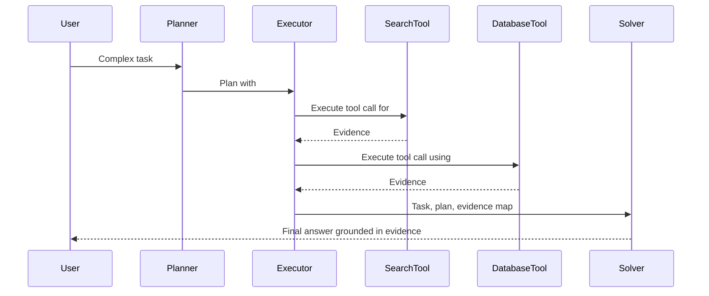

ReWOO reduces repeated model calls because the model does not reason after every observation. That is valuable for high-volume extraction, predictable research, and workflows with stable tool contracts. The trade-off is that the first plan must be good enough. If the planner fails to include a needed branch, the executor may collect the wrong evidence efficiently, which is still wrong.

Tree of Thought explores multiple reasoning paths and scores them before synthesizing an answer. It is best for problems where choosing the approach is the hard part: architecture trade-offs, root cause hypotheses, migration strategies, and policy decisions. It is usually a poor fit for routine tool execution because branch exploration is expensive and can accidentally multiply side effects if not isolated.

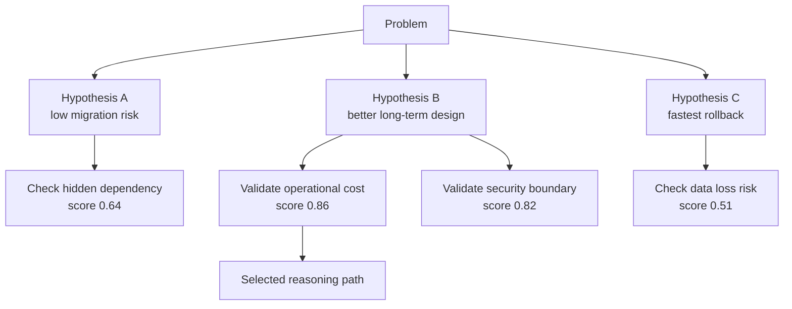

The safest Tree of Thought implementations keep branch exploration in a sandbox until a final strategy is chosen. For example, a cloud remediation agent should not actually change production resources while exploring branches. It should simulate, inspect, and evaluate candidate plans first, then request approval or execute only the selected plan under policy.

The practical senior move is to combine patterns. A system might use a classifier to route simple requests to normal chat, predictable workflows to ReWOO, complex operational tasks to Plan-and-Execute with replanning, and high-stakes design decisions to Tree of Thought. The goal is not pattern purity. The goal is matching the control strategy to the task.

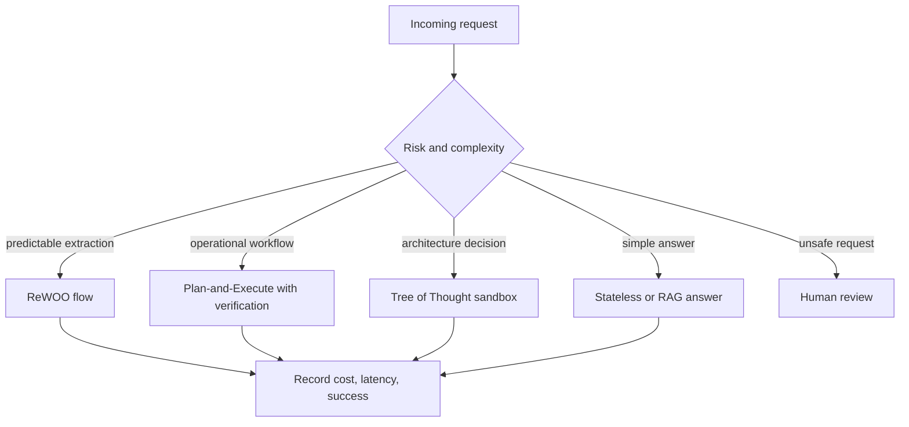

> **Active learning prompt:** Your team needs an agent to inspect failed CI runs, read logs, identify the likely cause, and open a draft pull request when the fix is obvious. Which planning pattern would you choose for log inspection, which pattern would you choose for making code changes, and where would you require human approval?

---

## Part 4: Multi-Agent Architectures

A single agent can become overloaded when a task requires research, code generation, security review, product judgment, and user communication. Multi-agent systems split work across specialized roles, but specialization introduces coordination problems. You gain narrower prompts and clearer responsibilities, while paying for routing, synthesis, disagreement resolution, and loop prevention.

The supervisor pattern is the easiest multi-agent topology to govern. A central supervisor receives the task, decomposes it, delegates work to specialists, checks their outputs, and synthesizes the final result. It is less flexible than a free-form swarm, but it is easier to audit because one node owns global state and stopping conditions.

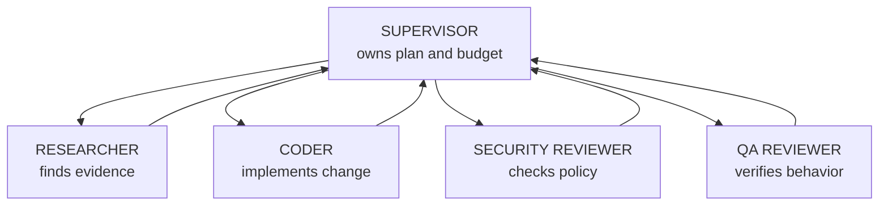

A supervisor should not blindly concatenate worker outputs. It should validate that each worker answered the assigned question, identify contradictions, request targeted revisions if necessary, and preserve evidence for audit. If the researcher says a library supports a feature and the security reviewer says the feature is unsafe, the supervisor needs an explicit arbitration rule instead of averaging the opinions.

Swarm architectures allow peer agents to hand off work dynamically. They can feel more natural for exploratory tasks because the agent closest to the problem can decide who should handle the next step. The danger is a delegation loop, where a QA agent returns work to a developer, the developer returns it to QA, and neither has authority to finish or escalate.


A swarm needs routing history, handoff limits, role confidence thresholds, and escalation rules. Without those constraints, dynamic collaboration becomes uncontrolled recursion. A good swarm coordinator records which agents handled which task, what changed at each handoff, why the next handoff is justified, and whether the maximum handoff count has been reached.

Hierarchical teams are useful when work naturally decomposes by domain and subdomain. An executive agent can assign broad goals to lead agents, and each lead can manage worker agents. This pattern resembles an organization chart, which can be helpful for large research or migration tasks. It also adds latency and can obscure responsibility if every layer merely restates the task.

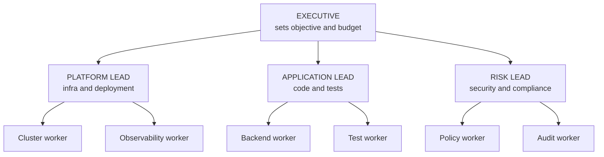

Debate architectures assign agents to argue competing positions, then ask a judge to evaluate the arguments. They can expose weak assumptions in design decisions, such as whether to use a vector store, a relational table, or both for memory. Debate is not magic truth discovery. If every participant shares the same blind spot or the judge lacks evidence, the final answer can still be wrong.

| Topology | Use When | Avoid When | Required Control |
|---|---|---|---|
| Supervisor | You need auditability, clear ownership, and bounded delegation | The task is tiny or purely conversational | Central budget, worker contracts, synthesis checks |
| Swarm | The right specialist is hard to know upfront and handoffs are natural | Infinite ping-pong would be costly or unsafe | Routing history, max handoffs, escalation policy |
| Hierarchical team | The task has multiple domains and many subtasks | Layers would only repeat instructions without adding expertise | Budget per tier and clear acceptance criteria |
| Debate | You need to evaluate competing strategies or surface assumptions | There is no evidence base for claims | Judge rubric, source requirements, and final decision owner |
| Single agent | The task fits one context and one skill set | The prompt becomes overloaded with conflicting roles | Strong tool policy and verification loop |

The right multi-agent design often starts with a single agent and one explicit reviewer. If that works, add specialists only where they reduce real failure. Adding five agents because the architecture looks sophisticated usually increases cost and makes debugging harder. Production systems reward boring clarity more often than clever choreography.

---

## Part 5: Self-Correction, Tool Creation, and Execution Budgets

Reflection lets an agent critique and improve its own output before finalizing it. This can catch missing steps, inconsistent formatting, weak reasoning, and obvious factual errors. It can also waste enormous cost when the agent keeps polishing a good-enough answer. Reflection must therefore have a budget, a rubric, and a stopping rule.

Self-correction is stronger when it uses external verification rather than pure self-opinion. A code agent should run tests. A data agent should validate schema constraints. A support agent should check policy documents. A Kubernetes remediation agent should inspect rollout status after a change. The model can propose a correction, but the environment should verify whether the correction worked.

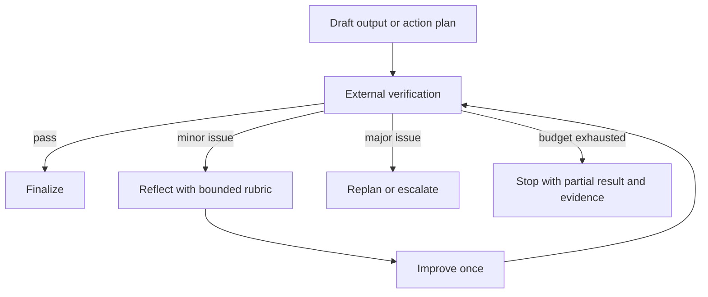

Tool creation is the most dangerous pattern in this module. An agent that writes and executes new code can expand its own capabilities, but it can also create security vulnerabilities, duplicate existing tools, bypass governance, or overload its own tool registry. Production systems should treat dynamic tool creation as privileged behavior that requires sandboxing, review, resource limits, and often human approval.

The safer default is tool composition, not tool creation. If the agent needs to inspect a log, parse JSON, and compare fields, it should use approved tools for file reading, JSON parsing, and comparison. A new tool should be created only when existing tools cannot reasonably perform the task, the tool specification is narrow, the runtime is sandboxed, and the resulting code can be tested.

| Control | What It Prevents | Implementation Example |
|---|---|---|
| Iteration limit | Infinite planning, reflection, or handoff loops | `max_iterations`, `max_reflections`, `max_handoffs` |
| Time budget | Long-running loops and user-visible hangs | Wall-clock deadline around the entire task |
| Token budget | Cost explosions from repeated context expansion | Per-stage token ceilings and truncation policy |
| Tool allowlist | Unauthorized side effects | Role-scoped tools and explicit permissions |
| Idempotency key | Duplicate external actions during retries | Stable request IDs for payments, tickets, and changes |
| Verification gate | Confident but wrong final answers | Tests, policy checks, schema validation, rollout checks |
| Human escalation | Unsafe autonomous decisions | Approval for destructive or irreversible actions |

A Kubernetes-hosted agent should have both application-level and platform-level limits. At the application layer, the agent should count iterations, retries, tool calls, and tokens. At the platform layer, a Kubernetes v1.35+ `batch/v1` Job can enforce finite execution, and container resource limits can prevent a runaway process from consuming unlimited CPU or memory. These controls serve different purposes, and neither replaces the other.

```yaml
apiVersion: batch/v1
kind: Job
metadata:
  name: support-agent-task
spec:
  backoffLimit: 1
  activeDeadlineSeconds: 900
  template:
    spec:
      restartPolicy: Never
      containers:
        - name: agent
          image: example.com/support-agent:1.0.0
          args: ["run-task", "--task-id=$(TASK_ID)"]
          env:
            - name: TASK_ID
              value: "task-123"
            - name: MAX_ITERATIONS
              value: "8"
            - name: MAX_TOOL_CALLS
              value: "20"
          resources:
            requests:
              cpu: "250m"
              memory: "512Mi"
            limits:
              cpu: "1"
              memory: "1Gi"
```

The Job manifest is not a complete safety system, but it shows the production mindset. The agent has an external deadline, bounded retries, explicit environment configuration, and resource limits. The application still needs tool permissions and verification gates because Kubernetes cannot tell whether a model is about to send a bad refund or write a misleading incident summary.

---

## Part 6: Worked Example: A Support Agent Debugs a Failed Deployment

This worked example traces a complete complex task before you build a smaller version in the hands-on exercise. The scenario is a platform support agent that helps an application team investigate a failed Kubernetes rollout. The agent has read-only cluster inspection tools, a documentation search tool, a ticket update tool, hybrid memory, and permission to propose a patch. It does not have permission to apply production changes without human approval.

The user says: "The checkout service rollout is stuck after today's release. Find the likely cause, explain the fix, and draft the ticket update." This is not a simple Q&A task. The agent must recall team context, inspect live state, plan tool use, adapt to evidence, avoid unsafe writes, and produce an auditable answer. A stateless chat response would be cheap but unreliable because it would not see the current cluster state or previous team decisions.

```mermaid
sequenceDiagram
    participant User
    participant Agent
    participant Memory
    participant Planner
    participant ClusterTool
    participant DocsTool
    participant Verifier
    participant TicketTool
    User->>Agent: Checkout rollout is stuck
    Agent->>Memory: Retrieve service context and past incidents
    Memory-->>Agent: Team uses readiness probes and Argo CD; similar failure last month
    Agent->>Planner: Build bounded investigation plan
    Planner-->>Agent: Inspect rollout, pods, events, recent manifest diff, docs
    Agent->>ClusterTool: Get rollout status and pods
    ClusterTool-->>Agent: New pods failing readiness probe
    Agent->>ClusterTool: Get pod events and container logs
    ClusterTool-->>Agent: Probe returns HTTP 404 on /ready
    Agent->>DocsTool: Search service release notes
    DocsTool-->>Agent: Health endpoint changed to /healthz
    Agent->>Verifier: Check diagnosis against evidence
    Verifier-->>Agent: Diagnosis supported, production patch needs approval
    Agent->>TicketTool: Draft update only
    TicketTool-->>Agent: Draft ticket comment created
    Agent-->>User: Cause, proposed fix, evidence, and next step
```

The first stage is intake and risk classification. The agent identifies that the task concerns production deployment health, so it selects an operational workflow rather than casual chat. Because the requested action includes "find" and "explain" but not "apply," the agent keeps tool permissions read-only except for drafting a ticket comment. This early classification prevents the agent from silently patching production just because it found a likely fix.

The second stage is memory retrieval. The agent pulls a team preference stating that checkout deployments are managed through GitOps, not direct cluster edits. It retrieves a past episode where a readiness probe path changed and caused a rollout to stall. It also retrieves a policy memory stating that production changes require a human approval comment on the deployment ticket. These memories do not answer the task directly, but they shape safe execution.

The third stage is planning. The agent creates a Plan-and-Execute workflow because each inspection step depends on the previous evidence, but the overall investigation structure is predictable. It decides to inspect rollout status, list new pods, read events, read logs if necessary, compare the current manifest to the expected health endpoint, verify the diagnosis, draft a ticket update, and stop before applying a change. This plan is specific enough to execute and bounded enough to audit.

| Trace Step | Agent Decision | Evidence Used | Risk Control |
|---|---|---|---|
| Intake | Treat as production support task, not casual advice | User mentions stuck rollout and service name | Restrict to read-only inspection plus ticket draft |
| Memory retrieval | Load GitOps preference and similar past incident | Team memory and episodic memory | Label memory as context, not proof |
| Planning | Use Plan-and-Execute with verification | Task has ordered diagnostic steps | Set max tool calls and no direct patching |
| Cluster inspection | Check rollout, pods, events, and logs | Rollout status and failing readiness probe | Read-only tools prevent accidental mutation |
| Evidence synthesis | Compare `/ready` failure with release note endpoint change | Logs plus documentation search | Require two independent evidence sources |
| Verification | Confirm proposed fix matches observed failure | Probe path mismatch and current manifest | Stop before production change |
| Memory write-back | Store episode summary after final response | Outcome and ticket draft ID | Avoid storing raw logs with sensitive data |

The fourth stage is execution. The cluster tool reports that the Deployment has unavailable replicas and the new ReplicaSet's pods are failing readiness checks. Events show repeated readiness probe failures. Logs do not show application crashes, which narrows the cause away from startup failure and toward health check configuration. The agent then searches internal release notes and finds that checkout changed its health endpoint from `/ready` to `/healthz` during the release.

The fifth stage is localized reasoning, not blind pattern matching. The past episode about a readiness probe path change made the agent inspect probes earlier, but it did not use that episode as the answer. The answer came from current evidence: rollout status, pod events, and release notes. This distinction matters because episodic memory should guide investigation, while live evidence should support operational conclusions.

The sixth stage is verification. The agent checks that the current Deployment manifest still points the readiness probe at `/ready`, while the new application version exposes `/healthz`. It also checks whether liveness is failing; it is not. That means the service is running but not becoming ready, which matches the observed rollout behavior. The verifier marks the diagnosis as supported but notes that applying a manifest change is outside the agent's permission boundary.

The seventh stage is output. The agent drafts a ticket comment that states the likely cause, the evidence, the proposed manifest change, the risk, and the required human approval. It tells the user that it has not applied the change. That final sentence is not bureaucratic filler; it is part of the safety contract. Users need to know whether the system has only advised, drafted, or acted.

```text
Ticket draft:
The checkout rollout is stalled because new pods are failing readiness checks.
Evidence: Deployment rollout reports unavailable replicas; pod events show readiness probe HTTP 404 on /ready; release notes for the new version state that the health endpoint moved to /healthz.
Proposed fix: update the readinessProbe HTTP path from /ready to /healthz in the GitOps-managed manifest, then let Argo CD reconcile.
Risk: low if only readiness path changes, but production policy requires human approval before merge.
Action taken: drafted this update only; no cluster or repository changes were applied.
```

The eighth stage is memory write-back. The agent stores a sanitized episode: service name, symptom, evidence pattern, root cause, proposed fix, and approval boundary. It does not store raw logs or secrets. The next time checkout has a readiness issue, the agent can recall the pattern, but it still must inspect live evidence because the next failure may have a different cause.

This example illustrates the central lesson of the module. The agent succeeded because memory, planning, tools, verification, and permissions supported each other. Memory suggested where to look, planning organized the investigation, tools gathered current evidence, verification prevented overreach, and policy stopped the agent before an unauthorized production change. Remove any one of those controls, and the same intelligent model becomes much less reliable.

---

## Part 7: Production Economics and Observability

Agent cost grows faster than many teams expect because every stage can add tokens, latency, and external calls. A simple chatbot might answer with one model call. An agent may rewrite the query, retrieve memory, generate a plan, call several tools, summarize observations, replan after an error, verify the result, reflect on the answer, and store a new episode. Each step may be justified, but the total must be budgeted.

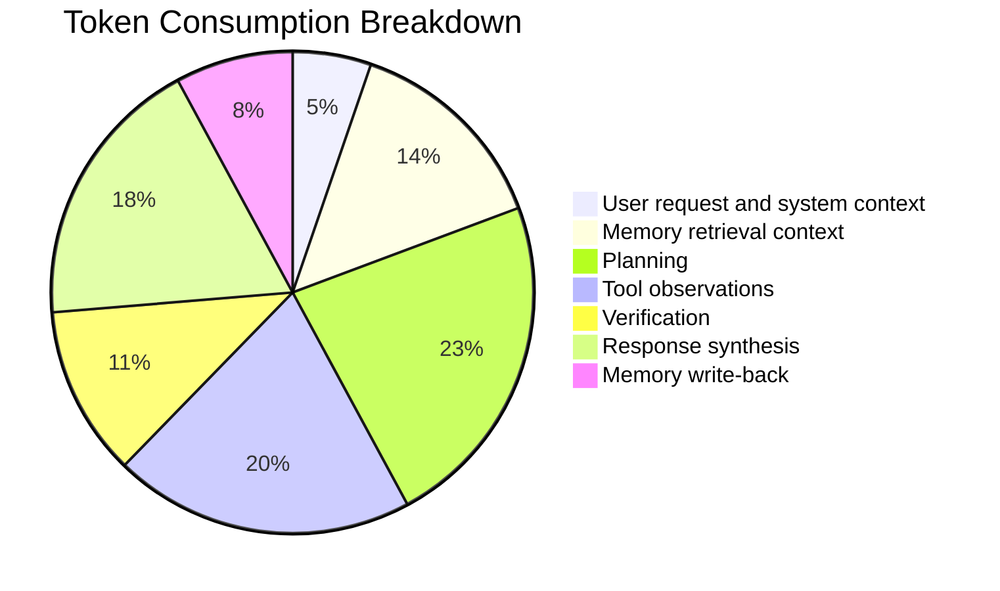

Latency also compounds. A planner call that takes a few seconds may feel acceptable, but a planner call plus three sequential tool calls plus verification plus reflection can feel broken in an interactive UI. Production systems often need progress updates, asynchronous job handling, cancellation, and partial results. The user experience should reflect the actual execution model instead of pretending the agent is a normal instant chatbot.

| Metric | What It Measures | Why It Matters | Example Target |
|---|---|---|---|
| Task completion rate | Percentage of tasks that reach a valid end state | Captures whether the agent actually finishes useful work | Above 85 percent for supported workflows |
| First-pass success | Percentage completed without replan or retry | Separates smooth execution from expensive recovery | Above 70 percent after stabilization |
| Tool-call count | Number of external actions per task | Detects loops and inefficient plans | Bounded by workflow class |
| Memory precision | Retrieved memories that were actually useful | Catches noisy vector recall and stale summaries | Reviewed with labeled fixtures |
| Verification failure rate | Outputs rejected by tests or policy checks | Shows whether generation quality is improving | Should decline as prompts and tools mature |
| Human escalation rate | Tasks requiring manual decision or approval | Indicates risk boundaries and automation coverage | Expected to remain nonzero for high-risk work |
| P95 latency | Slow-end user-visible response time | Determines whether UX needs async handling | Set by product workflow, not wishful thinking |

Observability should preserve the agent's reasoning structure without logging sensitive prompt contents unnecessarily. A trace should show request classification, retrieved memory IDs, selected plan, tool calls, tool outcomes, retries, verification decisions, final action, and memory writes. Sensitive values should be redacted, and logs should respect tenant boundaries. Without these traces, incident response becomes guesswork.

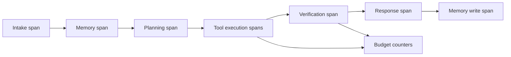

The most useful dashboards separate model quality from system behavior. If the agent fails because a tool returned a schema error, that is not the same as a hallucinated answer. If retrieval returned stale memory, that is not the same as a bad planner. If the verifier rejected a risky action, that may be a success, not a failure. Mature operations classify these outcomes so teams improve the right layer.

```python
from dataclasses import dataclass, field
from time import monotonic


@dataclass
class AgentBudget:
    max_seconds: float = 60.0
    max_tool_calls: int = 12
    max_replans: int = 2
    started_at: float = field(default_factory=monotonic)
    tool_calls: int = 0
    replans: int = 0

    def check_time(self) -> None:
        elapsed = monotonic() - self.started_at
        if elapsed > self.max_seconds:
            raise TimeoutError(f"Agent exceeded {self.max_seconds} second budget")

    def record_tool_call(self) -> None:
        self.tool_calls += 1
        if self.tool_calls > self.max_tool_calls:
            raise RuntimeError("Agent exceeded tool-call budget")

    def record_replan(self) -> None:
        self.replans += 1
        if self.replans > self.max_replans:
            raise RuntimeError("Agent exceeded replan budget")


if __name__ == "__main__":
    budget = AgentBudget(max_seconds=10.0, max_tool_calls=3, max_replans=1)
    budget.record_tool_call()
    budget.record_tool_call()
    budget.check_time()
    print("Budget still healthy")
```

The budget object is simple, but it encodes a non-negotiable production rule: every autonomous loop needs a counter. Engineers sometimes try to solve runaway behavior with better prompts alone. Prompts help, but counters, deadlines, allowlists, and verifiers are the controls that remain enforceable when the model is uncertain or wrong.

---

## Part 8: Choosing the Right Design

Designing an agent begins with a task inventory, not with a framework choice. Write down what the user wants, what evidence is needed, what tools may be called, what can go wrong, what must never happen automatically, and how success will be verified. Only then should you choose memory and planning patterns. Frameworks can speed implementation, but they cannot decide your risk boundary.

For low-risk knowledge tasks, a RAG pipeline with short-term memory may be enough. For customer workflows, add durable user preferences, explicit policy memory, and carefully scoped tools. For operational workflows, add structured planning, external verification, and human approval for destructive actions. For long-running research or software engineering tasks, consider episodic memory and specialized agents, but keep budgets strict.

| Scenario | Recommended Memory | Recommended Planning | Required Safety Layer |
|---|---|---|---|
| Simple documentation assistant | Short-term buffer plus RAG snippets | Stateless answer or minimal routing | Citation and source freshness checks |
| Personal productivity assistant | Preferences, summaries, and recent task state | Plan-and-Execute for multi-step tasks | Calendar or email permission gates |
| Customer support agent | User facts, policy memory, and case episodes | Plan-and-Execute with escalation branches | Refund, account, and legal policy checks |
| Batch invoice extraction | Minimal memory and evidence variables | ReWOO for predictable tool chains | Schema validation and sample audits |
| Production operations assistant | Team context, incidents, and runbooks | Plan-and-Execute with localized replanning | Read-only default, approval for mutation |
| Architecture decision assistant | Prior decisions and design constraints | Tree of Thought or debate | Evidence requirements and decision record |

A useful design review asks adversarial questions. What stale memory could cause the worst answer? What tool call would be dangerous if repeated? What step would be expensive if the planner loops? What evidence would prove the final answer wrong? What should the agent do when it is uncertain? These questions turn "agent intelligence" into concrete engineering requirements.

The final design principle is reversibility. Prefer actions that can be inspected, drafted, simulated, or approved before execution. A draft ticket is safer than a sent email. A proposed patch is safer than a direct production edit. A dry-run policy check is safer than a live change. Agents are most valuable when they accelerate human work without erasing accountability.

---

## Did You Know?

- **Fact 1:** Larger context windows reduce some memory pressure, but they do not remove the need for retrieval design because long prompts can still bury relevant details among distracting text.
- **Fact 2:** ReWOO-style planning can reduce repeated reasoning calls when a tool chain is predictable, but it becomes brittle when later observations should change the plan.
- **Fact 3:** Episodic memory is most useful when it stores the situation, actions, evidence, outcome, and lesson together, rather than storing a vague summary of success.
- **Fact 4:** A verifier that uses tests, schema checks, policy rules, or live system state is usually more reliable than a reflection loop that only asks the same model to judge itself.

---

## Common Mistakes

| Mistake | Why It Happens | How to Fix |
|---|---|---|
| Storing every conversation turn forever | Teams confuse "more memory" with "better recall" and fill the vector store with low-value chatter. | Add importance scoring, TTLs, duplicate detection, and explicit write policies before indexing. |
| Treating vector similarity as truth | Semantically similar old facts can outrank newer or more authoritative facts when metadata is ignored. | Combine similarity with recency, source reliability, user scope, and conflict resolution rules. |
| Building plans as unstructured prose | Natural-language steps are easy to read but hard for executors to validate and recover from. | Generate structured plans with step IDs, dependencies, tool names, expected outputs, and retry rules. |
| Using ReWOO for exploratory debugging | The planner assumes the evidence path upfront even though each observation should change the next question. | Use Plan-and-Execute or a reactive loop with localized replanning for uncertain investigations. |
| Letting reflection run until the answer feels perfect | The model keeps finding minor improvements and spends tokens after the output is already useful. | Set reflection limits, define severity thresholds, and prefer external verification over self-opinion. |
| Allowing swarm agents to hand off without history | Peer agents can bounce the same task between each other without a clear owner or finish condition. | Track routing history, enforce max handoffs, and escalate when no agent materially changes the state. |
| Giving tool-creating agents broad execution rights | Dynamic code can duplicate tools, bypass policy, or execute unsafe behavior in the host environment. | Require sandboxing, allowlists, overlap checks, tests, and human approval for privileged tool creation. |

---

## Quiz

1. **Your team deploys a customer support agent that remembers user preferences. A user says, "I no longer want SMS updates; use email only." The next day, the agent retrieves both the old SMS preference and the new email preference. What should you inspect and change first?**

   <details>
   <summary>Answer</summary>

   Inspect the memory write and conflict-resolution path, not just the prompt. The new statement should either invalidate the old SMS preference or create a newer authoritative record that the context builder ranks above the old one. A robust fix includes metadata for preference type, timestamp, source, and active status, then retrieval logic that excludes invalidated preferences from prompt context.

   </details>

2. **A document-processing agent extracts fields from thousands of invoices. Each invoice follows the same workflow: parse text, extract vendor, validate totals, and write structured JSON. The current reactive agent makes a model call after every tool result and costs too much. Which planning pattern should you evaluate, and why?**

   <details>
   <summary>Answer</summary>

   Evaluate ReWOO because the tool chain is predictable and evidence can be gathered according to an upfront plan. The model can plan the extraction and validation steps once, the executor can run the deterministic tools, and a final solver can synthesize or validate the result. This reduces repeated reasoning calls compared with a reactive loop that re-reads growing context after every observation.

   </details>

3. **A production operations agent remembers that checkout once failed because of a readiness probe path change. Today checkout is failing again, and the agent immediately recommends the same fix without inspecting the cluster. What design flaw caused this behavior?**

   <details>
   <summary>Answer</summary>

   The agent treated episodic memory as proof instead of using it as an investigation hint. The fix is to label retrieved episodes as prior examples, require live evidence for operational diagnoses, and add verification steps that inspect current rollout status, events, logs, and manifests before recommending a change. Episodic memory should guide where to look, not replace current observations.

   </details>

4. **A Plan-and-Execute agent generates a six-step deployment plan. Step three fails because a registry API times out once, and the agent abandons the whole task. What should the executor support?**

   <details>
   <summary>Answer</summary>

   The executor should support bounded retries and localized replanning. A transient API timeout should not automatically invalidate the whole plan, but the system also should not retry forever. The step definition should include retry policy, expected output, failure classification, and a path to replan the failed step if the error is recoverable.

   </details>

5. **A design assistant must recommend whether to store agent memory in a vector database, a relational database, or a hybrid architecture. The decision depends on privacy, conflict resolution, semantic recall, and auditability. Which reasoning pattern fits best, and what safety condition should you add?**

   <details>
   <summary>Answer</summary>

   Tree of Thought or a debate pattern fits because the hard part is evaluating competing architectures against several criteria. The safety condition is evidence-based evaluation: each branch or debate participant should cite constraints and trade-offs, and a judge or verifier should apply a rubric. The system should not choose based on rhetorical confidence alone.

   </details>

6. **A swarm system has a Developer agent and a QA agent. QA keeps rejecting a script, Developer keeps returning tiny edits, and the task never finishes. What controls should the coordinator enforce?**

   <details>
   <summary>Answer</summary>

   The coordinator should enforce routing history, max handoffs, material-change checks, and escalation. If a handoff does not change the task state meaningfully, the next loop should be blocked or sent to a supervisor. A supervisor topology may be better if the workflow needs a single owner to decide when the script is good enough.

   </details>

7. **A tool-creating agent proposes a new Python function to check CPU, another to check memory, and another to check disk, even though an approved metrics tool already returns all three. What should the tool governor do?**

   <details>
   <summary>Answer</summary>

   The governor should reject the new tools because they overlap with an existing approved capability. It should instruct the agent to use the metrics tool and only approve new tool creation when existing tools cannot reasonably satisfy the task. This prevents tool proliferation, context bloat, and unnecessary security review.

   </details>

---

## Hands-On Exercise: Build a Bounded Memory-and-Planning Agent

In this lab you will build a small local agent loop with deterministic mock components. The goal is not to create a powerful AI system. The goal is to practice the architecture from the worked example: classify a task, retrieve relevant memory, execute a structured plan, verify the result, enforce budgets, and store a sanitized episode.

You will use only the Python standard library. The mock language model returns deterministic plans so the exercise is repeatable without an API key. Keep the implementation small, but pay attention to the boundaries: the agent should not run forever, should not store every message, and should not claim success without verification.

### Task 1: Create the Workspace

Create an isolated directory and virtual environment.

```bash
mkdir -p ~/kubedojo-agent-memory-planning
cd ~/kubedojo-agent-memory-planning
.venv/bin/python --version 2>/dev/null || /Users/krisztiankoos/projects/kubedojo/.venv/bin/python --version
/Users/krisztiankoos/projects/kubedojo/.venv/bin/python -m venv .venv
.venv/bin/python -m pip install --upgrade pip
```

Success criteria:

- [ ] The directory `~/kubedojo-agent-memory-planning` exists.
- [ ] `.venv/bin/python --version` prints a Python version.
- [ ] No command requires a cloud API key.

### Task 2: Write the Runnable Agent

Create `agent_lab.py` with the following code.

```python
from __future__ import annotations

from dataclasses import dataclass, field
from enum import Enum
from time import monotonic
from typing import Callable
import json


class MockLLM:
    """Deterministic model stub for the lab."""

    def generate(self, prompt: str) -> str:
        if "CREATE_PLAN" in prompt:
            return json.dumps(
                {
                    "steps": [
                        {
                            "step_id": "inspect",
                            "description": "Inspect rollout symptoms",
                            "tool": "inspect_rollout",
                            "tool_input": {"service": "checkout"},
                            "depends_on": [],
                            "expected_key": "symptom",
                        },
                        {
                            "step_id": "docs",
                            "description": "Read release notes for health endpoint changes",
                            "tool": "search_docs",
                            "tool_input": {"service": "checkout"},
                            "depends_on": ["inspect"],
                            "expected_key": "endpoint",
                        },
                        {
                            "step_id": "draft",
                            "description": "Draft a ticket update with evidence",
                            "tool": "draft_ticket",
                            "tool_input": {"ticket": "SUP-123"},
                            "depends_on": ["inspect", "docs"],
                            "expected_key": "draft_id",
                        },
                    ]
                }
            )
        if "VERIFY" in prompt and "/ready" in prompt and "/healthz" in prompt:
            return json.dumps({"passed": True, "reason": "Probe mismatch is supported by evidence."})
        if "SUMMARIZE_EPISODE" in prompt:
            return "Checkout rollout failed readiness because the manifest used /ready while the app exposed /healthz."
        return "Mock response"


@dataclass
class MemoryRecord:
    kind: str
    content: str
    importance: float


class Memory:
    """Small memory layer with importance filtering and simple keyword retrieval."""

    def __init__(self) -> None:
        self.records: list[MemoryRecord] = []

    def store(self, kind: str, content: str, importance: float) -> None:
        if importance >= 0.3:
            self.records.append(MemoryRecord(kind=kind, content=content, importance=importance))

    def retrieve(self, query: str) -> list[MemoryRecord]:
        terms = {term.lower() for term in query.split()}
        matches = []
        for record in self.records:
            record_terms = {term.lower().strip(".,") for term in record.content.split()}
            if terms & record_terms:
                matches.append(record)
        matches.sort(key=lambda record: record.importance, reverse=True)
        return matches[:3]


@dataclass
class Budget:
    max_tool_calls: int = 5
    max_seconds: float = 20.0
    started_at: float = field(default_factory=monotonic)
    tool_calls: int = 0

    def record_tool_call(self) -> None:
        if monotonic() - self.started_at > self.max_seconds:
            raise TimeoutError("Task exceeded time budget")
        self.tool_calls += 1
        if self.tool_calls > self.max_tool_calls:
            raise RuntimeError("Task exceeded tool-call budget")


class StepStatus(str, Enum):
    PENDING = "pending"
    COMPLETE = "complete"
    FAILED = "failed"


@dataclass
class PlanStep:
    step_id: str
    description: str
    tool: str
    tool_input: dict[str, str]
    depends_on: list[str]
    expected_key: str
    status: StepStatus = StepStatus.PENDING
    result: dict[str, str] = field(default_factory=dict)


def inspect_rollout(args: dict[str, str]) -> dict[str, str]:
    service = args["service"]
    return {
        "service": service,
        "symptom": "new pods fail readiness checks at /ready with HTTP 404",
    }


def search_docs(args: dict[str, str]) -> dict[str, str]:
    service = args["service"]
    return {
        "service": service,
        "endpoint": "release notes say checkout now exposes /healthz",
    }


def draft_ticket(args: dict[str, str]) -> dict[str, str]:
    ticket = args["ticket"]
    return {
        "draft_id": f"{ticket}-draft",
        "status": "drafted only, no production change applied",
    }


class BoundedAgent:
    def __init__(self, llm: MockLLM, tools: dict[str, Callable[[dict[str, str]], dict[str, str]]]) -> None:
        self.llm = llm
        self.tools = tools
        self.memory = Memory()

    def seed_memory(self) -> None:
        self.memory.store("policy", "Production checkout changes require human approval.", 1.2)
        self.memory.store("episode", "A previous readiness incident involved a changed health endpoint.", 0.9)
        self.memory.store("chatter", "The user said hello during onboarding.", 0.1)

    def run(self, task: str) -> str:
        budget = Budget()
        memories = self.memory.retrieve(task)
        memory_context = "\n".join(f"- {record.kind}: {record.content}" for record in memories)

        plan_data = json.loads(self.llm.generate(f"CREATE_PLAN\nTask: {task}\nMemory:\n{memory_context}"))
        steps = [PlanStep(**step) for step in plan_data["steps"]]
        completed: dict[str, dict[str, str]] = {}

        for step in steps:
            missing = [dependency for dependency in step.depends_on if dependency not in completed]
            if missing:
                step.status = StepStatus.FAILED
                raise RuntimeError(f"Step {step.step_id} missing dependencies: {missing}")

            budget.record_tool_call()
            tool = self.tools[step.tool]
            step.result = tool(step.tool_input)

            if step.expected_key not in step.result:
                step.status = StepStatus.FAILED
                raise RuntimeError(f"Step {step.step_id} did not return {step.expected_key}")

            step.status = StepStatus.COMPLETE
            completed[step.step_id] = step.result

        evidence = json.dumps(completed, indent=2)
        verification = json.loads(self.llm.generate(f"VERIFY\nTask: {task}\nEvidence:\n{evidence}"))
        if not verification["passed"]:
            raise RuntimeError(f"Verification failed: {verification['reason']}")

        episode = self.llm.generate(f"SUMMARIZE_EPISODE\nTask: {task}\nEvidence:\n{evidence}")
        self.memory.store("episode", episode, 1.0)

        return (
            "Diagnosis: checkout readiness is failing because the manifest still probes /ready, "
            "while the release notes say the app now exposes /healthz.\n"
            "Action: drafted a ticket update only; no production change was applied.\n"
            f"Evidence:\n{evidence}"
        )


if __name__ == "__main__":
    agent = BoundedAgent(
        MockLLM(),
        {
            "inspect_rollout": inspect_rollout,
            "search_docs": search_docs,
            "draft_ticket": draft_ticket,
        },
    )
    agent.seed_memory()
    print(agent.run("The checkout rollout is stuck after today's release. Find the likely cause."))
```

Run the lab script.

```bash
.venv/bin/python agent_lab.py
```

Success criteria:

- [ ] The output identifies the readiness probe path mismatch.
- [ ] The output states that only a ticket draft was created.
- [ ] The evidence includes results from `inspect`, `docs`, and `draft`.
- [ ] The script exits without any network calls.

### Task 3: Break the Budget on Purpose

Modify `Budget(max_tool_calls=5)` to `Budget(max_tool_calls=2)` inside the `run` method, then run the script again.

```bash
.venv/bin/python agent_lab.py
```

Success criteria:

- [ ] The script fails before silently completing the third tool call.
- [ ] The failure message mentions the tool-call budget.
- [ ] You can explain why this is safer than letting the agent continue indefinitely.

Restore the tool budget to `5` after the experiment.

### Task 4: Break Verification on Purpose

Change the `search_docs` tool so it returns `/ready` instead of `/healthz`, then run the script again.

```bash
.venv/bin/python agent_lab.py
```

Success criteria:

- [ ] The verifier no longer has evidence for the diagnosis.
- [ ] The agent does not produce a successful final diagnosis.
- [ ] You can identify the difference between tool execution success and task verification success.

Restore `search_docs` so it returns `/healthz`.

### Task 5: Add a Memory Hygiene Check

Add one more stored memory inside `seed_memory` with low importance, then confirm it does not appear in retrieved memory.

```python
self.memory.store("chatter", "The user asked whether coffee was available.", 0.2)
```

Success criteria:

- [ ] Low-importance chatter is not stored.
- [ ] Operationally relevant policy and episode memory remain retrievable.
- [ ] You can describe why memory write policy matters as much as retrieval ranking.

### Task 6: Explain the Architecture

Write a short note beside your lab files that answers these questions in your own words.

- [ ] Which part of the lab represents short-term task context?
- [ ] Which part represents durable policy or episodic memory?
- [ ] Where is planning separated from execution?
- [ ] Where does verification prevent a confident but unsupported answer?
- [ ] Which tool permission boundary prevents the agent from applying a production change?

---

## Next Module

Move on to **[Module 1.7: Multi-Agent Systems](./module-1.7-multi-agent-systems)** to deepen coordination patterns, observability tracing, RBAC-compliant tool execution, and human-in-the-loop approval design.

## Sources

- [ReAct: Synergizing Reasoning and Acting in Language Models](https://arxiv.org/abs/2210.03629) — Primary source for the ReAct pattern discussed in the planning section.
- [ReWOO: Decoupling Reasoning from Observations for Efficient Augmented Language Models](https://arxiv.org/abs/2305.18323) — Primary source for planning tool use upfront and reducing repeated reasoning overhead.
- [Tree of Thoughts: Deliberate Problem Solving with Large Language Models](https://arxiv.org/abs/2305.10601) — Primary source for multi-branch reasoning with evaluation and pruning.
- [Jobs](https://kubernetes.io/docs/concepts/workloads/controllers/job/) — Kubernetes documentation for one-off batch workloads that run to completion.
- [Resource Management for Pods and Containers](https://kubernetes.io/docs/concepts/configuration/manage-resources-containers/) — Kubernetes documentation for declaring CPU and memory requests and limits.
- [Voyager: An Open-Ended Embodied Agent with Large Language Models](https://arxiv.org/abs/2305.16291) — Primary source for the Voyager example in the module's autonomous-agent discussion.
- [Lost in the Middle: How Language Models Use Long Contexts](https://arxiv.org/abs/2307.03172) — Further reading on why larger context windows do not eliminate retrieval and memory design problems.
- [OpenAI API Pricing](https://openai.com/api/pricing/) — Further reading for illustrative cost comparisons in the production economics section.
