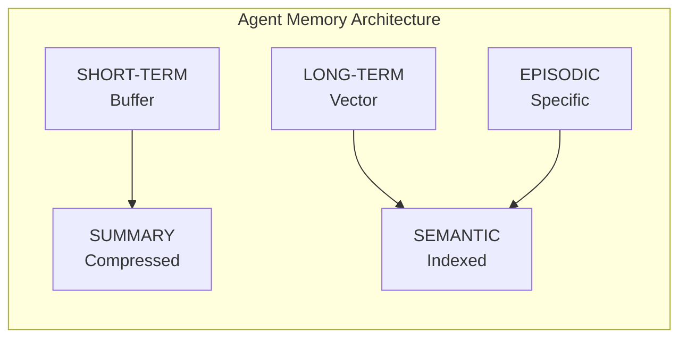
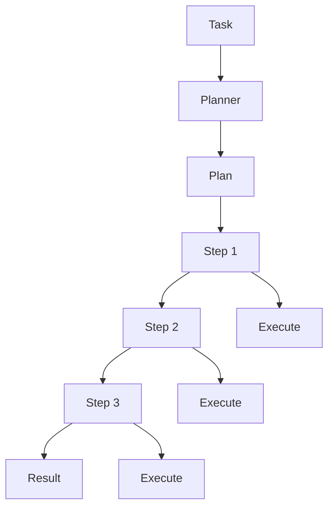
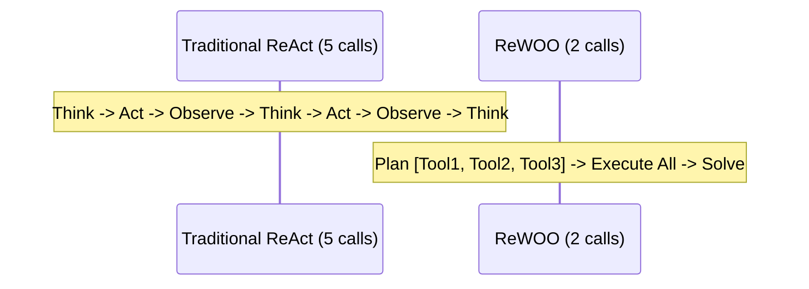
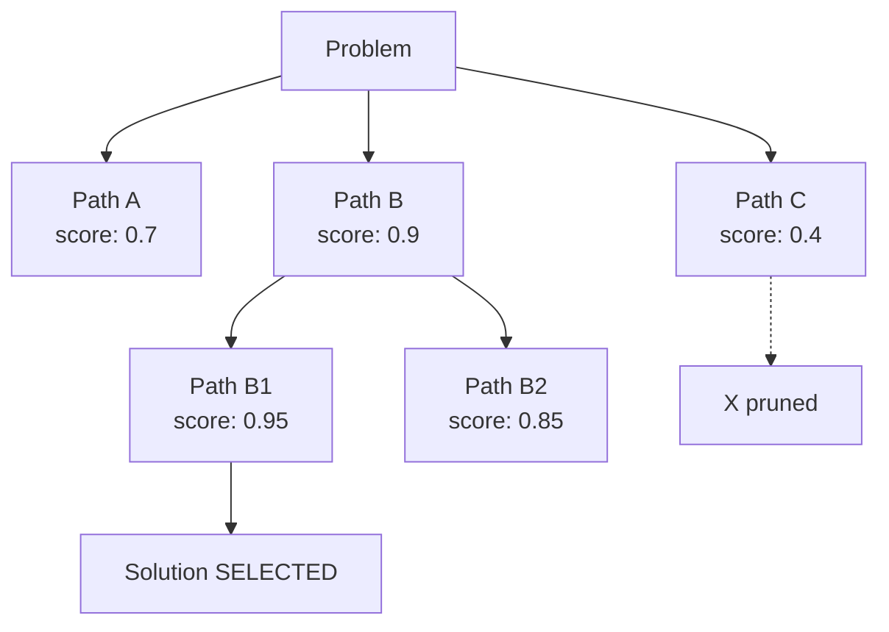
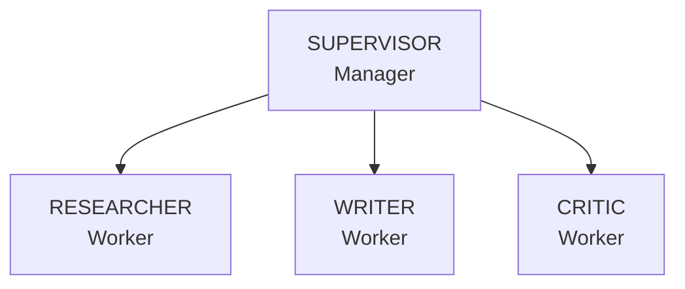
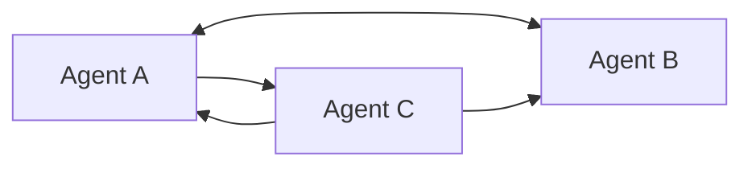
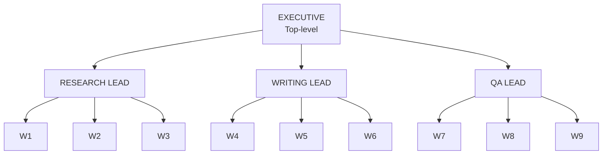
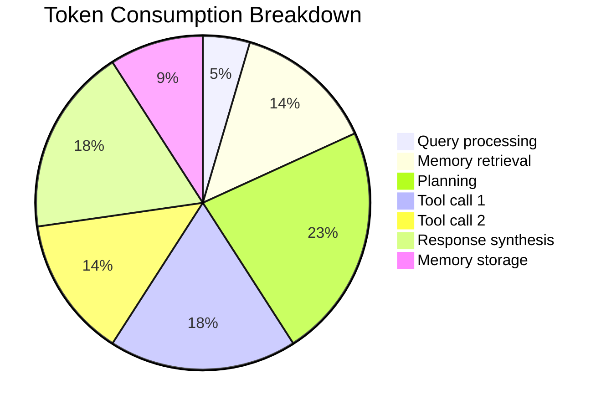
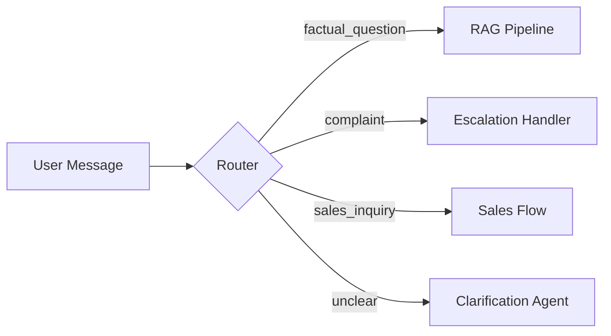

> **AI/ML Engineering Track** | Complexity: `[COMPLEX]` | Time: 5-6
---
**Reading Time**: 8-9 hours
**Prerequisites**: Module 19
**Heureka Moment**: Agents with memory and planning solve problems they couldn't before
---

## Learning Outcomes

By the end of this module, you will be able to:
- **Design** hybrid memory architectures for autonomous agents integrating short-term buffers, long-term vector stores, and episodic summarization.
- **Compare** the specific operational trade-offs between ReWOO, Plan-and-Execute, and Tree of Thought planning algorithms under token and latency constraints.
- **Implement** multi-agent workflows utilizing advanced supervisor and peer-to-peer (swarm) routing topologies to distribute complex tasks.
- **Diagnose** context window exhaustion, infinite reflection loops, and tool proliferation in production agent deployments.
- **Debug** self-correcting agent pipelines that enforce formal verification and execution budgets prior to finalizing external API interactions.

---

## Why This Module Matters

In February 2024, Air Canada was held legally liable for hallucinations generated by its customer service chatbot, which incorrectly promised a non-existent bereavement discount to a grieving passenger. While the tribunal award in that case was modest in dollar terms, the incident shows that chatbot errors can create real legal and reputational risk. When you grant a large language model the ability to execute tools, interact with databases, and loop continuously without human oversight, the financial and operational risks multiply exponentially.

Consider a support agent with tool access, short-term memory, and no hard execution budget: even a transient API error can push it into repeated replanning instead of graceful degradation or human escalation.

Without execution budgets and circuit breakers, a misbehaving agent can hammer internal APIs, inflate infrastructure costs, and degrade dependent systems. This incident underscores a critical reality: adding memory and autonomy transforms models from harmless text generators into powerful, independent software entities. Without rigorous constraints, algorithmic budgeting, and formal architectural patterns, autonomous agents can wreak absolute havoc at scale. This module teaches you how to engineer these systems safely and effectively.

---

## Part 1: Agent Memory Systems

### The Memory Problem

Think of an AI agent without memory like a brilliant amnesiac doctor. They can diagnose any condition flawlessly in the moment, but if you come back tomorrow, they'll have no idea who you are, what they diagnosed, or what treatment they recommended. You'd usually have to explain your medical history from scratch at each visit. Memory systems fix this by giving agents the equivalent of medical records, contextual notes, and institutional knowledge.

Consider this conversation:

```text
User: My name is Alex and I work at TechCorp.
Agent: Nice to meet you, Alex from TechCorp!

[1000 messages later...]

User: Where do I work again?
Agent: I'm sorry, I don't have information about where you work.
```

Without memory, agents are essentially goldfish—brilliant in the absolute present moment, but entirely unable to build relationships, track long-term goals, or learn from experience. Modern memory systems emulate biological cognition by stratifying data retention based on immediate relevance and historical significance.

### Agent Memory Architecture

To solve the amnesia problem, we categorize agent memory into distinct structural layers, ensuring that the model retains fluid conversational context without blowing out the token limit with irrelevant historical data.



#### 1. Short-Term Memory (Conversation Buffer)

The simplest form of memory is a rolling context buffer. It keeps recent messages strictly in context, mimicking human working memory. This is highly accurate but extremely limited by token counts.

```python
from typing import List
from dataclasses import dataclass, field
from datetime import datetime

@dataclass
class Message:
    role: str  # "user" or "assistant"
    content: str
    timestamp: datetime = field(default_factory=datetime.now)

@dataclass
class ConversationBuffer:
    """Short-term memory: recent conversation history."""
    messages: List[Message] = field(default_factory=list)
    max_messages: int = 20  # Keep last N messages

    def add(self, role: str, content: str):
        self.messages.append(Message(role=role, content=content))
        # Trim to max size
        if len(self.messages) > self.max_messages:
            self.messages = self.messages[-self.max_messages:]

    def get_context(self) -> str:
        """Format messages for LLM context."""
        return "\n".join([
            f"{m.role}: {m.content}"
            for m in self.messages
        ])

    def clear(self):
        self.messages = []
```

#### 2. Long-Term Memory (Vector Store)

When the conversation buffer exceeds its limits, data must be persisted. We store experiences as mathematical embeddings and retrieve relevant ones based on cosine similarity when needed. This acts as the agent's semantic knowledge base.

However, vector memory, while mathematically elegant, is not a panacea for all contextual needs. Relying solely on cosine similarity searches can result in the retrieval of facts that are conceptually related but factually outdated. For example, if a user updates their billing address three times, a naive vector search might retrieve the oldest address simply because the surrounding sentence structure of the older interaction scored a slightly higher similarity match. This necessitates the introduction of metadata filtering and recency weighting within the retrieval algorithm.

```python
from dataclasses import dataclass, field
from typing import List, Optional
import json
from datetime import datetime

@dataclass
class MemoryEntry:
    """A single memory with embedding."""
    content: str
    embedding: List[float]
    metadata: dict = field(default_factory=dict)
    timestamp: str = ""
    importance: float = 1.0  # How significant is this memory?

class VectorMemory:
    """Long-term memory using vector similarity."""

    def __init__(self, embedding_model):
        self.embedding_model = embedding_model
        self.memories: List[MemoryEntry] = []

    def store(self, content: str, metadata: dict = None):
        """Store a new memory."""
        embedding = self.embedding_model.embed(content)
        importance = self._calculate_importance(content)

        memory = MemoryEntry(
            content=content,
            embedding=embedding,
            metadata=metadata or {},
            timestamp=datetime.now().isoformat(),
            importance=importance
        )
        self.memories.append(memory)

    def retrieve(self, query: str, k: int = 5) -> List[MemoryEntry]:
        """Retrieve k most relevant memories."""
        query_embedding = self.embedding_model.embed(query)

        # Calculate similarity scores
        scored = []
        for memory in self.memories:
            similarity = self._cosine_similarity(
                query_embedding,
                memory.embedding
            )
            # Weight by importance and recency
            score = similarity * memory.importance
            scored.append((score, memory))

        # Return top k
        scored.sort(key=lambda x: x[0], reverse=True)
        return [m for _, m in scored[:k]]

    def _calculate_importance(self, content: str) -> float:
        """Estimate importance of a memory."""
        # Simple heuristics - could use LLM for better scoring
        importance = 1.0

        # Questions are often important
        if "?" in content:
            importance += 0.2

        # Personal information
        personal_keywords = ["my name", "i work", "i live", "my email"]
        for kw in personal_keywords:
            if kw in content.lower():
                importance += 0.3

        # Preferences and decisions
        if any(w in content.lower() for w in ["prefer", "want", "decided", "chose"]):
            importance += 0.2

        return min(importance, 2.0)  # Cap at 2x

    def _cosine_similarity(self, a: List[float], b: List[float]) -> float:
        """Calculate cosine similarity between two vectors."""
        import math
        dot = sum(x * y for x, y in zip(a, b))
        norm_a = math.sqrt(sum(x * x for x in a))
        norm_b = math.sqrt(sum(x * x for x in b))
        return dot / (norm_a * norm_b) if norm_a and norm_b else 0.0
```

> **Pause and predict**: If we scale our context window from 32K tokens to an enormous 200K tokens, does this completely eliminate the need for `VectorMemory`? Think deeply about how retrieval latency, attention degradation (the "lost in the middle" phenomenon), and noise might scale alongside raw context size.

#### 3. Episodic Memory (Specific Experiences)

Instead of individual facts, episodic memory groups related interactions into a unified event, capturing the narrative arc and the ultimate outcome. By storing entire episodes, the agent can understand the sequence of actions that led to a previous success or failure, allowing it to pattern-match against current obstacles.

```python
@dataclass
class Episode:
    """A complete interaction episode."""
    episode_id: str
    title: str
    summary: str
    messages: List[Message]
    outcome: str  # What was achieved?
    lessons: List[str]  # What was learned?
    created_at: datetime
    embedding: List[float] = field(default_factory=list)

class EpisodicMemory:
    """Stores complete interaction episodes."""

    def __init__(self, llm, embedding_model):
        self.llm = llm
        self.embedding_model = embedding_model
        self.episodes: List[Episode] = []

    def create_episode(self, messages: List[Message]) -> Episode:
        """Create an episode from a conversation."""
        # Use LLM to summarize and extract lessons
        conversation = "\n".join([
            f"{m.role}: {m.content}" for m in messages
        ])

        analysis_prompt = f"""Analyze this conversation and extract:
1. A short title (5-10 words)
2. A one-paragraph summary
3. The outcome (what was achieved)
4. Key lessons learned (bullet points)

Conversation:
{conversation}

Respond in JSON format:
{{
    "title": "...",
    "summary": "...",
    "outcome": "...",
    "lessons": ["...", "..."]
}}"""

        response = self.llm.generate(analysis_prompt)
        analysis = json.loads(response)

        episode = Episode(
            episode_id=f"ep_{len(self.episodes)}",
            title=analysis["title"],
            summary=analysis["summary"],
            messages=messages,
            outcome=analysis["outcome"],
            lessons=analysis["lessons"],
            created_at=datetime.now(),
            embedding=self.embedding_model.embed(analysis["summary"])
        )

        self.episodes.append(episode)
        return episode

    def recall_similar(self, situation: str, k: int = 3) -> List[Episode]:
        """Recall episodes similar to current situation."""
        query_embedding = self.embedding_model.embed(situation)

        scored = []
        for episode in self.episodes:
            similarity = self._cosine_similarity(
                query_embedding,
                episode.embedding
            )
            scored.append((similarity, episode))

        scored.sort(key=lambda x: x[0], reverse=True)
        return [ep for _, ep in scored[:k]]
```

#### 4. Summary Memory (Compressed History)

As conversations grow over hours or days, pushing full episodic logs into context becomes prohibitively expensive. We systematically compress older history into dense summaries. This hierarchical approach mimics how human memory abstracts daily minutiae into broad, generalized concepts over time.

```python
class SummaryMemory:
    """Progressive summarization of conversation history."""

    def __init__(self, llm, summary_interval: int = 10):
        self.llm = llm
        self.summary_interval = summary_interval
        self.summaries: List[str] = []
        self.current_buffer: List[Message] = []

    def add_message(self, message: Message):
        """Add message, summarize if needed."""
        self.current_buffer.append(message)

        if len(self.current_buffer) >= self.summary_interval:
            self._summarize_buffer()

    def _summarize_buffer(self):
        """Summarize current buffer and clear it."""
        conversation = "\n".join([
            f"{m.role}: {m.content}"
            for m in self.current_buffer
        ])

        prompt = f"""Summarize this conversation segment concisely.
Focus on:
- Key information exchanged
- Decisions made
- Action items or tasks
- Important context for future reference

Conversation:
{conversation}

Summary:"""

        summary = self.llm.generate(prompt)
        self.summaries.append(summary)
        self.current_buffer = []

    def get_context(self) -> str:
        """Get full context: summaries + current buffer."""
        context_parts = []

        if self.summaries:
            context_parts.append("Previous conversation summary:")
            context_parts.extend(self.summaries)
            context_parts.append("\nRecent messages:")

        for msg in self.current_buffer:
            context_parts.append(f"{msg.role}: {msg.content}")

        return "\n".join(context_parts)
```

### Combining Memory Systems (Hybrid Memory)

The most capable agents combine multiple memory types to simulate full cognitive recall. A hybrid approach ensures that the agent always has access to the most immediate conversational context while simultaneously fetching specific, highly relevant facts from deep storage.

```python
class HybridMemory:
    """Combined memory system for agents."""

    def __init__(self, llm, embedding_model):
        self.short_term = ConversationBuffer(max_messages=20)
        self.long_term = VectorMemory(embedding_model)
        self.episodic = EpisodicMemory(llm, embedding_model)
        self.summary = SummaryMemory(llm, summary_interval=15)

    def add_interaction(self, role: str, content: str):
        """Record an interaction across all memory systems."""
        message = Message(role=role, content=content)

        # Short-term: always add
        self.short_term.add(role, content)

        # Summary: track for periodic summarization
        self.summary.add_message(message)

        # Long-term: store important memories
        if self._is_important(content):
            self.long_term.store(
                content,
                metadata={"role": role}
            )

    def get_relevant_context(self, query: str) -> str:
        """Build context from all memory systems."""
        context_parts = []

        # Summaries of older conversations
        summary_context = self.summary.get_context()
        if summary_context:
            context_parts.append(f"History Summary:\n{summary_context}")

        # Relevant long-term memories
        memories = self.long_term.retrieve(query, k=5)
        if memories:
            memory_text = "\n".join([m.content for m in memories])
            context_parts.append(f"Relevant Memories:\n{memory_text}")

        # Similar past episodes
        episodes = self.episodic.recall_similar(query, k=2)
        if episodes:
            episode_text = "\n".join([
                f"- {ep.title}: {ep.summary}"
                for ep in episodes
            ])
            context_parts.append(f"Similar Past Situations:\n{episode_text}")

        # Recent conversation
        recent = self.short_term.get_context()
        context_parts.append(f"Recent Conversation:\n{recent}")

        return "\n\n".join(context_parts)

    def _is_important(self, content: str) -> bool:
        """Determine if content should go to long-term memory."""
        # Store user messages with personal info or explicit facts
        important_patterns = [
            "my name", "i am", "i work", "i live",
            "remember", "don't forget", "important",
            "always", "never", "prefer"
        ]
        content_lower = content.lower()
        return any(p in content_lower for p in important_patterns)
```

---

## Part 2: Planning Algorithms

Without planning, agents operate purely reactively, responding to each localized input without considering future cascading steps. This leads to wildly inefficient tool use, forgotten dependencies, and ultimately task failure. Planning transforms agents from reactive responders into proactive problem-solvers. By mapping out a trajectory before spending API calls on execution, agents avoid critical dead ends.

### Planning Pattern 1: Plan-and-Execute

The simplest and most reliable pattern: create a comprehensive plan first, then systematically execute each step. This decoupled approach allows the LLM to focus entirely on the architectural reasoning of the goal before it gets bogged down in the specific syntax of executing individual tool commands.



```python
from dataclasses import dataclass, field
from typing import List, Optional, Callable, Dict, Any
from enum import Enum
import json

class StepStatus(Enum):
    PENDING = "pending"
    IN_PROGRESS = "in_progress"
    COMPLETED = "completed"
    FAILED = "failed"

@dataclass
class PlanStep:
    """A single step in the plan."""
    step_id: int
    description: str
    tool: Optional[str] = None
    tool_input: Optional[str] = None
    status: StepStatus = StepStatus.PENDING
    result: Optional[str] = None
    depends_on: List[int] = field(default_factory=list)

@dataclass
class Plan:
    """A complete execution plan."""
    goal: str
    steps: List[PlanStep]
    current_step: int = 0

class PlanAndExecuteAgent:
    """Agent that plans before executing."""

    def __init__(self, llm, tools: Dict[str, Callable]):
        self.llm = llm
        self.tools = tools

    def create_plan(self, task: str) -> Plan:
        """Create a plan for the given task."""
        tools_description = "\n".join([
            f"- {name}: {func.__doc__}"
            for name, func in self.tools.items()
        ])

        prompt = f"""Create a step-by-step plan to accomplish this task.

Task: {task}

Available tools:
{tools_description}

For each step, specify:
1. What to do
2. Which tool to use (if any)
3. What input to give the tool

Respond in JSON format:
{{
    "steps": [
        {{
            "description": "Step description",
            "tool": "tool_name or null",
            "tool_input": "input string or null",
            "depends_on": []  // list of step indices this depends on
        }}
    ]
}}"""

        response = self.llm.generate(prompt)
        data = json.loads(response)

        steps = [
            PlanStep(
                step_id=i,
                description=s["description"],
                tool=s.get("tool"),
                tool_input=s.get("tool_input"),
                depends_on=s.get("depends_on", [])
            )
            for i, s in enumerate(data["steps"])
        ]

        return Plan(goal=task, steps=steps)

    def execute_plan(self, plan: Plan) -> str:
        """Execute a plan step by step."""
        results = []

        for step in plan.steps:
            # Check dependencies
            for dep_id in step.depends_on:
                dep_step = plan.steps[dep_id]
                if dep_step.status != StepStatus.COMPLETED:
                    step.status = StepStatus.FAILED
                    step.result = f"Dependency {dep_id} not completed"
                    continue

            step.status = StepStatus.IN_PROGRESS
            print(f"Executing: {step.description}")

            try:
                if step.tool and step.tool in self.tools:
                    # Execute tool
                    result = self.tools[step.tool](step.tool_input)
                else:
                    # Use LLM for reasoning step
                    result = self.llm.generate(
                        f"Complete this step: {step.description}\n"
                        f"Context from previous steps: {results}"
                    )

                step.result = result
                step.status = StepStatus.COMPLETED
                results.append(f"Step {step.step_id}: {result}")

            except Exception as e:
                step.status = StepStatus.FAILED
                step.result = str(e)
                results.append(f"Step {step.step_id} failed: {e}")

        # Summarize results
        return self._summarize_execution(plan, results)

    def _summarize_execution(self, plan: Plan, results: List[str]) -> str:
        """Summarize the execution results."""
        prompt = f"""Summarize the results of executing this plan.

Original goal: {plan.goal}

Execution results:
{chr(10).join(results)}

Provide a concise summary of what was accomplished and any issues."""

        return self.llm.generate(prompt)

    def run(self, task: str) -> str:
        """Plan and execute a task."""
        print(f"Creating plan for: {task}")
        plan = self.create_plan(task)

        print(f"Plan created with {len(plan.steps)} steps:")
        for step in plan.steps:
            print(f"  {step.step_id}. {step.description}")

        print("\nExecuting plan...")
        result = self.execute_plan(plan)

        return result
```

### Planning Pattern 2: ReWOO (Reason Without Observation)

The standard [ReAct (Reason and Act) framework](https://arxiv.org/abs/2210.03629) revolutionized early agent design by forcing the LLM to 'think' out loud before taking an action. However, ReAct is strictly synchronous and sequential. The model must halt, wait for the network to return a tool's output, ingest that output, and then generate its next thought. This synchronous blocking is deeply inefficient. 

The ReWOO framework elegantly solves this by recognizing that many complex workflows utilize deterministic, predictable tool chains. [By decoupling reasoning from observation, ReWOO-style systems can plan tool use upfront](https://arxiv.org/abs/2305.18323) and then perform a final synthesis step after tool execution, which can reduce token use and sometimes reduce latency.



```python
@dataclass
class ReWOOPlan:
    """A ReWOO-style plan with evidence variables."""
    steps: List[Dict[str, str]]  # {plan, tool, input, evidence_var}

class ReWOOAgent:
    """ReWOO: Reason Without Observation.

    Plans all tool calls upfront, executes them,
    then solves using all evidence.
    """

    def __init__(self, llm, tools: Dict[str, Callable]):
        self.llm = llm
        self.tools = tools

    def plan(self, task: str) -> ReWOOPlan:
        """Create a plan with evidence variables."""
        tools_desc = "\n".join([
            f"- {name}: {func.__doc__}"
            for name, func in self.tools.items()
        ])

        prompt = f"""Plan how to solve this task using the available tools.
Use #E[n] as placeholder for evidence from step n.

Task: {task}

Available tools:
{tools_desc}

Create a plan where each step has:
- Plan: What to do and why
- Tool: Which tool to use
- Input: Input for the tool (can reference #E[n])
- Evidence: #E[n] where n is step number

Example format:
Step 1:
Plan: Search for information about X
Tool: web_search
Input: "query about X"
Evidence: #E1

Step 2:
Plan: Analyze the search results from #E1
Tool: analyze
Input: #E1
Evidence: #E2

Create your plan:"""

        response = self.llm.generate(prompt)
        return self._parse_plan(response)

    def _parse_plan(self, response: str) -> ReWOOPlan:
        """Parse the planner output into structured steps."""
        steps = []
        current_step = {}

        for line in response.split("\n"):
            line = line.strip()
            if line.startswith("Step"):
                if current_step:
                    steps.append(current_step)
                current_step = {}
            elif line.startswith("Plan:"):
                current_step["plan"] = line[5:].strip()
            elif line.startswith("Tool:"):
                current_step["tool"] = line[5:].strip()
            elif line.startswith("Input:"):
                current_step["input"] = line[6:].strip()
            elif line.startswith("Evidence:"):
                current_step["evidence_var"] = line[9:].strip()

        if current_step:
            steps.append(current_step)

        return ReWOOPlan(steps=steps)

    def execute(self, plan: ReWOOPlan) -> Dict[str, str]:
        """Execute all planned tool calls, collecting evidence."""
        evidence = {}

        for i, step in enumerate(plan.steps, 1):
            tool_name = step.get("tool")
            tool_args = step.get("input", "")
            evidence_var = step.get("evidence_var", f"#E{i}")

            # Substitute previous evidence into input
            for var, value in evidence.items():
                tool_args = tool_args.replace(var, value)

            # Execute tool
            if tool_name and tool_name in self.tools:
                try:
                    tool_fn = self.tools[tool_name]
                    result = tool_fn(tool_args)
                    evidence[evidence_var] = str(result)
                except Exception as e:
                    evidence[evidence_var] = f"Error: {e}"
            else:
                evidence[evidence_var] = f"Unknown tool: {tool_name}"

        return evidence

    def solve(self, task: str, plan: ReWOOPlan, evidence: Dict[str, str]) -> str:
        """Solve the task using collected evidence."""
        plan_text = "\n".join([
            f"Step {i}: {s['plan']}"
            for i, s in enumerate(plan.steps, 1)
        ])

        evidence_text = "\n".join([
            f"{var}: {value[:500]}..."  # Truncate long evidence
            for var, value in evidence.items()
        ])

        prompt = f"""Solve this task using the evidence collected.

Task: {task}

Plan executed:
{plan_text}

Evidence collected:
{evidence_text}

Based on this evidence, provide your final answer:"""

        return self.llm.generate(prompt)

    def run(self, task: str) -> str:
        """Full ReWOO execution: Plan → Execute → Solve."""
        print("Planning...")
        plan = self.plan(task)

        print(f"Executing {len(plan.steps)} tool calls...")
        evidence = self.execute(plan)

        print("Solving...")
        result = self.solve(task, plan, evidence)

        return result
```

### Planning Pattern 3: Tree of Thought (ToT)

The most advanced pattern. It [explores multiple reasoning paths simultaneously, continuously evaluating and pruning weak branches](https://arxiv.org/abs/2305.10601) until the optimal path is locked in. This mimics deep, deliberative human thinking and is highly effective for complex, multi-variable logic puzzles, though it is the most computationally expensive planning algorithm available.



```python
from dataclasses import dataclass, field
from typing import List, Optional
import heapq

@dataclass
class ThoughtNode:
    """A node in the thought tree."""
    thought: str
    score: float
    parent: Optional['ThoughtNode'] = None
    children: List['ThoughtNode'] = field(default_factory=list)
    depth: int = 0

    def __lt__(self, other):
        # For heap comparison (higher score = better)
        return self.score > other.score

class TreeOfThoughtAgent:
    """Explores multiple reasoning paths."""

    def __init__(self, llm, branching_factor: int = 3, max_depth: int = 3):
        self.llm = llm
        self.branching_factor = branching_factor
        self.max_depth = max_depth

    def generate_thoughts(self, problem: str, current_path: List[str]) -> List[str]:
        """Generate possible next thoughts."""
        path_text = " → ".join(current_path) if current_path else "Starting fresh"

        prompt = f"""Problem: {problem}

Current reasoning path: {path_text}

Generate {self.branching_factor} different next steps or approaches.
Each should be a distinct way to continue solving this problem.
Be creative and consider different angles.

Format each as a separate paragraph."""

        response = self.llm.generate(prompt)

        # Split into separate thoughts
        thoughts = [t.strip() for t in response.split("\n\n") if t.strip()]
        return thoughts[:self.branching_factor]

    def evaluate_thought(self, problem: str, path: List[str]) -> float:
        """Score how promising a thought path is (0-1)."""
        path_text = " → ".join(path)

        prompt = f"""Problem: {problem}

Reasoning path so far: {path_text}

Rate this reasoning path on a scale of 0-10:
- 10: Excellent progress toward solution
- 7-9: Good progress, promising direction
- 4-6: Some progress, but uncertain
- 1-3: Poor direction, likely wrong
- 0: Dead end

Consider:
1. Does this make logical sense?
2. Is it making progress toward the goal?
3. Are there any errors or contradictions?

Respond with just a number (0-10):"""

        response = self.llm.generate(prompt)
        try:
            score = float(response.strip()) / 10.0
            return min(max(score, 0.0), 1.0)
        except:
            return 0.5

    def solve(self, problem: str) -> str:
        """Solve using tree of thought exploration."""
        # Initialize with root node
        root = ThoughtNode(thought="Start", score=1.0, depth=0)

        # Priority queue for best-first search
        frontier = [root]
        best_path = []
        best_score = 0.0

        while frontier:
            current = heapq.heappop(frontier)

            # Build current path
            path = []
            node = current
            while node.parent:
                path.append(node.thought)
                node = node.parent
            path.reverse()

            # Check if we've reached max depth
            if current.depth >= self.max_depth:
                if current.score > best_score:
                    best_score = current.score
                    best_path = path
                continue

            # Generate and evaluate children
            thoughts = self.generate_thoughts(problem, path)

            for thought in thoughts:
                child_path = path + [thought]
                score = self.evaluate_thought(problem, child_path)

                child = ThoughtNode(
                    thought=thought,
                    score=score,
                    parent=current,
                    depth=current.depth + 1
                )
                current.children.append(child)

                # Only explore promising paths
                if score > 0.3:
                    heapq.heappush(frontier, child)

                # Track best
                if score > best_score:
                    best_score = score
                    best_path = child_path

        # Generate final answer from best path
        return self._synthesize_answer(problem, best_path)

    def _synthesize_answer(self, problem: str, path: List[str]) -> str:
        """Synthesize final answer from the best reasoning path."""
        path_text = "\n".join([f"{i+1}. {t}" for i, t in enumerate(path)])

        prompt = f"""Problem: {problem}

Best reasoning path found:
{path_text}

Based on this reasoning, provide the final answer:"""

        return self.llm.generate(prompt)
```

---

## Part 3: Multi-Agent Architectures

Context limits drastically restrict single agents from absorbing vast knowledge graphs, and monolithic monolithic prompts lack the required specialization for varied workflows. By building Multi-Agent systems, we distribute cognitive load across discrete models, allowing specialized nodes to handle nuanced tasks with much higher accuracy.

### Architecture 1: Supervisor Pattern

A hierarchical pattern where one central management agent routes sub-tasks to highly specialized worker nodes. This prevents the primary model from getting distracted by domain-specific details while ensuring the execution plan is strictly followed.



```python
from dataclasses import dataclass, field
from typing import List, Dict, Any, Optional, Callable
from enum import Enum
import json

class AgentRole(Enum):
    SUPERVISOR = "supervisor"
    RESEARCHER = "researcher"
    WRITER = "writer"
    CRITIC = "critic"
    CODER = "coder"

@dataclass
class AgentMessage:
    """Message between agents."""
    sender: str
    recipient: str
    content: str
    message_type: str = "task"  # task, result, feedback

@dataclass
class WorkerAgent:
    """A specialized worker agent."""
    name: str
    role: AgentRole
    system_prompt: str
    llm: Any
    tools: Dict[str, Callable] = field(default_factory=dict)

    def process(self, task: str, context: str = "") -> str:
        """Process a task and return result."""
        prompt = f"""{self.system_prompt}

Context: {context}

Task: {task}

Your response:"""

        return self.llm.generate(prompt)

class SupervisorAgent:
    """Supervisor that coordinates worker agents."""

    def __init__(self, llm, workers: List[WorkerAgent]):
        self.llm = llm
        self.workers = {w.name: w for w in workers}
        self.message_history: List[AgentMessage] = []

    def delegate(self, task: str) -> str:
        """Delegate a task to appropriate workers."""
        # Determine which workers to use
        worker_descriptions = "\n".join([
            f"- {name} ({w.role.value}): {w.system_prompt[:100]}..."
            for name, w in self.workers.items()
        ])

        planning_prompt = f"""You are a supervisor coordinating a team.

Available workers:
{worker_descriptions}

Task to complete: {task}

Create a plan specifying:
1. Which workers to use (in order)
2. What task to give each worker
3. How to combine their outputs

Respond in JSON:
{{
    "plan": [
        {{"worker": "worker_name", "task": "specific task"}},
        ...
    ],
    "synthesis_instructions": "how to combine outputs"
}}"""

        response = self.llm.generate(planning_prompt)
        plan = json.loads(response)

        # Execute the plan
        results = {}
        context = f"Original task: {task}\n\n"

        for step in plan["plan"]:
            worker_name = step["worker"]
            worker_task = step["task"]

            if worker_name not in self.workers:
                continue

            worker = self.workers[worker_name]

            # Include previous results as context
            if results:
                context += "Previous results:\n"
                for name, result in results.items():
                    context += f"{name}: {result[:500]}...\n"

            # Get worker's output
            result = worker.process(worker_task, context)
            results[worker_name] = result

            # Track message
            self.message_history.append(AgentMessage(
                sender="supervisor",
                recipient=worker_name,
                content=worker_task,
                message_type="task"
            ))
            self.message_history.append(AgentMessage(
                sender=worker_name,
                recipient="supervisor",
                content=result,
                message_type="result"
            ))

        # Synthesize final output
        synthesis_prompt = f"""Synthesize these worker outputs into a final response.

Instructions: {plan["synthesis_instructions"]}

Worker outputs:
{json.dumps(results, indent=2)}

Final synthesized response:"""

        return self.llm.generate(synthesis_prompt)

# Example usage
def create_content_team(llm) -> SupervisorAgent:
    """Create a content creation team."""
    workers = [
        WorkerAgent(
            name="researcher",
            role=AgentRole.RESEARCHER,
            system_prompt="""You are a thorough researcher.
            Find relevant facts, statistics, and examples.
            Always cite your sources.""",
            llm=llm
        ),
        WorkerAgent(
            name="writer",
            role=AgentRole.WRITER,
            system_prompt="""You are a skilled writer.
            Transform research into engaging, clear content.
            Use vivid examples and clear explanations.""",
            llm=llm
        ),
        WorkerAgent(
            name="critic",
            role=AgentRole.CRITIC,
            system_prompt="""You are a critical reviewer.
            Check for errors, unclear explanations, and missing information.
            Suggest specific improvements.""",
            llm=llm
        )
    ]

    return SupervisorAgent(llm, workers)
```

### Architecture 2: Peer-to-Peer (Swarm)

Agents collaborate entirely dynamically without a strict hierarchy, contextually handing off their state to other agents based on inferred expertise. This architecture is incredibly fluid but requires aggressive constraint logic to prevent infinite delegation loops.



```python
@dataclass
class SwarmAgent:
    """An agent in a swarm that can hand off to others."""
    name: str
    role: str
    description: str
    system_prompt: str
    llm: Any

    def should_handle(self, task: str) -> float:
        """Return confidence (0-1) that this agent should handle the task."""
        prompt = f"""You are {self.name}, a {self.role}.
Your specialty: {self.description}

Task: {task}

On a scale of 0-10, how well-suited are you to handle this task?
Consider your expertise and the task requirements.
Respond with just a number."""

        response = self.llm.generate(prompt)
        try:
            return float(response.strip()) / 10.0
        except:
            return 0.5

    def process(self, task: str, context: str = "") -> tuple[str, Optional[str]]:
        """Process task. Returns (response, handoff_to) or (response, None)."""
        prompt = f"""{self.system_prompt}

Context: {context}

Task: {task}

Complete this task. If you need to hand off part of the work to a
specialist, end your response with "HANDOFF: [specialist_type]"

Your response:"""

        response = self.llm.generate(prompt)

        # Check for handoff
        if "HANDOFF:" in response:
            parts = response.split("HANDOFF:")
            result = parts[0].strip()
            handoff = parts[1].strip()
            return result, handoff

        return response, None

class SwarmCoordinator:
    """Coordinates a swarm of peer agents."""

    def __init__(self, agents: List[SwarmAgent], max_handoffs: int = 5):
        self.agents = {a.name: a for a in agents}
        self.max_handoffs = max_handoffs

    def find_best_agent(self, task: str, exclude: List[str] = None) -> SwarmAgent:
        """Find the best agent for a task."""
        exclude = exclude or []
        candidates = [a for a in self.agents.values() if a.name not in exclude]

        if not candidates:
            # Return any agent if all excluded
            return list(self.agents.values())[0]

        scores = [(a.should_handle(task), a) for a in candidates]
        scores.sort(key=lambda x: x[0], reverse=True)

        return scores[0][1]

    def run(self, task: str) -> str:
        """Run the swarm to complete a task."""
        context = f"Original task: {task}\n\n"
        results = []
        handoffs = 0
        excluded = []

        current_task = task

        while handoffs < self.max_handoffs:
            # Find best agent
            agent = self.find_best_agent(current_task, excluded)

            print(f"Agent '{agent.name}' handling task...")

            # Process
            result, handoff = agent.process(current_task, context)
            results.append(f"{agent.name}: {result}")
            context += f"{agent.name}'s work:\n{result}\n\n"

            if handoff:
                # Find agent matching handoff description
                current_task = f"Continue from {agent.name}'s work: {handoff}"
                excluded.append(agent.name)
                handoffs += 1
            else:
                break

        # Combine results
        return "\n\n---\n\n".join(results)
```

> **Stop and think**: In a Swarm architecture, what occurs when a QA agent and a Developer agent infinitely hand off the same failing script to one another? How does the `SwarmCoordinator` class above technically prevent this?

### Architecture 3: Hierarchical Teams

Nested multi-agent networks operating beneath multiple tier levels. This is used in enterprise software development where a CTO agent directs multiple Lead agents, who in turn command specific Worker agents for granular task execution.



### Architecture 4: Debate

Multiple agents inherently arguing distinct paths exposes logical hallucinations and establishes empirical ground truth. By pitting agents against one another and bringing in an impartial arbitrator agent, you can sometimes surface disagreements and catch factual errors that a single-pass workflow might miss.

```python
@dataclass
class DebateAgent:
    """An agent that argues a position."""
    name: str
    position: str  # "for" or "against" or "neutral"
    llm: Any

    def make_argument(self, topic: str, opponent_args: List[str] = None) -> str:
        """Make an argument for the position."""
        opponent_text = ""
        if opponent_args:
            opponent_text = f"\n\nOpponent's arguments:\n" + "\n".join(opponent_args)

        prompt = f"""You are arguing {self.position} the following topic.

Topic: {topic}
{opponent_text}

Make your strongest argument. Be persuasive and use evidence.
If responding to opponent's arguments, address their points directly."""

        return self.llm.generate(prompt)

class DebateArena:
    """Facilitates debates between agents."""

    def __init__(self, llm, rounds: int = 3):
        self.llm = llm
        self.rounds = rounds

    def debate(self, topic: str) -> str:
        """Run a debate on a topic."""
        for_agent = DebateAgent("Proponent", "FOR", self.llm)
        against_agent = DebateAgent("Opponent", "AGAINST", self.llm)

        for_args = []
        against_args = []

        for round_num in range(self.rounds):
            print(f"\n=== Round {round_num + 1} ===")

            # For side argues
            for_arg = for_agent.make_argument(topic, against_args)
            for_args.append(for_arg)
            print(f"\nFOR: {for_arg[:200]}...")

            # Against side responds
            against_arg = against_agent.make_argument(topic, for_args)
            against_args.append(against_arg)
            print(f"\nAGAINST: {against_arg[:200]}...")

        # Judge decides
        return self._judge(topic, for_args, against_args)

    def _judge(self, topic: str, for_args: List[str], against_args: List[str]) -> str:
        """Neutral judge evaluates the debate."""
        prompt = f"""You are a neutral judge evaluating this debate.

Topic: {topic}

Arguments FOR:
{chr(10).join(for_args)}

Arguments AGAINST:
{chr(10).join(against_args)}

Evaluate the debate and provide:
1. The stronger arguments from each side
2. Weaknesses in each side's reasoning
3. Your balanced conclusion on the topic
4. What additional information would help resolve this

Your verdict:"""

        return self.llm.generate(prompt)
```

---

## Part 4: Self-Improvement and Tool Creation

### Reflection: Agents That Evaluate Themselves

Reflection allows the agent to self-grade output against defined criteria prior to finalizing it. This pattern significantly reduces human intervention in review cycles by catching simple logic or formatting errors before they hit the end-user.

```python
class ReflectiveAgent:
    """Agent that reflects on and improves its own outputs."""

    def __init__(self, llm, max_iterations: int = 3):
        self.llm = llm
        self.max_iterations = max_iterations

    def generate_with_reflection(self, task: str) -> str:
        """Generate output with self-reflection loop."""

        # Initial generation
        output = self._generate(task)

        for i in range(self.max_iterations):
            # Reflect on output
            critique = self._reflect(task, output)

            # Check if good enough
            if self._is_satisfactory(critique):
                print(f"Satisfied after {i+1} iterations")
                break

            # Improve based on reflection
            output = self._improve(task, output, critique)

        return output

    def _generate(self, task: str) -> str:
        """Generate initial output."""
        return self.llm.generate(f"Complete this task:\n{task}")

    def _reflect(self, task: str, output: str) -> str:
        """Reflect on the output quality."""
        prompt = f"""Critically evaluate this output for the given task.

Task: {task}

Output:
{output}

Provide specific feedback on:
1. Correctness: Are there any errors or mistakes?
2. Completeness: Is anything missing?
3. Clarity: Is it clear and well-organized?
4. Quality: How could it be improved?

Be specific and constructive:"""

        return self.llm.generate(prompt)

    def _is_satisfactory(self, critique: str) -> bool:
        """Determine if the output is good enough."""
        prompt = f"""Based on this critique, is the output satisfactory?

Critique:
{critique}

Answer YES if the output is good enough with only minor issues.
Answer NO if there are significant problems that need fixing.

Answer (YES/NO):"""

        response = self.llm.generate(prompt)
        return "YES" in response.upper()

    def _improve(self, task: str, output: str, critique: str) -> str:
        """Improve output based on reflection."""
        prompt = f"""Improve this output based on the critique.

Original task: {task}

Current output:
{output}

Critique:
{critique}

Provide an improved version that addresses the critique:"""

        return self.llm.generate(prompt)
```

### Self-Correction: Fixing Mistakes Iteratively

```python
class SelfCorrectingAgent:
    """Agent that detects and corrects its own mistakes."""

    def __init__(self, llm, tools: Dict[str, Callable]):
        self.llm = llm
        self.tools = tools

    def execute_with_verification(self, task: str) -> str:
        """Execute task with self-verification."""

        # Generate solution
        solution = self._solve(task)

        # Verify the solution
        verification = self._verify(task, solution)

        if verification["is_correct"]:
            return solution

        # Self-correct based on errors found
        corrected = self._correct(task, solution, verification["errors"])

        # Verify again (could loop, but limiting to one correction)
        return corrected

    def _solve(self, task: str) -> str:
        """Generate a solution."""
        return self.llm.generate(f"Solve this task:\n{task}")

    def _verify(self, task: str, solution: str) -> dict:
        """Verify the solution for errors."""
        prompt = f"""Verify this solution for correctness.

Task: {task}

Solution:
{solution}

Check for:
1. Logical errors
2. Factual mistakes
3. Missing steps
4. Inconsistencies

Respond in JSON:
{{
    "is_correct": true/false,
    "errors": ["error1", "error2", ...],
    "confidence": 0.0-1.0
}}"""

        response = self.llm.generate(prompt)
        return json.loads(response)

    def _correct(self, task: str, solution: str, errors: List[str]) -> str:
        """Correct the solution based on identified errors."""
        prompt = f"""Fix these errors in the solution.

Task: {task}

Current solution:
{solution}

Errors to fix:
{chr(10).join(f"- {e}" for e in errors)}

Provide a corrected solution:"""

        return self.llm.generate(prompt)
```

### Tool Creation: Agents That Build Tools

The most advanced—and dangerous—architectural pattern. The agent detects an inability to perform a task within its current bound toolset, writes raw Python code bridging that gap, executes it to cache the new definition, and then seamlessly invokes its own creation to accomplish the objective. Allowing agents to run their own dynamically generated code introduces massive security vulnerabilities and must only be done in strict, heavily sandboxed environments.

````python
class ToolCreatingAgent:
    """Agent that can create new tools."""

    def __init__(self, llm):
        self.llm = llm
        self.tools: Dict[str, Callable] = {}
        self.tool_code: Dict[str, str] = {}

    def needs_new_tool(self, task: str) -> tuple[bool, str]:
        """Determine if a new tool is needed."""
        tools_desc = "\n".join([
            f"- {name}: {func.__doc__}"
            for name, func in self.tools.items()
        ]) or "No tools available"

        prompt = f"""Do you need a new tool to complete this task?

Task: {task}

Available tools:
{tools_desc}

If existing tools are sufficient, respond: NO

If a new tool is needed, respond:
YES: [description of tool needed]"""

        response = self.llm.generate(prompt)

        if response.startswith("YES:"):
            return True, response[4:].strip()
        return False, ""

    def create_tool(self, description: str) -> str:
        """Create a new tool based on description."""
        prompt = f"""Create a Python function for this tool.

Tool description: {description}

Requirements:
1. Single function with clear docstring
2. Use only standard library
3. Handle errors gracefully
4. Return a string result

```python
def tool_name(input_str: str) -> str:
    '''Tool description'''
    # Implementation
    return result
```

Provide the function code:"""

        response = self.llm.generate(prompt)

        # Extract code from response
        code = self._extract_code(response)

        # Safely execute to define the function
        tool_name = self._execute_and_register(code)

        return tool_name

    def _extract_code(self, response: str) -> str:
        """Extract Python code from response."""
        if "```python" in response:
            start = response.find("```python") + 9
            end = response.find("```", start)
            return response[start:end].strip()
        return response.strip()

    def _execute_and_register(self, code: str) -> str:
        """Execute code and register the tool."""
        # Create a restricted namespace
        namespace = {"__builtins__": __builtins__}

        try:
            exec(code, namespace)

            # Find the function that was defined
            for name, obj in namespace.items():
                if callable(obj) and not name.startswith("_"):
                    self.tools[name] = obj
                    self.tool_code[name] = code
                    return name
        except Exception as e:
            print(f"Error creating tool: {e}")

        return ""

    def run(self, task: str) -> str:
        """Run task, creating tools if needed."""
        # Check if new tool needed
        needs_tool, tool_desc = self.needs_new_tool(task)

        if needs_tool:
            print(f"Creating new tool: {tool_desc}")
            tool_name = self.create_tool(tool_desc)
            if tool_name:
                print(f"Created tool: {tool_name}")

        # Now solve the task with available tools
        tools_desc = "\n".join([
            f"- {name}: {func.__doc__}"
            for name, func in self.tools.items()
        ])

        prompt = f"""Solve this task using available tools.

Task: {task}

Available tools:
{tools_desc}

To use a tool, write: USE_TOOL(tool_name, "input")

Your solution:"""

        response = self.llm.generate(prompt)

        # Execute any tool calls
        return self._execute_tool_calls(response)

    def _execute_tool_calls(self, response: str) -> str:
        """Execute tool calls in the response."""
        import re

        pattern = r'USE_TOOL\((\w+),\s*"([^"]*)"\)'

        def replace_call(match):
            tool_name = match.group(1)
            tool_args = match.group(2)

            if tool_name in self.tools:
                try:
                    tool_fn = self.tools[tool_name]
                    result = tool_fn(tool_args)
                    return f"[{tool_name} result: {result}]"
                except Exception as e:
                    return f"[{tool_name} error: {e}]"
            return f"[Unknown tool: {tool_name}]"

        return re.sub(pattern, replace_call, response)
````

### The Complete Autonomous Agent

Deploying this within a Kubernetes cluster (targeting v1.35 or higher using standard [`batch/v1` Jobs](https://kubernetes.io/docs/concepts/workloads/controllers/job/)) yields a robust, resilient background worker that leverages every tool discussed so far. We utilize Kubernetes Jobs instead of standard Deployments because agent tasks are inherently finite and batch-oriented. You want the pod to terminate successfully once the task is complete, freeing up cluster resources. Furthermore, by defining strict [`resources.limits` for CPU and memory](https://kubernetes.io/docs/concepts/configuration/manage-resources-containers/), and wrapping the execution in a timeout mechanism, we provide a container-level safety net against infinite loops that the application-level constraints might miss.

```python
from dataclasses import dataclass, field
from typing import List, Dict, Any, Optional, Callable
from datetime import datetime
import json

@dataclass
class AutonomousAgentConfig:
    """Configuration for the autonomous agent."""
    max_iterations: int = 10
    enable_reflection: bool = True
    enable_tool_creation: bool = False
    memory_type: str = "hybrid"  # simple, vector, hybrid

class AutonomousAgent:
    """
    A complete autonomous agent with:
    - Hybrid memory (short-term, long-term, episodic)
    - Planning (Plan-and-Execute)
    - Self-reflection and correction
    - Tool creation (optional)
    """

    def __init__(
        self,
        llm,
        embedding_model,
        tools: Dict[str, Callable] = None,
        config: AutonomousAgentConfig = None
    ):
        self.llm = llm
        self.embedding_model = embedding_model
        self.tools = tools or {}
        self.config = config or AutonomousAgentConfig()

        # Initialize memory
        self.memory = HybridMemory(llm, embedding_model)

        # Initialize sub-systems
        self.planner = PlanAndExecuteAgent(llm, self.tools)
        self.reflector = ReflectiveAgent(llm) if config.enable_reflection else None
        self.tool_creator = ToolCreatingAgent(llm) if config.enable_tool_creation else None

    def run(self, task: str) -> str:
        """Run the agent on a task."""
        print(f"\n{'='*60}")
        print(f"TASK: {task}")
        print(f"{'='*60}\n")

        # Step 1: Retrieve relevant context from memory
        context = self.memory.get_relevant_context(task)
        print(f"Retrieved {len(context)} characters of context")

        # Step 2: Check if we need new tools
        if self.tool_creator:
            needs_tool, tool_desc = self.tool_creator.needs_new_tool(task)
            if needs_tool:
                print(f"Creating new tool: {tool_desc}")
                tool_name = self.tool_creator.create_tool(tool_desc)
                if tool_name:
                    self.tools[tool_name] = self.tool_creator.tools[tool_name]

        # Step 3: Create and execute plan
        print("\nCreating plan...")
        plan = self.planner.create_plan(f"{context}\n\nTask: {task}")

        print(f"Plan has {len(plan.steps)} steps:")
        for step in plan.steps:
            print(f"  - {step.description}")

        print("\nExecuting plan...")
        result = self.planner.execute_plan(plan)

        # Step 4: Self-reflect and improve if enabled
        if self.reflector:
            print("\nReflecting on output...")
            result = self.reflector.generate_with_reflection(
                f"Task: {task}\n\nInitial result: {result}"
            )

        # Step 5: Store interaction in memory
        self.memory.add_interaction("user", task)
        self.memory.add_interaction("assistant", result)

        print(f"\n{'='*60}")
        print("COMPLETED")
        print(f"{'='*60}\n")

        return result

    def chat(self, message: str) -> str:
        """Chat interface for interactive use."""
        # Add to memory
        self.memory.add_interaction("user", message)

        # Get context
        context = self.memory.get_relevant_context(message)

        # Generate response
        prompt = f"""You are a helpful assistant with memory and planning capabilities.

{context}

User: {message}
Assistant:"""

        response = self.llm.generate(prompt)

        # Store response
        self.memory.add_interaction("assistant", response)

        return response
```

---

## Part 5: Economics and Production Realities

### The Token Multiplication Problem

A simple query to a regular stateless chatbot can be relatively cheap in tokens. Handing that exact same objective to an autonomous agent scales the execution cost drastically:



At metered token pricing, an autonomous agent can cost materially more per task than a simple stateless chat response, so token use needs to be budgeted explicitly. Token usage must be treated as a primary constraint parameter when designing production agents.

### The Latency Tax

Agents make multiple sequential network calls.

| Agent Action | Typical Latency |
|--------------|-----------------|
| Plan generation | Often takes a few seconds |
| Each tool call | Often adds noticeable latency |
| Memory retrieval | Usually adds some retrieval overhead |
| Reflection | Often adds several extra seconds |
| Response synthesis | Usually adds another short model call |

For user-facing agents, long waits need visible progress indicators or asynchronous UX to feel acceptable. The psychological burden of waiting for a machine to think must be managed actively in user experience design.

### When Agents Are Worth the Cost

| Use Case | Agent ROI | Why |
|----------|-----------|-----|
| Complex research tasks | High | Saves hours of human time |
| Multi-step workflows | High | Replaces expensive human labor |
| Simple Q&A | Low | A regular chatbot is usually much cheaper |
| Real-time applications | Very Low | Latency makes it impractical |
| High-volume, simple tasks | Very Low | Costs explode without proportional value |

---

### Did You Know?
---

## Production Horror Stories

### Horror Story 1: The Infinite Planner

**The Problem**: The agent was tasked to analyze a complex agreement. Because it had no boundaries on its iterative cycle, it simply kept creating prerequisites.

```text
Plan v1: Analyze 48 sections of the agreement
  → But wait, some sections reference other documents
Plan v2: First identify all referenced documents
  → But wait, I should understand the merger context first
Plan v3: Research the companies involved before analyzing
  → But wait, I need the financial context too
Plan v4: Start with SEC filings for both companies
  → But wait...
```

**The Fix**: A rigid Time and Iteration budgeting controller. This ensures the loop gracefully exits with the best possible plan after a fixed time ceiling.

```python
class BudgetedPlanner:
    def __init__(self, max_time: float = 30.0, max_iterations: int = 5):
        self.max_time = max_time
        self.max_iterations = max_iterations

    def plan(self, task: str) -> Plan:
        import time
        start_time = time.time()
        iterations = 0

        while iterations < self.max_iterations:
            elapsed = time.time() - start_time
            if elapsed > self.max_time:
                # Time's up - use simplest plan
                return self._simple_plan(task)

            plan = self._generate_plan(task, iteration=iterations)
            if plan.is_executable():
                return plan

            iterations += 1

        # Max iterations - use what we have
        return self._simple_plan(task)
```

### Horror Story 2: The Memory Hoarder

**The Problem**: A shopping assistant stored everything over six months. Retrieval sizes had grown so large per user that latency rose and similarity search quality degraded.

**The Fix**: Implemented a hygienic decay and importance filtering system to purge duplicated entries and degrade useless conversational fillers over time.

```python
class HygienicMemory:
    def store(self, content: str):
        # Check for duplicates
        if self._is_duplicate(content):
            return

        # Check importance threshold
        importance = self._calculate_importance(content)
        if importance < 0.3:
            return  # Not worth storing

        # Age out old memories
        self._decay_old_memories()

        # Store with TTL based on importance
        ttl = self._calculate_ttl(importance)
        self._store_with_ttl(content, ttl)

    def _is_duplicate(self, content: str) -> bool:
        # Check if similar content exists
        similar = self.retrieve(content, k=1)
        if similar and self._similarity(content, similar[0]) > 0.9:
            return True
        return False
```

### Horror Story 3: The Runaway Reflecter

**The Problem**: A code review agent looped endlessly across its own output looking for theoretical optimization edges. It was so determined to provide the perfect algorithmic fix that it kept spending tokens trying to optimize a straightforward bash script.

**The Fix**: Detect diminishing returns across the delta of consecutive reflection iterations. If the score doesn't dramatically improve, the agent is forced to stop.

```python
class ReflectionController:
    def __init__(self, max_rounds: int = 3, improvement_threshold: float = 0.1):
        self.max_rounds = max_rounds
        self.improvement_threshold = improvement_threshold

    def should_continue_reflecting(
        self,
        current_round: int,
        scores: List[float]
    ) -> bool:
        # Hard limit
        if current_round >= self.max_rounds:
            return False

        # Check for improvement
        if len(scores) >= 2:
            improvement = scores[-1] - scores[-2]
            if improvement < self.improvement_threshold:
                # Diminishing returns - stop reflecting
                return False

        return True
```

### Horror Story 4: The Tool Proliferation

**The Problem**: A DevOps agent wrote redundant shell scripts dynamically to check CPU, then RAM, then IO, crowding its own tool map into uselessness. As the tool map expanded, the agent's context window was entirely overwhelmed by the mere descriptions of its own creations.

**The Fix**: Aggressively validate whether proposed dynamic functions deeply overlap existing tool capabilities. Force the agent to recycle existing components before generating new code.

```python
class ToolGovernor:
    def __init__(self, existing_tools: List[Tool]):
        self.existing_tools = existing_tools
        self.created_tools = []

    def approve_tool_creation(self, proposed_tool: ToolSpec) -> bool:
        # Check if existing tool does the job
        for tool in self.existing_tools + self.created_tools:
            if self._tools_overlap(tool, proposed_tool) > 0.7:
                # Reject - use existing tool
                return False

        # Check tool count limit
        if len(self.created_tools) >= 10:
            # Force cleanup before creating more
            self._cleanup_unused_tools()

        # Check tool quality
        if not self._validate_tool_spec(proposed_tool):
            return False

        return True
```

---

## Measuring Success

### Quality Metrics

| Metric | What It Measures | Target |
|--------|------------------|--------|
| Task Completion Rate | % of tasks successfully finished | > 85% |
| First-Try Success | % completed without retries | > 70% |
| Token Efficiency | Tokens per successful task | < 3000 |
| Latency P50/P95 | Response time distribution | < 10s / < 30s |
| Hallucination Rate | % responses with false claims | < 5% |
| User Satisfaction | Post-task rating | > 4.0/5.0 |

### Evaluation Metrics

| Metric | How to Measure | Target |
|--------|----------------|--------|
| Task Completion | % tasks that reach successful end state | > 85% |
| Accuracy | Human evaluation of factual correctness | > 90% |
| Relevance | Are retrieved memories/tools appropriate? | > 80% |
| Efficiency | Tokens per successful task | < 5000 |
| Safety | % responses passing safety filters | 100% |
| Latency | Time from query to response | < 30s p95 |

### Failure Monitoring

```python
class AgentMetrics:
    def __init__(self):
        self.failures = {
            "planning_timeout": 0,
            "tool_error": 0,
            "memory_miss": 0,
            "context_overflow": 0,
            "hallucination": 0,
            "user_abort": 0,
            "unknown": 0,
        }

    def record_failure(self, task_id: str, failure_type: str, details: dict):
        self.failures[failure_type] += 1
        # Log for analysis
        self._log_failure(task_id, failure_type, details)

    def get_failure_distribution(self) -> dict:
        total = sum(self.failures.values())
        return {
            k: v / total if total > 0 else 0
            for k, v in self.failures.items()
        }
```



### Detection Utilities

```python
def check_memory_health(memory):
    if memory.size() > 10000:
        print("WARNING: Memory size exceeds healthy threshold")
    if memory.average_retrieval_time() > 2.0:
        print("WARNING: Retrieval latency degraded")
    if memory.duplicate_ratio() > 0.3:
        print("WARNING: Too many duplicate memories")

def test_memory_retrieval():
    memory = VectorMemory(embedding_model)
    memory.store("User's name is Alice")
    memory.store("User works at TechCorp")
    memory.store("Today's weather is sunny")

    results = memory.retrieve("What is the user's name?", k=1)
    assert "Alice" in results[0].content

def test_agent_uses_memory():
    agent = Agent(memory, tools, llm)

    agent.process("My name is Bob")
    response = agent.process("What's my name?")

    assert "Bob" in response

def test_research_agent_scenario():
    agent = ResearchAgent()

    # Multi-turn interaction
    agent.process("I'm researching quantum computing")
    agent.process("Find recent breakthroughs in error correction")
    response = agent.process("Summarize what you found")

    # Check quality metrics
    assert len(response) > 500  # Substantive response
    assert "error correction" in response.lower()
    assert agent.tools_used_count() >= 2  # Used search tools
```

---

## Common Mistakes

| Mistake | Why It Happens | How to Fix |
|---|---|---|
| **Infinite Planning Loops** | The agent gets stuck generating unexecutable meta-plans without progressing. | Enforce a strict planning budget (e.g., max 30 seconds or 5 iterative attempts). |
| **Context Window Exhaustion** | Accumulating raw conversation history without summarizing overflows the hard token limit. | Implement progressive summarization buffers and hierarchical context loading. |
| **Tool Proliferation** | Tool-creating agents dynamically generate highly redundant or conflicting functional shell scripts. | Apply tool governance, requiring hard checks against existing tool overlap prior to creation. |
| **Runaway Reflection** | The agent continuously critiques its own mechanically correct output to satisfy stylistic minutiae. | Set a hard numeric limit on reflection iterations and define a "good enough" threshold based on diminishing returns. |
| **Memory Hoarding** | Storing every trivial social interaction degrades the strict relevance of underlying vector search results. | Utilize explicit importance scoring and TTL (time-to-live) decay mechanisms to filter out low-value memories. |
| **Hardcoded Dependencies** | Step 3 breaks because it expects Step 1's exact unformatted string output, which varies nondeterministically across LLM runs. | Route structured JSON objects between execution steps and leverage explicitly assigned evidence variables (like ReWOO). |
| **Using Agents for Simple Q&A** | The intrinsic latency and massive token multiplication cost of an autonomous planning loop is utterly wasted on simple data lookups. | Route all initial requests through a semantic classifier to bypass the complex agent execution entirely for straightforward tasks. |

---

## Hands-On Exercise: Building an Executable Agent Loop

This lab provides a concrete, step-by-step path to implementing an executable Plan-and-Execute loop. You will use a mock LLM setup to avoid incurring cloud API costs while validating your architectural flow.

### Task 1: Environment Setup

<details>
<summary>View Instructions & Solution</summary>

First, prepare an isolated workspace using shell commands.

```bash
mkdir -p ~/kubedojo-agents && cd ~/kubedojo-agents
python3 -m venv .venv
source .venv/bin/activate
pip install dataclasses
```
*Verification:*
Run the following to verify your virtual environment is active:
```bash
which python3 | grep ".venv"
```

</details>

### Task 2: Implement Mock Dependencies

<details>
<summary>View Instructions & Solution</summary>

This file simulates LLM responses and vector embeddings deterministically so your pipeline logic can execute cleanly without an API key.

```bash
cat << 'EOF' > mocks.py
import json

class MockLLM:
    def generate(self, prompt: str) -> str:
        if "Create a step-by-step plan" in prompt:
            return json.dumps({
                "steps": [
                    {"description": "Query database", "tool": "search_tool", "tool_input": "employee records", "depends_on": []},
                    {"description": "Format response", "tool": "format_tool", "tool_input": "data", "depends_on": [0]}
                ]
            })
        elif "Complete this step" in prompt:
            return "Successfully completed."
        elif "Summarize the results" in prompt:
            return "Final output: Employee records queried and formatted correctly."
        return "Generic mock response."

class MockEmbedding:
    def embed(self, text: str) -> list:
        return [0.1, 0.2, 0.3]
EOF
```
*Verification:*
Run the following to verify the mock classes load correctly:
```bash
python3 -c "from mocks import MockLLM; print('Mocks successfully loaded')"
```

</details>

### Task 3: Assemble the Agent Tools

<details>
<summary>View Instructions & Solution</summary>

Create the main `agent_lab.py` execution file. Import your mocks and define simple dummy tools.

```bash
cat << 'EOF' > agent_lab.py
from mocks import MockLLM
from dataclasses import dataclass, field
from typing import List, Dict, Callable, Optional
from enum import Enum
import json

def search_tool(query: str) -> str:
    """A tool to search the database."""
    return f"[MOCK DATABASE RESULT for: {query}]"

def format_tool(data: str) -> str:
    """A tool to format data."""
    return f"FORMATTED: {data}"

tools_registry = {
    "search_tool": search_tool,
    "format_tool": format_tool
}
EOF
```

*Verification:*
Run the following to ensure the tools registry is valid:
```bash
python3 -c "from agent_lab import tools_registry; print(f'Loaded {len(tools_registry)} tools')"
```

</details>

### Task 4: Integrate the Plan-and-Execute Loop

<details>
<summary>View Instructions & Solution</summary>

Append the `PlanAndExecuteAgent` structures directly to `agent_lab.py` and run it.

```bash
cat << 'EOF' >> agent_lab.py

class StepStatus(Enum):
    PENDING = "pending"
    IN_PROGRESS = "in_progress"
    COMPLETED = "completed"
    FAILED = "failed"

@dataclass
class PlanStep:
    step_id: int
    description: str
    tool: Optional[str] = None
    tool_input: Optional[str] = None
    status: StepStatus = StepStatus.PENDING
    result: Optional[str] = None
    depends_on: List[int] = field(default_factory=list)

@dataclass
class Plan:
    goal: str
    steps: List[PlanStep]

class LocalPlanAndExecuteAgent:
    def __init__(self, llm, tools: Dict[str, Callable]):
        self.llm = llm
        self.tools = tools

    def run(self, task: str) -> str:
        prompt = "Create a step-by-step plan..."
        response = self.llm.generate(prompt)
        data = json.loads(response)

        steps = [PlanStep(step_id=i, description=s["description"], tool=s.get("tool"), tool_input=s.get("tool_input")) for i, s in enumerate(data["steps"])]
        plan = Plan(goal=task, steps=steps)

        results = []
        for step in plan.steps:
            print(f"Executing: {step.description} via {step.tool}")
            if step.tool in self.tools:
                step.result = self.tools[step.tool](step.tool_input)
            else:
                step.result = self.llm.generate("Complete this step")
            step.status = StepStatus.COMPLETED
            results.append(f"Step {step.step_id}: {step.result}")

        return self.llm.generate("Summarize the results")

if __name__ == "__main__":
    llm = MockLLM()
    agent = LocalPlanAndExecuteAgent(llm, tools_registry)
    final_result = agent.run("Find employee records and format them")
    print(f"\n--- FINAL RESULT ---\n{final_result}")
EOF
```

Execute the script:
```bash
python3 agent_lab.py
```

*Checklist:*
- [ ] Agent correctly iterates over the two steps.
- [ ] Output displays the final generated summary without API key errors.

</details>

---

## Knowledge Check

<details>
<summary><strong>Scenario 1:</strong> A customer service agent equipped with a `VectorMemory` backend receives the query "What is my account number?" and fails to retrieve it, despite the user providing it an hour ago. The vector search is returning unrelated greetings. What is the primary architectural cause?</summary>

The primary cause is the lack of an explicit importance scoring mechanism during the ingestion phase. Because all inputs (including trivial conversational greetings) are embedded and stored with mathematically equal weight, the vector space becomes crowded with high-similarity but fundamentally low-value matches. Implementing an importance heuristic explicitly filters out conversational filler prior to storage, ensuring that high-value numeric details like account numbers absolutely dominate the vector retrieval results.
</details>

<details>
<summary><strong>Scenario 2:</strong> You deploy a `PlanAndExecuteAgent` to provision cloud infrastructure. It generates a 12-step plan, but step 4 fails due to a temporary network timeout. The agent subsequently aborts the entire deployment workflow. How should the architecture be structurally modified to handle this?</summary>

The architecture completely lacks a dynamic replanning and self-correction loop at the execution layer. Instead of treating the entire sequential plan as an inflexible contract, the agent should catch the specific programmatic exception from step 4 and trigger a localized replan. By passing the exact failure context back to the LLM, the agent can autonomously generate a new sub-plan (such as retrying the connection or pivoting to an alternate region) without recklessly abandoning the overarching deployment goal.
</details>

<details>
<summary><strong>Scenario 3:</strong> An autonomous developer agent is tasked with writing a Python script and is stuck in an infinite loop, constantly refining the code to fix stylistic linting errors while the core logic is already correct. What configuration change is necessary?</summary>

The agent requires a strict reflection budget and a clearly defined "good enough" threshold. Currently, the `ReflectiveAgent` evaluates every output payload and attempts to fix any identified flaw, completely regardless of severity. By setting a hard numerical maximum iteration limit (e.g., 3 rounds) and configuring the reflection prompt to explicitly ignore minor stylistic issues if functional tests successfully pass, you actively prevent runaway API token costs and endless loop conditions.
</details>

<details>
<summary><strong>Scenario 4:</strong> A team builds a multi-agent system where a Writer agent passes documents to a QA agent. After a few turns, the QA agent begins rejecting the document back to the Writer, who then blindly returns it to the QA agent, causing an endless cycle. How should this Swarm topology be constrained?</summary>

The underlying system is suffering from an unconstrained peer-to-peer delegation loop. To resolve this, the swarm topology must internally track routing history and aggressively enforce a `max_handoffs` numerical threshold. Alternatively, transitioning from a pure Swarm to a Supervisor architecture—where a central management node strictly governs the global state and explicitly dictates when a task is considered finalized—would structurally eliminate the infinite ping-ponging entirely.
</details>

<details>
<summary><strong>Scenario 5:</strong> In a Tree of Thought (ToT) planning algorithm, what happens to parallel reasoning paths that score drastically below the acceptance threshold (e.g., 0.3) during the explicit evaluation phase?</summary>

Reasoning paths scoring below the baseline threshold are usually pruned from the execution tree at that stage. This prevents the agent from needlessly wasting token context and API latency executing known dead-end strategies. By utilizing a best-first search priority queue algorithm, the ToT architecture safely concentrates its computational resources exclusively on the most promising nodes.
</details>

<details>
<summary><strong>Scenario 6:</strong> A developer deploys a standard ReAct agent to extract unstructured data from 10,000 PDF invoices using a highly predictable text-extraction toolchain, but the API token costs are astronomical. They switch the architecture to a ReWOO (Reason Without Observation) pattern, and the costs drop by 60 percent. Why did this specific architectural change resolve the token explosion in this scenario?</summary>

In this scenario, ReWOO drastically reduces the sheer number of expensive LLM reasoning calls by generating the entire tool execution plan upfront, long before observing any intermediate network results. In deep contrast, standard ReAct typically requires the LLM to recursively process accumulated context, formulate a thought, and generate an action payload after each tool result. Because the text-extraction toolchain is highly predictable, ReWOO can batch the execution layer, meaning the LLM only ever needs to be invoked twice overall (once to plan, once to solve), slashing token consumption by 60 percent compared to ReAct's continuous looping.
</details>

---

## Next Steps

Now that you have implemented scalable memory architectures and contained the chaos of runaway planning algorithms, it's time to secure these pipelines for real-world enterprise traffic.

Move on to **[Module 1.7: Multi-Agent Systems](./module-1.7-multi-agent-systems)** to master coordination patterns, observability tracing, RBAC-compliant tool execution, and fail-safe human-in-the-loop (HITL) checkpoints.

## Sources

- [ReAct: Synergizing Reasoning and Acting in Language Models](https://arxiv.org/abs/2210.03629) — Primary source for the ReAct pattern discussed in the planning section.
- [ReWOO: Decoupling Reasoning from Observations for Efficient Augmented Language Models](https://arxiv.org/abs/2305.18323) — Primary source for planning tool use upfront and reducing repeated reasoning overhead.
- [Tree of Thoughts: Deliberate Problem Solving with Large Language Models](https://arxiv.org/abs/2305.10601) — Primary source for multi-branch reasoning with evaluation and pruning.
- [Jobs](https://kubernetes.io/docs/concepts/workloads/controllers/job/) — Kubernetes documentation for one-off batch workloads that run to completion.
- [Resource Management for Pods and Containers](https://kubernetes.io/docs/concepts/configuration/manage-resources-containers/) — Kubernetes documentation for declaring CPU and memory requests and limits.
- [Voyager: An Open-Ended Embodied Agent with Large Language Models](https://arxiv.org/abs/2305.16291) — Primary source for the Voyager example in the module's autonomous-agent discussion.
- [Lost in the Middle: How Language Models Use Long Contexts](https://arxiv.org/abs/2307.03172) — Further reading on why larger context windows do not eliminate retrieval and memory design problems.
- [OpenAI API Pricing](https://openai.com/api/pricing/) — Further reading for illustrative cost comparisons in the production economics section.
