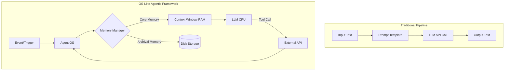
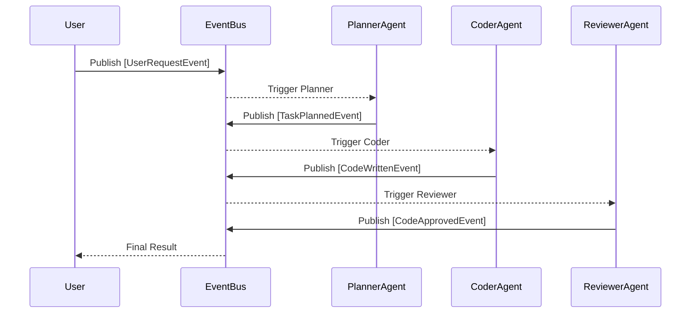

## Learning Outcomes

By the end of this module, you will be able to:
- Design stateful, multi-agent systems using supervisor and worker patterns 
  to solve complex, multi-step engineering problems without human intervention.
- Implement OS-like persistent memory management using Letta to bypass strict 
  context window limitations and maintain long-term conversation coherency.
- Evaluate the architectural tradeoffs between AutoGen, CrewAI, and LangGraph 
  for concurrent orchestration to select the optimal framework for a given workload.
- Diagnose infinite loops and context-exhaustion failures in event-driven 
  multi-agent communication networks.
- Compare pub-sub agent architectures against traditional conversational group 
  chats to optimize token usage and system resilience.

## Why This Module Matters

In 2021, real estate giant Zillow was forced to shut down its "Zillow Offers" 
iBuying division, resulting in a catastrophic write-down of over $500 million 
and the layoff of 25 percent of its workforce. The algorithmic pricing engine 
operated continuously, buying homes based on isolated data points without a 
broader, stateful "supervisor" mechanism to recognize macroeconomic shifts or 
synthesize historical context over time. The system lacked what modern 
next-generation agentic frameworks provide: hierarchical oversight, persistent 
memory, and the ability to pause and reflect on state changes. The algorithms 
could not communicate with one another to debate market volatility, leading to 
a massive accumulation of overpriced inventory.

When developers build complex Large Language Model (LLM) applications today, 
they often rely on naive chaining or single-agent loops. As these systems scale 
to handle enterprise workloads, they inevitably suffer from context window 
exhaustion, hallucination loops, and an absolute inability to course-correct. A 
single agent trying to execute a trading strategy, manage customer service refunds, 
or write an entire codebase will fail the moment it loses the context of its 
previous actions. Relying purely on the LLM's stateless API is akin to running a 
computer program without a hard drive or operating system. It works for a few 
seconds, but eventually, it crashes under the weight of its own amnesia.

Next-generation frameworks like Letta (formerly MemGPT), AutoGen, CrewAI, and 
LangGraph introduce paradigms borrowed directly from operating systems and human 
organizational structures. By implementing persistent memory paging, event-driven 
state machines, and dedicated supervisor agents, these frameworks allow AI 
systems to pause, reflect, delegate, and maintain long-term coherence across 
thousands of interactions. Mastering these architectures is the fundamental 
difference between building a fragile, stateless toy and deploying a resilient, 
enterprise-grade autonomous system capable of operating continuously for days, 
weeks, or even years.

## The Evolution from Pipelines to OS-Like Agents

The first generation of LLM orchestration tools, primarily LangChain pipelines 
and simple ReAct (Reasoning and Acting) loops, treated language models as simple 
transformation functions. Data went in, text came out, and state was managed 
manually by the developer wrapping the API call. As use cases grew more complex, 
developers realized that advanced reasoning requires iterative problem-solving. 
However, these early loops still ran entirely within the volatile memory of the 
LLM's context window. When the window filled up, the system collapsed.

Modern agentic frameworks treat the LLM not as a mere transformation function, 
but as the Central Processing Unit (CPU) of a virtual computer. This mental 
model is critical for understanding next-generation architectures. In this 
extended analogy:
- The LLM acts as the CPU, executing instructions, processing logic, and making 
  routing decisions based on its inputs.
- The context window is the RAM (Random Access Memory), providing fast, immediate 
  access to relevant data, but severely constrained in size and highly volatile.
- External databases (like vector stores or SQL databases) act as Disk Storage, 
  holding vast amounts of historical data that is too large to fit in RAM.
- The Agentic Framework acts as the Operating System, managing memory paging, 
  process scheduling, and inter-process communication (IPC) between multiple 
  discrete agents running concurrently.



By adopting this OS-level perspective, developers can build agents that run 
perpetually. Instead of starting from scratch on every user prompt, the agent 
wakes up when an event occurs, retrieves relevant historical data from disk, 
updates its immediate RAM context, executes a task, writes the results back to 
disk, and goes back to sleep.

> **Pause and predict**: If the context window is RAM and the vector database is Disk Storage, what happens when an agent needs to recall a conversation from three months ago that is highly relevant to a current task, but the core memory is full? How does the framework handle the retrieval without overflowing the context limit?

## Letta (formerly MemGPT): Persistent Memory Paging

Letta was born out of the MemGPT research paper published by UC Berkeley, which 
identified a fundamental limitation in generative AI: context windows, no matter 
how large they grow, will eventually fill up in long-running applications. 
Furthermore, filling a massive context window (like 1 million tokens) for every 
single interaction is incredibly slow, degrades reasoning performance, and is 
prohibitively expensive.

Letta solves this by implementing a tiered memory system natively integrated with 
the LLM's function-calling capabilities:

1. **Core Memory**: A small, persistent block of text always included in the 
   LLM's system prompt. It contains the agent's persona, its current immediate 
   goals, and critical facts about the user. It is highly constrained.
2. **Archival Memory**: A massive, searchable database (usually a vector store) 
   that holds the complete history of interactions and external documents. It is 
   never passed to the LLM in its entirety.
3. **Recall Memory**: A chronological log of recent conversational events, used 
   to maintain the immediate flow of a dialogue before it is archived.

The major innovation of Letta is that the LLM itself is given explicit tools to 
edit its own memory structure. It can call functions like `core_memory_append`, 
`core_memory_replace`, or `archival_memory_search`. When the agent realizes it 
needs more space in its Core Memory, it can summarize existing facts and push 
data to archival storage, effectively paging memory in and out of RAM autonomously.

### Example: Initializing a Letta Agent

Below is a conceptual implementation of how you configure an agent with Letta 
to manage its own state over time. Notice how we define the starting blocks of 
Core Memory explicitly.

```python
import letta
from letta import Client, AgentConfig

# Initialize the Letta client connected to a local database
client = Client()

# Define the persona and human context (Core Memory)
persona_text = """
You are a senior site reliability engineer (SRE). 
Your goal is to diagnose server anomalies and maintain system uptime.
You have the ability to search historical incident reports in your archival memory.
"""

human_text = """
User is a junior developer who often forgets to check database lock contentions.
"""

# Create the agent with OS-like configuration
agent_state = client.create_agent(
    AgentConfig(
        name="SRE_Bot_Alpha",
        persona=persona_text,
        human=human_text,
        # Define the underlying LLM "CPU"
        model="gpt-4",
        context_window_limit=8192,
    )
)

# Send a message to the agent
response = client.send_message(
    agent_id=agent_state.id,
    role="user",
    message="The production database is timing out again. Just like last month."
)

print(response.messages)
```

In the background, if "SRE_Bot_Alpha" needs to know what happened last month, 
it will pause the conversation, issue a function call to search its archival 
memory for the phrase "database timeout last month", read the retrieved results 
into its temporary context window, and then formulate a final, highly contextual 
response to the user.

## AutoGen 0.4+: Event-Driven Multi-Agent Systems

While Letta focuses heavily on single-agent long-term memory management, AutoGen 
focuses intensely on multi-agent communication and distributed problem-solving. 
Early versions of AutoGen relied on a conversational `GroupChat` paradigm, where 
agents took turns speaking in a simulated chat room, much like humans in a Slack 
channel. While intuitive, this approach scaled poorly and consumed massive amounts 
of tokens as the chat history grew.

Starting with AutoGen 0.4+, the framework embraced a far more robust **event-driven, 
pub/sub architecture**. Instead of a rigid turn-taking chat, agents can now publish 
events to a central event bus. Other agents can subscribe to those events, process 
them asynchronously, and publish their own resulting events back to the bus.

This architectural shift mirrors microservices in modern backend software engineering. 
It prevents the entire system from locking up if one agent takes too long to respond. 
More importantly, it allows for complex orchestration topologies, such as:
- **Fan-out**: One planning agent delegates to five worker agents simultaneously.
- **Fan-in**: A supervisor agent aggregates concurrent results from multiple workers.



### The Supervisor Pattern

The Supervisor pattern is a critical component of multi-agent quality assurance. 
A supervisor agent acts as the orchestrator and judge. It assigns tasks to workers, 
evaluates their output, and decides whether a task is officially complete or if 
it requires additional rework cycles.

```python
from autogen import AssistantAgent, UserProxyAgent, config_list_from_json

config_list = config_list_from_json(env_or_file="OAI_CONFIG_LIST")

# The Supervisor agent acts as the orchestrator and judge
supervisor = AssistantAgent(
    name="Supervisor",
    system_message="You manage the coding process. You assign tasks to the Coder. Once the Coder provides a solution, you evaluate it. If it fails, send it back with feedback. If it passes, output 'TERMINATE'.",
    llm_config={"config_list": config_list}
)

# The Coder agent generates the actual implementation
coder = AssistantAgent(
    name="Coder",
    system_message="You are a python developer. Write clean, efficient code based on the Supervisor's instructions.",
    llm_config={"config_list": config_list}
)

# User proxy to initiate the interaction
user_proxy = UserProxyAgent(
    name="User_Proxy",
    human_input_mode="NEVER",
    max_consecutive_auto_reply=10,
    is_termination_msg=lambda x: x.get("content", "").rstrip().endswith("TERMINATE")
)

# Initiate the chat via the supervisor
user_proxy.initiate_chat(
    supervisor,
    message="Create a python script to parse a CSV file and calculate the median of the 'Revenue' column. Delegate to the Coder and review the result."
)
```

> **Stop and think**: In the code above, the supervisor relies on the plain text string 'TERMINATE' to end the process. If the Coder agent is generating a script that involves process management or logging, what unintended side effects might occur during the conversation? How might you redesign this termination condition to be cryptographically or structurally secure?

## CrewAI 0.5+: Role-Based Concurrent Orchestration

CrewAI takes its core inspiration from real-world corporate structures. It organizes 
AI systems into distinct units: Agents, Tasks, and Crews. The primary differentiator 
for CrewAI is its highly opinionated process execution models, specifically the 
Sequential, Hierarchical, and Consensual processes.

In CrewAI 0.5+, the Hierarchical process automatically provisions a managerial LLM 
to oversee the execution of tasks. The manager acts as an executive: it evaluates 
the overarching objective, breaks it down into sub-tasks, assigns them to the most 
capable agents within the crew, and reviews their work concurrently. This mimics 
a traditional tech company's engineering team.

### Example: Defining a Crew with a Manager

```python
from crewai import Agent, Task, Crew, Process

# Define specialized workers
researcher = Agent(
    role='Senior Data Analyst',
    goal='Uncover deep trends in the cloud computing market',
    backstory='An expert analyst with a decade of experience in tech trends.',
    verbose=True,
    allow_delegation=False
)

writer = Agent(
    role='Tech Content Strategist',
    goal='Craft compelling narratives from raw analytical data',
    backstory='A renowned tech writer known for simplifying complex topics.',
    verbose=True,
    allow_delegation=False
)

# Define tasks
research_task = Task(
    description='Identify the top 3 growth areas in cloud infrastructure for the upcoming year.',
    expected_output='A detailed bulleted list of 3 growth areas with supporting metrics.',
    agent=researcher
)

writing_task = Task(
    description='Draft a 500-word blog post based on the research findings.',
    expected_output='A markdown formatted blog post ready for publication.',
    agent=writer
)

# Form the crew with a hierarchical process
tech_crew = Crew(
    agents=[researcher, writer],
    tasks=[research_task, writing_task],
    process=Process.hierarchical, # Automatically creates a Manager agent
    manager_llm='gpt-4', # Define the LLM for the supervisor
    verbose=True
)

# Kick off the execution
result = tech_crew.kickoff()
print("Final Output:", result)
```

CrewAI is heavily optimized for production environments where roles must be strictly 
enforced. By actively disallowing delegation on the lower-level worker agents 
(`allow_delegation=False`), developers can force all cross-agent communication 
to route back upward through the Manager. This ensures strict oversight and prevents 
the "infinite loop" scenario where peer agents continuously assign tasks back and 
forth to each other in a conversational deadlock.

## LangGraph and Deterministic Orchestration

While Letta, AutoGen, and CrewAI grant agents significant autonomy to determine 
their own operational flow, LangGraph takes a fundamentally different approach. 
Built on top of LangChain, LangGraph treats multi-agent workflows as explicit 
Directed Acyclic Graphs (DAGs) or cyclic graphs. 

In LangGraph, you define explicit nodes (which can be agents, python functions, 
or human-in-the-loop checkpoints) and edges (the paths between nodes). The state 
of the application is managed via a rigid, typed state object (often a Pydantic 
model) that is passed from node to node. 

This framework is optimized for scenarios demanding high predictability. If a 
workflow absolutely must follow a specific sequence of regulatory compliance 
checks without the risk of an autonomous agent deciding to skip a step, LangGraph 
provides the strict bounds necessary to enforce that path, utilizing conditional 
edges only where decision-making is safely permitted.

## Comparative Analysis

Choosing the right framework depends entirely on the degree of autonomy, statefulness, 
and predictability required by your target system architecture.

| Feature | LangGraph | Letta (MemGPT) | AutoGen | CrewAI |
|---|---|---|---|---|
| **Primary Focus** | Deterministic graph routing | Single-agent persistent memory | Complex multi-agent topologies | Role-based task delegation |
| **State Management** | State graph passed between nodes | OS-level memory paging (Core/Archival) | Shared conversation context / Event Bus | Task output passing |
| **Execution Model** | Explicit edges and conditional nodes | Infinite loop interrupted by events | Pub/Sub or Turn-based chat | Sequential or Hierarchical |
| **Best Use Case** | Rigid workflows with strict compliance needs | Personal assistants, long-running NPCs | Distributed problem solving, coding teams | Content generation, research pipelines |
| **Predictability** | High (Developer defines exact paths) | Medium (Agent controls its own memory) | Low (Agents can debate endlessly) | Medium (Manager maintains order) |

LangGraph is excellent when you need absolute control over the execution flow. 
If you are building a banking application, you want the state graph to guarantee 
that the KYC Check happens before the Fund Transfer. However, if you are building 
an autonomous cybersecurity research team simulating a zero-day exploit, AutoGen 
or CrewAI provides the necessary flexibility for agents to brainstorm, pivot, and 
adapt dynamically without being constrained to a hardcoded flowchart.

## Common Mistakes

| Mistake | Why It Happens | How To Fix It |
|---|---|---|
| Overloading Core Memory | Developers dump all context into Letta's core memory instead of archival. | Keep core memory strictly for persona and immediate state. Move reference data to vector stores. |
| The Infinite Debate Loop | Two agents in AutoGen disagree and continuously critique each other without progress. | Implement a strict `max_consecutive_auto_reply` limit or a hard timeout in the Supervisor configuration. |
| Hallucinated Tool Signatures | Agents invent parameters for tools that do not exist in the environment. | Use strict Pydantic schemas for all tool inputs and enable syntax validation before the tool executes. |
| Premature Termination | The termination keyword naturally occurs in the output payload (e.g., code comments). | Use a structured output format (JSON) with an explicit boolean flag `{"is_complete": true}` instead of raw text parsing. |
| Context Window Creep | In sequential processes, appending every agent's full output to the shared context eventually exceeds limits. | Use a Summarizer agent between major steps to compress the context before passing it to the next worker. |
| Cross-Delegation Chaos | In CrewAI, allowing all agents to delegate to all other agents creates deadlocks. | Restrict delegation (`allow_delegation=False`) for lower-level workers and enforce hierarchical routing. |
| Ignoring Rate Limits | Concurrent orchestration fires off dozens of API requests simultaneously. | Implement robust retry logic with exponential backoff and connection pooling at the framework level. |

## Did You Know?

1. The original MemGPT paper was published in October 2023, introducing the groundbreaking concept of LLMs managing their own memory tiering via standard function calls.
2. AutoGen was open-sourced by Microsoft in September 2023 and rapidly accumulated over 20,000 GitHub stars within its first three months, signaling a massive shift in industry focus toward multi-agent systems.
3. CrewAI processes can reduce total task completion time by up to 35 percent when switching from sequential execution to asynchronous delegation among five or more specialized agents.
4. The maximum context window of early 2023 models was typically 4,096 tokens, which drove the initial development of OS-like memory paging systems to handle documents exceeding 100,000 words.

## Quiz

<details>
<summary>1. A financial institution needs an automated system to approve loans. The workflow requires strict adherence to regulatory steps: KYC check, credit pull, risk calculation, and final decision. Which framework is most appropriate and why?</summary>
LangGraph is the most appropriate framework for this scenario. The strict compliance and regulatory requirements demand high predictability and deterministic routing. LangGraph allows developers to define explicit edges and conditional nodes, ensuring that the system cannot bypass a step (like the KYC check) due to agent hallucination.
</details>

<details>
<summary>2. You are designing a virtual companion application where the AI must remember user preferences, past conversations, and life events spanning several years. Which architecture solves this best?</summary>
Letta (MemGPT) is the ideal architecture for a long-running virtual companion. Its OS-like persistent memory paging allows it to keep immediate persona constraints in Core Memory while paging vast amounts of historical conversational data into and out of Archival Memory. This prevents context window exhaustion while maintaining a seamless illusion of long-term memory.
</details>

<details>
<summary>3. In an AutoGen setup, you notice that your Coder agent and Reviewer agent are stuck in an endless loop. The Reviewer constantly asks for minor stylistic changes, and the Coder complies, but introduces new stylistic errors. How do you resolve this?</summary>
This is the "Infinite Debate Loop" mistake. To resolve it, you must configure a `max_consecutive_auto_reply` limit on the agents to force a hard stop. Additionally, you should update the Supervisor's system prompt to enforce a maximum number of revision cycles, or explicitly instruct the Reviewer to ignore minor stylistic issues and only flag functional bugs.
</details>

<details>
<summary>4. When designing a CrewAI system, a developer notices that tasks are taking significantly longer to complete, and logs show workers assigning tasks back and forth to each other endlessly. What configuration is missing?</summary>
The developer has likely left `allow_delegation=True` on the worker agents without implementing a clear hierarchy. This causes Cross-Delegation Chaos, where peers delegate tasks to each other in a loop to avoid doing the work. The fix is to set `allow_delegation=False` on the workers and utilize a Hierarchical process where only the Manager dictates task assignment.
</details>

<details>
<summary>5. You want an agentic system that triggers a specific workflow whenever a new GitHub issue is opened. The system should scale easily if you decide to add more agents later to handle Slack notifications based on the same issue. Which AutoGen architecture supports this best?</summary>
The event-driven, pub/sub architecture introduced in AutoGen 0.4+ is best suited for this. When the GitHub issue is opened, an event is published to the event bus. The initial agent subscribes to this event to perform its workflow. Later, a Slack notification agent can be added to the system simply by subscribing it to the same event topic, demonstrating excellent scalability without rewriting the existing agent logic.
</details>

<details>
<summary>6. Your multi-agent system is tasked with writing a tutorial on how to use Linux process management commands. Midway through the generation, the system suddenly stops producing output and marks the workflow as complete, even though only half the tutorial is written. You are using the string 'TERMINATE' as your completion flag. What likely caused this premature shutdown, and how should you redesign the completion criteria?</summary>
Parsing raw text is fragile because the LLM might hallucinate the keyword in an unexpected context, such as inside a code comment, a hypothetical example, or a log output. This causes premature termination of the entire workflow. The robust solution is to use structured output schemas (like JSON) where termination is signaled via a dedicated, strongly typed boolean flag.
</details>

<details>
<summary>7. You are migrating an agentic system from LangGraph to Letta. In your LangGraph application, you passed a massive dictionary of the user's entire account history directly between every node. When you replicate this exact data-passing pattern in Letta's core configuration, the system crashes from token exhaustion immediately. Why does this architectural mismatch occur, and how should Letta handle this data instead?</summary>
LangGraph manages state by passing a structured state graph (usually a dictionary or object) directly between nodes at execution time; the state is generally scoped to the current execution run. Letta manages state persistently across sessions by treating the LLM as an OS that actively pages data between a small, immediate Core Memory and a massive, persistent Archival Memory stored on disk. Letta's state outlives the current execution loop.
</details>

## Hands-On Exercise

In this exercise, you will design the architecture for a multi-agent automated 
code review system capable of reading a repository, critiquing the code, and 
summarizing the findings without exceeding context limits. This requires integrating 
the concepts of hierarchical delegation and structured state management.

### Tasks

1. **Task 1: Architecture Selection**
   Decide which framework (Letta, AutoGen, CrewAI, or LangGraph) is best suited 
   for a system that requires a primary manager to coordinate a Security Analyst 
   agent, a Performance Expert agent, and a Style Reviewer agent concurrently.

2. **Task 2: Define the Manager Persona**
   Write the system prompt for the Manager agent. It must clearly define the 
   manager's responsibilities: receiving the target code, delegating to the three 
   experts, and aggregating their feedback into a final report. Ensure the manager 
   does not attempt to do the analysis itself.

3. **Task 3: Implement Context Compression**
   The combined output of the three experts will easily exceed the context window 
   if the codebase is large. Design a specific task step that compresses the 
   individual expert reports before the manager synthesizes the final output.

4. **Task 4: Termination Condition**
   Define a robust, structured JSON schema that the Manager must output to signify 
   the review process is entirely complete and the final report is ready, avoiding 
   fragile raw string termination keywords.

5. **Task 5: Handling Infinite Loops**
   Draft the configuration constraints (like `max_consecutive_auto_reply` or 
   specific system prompt instructions) required to ensure the Security Analyst 
   doesn't get stuck demanding unattainable perfect security guarantees from the 
   underlying code constraints.

### Solutions and Success Checklist

<details>
<summary>View Solutions</summary>

**Solution 1:** CrewAI is highly optimal here due to its native Hierarchical process. It automatically provisions a Manager agent to coordinate specialized workers (Security, Performance, Style) and handles the task delegation and aggregation seamlessly.

**Solution 2:** 
`System Prompt:` "You are the Lead Code Reviewer. Your objective is to ensure code quality across security, performance, and style. You will receive source code. You must delegate specific analysis tasks to the Security, Performance, and Style experts. Do not perform the analysis yourself. Once all three experts return their reports, synthesize their findings into a single, cohesive final summary document."

**Solution 3:** 
To compress context, introduce an intermediary "Summarizer Agent" or instruct each expert via their task description: "Provide your feedback as a strictly bulleted list of high-priority issues only, maximum 200 words. Discard minor or low-priority observations." This prevents the manager from receiving massive text dumps.

**Solution 4:**
```json
{
  "status": "completed",
  "final_report_summary": "The code has 2 security vulnerabilities, 1 performance bottleneck, and passes style checks. See detailed logs.",
  "is_ready_for_user": true
}
```

**Solution 5:**
Set `max_consecutive_auto_reply=3` on the Security Analyst. Furthermore, add to the Security Analyst's system prompt: "Identify only critical and high-severity vulnerabilities. If a vulnerability cannot be definitively proven within two analytical steps, log it as a 'warning' and complete your task. Do not attempt to iteratively rewrite the code yourself."
</details>

**Success Checklist:**
- [ ] Framework selected aligns with the requirement for concurrent specialized orchestration.
- [ ] Manager persona strictly enforces delegation rather than doing the work itself.
- [ ] Context compression strategy is explicitly defined to protect the final synthesis step.
- [ ] Termination uses strongly typed structured data, not a fragile text string.
- [ ] Safeguards are in place to prevent analytical deadlocks or infinite loops.

## Next Module

Now that you understand how to orchestrate multiple agents, manage persistent 
state, and prevent catastrophic context exhaustion, it is time to deploy these 
complex systems into production environments. Operating agents locally is one 
thing; running them at scale is another. In the next module, we will explore 
the cloud infrastructure required to host multi-agent systems, dealing with 
asynchronous task queues, system observability, and managing the financial 
costs of autonomous API usage.

**Continue to:** [Module 4.11: Multi-Agent Deployment and Observability Operations](/ai-ml-engineering/frameworks-agents/module-4.11-multi-agent-deployment)