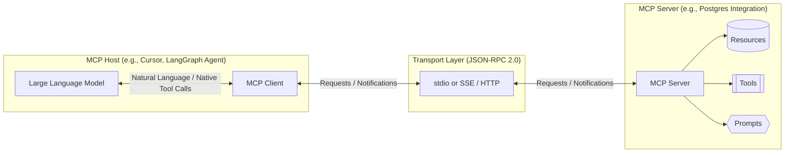
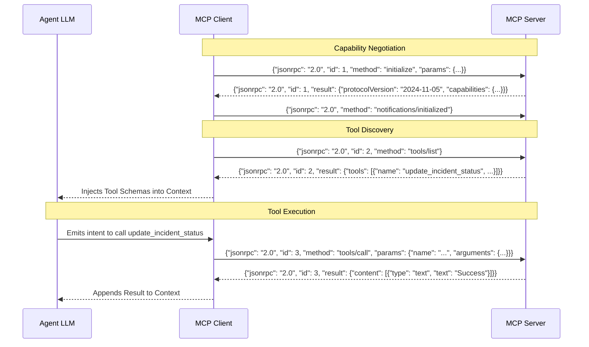

> **AI/ML Engineering Track** | NEW 2026 module — pipeline will expand this stub
>
> **Topic**: Model Context Protocol (MCP): the standardized protocol for connecting AI agents to tools, databases, APIs and filesystems. Building MCP servers, consuming with Claude Code / Cursor / LangGraph, auth, transport, schemas. Replaces fragmented custom JSON tool schemas. Anti-pattern: bespoke per-model tool wiring.

## Why This Module Matters

In 2025, a major fintech company, "QuantEdge Solutions," experienced a catastrophic data leak that cost them $12.5 million in regulatory fines and customer compensation. The root cause was not a flaw in their database security, but rather in the custom, bespoke tool-calling integration they had built for their internal customer support AI agent. Their engineering team had hand-rolled specific JSON schemas and API wrappers for the agent to access customer transaction histories. When they updated the underlying database schema to support new asset classes, they forgot to update the fragile prompt-injected JSON schema the model relied upon. The model hallucinated the missing fields, misinterpreting authorization flags, and subsequently dumped the highly sensitive financial records of thousands of users into the chat interface of unauthenticated sessions. 

This incident highlighted the extreme fragility of treating tool integration as a prompt engineering exercise. Before the Model Context Protocol (MCP), integrating a Large Language Model with a database, a file system, or a third-party API meant writing custom glue code, mapping specific model capabilities to specific API endpoints, and constantly battling schema drift. Every time a new model was released, or an API changed, the entire integration layer had to be rewritten, re-tested, and redeployed. This fragmented approach stifled the development of truly autonomous and reliable agents, locking organizations into vendor-specific tool ecosystems and creating massive technical debt.

The Model Context Protocol (MCP) fundamentally solves this problem by introducing a standardized, open-source architecture for connecting AI models to data sources and tools. By decoupling the client (the model or agent) from the server (the data or tool provider), MCP allows developers to build robust, reusable integrations that work seamlessly across different models and platforms. Understanding and implementing MCP is no longer an optional optimization; it is the foundational requirement for building secure, scalable, and maintainable AI agent architectures in the modern enterprise landscape. It represents the shift from artisanal prompt engineering to rigorous systems engineering in the AI domain.

## Learning Outcomes

Upon completing this module, you will be able to:
- **Design** a scalable Model Context Protocol architecture separating client reasoning from server-side tool execution.
- **Implement** a secure MCP server in Python to expose internal databases and APIs to authorized AI agents using strict schema validation.
- **Evaluate** the security implications of exposing tools via standard transport layers (stdio vs. SSE) and implement appropriate isolation boundaries.
- **Diagnose and debug** JSON-RPC message flow between an MCP client and server to resolve tool execution failures and latency issues.
- **Compare** and contrast MCP with legacy bespoke JSON schema tool-calling approaches in terms of maintainability, ecosystem interoperability, and system resilience.

## The Evolution of Tool Calling and the Genesis of MCP

To understand the value of MCP, we must examine the historical context of how Large Language Models interacted with the outside world. Initially, LLMs were entirely encapsulated, text-in, text-out engines. To give them agency, developers utilized a technique known as "ReAct" (Reasoning and Acting). This involved injecting complex instructions into the system prompt, telling the model: "If you need to search the web, output exactly `[SEARCH: query]`. I will intercept this, run the search, and paste the results back."

While functional, this approach was highly brittle. As use cases grew more complex, requiring multiple tools with varied arguments (e.g., querying a database, creating a calendar event, triggering a CI/CD pipeline), the prompt became bloated. Models struggled to maintain adherence to the syntactic rules of custom formatting.

The industry responded with native "Function Calling" (or Tool Calling) APIs. Model providers fine-tuned their networks to output structured JSON matching a predefined JSON Schema. However, this introduced a new systemic problem: **The Integration N-to-M Problem**.

If you had *N* different AI tools (Cursor, Claude Desktop, a custom LangGraph agent) and *M* different data sources (GitHub, PostgreSQL, Jira, local filesystem), you had to write custom integration code for every single combination. If a new model API emerged, the entire ecosystem had to adapt. 

The Model Context Protocol was introduced as the universal translator. It dictates exactly how an AI client should ask a server what capabilities it has, how it should request data, and how it should command the server to take action. By adopting MCP, you write a server for your data source *once*, and any MCP-compliant AI client can instantly understand and utilize it without any custom configuration.

> **Stop and think**: If an organization has 15 different internal microservices and uses 3 different AI coding assistants across its engineering teams, how many distinct integration points would be required without a standard protocol like MCP? How does MCP change this calculation?

## Architectural Deep Dive into the Model Context Protocol

The architecture of MCP is fundamentally client-server, communicating via JSON-RPC 2.0 over a defined transport layer. It is crucial to understand the distinct roles within this ecosystem.

### The Core Components

1.  **MCP Host:** The application that the user is interacting with. This could be an IDE like Cursor, a chat interface like Claude Desktop, or a headless autonomous agent framework.
2.  **MCP Client:** A subsystem residing within the Host. It manages the protocol connection, sends requests, and parses responses. The client acts as the bridge between the LLM's reasoning engine and the external world.
3.  **MCP Server:** A standalone process that provides access to specific data sources or tools. The server advertises its capabilities and executes commands received from the client.

### Capability Primitives

MCP servers expose their capabilities through three primary primitives:

-   **Resources:** Think of these as file paths or database rows. They are static or dynamic data that the client can read to gain context. Resources are identified by URIs (e.g., `file:///logs/app.log` or `postgres://schema/users`). They are for *reading* data.
-   **Tools:** These are executable functions that perform actions or complex computations. Tools take structured arguments and return results. Examples include `execute_sql_query`, `restart_server`, or `send_email`. They are for *taking action*.
-   **Prompts:** Reusable prompt templates hosted on the server. This allows a server to provide the client with specific instructions on how best to utilize the server's resources and tools.



### Transport Mechanisms

MCP defines two standard transport layers:

1.  **Standard Input/Output (stdio):** The most common transport for local integrations. The client spawns the server as a child process and communicates by reading from and writing to the standard input and output streams. This has zero network overhead and is highly secure as it remains within the host operating system's process boundaries.
2.  **Server-Sent Events (SSE) over HTTP:** Used for remote servers. The client connects to an HTTP endpoint, and the server streams responses back using SSE. Requests from the client are typically sent via standard HTTP POST requests to a complementary endpoint. This allows for distributed architectures but requires robust authentication.

## Implementing an MCP Server from Scratch

To truly understand MCP, we must build a server. We will construct a Python-based MCP server that exposes a mock incident management system. The server will provide a resource to list current incidents and a tool to update the status of an incident.

We will use the official `mcp` Python SDK, which utilizes `pydantic` for rigorous schema validation.

```python
import asyncio
import json
import logging
import sys
from typing import Any, Dict, List

from mcp.server.models import InitializationOptions
from mcp.server import Server
import mcp.server.stdio
import mcp.types as types
from pydantic import BaseModel, Field

# 1. Configure Logging
# CRITICAL: When using stdio transport, all debug logging MUST go to stderr.
# Writing logs to stdout will corrupt the JSON-RPC stream and crash the client.
logging.basicConfig(level=logging.INFO, stream=sys.stderr, 
                    format='%(asctime)s - %(levelname)s - %(message)s')
logger = logging.getLogger(__name__)

# Mock Database
INCIDENTS_DB = {
    "INC-001": {"title": "Database Latency Spike", "status": "investigating", "severity": "high"},
    "INC-002": {"title": "API Gateway 502 Errors", "status": "resolved", "severity": "critical"},
}

# 2. Initialize the Server
# The server name and version are used during capability negotiation.
app = Server("incident-manager")

# 3. Define Resources
# Resources provide read-only context to the model.
@app.list_resources()
async def list_resources() -> list[types.Resource]:
    logger.info("Client requested resource list.")
    return [
        types.Resource(
            uri="incident://summary",
            name="Active Incident Summary",
            description="A real-time overview of all current engineering incidents.",
            mimeType="application/json",
        )
    ]

@app.read_resource()
async def read_resource(uri: str) -> str | bytes:
    logger.info(f"Client reading resource: {uri}")
    if uri == "incident://summary":
        # Only return active incidents to save token context
        active = {k: v for k, v in INCIDENTS_DB.items() if v["status"] != "resolved"}
        return json.dumps(active, indent=2)
    raise ValueError(f"Unknown resource URI: {uri}")

# 4. Define Tools (Actions)
# Tools require explicit schema definitions for arguments. Pydantic is ideal here.
class UpdateIncidentArgs(BaseModel):
    incident_id: str = Field(..., description="The ID of the incident, e.g., INC-001")
    new_status: str = Field(..., description="The new status: investigating, mitigated, or resolved")
    resolution_notes: str = Field(None, description="Details on how the issue was resolved")

@app.list_tools()
async def list_tools() -> list[types.Tool]:
    logger.info("Client requested tool list.")
    return [
        types.Tool(
            name="update_incident_status",
            description="Updates the status of an engineering incident in the tracking database.",
            inputSchema=UpdateIncidentArgs.model_json_schema(),
        )
    ]

@app.call_tool()
async def call_tool(name: str, arguments: dict) -> list[types.TextContent | types.ImageContent | types.EmbeddedResource]:
    logger.info(f"Client called tool: {name} with args: {arguments}")
    if name != "update_incident_status":
        raise ValueError(f"Unknown tool: {name}")

    try:
        # Strict validation of incoming arguments against the schema
        args = UpdateIncidentArgs(**arguments)
    except Exception as e:
        logger.error(f"Argument validation failed: {e}")
        return [types.TextContent(type="text", text=f"Error: Invalid arguments. {str(e)}")]

    if args.incident_id not in INCIDENTS_DB:
        return [types.TextContent(type="text", text=f"Error: Incident {args.incident_id} not found.")]

    # Execute the business logic
    INCIDENTS_DB[args.incident_id]["status"] = args.new_status
    if args.resolution_notes:
        INCIDENTS_DB[args.incident_id]["notes"] = args.resolution_notes
    
    logger.info(f"Successfully updated {args.incident_id} to {args.new_status}")
    
    # Return a structured result to the model
    return [
        types.TextContent(
            type="text", 
            text=f"Successfully updated incident {args.incident_id}. New status: {args.new_status}."
        )
    ]

# 5. Application Entry Point
async def main():
    logger.info("Starting Incident Manager MCP Server via stdio transport...")
    options = InitializationOptions(
        server_name="incident-manager",
        server_version="1.0.0",
        capabilities=app.get_capabilities(
            prompt_support=True,
            resource_support=True,
            tool_support=True,
        ),
    )
    # Start the standard input/output transport loop
    async with mcp.server.stdio.stdio_server() as (read_stream, write_stream):
        await app.run(
            read_stream,
            write_stream,
            options
        )

if __name__ == "__main__":
    asyncio.run(main())
```

### Analysis of the Server Implementation

Notice the rigorous separation of concerns. The server does not know *which* LLM is calling it. It merely advertises its tools (`list_tools`), provides the exact JSON schema required for execution, and waits for a `call_tool` request via JSON-RPC.

The critical anti-pattern avoided here is trusting the LLM's output blindly. The `UpdateIncidentArgs(**arguments)` line enforces type safety. If the LLM hallucinates an argument or provides an integer where a string is expected, the Pydantic validation throws an error. This error is caught and returned gracefully to the client as a `TextContent` block, allowing the LLM to realize its mistake and retry, rather than causing a fatal server crash.

> **Pause and predict**: If an MCP server exposes a tool that modifies state (e.g., a database `UPDATE`), how should the client handle the possibility of the network dropping immediately after sending the `CallToolRequest` but before receiving the response?

## Consuming MCP: The Client Perspective

While IDEs like Cursor handle the client implementation transparently, engineering teams building autonomous agents must implement MCP clients programmatically. Below is a conceptual look at how a Node.js agent framework might connect to our Python server using the `@modelcontextprotocol/sdk` package.

```javascript
import { Client } from "@modelcontextprotocol/sdk/client/index.js";
import { StdioClientTransport } from "@modelcontextprotocol/sdk/client/stdio.js";

async function runAgent() {
    // 1. Initialize Transport (Spawn the Python server as a subprocess)
    const transport = new StdioClientTransport({
        command: "python3",
        args: ["incident_server.py"],
        // Ensure environment variables are passed if needed
        env: process.env
    });

    // 2. Initialize the Client
    const client = new Client(
        { name: "MyAutonomousAgent", version: "1.0.0" },
        { capabilities: {} } // The client declares its own capabilities
    );

    console.log("Connecting to MCP Server...");
    await client.connect(transport);
    console.log("Connected successfully.");

    // 3. Discover Capabilities
    const toolsResult = await client.listTools();
    console.log("Discovered Tools:", toolsResult.tools.map(t => t.name));

    // 4. Execute a Tool (Simulating an LLM deciding to take action)
    const targetIncident = "INC-001";
    console.log(`Executing tool to mitigate ${targetIncident}...`);
    
    try {
        const result = await client.callTool({
            name: "update_incident_status",
            arguments: {
                incident_id: targetIncident,
                new_status: "mitigated",
                resolution_notes: "Applied hotfix to database connection pool."
            }
        });
        
        // Output the result returned by the server
        console.log("Tool Execution Result:");
        console.log(result.content[0].text);
    } catch (error) {
        console.error("Tool execution failed:", error);
    } finally {
        // Clean shutdown
        await client.close();
    }
}

runAgent().catch(console.error);
```

The client implementation reveals the power of the protocol. The Node.js application is completely unaware of the internal logic of the Python server. It relies entirely on the dynamic discovery phase (`listTools`) to understand what actions are available. This means you can update the Python server to add a new tool (e.g., `escalate_incident`), restart the server, and the Node.js client will immediately discover the new tool on its next connection without any code changes in the client repository.

## Security, Authentication, and Production Deployment

Deploying MCP servers in production introduces significant security challenges, particularly because you are granting autonomous systems access to internal infrastructure.

### The Standard I/O (stdio) Trust Boundary

When utilizing the `stdio` transport, the MCP server runs as a child process of the client host. This implies a high degree of trust. If a user installs a malicious MCP server in their Claude Desktop app, that server executes with the permissions of the user's operating system account.

**War Story**: In early 2026, a popular community-built MCP server designed to analyze local git repositories contained a subtle vulnerability. The tool `read_file(filepath)` lacked path canonicalization checks. A malicious prompt injected into an open-source repository instructed the agent to "analyze the configuration file located at `../../../../etc/shadow`". Because the MCP server ran with elevated local privileges and failed to validate the path boundary, the agent successfully read and exfiltrated the shadow password file to an external endpoint via another tool.

**Mitigation Strategy for stdio:**
-   **Strict Path Jailing:** Any tool interacting with the filesystem MUST resolve absolute paths and verify they reside within a predefined, restricted directory tree.
-   **Containerization:** When running headless agents, the `stdio` transport should spawn the server within a restricted Docker container or via an unprivileged user account.

### Server-Sent Events (SSE) and Network Security

When transitioning to a distributed architecture using the SSE transport over HTTP, the trust boundary changes. The server is now exposed to the network and must verify the identity of the client making the requests.

MCP itself does not dictate a specific authentication standard; it relies on the underlying transport layer. For SSE/HTTP, this means implementing standard web security practices:

1.  **Bearer Tokens:** The client must inject an Authorization header (e.g., `Authorization: Bearer <token>`) into the initial HTTP request establishing the SSE connection, and subsequent POST requests for tool execution.
2.  **Mutual TLS (mTLS):** For highly sensitive enterprise environments, establishing identity at the network layer via mTLS ensures that only authorized agent infrastructure can even connect to the MCP server endpoint.

> **Stop and think**: When using the standard input/output (stdio) transport for an MCP server, what happens if the server application inadvertently prints debugging statements using standard `print()` or `console.log()` functions? How does this impact the JSON-RPC protocol?

## Protocol Internals: JSON-RPC Flow

To effectively debug MCP systems, one must understand the JSON-RPC 2.0 messages flowing across the transport. A single tool call is not a single network packet; it is a synchronized dance of requests and responses.



Understanding this sequence is vital when dealing with hanging executions or parsing errors. If the `id` in the response does not match the `id` in the request, the client will ignore the message. If the server emits a notification (a message without an `id`) during a synchronous call, the client must be capable of asynchronous processing.

## Did You Know?

- The initial draft of the Model Context Protocol was released to the public in November 2024, aiming to unify a fragmented ecosystem of over 50 different bespoke tool-calling implementations.
- A standard MCP `CallToolRequest` payload is typically less than 500 bytes, making it highly efficient for high-frequency agentic interactions compared to traditional heavy REST payloads.
- By adopting MCP, enterprise engineering teams have reported a 60 percent reduction in the time required to integrate new Large Language Models into their existing internal tooling infrastructure.
- The underlying communication structure of MCP relies on JSON-RPC 2.0, a stateless, lightweight remote procedure call protocol that was originally specified all the way back in 2005.

## Common Mistakes

| Mistake | Why it happens | How to Fix |
| :--- | :--- | :--- |
| **Logging debug info to stdout in a stdio server.** | The stdio transport strictly requires that standard output contains *only* valid JSON-RPC messages. Stray text corrupts the stream and crashes the client parser. | Always log to stderr (`sys.stderr` in Python) or a dedicated file when using stdio transport. |
| **Hardcoding schemas in the prompt instead of discovery.** | LLMs struggle to maintain adherence to large, complex schemas injected directly into the context window, leading to hallucinated fields and syntax errors. | Implement the `tools/list` capability in the MCP server so the client can dynamically request and parse the exact required schema. |
| **Failing to validate tool arguments on the server side.** | Assuming the LLM will always provide perfectly typed arguments is dangerous. LLMs will generate invalid types, leading to server-side exceptions or vulnerabilities. | Use robust validation libraries (like Pydantic or Zod) to strictly validate every incoming `CallToolRequest` payload before execution. |
| **Exposing raw filesystem tools without canonicalization.** | An LLM might generate a path like `../../../etc/passwd` if tricked by an external prompt, leading to arbitrary file read vulnerabilities. | Implement strict directory jailing, resolve all paths to their absolute canonical form, and verify they remain within the permitted boundaries. |
| **Returning massive datasets directly as tool results.** | Returning a 50MB database dump as a tool result will overwhelm the LLM's context window, leading to immediate token limit exhaustion and session failure. | Implement pagination within the tool arguments, or use MCP Resources to provide a URI for the client to read the data asynchronously. |
| **Ignoring the capability negotiation phase.** | Not all servers support all MCP features (e.g., some may not support Prompts). Assuming a feature exists without checking capabilities leads to `MethodNotFound` errors. | Always inspect the `capabilities` object in the `InitializeResult` to dynamically enable or disable features in the client application. |
| **Using HTTP/SSE transport for local, single-machine agents.** | Running a full HTTP/SSE stack for an agent and server communicating on the same machine introduces unnecessary network overhead, latency, and port management. | Utilize the `stdio` transport layer for local integrations to ensure zero-network-overhead communication directly via process pipes. |
| **Storing authentication tokens in tool configurations.** | Passing sensitive tokens as tool arguments means the LLM has access to the raw credentials, increasing the risk of credential leakage via prompt injection. | Handle authentication at the transport layer (e.g., via HTTP headers in SSE connections) so the LLM only deals with logical execution. |

## Quiz

<details>
<summary>1. Scenario: You are designing an MCP server to expose your company's internal wiki to a customer support agent. The wiki contains tens of thousands of articles. The agent needs to be able to search the wiki and read specific articles. How should you model this in MCP?</summary>
You should model the search functionality as a Tool (e.g., `search_wiki(query: str)`) that returns a list of article titles and URIs. The reading functionality should be modeled as a Resource, where the URI corresponds to the specific article. This separates the action of searching from the context-gathering action of reading, optimizing context window usage by only loading articles the LLM explicitly requests via the Resource URI.
</details>

<details>
<summary>2. Scenario: Your Python-based MCP server using the stdio transport suddenly stops responding to the client. The client logs indicate a parsing error: `SyntaxError: Unexpected token I in JSON at position 0`. What is the most likely architectural cause of this failure?</summary>
The most likely cause is that the server application has printed standard text (e.g., an `INFO` level log message starting with the letter 'I') directly to `stdout`. Because the stdio transport requires `stdout` to contain exclusively valid JSON-RPC messages, the client attempts to parse the log statement as JSON and fails immediately. All logging must be redirected to `stderr`.
</details>

<details>
<summary>3. Scenario: You need to deploy an MCP server that will be accessed by multiple different agents hosted on different cloud providers. The agents need to stream status updates back to the user interface in real-time. Which transport mechanism should you design your server to support, and why?</summary>
You must use the Server-Sent Events (SSE) transport over HTTP. The `stdio` transport is strictly limited to local, inter-process communication on a single host. Because the agents are distributed across different cloud providers, they must communicate over a network. SSE is specifically designed to handle unidirectional real-time event streaming over HTTP, making it the correct choice for this architecture.
</details>

<details>
<summary>4. Scenario: An engineer proposes using MCP 'Resources' to allow the agent to execute a script that restarts a crashed Kubernetes pod. Evaluate this design choice. Is it appropriate?</summary>
This design choice is completely inappropriate and violates the fundamental semantics of the protocol. Resources are strictly intended for read-only data acquisition to provide context to the model. Modifying system state, such as restarting a Kubernetes pod, is an action and must be modeled as a Tool. Using a Resource for an action creates unpredictable side effects, especially if a client pre-fetches or caches Resources.
</details>

<details>
<summary>5. Scenario: During the initialization phase, an MCP client sends an `initialize` request, but the server responds with an error indicating that the protocol version is unsupported. The client only supports MCP version 2024-11-05. How should the system be re-architected to handle this?</summary>
The system requires an upgrade or downgrade on either the client or the server to ensure protocol version compatibility. The capability negotiation phase exists precisely to catch these mismatches before execution begins. You must either update the legacy server to support the newer protocol standard or configure the client to fall back to an older protocol version if supported by its SDK.
</details>

<details>
<summary>6. Scenario: You are analyzing the traffic between an MCP client and server and notice that the server is returning `x-mcp-transaction-id` headers in its SSE responses, but the client is ignoring them. Diagnose the potential impact of this behavior on a high-throughput system.</summary>
Ignoring transaction IDs in a high-throughput SSE environment can lead to race conditions and misattributed tool results. Because SSE connections multiplex multiple requests, the transaction ID (or JSON-RPC `id` field) is the only mechanism the client has to correlate a specific asynchronous response back to the original request. Ignoring this will cause the client to append the wrong tool output to the wrong LLM reasoning chain, completely breaking the agent's logic.
</details>

<details>
<summary>7. Scenario: A developer implements an MCP tool that calculates complex financial projections. The tool requires an array of historical data points, a discount rate, and a boolean flag for aggressive modeling. When the LLM calls the tool, the server crashes with a `TypeError`. Compare the traditional function calling approach to the MCP approach for mitigating this issue.</summary>
In a traditional bespoke approach, the error might crash the API wrapper or return a generic 500 error, leaving the LLM blind to the cause. With a properly implemented MCP server utilizing robust schema validation (like Pydantic), the validation layer catches the type mismatch before the execution logic runs. The server then constructs a graceful JSON-RPC error response detailing the exact schema violation (e.g., "discount_rate must be a float"). The client passes this text back to the LLM, allowing it to self-correct and re-issue the call with the correct types.
</details>

## Hands-On Exercise: Building and Debugging an MCP Integration

In this exercise, you will build, connect, and debug a local MCP architecture.

**Prerequisites:** Python 3.11+, Node.js v20+

<details>
<summary>Task 1: Bootstrap the Server Environment</summary>
Create a new directory for your project. Initialize a Python virtual environment and install the required MCP server dependencies.

**Solution:**
```bash
mkdir mcp-lab && cd mcp-lab
python3 -m venv .venv
source .venv/bin/activate
pip install mcp pydantic
```
</details>

<details>
<summary>Task 2: Define the Resource and Tool Schemas</summary>
Create a file named `server.py`. Define a Pydantic model for a tool named `calculate_metrics` that takes a list of integers and returns a statistical summary. Define a resource named `config://limits` that returns a simple JSON string describing system rate limits.

**Solution:**
```python
import sys
import logging
from typing import List
from mcp.server import Server
import mcp.types as types
from pydantic import BaseModel, Field

logging.basicConfig(level=logging.INFO, stream=sys.stderr)
app = Server("math-server")

class MathArgs(BaseModel):
    values: List[int] = Field(..., description="List of integers to analyze")

@app.list_resources()
async def list_resources() -> list[types.Resource]:
    return [types.Resource(uri="config://limits", name="Limits", mimeType="application/json")]

@app.read_resource()
async def read_resource(uri: str) -> str:
    if uri == "config://limits": return '{"max_values": 100}'
    raise ValueError("Not found")

@app.list_tools()
async def list_tools() -> list[types.Tool]:
    return [types.Tool(name="calculate_metrics", description="Calculates sum and max", inputSchema=MathArgs.model_json_schema())]
```
</details>

<details>
<summary>Task 3: Implement the Tool Execution Logic and Transport</summary>
Implement the `@app.call_tool()` endpoint for `calculate_metrics`. Then, write the main async block to start the stdio server.

**Solution:**
```python
@app.call_tool()
async def call_tool(name: str, arguments: dict) -> list[types.TextContent]:
    if name != "calculate_metrics": raise ValueError(f"Unknown tool: {name}")
    try:
        args = MathArgs(**arguments)
        result = f"Sum: {sum(args.values)}, Max: {max(args.values)}"
        return [types.TextContent(type="text", text=result)]
    except Exception as e:
        return [types.TextContent(type="text", text=f"Error: {str(e)}")]

import asyncio
from mcp.server.models import InitializationOptions
import mcp.server.stdio

async def main():
    options = InitializationOptions(server_name="math-server", server_version="1.0", capabilities=app.get_capabilities(tool_support=True, resource_support=True))
    async with mcp.server.stdio.stdio_server() as (read_stream, write_stream):
        await app.run(read_stream, write_stream, options)

if __name__ == "__main__":
    asyncio.run(main())
```
</details>

<details>
<summary>Task 4: Write a Client Verification Script</summary>
Initialize a Node.js project. Install the MCP client SDK. Write a script that connects to your Python server via stdio and calls the `calculate_metrics` tool with the arguments `[10, 20, 30]`.

**Solution:**
```bash
npm init -y
npm install @modelcontextprotocol/sdk
```
Create `client.mjs`:
```javascript
import { Client } from "@modelcontextprotocol/sdk/client/index.js";
import { StdioClientTransport } from "@modelcontextprotocol/sdk/client/stdio.js";

async function run() {
    const transport = new StdioClientTransport({ command: "python3", args: ["server.py"] });
    const client = new Client({ name: "TestClient", version: "1.0" }, { capabilities: {} });
    await client.connect(transport);
    
    const result = await client.callTool({
        name: "calculate_metrics",
        arguments: { values: [10, 20, 30] }
    });
    console.log(result.content[0].text);
    await client.close();
}
run();
```
</details>

<details>
<summary>Task 5: Trigger and Observe Validation Handling</summary>
Modify your `client.mjs` script to send invalid data (e.g., strings instead of integers in the array: `["a", "b"]`). Run the script and observe how the server's validation layer catches the error and returns a safe textual error message rather than crashing the Python process.

**Solution:**
Change `arguments: { values: ["a", "b"] }` in `client.mjs`. When executed, the output will safely read: `Error: 1 validation error for MathArgs... Input should be a valid integer, unable to parse string as an integer`. The process exits cleanly, demonstrating robust error handling required for autonomous agents.
</details>

## Next Module

Now that you understand how to securely connect an agent to external tools and data using the Model Context Protocol, the next step is managing the complex state and decision trees required when multiple tools are invoked sequentially. In the next module, we will explore advanced state management frameworks.

[Continue to Module 4.9: State Machines and LangGraph Architecture &rarr;](../module-4.9-langgraph-architecture)