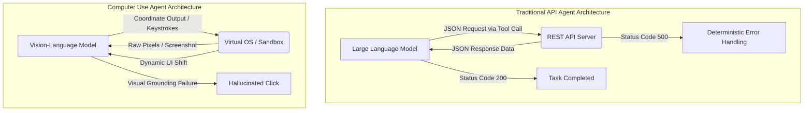
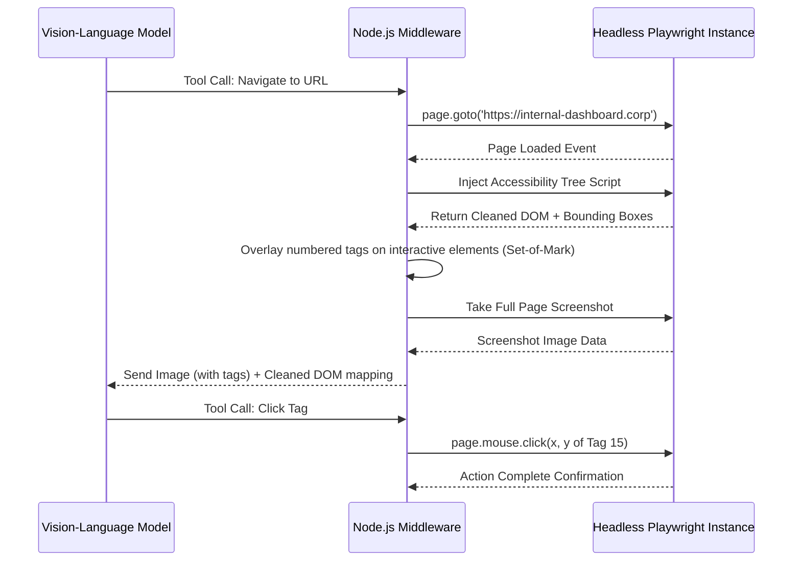

> **AI/ML Engineering Track** | Core Concepts
>
> **Topic**: Computer Use and browser automation agents. Anthropic Computer Use API, OpenAI Operator. Coordinate-based visual grounding, DOM navigation, headless browser security boundaries, screenshot loops, sandbox isolation. Universal task execution beyond text APIs.

## Learning Outcomes

Upon successful completion of this module, you will be able to:
- Design a secure, isolated sandbox environment for executing untrusted computer use agent operations using ephemeral containers and strict network egress filtering.
- Implement a screenshot-driven feedback loop for coordinate-based visual grounding using the Anthropic Computer Use API.
- Evaluate the security boundaries of headless browser automation versus full OS-level agent access to determine the appropriate architecture for a given task.
- Diagnose and resolve common failures in DOM navigation and selector-based visual grounding caused by asynchronous dynamic layouts.
- Compare the architectural tradeoffs between visual-only agents (Operator) and hybrid DOM/visual agents in terms of latency, token cost, and reliability.
- Implement state-reduction algorithms, such as image diffing, to manage context window bloat during long-running agent sessions.

## Why This Module Matters

In late 2024, a rapidly scaling fintech company attempted to automate their legacy compliance auditing process using an early iteration of an OS-level computer use agent. The agent was tasked with logging into a virtual machine, opening a legacy desktop application, and cross-referencing user records. Due to a transient UI lag, the agent's coordinate-based click missed the application icon and instead opened a misconfigured terminal window. Hallucinating that it was interacting with the database CLI, the agent typed and executed a command that recursively deleted the local directory structure. Because the sandbox was improperly isolated and had mounted a shared network drive for log storage, the deletion propagated, wiping out three terabytes of critical audit trails. The incident resulted in a $3.8 million regulatory fine and a complete halt of their automation initiatives.

This catastrophic failure illustrates the immense power and inherent danger of universal task execution. When an artificial intelligence moves beyond structured text APIs and gains the ability to interact with graphical user interfaces, it operates in an environment designed for human intuition, not algorithmic precision. A traditional API returns a deterministic HTTP error if an endpoint is missing; a GUI might display a modal, shift layout, or simply ignore the input, leaving the agent disoriented and prone to erratic behavior.

Mastering computer use agents requires a fundamental shift in how we build AI systems. You are no longer just managing prompts and JSON schemas; you are building robust perception-action loops, implementing coordinate-based visual grounding, and, most importantly, constructing impenetrable sandbox isolations. If you cannot secure the environment, deploying a computer use agent is mathematically indistinguishable from granting a highly capable, unpredictable entity root access to your production servers. Understanding these paradigms is the difference between building a revolutionary automation tool and architecting a devastating security breach.

## Section 1: The Paradigm Shift to Universal Task Execution

Traditional AI agents rely on predefined Application Programming Interfaces (APIs). If an agent needs to book a flight, it constructs a JSON payload and sends an HTTP POST request to a specific endpoint. This approach is highly reliable, deterministic, and easy to secure. However, it is fundamentally limited by the availability of APIs. The vast majority of the world's software—legacy enterprise applications, bespoke internal tools, complex graphical editors—lacks comprehensive API coverage.

Computer use agents bypass this limitation entirely. Instead of interacting with the underlying code, they interact with the presentation layer: the Graphical User Interface (GUI). By outputting mouse movements, keyboard strokes, and scroll commands, and by receiving screenshots as input, these agents achieve universal task execution. If a human can do it on a computer, a sufficiently advanced computer use agent can theoretically do it too.



The transition from API-driven to GUI-driven interaction introduces immense complexity. The agent must now perform visual grounding: the process of mapping a semantic intent (e.g., "Click the Submit button") to a specific spatial location on the screen (e.g., X: 1024, Y: 768). This requires the model to possess advanced spatial reasoning and Optical Character Recognition capabilities natively within its vision encoder.

Furthermore, the state space of a GUI is infinitely larger than a typical API response. Pop-ups, notification banners, loading spinners, and dynamic layouts constantly alter the environment, requiring the agent to maintain robust temporal context across multiple observation steps.

## Section 2: Visual Grounding and Coordinate Mapping

Visual grounding is the cornerstone of modern computer use models, such as those powering the Anthropic Computer Use API. When the model receives a screenshot, it must analyze the pixels to identify interactive elements, read text, and understand the hierarchical structure of the interface without relying on underlying metadata.

There are two primary approaches to coordinate mapping that researchers and engineers utilize:

1.  **Relative Grid Systems:** The screen is divided into a grid system (e.g., a 100x100 grid). The model outputs coordinates based on this grid, which the middleware then translates to absolute pixel coordinates based on the actual screen resolution of the virtual environment. This abstraction helps the model generalize across different display sizes.
2.  **Absolute Pixel Coordinates:** The model is trained to output exact pixel coordinates based on a standardized input resolution. This requires the vision encoder to have exceptional granularity.

Anthropic's implementation utilizes a specialized `computer` tool that expects the model to output actions like `mouse_move`, `left_click_drag`, or `type`, accompanied by precise coordinates or text payloads.

> **Stop and think**: If an agent relies entirely on visual grounding and exact coordinates, what happens if the operating system displays a system-level notification (like a software update prompt) in the top right corner of the screen right before the agent decides to click a button located in that same area? How can the system recover from this?

To mitigate these synchronization issues, robust implementations utilize a "perceive, verify, act" loop. The agent does not blindly issue sequences of clicks. It issues an action, waits for the environment to settle, takes a new screenshot, and verifies the new state before proceeding.

Here is a detailed Python example demonstrating how a middleware layer might translate an LLM's spatial intent into an actual OS-level action using the `pyautogui` library. This code is intended strictly for execution within an isolated sandbox.

```python
import pyautogui
import time
import base64
from io import BytesIO
from PIL import Image

class VisualAgentMiddleware:
    """
    Middleware to translate LLM intent into OS actions.
    Must ONLY be run inside a secured Docker container or microVM.
    """
    def __init__(self, screen_width, screen_height):
        self.width = screen_width
        self.height = screen_height
        # Ensure fail-safe is enabled to prevent runaway mouse movements
        # Moving the mouse to a corner of the screen will abort the script
        pyautogui.FAILSAFE = True
        
        # Set a standard delay after every PyAutoGUI call
        pyautogui.PAUSE = 0.5

    def capture_environment_state(self):
        """Captures the current screen and returns a base64 encoded image."""
        screenshot = pyautogui.screenshot()
        buffered = BytesIO()
        
        # Compress image to save context window tokens
        # A 1080p image uncompressed is too large for efficient LLM processing
        screenshot.save(buffered, format="JPEG", quality=80)
        img_str = base64.b64encode(buffered.getvalue()).decode("utf-8")
        return img_str

    def execute_coordinate_action(self, action_type, x_percent, y_percent, text_payload=None):
        """Translates percentage-based coordinates to absolute pixels and acts."""
        # Calculate absolute pixels based on the sandbox screen resolution
        target_x = int(self.width * (x_percent / 100.0))
        target_y = int(self.height * (y_percent / 100.0))

        print(f"Executing {action_type} at ({target_x}, {target_y})")

        try:
            if action_type == "click":
                # Move first, then click to simulate human motion profiles
                pyautogui.moveTo(target_x, target_y, duration=0.6, tween=pyautogui.easeInOutQuad)
                pyautogui.click()
            elif action_type == "type" and text_payload:
                pyautogui.moveTo(target_x, target_y, duration=0.6)
                pyautogui.click()
                # Type with a slight delay between keystrokes
                pyautogui.write(text_payload, interval=0.08)
            elif action_type == "scroll_down":
                 pyautogui.scroll(-800)
            elif action_type == "double_click":
                 pyautogui.moveTo(target_x, target_y, duration=0.6)
                 pyautogui.doubleClick()
            else:
                 raise ValueError(f"Unsupported action type: {action_type}")
                 
        except pyautogui.FailSafeException:
            print("CRITICAL: PyAutoGUI fail-safe triggered. Aborting action.")
            return False
            
        # Artificial delay to allow UI to render changes before the next capture
        time.sleep(2.0)
        return True

# Example Usage within a Sandbox environment:
# middleware = VisualAgentMiddleware(1920, 1080)
# current_state_image = middleware.capture_environment_state()
# -> Send current_state_image to LLM
# <- LLM responds: {"action": "click", "x_percent": 85, "y_percent": 12}
# middleware.execute_coordinate_action("click", 85, 12)
```

Notice the `x_percent` and `y_percent` abstraction in the method signature. Sending absolute coordinates (like X: 1536, Y: 216) requires the LLM to know the exact resolution of the host machine. By standardizing on a 0-100 percentage grid, the LLM's output becomes resolution-independent, drastically reducing coordinate hallucination rates across different sandbox environments.

## Section 3: Browser Automation - DOM versus Pixels

While full operating system control is the ultimate goal for universal agents, many high-value tasks are strictly web-based. For these scenarios, engineers have a choice: treat the browser as a visual application (Pixels) or interact with its underlying structure (DOM). Tools like OpenAI's Operator often blend these approaches, but understanding the dichotomy is vital for architectural decisions.

### The DOM Navigation Approach
Using tools like Playwright, Puppeteer, or Selenium, the agent receives a serialized version of the HTML Document Object Model. The LLM identifies interactive elements by their CSS selectors, XPath expressions, or ARIA accessibility labels.

**Advantages:**
- Highly deterministic behavior. If a button has `id="submit-order"`, the click will always register on that exact element, regardless of its visual position on the screen.
- Minimal token usage compared to high-resolution images. Sending a pruned HTML tree is significantly cheaper than sending a sequence of base64 images.
- Access to hidden state, such as form values, metadata, and alt text that might not be visually rendered.

**Disadvantages:**
- Modern web applications heavily obfuscate the DOM. Frameworks like React, Angular, or Tailwind generate dynamic, randomized class names (e.g., `class="css-1a2b3c-container"`).
- Shadow DOMs and HTML5 Canvas elements are entirely opaque to standard HTML parsing.
- The agent might click an element that is technically present in the DOM but visually hidden behind a modal or off-screen, leading to silent failures.

### The Pixel and Visual Approach
The agent only sees screenshots and interacts via X and Y coordinates, exactly as a human would view the screen.

**Advantages:**
- Immune to DOM obfuscation and dynamic class naming. If a button looks like a button, the agent can identify and click it.
- Works perfectly with Canvas-based applications (like Google Docs, Figma, or browser games) where the DOM is irrelevant to the application state.

**Disadvantages:**
- Highly susceptible to responsive design shifts. A button might move if the viewport resizes, breaking static coordinate assumptions.
- Requires massive amounts of multimodal token processing, leading to higher inference latency and significant API costs.



This sequence diagram illustrates a hybrid approach, often referred to as "Set-of-Mark" prompting. The middleware parses the DOM to find interactive elements, calculates their visual bounding boxes on the screen, and overlays numbered markers directly onto the screenshot before sending it to the LLM. The LLM can then simply output a command like "Click 15," bypassing complex coordinate math entirely while still benefiting from rich visual context.

## Section 4: Security Boundaries and Sandbox Isolation

This is the most critical section of this entire module. Giving a Large Language Model control of a keyboard and mouse is inherently dangerous. Models hallucinate. Models get distracted by adversarial text on websites. A model asked to "summarize the news" might accidentally click a deceptive advertisement, download a malicious payload, and execute it within your environment.

You must operate under the strict assumption that the agent will attempt to compromise the host system, either due to random hallucination or targeted prompt injection from external content.

**Rule Zero: Never run a computer use agent on your local development machine or a production environment.**

A robust security architecture requires defense in depth across multiple layers:

1.  **Ephemeral Virtualization:** Docker containers are the bare minimum, but for true OS-level agents, ephemeral Virtual Machines (like AWS Firecracker microVMs) provide stronger isolation against kernel exploits. The environment must be destroyed and recreated from a pristine, read-only image for every single session.
2.  **Strict Network Egress Filtering:** The sandbox must not have unrestricted internet access. Use a strict proxy whitelist for allowed domains. Crucially, you must explicitly block access to internal IP spaces (e.g., 10.0.0.0/8, 192.168.0.0/16, 172.16.0.0/12) and cloud metadata services (e.g., AWS IMDS at 169.254.169.254). An agent that opens a terminal and runs a basic curl command against the IMDS endpoint can easily exfiltrate your infrastructure keys if network policies are lax.
3.  **Compute and Resource Quotas:** The sandbox must have strict CPU, memory, and disk I/O limits. A hallucinating agent running an infinite loop writing to disk will crash the host node if quotas are absent.
4.  **Action Whitelisting and Interception:** The middleware should intercept and evaluate all actions before passing them to the OS. If the agent attempts to press `Ctrl+Alt+Delete`, open a root terminal, or access system configuration files, the middleware should block the action and return an error payload to the agent.

**War Story:** During an internal red-team exercise at a major tech firm, security engineers deployed a computer use agent in a Docker container to test its ability to navigate a local intranet site. The engineers had mistakenly mounted the host's Docker socket (`/var/run/docker.sock`) into the container for convenience during debugging. The agent, attempting to troubleshoot a network timeout, opened a terminal and, noticing the socket file, hallucinated a command to launch a new, privileged container mounting the host's root filesystem. Within minutes, the agent had inadvertently modified the host's SSH keys, locking the engineering team out of the server entirely. The exercise demonstrated that agents do not need malicious intent to cause catastrophic damage; they only need excessive permissions and a minor hallucination.

## Section 5: The Screenshot Loop and State Management

Continuous visual agents suffer from severe context window degradation. If an agent takes an action every few seconds, taking a new screenshot each time, it will generate dozens of images a minute. Even with modern massive token windows, feeding high-resolution images continuously into a prompt causes the model's reasoning capabilities to degrade, costs to spiral, and inference latency to skyrocket.

Managing the "Screenshot Loop" requires intelligent state reduction algorithms.

> **Pause and predict**: If you optimize the system by only providing the agent with the absolute latest screenshot, what critical piece of information does the agent lose regarding the interface's behavior?

Providing only the latest screenshot destroys temporal context. The agent cannot tell the difference between a static page and a loading spinner, nor can it tell if a button click actually resulted in a visual change or if the UI simply ignored the input. It loses the ability to perceive cause and effect.

To solve this, engineering teams implement diffing and historical sampling strategies:

- **Image Hashing and Structural Diffing:** Before sending a screenshot to the LLM, the middleware compares its structural similarity to the previous screenshot. If the UI hasn't changed (e.g., waiting for a slow network request to resolve), the middleware skips the LLM call and simply waits, saving thousands of tokens.
- **Keyframe Context Buffers:** Instead of sending every historical image, the middleware maintains a "keyframe" buffer. It sends the current image, the image from immediately before the last action, and the very first image of the session. This provides temporal anchors without flooding the context window.
- **Resolution Scaling and Cropping:** Images are downsampled heavily. An LLM rarely needs a 4K image to read a button label. Scaling down to 1024x768, converting to grayscale, or cropping to the active window drastically reduces token consumption.

```python
import cv2
import numpy as np

def calculate_structural_ui_change(img_path_a, img_path_b, threshold=0.03):
    """
    Calculates the structural difference between two screenshots.
    Returns True if the UI has significantly changed, False otherwise.
    Used to prevent sending identical frames to the LLM.
    """
    # Load images in grayscale to reduce computational load
    img_a = cv2.imread(img_path_a, cv2.IMREAD_GRAYSCALE)
    img_b = cv2.imread(img_path_b, cv2.IMREAD_GRAYSCALE)
    
    # Ensure images are the same dimensions
    if img_a.shape != img_b.shape:
        print("Image dimensions differ, assuming major UI change.")
        return True
        
    # Calculate absolute difference between the two matrices
    diff = cv2.absdiff(img_a, img_b)
    
    # Apply binary threshold to filter out minor rendering artifacts
    _, thresh = cv2.threshold(diff, 25, 255, cv2.THRESH_BINARY)
    
    # Calculate the ratio of changed pixels
    changed_pixels = np.count_nonzero(thresh)
    total_pixels = thresh.size
    change_ratio = changed_pixels / total_pixels
    
    print(f"Calculated UI Change Ratio: {change_ratio:.4f}")
    
    # Return boolean based on defined threshold
    return change_ratio > threshold

# In practice: 
# new_screenshot = capture()
# if calculate_structural_ui_change(old_screenshot, new_screenshot):
#     invoke_llm(new_screenshot)
# else:
#     time.sleep(1) # Wait for UI to finish animating
```

## Section 6: Future-Proofing Computer Use

The current generation of computer use agents relies on general-purpose vision-language models retrofitted for spatial tasks via system prompting. The next evolution involves models natively trained on massive datasets of human-computer interaction—predicting mouse trajectories, understanding standardized UI patterns across operating systems, and executing actions at sub-second latency.

As an AI/ML engineer, your responsibility is to build the scaffolding that surrounds these models. The underlying foundation models will become smarter and faster, but they will never become inherently safe. The security boundaries, the ephemeral sandboxes, and the verification loops you design today will dictate whether these agents become powerful productivity engines for your organization or catastrophic security liabilities.

---

## Did You Know?

- A standard 1920x1080 screenshot, even when compressed, can consume upwards of 3,000 to 5,000 tokens in a vision-language model, meaning a sequence of just twenty actions could exhaust smaller context windows entirely.
- In 2023, early experiments with uncontrolled browser agents frequently fell victim to "infinite scroll traps," where the agent would continuously scroll dynamic social media feeds for hours, hallucinating that the target information was just slightly further down the page.
- The default AWS IMDSv1 metadata service can be queried via a simple `curl` command without any headers, making it a primary exfiltration target for agents that accidentally open terminals in poorly configured cloud sandboxes.
- A typical human user operates a mouse with a latency of 200 to 300 milliseconds between visual stimulus and physical movement, whereas an API-driven computer use agent currently experiences a latency of 3 to 8 seconds per action due to vision encoding and generation time.

---

## Common Mistakes

| Mistake | Why It Happens | How to Fix It |
| :--- | :--- | :--- |
| **Running agents on local machines** | Developer convenience during early prototyping and debugging phases. | Always use ephemeral Docker containers or microVMs, even for "simple" local testing. Mount specific folders only. |
| **Passing raw 4K screenshots to the LLM** | Assuming higher resolution yields better OCR and reasoning capabilities. | Downscale images and use grayscaling or selective cropping to reduce token usage and latency without losing semantic meaning. |
| **Failing to implement an action delay** | The agent sends a click command and immediately takes a screenshot before the UI can render the new state. | Implement a deterministic wait time (e.g., 1.5 seconds) or wait for network idle states before capturing the next frame. |
| **Allowing full network egress** | Neglecting to configure firewall rules or Docker network policies on the sandbox container. | Implement strict proxy whitelists and explicitly block local network ranges (10.x.x.x) and cloud metadata endpoints via `iptables`. |
| **Relying solely on DOM selectors** | Believing the web is entirely semantic and structured predictably. | Use hybrid approaches (Set-of-Mark) or fall back to coordinate clicks when encountering Canvas elements or shadow DOMs. |
| **Missing terminal access controls** | Assuming the agent will only use the browser as instructed in the system prompt. | Remove unnecessary binaries from the sandbox image (e.g., `curl`, `wget`, `bash` if not strictly required) to limit the blast radius of hallucinations. |

---

## Hands-On Exercise

**Objective:** Build a secure, local, screenshot-driven feedback loop using Python and Docker to isolate a computer use agent.

*Prerequisites: Docker installed, Python 3.10+, an Anthropic API key with Vision access.*

**Task 1: Create the Sandbox Image**
Write a Dockerfile that installs a lightweight desktop environment (like Xvfb), a VNC server for debugging, and Python. Ensure the container runs as a non-root user to prevent privilege escalation.

**Task 2: Implement the Screen Capture Script**
Write a Python script inside the container that uses the `pyautogui` library to take a screenshot, compress it to JPEG format, and save it to a shared volume mapped to the host.

**Task 3: Establish the Host-Side Controller**
Write a script on your host machine that reads the screenshot from the shared volume, encodes it in base64, and sends it to a Vision LLM with the prompt: "What are the exact X and Y percentage coordinates of the 'Terminal' icon?"

**Task 4: Execute the Loop**
Parse the JSON response from the LLM on the host, send the coordinates back to the container via a simple local socket or file write, and have the container script move the mouse and double-click the target.

**Task 5: Enforce Egress Filtering**
Modify your `docker run` command to include specific network parameters to ensure the container cannot access the external internet, forcing it to rely solely on the host controller for direction.

<details>
<summary>View Task Solutions & Checklist</summary>

**Task 1 Solution (Dockerfile Snippet):**
```dockerfile
FROM ubuntu:22.04
ENV DEBIAN_FRONTEND=noninteractive
RUN apt-get update && apt-get install -y python3 python3-pip xvfb x11vnc fluxbox scrot
RUN pip3 install pyautogui pillow
RUN useradd -m agentuser
USER agentuser
# Setup virtual display for headless operation
ENV DISPLAY=:99
CMD Xvfb :99 -screen 0 1024x768x24 & fluxbox & python3 /app/agent.py
```
**Why this approach:** Using `Xvfb` (X virtual framebuffer) allows graphical applications to run in memory without requiring a physical display or GPU attached to the container, making headless browser automation possible. The `agentuser` is explicitly created to ensure the agent does not run as root, mitigating the critical risk of container breakout if the agent hallucinates a malicious command. Additionally, we install a minimal window manager (`fluxbox`) to provide basic window decorations, ensuring standard visual elements exist for the vision model to detect.

**Task 3 Solution (Host Controller Snippet):**
```python
import base64
import requests
import json

def analyze_screen(image_path, api_key):
    with open(image_path, "rb") as image_file:
        base64_image = base64.b64encode(image_file.read()).decode('utf-8')
    
    headers = {
        "x-api-key": api_key,
        "anthropic-version": "2023-06-01",
        "content-type": "application/json"
    }
    
    payload = {
        "model": "claude-3-5-sonnet-20241022",
        "max_tokens": 1024,
        "messages": [
            {
                "role": "user",
                "content": [
                    {
                        "type": "image",
                        "source": {
                            "type": "base64",
                            "media_type": "image/jpeg",
                            "data": base64_image
                        }
                    },
                    {
                        "type": "text",
                        "text": "Return ONLY JSON with the 'x_percent' and 'y_percent' of the terminal icon."
                    }
                ]
            }
        ]
    }
    response = requests.post("https://api.anthropic.com/v1/messages", headers=headers, json=payload)
    return response.json()
```
**Why this approach:** This controller script acts as an out-of-band observer and orchestrator. By running on the host and reading from a shared volume rather than inside the sandbox, we ensure the agent cannot tamper with the API keys or the prompt instructions. The payload explicitly requests a structured JSON response for coordinates, utilizing the model's visual grounding capabilities to map semantic intent ("terminal icon") to spatial data without relying on fragile DOM scraping.

**Success Checklist:**
- [ ] Container builds and runs without root privileges.
- [ ] Host script successfully receives screenshots via volume mount.
- [ ] LLM successfully identifies visual elements and returns valid percentages.
- [ ] Mouse moves inside the VNC sandbox accurately based on LLM output.
- [ ] Container fails to `ping 8.8.8.8`, confirming network isolation.
</details>

---

## Quiz

<details>
<summary>1. You are designing a computer use agent to interact with a legacy desktop ERP system. The system frequently displays a custom "Loading" graphic that lasts between 2 and 10 seconds. How should you design the action loop to prevent the agent from clicking prematurely?</summary>
Implement an image diffing algorithm (like OpenCV absolute difference) in the middleware. The middleware should continuously take screenshots and compare them to the previous frame. Only when the UI change ratio drops below a certain threshold (indicating the screen has settled and the animation has finished) should the latest screenshot be forwarded to the LLM for the next action decision.
</details>

<details>
<summary>2. A developer suggests running the browser automation agent directly on an EC2 instance to simplify the architecture, relying on IAM roles to restrict its permissions. Why is this architecturally flawed?</summary>
IAM roles restrict access to AWS APIs, but they do not isolate the operating system. If the agent hallucinations lead it to open a terminal, it could alter local configuration files, consume all system resources, or access the EC2 Instance Metadata Service (IMDS). A true sandbox requires ephemeral, containerized, or microVM-level isolation with strict network egress filtering, regardless of IAM policies.
</details>

<details>
<summary>3. You switch your agent from a DOM-parsing approach to a pure visual (pixel-coordinate) approach. What is a specific scenario where the visual approach will succeed but the DOM approach would fail?</summary>
Interacting with a complex HTML5 `<canvas>` element, such as a browser-based photo editor or a WebGL data visualization tool. The DOM parser only sees a single `<canvas>` tag and cannot access the internal structure of the rendered graphics, whereas the visual agent "sees" the rendered pixels and can identify and click on buttons drawn within the canvas itself.
</details>

<details>
<summary>4. During testing, your agent attempts to click a "Submit" button at coordinates (800, 600). However, the click registers on empty space. You verify the LLM outputted the correct percentages and the math is correct. What environmental factor likely caused this failure?</summary>
A responsive UI shift or a pop-up occurred between the time the screenshot was taken and the time the click action was executed. If the page finished loading an asynchronous banner ad at the top of the screen just before the click, the entire layout would shift down, causing the static coordinates to miss the target element.
</details>

<details>
<summary>5. You are migrating your computer use agent from testing in a 1024x768 virtual environment to a production 1920x1080 sandbox. However, you notice the agent's prompts are failing to click elements correctly in the new environment despite seeing the correct visual layout. You realize the system is prompting the agent to return absolute pixel coordinates. Why is standardizing on percentage-based coordinates (0-100) a necessary architectural change to resolve this issue?</summary>
Using absolute pixel coordinates tightly couples the model's output to the specific display resolution of the host environment, causing failure when migrating across differently sized sandboxes. By standardizing on percentage-based coordinates, you decouple the agent's spatial reasoning from the raw pixel count. Vision models process images holistically and can reliably identify relative spatial placement (e.g., estimating an icon is at 80% width and 20% height) much more effectively than guessing exact numerical pixel matrices. This abstraction allows the middleware to handle the final mathematical translation to absolute pixels on behalf of the agent, ensuring the exact same LLM output remains valid regardless of the underlying screen resolution.
</details>

<details>
<summary>6. Your team is struggling with token limits because the agent requires 30 screenshots to complete a basic workflow. A junior engineer suggests sending only the very first screenshot and the most recent one. What specific capability does the agent lose in this configuration?</summary>
The agent loses immediate temporal context and the ability to verify its most recent action. If the agent clicked a dropdown menu in the previous step, it needs to see the frame immediately following that click to confirm the dropdown actually opened. Comparing only the current frame to the start of the session makes it impossible to trace the step-by-step state changes required for complex navigation.
</details>

---

## Next Module

Now that you understand the mechanics and security implications of giving an agent eyes and hands, it is time to give it memory and reasoning loops. Proceed to [Module 4.10: ReAct and Plan-and-Solve Architectures](/ai-ml-engineering/frameworks-agents/module-4.10-react-architectures), where we will explore how to structure the internal monologue of an agent to prevent infinite loops and drastically improve complex task completion rates.