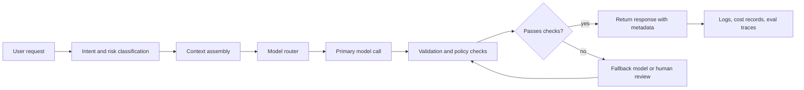

# Introduction to Large Language Models

> **AI/ML Engineering Track** | Complexity: `[COMPLEX]` | Time: 5-6 hours
>
> **Prerequisites**: Phase 1 complete, basic Python, basic HTTP/API concepts, and comfort reading small configuration files

---

## Learning Outcomes

By the end of this module, you will be able to design a model-selection strategy for an LLM-backed application by comparing task complexity, latency, privacy, context, and cost constraints.

By the end of this module, you will be able to evaluate when to use a hosted frontier model, an open-weight model, retrieval-augmented generation, fine-tuning, or a combination of those approaches.

By the end of this module, you will be able to debug common LLM application failures by tracing the request through tokenization, context assembly, model inference, validation, fallback, and logging.

By the end of this module, you will be able to implement a small multi-model gateway that routes requests, estimates cost, applies fallback behavior, and records the reasoning behind routing decisions.

By the end of this module, you will be able to justify model architecture and operating decisions to senior stakeholders using clear trade-off language instead of benchmark-only arguments.

---

## Why This Module Matters

A senior engineer joins an incident review for a customer-support assistant that sounded impressive in a demo but failed on its first high-volume launch day. The assistant answered outdated product questions, spent too much money on simple classification requests, leaked internal wording into customer-facing responses, and timed out whenever a user pasted a long contract. The team did not have one bug. It had an architecture that treated "call the best model" as a strategy.

The incident was preventable because every failure mapped to a basic LLM engineering decision. The stale answers called for retrieval rather than memorized model knowledge. The cost spike called for routing simple tasks to cheaper models. The timeouts called for explicit context budgeting. The inconsistent responses called for evaluation, validation, and fallback design. The team needed more than prompt tips; it needed a working mental model of how large language models behave inside production systems.

This module starts with the mechanism of language models, then builds toward operational decisions. You will first model an LLM as a next-token prediction system, then examine why transformers made that system powerful, and then connect architecture to practical choices such as context windows, hosted APIs, open-weight deployment, RAG, fine-tuning, fallback, and cost control. The goal is not to memorize model names. The goal is to reason about model-backed systems when the model names, prices, and provider limits change.

---

## Core Content

### 1. From Autocomplete to Production System

A large language model is a neural network trained to predict tokens from context, but that short definition hides the engineering consequences. A token is a unit of text such as a word fragment, punctuation mark, or code fragment, and the model receives a sequence of tokens rather than raw human prose. Given that sequence, the model estimates likely next tokens, chooses one according to its decoding settings, appends it to the context, and repeats until the response is complete.

That next-token loop explains both the power and the risk of LLMs. When the training process scales across enormous text and code corpora, the model learns statistical structure that can look like reasoning, translation, summarization, coding, planning, and argumentation. The same mechanism can also produce confident but unsupported text, because the model is optimized to produce plausible continuations rather than guaranteed truth. Senior engineering work begins when you stop treating the answer as magic and start designing the system around that mechanism.

```ascii
+----------------------+      +----------------------+      +----------------------+
| User request         |      | Tokenized context    |      | Model prediction     |
| "Draft a response"   | ---> | [Draft] [a] [...]    | ---> | next-token scores    |
+----------------------+      +----------------------+      +----------------------+
                                                                  |
                                                                  v
+----------------------+      +----------------------+      +----------------------+
| Final response       | <--- | Decoding loop        | <--- | Chosen next token    |
| "Here is a draft..." |      | append and repeat    |      | "Here"              |
+----------------------+      +----------------------+      +----------------------+
```

The first practical consequence is that the prompt is not a decoration around the task; it is part of the model's working input. System instructions, user messages, retrieved documents, tool outputs, examples, and prior conversation all compete for the same context window. If the important evidence is missing, buried, contradictory, or too large to fit, the model cannot reliably use it. Good LLM engineering therefore treats context construction as a first-class design problem.

The second practical consequence is that LLMs are probabilistic components. A database query should return the same rows for the same state and query, while a model call may vary by model version, decoding settings, hidden provider changes, and ambiguous prompt wording. You can reduce variance with lower temperature, clearer schemas, validation, and tests, but you cannot make a generative model behave exactly like a pure function. That difference changes how you monitor, test, and release systems that depend on it.

> **Stop and think:** A user asks, "Can I terminate my enterprise plan early?" Your model has no retrieved contract text, only a general prompt saying it is a helpful support assistant. What kind of answer is the model likely to produce, and why is that answer operationally dangerous?

A useful beginner mental model is "autocomplete with a large learned world model," but a senior engineer must add boundaries to that phrase. The model can combine patterns in powerful ways, but it does not inherently know which source is authoritative for your company, which answer is legally approved, or whether yesterday's policy changed this morning. Those boundaries must be supplied by application design: retrieval for evidence, tools for live state, policies for allowed behavior, validation for output shape, and escalation paths for uncertain cases.

A good LLM application is therefore not just a prompt around a model call. It is a pipeline that prepares context, sends a constrained request, checks the response, handles failure, records decisions, and exposes observability signals. The model is the most visible component, but the surrounding system determines whether the model can be used safely at scale.



This request path is the backbone you will reuse throughout the module. When an LLM system fails, ask where the failure entered the path. Did the classifier route the task incorrectly? Did context assembly omit the relevant document? Did the model choose a plausible but unsupported answer? Did validation fail to catch an unsafe response? Did logging omit the details needed to reproduce the problem? Those questions turn "the AI was wrong" into debuggable engineering work.

### 2. Why Transformers Changed Language Modeling

Before transformers, many neural language systems processed text sequentially. Recurrent neural networks and long short-term memory networks moved through a sequence step by step, carrying a hidden state forward. That structure matched the order of text, but it made long-range dependencies difficult and limited parallel training. If the important clue appeared far from the current word, the model had to preserve that clue through many updates.

Transformers changed the scaling path by using attention. Instead of forcing information to travel through a single sequential state, attention lets each token compute relationships with other tokens in the context. A token such as "it" can assign high attention to "contract," "server," or "customer" depending on the surrounding text. This mechanism allowed much more parallel training and made it practical to scale models, datasets, and compute in ways that older architectures struggled to exploit.

Attention does not mean the model literally "understands" language as a human does, but it does mean the model can build context-sensitive representations. In early layers, the model may track local syntax and token patterns. In deeper layers, it may represent more abstract relationships such as entity roles, code structure, instruction hierarchy, or document themes. Each layer transforms the representation so the final output distribution reflects more than a raw word-frequency table.

| Architecture pattern | How it processes context | Practical strength | Practical limitation |
|---|---|---|---|
| Recurrent model | Moves through tokens mostly in sequence while updating a hidden state | Useful historical foundation for sequence modeling and streaming-style intuition | Harder to parallelize and weaker at preserving distant details across long text |
| Encoder-only transformer | Reads input bidirectionally and produces representations for the whole sequence | Strong for classification, embeddings, search, and text understanding tasks | Not the usual default for open-ended chat generation |
| Decoder-only transformer | Generates one token at a time while attending to earlier tokens in context | Dominant pattern for chat assistants, code assistants, and general generation | Needs careful prompting, validation, and context design because it generates continuations |
| Encoder-decoder transformer | Encodes an input sequence and decodes a separate output sequence | Strong conceptual fit for translation, summarization, and transformation tasks | Less common as the general-purpose chat interface used in most LLM products |

The distinction between encoder-only, decoder-only, and encoder-decoder models matters because it shapes application architecture. If you need embeddings for semantic search, an encoder-style model may be the right component. If you need conversational generation, a decoder-only chat model is usually the primary component. If you need a specialized transformation pipeline, an encoder-decoder design may still be relevant even if the public conversation focuses on chat models.

Here is the high-level path through a decoder-only transformer during generation. The details vary by implementation, but the sequence is stable enough to guide engineering decisions. Text becomes tokens, tokens become vectors, positional information preserves order, attention mixes context, feed-forward layers transform representations, and the output head produces scores over possible next tokens.

```ascii
+------------+     +-------------+     +-------------------+     +----------------+
| Raw text   | --> | Token IDs   | --> | Embeddings + pos  | --> | Attention stack|
+------------+     +-------------+     +-------------------+     +----------------+
                                                                      |
                                                                      v
+----------------+     +-------------------+     +----------------+     +------------+
| Next token     | <-- | Decode strategy   | <-- | Token scores   | <-- | Output head|
+----------------+     +-------------------+     +----------------+     +------------+
```

> **Pause and predict:** If you place a crucial instruction at the very beginning of a long prompt, then add many pages of loosely related documents before the user request, what failure mode might appear? Predict the behavior before reading the next paragraph.

The model may ignore, dilute, or partially follow the early instruction because context is not the same as perfect memory. Long context windows are useful, but the model still has to allocate attention across everything provided. Important instructions should be explicit, nearby when possible, non-contradictory, and reinforced through output constraints. In production, you should also test long-context behavior with representative prompts rather than assuming the advertised context size equals reliable use of every token.

A worked example makes the mechanism concrete. Suppose the user asks an assistant to summarize a service-level agreement, and the application adds three retrieved chunks to the prompt. Chunk one contains the current uptime commitment, chunk two contains a deprecated policy, and chunk three contains pricing details. If the prompt simply says "answer the user's question using the context," the model may blend old and new language. A stronger prompt labels each chunk with freshness and authority, asks the model to cite the chunk it used, and validates that the answer references the current policy.

```text
Weak context assembly:
User question: What uptime do we promise?
Context: Old SLA says 99.5%. New SLA says 99.9%. Pricing appendix follows.

Stronger context assembly:
User question: What uptime do we promise?
Source A: current_sla.md, updated 2026-03-12, authoritative: uptime is 99.9%.
Source B: old_sla.md, deprecated 2025-08-01, not authoritative: uptime was 99.5%.
Instruction: Answer only from authoritative current sources and name the source used.
```

The stronger version does not make the model infallible, but it makes the desired reasoning path easier. It reduces ambiguity, marks source authority, and creates a response shape that can be checked. That is the pattern you will reuse throughout this track: do not ask the model to infer hidden operational rules when the system can encode those rules directly.

### 3. Training, Adaptation, and Knowledge Boundaries

Pre-training is the expensive stage where a model learns broad language and code patterns from massive datasets. The objective is usually some version of predicting missing or next tokens across large corpora. The result is a base model with broad statistical knowledge, but a base model is not automatically a helpful assistant. If you ask a base model a question, it may continue the pattern of questions rather than answer the specific request.

Instruction tuning adapts a base model to follow requests. The training data contains examples of instructions and desirable responses, so the model learns conversational behavior, formatting expectations, and task completion patterns. Reinforcement learning from human feedback and related preference-optimization techniques further shape outputs toward responses that humans rate as more helpful, safer, or more aligned with policy. These stages are why chat models feel different from raw completion models.

Fine-tuning is often misunderstood as "teach the model new facts." It can add domain behavior, terminology, style, and task patterns, but it is usually the wrong first choice for frequently changing knowledge. If your product catalog changes every day, retraining or fine-tuning for each update is expensive and brittle. Retrieval-augmented generation is usually a better fit because the application retrieves current documents at request time and places the relevant evidence into context.

| Need | Better default | Why this is usually the right first move | When to reconsider |
|---|---|---|---|
| Answer questions from changing company docs | Retrieval-augmented generation | The application can update the index without retraining the model whenever documents change | Reconsider if answers require a highly specialized response style or repeated domain-specific reasoning |
| Make every answer follow a specific support tone | Fine-tuning or strong prompting with evaluation | The goal is behavior and style rather than fresh factual knowledge | Reconsider if the tone can be enforced with templates, examples, and lightweight validation |
| Extract fields from similar invoices | Prompted structured output, then fine-tune if needed | The task can often be solved with schemas, examples, and validation before paying for model adaptation | Reconsider when volume is high and examples are stable enough to justify fine-tuning |
| Analyze live account state | Tool use or application-side API calls | The model should not guess live state from training data because the database is authoritative | Reconsider only for summaries after the authoritative tool result has been fetched |
| Reduce latency for a narrow repeated task | Smaller model, caching, or fine-tuning | Routing and caching may solve cost and speed before training work is justified | Reconsider when the narrow task has measurable error patterns that adaptation can fix |

The phrase "the model knows" is dangerous in engineering conversations. A model may encode patterns from training, but it does not know whether a pattern is current, authorized, complete, or applicable to your user's contract. When factual correctness matters, the system should provide the evidence and ask the model to reason over that evidence. When live state matters, the system should call tools or databases and let the model explain the result, not invent the state.

> **Stop and think:** Your legal team asks for an assistant that answers questions about contracts signed last week. A teammate proposes fine-tuning a model on last quarter's contract templates. Which part of the requirement makes that proposal risky, and what architecture would you recommend first?

The best answer is usually a hybrid. Use a capable general model for reasoning, retrieval for current documents, tools for live state, fine-tuning only when you have stable examples of behavior that prompting cannot reliably produce, and evaluation to prove the design works. This is not indecision. It is a separation of concerns: the model reasons, retrieval supplies evidence, tools supply state, validation enforces shape, and monitoring catches drift.

Context windows sit at the boundary between training and application design. A large context window lets you include more evidence, but it does not remove the need to choose evidence well. A small context window forces chunking and retrieval earlier. In both cases, the same question matters: which tokens are useful enough to pay for, wait for, and trust?

| Context design choice | Benefit | Failure mode | Senior-level mitigation |
|---|---|---|---|
| Include the whole document | Simple implementation and fewer retrieval decisions | Higher latency, higher cost, and possible distraction from irrelevant sections | Use section summaries, anchors, and tests that check whether the model uses the right evidence |
| Retrieve top matching chunks | Lower cost and better focus on likely relevant passages | Retrieval may miss the answer if chunking or embedding quality is poor | Evaluate retrieval separately with known questions and expected source chunks |
| Summarize history | Keeps long conversations within budget | Summary may omit a detail that later becomes important | Store structured state separately from prose summaries and retain source references |
| Use a very small context | Fast and cheap for narrow tasks | The model lacks enough evidence for nuanced requests | Route only narrow tasks to the small-context path and escalate when evidence is insufficient |
| Use a very large context | Enables document-scale reasoning and codebase analysis | The model can get distracted or produce slower, more expensive answers | Budget context deliberately and measure quality against shorter focused prompts |

A practical rule is to design context as a budget, not as a bucket. Every token should earn its place by improving answer quality, reducing risk, or enabling validation. If a retrieved passage is not relevant, it is not harmless; it can distract the model, increase cost, and make debugging harder. Context engineering is the craft of deciding what the model should see and what the application should handle outside the model.

### 4. The Model Landscape as an Engineering Decision

Model names change quickly, so this module teaches categories rather than asking you to memorize a vendor catalog. Hosted frontier models are usually strongest when you need high reasoning quality, broad tool support, low operational burden, or fast iteration. Hosted smaller models are useful for classification, rewriting, extraction, and other high-volume tasks where speed and cost matter more than deep reasoning. Open-weight models are attractive when privacy, customization, offline deployment, or cost at scale outweigh the operational complexity of running inference.

A model decision is rarely one-dimensional. The cheapest model may require more retries, more validation, or more human review. The most capable model may be too slow or expensive for routine requests. The largest context model may hide retrieval problems during demos but become costly under production traffic. A self-hosted model may satisfy privacy requirements while creating new responsibilities around GPU capacity, patching, monitoring, and model-serving reliability.

| Decision axis | Hosted frontier model | Hosted smaller model | Self-hosted open-weight model |
|---|---|---|---|
| Capability on complex reasoning | Usually strongest default for ambiguous planning, coding, and synthesis | Usually adequate for simple or well-scoped transformations | Depends heavily on model choice, quantization, hardware, and prompt design |
| Operational effort | Provider handles serving, scaling, and many platform concerns | Provider handles serving while cost and latency are easier to control | Your team owns serving stack, capacity planning, updates, and incident response |
| Data control | Governed by provider contract, region, retention, and enterprise controls | Same provider-governance questions apply, often with lower per-request cost | Data can stay inside your infrastructure if deployment is designed correctly |
| Cost pattern | Higher per-token cost but less infrastructure ownership | Lower per-token cost and good fit for routing strategies | Potentially cheaper at high sustained utilization but expensive to operate poorly |
| Customization | Prompting, tools, retrieval, and provider-specific fine-tuning options | Similar patterns, often less capable on edge cases | Fine-tuning and serving control are stronger, but require ML operations maturity |
| Failure handling | Provider outages, rate limits, model updates, and policy behavior must be managed | Same class of risks, often with lower blast radius per request | Hardware failures, queueing, model regressions, and deployment errors become your responsibility |

For production work, the strongest pattern is often a model portfolio rather than one model. Route simple classification to a fast and cheap model. Route high-risk legal or security questions to a stronger model with retrieval and strict validation. Route privacy-sensitive internal data to a self-hosted or dedicated environment. Route fallback requests to a second provider when the primary is unavailable. A gateway makes these choices explicit instead of scattering provider calls across the codebase.

> **Pause and predict:** Your team routes every request to the most capable model because the demo quality is excellent. Traffic grows by a factor of ten, and most requests are short ticket-tagging tasks. What two metrics will likely become painful first, and what routing change would you test?

The answer is usually cost and latency. Ticket tagging often does not require the strongest reasoning model, so a smaller model with a schema-constrained output may achieve acceptable quality faster and cheaper. The senior move is not to switch blindly. Build an evaluation set of real tickets, compare quality, latency, retry rate, and cost across candidate models, then set a routing threshold and monitor production drift.

Benchmarks are useful, but they are not product requirements. A model can score well on public reasoning benchmarks and still fail your company's tone, domain vocabulary, JSON schema, latency target, or refusal policy. Conversely, a smaller model can be excellent for a narrow internal task if the prompt, examples, and validation are strong. Use benchmarks to choose candidates, then use your own evaluation harness to choose production behavior.

A model-selection record should capture the reasoning behind a decision. This record does not need to be bureaucratic, but it should be clear enough for another engineer to understand why the team made the trade-off. Include the task, risk level, candidate models, evaluation set, quality threshold, cost estimate, fallback behavior, and monitoring plan. Future incidents become easier to analyze when these decisions are written down.

```yaml
task: support_ticket_tagging
risk_level: medium
primary_model: fast-hosted-small
fallback_model: hosted-frontier
quality_gate:
  dataset: evals/support_ticket_tags.yaml
  minimum_exact_match: 0.92
routing_policy:
  use_primary_when: ticket_length_tokens < 1200 and no_security_keywords_detected
  escalate_when: confidence < 0.80 or validation_fails
observability:
  log_fields:
    - route
    - prompt_tokens
    - completion_tokens
    - validation_status
    - fallback_reason
```

This YAML is not a universal standard, but it shows the level of specificity you want. A routing decision should be testable. If you cannot name the dataset, quality threshold, escalation rule, or monitoring fields, the system probably depends on intuition that will not survive production pressure.

### 5. Worked Example: Debugging a Failing LLM Feature

Consider a feature that summarizes customer escalation threads for support managers. The team starts with a single hosted model call, pastes the full thread into the prompt, and asks for a concise summary with risks and next actions. In testing, the feature looks good. In production, summaries sometimes omit the latest customer message, confuse old and new contract terms, and exceed the expected length.

A junior response might be to rewrite the prompt with stronger words such as "always" and "never." A senior response is to trace the request path. First, inspect the input size and whether truncation is happening before the model call. Second, inspect the order of messages and whether the newest customer message appears near the end. Third, inspect whether contract terms are mixed with no authority labels. Fourth, inspect whether output validation checks length and required fields. Fifth, inspect whether the logs include enough context metadata to reproduce the issue.

```ascii
+--------------------------+
| Symptom                  |
| Latest message omitted   |
+------------+-------------+
             |
             v
+--------------------------+
| Check context assembly   |
| Was the thread truncated?|
+------------+-------------+
             |
             v
+--------------------------+
| Check ordering           |
| Is newest content clear? |
+------------+-------------+
             |
             v
+--------------------------+
| Check authority labels   |
| Are old terms marked old?|
+------------+-------------+
             |
             v
+--------------------------+
| Check validation         |
| Are required fields kept?|
+--------------------------+
```

A better implementation changes the prompt and the surrounding pipeline. The application summarizes older messages into structured state, preserves the newest messages verbatim, labels retrieved contract snippets as current or deprecated, asks for a JSON object with required fields, validates that JSON, and falls back to a stronger model or human review when validation fails. The model still generates text, but the system no longer asks it to solve avoidable ambiguity.

```json
{
  "customer_sentiment": "frustrated",
  "current_blocker": "renewal terms differ from the customer's signed amendment",
  "latest_customer_message_used": true,
  "risk_level": "high",
  "recommended_next_action": "send to account owner with current amendment attached"
}
```

The worked example aligns with the mental model from earlier sections. The failure was not "LLMs are unreliable" in the abstract. The failure came from weak context budgeting, poor source labeling, missing validation, and insufficient logging. Those are engineering defects you can fix. The same debugging method applies to chatbots, copilots, document analysis, code review assistants, and internal workflow agents.

Now apply the same reasoning to a different problem. A finance team asks for an assistant that classifies incoming vendor emails as invoice, renewal, tax, legal, or other. The task is narrow, the labels are known, the data is sensitive, and cost matters because volume is high. You should not automatically choose the most capable hosted model. You should evaluate a smaller model, enforce a strict schema, redact or isolate sensitive fields, and escalate uncertain cases rather than forcing the model to guess.

> **Stop and decide:** For the finance-email classifier, would you choose RAG, fine-tuning, a smaller hosted model, or a self-hosted model as the first experiment? Write down your choice and the evidence you would collect before changing it.

There is no single correct answer without the company's constraints, but there is a correct decision process. If privacy rules allow a hosted provider and the labels are straightforward, start with a small hosted model plus schema validation and an evaluation set. If privacy rules prohibit external processing, start with a self-hosted open-weight model or a dedicated private deployment. If the classifier fails on stable domain-specific patterns after prompt and schema improvements, consider fine-tuning. If the labels depend on changing vendor policy documents, add retrieval.

### 6. API Integration, Safety Boundaries, and Gateway Design

Your first direct API integration should be boring on purpose. It should load keys from environment variables, send a small request, set explicit limits, handle errors, and avoid placing secrets in source code. The code below uses a mock fallback so the file remains runnable even when you do not have an API key configured. In a real project, you would replace the mock path with the provider SDK that your organization has approved.

```python
import os
from dataclasses import dataclass


@dataclass
class ModelResponse:
    provider: str
    text: str
    prompt_tokens: int
    completion_tokens: int
    estimated_cost_usd: float


def estimate_cost(prompt_tokens: int, completion_tokens: int, input_per_million: float, output_per_million: float) -> float:
    input_cost = (prompt_tokens / 1_000_000) * input_per_million
    output_cost = (completion_tokens / 1_000_000) * output_per_million
    return round(input_cost + output_cost, 6)


def call_mock_model(prompt: str) -> ModelResponse:
    words = prompt.split()
    prompt_tokens = max(1, int(len(words) / 0.75))
    completion = "Transformers use attention to weigh relevant tokens in context before predicting the next token."
    completion_tokens = max(1, int(len(completion.split()) / 0.75))
    return ModelResponse(
        provider="mock-local",
        text=completion,
        prompt_tokens=prompt_tokens,
        completion_tokens=completion_tokens,
        estimated_cost_usd=estimate_cost(prompt_tokens, completion_tokens, 0.10, 0.30),
    )


def explain_transformers() -> None:
    api_key = os.getenv("LLM_API_KEY")
    prompt = "Explain transformer attention in one sentence for a backend engineer."
    if not api_key:
        response = call_mock_model(prompt)
    else:
        response = call_mock_model(prompt)
    print(f"provider={response.provider}")
    print(f"cost={response.estimated_cost_usd}")
    print(response.text)


if __name__ == "__main__":
    explain_transformers()
```

Run this locally from the repository root or a scratch directory after creating a virtual environment. The command uses `.venv/bin/python` explicitly because this project standardizes on the repository virtual environment rather than whichever Python happens to appear first on your shell path. The mock response proves the control flow, cost calculation, and output handling before you wire in a live provider.

```bash
.venv/bin/python llm_intro_demo.py
```

A production gateway expands the same idea into a policy-controlled router. The application sends a normalized request to the gateway, not directly to a provider-specific client. The gateway classifies the task, chooses a model, assembles context, enforces token and cost budgets, sends the call, validates the response, triggers fallback when needed, and logs enough metadata for evaluation. This boundary prevents model calls from spreading through the codebase as unreviewable one-off integrations.

The gateway should also encode safety boundaries. Secrets must stay in environment variables or secret managers, never in code or client-side bundles. Sensitive data should be redacted, isolated, or routed according to policy. Responses should be validated before downstream systems trust them. High-risk outputs should include citations, evidence, or human review. When the model is uncertain, the system should make escalation cheap rather than rewarding confident guesses.

| Gateway responsibility | Why it matters | Example implementation choice |
|---|---|---|
| Normalize requests | Keeps application code independent from provider-specific message formats | Convert internal request objects into provider messages inside one adapter layer |
| Route by task and risk | Prevents costly or unsafe one-model-for-everything behavior | Use cheap models for low-risk extraction and stronger models for high-risk reasoning |
| Budget tokens and cost | Stops hidden context growth from becoming an availability or finance incident | Estimate tokens before the call and reject or summarize oversized requests |
| Validate outputs | Converts probabilistic text into application-safe structures | Require JSON schemas, allowed labels, length limits, and citation fields where needed |
| Handle fallback | Makes provider errors and model failures survivable | Retry with backoff, switch providers, degrade gracefully, or escalate to humans |
| Log evaluation metadata | Makes quality measurable after launch | Record route, model, token counts, validation status, fallback reason, and source IDs |

A gateway is not only for large companies. Even a small project benefits from centralizing model choice and failure handling early. Without a gateway, every feature team writes its own prompt, provider client, error handling, and logging. That fragmentation makes costs unpredictable and incidents hard to debug. With a gateway, the team can improve routing, validation, and observability in one place.

You should now have the full conceptual path. LLMs generate tokens from context. Transformers made large-scale context-sensitive generation practical. Training and adaptation determine broad capability and behavior, while retrieval and tools supply current evidence and live state. Model selection is an engineering trade-off, not a leaderboard contest. A gateway turns those trade-offs into explicit, testable production behavior.

---

## Did You Know?

1. The original transformer paper made parallel training a central advantage, which is one reason transformer-based models scaled so effectively compared with older sequential architectures.

2. Many production LLM incidents are context incidents rather than model incidents, because the answer can only be as grounded as the evidence and instructions supplied to the model.

3. A small model can outperform a larger model on a narrow production task when the prompt, schema, examples, evaluation set, and routing policy match the task well.

4. Long context windows change what is possible, but they do not remove the need for retrieval quality, authority labeling, source freshness, and output validation.

---

## Common Mistakes

| Mistake | Why it fails in practice | Better engineering response |
|---|---|---|
| Treating the model as a database | The model may generate plausible text from training patterns without knowing whether the fact is current, authorized, or applicable | Retrieve authoritative sources or call live tools, then ask the model to reason over that evidence |
| Sending every request to the strongest model | Cost and latency rise quickly, and simple tasks do not always benefit from frontier-level reasoning | Build a routing policy that matches model capability to task risk, complexity, and validation needs |
| Using fine-tuning for changing knowledge | Fine-tuning is slow and brittle when the facts change frequently or require citations | Use retrieval for dynamic knowledge and reserve fine-tuning for stable behavior, style, or repeated task patterns |
| Filling the context window because space is available | Irrelevant context can distract the model, increase cost, slow responses, and hide retrieval problems | Treat context as a budget and include evidence that improves quality, safety, or validation |
| Trusting benchmark rankings as production proof | Public benchmarks rarely match your data, tone, schemas, latency targets, or risk constraints | Create an evaluation set from representative user requests and compare models against your acceptance criteria |
| Letting provider calls spread through feature code | Scattered integrations make routing, logging, validation, fallback, and cost control inconsistent | Centralize model access behind a gateway or service boundary with policy-driven adapters |
| Logging only the final answer | Incidents become hard to reproduce when route, model, source IDs, token counts, and validation status are missing | Log structured metadata that explains how the request was assembled, routed, validated, and billed |
| Asking the model to decide high-risk policy alone | The model may optimize for helpfulness or fluency when the correct action is refusal, escalation, or evidence gathering | Encode policy in application logic, require citations or tool results, and escalate uncertain high-risk cases |

---

## Quiz

1. **Your team builds a benefits assistant for employees. It answers questions about current parental-leave policy, but the policy changes every quarter. A teammate proposes fine-tuning a model on the latest handbook PDF. What architecture would you recommend first, and what failure are you avoiding?**

   <details>
   <summary>Answer</summary>

   Start with retrieval-augmented generation over the authoritative handbook or policy source, not fine-tuning as the first move. The core requirement is current, source-grounded knowledge that changes regularly. Fine-tuning may teach style or repeated behavior, but it is a poor default for facts that change every quarter because the model can continue producing outdated policy language. A stronger design retrieves the current policy section, labels it as authoritative, asks the model to answer from that section, and logs the source used.

   </details>

2. **A support-ticket classifier routes all tickets to a frontier reasoning model. Quality is good, but the monthly bill grows sharply after launch and most tickets are short password-reset or billing-category messages. How would you redesign the routing policy without weakening production quality blindly?**

   <details>
   <summary>Answer</summary>

   Build an evaluation set from real tickets, then test a smaller cheaper model with strict label schemas against the frontier model. If the smaller model meets the quality threshold on low-risk simple tickets, route those tickets to it and escalate long, ambiguous, sensitive, or low-confidence cases to the stronger model. This preserves quality through measured routing rather than guesswork. The gateway should log route, confidence, validation failures, cost, and fallback reason so the team can monitor drift.

   </details>

3. **A document assistant has a two-hundred-page contract in context, but it answers using a deprecated clause from the middle of the document instead of the signed amendment at the end. What should you inspect before blaming the provider model?**

   <details>
   <summary>Answer</summary>

   Inspect context assembly, source ordering, authority labels, retrieval quality, and prompt instructions. The model may have received conflicting clauses with no clear signal about which source is current. A better design labels the signed amendment as authoritative, marks deprecated sections clearly, retrieves the most relevant clauses instead of dumping everything blindly, and requires the answer to cite the source used. You should also add tests that check whether the assistant uses current amendments when old and new clauses conflict.

   </details>

4. **A developer says, "The model already saw our public docs during training, so we do not need retrieval for product questions." How would you respond in an architecture review?**

   <details>
   <summary>Answer</summary>

   Training exposure is not an authority guarantee. The model may have seen old docs, partial docs, copied snippets, or no relevant version at all, and it does not know which content is current for your product. Retrieval supplies fresh authoritative evidence at request time and allows citations, source logging, and targeted updates without retraining. For product support, the safer architecture is retrieval over controlled documentation plus validation and escalation for missing evidence.

   </details>

5. **Your gateway sometimes returns invalid JSON to a downstream workflow engine, causing failed automations. The prompt says, "Return valid JSON only." What changes would you make to reduce the failure rate and limit blast radius?**

   <details>
   <summary>Answer</summary>

   Add schema-constrained output where the provider supports it, validate the response before passing it downstream, and route validation failures to retry, fallback, or human review. The prompt should include the schema and allowed values, but the application must still parse and enforce the contract. The gateway should log validation status and failure reasons. This converts a probabilistic generation problem into a controlled boundary where invalid output cannot silently enter the workflow engine.

   </details>

6. **A privacy review rejects sending raw finance emails to an external hosted model, but the finance team still wants automatic classification. What model and system options should you compare, and what evidence should drive the decision?**

   <details>
   <summary>Answer</summary>

   Compare self-hosted open-weight models, private or dedicated hosted deployments if allowed by policy, and redaction-before-hosted-processing if the review permits it. The decision should be driven by classification quality on representative emails, latency, operational effort, data-handling policy, audit requirements, and total cost. If a self-hosted model meets the label-quality threshold with schema validation, it may be the best privacy-aligned option. If it does not, the team may need a dedicated environment, stronger redaction, or human review for sensitive cases.

   </details>

7. **A manager asks why the team needs a gateway instead of letting each product feature call its preferred model directly. What production risks would you cite, and what gateway capabilities address them?**

   <details>
   <summary>Answer</summary>

   Direct scattered calls create inconsistent routing, duplicated provider code, uneven logging, weak cost control, and different safety behavior across features. A gateway centralizes model adapters, task routing, token budgets, validation, fallback, and evaluation metadata. This makes provider changes easier, incidents easier to reproduce, and costs easier to manage. The gateway also gives security and platform teams one boundary to review instead of many hidden integrations.

   </details>

---

## Hands-On Exercise

**Task**: Build a small Multi-Model LLM Gateway that routes requests by task type, estimates request cost, validates structured responses, and applies fallback when the primary route fails.

This exercise is intentionally local-first. You can run the whole gateway with mock providers, then replace the provider functions with real SDK calls after your organization has approved provider use and secrets handling. The goal is to practice the architecture pattern, not to spend money on a model call before you understand the moving parts.

### Step 1: Create the gateway data model

Create a file named `llm_gateway.py` and start with request, route, and response objects. The data model gives the rest of the exercise a stable contract, which is the same reason production teams put a gateway in front of provider-specific SDKs. Keep provider details out of the application request so routing can change without rewriting feature code.

```python
from dataclasses import dataclass
from typing import Literal


TaskType = Literal["classify", "summarize", "reason"]
RiskLevel = Literal["low", "medium", "high"]


@dataclass
class GatewayRequest:
    task_type: TaskType
    risk_level: RiskLevel
    prompt: str
    max_output_tokens: int = 300


@dataclass
class GatewayRoute:
    primary_model: str
    fallback_model: str
    reason: str


@dataclass
class GatewayResponse:
    model: str
    text: str
    prompt_tokens: int
    completion_tokens: int
    estimated_cost_usd: float
    fallback_used: bool
    route_reason: str
```

Success criteria for this step:

- [ ] `GatewayRequest`, `GatewayRoute`, and `GatewayResponse` exist as dataclasses.
- [ ] `task_type` separates classification, summarization, and reasoning requests.
- [ ] `risk_level` is represented explicitly rather than hidden inside the prompt.
- [ ] No provider API key or secret appears anywhere in the file.

### Step 2: Add token and cost estimation

Add a lightweight estimator so the gateway can reason about cost before you wire in real providers. This estimator is not a replacement for provider billing data, but it is good enough to teach the budget pattern. Production systems should reconcile estimates with provider usage reports.

```python
def estimate_tokens(text: str) -> int:
    return max(1, int(len(text.split()) / 0.75))


def estimate_cost(prompt_tokens: int, completion_tokens: int, input_per_million: float, output_per_million: float) -> float:
    input_cost = (prompt_tokens / 1_000_000) * input_per_million
    output_cost = (completion_tokens / 1_000_000) * output_per_million
    return round(input_cost + output_cost, 6)
```

Success criteria for this step:

- [ ] `estimate_tokens("hello world")` returns a positive integer.
- [ ] `estimate_cost(...)` accounts for input tokens and output tokens separately.
- [ ] The code uses clear per-million-token pricing inputs rather than hard-coding one global price.
- [ ] The estimator can be tested without any network access or provider account.

### Step 3: Implement a routing policy

Add a routing function that chooses models by task and risk. The exact names can be placeholders because this lab is about policy design. Notice that the route includes a reason. That reason is valuable in logs, dashboards, and incident reviews because it explains why the gateway made a choice.

```python
def choose_route(request: GatewayRequest) -> GatewayRoute:
    if request.risk_level == "high":
        return GatewayRoute(
            primary_model="frontier-reasoning",
            fallback_model="frontier-backup",
            reason="high-risk request requires strongest reasoning and conservative fallback",
        )
    if request.task_type == "classify":
        return GatewayRoute(
            primary_model="fast-small",
            fallback_model="frontier-reasoning",
            reason="classification is narrow enough for a cheaper primary model",
        )
    if request.task_type == "summarize":
        return GatewayRoute(
            primary_model="balanced-summary",
            fallback_model="frontier-reasoning",
            reason="summarization benefits from balanced quality, latency, and cost",
        )
    return GatewayRoute(
        primary_model="frontier-reasoning",
        fallback_model="frontier-backup",
        reason="open-ended reasoning needs the strongest available route",
    )
```

Success criteria for this step:

- [ ] High-risk requests always route to a stronger primary model.
- [ ] Low-risk classification requests route to a cheaper model first.
- [ ] Every route includes a human-readable reason.
- [ ] The fallback model differs from the primary model for each route.

### Step 4: Add mock providers and validation

Add mock provider behavior so you can test fallback without real API calls. The `fast-small` mock intentionally returns an invalid classification for one kind of prompt, which lets you verify that validation catches the problem. In production, this validation boundary protects downstream systems from malformed model output.

```python
ALLOWED_LABELS = {"invoice", "renewal", "tax", "legal", "other"}


def call_model(model: str, prompt: str, max_output_tokens: int) -> str:
    if model == "fast-small" and "ambiguous" in prompt.lower():
        return "maybe billing or legal"
    if model == "fast-small":
        return "invoice"
    if model == "balanced-summary":
        return "The thread concerns a renewal blocker, a frustrated customer, and a needed account-owner follow-up."
    return "legal"


def validate_response(request: GatewayRequest, text: str) -> bool:
    if request.task_type == "classify":
        return text.strip().lower() in ALLOWED_LABELS
    if request.task_type == "summarize":
        return 10 <= len(text.split()) <= request.max_output_tokens
    return len(text.strip()) > 0
```

Success criteria for this step:

- [ ] Classification responses are checked against a fixed allowed-label set.
- [ ] Summaries are checked for a reasonable length boundary.
- [ ] The validation function is separate from the model-call function.
- [ ] You can trigger a validation failure by including the word `ambiguous` in a classification prompt.

### Step 5: Connect routing, provider calls, validation, and fallback

Add the main `handle_request` function. This is the gateway's control loop. It chooses a route, calls the primary model, validates the output, and calls the fallback model if validation fails. It also returns token and cost metadata so callers can inspect what happened.

```python
PRICE_TABLE = {
    "fast-small": (0.10, 0.30),
    "balanced-summary": (0.60, 1.80),
    "frontier-reasoning": (3.00, 12.00),
    "frontier-backup": (3.50, 14.00),
}


def build_response(
    request: GatewayRequest,
    model: str,
    text: str,
    fallback_used: bool,
    route_reason: str,
) -> GatewayResponse:
    prompt_tokens = estimate_tokens(request.prompt)
    completion_tokens = estimate_tokens(text)
    input_price, output_price = PRICE_TABLE[model]
    return GatewayResponse(
        model=model,
        text=text,
        prompt_tokens=prompt_tokens,
        completion_tokens=completion_tokens,
        estimated_cost_usd=estimate_cost(prompt_tokens, completion_tokens, input_price, output_price),
        fallback_used=fallback_used,
        route_reason=route_reason,
    )


def handle_request(request: GatewayRequest) -> GatewayResponse:
    route = choose_route(request)
    primary_text = call_model(route.primary_model, request.prompt, request.max_output_tokens)
    if validate_response(request, primary_text):
        return build_response(request, route.primary_model, primary_text, False, route.reason)

    fallback_text = call_model(route.fallback_model, request.prompt, request.max_output_tokens)
    if not validate_response(request, fallback_text):
        raise ValueError("fallback model also failed validation")

    return build_response(request, route.fallback_model, fallback_text, True, route.reason)
```

Success criteria for this step:

- [ ] The primary model is tried before the fallback model.
- [ ] Fallback happens only after validation fails.
- [ ] The response records whether fallback was used.
- [ ] The response includes prompt tokens, completion tokens, estimated cost, and route reason.

### Step 6: Add runnable examples

Add a small `main` block to exercise three scenarios. The first request should use the cheap classification path. The second request should trigger fallback because the mock small model returns an invalid label. The third request should route directly to a stronger model because the request is high risk.

```python
def demo() -> None:
    requests = [
        GatewayRequest(task_type="classify", risk_level="low", prompt="Classify this vendor email: attached invoice for March."),
        GatewayRequest(task_type="classify", risk_level="low", prompt="Classify this ambiguous vendor email about contract billing."),
        GatewayRequest(task_type="reason", risk_level="high", prompt="Assess legal risk in this disputed contract clause."),
    ]

    for item in requests:
        response = handle_request(item)
        print("---")
        print(f"model={response.model}")
        print(f"fallback_used={response.fallback_used}")
        print(f"cost={response.estimated_cost_usd}")
        print(f"reason={response.route_reason}")
        print(f"text={response.text}")


if __name__ == "__main__":
    demo()
```

Run the gateway:

```bash
.venv/bin/python llm_gateway.py
```

Success criteria for this step:

- [ ] The first example returns `model=fast-small` with `fallback_used=False`.
- [ ] The ambiguous classification example returns a fallback model with `fallback_used=True`.
- [ ] The high-risk reasoning example routes to a frontier-style model immediately.
- [ ] The command runs locally without network access.

### Step 7: Evaluate and extend the gateway

Now treat your gateway like a production component rather than a script. Add at least six test cases in a separate file or a small test function, covering simple classification, ambiguous classification, summarization, high-risk reasoning, empty prompts, and oversized prompts. Decide how the gateway should behave for each case before you change the code.

Success criteria for this step:

- [ ] At least six representative requests exist as an evaluation set.
- [ ] Each evaluation case names the expected model route or expected fallback behavior.
- [ ] At least one case checks that invalid classification labels cannot pass validation.
- [ ] At least one case checks that high-risk requests do not use the cheap primary model.
- [ ] At least one case records cost metadata and confirms it is non-negative.
- [ ] You can explain one routing trade-off you would change for a privacy-sensitive deployment.

### Step 8: Write the design note

Write a short design note beside the code explaining your routing policy. This is not busywork. Production LLM systems change quickly, and future maintainers need to know which assumptions were intentional. Include the task types, model categories, fallback strategy, validation rules, cost-estimation limitations, and one privacy improvement you would make before handling real user data.

Success criteria for this step:

- [ ] The design note explains why classification uses a cheaper primary route.
- [ ] The design note explains why high-risk reasoning bypasses the cheap route.
- [ ] The design note identifies what the mock cost estimator does not capture.
- [ ] The design note names the metadata you would log in production.
- [ ] The design note includes one concrete privacy control such as redaction, self-hosting, private deployment, or data-retention review.

---

## Next Module

Next: [Tokenization & Text Processing](./module-1.2-tokenization-and-text-processing/)

---

## Sources

- [arxiv.org: 1706.03762](https://arxiv.org/abs/1706.03762) — The paper directly describes the Transformer as an architecture based solely on attention mechanisms with improved parallelizability.
- [arxiv.org: 2203.02155](https://arxiv.org/abs/2203.02155) — The InstructGPT paper directly describes training with human feedback and preference modeling.
- [arxiv.org: 2212.08073](https://arxiv.org/abs/2212.08073) — Anthropic's Constitutional AI paper directly describes this training approach.
- [cloud.google.com: long context](https://cloud.google.com/vertex-ai/generative-ai/docs/long-context) — Google Cloud documentation directly describes Gemini long-context offerings and million-token-scale context windows.
- [platform.openai.com: how we use your data](https://platform.openai.com/docs/models/how-we-use-your-data) — The OpenAI data-controls page directly states both the default training policy and the 30-day abuse-monitoring retention period.
- [arxiv.org: 2310.06825](https://arxiv.org/abs/2310.06825) — The paper directly states the Apache 2.0 license and reports outperforming Llama 2 13B on its evaluated benchmarks.
- [Language Models are Few-Shot Learners](https://openai.com/index/language-models-are-few-shot-learners/) — This paper introduced GPT-3 and is a key reference for scale, few-shot prompting, and early frontier-model behavior.
