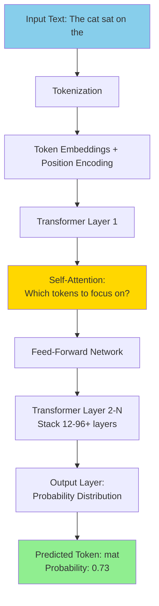

> **AI/ML Engineering Track** | Complexity: `[COMPLEX]` | Time: 5-6
**Reading Time**: 5-6 hours
**Prerequisites**: Phase 1 complete

---

## The Night That Changed Everything: Inside OpenAI's gpt-5 Launch

**San Francisco. March 14, 2023. 9:47 AM.**

Sam Altman stood backstage at OpenAI's headquarters, watching the livestream numbers climb. In the next hour, they would demonstrate something that many researchers had thought was years away: an AI that could pass the bar exam, explain jokes, analyze images, and write working code from a photograph of a hand-drawn sketch.

What viewers didn't see was the chaos of the previous months. Teams working around the clock. Engineers sleeping under desks. A model so capable that even its creators weren't entirely sure what it could do.

When gpt-5 was released, the AI world fractured into before and after. Google declared "Code Red" and rushed their Bard release. Microsoft integrated gpt-5 into everything from Bing to Excel. Anthropic accelerated Claude development. And thousands of startups pivoted overnight—from building their own LLMs to building ON LLMs.

The questions on everyone's mind: How does this work? What makes these models so capable? And how do you choose between them?

This module answers those questions. You've learned to USE AI effectively in Phase 1. Now it's time to understand HOW AI works—the architectures, the training, the trade-offs. Because once you understand the machinery, you'll wield it far more effectively.

---

## What You'll Be Able to Do

By the end of this module, you will:
- Understand the transformer architecture at a high level
- Know the major LLM families (GPT, Claude, Llama, Mistral)
- Understand pre-training vs fine-tuning
- Compare open-source vs proprietary models
- Master context windows and their implications
- Make your first direct API integration
- Choose the right model for your use case

---

## Introduction

You've learned to **USE** AI effectively (Phase 1). Now it's time to understand **HOW** AI works.

**Phase 2 shifts focus**: From AI tools → AI fundamentals

**Why this matters**:
- Better prompts when you understand model limitations
- Smarter architecture decisions for your projects
- Ability to choose the right model for the task
- Foundation for building AI systems (Phase 3+)

---

## What Are Large Language Models?

### The Simple Definition

**Large Language Model (LLM)**: A neural network trained on massive amounts of text to predict the next word in a sequence.

That's it. Everything else builds on this simple idea.

Think of it like a sophisticated autocomplete on steroids. Your phone's keyboard predicts "you" after you type "thank"—that's the same fundamental mechanism, just far simpler. LLMs take this concept and scale it to billions of parameters, trained on trillions of words, until something magical emerges: the ability to reason, code, translate, and create.

Imagine playing a word association game with someone who has read every book ever written, every website ever published, every piece of code ever committed. That's roughly what an LLM is—a statistical distillation of human written knowledge into a mathematical function.

**Example**:
```
Input: "The capital of France is"
LLM predicts: "Paris" (high probability)
```

### The Not-So-Simple Reality

LLMs are:
- **Large**: Billions to trillions of parameters
- **Language**: Trained on text from books, websites, code
- **Models**: Mathematical functions that map inputs to outputs

**Did You Know?** 
GPT-3 has 175 billion parameters. If you printed each parameter as a single digit, the printout would stretch from New York to Los Angeles!

---

## ️ The Transformer Architecture

### Before Transformers (2017)

**RNNs and LSTMs**: Process text sequentially (word by word)

Think of RNNs like reading a book while doing jumping jacks—you can only focus on one word at a time, and by the time you reach page 50, you've forgotten what happened on page 1. These networks processed text like a person reading left-to-right, maintaining a "state" that gets updated with each word. But that state had limited capacity, like trying to remember a phone number while someone keeps giving you more digits.

**Problems**:
- Slow (can't parallelize)—you must read word 1 before word 2 before word 3
- Forget long-range context—early information fades like an old memory
- Hard to train on long sequences—gradients vanish or explode

**Example limitation**:
```
"The animal didn't cross the street because IT was too tired."
```
What does "IT" refer to? RNNs struggle with long-distance references.

---

### The Transformer Revolution (2017)

**Paper**: "Attention Is All You Need" (Vaswani et al., 2017)

**Key Insight**: Use **attention** to process all words in parallel and capture long-range dependencies.

Think of it like how you actually read—your eyes jump around the page, connecting ideas from different paragraphs. You don't read strictly left-to-right. When you see "it" in a sentence, you instinctively look back to find what "it" refers to. Transformers formalize this intuition into mathematics.

The attention mechanism is like a spotlight operator in a theater. For each word, the spotlight scans the entire sentence and decides: "Which other words should I illuminate to understand THIS word?" The result is a rich, context-aware representation of each token.

**Attention Mechanism**: "Which words should I pay attention to?"

**Example**:
```
"The animal didn't cross the street because IT was too tired."

IT attends to:
- "animal" (high attention)
- "street" (low attention)

IT refers to → animal
```

---

## Did You Know? The Transformer Paper Was Almost Rejected

**The Story**:

In 2017, Google researchers submitted "Attention Is All You Need" to a top AI conference (NIPS, now NeurIPS).

**The Reviews**:
- One reviewer gave it a **borderline reject** score
- Concerns: "Too simple", "Not enough novelty"
- The attention mechanism seemed "obvious" in hindsight
- RNNs were still dominant, hard to believe they could be replaced

**But One Reviewer Recognized Genius**:
- Noted the parallel processing advantage
- Saw potential for scaling
- Pushed for acceptance

**The Impact** (6 years later):
- **100,000+ citations** (one of most cited ML papers ever)
- Entire AI revolution built on transformers
- RNNs nearly extinct for NLP
- Created a $100B+ industry

**The Irony**:
The title "Attention Is All You Need" was meant to be provocative. But it turned out to be **literally true** - attention really is all you need!

**The Authors**:
The 8 authors went on to found companies worth billions:
- **Ashish Vaswani**: Co-founded Essential AI ($50M+ funding)
- **Illia Polosukhin**: Co-founded NEAR Protocol ($20B valuation)
- **Jakob Uszkoreit**: Co-founded Inceptive ($100M+ funding)

**Lesson**: Revolutionary ideas often look "too simple" at first. The transformer seemed obvious only AFTER it was invented.

---

### How Transformers Work (High Level)

**Input**: Sequence of tokens (words/subwords)

**Process**:
1. **Embedding**: Convert tokens to vectors
2. **Positional Encoding**: Add position information (since we process in parallel)
3. **Self-Attention**: Each token attends to all other tokens
4. **Feed-Forward**: Process each token independently
5. **Repeat**: Stack multiple layers (12-96+ layers)
6. **Output**: Probability distribution over next token

**Analogy**: Reading a sentence
- Your eyes can jump around (attention)
- You understand words in context of whole sentence
- You don't read strictly left-to-right
- You build up understanding layer by layer

---

### Encoder vs Decoder vs Encoder-Decoder

**Three Types of Transformers**:

**1. Encoder-Only** (e.g., BERT)
- Bidirectional (sees both past and future)
- Good for: Classification, embeddings
- Example use: "Is this email spam?"

**2. Decoder-Only** (e.g., GPT, Claude, Llama)
- Unidirectional (only sees past)
- Good for: Text generation, completion
- Example use: "Complete this sentence..."
- **Most modern LLMs use this!**

**3. Encoder-Decoder** (e.g., T5, BART)
- Encoder processes input, decoder generates output
- Good for: Translation, summarization
- Example use: "Translate English to French"

**For this curriculum**: We focus on **decoder-only** models (GPT, Claude, Llama) since they're used for most LLM applications.

**Visualization**:



---

## The LLM Landscape (2024-2025)

### Proprietary Models

**1. OpenAI GPT Family**
- **GPT-3.5**: 175B parameters, cheap, fast
- **gpt-5**: Largest (size unknown), multimodal, most capable
- **gpt-5 Turbo**: Faster, cheaper gpt-5
- **gpt-5**: Optimized for speed and cost

**Strengths**:
- Extremely capable
- Best-in-class for many tasks
- Extensive API ecosystem

**Limitations**:
- Expensive at scale
- API-only (no self-hosting)
- Data privacy concerns

---

**2. Anthropic Claude Family**
- **Claude 3 Haiku**: Fast, cheap, 200K context
- **Claude 3 Sonnet**: Balanced performance and cost
- **Claude 3 Opus**: Most capable
- **Claude 3.5 Sonnet**: Current best performer (what you're using!)

**Strengths**:
- Long context windows (200K tokens)
- Strong reasoning and analysis
- Excellent code generation
- Constitutional AI (safer outputs)

**Limitations**:
- API-only
- Fewer integrations than OpenAI

---

**3. Google Gemini**
- **Gemini Nano**: On-device
- **Gemini Pro**: General purpose
- **Gemini Ultra**: Most capable

**Strengths**:
- Multimodal from ground up
- Integrated with Google ecosystem
- Long context (up to 1M tokens)

**Limitations**:
- Newer, less proven
- API access varies by region

---

### Open-Source Models

**1. Meta Llama Family**
- **Llama 4**: 7B, 13B, 70B parameters
- **Llama 4**: Improved performance, newer
- **Code Llama**: Specialized for code

**Strengths**:
- Fully open-source
- Can self-host
- Can fine-tune
- Free (just compute costs)

**Limitations**:
- Requires GPU infrastructure
- Need ML expertise to deploy
- Less capable than frontier models (but gap narrowing!)

---

**2. Mistral AI**
- **Mistral 7B**: Efficient, competitive with Llama 13B
- **Mixtral 8x7B**: Mixture of Experts (MoE), very efficient
- **Mistral Large**: Closed-weight, API-only

**Strengths**:
- Efficient (good performance per parameter)
- Apache 2.0 license
- European company (GDPR compliant)

**Limitations**:
- Smaller models than gpt-5/Claude
- Less ecosystem support

---

**3. Others Worth Knowing**
- **Falcon** (TII): Strong open model
- **MPT** (MosaicML): Commercial use friendly
- **Vicuna** (LMSYS): Fine-tuned Llama for chat
- **WizardLM, Orca**: Microsoft research models
- **Phi** (Microsoft): Small but capable (3B parameters)

---

## Did You Know? Meta Released Llama 4 for Free (and Changed Everything)

**The Story** (July 2023):

Meta dropped a bombshell: **Llama 4** - a competitive LLM family (7B, 13B, 70B) - completely open-source.

**What Made It Special**:
- **Free for commercial use** (up to 700M users)
- **No API required** - download and run locally
- **Competitive quality** - 70B model rivals GPT-3.5
- **$20M training cost** - Meta absorbed it

**The Impact**:

**Before Llama 4**:
- Best models: OpenAI GPT, Google PaLM (API-only, expensive)
- Open models: Weak (BLOOM, GPT-J) or restricted (LLaMA 1)
- Barrier: Need $50M+ to train competitive model

**After Llama 4**:
- Everyone can access frontier-class model
- Explosion of fine-tunes (Code Llama, Llama-2-Chat, etc.)
- Startups can self-host and customize
- Researchers can experiment without API costs

**The Numbers** (First 6 Months):
- **30M+ downloads** on Hugging Face
- **1000+ fine-tuned variants** created
- **100+ research papers** using Llama 4
- Spawned entire ecosystem (Ollama, LMStudio, Jan, etc.)

**Why Meta Did It**:
1. **Talent recruitment**: Show engineering prowess
2. **Ecosystem building**: More Llama tools = more Meta AI adoption
3. **Competitive pressure**: Counter OpenAI/Google dominance
4. **Research acceleration**: Community improves Llama → Meta benefits

**Llama 4** (2024):
- Even better: Matches gpt-5 on some tasks
- Trained on 15T tokens (vs 2T for Llama 4)
- Meta betting on open-source AI

**Lesson**: Open-source is competitive! You don't always need the latest gpt-5. Llama 4 70B is **free**, powerful, and you control it.

---

##  Model Sizes and Capabilities

### Parameter Counts

**What are parameters?** Weights in the neural network—the learned values that define the model's behavior.

Think of parameters like the settings on a mixing board in a recording studio. Each knob adjusts how the model responds to different inputs. A 7 billion parameter model has 7 billion knobs to tune, and during training, each one gets adjusted millions of times until the model produces good outputs.

**Size Categories**:
- **Small**: 1-7B parameters (can run on consumer GPU)
- **Medium**: 7-20B parameters (needs beefy GPU)
- **Large**: 20-70B parameters (multi-GPU required)
- **Extreme**: 70B-1T+ parameters (datacenter clusters)

**Example Sizes**:
- GPT-3.5: 175B
- Llama 4: 7B, 13B, 70B
- Claude 3.5 Sonnet: Unknown (estimated 200B+)
- gpt-5: Unknown (rumored 1.7T)

---

### Does Size Matter?

**Yes, but with diminishing returns**.

**Scaling Laws** (Kaplan et al., 2020):
- 10x more parameters → ~2x better performance
- 10x more training data → ~2x better performance
- 10x more compute → ~2x better performance

**But**:
- Efficiency matters: Mixtral 8x7B outperforms many 70B models
- Specialized training beats raw size: Code Llama 7B > Llama 70B for code
- Longer context helps: Claude's 200K context vs gpt-5's 8K/32K

**Rule of thumb**:
- Simple tasks: Smaller models fine
- Complex reasoning: Larger models win
- Domain-specific: Fine-tuned smaller > generic larger

---

##  Pre-training vs Fine-tuning

### Pre-training: The Foundation

**What**: Train on massive corpus of text to predict next word.

Imagine feeding a child every book ever written, every Wikipedia article, every piece of code on GitHub, every Reddit thread—and asking them to play an infinite game of "what comes next?" That's pre-training. The model sees trillions of examples of text and learns to predict what token follows what.

This is expensive. Like, millions-of-dollars expensive. Like, could-power-a-small-city expensive. But the result is a foundation model that understands language in a deep, statistical sense.

**Data Scale**:
- GPT-3: 300B tokens
- Llama 4: 2T tokens
- Modern models: 10T+ tokens

**Cost**: Millions of dollars in compute

**Result**: Base model that understands language but isn't optimized for following instructions.

**Example**:
```
Prompt: "What is the capital of France?"
Base model: "What is the capital of Germany? What is the capital of Italy?"
(Continues the pattern, doesn't answer!)
```

---

### Fine-tuning: The Specialization

**What**: Further train on smaller, curated datasets for specific behaviors.

If pre-training is like sending someone to a general education school, fine-tuning is like sending them to trade school afterward. They already know how to read, write, and think—now you're teaching them specific skills like following instructions, being helpful, or writing code.

Fine-tuning is much cheaper than pre-training—thousands of dollars instead of millions. You're not teaching the model language from scratch; you're refining its existing knowledge for your specific needs.

**Types**:

**1. Instruction Fine-tuning**
- Teach model to follow instructions
- Training data: (instruction, completion) pairs
- Result: ChatGPT, Claude chat, etc.

**Example**:
```
Input: "What is the capital of France?"
Instruction-tuned: "The capital of France is Paris."
(Actually answers!)
```

**2. RLHF (Reinforcement Learning from Human Feedback)**
- Train model to produce preferred outputs
- Humans rank model outputs
- Model learns to maximize human preference
- Result: Safer, more helpful responses

**3. Domain Fine-tuning**
- Specialize for specific domain (code, medical, legal)
- Training data: Domain-specific texts
- Result: Code Llama, Med-PaLM, etc.

---

### When to Fine-tune vs RAG

**This is a CRUCIAL decision for AI systems!**

**Use Fine-tuning When**:
- You want to change model behavior/style
- You have lots of training data
- Information is stable (not constantly updating)
- You need fast inference (no retrieval overhead)

**Example**: Legal writing style, medical terminology

**Use RAG When**:
- Information changes frequently
- You need to cite sources
- You have limited training data
- You want to update knowledge without retraining

**Example**: Company knowledge base, current events

**Use Both When**:
- Fine-tune for style/behavior
- RAG for up-to-date facts

**Example**: Customer support (fine-tune for tone, RAG for product docs)

---

## Did You Know? GPT-3's Training Cost Would Bankrupt Most Startups

**The Economics of Pre-training**:

Training GPT-3 (175B parameters) from scratch in 2020:

**Compute Cost**:
- **$4.6 million** in GPU costs (Lambda Labs estimate)
- Used thousands of NVIDIA V100 GPUs
- Ran for weeks continuously
- 314 zettaFLOPs (10²¹ floating point operations!)

**Energy Cost**:
- Consumed ~1,287 MWh of electricity
- Equivalent to **130 US homes for a year**
- Carbon footprint: ~550 tons CO₂

**Total Training Cost**: ~$5-12 million (estimates vary)

**gpt-5's Training (estimated)**:
- Rumored cost: **$50-100 million**
- 25,000+ A100 GPUs for 90-100 days
- Energy: Entire small town's yearly consumption

**Why This Matters**:

1. **Barrier to Entry**: Only Google, Microsoft, Meta, Anthropic can afford frontier models
2. **Open Source is Critical**: Llama 4 (Meta) cost $20M to train, released for free
3. **Fine-tuning is Cheap**: $100-1000 to adapt existing model vs millions to train from scratch
4. **API Makes Sense**: $50/month API access vs $50M training cost!

**The Trend**:
- Pre-training costs going UP (bigger models, more data)
- But inference costs going DOWN (better optimization)
- Result: Centralized training, distributed usage

**Lesson**: Don't train LLMs from scratch unless you're Google. Use existing models + fine-tuning/RAG!

---

## Did You Know? The Race to Build the Best LLM

### The Day gpt-5 Changed Everything (March 14, 2023)

When OpenAI released gpt-5, the AI world held its breath. Sam Altman had been teasing it for months, but nobody expected what came next.

**The reveal**:
- Passed the Bar Exam (top 10%)
- Scored 1410 on the SAT (90th percentile)
- Could analyze images and explain memes
- Wrote working code from hand-drawn sketches

**Industry reaction**:
- Google declared "Code Red" and rushed Bard's release
- Microsoft integrated gpt-5 into Bing, Copilot, and Office
- Anthropic accelerated Claude 2 development
- Startups pivoted overnight from building LLMs to building ON LLMs

**The secrecy**: OpenAI refused to publish architecture details, citing "safety concerns." This sparked huge controversy—critics called it "closed-washing" an "open" AI company. We still don't know gpt-5's exact size (estimates range from 200B to 1.7T parameters using mixture-of-experts).

### The Anthropic Origin Story: AI Safety Rebels

**Anthropic** wasn't founded by outsiders—it was founded by **OpenAI's own safety team**.

In **late 2020**, a group led by **Dario Amodei** (VP of Research) and his sister **Daniela Amodei** (VP of Safety) grew concerned about OpenAI's direction. They believed the company was prioritizing speed over safety.

**January 2021**: They left to found Anthropic with 8 other senior researchers.

**Their thesis**: What if you built an AI company where safety was THE priority, not an afterthought?

**Constitutional AI** was born—training models using AI feedback guided by explicit principles. Claude would critique its own outputs and refuse harmful requests, not because of keyword filters, but because it understood WHY they were harmful.

**The funding**:
- 2021: $124M (Jaan Tallinn, ex-Skype founder)
- 2022: $580M (Spark Capital, Google)
- 2023: $2B from Google
- 2024: $4B from Amazon
- **Total**: $7B+ raised, valued at $15B+

**The irony**: The "safety-focused" lab created Claude, which many developers consider the best coding assistant. Turns out, making AI that carefully considers consequences also makes it better at careful coding.

### The Chinese AI Awakening (2023-2024)

While the West focused on GPT vs Claude, China quietly built serious competitors:

**Baidu's ERNIE Bot** (March 2023):
- Disappointed at launch (pre-recorded demos!)
- But improved rapidly over months
- Now rivals GPT-3.5 on Chinese tasks

**Alibaba's Qwen** (September 2023):
- Open-sourced Qwen-72B
- Competitive with Llama 4 70B
- Optimized for multilingual and coding

**The restrictions**: U.S. export controls blocked sales of NVIDIA A100/H100 to China. Response? China accelerated domestic chip development and got creative with cloud workarounds.

**The numbers**:
- **200+** LLMs launched in China in 2023 alone
- **$15B+** invested in Chinese AI in 2024
- **ByteDance, Tencent, Baidu** all racing for #1

### The Mistral Miracle: 3 Months to $2 Billion

The most shocking AI story of 2023 wasn't from Silicon Valley—it was from **Paris**.

**September 2023**: Three ex-DeepMind and ex-Meta researchers (**Arthur Mensch**, **Guillaume Lample**, **Timothée Lacroix**) released Mistral 7B.

**What made it special**:
- **7 billion parameters** (tiny by 2023 standards)
- **Outperformed Llama 4 13B** (almost twice its size!)
- **Apache 2.0 license** (truly open for commercial use)
- Released via **torrent link** (not even a website at first!)

**The timeline**:
- June 2023: Company founded
- September 2023: Mistral 7B released
- December 2023: Mixtral 8x7B released (mixture of experts)
- **December 2023**: $415M raised at **$2B valuation**—just 6 months after founding!

**The lesson**: European AI isn't dead. Efficiency beats raw scale. And you can build a $2B company with a torrent link.

### The Numbers That Define the LLM Era

| Milestone | Value | Date |
|-----------|-------|------|
| GPT-3 training cost | **$4.6M** | 2020 |
| gpt-5 training cost | **$50-100M** (est.) | 2023 |
| ChatGPT users (2 months) | **100M** (fastest ever) | Jan 2023 |
| GitHub Copilot revenue | **$100M+ ARR** | 2023 |
| OpenAI valuation | **$86B** | 2024 |
| Anthropic valuation | **$15B** | 2024 |
| Mistral valuation | **$6B** | 2024 |
| Total VC in AI (2023) | **$50B+** | 2023 |

---

##  Context Windows

### What Is a Context Window?

**Context Window**: Maximum number of tokens the model can process at once.

Think of it like the model's working memory—its mental whiteboard. Everything the model needs to consider must fit on this whiteboard: your prompt, the conversation history, any retrieved documents, and the response it's generating. When the whiteboard fills up, information starts getting erased.

A small context window is like having a Post-it note for memory. A large context window is like having a wall-sized whiteboard. The difference changes what's possible: with a Post-it, you can have brief conversations. With a whiteboard, you can analyze entire codebases.

**Includes**:
- Your prompt
- System instructions
- Conversation history
- Retrieved documents (for RAG)
- Model's response

---

### Context Window Sizes (2024-2025)

| Model | Context Window | Notes |
|-------|----------------|-------|
| GPT-3.5 | 16K tokens | ~12,000 words |
| gpt-5 | 8K / 32K / 128K | Depends on variant |
| Claude 3.5 Sonnet | 200K tokens | ~150,000 words! |
| Gemini 3.5 Pro | 1M tokens | Experimental |
| Llama 4 | 4K tokens | Can extend with techniques |

**Did You Know?** 
Claude's 200K context window can fit the entire Harry Potter and the Philosopher's Stone book (77K words) with room to spare!

---

### Why Context Windows Matter

**Small Context (4K-8K tokens)**:
- Limited conversation history
- Can't process long documents
- Need chunking and retrieval for RAG

**Large Context (100K-200K tokens)**:
- Entire codebases
- Long conversations
- Multiple documents simultaneously
- Less need for clever chunking

**Trade-offs**:
- Larger contexts = slower inference
- Larger contexts = more expensive
- Larger contexts ≠ always better (models can "get lost")

**Best Practice**: Use only as much context as you need!

** Test context limits yourself! Run `module_06/02_context_windows.py` to see how models handle different context sizes.**

---

## Choosing the Right Model

### Decision Matrix

**For Production Applications**:

| Use Case | Recommended Model | Why |
|----------|-------------------|-----|
| Simple classification | GPT-3.5 / Claude Haiku | Fast, cheap, good enough |
| Complex reasoning | gpt-5 / Claude 3.5 Sonnet | Best capabilities |
| Long documents | Claude 3.5 Sonnet | 200K context |
| Code generation | Claude / gpt-5 | Strong code capabilities |
| High volume | GPT-3.5 / Haiku / Mistral | Cost per token |
| Self-hosted | Llama 4/3, Mistral | Open-source |
| Privacy-critical | Llama 4/3 (self-hosted) | No data leaves infrastructure |

---

### Cost Considerations

**Pricing** (2025 - prices drop regularly, check current rates!):

| Provider | Model | Input (per 1M) | Output (per 1M) |
|----------|-------|----------------|-----------------|
| OpenAI | gpt-5 | $2.50 | $10.00 |
| OpenAI | gpt-5 | $10.00 | $30.00 |
| OpenAI | GPT-3.5-turbo | $0.50 | $1.50 |
| Anthropic | Claude Haiku | $0.25 | $1.25 |
| Anthropic | Claude 3.5 Sonnet | $3.00 | $15.00 |
| Anthropic | Claude 3 Opus | $15.00 | $75.00 |

**Historical note**: gpt-5 launched at $30-60/1M tokens (2023) → gpt-5 now $2.50-10/1M (2025) = **12x cheaper!**

**Self-hosted (Llama 4 70B)**:
- Hardware: ~$10K for GPU (one-time)
- Or cloud: ~$1-2/hour for inference server
- Pays off at high volume

**Rule of thumb**: OpenAI/Anthropic for <1M tokens/month, self-host for higher volume.

** Calculate YOUR costs! Use `module_06/05_cost_calculator.py` to estimate what your use case would cost on different providers.**

---

## STOP: Time to Practice!

You've learned the landscape. Now **code it** to understand it.

### Practice Path

**1. Model Comparison (`module_06/01_model_comparison.py`)** - Compare different LLMs
   -  Concept: Understanding model capabilities
   - ⏱️ Time: 15-20 minutes
   - Goal: See differences between GPT, Claude, and open models
   - What you'll learn: Cost vs quality trade-offs

**2. Context Window Experiments (`module_06/02_context_windows.py`)** - Test context limits
   -  Concept: How much context can models handle?
   - ⏱️ Time: 20-25 minutes
   - Goal: See how models perform with different context sizes
   - What you'll learn: When to use RAG vs long context

**3. API Integration (`module_06/03_api_integration.py`)** - Build your first LLM integration
   -  Concept: Production API usage
   - ⏱️ Time: 25-30 minutes
   - Goal: Working API client with error handling
   - What you'll learn: Real-world API patterns

**4. Prompt Testing Framework (`module_06/04_prompt_testing.py`)** - Test prompts across models
   -  Concept: Model selection for your use case
   - ⏱️ Time: 30-35 minutes
   - Goal: A/B test prompts on different models
   - What you'll learn: How to choose the right model

**5. Cost Calculator (`module_06/05_cost_calculator.py`)** - Estimate API costs
   -  Concept: Production cost estimation
   - ⏱️ Time: 20-25 minutes
   - Goal: Calculate costs for your use case
   - What you'll learn: Budgeting for LLM APIs

**Total Practice Time**: ~2-2.5 hours

### Deliverable: Multi-Model LLM Gateway

After completing examples, build your **portfolio project**:

**LLM Gateway Service (`module_06/deliverable/`)**
- Route requests to best model based on task
- Track costs across providers
- Implement fallbacks (if Claude fails, try gpt-5)
- Cache responses to save money
- Log all interactions

**Why this matters**: This is a production pattern used by companies like Vercel AI SDK, LangChain, and LlamaIndex.

**Time**: 4-6 hours

---

##  Your First API Integration

** Before reading further, try `module_06/03_api_integration.py` to see this in action!**


### Setup (Claude Example)

**1. Get API Key**:
```bash
# Sign up at https://console.anthropic.com
# Get API key from dashboard
# Add to .env file
echo "ANTHROPIC_API_KEY=your_key_here" >> .env
```

**2. Install SDK**:
```bash
pip install anthropic python-dotenv
```

**3. Basic Call**:
```python
import os
from anthropic import Anthropic
from dotenv import load_dotenv

load_dotenv()

client = Anthropic(api_key=os.getenv("ANTHROPIC_API_KEY"))

response = client.messages.create(
    model="claude-sonnet-4-5-20250929",
    max_tokens=1024,
    messages=[
        {"role": "user", "content": "Explain transformers in one sentence."}
    ]
)

print(response.content[0].text)
```

---

### OpenAI Equivalent

```python
from openai import OpenAI

client = OpenAI(api_key=os.getenv("OPENAI_API_KEY"))

response = client.chat.completions.create(
    model="gpt-5",
    messages=[
        {"role": "user", "content": "Explain transformers in one sentence."}
    ]
)

print(response.choices[0].message.content)
```

---

### Key Parameters

**model**: Which LLM to use
- Determines capabilities, cost, speed

**messages**: List of conversation turns
- Each message has `role` ("user", "assistant", "system") and `content`

**max_tokens**: Maximum length of response
- Limits cost and generation length
- 1 token ≈ 0.75 words (English)

**temperature**: Randomness of generation (Module 8!)
- 0.0 = deterministic (same output every time)
- 1.0 = creative (varied outputs)

**system**: System instructions (behavior control)
- Sets persona, rules, constraints
- Not all models support this

---

## Model Comparison: Practical Guide

### Benchmark Scores

**Common Benchmarks**:
- **MMLU** (Massive Multitask Language Understanding): General knowledge
- **HumanEval**: Code generation
- **GSM8K**: Grade school math
- **HELM**: Holistic evaluation

**Current Leaders** (as of late 2024):
1. gpt-5
2. Claude 3.5 Sonnet
3. Gemini Ultra
4. Claude 3 Opus

**But**: Benchmarks don't tell full story!

---

### Real-World Performance Factors

**1. Latency**:
- GPT-3.5: ~1-2 seconds
- gpt-5: ~5-10 seconds
- Claude Sonnet: ~2-4 seconds

**2. Reliability**:
- Does it fail gracefully?
- Rate limits and downtime?
- API stability?

**3. Cost at Scale**:
- What's cost for 1M requests?
- Caching available?
- Batch processing discounts?

**4. Features**:
- Function calling?
- Vision capabilities?
- Streaming?
- JSON mode?

**Pro Tip**: Test multiple models with YOUR specific use case. Benchmarks are guides, not gospel.

** Ready to see this in action? Run `module_06/01_model_comparison.py` to compare GPT vs Claude vs Gemini on the SAME prompt!**

---

##  Privacy and Security Considerations

### Data Usage Policies

**OpenAI**:
- API data NOT used for training (by default)
- Can opt into training for discounts
- Data retained 30 days for abuse monitoring

**Anthropic**:
- API data NOT used for training
- Data retained briefly for trust & safety

**Self-hosted (Llama)**:
- Data never leaves your infrastructure
- Full control and privacy
- You're responsible for security

**For Sensitive Data**: Self-host or use dedicated instances!

---

### API Key Security

**DO**:
- Store in `.env` files (never in code)
- Use environment variables
- Rotate keys regularly
- Use different keys for dev/prod
- Set spending limits

**DON'T**:
- Commit keys to git
- Share keys in Slack/email
- Use same key everywhere
- Expose keys in client-side code

---

## Key Takeaways

If you remember nothing else from this module, remember these principles that separate effective LLM users from casual ones:

### 1. LLMs Are Next-Word Predictors
Everything they do (reasoning, coding, translation) emerges from predicting the next token. This isn't a limitation—it's the foundation of their power. Understanding this helps you prompt effectively.

### 2. Transformers Enable Long-Range Understanding
Self-attention is why modern LLMs understand context better than older models. The spotlight mechanism lets every word "see" every other word.

### 3. Size Isn't Everything
Efficient 7B models can outperform naive 70B models with right training. Mistral proved this definitively—a well-trained small model beats a poorly trained large one.

### 4. Context Windows Are Game-Changers
200K context changes what's possible (entire codebases, long conversations). But more context isn't always better—models can get "lost" in very long contexts.

### 5. Choose Model Per Use Case
No "best" model - each excels at different tasks/constraints. Fast/cheap for simple tasks, expensive/capable for hard tasks. Route intelligently.

### 6. API vs Self-hosted Trade-offs
- API: Easy, scalable, maintained, but costly at volume
- Self-hosted: Complex, but full control and cheaper at scale
- The crossover point is roughly 1M tokens/month

### 7. Fine-tuning vs RAG Is Critical Decision
- Fine-tuning: Behavior/style changes
- RAG: Dynamic knowledge
- Often use both!

---

##  Common Misconceptions

### Myth 1: "Bigger = Smarter"
**Reality**: 7B model with good data > 70B with bad data. Efficiency matters.

### Myth 2: "LLMs Know Facts"
**Reality**: LLMs are pattern matchers, not databases. They can confidently output wrong information.

### Myth 3: "Context Window = Perfect Memory"
**Reality**: Models can "get lost" in long contexts. Recent and early tokens attended to more than middle.

### Myth 4: "Open Source = Worse"
**Reality**: Gap narrowing fast. Llama 4 70B competes with GPT-3.5. For many tasks, open-source is good enough.

### Myth 5: "One Model for Everything"
**Reality**: Use fast/cheap models for simple tasks, expensive models for hard tasks. Route intelligently.

---

## Further Reading

### Essential Papers
- ["Attention Is All You Need"](https://arxiv.org/abs/1706.03762) (Vaswani et al., 2017) - The transformer paper
- ["Language Models are Few-Shot Learners"](https://arxiv.org/abs/2005.14165) (Brown et al., 2020) - GPT-3
- ["Training language models to follow instructions"](https://arxiv.org/abs/2203.02155) (Ouyang et al., 2022) - InstructGPT/ChatGPT
- ["LLaMA: Open and Efficient Foundation Language Models"](https://arxiv.org/abs/2302.13971) (Touvron et al., 2023)

### Online Resources
- [Hugging Face Model Hub](https://huggingface.co/models) - Explore open-source models
- [Artificial Analysis](https://artificialanalysis.ai/) - Model comparison and benchmarks
- [LLM Leaderboard](https://huggingface.co/spaces/HuggingFaceH4/open_llm_leaderboard) - Open LLM rankings
- [Anthropic Claude Docs](https://docs.anthropic.com)
- [OpenAI Platform Docs](https://platform.openai.com/docs)

### Books
- "Hands-On Large Language Models" by Jay Alammar & Maarten Grootendorst
- "Build a Large Language Model (From Scratch)" by Sebastian Raschka

---

## Knowledge Check

Before moving to Module 7, you should be able to:

- [ ] Explain how transformers differ from RNNs
- [ ] Name 3 proprietary and 3 open-source LLM families
- [ ] Understand the difference between pre-training and fine-tuning
- [ ] Explain when to use fine-tuning vs RAG
- [ ] Know context window sizes for major models
- [ ] Make API calls to Claude or OpenAI
- [ ] Choose appropriate model for a given use case
- [ ] Understand cost and privacy trade-offs

---

## What's Next

**Module 7**: Tokenization & Text Processing
- How text becomes tokens
- Different tokenization methods (BPE, WordPiece, SentencePiece)
- Token counting and optimization
- Why token limits matter

**You'll learn why**:
- "Hello world" might be 2 tokens or 3, depending on tokenizer
- Code is more "expensive" than English prose
- Token limits affect your API costs

---

**Remember**: LLMs are incredibly powerful tools, but they're still just next-word predictors trained on massive datasets. Understanding this helps you use them effectively and avoid their pitfalls.

**Let's understand how they process text! **

---

_Last updated: 2025-11-21_
_Version: 1.0_
