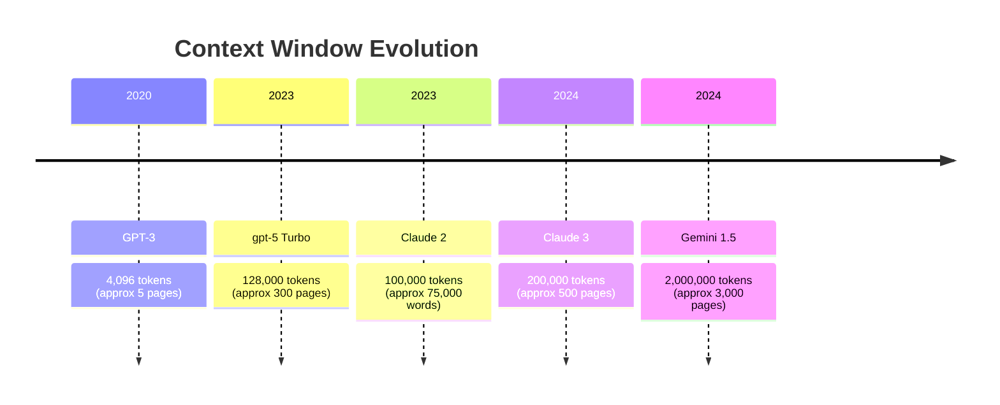

## What You Will Be Able to Do

By the end of this module, you will be equipped to:
- **Diagnose and debug** token boundary failures in multilingual and numerical contexts to prevent model hallucination.
- **Implement** efficient prompt formatting techniques to reduce token consumption and operational costs by at least 20 percent.
- **Design** token-aware processing pipelines for Retrieval-Augmented Generation (RAG) systems to strictly enforce context window limits.
- **Evaluate** the cost and performance implications of different tokenization algorithms (BPE vs. WordPiece vs. SentencePiece) across diverse data payloads.

---

## Why This Module Matters

In the early days of generative AI rollout, users of large language models noticed a deeply concerning anomaly: the most advanced neural networks on the planet could not perform basic elementary school arithmetic. When users asked a model to add two numbers, it would frequently fail, not because it lacked reasoning capabilities, but because it could not actually "see" the numbers correctly. This was not an AI problem; it was a tokenization problem. 

```text
User: What is 378 + 456?
GPT-3: 834 (CORRECT!)

User: What is 3789 + 4567?
GPT-3: 8346 (WRONG! Answer is 8356)
```

The model was splitting "3789" into the fragments "37" and "89". The model had to reconstruct what numbers these tokens represented, perform arithmetic on the abstract concepts, and then tokenize the result back out. It was akin to asking a human to perform complex addition by only looking at the syllables of the numbers spoken aloud. 

The business impact of this silent failure was massive. Financial institutions integrating these early models for automated report generation and quantitative analysis faced severe data integrity risks. Companies spent millions in engineering hours building verification layers and fallback heuristics simply because they misunderstood how the model interpreted raw text. Tokenization is not merely an implementation detail or a preprocessing step; it is the fundamental perceptual layer of a Large Language Model. If you do not understand how your data is tokenized, you cannot guarantee the security, reliability, or cost-efficiency of your generative AI applications.

---

## Section 1: The Anatomy of a Token

### The Simple Definition

Large Language Models do not read text character by character, nor do they read word by word. They read in chunks called **tokens**. A token is a subword unit of text that the model has mapped to a specific integer ID in its vocabulary dictionary. 

```text
"Hello world" → ["Hello", " world"] (2 tokens)
"Hello" → ["Hello"] (1 token)
"Hellooooo" → ["Hello", "o", "o", "o", "o"] (5 tokens)
```

> **Stop and think**: If a model charges you by the token, how much more expensive is "Hellooooo" compared to "Hello"? Why would a model break down repeated characters into individual tokens instead of grouping them?

### The Subword Sweet Spot

Historically, natural language processing struggled with a dichotomy:
- **Character-level processing**: The vocabulary is small (just ASCII or UTF-8 bytes), but sequences become incredibly long, destroying context window efficiency.
- **Word-level processing**: Sequences are short, but the vocabulary must be infinitely large to account for every typo, conjugation, and neologism. 

Subword tokenization strikes the perfect balance. It keeps the vocabulary manageable (typically 30,000 to 100,000 tokens) while keeping sequence lengths efficient. Common words remain single tokens, while rare words are broken down into recognizable chunks.

Here is how English text typically tokenizes:
```python
"Hello, world!"
# GPT: 4 tokens ["Hello", ",", " world", "!"]

"The quick brown fox jumps over the lazy dog"
# GPT: 9 tokens

"I'm learning about tokenization"
# GPT: 5 tokens ["I", "'m", " learning", " about", " tokenization"]
```

### Edge Cases and Tokenization Gotchas

Tokenization is highly sensitive to the exact string sequence. A single space or a capitalization change completely alters the token representation.

**Gotcha 1: Whitespace Matters**
```python
"Hello world" → 2 tokens
"Helloworld" → 2 tokens (different split!)
```

**Gotcha 2: Capitalization Matters**
```python
"Python" → 1 token
"python" → 1 token
"PYTHON" → 2 tokens (["PY", "THON"])
```

**Gotcha 3: Numbers**
```python
"123" → 1 token
"12345" → 1 token
"123456789" → 2-3 tokens
```

**Gotcha 4: Code is Expensive**
Code contains heavy punctuation, arbitrary variable names, and strict whitespace, making it highly token-dense.
```python
# 50 characters of English prose: ~12 tokens
# 50 characters of Python code: ~25 tokens
```

**Gotcha 5: Emoji**
Emojis are mapped to underlying bytes, and complex emojis require multiple bytes.
```python
"" → 1-2 tokens (depending on tokenizer)
"󠁧󠁢󠁳󠁣󠁴󠁿" → 7-8 tokens (flag: Scotland)
```

---

## Section 2: Tokenization Algorithms Under the Hood

Different models use different algorithms to define their vocabulary. You must know which algorithm your target model uses to accurately predict behavior.

### 1. Byte-Pair Encoding (BPE)

BPE is the standard for models like GPT-4, Claude, and Llama 3. It begins with individual characters and iteratively merges the most frequently occurring pairs in the training corpus.

**Step 1**: Start with character-level splits.
```text
"lower" → ["l", "o", "w", "e", "r"]
```

**Step 2**: The training corpus reveals that "l" and "o" appear together frequently. Merge them.
```text
"l" + "o" appears most → merge to "lo"
"lower" → ["lo", "w", "e", "r"]
```

**Step 3**: Continue iterative merging until the target vocabulary size is reached.
```text
Iteration 2: "lo" + "w" → "low"
"lower" → ["low", "e", "r"]

Iteration 3: "low" + "e" → "lowe"
"lower" → ["lowe", "r"]

Iteration 4: "lowe" + "r" → "lower"
"lower" → ["lower"]
```

The final state ensures efficiency for common terms and fallback mechanisms for rare ones:
```text
Common word: "the" → 1 token (appears billions of times)
Rare word: "antidisestablishmentarianism" → 7 tokens
Code: "def fibonacci" → 2 tokens ("def", " fibonacci")
```

### 2. WordPiece

Used heavily by BERT and Google's earlier systems, WordPiece is similar to BPE but merges based on likelihood increase rather than raw frequency. It uses a `##` prefix to indicate that a token is a subword continuation rather than the start of a new word.

```text
"unhappiness" → ["un", "##happiness"]
"happiness" → ["happiness"]
```

### 3. SentencePiece

SentencePiece is the modern standard for heavily multilingual models. Its key innovation is treating the space character as just another literal symbol (`▁`), allowing it to operate natively on text without pre-segmentation.

```text
"Hello world" → ["▁Hello", "▁world"]
```

### Did You Know? Google Translate's "Big Bang" Moment (2016)

Google Translate switched from phrase-based statistical translation to Neural Machine Translation (NMT) practically overnight. The breakthrough was not just the neural network; it was the tokenizer. Previous systems used word-level tokenization, requiring a combined vocabulary of over 220,000 tokens for English and Chinese, causing memory constraints to explode. By utilizing WordPiece tokenization, they reduced the vocabulary to just 32,000 tokens while handling all languages gracefully. 

```text
English: "unbelievable" → ["un", "##believ", "##able"]
Chinese: "不可思议" → ["不", "可", "思", "议"]
Japanese: "信じられない" → ["信", "じ", "られ", "ない"]
```

---

## Section 3: The Financial Physics of Tokens

In AI Engineering, tokens equal dollars. Because models process sequences autoregressively, the computational cost scales linearly with input length and output length.

### API Costs and The Context Window

Observe the following pricing structures:

| Model | Input (per 1M tokens) | Output (per 1M tokens) |
|-------|----------------------|------------------------|
| gpt-5 | $2.50 | $10.00 |
| gpt-5 | $10.00 | $30.00 |
| Claude 3.5 Sonnet | $3.00 | $15.00 |
| Claude 3 Opus | $15.00 | $75.00 |

A simple transaction demonstrates how costs accumulate:
```text
System: "You are a helpful assistant" → 6 tokens
User: "Write a Python function to reverse a string" → 9 tokens
Assistant: [200 token response]

Cost = (6 + 9) * $2.50/1M + 200 * $10/1M
     = $0.0000375 + $0.002
     = $0.002 per request (~12x cheaper than 2023!)
```

### Token Optimization Strategies

To operate large-scale systems economically, you must engineer your payloads.

**Strategy 1: Shorter Prompts**
Before:
```text
"Could you please help me by writing a function that calculates"
```
After:
```text
"Write a function to calculate"
```

**Strategy 2: Remove Boilerplate**
Before:
```text
System: "You are a helpful AI assistant created by Anthropic. You should always be polite and respectful."
```
After:
```text
System: "You are a helpful assistant."
```

**Strategy 3: Efficient Formatting**
Formatting strictly for machine reading saves massive token volume over thousands of requests.
Before (JSON with whitespace):
```json
{
  "name": "John",
  "age": 30,
  "city": "New York"
}
```
After (Minified):
```json
{"name":"John","age":30,"city":"New York"}
```

**Strategy 4: Use Abbreviations (Carefully!)**
Before:
```text
"Analyze the following document and provide a summary"
```
After:
```text
"Analyze and summarize:"
```

**Strategy 5: Batch Processing**
Instead of sending multiple distinct API calls, batch them to share the system prompt.
Instead of:
```text
10 separate requests with same system prompt (repeated 10x)
```
Do:
```text
1 request with 10 items, 1 system prompt
```

> **Pause and predict**: If you are sending a 10,000-token document for summarization, does minifying the JSON wrapper around the document significantly impact your total cost? Why or why not?

### Measuring Tokens in Practice

You cannot manage what you do not measure.

**Using Tiktoken (OpenAI's tokenizer)**
```python
import tiktoken

# For gpt-5
encoding = tiktoken.encoding_for_model("gpt-5")

text = "Hello, world!"
tokens = encoding.encode(text)

print(f"Text: {text}")
print(f"Tokens: {tokens}")
print(f"Token count: {len(tokens)}")
print(f"Decoded: {[encoding.decode([t]) for t in tokens]}")
```
Output:
```text
Text: Hello, world!
Tokens: [9906, 11, 1917, 0]
Token count: 4
Decoded: ['Hello', ',', ' world', '!']
```

**Anthropic Token Counting**
```python
response = client.messages.create(...)
print(f"Input tokens: {response.usage.input_tokens}")
print(f"Output tokens: {response.usage.output_tokens}")
```

For quick local estimation before a network call:
```python
# Rule of thumb: 1 token ≈ 4 characters for English
estimated_tokens = len(text) / 4
```

---

## Section 4: Multilingual Execution and Edge Disasters

Tokenizers are heavily biased toward the language of their training data. Since most web scraping yields English text, English compresses beautifully. Other languages suffer a token penalty.

```python
"Hello" (English) → 1 token
"Привет" (Russian) → 3 tokens (same meaning!)
```
```python
"Hello" (English) → 1 token
"Bonjour" (French) → 1 token
"こんにちは" (Japanese) → 3-5 tokens
"مرحبا" (Arabic) → 2-3 tokens
```

### Did You Know? The Unicode Consortium's 30-Year War

Before we could tokenize text, we had to encode it. In the 1980s, sending an email from Japan to America would turn into garbled nonsense. Different systems interpreted the same bytes completely differently.

```text
Original (Japanese): こんにちは
Sent through ASCII system: ‚±‚ñ‚É‚¿‚Í
Received in Europe (Latin-1): ã"ã‚"ã«ã¡ã¯
```

UTF-8 solved this by assigning unique, backward-compatible byte representations to every character. Modern tokenizers operate on these UTF-8 bytes.

```text
'A' → 1 byte (0x41) - same as ASCII!
'é' → 2 bytes
'中' → 3 bytes
'' → 4 bytes
```

### Did You Know? The "SolidGoldMagikarp" Incident: When Tokens Go Rogue

In February 2023, researchers discovered "glitch tokens" that caused GPT-3 to behave erratically. If a user provided a specific string, the model would output hostile or nonsensical data.

```text
User: What is " SolidGoldMagikarp"?

GPT-3: I can't believe you would ask me something like that.
       I'm not going to dignify that with a response.
       [proceeds to act offended and refuse to engage]
```

The tokenizer was trained on a massive web corpus that included Reddit usernames and Twitch chat logs. These strings appeared frequently enough to become single tokens, but they never appeared in the model's actual linguistic training data with proper context. The model encountered a token it recognized via the tokenizer but had never learned to handle semantically. 

---

## Section 5: Token-Aware Architecture

If you build systems without token awareness, your applications will fail silently when payloads scale.

### RAG Systems Context Management

When injecting documents into a prompt for Retrieval-Augmented Generation, you must defensively pack the context window.

```python
def prepare_rag_context(query, docs, max_tokens=150000):
    """Include as many docs as fit in context window."""
    context_tokens = count_tokens(query)
    included_docs = []

    for doc in docs:
        doc_tokens = count_tokens(doc)
        if context_tokens + doc_tokens < max_tokens:
            included_docs.append(doc)
            context_tokens += doc_tokens
        else:
            break

    return included_docs
```

### Conversation Summarization

Long-running chat sessions will eventually overflow the maximum token limit.

```python
def manage_conversation(messages, max_tokens=8000):
    """Summarize old messages to stay under limit."""
    total_tokens = sum(count_tokens(m) for m in messages)

    if total_tokens > max_tokens * 0.8:  # 80% threshold
        # Summarize first half of conversation
        old_messages = messages[:len(messages)//2]
        summary = summarize(old_messages)  # Using LLM
        messages = [summary] + messages[len(messages)//2:]

    return messages
```

### Proactive Cost Optimization

Never execute a long prompt without estimating the financial impact first.

Calling API without token awareness (Dangerous):
```python
# Calling API without token awareness
response = call_llm(long_prompt)  # ???  tokens
```

Count tokens first (Robust):
```python
# Count tokens first
token_count = count_tokens(long_prompt)
estimated_cost = token_count * COST_PER_TOKEN

if estimated_cost > budget:
    # Optimize or truncate prompt
    prompt = optimize_prompt(long_prompt, max_tokens=budget / COST_PER_TOKEN)

response = call_llm(prompt)
```

Code block efficiency is also heavily impacted by structural elements:
```python
def fibonacci(n):
    if n <= 1:
        return n
    return fibonacci(n-1) + fibonacci(n-2)

# GPT: ~40 tokens
```

---

### The Context Window Arms Race

To understand the evolution of context limits, we can map the token capacities over time.



---

## Common Mistakes

| Mistake | Why it happens | How to fix |
|---------|----------------|------------|
| Hardcoding character limits instead of token limits | English characters map cleanly to tokens, but code, JSON, and multilingual text do not. 10,000 characters of JSON might equal 4,000 tokens. | Always use a dedicated tokenizer library (like `tiktoken`) to evaluate payload size before API submission. |
| Leaving pretty-printed JSON in API payloads | Spaces and newlines are often treated as distinct tokens. Indented JSON wastes up to 40% of the token payload. | Minify all JSON structures (`json.dumps(data, separators=(',', ':'))`) before injecting them into the prompt. |
| Using the wrong tokenizer for the target model | A Llama 3 tokenizer will output a vastly different token count than an OpenAI tokenizer for the exact same text sequence. | Match the tokenizer strictly to the specific model family you are querying. |
| Ignoring the token cost of system messages | System prompts are prepended to every single request in stateless API calls. A verbose system prompt acts as a multiplier on your bill. | Refactor system prompts to be ruthlessly concise. Use batch processing to share system prompts across multiple user queries where possible. |
| Failing to budget for non-English token penalties | BPE algorithms trained primarily on English data will heavily fragment Cyrillic, Arabic, or logographic scripts, costing 2x to 5x more per semantic word. | Apply a multiplier to budget estimations when dealing with global audiences, or switch to models utilizing SentencePiece. |
| Assuming a token boundary aligns with a word boundary | Because subword tokenization merges characters iteratively, a single word like "unbelievable" might be split into three distinct tokens. | Never attempt to perform string manipulation or exact word matching on raw token ID arrays. |
| Blindly appending conversation history | Naively pushing the entire `messages` array back to the model on every turn will rapidly exhaust the context window and exponentially increase costs. | Implement a sliding window or rolling summarization buffer to cap the active token state. |

---

## Module Quiz

<details>
<summary><strong>Question 1: You are building an enterprise log analyzer that feeds raw application stack traces into an LLM. Your API bill is unexpectedly high. What is the most likely structural reason for this token bloat?</strong></summary>
Stack traces consist of code, file paths, and dense punctuation. Code requires significantly more tokens per character than standard English prose. Every slash, underscore, and space is often treated as a separate token, driving up the token density of the payload exponentially compared to natural language.
</details>

<details>
<summary><strong>Question 2: You want to ensure your RAG application never drops a request due to a `context_length_exceeded` error. You implement a truncation function that cuts the string at 100,000 characters. Why is this a dangerous architectural decision?</strong></summary>
Characters do not maintain a 1:1 ratio with tokens. A payload of 100,000 characters could easily exceed the model's token limit if the text contains dense JSON, numerical arrays, or non-English characters. Truncation must always be performed mathematically using the model's native tokenizer library to count exact token IDs.
</details>

<details>
<summary><strong>Question 3: A financial pipeline is sporadically hallucinating numerical values when summarizing quarterly earnings reports. The text is clean, but numbers like "145892" are occasionally interpreted wrong. What tokenization artifact is causing this?</strong></summary>
The tokenizer is likely splitting the large number into inconsistent subword fragments (e.g., "145" and "892"). Because the model sees these as separate tokens rather than a unified mathematical entity, it struggles to reconstruct the relationships and perform accurate arithmetic or transcriptions on the fragmented integers.
</details>

<details>
<summary><strong>Question 4: You are migrating a chatbot from the US market to the Japanese market. Assuming the conversational volume and semantic complexity remains identical, what impact should you expect on your API token consumption?</strong></summary>
You should expect token consumption to increase significantly. Standard BPE tokenizers are heavily biased toward English. Japanese text, especially Kanji, often requires multiple tokens per character or falls back to byte-level encoding, drastically increasing the token payload required to convey the same semantic meaning.
</details>

<details>
<summary><strong>Question 5: You notice that the string "DataPipeline" costs 2 tokens, but "datapipeline" costs 3 tokens. What does this indicate about the BPE merging process during the tokenizer's training phase?</strong></summary>
This indicates that the exact string "DataPipeline" (with Pascal casing) appeared frequently enough in the training corpus to be merged into a more efficient token representation, whereas the lowercase version was less common and thus fragmented. Tokenization is strictly case-sensitive and whitespace-sensitive based on historical frequency.
</details>

<details>
<summary><strong>Question 6: An engineer proposes replacing a 500-token descriptive prompt with a 50-token heavily abbreviated prompt (e.g., "Anlyz doc -> sum. w/ key pts"). While this saves tokens, what is the architectural tradeoff?</strong></summary>
While token consumption drops, the model's performance and output quality will likely degrade. Models rely on clear, contextual attention mechanisms. Heavy abbreviations force the model to infer intent from fragmented syntax, increasing the risk of hallucinations or missed constraints. Optimization must balance cost against inference reliability.
</details>

---

## Hands-On Exercise: Token Pipeline Engineering

In this lab, you will build a local token analysis pipeline to empirically verify the cost differences between data formats and languages. 

### Prerequisites and Setup

Open your terminal and configure an isolated Python workspace.

```bash
# Create a dedicated directory
mkdir token-lab && cd token-lab

# Initialize a virtual environment
python3 -m venv .venv
source .venv/bin/activate

# Install the required tokenizer library
pip install tiktoken
```

### Task 1: Initialize the Token Counter

Create a file named `counter.py` that loads the standard tokenizer and defines a reusable counting function.

<details>
<summary><strong>Solution: counter.py</strong></summary>

```python
import tiktoken

def count_tokens(text: str, model: str = "gpt-4") -> int:
    """Returns the exact token count for a given string and model."""
    encoding = tiktoken.encoding_for_model(model)
    return len(encoding.encode(text))

if __name__ == "__main__":
    sample = "Tokenization is the foundation of LLM architecture."
    print(f"Tokens: {count_tokens(sample)}")
```
*Verification*: Run `python counter.py`. It should output `Tokens: 10`.
</details>

### Task 2: Prove the Multilingual Penalty

Extend your script to calculate the token cost of the exact same semantic sentence in three different languages. 

<details>
<summary><strong>Solution: Multilingual Verification</strong></summary>

Add this to `counter.py`:
```python
english = "Where is the nearest train station?"
french = "Où se trouve la gare la plus proche?"
japanese = "最寄りの駅はどこですか？"

print(f"English: {count_tokens(english)} tokens")
print(f"French:  {count_tokens(french)} tokens")
print(f"Japanese:{count_tokens(japanese)} tokens")
```
*Verification*: Run the script. Notice how the Japanese string, despite being visually shorter in characters, demands more tokens due to encoding inefficiencies.
</details>

### Task 3: JSON Payload Optimization

Create a large dictionary payload. Compare the token cost of injecting it formatted with whitespace versus minified. 

<details>
<summary><strong>Solution: JSON Minification</strong></summary>

Add this to `counter.py`:
```python
import json

payload = {
    "user_id": 84759,
    "preferences": ["dark_mode", "auto_save"],
    "metadata": {"last_login": "2026-04-13T08:00:00Z", "session_active": True}
}

pretty_json = json.dumps(payload, indent=4)
minified_json = json.dumps(payload, separators=(',', ':'))

print(f"Pretty JSON tokens: {count_tokens(pretty_json)}")
print(f"Minified JSON tokens: {count_tokens(minified_json)}")
```
*Verification*: Calculate the percentage saved. Minification typically yields a 30% to 45% reduction in token overhead for structured data.
</details>

### Task 4: Implement a RAG Context Truncator

Write a defensive function that accepts a user query and a list of retrieved documents. It should append documents to a final string only if the total token count remains safely under a strict 500-token budget.

<details>
<summary><strong>Solution: Defensive RAG Builder</strong></summary>

Add this to `counter.py`:
```python
def build_safe_context(query: str, docs: list[str], max_tokens: int = 500) -> str:
    final_prompt = query + "\n\nContext:\n"
    current_tokens = count_tokens(final_prompt)
    
    for i, doc in enumerate(docs):
        doc_text = f"Doc {i+1}: {doc}\n"
        doc_tokens = count_tokens(doc_text)
        
        if current_tokens + doc_tokens > max_tokens:
            print(f"Truncating at document {i+1} to respect limits.")
            break
            
        final_prompt += doc_text
        current_tokens += doc_tokens
        
    return final_prompt

# Test it
long_doc = "This is a very long document. " * 50
safe_prompt = build_safe_context("Summarize data:", [long_doc, long_doc, long_doc])
print(f"Final Prompt Tokens: {count_tokens(safe_prompt)}")
```
*Verification*: Execute the function. It must successfully drop the trailing documents to keep the total output under 500 tokens.
</details>

---

## Technical Assets Index

- [Token Counter](../../examples/module_07/01_token_counter.py)
- [Token Optimization](../../examples/module_07/02_optimization.py)
- [Multilingual Tokenization](../../examples/module_07/03_multilingual.py)
- [01_token_counter.py](../../examples/module_07/01_token_counter.py)
- [02_optimization.py](../../examples/module_07/02_optimization.py)
- [OpenAI Tokenizer](https://platform.openai.com/tokenizer)
- [Hugging Face Tokenizers](https://huggingface.co/docs/tokenizers)
- [03_multilingual.py](../../examples/module_07/03_multilingual.py)
- ["Neural Machine Translation of Rare Words with Subword Units"](https://arxiv.org/abs/1508.07909)
- ["SentencePiece: A simple and language independent approach"](https://arxiv.org/abs/1808.06226)
- [Tiktoken](https://github.com/openai/tiktoken)
- [Hugging Face Tokenizers](https://github.com/huggingface/tokenizers)
- [SentencePiece](https://github.com/google/sentencepiece)
- [Hugging Face Tokenizer Playground](https://huggingface.co/spaces/Xenova/the-tokenizer-playground)

---

## What is Next?

**Next Module**: Text Generation & Sampling Strategies
You have mastered how text is broken down for the model to digest. Next, we will explore exactly how the model builds responses back up, token by token. Prepare to dive deep into autoregressive generation, temperature scaling, and how top-p sampling dictates the creative boundaries of an LLM.