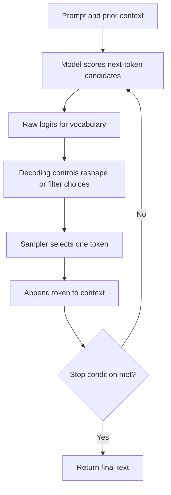
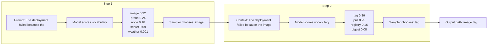
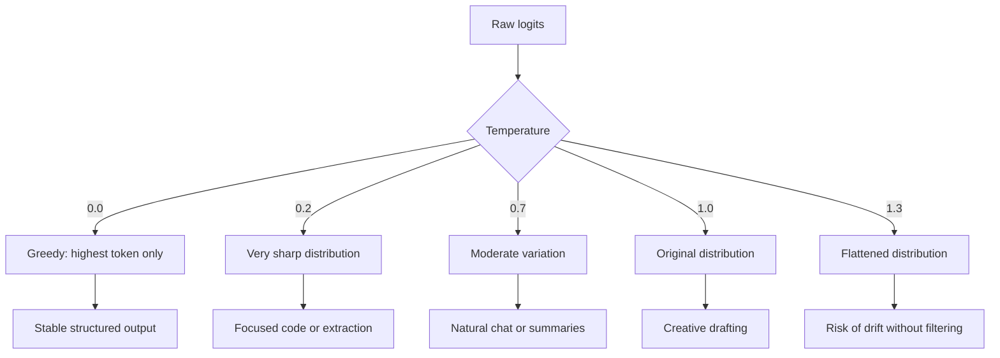
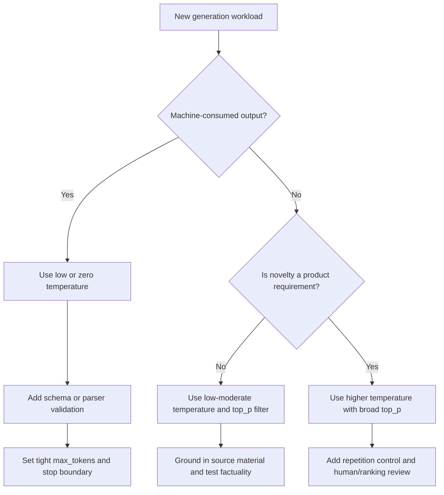

> **AI/ML Engineering Track** | Complexity: `[COMPLEX]` | Time: 5-6 hours

# Text Generation & Sampling Strategies: The Art of Controlled Randomness

## Learning Outcomes

By the end of this module, you will be able to:

- **Compare** greedy decoding, temperature sampling, nucleus sampling, top-k filtering, repetition penalties, and stopping controls across realistic production scenarios.
- **Design** sampling profiles for structured extraction, code generation, customer support chat, summarization, creative ideation, and long-form drafting.
- **Diagnose** repeated phrases, malformed structured output, dull responses, runaway generation, and incoherent high-variance text by tracing the decoding configuration.
- **Evaluate** the trade-offs between determinism, diversity, cost, latency, safety, and user experience when selecting generation parameters.
- **Implement** a runnable local sampling playground that demonstrates how decoding settings change token selection without requiring access to a hosted model API.

## Why This Module Matters

A product manager at a travel company asks the AI team why the support assistant confidently invented a refund exception that did not exist in the policy manual. The prompt included the correct policy, the retrieval system returned the right document, and the model was capable of summarizing it accurately in offline tests. The failure appeared only in production, where the assistant had been configured with a chat-friendly decoding profile designed to sound warm, varied, and conversational. That profile was useful for brainstorming marketing copy, but it was dangerous for a workflow where the correct answer was narrow, contractual, and auditable.

Sampling strategy is the part of text generation that decides which token gets written next after the model has scored the possible options. A model can assign probabilities well and still produce a bad answer if the decoding layer rewards novelty in a task that requires consistency. Conversely, the same model can sound lifeless, repetitive, or evasive if every application is forced through a deterministic profile. Production AI engineering is not only prompt design; it is also control over the statistical process that turns probability distributions into text.

This module teaches sampling as an engineering control surface rather than as a set of magic knobs. You will start with the token-by-token mechanics, then progressively add temperature, top-p, top-k, repetition penalties, stop sequences, and length limits. The goal is not to memorize default numbers. The goal is to reason from the workload: what must be stable, what may vary, what must never appear, how long the answer should be, and what failure mode would hurt users most.

## The Generation Loop

Text generation is usually autoregressive, which means the model writes one token, appends that token to the context, and then uses the expanded context to score the next token. The model is not drafting a complete paragraph in a hidden buffer and then revealing it. It is repeatedly answering a narrower question: given everything so far, which token should come next? This is why early decoding choices matter so much. A slightly unusual token at step five changes the context at step six, which changes the probabilities at step seven, and the whole answer can drift into a different path.



At each step, the model produces raw scores called logits. Those scores are converted into probabilities, and the decoding strategy decides whether to choose the highest-probability token or sample from a filtered set. If the prompt is `The deployment failed because the`, the model might assign high probability to `image`, `probe`, `node`, and `secret`, while assigning tiny probabilities to thousands of irrelevant tokens. Decoding determines whether the answer follows the safest path, explores a plausible alternative, or accidentally reaches into the low-probability tail.



The key engineering insight is that decoding does not create knowledge that the model lacks. It changes how strongly the model follows its most likely continuation, how much alternative wording is allowed, and how aggressively risky low-probability options are removed. A retrieval-augmented answer still needs low-variance decoding if every word must align with source material. A story-writing assistant still needs some filtering because creativity is not the same as random token selection.

**Active learning prompt:** Before reading further, decide which workload should be more deterministic: extracting `namespace`, `deployment`, and `imageTag` fields from an incident report, or suggesting five names for a new internal platform team. Write one sentence explaining the failure mode you are trying to prevent in each case.

## Greedy Decoding and Determinism

Greedy decoding always picks the highest-probability next token. When the model gives `image` a probability of `0.32` and `probe` a probability of `0.24`, greedy decoding selects `image` every time. This makes the output stable for the same prompt and model snapshot, which is valuable for tests, structured extraction, reproducible reports, and workflows where downstream systems parse the response. It also makes the model less able to explore alternative phrasing, which can make responses feel repetitive or overly conservative.

```ascii
+-----------------------------+-----------------------------+
| Candidate next token        | Probability after scoring   |
+-----------------------------+-----------------------------+
| image                       | 0.32                        |
| probe                       | 0.24                        |
| node                        | 0.18                        |
| secret                      | 0.09                        |
| timeout                     | 0.06                        |
+-----------------------------+-----------------------------+
| Greedy choice               | image                       |
+-----------------------------+-----------------------------+
```

Greedy decoding is often exposed as `temperature: 0.0`, although different providers may implement exact determinism differently. Some APIs also have model-side nondeterminism, backend changes, safety layers, or tool-use routing that can affect repeatability even when temperature is zero. From an application design perspective, however, a zero-temperature profile is still the right starting point whenever correctness means "the same valid format every time" rather than "a pleasantly varied answer."

A deterministic profile does not guarantee truth. If the prompt asks for a policy that is not present in the context, greedy decoding may consistently produce the same wrong answer. Determinism controls variance, not factuality. In production, you pair deterministic decoding with schema validation, retrieval grounding, refusal rules, and tests that compare output against expected structures. Treat greedy decoding as one guardrail in a larger reliability system.

```python
EXTRACTION_PROFILE = {
    "temperature": 0.0,
    "top_p": 1.0,
    "max_tokens": 300,
    "stop_sequences": ["\n\nEND"],
}
```

Use this kind of profile when a downstream parser, ticketing system, CI pipeline, or audit log depends on predictable output shape. The `top_p` value is effectively neutral here because a zero-temperature setting already selects the top token. The `max_tokens` limit protects cost and prevents runaway generation, while the stop sequence gives the model a clear place to end after the target payload. The important design habit is to write the profile from the consumer backward: if a parser consumes it, do not optimize for charm.

## Temperature: Reshaping Confidence

Temperature changes the sharpness of the probability distribution before sampling. Low temperature makes high-probability tokens even more dominant, while high temperature flattens the distribution and gives lower-probability tokens more opportunity to appear. This is why temperature is often described as a creativity knob, but that nickname is incomplete. It is more precise to say that temperature controls how willing the sampler is to depart from the model's strongest local preference.



A temperature near zero is appropriate when the output space is narrow. Code generation, YAML generation, SQL drafting, and JSON extraction all punish unnecessary variation because a single unexpected token can break execution or parsing. A temperature around `0.2` can still allow limited flexibility while keeping the answer close to the most likely continuation. A temperature around `0.7` is common for conversational assistants because users usually prefer language that adapts to their wording and does not repeat the same sentence template forever.

High temperature becomes useful when the user explicitly wants novelty, such as brainstorming product names or exploring story directions. It is still an engineering risk because the sampler is more likely to select tokens that are merely possible rather than strongly supported by the prompt. High temperature should usually be paired with top-p filtering, stronger review, or an application design that can tolerate weak ideas. Never use high temperature to compensate for missing context or unclear instructions; it will make the model more adventurous, not more informed.

| Temperature range | Behavior | Best fit | Main risk |
|---|---|---|---|
| `0.0` | Greedy and highly repeatable | JSON, tests, strict templates | Consistently repeats a wrong assumption if the prompt is flawed |
| `0.1-0.3` | Focused with minimal variation | Code, YAML, factual summaries | Can sound rigid and may miss useful alternate wording |
| `0.4-0.8` | Balanced and conversational | Support chat, explanations, reports | May add phrasing variety that complicates parsing |
| `0.9-1.2` | Creative and diverse | Ideation, storytelling, drafts | Can drift from constraints without filters |
| `>1.2` | Highly exploratory | Experimental writing only | Incoherence, invented details, wasted tokens |

**Active learning prompt:** Your team generates Kubernetes NetworkPolicy YAML from natural-language requests. The model often adds a friendly preface before the manifest, and CI fails because the output is no longer valid YAML. Would you first lower temperature, raise temperature, add a repetition penalty, or increase `max_tokens`? Explain the mechanism behind your choice, not just the setting.

## Top-p: Dynamic Filtering With a Nucleus

Top-p, also called nucleus sampling, filters the candidate tokens by cumulative probability. The sampler sorts tokens from most likely to least likely, keeps the smallest set whose total probability reaches the `top_p` threshold, and discards everything else. Unlike top-k, the size of the candidate set changes at every generation step. When the model is very confident, top-p may keep only a few tokens. When the model is uncertain among many plausible options, top-p can keep a broader set.

```ascii
Sorted candidates for one decoding step
+-------------+-------------+------------------------+
| Token       | Probability | Cumulative probability |
+-------------+-------------+------------------------+
| image       | 0.32        | 0.32                   |
| probe       | 0.24        | 0.56                   |
| node        | 0.18        | 0.74                   |
| secret      | 0.09        | 0.83                   |
| timeout     | 0.06        | 0.89                   |
| quota       | 0.04        | 0.93  <- top_p 0.90    |
| pineapple   | 0.001       | discarded              |
+-------------+-------------+------------------------+
```

Top-p is useful because many language-model distributions have a long tail of low-probability tokens. Those tail tokens are not always impossible, but they are often where gibberish, weird topic jumps, and unsupported claims begin. A `top_p` value such as `0.9` allows the model to vary among plausible choices while removing the most unlikely tail. A tighter value such as `0.5` or `0.7` forces the answer to stay close to the strongest candidates, which can be helpful for factual summaries or code-like output.

The interaction between temperature and top-p matters more than either setting alone. Temperature changes the shape of the distribution, while top-p decides how much of that shaped distribution remains eligible. A high temperature with `top_p: 1.0` can wander into strange options because the tail remains available. A moderate temperature with `top_p: 0.9` often gives natural language without letting extremely unlikely tokens through. A low temperature with tight top-p can become so constrained that responses feel repetitive or fail to adapt to legitimate user variation.

| Workload | Recommended top-p | Why this range works | What to watch |
|---|---|---|---|
| Strict extraction | `1.0` with temperature `0.0` | Greedy decoding makes nucleus filtering irrelevant | Validate schema anyway |
| Code generation | `0.4-0.7` | Keeps token choices focused on common syntax patterns | May overfit to common boilerplate |
| Support chat | `0.8-0.95` | Allows natural wording while removing extreme tail tokens | Still needs grounding and policy checks |
| Creative drafting | `0.9-0.98` | Preserves a broad set of plausible continuations | Can drift if the prompt is weak |
| Brainstorming | `0.9-1.0` | Maximizes variety for low-stakes idea generation | Needs ranking or human selection afterward |

A common misunderstanding is that `top_p: 0.9` means "choose the top ninety percent of tokens." It does not. It means "choose the smallest set of tokens whose probability mass reaches ninety percent." If the top token alone has probability `0.95`, the nucleus may contain only that token. If many tokens each have similar probability, the nucleus may contain many candidates. That dynamic behavior is why top-p is usually a better default than a fixed top-k value.

## Top-k: Static Filtering and Its Trade-Offs

Top-k sampling keeps exactly the `k` most probable tokens and removes the rest. If `top_k` is `5`, the sampler can choose only among the five highest-ranked candidates, regardless of their absolute probabilities. This is easy to reason about, and it can be useful in local model stacks or research settings where a fixed candidate budget is desirable. The weakness is that the same `k` can be too broad when the model is confident and too narrow when the model is uncertain.

```ascii
Clear-step distribution with top_k = 5
+-------------+-------------+-------------------------------+
| Token       | Probability | Decision                      |
+-------------+-------------+-------------------------------+
| pass        | 0.82        | kept                          |
| fail        | 0.08        | kept                          |
| skip        | 0.03        | kept                          |
| retry       | 0.02        | kept                          |
| timeout     | 0.01        | kept                          |
| unrelated   | 0.004       | discarded                     |
+-------------+-------------+-------------------------------+
```

In the clear distribution above, keeping five tokens may already be too generous because the model strongly prefers one answer. A top-p filter might keep only `pass` and perhaps `fail`, while top-k keeps weaker alternatives merely because they happen to be ranked near the top. In a different step where twelve candidates are genuinely close, `top_k: 5` might discard useful options too early. Static filtering cannot adapt to confidence.

You should avoid combining top-p and top-k unless the provider documentation explicitly defines the order and you have a reason to need both. Some systems apply top-k first, then top-p. Others apply nucleus filtering first, then cap the result. That implementation detail changes the candidate pool, which means the same numbers can behave differently across backends. For most application work, choose top-p as the primary filter and leave top-k unset or neutral.

| Filter | Candidate set size | Strength | Weakness |
|---|---|---|---|
| Greedy | One token | Maximum repeatability | No diversity |
| Top-p | Dynamic by probability mass | Adapts to model confidence | Less intuitive to inspect manually |
| Top-k | Fixed by rank | Simple and predictable candidate count | Can include weak tokens or exclude plausible ones |
| Temperature only | Entire vocabulary remains possible | Simple diversity control | Low-probability tail remains available |
| Beam search | Multiple high-probability paths | Useful for translation-like tasks | Often dull for open-ended generation |

## Repetition Penalties and Degeneration

Autoregressive generation can fall into repeated phrases because the model keeps conditioning on its own previous text. If a phrase has just appeared several times, the context makes it locally probable to appear again. This failure mode is sometimes called degeneration: the output remains grammatical but becomes unhelpfully repetitive. Long-form responses, brainstorming lists, and generic explanations are especially vulnerable because the model can loop on high-level phrases that sound plausible.

```ascii
Without a repetition penalty
+------------------------------------------------------------+
| The platform should be scalable. The platform should be    |
| scalable because the platform should be scalable. The       |
| platform should be scalable for future growth.             |
+------------------------------------------------------------+

With a moderate repetition penalty
+------------------------------------------------------------+
| The platform should scale horizontally, recover from node   |
| loss, and expose capacity signals before traffic spikes.   |
+------------------------------------------------------------+
```

A repetition penalty reduces the probability of tokens that have already appeared. The exact implementation varies, but the engineering intent is consistent: make repeated tokens less attractive so the sampler explores nearby alternatives. A mild value such as `1.05` or `1.1` can help a chatbot avoid stale wording. A stronger value such as `1.2` or `1.3` can help longer creative responses, but excessive penalties make text sound forced because the model avoids natural repeated function words and domain terms.

Repetition penalties are not a substitute for a good prompt structure. If you ask for "ten unique ideas" but do not require categories, constraints, or evaluation criteria, the model may still repeat themes using different words. Penalties operate at the token level, while conceptual diversity often requires task design. For serious ideation workflows, combine a moderate repetition penalty with explicit diversity requirements such as "one operational idea, one security idea, one cost idea, and one developer-experience idea."

| Repetition setting | Likely behavior | Suitable workload | Risk |
|---|---|---|---|
| `1.0` | No penalty | Short structured output, code, exact terminology | Long text may loop |
| `1.05-1.1` | Gentle discouragement | Chat, summaries, support responses | May not fix severe loops |
| `1.15-1.3` | Stronger vocabulary pressure | Long drafting, brainstorming, story generation | Can sound unnatural |
| `>1.3` | Aggressive avoidance | Rare rescue setting for loop-heavy local models | May damage coherence and terminology |

A senior-level debugging habit is to distinguish repetition caused by decoding from repetition caused by content design. If the model repeats the same phrase after several hundred tokens, a repetition penalty and shorter sections may help. If it repeats the same idea across list items, the prompt likely lacks distinct axes for comparison. If it repeats boilerplate at the start of every answer, the system prompt or examples may be teaching the model that preamble is required.

## Length Limits, Stop Sequences, and Cost Control

Length control is a reliability feature, not only a billing feature. Every production generation should have an explicit `max_tokens` limit based on the expected output, the downstream consumer, and the acceptable latency budget. Without a limit, a model can continue until it reaches a provider cap, burns unnecessary tokens, or produces text that the user never needed. A strict limit also forces the application designer to decide what "done" looks like.

Stop sequences give the model a semantic boundary. A few-shot prompt might show several examples separated by `###`, and the model may continue writing additional examples unless a stop sequence tells it where the target answer ends. Structured output often benefits from a sentinel such as `END_JSON` or an instruction to stop after a closing delimiter. Stop sequences are especially useful when the output will be embedded into another file, sent to a parser, or shown in a UI with limited space.

```python
SUMMARY_PROFILE = {
    "temperature": 0.3,
    "top_p": 0.7,
    "max_tokens": 220,
    "stop_sequences": ["\n\n###", "\n\nSource:"],
}
```

The example above is designed for a factual summary rather than a creative answer. Low temperature keeps the response close to the source, top-p removes low-probability wording, and `max_tokens` bounds cost and latency. The stop sequences prevent the model from drifting into another prompt section or inventing a source list. Notice that none of these settings proves the summary is accurate. They reduce decoding risk, while citation checks, source comparison, and application tests address factual risk.

A common production pattern is to set a conservative model output limit and then validate the result. If the output is incomplete, malformed, or fails schema validation, the application can retry with a repair prompt or a larger limit. Blindly raising `max_tokens` for every request is a poor fix because it increases cost for successful cases and may hide prompt design problems. Treat length as part of the contract between the model and the application.

## Worked Example: Diagnosing a Broken Extraction Flow

A team uses an LLM to extract incident metadata from support messages. The downstream system expects a JSON object with `service`, `environment`, `severity`, and `summary`. During testing, the model sometimes returns valid JSON, but other times it writes a sentence before the object or appends an explanation afterward. The current profile is `temperature: 0.7`, `top_p: 0.9`, `max_tokens: 1000`, and no stop sequence. The prompt asks the model to "extract the details and explain any uncertainty."

The first diagnosis is that the decoding profile and task contract disagree. A JSON extraction flow does not need conversational variation, and the phrase "explain any uncertainty" invites text outside the object. The profile should be deterministic, the prompt should require only JSON, and the output should be validated. A stop sequence can help, but schema validation is the stronger boundary because a stop sequence alone cannot guarantee that all required keys exist.

```python
BROKEN_EXTRACTION_PROFILE = {
    "temperature": 0.7,
    "top_p": 0.9,
    "max_tokens": 1000,
}

FIXED_EXTRACTION_PROFILE = {
    "temperature": 0.0,
    "top_p": 1.0,
    "max_tokens": 240,
    "stop_sequences": ["\n\nEND_JSON"],
}
```

The repaired design also changes the prompt structure. Instead of asking for explanation, it provides a schema and requires the model to put uncertainty into fields such as `"severity": "unknown"` or `"summary": "insufficient information"`. That preserves useful uncertainty while keeping the output parseable. A retry path can ask the model to repair invalid JSON, but the primary path should be strict enough that repair is rare.

```json
{
  "service": "checkout-api",
  "environment": "prod",
  "severity": "high",
  "summary": "Checkout requests are timing out after a new image rollout."
}
```

The senior-level lesson is that sampling parameters are only one layer in a control system. The profile reduces output variance, the prompt defines the contract, the stop sequence bounds the response, and the validator rejects malformed results. If any one layer is missing, the others have to carry too much responsibility. Reliable AI systems usually come from several modest controls working together, not from a single perfect setting.

## Production Profiles by Use Case

The safest way to choose sampling settings is to classify the workload before touching any numbers. Ask whether the output is consumed by a human or a machine, whether diversity is valuable or harmful, whether the answer must cite source material, and how expensive a bad answer would be. These questions turn sampling from guesswork into design. The following profiles are starting points, not universal defaults, and they should be tested against representative prompts.

### Use Case 1: Customer Support Chat

Support chat needs natural language, but it must stay within policy and source material. A moderate temperature can make answers feel less robotic, while top-p filtering removes unlikely tail tokens. The application should still ground answers in retrieved policy text, include refusal behavior for missing information, and log enough metadata for audit. A decoding profile cannot make an unsupported policy true.

```python
SUPPORT_CHAT_PROFILE = {
    "temperature": 0.6,
    "top_p": 0.9,
    "repetition_penalty": 1.05,
    "max_tokens": 500,
    "stop_sequences": ["\nUser:", "\nHuman:"],
}
```

### Use Case 2: Code Generation

Code generation rewards consistency, syntax discipline, and common patterns. A low temperature helps the model choose conventional tokens, while a tight top-p prevents unnecessary exploration. Repetition penalties should usually remain neutral or mild because code legitimately repeats identifiers, indentation, keywords, and structural markers. The stronger reliability boundary is compilation, unit tests, static analysis, and review.

```python
CODE_GENERATION_PROFILE = {
    "temperature": 0.2,
    "top_p": 0.5,
    "repetition_penalty": 1.0,
    "max_tokens": 1200,
    "stop_sequences": ["\n```", "\n# End"],
}
```

### Use Case 3: Creative Story Writing

Creative writing benefits from a wider candidate pool because the user often wants surprise, texture, and varied phrasing. A temperature near `1.0` with a broad nucleus allows richer continuations while still filtering the most unlikely tail. A moderate repetition penalty helps avoid repeated sentence openings and recycled imagery. The application should give the user editing tools rather than pretending every generated draft is final.

```python
CREATIVE_WRITING_PROFILE = {
    "temperature": 1.0,
    "top_p": 0.95,
    "repetition_penalty": 1.2,
    "max_tokens": 1800,
    "stop_sequences": ["\n\n###"],
}
```

### Use Case 4: JSON Data Extraction

JSON extraction is a machine-consumed workflow, so the decoding profile should prioritize validity and repeatability. Use zero temperature, a neutral top-p, a tight token budget, and a clear stop boundary. The application should parse the output with a real JSON parser and reject or repair invalid results. If the provider supports native structured output or schema-constrained decoding, use that before relying on prompt-only formatting.

```python
JSON_EXTRACTION_PROFILE = {
    "temperature": 0.0,
    "top_p": 1.0,
    "repetition_penalty": 1.0,
    "max_tokens": 300,
    "stop_sequences": ["\n\nEND_JSON"],
}
```

### Use Case 5: Brainstorming Ideas

Brainstorming is one of the few places where higher variance is often desirable. The goal is not to produce a single correct answer; it is to generate a candidate set that a human or ranking step can evaluate. A higher temperature and broad top-p can surface less obvious ideas, while a repetition penalty reduces near-duplicates. You should still ask for categories, constraints, or scoring criteria so the diversity is useful rather than chaotic.

```python
BRAINSTORMING_PROFILE = {
    "temperature": 1.15,
    "top_p": 0.95,
    "repetition_penalty": 1.25,
    "max_tokens": 900,
    "stop_sequences": ["\n\nEND_IDEAS"],
}
```

### Use Case 6: Financial or Incident Summarization

Summaries of high-stakes material should be conservative but readable. Very low temperature can make text rigid, while moderate low temperature gives the model enough flexibility to produce clear sentences. Top-p should be tighter than for chat because unsupported wording can change the meaning of a report. The application should cite sources, preserve uncertainty, and avoid allowing the model to fill gaps with plausible but unverified details.

```python
FACTUAL_SUMMARY_PROFILE = {
    "temperature": 0.3,
    "top_p": 0.7,
    "repetition_penalty": 1.0,
    "max_tokens": 450,
    "stop_sequences": ["\n\nSources:", "\n\nEND_SUMMARY"],
}
```

| Use Case | Temperature | Top-p | Top-k | Repetition | Max Tokens | Primary validation |
|---|---:|---:|---:|---:|---:|---|
| Code generation | `0.2` | `0.5` | unset | `1.0` | `1200` | tests and linters |
| JSON extraction | `0.0` | `1.0` | unset | `1.0` | `300` | JSON schema |
| Support chatbot | `0.6` | `0.9` | unset | `1.05` | `500` | policy grounding |
| Creative writing | `1.0` | `0.95` | unset | `1.2` | `1800` | human editing |
| Brainstorming | `1.15` | `0.95` | unset | `1.25` | `900` | ranking criteria |
| Factual summary | `0.3` | `0.7` | unset | `1.0` | `450` | source comparison |
| Translation-like rewriting | `0.3` | `0.8` | unset | `1.0` | `800` | bilingual review |
| Test fixtures | `0.0` | `1.0` | unset | `1.0` | varies | exact expected output |

## Decision Process for New Workloads

When you face a new workload, do not start by copying a temperature from an example. Start by identifying the consumer of the output. If software consumes the output, favor deterministic decoding and validation. If a human consumes the output and values tone, use moderate sampling with safety filters. If a human consumes the output and values surprise, allow wider sampling but add ranking, editing, or review. The profile should express the cost of variance.



This decision tree deliberately separates generation quality from output validation. A creative brainstorming tool can tolerate weak ideas because the user chooses among them. A compliance assistant cannot tolerate creative policy interpretation because users may act on the response. A code assistant sits between the two: some variation is helpful, but executable validation is mandatory. Sampling strategy should match the consequences of a bad token, not the personality you wish the model had.

There is also a latency and cost dimension. Larger `max_tokens` increases the worst-case response time and price. Wider sampling can sometimes produce longer, more meandering answers because the model explores less direct paths. Strong stop sequences and concise prompt contracts keep the output bounded. In high-throughput systems, sampling profiles should be part of capacity planning, not hidden constants buried in application code.

| Decision question | If yes | If no |
|---|---|---|
| Will a parser consume the output? | Use `temperature: 0.0` and schema validation | Allow moderate natural-language variation |
| Is novelty valuable to the user? | Increase temperature and review/rank outputs | Keep temperature low or moderate |
| Could a wrong detail cause harm? | Tighten top-p, ground in sources, preserve uncertainty | Focus more on user experience |
| Is the output long-form? | Add repetition control and section limits | Keep repetition penalty neutral |
| Does the prompt contain few-shot examples? | Add stop sequences to prevent extra examples | Use normal task-specific boundaries |
| Is cost sensitive? | Lower `max_tokens` and add retry only when needed | Allow room for richer answers |

## Common Mistakes

| Mistake | Why it fails | Practical fix |
|---|---|---|
| Using chat defaults for structured extraction | General chat defaults usually allow wording variation, prefaces, and explanations that break parsers. | Use `temperature: 0.0`, a strict prompt contract, a stop boundary, and schema validation. |
| Treating temperature as a truthfulness control | Lower temperature reduces variance, but it does not add missing evidence or correct bad context. | Pair conservative decoding with retrieval grounding, refusal behavior, and factual checks. |
| Combining top-p and top-k without a documented reason | Different backends may apply the filters in different orders, changing the candidate pool. | Prefer top-p alone unless the provider documents the combined behavior and you test it. |
| Setting high temperature for code or YAML | Extra variation can introduce invalid syntax, unexpected comments, or conversational filler. | Use low temperature, tight top-p, and validate with compilers, parsers, linters, or tests. |
| Omitting `max_tokens` in production | Runaway generation increases cost, latency, and the chance of irrelevant trailing text. | Set a limit based on the expected output and add a repair path for incomplete results. |
| Overusing repetition penalties | Strong penalties can make normal terminology, identifiers, and function words look artificially avoided. | Start mild for prose, keep code mostly neutral, and inspect output quality before raising it. |
| Solving conceptual duplication with token penalties | Repetition penalties reduce token reuse but do not guarantee diverse ideas or distinct categories. | Add prompt constraints that require different angles, audiences, risks, or evaluation criteria. |
| Forgetting stop sequences in few-shot prompts | The model may continue the pattern and generate extra examples instead of stopping at the answer. | Add a delimiter or sentinel that marks the end of the target response. |

## Did You Know?

1. Nucleus sampling was popularized by the 2019 paper "The Curious Case of Neural Text Degeneration," which showed that simply maximizing likelihood can produce dull or repetitive text even when the model is strong.

2. A zero-temperature setting is best understood as a decoding choice, not as a universal reproducibility guarantee, because provider infrastructure, model versions, safety layers, and tool routing can still change behavior.

3. Repetition problems often become visible only after several hundred generated tokens, which is why short demos can look healthy while long-form production responses still degrade.

4. Native structured-output features, when available, are usually stronger than prompt-only JSON instructions because they constrain the generation or validate the result closer to the model boundary.

## Quiz

**1. Your team deploys an LLM that extracts Kubernetes incident fields into JSON for an automated ticket router. The router fails because the model sometimes writes `Here is the JSON:` before the object, although the fields themselves are usually correct. Which change should you make first?**

- A) Increase temperature so the model can find a better phrasing.
- B) Set temperature to `0.0`, require JSON only, add a stop boundary, and validate with a JSON parser.
- C) Increase `max_tokens` so the model has enough room to finish the explanation.
- D) Add a high repetition penalty so the preface appears less often.

<details>
<summary>Answer</summary>

**Correct answer: B.** The failure is not that the model lacks enough space or needs more variety; the failure is that a machine-consumed workflow is using a profile that allows conversational text. A deterministic profile, strict output contract, stop boundary, and parser validation align the decoding behavior with the downstream consumer.
</details>

**2. A product team wants an assistant to propose unusual internal hackathon themes. The current profile uses `temperature: 0.2`, `top_p: 0.5`, and no repetition penalty. Users say every idea sounds like a generic productivity workshop. What adjustment best matches the workload?**

- A) Raise temperature near `1.1`, use broad top-p such as `0.95`, and add a moderate repetition penalty.
- B) Lower temperature to `0.0` so the model consistently selects the best theme.
- C) Set top-k to `1` so the output becomes more focused.
- D) Reduce `max_tokens` so the model cannot repeat itself.

<details>
<summary>Answer</summary>

**Correct answer: A.** Brainstorming is a novelty-seeking workload, so the profile should allow more varied candidates while still filtering the extreme tail. A moderate repetition penalty helps reduce near-duplicate ideas, while lowering temperature or top-k would make the output even more predictable.
</details>

**3. A support chatbot must sound natural, but it keeps inventing unusual phrases and occasionally drifts away from the retrieved policy. The current profile is `temperature: 1.2`, `top_p: 1.0`, and `max_tokens: 900`. Which diagnosis is most accurate?**

- A) The model needs a larger token budget to explain the policy fully.
- B) The sampler is too deterministic and cannot adapt to customer wording.
- C) High temperature plus no nucleus filtering leaves too much low-probability tail available.
- D) A repetition penalty is impossible to use in customer support.

<details>
<summary>Answer</summary>

**Correct answer: C.** The profile encourages exploratory token choices and does not filter the long tail, which increases the risk of strange wording and drift. A support chatbot usually needs moderate temperature, top-p filtering, grounding, and policy validation rather than maximum variation.
</details>

**4. A developer uses `top_p: 0.95` and `top_k: 10` in a local inference stack. After a framework upgrade, output diversity changes even though the numbers are identical. What is the most likely cause and fix?**

- A) The model forgot previous conversations, so increase context length.
- B) The framework may apply top-p and top-k in a different order, so simplify to one filtering strategy unless both are explicitly required.
- C) The temperature must be exactly `1.0` whenever top-p is enabled.
- D) The stop sequence is too short, so remove it.

<details>
<summary>Answer</summary>

**Correct answer: B.** Combining filtering strategies can make behavior depend on implementation order. If one version applies top-k before top-p and another applies top-p before top-k, the eligible candidate pool changes, so the standard fix is to choose the primary filter and test it directly.
</details>

**5. An AI documentation assistant writes strong first paragraphs, but after several sections it repeats the phrase `This approach improves reliability` in nearly every paragraph. The profile has moderate temperature, top-p filtering, and no repetition penalty. What should you try, and what else should you inspect?**

- A) Add a mild repetition penalty and inspect whether the prompt asks for distinct sections with different purposes.
- B) Set temperature to `0.0` and remove all section headings.
- C) Increase `max_tokens` because the model is running out of space.
- D) Disable top-p so the model can use every token in the vocabulary.

<details>
<summary>Answer</summary>

**Correct answer: A.** The symptom fits degeneration in long-form generation, so a mild repetition penalty can help. You should also inspect the prompt because conceptual repetition often means the task lacks distinct axes, not merely that the sampler reused tokens.
</details>

**6. A CI assistant generates YAML manifests. The YAML is usually correct, but one out of several runs includes a comment explaining the manifest, which breaks a strict downstream comparison test. Which profile best fits this use case?**

- A) `temperature: 0.8`, `top_p: 0.9`, `max_tokens: 1000`
- B) `temperature: 1.0`, `top_p: 1.0`, `repetition_penalty: 1.2`
- C) `temperature: 0.0`, neutral top-p, clear stop sequence, and YAML parser validation
- D) `temperature: 1.2`, top-k set to `50`, and no stop sequence

<details>
<summary>Answer</summary>

**Correct answer: C.** YAML for CI is machine-consumed and exactness matters. The profile should reduce variance, define a stopping boundary, and rely on parser validation rather than hoping the model chooses not to add explanatory text.
</details>

**7. A financial analyst summary tool uses `temperature: 0.0` and produces accurate but awkward sentence fragments. Stakeholders want readable summaries without creative interpretation of the source. Which adjustment is most reasonable?**

- A) Move to `temperature: 1.5` so the model can write more naturally.
- B) Use a low nonzero temperature such as `0.3`, pair it with tighter top-p, and keep source validation.
- C) Remove `max_tokens` so the model can decide how much explanation is needed.
- D) Add a very high repetition penalty so every sentence is unique.

<details>
<summary>Answer</summary>

**Correct answer: B.** The workload needs readability but remains high-stakes and source-bound. A low nonzero temperature with constrained top-p can improve fluency while preserving conservative behavior, but factual validation and source comparison still carry the accuracy requirement.
</details>

## Hands-On Exercise

Goal: build and use a local Python sampling playground that shows how temperature, top-p, top-k, repetition penalties, and token limits change generated text. This lab does not call a hosted model API, so you can focus on decoding mechanics without credentials or network access. You will implement a tiny token-transition model, run several profiles, and then reason from observed behavior back to production settings.

- [ ] Create a clean lab directory and virtual environment.

```bash
mkdir -p sampling-strategies-lab
cd sampling-strategies-lab
.venv/bin/python --version 2>/dev/null || true
```

If `.venv/bin/python` does not exist in your current directory, create a local environment with the system Python available on your workstation, then use the environment's explicit interpreter path for the rest of the lab.

```bash
python3 -m venv .venv
.venv/bin/python --version
```

- [ ] Create `sampling_lab.py` with a runnable sampler.

```bash
cat > sampling_lab.py <<'PY'
import argparse
import math
import random
from collections import Counter

TRANSITIONS = {
    "<START>": {
        "JSON": 0.28,
        "Chat": 0.24,
        "Code": 0.22,
        "Creative": 0.16,
        "Unusual": 0.10,
    },
    "JSON": {"extraction": 0.68, "format": 0.20, "story": 0.04, "bananas": 0.01},
    "Chat": {"answers": 0.42, "support": 0.32, "rambles": 0.08, "sparkles": 0.02},
    "Code": {"generation": 0.52, "syntax": 0.30, "poetry": 0.05, "mist": 0.01},
    "Creative": {"drafts": 0.38, "ideas": 0.34, "twists": 0.20, "static": 0.03},
    "Unusual": {"ideas": 0.44, "phrases": 0.30, "detours": 0.18, "noise": 0.04},
    "extraction": {"needs": 0.70, "prefers": 0.20, "wanders": 0.02},
    "format": {"needs": 0.62, "prefers": 0.28, "wanders": 0.02},
    "answers": {"need": 0.46, "balance": 0.34, "repeat": 0.10},
    "support": {"needs": 0.44, "balance": 0.36, "repeat": 0.10},
    "generation": {"needs": 0.58, "prefers": 0.24, "repeat": 0.08},
    "syntax": {"needs": 0.60, "prefers": 0.22, "repeat": 0.08},
    "drafts": {"benefit": 0.44, "need": 0.26, "repeat": 0.18},
    "ideas": {"benefit": 0.40, "need": 0.28, "repeat": 0.20},
    "twists": {"benefit": 0.44, "need": 0.24, "repeat": 0.20},
    "phrases": {"benefit": 0.34, "repeat": 0.30, "drift": 0.18},
    "detours": {"drift": 0.40, "repeat": 0.24, "benefit": 0.18},
    "needs": {"strict": 0.44, "clear": 0.32, "repeat": 0.18},
    "need": {"moderate": 0.40, "clear": 0.30, "repeat": 0.20},
    "prefers": {"low": 0.48, "focused": 0.34, "repeat": 0.12},
    "balance": {"controlled": 0.44, "natural": 0.34, "repeat": 0.14},
    "benefit": {"from": 0.55, "with": 0.25, "repeat": 0.14},
    "from": {"variety": 0.44, "novelty": 0.32, "repeat": 0.16},
    "with": {"filters": 0.50, "limits": 0.28, "repeat": 0.14},
    "strict": {"decoding": 0.70, "schemas": 0.20, "repeat": 0.05},
    "clear": {"limits": 0.42, "validation": 0.36, "repeat": 0.14},
    "moderate": {"temperature": 0.54, "filtering": 0.28, "repeat": 0.12},
    "low": {"temperature": 0.62, "variance": 0.20, "repeat": 0.10},
    "focused": {"sampling": 0.56, "tokens": 0.24, "repeat": 0.12},
    "controlled": {"randomness": 0.56, "language": 0.24, "repeat": 0.12},
    "natural": {"language": 0.54, "answers": 0.24, "repeat": 0.14},
    "variety": {"helps": 0.52, "matters": 0.28, "repeat": 0.12},
    "novelty": {"helps": 0.52, "matters": 0.28, "repeat": 0.12},
    "filters": {"remove": 0.52, "limit": 0.28, "repeat": 0.12},
    "limits": {"control": 0.52, "protect": 0.28, "repeat": 0.12},
    "decoding": {".": 1.0},
    "schemas": {".": 1.0},
    "validation": {".": 1.0},
    "temperature": {".": 1.0},
    "filtering": {".": 1.0},
    "variance": {".": 1.0},
    "sampling": {".": 1.0},
    "tokens": {".": 1.0},
    "randomness": {".": 1.0},
    "language": {".": 1.0},
    "helps": {".": 1.0},
    "matters": {".": 1.0},
    "remove": {"tail": 0.70, "noise": 0.20, "repeat": 0.05},
    "limit": {"tail": 0.60, "noise": 0.25, "repeat": 0.08},
    "control": {"cost": 0.60, "length": 0.25, "repeat": 0.08},
    "protect": {"cost": 0.55, "parsers": 0.30, "repeat": 0.08},
    "tail": {".": 1.0},
    "noise": {".": 1.0},
    "cost": {".": 1.0},
    "length": {".": 1.0},
    "parsers": {".": 1.0},
    "repeat": {"repeat": 0.70, "repeat.": 0.30},
    "repeat.": {".": 1.0},
    "wanders": {"noise": 0.50, "drift": 0.30, "repeat": 0.10},
    "rambles": {"noise": 0.50, "drift": 0.30, "repeat": 0.10},
    "sparkles": {"noise": 0.50, "drift": 0.30, "repeat": 0.10},
    "poetry": {"noise": 0.50, "drift": 0.30, "repeat": 0.10},
    "mist": {"noise": 0.50, "drift": 0.30, "repeat": 0.10},
    "static": {"noise": 0.50, "drift": 0.30, "repeat": 0.10},
    "drift": {".": 1.0},
    "bananas": {"noise": 1.0},
}

PRESETS = {
    "deterministic_json": {
        "temperature": 0.0,
        "top_p": 1.0,
        "top_k": 0,
        "repetition_penalty": 1.0,
        "max_tokens": 9,
        "seed": 11,
    },
    "balanced_chat": {
        "temperature": 0.7,
        "top_p": 0.9,
        "top_k": 0,
        "repetition_penalty": 1.05,
        "max_tokens": 11,
        "seed": 11,
    },
    "creative_brainstorm": {
        "temperature": 1.1,
        "top_p": 0.95,
        "top_k": 0,
        "repetition_penalty": 1.2,
        "max_tokens": 13,
        "seed": 11,
    },
    "loop_prone": {
        "temperature": 0.8,
        "top_p": 1.0,
        "top_k": 0,
        "repetition_penalty": 1.0,
        "max_tokens": 12,
        "seed": 5,
    },
    "loop_resistant": {
        "temperature": 0.8,
        "top_p": 1.0,
        "top_k": 0,
        "repetition_penalty": 1.3,
        "max_tokens": 12,
        "seed": 5,
    },
    "code_generation": {
        "temperature": 0.2,
        "top_p": 0.5,
        "top_k": 0,
        "repetition_penalty": 1.0,
        "max_tokens": 9,
        "seed": 17,
    },
}

def normalize(probs):
    total = sum(probs.values())
    if total <= 0:
        raise ValueError("probabilities must sum to a positive value")
    return {token: value / total for token, value in probs.items()}

def apply_repetition_penalty(probs, counts, penalty):
    if penalty <= 1.0:
        return probs
    adjusted = {}
    for token, value in probs.items():
        adjusted[token] = value / (penalty ** counts[token])
    return normalize(adjusted)

def apply_temperature(probs, temperature):
    if temperature == 0.0:
        best = max(probs, key=probs.get)
        return {best: 1.0}
    adjusted = {}
    for token, value in probs.items():
        adjusted[token] = math.pow(value, 1.0 / temperature)
    return normalize(adjusted)

def apply_top_k(probs, top_k):
    if top_k <= 0:
        return probs
    kept = dict(sorted(probs.items(), key=lambda item: item[1], reverse=True)[:top_k])
    return normalize(kept)

def apply_top_p(probs, top_p):
    if top_p >= 1.0:
        return probs
    ranked = sorted(probs.items(), key=lambda item: item[1], reverse=True)
    kept = {}
    cumulative = 0.0
    for token, value in ranked:
        kept[token] = value
        cumulative += value
        if cumulative >= top_p:
            break
    return normalize(kept)

def sample_token(probs, rng):
    tokens = list(probs)
    weights = [probs[token] for token in tokens]
    return rng.choices(tokens, weights=weights, k=1)[0]

def generate(preset_name):
    cfg = PRESETS[preset_name]
    rng = random.Random(cfg["seed"])
    counts = Counter()
    current = "<START>"
    output = []

    for _ in range(cfg["max_tokens"]):
        base = TRANSITIONS.get(current, {".": 1.0})
        probs = apply_repetition_penalty(base, counts, cfg["repetition_penalty"])
        probs = apply_temperature(probs, cfg["temperature"])
        probs = apply_top_k(probs, cfg["top_k"])
        probs = apply_top_p(probs, cfg["top_p"])
        token = sample_token(probs, rng)
        if token == ".":
            output.append(token)
            break
        output.append(token)
        counts[token] += 1
        current = token

    text = " ".join(output).replace(" .", ".")
    return cfg, text

def main():
    parser = argparse.ArgumentParser()
    parser.add_argument("--preset", required=True, choices=sorted(PRESETS))
    args = parser.parse_args()
    cfg, text = generate(args.preset)
    print(f"Preset: {args.preset}")
    print("Config:")
    for key, value in cfg.items():
        print(f"  {key}: {value}")
    print("Output:")
    print(text)

if __name__ == "__main__":
    main()
PY
```

- [ ] Run the deterministic profile twice and confirm that the output is identical.

```bash
.venv/bin/python sampling_lab.py --preset deterministic_json
.venv/bin/python sampling_lab.py --preset deterministic_json
```

Success criteria for this step:

- [ ] Both runs show `temperature: 0.0`.
- [ ] Both runs produce the same output text.
- [ ] The output stays focused on extraction, structure, or validation rather than creative drift.

- [ ] Run the balanced chat profile and compare it with the deterministic profile.

```bash
.venv/bin/python sampling_lab.py --preset balanced_chat
```

Success criteria for this step:

- [ ] The profile shows a moderate temperature rather than zero temperature.
- [ ] The profile uses top-p filtering rather than leaving the full tail unfiltered.
- [ ] The output remains coherent while allowing more variation than the deterministic profile.

- [ ] Run the creative brainstorming profile and inspect whether it allows broader phrasing.

```bash
.venv/bin/python sampling_lab.py --preset creative_brainstorm
```

Success criteria for this step:

- [ ] The profile uses a higher temperature than the balanced profile.
- [ ] The profile still uses top-p filtering, so creativity is not completely unconstrained.
- [ ] The output differs in style or path from the deterministic and balanced profiles.

- [ ] Compare the loop-prone and loop-resistant profiles.

```bash
.venv/bin/python sampling_lab.py --preset loop_prone
.venv/bin/python sampling_lab.py --preset loop_resistant
```

Success criteria for this step:

- [ ] The loop-prone profile shows `repetition_penalty: 1.0`.
- [ ] The loop-resistant profile shows a higher repetition penalty.
- [ ] You can explain whether the penalty changed the output and why token-level penalties do not guarantee conceptual diversity.

- [ ] Run the code generation profile and compare it to the creative profile.

```bash
.venv/bin/python sampling_lab.py --preset code_generation
.venv/bin/python sampling_lab.py --preset creative_brainstorm
```

Success criteria for this step:

- [ ] The code profile uses lower temperature and tighter top-p than the creative profile.
- [ ] You can explain why code and YAML generation should prefer focused token selection.
- [ ] You can identify which validation layer would be required in a real code-generation system.

- [ ] Edit `sampling_lab.py` so `balanced_chat` temporarily uses `top_k: 3`, then rerun it.

```bash
grep -n "balanced_chat" -A8 sampling_lab.py
.venv/bin/python sampling_lab.py --preset balanced_chat
```

Success criteria for this step:

- [ ] You can find the `top_k` setting in the profile.
- [ ] You can explain how fixed-rank filtering differs from nucleus filtering.
- [ ] You can explain why using both top-p and top-k may be ambiguous in real providers unless the order is documented.

- [ ] Write a short recommendation for each workload in your notes.

```bash
printf '%s\n' \
'JSON extraction: temperature 0.0, neutral top_p, schema validation, tight max_tokens.' \
'Support chat: moderate temperature, top_p filtering, grounding, policy checks.' \
'Code generation: low temperature, tight top_p, tests and linters.' \
'Brainstorming: higher temperature, broad top_p, repetition control, human ranking.'
```

Final exercise success criteria:

- [ ] You can demonstrate deterministic generation by running the same preset twice.
- [ ] You can explain why top-p dynamically adapts while top-k uses a fixed rank cutoff.
- [ ] You can diagnose repetition as either token-level degeneration, weak task structure, or both.
- [ ] You can choose different sampling profiles for structured extraction, support chat, code generation, and brainstorming.
- [ ] You can describe the validation layer that must accompany each production profile.
- [ ] You can justify every parameter in a profile from the workload's failure modes rather than from memorized defaults.

## What's Next

**Module 1.4: Embeddings & Semantic Similarity**

Sampling parameters control how a model turns probabilities into generated text, but embeddings solve a different problem: how systems represent meaning so similar content can be found, compared, clustered, and retrieved. In the next module, you will learn how text becomes vectors, why semantic similarity powers retrieval-augmented generation, and how embedding quality affects the context that a generator receives before sampling ever begins.

## Sources

- [The Curious Case of Neural Text Degeneration](https://arxiv.org/abs/1904.09751) — Primary paper for nucleus sampling, degeneration under maximization, and the motivation for sampling-based decoding.
- [Hugging Face Transformers: Generation Strategies](https://huggingface.co/docs/transformers/en/generation_strategies) — Practical overview of greedy decoding, sampling, and beam search with current framework terminology.
