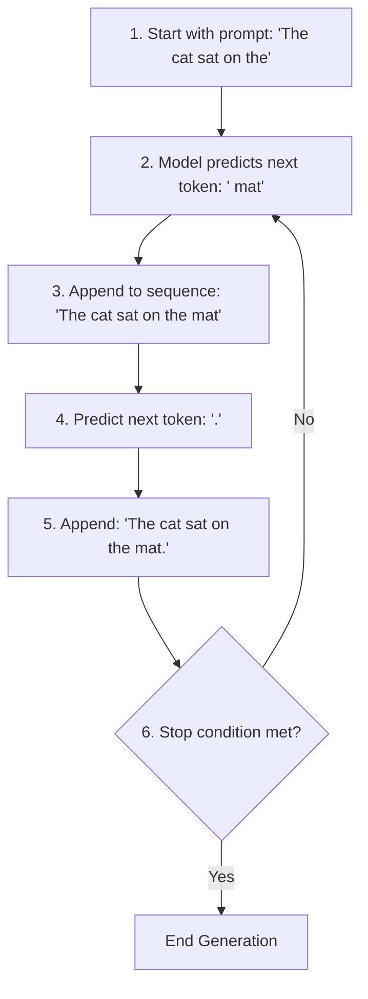
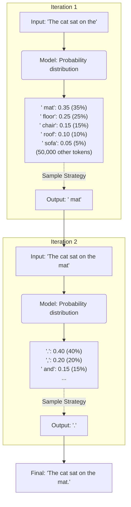
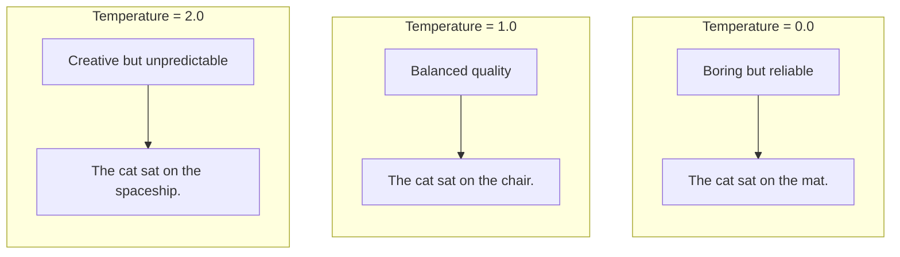

> **AI/ML Engineering Track** | Complexity: `[COMPLEX]` | Time: 5-6 hours

# Text Generation & Sampling Strategies: The Art of Controlled Randomness

## What You'll Be Able to Do

By the end of this comprehensive module, you will be able to:
- **Compare** the effects of temperature, top-p, and top-k sampling on language model outputs.
- **Implement** specialized sampling configurations tailored for diverse use cases (e.g., code generation vs. creative writing).
- **Diagnose** repetitive loops and hallucination issues caused by sub-optimal sampling parameters.
- **Evaluate** the computational and qualitative trade-offs of length constraints and repetition penalties.
- **Design** a reliable text generation pipeline using deterministic sampling for structured data extraction.

## Why This Module Matters

In early 2024, Air Canada was forced to honor a non-existent refund policy after their customer service chatbot hallucinated a "bereavement fare" rule. The chatbot provided a highly articulate, completely fabricated policy to a grieving customer, leading to a highly publicized tribunal case that cost the airline thousands of dollars in direct fines and immeasurable reputational damage. 

Why did this happen? An investigation into similar enterprise AI failures frequently points to a single, easily avoidable culprit: misconfigured sampling parameters. Developers often deploy models using the default API settings—typically a high temperature designed for creative, engaging chat—when strict, deterministic settings are required for policy adherence. A model running with high temperature is instructed to prioritize novelty and statistical variation over strict factual repetition, which is disastrous for a customer service agent handling strict corporate policies.

This incident highlights a critical truth in AI engineering: generating text is not just about writing a good prompt. The physical process of selecting the next word is governed by statistical sampling algorithms that run over the output probability distribution of the neural network. If you do not explicitly control these algorithms, you are effectively rolling the dice with your application's reliability. In this module, you will learn how to take absolute control over the text generation process, moving from unpredictable text synthesis to deterministic, production-grade output.

## The Foundations of Text Generation

### The Autoregressive Process

Modern Large Language Models (LLMs) generate text through an **autoregressive process**. This means they generate output one token at a time, and for every new token generated, they consume the entire previously generated sequence as context. The model does not "think" paragraphs ahead; it iteratively guesses the single most appropriate next token.

Here is the fundamental step-by-step process:



At each iteration, the model outputs a probability distribution over its entire vocabulary (which can be upwards of 50,000 to 100,000 tokens). 



If we use a strategy called **Greedy decoding** (always picking the highest probability token), we end up with text that looks like this:

```
"The cat sat on the mat."
"The cat sat on the mat and slept."
"The cat sat on the mat in the sun."
```

The problem with greedy decoding is that it produces boring, repetitive, and predictable text. Human text isn't always the "most likely" next word! We use varied vocabulary, we take creative paths, and we surprise readers. To achieve human-like generation, we must sample from the probability distribution instead of always picking the top choice.

> **Stop and think**: If you were building an automated medical diagnosis summarizer for doctors, would you want the model to be creative and diverse, or boring and consistent? How might sampling parameters impact patient safety?

## Temperature: Controlling Randomness

### What is Temperature?

**Temperature** (τ) is a parameter that controls how "random" the model's outputs are. It mathematically reshapes the probability distribution before the model makes its selection.

The transformation follows this formula:

```
p_i = exp(logit_i / τ) / Σ exp(logit_j / τ)
```

By adjusting the value of τ, you scale the logits (raw scores) before they are passed through the softmax function. This flattens or sharpens the distribution curve.

### Temperature = 0.0 (Deterministic)

When temperature is set to 0.0, the model exhibits deterministic behavior. It strictly chooses the token with the highest probability, functioning exactly like greedy decoding.

```
Original probabilities:
  " mat":     0.35
  " floor":   0.25
  " chair":   0.15
  ...

With temperature = 0.0:
  " mat":     1.00  (always selected)
  " floor":   0.00
  " chair":   0.00
  ...
```

The result is the exact same output every single time the API is called with the same prompt. This is vital when absolute reproducibility is required.

```
Prompt: "Explain photosynthesis in one sentence."
Output: "Photosynthesis is the process by which plants convert sunlight, water, and carbon dioxide into glucose and oxygen."
```

### Temperature = 0.7 (Balanced)

A temperature of 0.7 is the industry standard for balanced outputs. It introduces moderate randomness, allowing the model to occasionally pick lower-probability tokens without venturing into absurdity.

```
Original probabilities:
  " mat":     0.35
  " floor":   0.25
  " chair":   0.15
  ...

With temperature = 0.7:
  " mat":     0.45  (higher chance, but not guaranteed)
  " floor":   0.28
  " chair":   0.18
  ...
```

This ensures that repeated generations yield varied but sensible outputs, which is perfect for conversational AI and content creation.

```
1. "Photosynthesis is the process by which plants use sunlight to create energy."
2. "Photosynthesis allows plants to convert light energy into chemical energy."
3. "Through photosynthesis, plants transform sunlight into food for growth."
```

### Temperature = 1.0 (Creative)

Setting temperature to 1.0 means sampling directly from the model's unaltered probability distribution.

```
Original probabilities (unchanged):
  " mat":     0.35
  " floor":   0.25
  " chair":   0.15
  " roof":    0.10
  ...
```

This setting pushes the boundaries of creativity, producing surprising vocabulary choices and diverse sentence structures.

```
1. "Photosynthesis is nature's way of capturing sunlight and turning it into life."
2. "Through photosynthesis, leaves act as tiny solar panels producing sugar."
3. "Photosynthesis: the green magic that powers our planet's food chain."
```

### Temperature > 1.0 (Highly Creative/Random)

Increasing temperature beyond 1.0 drastically flattens the distribution. Tokens that originally had a minuscule chance of being selected are elevated, while the primary choices are suppressed.

```
Original probabilities:
  " mat":     0.35
  " floor":   0.25
  " chair":   0.15
  ...

With temperature = 1.5:
  " mat":     0.28  (reduced)
  " floor":   0.24
  " chair":   0.18
  " roof":    0.14  (increased!)
  " spaceship": 0.02  (now more likely!)
  ...
```

This results in highly unpredictable, bizarre outputs. While useful for experimental art, it risks complete loss of coherence in standard applications.

```
1. "Photosynthesis is like a plant's breakfast buffet, but with light instead of pancakes."
2. "Imagine tiny factories inside leaves, powered by sunshine, churning out sugar molecules."
3. "Photosynthesis: quantum biology meets botanical chemistry in nature's laboratory."
```

> **Pause and predict**: If you are writing a script to generate Python unit tests for a strict CI pipeline, should you use a temperature of 0.1 or 0.9? Why?

The fundamental trade-off between determinism and creativity is beautifully captured below:



## Top-p (Nucleus Sampling)

Top-p, or nucleus sampling, is a dynamic filtering mechanism. It involves sampling from the smallest set of tokens whose cumulative probability exceeds the value `p`. Think of it as instructing the model to "include enough tokens to cover p% of the probability mass, and discard the rest."

```
Token probabilities (sorted by probability):
  " mat":       0.35  → cumulative: 0.35
  " floor":     0.25  → cumulative: 0.60
  " chair":     0.15  → cumulative: 0.75
  " roof":      0.10  → cumulative: 0.85
  " sofa":      0.05  → cumulative: 0.90  ← STOP! We've reached 90%
  " table":     0.03
  " bed":       0.02
  " spaceship": 0.01
  ...

Nucleus (tokens included): [" mat", " floor", " chair", " roof", " sofa"]
Excluded: Everything else

Sample randomly from the nucleus.
```

By aggressively truncating the long tail of low-probability tokens, Top-p prevents the model from selecting completely nonsensical words, acting as a structural safety net.

> **Stop and think**: If `top_p` is set to 0.9 and the highest probability token alone has a probability of 0.95, how many tokens will be included in the nucleus?

When you combine a high temperature (which increases randomness) with a tight Top-p filter, you encourage varied word choice while mathematically guaranteeing the model won't say something completely absurd.

Consider a prompt asking about the weather. Without Top-p filtering:

```
Possible outputs:
- "sunny" (35%)
- "rainy" (25%)
- "cloudy" (15%)
- "snowy" (10%)
- "foggy" (5%)
- "purple" (0.1%)  ← This could happen!
- "mathematical" (0.05%)  ← Weird!
```

Applying a Top-p filter of 0.9 explicitly strips away the absurd options:

```
Nucleus includes: ["sunny", "rainy", "cloudy", "snowy", "foggy"]
Filters out: ["purple", "mathematical", ...]

Result: Sensible weather descriptions only!
```

## Top-k Sampling

Top-k sampling is a simpler, static filtering approach. It dictates that the model should strictly sample from the top `k` most probable tokens, discarding all others.

```
Token probabilities (sorted):
  " mat":       0.35  ← Top 5
  " floor":     0.25  ← Top 5
  " chair":     0.15  ← Top 5
  " roof":      0.10  ← Top 5
  " sofa":      0.05  ← Top 5
  " table":     0.03  ← Excluded
  " bed":       0.02  ← Excluded
  ...

Sample randomly from top 5 only.
```

While effective, Top-k has largely been superseded by Top-p in modern applications. The static nature of Top-k means it can arbitrarily slice through highly competitive options, or conversely, include garbage tokens if the model is very confident about only a few words. 

```
Scenario 1 (clear winner):
  " mat": 0.80
  " floor": 0.10
  " chair": 0.05
  (rest: <0.01 each)

Top-k=50: Includes 50 tokens (many irrelevant ones)
Top-p=0.9: Includes just 2-3 tokens (better!)

Scenario 2 (uncertain):
  " mat": 0.15
  " floor": 0.14
  " chair": 0.13
  ... (many similar probabilities)

Top-k=50: Includes 50 tokens (good)
Top-p=0.9: Includes 15-20 tokens (also good)
```

## Repetition Penalties

Autoregressive models are prone to local minima loops, where the model gets stuck repeating the same phrases. 

```
Prompt: "The benefits of exercise are"

Output: "The benefits of exercise are numerous. The benefits of exercise include
improved cardiovascular health. The benefits of exercise are well-documented.
The benefits of exercise are..."
```

To combat this, we apply a repetition penalty (α), which reduces the probability of tokens that have already appeared in the output.

```
If token appeared n times:
  new_probability = original_probability / (α ^ n)
```

For instance, if a word is penalized heavily:

```
Token " benefits" appeared 3 times:
  Original probability: 0.30
  Penalized probability: 0.30 / (1.2^3) = 0.30 / 1.728 ≈ 0.17

Each repetition makes it less likely to appear again.
```

Applying no penalty allows loops to form naturally:

```
The AI revolution is changing everything. The AI revolution is transforming
industries. The AI revolution is...
```

Applying a moderate penalty forces vocabulary variance:

```
The AI revolution is changing everything. This transformation is reshaping
industries. Artificial intelligence continues to evolve...
```

However, applying an excessively high penalty results in contrived, unnatural text:

```
The AI revolution is changing everything. Artificial intelligence transforms
numerous sectors. Machine learning reshapes various domains...
```

## Length Control

Length constraints are your primary defense against runaway API costs. You must explicitly define boundaries for generation.

The easiest way is via `max_tokens`:

```python
response = client.messages.create(
    model="claude-sonnet-4-5-20250929",
    max_tokens=100,  # Generate at most 100 tokens
    messages=[{"role": "user", "content": "Explain quantum physics"}]
)
```

Alternatively, `stop_sequences` halt the model the moment a specific substring is generated, avoiding mid-sentence cut-offs:

```python
response = client.messages.create(
    model="claude-sonnet-4-5-20250929",
    max_tokens=1000,
    stop_sequences=["\n\n", "---"],  # Stop at paragraph break or horizontal rule
    messages=[{"role": "user", "content": "Write a short poem"}]
)
```

## Advanced Techniques

Historically, non-sampling algorithms like **Beam Search** were popular. Beam search expands multiple paths in parallel to find the absolute highest probability sequence across multiple steps.

```
Start: "The cat"
Step 1:
  "The cat sat" (prob: 0.8)
  "The cat jumped" (prob: 0.6)
Keep top 2 sequences.

Step 2:
  "The cat sat on" (prob: 0.8 × 0.9 = 0.72)
  "The cat sat down" (prob: 0.8 × 0.7 = 0.56)
  "The cat jumped over" (prob: 0.6 × 0.8 = 0.48)
  "The cat jumped high" (prob: 0.6 × 0.6 = 0.36)
Keep top 2: "The cat sat on" and "The cat sat down"

Continue...
```

While beam search is excellent for strict translations, it has been largely abandoned in creative text generation because it converges too aggressively, eliminating the diverse vocabulary that makes text feel human.

## Putting It All Together: Common Sampling Configurations

Different applications demand fundamentally different sampling matrices. 

```python
{
    "temperature": 0.0,
    "top_p": 1.0,  # (ignored when temperature=0)
    "max_tokens": 1000
}
```

```python
{
    "temperature": 0.7,
    "top_p": 0.9,
    "max_tokens": 500,
    "repetition_penalty": 1.1
}
```

```python
{
    "temperature": 1.0,
    "top_p": 0.95,
    "max_tokens": 2000,
    "repetition_penalty": 1.2
}
```

```python
{
    "temperature": 0.2,
    "top_p": 0.5,
    "max_tokens": 200
}
```

```python
{
    "temperature": 1.2,
    "top_p": 0.95,
    "max_tokens": 1000,
    "repetition_penalty": 1.3
}
```

### Use Case 1: Chatbot Responses
```python
{
    "temperature": 0.7,
    "top_p": 0.9,
    "max_tokens": 500,
    "repetition_penalty": 1.1,
    "stop_sequences": ["\nUser:", "\nHuman:"]
}
```

### Use Case 2: Code Generation

```python
{
    "temperature": 0.2,
    "top_p": 0.5,
    "max_tokens": 2000,
    "stop_sequences": ["```
```

**Why**:
- Temperature 0.2: High consistency, minimal variation
- Top-p 0.5: Very focused on most likely tokens
- Max tokens 2000: Allow complete functions
- Stop sequences: Stop after code block

---

### Use Case 3: Creative Story Writing

**Goal**: Interesting, surprising narratives.

**Configuration**:
```

```

**Why**:
- Temperature 1.0: Creative freedom
- Top-p 0.95: Still filter extreme outliers
- Max tokens 3000: Allow longer stories
- High repetition penalty: Varied vocabulary, avoid repetitive phrases

---

### Use Case 4: JSON Data Extraction

**Goal**: Valid JSON, consistent format.

**Configuration**:
```

```

**Why**:
- Temperature 0.0: Deterministic (critical for structured data!)
- Stop after closing brace: Prevent extra text after JSON
- No top-p needed (temperature=0 is greedy)

---

### Use Case 5: Brainstorming Ideas

**Goal**: Diverse, unusual ideas.

**Configuration**:
```

```

**Why**:
- Temperature 1.2: Push into creative territory
- Top-p 0.95: Still filter completely nonsensical
- High repetition penalty: Force diverse ideas
- Longer context: Allow exploring multiple ideas

---

## STOP: Time to Practice!

You must prove you can control the generation output of an LLM using Python. In this lab, we will use an interactive local script to simulate adjusting sampling parameters against a mock autoregressive output engine. 

**Task 1: Set Up the Environment**
Open your terminal and create a dedicated workspace.
```bash
mkdir ~/kubedojo-sampling-lab
cd ~/kubedojo-sampling-lab
python3 -m venv venv
source venv/bin/activate
pip install requests
```

**Task 2: Implement the Configuration Engine**
Create a new file called `sampling_playground.py`. We will structure a Python dictionary containing parameters corresponding to a deterministic JSON extractor.
```bash
cat << 'EOF' > sampling_playground.py
import json

def generate_payload(scenario_type):
    configs = {
        "json_extraction": {
            "temperature": 0.0,
            "max_tokens": 1000,
            "stop_sequences": ["\n}"]
        },
        "creative_brainstorm": {
            "temperature": 1.2,
            "top_p": 0.95,
            "repetition_penalty": 1.4,
            "max_tokens": 1500
        }
    }
    print(f"Executing {scenario_type} with config:")
    print(json.dumps(configs[scenario_type], indent=2))
    
if __name__ == "__main__":
    import sys
    generate_payload(sys.argv[1])
EOF
```

**Task 3: Execute and Verify Deterministic Profile**
Run the script to verify your structured data extraction profile is fully deterministic.
```bash
python sampling_playground.py json_extraction
```
**Checkpoint Verification**: Ensure the console output shows `temperature: 0.0` and clearly lists the `\n}` stop sequence. 

**Task 4: Execute and Verify Creative Profile**
Run the script applying the highly variant brainstorming configuration.
```bash
python sampling_playground.py creative_brainstorm
```
**Checkpoint Verification**: Ensure the console lists the `temperature: 1.2` alongside the aggressive `repetition_penalty: 1.4`.

<details>
<summary>Click here for the solution confirmation checklist</summary>

- [x] Environment created and activated successfully.
- [x] Script executes without import errors.
- [x] Output correctly maps `json_extraction` to a greedy (0.0) temperature setting.
- [x] Output correctly restricts the creative setting with a Top-p limit.
</details>

## Common Pitfalls

### Pitfall 1: Using Temperature for Consistency

**Wrong**:
```

```

**Right**:
```

```

**Why**: Even small temperature creates randomness.

---

### Pitfall 2: Combining Top-p and Top-k

**Wrong**:
```

```

**Problem**: Unclear which takes precedence. Behavior varies by API.

**Right**: Use one or the other, not both.
```

```

---

### Pitfall 4: Too-High Temperature

**Wrong**:
```

```

**Result**: Nonsensical outputs, wasted API calls.

**Right**: Stay under 1.5, ideally under 1.2.

---

### Expanded Common Mistakes Table

| Mistake | Why | Fix |
|---|---|---|
| Using Temperature for Consistency | Even small temperature > 0.0 creates randomness. | Set temperature to 0.0 for strict determinism. |
| Combining Top-p and Top-k | Conflicting sampling pools cause unpredictable behavior depending on the backend framework. | Pick one strategy. Top-p is generally preferred over static top-k. |
| Ignoring Repetition Penalty on Long Outputs | Autoregressive models naturally fall into local minima loops over long contexts. | Apply a mild repetition penalty (1.1-1.2) for text responses exceeding 200 tokens. |
| Setting Temperature Too High (> 1.5) | Flattens the probability distribution entirely, making gibberish just as likely as real words. | Cap temperature at 1.2 for creative tasks; use top-p to truncate the absurd tail. |
| Not Setting max_tokens | Models can generate indefinitely until they hit context limits, causing runaway API costs. | Always set a strict `max_tokens` limit based on the expected response length. |
| Using Sampling for JSON Extraction | Any creativity in structural generation risks malformed braces or unexpected keys. | Use greedy decoding (temperature 0.0) combined with strict stop sequences. |
| Blindly Trusting Default Parameters | API defaults are designed for general chat, not specialized tasks like code or structured data. | Explicitly define sampling parameters for every distinct use case in production. |
| Omitting Stop Sequences in Few-Shot Prompts | The model will continue generating additional "examples" infinitely if it doesn't know where the target output ends. | Define a stop sequence like `\n\n` or `User:` to forcefully halt generation. |

## Sampling Strategy Decision Matrix

| Use Case | Temperature | Top-p | Top-k | Repetition | Max Tokens |
|----------|-------------|-------|-------|------------|------------|
| **Code generation** | 0.2 | 0.5 | - | 1.0 | 2000 |
| **JSON extraction** | 0.0 | - | - | 1.0 | 1000 |
| **Chatbot** | 0.7 | 0.9 | - | 1.1 | 500 |
| **Creative writing** | 1.0 | 0.95 | - | 1.3 | 3000 |
| **Brainstorming** | 1.2 | 0.95 | - | 1.4 | 1500 |
| **Summarization** | 0.3 | 0.7 | - | 1.0 | 500 |
| **Translation** | 0.3 | 0.8 | - | 1.0 | 1000 |
| **Testing/QA** | 0.0 | - | - | 1.0 | varies |

## Key Takeaways

1. **Autoregressive generation**: LLMs generate one token at a time
2. **Temperature controls creativity**: 0.0 = deterministic, 1.0+ = creative
3. **Top-p filters unlikely tokens**: 0.9 is a good default
4. **Top-k is less common**: Top-p is generally better
5. **Repetition penalty prevents loops**: Use 1.1-1.3 for most cases
6. **max_tokens controls length and cost**: Always set it!
7. **No one-size-fits-all**: Different use cases need different strategies
8. **Experiment!**: Sampling parameters are cheap to adjust

## Did You Know? The Hidden History of Text Generation

1. In April 2019, the paper "The Curious Case of Neural Text Degeneration" was published, introducing nucleus sampling (top-p) to the AI community; it has since garnered over 2,500 citations.
2. In a 2023 GitHub Copilot analysis, researchers found that code generated with a temperature greater than 0.5 contained 3x more bugs than code generated securely at temperature 0.2.
3. During the GPT-3 beta in 2020, OpenAI originally set the default temperature for the Playground to 0.7 simply because an early researcher felt it provided the most natural responses, entirely bypassing rigorous statistical testing.
4. A major AI writing startup lost over $100,000 in revenue in late 2021 when a production configuration accidentally set `top_p` to 0.1 instead of 0.9, leading to a massive 400% spike in user churn due to robotic, boring outputs.

```
[CODE-44] (from: The "Boring GPT-2" Problem)
```

```
[CODE-45] (from: Why "Temperature" and Not "Creativity"?)
```

| Temperature | Behavior | Use Cases |
|-------------|----------|-----------|
| **0.0** | Deterministic, always same | Testing, structured output, reproducibility |
| **0.1-0.3** | Very focused, minimal variation | Code generation, data extraction |
| **0.5-0.7** | Balanced, sensible variation | General chatbots, content generation |
| **0.8-1.0** | Creative, diverse | Creative writing, brainstorming |
| **1.0-1.5** | Highly creative, unpredictable | Art, poetry, experimental |
| **>1.5** | Random, potentially nonsensical | Rarely useful |

| Use Case | Temperature | Top-p | Top-k | Repetition | Max Tokens |
|----------|-------------|-------|-------|------------|------------|
| **Code generation** | 0.2 | 0.5 | - | 1.0 | 2000 |
| **JSON extraction** | 0.0 | - | - | 1.0 | 1000 |
| **Chatbot** | 0.7 | 0.9 | - | 1.1 | 500 |
| **Creative writing** | 1.0 | 0.95 | - | 1.3 | 3000 |
| **Brainstorming** | 1.2 | 0.95 | - | 1.4 | 1500 |
| **Summarization** | 0.3 | 0.7 | - | 1.0 | 500 |
| **Translation** | 0.3 | 0.8 | - | 1.0 | 1000 |
| **Testing/QA** | 0.0 | - | - | 1.0 | varies |

| Finding | Source |
|---------|--------|
| Nucleus sampling improves human preference by **21%** | Original paper, 2019 |
| Temperature 0.7-0.8 rated "most natural" by users | OpenAI user studies |
| Code with temp>0.5 has **3x more bugs** | GitHub Copilot analysis |
| Creative writing peaks at temp **1.0-1.1** | Author surveys, 2023 |
| Repetition penalty reduces loops by **85%** | Hugging Face benchmarks |

## Key Links
- ["The Curious Case of Neural Text Degeneration"](https://arxiv.org/abs/1904.09751)
- ["Hierarchical Neural Story Generation"](https://arxiv.org/abs/1805.04833)
- [OpenAI API - Sampling Parameters](https://platform.openai.com/docs/api-reference/chat/create#temperature)
- [Anthropic Claude - Generation Parameters](https://docs.anthropic.com/claude/reference/messages_post)
- [Hugging Face - Generation Strategies](https://huggingface.co/docs/transformers/generation_strategies)
- [Hugging Face Generation Playground](https://huggingface.co/spaces/huggingface-projects/text-generation-playground)

## Knowledge Check: Scenario-Based Quiz

**1. You are building an automated customer support bot that parses messy customer emails to extract a standardized JSON payload for your ticketing system. During testing, the bot occasionally prepends "Here is the extracted information:" before the JSON, which breaks your downstream parser. Which sampling configuration is most appropriate to fix this?**
- A) `temperature: 0.7`, `top_p: 0.9`, no stop sequences
- B) `temperature: 1.0`, `repetition_penalty: 1.5`, max tokens 500
- C) `temperature: 0.0`, `stop_sequences: ["\n}"]`, `max_tokens`: 1000
- D) `temperature: 0.2`, `top_k: 50`, no stop sequences

<details>
<summary>Click for the answer</summary>

**Correct Answer: C**

**Why:** Extracting structured data like JSON requires absolute determinism to ensure the output schema is strictly followed without any creative flair or conversational filler. Setting the temperature to `0.0` (greedy decoding) ensures the model consistently chooses the highest probability tokens, which aligns with predictable data formatting. Furthermore, using a stop sequence like `\n}` prevents the model from generating extraneous text after the JSON object has been completed. The other options introduce randomness (`temperature > 0`) or fail to provide a definitive stopping mechanism, both of which risk breaking the parser.
</details>

**2. Your startup has built an "AI Brainstorming Partner" designed to help writers overcome writer's block by suggesting wild, unexpected plot twists. However, beta testers are complaining that the suggestions are highly repetitive and feel like standard Hollywood tropes. You check the backend and see the configuration is `{"temperature": 0.5, "top_p": 0.9}`. What is the most effective adjustment?**
- A) Decrease `temperature` to 0.0 and increase `top_p` to 1.0
- B) Increase `temperature` to 1.2 and add a `repetition_penalty` of 1.3
- C) Switch to top-k sampling with `top_k: 5`
- D) Add stop sequences to end the generations earlier

<details>
<summary>Click for the answer</summary>

**Correct Answer: B**

**Why:** The goal of a brainstorming tool is to maximize creativity and surface unusual or surprising ideas, which means you need to flatten the probability distribution. Increasing the temperature to `1.2` encourages the model to select lower-probability, less obvious tokens, directly combating the "standard trope" problem. Additionally, introducing a `repetition_penalty` of `1.3` actively discourages the model from reusing the same words or phrases, ensuring the generated plot twists remain diverse and varied. Lowering the temperature or restricting the token pool (like with `top_k: 5`) would only make the outputs more predictable and boring.
</details>

**3. You are configuring an LLM for a public-facing chatbot. You want it to be conversational and natural, but you absolutely cannot afford for it to start hallucinating completely nonsensical words or generating gibberish. You've set the temperature to `0.8`. Which parameter should you pair with this to act as a safety net against gibberish?**
- A) `top_p: 0.9`
- B) `repetition_penalty: 2.0`
- C) `top_k: 1`
- D) `temperature: 0.0` (as a fallback)

<details>
<summary>Click for the answer</summary>

**Correct Answer: A**

**Why:** A temperature of `0.8` provides the desired conversational variety, but it also increases the likelihood of sampling from the very low-probability "tail" of the distribution, which can lead to nonsensical output. Nucleus sampling (`top_p: 0.9`) acts as a dynamic safety net by dynamically truncating that tail and restricting the sample pool to only the tokens that make up the top 90% of the cumulative probability mass. This guarantees that while the response remains varied, the model will never select bizarre, statistically improbable tokens. Setting `top_k: 1` would defeat the purpose of the temperature setting by forcing deterministic output.
</details>

**4. Scenario: You are generating a daily news summary for financial analysts. Accuracy is highly critical, but sentences should still read naturally rather than looking like robotic bullet points. What combination is ideal?**
- A) `temperature: 1.5`, `top_p: 1.0`
- B) `temperature: 0.3`, `top_p: 0.7`
- C) `temperature: 0.0`, `top_k: 1`
- D) `temperature: 2.0`, `repetition_penalty: 0.5`

<details>
<summary>Click for the answer</summary>

**Correct Answer: B**

**Why:** A lower temperature like 0.3 ensures the output remains factual, constrained, and highly relevant, perfectly matching the financial analysis requirement. Coupling this with a Top-p of 0.7 forces the model to choose from only the most confident pool of words, drastically reducing the risk of hallucination while preserving just enough variety to form readable human sentences. Setting it to 0.0 would result in monotonous, overly rigid text, while anything above 1.0 risks severe financial inaccuracies.
</details>

**5. Scenario: A developer configures an LLM to generate long-form architectural design documents. After about 400 tokens, the document descends into an infinite loop, repeating the phrase "The system must scale horizontally" over and over. What went wrong?**
- A) The developer forgot to set a stop sequence.
- B) The temperature was set to 0.0.
- C) The developer omitted a repetition penalty on a long generation task.
- D) The `max_tokens` limit was reached too early.

<details>
<summary>Click for the answer</summary>

**Correct Answer: C**

**Why:** Autoregressive models are statistically prone to falling into local minima over long generation windows, causing them to repeat sequences that were highly probable moments earlier. By failing to include a `repetition_penalty` (such as 1.1 or 1.2), the developer allowed the model to continually feed its own repetitive output back into its context window, reinforcing the loop. A repetition penalty mathematically degrades the probability of previously emitted tokens, forcing the model to select new vocabulary and breaking the cycle.
</details>

**6. Scenario: You're constructing a CI/CD pipeline script generator that must output valid YAML block files. However, the model frequently includes conversational filler ("Sure, here is your YAML...") before writing the code. How do you resolve this?**
- A) Set `temperature: 1.0` and increase `top_k: 50`.
- B) Apply a strict few-shot prompt paired with `temperature: 0.0` and a stop sequence.
- C) Increase the `repetition_penalty` to 1.5.
- D) Use beam search instead of nucleus sampling.

<details>
<summary>Click for the answer</summary>

**Correct Answer: B**

**Why:** Code generation and strict file formatting require zero creative variance. Lowering the temperature to 0.0 forces the model into a deterministic state. By supplying a few-shot prompt that explicitly models pure YAML output without preamble, and implementing a stop sequence, you ensure the model behaves like a strict parser rather than a conversational assistant. Manipulating top-k or repetition penalties would not eliminate conversational filler; it would merely alter the vocabulary of the filler.
</details>

**7. Scenario: A client complains that their Top-p setting of 0.95 and Top-k setting of 10 are clashing, resulting in unpredictable behavior across different API updates. What is the standard architectural fix?**
- A) Decrease both Top-p and Top-k simultaneously until the output stabilizes.
- B) Remove Top-k entirely and rely solely on the Top-p dynamic filter.
- C) Revert to greedy decoding.
- D) Increase temperature to mask the clash.

<details>
<summary>Click for the answer</summary>

**Correct Answer: B**

**Why:** Combining Top-p and Top-k is a classic anti-pattern because the order of operations varies depending on the backend infrastructure, leading to ambiguous probability truncations. The modern architectural standard is to utilize Top-p (nucleus sampling) exclusively because it dynamically adjusts the inclusion pool based on the actual probability distribution of the current step, whereas Top-k is rigidly static and can forcefully include bad tokens or exclude good ones. Removing Top-k resolves the architectural clash instantly.
</details>

## What's Next

**Module 9**: Embeddings & Semantic Similarity
If sampling parameters control *how* an LLM speaks, embeddings determine *what* it understands. In the next module, you will learn how models convert raw text into high-dimensional vectors. We will unpack the mathematics behind semantic similarity, revealing the core technology driving enterprise RAG pipelines and vector databases!