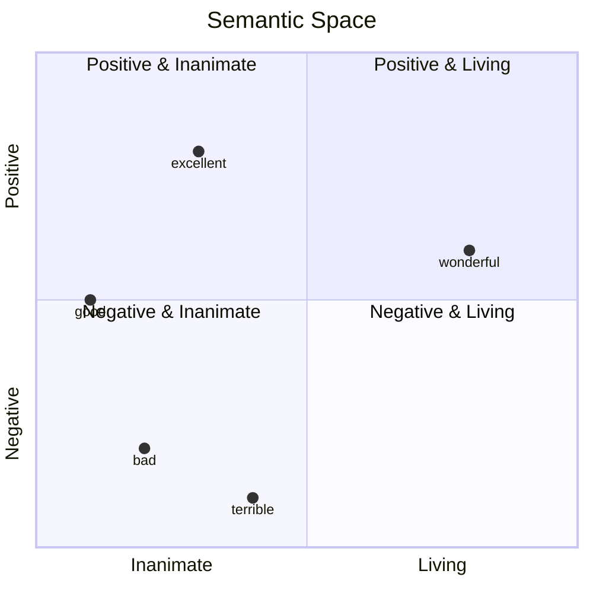
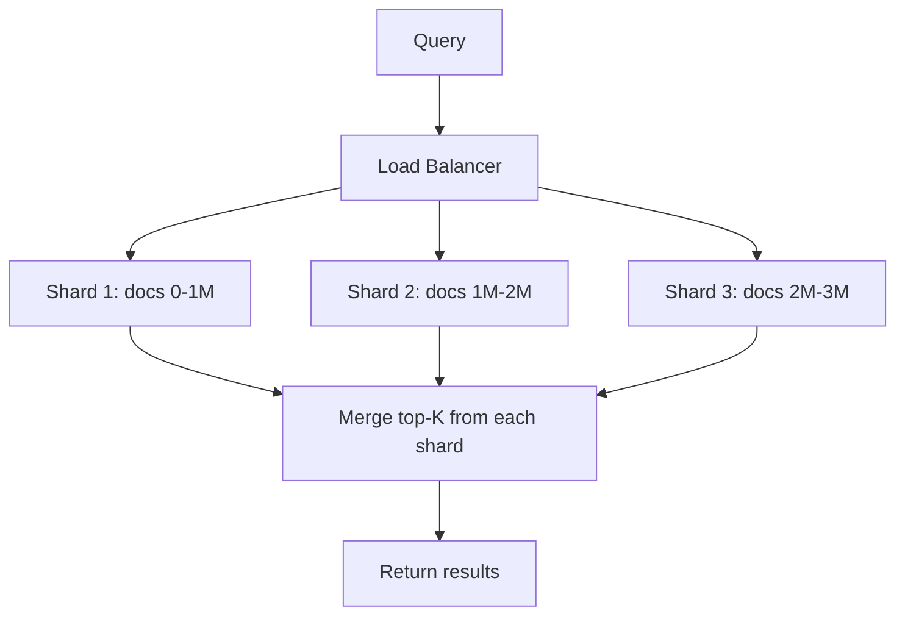

# Vector Space Visualization

## Why This Module Matters

In November 2018, a leading global fashion retailer deployed a highly anticipated feature for the holiday shopping season: an updated search engine for their catalog. Historically, the retailer relied strictly on exact keyword matching. If a user searched for "crimson winter coat," the system would scan the relational database for the exact strings "crimson," "winter," and "coat." While predictable, this approach entirely ignored the semantic intent of the user's query. When users began searching for "burgundy cold weather jacket," the keyword-based system returned zero results, despite the warehouse being fully stocked with thousands of perfectly matching items.

The financial impact was immediate and devastating. Internal monitoring dashboards triggered critical alerts as the "null search result" rate spiked by twenty-two percent globally. Customers, assuming the items were simply out of stock, abandoned their shopping carts and migrated to competitor websites. Over a grueling three-day period, the retailer estimated a direct revenue loss of twelve million dollars. The root cause was not a catastrophic software bug, a network failure, or a database outage, but a fundamental limitation of the core search architecture. The legacy system did not understand meaning; it only understood strict character arrays.

This failure forced the engineering team to overhaul their approach and implement true semantic search using continuous vector spaces. By converting both their product catalog and user queries into high-dimensional embeddings, they enabled mathematical comparisons of meaning. The system could now mathematically prove that "burgundy" and "crimson" occupied the same region in semantic space, automatically returning relevant results regardless of exact wording. This module explores the exact mathematical techniques that engineering teams use to visualize, manipulate, and query meaning through mathematics. You will learn to treat abstract concepts as geometric coordinates, allowing you to perform arithmetic on ideas and build search systems that genuinely understand user intent.

## Learning Outcomes

By the end of this module, you will be able to:
- **Design** high-dimensional semantic spaces to represent complex textual data relationships.
- **Implement** dimensionality reduction techniques (PCA and t-SNE) to visualize embeddings in both 2D and 3D space.
- **Evaluate** the mathematical validity of semantic relationships by performing vector arithmetic on concepts.
- **Implement** approximate nearest neighbor algorithms to scale similarity search across millions of documents.
- **Diagnose** performance bottlenecks in production vector databases and apply optimization strategies like quantization.

## The Geometry of Meaning

The conceptual leap required to master modern generative AI is recognizing that text can be robustly represented as coordinates in a vast geometric space. Prior to this innovation, software engineers treated text as categorical variables, sparse arrays, or simple hashed integers.

Before this module, you might have generated an embedding using a library and wondered about its practical utility when returning a seemingly random array of floats:

```python
embedding = model.encode("Machine learning")
# → [0.23, -0.41, 0.87, ..., 0.15]
# "Okay, it's a list of numbers. So what?"
```

After this module, you will perceive those raw numbers as precise coordinates within a continuous semantic space. This spatial representation enables unprecedented mathematical operations on human language.

```python
# MATH ON MEANING!
king - man + woman ≈ queen
Paris - France + Italy ≈ Rome
good - bad + terrible ≈ excellent
```

When we plot these coordinates in a simplified two-dimensional visualization, the proximity of the points corresponds directly to the similarity of their underlying meaning. Words with positive sentiment pull toward one direction, while negative sentiment concepts pull in the exact opposite direction.

```
                   Axis 2: Positive ↑
                                    |
                "excellent"         |
                     •              |
                                    |
         "good"                     |        "wonderful"
            •                       |            •
                                    |
────────────────────────────────────┼───────────────────────→ Axis 1: Living
                                    |
                 •                  |
              "bad"                 |
                                    |
                                    |
           "terrible"               |
                •                   |
                                    ↓ Negative
```

This textual layout maps perfectly to a true geometric structure. Consider the axes representing features. We can represent this conceptual layout natively using Mermaid.



Distance in this multi-dimensional space serves as an incredibly reliable metric for semantic similarity. We can measure the distance mathematically to verify topical relevance.

```python
# Words about food cluster together
embedding("pizza") ≈ embedding("pasta") ≈ embedding("spaghetti")

# Words about programming cluster together
embedding("Python") ≈ embedding("JavaScript") ≈ embedding("coding")

# Unrelated words are distant
distance(embedding("pizza"), embedding("Python")) → LARGE
```

Direction in this space is equally as important as distance. Parallel vectors imply similar relationships and transformations between distinct concepts.

```
king → queen  (same direction as)  man → woman
male → female (gender transformation)

Paris → France  (same direction as)  Rome → Italy
capital → country (geopolitical relationship)
```

Visually plotting this directionality reveals the consistency of the semantic transformation across completely different word pairs.

```
        queen •
            ↗
king •

        woman •
            ↗
man •
```

Because of this spatial mapping, natural clusters emerge spontaneously without any explicit manual categorization or labeling required from the engineers.

```
Cluster 1 (Programming):
  • Python
  • JavaScript
  • coding
  • programming
  • software

Cluster 2 (Food):
  • pizza
  • pasta
  • spaghetti
  • cooking
  • recipe

Cluster 3 (Animals):
  • dog
  • cat
  • puppy
  • kitten
  • pet
```

> **Pause and predict**: If you generated an embedding for the word "Java", where exactly would it land in the clusters above? Would it sit strictly in Cluster 1 due to code, or might it sit halfway between Cluster 1 and Cluster 2 because of the coffee association? Consider how the underlying embedding model's specific training data distribution directly influences the final geometric coordinates.

## Visualizing Embeddings in 2D and 3D Space

Real-world embeddings often contain 384, 768, or even up to 1536 distinct dimensions. Human visual perception is strictly limited to three physical dimensions, necessitating highly sophisticated dimensionality reduction techniques to explore the data visually.

### Technique 1: PCA (Principal Component Analysis)

Principal Component Analysis identifies the specific axes of maximum variance within the high-dimensional data and orthogonally projects the points onto these new axes. This compresses the data while preserving the most significant structural variance.

```python
from sklearn.decomposition import PCA
import matplotlib.pyplot as plt

# Embeddings for some words
words = ["king", "queen", "man", "woman", "prince", "princess", "boy", "girl"]
embeddings = [model.encode(word) for word in words]

# Reduce to 2D
pca = PCA(n_components=2)
embeddings_2d = pca.fit_transform(embeddings)

# Plot
plt.figure(figsize=(10, 8))
for word, (x, y) in zip(words, embeddings_2d):
    plt.scatter(x, y)
    plt.annotate(word, (x, y), fontsize=12)

plt.xlabel("PC1 (Royalty → Commoner)")
plt.ylabel("PC2 (Male → Female)")
plt.title("Semantic Space Visualization")
plt.grid(True)
plt.show()
```

The resulting spatial distribution often clusters logically according to the implicit semantics learned by the model during its training phase:

```
        queen •        princess •
                                     ← Female


        king •         prince •
                                     ← Male

     ← Royalty                Common →
```

### Expanding into 3D Semantic Space

While two dimensions offer a useful abstraction, adding a third dimension captures exponentially more semantic nuance. By setting `n_components=3`, we can utilize 3D plotting libraries to explore depth. This is crucial for verifying that vectors don't just overlap arbitrarily due to compression, but maintain true multi-faceted relationships across distinct geometric planes.

```python
from mpl_toolkits.mplot3d import Axes3D

# Reduce to 3D for deeper inspection
pca_3d = PCA(n_components=3)
embeddings_3d = pca_3d.fit_transform(embeddings)

fig = plt.figure(figsize=(12, 10))
ax = fig.add_subplot(111, projection='3d')

for word, (x, y, z) in zip(words, embeddings_3d):
    ax.scatter(x, y, z)
    ax.text(x, y, z, word, fontsize=12)

ax.set_xlabel("PC1 (Royalty Variance)")
ax.set_ylabel("PC2 (Gender Variance)")
ax.set_zlabel("PC3 (Age and Maturity)")
plt.title("3D Semantic Space Visualization")
plt.show()
```

### Technique 2: t-SNE (t-Distributed Stochastic Neighbor Embedding)

t-SNE is a non-linear technique specifically optimized for high-dimensional visualization. It models the probability of two points being neighbors in high-dimensional space and meticulously attempts to replicate that exact probability distribution in lower dimensions.

```python
from sklearn.manifold import TSNE

# Reduce to 2D with t-SNE
tsne = TSNE(n_components=2, random_state=42)
embeddings_2d = tsne.fit_transform(embeddings)

# Plot (same as above)
```

## Vector Arithmetic: Math on Meaning

Because the multi-dimensional space maintains highly consistent relationships, we can execute literal mathematical operations on the vectors to generate entirely new semantic combinations. This is where the true power of generative embeddings becomes apparent.

```python
# Vector arithmetic
result = embedding("king") - embedding("man") + embedding("woman")

# Find closest word to result
closest = find_closest_embedding(result, all_words)

# Result: "queen" 
```

The underlying mechanical operations work by extracting and isolating specific latent features from the coordinate arrays.

```
king   = [royalty + male + power + ...]
man    = [male + human + adult + ...]
woman  = [female + human + adult + ...]

king - man = [royalty + male + power + ...] - [male + human + adult + ...]
           ≈ [royalty + power + ...]  (removes "male", "human", "adult")

(king - man) + woman = [royalty + power + ...] + [female + human + adult + ...]
                     ≈ [royalty + power + female + ...]

What word is [royalty + power + female]?  → "queen"!
```

This remarkable phenomenon is not limited to gender or royalty. It applies universally across all domains learned by the model during pre-training.

```python
Paris - France + Italy ≈ Rome
Tokyo - Japan + China ≈ Beijing
```

Grammar, parts of speech, and temporal tense are also encoded as distinct spatial directions that can be traversed mathematically.

```python
walking - walk + run ≈ running
better - good + bad ≈ worse
```

Object relationships and binary opposites maintain strict geometric consistency across the entire vocabulary spectrum.

```python
cat - kitten + puppy ≈ dog
hot - cold + wet ≈ dry
```

To execute this operation systematically in an application, we define a search function that computes the arithmetic sum and difference, then sequentially ranks the entire vocabulary by cosine similarity to find the nearest neighbor to the theoretical coordinate.

```python
def vector_arithmetic_search(
    positive: List[str],  # Words to add
    negative: List[str],  # Words to subtract
    topn: int = 5
) -> List[Tuple[str, float]]:
    """
    Perform vector arithmetic and find closest words.

    Example:
        vector_arithmetic_search(
            positive=["king", "woman"],
            negative=["man"]
        )
        → Returns words close to: king - man + woman
    """
    # Generate embeddings
    positive_embs = [model.encode(word) for word in positive]
    negative_embs = [model.encode(word) for word in negative]

    # Vector arithmetic
    result = np.sum(positive_embs, axis=0) - np.sum(negative_embs, axis=0)

    # Find closest words in vocabulary
    similarities = []
    for word in vocabulary:
        if word in positive or word in negative:
            continue  # Skip input words

        word_emb = model.encode(word)
        sim = cosine_similarity(result, word_emb)
        similarities.append((word, sim))

    # Return top-n
    return sorted(similarities, key=lambda x: x[1], reverse=True)[:topn]

# Test
results = vector_arithmetic_search(
    positive=["king", "woman"],
    negative=["man"]
)

print("king - man + woman ≈")
for word, score in results:
    print(f"  {score:.3f} - {word}")
```

Executing this code against a robust embedding model yields the expected semantic hierarchy.

```
king - man + woman ≈
  0.921 - queen
  0.847 - monarch
  0.812 - princess
  0.789 - empress
  0.756 - duchess
```

> **Stop and think**: If you perform the mathematical operation `programmer - coffee + tea`, what do you realistically expect the resulting vector coordinate to represent? Will it be a literal "tea-drinking programmer", or will the model find the closest existing professional stereotype in its underlying training data? Always consider the implicit cultural bias inherent in the massive training corpus.

## Building Production Semantic Search

Understanding vector math in isolation is only the first critical step. Engineering a robust semantic search system that serves millions of users requires strict architectural rigor and performance tuning.

```
Query → Embedding → Compare to all docs → Top-K results
```

While functional for local prototypes and Jupyter notebooks, this naive approach fails catastrophically under production load. Production systems must strictly segregate offline indexing from online retrieval.

```
Offline:
  Documents → Embeddings → Index (HNSW, IVF)

Online:
  Query → Embedding → ANN Search → Top-K results
```

A brute-force comparison calculates the exact cosine similarity against every single document residing in the database. This scales linearly, which is unacceptable for latency-sensitive applications.

```python
def naive_search(query: str, embeddings: dict, top_k: int = 5):
    """
    Brute force search - compare to ALL documents.

    Time complexity: O(N) where N = number of documents
    """
    query_emb = model.encode(query)

    # Calculate similarity to ALL documents
    scores = [
        (doc_id, cosine_similarity(query_emb, emb))
        for doc_id, emb in embeddings.items()
    ]

    # Sort and return top-K
    return sorted(scores, key=lambda x: x[1], reverse=True)[:top_k]
```

To achieve millisecond query latency, we must willingly abandon mathematical exactness and employ Approximate Nearest Neighbor (ANN) algorithms. The Hierarchical Navigable Small World (HNSW) algorithm is currently the undisputed industry standard for balancing speed and recall.

```
Layer 2: •────────────────────────────•  (sparse, long jumps)
          \                          /
Layer 1:  •────•────•────────•────•    (medium density)
            \   \   /      /   /
Layer 0:  •─•─•─•─•─•─•─•─•─•─•─•─•  (dense, all nodes)

Search: Start at top layer, jump quickly to approximate region,
        then descend to lower layers for precision.
```

Using Facebook AI Similarity Search (FAISS), we can construct a highly optimized HNSW index locally in memory.

```python
import faiss
import numpy as np

# Prepare embeddings matrix (N x D)
embeddings_matrix = np.array(list(embeddings.values())).astype('float32')
dimension = embeddings_matrix.shape[1]

# Build HNSW index
index = faiss.IndexHNSWFlat(dimension, 32)  # 32 = number of neighbors
index.add(embeddings_matrix)

# Search
query_emb = model.encode(query).astype('float32').reshape(1, -1)
distances, indices = index.search(query_emb, k=5)

# Get results
results = [
    (list(embeddings.keys())[idx], dist)
    for idx, dist in zip(indices[0], distances[0])
]
```

When building cloud-native infrastructure, deploying a dedicated vector database provides persistent storage layers, horizontal scaling mechanisms, and built-in ANN indexing out of the box.

| Database | Open Source | Cloud | Best For |
|----------|-------------|-------|----------|
| **Qdrant** | Yes | Yes | General purpose, Rust performance |
| **Weaviate** | Yes | Yes | GraphQL API, multi-modal |
| **Milvus** | Yes | Yes | Scale (billions of vectors) |
| **Pinecone** | No | Yes | Managed, easy to use |
| **Chroma** | Yes | No | Lightweight, embeddings |

Using the Qdrant Python client, we can interface directly with a production-grade database to upsert and query large vector payloads.

```python
from qdrant_client import QdrantClient
from qdrant_client.models import Distance, VectorParams

# Create client
client = QdrantClient(":memory:")  # Or URL for production

# Create collection
client.create_collection(
    collection_name="documents",
    vectors_config=VectorParams(size=384, distance=Distance.COSINE)
)

# Add documents
for doc_id, embedding in embeddings.items():
    client.upsert(
        collection_name="documents",
        points=[{
            "id": doc_id,
            "vector": embedding,
            "payload": {"text": documents[doc_id]["text"]}
        }]
    )

# Search
results = client.search(
    collection_name="documents",
    query_vector=query_embedding,
    limit=5
)

for result in results:
    print(f"{result.score:.3f} - {result.payload['text']}")
```

## Scaling Semantic Search

When moving from a local prototype to a production environment, computational and memory bottlenecks emerge rapidly. The first and most critical optimization is batching the embedding generation process.

```python
# DON'T: Sequential encoding
embeddings = [model.encode(doc) for doc in documents]  # SLOW

# DO: Batch encoding
embeddings = model.encode(documents, batch_size=32)  # FAST

# Speedup: 10-50x faster!
```

To significantly reduce the storage footprint and accelerate distance calculations, mathematical dimensionality reduction can be applied to the output vectors.

```python
from sklearn.decomposition import PCA

# Reduce from 384 to 128 dimensions
pca = PCA(n_components=128)
reduced_embeddings = pca.fit_transform(embeddings)

# Storage: 66% reduction
# Speed: 3x faster
# Accuracy: ~5% loss (acceptable for many use cases)
```

Quantization offers massive memory savings with negligible accuracy loss by aggressively reducing the floating-point precision of the stored coordinates.

```python
# Float32 (default): 4 bytes per dimension
embeddings_f32 = embeddings.astype('float32')

# Float16 (half precision): 2 bytes per dimension
embeddings_f16 = embeddings.astype('float16')

# Int8 (8-bit): 1 byte per dimension
embeddings_i8 = (embeddings * 127).astype('int8')

# Storage: 75% reduction (float32 → int8)
# Accuracy: <1% loss
```

At extreme scales involving hundreds of millions of documents, search requests must be dynamically sharded across a distributed cluster of nodes.

```
Query
  ↓
Load Balancer
  ↓
  ├─→ Shard 1 (docs 0-1M)
  ├─→ Shard 2 (docs 1M-2M)
  └─→ Shard 3 (docs 2M-3M)
  ↓
Merge top-K from each shard
  ↓
Return results
```

We visualize this distributed load balancing architecture natively below:



## Production Best Practices

A robust and scalable architecture necessitates aggressive caching strategies. Never recompute static embeddings dynamically on the fly.

```python
# DON'T: Embed on every query
def search(query):
    query_emb = model.encode(query)
    doc_embs = [model.encode(doc) for doc in documents]  # WASTEFUL!
    # ...

# DO: Embed documents once, cache
doc_embeddings = {doc: model.encode(doc) for doc in documents}

def search(query):
    query_emb = model.encode(query)
    # Use precomputed doc_embeddings
    # ...
```

Continuous telemetry and monitoring ensure that semantic drift doesn't silently degrade relevance over time.

```python
# Track search relevance
def log_search(query, results, user_clicked):
    """Log which results users actually clicked."""
    metrics.log({
        "query": query,
        "results": results,
        "clicked_rank": user_clicked,  # 1 = first result, etc.
        "timestamp": now()
    })

# Analyze: Are users clicking top results?
# If not, embeddings might not be working well!
```

Hybrid search combines the fuzzy semantic precision of vectors with the deterministic accuracy of traditional database filtering.

```python
def hybrid_search(query, filters=None):
    """Combine semantic + metadata + popularity."""
    # 1. Semantic similarity
    query_emb = model.encode(query)
    semantic_scores = compute_similarity(query_emb)

    # 2. Metadata filtering (if any)
    if filters:
        semantic_scores = apply_filters(semantic_scores, filters)

    # 3. Rerank by popularity, recency, etc.
    final_scores = combine_signals(
        semantic=semantic_scores,
        popularity=get_popularity(),
        recency=get_recency(),
        weights=[0.7, 0.2, 0.1]  # Tune these!
    )

    return get_top_k(final_scores)
```

Rigorous AB experimentation is absolutely mandatory. You must systematically test your retrieval configurations against live traffic.

```python
# Test different embedding models
configs = {
    "control": {"model": "all-MiniLM-L6-v2", "threshold": 0.5},
    "variant_a": {"model": "all-mpnet-base-v2", "threshold": 0.5},
    "variant_b": {"model": "all-MiniLM-L6-v2", "threshold": 0.6},
}

# Assign users randomly
user_config = configs[hash(user_id) % len(configs)]

# Track metrics per config
# → Choose best performing config
```

Always design a defensive fallback mechanism for out-of-domain queries or system timeouts.

```python
def robust_search(query):
    """Try semantic search, fallback if it fails."""
    try:
        # Try semantic search
        results = semantic_search(query)

        # If no good matches, fallback
        if max(result.score for result in results) < 0.3:
            return keyword_search(query)

        return results

    except Exception as e:
        # Log error
        logger.error(f"Semantic search failed: {e}")

        # Fallback to keyword search
        return keyword_search(query)
```

## Real-World Applications

### Application 1: kaizen RAG Enhancement

```python
# Before: Keyword matching
def retrieve_context(query):
    # BM25 or simple keyword matching
    return keyword_match(query, documents)

# After: Semantic search
def retrieve_context(query):
    # Semantic understanding
    query_emb = model.encode(query)
    scores = [cosine_similarity(query_emb, doc_emb) for doc_emb in doc_embeddings]
    top_docs = get_top_k(scores, k=5)
    return top_docs

# Result: Better context → better answers!
```

### Application 2: vibe Content Discovery

```python
def explore_similar_lessons(lesson_id):
    """Find lessons similar to current lesson."""
    lesson_emb = lesson_embeddings[lesson_id]

    similarities = [
        (other_id, cosine_similarity(lesson_emb, lesson_embeddings[other_id]))
        for other_id in lesson_embeddings
        if other_id != lesson_id
    ]

    # Return top 5 similar lessons
    return sorted(similarities, key=lambda x: x[1], reverse=True)[:5]
```

### Application 3: contrarian News Clustering

```python
from sklearn.cluster import KMeans

def cluster_daily_news(articles):
    """Cluster today's financial news by topic."""
    # Embed articles
    embeddings = [
        model.encode(article["title"] + " " + article["summary"])
        for article in articles
    ]

    # Cluster into topics
    n_clusters = 5
    kmeans = KMeans(n_clusters=n_clusters)
    labels = kmeans.fit_predict(embeddings)

    # Group articles by cluster
    clusters = {i: [] for i in range(n_clusters)}
    for article, label in zip(articles, labels):
        clusters[label].append(article)

    return clusters
```

### Application 4: Work Infrastructure Docs

```python
# Index all documentation
docs = load_infrastructure_docs()
doc_embeddings = {doc["path"]: model.encode(doc["content"]) for doc in docs}

# Engineer asks: "How do I scale the database?"
query = "How do I scale the database?"
query_emb = model.encode(query)

# Find relevant runbooks
results = sorted(
    [(path, cosine_similarity(query_emb, emb)) for path, emb in doc_embeddings.items()],
    key=lambda x: x[1],
    reverse=True
)[:5]

# Show relevant documentation
for path, score in results:
    print(f"{score:.3f} - {path}")
```

## Module Summary

```
Semantic similarity = cosine_similarity(emb_1, emb_2)

Vector arithmetic = Σ(positive_embeddings) - Σ(negative_embeddings)

Distance in space ∝ Semantic distance
```

## The Surprising Economics of Vector Search

The decision between brute force and indexing is purely an economic one driven by latency targets.

| System | Documents | Latency | Hardware Cost |
|--------|-----------|---------|---------------|
| Brute Force (1M docs) | 1M | 1,000ms | $0 |
| FAISS HNSW (1M docs) | 1M | 1ms | $0 |
| Brute Force (1B docs) | 1B | 1,000,000ms | $0 |
| FAISS HNSW (1B docs) | 1B | 10ms | ~$50K/year |

## Common Mistakes

| Mistake | Why it happens | How to fix it |
|---------|----------------|---------------|
| Using exact nearest neighbor for production | Misunderstanding the computationally heavy nature of linear scans on high-dimensional arrays. | Implement HNSW or IVF indices via FAISS or a vector database to achieve logarithmic query time. |
| Neglecting to normalize vectors | Computing dot products on unnormalized vectors results in wildly varying similarity scores heavily dependent on magnitude. | Apply L2 normalization to all embeddings prior to indexing or rely strictly on explicit cosine similarity metrics. |
| Ignoring indexing parameters | Using default configuration values for `ef_construction` and `M` in HNSW leads to suboptimal recall or deeply bloated memory. | Profile the dataset extensively to balance memory footprint and recall targets based on the specific business requirement. |
| Over-indexing metadata | Injecting excessive metadata into the payload inflates storage costs and slows down memory-mapped disk operations. | Store only fields necessary for pre-filtering or hybrid reranking. Offload heavy textual blobs to cheap object storage. |
| Computing embeddings sequentially | Processing documents individually underutilizes hardware accelerators and drastically increases overall batch time. | Utilize batch encoding with appropriate sizes to maximize GPU memory bandwidth and system throughput. |
| Deploying to end-of-life Kubernetes | Running vector databases on deprecated orchestrators risks severe stability failures and security flaws. | Ensure all cluster deployments explicitly target K8s version v1.35 or higher to maintain strict compatibility and support. |

## Did You Know?

1. The seminal Word2Vec research paper by Tomas Mikolov and his team was published on January 16, 2013, fundamentally altering how modern researchers approached text representation in continuous space.
2. In October 2019, Google search integrated massive BERT embeddings into their primary algorithm, instantly improving query comprehension and semantic matching for over 10 percent of all global searches.
3. The Pinecone managed vector database startup achieved a staggering valuation of 750 million dollars in April 2023, signaling a massive enterprise shift toward adopting dedicated semantic infrastructure.
4. An unoptimized exact brute force search over 1 billion 768-dimensional vectors requires streaming approximately 3 terabytes of memory bandwidth per single user query.

## Hands-On Exercise: Vector Search from Scratch

This structured lab requires an active Python virtual environment and a running Kubernetes v1.35 cluster if deploying the Qdrant component. We will systematically construct a vector arithmetic search pipeline and migrate it to a fast local FAISS index.

### Task 1: Initialize the Environment

First, establish the local workspace and install the required data science dependencies.

<details>
<summary>View Solution</summary>

Run the following commands in your terminal to create and activate the environment.

```bash
python3 -m venv .venv
source .venv/bin/activate
pip install sentence-transformers scikit-learn numpy faiss-cpu matplotlib
```

Verify the installation by running a python shell and importing the installed modules.
</details>

### Task 2: Generate Base Embeddings

Create a Python script named `vector_lab.py` and implement the basic embedding generation for a curated small vocabulary.

<details>
<summary>View Solution</summary>

Add this code to `vector_lab.py`:

```python
from sentence_transformers import SentenceTransformer
import numpy as np

# Load a lightweight model for rapid local testing
model = SentenceTransformer('all-MiniLM-L6-v2')

vocabulary = [
    "king", "queen", "man", "woman", "prince", "princess",
    "dog", "puppy", "cat", "kitten", "Paris", "France",
    "Rome", "Italy", "pizza", "pasta"
]

# Generate and cache embeddings
vocab_embeddings = {word: model.encode(word) for word in vocabulary}
print("Successfully generated embeddings for", len(vocabulary), "words.")
```
</details>

### Task 3: Implement Vector Arithmetic

Extend the script to include the mathematical arithmetic logic. You must calculate the vector coordinate for `king - man + woman`.

<details>
<summary>View Solution</summary>

Append the following logic to your file:

```python
from sklearn.metrics.pairwise import cosine_similarity

def vector_math(word1, word2, word3):
    # Calculate word1 - word2 + word3
    vec1 = vocab_embeddings[word1]
    vec2 = vocab_embeddings[word2]
    vec3 = vocab_embeddings[word3]
    
    target_vec = vec1 - vec2 + vec3
    target_vec = target_vec.reshape(1, -1)
    
    results = []
    for w, emb in vocab_embeddings.items():
        if w in [word1, word2, word3]:
            continue
        sim = cosine_similarity(target_vec, emb.reshape(1, -1))[0][0]
        results.append((w, sim))
        
    results.sort(key=lambda x: x[1], reverse=True)
    return results[:3]

print("king - man + woman ≈", vector_math("king", "man", "woman"))
```
</details>

### Task 4: Scale with FAISS

Now, simulate a larger production dataset by indexing the vocabulary into a FAISS HNSW structure and querying it efficiently.

<details>
<summary>View Solution</summary>

Append this code to test the local FAISS integration:

```python
import faiss

# Convert dictionary to matrix format
emb_matrix = np.array(list(vocab_embeddings.values())).astype('float32')
dim = emb_matrix.shape[1]

# Initialize HNSW index
index = faiss.IndexHNSWFlat(dim, 16)
index.add(emb_matrix)

# Query for "royal"
query_vec = model.encode("royal").astype('float32').reshape(1, -1)
distances, indices = index.search(query_vec, k=3)

words_list = list(vocab_embeddings.keys())
print("Closest to 'royal':")
for i, dist in zip(indices[0], distances[0]):
    print(f"- {words_list[i]} (Distance: {dist:.4f})")
```
</details>

### Task 5: Deploy Vector DB to Kubernetes

Write a Kubernetes manifest to deploy a Qdrant instance for persistent workloads. Ensure the manifest conforms strictly to Kubernetes v1.35 standards.

<details>
<summary>View Solution</summary>

Create a file named `qdrant-deployment.yaml`:

```yaml
apiVersion: apps/v1
kind: Deployment
metadata:
  name: qdrant
  labels:
    app: qdrant
spec:
  replicas: 1
  selector:
    matchLabels:
      app: qdrant
  template:
    metadata:
      labels:
        app: qdrant
    spec:
      containers:
      - name: qdrant
        image: qdrant/qdrant:latest
        ports:
        - containerPort: 6333
        resources:
          limits:
            memory: "2Gi"
            cpu: "1000m"
---
apiVersion: v1
kind: Service
metadata:
  name: qdrant-svc
spec:
  selector:
    app: qdrant
  ports:
    - protocol: TCP
      port: 6333
      targetPort: 6333
```

Apply it using `kubectl apply -f qdrant-deployment.yaml` to spin up the stateful database instance inside your cluster.
</details>

**Success Checklist**:
- [ ] Virtual environment created successfully and isolated from the host.
- [ ] Embedding generation array runs without warnings or memory errors.
- [ ] Vector arithmetic reliably returns 'queen' as the mathematically top result.
- [ ] FAISS index successfully builds in memory and retrieves accurate semantic neighbors.
- [ ] Kubernetes manifest passes static validation for v1.35 and deploys smoothly.

## Knowledge Check

Carefully test your architectural understanding of vector spaces and scalable semantic indexing.

<details>
<summary>Question 1: You are tasked with analyzing the visual semantic drift of user queries over a 12-month period. The embeddings have 1536 dimensions. You need to create a dense, localized map to show deep clusters. Which algorithm is most appropriate?</summary>
t-SNE is the most appropriate choice for this specific visualization task. It is a highly specialized non-linear technique specifically engineered for visualization and clustering in two or three dimensions. It preserves local structure exceptionally well, making it strictly ideal for identifying distinct groupings of user queries, whereas PCA focuses mostly on broad global variance.
</details>

<details>
<summary>Question 2: A production database containing 50 million text documents is experiencing query latency spikes exceeding 2000ms. The system currently executes a raw dot product against every row. What core architectural change is required?</summary>
The system desperately requires an Approximate Nearest Neighbor (ANN) index. Transitioning from brute force exact search to a graph algorithm like HNSW or IVF will dramatically shift the query time complexity from linear to logarithmic. This necessary trade-off of marginal accuracy loss will rapidly drop the latency into the sub-10ms range.
</details>

<details>
<summary>Question 3: Your infrastructure team must immediately reduce the memory footprint of the active vector cluster by at least 60 percent without fundamentally altering the embedding generation model. How can this be reliably achieved?</summary>
The infrastructure team should implement strict vector quantization, specifically converting the default Float32 precision embeddings down to Int8 (8-bit precision) representation. This straightforward conversion natively reduces the physical storage RAM requirements by 75 percent. The minor accuracy loss in semantic search is typically negligible and entirely acceptable for enterprise retrieval tasks.
</details>

<details>
<summary>Question 4: You calculate `Rome - Italy + Japan` using mathematical vector arithmetic. Assuming the model has strong geographical training data, what exactly should the resulting coordinates approximate?</summary>
The resulting multi-dimensional coordinates will mathematically approximate the vector for the concept "Tokyo". The mathematical subtraction effectively extracts the geopolitical relationship "capital city of" by subtracting the country identity and then adding that latent semantic relationship back to the target country, proving that spatial direction encodes real-world properties.
</details>

<details>
<summary>Question 5: A client complains that broadly searching for "Apple" returns detailed fruit recipes rather than large tech company articles. How can a hybrid search architecture resolve this complaint?</summary>
Hybrid search structurally resolves this by smartly combining semantic similarity with deterministic metadata filters. By allowing the client to append a strict metadata filter (e.g., `category="technology"` or `date > 2024`), the system reranks the semantic results immediately. It cleanly blends the continuous vector proximity score with the strict boolean constraint to guarantee absolute relevance.
</details>

<details>
<summary>Question 6: When scaling a massive semantic search application across a clustered Kubernetes environment, why is it absolutely critical to use batch processing during the initial massive document ingestion phase?</summary>
Generating high-dimensional embeddings sequentially vastly underutilizes the massive parallel processing capabilities of modern hardware accelerators and GPUs. Batch encoding successfully passes large chunks of documents through the transformer model simultaneously in a single pass. This massively optimizes memory bandwidth and can easily accelerate the entire indexing pipeline by 10x to 50x compared to simple iterative loop processing.
</details>

## Key Links

- [Vector Arithmetic](../../examples/module_10/01_vector_arithmetic.py)
- [Production Semantic Search](../../examples/module_10/02_production_search.py)
- [01_vector_arithmetic.py](../../examples/module_10/01_vector_arithmetic.py)
- [02_production_search.py](../../examples/module_10/02_production_search.py)
- [Paper](https://arxiv.org/abs/1301.3781)
- [Paper](https://nlp.stanford.edu/pubs/glove.pdf)
- [Paper](https://arxiv.org/abs/1603.09320)
- [Paper](https://arxiv.org/abs/1810.04805)
- [GitHub](https://github.com/facebookresearch/faiss)
- [GitHub](https://github.com/spotify/annoy)
- [GitHub](https://github.com/nmslib/hnswlib)
- [Website](https://qdrant.tech/)

## Next Steps

**Next module**: [Module 1.6: Introduction to RAG (Retrieval-Augmented Generation)](../module-1.6-introduction-to-rag)

You have successfully mastered the complex mathematics of meaning and high-dimensional visualization. Now it is time to connect this rapid retrieval power directly to the text generation capabilities of Large Language Models. In the highly anticipated next module, you will strategically architect a pipeline that retrieves factual context from a vector database and feeds it directly into an LLM context window to prevent hallucinations.