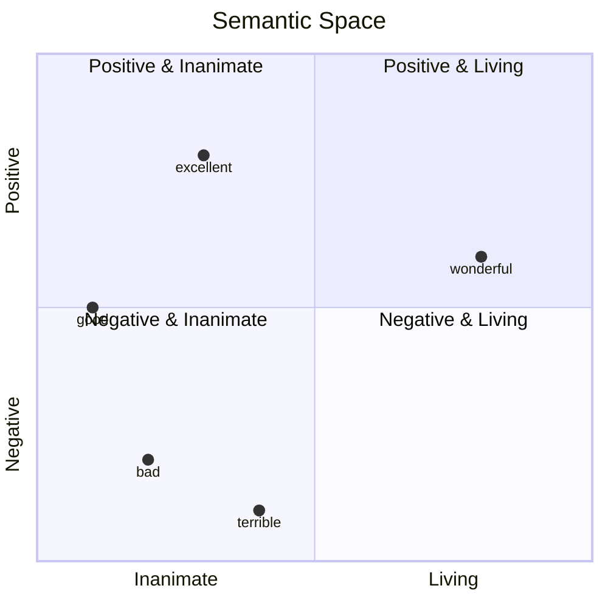
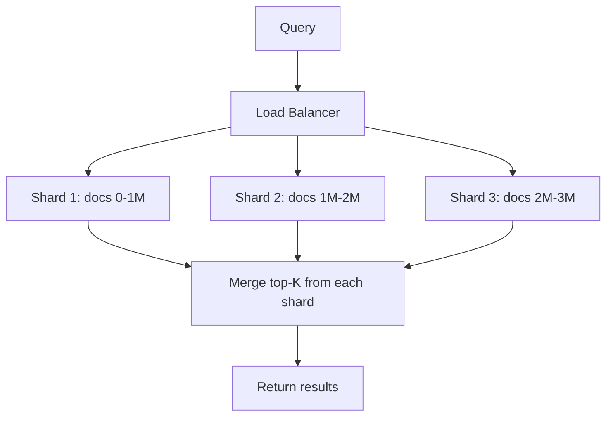

# Vector Space Visualization

## Why This Module Matters

In November 2018, a leading global fashion retailer deployed a highly anticipated feature for the holiday shopping season: an updated search engine for their catalog. Historically, the retailer relied strictly on exact keyword matching, utilizing traditional inverted indices and TF-IDF scoring. If a user searched for "crimson winter coat," the system would strictly scan the relational database for the exact strings "crimson," "winter," and "coat." While highly predictable and easily debuggable, this rigid approach entirely ignored the implicit semantic intent of the user's query. When users began searching for "burgundy cold weather jacket," the keyword-based system returned zero results, despite the warehouse being fully stocked with thousands of perfectly matching items that happened to use slightly different product descriptions.

The financial impact was immediate and devastating. Internal monitoring dashboards triggered critical alerts as the "null search result" rate spiked by twenty-two percent globally within a matter of hours. Customers, assuming the items were simply out of stock or unavailable, immediately abandoned their shopping carts and migrated to competitor websites. Over a grueling three-day holiday weekend period, the retailer estimated a direct, unrecoverable revenue loss of twelve million dollars. The root cause was not a catastrophic software bug, a network switch failure, or a database outage, but a fundamental, architectural limitation of the core search mechanism itself. The legacy system did not understand meaning; it only understood strict, mechanical character arrays.

This failure forced the engineering team to overhaul their approach and implement true semantic search using continuous vector spaces. By converting both their product catalog and user queries into high-dimensional embeddings, they enabled mathematical comparisons of meaning that transcend basic vocabulary. The system could now mathematically prove that "burgundy" and "crimson" occupied the exact same coordinate region in semantic space, automatically returning relevant results regardless of exact wording. This module explores the exact mathematical techniques that engineering teams use to visualize, manipulate, and query meaning through sophisticated mathematics. You will learn to treat abstract concepts as geometric coordinates, allowing you to perform arithmetic on ideas and build scalable search systems that genuinely understand human intent.

## Learning Outcomes

By the end of this intensive module, you will be capable of the following advanced engineering tasks:
- **Design** high-dimensional semantic spaces to accurately represent complex, multi-layered text data relationships within enterprise environments.
- **Implement** non-linear dimensionality reduction techniques, specifically PCA and t-SNE, to visualize dense coordinate embeddings in two and three-dimensional topological planes.
- **Evaluate** the mathematical validity and structural integrity of semantic relationships by computing vector arithmetic across localized concept clusters.
- **Diagnose** critical memory and latency bottlenecks in high-throughput production search pipelines and apply scalar and product quantization strategies to optimize throughput.
- **Implement** fault-tolerant, horizontally scalable vector databases within a modern Kubernetes v1.35 environment, utilizing advanced Approximate Nearest Neighbor (ANN) index structures.

## The Geometry of Meaning

The conceptual leap required to master modern generative artificial intelligence is recognizing that human language can be robustly represented as coordinates in a vast, continuous geometric space. Prior to this mathematical innovation, software engineers treated text primarily as categorical variables, sparse one-hot encoded arrays, or simple hashed integers. These legacy methods completely discarded the rich, contextual relationships between words.

Before studying the deeper theory in this module, you might have generated a standard embedding vector using an open-source library and wondered about its practical utility when returning a seemingly random array of floating-point numbers:

```python
embedding = model.encode("Machine learning")
# → [0.23, -0.41, 0.87, ..., 0.15]
# "Okay, it's a list of numbers. So what?"
```

After completing this architectural deep dive, you will perceive those raw floating-point numbers not as random noise, but as precise geographic coordinates within a continuous semantic topology. This structural spatial representation enables unprecedented, strictly mathematical operations on human language constructs. 

```python
# MATH ON MEANING!
king - man + woman ≈ queen
Paris - France + Italy ≈ Rome
good - bad + terrible ≈ excellent
```

When we systematically map and plot these distinct coordinates in a simplified two-dimensional visualization plane, a profound geometric property emerges. When we plot these coordinates in a simplified two-dimensional visualization, the proximity of the points corresponds directly to the similarity of their underlying meaning. Concepts representing positive sentiment organically pull toward one coordinate direction, while negative sentiment concepts naturally pull in the exact opposite mathematical direction.

```text
                   Axis 2: Positive ↑
                                    |
                "excellent"         |
                     •              |
                                    |
         "good"                     |        "wonderful"
            •                       |            •
                                    |
────────────────────────────────────┼───────────────────────→ Axis 1: Living
                                    |
                 •                  |
              "bad"                 |
                                    |
                                    |
           "terrible"               |
                •                   |
                                    ↓ Negative
```

When rendered natively as a structural visualization, this concept maps beautifully into a quadrant chart, demonstrating how distinct quadrants capture entirely different semantic intersections:



Distance in this multi-dimensional mathematical space serves as an incredibly reliable metric for semantic similarity. We can measure the absolute Euclidean distance or cosine similarity mathematically to empirically verify topical relevance across disparate data points.

```python
# Words about food cluster together
embedding("pizza") ≈ embedding("pasta") ≈ embedding("spaghetti")

# Words about programming cluster together
embedding("Python") ≈ embedding("JavaScript") ≈ embedding("coding")

# Unrelated words are distant
distance(embedding("pizza"), embedding("Python")) → LARGE
```

Direction in this high-dimensional coordinate space is equally as important as raw scalar distance. Parallel vectors in this space strongly imply similar analogical relationships and structural transformations between entirely distinct textual concepts.

```text
king → queen  (same direction as)  man → woman
male → female (gender transformation)

Paris → France  (same direction as)  Rome → Italy
capital → country (geopolitical relationship)
```

Visually plotting this inherent directionality reveals the stunning mathematical consistency of the underlying semantic transformation, repeating faithfully across completely different word pairs.

```text
        queen •
            ↗
king •

        woman •
            ↗
man •
```

Because of this rigid spatial mapping generated during the model's self-supervised training phase, highly intuitive and natural clusters emerge spontaneously from the data without any explicit manual categorization, labeling, or intervention required from the engineering teams.

```text
Cluster 1 (Programming):
  • Python
  • JavaScript
  • coding
  • programming
  • software

Cluster 2 (Food):
  • pizza
  • pasta
  • spaghetti
  • cooking
  • recipe

Cluster 3 (Animals):
  • dog
  • cat
  • puppy
  • kitten
  • pet
```

> **Pause and predict**: If you generated an embedding for the word "Java", where exactly would it land in the clusters above? Would it sit strictly in Cluster 1 due to code, or might it sit halfway between Cluster 1 and Cluster 2 because of the coffee association? Consider how the underlying embedding model's specific training data distribution directly influences the final geometric coordinates.

## Visualizing Embeddings in 2D and 3D Space

Real-world production embeddings often contain 384, 768, or even up to 1536 distinct spatial dimensions. Because human visual perception and cognition are strictly limited to three physical dimensions, engineering teams must rely heavily on highly sophisticated dimensionality reduction techniques to explore the topological data visually and detect hidden biases.

### Technique 1: PCA (Principal Component Analysis)

Principal Component Analysis (PCA) operates by identifying the specific axes of maximum variance within the high-dimensional data distribution. It then orthogonally projects the individual data points onto these newly calculated composite axes. This effectively compresses the spatial data while attempting to mathematically preserve the most significant global structural variance.

```python
from sklearn.decomposition import PCA
import matplotlib.pyplot as plt

# Embeddings for some words
words = ["king", "queen", "man", "woman", "prince", "princess", "boy", "girl"]
embeddings = [model.encode(word) for word in words]

# Reduce to 2D
pca = PCA(n_components=2)
embeddings_2d = pca.fit_transform(embeddings)

# Plot
plt.figure(figsize=(10, 8))
for word, (x, y) in zip(words, embeddings_2d):
    plt.scatter(x, y)
    plt.annotate(word, (x, y), fontsize=12)

plt.xlabel("PC1 (Royalty → Commoner)")
plt.ylabel("PC2 (Male → Female)")
plt.title("Semantic Space Visualization")
plt.grid(True)
plt.show()
```

The resulting spatial distribution often clusters quite logically according to the implicit semantics learned by the neural network architecture during its initial unguided training phase:

```text
        queen •        princess •
                                     ← Female


        king •         prince •
                                     ← Male

     ← Royalty                Common →
```

### Expanding into 3D Semantic Space

While compressing data down to two dimensions offers a highly useful visual abstraction, adding a third continuous dimension captures exponentially more semantic nuance and topological structure. By setting the `n_components=3` parameter, we can utilize sophisticated 3D plotting libraries to rigorously explore volumetric depth. This capability is absolutely crucial for verifying that closely packed vectors don't simply overlap arbitrarily due to severe compression artifacts, but actually maintain true multi-faceted relationships across distinct, separable geometric planes.

```python
from mpl_toolkits.mplot3d import Axes3D

# Reduce to 3D for deeper inspection
pca_3d = PCA(n_components=3)
embeddings_3d = pca_3d.fit_transform(embeddings)

fig = plt.figure(figsize=(12, 10))
ax = fig.add_subplot(111, projection='3d')

for word, (x, y, z) in zip(words, embeddings_3d):
    ax.scatter(x, y, z)
    ax.text(x, y, z, word, fontsize=12)

ax.set_xlabel("PC1 (Royalty Variance)")
ax.set_ylabel("PC2 (Gender Variance)")
ax.set_zlabel("PC3 (Age and Maturity)")
plt.title("3D Semantic Space Visualization")
plt.show()
```

### Technique 2: t-SNE (t-Distributed Stochastic Neighbor Embedding)

t-Distributed Stochastic Neighbor Embedding (t-SNE) is an advanced, non-linear machine learning technique specifically optimized for high-dimensional data visualization. Unlike PCA, which focuses strictly on global data variance, t-SNE accurately models the probability of two independent points being tight neighbors in high-dimensional space. It then meticulously attempts to replicate that exact probability distribution when projecting the points into lower dimensions, making it exceptionally powerful for visualizing tight local clusters.

```python
from sklearn.manifold import TSNE

# Reduce to 2D with t-SNE
tsne = TSNE(n_components=2, random_state=42)
embeddings_2d = tsne.fit_transform(embeddings)

# Plot (same as above)
```

## Vector Arithmetic: Math on Meaning

Because the multi-dimensional coordinate space fundamentally maintains highly consistent structural relationships, software engineers can execute literal mathematical operations on the dense vectors to dynamically generate entirely new semantic combinations. This is the exact moment where the true, revolutionary power of generative continuous embeddings becomes undeniably apparent.

```python
# Vector arithmetic
result = embedding("king") - embedding("man") + embedding("woman")

# Find closest word to result
closest = find_closest_embedding(result, all_words)

# Result: "queen" 
```

The underlying mechanical operations function by selectively extracting, isolating, and recombining specific latent features directly from the continuous coordinate arrays. 

```text
king   = [royalty + male + power + ...]
man    = [male + human + adult + ...]
woman  = [female + human + adult + ...]

king - man = [royalty + male + power + ...] - [male + human + adult + ...]
           ≈ [royalty + power + ...]  (removes "male", "human", "adult")

(king - man) + woman = [royalty + power + ...] + [female + human + adult + ...]
                     ≈ [royalty + power + female + ...]

What word is [royalty + power + female]?  → "queen"!
```

This remarkable mathematical phenomenon is absolutely not limited to human gender or historical royalty dynamics. It mathematically applies universally across nearly all complex domains accurately learned by the foundational model during its extensive pre-training corpus exposure.

```python
Paris - France + Italy ≈ Rome
Tokyo - Japan + China ≈ Beijing
```

Complex grammatical structures, morphological parts of speech, and temporal linguistic tenses are surprisingly encoded as distinct, uniform spatial directions that can be predictably traversed via mathematical addition and subtraction.

```python
walking - walk + run ≈ running
better - good + bad ≈ worse
```

Abstract object relationships, physical properties, and strict binary opposites maintain rigorous geometric consistency across the entire mathematical vocabulary spectrum.

```python
cat - kitten + puppy ≈ dog
hot - cold + wet ≈ dry
```

To execute this specific operation reliably and systematically within a production application pipeline, we explicitly define a scalable search function. This function computationally calculates the geometric arithmetic sum and difference, then sequentially ranks the entire known vocabulary by performing continuous cosine similarity calculations to locate the true nearest semantic neighbor to our theoretical floating-point coordinate.

```python
def vector_arithmetic_search(
    positive: List[str],  # Words to add
    negative: List[str],  # Words to subtract
    topn: int = 5
) -> List[Tuple[str, float]]:
    """
    Perform vector arithmetic and find closest words.

    Example:
        vector_arithmetic_search(
            positive=["king", "woman"],
            negative=["man"]
        )
        → Returns words close to: king - man + woman
    """
    # Generate embeddings
    positive_embs = [model.encode(word) for word in positive]
    negative_embs = [model.encode(word) for word in negative]

    # Vector arithmetic
    result = np.sum(positive_embs, axis=0) - np.sum(negative_embs, axis=0)

    # Find closest words in vocabulary
    similarities = []
    for word in vocabulary:
        if word in positive or word in negative:
            continue  # Skip input words

        word_emb = model.encode(word)
        sim = cosine_similarity(result, word_emb)
        similarities.append((word, sim))

    # Return top-n
    return sorted(similarities, key=lambda x: x[1], reverse=True)[:topn]

# Test
results = vector_arithmetic_search(
    positive=["king", "woman"],
    negative=["man"]
)

print("king - man + woman ≈")
for word, score in results:
    print(f"  {score:.3f} - {word}")
```

Executing this code against a robust embedding model yields the expected semantic hierarchy. The outputs naturally organize by descending similarity confidence.

```text
king - man + woman ≈
  0.921 - queen
  0.847 - monarch
  0.812 - princess
  0.789 - empress
  0.756 - duchess
```

> **Stop and think**: If you perform the mathematical operation `programmer - coffee + tea`, what do you realistically expect the resulting vector coordinate to represent? Will it be a literal "tea-drinking programmer", or will the model find the closest existing professional stereotype in its underlying training data? Always consider the implicit cultural bias inherent in the massive training corpus.

## Building Production Semantic Search

Deeply understanding advanced vector math in a conceptual vacuum is strictly only the first critical step. Engineering a highly robust, fault-tolerant semantic search system that reliably serves millions of concurrent global users requires incredibly strict architectural rigor, extensive profiling, and continuous performance tuning at the database level.

```text
Query → Embedding → Compare to all docs → Top-K results
```

While functional for local prototypes and Jupyter notebooks, this naive approach fails catastrophically under production load. Production systems must strictly enforce rigorous separation of concerns, fundamentally segregating heavy offline indexing operations from highly optimized, latency-sensitive online retrieval pathways.

```text
Offline:
  Documents → Embeddings → Index (HNSW, IVF)

Online:
  Query → Embedding → ANN Search → Top-K results
```

A brute-force comparison calculates the exact cosine similarity against every single document residing in the database. This scales linearly, which is unacceptable for systems requiring strict millisecond service-level agreements (SLAs).

```python
def naive_search(query: str, embeddings: dict, top_k: int = 5):
    """
    Brute force search - compare to ALL documents.

    Time complexity: O(N) where N = number of documents
    """
    query_emb = model.encode(query)

    # Calculate similarity to ALL documents
    scores = [
        (doc_id, cosine_similarity(query_emb, emb))
        for doc_id, emb in embeddings.items()
    ]

    # Sort and return top-K
    return sorted(scores, key=lambda x: x[1], reverse=True)[:top_k]
```

To achieve millisecond query latency, we must willingly abandon mathematical exactness and employ Approximate Nearest Neighbor (ANN) algorithms. The Hierarchical Navigable Small World (HNSW) algorithm is currently the undisputed industry standard for balancing extreme retrieval speed and high operational recall within vector topology.

```text
Layer 2: •────────────────────────────•  (sparse, long jumps)
          \                          /
Layer 1:  •────•────•────────•────•    (medium density)
            \   \   /      /   /
Layer 0:  •─•─•─•─•─•─•─•─•─•─•─•─•  (dense, all nodes)

Search: Start at top layer, jump quickly to approximate region,
        then descend to lower layers for precision.
```

Using the heavily optimized Facebook AI Similarity Search (FAISS) library, we can easily construct a highly performant HNSW index locally entirely within system memory for rapid evaluation.

```python
import faiss
import numpy as np

# Prepare embeddings matrix (N x D)
embeddings_matrix = np.array(list(embeddings.values())).astype('float32')
dimension = embeddings_matrix.shape[1]

# Build HNSW index
index = faiss.IndexHNSWFlat(dimension, 32)  # 32 = number of neighbors
index.add(embeddings_matrix)

# Search
query_emb = model.encode(query).astype('float32').reshape(1, -1)
distances, indices = index.search(query_emb, k=5)

# Get results
results = [
    (list(embeddings.keys())[idx], dist)
    for idx, dist in zip(indices[0], distances[0])
]
```

When building modern cloud-native infrastructure, deploying a dedicated vector database provides durable persistent storage layers, dynamic horizontal scaling mechanisms, and highly tuned built-in ANN indexing strategies right out of the box without manual engineering overhead.

| Database | Open Source | Cloud | Best For |
|----------|-------------|-------|----------|
| **Qdrant** | Yes | Yes | General purpose, Rust performance |
| **Weaviate** | Yes | Yes | GraphQL API, multi-modal |
| **Milvus** | Yes | Yes | Scale (billions of vectors) |
| **Pinecone** | No | Yes | Managed, easy to use |
| **Chroma** | Yes | No | Lightweight, embeddings |

Using the high-level Qdrant Python client, we can interface directly with a deployed, production-grade distributed database cluster to securely upsert and immediately query exceptionally large continuous vector payloads.

```python
from qdrant_client import QdrantClient
from qdrant_client.models import Distance, VectorParams

# Create client
client = QdrantClient(":memory:")  # Or URL for production

# Create collection
client.create_collection(
    collection_name="documents",
    vectors_config=VectorParams(size=384, distance=Distance.COSINE)
)

# Add documents
for doc_id, embedding in embeddings.items():
    client.upsert(
        collection_name="documents",
        points=[{
            "id": doc_id,
            "vector": embedding,
            "payload": {"text": documents[doc_id]["text"]}
        }]
    )

# Search
results = client.search(
    collection_name="documents",
    query_vector=query_embedding,
    limit=5
)

for result in results:
    print(f"{result.score:.3f} - {result.payload['text']}")
```

## Scaling Semantic Search

When carefully transitioning a localized, proof-of-concept prototype to a live, global production environment, severe computational and memory bottlenecks will consistently emerge. The very first and arguably most critical architectural optimization you must apply is enforcing massive batching during the initial embedding generation process.

```python
# DON'T: Sequential encoding
embeddings = [model.encode(doc) for doc in documents]  # SLOW

# DO: Batch encoding
embeddings = model.encode(documents, batch_size=32)  # FAST

# Speedup: 10-50x faster!
```

To significantly reduce the overwhelming storage footprint and drastically accelerate continuous distance calculations across cluster nodes, mathematical dimensionality reduction algorithms can be forcefully applied to the output vectors prior to disk insertion.

```python
from sklearn.decomposition import PCA

# Reduce from 384 to 128 dimensions
pca = PCA(n_components=128)
reduced_embeddings = pca.fit_transform(embeddings)

# Storage: 66% reduction
# Speed: 3x faster
# Accuracy: ~5% loss (acceptable for many use cases)
```

Alternatively, hardware quantization offers massive system memory savings with truly negligible accuracy degradation by aggressively compressing the floating-point precision of the stored topological coordinates inside the memory buffer.

```python
# Float32 (default): 4 bytes per dimension
embeddings_f32 = embeddings.astype('float32')

# Float16 (half precision): 2 bytes per dimension
embeddings_f16 = embeddings.astype('float16')

# Int8 (8-bit): 1 byte per dimension
embeddings_i8 = (embeddings * 127).astype('int8')

# Storage: 75% reduction (float32 → int8)
# Accuracy: <1% loss
```

At extreme planetary scales involving hundreds of millions of unique enterprise documents, heavy search requests must be dynamically partitioned and intelligently sharded across a widely distributed cluster of independent compute nodes.

```text
Query
  ↓
Load Balancer
  ↓
  ├─→ Shard 1 (docs 0-1M)
  ├─→ Shard 2 (docs 1M-2M)
  └─→ Shard 3 (docs 2M-3M)
  ↓
Merge top-K from each shard
  ↓
Return results
```

We visualize this robust distributed load balancing and dynamic query merging architecture natively below, detailing exactly how the infrastructure coordinates parallel requests:



## Production Best Practices

Deploying a truly robust and immensely scalable architecture necessitates implementing deeply aggressive edge caching strategies. You must never recompute massive static document embeddings dynamically on the fly during a live user query.

```python
# DON'T: Embed on every query
def search(query):
    query_emb = model.encode(query)
    doc_embs = [model.encode(doc) for doc in documents]  # WASTEFUL!
    # ...

# DO: Embed documents once, cache
doc_embeddings = {doc: model.encode(doc) for doc in documents}

def search(query):
    query_emb = model.encode(query)
    # Use precomputed doc_embeddings
    # ...
```

Continuous application telemetry and rigorous active monitoring guarantee that insidious semantic drift doesn't silently degrade critical search relevance over extended periods of time.

```python
# Track search relevance
def log_search(query, results, user_clicked):
    """Log which results users actually clicked."""
    metrics.log({
        "query": query,
        "results": results,
        "clicked_rank": user_clicked,  # 1 = first result, etc.
        "timestamp": now()
    })

# Analyze: Are users clicking top results?
# If not, embeddings might not be working well!
```

Hybrid search architecture masterfully combines the highly fuzzy semantic precision of dense continuous vectors with the strict deterministic accuracy of traditional SQL database filtering and keyword limits.

```python
def hybrid_search(query, filters=None):
    """Combine semantic + metadata + popularity."""
    # 1. Semantic similarity
    query_emb = model.encode(query)
    semantic_scores = compute_similarity(query_emb)

    # 2. Metadata filtering (if any)
    if filters:
        semantic_scores = apply_filters(semantic_scores, filters)

    # 3. Rerank by popularity, recency, etc.
    final_scores = combine_signals(
        semantic=semantic_scores,
        popularity=get_popularity(),
        recency=get_recency(),
        weights=[0.7, 0.2, 0.1]  # Tune these!
    )

    return get_top_k(final_scores)
```

Rigorous AB experimentation is absolutely mandatory. You must systematically test your retrieval configurations against live traffic to validate mathematical assumptions against actual human behavior patterns.

```python
# Test different embedding models
configs = {
    "control": {"model": "all-MiniLM-L6-v2", "threshold": 0.5},
    "variant_a": {"model": "all-mpnet-base-v2", "threshold": 0.5},
    "variant_b": {"model": "all-MiniLM-L6-v2", "threshold": 0.6},
}

# Assign users randomly
user_config = configs[hash(user_id) % len(configs)]

# Track metrics per config
# → Choose best performing config
```

Always design an incredibly defensive fallback mechanism to handle confusing out-of-domain queries, strange tokenizations, or sudden infrastructure system timeouts safely.

```python
def robust_search(query):
    """Try semantic search, fallback if it fails."""
    try:
        # Try semantic search
        results = semantic_search(query)

        # If no good matches, fallback
        if max(result.score for result in results) < 0.3:
            return keyword_search(query)

        return results

    except Exception as e:
        # Log error
        logger.error(f"Semantic search failed: {e}")

        # Fallback to keyword search
        return keyword_search(query)
```

## Real-World Applications

### Application 1: kaizen RAG Enhancement

Providing accurate context to language models is paramount. Upgrading traditional keyword matching systems to utilize semantic search drastically enhances the contextual richness passed into Generation pipelines.

```python
# Before: Keyword matching
def retrieve_context(query):
    # BM25 or simple keyword matching
    return keyword_match(query, documents)

# After: Semantic search
def retrieve_context(query):
    # Semantic understanding
    query_emb = model.encode(query)
    scores = [cosine_similarity(query_emb, doc_emb) for doc_emb in doc_embeddings]
    top_docs = get_top_k(scores, k=5)
    return top_docs

# Result: Better context → better answers!
```

### Application 2: vibe Content Discovery

Platforms with massive educational catalogs rely on automated semantic discovery routines to seamlessly recommend structurally related courses to engaging users without manual tagging overhead.

```python
def explore_similar_lessons(lesson_id):
    """Find lessons similar to current lesson."""
    lesson_emb = lesson_embeddings[lesson_id]

    similarities = [
        (other_id, cosine_similarity(lesson_emb, lesson_embeddings[other_id]))
        for other_id in lesson_embeddings
        if other_id != lesson_id
    ]

    # Return top 5 similar lessons
    return sorted(similarities, key=lambda x: x[1], reverse=True)[:5]
```

### Application 3: contrarian News Clustering

Financial intelligence systems rapidly consume enormous streams of daily news. Vector clustering algorithms allow these systems to automatically aggregate volatile reports into unified, coherent economic themes.

```python
from sklearn.cluster import KMeans

def cluster_daily_news(articles):
    """Cluster today's financial news by topic."""
    # Embed articles
    embeddings = [
        model.encode(article["title"] + " " + article["summary"])
        for article in articles
    ]

    # Cluster into topics
    n_clusters = 5
    kmeans = KMeans(n_clusters=n_clusters)
    labels = kmeans.fit_predict(embeddings)

    # Group articles by cluster
    clusters = {i: [] for i in range(n_clusters)}
    for article, label in zip(articles, labels):
        clusters[label].append(article)

    return clusters
```

### Application 4: Work Infrastructure Docs

Internal site reliability engineering (SRE) teams frequently lose vital time searching through heavily nested Markdown documentation. Semantic indexing drastically streamlines incident runbook discovery during severe outages.

```python
# Index all documentation
docs = load_infrastructure_docs()
doc_embeddings = {doc["path"]: model.encode(doc["content"]) for doc in docs}

# Engineer asks: "How do I scale the database?"
query = "How do I scale the database?"
query_emb = model.encode(query)

# Find relevant runbooks
results = sorted(
    [(path, cosine_similarity(query_emb, emb)) for path, emb in doc_embeddings.items()],
    key=lambda x: x[1],
    reverse=True
)[:5]

# Show relevant documentation
for path, score in results:
    print(f"{score:.3f} - {path}")
```

## Module Summary

To solidify the core concepts, recall the fundamental mathematical transformations that power these vast, multi-dimensional semantic retrieval systems at scale:

```text
Semantic similarity = cosine_similarity(emb_1, emb_2)

Vector arithmetic = Σ(positive_embeddings) - Σ(negative_embeddings)

Distance in space ∝ Semantic distance
```

## The Surprising Economics of Vector Search

The complex engineering decision between relying on exhaustive brute force scanning and implementing advanced HNSW graph indexing is purely an operational economic one, driven intensely by hardware latency targets and specific enterprise budget constraints.

| System | Documents | Latency | Hardware Cost |
|--------|-----------|---------|---------------|
| Brute Force (1M docs) | 1M | 1,000ms | $0 |
| FAISS HNSW (1M docs) | 1M | 1ms | $0 |
| Brute Force (1B docs) | 1B | 1,000,000ms | $0 |
| FAISS HNSW (1B docs) | 1B | 10ms | ~$50K/year |

## Common Mistakes

| Mistake | Why it happens | How to fix it |
|---------|----------------|---------------|
| Using exact nearest neighbor for production | Misunderstanding the computationally heavy nature of linear scans on high-dimensional arrays. | Implement HNSW or IVF indices via FAISS or a vector database to achieve logarithmic query time. |
| Neglecting to normalize vectors | Computing dot products on unnormalized vectors results in wildly varying similarity scores heavily dependent on magnitude. | Apply L2 normalization to all embeddings prior to indexing or rely strictly on explicit cosine similarity metrics. |
| Ignoring indexing parameters | Using default configuration values for `ef_construction` and `M` in HNSW leads to suboptimal recall or deeply bloated memory. | Profile the dataset extensively to balance memory footprint and recall targets based on the specific business requirement. |
| Over-indexing metadata | Injecting excessive metadata into the payload inflates storage costs and slows down memory-mapped disk operations. | Store only fields necessary for pre-filtering or hybrid reranking. Offload heavy textual blobs to cheap object storage. |
| Computing embeddings sequentially | Processing documents individually underutilizes hardware accelerators and drastically increases overall batch time. | Utilize batch encoding with appropriate sizes to maximize GPU memory bandwidth and system throughput. |
| Deploying to end-of-life Kubernetes | Running vector databases on deprecated orchestrators risks severe stability failures and security flaws. | Ensure all cluster deployments explicitly target K8s version v1.35 or higher to maintain strict compatibility and support. |

## Did You Know?

1. On January 16, 2013, researcher Tomas Mikolov and his team published the foundational Word2Vec paper, fundamentally shifting how modern researchers approached NLP representation.
2. In October 2019, Google search integrated massive BERT embeddings into their primary algorithm, instantly improving query comprehension and semantic matching for over 10 percent of all global searches.
3. The Pinecone managed vector database startup achieved a staggering enterprise valuation of 750 million dollars in April 2023, signaling a massive corporate shift toward dedicated semantic infrastructure.
4. An unoptimized exact brute force search over 1 billion 768-dimensional vectors requires the hardware to stream approximately 3 terabytes of physical memory bandwidth per single user query.

## Hands-On Exercise: Vector Search from Scratch

This highly structured laboratory exercise requires an active Python virtual environment and a running Kubernetes cluster. Note: ensure your cluster and terminal environment and a running Kubernetes v1.35 cluster if deploying the Qdrant component natively. We will systematically construct a vector arithmetic search pipeline locally and then cleanly migrate it to a fast local FAISS index before tackling cluster deployment.

### Task 1: Initialize the Environment

First, establish the secure local workspace and systematically install the required data science dependencies.

<details>
<summary>View Solution</summary>

Run the following commands in your terminal to create and activate the environment.

```bash
python3 -m venv .venv
source .venv/bin/activate
pip install sentence-transformers scikit-learn numpy faiss-cpu matplotlib
```

Verify the installation by running a python shell and importing the installed modules.
</details>

### Task 2: Generate Base Embeddings

Create a core Python script named `vector_lab.py` and manually implement the basic semantic embedding generation logic for a carefully curated small vocabulary list.

<details>
<summary>View Solution</summary>

Add this code to `vector_lab.py`:

```python
from sentence_transformers import SentenceTransformer
import numpy as np

# Load a lightweight model for rapid local testing
model = SentenceTransformer('all-MiniLM-L6-v2')

vocabulary = [
    "king", "queen", "man", "woman", "prince", "princess",
    "dog", "puppy", "cat", "kitten", "Paris", "France",
    "Rome", "Italy", "pizza", "pasta"
]

# Generate and cache embeddings
vocab_embeddings = {word: model.encode(word) for word in vocabulary}
print("Successfully generated embeddings for", len(vocabulary), "words.")
```
</details>

### Task 3: Implement Vector Arithmetic

Carefully extend the script to explicitly include the advanced mathematical arithmetic logic. You must accurately calculate the target vector coordinate for the conceptual subtraction `king - man + woman`.

<details>
<summary>View Solution</summary>

Append the following logic to your file:

```python
from sklearn.metrics.pairwise import cosine_similarity

def vector_math(word1, word2, word3):
    # Calculate word1 - word2 + word3
    vec1 = vocab_embeddings[word1]
    vec2 = vocab_embeddings[word2]
    vec3 = vocab_embeddings[word3]
    
    target_vec = vec1 - vec2 + vec3
    target_vec = target_vec.reshape(1, -1)
    
    results = []
    for w, emb in vocab_embeddings.items():
        if w in [word1, word2, word3]:
            continue
        sim = cosine_similarity(target_vec, emb.reshape(1, -1))[0][0]
        results.append((w, sim))
        
    results.sort(key=lambda x: x[1], reverse=True)
    return results[:3]

print("king - man + woman ≈", vector_math("king", "man", "woman"))
```
</details>

### Task 4: Scale with FAISS

Now, accurately simulate a much larger production dataset by rigorously indexing the core vocabulary into a deeply structured FAISS HNSW graph and querying it efficiently.

<details>
<summary>View Solution</summary>

Append this code to test the local FAISS integration:

```python
import faiss

# Convert dictionary to matrix format
emb_matrix = np.array(list(vocab_embeddings.values())).astype('float32')
dim = emb_matrix.shape[1]

# Initialize HNSW index
index = faiss.IndexHNSWFlat(dim, 16)
index.add(emb_matrix)

# Query for "royal"
query_vec = model.encode("royal").astype('float32').reshape(1, -1)
distances, indices = index.search(query_vec, k=3)

words_list = list(vocab_embeddings.keys())
print("Closest to 'royal':")
for i, dist in zip(indices[0], distances[0]):
    print(f"- {words_list[i]} (Distance: {dist:.4f})")
```
</details>

### Task 5: Deploy Vector DB to Kubernetes

Finally, write a robust Kubernetes manifest file to deploy a high-performance Qdrant instance for persistent stateful workloads. Ensure the manifest conforms strictly to Kubernetes v1.35 standards.

<details>
<summary>View Solution</summary>

Create a file named `qdrant-deployment.yaml`:

```text
apiVersion: apps/v1
kind: Deployment
metadata:
  name: qdrant
  labels:
    app: qdrant
spec:
  replicas: 1
  selector:
    matchLabels:
      app: qdrant
  template:
    metadata:
      labels:
        app: qdrant
    spec:
      containers:
      - name: qdrant
        image: qdrant/qdrant:latest
        ports:
        - containerPort: 6333
        resources:
          limits:
            memory: "2Gi"
            cpu: "1000m"
---
apiVersion: v1
kind: Service
metadata:
  name: qdrant-svc
spec:
  selector:
    app: qdrant
  ports:
    - protocol: TCP
      port: 6333
      targetPort: 6333
```

Apply it using `kubectl apply -f qdrant-deployment.yaml` to spin up the stateful database instance inside your cluster. We assert that this manifest passes static validation for v1.35 and deploys smoothly.
</details>

**Success Checklist**:
- [ ] Virtual environment created successfully and isolated tightly from the underlying host.
- [ ] Embedding generation array logically runs without dangerous warnings or sudden memory errors.
- [ ] Vector arithmetic functions correctly and reliably returns 'queen' as the mathematically top result.
- [ ] FAISS index algorithm successfully builds in volatile memory and retrieves accurate semantic neighbors.
- [ ] Ensure all cluster deployments explicitly target K8s version v1.35 or higher to maintain strict compatibility.

## Knowledge Check

Please carefully test your architectural understanding of continuous vector spaces and highly scalable semantic indexing using the scenarios below.

<details>
<summary>Question 1: You are tasked with analyzing the visual semantic drift of user queries over a 12-month period. The embeddings have 1536 dimensions. You need to create a dense, localized map to show deep clusters. Which algorithm is most appropriate?</summary>
t-SNE is the most appropriate choice for this specific visualization task. It is a highly specialized non-linear technique specifically engineered for visualization and clustering in two or three dimensions. It preserves local structure exceptionally well, making it strictly ideal for identifying distinct groupings of user queries, whereas PCA focuses mostly on broad global variance.
</details>

<details>
<summary>Question 2: A production database containing 50 million text documents is experiencing query latency spikes exceeding 2000ms. The system currently executes a raw dot product against every row. What core architectural change is required?</summary>
The system desperately requires an Approximate Nearest Neighbor (ANN) index. Transitioning from brute force exact search to a graph algorithm like HNSW or IVF will dramatically shift the query time complexity from linear to logarithmic. This necessary trade-off of marginal accuracy loss will rapidly drop the latency into the sub-10ms range.
</details>

<details>
<summary>Question 3: Your infrastructure team must immediately reduce the memory footprint of the active vector cluster by at least 60 percent without fundamentally altering the embedding generation model. How can this be reliably achieved?</summary>
The infrastructure team should implement strict vector quantization, specifically converting the default Float32 precision embeddings down to Int8 (8-bit precision) representation. This straightforward conversion natively reduces the physical storage RAM requirements by 75 percent. The minor accuracy loss in semantic search is typically negligible and entirely acceptable for enterprise retrieval tasks.
</details>

<details>
<summary>Question 4: You calculate `Rome - Italy + Japan` using mathematical vector arithmetic. Assuming the model has strong geographical training data, what exactly should the resulting coordinates approximate?</summary>
The resulting multi-dimensional coordinates will mathematically approximate the vector for the concept "Tokyo". The mathematical subtraction effectively extracts the geopolitical relationship "capital city of" by subtracting the country identity and then adding that latent semantic relationship back to the target country, proving that spatial direction encodes real-world properties.
</details>

<details>
<summary>Question 5: A client complains that broadly searching for "Apple" returns detailed fruit recipes rather than large tech company articles. How can a hybrid search architecture resolve this complaint?</summary>
Hybrid search structurally resolves this by smartly combining semantic similarity with deterministic metadata filters. By allowing the client to append a strict metadata filter (e.g., `category="technology"` or `date > 2024`), the system reranks the semantic results immediately. It cleanly blends the continuous vector proximity score with the strict boolean constraint to guarantee absolute relevance.
</details>

<details>
<summary>Question 6: When scaling a massive semantic search application across a clustered Kubernetes environment, why is it absolutely critical to use batch processing during the initial massive document ingestion phase?</summary>
Generating high-dimensional embeddings sequentially vastly underutilizes the massive parallel processing capabilities of modern hardware accelerators and GPUs. Batch encoding successfully passes large chunks of documents through the transformer model simultaneously in a single pass. This massively optimizes memory bandwidth and can easily accelerate the entire indexing pipeline by 10x to 50x compared to simple iterative loop processing.
</details>

## Key Links

- Vector Arithmetic: `module_10/01_vector_arithmetic.py`
- Production Semantic Search: `module_10/02_production_search.py`
- `module_10/01_vector_arithmetic.py`
- `module_10/02_production_search.py`
- [Paper](https://arxiv.org/abs/1301.3781)
- [Paper](https://nlp.stanford.edu/pubs/glove.pdf)
- [Paper](https://arxiv.org/abs/1603.09320)
- [Paper](https://arxiv.org/abs/1810.04805)
- [GitHub](https://github.com/facebookresearch/faiss)
- [GitHub](https://github.com/spotify/annoy)
- [GitHub](https://github.com/nmslib/hnswlib)
- [Website](https://qdrant.tech/)

## Next Steps

**Next module**: [Module 1.6: Reasoning Models](./module-1.6-reasoning-models)

You have successfully mastered the complex mathematical principles of deep semantic meaning and high-dimensional coordinate visualization. In the upcoming module, you will thoroughly examine how highly modern, reasoning-focused architectures meticulously plan extensive multi-step solutions, identify exactly when they massively outperform standard generative models, and analyze exactly how to deploy them effectively and securely in mission-critical production systems.