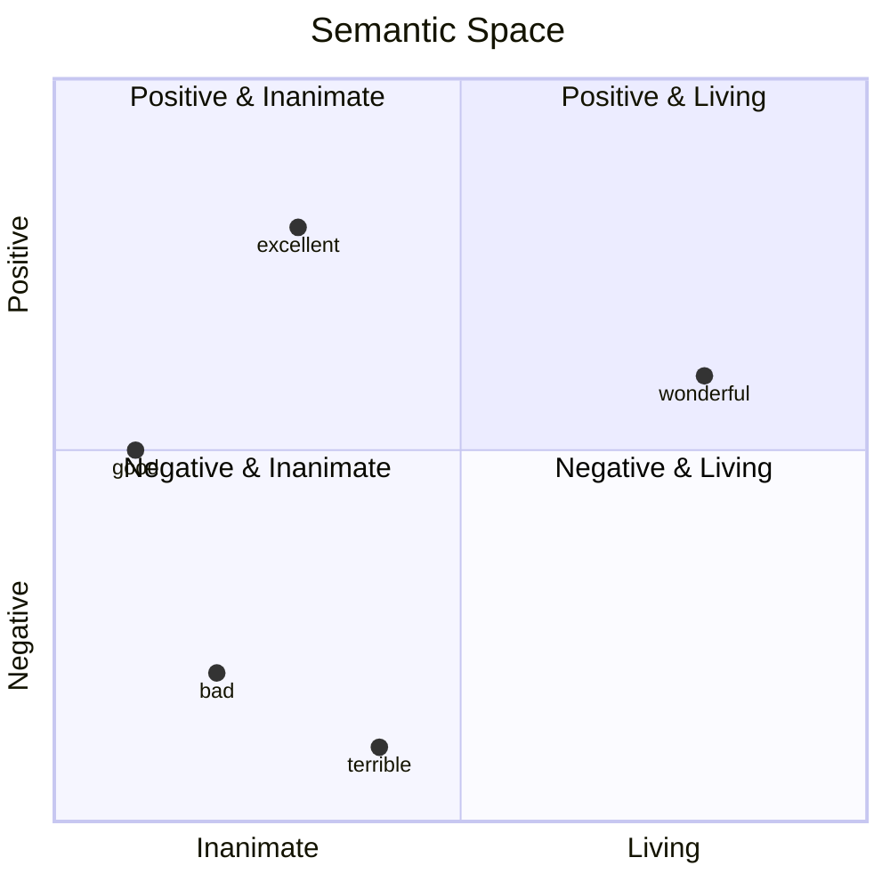
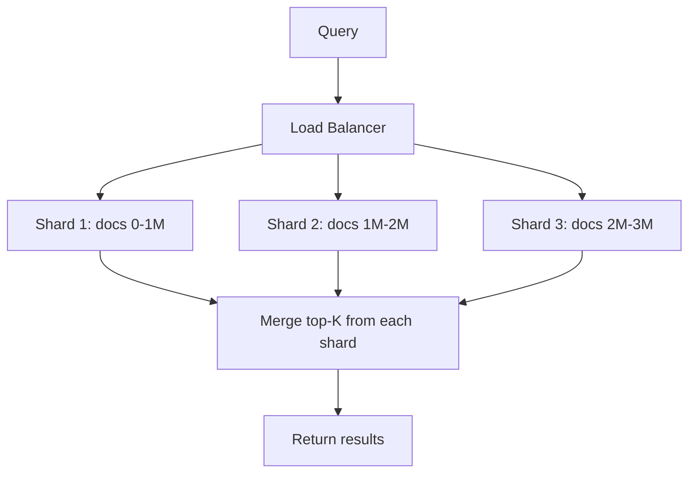

## Learning Outcomes

By the end of this intensive module, you will be capable of the following advanced engineering tasks:
- **Design** high-dimensional semantic spaces to accurately represent complex, multi-layered text data relationships within enterprise environments.
- **Implement** non-linear dimensionality reduction techniques, specifically PCA and t-SNE, to visualize dense coordinate embeddings in two and three-dimensional topological planes.
- **Evaluate** the mathematical validity and structural integrity of semantic relationships by computing vector arithmetic across localized concept clusters.
- **Diagnose** critical memory and latency bottlenecks in high-throughput production search pipelines and apply scalar and product quantization strategies to optimize throughput.
- **Implement** fault-tolerant, horizontally scalable vector databases within a modern Kubernetes v1.35 environment, utilizing advanced Approximate Nearest Neighbor (ANN) index structures.

## Why This Module Matters

Hypothetical scenario: an e-commerce team launches a catalog search feature built on exact keyword matching with inverted indices and TF-IDF scoring. A shopper searches for "crimson winter coat," and the system returns products whose descriptions contain those exact tokens. Another shopper searches for "burgundy cold weather jacket" — synonymous intent, different vocabulary — and receives empty results even though matching inventory exists under alternate product copy. Monitoring shows elevated null-result rates; shoppers assume items are unavailable and leave. The root cause is not a crashed database or a misconfigured load balancer, but an architectural limitation: the retrieval layer matches character strings, not meaning.

A semantic search redesign converts both catalog entries and queries into dense embeddings and compares them in vector space. The model places "burgundy" and "crimson" in nearby regions, so paraphrased queries retrieve relevant products without hand-maintained synonym tables. This module teaches the mathematics behind that shift: how to visualize embedding geometry, validate analogies with vector arithmetic, and build production retrieval pipelines with approximate nearest-neighbor indexes. You will treat language as coordinates, not categories — and engineer systems that reason about similarity the way humans do when they recognize that two phrases mean the same thing even when they share no words.

## The Geometry of Meaning

The conceptual leap required to master modern generative artificial intelligence is recognizing that human language can be robustly represented as coordinates in a vast, continuous geometric space. Prior to this mathematical innovation, software engineers treated text primarily as categorical variables, sparse one-hot encoded arrays, or simple hashed integers. These legacy methods completely discarded the rich, contextual relationships between words. One-hot encoding assigns every token an orthogonal axis, so every pair of distinct words is equidistant — "dog" and "cat" are no closer than "dog" and "bankruptcy." Hashing tricks compress vocabulary but still treat collisions as semantic equivalence by accident. Embeddings instead learn a low-dimensional manifold where neighborhood structure is the training objective, which is why they enable both fuzzy retrieval and the visualization workflows you will build in the hands-on exercise.

Before studying the deeper theory in this module, you might have generated a standard embedding vector using an open-source library and wondered about its practical utility when returning a seemingly random array of floating-point numbers:

```python
embedding = model.encode("Machine learning")
# → [0.23, -0.41, 0.87, ..., 0.15]
# "Okay, it's a list of numbers. So what?"
```

After completing this architectural deep dive, you will perceive those raw floating-point numbers not as random noise, but as precise geographic coordinates within a continuous semantic topology. This structural spatial representation enables unprecedented, strictly mathematical operations on human language constructs. 

```python
# MATH ON MEANING!
king - man + woman ≈ queen
Paris - France + Italy ≈ Rome
good - bad + terrible ≈ excellent
```

When we systematically map and plot these distinct coordinates in a simplified two-dimensional visualization plane, a profound geometric property emerges. When we plot these coordinates in a simplified two-dimensional visualization, the proximity of the points corresponds directly to the similarity of their underlying meaning. Concepts representing positive sentiment organically pull toward one coordinate direction, while negative sentiment concepts naturally pull in the exact opposite mathematical direction.

```text
                   Axis 2: Positive ↑
                                    |
                "excellent"         |
                     •              |
                                    |
         "good"                     |        "wonderful"
            •                       |            •
                                    |
────────────────────────────────────┼───────────────────────→ Axis 1: Living
                                    |
                 •                  |
              "bad"                 |
                                    |
                                    |
           "terrible"               |
                •                   |
                                    ↓ Negative
```

When rendered natively as a structural visualization, this concept maps beautifully into a quadrant chart, demonstrating how distinct quadrants capture entirely different semantic intersections:


```mermaid
quadrantChart
    title Semantic Space
    x-axis Inanimate --> Living
    y-axis Negative --> Positive
    quadrant-1 Positive & Living
    quadrant-2 Positive & Inanimate
    quadrant-3 Negative & Inanimate
    quadrant-4 Negative & Living
    "excellent": [0.3, 0.8]
    "good": [0.1, 0.5]
    "wonderful": [0.8, 0.6]
    "bad": [0.2, 0.2]
    "terrible": [0.4, 0.1]
```

Distance in this multi-dimensional mathematical space serves as an incredibly reliable metric for semantic similarity when you pick the right function for your embedding model. We can measure Euclidean distance or cosine similarity mathematically to empirically verify topical relevance across disparate data points, then choose the same metric at index time so offline evaluations match online retrieval behavior.

```python
# Words about food cluster together
embedding("pizza") ≈ embedding("pasta") ≈ embedding("spaghetti")

# Words about programming cluster together
embedding("Python") ≈ embedding("JavaScript") ≈ embedding("coding")

# Unrelated words are distant
distance(embedding("pizza"), embedding("Python")) → LARGE
```

Direction in this high-dimensional coordinate space is equally as important as raw scalar distance. Parallel vectors in this space strongly imply similar analogical relationships and structural transformations between entirely distinct textual concepts.

```text
king → queen  (same direction as)  man → woman
male → female (gender transformation)

Paris → France  (same direction as)  Rome → Italy
capital → country (geopolitical relationship)
```

Visually plotting this inherent directionality reveals the stunning mathematical consistency of the underlying semantic transformation, repeating faithfully across completely different word pairs.

```text
        queen •
            ↗
king •

        woman •
            ↗
man •
```

Because of this rigid spatial mapping generated during the model's self-supervised training phase, highly intuitive and natural clusters emerge spontaneously from the data without any explicit manual categorization, labeling, or intervention required from the engineering teams.

```text
Cluster 1 (Programming):
  • Python
  • JavaScript
  • coding
  • programming
  • software

Cluster 2 (Food):
  • pizza
  • pasta
  • spaghetti
  • cooking
  • recipe

Cluster 3 (Animals):
  • dog
  • cat
  • puppy
  • kitten
  • pet
```

> **Pause and predict**: If you generated an embedding for the word "Java", where exactly would it land in the clusters above? Would it sit strictly in Cluster 1 due to code, or might it sit halfway between Cluster 1 and Cluster 2 because of the coffee association? Consider how the underlying embedding model's specific training data distribution directly influences the final geometric coordinates.

## How Embeddings Are Produced

The geometric structure of an embedding space is not arbitrary magic — it is the output of a training objective that rewards certain vector arrangements and penalizes others. Classical word embeddings such as Word2Vec and GloVe learn coordinates by predicting context: a word's vector should help predict surrounding words in a sliding window over a large corpus. Skip-gram and continuous-bag-of-words variants differ in whether you predict context from a center word or the center from context, but both push co-occurring tokens into similar regions because that arrangement lowers prediction loss.

Modern sentence and document embeddings extend the same principle with contrastive learning. During training, the model sees pairs of texts labeled similar (two paraphrases, a query and its answer, an anchor and a positive example) and pairs labeled dissimilar (random negatives or hard negatives mined from the batch). The loss function pulls similar pairs closer in cosine distance and pushes dissimilar pairs apart, often with a temperature-scaled softmax over in-batch negatives. Sentence-transformer models wrap a transformer encoder with a pooling layer (mean pooling, CLS token, or attention pooling) and fine-tune the entire stack on these contrastive objectives. The result is a fixed-length vector per input string whose geometry reflects semantic relationships the training data emphasized.

Understanding the training recipe matters when you debug retrieval quality in production. If your domain vocabulary (medical codes, internal acronyms, product SKUs) was underrepresented during pre-training, vectors for those tokens may sit in noisy regions of space. Fine-tuning on domain-specific contrastive pairs — query–document clicks, support-ticket resolutions, approved FAQ matches — reshapes local geometry without retraining the entire foundation model from scratch. The embedding dimension (384, 768, 1536) is an architectural choice: higher dimensions can encode more nuance but increase memory and distance-computation cost linearly in the dimension count.

## Comparing Similarity Metrics

Once texts are embedded, retrieval reduces to comparing vectors. Three metrics appear constantly in vector search systems, and choosing the wrong one silently degrades ranking quality even when the embedding model itself is excellent.

**Cosine similarity** measures the angle between two vectors, ignoring magnitude. For vectors $\mathbf{a}$ and $\mathbf{b}$, $\text{cosine}(\mathbf{a}, \mathbf{b}) = \frac{\mathbf{a} \cdot \mathbf{b}}{\|\mathbf{a}\| \|\mathbf{b}\|}$, ranging from $-1$ to $1$. Cosine is the default for text embeddings because transformer outputs are often L2-normalized during training, and semantic similarity is treated as directional alignment rather than raw proximity from the origin. Two documents about the same topic with different lengths should score highly even if one vector has larger magnitude.

**Dot product** computes $\mathbf{a} \cdot \mathbf{b} = \sum_i a_i b_i$ without dividing by magnitudes. When all vectors are unit-normalized, dot product and cosine are equivalent. When they are not, dot product favors longer vectors — which can accidentally boost verbose documents that happen to have larger activation norms. Some production systems deliberately use dot product on unnormalized vectors when magnitude encodes confidence or importance, but that is an explicit design choice, not an accident.

**Euclidean distance** measures straight-line separation: $\|\mathbf{a} - \mathbf{b}\|_2$. For unit vectors, Euclidean distance and cosine similarity are monotonically related ($\|\mathbf{a}-\mathbf{b}\|^2 = 2 - 2\cos\theta$), so ranking by ascending distance matches ranking by descending cosine. For unnormalized vectors, Euclidean distance mixes angle and magnitude effects. FAISS `IndexFlatL2` and `IndexHNSWFlat` with L2 metric use squared Euclidean distance; many text pipelines instead normalize vectors once at index time and search with inner product (`IndexFlatIP`) to recover cosine semantics efficiently.

| Metric | Normalization required? | Sensitive to vector length? | Typical index type |
|--------|-------------------------|----------------------------|-------------------|
| Cosine | Recommended | No (after normalization) | Inner product on L2-normalized vectors |
| Dot product | Optional | Yes | `IndexFlatIP` |
| Euclidean (L2) | Optional | Yes | `IndexFlatL2`, `IndexHNSWFlat` |

**Practical rule**: L2-normalize all embeddings at ingestion and query time, then use inner-product search — mathematically equivalent to cosine, well supported by ANN libraries, and immune to document-length artifacts unless you intentionally encode length in the vector norm.

## The Curse of Dimensionality

High-dimensional spaces behave counterintuitively, and those behaviors directly affect both visualization and nearest-neighbor search. In low dimensions, intuitive notions of "near" and "far" hold: if two points are close in 2D, they are genuinely similar along most axes. As dimensionality grows, volume concentrates in the shell of the hypersphere rather than near the center — most random points become almost equidistant from each other. The ratio of the distance to the nearest neighbor versus the farthest neighbor approaches 1 as dimension increases, which means brute-force distance rankings become unstable noise unless the data manifold has strong low-dimensional structure.

This phenomenon explains why you cannot trust a 2D scatter plot as a literal map of production geometry. Dimensionality reduction for visualization necessarily distorts relationships: PCA preserves global variance but may squash local clusters; t-SNE preserves local neighborhoods but separates clusters artificially; neither plot is a faithful coordinate system for retrieval decisions. It also explains why ANN indexes are necessary at scale: exact linear scan not only costs $O(N)$ per query but also fights numerical noise in high dimensions where marginally closer neighbors may not be semantically better matches.

Engineering mitigations include: (1) using models trained with cosine-style objectives so meaningful signal lives in direction, not radial distance from the origin; (2) applying product quantization or scalar quantization to compress vectors while preserving relative ordering well enough for first-stage retrieval; (3) combining dense retrieval with metadata filters or BM25 reranking so semantic neighbors must also satisfy hard constraints; and (4) monitoring recall@k on a labeled evaluation set whenever you change dimensionality, quantization, or index parameters — plots alone will not catch a recall collapse.

## Visualizing Embeddings in 2D and 3D Space

Real-world production embeddings often contain 384, 768, or even up to 1536 distinct spatial dimensions. Because human visual perception and cognition are strictly limited to three physical dimensions, engineering teams must rely heavily on highly sophisticated dimensionality reduction techniques to explore the topological data visually and detect hidden biases. Before plotting, sample strategically: visualizing ten thousand random document embeddings in t-SNE may take minutes and produce unreadable overplots, while stratified sampling (equal draws per product category, language, or user segment) reveals whether clusters are driven by true semantics or confounding metadata like author team or publication date. Color points by metadata fields in the scatter plot — if every color separates cleanly, your embedding may be encoding superficial facets you intended to filter downstream rather than deep topical content. Document the random seed and hyperparameters (`perplexity` for t-SNE, `n_neighbors` and `min_dist` for UMAP) alongside the figure so teammates can reproduce the visualization when the embedding model version changes.

### Technique 1: PCA (Principal Component Analysis)

Principal Component Analysis (PCA) operates by identifying the specific axes of maximum variance within the high-dimensional data distribution. It then orthogonally projects the individual data points onto these newly calculated composite axes. This effectively compresses the spatial data while attempting to mathematically preserve the most significant global structural variance.

```python
from sklearn.decomposition import PCA
import matplotlib.pyplot as plt

# Embeddings for some words
words = ["king", "queen", "man", "woman", "prince", "princess", "boy", "girl"]
embeddings = [model.encode(word) for word in words]

# Reduce to 2D
pca = PCA(n_components=2)
embeddings_2d = pca.fit_transform(embeddings)

# Plot
plt.figure(figsize=(10, 8))
for word, (x, y) in zip(words, embeddings_2d):
    plt.scatter(x, y)
    plt.annotate(word, (x, y), fontsize=12)

plt.xlabel("PC1 (Royalty → Commoner)")
plt.ylabel("PC2 (Male → Female)")
plt.title("Semantic Space Visualization")
plt.grid(True)
plt.show()
```

The resulting spatial distribution often clusters quite logically according to the implicit semantics learned by the neural network architecture during its initial unguided training phase:

```text
        queen •        princess •
                                     ← Female


        king •         prince •
                                     ← Male

     ← Royalty                Common →
```

### Expanding into 3D Semantic Space

While compressing data down to two dimensions offers a highly useful visual abstraction, adding a third continuous dimension captures exponentially more semantic nuance and topological structure. By setting the `n_components=3` parameter, we can utilize sophisticated 3D plotting libraries to rigorously explore volumetric depth. This capability is absolutely crucial for verifying that closely packed vectors don't simply overlap arbitrarily due to severe compression artifacts, but actually maintain true multi-faceted relationships across distinct, separable geometric planes.

```python
from mpl_toolkits.mplot3d import Axes3D

# Reduce to 3D for deeper inspection
pca_3d = PCA(n_components=3)
embeddings_3d = pca_3d.fit_transform(embeddings)

fig = plt.figure(figsize=(12, 10))
ax = fig.add_subplot(111, projection='3d')

for word, (x, y, z) in zip(words, embeddings_3d):
    ax.scatter(x, y, z)
    ax.text(x, y, z, word, fontsize=12)

ax.set_xlabel("PC1 (Royalty Variance)")
ax.set_ylabel("PC2 (Gender Variance)")
ax.set_zlabel("PC3 (Age and Maturity)")
plt.title("3D Semantic Space Visualization")
plt.show()
```

### Technique 2: t-SNE (t-Distributed Stochastic Neighbor Embedding)

t-Distributed Stochastic Neighbor Embedding (t-SNE) is an advanced, non-linear machine learning technique specifically optimized for high-dimensional data visualization. Unlike PCA, which focuses strictly on global data variance, t-SNE accurately models the probability of two independent points being tight neighbors in high-dimensional space. It then meticulously attempts to replicate that exact probability distribution when projecting the points into lower dimensions, making it exceptionally powerful for visualizing tight local clusters.

```python
from sklearn.manifold import TSNE

# Reduce to 2D with t-SNE
tsne = TSNE(n_components=2, random_state=42)
embeddings_2d = tsne.fit_transform(embeddings)

# Plot (same as above)
```

### Technique 3: UMAP (Uniform Manifold Approximation and Projection)

UMAP is another non-linear reduction method, often chosen when you need a visualization that preserves more global structure than t-SNE while still revealing tight local clusters. UMAP constructs a fuzzy topological representation of the high-dimensional data and optimizes a low-dimensional layout to match it. In practice, UMAP plots frequently show continuous gradations between related topics (for example, a smooth path from "kubernetes" through "containers" to "docker") where t-SNE may fracture the same region into disconnected islands.

```python
import umap

reducer = umap.UMAP(n_components=2, random_state=42, n_neighbors=15, min_dist=0.1)
embeddings_2d = reducer.fit_transform(embeddings)
```

### Choosing PCA, t-SNE, or UMAP

| Method | What it preserves | What it distorts | When to use |
|--------|-------------------|------------------|-------------|
| **PCA** | Global variance along principal axes | Local neighborhood structure | Quick exploratory plots; preprocessing before other methods |
| **t-SNE** | Local pairwise neighborhoods | Global distances between clusters | Presentations focused on cluster separation |
| **UMAP** | Local structure plus more global topology | Fine-grained distances | Publication-quality exploratory maps; larger datasets |

None of these outputs should drive production retrieval thresholds. Use them to inspect bias, discover duplicate clusters, or communicate qualitative structure to stakeholders — then validate any architectural decision with offline recall metrics and online click-through data.

## Vector Arithmetic: Math on Meaning

Because the multi-dimensional coordinate space fundamentally maintains highly consistent structural relationships, software engineers can execute literal mathematical operations on the dense vectors to dynamically generate entirely new semantic combinations. This is the exact moment where the true, revolutionary power of generative continuous embeddings becomes undeniably apparent.

```python
# Vector arithmetic
result = embedding("king") - embedding("man") + embedding("woman")

# Find closest word to result
closest = find_closest_embedding(result, all_words)

# Result: "queen" 
```

The underlying mechanical operations function by selectively extracting, isolating, and recombining specific latent features directly from the continuous coordinate arrays. 

```text
king   = [royalty + male + power + ...]
man    = [male + human + adult + ...]
woman  = [female + human + adult + ...]

king - man = [royalty + male + power + ...] - [male + human + adult + ...]
           ≈ [royalty + power + ...]  (removes "male", "human", "adult")

(king - man) + woman = [royalty + power + ...] + [female + human + adult + ...]
                     ≈ [royalty + power + female + ...]

What word is [royalty + power + female]?  → "queen"!
```

This remarkable mathematical phenomenon is absolutely not limited to human gender or historical royalty dynamics. It often applies across many complex domains that were learned well by the foundational model during its extensive pre-training corpus exposure.

```python
Paris - France + Italy ≈ Rome
Tokyo - Japan + China ≈ Beijing
```

Complex grammatical structures, morphological parts of speech, and temporal linguistic tenses are surprisingly encoded as distinct, uniform spatial directions that can be predictably traversed via mathematical addition and subtraction.

```python
walking - walk + run ≈ running
better - good + bad ≈ worse
```

Abstract object relationships, physical properties, and strict binary opposites maintain rigorous geometric consistency across the entire mathematical vocabulary spectrum.

```python
cat - kitten + puppy ≈ dog
hot - cold + wet ≈ dry
```

To execute this specific operation reliably and systematically within a production application pipeline, we explicitly define a scalable search function. This function computationally calculates the geometric arithmetic sum and difference, then sequentially ranks the entire known vocabulary by performing continuous cosine similarity calculations to locate the true nearest semantic neighbor to our theoretical floating-point coordinate.

```python
def vector_arithmetic_search(
    positive: List[str],  # Words to add
    negative: List[str],  # Words to subtract
    topn: int = 5
) -> List[Tuple[str, float]]:
    """
    Perform vector arithmetic and find closest words.

    Example:
        vector_arithmetic_search(
            positive=["king", "woman"],
            negative=["man"]
        )
        → Returns words close to: king - man + woman
    """
    # Generate embeddings
    positive_embs = [model.encode(word) for word in positive]
    negative_embs = [model.encode(word) for word in negative]

    # Vector arithmetic
    result = np.sum(positive_embs, axis=0) - np.sum(negative_embs, axis=0)

    # Find closest words in vocabulary
    similarities = []
    for word in vocabulary:
        if word in positive or word in negative:
            continue  # Skip input words

        word_emb = model.encode(word)
        sim = cosine_similarity(result, word_emb)
        similarities.append((word, sim))

    # Return top-n
    return sorted(similarities, key=lambda x: x[1], reverse=True)[:topn]

# Test
results = vector_arithmetic_search(
    positive=["king", "woman"],
    negative=["man"]
)

print("king - man + woman ≈")
for word, score in results:
    print(f"  {score:.3f} - {word}")
```

Executing this code against a robust embedding model yields the expected semantic hierarchy. The outputs naturally organize by descending similarity confidence.

```text
king - man + woman ≈
  0.921 - queen
  0.847 - monarch
  0.812 - princess
  0.789 - empress
  0.756 - duchess
```

> **Stop and think**: If you perform the mathematical operation `programmer - coffee + tea`, what do you realistically expect the resulting vector coordinate to represent? Will it be a literal "tea-drinking programmer", or will the model find the closest existing professional stereotype in its underlying training data? Always consider the implicit cultural bias inherent in the massive training corpus.

Vector arithmetic is a diagnostic tool, not a guaranteed API. Analogies like `king - man + woman ≈ queen` work because gender and royalty axes were strongly represented in historical training corpora; they may fail for rare entities, multilingual inputs, or domain jargon the model saw infrequently. In production, never expose raw arithmetic as user-facing search syntax unless you validate outputs on your vocabulary. Instead, use arithmetic to probe whether a fine-tuned model encodes a business relationship you care about — for example, subtracting a generic product embedding from a specific SKU embedding to see whether the residual vector aligns with brand or category neighbors. If arithmetic consistently fails for your domain, invest in contrastive fine-tuning on labeled pairs rather than forcing users to trust brittle analogy tricks.

## Building Production Semantic Search

Deeply understanding advanced vector math in a conceptual vacuum is strictly only the first critical step. Engineering a highly robust, fault-tolerant semantic search system that reliably serves millions of concurrent global users requires incredibly strict architectural rigor, extensive profiling, and continuous performance tuning at the database level. The offline path ingests raw documents, normalizes text (Unicode normalization, language detection, PII redaction where required), chunks or whole-doc encodes them, L2-normalizes vectors, and writes to an ANN index with durable storage. The online path embeds the query once, executes ANN search with configured `efSearch` or `nprobe`, optionally applies metadata filters before or after the graph walk depending on your database's pre-filtering support, reranks with auxiliary signals, and returns identifiers that map to object storage for full text snippets. Keeping these paths separate prevents a traffic spike on search from starving batch reindex jobs — and prevents an accidental full re-embed from blocking live queries when you run both on the same GPU pool without queue isolation.

```text
Query → Embedding → Compare to all docs → Top-K results
```

While functional for local prototypes and Jupyter notebooks, this naive approach fails catastrophically under production load. Production systems must strictly enforce rigorous separation of concerns, fundamentally segregating heavy offline indexing operations from highly optimized, latency-sensitive online retrieval pathways.

```text
Offline:
  Documents → Embeddings → Index (HNSW, IVF)

Online:
  Query → Embedding → ANN Search → Top-K results
```

A brute-force comparison calculates the exact cosine similarity against every single document residing in the database. This scales linearly, which is unacceptable for systems requiring strict millisecond service-level agreements (SLAs).

```python
def naive_search(query: str, embeddings: dict, top_k: int = 5):
    """
    Brute force search - compare to ALL documents.

    Time complexity: O(N) where N = number of documents
    """
    query_emb = model.encode(query)

    # Calculate similarity to ALL documents
    scores = [
        (doc_id, cosine_similarity(query_emb, emb))
        for doc_id, emb in embeddings.items()
    ]

    # Sort and return top-K
    return sorted(scores, key=lambda x: x[1], reverse=True)[:top_k]
```

To achieve millisecond query latency, we must willingly abandon mathematical exactness and employ Approximate Nearest Neighbor (ANN) algorithms. Hierarchical Navigable Small World (HNSW) graphs are widely used in production vector search because they balance retrieval speed and recall across a range of dataset sizes and hardware profiles.

```text
Layer 2: •────────────────────────────•  (sparse, long jumps)
          \                          /
Layer 1:  •────•────•────────•────•    (medium density)
            \   \   /      /   /
Layer 0:  •─•─•─•─•─•─•─•─•─•─•─•─•  (dense, all nodes)

Search: Start at top layer, jump quickly to approximate region,
        then descend to lower layers for precision.
```

Using the heavily optimized Facebook AI Similarity Search (FAISS) library, we can easily construct a highly performant HNSW index locally entirely within system memory for rapid evaluation.

```python
import faiss
import numpy as np

# Prepare embeddings matrix (N x D)
embeddings_matrix = np.array(list(embeddings.values())).astype('float32')
dimension = embeddings_matrix.shape[1]

# Build HNSW index
index = faiss.IndexHNSWFlat(dimension, 32)  # 32 = number of neighbors
index.add(embeddings_matrix)

# Search
query_emb = model.encode(query).astype('float32').reshape(1, -1)
distances, indices = index.search(query_emb, k=5)

# Get results
results = [
    (list(embeddings.keys())[idx], dist)
    for idx, dist in zip(indices[0], distances[0])
]
```

### HNSW Internals: Layers, Parameters, and Recall Tradeoffs

HNSW builds a multi-layer navigable small-world graph. The bottom layer (layer 0) contains every vector and dense local edges to approximate $M$ nearest neighbors per node. Upper layers are subsamples of the dataset with progressively sparser long-range edges. Search starts at an entry point in the top layer, greedily walks toward the query vector, then drops to the next layer until it reaches layer 0 for fine-grained refinement. Long jumps at high layers locate the correct region quickly; dense connectivity at layer 0 improves final ranking accuracy.

Two parameters dominate tuning:

- **`M`** (neighbors per node): Higher $M$ increases graph connectivity, memory footprint, and build time, but typically improves recall because the greedy walk has more paths to the true nearest neighbors.
- **`efConstruction`** (build-time beam width): Larger values produce higher-quality graphs during indexing at the cost of slower ingestion. This is a one-time cost per index build.
- **`efSearch`** (query-time beam width): Larger values explore more candidates per query, improving recall and latency together — this is the primary runtime knob for the recall–latency tradeoff.

Suppose you index one million 384-dimensional vectors. With `M=32` and `efConstruction=200`, build time may take minutes on a single node but yields a graph that reaches 95%+ recall@10 when `efSearch=128`. Dropping `efSearch` to 32 might cut query latency by half while recall@10 falls into the high eighties — acceptable for a first-stage candidate generator paired with a cross-encoder reranker, unacceptable for a single-stage legal search product. Always measure recall@k on a labeled holdout set when you change these values; the correct setting is workload-specific, not universal.

### IVF and Product Quantization: Worked Memory Example

**Inverted File (IVF)** indexes partition the vector space into `nlist` clusters (centroids). At query time, only the nearest centroids — controlled by `nprobe` — are searched, reducing comparisons from $N$ to roughly $(N/\text{nlist}) \times \text{nprobe}$. Increasing `nprobe` improves recall at higher latency.

**Product Quantization (PQ)** splits each $D$-dimensional vector into $m$ subvectors of dimension $D/m$, replaces each subvector with the ID of its nearest codebook centroid, and stores only the IDs. A 768-dimensional `float32` vector normally occupies $768 \times 4 = 3072$ bytes. With PQ using $m=48$ subvectors and 8-bit codes per subvector, storage drops to 48 bytes per vector — a 64× compression ratio — at the cost of approximate distances computed via asymmetric distance computation (ADC) lookup tables.

Numeric illustration: one million vectors at 768 dimensions in `float32` require roughly 3 GB of raw vector data. PQ-compressed storage for the same set is on the order of 48 MB for the codes plus modest codebook overhead. Query-time distance is approximate; reranking the top 100 PQ candidates with exact cosine on full-precision vectors is a common hybrid pattern that recovers most accuracy while keeping the index resident in RAM.

When building modern cloud-native infrastructure, deploying a dedicated vector database provides durable persistent storage layers, dynamic horizontal scaling mechanisms, and built-in ANN indexing strategies without hand-rolling FAISS configuration for every service.

| Database | Open Source | Cloud | Typical use case |
|----------|-------------|-------|------------------|
| **Qdrant** | Yes | Yes | Low-latency filtering with payload metadata |
| **Weaviate** | Yes | Yes | GraphQL-native APIs and multi-modal vectors |
| **Milvus** | Yes | Yes | Very large collections with distributed sharding |
| **Pinecone** | No | Yes | Fully managed hosted vector index |
| **Chroma** | Yes | No | Lightweight local prototyping and notebooks |

Using the high-level Qdrant Python client, we can interface directly with a deployed, production-grade distributed database cluster to securely upsert and immediately query exceptionally large continuous vector payloads.

```python
from qdrant_client import QdrantClient
from qdrant_client.models import Distance, VectorParams

# Create client
client = QdrantClient(":memory:")  # Or URL for production

# Create collection
client.create_collection(
    collection_name="documents",
    vectors_config=VectorParams(size=384, distance=Distance.COSINE)
)

# Add documents
for doc_id, embedding in embeddings.items():
    client.upsert(
        collection_name="documents",
        points=[{
            "id": doc_id,
            "vector": embedding,
            "payload": {"text": documents[doc_id]["text"]}
        }]
    )

# Search
results = client.search(
    collection_name="documents",
    query_vector=query_embedding,
    limit=5
)

for result in results:
    print(f"{result.score:.3f} - {result.payload['text']}")
```

## Scaling Semantic Search

When carefully transitioning a localized, proof-of-concept prototype to a live, global production environment, severe computational and memory bottlenecks will consistently emerge. The very first and arguably most critical architectural optimization you must apply is enforcing massive batching during the initial embedding generation process. Embedding models are throughput engines: a transformer forward pass amortizes fixed overhead across the batch dimension, so encoding one string at a time leaves GPU tensor cores idle while Python loop overhead dominates wall-clock time. Start with batch sizes that fill GPU memory without triggering out-of-memory kills — often 32 to 128 for sentence encoders on a single consumer GPU — and measure documents per second before optimizing index parameters. Ingestion pipelines should separate **encode**, **normalize**, **quantize**, and **index** stages so you can replay indexing from a parquet cache of embeddings without re-running the neural network when you only change HNSW settings.

Sharding becomes necessary when a single node's RAM cannot hold the full HNSW graph plus metadata payloads. Consistent hashing on document ID routes each vector to a fixed shard, keeping updates localized. At query time, a coordinator broadcasts the query embedding to every shard (or to a routing layer that narrows candidates via coarse centroids), collects each shard's top-k results, and performs a final merge-sort to produce global top-k. The merge step is cheap relative to ANN search because k is small (10–100), but network fan-out grows with shard count — cap shards per query using IVF-style routing when you have hundreds of partitions. Replication adds read throughput: read-only replicas serve query traffic while the primary accepts writes, though eventual consistency means a freshly upserted document may lag milliseconds to seconds behind on replicas depending on your replication protocol.

```python
# DON'T: Sequential encoding
embeddings = [model.encode(doc) for doc in documents]  # SLOW

# DO: Batch encoding
embeddings = model.encode(documents, batch_size=32)  # FAST

# Speedup: 10-50x faster!
```

To significantly reduce the overwhelming storage footprint and drastically accelerate continuous distance calculations across cluster nodes, mathematical dimensionality reduction algorithms can be forcefully applied to the output vectors prior to disk insertion.

```python
from sklearn.decomposition import PCA

# Reduce from 384 to 128 dimensions
pca = PCA(n_components=128)
reduced_embeddings = pca.fit_transform(embeddings)

# Storage: 66% reduction
# Speed: 3x faster
# Accuracy: ~5% loss (acceptable for many use cases)
```

Alternatively, hardware quantization offers massive system memory savings with truly negligible accuracy degradation by aggressively compressing the floating-point precision of the stored topological coordinates inside the memory buffer.

```python
# Float32 (default): 4 bytes per dimension
embeddings_f32 = embeddings.astype('float32')

# Float16 (half precision): 2 bytes per dimension
embeddings_f16 = embeddings.astype('float16')

# Int8 (8-bit): 1 byte per dimension
embeddings_i8 = (embeddings * 127).astype('int8')

# Storage: 75% reduction (float32 → int8)
# Accuracy: <1% loss
```

At extreme planetary scales involving hundreds of millions of unique enterprise documents, heavy search requests must be dynamically partitioned and intelligently sharded across a widely distributed cluster of independent compute nodes.

```text
Query
  ↓
Load Balancer
  ↓
  ├─→ Shard 1 (docs 0-1M)
  ├─→ Shard 2 (docs 1M-2M)
  └─→ Shard 3 (docs 2M-3M)
  ↓
Merge top-K from each shard
  ↓
Return results
```

We visualize this robust distributed load balancing and dynamic query merging architecture natively below, detailing exactly how the infrastructure coordinates parallel requests:


```mermaid
flowchart TD
    Q[Query] --> LB[Load Balancer]
    LB --> S1[Shard 1: docs 0-1M]
    LB --> S2[Shard 2: docs 1M-2M]
    LB --> S3[Shard 3: docs 2M-3M]
    S1 --> M[Merge top-K from each shard]
    S2 --> M
    S3 --> M
    M --> R[Return results]
```

## Production Best Practices

Deploying a truly robust and immensely scalable architecture necessitates implementing deeply aggressive edge caching strategies. You must never recompute massive static document embeddings dynamically on the fly during a live user query. Treat the embedding of a document as a build artifact versioned alongside the model name and tokenizer revision: when you upgrade from `all-MiniLM-L6-v2` to `all-mpnet-base-v2`, plan a full re-embed migration rather than mixing incompatible vector spaces in one index. Cache query embeddings only when queries repeat exactly — autocomplete prefixes and templated support macros hit cache often; long-tail natural language questions rarely do. For repeated internal analytics queries, a short-TTL Redis cache keyed by normalized query text can shave tens of milliseconds without staleness risk.

Evaluation discipline separates prototypes from products. Maintain a golden set of query–document relevance judgments (even a few hundred hand-labeled pairs beats flying blind). Report recall@k, mean reciprocal rank, and nDCG on that set whenever you change embedding model, index type, `efSearch`, or quantization level. Online, log click-through rate at rank position and null-result rate segmented by query category. A rising null-result rate with flat offline recall usually means traffic shifted to out-of-domain vocabulary — a signal to fine-tune or add hybrid BM25 rather than crank `efSearch` indefinitely.

```python
# DON'T: Embed on every query
def search(query):
    query_emb = model.encode(query)
    doc_embs = [model.encode(doc) for doc in documents]  # WASTEFUL!
    # ...

# DO: Embed documents once, cache
doc_embeddings = {doc: model.encode(doc) for doc in documents}

def search(query):
    query_emb = model.encode(query)
    # Use precomputed doc_embeddings
    # ...
```

Continuous application telemetry and rigorous active monitoring guarantee that insidious semantic drift doesn't silently degrade critical search relevance over extended periods of time.

```python
# Track search relevance
def log_search(query, results, user_clicked):
    """Log which results users actually clicked."""
    metrics.log({
        "query": query,
        "results": results,
        "clicked_rank": user_clicked,  # 1 = first result, etc.
        "timestamp": now()
    })

# Analyze: Are users clicking top results?
# If not, embeddings might not be working well!
```

Hybrid search architecture masterfully combines the highly fuzzy semantic precision of dense continuous vectors with the strict deterministic accuracy of traditional SQL database filtering and keyword limits.

```python
def hybrid_search(query, filters=None):
    """Combine semantic + metadata + popularity."""
    # 1. Semantic similarity
    query_emb = model.encode(query)
    semantic_scores = compute_similarity(query_emb)

    # 2. Metadata filtering (if any)
    if filters:
        semantic_scores = apply_filters(semantic_scores, filters)

    # 3. Rerank by popularity, recency, etc.
    final_scores = combine_signals(
        semantic=semantic_scores,
        popularity=get_popularity(),
        recency=get_recency(),
        weights=[0.7, 0.2, 0.1]  # Tune these!
    )

    return get_top_k(final_scores)
```

Rigorous AB experimentation is absolutely mandatory. You must systematically test your retrieval configurations against live traffic to validate mathematical assumptions against actual human behavior patterns.

```python
# Test different embedding models
configs = {
    "control": {"model": "all-MiniLM-L6-v2", "threshold": 0.5},
    "variant_a": {"model": "all-mpnet-base-v2", "threshold": 0.5},
    "variant_b": {"model": "all-MiniLM-L6-v2", "threshold": 0.6},
}

# Assign users randomly
user_config = configs[hash(user_id) % len(configs)]

# Track metrics per config
# → Choose best performing config
```

Always design an incredibly defensive fallback mechanism to handle confusing out-of-domain queries, strange tokenizations, or sudden infrastructure system timeouts safely.

```python
def robust_search(query):
    """Try semantic search, fallback if it fails."""
    try:
        # Try semantic search
        results = semantic_search(query)

        # If no good matches, fallback
        if max(result.score for result in results) < 0.3:
            return keyword_search(query)

        return results

    except Exception as e:
        # Log error
        logger.error(f"Semantic search failed: {e}")

        # Fallback to keyword search
        return keyword_search(query)
```

## Real-World Applications

### RAG Context Retrieval

Providing accurate context to language models is paramount. Upgrading traditional keyword matching systems to utilize semantic search drastically enhances the contextual richness passed into Generation pipelines. In retrieval-augmented generation, the retriever's job is to surface chunks whose embeddings lie close to the question embedding before the generator ever sees a token. Poor retrieval cannot be corrected by a larger LLM: if the top-five chunks discuss an outdated API version, the model will confidently synthesize wrong instructions. Chunking strategy interacts directly with embedding geometry — oversized chunks dilute semantic focus and push vectors toward generic topic centroids; undersized chunks lose cross-sentence context. A common pattern embeds overlapping windows (for example 512 tokens with 64-token stride), stores chunk metadata `{source, heading, timestamp}`, and reranks semantic hits with a cross-encoder that scores query–passage pairs with a slower but sharper interaction model.

```python
# Before: Keyword matching
def retrieve_context(query):
    # BM25 or simple keyword matching
    return keyword_match(query, documents)

# After: Semantic search
def retrieve_context(query):
    # Semantic understanding
    query_emb = model.encode(query)
    scores = [cosine_similarity(query_emb, doc_emb) for doc_emb in doc_embeddings]
    top_docs = get_top_k(scores, k=5)
    return top_docs

# Result: Better context → better answers!
```

### Content Recommendation and Discovery

Platforms with massive educational catalogs rely on automated semantic discovery routines to seamlessly recommend structurally related courses to engaging users without manual tagging overhead. Item-to-item recommendation via embeddings avoids maintaining hand-curated prerequisite graphs: when a learner finishes a module on Kubernetes networking, nearest-neighbor search over course descriptions surfaces policy, service mesh, and CNI deep dives even if editors never linked them manually. Cold-start items with few interactions still receive vectors from their syllabus text, so new courses participate in recommendations on launch day rather than waiting for collaborative-filtering signal to accumulate. Combine embedding similarity with popularity decay and completion-rate boosts so niche but high-quality modules do not lose to generic intro content that merely sits closer to the centroid of all course vectors.

```python
def explore_similar_lessons(lesson_id):
    """Find lessons similar to current lesson."""
    lesson_emb = lesson_embeddings[lesson_id]

    similarities = [
        (other_id, cosine_similarity(lesson_emb, lesson_embeddings[other_id]))
        for other_id in lesson_embeddings
        if other_id != lesson_id
    ]

    # Return top 5 similar lessons
    return sorted(similarities, key=lambda x: x[1], reverse=True)[:5]
```

### News Topic Clustering

Financial intelligence systems rapidly consume enormous streams of daily news. Vector clustering algorithms allow these systems to automatically aggregate volatile reports into unified, coherent economic themes. K-means or hierarchical clustering on headline-plus-summary embeddings groups articles about the same earnings event even when headlines use different ticker symbols or euphemisms ("workforce optimization" versus "layoffs"). Visualization with t-SNE or UMAP on a daily batch helps analysts sanity-check whether clusters align with human judgment before alerts fire. Drift monitoring matters: when a central bank policy shift redefines vocabulary across the corpus, yesterday's centroids may mis-cluster today's articles — schedule periodic re-clustering or use streaming clustering algorithms that incrementally update centroids rather than assuming static topic geometry.

```python
from sklearn.cluster import KMeans

def cluster_daily_news(articles):
    """Cluster today's financial news by topic."""
    # Embed articles
    embeddings = [
        model.encode(article["title"] + " " + article["summary"])
        for article in articles
    ]

    # Cluster into topics
    n_clusters = 5
    kmeans = KMeans(n_clusters=n_clusters)
    labels = kmeans.fit_predict(embeddings)

    # Group articles by cluster
    clusters = {i: [] for i in range(n_clusters)}
    for article, label in zip(articles, labels):
        clusters[label].append(article)

    return clusters
```

### Internal Runbook and Documentation Search

Internal site reliability engineering (SRE) teams frequently lose vital time searching through heavily nested Markdown documentation. Semantic indexing drastically streamlines incident runbook discovery during severe outages. During an incident, engineers phrase queries as symptoms ("Redis connection pool exhausted on checkout") while runbooks are titled by component ("Tuning `maxclients` for cache-tier Redis"). Keyword search fails across that vocabulary gap; embedding search maps symptom language to procedural content when both were encoded by the same domain-aware model. Pair semantic retrieval with ownership metadata (`team=payments`, `tier=critical`) so results respect organizational boundaries, and boost recently updated documents to surface runbooks that match the current architecture rather than deprecated playbooks that still mention decommissioned services.

```python
# Index all documentation
docs = load_infrastructure_docs()
doc_embeddings = {doc["path"]: model.encode(doc["content"]) for doc in docs}

# Engineer asks: "How do I scale the database?"
query = "How do I scale the database?"
query_emb = model.encode(query)

# Find relevant runbooks
results = sorted(
    [(path, cosine_similarity(query_emb, emb)) for path, emb in doc_embeddings.items()],
    key=lambda x: x[1],
    reverse=True
)[:5]

# Show relevant documentation
for path, score in results:
    print(f"{score:.3f} - {path}")
```

## Deploying Vector Search on Kubernetes

Production vector databases are stateful workloads: they hold gigabytes to terabytes of index data that must survive pod restarts. A `Deployment` with ephemeral container storage loses the index on every reschedule; for serious workloads, use a `StatefulSet` with persistent volumes and stable network identities.

Resource sizing starts from your index footprint. Estimate raw vector storage as `num_vectors × dimension × bytes_per_component`, then add 30–50% overhead for HNSW graph edges, metadata payloads, and write-ahead logs. A collection of five million 384-dimensional `float32` vectors needs roughly 7.5 GB for vectors alone; with HNSW at `M=16`, plan for 12–16 GB RAM on the indexing node before OS and sidecar overhead. CPU scales with query QPS and `efSearch`; GPU acceleration helps batch embedding generation, not usually single-query ANN lookup unless you use GPU-native FAISS builds.

Below is a minimal Kubernetes v1.35–compatible `StatefulSet` for Qdrant with persistent storage and resource limits. Adjust `storageClassName` and capacity to match your cluster.

```yaml
apiVersion: apps/v1
kind: StatefulSet
metadata:
  name: qdrant
spec:
  serviceName: qdrant-headless
  replicas: 1
  selector:
    matchLabels:
      app: qdrant
  template:
    metadata:
      labels:
        app: qdrant
    spec:
      containers:
      - name: qdrant
        image: qdrant/qdrant:v1.12.5
        ports:
        - containerPort: 6333
          name: http
        - containerPort: 6334
          name: grpc
        resources:
          requests:
            memory: "4Gi"
            cpu: "500m"
          limits:
            memory: "8Gi"
            cpu: "2000m"
        volumeMounts:
        - name: qdrant-storage
          mountPath: /qdrant/storage
  volumeClaimTemplates:
  - metadata:
      name: qdrant-storage
    spec:
      accessModes: ["ReadWriteOnce"]
      resources:
        requests:
          storage: 50Gi
---
apiVersion: v1
kind: Service
metadata:
  name: qdrant
spec:
  selector:
    app: qdrant
  ports:
  - port: 6333
    targetPort: 6333
    name: http
```

Operational checklist for cluster deployment: pin image tags instead of `:latest`; configure liveness and readiness probes on the HTTP health endpoint; back up persistent volume snapshots before major version upgrades; run embedding workers as separate `Deployment` objects so GPU batch jobs do not contend with latency-sensitive search pods; and expose the service inside the cluster with a `ClusterIP` or service mesh, terminating TLS at the ingress. For multi-replica Qdrant or Milvus clusters, consult each project's consensus and sharding requirements before scaling `replicas` blindly — some configurations expect a single writable coordinator while others support Raft-based leader election across nodes. Network policies should allow only the retrieval service account to reach port 6333, preventing arbitrary pods from dumping the entire vector index. Capacity planning reviews should revisit PVC size quarterly: HNSW graphs grow superlinearly with `M`, and payload fields attached to each point consume disk independent of vector dimension.

## Module Summary

To solidify the core concepts, recall the fundamental mathematical transformations that power these vast, multi-dimensional semantic retrieval systems at scale:

```text
Semantic similarity = cosine_similarity(emb_1, emb_2)

Vector arithmetic = Σ(positive_embeddings) - Σ(negative_embeddings)

Distance in space ∝ Semantic distance
```

## The Surprising Economics of Vector Search

The engineering decision between exhaustive brute-force scanning and HNSW graph indexing is an operational tradeoff driven by latency targets, memory budgets, and acceptable recall loss — not by which algorithm looks more sophisticated on a slide. Order-of-magnitude comparisons illustrate why ANN indexes become mandatory as collections grow:

| Approach | Collection size | Query pattern | Typical outcome |
|----------|-----------------|---------------|-----------------|
| Brute force | ~1M vectors | Full linear scan per query | Latency grows linearly with corpus size; fine for offline batch jobs |
| HNSW (FAISS or DB-native) | ~1M vectors | Greedy graph walk | Sub-10 ms queries on modest hardware when tuned |
| Brute force | ~1B vectors | Full linear scan per query | Impractical for interactive search without massive parallel hardware |
| HNSW + sharding | ~1B vectors | Per-shard ANN then merge top-k | Feasible with distributed vector databases and horizontal scale-out |

The "hardware cost" column disappears from real planning spreadsheets because the dominant costs are RAM for the index, embedding compute during ingestion, and engineering time to tune `efSearch`, `M`, and sharding strategy against a labeled evaluation set.

## Did You Know?

- **Word2Vec (2013)**: Tomas Mikolov and colleagues introduced efficient neural word embeddings in [Efficient Estimation of Word Representations in Vector Space](https://arxiv.org/abs/1301.3781), popularizing the idea that arithmetic on word vectors captures linguistic regularities.
- **HNSW graphs (2016)**: Malkov and Yashunin's [HNSW paper](https://arxiv.org/abs/1603.09320) describes the layered small-world graph structure that FAISS, hnswlib, and many vector databases implement for approximate nearest-neighbor search.
- **FAISS at billion scale**: Meta's [FAISS library](https://github.com/facebookresearch/faiss) documents GPU- and CPU-backed indexes designed for datasets far too large for naive linear scan, including IVF and product-quantization variants.
- **UMAP for visualization**: McInnes, Healy, and Melville's [UMAP](https://umap-learn.readthedocs.io/en/latest/) method is widely used alongside t-SNE when teams want exploratory plots that preserve more global topology between clusters.

## Common Mistakes

| Mistake | Why it happens | How to fix it |
|---------|----------------|---------------|
| Using exact nearest neighbor for production | Misunderstanding the computationally heavy nature of linear scans on high-dimensional arrays. | Implement HNSW or IVF indices via FAISS or a vector database to achieve logarithmic query time. |
| Neglecting to normalize vectors | Computing dot products on unnormalized vectors results in wildly varying similarity scores heavily dependent on magnitude. | Apply L2 normalization to all embeddings prior to indexing or rely strictly on explicit cosine similarity metrics. |
| Ignoring indexing parameters | Using default configuration values for `ef_construction` and `M` in HNSW leads to suboptimal recall or deeply bloated memory. | Profile the dataset extensively to balance memory footprint and recall targets based on the specific business requirement. |
| Over-indexing metadata | Injecting excessive metadata into the payload inflates storage costs and slows down memory-mapped disk operations. | Store only fields necessary for pre-filtering or hybrid reranking. Offload heavy textual blobs to cheap object storage. |
| Computing embeddings sequentially | Processing documents individually underutilizes hardware accelerators and drastically increases overall batch time. | Utilize batch encoding with appropriate sizes to maximize GPU memory bandwidth and system throughput. |
| Deploying to end-of-life Kubernetes | Running vector databases on deprecated orchestrators risks severe stability failures and security flaws. | Ensure all cluster deployments explicitly target K8s version v1.35 or higher to maintain strict compatibility and support. |

## Knowledge Check

Please carefully test your architectural understanding of continuous vector spaces and highly scalable semantic indexing using the scenarios below.

<details>
<summary>Question 1: You are tasked with analyzing the visual semantic drift of user queries over a 12-month period. The embeddings have 1536 dimensions. You need to create a dense, localized map to show deep clusters. Which algorithm is most appropriate?</summary>
t-SNE is the most appropriate choice for this specific visualization task. It is a highly specialized non-linear technique specifically engineered for visualization and clustering in two or three dimensions. It preserves local structure exceptionally well, making it strictly ideal for identifying distinct groupings of user queries, whereas PCA focuses mostly on broad global variance.
</details>

<details>
<summary>Question 2: A production database containing 50 million text documents is experiencing query latency spikes exceeding 2000ms. The system currently executes a raw dot product against every row. What core architectural change is required?</summary>
The system desperately requires an Approximate Nearest Neighbor (ANN) index. Transitioning from brute force exact search to a graph algorithm like HNSW or IVF will dramatically shift the query time complexity from linear to logarithmic. This necessary trade-off of marginal accuracy loss will rapidly drop the latency into the sub-10ms range.
</details>

<details>
<summary>Question 3: Your infrastructure team must immediately reduce the memory footprint of the active vector cluster by at least 60 percent without fundamentally altering the embedding generation model. How can this be reliably achieved?</summary>
The infrastructure team should implement strict vector quantization, specifically converting the default Float32 precision embeddings down to Int8 (8-bit precision) representation. This straightforward conversion natively reduces the physical storage RAM requirements by 75 percent. The minor accuracy loss in semantic search is typically negligible and entirely acceptable for enterprise retrieval tasks.
</details>

<details>
<summary>Question 4: You calculate `Rome - Italy + Japan` using mathematical vector arithmetic. Assuming the model has strong geographical training data, what exactly should the resulting coordinates approximate?</summary>
The resulting multi-dimensional coordinates will mathematically approximate the vector for the concept "Tokyo". The mathematical subtraction effectively extracts the geopolitical relationship "capital city of" by subtracting the country identity and then adding that latent semantic relationship back to the target country, proving that spatial direction encodes real-world properties.
</details>

<details>
<summary>Question 5: A client complains that broadly searching for "Apple" returns detailed fruit recipes rather than large tech company articles. How can a hybrid search architecture resolve this complaint?</summary>
Hybrid search structurally resolves this by smartly combining semantic similarity with deterministic metadata filters. By allowing the client to append a strict metadata filter (e.g., `category="technology"` or `date > 2024`), the system reranks the semantic results more precisely. It cleanly blends the continuous vector proximity score with the strict boolean constraint to guarantee absolute relevance.
</details>

<details>
<summary>Question 6: When scaling a massive semantic search application across a clustered Kubernetes environment, why is it absolutely critical to use batch processing during the initial massive document ingestion phase?</summary>
Generating high-dimensional embeddings sequentially vastly underutilizes the massive parallel processing capabilities of modern hardware accelerators and GPUs. Batch encoding successfully passes large chunks of documents through the transformer model simultaneously in a single pass. This massively optimizes memory bandwidth and can easily accelerate the entire indexing pipeline by 10x to 50x compared to simple iterative loop processing.
</details>

## Hands-On Exercise: Vector Search from Scratch

This laboratory exercise requires a Python virtual environment and, for Task 5, a Kubernetes v1.35 cluster. You will build a vector arithmetic pipeline locally, index it with FAISS HNSW, and deploy a persistent vector database with a StatefulSet manifest.

**Success criteria** (check off as you complete each item):

- [ ] Virtual environment created with `sentence-transformers`, `scikit-learn`, `numpy`, `faiss-cpu`, and `matplotlib` installed
- [ ] `vector_lab.py` generates embeddings and returns sensible results for `king - man + woman`
- [ ] FAISS HNSW index returns nearest neighbors for a paraphrase query such as "royal"
- [ ] Kubernetes StatefulSet manifest applied and Qdrant pod reaches Ready state
- [ ] You can articulate when to use cosine similarity versus L2 distance after L2 normalization

### Task 1: Initialize the Environment

First, establish the secure local workspace and systematically install the required data science dependencies.

<details>
<summary>View Solution</summary>

Run the following commands in your terminal to create and activate the environment.

```bash
python3 -m venv .venv
source .venv/bin/activate
pip install sentence-transformers scikit-learn numpy faiss-cpu matplotlib
```

Verify the installation by running a python shell and importing the installed modules.
</details>

### Task 2: Generate Base Embeddings

Create a core Python script named `vector_lab.py` and manually implement the basic semantic embedding generation logic for a carefully curated small vocabulary list.

<details>
<summary>View Solution</summary>

Add this code to `vector_lab.py`:

```python
from sentence_transformers import SentenceTransformer
import numpy as np

# Load a lightweight model for rapid local testing
model = SentenceTransformer('all-MiniLM-L6-v2')

vocabulary = [
    "king", "queen", "man", "woman", "prince", "princess",
    "dog", "puppy", "cat", "kitten", "Paris", "France",
    "Rome", "Italy", "pizza", "pasta"
]

# Generate and cache embeddings
vocab_embeddings = {word: model.encode(word) for word in vocabulary}
print("Successfully generated embeddings for", len(vocabulary), "words.")
```
</details>

### Task 3: Implement Vector Arithmetic

Carefully extend the script to explicitly include the advanced mathematical arithmetic logic. You must accurately calculate the target vector coordinate for the conceptual subtraction `king - man + woman`.

<details>
<summary>View Solution</summary>

Append the following logic to your file:

```python
from sklearn.metrics.pairwise import cosine_similarity

def vector_math(word1, word2, word3):
    # Calculate word1 - word2 + word3
    vec1 = vocab_embeddings[word1]
    vec2 = vocab_embeddings[word2]
    vec3 = vocab_embeddings[word3]
    
    target_vec = vec1 - vec2 + vec3
    target_vec = target_vec.reshape(1, -1)
    
    results = []
    for w, emb in vocab_embeddings.items():
        if w in [word1, word2, word3]:
            continue
        sim = cosine_similarity(target_vec, emb.reshape(1, -1))[0][0]
        results.append((w, sim))
        
    results.sort(key=lambda x: x[1], reverse=True)
    return results[:3]

print("king - man + woman ≈", vector_math("king", "man", "woman"))
```
</details>

### Task 4: Scale with FAISS

Now, accurately simulate a much larger production dataset by rigorously indexing the core vocabulary into a deeply structured FAISS HNSW graph and querying it efficiently.

<details>
<summary>View Solution</summary>

Append this code to test the local FAISS integration:

```python
import faiss

# Convert dictionary to matrix format
emb_matrix = np.array(list(vocab_embeddings.values())).astype('float32')
dim = emb_matrix.shape[1]

# Initialize HNSW index
index = faiss.IndexHNSWFlat(dim, 16)
index.add(emb_matrix)

# Query for "royal"
query_vec = model.encode("royal").astype('float32').reshape(1, -1)
distances, indices = index.search(query_vec, k=3)

words_list = list(vocab_embeddings.keys())
print("Closest to 'royal':")
for i, dist in zip(indices[0], distances[0]):
    print(f"- {words_list[i]} (Distance: {dist:.4f})")
```
</details>

### Task 5: Deploy Vector DB to Kubernetes

Finally, write a robust Kubernetes manifest file to deploy a high-performance Qdrant instance for persistent stateful workloads. Ensure the manifest conforms strictly to Kubernetes v1.35 standards.

<details>
<summary>View Solution</summary>

Create a file named `qdrant-deployment.yaml`:

```text
apiVersion: apps/v1
kind: Deployment
metadata:
  name: qdrant
  labels:
    app: qdrant
spec:
  replicas: 1
  selector:
    matchLabels:
      app: qdrant
  template:
    metadata:
      labels:
        app: qdrant
    spec:
      containers:
      - name: qdrant
        image: qdrant/qdrant:latest
        ports:
        - containerPort: 6333
        resources:
          limits:
            memory: "2Gi"
            cpu: "1000m"
---
apiVersion: v1
kind: Service
metadata:
  name: qdrant-svc
spec:
  selector:
    app: qdrant
  ports:
    - protocol: TCP
      port: 6333
      targetPort: 6333
```

Apply it using `kubectl apply -f qdrant-deployment.yaml` to spin up the stateful database instance inside your cluster. For production persistence, prefer the StatefulSet pattern documented earlier in this module over a bare `Deployment` with ephemeral storage.
</details>

## Next Module

Continue to [Module 1.6 — Reasoning Models](/ai-ml-engineering/generative-ai/module-1.6-reasoning-models/) to study how modern reasoning-focused architectures spend additional test-time compute on internal deliberation before producing answers. You will also learn how to route queries between fast standard models and slower reasoning models in production pipelines without blowing latency budgets on simple extraction tasks or lookups.

## Sources

- [Efficient Estimation of Word Representations in Vector Space](https://arxiv.org/abs/1301.3781) — Mikolov et al.; foundational Word2Vec paper underpinning vector-space semantics and analogies.
- [GloVe: Global Vectors for Word Representation](https://nlp.stanford.edu/pubs/glove.pdf) — Pennington, Socher, and Manning; co-occurrence matrix factorization approach to word embeddings.
- [BERT: Pre-training of Deep Bidirectional Transformers](https://arxiv.org/abs/1810.04805) — Devlin et al.; contextual embeddings that supersede static word vectors in many pipelines.
- [Efficient and robust approximate nearest neighbor search using Hierarchical Navigable Small World graphs](https://arxiv.org/abs/1603.09320) — Malkov and Yashunin; primary reference for HNSW graph indexing.
- [FAISS: A library for efficient similarity search](https://github.com/facebookresearch/faiss) — Meta's CPU/GPU ANN library used for HNSW, IVF, and product quantization examples.
- [Product Quantization for Nearest Neighbor Search](https://arxiv.org/abs/1011.3029) — Jégou et al.; foundational PQ paper behind FAISS compression and ADC distance tables.
- [Sentence-BERT (SBERT)](https://arxiv.org/abs/1902.05667) — Reimers and Gurevych; contrastive sentence embeddings that power many `sentence-transformers` retrieval models.
- [scikit-learn PCA](https://scikit-learn.org/stable/modules/generated/sklearn.decomposition.PCA.html) — Documentation for linear dimensionality reduction used in visualization examples.
- [scikit-learn t-SNE](https://scikit-learn.org/stable/modules/generated/sklearn.manifold.TSNE.html) — Documentation for non-linear neighborhood-preserving visualization.
- [UMAP documentation](https://umap-learn.readthedocs.io/en/latest/) — McInnes et al.; non-linear reduction alternative with stronger global structure preservation.
- [Qdrant documentation](https://qdrant.tech/documentation/) — Vector database deployment, filtering, and HNSW configuration for production clusters.
- [Visualizing Data using t-SNE](https://www.jmlr.org/papers/volume9/vandermaaten08a.html) — van der Maaten and Hinton; original t-SNE paper explaining perplexity and neighborhood preservation.
