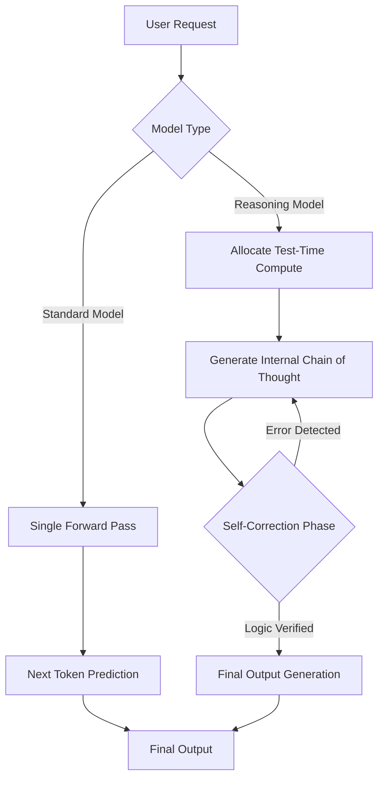
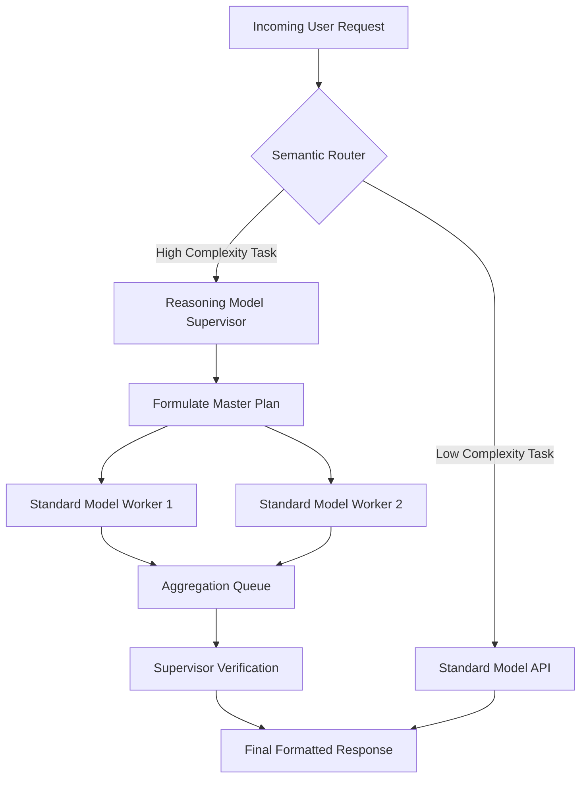

## Learning Outcomes

By the end of this module, you will be able to:
- **Design** routing architectures that dynamically select between standard and reasoning models based on query complexity and strict latency budgets.
- **Implement** API integrations that correctly configure test-time compute parameters to optimize the tradeoff between reasoning depth and execution cost.
- **Evaluate** the total cost of ownership for reasoning pipelines by analyzing hidden chain-of-thought token consumption in production logs.
- **Diagnose** pipeline bottlenecks caused by reasoning model latency spikes and implement appropriate asynchronous fallback mechanisms.

## Why This Module Matters

Hypothetical scenario: A financial software team asks a fast text-generation model to help migrate a legacy reporting pipeline. The system reads old database schemas, drafts SQL changes, and submits migration scripts for an automated approval path. On a simple table rename, it works well. On a more tangled task involving several joins, deferred constraints, and a hidden dependency between two reports, the model produces a confident answer that looks syntactically clean but reasons from the wrong relationship between tables.

The team catches the mistake during review, but the near miss teaches the real lesson. A fast next-token model is excellent when the task resembles patterns it has seen: summarize this paragraph, classify this support ticket, extract the invoice number, draft a short message, or translate a known intent into a common API call. It is much weaker when the task requires maintaining several constraints, noticing that an early assumption has become invalid, exploring alternatives, and deciding that the safest answer is to stop and ask for missing information.

Reasoning models address that class of work by spending extra inference-time compute before returning the visible answer. The practical idea is simple: a model can trade tokens, time, and money for more deliberate problem solving. Instead of generating only the final response, it may allocate an internal scratchpad, compare candidate solutions, use a verifier, revise a failed attempt, or decide that a narrower plan is safer than a broad one. The user may not see the internal reasoning, but the application still pays the latency and token cost.

That tradeoff is why reasoning models are an engineering topic, not just a model-release topic. If every request in a product goes through the slowest reasoning path, latency rises and unit economics become fragile. If no request can reach a reasoning model, the system may fail exactly where the business needs careful multi-step judgment. The production skill is to recognize which tasks deserve extra thinking, how much thinking to buy, how to observe that spend, and how to route the rest through cheaper paths without pretending that all prompts need the same model.

## Section 1: The Shift from System 1 to System 2 Thinking

The System-1/System-2 language is a useful analogy, not a claim that language models think like people. System 1 means fast pattern completion: the model maps the prompt and prior context to the next likely tokens with little visible deliberation. System 2 means deliberate problem solving: the system spends additional computation exploring a plan, checking intermediate assumptions, and sometimes revising before it commits to the final answer.

Standard chat models can still solve many multi-step problems, especially when the prompt is familiar and the answer shape is obvious. The risk appears when the first plausible continuation is wrong but locally convincing. Once a generated answer commits to a mistaken assumption, later tokens often rationalize that assumption instead of reopening it. In a code migration, that might mean the model explains a bad schema relationship beautifully; in an incident summary, it might connect events in a neat order that the logs do not support.

Reasoning models change the execution profile by making inference more elastic. The system may spend extra hidden tokens, run repeated samples, call a verifier, or use a learned policy that has been rewarded for reaching correct answers on tasks where intermediate reasoning matters. The final answer can be short even when the internal work was long. That is the key mental shift: output length is no longer a reliable proxy for work performed, cost incurred, or latency experienced.

The best analogy is a code reviewer switching from skim mode to design-review mode. Skim mode is appropriate for a typo, a documentation cleanup, or a known refactor pattern. Design-review mode is appropriate when a change touches concurrency, security boundaries, payment logic, or a migration path that cannot be rolled back easily. Reasoning models give your application a way to request that design-review mode, but they do not remove the need to decide when that mode is justified.



The diagram hides one important production detail: the application usually receives only the final answer and a small amount of metadata, not the raw reasoning trace. Some APIs expose summaries or encrypted reasoning artifacts, and some open-weight models can emit visible thinking text, but the durable engineering rule is the same either way. Treat reasoning as expensive internal work that needs a budget, a timeout, and an evaluation plan, not as free explanatory text.

## Section 2: The Mechanics of Test-Time Compute

Test-time compute means computation spent after the prompt arrives. Pretraining compute teaches a model broad language and world patterns. Post-training compute, such as supervised fine-tuning or reinforcement learning, shapes behavior before deployment. Test-time compute is different: it is the extra work performed during a live request, and the application pays for it every time that route is used.

A useful way to reason about the budget is to split a request into three token buckets. Input tokens are the prompt, retrieved context, tool results, and conversation history. Visible output tokens are the answer returned to the user or the structured payload consumed by your application. Reasoning tokens are internal generation or search tokens used to arrive at that answer. Depending on the provider and model, those reasoning tokens may be hidden, summarized, encrypted, exposed as explicit thinking text, or represented only in usage metadata.

The budget knob is usually expressed as an effort level, a thinking budget, or a maximum output allowance that includes hidden reasoning. The exact API field changes quickly, so the durable concept matters more than the name. Low effort asks the model to spend less internal work and return faster. Higher effort gives it more room to explore, verify, and revise. If the task is genuinely hard, the extra work can improve reliability; if the task is simple, the same extra work is just cost and delay.

Consider an illustrative request with 1,200 input tokens and a desired final JSON answer of about 250 visible tokens. A fast model might consume those 1,200 input tokens and generate the 250-token output directly. A reasoning model with a modest budget might spend 1,500 hidden reasoning tokens before the same 250 visible tokens. A high-budget route might spend 8,000 hidden reasoning tokens and still return only 250 visible tokens. The user sees roughly the same answer length in all three cases, but the billable and latency profile can differ by an order of magnitude.

That is why the first observability question for reasoning systems is not "How long was the answer?" It is "How many tokens did the system spend before producing the answer, and did those tokens buy measurable quality?" A useful dashboard separates input, visible output, hidden reasoning, tool-call retries, total wall-clock latency, and task success. Without that split, teams often misdiagnose cost spikes as "users asked longer questions" when the real driver was a routing change that sent routine traffic through a deeper reasoning path.

```python
import time
from dataclasses import dataclass


@dataclass
class ReasoningRun:
    effort: str
    input_tokens: int
    visible_output_tokens: int
    hidden_reasoning_tokens: int
    latency_seconds: float

    @property
    def total_tokens(self) -> int:
        return self.input_tokens + self.visible_output_tokens + self.hidden_reasoning_tokens


def estimate_tokens(text: str) -> int:
    """A rough local estimate; production systems should use provider tokenizers."""
    return max(1, len(text) // 4)


def simulate_reasoning_call(prompt: str, effort: str = "medium") -> ReasoningRun:
    """Simulate how a reasoning-budget knob changes cost and latency."""
    hidden_budget = {
        "low": 800,
        "medium": 2500,
        "high": 7000,
    }
    if effort not in hidden_budget:
        raise ValueError("effort must be one of: low, medium, high")

    input_tokens = estimate_tokens(prompt)
    visible_output_tokens = 240
    hidden_reasoning_tokens = hidden_budget[effort]

    # Keep the sleep tiny so the example remains runnable in a lesson environment.
    time.sleep(0.05)
    latency_seconds = 0.3 + hidden_reasoning_tokens / 1800

    return ReasoningRun(
        effort=effort,
        input_tokens=input_tokens,
        visible_output_tokens=visible_output_tokens,
        hidden_reasoning_tokens=hidden_reasoning_tokens,
        latency_seconds=round(latency_seconds, 2),
    )


if __name__ == "__main__":
    task = "Design a rollback-safe database migration plan for a service with dependent reports."
    for level in ["low", "medium", "high"]:
        run = simulate_reasoning_call(task, level)
        print(
            f"{run.effort:>6} | total={run.total_tokens:>5} tokens | "
            f"hidden={run.hidden_reasoning_tokens:>5} | latency={run.latency_seconds:>4}s"
        )
```

> **Pause and predict**: Suppose you are building a real-time support assistant that handles greetings, password-reset questions, and complex billing disputes. Based on the token-budget walkthrough, predict what happens if every message uses the high-effort route, then propose a routing rule that keeps basic questions responsive while still escalating ambiguous financial cases.

> **Landscape snapshot — as of 2026-06. This changes fast; verify against vendor docs before relying on specifics.**
>
> | Family or approach | Reasoning-control surface verified at authoring time | Engineering note |
> |--------------------|------------------------------------------------------|------------------|
> | OpenAI o-series and reasoning-capable API models | The Responses API documents a `reasoning` configuration with effort-style controls, usage metadata that can report reasoning tokens, and optional reasoning summaries rather than raw chain-of-thought exposure. | Treat reasoning effort as a cost, latency, and quality knob; reserve context/output space for hidden reasoning so the call does not finish with no visible answer. |
> | DeepSeek-R1 family | The technical report describes reinforcement learning that incentivizes reasoning patterns such as self-reflection, verification, and strategy adaptation. | Useful as a research reference for train-time RL-for-reasoning; deployment details depend on the host, checkpoint, and serving stack. |
> | Anthropic Claude extended/adaptive thinking | The API documentation describes thinking blocks, adaptive thinking, effort controls, and model-dependent support for manual token budgets. | Check current model support before copying an old request body, because supported thinking modes and budget fields can change by model version. |
> | Google Gemini thinking | The Gemini API documentation describes thinking controls, thinking budgets or levels depending on model generation, and thought signatures for maintaining thought context across turns. | Preserve returned signatures or reasoning artifacts exactly when the API requires them, especially around tool use and multi-turn flows. |
> | Qwen/QwQ and Qwen thinking-mode models | Qwen project materials describe QwQ as an open-weight reasoning model trained with reinforcement learning, while the Qwen3 report describes unified thinking and non-thinking modes with a budget mechanism. | Open-weight reasoning changes the cost/privacy/deployment tradeoff, but the same routing and observability discipline still applies. |

The snapshot is intentionally small. It is not a leaderboard, an endorsement, or a permanent roster. Its purpose is to show that the same durable abstraction appears across multiple model families: some control asks the model to think more or less, some metadata exposes or summarizes that thinking, and production systems need to decide when that added work is worth buying.

## Section 3: Train-Time Reasoning vs Inference-Time Search

Reasoning improvements come from two different places that are easy to blur together. Train-time work changes the model before you call it. Inference-time work changes how much computation the system spends while answering a particular prompt. A production architecture may use both, but they have different costs, owners, and failure modes.

Train-time reasoning work includes supervised examples, preference optimization, reinforcement learning on verifiable tasks, process supervision, distillation from stronger models, and curriculum design that rewards correct multi-step solutions. The model vendor or model-training team pays that cost ahead of time. The result is a model that has learned better habits: checking work, decomposing problems, noticing contradictions, or producing intermediate representations that support more reliable answers.

Inference-time work is paid on every request. It includes hidden thinking tokens, self-consistency sampling, search over multiple candidate answers, verifier calls, tool-use loops, and budgeted retries. This is where application engineers have direct control. You can set a budget, route only difficult requests, stop a long-running job, ask for a structured final answer, or decide that a high-value task should get a second pass before a user sees it.

The two forms reinforce each other. A model trained to reason productively can make better use of extra inference-time budget than a model that merely rambles when given more tokens. At the same time, a strong training recipe does not make all requests free. If your application asks for deep reasoning on every FAQ, the serving bill still rises and users still wait. The durable engineering question is therefore not "Which model thinks?" but "Which tasks need extra thinking, and how do we measure whether it helped?"

### Chain-of-Thought, Self-Consistency, Tree Search, and Graph Search

Chain-of-thought is the simplest mental model: the system creates intermediate reasoning steps before the final answer. In older prompting patterns, developers often asked the model to expose those steps directly. In modern reasoning systems, the raw trace may be hidden, summarized, or represented as internal tokens. Either way, the durable idea is decomposition. The model has a place to transform "solve this" into smaller claims, calculations, constraints, and checks before it answers.

Self-consistency adds sampling. Instead of trusting one reasoning path, the system generates several candidate paths and chooses the final answer that appears most consistent across them or scores highest under a verifier. This can improve reliability on arithmetic, symbolic, or commonsense tasks because a single unlucky path is less likely to dominate the final answer. The tradeoff is direct: if you sample five candidates, you may pay close to five times the inference work unless the implementation shares computation or stops early.

Tree-of-thought generalizes that idea into explicit search. The system explores multiple partial solution branches, evaluates promising branches, expands the best ones, and backtracks when a branch fails. This is a better fit for puzzles, planning, code repair, and tasks where an early decision can close off a better answer. The price is orchestration complexity: you now need a branching policy, a scoring function, stopping criteria, and guardrails against runaway exploration.

Graph-of-thought treats intermediate ideas as nodes that can be merged, revised, decomposed, or connected rather than only arranged in a line or tree. That is useful when a problem has interacting subproblems: a database migration touches schema design, data backfill, rollback, monitoring, and deployment ordering. A graph can let the system revise the rollback node after the backfill node exposes a dependency, then feed that change back into the deployment plan.

These strategies do not have to be visible to the end user. A reasoning model may internalize parts of them through training, while an application may implement others explicitly with multiple calls and a verifier. When you design a production workflow, decide which layer owns the deliberation. If the model already performs enough internal reasoning for a task, a large external tree search may waste money. If the model routinely misses a safety constraint, an explicit verifier step may be more reliable than asking the same model to "think harder."

## Section 4: When a Reasoning Model Is Worth It

A reasoning model is worth the extra cost when failure is expensive, the answer depends on several linked constraints, and the system has enough time to deliberate. The common trap is to equate "important" with "needs reasoning." A password-reset answer may be important for user trust, but it is usually a retrieval and policy-consistency task. A small database migration may be less visible, yet require careful ordering, rollback, and constraint analysis. Importance matters, but reasoning need comes from task structure.

Use this decision framework before routing a task to the expensive path. First, ask whether the answer can be found directly in provided context. If a retrieval result contains the exact policy sentence, a fast model or deterministic template may be enough. Second, ask whether the task requires combining multiple facts into a conclusion. Multi-hop reasoning, cross-document reconciliation, or code changes across several files are stronger candidates. Third, ask whether an early mistake will be hard to detect. If the output is a proposed SQL migration, security exception, or production runbook, silent plausibility is dangerous.

Fourth, ask whether the system can verify the result cheaply. If a unit test, schema validator, type checker, SQL dry run, or rules engine can catch mistakes, you may not need a high-effort model on the first pass. A cheaper model can propose the answer, then deterministic tools can reject bad outputs. Fifth, ask whether latency is acceptable. A background compliance review can wait; an autocomplete keystroke cannot. Sixth, ask whether the user or business process benefits from a better answer enough to pay for it.

Here is a practical routing rubric:

| Task Type | Reasoning Need | Better Default |
|-----------|----------------|----------------|
| Greeting, FAQ, simple extraction, known formatting | Low, because the answer path is direct and easy to verify. | Fast model, retrieval, or deterministic template. |
| Summarization of one short document | Usually low, unless the summary must reconcile conflicting evidence. | Fast model with citation or quote constraints. |
| Multi-document policy interpretation | Medium to high, because the answer may require conflict resolution and exception handling. | Router plus reasoning model for ambiguous or high-risk cases. |
| Code change across files or APIs | High when behavior, tests, and architecture interact. | Reasoning model for planning or verification, standard workers for mechanical edits. |
| Math proof, algorithm analysis, migration planning | High, because intermediate assumptions need checking. | Reasoning model with explicit budget and verifier where possible. |
| Creative brainstorming | Variable, because novelty does not always require deep reasoning. | Fast model first; escalate only when constraints or planning dominate. |

The rubric is not a moral hierarchy of tasks. It is a budget-control tool. A production system can start with conservative rules, collect outcomes, and then tune thresholds. If the router escalates too often, costs rise and latency suffers. If it escalates too rarely, hard tasks fail silently. The goal is not to minimize reasoning usage; it is to buy reasoning where it measurably improves correctness, safety, or user value.

## Section 5: Architectural Patterns for Reasoning Models

Deploying reasoning models in production requires patterns that isolate expensive thinking from routine traffic. Treating a reasoning model as a drop-in replacement for every standard model call is usually a budget and latency mistake. The durable patterns are cascades, supervisor-worker systems, verifier loops, and asynchronous execution.

### 1. The Semantic Router (Cascade Pattern)

In a cascade, every incoming request first reaches a low-cost classifier or rule-based gate. The router estimates difficulty, risk, and latency tolerance. Simple requests go to a fast model or deterministic path. Ambiguous, multi-step, or high-risk requests move to the reasoning route. This preserves user responsiveness for ordinary traffic while still giving hard tasks a path to deeper compute.

The router does not have to be a model. It can combine keyword rules, embedding similarity, business metadata, user tier, tool availability, and model confidence. A support assistant might route messages with "refund", "chargeback", and "account locked" to a deeper review only when the account state contains conflicting signals. A code assistant might escalate when the changed files include concurrency primitives, authentication, database migrations, or failing tests. A legal-document assistant might escalate when retrieved clauses disagree or when the requested output is a binding recommendation rather than a neutral summary.

### 2. The Supervisor-Worker Pattern

For sprawling multi-step workflows, a reasoning model can act as the supervisor while cheaper workers perform bounded subtasks. The supervisor plans, decomposes, assigns, and verifies. Workers summarize files, run searches, draft small changes, classify evidence, or execute deterministic checks. The supervisor then aggregates the results and decides whether the plan is complete.

This pattern works because planning and verification are usually more reasoning-heavy than every individual subtask. A repository audit, for example, does not need a high-effort model to read every dependency file. It may need one to decide which dependency signals matter, which findings are duplicates, and which mitigation plan respects project constraints. The supervisor-worker split buys expensive reasoning only at the coordination points.

### 3. The Verifier Loop

A verifier loop separates proposal from checking. One model or deterministic process proposes an answer; another step checks it against tests, schemas, policies, citations, or examples. When the verifier fails, the system can retry with a higher reasoning budget, request missing context, or return a narrower answer. This pattern is especially useful when a cheap verifier exists. Unit tests, linters, JSON Schema, SQL `EXPLAIN`, type checkers, and citation reachability checks are often cheaper and more reliable than a second model opinion.

The verifier loop also prevents the "deep model as oracle" failure mode. Reasoning models can still be confidently wrong, especially when the prompt lacks evidence or asks for a judgment outside the model's context. A verifier anchors the workflow to observable facts. The point is not that the verifier is perfect; it is that the system has at least one independent way to reject plausible nonsense before it reaches a user.

### 4. Asynchronous Reasoning Jobs

High-effort reasoning is often incompatible with synchronous request/response UX. If a job may take long enough to make the interface feel frozen, return a job identifier, show progress states, and let the user continue. A background worker can own the reasoning call, stream status updates, enforce a token budget, and fall back to a lower-effort summary if the job exceeds its service-level objective.



## Section 6: Worked Cost Model for a Cascade

Use an illustrative cost model to understand the cascade pattern without relying on any vendor's current pricing. Imagine a product receives 10,000 requests per day. Eighty percent are simple lookup or extraction tasks, fifteen percent are medium analytical tasks, and five percent are hard planning tasks. A fast route costs 1 cost unit per request and responds quickly. A medium reasoning route costs 10 units. A high reasoning route costs 40 units because it spends more hidden tokens and holds compute longer.

If every request goes through the high reasoning route, the daily cost is 400,000 units. If every request goes through the fast route, the daily cost is 10,000 units, but hard tasks may fail exactly where correctness matters. A simple cascade that sends 80 percent to fast, 15 percent to medium, and 5 percent to high costs 8,000 + 15,000 + 20,000 = 43,000 units. That is far more than the all-fast baseline but far less than the all-high route, and it spends the high budget where it is most likely to help.

The important number is not the hypothetical 43,000 units. The important behavior is marginal escalation. If the router becomes too nervous and sends 20 percent of traffic to high reasoning, cost rises sharply. If it becomes too strict and sends only one percent to high reasoning, hard-task quality may fall. Good routing thresholds are empirical: sample real traffic, label task difficulty, run offline comparisons, and decide which additional successes justify the additional tokens.

Latency has the same shape. Users tolerate different delays for different jobs. A chat interface answering "Where is the invoice settings page?" should feel immediate. A background job producing a migration plan can show a pending state. A code-review assistant can do a fast first pass in the UI and attach a deeper review later. The architecture should match the user's waiting model instead of pretending every model call belongs in the same synchronous path.

```python
def cascade_daily_cost(
    requests_per_day: int,
    simple_rate: float,
    medium_rate: float,
    hard_rate: float,
) -> dict:
    """Compute illustrative cascade economics in provider-neutral cost units."""
    if round(simple_rate + medium_rate + hard_rate, 6) != 1.0:
        raise ValueError("traffic rates must sum to 1.0")

    unit_cost = {
        "fast": 1,
        "medium_reasoning": 10,
        "high_reasoning": 40,
    }
    simple = requests_per_day * simple_rate * unit_cost["fast"]
    medium = requests_per_day * medium_rate * unit_cost["medium_reasoning"]
    hard = requests_per_day * hard_rate * unit_cost["high_reasoning"]

    return {
        "all_fast": requests_per_day * unit_cost["fast"],
        "all_high_reasoning": requests_per_day * unit_cost["high_reasoning"],
        "cascade": int(simple + medium + hard),
    }


print(cascade_daily_cost(10_000, simple_rate=0.80, medium_rate=0.15, hard_rate=0.05))
```

The simulator deliberately uses "cost units" rather than currency. Real token prices, context windows, model names, and discount programs change quickly, and anchoring a lesson on a price table would make it obsolete. For your own system, replace the unit costs with current provider pricing, measured token counts, infrastructure overhead, and support costs caused by latency or wrong answers.

## Section 7: Prompting Paradigm Shift - Goal Orientation

Prompting reasoning models is less about teaching the model a visible step sequence and more about defining the problem boundary. With a fast model, developers often use explicit chain-of-thought prompts, dense examples, and formatting instructions to coax a useful intermediate path. With a reasoning-capable route, the better default is to state the goal, provide evidence, define constraints, and specify the final answer contract without over-prescribing the internal algorithm.

That does not mean prompts should be vague. Reasoning models are not mind readers, and extra compute cannot recover facts that were never provided. A good prompt tells the model what success means, which inputs are authoritative, which tradeoffs matter, which constraints cannot be violated, and when to refuse or ask for missing context. The model gets freedom in how it reasons, not freedom in what evidence it may invent.

Here is a weak prompt for a database migration review: "Think step by step and write a migration plan for these schema changes." It asks for process, but it does not define safety. It does not say whether downtime is acceptable, whether rollback is required, which tables are large, which reports depend on the schema, or what output format the deployment system expects. A model can spend a large reasoning budget exploring an underspecified space and still return an unsafe plan.

A stronger prompt is goal-oriented: "Given the schema diff, table sizes, foreign-key relationships, and report dependencies below, produce a rollback-safe migration plan. Preserve read availability, avoid exclusive locks on hot tables, include preflight checks, include a rollback trigger for each phase, and return only a Markdown table with columns Phase, Action, Verification, Rollback, and Risk. If any dependency is missing, return `NEEDS_CONTEXT` with the exact missing item." This prompt does not dictate the reasoning path, but it sharply defines the target and failure conditions.

### Prompting Anti-Patterns vs Better Defaults

| Anti-Pattern | Why it Fails | Better Default |
|--------------|--------------|----------------|
| Asking for visible chain-of-thought as the main instruction | It may waste tokens, leak sensitive intermediate text, or conflict with APIs that hide raw reasoning. | Ask for the final answer plus a concise justification, assumptions, and verification steps. |
| Mandating a rigid algorithm before the model sees the evidence | The model may follow a bad human path even when another decomposition is safer. | Define constraints and success criteria, then let the model choose a plan within those boundaries. |
| Providing examples that imply the wrong domain shape | Few-shot examples can anchor the model on surface format instead of the current task's constraints. | Provide schemas, policies, tests, and edge cases from the actual task rather than decorative examples. |
| Mixing final formatting rules into every sentence | The prompt becomes noisy, and the model may optimize for layout over substance. | Put the final output contract in one compact section after the task constraints. |
| Hiding uncertainty requirements | The model may force a confident answer when the evidence is incomplete. | Tell the model exactly when to return `NEEDS_CONTEXT`, `UNSAFE`, or a bounded partial answer. |

For reasoning models, the best prompt often feels like a specification rather than a tutorial. It names the task, evidence, constraints, output contract, and refusal conditions. It should also tell the model what not to optimize. For example, "Do not minimize steps at the expense of rollback safety" is clearer than "be careful." "Prefer asking for missing context over inventing a dependency" is clearer than "avoid hallucination."

The final answer should be easy for downstream code to validate. JSON Schema, Markdown tables with fixed columns, typed fields, and explicit status codes make observability easier. A free-form essay can be pleasant for a human, but it is harder to route, score, diff, and retry. If the reasoning route is part of a production workflow, the output should be structured enough that the rest of the system can decide what happened.

## Section 8: Cost, Latency, and Troubleshooting

The most significant engineering challenge when adopting reasoning models is variability. A standard response path often has latency that roughly tracks input length, output length, and tool-call count. A reasoning path can add hidden work that varies by task difficulty, prompt ambiguity, budget setting, retry behavior, and whether the model gets stuck exploring dead ends. The user might see a short final answer after a long silent wait.

Observability must therefore treat reasoning as a first-class resource. Log the route selected, router confidence, budget setting, input tokens, visible output tokens, hidden reasoning tokens when available, tool-call count, retry count, timeout reason, final status, and downstream verification result. Store enough task metadata to compare similar requests over time without logging sensitive user data unnecessarily. The dashboard should answer whether deeper reasoning improved task success, not merely whether it produced more fluent text.

Failure mode one is over-thinking. The model spends a large budget on a task that a fast model or deterministic rule could solve. Symptoms include high reasoning-to-output ratios, long latency on simple intents, and user complaints about basic tasks feeling slow. Fix over-thinking with better routing, lower default budgets, early exits, and deterministic handlers for high-volume simple requests.

Failure mode two is silent truncation. A model may spend most of its allowed generation budget internally and then run out of room before producing a complete visible answer. The application sees a partial response, an incomplete status, or an empty answer after paying for input and reasoning work. Fix this by reserving output space, setting explicit maximums, detecting incomplete statuses, and retrying with either a narrower prompt or a larger budget only when the task justifies it.

Failure mode three is budget drift. A prompt change, retrieval expansion, or new router threshold silently increases average hidden tokens. Because visible answers look the same, teams may not notice until invoices or latency alerts spike. Fix this with per-route budgets, weekly token histograms, regression tests for representative prompts, and deployment gates that compare pre-change and post-change token profiles.

Failure mode four is reasoning without grounding. Extra thinking does not create facts. If the prompt lacks evidence, a reasoning model can produce a more coherent unsupported answer. Fix this with retrieval citations, tool calls, validators, refusal rules, and clear instructions to return missing-context statuses. A high reasoning budget should make the model more careful with evidence, not more creative with gaps.

### Implementing Asynchronous Fallbacks

To prevent infrastructure timeouts, treat deep reasoning as a job when the service-level objective allows it. The request handler can return `202 Accepted` with a `job_id`, a status URL, and an estimated completion state. A background worker owns the model call, enforces the reasoning budget, records metadata, and writes the final result. The client polls or subscribes to updates while the user interface shows a pending state instead of a frozen spinner.

Fallbacks should be explicit rather than accidental. If the reasoning job exceeds its budget, the worker can return a lower-confidence summary, ask for missing context, or provide a partial plan marked as incomplete. For high-risk tasks, the correct fallback may be "no automated answer" rather than a cheap model guess. For low-risk tasks, a fast route may be good enough. The fallback policy belongs in product and risk design, not buried as a generic exception handler.

```python
def analyze_reasoning_efficiency(response_metadata: dict) -> float:
    """
    Calculates the reasoning efficiency ratio from API response metadata.
    A very high ratio indicates the model struggled to find a path
    to the solution, suggesting the prompt lacks critical constraints.
    """
    completion_tokens = response_metadata.get('completion_tokens', 0)
    details = response_metadata.get('completion_tokens_details', {})
    reasoning_tokens = details.get('reasoning_tokens', 0)
    
    # Calculate visible output tokens by subtracting the hidden thoughts
    visible_tokens = completion_tokens - reasoning_tokens
    
    if visible_tokens == 0:
        print("Error: Model returned no visible output.")
        return float('inf')
        
    ratio = reasoning_tokens / visible_tokens
    print(f"Reasoning Tokens: {reasoning_tokens}")
    print(f"Visible Output Tokens: {visible_tokens}")
    print(f"Reasoning to Output Ratio: {ratio:.2f}:1")
    
    if ratio > 20.0:
        print("DIAGNOSTIC WARNING: Highly inefficient reasoning detected.")
        print("Action Required: Check routing, prompt constraints, and budget.")
        print("The model may be spending hidden work on an underspecified task.")
        
    return ratio
```

The threshold in the example is intentionally local policy, not a universal law. A proof assistant might accept a high reasoning-to-output ratio because the final answer is short and the task is hard. A customer-support FAQ should not. The point of the function is to make the hidden-work ratio visible enough that each route can define its own normal range.

> **Stop and think**: You are designing an automated code review system. A pull request contains a small styling change and a large change to concurrency-sensitive scheduling logic. If your system sends the entire pull request through one high-effort route, which parts waste hidden reasoning tokens, and how would you split planning, file triage, deterministic tests, and final verification?

## Section 9: Evaluating Whether Reasoning Helped

The most mature reasoning architecture is useless if you cannot tell whether it improved outcomes. Offline benchmarks are useful for orientation, but they are not a substitute for your product's task distribution. A science benchmark, a math benchmark, and a software-repair benchmark each stress different skills. Your application may need policy reconciliation, migration planning, long-context retrieval, or careful refusal when evidence is missing. The evaluation set should therefore begin with real tasks that represent your users, risks, and failure costs.

Build an evaluation set with difficulty labels before tuning the router. Include simple tasks that should stay on the fast route, medium tasks where either route might be acceptable, and hard tasks that you believe require extra deliberation. For each task, define the expected evidence, acceptable answer shape, disallowed behavior, and verification method. A support assistant might require a cited policy paragraph and forbid account-specific claims without tool evidence. A code assistant might require passing tests and a patch that changes only relevant files. A migration planner might require rollback steps, lock-risk notes, and explicit missing-context detection.

Then compare routes, not just models. Run the same task through a fast baseline, a low-effort reasoning route, a higher-effort reasoning route, and any explicit verifier loop you are considering. Score correctness, grounding, latency, token spend, retry count, and human-review burden. A high-effort route that improves correctness by a small amount but doubles human cleanup may not be a win. A low-effort route plus deterministic verifier may beat a deeper route because it catches the exact failures that matter in your workflow.

Use error taxonomy rather than a single pass/fail number. Label failures as missing evidence, wrong calculation, invalid format, unsafe assumption, tool misuse, timeout, incomplete output, over-escalation, or under-escalation. This tells you what to fix. Missing evidence points to retrieval or prompt constraints. Wrong calculation may point to reasoning budget, verifier design, or a specialized tool. Invalid format points to output contract and parser tests. Over-escalation points to router thresholds. Under-escalation points to task signals that the router failed to notice.

Finally, evaluate over time. Reasoning systems drift because prompts change, upstream models change, retrievers add larger chunks, users discover new workflows, and routers inherit new business rules. Keep a small canary set that runs before deployment and a larger sampled set that runs on a schedule. Track not only average score but also tail latency, hidden-token percentiles, incomplete responses, and escalation distribution. A reasoning feature is production-ready when you can explain why each route exists, when it fires, what it costs, what quality it buys, and how you will notice when that bargain stops holding.

## Did You Know?

- Test-time scaling is not one technique. Research literature studies repeated sampling, verifier-guided search, adaptive compute allocation, process reward models, and model-internal reasoning policies; production APIs then expose only a small control surface over some of that machinery.
- Chain-of-thought prompting was originally useful because it made intermediate work visible in the prompt and answer. Modern reasoning deployments often hide raw reasoning for safety, policy, or product reasons, so engineers must rely on final-answer quality, summaries, metadata, and independent verification.
- A reasoning model can be worse than a fast model for routine tasks because it may spend time solving a problem that does not exist. The win condition is not "always think longer"; it is "allocate more compute when the task structure rewards deliberation."
- Evaluation must include business outcomes, not only benchmark scores. A model that performs well on math or coding benchmarks may still be the wrong default for a low-latency support workflow if most user requests are simple and the hard cases require retrieval or human approval.

## Common Mistakes

| Mistake | Why it Happens | How to Fix |
|---------|----------------|------------|
| Routing every request to the reasoning path | Teams equate the most careful route with the safest route, even when most traffic is direct lookup or extraction. | Start with a semantic router, collect task labels, and escalate only when complexity, risk, or ambiguity justify the cost. |
| Measuring only visible output tokens | The final answer may be short while the internal reasoning work is long, so normal completion-length dashboards miss the real spend. | Track input, visible output, hidden reasoning, retries, tool calls, latency, and verification success as separate fields. |
| Treating extra thinking as factual grounding | A model can reason coherently from missing or false evidence, producing a polished answer that is still unsupported. | Pair reasoning routes with retrieval, citations, validators, and explicit missing-context statuses. |
| Copying prompting habits unchanged | Prompts written for fast models often over-prescribe step order while under-specifying evidence, constraints, and failure states. | Write prompts as task specifications: goal, evidence, constraints, output contract, and refusal conditions. |
| Setting one timeout for every route | A low-latency UI path and a background analysis job have different waiting models, but teams often reuse the same HTTP timeout. | Use synchronous calls for fast paths and job-based asynchronous execution for high-effort reasoning work. |
| Ignoring deterministic verifiers | Teams ask a model to self-check work that a schema, unit test, linter, or policy engine could reject more cheaply. | Put deterministic checks after generation and retry only the failing portion with a clearer prompt or higher budget. |
| Letting router thresholds drift | New prompts, retrieval chunks, or classifier changes silently increase escalation rates and token burn. | Version routing rules, monitor escalation percentages, and compare pre/post deployment cost and quality distributions. |

## Quiz

<details>
<summary>Question 1: You deploy a support assistant backed exclusively by a high-effort reasoning route. Users say basic questions feel sluggish, while complex account disputes are more accurate. What architectural flaw causes this mixed result, and how should it be fixed?</summary>
<br>
The flaw is using one expensive route for tasks with very different reasoning needs. Simple FAQ and extraction requests do not benefit much from hidden deliberation, so they pay latency without buying quality. Add a semantic router that handles direct questions through retrieval, templates, or a fast model, then escalates ambiguous, high-risk, or multi-step disputes to the reasoning route. Track escalation rate and outcome quality so the router can be tuned with real traffic rather than guesswork.
</details>

<details>
<summary>Question 2: A code assistant prompt says, "Think step by step. First import a library, second parse the file, third drop nulls, fourth print the answer." The output follows the sequence but misses an edge case in the requirements. What is wrong with the prompt?</summary>
<br>
The prompt micromanages the process while underspecifying the goal. It tells the model which steps to take, but it does not define input edge cases, correctness criteria, validation rules, or the final output contract. A better prompt states the desired behavior, the authoritative inputs, required handling for nulls and malformed rows, the verification command, and the exact output format. The model can then choose an implementation path while remaining constrained by the real requirements.
</details>

<details>
<summary>Question 3: A dashboard shows that output length stayed stable after a routing change, but total cost and latency rose sharply. Which hidden metric should you inspect first, and why?</summary>
<br>
Inspect hidden reasoning tokens or the closest provider-specific equivalent in usage metadata. The visible answer can remain the same size while the model spends much more internal work reaching that answer. You should also inspect escalation rate, retry count, and timeout status, because a router threshold change or retry loop can multiply the number of expensive calls even when each final answer looks normal.
</details>

<details>
<summary>Question 4: A background planning job sometimes takes longer than the product's normal chat timeout. The team lowers the timeout so failures are fast, but important plans now return incomplete answers. What should change?</summary>
<br>
The job should not share the same synchronous timeout as an interactive chat response. Move high-effort planning into an asynchronous job with a `job_id`, status polling or notifications, explicit token and wall-clock budgets, and a clear fallback policy. For high-risk work, the fallback may be a missing-context or incomplete status rather than a cheap model guess. The user interface should communicate progress instead of pretending the task is an instant chat turn.
</details>

<details>
<summary>Question 5: A product manager asks whether every creative brainstorming request should use a reasoning model because "thinking harder must produce better ideas." How would you evaluate that claim?</summary>
<br>
Evaluate the task structure rather than the label "creative." If the request is open-ended ideation with few constraints, a fast model may produce enough variety at lower latency and cost. If the request must satisfy many constraints, reconcile strategy, obey policy, or plan a launch sequence, deeper reasoning may help. Run an offline comparison with representative prompts, define quality criteria before testing, and include latency and cost in the decision.
</details>

<details>
<summary>Question 6: Your reasoning-to-output ratio is high for JSON validation prompts, but a deterministic JSON Schema validator is available. What is the better architecture?</summary>
<br>
Use the deterministic validator as the primary checker and reserve the model for tasks the validator cannot solve, such as explaining failures to a user or suggesting a repair plan when several constraints interact. Asking a reasoning model to rediscover formal schema rules wastes hidden tokens and may still miss edge cases. The durable pattern is proposal plus deterministic verification, with escalation only for ambiguous repair or policy interpretation.
</details>

## Hands-On Exercise: Building a Semantic Router Simulator

In this exercise, you will build a Python simulation of a Semantic Router that dynamically routes tasks to either a fast standard model or a high-latency reasoning model. You will calculate the simulated token costs to prove the financial viability of the cascade pattern.

### Task 1: Define the Router Logic

- [ ] Create a new file named `semantic_router.py`.
- [ ] Add a `classify_task(prompt: str) -> str` function that returns `"reasoning"` for prompts containing signals such as "calculate", "prove", "architect", "analyze", "debug", "migrate", or "tradeoff".
- [ ] Return `"standard"` for direct lookup, greeting, extraction, or summarization prompts that do not contain those complexity signals.

<details>
<summary>View Solution for Task 1</summary>

```python
def classify_task(prompt: str) -> str:
    complex_keywords = [
        "calculate",
        "prove",
        "architect",
        "analyze",
        "debug",
        "migrate",
        "tradeoff",
    ]
    prompt_lower = prompt.lower()
    
    for keyword in complex_keywords:
        if keyword in prompt_lower:
            return "reasoning"
            
    return "standard"
```
</details>

### Task 2: Implement the Standard Model Mock

- [ ] Write `mock_standard_api(prompt: str) -> dict` to simulate a fast route.
- [ ] Calculate `input_tokens` as `max(1, len(prompt) // 4)`, generate a short static output string, and calculate `output_tokens` the same way.
- [ ] Return latency, input tokens, visible output tokens, zero hidden tokens, and `cost_units` so the exercise does not depend on current vendor pricing.

<details>
<summary>View Solution for Task 2</summary>

```python
def mock_standard_api(prompt: str) -> dict:
    input_tokens = max(1, len(prompt) // 4)
    output_text = "Here is the direct answer based on standard pattern matching."
    output_tokens = max(1, len(output_text) // 4)
    
    return {
        "model_used": "standard-fast",
        "latency_s": 0.5,
        "input_tokens": input_tokens,
        "output_tokens": output_tokens,
        "hidden_tokens": 0,
        "cost_units": (input_tokens * 1) + (output_tokens * 2),
    }
```
</details>

### Task 3: Implement the Reasoning Model Mock

- [ ] Write `mock_reasoning_api(prompt: str, effort: str = "medium") -> dict` to simulate test-time compute.
- [ ] Use effort levels to control hidden tokens: low uses 800, medium uses 2500, and high uses 7000.
- [ ] Calculate latency and `cost_units` from hidden tokens so the simulator shows why a reasoning route should be reserved for harder tasks.

<details>
<summary>View Solution for Task 3</summary>

```python
def mock_reasoning_api(prompt: str, effort: str = "medium") -> dict:
    input_tokens = max(1, len(prompt) // 4)
    output_text = "After deep deliberation, here is the verified logical solution."
    output_tokens = max(1, len(output_text) // 4)
    
    effort_multipliers = {"low": 800, "medium": 2500, "high": 7000}
    hidden_tokens = effort_multipliers.get(effort, 5000)
    
    latency = 0.8 + hidden_tokens / 1800
    
    cost_units = (input_tokens * 3) + ((output_tokens + hidden_tokens) * 8)
    
    return {
        "model_used": "reasoning-deep",
        "latency_s": round(latency, 2),
        "input_tokens": input_tokens,
        "output_tokens": output_tokens,
        "hidden_tokens": hidden_tokens,
        "cost_units": cost_units,
    }
```
</details>

### Task 4: Build the Integration Pipeline

- [ ] Write `process_request(prompt: str)` so it calls the router first.
- [ ] Send `"reasoning"` tasks to `mock_reasoning_api(prompt, effort="medium")` and all other tasks to `mock_standard_api(prompt)`.
- [ ] Print a diagnostic report showing route, model, latency, visible tokens, hidden tokens, and cost units.

<details>
<summary>View Solution for Task 4</summary>

```python
def process_request(prompt: str):
    task_type = classify_task(prompt)
    print(f"\nProcessing Prompt: '{prompt}'")
    print(f"Routing Decision: Route to {task_type.upper()} model.")
    
    if task_type == "reasoning":
        result = mock_reasoning_api(prompt, effort="medium")
    else:
        result = mock_standard_api(prompt)
        
    print(f"Execution Report:")
    print(f"  Model:   {result['model_used']}")
    print(f"  Latency: {result['latency_s']} seconds")
    print(f"  Visible: {result['output_tokens']} tokens")
    print(f"  Hidden:  {result['hidden_tokens']} tokens")
    print(f"  Cost:    {result['cost_units']} units")
```
</details>

### Task 5: Analyze the Token Economics

- [ ] Add a test suite at the bottom of `semantic_router.py` with at least three prompts: one simple summary, one direct extraction, and one reasoning-heavy analysis.
- [ ] Run the script and compare latency, hidden-token use, and cost units across routes.
- [ ] Explain in one paragraph why the cascade avoids paying for hidden reasoning tokens on simple requests while still escalating hard prompts.

<details>
<summary>View Solution for Task 5</summary>

```python
# Run the test suite
if __name__ == "__main__":
    prompts = [
        "Summarize this brief email regarding the team lunch.",
        "Extract the invoice number from this sentence: invoice KD-1042 is overdue.",
        "Analyze the time complexity of this recursive function and prove its bounds."
    ]

    for p in prompts:
        process_request(p)
        
# Expected Output Analysis:
# The first two prompts should use the standard route with zero hidden tokens.
# The final prompt should use the reasoning route with higher latency and cost units,
# demonstrating why routing is essential for cost and responsiveness.
```

**Checkpoint Verification:**
Execute the simulator to confirm your routing logic works:
```bash
.venv/bin/python semantic_router.py
```
</details>

### Success Checklist
- [ ] Your router correctly identifies complex tasks versus simple extraction tasks.
- [ ] The standard model mock calculates cost accurately without incorporating hidden tokens.
- [ ] The reasoning model mock dynamically scales hidden tokens and latency based on the effort parameter.
- [ ] The integration report prints route, model, latency, visible tokens, hidden tokens, and cost units.
- [ ] The final analysis explains why the cascade pattern is cheaper and more responsive than sending every prompt to the reasoning route.

## Next Module

Now that you understand reasoning budgets, cascade routing, and the cost-latency-accuracy tradeoff, continue into the next sub-track with [Module 1.1: Vector Databases Deep Dive](/ai-ml-engineering/vector-rag/module-1.1-vector-databases-deep-dive/). Retrieval systems give reasoning workflows grounded evidence, which is often the difference between careful analysis and a polished answer based on missing context.

## Sources

- [Learning to Reason with LLMs](https://openai.com/index/learning-to-reason-with-llms/) — Research release discussing reinforcement learning, train-time compute, test-time compute, chain-of-thought behavior, and hidden reasoning policies.
- [OpenAI API Reasoning Guide](https://developers.openai.com/api/docs/guides/reasoning) — Current API documentation for reasoning effort, reasoning-token accounting, incomplete responses, and summaries in the dated snapshot.
- [OpenAI Reasoning Best Practices](https://developers.openai.com/api/docs/guides/reasoning-best-practices) — Current API guidance on reasoning items, state handling, and function-calling behavior for reasoning-capable workflows.
- [DeepSeek-R1: Incentivizing Reasoning Capability in LLMs via Reinforcement Learning](https://arxiv.org/abs/2501.12948) — Technical report on reinforcement learning for reasoning behavior, including self-reflection and verification patterns.
- [Anthropic Extended Thinking Documentation](https://platform.claude.com/docs/en/build-with-claude/extended-thinking) — Current vendor documentation for extended or adaptive thinking controls, budget behavior, and thinking summaries in the dated snapshot.
- [Gemini API Thinking Documentation](https://ai.google.dev/gemini-api/docs/thinking) — Current vendor documentation for thinking controls, thinking budgets or levels, and thought signatures in the dated snapshot.
- [QwQ-32B: Embracing the Power of Reinforcement Learning](https://qwenlm.github.io/blog/qwq-32b/) — Qwen project page describing QwQ as an open-weight reasoning model trained with reinforcement learning.
- [Qwen3 Technical Report](https://arxiv.org/abs/2505.09388) — Technical report describing unified thinking and non-thinking modes, thinking budgets, and open model availability.
- [Chain-of-Thought Prompting Elicits Reasoning in Large Language Models](https://arxiv.org/abs/2201.11903) — Foundational paper for prompting models to produce intermediate reasoning steps before final answers.
- [Self-Consistency Improves Chain of Thought Reasoning in Language Models](https://arxiv.org/abs/2203.11171) — Paper introducing repeated reasoning samples and answer aggregation as an inference-time reliability strategy.
- [Tree of Thoughts: Deliberate Problem Solving with Large Language Models](https://arxiv.org/abs/2305.10601) — Paper generalizing linear chain-of-thought into branch exploration, evaluation, and backtracking.
- [Graph of Thoughts: Solving Elaborate Problems with Large Language Models](https://arxiv.org/abs/2308.09687) — Paper modeling intermediate reasoning artifacts as graph nodes that can be combined, revised, and transformed.
- [Scaling LLM Test-Time Compute Optimally Can Be More Effective than Scaling Model Parameters](https://arxiv.org/abs/2408.03314) — Research on allocating inference-time compute adaptively by prompt difficulty rather than using one fixed strategy.
- [RouteLLM: Learning to Route LLMs with Preference Data](https://arxiv.org/abs/2406.18665) — Research reference for routing between weaker and stronger models to balance response quality and cost.
- [Let's Verify Step by Step](https://arxiv.org/abs/2305.20050) — Process-supervision paper useful for understanding verifier-style training and step-level feedback for reasoning tasks.
- [GPQA: A Graduate-Level Google-Proof Q&A Benchmark](https://arxiv.org/abs/2311.12022) — Evaluation reference for hard science questions that test expert-level multi-step reasoning.
- [SWE-bench: Can Language Models Resolve Real-World GitHub Issues?](https://arxiv.org/abs/2310.06770) — Evaluation reference for software-engineering tasks that require codebase context, planning, and grounded changes.
