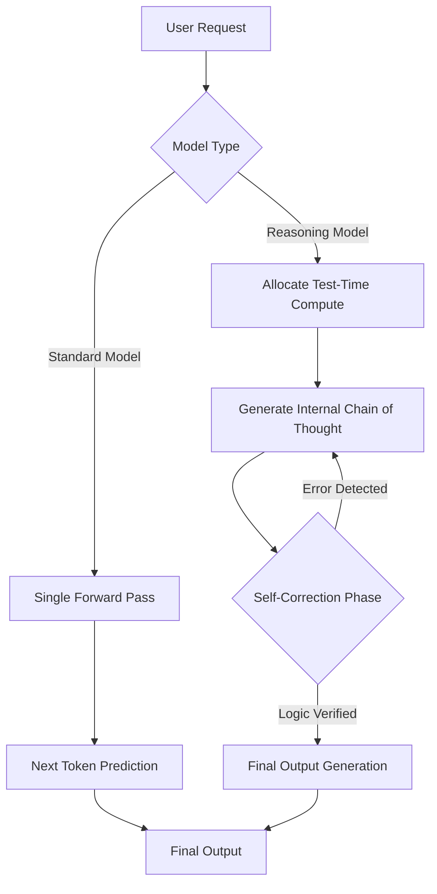
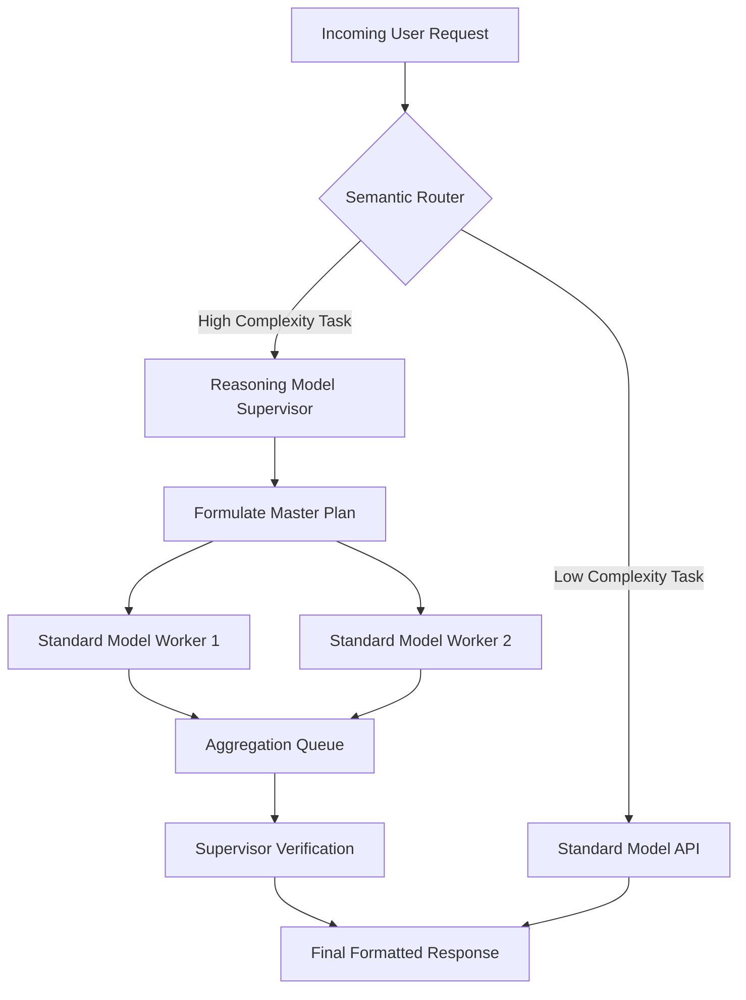

## Why This Module Matters

In late 2024, a leading quantitative trading firm attempted to automate its internal data pipeline migrations by deploying a state-of-the-art standard large language model. The engineering team built a system that read legacy database schemas and generated migration scripts in real-time. Because standard models operate on a "System 1" paradigm—predicting the next token based on surface-level statistical patterns without internal deliberation—the model hallucinated a subtle but catastrophic table join condition. When the script executed autonomously in production, it created a cascading row-level lock on the primary transaction database. This halted all high-frequency trades for twenty-two minutes, resulting in an estimated fourteen million dollar loss. The engineering team realized too late that complex, multi-step logical constraints cannot be reliably solved by fast-response pattern matching.

This incident underscored a critical limitation in the generative AI landscape: standard models lack the capacity to "think" before they speak. The advent of reasoning models, designed around "System 2" cognitive principles, fundamentally alters this dynamic. By utilizing test-time compute—spending additional processing time and generating hidden tokens to explore, evaluate, and backtrack through a chain of thought before returning a final answer—these models can solve complex mathematics, advanced coding problems, and intricate logic puzzles that consistently defeat standard models. However, this capability introduces entirely new engineering challenges around cost management, latency expectations, and API integration.

Understanding when and how to deploy reasoning models is no longer an optional architectural skill; it is a mandatory competency for AI engineers building autonomous systems. Designing a pipeline that routes simple extraction tasks to fast, cheap models while reserving expensive, high-latency reasoning models for complex planning is the difference between a highly profitable application and a financially ruinous architecture. This module explores the mechanics, integration patterns, and optimization strategies necessary to leverage modern reasoning models effectively.

## Learning Outcomes

By the end of this module, you will be able to:
- **Design** routing architectures that dynamically select between standard and reasoning models based on query complexity and strict latency budgets.
- **Implement** API integrations that correctly configure test-time compute parameters to optimize the tradeoff between reasoning depth and execution cost.
- **Evaluate** the total cost of ownership for reasoning pipelines by analyzing hidden chain-of-thought token consumption in production logs.
- **Diagnose** pipeline bottlenecks caused by reasoning model latency spikes and implement appropriate asynchronous fallback mechanisms.

## Section 1: The Shift from System 1 to System 2 Thinking

In human psychology, Daniel Kahneman popularized the framework of System 1 and System 2 thinking. System 1 is fast, instinctive, and emotional (e.g., instantly recognizing a face). System 2 is slower, more deliberative, and more logical (e.g., solving a complex calculus problem). Historically, large language models have functioned exclusively as System 1 entities. A standard model like GPT-4 or Claude 3.5 Sonnet performs a single forward pass through its neural network to generate the next token. If it makes a logical misstep early in its response, it cannot backtrack. Instead, it suffers from the "snowball effect," where subsequent tokens compound the initial error as the model attempts to remain consistent with its flawed context.

Reasoning models, such as OpenAI's o1 and o3 series or DeepSeek's R1, introduce System 2 mechanics to artificial intelligence. These models are heavily trained using large-scale reinforcement learning (RL) techniques specifically designed to reward accurate multi-step reasoning. During inference, they generate a hidden, internal chain of thought before producing user-facing output. This internal scratchpad allows the model to test hypotheses, recognize dead ends, backtrack, and try alternative logical approaches.

This fundamental difference changes the physical execution profile of the model. Standard models are bound by predictable input-to-output compute ratios. Reasoning models decouple their intelligence from their output length, scaling their cognitive capabilities dynamically based on the amount of compute they are permitted to consume during inference.



## Section 2: The Mechanics of Test-Time Compute

The core innovation driving reasoning models is the concept of test-time compute scaling. Unlike standard models, where the processing power used is strictly proportional to the length of the final text, reasoning models scale their intelligence by consuming more compute during inference (test-time). This is analogous to giving a human engineer an hour to review a pull request versus five minutes; more time generally yields a deeper, more accurate analysis.

To expose this capability to developers, API providers have introduced new configuration parameters. In standard models, engineers tweak `temperature` or `top_p` to control output randomness. In reasoning models, these parameters are often locked to preserve the integrity of the underlying reinforcement learning policy. Instead, developers configure parameters like `reasoning_effort` to explicitly budget how much internal compute the model is allowed to expend.

A higher reasoning effort instructs the model that it is permitted to generate thousands of hidden tokens to explore massive decision trees. This dramatically increases both the latency and the financial cost of the API call, but significantly improves performance on complex tasks.

```python
import os
import time
from openai import OpenAI

# Initialize the client (ensure OPENAI_API_KEY is set in your environment)
client = OpenAI(api_key=os.environ.get("OPENAI_API_KEY"))

def execute_reasoning_task(prompt: str, effort_level: str = "medium") -> dict:
    """
    Executes a complex task using a reasoning model, demonstrating how to
    configure test-time compute and capture the resulting token economics.
    
    effort_level must be one of: 'low', 'medium', 'high'.
    """
    print(f"Initiating request with reasoning effort: {effort_level}")
    start_time = time.time()
    
    try:
        response = client.chat.completions.create(
            model="o3-mini",
            messages=[
                {"role": "user", "content": prompt}
            ],
            # This parameter dictates the test-time compute budget
            reasoning_effort=effort_level 
        )
        
        execution_time = time.time() - start_time
        usage = response.usage
        
        # Extract token metrics, including hidden reasoning tokens
        total_tokens = usage.total_tokens
        completion_tokens = usage.completion_tokens
        reasoning_tokens = getattr(usage.completion_tokens_details, 'reasoning_tokens', 0)
        visible_tokens = completion_tokens - reasoning_tokens
        
        return {
            "output": response.choices[0].message.content,
            "latency_seconds": round(execution_time, 2),
            "total_tokens": total_tokens,
            "visible_tokens": visible_tokens,
            "hidden_reasoning_tokens": reasoning_tokens
        }
        
    except Exception as e:
        print(f"API Error: {e}")
        return {}

# Example usage (commented out for safety in production pipelines)
# result = execute_reasoning_task("Prove that there are infinitely many prime numbers, step by step.", "high")
# print(f"Latency: {result['latency_seconds']}s | Hidden Tokens: {result['hidden_reasoning_tokens']}")
```

> **Pause and predict**: Suppose you are building a real-time customer support chatbot that needs to resolve complex billing discrepancies by querying a massive SQL database. Based on the concept of test-time compute, predict what would happen to the user experience if you route all incoming user messages through a reasoning model set to 'high' effort, and propose an architectural modification to mitigate this issue.

## Section 3: Architectural Patterns for Reasoning Models

Deploying reasoning models in production requires specific architectural patterns to mitigate their high latency and massive token costs. Attempting to use a reasoning model as a drop-in replacement for a standard model will almost certainly lead to budget overruns and user interface timeouts. The industry has converged on two primary patterns for handling System 2 workloads.

### 1. The Semantic Router (Cascade Pattern)
In this architecture, every incoming request first hits a fast, cheap standard model configured as a classifier. This router evaluates the complexity of the prompt. If the request is a simple data extraction, summarization, or greeting, the standard model handles it entirely, returning a response in milliseconds. If the router identifies a complex logic puzzle, a multi-file code generation request, or an ambiguous analytical task, it forwards the prompt to the reasoning model. This ensures that expensive test-time compute is reserved only for tasks that actually require it.

### 2. The Supervisor-Worker Pattern
For sprawling, multi-step agentic workflows, a reasoning model acts as the "Supervisor." The user submits a massive goal (e.g., "Audit this entire repository for security vulnerabilities"). The reasoning model uses its test-time compute to formulate a comprehensive execution plan and break the goal down into smaller sub-tasks. It then delegates these sub-tasks to multiple instances of fast, standard "Worker" models running in parallel. The workers return their results to the Supervisor, which uses another burst of reasoning to verify the work, aggregate the findings, and generate the final report.



## Section 4: Prompting Paradigm Shift - Goal Orientation

Prompt engineering for reasoning models requires unlearning many of the best practices established over years of working with standard models. Standard models benefit significantly from techniques like "Chain of Thought" prompting (explicitly telling the model to "think step by step"), providing dense few-shot examples, and writing highly prescriptive formatting instructions that guide the model's cognitive process.

Reasoning models, conversely, natively generate their own chain of thought. Forcing them to follow a human-prescribed sequence of steps can actually degrade their performance. By dictating the algorithm, you artificially constrain the model's internal, highly optimized search space, preventing it from discovering more efficient logical pathways during its test-time compute phase. 

Prompting reasoning models is fundamentally about setting clear, unambiguous goals, defining strict constraints, and providing comprehensive edge-case context. It is goal-oriented rather than process-oriented.

### Prompting Anti-patterns vs Best Practices

| Anti-Pattern | Why it Fails with Reasoning Models | Best Practice |
|--------------|------------------------------------|---------------|
| Appending "Think step by step" | Redundant. The model natively generates a hidden chain of thought. Adding this consumes input tokens and may confuse the internal reinforcement learning policy. | State the end goal clearly without prescribing the cognitive process. |
| Providing dense few-shot examples | The model relies on internal logical deduction rather than pattern matching. Few-shot examples can over-constrain the solution space. | Provide zero-shot prompts with comprehensive edge-case constraints and strict rule definitions. |
| Formatting micromanagement (e.g., "Use bullet points for step 2") | The model allocates compute to solving the core problem. Excessive formatting rules distract the reasoning process and increase failure rates on the main logic. | Request specific output formats (like JSON or Markdown) only at the very end of the prompt as a final constraint. |
| Providing a mandated solution path | Forcing the model down a specific algorithmic path prevents it from exploring alternative, potentially optimal branches during test-time compute. | Define the parameters of success and the input variables, allowing the model to derive the optimal path independently. |

## Section 5: Cost, Latency, and Troubleshooting

The most significant engineering challenge when adopting reasoning models is managing variable costs and unpredictable latency. When querying a standard model, latency is generally a function of the input length and the generated output length. You receive the first token within milliseconds, allowing you to stream the response to the user immediately.

With reasoning models, the "time to first token" is massive. The model might spend thirty seconds generating thousands of hidden tokens before it outputs the first visible character. Since API providers charge for these hidden reasoning tokens at the same rate as visible output tokens, a single query can easily cost dollars rather than fractions of a cent.

To debug a poorly performing reasoning pipeline, engineers must rely on token metadata rather than just reading the output text. Analyzing the ratio of reasoning tokens to output tokens is the primary diagnostic method. If a model uses an astronomical number of reasoning tokens to produce a simple output, it indicates that the prompt is too ambiguous, forcing the model to evaluate an unnecessarily large hypothesis space before committing to an answer.

```python
def analyze_reasoning_efficiency(response_metadata: dict) -> float:
    """
    Calculates the reasoning efficiency ratio from API response metadata.
    A very high ratio indicates the model struggled to find a path
    to the solution, suggesting the prompt lacks critical constraints.
    """
    completion_tokens = response_metadata.get('completion_tokens', 0)
    details = response_metadata.get('completion_tokens_details', {})
    reasoning_tokens = details.get('reasoning_tokens', 0)
    
    # Calculate visible output tokens by subtracting the hidden thoughts
    visible_tokens = completion_tokens - reasoning_tokens
    
    if visible_tokens == 0:
        print("Error: Model returned no visible output.")
        return float('inf')
        
    ratio = reasoning_tokens / visible_tokens
    print(f"Reasoning Tokens: {reasoning_tokens}")
    print(f"Visible Output Tokens: {visible_tokens}")
    print(f"Reasoning to Output Ratio: {ratio:.2f}:1")
    
    if ratio > 50.0:
        print("DIAGNOSTIC WARNING: Highly inefficient reasoning detected.")
        print("Action Required: Review prompt constraints. The model is ")
        print("expending massive compute searching for a logical pathway.")
        print("Ensure the end-goal is strictly defined.")
        
    return ratio
```

> **Stop and think**: You are designing an automated code review system. A pull request contains a five-line change to a CSS file and a massive, six-hundred-line change to a core multi-threaded Rust scheduling module. If your system passes the entire pull request uniformly to a reasoning model, what specific token-billing inefficiencies will occur, and how would you design the system to prevent this?

## Did You Know?

- In late 2024, OpenAI released the o1 model series, which demonstrated that scaling inference compute could yield performance gains comparable to scaling pre-training compute, fundamentally shifting how hardware demands are forecasted in data centers.
- The DeepSeek R1 model utilized a dual-phase training approach involving cold-start supervised fine-tuning followed by large-scale reinforcement learning, achieving state-of-the-art reasoning on complex math benchmarks in early 2025.
- Hidden reasoning tokens can account for up to 95% of the total completion tokens generated in highly complex algorithmic queries, drastically altering the unit economics of AI API consumption for enterprise applications.
- During internal beta testing, some early reasoning models generated internal chains of thought exceeding 30,000 tokens before producing a single word of user-facing output, resulting in absolute latencies exceeding two full minutes per query.

## Common Mistakes

| Mistake | Why it Happens | How to Fix |
|---------|----------------|------------|
| Using few-shot prompting | Developers carry over habits from standard models, attempting to guide the model via pattern matching. | Use zero-shot prompts with exhaustive goal definitions and strict failure constraints. |
| Setting low timeouts on API calls | Standard APIs return in milliseconds; developers expect the same, leading to connection drops. | Implement asynchronous request handling and drastically extend network timeout configurations. |
| Ignoring hidden token costs | Developers only measure the visible output length, missing the massive internal compute being billed. | Monitor API usage metadata specifically for `reasoning_tokens` and set strict budget alerts. |
| Applying temperature settings | Attempting to force creativity breaks the highly tuned internal logic policy of the model. | Remove temperature parameters entirely; use the `reasoning_effort` toggle to control depth. |
| Using reasoning models for summarization | Summarization requires pattern extraction, not multi-step logical deduction, wasting expensive compute. | Route all summarization and basic extraction tasks strictly to standard, high-speed models. |
| Prescribing step-by-step algorithms | Developers micromanage the logic flow, restricting the model's native ability to find optimal paths. | Define the final state constraints and allow the model to autonomously determine the best algorithm. |
| Failing to stream responses to the UI | Standard models provide instant feedback; reasoning models cause long periods of dead silence. | Implement placeholder UI updates, skeleton loaders, or intermediate status checks during the reasoning phase. |

## Quiz

<details>
<summary>Question 1: You deploy a customer service bot backed exclusively by a reasoning model. Users immediately complain that it takes up to forty seconds to answer basic questions like "What are your business hours?". What architectural flaw causes this, and how should it be fixed?</summary>
<br>
The architectural flaw is the lack of a semantic router. Reasoning models inherently possess a massive "time-to-first-token" latency because they generate internal chains of thought regardless of the query's simplicity. Passing trivial FAQ questions to a reasoning model forces the system to perform unnecessary computation. To fix this, implement a cascade architecture where a fast, standard model classifies the intent first. If it is a simple question, the standard model answers immediately; only complex queries are routed to the reasoning model.
</details>

<details>
<summary>Question 2: Your automated code generation pipeline sends the following prompt to an o3 model: "Write a Python script to parse this CSV. First, import pandas. Second, read the file. Third, drop nulls. Fourth, print." The output is sub-optimal and takes longer than expected to generate. Why did this prompt fail?</summary>
<br>
This prompt relies on the anti-pattern of micromanagement. Reasoning models perform best when they are given a final goal and allowed to utilize their internal test-time compute to discover the optimal logical pathway. By artificially forcing the model to follow a rigid, human-prescribed sequence of steps, you constrained its internal search space, which conflicts with its reinforcement learning training. You should rewrite the prompt to define the desired end-state and input constraints, rather than the step-by-step algorithm.
</details>

<details>
<summary>Question 3: An enterprise analytics dashboard shows that your API costs skyrocketed by 800% overnight after switching a backend classification pipeline from a standard LLM to a reasoning model. However, the user-facing output text length remained identical. What hidden metric is driving this massive cost increase?</summary>
<br>
The cost increase is driven by hidden reasoning tokens. Unlike standard models, reasoning models scale their intelligence by generating an internal chain of thought before outputting the final answer. API providers bill for these hidden tokens at the same rate as standard completion tokens. Even if the final output is only a few words, the model may have generated tens of thousands of internal reasoning tokens to arrive at that conclusion, exponentially inflating the cost per request.
</details>

<details>
<summary>Question 4: You are building an autonomous agent that must navigate a highly dynamic web environment to scrape data. Because the layout changes constantly, you configure the reasoning model API call with a strict HTTP network timeout of ten seconds to ensure the agent feels responsive and fails fast. The agent ends up failing 90% of the time. What is the root cause?</summary>
<br>
The root cause is a fundamental misunderstanding of time-to-first-token latency in System 2 models. Reasoning models require significant time—often stretching into tens of seconds or minutes—to generate their internal chain of thought before they begin transmitting the response. A ten-second timeout forcibly terminates the API connection while the model is still executing its test-time compute. You must rearchitect the system to use asynchronous polling or vastly extend the network timeout limits.
</details>

<details>
<summary>Question 5: A data science team is attempting to force a reasoning model to generate diverse, highly creative marketing copy by setting the `temperature` parameter to 1.5 in their API integration. The API immediately returns an error. Why does this specific parameter configuration fail with reasoning models?</summary>
<br>
Reasoning models rely on a highly tuned reinforcement learning policy focused on logical deduction and accuracy, rather than probability-based creativity. Altering the temperature disrupts this internal logic policy, causing the reasoning trace to degrade into nonsense or endless loops. Consequently, API providers typically lock the temperature parameter (often hardcoded to 1.0) and require developers to manage output complexity using the `reasoning_effort` parameter instead.
</details>

<details>
<summary>Question 6: You implement the `analyze_reasoning_efficiency` script from this module on your production logs. You notice that for queries asking the model to validate specific JSON schemas, the reasoning-to-output token ratio consistently exceeds 60:1. What does this indicate about your prompt, and what should be your next step?</summary>
<br>
A massive reasoning-to-output ratio indicates that the model is struggling heavily to define the problem space and is generating massive internal decision trees to find a solution. This usually means the prompt is overly ambiguous and lacks strict constraints or necessary context. Your next step should be to radically revise the prompt to explicitly define the schema rules, provide the exact validation constraints, and clearly outline the failure conditions, thereby narrowing the search space for the model.
</details>

## Hands-On Exercise: Building a Semantic Router Simulator

In this exercise, you will build a Python simulation of a Semantic Router that dynamically routes tasks to either a fast standard model or a high-latency reasoning model. You will calculate the simulated token costs to prove the financial viability of the cascade pattern.

### Task 1: Define the Router Logic
Write a function `classify_task(prompt: str) -> str` that inspects the input string. If the prompt contains words like "calculate", "prove", "architect", or "analyze", return `"reasoning"`. Otherwise, return `"standard"`.

<details>
<summary>View Solution for Task 1</summary>

```python
def classify_task(prompt: str) -> str:
    complex_keywords = ["calculate", "prove", "architect", "analyze", "debug"]
    prompt_lower = prompt.lower()
    
    for keyword in complex_keywords:
        if keyword in prompt_lower:
            return "reasoning"
            
    return "standard"
```
</details>

### Task 2: Implement the Standard Model Mock
Write a function `mock_standard_api(prompt: str) -> dict`. It should simulate a standard model response. Calculate `input_tokens` as `len(prompt) // 4`. Generate a static output string, calculate `output_tokens`, and return a dictionary with latency (e.g., 0.5s) and zero hidden tokens.

<details>
<summary>View Solution for Task 2</summary>

```python
def mock_standard_api(prompt: str) -> dict:
    input_tokens = len(prompt) // 4
    output_text = "Here is the direct answer based on standard pattern matching."
    output_tokens = len(output_text) // 4
    
    return {
        "model_used": "standard-fast",
        "latency_s": 0.5,
        "input_tokens": input_tokens,
        "output_tokens": output_tokens,
        "hidden_tokens": 0,
        "total_cost": (input_tokens * 0.0001) + (output_tokens * 0.0002)
    }
```
</details>

### Task 3: Implement the Reasoning Model Mock
Write a function `mock_reasoning_api(prompt: str, effort: str = "medium") -> dict`. Simulate test-time compute by generating a massive number of hidden tokens based on the effort level (low=1000, medium=5000, high=15000). Adjust the latency accordingly, and calculate the total cost where hidden tokens cost the same as output tokens.

<details>
<summary>View Solution for Task 3</summary>

```python
def mock_reasoning_api(prompt: str, effort: str = "medium") -> dict:
    input_tokens = len(prompt) // 4
    output_text = "After deep deliberation, here is the verified logical solution."
    output_tokens = len(output_text) // 4
    
    effort_multipliers = {"low": 1000, "medium": 5000, "high": 15000}
    hidden_tokens = effort_multipliers.get(effort, 5000)
    
    latency = hidden_tokens / 1000  # Simulate 1 second per 1000 tokens
    
    # Hidden tokens are billed identically to output tokens
    total_cost = (input_tokens * 0.003) + ((output_tokens + hidden_tokens) * 0.015)
    
    return {
        "model_used": "reasoning-deep",
        "latency_s": latency,
        "input_tokens": input_tokens,
        "output_tokens": output_tokens,
        "hidden_tokens": hidden_tokens,
        "total_cost": total_cost
    }
```
</details>

### Task 4: Build the Integration Pipeline
Write a `process_request(prompt: str)` function that uses the router to classify the task, calls the appropriate mock API, and prints a diagnostic report showing the selected model, latency, and total cost.

<details>
<summary>View Solution for Task 4</summary>

```python
def process_request(prompt: str):
    task_type = classify_task(prompt)
    print(f"\nProcessing Prompt: '{prompt}'")
    print(f"Routing Decision: Route to {task_type.upper()} model.")
    
    if task_type == "reasoning":
        result = mock_reasoning_api(prompt, effort="medium")
    else:
        result = mock_standard_api(prompt)
        
    print(f"Execution Report:")
    print(f"  Model:   {result['model_used']}")
    print(f"  Latency: {result['latency_s']} seconds")
    print(f"  Hidden:  {result['hidden_tokens']} tokens")
    print(f"  Cost:    ${result['total_cost']:.4f}")
```
</details>

### Task 5: Analyze the Token Economics
Run a test suite with two prompts: "Summarize this brief email" and "Analyze the time complexity of this recursive function." Compare the cost and latency outputs to validate the architectural necessity of the router.

<details>
<summary>View Solution for Task 5</summary>

```python
# Run the test suite
prompts = [
    "Summarize this brief email regarding the team lunch.",
    "Analyze the time complexity of this recursive function and prove its bounds."
]

for p in prompts:
    process_request(p)
    
# Expected Output Analysis:
# The first prompt costs fractions of a cent and returns in 0.5s.
# The second prompt costs significantly more (e.g., $75.0+) and takes 5.0s,
# proving that routing is essential to prevent bankrupting the system on trivial tasks.
```
</details>

### Success Checklist
- [ ] Your router correctly identifies complex tasks versus simple extraction tasks.
- [ ] The standard model mock calculates cost accurately without incorporating hidden tokens.
- [ ] The reasoning model mock dynamically scales hidden tokens and latency based on the effort parameter.
- [ ] The final cost analysis accurately reflects the massive billing disparity caused by test-time compute.

## Next Module

Now that you understand the mechanics, latency profiles, and cost implications of System 2 thinking, it is time to deploy these models into autonomous workflows. In the next module, **Module 2.7: Multi-Agent Orchestration Patterns**, we will explore how to build robust supervisor frameworks where reasoning models manage fleets of standard models to execute massive, repository-scale refactoring tasks without timing out your infrastructure.