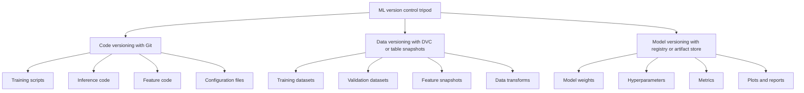
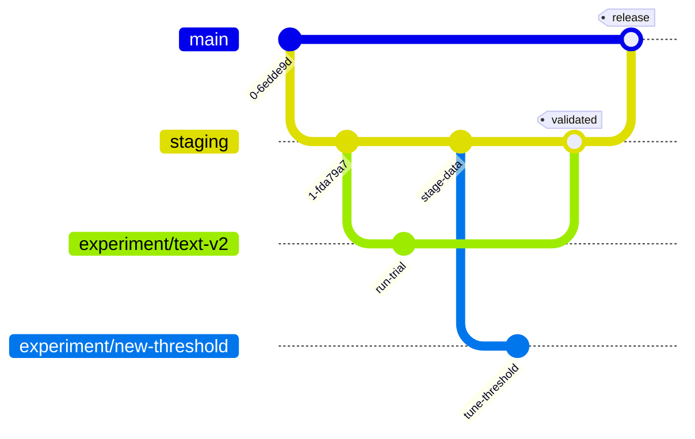
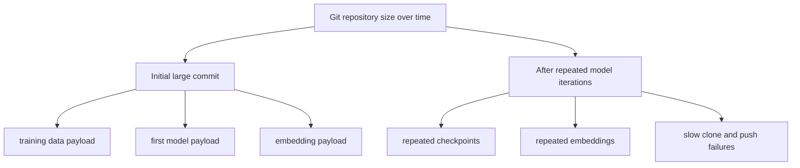
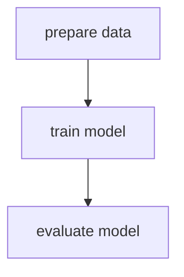
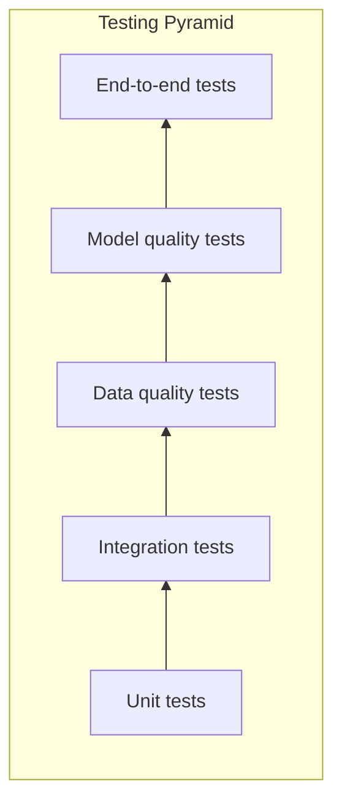
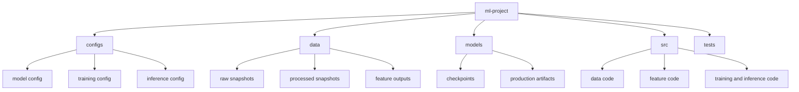
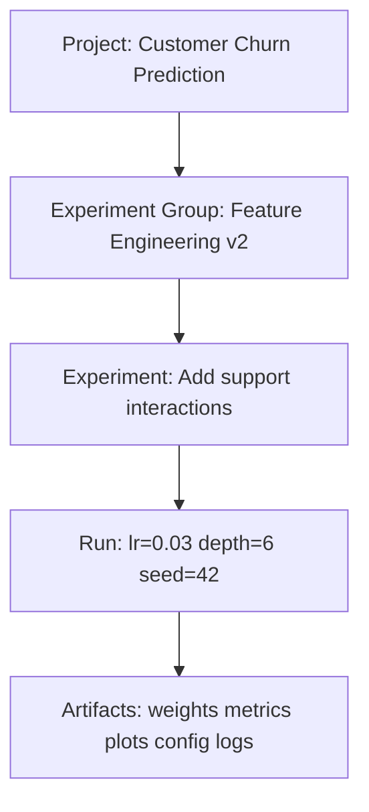
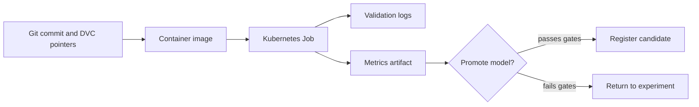

> **AI/ML Engineering Track** | Complexity: `[COMPLEX]` | Time: 5-6 Hours  
> **Prerequisites**: Phase 9 complete

## Learning Outcomes

By the end of this module, you will be able to:

- **Design** an ML DevOps control plane that versions code, data, model artifacts, configuration, and experiment evidence as one reproducible system.
- **Compare** traditional DevOps failure modes with ML-specific failure modes and select the right test layer for a given production symptom.
- **Debug** a broken ML pipeline by tracing whether the fault came from source code, data lineage, feature transformation, model quality, deployment semantics, or runtime environment.
- **Evaluate** pre-commit, DVC, experiment tracking, and Kubernetes Job controls against realistic team risks such as binary commits, data leakage, drift, and non-repeatable training.
- **Implement** a small but production-shaped ML DevOps workflow that prevents large artifacts from entering Git and runs a finite validation workload on Kubernetes.

## Why This Module Matters

The *Infrastructure as Code* module’s Knight Capital 2012 <!-- incident-xref: knight-capital-2012 --> cross-reference is the canonical warning for this module: if ML artifacts, configurations, and environments diverge across production, reproducibility collapses and incident scale explodes.

That story matters to ML engineers because machine learning systems have more moving parts than ordinary application deployments. A web service usually fails because code, configuration, dependency resolution, infrastructure, or traffic changed. An ML service can also fail because training data changed, a feature definition drifted, labels were corrected, a random seed moved, a tokenizer version changed, a model checkpoint was overwritten, or evaluation accidentally used examples that leaked from training.

A senior ML engineer therefore treats DevOps as a reproducibility discipline rather than a release ceremony. The question is not only, "Can we deploy this model?" The sharper question is, "Can we explain exactly what data, code, configuration, model artifact, and environment produced this result, and can we prove that the next deployment is not worse in ways the business cares about?"

This module builds that discipline from first principles. You will start with the failure modes, then add version control for the right artifacts, then use tests to catch ML-specific defects, then place local safeguards before Git history, and finally run finite validation work on Kubernetes with the workload primitive that matches the job.

## 1. The ML DevOps Problem Is Reproducibility

Traditional DevOps assumes the source code repository is close to the truth. If two engineers checkout the same commit, install the same dependencies, and apply the same configuration, they usually expect the same behavior. There are still surprises, but most surprises come from runtime state, missing environment variables, or infrastructure differences that the team can inspect.

ML DevOps changes the definition of "same." The same training script can produce a different model when the dataset changes, when a feature pipeline emits columns in a different order, when a dependency upgrades a numerical routine, when a GPU kernel behaves nondeterministically, or when an experimenter changes a hyperparameter in a notebook and forgets to commit the configuration. Git still matters, but Git alone no longer describes the system.

```text
TRADITIONAL SOFTWARE vs ML SOFTWARE
===================================

Traditional Software:                 ML Software:
├── Code changes                      ├── Code changes
├── Config changes                    ├── Config changes
└── Dependencies                      ├── Dependencies
                                      ├── DATA changes
                                      ├── MODEL changes
                                      ├── Hyperparameters
                                      ├── Training environment
                                      ├── Feature definitions
                                      ├── Label definitions
                                      └── Random seeds

A traditional bug often asks:
"What code path produced this output?"

An ML bug often asks:
"What combination of code, data, config, model, and environment
produced this output, and which part changed?"
```


The practical consequence is that every production model needs a chain of evidence. That chain should answer five questions without relying on memory: what code trained the model, what exact data it learned from, what configuration controlled training, what artifact was promoted, and what tests proved it was acceptable. If any one answer is missing, rollback and debugging become guesswork.

A useful mental model is to treat ML delivery as a controlled experiment that happens to ship software. Experiments need hypotheses, controlled variables, measured results, and enough records for someone else to repeat the process. Releases need review, repeatable build steps, immutable artifacts, and a way to recover when something fails. ML DevOps sits where those two disciplines overlap.

```text
ML DEVOPS CONTROL QUESTIONS
===========================

┌─────────────────────┬────────────────────────────────────────────┐
│ Question            │ Evidence you need                          │
├─────────────────────┼────────────────────────────────────────────┤
│ What changed?       │ Git commit, config diff, data pointer diff  │
│ What trained it?    │ DVC data version, feature code, seed values │
│ What was produced?  │ Model artifact hash, metrics, plots         │
│ Why promote it?     │ Quality gates, fairness checks, review      │
│ How recover?        │ Previous artifact, data version, deploy log │
└─────────────────────┴────────────────────────────────────────────┘
```

Active learning prompt: imagine production accuracy drops on Monday morning, but no application code changed during the weekend. Before reading further, write down three possible non-code causes. A strong answer should include at least one data cause, one feature-processing cause, and one model-artifact or environment cause.

A beginner often hears "MLOps" and thinks it means adding a model registry or a pipeline tool. A senior engineer asks a different question first: which decisions are currently unverifiable? Tooling is useful only when it closes a reproducibility gap, prevents a damaging class of mistakes, or shortens the time from symptom to root cause.

The rest of this module uses a progressive design. First, you will build the version-control picture. Then you will attach tests to the right failure modes. After that, you will add local gates that prevent damage before a commit exists. Finally, you will place finite validation work on Kubernetes so the execution environment resembles production instead of a personal laptop.

## 2. Version The Whole ML System, Not Just The Code

Git is still the first pillar because training scripts, serving code, tests, configuration templates, infrastructure manifests, and documentation belong in ordinary source control. Git gives teams review, branching, history, and collaboration. The mistake is expecting Git to store every artifact directly, especially large datasets, model checkpoints, embeddings, and generated arrays.

The correct pattern is a split-brain storage model with one logical history. Git stores small text files and pointers. Artifact storage stores large binary payloads. The pointer files connect the Git commit to the data or model object by hash, so a checkout can reconstruct the matching workspace. DVC is a common tool for this pattern, although the same principle also appears in lakehouse tables, feature stores, model registries, and object-storage-backed artifact systems.

```text
┌─────────────────────────────────────────────────────────────────────────┐
│                    THE ML VERSION CONTROL TRIPOD                        │
├─────────────────────────────────────────────────────────────────────────┤
│                                                                         │
│  1. CODE VERSIONING (Git)                                               │
│     ├── Training scripts      -> "How did we train this?"               │
│     ├── Inference code        -> "How do we use this?"                  │
│     ├── Data preprocessing    -> "How did we prepare the data?"         │
│     └── Configuration files   -> "What settings did we use?"            │
│                                                                         │
│  2. DATA VERSIONING (DVC, tables, feature stores)                       │
│     ├── Training datasets     -> "What did we learn from?"              │
│     ├── Validation datasets   -> "How did we evaluate?"                 │
│     ├── Feature snapshots     -> "What features existed when?"          │
│     └── Data transformations  -> "How did we process it?"               │
│                                                                         │
│  3. MODEL VERSIONING (registry or artifact store)                       │
│     ├── Model weights         -> "What are the learned parameters?"     │
│     ├── Hyperparameters       -> "What knobs did we turn?"              │
│     ├── Metrics               -> "How well did it work?"                │
│     └── Artifacts             -> "What evidence did it produce?"        │
│                                                                         │
│  Remove any pillar and reproducibility becomes partial.                  │
└─────────────────────────────────────────────────────────────────────────┘
```



Git branches also need adaptation for ML work. A traditional feature branch usually aims to merge a completed behavior into `main`. An experiment branch may exist to disprove a hypothesis, and that negative result still has value. If a team deletes every failed experiment without preserving the hypothesis and measurements, the same idea can be repeated later because nobody can prove it was already tested.

```text
ML GIT WORKFLOW
===============

main ─────────────────●────────────────────●───────────────────────>
                      │                    │
                      │                    │ release after validation
                      │                    │
staging ──────●───────┼────────●───────────┼───────────────────────>
              │       │        │           │
              │       │        │ model accepted on staging evidence
              │       │        │
experiment/   │       │        │
  text-v2 ────┴───────┘        │
                               │
experiment/                    │
  new-threshold ───────────────┘

Experiment branches are not feature branches with messier names.
They are research records that should preserve hypothesis, config, and result.
```



A good experiment commit explains the scientific claim behind the change. The commit should name the hypothesis, the controlled variable, the result, and the trade-off. A vague message like `update model` forces future engineers to reopen notebooks, compare configs, and infer intent from file diffs. A precise message turns the repository into an experiment ledger.

```text
Experiment commit checklist
===========================

- Hypothesis: What did you expect to improve, and why?
- Controlled variable: What changed compared with the baseline?
- Dataset version: Which training and validation data versions were used?
- Metrics: Which business and technical metrics changed?
- Decision: Should this be promoted, repeated, abandoned, or split?
```

A workable branch naming scheme also reduces coordination costs. Use `feature/` for product behavior, `fix/` for defects, `experiment/` for measured trials, `data/` for dataset changes, `model/` for architecture changes, and `baseline/` for simple reference models. The branch name should make the review queue understandable before anyone opens the diff.

Worked example: suppose a churn model has a baseline F1 score of `0.78`, but the support team reports that enterprise customers are under-detected. A weak workflow creates a branch called `experiment2`, changes the feature set and threshold together, and reports only overall accuracy. A stronger workflow creates `experiment/add-enterprise-support-features`, changes only the feature set, records the dataset pointer, compares enterprise-segment F1 against the baseline, and leaves the threshold untouched until a separate experiment.

Active learning prompt: your teammate wants to merge an experiment because overall accuracy improved by two percentage points, but latency doubled and one minority class regressed sharply. Decide whether this should merge to `main`, merge only to `staging`, or remain an experiment. Explain which evidence you would request before approving promotion.

DVC demonstrates the pointer-file model clearly. When you run `dvc add data/training.csv`, DVC computes a content hash, stores metadata in a small `.dvc` file, and updates `.gitignore` so the heavy local file does not enter Git. The team commits the pointer file to Git and pushes the binary payload to a remote such as S3, GCS, Azure Blob Storage, or a local shared directory for a lab.

```bash
mkdir -p /tmp/ml-devops-demo
cd /tmp/ml-devops-demo
git init --initial-branch=main
git config user.name "Lab User"
git config user.email "lab@example.com"

python -m venv .venv
. .venv/bin/activate
pip install --quiet dvc==3.48.0

dvc init
mkdir -p data
printf "id,label,score\n1,keep,0.9\n2,churn,0.2\n" > data/training.csv
dvc add data/training.csv

git add .dvc .dvcignore data/training.csv.dvc data/.gitignore
git commit -m "data: track initial churn training data with DVC"
```

```text
THE PROBLEM WITH LARGE FILES IN GIT
===================================

Git stores every committed version of every file.

A project starts with:
├── training_data.csv    500 MB
├── model_v1.pkl         200 MB
└── embeddings.npy       1 GB

After several iterations:
├── training_data.csv    500 MB
├── model_v1.pkl         200 MB
├── model_v2.pkl         200 MB
├── model_v3.pkl         200 MB
└── embeddings.npy       multiple large versions

The repository becomes slow to clone, hard to mirror, and painful to repair.
DVC keeps Git small by committing pointers while storing payloads elsewhere.
```



DVC pipelines add another important idea: stages should declare their dependencies and outputs. If `prepare` depends on `data/raw/customers.csv` and `src/prepare.py`, DVC can rerun it when either changes and skip it when neither changes. If you forget to list a dependency, DVC can skip a stage incorrectly, which is a reproducibility bug disguised as a performance optimization.

```yaml
stages:
  prepare:
    cmd: python src/prepare.py
    deps:
      - src/prepare.py
      - data/raw/customers.csv
    outs:
      - data/processed/customers.parquet

  train:
    cmd: python src/train.py --config configs/train.yaml
    deps:
      - src/train.py
      - configs/train.yaml
      - data/processed/customers.parquet
    outs:
      - models/churn.pkl
    metrics:
      - metrics/train.json:
          cache: false

  evaluate:
    cmd: python src/evaluate.py
    deps:
      - src/evaluate.py
      - models/churn.pkl
      - data/processed/customers.parquet
    metrics:
      - metrics/eval.json:
          cache: false
```

```bash
dvc repro
dvc metrics show
dvc dag
```

```text
         +---------+
         | prepare |
         +---------+
              |
              v
          +-------+
          | train |
          +-------+
              |
              v
        +----------+
        | evaluate |
        +----------+
```



A senior review of an ML repository should therefore inspect both Git diffs and artifact diffs. A pull request that changes `src/features/customer.py` but does not update metrics may be incomplete. A pull request that changes `data/training.csv.dvc` but does not explain label or distribution impact may be risky. A pull request that updates a model artifact without linking it to the training run is not reviewable.

## 3. Test The Failure Mode You Actually Fear

Traditional test pyramids start with many unit tests, fewer integration tests, and a small number of end-to-end tests. ML keeps that structure but adds two layers that ordinary services rarely need: data quality tests and model quality tests. These layers matter because a model can pass every unit test and still be unsafe to deploy if the data distribution shifted or a subgroup regressed.

```text
THE ML TESTING PYRAMID
======================

                        /\
                       /  \
                      /    \       END-TO-END TESTS
                     /      \      Full pipeline, production-like data
                    /--------\
                   /          \    MODEL QUALITY TESTS
                  /            \   Accuracy, fairness, robustness
                 /--------------\
                /                \ DATA QUALITY TESTS
               /                  \Schema, distributions, leakage, drift
              /--------------------\
             /                      \ INTEGRATION TESTS
            /                        \Components together
           /--------------------------\
          /                            \ UNIT TESTS
         /                              \Small functions, fast feedback
        /________________________________\

Lower layers are cheaper and faster.
Upper layers are closer to business risk.
```



Unit tests protect deterministic code such as tokenization, normalization, configuration parsing, feature assembly, and inference output shape. They should run quickly and fail with precise messages. Unit tests cannot prove a model is good, but they can catch transformations that silently corrupt the inputs before expensive training begins.

```python
import numpy as np


def normalize(values: np.ndarray) -> np.ndarray:
    if values.size == 0:
        return values.astype(np.float32)
    min_value = values.min()
    max_value = values.max()
    if max_value == min_value:
        return np.zeros_like(values, dtype=np.float32)
    return ((values - min_value) / (max_value - min_value)).astype(np.float32)


def test_normalize_scales_to_unit_range() -> None:
    values = np.array([10, 20, 30])
    result = normalize(values)
    assert result.min() >= 0
    assert result.max() <= 1
    assert np.isclose(result[0], 0)
    assert np.isclose(result[-1], 1)


def test_normalize_constant_input_does_not_emit_nan() -> None:
    result = normalize(np.array([5, 5, 5]))
    assert not np.any(np.isnan(result))
    assert np.all(result == 0)
```

Data quality tests protect the assumptions the model learned under. They check schema, nulls, ranges, duplicates, label balance, leakage between splits, and distribution stability. A missing label is not just a dirty row; it can change the loss function, hide sampling bias, or teach the model to ignore a class the business considers important.

```python
import pandas as pd


def test_no_missing_labels() -> None:
    training_data = pd.read_csv("data/training.csv")
    missing = training_data["label"].isna().sum()
    assert missing == 0, f"{missing} training examples have no label"


def test_no_leakage_between_train_and_test() -> None:
    train = pd.read_csv("data/train.csv")
    test = pd.read_csv("data/test.csv")
    overlap = set(train["id"]) & set(test["id"])
    assert not overlap, f"{len(overlap)} ids appear in both train and test"


def test_age_feature_is_in_plausible_range() -> None:
    training_data = pd.read_csv("data/training.csv")
    invalid = training_data[~training_data["age"].between(0, 120)]
    assert invalid.empty, f"invalid ages at rows {invalid.index.tolist()[:10]}"
```

Model quality tests protect the promoted artifact. They compare candidate performance against business thresholds, the current production model, important segments, and robustness expectations. These tests are slower than unit tests because they run inference over evaluation data, but they answer questions unit tests cannot answer: is this model still good enough, and where did it get worse?

```python
from sklearn.metrics import accuracy_score, f1_score


def test_candidate_accuracy_meets_threshold(candidate_model, evaluation_data) -> None:
    x_eval, y_eval = evaluation_data
    predictions = candidate_model.predict(x_eval)
    accuracy = accuracy_score(y_eval, predictions)
    assert accuracy >= 0.85, f"accuracy {accuracy:.3f} is below release threshold"


def test_each_class_has_usable_f1(candidate_model, evaluation_data) -> None:
    x_eval, y_eval = evaluation_data
    predictions = candidate_model.predict(x_eval)
    per_class = f1_score(y_eval, predictions, average=None)
    weak_classes = [idx for idx, score in enumerate(per_class) if score < 0.60]
    assert not weak_classes, f"weak F1 for classes {weak_classes}"


def test_candidate_does_not_regress_against_production(candidate_model, production_model, evaluation_data) -> None:
    x_eval, y_eval = evaluation_data
    candidate_accuracy = accuracy_score(y_eval, candidate_model.predict(x_eval))
    production_accuracy = accuracy_score(y_eval, production_model.predict(x_eval))
    assert candidate_accuracy >= production_accuracy - 0.01
```

Integration tests verify that components agree about contracts. A feature generator can pass its own tests while producing a column order the model server does not expect. A training script can write metrics to one path while the CI job reads another. Integration tests should run the smallest useful slice that crosses a boundary: load config, transform data, fit a tiny model, write an artifact, and evaluate it.

End-to-end tests prove the delivery path still works. They should not run for every tiny edit if they take too long, but they should run before release or on a scheduled basis. In ML, an end-to-end test may use a small fixture dataset rather than the full training corpus, because the purpose is to verify orchestration rather than achieve production metrics.

Active learning prompt: a production recommender starts returning stale-looking results after a data ingestion migration. Unit tests pass, model quality from the last release looked acceptable, and the serving API has no errors. Which test layer should you inspect first, and what contract would you verify? A strong answer points to data quality or integration tests around feature freshness, schema, and ingestion-to-feature-store handoff.

Choosing the right test is an engineering judgment. If a tokenizer drops important text, a unit test should catch it. If a train/test split leaks customers into both sets, a data quality test should catch it. If the candidate model underperforms a high-value segment, a model quality test should catch it. If the pipeline cannot move from raw data to registered artifact, an end-to-end test should catch it.

The order matters because compute is not free. Run cheap deterministic checks first. Do not spend GPU hours training a model when the config file is invalid, the dataset has duplicate IDs, or the feature code fails on empty input. A good CI pipeline is staged so each gate earns the right to spend the next unit of time and money.

## 4. Put Guardrails Before Git History

Pre-commit hooks are valuable because they fail before the mistake becomes repository history. In ordinary Python projects they enforce formatting, linting, YAML validity, and merge-conflict checks. In ML projects they also block large binary artifacts, notebook output, credentials in config files, and stale DVC pointers.

The key design principle is to block irreversible or expensive mistakes locally. A formatting issue is easy to repair after CI fails. Accidentally committing a huge checkpoint is much more painful because Git records object history, and removing it cleanly can require coordinated history rewriting. Secret leakage is worse because the credential must be revoked even if the commit is later removed.

```yaml
repos:
  - repo: https://github.com/pre-commit/pre-commit-hooks
    rev: v4.5.0
    hooks:
      - id: trailing-whitespace
      - id: end-of-file-fixer
      - id: check-yaml
      - id: check-json
      - id: check-added-large-files
        args: ["--maxkb=1000"]
      - id: detect-private-key
      - id: check-merge-conflict

  - repo: https://github.com/kynan/nbstripout
    rev: 0.7.1
    hooks:
      - id: nbstripout

  - repo: local
    hooks:
      - id: no-large-model-files
        name: Check no model files are committed directly
        entry: python scripts/hooks/check_no_models.py
        language: python
        types: [file]

      - id: no-secrets-in-config
        name: Check config files for secret-looking values
        entry: python scripts/hooks/check_no_secrets.py
        language: python
        files: \.(yaml|yml|json|ini|env)$

      - id: dvc-status
        name: Check DVC workspace status
        entry: dvc status
        language: system
        pass_filenames: false
        always_run: true
```

A custom hook should be boring, narrow, and explicit. It should fail with a message that tells the developer what happened and how to fix it. Hooks that are too clever create false positives and get bypassed. Hooks that are too vague create frustration because the developer cannot tell whether the tool found a real risk.

```python
import sys
from pathlib import Path

MODEL_EXTENSIONS = {
    ".pkl",
    ".pickle",
    ".pt",
    ".pth",
    ".h5",
    ".hdf5",
    ".onnx",
    ".bin",
    ".safetensors",
    ".ckpt",
}

SIZE_THRESHOLD_BYTES = 10 * 1024 * 1024


def check_file(filepath: str) -> str | None:
    path = Path(filepath)
    if not path.exists() or not path.is_file():
        return None
    if path.suffix.lower() not in MODEL_EXTENSIONS:
        return None
    if path.stat().st_size <= SIZE_THRESHOLD_BYTES:
        return None
    size_mb = path.stat().st_size / 1024 / 1024
    return (
        f"{filepath} is {size_mb:.1f} MB and looks like a model artifact. "
        f"Track it with DVC instead: dvc add {filepath}"
    )


def main() -> int:
    issues = [issue for item in sys.argv[1:] if (issue := check_file(item))]
    if issues:
        print("Large model artifacts must not be committed directly.")
        for issue in issues:
            print(f"- {issue}")
        return 1
    return 0


if __name__ == "__main__":
    raise SystemExit(main())
```

Secret scanning is equally important because ML projects often touch third-party APIs, cloud object storage, model-hosting services, observability platforms, and data warehouses. Configuration files are the common leak path. A hook cannot replace a real secret manager, but it can catch obvious mistakes before they leave the workstation.

```python
import re
import sys
from pathlib import Path

SECRET_PATTERNS = [
    (re.compile(r"api[_-]?key\s*[:=]\s*[\"']?[A-Za-z0-9]{20,}", re.I), "API key"),
    (re.compile(r"password\s*[:=]\s*[\"']?[^\s\"']+", re.I), "password"),
    (re.compile(r"secret\s*[:=]\s*[\"']?[A-Za-z0-9]{20,}", re.I), "secret"),
    (re.compile(r"AKIA[A-Z0-9]{16}"), "AWS access key"),
    (re.compile(r"ghp_[A-Za-z0-9]{30,}"), "GitHub token"),
]


def check_file(filepath: str) -> list[str]:
    path = Path(filepath)
    issues: list[str] = []
    if not path.exists() or not path.is_file():
        return issues

    for line_number, line in enumerate(path.read_text(errors="ignore").splitlines(), 1):
        if line.strip().startswith("#"):
            continue
        for pattern, label in SECRET_PATTERNS:
            if pattern.search(line):
                issues.append(f"{filepath}:{line_number}: potential {label}")
    return issues


def main() -> int:
    issues: list[str] = []
    for filepath in sys.argv[1:]:
        issues.extend(check_file(filepath))
    if issues:
        print("Potential secrets detected. Use environment variables or a secret manager.")
        for issue in issues:
            print(f"- {issue}")
        return 1
    return 0


if __name__ == "__main__":
    raise SystemExit(main())
```

Pre-commit is not a substitute for CI. Local hooks can be skipped, run on different operating systems, or use stale environments. CI must run the same critical checks in a clean environment, especially tests and DVC validation. The local hook is the fast seatbelt; CI is the independent gate before the team trusts the change.

A senior engineer also watches for guardrail drift. If a hook produces too many false positives, developers will learn to bypass it. If a hook is slow, it may be disabled locally and rediscovered only in CI. Keep pre-commit checks fast, deterministic, and focused on mistakes that are either common or expensive.

## 5. Structure Projects So Evidence Has A Home

A project layout teaches behavior. If data, models, notebooks, source, tests, configs, and scripts are mixed together, engineers improvise storage decisions. If the repository has clear paths for raw data pointers, processed outputs, training code, evaluation reports, and deployment manifests, review becomes faster because every artifact has an expected location.

```text
ml-project/
├── .github/
│   └── workflows/
│       ├── ci.yml
│       ├── train.yml
│       └── deploy.yml
├── configs/
│   ├── model/
│   │   ├── base.yaml
│   │   └── large.yaml
│   ├── training/
│   │   ├── default.yaml
│   │   └── fine_tune.yaml
│   └── inference/
│       └── production.yaml
├── data/
│   ├── raw/
│   ├── processed/
│   ├── features/
│   └── .gitignore
├── models/
│   ├── checkpoints/
│   ├── production/
│   └── .gitignore
├── notebooks/
│   ├── exploration/
│   ├── experiments/
│   └── reports/
├── src/
│   ├── data/
│   ├── features/
│   ├── models/
│   └── utils/
├── tests/
│   ├── unit/
│   ├── integration/
│   └── data/
├── scripts/
│   ├── train.py
│   ├── evaluate.py
│   └── predict.py
├── .pre-commit-config.yaml
├── dvc.yaml
├── dvc.lock
├── pyproject.toml
└── README.md
```



Configuration deserves special care because hardcoded training parameters are hidden variables. A training script that embeds `learning_rate = 0.001` inside code makes every experiment look like a source-code change. A versioned YAML file makes the controlled variable reviewable. It also lets pipeline tools compare runs and lets reviewers see whether an experiment changed architecture, optimizer, batch size, threshold, or several variables at once.

```yaml
seed: 42

data:
  train_path: data/processed/train.parquet
  validation_path: data/processed/validation.parquet
  target_column: churned

model:
  type: gradient_boosted_trees
  max_depth: 6
  learning_rate: 0.03

training:
  batch_size: 512
  epochs: 20
  early_stopping_rounds: 5

evaluation:
  minimum_accuracy: 0.85
  minimum_enterprise_f1: 0.70
```

A Makefile or task runner is useful because it records common commands as team contracts. The exact tool is less important than consistency. Developers should not have to remember whether evaluation writes `metrics/eval.json` or `reports/eval.json`, and CI should not call a different entry point from local development unless there is a clear reason.

```makefile
.PHONY: install test test-unit test-data lint train evaluate check

install:
	pip install -r requirements.txt
	pip install -r requirements-dev.txt
	pre-commit install

test:
	pytest tests/ -v

test-unit:
	pytest tests/unit/ -v

test-data:
	pytest tests/data/ -v --tb=short

lint:
	ruff check src tests scripts
	ruff format src tests scripts

train:
	dvc repro

evaluate:
	python scripts/evaluate.py --config configs/training/default.yaml

check: lint test-unit test-data
```

The project layout should also separate exploratory notebooks from production code. Notebooks are excellent for investigation, visualization, and stakeholder reports. They are poor as the only source of truth for training logic because execution order can be hidden, outputs can contain sensitive data, and state can linger across cells. Production training, preprocessing, and evaluation logic should live in importable modules with tests.

Experiment tracking gives teams a vocabulary for organizing evidence. Projects should map to business problems, experiment groups should map to hypotheses, experiments should map to meaningful changes, and runs should capture parameter combinations. This hierarchy prevents dashboards from becoming a flat pile of timestamped attempts.

```text
EXPERIMENT TRACKING HIERARCHY
=============================

Project
│   Customer Churn Prediction
│
└── Experiment Group
    │   Feature Engineering v2
    │
    └── Experiment
        │   Add enterprise support interactions
        │
        └── Run
            │   lr=0.03, depth=6, seed=42
            │
            └── Artifacts
                Model weights, metrics, plots, config, logs
```



The naming rule is simple: name things after the decision they help someone make. `April run` is weak because it tells you when work happened, not what changed. `Add support interaction features` is stronger because it tells a reviewer what hypothesis to evaluate. Time is still recorded automatically by tracking tools; the human name should carry intent.

A mature repository also records operational assumptions. Which data source owns truth? Which metric is the promotion gate? Which subgroup cannot regress? Which model version is currently serving? Which artifact can be rolled back? These answers should not live only in Slack threads, notebook comments, or one engineer's memory.

## 6. Run ML Workloads With The Right Kubernetes Primitive

Kubernetes is useful for ML DevOps when the team needs reproducible execution near production conditions. Local tests are fast, but they do not prove that container images, service accounts, resource requests, object storage access, node selectors, or cluster policies are correct. Running validation or training in Kubernetes exposes those integration points before production traffic depends on them.

A common mistake is using a `Deployment` for a training script. A Deployment is built for long-running services that should keep running. If the process exits, the controller tries to maintain the desired state by creating replacement Pods. Training, batch evaluation, data validation, and migration-style ML tasks are finite. They should start, run to completion, report success or failure, and stop.

A Kubernetes `Job` matches that run-to-completion model. It records completion, retries according to policy, and lets the team inspect logs after the work finishes. For ML validation, this is exactly the behavior you want. The workload is not a web server; it is a controlled execution of a pipeline step.

```yaml
apiVersion: batch/v1
kind: Job
metadata:
  name: ml-validation-job
  namespace: default
spec:
  backoffLimit: 0
  template:
    spec:
      restartPolicy: Never
      containers:
        - name: validate
          image: python:3.12-slim
          command:
            - python
            - -c
            - |
              print("Running deterministic ML validation checks")
              print("Validation completed successfully")
          resources:
            requests:
              cpu: "250m"
              memory: "256Mi"
            limits:
              cpu: "500m"
              memory: "512Mi"
```

After you have explained `kubectl`, it is common in Kubernetes courses to use `k` as a shell alias for speed. The alias is only a typing shortcut: `alias k=kubectl`. In scripts and documentation that may be copied into automation, prefer the full `kubectl` command unless the alias has been established in the exercise.

```bash
kubectl apply -f ml-validation-job.yaml
kubectl wait --for=condition=complete job/ml-validation-job --timeout=60s
kubectl logs job/ml-validation-job
kubectl delete job/ml-validation-job
```



Kubernetes does not magically make a pipeline reproducible. The container image must be immutable enough to identify its dependencies, the Job must mount or fetch the intended data version, and the command must record the model artifact and metrics. A Job that downloads "latest data" and writes "model.pkl" without a version is only a distributed way to create uncertainty.

For senior teams, Kubernetes Jobs often become the execution substrate beneath higher-level orchestrators. Argo Workflows, Kubeflow Pipelines, Tekton, Airflow on Kubernetes, and managed ML platforms may create Pods and Jobs indirectly. The underlying principle remains the same: finite ML steps should have finite workload semantics, declared inputs, declared outputs, and inspectable results.

The debugging workflow changes once the pipeline runs in Kubernetes. If a Job fails before the container starts, inspect image pull errors, service accounts, secrets, node scheduling, and resource limits. If the container starts but validation fails, inspect logs, mounted configuration, data access, and metrics. If validation passes locally but fails in cluster, compare image dependency versions, environment variables, file paths, and object storage credentials.

A release gate should combine evidence from all earlier sections. The Git commit identifies code. DVC or equivalent pointers identify data. The config identifies hyperparameters. Tests identify quality. The Kubernetes Job identifies production-like execution. Promotion should happen only when these records agree, because that agreement is what makes rollback and incident response credible.

## Did You Know?

1. In many production ML systems, the model-training code is a small fraction of the total system; data pipelines, validation, deployment, monitoring, and recovery machinery often dominate the engineering effort.

2. A model can become worse without any code deployment if the real-world data distribution moves away from the distribution used during training.

3. Reproducing an ML result usually requires the data version, random seeds, dependency versions, preprocessing logic, model configuration, and evaluation method, not just the final model file.

4. Kubernetes Jobs are designed for run-to-completion workloads, which makes them a better fit for training and validation tasks than Deployments that try to keep Pods running.

## Common Mistakes

| Mistake | Why It Is Dangerous | How To Fix It |
|---|---|---|
| Committing model binaries directly to Git | Large artifacts bloat repository history, slow down cloning, and can require disruptive history repair if they spread to shared branches. | Track large datasets and model artifacts with DVC or an artifact store, commit only pointer files, and block direct binary commits with pre-commit hooks. |
| Treating Git commit hash as the whole experiment identity | The same code can produce different models when data, configuration, seeds, dependencies, or hardware behavior changes. | Record Git commit, data pointer, config file, seed values, dependency lockfile, metrics, and artifact hash for every candidate model. |
| Changing several experiment variables at once | If architecture, features, scheduler, and threshold all change together, reviewers cannot tell which change caused improvement or regression. | Isolate one major variable per experiment branch unless the purpose is explicitly to test an integrated bundle. |
| Running only software-style unit tests | Unit tests can pass while labels are missing, splits leak data, feature distributions drift, or one important segment regresses badly. | Add data quality tests, model quality tests, and segment-level regression checks to the pipeline. |
| Using a Deployment for finite training work | Deployments are meant to keep services running and may restart a completed training container as though it failed to stay alive. | Use a Kubernetes Job for training, validation, batch evaluation, and other finite pipeline steps. |
| Leaving hyperparameters hardcoded in scripts | Hidden constants make experiment review difficult and force meaningless code diffs for every training adjustment. | Move hyperparameters into versioned configuration files and include those files in pipeline dependencies. |
| Trusting notebooks as the only source of truth | Notebook execution order, hidden state, bulky outputs, and local files make results hard to reproduce and review. | Promote stable logic into importable modules, test it, and strip notebook outputs before commit. |
| Skipping negative experiment records | Teams repeat failed ideas when past hypotheses, configurations, and metrics disappear after branches are deleted. | Preserve failed experiments with clear commit messages, tracking records, or documented experiment summaries. |

## Quiz

<details>
<summary>1. Your team deploys a candidate churn model with the same application code as the previous release. Two days later, enterprise customer recall drops sharply while overall accuracy looks almost unchanged. What do you inspect first, and why?</summary>

Start with model quality evidence split by segment, then inspect data quality and feature distribution for enterprise customers. Overall accuracy can hide subgroup regressions, so the right debugging path is to compare segment-level F1 or recall against the previous model, verify whether enterprise examples are represented in validation data, and check whether feature generation changed for that population. Unit tests alone are unlikely to explain a business-segment regression.

</details>

<details>
<summary>2. A pull request updates `data/training.csv.dvc`, `configs/train.yaml`, and `models/churn.pkl.dvc`, but the description says only "better model." As reviewer, what evidence do you require before approving?</summary>

Require the hypothesis, dataset change summary, configuration diff, training run identity, metrics against baseline, segment-level checks, and artifact hash or registry link. The PR changed data, configuration, and model artifact together, so the reviewer must know which variable caused the improvement and whether any subgroup or operational metric regressed. Without that evidence, the change is not reproducible or reviewable.

</details>

<details>
<summary>3. CI reports that `dvc repro` skipped the `prepare` stage even though a raw customer CSV changed locally. The model then trained on stale processed data. What is the likely pipeline defect?</summary>

The raw CSV was probably missing from the `deps` list for the `prepare` stage in `dvc.yaml`, or the changed file was outside the path DVC tracks. DVC decides whether to rerun a stage by hashing declared dependencies. If the true input is not declared, DVC can reuse cached outputs even when the real-world input changed.

</details>

<details>
<summary>4. An engineer proposes a pre-commit hook that runs the full training pipeline before every commit. Evaluate the proposal and recommend a better guardrail design.</summary>

Running full training before every commit is too slow and will likely be bypassed, which makes it a weak local guardrail. Pre-commit should catch fast, expensive-to-repair mistakes such as large binary files, secrets, malformed YAML, merge conflicts, and notebook outputs. Full training or model-quality evaluation belongs in CI, scheduled validation, or explicit release gates where longer runtime is acceptable.

</details>

<details>
<summary>5. A training container exits successfully after writing metrics, but the Kubernetes controller immediately starts another Pod. The developer used a Deployment because "Kubernetes runs containers." What change should you make?</summary>

Replace the Deployment with a Kubernetes Job. A Deployment tries to maintain a continuously running service, so an exited training process can be treated as a desired-state mismatch. A Job is the correct primitive for finite training or validation because it records completion and stops when the task succeeds.

</details>

<details>
<summary>6. Your model performs well in a notebook, but the Kubernetes validation Job fails because it cannot find `data/processed/train.parquet`. How do you debug the difference between local and cluster execution?</summary>

Compare how the file is produced or fetched in each environment. Check whether the Job image contains the code, whether the DVC pull or object-storage download runs, whether credentials and service accounts are available, whether the working directory matches expectations, and whether the pipeline declared the processed file as an output. The failure is likely an environment, artifact-fetching, or path-contract issue rather than a modeling issue.

</details>

<details>
<summary>7. A candidate model improves accuracy from `0.86` to `0.88`, but latency increases from `40ms` to `120ms` and the rollback artifact is not recorded. Should it be promoted to production?</summary>

It should not be promoted directly to production. The accuracy improvement may be useful, but the latency regression could violate service objectives, and missing rollback evidence makes recovery unsafe. The candidate should remain in staging or experiment review until latency is evaluated against business requirements and the previous production artifact, data version, and deployment path are recorded.

</details>

<details>
<summary>8. A teammate wants to delete all failed experiment branches after a cleanup because "only the winning model matters." How do you respond as the senior engineer?</summary>

Do not delete the evidence until the hypotheses, configurations, data versions, and results are preserved elsewhere. Failed experiments prevent repeated work and explain why certain paths were rejected. Branches can eventually be pruned if the experiment tracking system or written summary retains enough evidence for future engineers to understand the decision.

</details>

## Hands-On Exercise: Build A Minimal ML DevOps Safety Net

In this exercise, you will build a small workflow that demonstrates the core controls from the module. You will initialize a repository, track data with DVC, block large model artifacts before commit, create a reproducible pipeline definition, and run a finite Kubernetes validation Job. The goal is not to train a useful model; the goal is to practice the controls that make a real model reviewable.

### Task 1: Initialize A Reproducible Workspace

Create a temporary project and initialize Git with an explicit default branch. This gives the lab a clean history and avoids relying on global defaults that may differ across machines.

```bash
mkdir -p /tmp/ml-devops-foundations
cd /tmp/ml-devops-foundations

git init --initial-branch=main
git config user.name "Lab User"
git config user.email "lab@example.com"

python -m venv .venv
. .venv/bin/activate
pip install --quiet dvc==3.48.0 pre-commit==3.7.0 pytest==8.2.0 pandas==2.2.2 scikit-learn==1.4.2

git status
```

Success criteria:

- [ ] The project exists at `/tmp/ml-devops-foundations`.
- [ ] Git is initialized on the `main` branch.
- [ ] A local virtual environment exists and is activated.
- [ ] DVC, pre-commit, pytest, pandas, and scikit-learn are installed.

### Task 2: Track Training Data With DVC

Create a tiny dataset, initialize DVC, configure a local remote, and commit only the pointer files. This simulates the same workflow you would use with object storage in a team environment.

```bash
dvc init
mkdir -p data /tmp/ml-devops-dvc-remote

cat > data/training.csv <<'EOF'
id,age,plan,churned
1,29,basic,0
2,54,enterprise,1
3,41,team,0
4,37,enterprise,0
5,62,basic,1
EOF

dvc remote add -d local_remote /tmp/ml-devops-dvc-remote
dvc add data/training.csv

git add .dvc .dvcignore data/training.csv.dvc data/.gitignore
git commit -m "data: track initial training dataset with DVC"

dvc push
git status --short
```

Success criteria:

- [ ] `data/training.csv.dvc` exists and is tracked by Git.
- [ ] `data/training.csv` is ignored by Git rather than committed directly.
- [ ] `dvc push` stores the payload in `/tmp/ml-devops-dvc-remote`.
- [ ] `git status --short` does not show the raw CSV as an untracked Git file.

### Task 3: Add A Fast Data Quality Test

Create a simple test that checks label completeness and plausible age ranges. These checks model the data-quality layer of the ML testing pyramid.

```bash
mkdir -p tests/data

cat > tests/data/test_training_data.py <<'EOF'
import pandas as pd


def test_no_missing_labels() -> None:
    training_data = pd.read_csv("data/training.csv")
    assert training_data["churned"].isna().sum() == 0


def test_age_values_are_plausible() -> None:
    training_data = pd.read_csv("data/training.csv")
    invalid = training_data[~training_data["age"].between(0, 120)]
    assert invalid.empty, f"invalid ages at rows {invalid.index.tolist()}"
EOF

pytest tests/data -v
```

Success criteria:

- [ ] The data quality test file exists under `tests/data/`.
- [ ] `pytest tests/data -v` passes.
- [ ] The tests check data assumptions rather than only checking that files exist.

### Task 4: Configure Pre-commit To Block Large Files

Install a hook that rejects large files before they enter Git. Then verify that the hook passes for the current repository state.

```bash
cat > .pre-commit-config.yaml <<'EOF'
repos:
  - repo: https://github.com/pre-commit/pre-commit-hooks
    rev: v4.5.0
    hooks:
      - id: check-yaml
      - id: end-of-file-fixer
      - id: trailing-whitespace
      - id: check-added-large-files
        args: ["--maxkb=1000"]
EOF

pre-commit install
pre-commit run --all-files

git add .pre-commit-config.yaml tests/data/test_training_data.py
git commit -m "test: add data quality checks and pre-commit guardrails"
```

Success criteria:

- [ ] `.pre-commit-config.yaml` exists.
- [ ] `pre-commit run --all-files` passes.
- [ ] The hook configuration includes `check-added-large-files`.
- [ ] The test and hook configuration are committed.

### Task 5: Define A Tiny DVC Pipeline

Create a pipeline with one validation stage. This demonstrates dependency declaration: when the dataset or validation script changes, the stage should rerun.

```bash
mkdir -p scripts metrics

cat > scripts/validate_data.py <<'EOF'
import json
from pathlib import Path

import pandas as pd

data = pd.read_csv("data/training.csv")
metrics = {
    "rows": int(len(data)),
    "missing_labels": int(data["churned"].isna().sum()),
    "minimum_age": int(data["age"].min()),
    "maximum_age": int(data["age"].max()),
}
Path("metrics").mkdir(exist_ok=True)
Path("metrics/data_validation.json").write_text(json.dumps(metrics, indent=2) + "\n")
print(metrics)
EOF

cat > dvc.yaml <<'EOF'
stages:
  validate_data:
    cmd: python scripts/validate_data.py
    deps:
      - scripts/validate_data.py
      - data/training.csv
    metrics:
      - metrics/data_validation.json:
          cache: false
EOF

dvc repro
dvc metrics show

git add dvc.yaml dvc.lock scripts/validate_data.py metrics/data_validation.json
git commit -m "test: add DVC data validation stage"
```

Success criteria:

- [ ] `dvc.yaml` declares `scripts/validate_data.py` and `data/training.csv` as dependencies.
- [ ] `dvc repro` creates `metrics/data_validation.json`.
- [ ] `dvc metrics show` displays the validation metrics.
- [ ] `dvc.lock` is committed to preserve the pipeline state.

### Task 6: Run A Kubernetes Job For Finite Validation

Create a Kubernetes Job that performs a small validation command and exits. If you do not have a cluster available, read the manifest and explain why `kind: Job` is correct for this workload.

```bash
cat > ml-validation-job.yaml <<'EOF'
apiVersion: batch/v1
kind: Job
metadata:
  name: ml-validation-job
  namespace: default
spec:
  backoffLimit: 0
  template:
    spec:
      restartPolicy: Never
      containers:
        - name: validate
          image: python:3.12-slim
          command:
            - python
            - -c
            - |
              print("Finite ML validation workload completed successfully")
EOF

kubectl apply -f ml-validation-job.yaml
kubectl wait --for=condition=complete job/ml-validation-job --timeout=60s
kubectl logs job/ml-validation-job
kubectl delete job/ml-validation-job
```

Success criteria:

- [ ] The manifest uses `apiVersion: batch/v1` and `kind: Job`.
- [ ] The Pod template uses `restartPolicy: Never`.
- [ ] The Job completes successfully if a cluster is available.
- [ ] You can explain why a Deployment would be the wrong primitive for this finite workload.

### Task 7: Review The Evidence Chain

Before calling the lab complete, inspect the evidence you created. The goal is to verify that another engineer could understand the workflow without relying on your memory.

```bash
git log --oneline
git status --short
dvc status
dvc metrics show
```

Success criteria:

- [ ] Git history shows separate commits for data tracking, tests, and pipeline definition.
- [ ] `dvc status` is clean or explains only intentional local changes.
- [ ] Metrics are available outside notebook state.
- [ ] You can identify the code, data pointer, validation script, metrics file, and Kubernetes workload definition.

## Next Module

Up next: [Module 1.2 - Docker & Containerization for ML](./module-1.2-docker-containerization-for-ml/), where you package ML dependencies into repeatable container images so local, CI, and Kubernetes execution environments stay aligned.

## Sources

- [Kubernetes Self-Healing](https://kubernetes.io/docs/concepts/architecture/self-healing/) — Describes how Kubernetes controllers replace failed containers and Pods to keep workloads running as intended.
- [Kubernetes Jobs](https://kubernetes.io/docs/concepts/workloads/controllers/job/) — Defines Jobs as run-to-completion workloads that track completion and failure state.
- [MLOps: Continuous delivery and automation pipelines in machine learning](https://docs.cloud.google.com/architecture/mlops-continuous-delivery-and-automation-pipelines-in-machine-learning) — Provides a high-level reference for ML pipeline maturity, automation, and production operating models.
