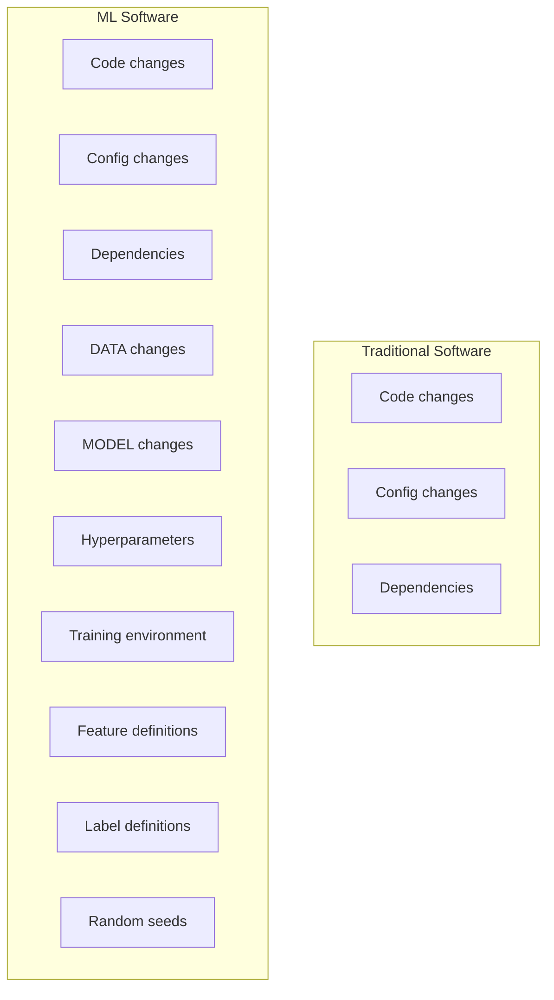
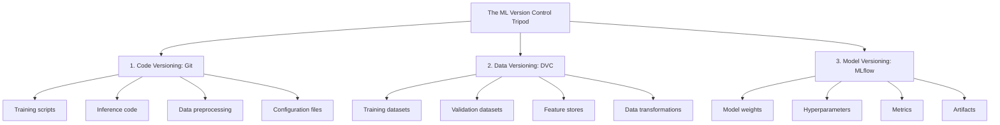
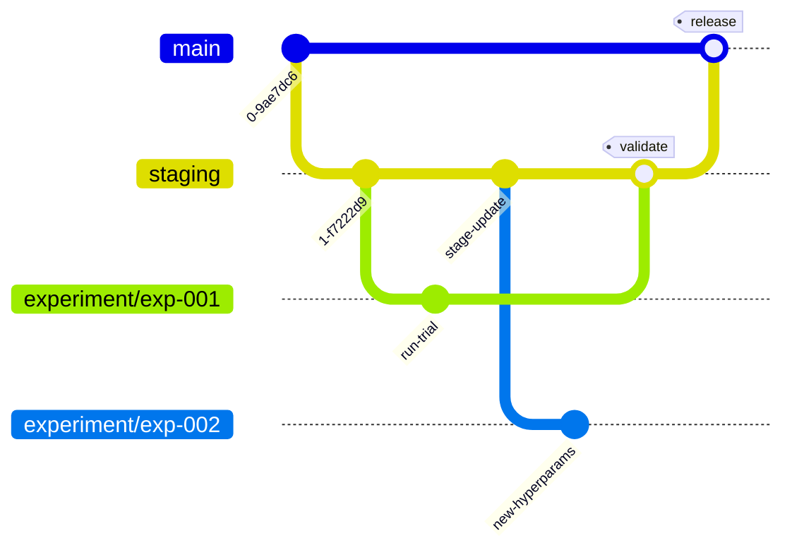
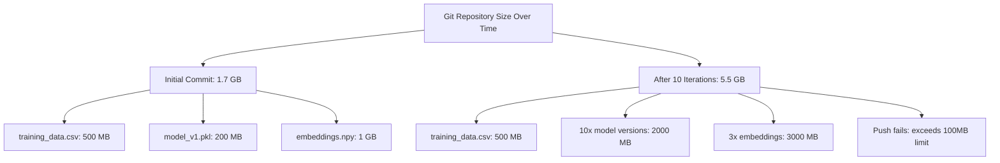
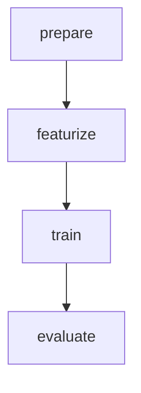
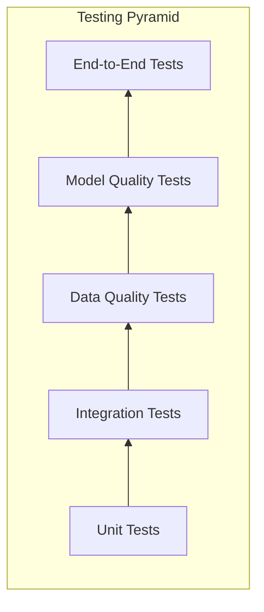
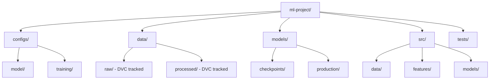
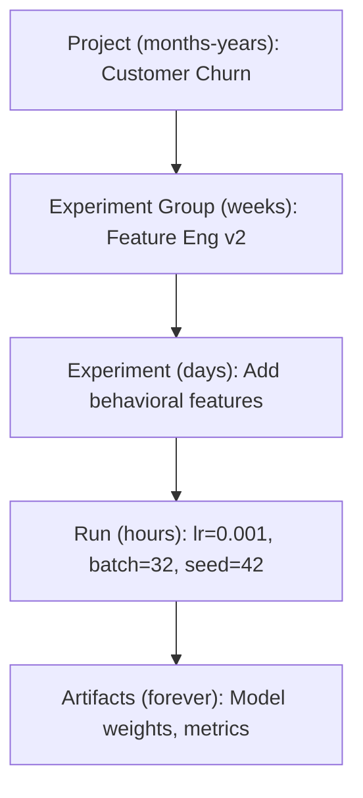

> **AI/ML Engineering Track** | Complexity: `[COMPLEX]` | Time: 5-6 Hours
**Prerequisites**: Phase 9 complete

---

## Why This Module Matters

Knight Capital Group. August 1, 2012. 9:30 AM Eastern.

The opening bell rang on Wall Street, and Knight Capital's new trading software went live. For exactly 45 minutes, their automated system executed trades at a massive rate of 40 orders per second—erroneously buying high and selling low. By 10:15 AM, the company had hemorrhaged $440 million. By the end of the week, Knight Capital had to be sold off in pieces to survive.

The root cause was staggering in its simplicity: a deployment technician had pushed new code but forgot to update one of the eight core production servers. The old code on that single server, which had lain dormant for years, was suddenly activated by a repurposed system flag. It initiated an obsolete testing protocol on live markets. There was no automated deployment pipeline, no environment consistency checks, and absolutely no mechanism for immediate automated rollback.

This disaster was not fundamentally a technology failure; it was a process failure. It highlighted the terrifying absence of robust DevOps methodologies. Machine Learning systems magnify this danger exponentially. In ML, you are not merely deploying static application code—you are deploying an intertwined web of algorithms, evolving datasets, trained model weights, and hyperparameter configurations. A failure in any single component can silently degrade performance or cause catastrophic errors. This module provides the blueprint to ensure you never become the next Knight Capital, teaching you how to apply rigorous, version-controlled DevOps principles to the chaotic world of Machine Learning.

---

## Learning Outcomes

By the end of this module, you will be able to:
- **Design** an end-to-end ML version control strategy that seamlessly integrates Git for code and DVC for data and model weights.
- **Evaluate** model and data quality rigorously by writing automated tests within the extended ML testing pyramid.
- **Implement** bulletproof pre-commit hooks to block secret leakage, prohibit massive binaries, and enforce formatting standards before code ever leaves a local workstation.
- **Diagnose** pipeline failures and silent performance drift by utilizing deterministic experiment tracking and Kubernetes-based test execution.

---

## The Complexity Explosion

When a bug infiltrates traditional software, the root cause is usually deterministic: an unhandled exception, a logic error, or a missing dependency. The software behaves unexpectedly, the team locates the stack trace, rolls back the code, and applies a patch. While stressful, the blast radius is contained and the diagnostic path is clear.

Machine Learning systems shatter this predictability. If a production model's accuracy drops by three percent, the diagnostic search space is enormous. Is the algorithm flawed? Did the underlying data distribution shift over the weekend? Was a new feature processed incorrectly? Did someone update the learning rate in a configuration file?

**Did You Know?** In 2015, Google researchers led by D. Sculley published "Hidden Technical Debt in Machine Learning Systems", revealing that ML code typically comprises less than 5% of the overall system codebase, with the remaining 95% devoted to surrounding infrastructure.

```text
TRADITIONAL SOFTWARE vs ML SOFTWARE
====================================

Traditional Software:                 ML Software:
├── Code changes                      ├── Code changes
├── Config changes                    ├── Config changes
└── Dependencies                      ├── Dependencies
                                      ├── DATA changes (huge!)
                                      ├── MODEL changes (huge!)
                                      ├── Hyperparameters
                                      ├── Training environment
                                      ├── Feature definitions
                                      ├── Label definitions
                                      └── Random seeds (yes, really)

Things that can break your system:
Traditional: ~3                       ML: ~10+

This is why ML DevOps is a distinct discipline, not just "DevOps + ML"
```

To visualize this complexity programmatically, we can map the dependencies:



### The Three Pillars of ML Version Control

Traditional software engineering relies on a single pillar of truth: Git. In Machine Learning, Git alone is entirely insufficient. You need a tripod of version control. If any single pillar collapses, the entire system loses reproducibility.

```text
┌─────────────────────────────────────────────────────────────────────────┐
│                    THE ML VERSION CONTROL TRIPOD                        │
├─────────────────────────────────────────────────────────────────────────┤
│                                                                         │
│  1. CODE VERSIONING (Git)                                              │
│     ├── Training scripts      → "How did we train this?"               │
│     ├── Inference code        → "How do we use this?"                  │
│     ├── Data preprocessing    → "How did we prepare the data?"         │
│     └── Configuration files   → "What settings did we use?"            │
│                                                                         │
│  2. DATA VERSIONING (DVC, Delta Lake, etc.)                            │
│     ├── Training datasets     → "What did we learn from?"              │
│     ├── Validation datasets   → "How did we evaluate?"                 │
│     ├── Feature stores        → "What features existed when?"          │
│     └── Data transformations  → "How did we process it?"               │
│                                                                         │
│  3. MODEL VERSIONING (MLflow, W&B, etc.)                               │
│     ├── Model weights         → "What are the learned parameters?"     │
│     ├── Hyperparameters       → "What knobs did we turn?"              │
│     ├── Metrics               → "How well did it work?"                │
│     └── Artifacts             → "What did it produce?"                 │
│                                                                         │
│  Remove ANY pillar = You cannot reproduce or debug your system          │
└─────────────────────────────────────────────────────────────────────────┘
```



**Did You Know?** In a 2019 study, researchers at McGill University found that only 6% of machine learning papers could be fully reproduced due to missing hyperparameters and unreported random seeds.

---

## Git Workflows for ML Projects

### Why Standard Git Flow Fails for ML

Standard Git Flow (utilizing strict feature branches, develop branches, and release tags) assumes every branch is marching toward a functional completion. A feature is either finished and merged, or it is discarded.

Machine Learning is fundamentally scientific. You might initiate fifty branches to test various loss functions or optimizer combinations. Forty-nine of those branches might fail to beat the baseline model. However, those "failed" branches represent valuable empirical research. They should not be blindly deleted or haphazardly merged into `main`.

### The ML-Adapted Git Workflow

```text
ML GIT WORKFLOW
===============

main ─────────────────●─────────────────●────────────────────→
                      │                 │
                      │                 │ (merge after validation)
                      │                 │
staging ──────●───────┼────●────────────┼─────────────────────→
              │       │    │            │
              │       │    │ (model validated on staging data)
              │       │    │
experiment/   │       │    │
  exp-001 ────┴───────┘    │
                           │
experiment/                │
  exp-002 ─────────────────┘

KEY DIFFERENCES FROM STANDARD GIT FLOW:
1. "experiment" branches for ML experiments (can be long-lived)
2. Staging branch for model validation (not just code review)
3. Longer validation cycles (days, not hours)
4. Experiments may never merge—and that's OK!
```



> **Stop and think**: If an experiment fails to beat the baseline, should you delete the branch or keep it? Consider the impact on future team members who might propose the exact same hypothesis six months later. Keeping the branch, heavily documented, acts as a scientific ledger.

### Branch Naming That Actually Helps

When executing massive parallel sweeps, naming branches clearly is the only way to avoid absolute chaos.

```python
# ML-specific branch naming conventions
BRANCH_PATTERNS = {
    # Standard development
    "feature/": "New functionality (feature/add-streaming-inference)",
    "fix/": "Bug fixes (fix/data-leak-in-validation)",

    # ML-specific branches
    "experiment/": "ML experiments (experiment/bert-large-lr-sweep)",
    "exp/": "Short form for quick experiments (exp/dropout-0.3)",
    "model/": "Model architecture changes (model/transformer-v2)",
    "data/": "Dataset changes (data/add-2024-q4-samples)",
    "baseline/": "Baseline experiments (baseline/logistic-regression)",

    # Emergency
    "hotfix/": "Production fixes (hotfix/oom-on-large-batch)",
}

# Good branch names tell a story
GOOD_NAMES = [
    "experiment/gpt4-finetune-customer-support-v2",   # What, why, version
    "data/incorporate-user-feedback-nov-2024",        # What, when
    "model/switch-attention-to-flash-attention",      # What, how
    "exp/learning-rate-1e-5-warmup-1000",            # Hyperparameters visible
]

# Bad branch names create confusion
BAD_NAMES = [
    "test",           # Test what?
    "my-changes",     # What changes?
    "experiment1",    # Experiment about what?
    "final",          # Nothing in ML is ever final
    "final-v2",       # Proof that "final" is a lie
    "asdf",           # Future you will hate past you
]
```

### Commit Messages That Save Future You

```python
# Conventional Commits adapted for ML
COMMIT_TYPES = {
    "feat": "New feature in the codebase",
    "fix": "Bug fix",
    "exp": "ML experiment (results included!)",      # ML-specific
    "data": "Data changes (describe what changed)",  # ML-specific
    "model": "Model architecture changes",           # ML-specific
    "perf": "Performance improvement",
    "refactor": "Code refactoring (no behavior change)",
    "test": "Adding or updating tests",
    "docs": "Documentation only",
    "chore": "Maintenance tasks",
}

# The secret sauce: Include metrics in experiment commits!
EXPERIMENT_COMMIT_TEMPLATE = """
exp: {short_description}

Experiment: {experiment_name}
Hypothesis: {what_you_expected}
Result: {what_actually_happened}

Metrics (vs baseline):
- Accuracy: {accuracy} ({delta_accuracy:+.2%})
- F1 Score: {f1} ({delta_f1:+.2%})
- Latency: {latency}ms ({delta_latency:+}ms)

Config Changes:
- learning_rate: {baseline_lr} → {new_lr}
- batch_size: {baseline_batch} → {new_batch}
- epochs: {epochs}

Notes: {any_observations}
"""

# Real example
GOOD_COMMIT = """
exp: Test BERT-large with cosine LR scheduler

Experiment: bert-large-cosine-lr-v3
Hypothesis: Cosine annealing should help with convergence stability
Result: Confirmed - lower variance in final metrics

Metrics (vs baseline):
- Accuracy: 0.892 (+1.2%)
- F1 Score: 0.876 (+0.8%)
- Latency: 45ms (+5ms)

Config Changes:
- learning_rate: 2e-5 → 1e-5 (peak)
- scheduler: linear → cosine
- warmup_steps: 100 → 500

Notes: Training loss curve much smoother. Worth the latency tradeoff.
"""
```

---

## Data Version Control (DVC): Git for Your Data

### The Problem That Breaks Everything

Every developer has encountered this horror story: You finalize a model and it executes flawlessly. You commit the scripts. Months later, a colleague attempts to reproduce the metrics using the identical codebase. The result? Accuracy has plummeted by 15%. What happened? The data was silently updated. Someone patched a few incorrect labels directly in the CSV and failed to mention it. 

Furthermore, you cannot simply commit massive datasets to Git. Git tracks the absolute history of every binary byte.

```text
THE PROBLEM WITH LARGE FILES IN GIT
===================================

Git stores EVERY version of EVERY file.

Your ML project starts innocently:
├── training_data.csv    (500 MB)
├── model_v1.pkl         (200 MB)
└── embeddings.npy       (1 GB)

After 10 model iterations:
├── training_data.csv    (500 MB × 1)   =  500 MB
├── model_v1.pkl         (200 MB)
├── model_v2.pkl         (200 MB)
├── model_v3.pkl         (200 MB)
├── ...                  (200 MB × 7)
└── embeddings.npy       (1 GB × 3 versions)

Total repository size: 500 + 2000 + 3000 = 5.5 GB 

And now you try to push to GitHub...
"Error: File model_v8.pkl is 200 MB; max file size is 100 MB"
```



### DVC: The Solution

Data Version Control (DVC) intercepts large files before they ever reach Git. DVC hashes the binary data, stores the heavy files in remote block storage (like S3 or GCS), and generates a tiny `.dvc` pointer file. You commit the text pointer to Git, leaving the heavy lifting to the cloud.

```bash
# Install DVC
pip install dvc

# Initialize DVC in a Git repo
cd my-ml-project
dvc init

# Track a large file
dvc add data/training_data.csv

# What just happened?
# 1. Created: data/training_data.csv.dvc (small pointer file, ~100 bytes)
# 2. Created: data/.gitignore (ignores the actual data file)
# 3. The actual data stays local for now

# Set up remote storage
dvc remote add -d myremote s3://my-bucket/dvc-storage

# Push data to remote
dvc push

# Now your collaborator can:
git clone <repo>
dvc pull  # Downloads the actual data files!
```

### The DVC + Git Dance

```python
"""
DVC + Git Workflow: The Complete Picture
"""

# STEP 1: You make data changes
# Added 5000 new labeled samples to training data
# Fixed 200 incorrect labels
# Removed 50 duplicate entries

# STEP 2: Tell DVC about the changes
"""
$ dvc add data/training_data.csv
$ dvc add data/labels.json

DVC updates the .dvc pointer files with new hashes:
  data/training_data.csv.dvc  →  md5: a1b2c3d4...
  data/labels.json.dvc        →  md5: e5f6g7h8...
"""

# STEP 3: Commit the pointer files with Git
"""
$ git add data/training_data.csv.dvc data/labels.json.dvc
$ git commit -m "data: Add 5000 Q4 samples, fix 200 labels, remove dupes"
"""

# STEP 4: Push both
"""
$ dvc push  # Uploads actual data to remote storage
$ git push  # Uploads code + DVC pointers to Git
"""

# THE MAGIC: Time travel for data!
"""
$ git checkout experiment/bert-large  # Go to old experiment
$ dvc checkout                        # DVC fetches the DATA from that time!

Your data directory now has the EXACT data from when that experiment ran.
You can reproduce results from any point in history.
"""
```

### DVC Pipelines: Reproducibility on Rails

```yaml
# dvc.yaml - Your ML pipeline as code

stages:
  prepare:
    cmd: python src/prepare_data.py
    deps:
      - src/prepare_data.py
      - data/raw/
    outs:
      - data/processed/

  featurize:
    cmd: python src/featurize.py --config configs/features.yaml
    deps:
      - src/featurize.py
      - data/processed/
      - configs/features.yaml
    outs:
      - data/features/

  train:
    cmd: python src/train.py --config configs/train.yaml
    deps:
      - src/train.py
      - data/features/
      - configs/train.yaml
    outs:
      - models/model.pkl
    metrics:
      - metrics/train_metrics.json:
          cache: false  # Always show latest
    plots:
      - metrics/loss_curve.csv:
          x: epoch
          y: loss

  evaluate:
    cmd: python src/evaluate.py
    deps:
      - src/evaluate.py
      - models/model.pkl
      - data/test/
    metrics:
      - metrics/eval_metrics.json:
          cache: false
```

```bash
# Run the full pipeline
$ dvc repro

# DVC relies on cryptographic hashes of files explicitly listed in 'deps'.
# It skips stages if these declared dependencies haven't changed.
# Changed training config? Only re-runs train and evaluate.
# Changed raw data but forgot to list it in 'deps'? DVC will incorrectly skip the stage.

# Compare metrics across experiments
$ dvc metrics diff
Path                    Metric    HEAD      workspace
metrics/eval.json       accuracy  0.845     0.872
metrics/eval.json       f1        0.831     0.859

# Visualize the pipeline
$ dvc dag

         +---------+
         | prepare |
         +---------+
              |
              v
        +-----------+
        | featurize |
        +-----------+
              |
              v
          +-------+
          | train |
          +-------+
              |
              v
        +----------+
        | evaluate |
        +----------+
```



---

## Testing Strategies for ML Code

### The ML Testing Pyramid (Extended)

Testing a machine learning system goes far beyond asserting that an API endpoint returns an HTTP 200. You must validate the conceptual integrity of the data and the statistical fairness of the predictions.

```text
THE ML TESTING PYRAMID
======================

                        △
                       /│\
                      / │ \         END-TO-END TESTS
                     /  │  \        Full pipeline, production-like data
                    /   │   \       "Does the whole thing work?"
                   /────┼────\
                  /     │     \     MODEL QUALITY TESTS  ← ML-specific!
                 /      │      \    Accuracy, fairness, robustness
                /       │       \   "Is the model good enough?"
               /────────┼────────\
              /         │         \   DATA QUALITY TESTS  ← ML-specific!
             /          │          \  Schema, distributions, drift
            /           │           \ "Is the data valid?"
           /────────────┼────────────\
          /             │             \ INTEGRATION TESTS
         /              │              \Components together
        /               │               \"Do pieces work together?"
       /────────────────┼────────────────\
      /                 │                 \ UNIT TESTS
     /                  │                  \Individual functions
    ▔▔▔▔▔▔▔▔▔▔▔▔▔▔▔▔▔▔▔▔▔▔▔▔▔▔▔▔▔▔▔▔▔▔▔▔▔▔▔"Do building blocks work?"

MORE TESTS ────────────────────────────────► FEWER TESTS
RUN FASTER ────────────────────────────────► RUN SLOWER
```



> **Pause and predict**: If your model accuracy drops suddenly in production but your code has not changed in weeks, which test layer in the extended pyramid is most likely to catch the root cause? 

### Unit Tests: Testing the Building Blocks

```python
import pytest
import numpy as np
from src.preprocessing import normalize, tokenize, extract_features

class TestPreprocessing:
    """Unit tests for preprocessing functions.

    These should be FAST and test edge cases that could silently
    corrupt your data pipeline.
    """

    def test_normalize_scales_to_unit_range(self):
        """Normalization should scale values to [0, 1]."""
        data = np.array([0, 50, 100])
        result = normalize(data)

        assert result.min() >= 0, "Normalized data has negative values!"
        assert result.max() <= 1, "Normalized data exceeds 1!"
        assert np.isclose(result[0], 0), "Min value should normalize to 0"
        assert np.isclose(result[2], 1), "Max value should normalize to 1"

    def test_normalize_handles_constant_values(self):
        """Normalization shouldn't crash on constant input.

        This is a sneaky edge case: if all values are the same,
        naive normalization divides by zero.
        """
        data = np.array([5, 5, 5])
        result = normalize(data)

        # Should handle gracefully, not produce NaN
        assert not np.any(np.isnan(result)), "NaN in output!"

    def test_normalize_handles_empty_array(self):
        """Empty arrays shouldn't crash the pipeline."""
        data = np.array([])
        result = normalize(data)

        assert len(result) == 0

    def test_tokenize_handles_empty_string(self):
        """Tokenizer should handle empty input gracefully."""
        result = tokenize("")
        assert result == [] or result == [""], "Unexpected empty string handling"

    def test_tokenize_preserves_important_tokens(self):
        """Tokenizer shouldn't drop semantically important words."""
        text = "machine learning is transforming artificial intelligence"
        tokens = tokenize(text)

        # Core concepts should survive tokenization (allow for stemming)
        important_stems = ["machin", "learn", "transform", "artificial", "intelligen"]
        found_important = [any(stem in t.lower() for t in tokens) for stem in important_stems]
        assert all(found_important), f"Lost important tokens. Got: {tokens}"

    def test_extract_features_output_shape(self):
        """Feature extraction should produce consistent dimensions."""
        text = "sample input text for testing"
        features = extract_features(text)

        assert features.shape == (768,), f"Expected 768-dim, got {features.shape}"
        assert features.dtype == np.float32, f"Expected float32, got {features.dtype}"


class TestModelInference:
    """Unit tests for model inference behavior."""

    def test_model_output_shape(self, model):
        """Model output should have correct shape."""
        input_data = np.random.randn(1, 768).astype(np.float32)
        output = model.predict(input_data)

        assert output.shape == (1, 10), f"Expected (1, 10), got {output.shape}"

    def test_model_output_is_probability(self, model):
        """For classification, output should be valid probabilities."""
        input_data = np.random.randn(1, 768).astype(np.float32)
        output = model.predict(input_data)

        assert np.all(output >= 0), "Negative probabilities!"
        assert np.all(output <= 1), "Probabilities > 1!"
        assert np.isclose(output.sum(), 1.0, atol=1e-5), "Probabilities don't sum to 1!"

    def test_model_deterministic_inference(self, model):
        """Same input should always produce same output."""
        input_data = np.random.randn(1, 768).astype(np.float32)

        output1 = model.predict(input_data)
        output2 = model.predict(input_data)

        np.testing.assert_array_almost_equal(
            output1, output2, decimal=6,
            err_msg="Model gives different outputs for same input!"
        )
```

### Data Quality Tests: The ML-Specific Layer

```python
import pytest
import pandas as pd
import great_expectations as ge
from scipy import stats

class TestDataQuality:
    """Tests for data quality and schema validation.

    These tests catch data issues BEFORE they corrupt your model.
    """

    @pytest.fixture
    def training_data(self):
        return pd.read_csv("data/training_data.csv")

    def test_no_missing_labels(self, training_data):
        """All samples should have labels.

        Missing labels during training silently skews your loss function.
        """
        missing = training_data["label"].isna().sum()
        assert missing == 0, f"Found {missing} samples with missing labels!"

    def test_label_distribution_not_severely_imbalanced(self, training_data):
        """Labels should be reasonably balanced.

        Severe imbalance leads to models that predict the majority class.
        """
        label_counts = training_data["label"].value_counts()
        imbalance_ratio = label_counts.max() / label_counts.min()

        assert imbalance_ratio < 10, (
            f"Label imbalance ratio is {imbalance_ratio:.1f}:1. "
            f"Consider class weighting or resampling."
        )

    def test_no_data_leakage_between_splits(self, training_data):
        """Training data shouldn't contain test samples.

        Data leakage is one of the most common causes of overly
        optimistic model evaluations.
        """
        test_ids = set(pd.read_csv("data/test_ids.csv")["id"])
        train_ids = set(training_data["id"])

        overlap = train_ids & test_ids
        assert len(overlap) == 0, (
            f"DATA LEAKAGE DETECTED! "
            f"{len(overlap)} samples appear in both train and test: {list(overlap)[:5]}..."
        )

    def test_feature_values_in_expected_ranges(self, training_data):
        """Features should be within plausible ranges.

        Out-of-range values often indicate data corruption or encoding errors.
        """
        ge_df = ge.from_pandas(training_data)

        # Age should be reasonable for humans
        result = ge_df.expect_column_values_to_be_between(
            "age", min_value=0, max_value=120
        )
        assert result.success, f"Invalid ages found: {result.result}"

        # Prices should be positive
        result = ge_df.expect_column_values_to_be_between(
            "price", min_value=0, max_value=1_000_000
        )
        assert result.success, f"Invalid prices found: {result.result}"

    def test_no_duplicate_samples(self, training_data):
        """No duplicate samples in training data.

        Duplicates cause the model to memorize instead of generalize.
        """
        duplicate_mask = training_data.duplicated(subset=["text", "label"])
        n_duplicates = duplicate_mask.sum()

        assert n_duplicates == 0, (
            f"Found {n_duplicates} duplicate samples! "
            f"First duplicates at indices: {training_data[duplicate_mask].index[:5].tolist()}"
        )


class TestDataDrift:
    """Tests for data drift between training and production.

    Your model was trained on historical data. If production data
    looks different, performance will silently degrade.
    """

    def test_feature_distributions_stable(self):
        """Production features should match training distribution."""
        train_stats = load_training_statistics()
        prod_sample = get_recent_production_sample(n=1000)

        drift_detected = []

        for feature in ["age", "income", "engagement_score"]:
            # Two-sample KS test for distribution shift
            train_values = train_stats[feature]["sample_values"]
            prod_values = prod_sample[feature].values

            statistic, p_value = stats.ks_2samp(train_values, prod_values)

            if p_value < 0.01:  # Significant drift
                drift_detected.append(
                    f"{feature}: KS statistic={statistic:.3f}, p={p_value:.4f}"
                )

        assert len(drift_detected) == 0, (
            f"DATA DRIFT DETECTED in features:\n" + "\n".join(drift_detected)
        )

    def test_categorical_distribution_stable(self):
        """Categorical feature distributions shouldn't shift dramatically."""
        train_dist = load_training_distributions()
        prod_sample = get_recent_production_sample(n=1000)

        for feature in ["category", "region", "device_type"]:
            prod_dist = prod_sample[feature].value_counts(normalize=True)

            for category, train_freq in train_dist[feature].items():
                prod_freq = prod_dist.get(category, 0)

                # Alert if frequency changed by more than 50%
                if abs(prod_freq - train_freq) / train_freq > 0.5:
                    pytest.fail(
                        f"Category '{category}' in '{feature}' shifted: "
                        f"train={train_freq:.2%} → prod={prod_freq:.2%}"
                    )
```

### Model Quality Tests: The Final Gatekeeper

```python
import pytest
from sklearn.metrics import accuracy_score, f1_score, precision_recall_curve
from fairlearn.metrics import demographic_parity_difference, equalized_odds_difference

class TestModelQuality:
    """Tests for model quality and fairness.

    These are your last line of defense before deployment.
    """

    @pytest.fixture
    def model_and_data(self):
        model = load_model("models/production_model.pkl")
        X_test, y_test = load_test_data()
        return model, X_test, y_test

    def test_accuracy_meets_business_threshold(self, model_and_data):
        """Model accuracy should meet minimum business requirement."""
        model, X_test, y_test = model_and_data
        y_pred = model.predict(X_test)

        accuracy = accuracy_score(y_test, y_pred)
        threshold = 0.85  # Business requirement

        assert accuracy >= threshold, (
            f"Accuracy {accuracy:.2%} below required {threshold:.2%}. "
            f"DO NOT DEPLOY."
        )

    def test_no_class_left_behind(self, model_and_data):
        """Every class should have acceptable F1 score.

        A model with 95% overall accuracy but 20% F1 on class 3
        is dangerous if class 3 matters to your users.
        """
        model, X_test, y_test = model_and_data
        y_pred = model.predict(X_test)

        f1_per_class = f1_score(y_test, y_pred, average=None)

        for class_idx, f1 in enumerate(f1_per_class):
            assert f1 >= 0.6, (
                f"Class {class_idx} has F1 score {f1:.2f}. "
                f"This class is being underserved by the model."
            )

    def test_no_performance_regression(self, model_and_data):
        """New model should not be worse than current production."""
        model, X_test, y_test = model_and_data

        prod_metrics = load_production_metrics()
        y_pred = model.predict(X_test)
        new_accuracy = accuracy_score(y_test, y_pred)

        # Allow 1% degradation for statistical noise
        threshold = prod_metrics["accuracy"] - 0.01

        assert new_accuracy >= threshold, (
            f"REGRESSION DETECTED! "
            f"New: {new_accuracy:.2%}, Prod: {prod_metrics['accuracy']:.2%}. "
            f"Rolling back."
        )

    def test_fairness_demographic_parity(self, model_and_data):
        """Model should have similar outcomes across demographic groups.

        Required for compliance. Failures often stem from imbalanced
        training data or feature engineering transformations that
        inadvertently proxy for sensitive attributes (like zip codes).
        """
        model, X_test, y_test = model_and_data
        sensitive_features = X_test["gender"]
        y_pred = model.predict(X_test)

        dpd = demographic_parity_difference(
            y_test, y_pred,
            sensitive_features=sensitive_features
        )

        assert abs(dpd) < 0.1, (
            f"FAIRNESS VIOLATION: Demographic parity difference = {dpd:.3f}. "
            f"Positive outcomes differ by more than 10% between groups."
        )


class TestModelRobustness:
    """Tests for edge cases that could crash production."""

    def test_handles_missing_values(self, model):
        """Model should handle missing values gracefully."""
        input_with_nan = pd.DataFrame({
            "feature1": [1.0, np.nan, 3.0],
            "feature2": [np.nan, 2.0, 3.0],
        })

        try:
            predictions = model.predict(input_with_nan)
            assert len(predictions) == 3
            assert not np.any(np.isnan(predictions)), "Model returned NaN predictions!"
        except Exception as e:
            pytest.fail(f"Model crashed on missing values: {e}")

    def test_handles_extreme_values(self, model):
        """Model should handle outliers without crashing or NaN."""
        extreme_input = pd.DataFrame({
            "feature1": [1e10, -1e10, 0],
            "feature2": [0, 0, 1e-10],
        })

        predictions = model.predict(extreme_input)

        assert not np.any(np.isnan(predictions)), "NaN on extreme input!"
        assert not np.any(np.isinf(predictions)), "Inf on extreme input!"
        assert np.all((predictions >= 0) & (predictions <= 1)), "Invalid probabilities!"
```

**Did You Know?** Algorithmia's 2022 State of ML survey found that 55% of companies have never deployed a single ML model to production due to a lack of robust MLOps practices. Testing pipelines build the organizational trust required to release.

---

## Pre-commit Hooks: Your First Line of Defense

### The Philosophy of Pre-commit

Pre-commit hooks intercept local changes immediately before they are locked into the Git history. If the code violates rules, the commit aborts. This mechanism is profoundly critical in ML environments because committing a 2GB model weight to history is nearly impossible to undo without breaking the repository for every collaborator. 

```bash
# Install pre-commit
pip install pre-commit

# Install hooks in your repo
pre-commit install

# Now pre-commit runs automatically on every commit!
# You can also run manually:
pre-commit run --all-files
```

### The Ultimate ML Pre-commit Configuration

```yaml
# .pre-commit-config.yaml

repos:
  # ============================================================
  # STANDARD CODE QUALITY (Same as any Python project)
  # ============================================================

  - repo: https://github.com/pre-commit/pre-commit-hooks
    rev: v4.5.0
    hooks:
      - id: trailing-whitespace        # Remove trailing spaces
      - id: end-of-file-fixer          # Ensure newline at end
      - id: check-yaml                  # Valid YAML syntax
      - id: check-json                  # Valid JSON syntax
      - id: check-added-large-files
        args: ['--maxkb=1000']          # CRITICAL: Catch model files!
      - id: detect-private-key          # Catch committed SSH keys
      - id: check-merge-conflict        # Catch merge conflict markers

  - repo: https://github.com/psf/black
    rev: 24.3.0
    hooks:
      - id: black                       # Auto-format Python code
        language_version: python3.10

  - repo: https://github.com/pycqa/isort
    rev: 5.13.2
    hooks:
      - id: isort                       # Sort imports
        args: ["--profile", "black"]

  - repo: https://github.com/pycqa/flake8
    rev: 7.0.0
    hooks:
      - id: flake8                      # Lint Python code
        args: ['--max-line-length=100', '--ignore=E203,W503']

  - repo: https://github.com/pre-commit/mirrors-mypy
    rev: v1.8.0
    hooks:
      - id: mypy                        # Type checking
        additional_dependencies: [types-requests, numpy, pandas-stubs]

  # ============================================================
  # SECURITY CHECKS (Critical for ML with API keys)
  # ============================================================

  - repo: https://github.com/PyCQA/bandit
    rev: 1.7.7
    hooks:
      - id: bandit                      # Security vulnerability scanner
        args: ["-r", "src/", "-ll"]
        exclude: tests/

  - repo: https://github.com/gitleaks/gitleaks
    rev: v8.18.1
    hooks:
      - id: gitleaks                    # Scan for secrets/API keys

  # ============================================================
  # ML-SPECIFIC HOOKS (The special sauce)
  # ============================================================

  # Clean notebook outputs before commit
  - repo: https://github.com/kynan/nbstripout
    rev: 0.7.1
    hooks:
      - id: nbstripout                  # Remove outputs from notebooks
        # Why? Outputs can contain:
        # - Sensitive data samples
        # - Large binary outputs (plots, tensors)
        # - Makes diffs unreadable

  # Custom ML checks
  - repo: local
    hooks:
      # Prevent committing model files directly
      - id: no-large-model-files
        name: Check no model files committed
        entry: python scripts/hooks/check_no_models.py
        language: python
        types: [file]

      # Validate ML configurations
      - id: validate-ml-config
        name: Validate ML configurations
        entry: python scripts/hooks/validate_ml_config.py
        language: python
        files: configs/.*\.(yaml|yml)$

      # Check for hardcoded secrets in config
      - id: no-secrets-in-config
        name: Check no secrets in config
        entry: python scripts/hooks/check_no_secrets.py
        language: python
        files: \.(yaml|yml|json|ini|env)$

      # Validate DVC files are in sync
      - id: dvc-check
        name: Check DVC files are valid
        entry: dvc status
        language: system
        pass_filenames: false
        always_run: true
```

### Custom Hook Scripts

```python
# scripts/hooks/check_no_models.py
"""Prevent accidentally committing large model files."""

import sys
from pathlib import Path

# File extensions that are typically large model files
MODEL_EXTENSIONS = {
    '.pkl', '.pickle',      # Pickle files
    '.pt', '.pth',          # PyTorch
    '.h5', '.hdf5',         # Keras/TensorFlow
    '.onnx',                # ONNX
    '.bin',                 # Binary weights
    '.safetensors',         # Safetensors
    '.ckpt',                # Checkpoints
}

# Size threshold (10MB)
SIZE_THRESHOLD = 10 * 1024 * 1024

def check_file(filepath: str) -> str | None:
    """Check if a file looks like a model file."""
    path = Path(filepath)

    # Check extension
    if path.suffix.lower() in MODEL_EXTENSIONS:
        size = path.stat().st_size
        if size > SIZE_THRESHOLD:
            return (
                f"  {filepath} ({size / 1024 / 1024:.1f}MB)\n"
                f"   This looks like a model file. Use DVC to track it:\n"
                f"   $ dvc add {filepath}"
            )

    return None

def main():
    issues = []
    for filepath in sys.argv[1:]:
        issue = check_file(filepath)
        if issue:
            issues.append(issue)

    if issues:
        print(" Large model files detected!\n")
        print("\n".join(issues))
        print("\n Model files should be tracked with DVC, not Git.")
        sys.exit(1)

    sys.exit(0)

if __name__ == "__main__":
    main()
```

```python
# scripts/hooks/check_no_secrets.py
"""Check that config files don't contain secrets."""

import re
import sys
from pathlib import Path

SECRET_PATTERNS = [
    (r'api[_-]?key\s*[:=]\s*["\']?[a-zA-Z0-9]{20,}', "API key"),
    (r'password\s*[:=]\s*["\']?[^\s"\']+', "Password"),
    (r'secret\s*[:=]\s*["\']?[a-zA-Z0-9]{20,}', "Secret"),
    (r'sk-[a-zA-Z0-9]{48}', "OpenAI API key"),
    (r'AKIA[A-Z0-9]{16}', "AWS Access Key"),
    (r'ghp_[a-zA-Z0-9]{36}', "GitHub Personal Access Token"),
    (r'xox[baprs]-[a-zA-Z0-9-]+', "Slack Token"),
]

def check_file(filepath: str) -> list:
    """Scan file for potential secrets."""
    issues = []
    content = Path(filepath).read_text()

    for i, line in enumerate(content.split('\n'), 1):
        # Skip comments
        if line.strip().startswith('#'):
            continue

        for pattern, secret_type in SECRET_PATTERNS:
            if re.search(pattern, line, re.IGNORECASE):
                # Don't show the actual secret!
                issues.append(f"{filepath}:{i}: Potential {secret_type} detected")

    return issues

def main():
    all_issues = []
    for filepath in sys.argv[1:]:
        all_issues.extend(check_file(filepath))

    if all_issues:
        print(" POTENTIAL SECRETS DETECTED!\n")
        for issue in all_issues:
            print(f"  {issue}")
        print("\n Use environment variables or a secrets manager instead.")
        print("   Example: api_key: ${OPENAI_API_KEY}")
        sys.exit(1)

    print(" No secrets detected")
    sys.exit(0)

if __name__ == "__main__":
    main()
```

**Did You Know?** GitHub's secret scanning detected over 700,000 exposed secrets in public repositories in 2022 alone, underscoring the critical need for robust pre-commit security checks.

---

## Project Structure: A Place for Everything

### The Recommended ML Project Layout

```text
ml-project/
├── .github/
│   └── workflows/
│       ├── ci.yml                 # CI: tests, linting on every PR
│       ├── train.yml              # Training pipeline (triggered manually)
│       └── deploy.yml             # Deployment pipeline
├── configs/
│   ├── model/
│   │   ├── base.yaml              # Shared model configuration
│   │   ├── small.yaml             # Small model (fast iteration)
│   │   └── large.yaml             # Large model (production)
│   ├── training/
│   │   ├── default.yaml           # Default hyperparameters
│   │   └── fine_tune.yaml         # Fine-tuning configuration
│   └── inference/
│       └── production.yaml        # Production serving config
├── data/
│   ├── raw/                       # Raw data (DVC tracked, never modified)
│   ├── processed/                 # Processed data (DVC tracked)
│   ├── features/                  # Feature store outputs
│   └── .gitignore                 # CRITICAL: Ignore actual data files
├── models/
│   ├── checkpoints/               # Training checkpoints (DVC tracked)
│   ├── production/                # Production models (DVC tracked)
│   └── .gitignore                 # Ignore actual model files
├── notebooks/
│   ├── exploration/               # EDA and data exploration
│   ├── experiments/               # Experiment notebooks
│   └── reports/                   # Stakeholder-facing notebooks
├── src/
│   ├── __init__.py
│   ├── data/
│   │   ├── __init__.py
│   │   ├── load.py                # Data loading utilities
│   │   ├── preprocess.py          # Preprocessing functions
│   │   └── validate.py            # Data validation
│   ├── features/
│   │   ├── __init__.py
│   │   └── extract.py             # Feature extraction
│   ├── models/
│   │   ├── __init__.py
│   │   ├── train.py               # Training loop
│   │   ├── evaluate.py            # Evaluation logic
│   │   └── predict.py             # Inference logic
│   └── utils/
│       ├── __init__.py
│       ├── config.py              # Configuration loading
│       └── logging.py             # Logging setup
├── tests/
│   ├── __init__.py
│   ├── unit/                      # Fast, isolated tests
│   ├── integration/               # Component integration tests
│   └── data/                      # Data quality tests
├── scripts/
│   ├── train.py                   # Training entry point
│   ├── evaluate.py                # Evaluation entry point
│   └── predict.py                 # Batch prediction
├── .dvc/                          # DVC internals
├── .pre-commit-config.yaml        # Pre-commit hooks
├── dvc.yaml                       # DVC pipeline definition
├── dvc.lock                       # DVC lock file (reproducibility)
├── pyproject.toml                 # Modern Python project config
├── requirements.txt               # Production dependencies
├── requirements-dev.txt           # Development dependencies
├── Makefile                       # Common commands
└── README.md                      # Project documentation
```



### The Makefile: Your Command Center

```makefile
# Makefile - Common commands for the ML project
# Usage: make <command>

.PHONY: install test lint train evaluate clean help

# Default target: show help
help:
	@echo "ML Project Commands:"
	@echo "  make install     - Install all dependencies"
	@echo "  make test        - Run all tests"
	@echo "  make test-unit   - Run unit tests only"
	@echo "  make test-data   - Run data quality tests"
	@echo "  make lint        - Run all linters"
	@echo "  make train       - Run training pipeline"
	@echo "  make evaluate    - Evaluate current model"
	@echo "  make clean       - Remove artifacts"

# Install all dependencies and set up pre-commit
install:
	pip install -r requirements.txt
	pip install -r requirements-dev.txt
	pre-commit install
	@echo " Installation complete"

# Run all tests with coverage
test:
	pytest tests/ -v --cov=src --cov-report=term-missing --cov-report=html
	@echo " Coverage report: htmlcov/index.html"

# Run specific test suites
test-unit:
	pytest tests/unit/ -v

test-integration:
	pytest tests/integration/ -v

test-data:
	pytest tests/data/ -v --tb=short

# Lint and format code
lint:
	black src/ tests/ scripts/
	isort src/ tests/ scripts/
	flake8 src/ tests/ scripts/
	mypy src/
	@echo " Linting complete"

# Run the full DVC pipeline
train:
	dvc repro
	@echo " Training complete. Check metrics with 'dvc metrics show'"

# Evaluate the current model
evaluate:
	python scripts/evaluate.py --config configs/training/default.yaml

# Clean all artifacts
clean:
	find . -type d -name __pycache__ -exec rm -rf {} + 2>/dev/null || true
	find . -type f -name "*.pyc" -delete
	rm -rf .pytest_cache .mypy_cache .coverage htmlcov/
	@echo " Cleaned"

# Data management
data-pull:
	dvc pull
	@echo " Data pulled from remote"

data-push:
	dvc push
	@echo " Data pushed to remote"

# Quick sanity check before committing
check: lint test-unit
	@echo " Ready to commit"
```

---

## Reproducibility: The Ultimate Goal

### The Reproducibility Checklist

```python
# The Complete ML Reproducibility Checklist

REPRODUCIBILITY_CHECKLIST = {
    "Random Seeds": {
        "python": "import random; random.seed(42)",
        "numpy": "import numpy as np; np.random.seed(42)",
        "pytorch": """
            import torch
            torch.manual_seed(42)
            torch.cuda.manual_seed_all(42)
            torch.backends.cudnn.deterministic = True
            torch.backends.cudnn.benchmark = False
        """,
        "tensorflow": "import tensorflow as tf; tf.random.set_seed(42)",
    },

    "Environment": {
        "python_version": "Exact version (e.g., 3.10.12)",
        "dependencies": "requirements.txt with pinned versions (pkg==1.2.3)",
        "hardware": "Document GPU model, CUDA version, driver version",
        "os": "Document OS and version",
    },

    "Data": {
        "version": "DVC hash or explicit version tag",
        "preprocessing": "All steps documented AND versioned",
        "splits": "Fixed random seed for train/val/test splits",
        "augmentation": "If any, document with seeds",
    },

    "Model": {
        "architecture": "Full specification in config file",
        "initialization": "Random, pretrained (which checkpoint?)",
        "hyperparameters": "ALL of them, in versioned config",
    },

    "Training": {
        "optimizer": "Type, learning rate, momentum, weight decay, etc.",
        "scheduler": "Type, parameters, warmup steps",
        "batch_size": "Training AND evaluation",
        "epochs": "Number and early stopping criteria",
        "hardware": "Single GPU? Multi-GPU? Which GPUs?",
    },

    "Evaluation": {
        "metrics": "Exact formulas or library versions",
        "test_set": "Versioned with DVC",
        "preprocessing": "Same as training? Document any differences",
    },
}

def verify_reproducibility(config_path: str) -> list[str]:
    """Check if a configuration covers reproducibility requirements."""
    missing = []
    config = load_config(config_path)

    for category, items in REPRODUCIBILITY_CHECKLIST.items():
        for item, description in items.items():
            if item not in config.get(category, {}):
                missing.append(f"{category}.{item}: {description}")

    return missing
```

### The Experiment Tracking Hierarchy

```text
EXPERIMENT TRACKING HIERARCHY
==============================

Project (lives: months to years)
│   "Customer Churn Prediction"
│
└── Experiment Group (lives: weeks)
    │   "Feature Engineering v2"
    │
    └── Experiment (lives: days)
        │   "Add behavioral features"
        │
        └── Run (lives: hours)
            │   "lr=0.001, batch=32, seed=42"
            │
            └── Artifacts (lives: forever)
                    Model weights, metrics, plots

ORGANIZATION TIPS:
- Name projects after business problems, not techniques
- Name experiment groups after hypotheses, not dates
- Name experiments after what changed
- Let runs be automatically named with hyperparameters
```



---

## Kubernetes-Based Pipeline Execution

While local unit tests provide rapid feedback, diagnosing pipeline failures and running distributed training requires executing workloads in an environment that mirrors production. This is where Kubernetes becomes essential for ML DevOps.

A common mistake engineers make when migrating ML pipelines to Kubernetes is utilizing standard `Deployment` resources. A `Deployment` is designed inherently for long-running, stateless services (like a web API) and will continually restart the container if the process exits. Machine Learning pipelines—whether they are data validation tests, model training, or batch evaluations—are finite, batch-oriented computational tasks. They must run to completion and then terminate.

To execute these pipelines, you must use a Kubernetes `Job` resource. A `Job` correctly handles run-to-completion semantics, tracks the final success or failure state of the execution, and avoids infinite restart loops when a training script successfully finishes. By encapsulating deterministic experiment tracking scripts within a Kubernetes `Job`, you guarantee the pipeline executes with the exact hardware and environmental parity of production, making silent failures trivial to diagnose.

---

## Common Mistakes

| Mistake | Why It Is Dangerous | How To Fix It |
|---|---|---|
| **Committing model binaries to Git** | Bloats the repository size, eventually breaking cloning. Rewriting history with `git filter-branch` is highly destructive and breaks collaborators' local repositories. | Use `git rm --cached <file>` to remove it from Git without deleting the local file, track it with DVC, and use pre-commit hooks to block future binaries. |
| **Hardcoding hyperparameters** | Makes reproducing past experiments impossible and pollutes the code history with trivial constant changes. | Store all model hyperparameters and arguments in strict, versioned YAML configuration files. |
| **Changing multiple variables simultaneously** | Violates the scientific method by making it impossible to empirically attribute any performance gains or regressions to a specific change (e.g., updating architecture and learning rate at once). | Strictly isolate experiments to modify exactly one fundamental variable per branch. |
| **Ignoring random seeds** | Prevents deterministic training and evaluation, leading to unexplainable variations in model performance across identical runs. | Centralize seed initialization for Python, NumPy, and your ML framework at the very start of your orchestration scripts. |
| **Squashing experiment branches blindly** | Destroys the invaluable historical context of what hypotheses were tested and what exact metrics they produced. | Include comprehensive metrics, hypothesis data, and firm conclusions in the commit message before merging. |
| **Evaluating on training data** | Introduces massive data leakage, resulting in falsely high accuracy that immediately collapses upon production deployment. | Strictly isolate the validation/test sets before any feature engineering, balancing, or normalization steps occur. |
| **Skipping data drift tests** | Allows models to degrade silently and destructively in production as real-world data distributions gradually shift. | Implement statistical checks (e.g., KS tests) to continuously compare production incoming data against original training baselines. |
| **Using vague branch names** | Forces future engineers to perform tedious "experiment archaeology" to understand past work and prevents collaboration. | Adopt structured naming conventions like `experiment/model-feature-change` to communicate intent clearly. |

---

## Quiz

<details>
<summary>1. A team member pushes a new feature branch, but the CI pipeline immediately fails because a 500MB `.pkl` file was committed. What is the precise technical remedy?</summary>
The developer must forcefully remove the file from Git's caching index using `git rm --cached`, commit the removal to rewrite the branch state, and then track the file properly using DVC (`dvc add`). Finally, they should append the `.pkl` extension to the repository's `.gitignore` and configure a pre-commit hook to prevent future binary additions before they even hit the CI.
</details>

<details>
<summary>2. You have inherited an ML project where the accuracy in production is 12% lower than the notebook logs from six months ago. No code has fundamentally changed. Diagnose the most likely missing practice.</summary>
The project most likely lacks robust data versioning and data drift testing. Over six months, the underlying data distributions likely evolved in production, or the exact dataset used for the original training was modified locally without a DVC record, making it impossible to guarantee the model is still evaluating the same conceptual baseline.
</details>

<details>
<summary>3. During a code review, you notice an experiment branch includes complex changes to the model architecture and the learning rate scheduler simultaneously. Evaluate the problem with this approach.</summary>
This violates the core scientific method of isolating variables. By changing both the physical architecture and the behavioral scheduler simultaneously, it becomes impossible to empirically attribute any performance gains or regressions to a specific change. Experiments must strictly modify one fundamental variable at a time to yield reliable insights.
</details>

<details>
<summary>4. Your data pipeline completes successfully, but the model quality test fails due to a demographic parity difference of 0.15. Compare the potential root causes.</summary>
A demographic parity failure indicates severe bias in the model's predictions across sensitive groups. The root cause could be a statistical imbalance in the training data's representation of those groups, or feature engineering transformations that inadvertently proxy for sensitive attributes (like using zip codes that proxy for race). It requires auditing both the raw dataset distributions and the algorithm's feature importance metrics.
</details>

<details>
<summary>5. You decide to run a DVC pipeline using `dvc repro`, but it entirely skips the `prepare` stage even though you modified the raw data CSV locally. Diagnose why DVC skipped it.</summary>
DVC skipped the computational stage because the raw data CSV was not correctly defined as a strict dependency (`deps`) in the `dvc.yaml` file for the `prepare` stage. DVC relies entirely on dependency cryptographic hashes; if the file is not tracked explicitly as a dependency, DVC assumes the stage's inputs have not changed and utilizes the previously cached output.
</details>

<details>
<summary>6. Your organization is upgrading to Kubernetes v1.35 to schedule distributed training pipelines. A developer suggests using a standard Deployment for the training pod. Criticize this approach.</summary>
A standard Kubernetes Deployment is designed inherently for long-running, stateless services and will continually restart the pod if it exits. Training pipelines are finite, batch-oriented computational tasks that must run to completion and terminate. The developer must use a Kubernetes `Job` resource, which correctly handles run-to-completion semantics and tracks the final success or failure state of the execution.
</details>

<details>
<summary>7. An engineer complains that their Git repository has grown to 5.5 GB, causing severe network timeouts during deployment. They propose using `git filter-branch` to forcefully rewrite history and strip old data files. Evaluate this strategy.</summary>
While `git filter-branch` (or the more modern `git-filter-repo`) will technically reduce the repository size by rewriting historical hashes, it is a highly destructive operation that will break the local repositories of all other collaborators. A safer, forward-looking strategy is to freeze the current state, migrate to DVC for all future data versioning, and only perform a history rewrite during a strictly coordinated, organization-wide maintenance window.
</details>

<details>
<summary>8. You are configuring an automated CI/CD pipeline for a new ML project. Which test layer from the extended ML testing pyramid should execute first, and why?</summary>
Unit tests should invariably execute first because they are the fastest, cheapest, and most isolated layer of the pyramid. Running deep data quality tests or full model quality evaluations is computationally expensive and time-consuming; unit tests act as a rapid gatekeeper to ensure fundamental code mechanics (like array shapes and basic vector preprocessing) are absolutely correct before investing heavy resources in larger systemic tests.
</details>

---

## Hands-On Exercise: End-to-End ML DevOps Setup

In this exercise, you will establish a production-grade ML environment from scratch, configuring Git, DVC, strict pre-commit hooks, and executing a simulated training run on Kubernetes v1.35.

#### Task 1: Environment and Repository Initialization
Create your project workspace and configure Git for deterministic behavior.

<details>
<summary>View Solution</summary>

```bash
# Create project directory
mkdir -p /tmp/ml-ops-lab && cd /tmp/ml-ops-lab

# Initialize Git with a modern default branch
git init --initial-branch=main

# Configure user identity locally
git config user.name "Lab User"
git config user.email "lab@example.com"

# Verify initialization
git status
```
</details>

#### Task 2: DVC Initialization and Remote Configuration
Install Data Version Control and configure a local remote to simulate an S3/GCS bucket.

<details>
<summary>View Solution</summary>

```bash
# Install DVC quietly
pip install --quiet dvc==3.48.0

# Initialize DVC in the repository
dvc init

# Create a directory to act as remote storage
mkdir -p /tmp/dvc-remote

# Add the local remote and set it as default
dvc remote add -d local_remote /tmp/dvc-remote

# Commit the DVC configuration
git add .dvc/config .dvcignore
git commit -m "chore: initialize DVC and configure local remote"

# Verify DVC status
dvc status
```
</details>

#### Task 3: Data Versioning
Simulate generating a large binary dataset, track it with DVC, and push it safely to the remote.

<details>
<summary>View Solution</summary>

```bash
# Create data directory
mkdir data

# Generate a simulated 10MB dataset
dd if=/dev/urandom of=data/training.bin bs=1M count=10 status=none

# Track the dataset with DVC
dvc add data/training.bin

# Commit the DVC pointer file and gitignore
git add data/training.bin.dvc data/.gitignore
git commit -m "data: add initial training data"

# Push the actual data to the DVC remote
dvc push

# Verify remote storage contains the data payload
ls -lh /tmp/dvc-remote
```
</details>

#### Task 4: Enforcing Standards with Pre-commit Hooks
Install pre-commit and configure it to prevent large files from accidentally slipping into Git history.

<details>
<summary>View Solution</summary>

```bash
# Install pre-commit quietly
pip install --quiet pre-commit==3.7.0

# Create the configuration file
cat << 'EOF' > .pre-commit-config.yaml
repos:
  - repo: https://github.com/pre-commit/pre-commit-hooks
    rev: v4.5.0
    hooks:
      - id: check-added-large-files
        args: ['--maxkb=1000']
EOF

# Install the hooks into the Git lifecycle
pre-commit install

# Commit the configuration file
git add .pre-commit-config.yaml
git commit -m "chore: configure pre-commit hooks"

# Verify hooks by running against all files
pre-commit run --all-files
```
</details>

#### Task 5: Kubernetes v1.35 Training Job Execution
Deploy a Kubernetes `Job` resource to simulate an isolated, repeatable training run.

<details>
<summary>View Solution</summary>

```bash
# Define the Kubernetes Job manifest targeted for v1.35
cat << 'EOF' > train-job.yaml
apiVersion: batch/v1
kind: Job
metadata:
  name: ml-train-job
  namespace: default
spec:
  backoffLimit: 0
  template:
    spec:
      containers:
      - name: train
        image: python:3.10-slim
        command: ["python", "-c", "print('Training pipeline executed successfully.')"]
      restartPolicy: Never
EOF

# Apply the manifest to the cluster
kubectl apply -f train-job.yaml

# Wait for the job to complete (timeout ensures the lab doesn't hang)
kubectl wait --for=condition=complete job/ml-train-job --timeout=60s

# Verify the output logs
kubectl logs job/ml-train-job
```
</details>

#### Success Checklist
- [ ] Git repository initialized locally on the `main` branch.
- [ ] DVC installed, initialized, and successfully linked to `/tmp/dvc-remote`.
- [ ] 10MB simulated dataset tracked exclusively by DVC and ignored by Git.
- [ ] Pre-commit hook installed to reject accidental binary file commits.
- [ ] Kubernetes Job successfully scheduled and evaluated to completion.

---

## ⏭️ Next Steps

With these foundational DevOps principles in place, you now possess the framework required to build resilient, reproducible ML systems that survive the journey to production.

**Up Next**: Module 1.2 - Docker & Containerization for ML — where we encapsulate the entire dependency matrix into immutable artifacts, ensuring absolute parity between the researcher's workstation and the production cluster.