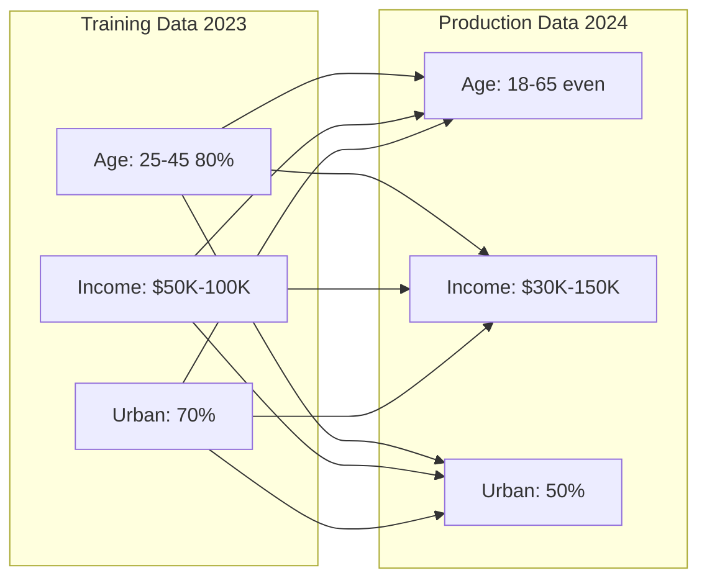
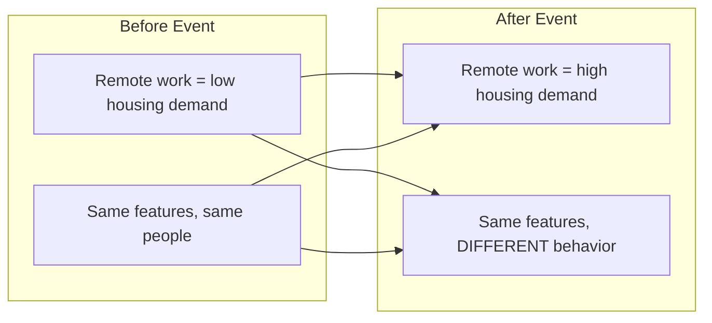

In 2021, a system could still look healthy on conventional uptime, latency, and error dashboards while the model's business decisions were degrading. 

But beneath those reassuring metrics, a catastrophic algorithmic failure was unfolding. The machine learning model had been meticulously trained on historical housing market data, learning intricate patterns regarding location, square footage, school districts, and pricing. It ingested features and spat out purchasing prices, driving Zillow to buy thousands of homes. When market conditions changed abruptly, the historical patterns the model relied on no longer held. The model, however, possessed no awareness of this paradigm shift. It simply continued executing its primary function, purchasing houses at fundamentally flawed valuations.

The failure led Zillow to wind down Zillow Offers, take major write-downs, and cut a large share of staff. This disaster was not caused by a software crash or an infrastructure outage; it was caused by a profound failure in machine learning monitoring. The model never threw an exception. It simply failed silently, highlighting the critical difference between monitoring software execution and monitoring algorithmic cognition.

## What You'll Be Able to Do

By the end of this module, you will be able to:
- Design robust observability architectures capable of detecting silent ML failures in production environments.
- Diagnose and differentiate between covariate shift (data drift) and relationship shift (concept drift) using statistical methods.
- Implement actionable explainability frameworks (SHAP, LIME) to trace degraded predictions back to specific feature variations.
- Evaluate model fairness and demographic parity across critical sub-populations to prevent biased outcomes.
- Implement comprehensive model governance and audit logging systems that satisfy stringent regulatory frameworks.

## The Foundations of ML Observability

To understand why traditional monitoring is wholly inadequate for machine learning systems, we must analyze the fundamental differences in failure modes. A traditional REST API either returns a valid JSON response or a 500 Internal Server Error. An ML prediction API will happily return a perfectly formatted 200 OK response containing a prediction that is completely, dangerously wrong. 

```text
TRADITIONAL SOFTWARE              ML SYSTEMS
==================               ==========

Fail loud                        Fail silent
Crash = Alert                    Wrong prediction = ???
Deterministic                    Probabilistic
Code doesn't change              Data changes constantly
Binary: works/broken             Gradual degradation
```

Monitoring a production ML model requires a multi-layered approach that tracks the infrastructure, the data distributions, the prediction confidence, and the eventual ground truth. This necessitates an architecture that captures data at various lifecycle stages and funnels it into specialized monitoring engines.

```text
┌─────────────────────────────────────────────────────────────────────────┐
│                    ML MONITORING ARCHITECTURE                            │
├─────────────────────────────────────────────────────────────────────────┤
│                                                                          │
│   DATA LAYER                                                             │
│   ┌─────────────┐  ┌─────────────┐  ┌─────────────┐                    │
│   │  Input Data │  │ Predictions │  │Ground Truth │                    │
│   │  Features   │  │   Outputs   │  │  (delayed)  │                    │
│   └──────┬──────┘  └──────┬──────┘  └──────┬──────┘                    │
│          │               │               │                              │
│          └───────────────┼───────────────┘                              │
│                          │                                              │
│   MONITORING LAYER       ▼                                              │
│   ┌─────────────────────────────────────────────────────────┐          │
│   │                 ML MONITORING                            │          │
│   │  ┌─────────┐  ┌─────────┐  ┌─────────┐  ┌─────────┐    │          │
│   │  │  Data   │  │ Model   │  │Concept  │  │ System  │    │          │
│   │  │  Drift  │  │ Perf    │  │ Drift   │  │ Metrics │    │          │
│   │  └─────────┘  └─────────┘  └─────────┘  └─────────┘    │          │
│   └─────────────────────────────────────────────────────────┘          │
│                          │                                              │
│   ALERTING LAYER         ▼                                              │
│   ┌─────────────────────────────────────────────────────────┐          │
│   │  Prometheus → Alertmanager → PagerDuty/Slack/Email      │          │
│   └─────────────────────────────────────────────────────────┘          │
│                          │                                              │
│   VISUALIZATION          ▼                                              │
│   ┌─────────────────────────────────────────────────────────┐          │
│   │  Grafana Dashboards │ Evidently Reports │ Custom UIs    │          │
│   └─────────────────────────────────────────────────────────┘          │
│                                                                          │
└─────────────────────────────────────────────────────────────────────────┘
```

For modern implementations, we conceptualize this architecture using native state flows. Below is the Mermaid representation of the monitoring pipeline:

```mermaid
flowchart TD
    subgraph Data Layer
        ID[Input Data: Features]
        P[Predictions: Outputs]
        GT[Ground Truth: Delayed]
    end

    subgraph Monitoring Layer
        ML[ML MONITORING ENGINE]
        DD[Data Drift]
        MP[Model Perf]
        CD[Concept Drift]
        SM[System Metrics]
        ML --- DD & MP & CD & SM
    end

    subgraph Alerting Layer
        AL[Prometheus → Alertmanager → PagerDuty/Slack]
    end

    subgraph Visualization
        V[Grafana Dashboards | Evidently | Custom UI]
    end

    ID --> ML
    P --> ML
    GT --> ML
    ML --> AL
    AL --> V
```

> **Did You Know?** In 2012, Knight Capital Group lost $440 million in exactly 45 minutes due to an automated algorithmic malfunction. The system lacked comprehensive boundary monitoring, and by the time human operators diagnosed the erratic trading volume, the company was fundamentally crippled. This event remains a foundational cautionary tale for algorithmic boundary enforcement.

## Diagnosing Drift Types

Drift is the silent killer of ML models. It occurs when the statistical properties of the environment change over time, rendering the model's learned weights obsolete. We classify drift into three distinct categories, each requiring different detection strategies.

### Data Drift (Covariate Shift)

Data drift occurs when the input feature distributions change, even if the underlying relationship between those features and the target variable remains identical. For example, a credit scoring model might suddenly receive applications from a completely different geographic demographic than it was trained on.

```text
DATA DRIFT EXAMPLE
==================

Training Data (2023):              Production Data (2024):
┌────────────────────┐            ┌────────────────────┐
│ Age: 25-45 (80%)   │            │ Age: 18-65 (even)  │
│ Income: $50K-100K  │    →       │ Income: $30K-150K  │
│ Urban: 70%         │            │ Urban: 50%         │
└────────────────────┘            └────────────────────┘

The model learned from a specific population.
Now it sees a different population.
May still work, but performance likely degraded.
```



### Concept Drift

Concept drift is far more insidious. It occurs when the fundamental relationship between the input features and the target variable shifts. The inputs might look exactly the same, but they now mean something entirely different.

```text
CONCEPT DRIFT EXAMPLE
=====================

Before COVID-19:                   After COVID-19:
┌────────────────────┐            ┌────────────────────┐
│ Remote work = low  │            │ Remote work = high │
│ housing demand     │    →       │ housing demand     │
│                    │            │                    │
│ Same features,     │            │ Same features,     │
│ same people        │            │ DIFFERENT behavior │
└────────────────────┘            └────────────────────┘

The world changed. Same inputs now mean different things.
```



> **Did You Know?** The formal academic definition of "concept drift" was introduced in 1996 by researchers Gerhard Widmer and Miroslav Kubat in their seminal paper "Learning in the Presence of Concept Drift and Hidden Contexts." The concept was established in the academic literature long before it became common language in production ML practice.

### Prediction Drift

Prediction drift focuses purely on the output space. If your binary classification model historically predicted a 15% positive rate, and suddenly begins predicting a 40% positive rate, the output distribution has drifted.

```python
# Detecting prediction drift
def detect_prediction_drift(
    reference_predictions: np.ndarray,
    current_predictions: np.ndarray,
    threshold: float = 0.05
) -> dict:
    """
    Detect if prediction distribution has shifted.
    Uses Kolmogorov-Smirnov test.
    """
    from scipy import stats

    statistic, p_value = stats.ks_2samp(
        reference_predictions,
        current_predictions
    )

    return {
        "statistic": statistic,
        "p_value": p_value,
        "drift_detected": p_value < threshold,
        "reference_mean": np.mean(reference_predictions),
        "current_mean": np.mean(current_predictions),
        "reference_std": np.std(reference_predictions),
        "current_std": np.std(current_predictions)
    }
```

### Statistical Detection Methods

To mathematically prove that drift has occurred, MLOps engineers rely on several core algorithms to compare production distributions against training baselines.

#### Population Stability Index (PSI)

PSI is a common heuristic for quantifying how much a population has shifted over time.

```python
def calculate_psi(
    reference: np.ndarray,
    current: np.ndarray,
    bins: int = 10
) -> float:
    """
    Calculate Population Stability Index.

    PSI < 0.1: No significant change
    PSI 0.1-0.25: Moderate change, investigate
    PSI > 0.25: Significant change, action required
    """
    # Create bins from reference data
    _, bin_edges = np.histogram(reference, bins=bins)

    # Calculate percentages in each bin
    ref_percents = np.histogram(reference, bins=bin_edges)[0] / len(reference)
    cur_percents = np.histogram(current, bins=bin_edges)[0] / len(current)

    # Avoid division by zero
    ref_percents = np.clip(ref_percents, 0.0001, 1)
    cur_percents = np.clip(cur_percents, 0.0001, 1)

    # PSI formula
    psi = np.sum((cur_percents - ref_percents) * np.log(cur_percents / ref_percents))

    return psi
```

#### Kolmogorov-Smirnov Test

The KS test is a non-parametric test that compares the cumulative distributions of two distinct datasets, seeking the maximum absolute distance between them.

```python
def ks_drift_test(
    reference: np.ndarray,
    current: np.ndarray,
    alpha: float = 0.05
) -> dict:
    """
    Kolmogorov-Smirnov test for distribution comparison.
    """
    from scipy import stats

    statistic, p_value = stats.ks_2samp(reference, current)

    return {
        "statistic": statistic,
        "p_value": p_value,
        "drift_detected": p_value < alpha,
        "interpretation": (
            "Distributions are different" if p_value < alpha
            else "No significant difference"
        )
    }
```

#### Jensen-Shannon Divergence

Unlike Kullback-Leibler (KL) divergence, JS divergence is [symmetric and typically yields a finite value in a bounded range](https://en.wikipedia.org/wiki/Jensen%E2%80%93Shannon_divergence), making it exceptionally reliable for automated monitoring pipelines.

```python
def js_divergence(
    reference: np.ndarray,
    current: np.ndarray,
    bins: int = 50
) -> float:
    """
    Jensen-Shannon Divergence - symmetric measure of distribution difference.

    JS = 0: Identical distributions
    JS = 1: Completely different distributions
    """
    from scipy.spatial.distance import jensenshannon

    # Create histograms (probability distributions)
    all_data = np.concatenate([reference, current])
    _, bin_edges = np.histogram(all_data, bins=bins)

    ref_hist = np.histogram(reference, bins=bin_edges, density=True)[0]
    cur_hist = np.histogram(current, bins=bin_edges, density=True)[0]

    # Normalize
    ref_hist = ref_hist / ref_hist.sum()
    cur_hist = cur_hist / cur_hist.sum()

    return jensenshannon(ref_hist, cur_hist)
```

> **Pause and predict**: If you train a machine learning model to optimize logistics routes based on historical weather patterns, and an unprecedented massive hurricane occurs, drastically altering road availability, which specific type of drift will your model experience first? Why?

## Performance Metrics and Explainability

Once you identify drift, the next imperative is proving how much performance has actually degraded. You must track performance metrics dynamically over rolling intervals.

```text
CLASSIFICATION METRICS
======================

Metric          Formula                         When to Use
──────────────────────────────────────────────────────────────
Accuracy        (TP + TN) / Total              Balanced classes
Precision       TP / (TP + FP)                 Cost of FP is high
Recall          TP / (TP + FN)                 Cost of FN is high
F1 Score        2 * (P * R) / (P + R)          Imbalanced classes
AUC-ROC         Area under ROC curve           Ranking quality
Log Loss        -Σ y*log(p)                    Probability quality


REGRESSION METRICS
==================

Metric          Formula                         Interpretation
──────────────────────────────────────────────────────────────
MAE             |y - ŷ| / n                    Average error magnitude
RMSE            √(Σ(y - ŷ)² / n)               Penalizes large errors
MAPE            |y - ŷ| / y * 100              Percentage error
R²              1 - SS_res / SS_tot            Variance explained
```

### Sliding Window Monitoring

Because production systems operate on continuous streams of incoming requests rather than static batch files, performance must be calculated over sliding windows. This ensures transient spikes do not permanently skew the aggregate performance metric.

```python
class SlidingWindowMonitor:
    """
    Monitor metrics over sliding time windows.
    """

    def __init__(self, window_size: int = 1000, alert_threshold: float = 0.1):
        self.window_size = window_size
        self.alert_threshold = alert_threshold
        self.predictions = []
        self.actuals = []
        self.baseline_accuracy = None

    def add_prediction(self, prediction: float, actual: float):
        """Add a new prediction-actual pair."""
        self.predictions.append(prediction)
        self.actuals.append(actual)

        # Keep only window_size recent samples
        if len(self.predictions) > self.window_size:
            self.predictions.pop(0)
            self.actuals.pop(0)

    def set_baseline(self):
        """Set current performance as baseline."""
        self.baseline_accuracy = self.calculate_accuracy()

    def calculate_accuracy(self) -> float:
        """Calculate accuracy over current window."""
        if not self.predictions:
            return 0.0

        correct = sum(
            1 for p, a in zip(self.predictions, self.actuals)
            if (p > 0.5) == (a > 0.5)
        )
        return correct / len(self.predictions)

    def check_degradation(self) -> dict:
        """Check if model performance has degraded."""
        current_accuracy = self.calculate_accuracy()

        if self.baseline_accuracy is None:
            return {"status": "no_baseline", "current_accuracy": current_accuracy}

        degradation = self.baseline_accuracy - current_accuracy

        return {
            "baseline_accuracy": self.baseline_accuracy,
            "current_accuracy": current_accuracy,
            "degradation": degradation,
            "alert": degradation > self.alert_threshold,
            "message": (
                f"ALERT: Accuracy dropped by {degradation:.2%}"
                if degradation > self.alert_threshold
                else "Performance within acceptable range"
            )
        }
```

> **Did You Know?** At large scale, recommendation systems often track many business and model-health metrics, and even small regressions can matter materially.

### Explainability Frameworks

Detecting a failure is only the first step. Diagnosing the exact feature responsible for the failure is where explainability comes in. You cannot effectively debug an algorithmic black box without tools like SHAP or LIME.

#### SHAP (SHapley Additive exPlanations)

SHAP relies on [cooperative game theory](https://arxiv.org/abs/1705.07874) to distribute the "payout" (the final prediction) among the "players" (the input features) fairly.

```python
import shap

def explain_prediction_shap(model, X_sample, feature_names):
    """
    Explain a single prediction using SHAP.
    """
    # Create explainer
    explainer = shap.TreeExplainer(model)  # For tree-based models
    # Or: explainer = shap.KernelExplainer(model.predict, X_background)

    # Get SHAP values
    shap_values = explainer.shap_values(X_sample)

    # Create explanation
    explanation = {
        "base_value": explainer.expected_value,
        "prediction": model.predict(X_sample)[0],
        "feature_contributions": {
            feature_names[i]: shap_values[0][i]
            for i in range(len(feature_names))
        }
    }

    # Sort by absolute contribution
    sorted_contributions = sorted(
        explanation["feature_contributions"].items(),
        key=lambda x: abs(x[1]),
        reverse=True
    )

    explanation["top_features"] = sorted_contributions[:5]

    return explanation

# Example output:
# {
#     "base_value": 0.35,
#     "prediction": 0.82,
#     "top_features": [
#         ("credit_score", 0.25),
#         ("income", 0.15),
#         ("age", -0.08),
#         ("employment_years", 0.12),
#         ("debt_ratio", 0.03)
#     ]
# }
```

#### LIME (Local Interpretable Model-agnostic Explanations)

LIME operates by generating a new, localized dataset around the target prediction and [fitting a simpler, inherently interpretable linear model](https://arxiv.org/abs/1602.04938) to approximate the complex model's behavior in that specific hyperspace.

```python
from lime.lime_tabular import LimeTabularExplainer

def explain_prediction_lime(model, X_train, X_sample, feature_names):
    """
    Explain a single prediction using LIME.
    """
    explainer = LimeTabularExplainer(
        X_train,
        feature_names=feature_names,
        class_names=['negative', 'positive'],
        mode='classification'
    )

    explanation = explainer.explain_instance(
        X_sample,
        model.predict_proba,
        num_features=10
    )

    return {
        "prediction": model.predict_proba([X_sample])[0],
        "explanation": explanation.as_list(),
        "local_model_r2": explanation.score
    }
```

> **Stop and think**: You are deploying a Kubernetes v1.35 cluster to run Prometheus and Grafana for your ML models. If your predictions suddenly start taking 800ms instead of 50ms, but the mathematical accuracy remains stable at 95%, what downstream business metrics might be quietly degrading as a result of this latency?

## Alerting, Runbooks, and Governance

A monitoring system without effective alerting is merely a data graveyard. Implementing robust instrumentation requires exporting metrics into specialized time-series databases like Prometheus.

### Prometheus Metric Definitions

```python
from prometheus_client import Counter, Histogram, Gauge, start_http_server

# Define metrics
PREDICTION_COUNTER = Counter(
    'ml_predictions_total',
    'Total number of predictions',
    ['model_name', 'model_version']
)

PREDICTION_LATENCY = Histogram(
    'ml_prediction_latency_seconds',
    'Prediction latency in seconds',
    ['model_name'],
    buckets=[0.01, 0.025, 0.05, 0.1, 0.25, 0.5, 1.0]
)

MODEL_ACCURACY = Gauge(
    'ml_model_accuracy',
    'Current model accuracy (rolling window)',
    ['model_name', 'model_version']
)

DRIFT_SCORE = Gauge(
    'ml_drift_score',
    'Current drift score (PSI)',
    ['model_name', 'feature_name']
)

class PrometheusMLMonitor:
    """
    Export ML metrics to Prometheus.
    """

    def __init__(self, model_name: str, model_version: str, port: int = 8000):
        self.model_name = model_name
        self.model_version = model_version
        start_http_server(port)

    def record_prediction(self, latency_seconds: float):
        """Record a prediction."""
        PREDICTION_COUNTER.labels(
            model_name=self.model_name,
            model_version=self.model_version
        ).inc()

        PREDICTION_LATENCY.labels(
            model_name=self.model_name
        ).observe(latency_seconds)

    def update_accuracy(self, accuracy: float):
        """Update rolling accuracy gauge."""
        MODEL_ACCURACY.labels(
            model_name=self.model_name,
            model_version=self.model_version
        ).set(accuracy)

    def update_drift_score(self, feature_name: str, psi: float):
        """Update drift score for a feature."""
        DRIFT_SCORE.labels(
            model_name=self.model_name,
            feature_name=feature_name
        ).set(psi)
```

### Alert Rules configuration

We translate our business tolerances into mathematical Prometheus PromQL queries that trigger Alertmanager.

```yaml
# prometheus_alerts.yml
groups:
  - name: ml_alerts
    rules:
      - alert: ModelAccuracyDrop
        expr: ml_model_accuracy < 0.85
        for: 5m
        labels:
          severity: warning
        annotations:
          summary: "Model accuracy dropped below 85%"
          description: "Model {{ $labels.model_name }} accuracy is {{ $value }}"

      - alert: HighPredictionLatency
        expr: histogram_quantile(0.95, ml_prediction_latency_seconds_bucket) > 0.5
        for: 2m
        labels:
          severity: warning
        annotations:
          summary: "P95 latency exceeds 500ms"

      - alert: DataDriftDetected
        expr: ml_drift_score > 0.25
        for: 10m
        labels:
          severity: critical
        annotations:
          summary: "Significant data drift detected"
          description: "Feature {{ $labels.feature_name }} PSI is {{ $value }}"

      - alert: PredictionVolumeAnomaly
        expr: |
          abs(
            rate(ml_predictions_total[5m])
            - rate(ml_predictions_total[1h] offset 1d)
          ) / rate(ml_predictions_total[1h] offset 1d) > 0.5
        for: 10m
        labels:
          severity: warning
        annotations:
          summary: "Unusual prediction volume detected"
```

### Governance and Compliance

With increasing regulatory scrutiny, model governance is no longer optional. Deployments must be documented via Model Cards, and every state change must be audited.

> **Did You Know?** The European Union's AI Act, formalized in 2024, enforces strict regulations on high-risk algorithmic systems. Non-compliance regarding audit logging, monitoring, and transparency can result in fines up to 35 million EUR, or 7% of the offending company's global annual revenue.

#### The Model Card

```python
@dataclass
class ModelCard:
    """
    Model documentation for governance and transparency.

    Based on Google's Model Cards paper (2019).
    """
    # Basic Info
    name: str
    version: str
    description: str
    owner: str
    created_date: datetime

    # Intended Use
    primary_use_cases: List[str]
    out_of_scope_uses: List[str]
    target_users: List[str]

    # Training Data
    training_data_description: str
    training_data_size: int
    training_data_date_range: Tuple[datetime, datetime]

    # Evaluation
    metrics: Dict[str, float]
    evaluation_data_description: str
    performance_across_groups: Dict[str, Dict[str, float]]

    # Ethical Considerations
    known_limitations: List[str]
    potential_biases: List[str]
    mitigation_strategies: List[str]

    # Deployment
    deployment_environment: str
    monitoring_metrics: List[str]
    update_frequency: str

    def to_markdown(self) -> str:
        """Generate markdown documentation."""
        return f"""
# Model Card: {self.name}

## Overview
- **Version**: {self.version}
- **Owner**: {self.owner}
- **Created**: {self.created_date.strftime('%Y-%m-%d')}

## Description
{self.description}

## Intended Use
### Primary Use Cases
{chr(10).join(f'- {use}' for use in self.primary_use_cases)}

### Out of Scope
{chr(10).join(f'- {use}' for use in self.out_of_scope_uses)}

## Training Data
{self.training_data_description}
- Size: {self.training_data_size:,} samples

## Performance Metrics
{chr(10).join(f'- **{k}**: {v:.4f}' for k, v in self.metrics.items())}

## Known Limitations
{chr(10).join(f'- {lim}' for lim in self.known_limitations)}

## Ethical Considerations
### Potential Biases
{chr(10).join(f'- {bias}' for bias in self.potential_biases)}

### Mitigation Strategies
{chr(10).join(f'- {strat}' for strat in self.mitigation_strategies)}
"""
```

#### The Audit Trail

```python
@dataclass
class AuditEvent:
    """Single audit event for model governance."""
    timestamp: datetime
    event_type: str  # trained, deployed, predictions, retrained, retired
    model_name: str
    model_version: str
    actor: str  # who triggered the event
    details: Dict[str, Any]

class ModelAuditLog:
    """
    Maintain audit trail for model governance.
    """

    def __init__(self, storage_path: Path):
        self.storage_path = storage_path
        self.events: List[AuditEvent] = []

    def log_event(
        self,
        event_type: str,
        model_name: str,
        model_version: str,
        actor: str,
        details: Dict = None
    ):
        """Log an audit event."""
        event = AuditEvent(
            timestamp=datetime.now(),
            event_type=event_type,
            model_name=model_name,
            model_version=model_version,
            actor=actor,
            details=details or {}
        )
        self.events.append(event)
        self._persist(event)

    def _persist(self, event: AuditEvent):
        """Persist event to storage."""
        log_file = self.storage_path / f"audit_{datetime.now().strftime('%Y%m')}.jsonl"
        with open(log_file, 'a') as f:
            f.write(json.dumps(asdict(event), default=str) + '\n')

    def query(
        self,
        model_name: str = None,
        event_type: str = None,
        start_date: datetime = None,
        end_date: datetime = None
    ) -> List[AuditEvent]:
        """Query audit events."""
        results = self.events

        if model_name:
            results = [e for e in results if e.model_name == model_name]
        if event_type:
            results = [e for e in results if e.event_type == event_type]
        if start_date:
            results = [e for e in results if e.timestamp >= start_date]
        if end_date:
            results = [e for e in results if e.timestamp <= end_date]

        return results
```

### Runbooks and Thresholding

Never configure an alert without explicitly linking it to an actionable runbook.

```markdown
# Model Degradation Runbook

## Alert: ModelAccuracyDrop

### Severity: Warning (< 85% accuracy)

### Immediate Actions:
1. Check recent prediction volume (unusual traffic?)
2. Check input data drift dashboard
3. Check recent deployments (new model version?)

### Investigation:
1. Compare feature distributions: current vs training
2. Check for concept drift in specific segments
3. Review recent ground truth labels

### Remediation Options:
1. Roll back to previous model version
2. Increase traffic to shadow model for comparison
3. Trigger model retraining pipeline
4. Escalate to ML team if >10% degradation

### Escalation:
- Warning: ML team Slack channel
- Critical: PagerDuty on-call
```

```python
# Don't alert on every fluctuation
DRIFT_THRESHOLDS = {
    "psi_warning": 0.1,      # Investigate
    "psi_critical": 0.25,    # Action required

    "accuracy_warning": 0.05,  # 5% drop from baseline
    "accuracy_critical": 0.10, # 10% drop from baseline

    "latency_p95_warning": 200,   # ms
    "latency_p95_critical": 500,  # ms
}

# Use sliding windows to smooth noise
MONITORING_WINDOWS = {
    "latency": "5m",      # Fast-changing
    "accuracy": "1h",     # Slower-changing
    "drift": "1d",        # Slowest-changing
}
```

```python
def check_monitoring_health(monitoring_system) -> dict:
    """
    Meta-monitoring: ensure your monitoring is working.
    Run this daily.
    """
    health = {
        'baseline_age_days': (datetime.now() - monitoring_system.baseline_created).days,
        'last_check_hours_ago': (datetime.now() - monitoring_system.last_check).total_seconds() / 3600,
        'features_monitored': len(monitoring_system.monitored_features),
        'features_in_model': len(monitoring_system.model_features),
        'coverage_percent': len(monitoring_system.monitored_features) / len(monitoring_system.model_features) * 100,
        'alerts_last_30_days': monitoring_system.count_alerts(days=30),
        'alerts_acted_on': monitoring_system.count_acknowledged_alerts(days=30)
    }

    # Calculate health score
    issues = []
    if health['baseline_age_days'] > 90:
        issues.append('Baseline is stale (>90 days)')
    if health['last_check_hours_ago'] > 24:
        issues.append('Monitoring check is overdue')
    if health['coverage_percent'] < 100:
        issues.append(f"Only {health['coverage_percent']:.0f}% of features monitored")
    if health['alerts_last_30_days'] > 0 and health['alerts_acted_on'] == 0:
        issues.append('Alerts are being ignored')

    health['issues'] = issues
    health['healthy'] = len(issues) == 0

    return health
```

### Best Practices Checklist

```text
WHAT TO MONITOR
===============

Input Data:
  □ Feature distributions (per feature)
  □ Missing value rates
  □ Outlier rates
  □ Volume/throughput

Model Outputs:
  □ Prediction distribution
  □ Confidence distribution
  □ Prediction latency
  □ Error rates

Performance (when labels available):
  □ Accuracy/F1/AUC (classification)
  □ MAE/RMSE (regression)
  □ Performance by segment

System:
  □ CPU/Memory/GPU utilization
  □ Request latency
  □ Error rates
  □ Queue depths
```

### ML Monitoring Tools Comparison

```text
┌────────────────┬─────────────┬─────────────┬─────────────┬─────────────┐
│    Tool        │   Drift     │   Metrics   │   Alerts    │   Cost      │
├────────────────┼─────────────┼─────────────┼─────────────┼─────────────┤
│ Evidently      │  Built-in │  ML+sys   │ ️ Basic    │ Free/OS     │
│ WhyLabs        │  Advanced │  ML-focus │  Built-in │ Free tier   │
│ Arize          │  Advanced │  ML-focus │  Built-in │ Paid        │
│ Fiddler        │  Built-in │  ML-focus │  Built-in │ Paid        │
│ MLflow         │ ️ Basic    │  ML-focus │  Manual   │ Free/OS     │
│ Prometheus     │  Manual   │  System   │  Built-in │ Free/OS     │
│ Datadog        │ ️ Manual   │  System   │  Built-in │ Paid        │
└────────────────┴─────────────┴─────────────┴─────────────┴─────────────┘

Recommendation:
- Start: begin with a simple open-source stack for metrics, dashboards, and basic model checks, and verify current licensing before choosing named tools.
- Scale: add a dedicated managed ML observability platform when you need richer drift, alerting, and governance workflows.
- Enterprise: compare commercial observability platforms against your governance, security, integration, and support requirements.
```

| Approach | Annual Cost | Pros | Cons |
|----------|-------------|------|------|
| Open source | Significant internal engineering time | Full control, no vendor lock-in | Meaningful operational overhead |
| Managed platform | Higher recurring spend than self-hosted tools | Faster setup, advanced features | Vendor dependency and data-handling tradeoffs |
| Cloud-native | Costs vary with usage and cloud provider | Integrated with the surrounding ML platform | Less flexible and potentially more locking to one cloud |
| Enterprise | Often priced for larger organizations and heavier governance needs | Compliance features and support | May be overkill for smaller teams |

### The Economics of Observability

| Scenario | Monitoring Cost | Potential Failure Cost | ROI |
|----------|----------------|----------------------|-----|
| E-commerce recommendations | Monitoring spend is often much smaller than the revenue impact of degraded recommendations |
| Fraud detection | The cost of missed monitoring can far exceed the cost of running the monitoring itself |
| Healthcare risk scoring | In regulated settings, monitoring can reduce large operational and compliance risks |
| Trading algorithms | For high-speed trading systems, weak monitoring can lead to outsized losses very quickly |

| Without Monitoring | With Monitoring |
|-------------------|-----------------|
| Model drift undetected for 3 months | Drift detected within hours |
| $5M in fraudulent transactions approved | $50K in fraud before alert |
| 2 weeks to diagnose root cause | 2 hours to diagnose |
| Customer trust damaged | Rapid response preserves trust |
| Regulatory scrutiny | Audit trail demonstrates diligence |

## Common Mistakes

| Mistake | Why It Fails | How To Fix |
|---|---|---|
| **Monitoring Averages** | A 90% overall accuracy often hides 50% accuracy on minority segments, causing silent disparate impact. | Isolate and monitor metrics by demographic, device type, or critical cohort bounds. |
| **Static Thresholds** | Hardcoded logic triggers excessive alert fatigue due to standard weekend/holiday seasonal variance. | Use dynamic thresholding against a sliding historical baseline standard deviation. |
| **Ignoring Label Delay** | Real-time accuracy drops cannot be detected if ground truth is permanently delayed by 30 days. | Construct intermediate proxy metrics or track prediction drift as a real-time warning. |
| **Alerts Without Runbooks** | On-call engineers waste critical response time debugging rather than executing a unified remediation plan. | Attach hyperlinked, actionable operational runbooks to every Prometheus firing alert. |
| **Skipping Baseline Generation** | Mathematical divergence formulas cannot function without a highly precise frozen artifact to compare against. | Mandate baseline statistical generation within your core continuous integration pipeline. |
| **Monitoring Only Outputs** | Evaluating only predictions masks feature degradation, meaning the model might be right for the wrong reasons. | Track upstream feature distributions concurrently with downstream prediction outputs. |
| **Omitting K8s Limits** | Memory-intensive pandas/numpy monitoring scripts can consume unbounded resources, causing OutOfMemory node panics. | Explicitly define `resources.limits` for both CPU and memory in your Kubernetes v1.35 YAMLs. |

### Mistake Context: Code Implementations

```python
#  WRONG - Average hides problems
def monitor_accuracy_wrong(predictions, actuals):
    accuracy = sum(p == a for p, a in zip(predictions, actuals)) / len(predictions)
    if accuracy > 0.85:
        return "OK"  # But what if accuracy is 99% for easy cases and 50% for hard cases?

#  RIGHT - Monitor distributions and segments
def monitor_accuracy_right(predictions, actuals, segments):
    results = {}
    for segment in set(segments):
        mask = [s == segment for s in segments]
        segment_preds = [p for p, m in zip(predictions, mask) if m]
        segment_actuals = [a for a, m in zip(actuals, mask) if m]
        results[segment] = {
            'accuracy': sum(p == a for p, a in zip(segment_preds, segment_actuals)) / len(segment_preds),
            'volume': len(segment_preds),
            'false_positive_rate': calculate_fpr(segment_preds, segment_actuals),
            'false_negative_rate': calculate_fnr(segment_preds, segment_actuals)
        }
    return results
```

```python
#  WRONG - Static thresholds don't adapt
DRIFT_THRESHOLD = 0.1  # PSI threshold
if calculate_psi(current, baseline) > DRIFT_THRESHOLD:
    send_alert()  # Alert fatigue when seasonal patterns exist

#  RIGHT - Dynamic thresholds based on historical variance
class AdaptiveThreshold:
    def __init__(self, baseline_period_days=30):
        self.historical_psi = []
        self.baseline_period = baseline_period_days

    def add_observation(self, psi):
        self.historical_psi.append(psi)
        # Keep only recent history
        if len(self.historical_psi) > self.baseline_period:
            self.historical_psi.pop(0)

    def get_threshold(self, sensitivity=2.0):
        if len(self.historical_psi) < 7:
            return 0.1  # Default until we have history
        mean = np.mean(self.historical_psi)
        std = np.std(self.historical_psi)
        return mean + (sensitivity * std)  # Alert on anomalies, not absolute values
```

```python
#  WRONG - Assuming ground truth is available immediately
def calculate_realtime_accuracy(predictions, actuals):
    return accuracy_score(predictions, actuals)  # What if actuals are delayed?

#  RIGHT - Account for label delay
class DelayedGroundTruthMonitor:
    def __init__(self, expected_delay_hours=24):
        self.predictions = {}  # id -> (prediction, timestamp)
        self.expected_delay = timedelta(hours=expected_delay_hours)

    def record_prediction(self, prediction_id, prediction, timestamp):
        self.predictions[prediction_id] = (prediction, timestamp)

    def record_ground_truth(self, prediction_id, actual, timestamp):
        if prediction_id in self.predictions:
            pred, pred_time = self.predictions[prediction_id]
            delay = timestamp - pred_time
            # Track both accuracy AND delay
            return {
                'correct': pred == actual,
                'delay_hours': delay.total_seconds() / 3600,
                'delay_anomaly': delay > self.expected_delay * 2
            }

    def get_accuracy_by_delay_bucket(self):
        # Group accuracy by how long ground truth took
        # Useful for understanding label quality issues
        pass
```

## Interview Preparation

### Question 1: "Your model's accuracy dropped 5% overnight. Walk me through your debugging process."

```python
# Check feature distributions
current_stats = production_data.describe()
baseline_stats = training_data.describe()
drift_report = compare_distributions(current_stats, baseline_stats)

# Check prediction distribution
pred_distribution = predictions.value_counts(normalize=True)
# Is the model predicting one class way more than usual?

# Check by segment
for segment in ['new_users', 'power_users', 'mobile', 'desktop']:
    segment_accuracy = calculate_accuracy(segment_filter)
    print(f'{segment}: {segment_accuracy}')
```

### Question 2: "How would you monitor a model for fairness in production?"

```python
def monitor_fairness(predictions, actuals, protected_attribute):
    groups = set(protected_attribute)
    metrics = {}

    for group in groups:
        mask = protected_attribute == group
        metrics[group] = {
            'positive_rate': predictions[mask].mean(),
            'tpr': recall_score(actuals[mask], predictions[mask]),
            'fpr': false_positive_rate(actuals[mask], predictions[mask]),
        }

    # Calculate disparity ratios
    groups_list = list(groups)
    disparity = metrics[groups_list[0]]['positive_rate'] / metrics[groups_list[1]]['positive_rate']

    return {
        'group_metrics': metrics,
        'demographic_parity_ratio': disparity,
        'alert': disparity < 0.8 or disparity > 1.25  # 80% rule
    }
```

### Question 3: "How do you balance comprehensive monitoring with alert fatigue?"

```yaml
# Level 1: Informational (logged, no notification)
- Minor drift (PSI 0.05-0.1)
- Latency increase <50%
- Volume changes <20%

# Level 2: Warning (Slack, business hours only)
- Moderate drift (PSI 0.1-0.2)
- Accuracy drop 2-5%
- Anomalous segments

# Level 3: Critical (PagerDuty, immediate)
- Severe drift (PSI >0.25)
- Accuracy drop >5%
- Complete model failure
- Data pipeline down
```

## End-to-End Implementation Guide

To securely tie these concepts together, execute the following implementation path:

```python
# Capture baseline statistics during training
def create_baseline(training_data: pd.DataFrame, model, feature_names: list) -> dict:
    """
    Create baseline statistics for all features and predictions.
    Run this after training, before deployment.
    """
    baseline = {
        'created_at': datetime.now().isoformat(),
        'sample_size': len(training_data),
        'features': {},
        'predictions': {}
    }

    # Feature baselines
    for feature in feature_names:
        col = training_data[feature]
        baseline['features'][feature] = {
            'mean': float(col.mean()),
            'std': float(col.std()),
            'min': float(col.min()),
            'max': float(col.max()),
            'percentiles': {
                '25': float(col.quantile(0.25)),
                '50': float(col.quantile(0.50)),
                '75': float(col.quantile(0.75)),
                '95': float(col.quantile(0.95))
            },
            'histogram': np.histogram(col, bins=50)[0].tolist()
        }

    # Prediction baseline
    preds = model.predict_proba(training_data[feature_names])[:, 1]
    baseline['predictions'] = {
        'mean': float(preds.mean()),
        'std': float(preds.std()),
        'distribution': np.histogram(preds, bins=50)[0].tolist()
    }

    return baseline

# Save baseline alongside model
baseline = create_baseline(X_train, model, feature_names)
with open('model_baseline.json', 'w') as f:
    json.dump(baseline, f)
```

```python
import logging
from datetime import datetime
import json

class InstrumentedPredictor:
    """Predictor that logs everything needed for monitoring."""

    def __init__(self, model, baseline: dict, log_file: str = 'predictions.jsonl'):
        self.model = model
        self.baseline = baseline
        self.log_file = log_file

    def predict(self, features: dict) -> dict:
        """Make prediction and log for monitoring."""
        start_time = datetime.now()

        # Make prediction
        feature_array = np.array([list(features.values())])
        prediction = float(self.model.predict_proba(feature_array)[0, 1])

        latency_ms = (datetime.now() - start_time).total_seconds() * 1000

        # Log for monitoring
        log_entry = {
            'timestamp': datetime.now().isoformat(),
            'prediction_id': str(uuid.uuid4()),
            'features': features,
            'prediction': prediction,
            'latency_ms': latency_ms
        }

        with open(self.log_file, 'a') as f:
            f.write(json.dumps(log_entry) + '\n')

        return {
            'prediction': prediction,
            'prediction_id': log_entry['prediction_id']
        }
```

```python
# monitoring_job.py - Run via cron or Airflow
def run_monitoring_check(baseline_path: str, predictions_path: str, hours: int = 24):
    """
    Check recent predictions against baseline.
    Run this hourly or daily.
    """
    # Load baseline
    with open(baseline_path) as f:
        baseline = json.load(f)

    # Load recent predictions
    cutoff = datetime.now() - timedelta(hours=hours)
    recent_predictions = []
    with open(predictions_path) as f:
        for line in f:
            entry = json.loads(line)
            if datetime.fromisoformat(entry['timestamp']) > cutoff:
                recent_predictions.append(entry)

    if len(recent_predictions) < 100:
        return {'status': 'insufficient_data', 'count': len(recent_predictions)}

    # Check each feature for drift
    alerts = []
    for feature in baseline['features']:
        baseline_hist = baseline['features'][feature]['histogram']
        current_values = [p['features'][feature] for p in recent_predictions]
        current_hist = np.histogram(current_values, bins=50)[0]

        psi = calculate_psi_from_histograms(baseline_hist, current_hist)

        if psi > 0.25:
            alerts.append({
                'type': 'critical_drift',
                'feature': feature,
                'psi': psi
            })
        elif psi > 0.1:
            alerts.append({
                'type': 'warning_drift',
                'feature': feature,
                'psi': psi
            })

    # Send alerts
    for alert in alerts:
        send_alert(alert)

    return {'status': 'complete', 'alerts': alerts}
```

```python
# Export metrics for Grafana
def export_metrics_to_prometheus(monitoring_results: dict, model_name: str):
    """
    Export monitoring results as Prometheus metrics.
    Grafana will scrape these for dashboards.
    """
    from prometheus_client import Gauge

    drift_gauge = Gauge(
        f'{model_name}_feature_drift_psi',
        'PSI drift score by feature',
        ['feature']
    )

    for feature, psi in monitoring_results.get('feature_psi', {}).items():
        drift_gauge.labels(feature=feature).set(psi)
```

## Summary

```text
ML MONITORING ESSENTIALS
========================

DRIFT TYPES:
  Data Drift    → Input distribution changed
  Concept Drift → Input-output relationship changed
  Prediction Drift → Output distribution changed

DETECTION METHODS:
  PSI           → Population Stability Index
  KS Test       → Distribution comparison
  JS Divergence → Symmetric distance measure

EXPLAINABILITY:
  SHAP          → Feature contributions (game theory)
  LIME          → Local linear approximations

GOVERNANCE:
  Model Cards   → Documentation for transparency
  Audit Logs    → Track all model events
  Access Control → Who can deploy/modify

TOOLS:
  Prometheus    → Metrics collection
  Grafana       → Visualization
  Evidently     → ML-specific monitoring
  WhyLabs       → Advanced drift detection

BEST PRACTICES:
   Monitor inputs, outputs, AND performance
   Set thresholds with baselines
   Create runbooks for alerts
   Automate retraining when needed
   Document everything (model cards)
```

## Hands-On Exercises

Before beginning, ensure your local Python environment is prepared with the required data science and ML observability dependencies:

```bash
pip install pandas numpy scipy prometheus-client shap lime scikit-learn
```

The following progressive exercises demand full implementations rather than partial fill-in-the-blank logic. Review the starter templates derived from our standard library, and then consult the fully executable solutions in the toggles below.

### Task 1: Build a Drift Detector

*Starter Template provided in project guidelines:*

```python
class ProductionDriftMonitor:
    """
    Monitor production data for drift against training baseline.
    """

    def __init__(self, baseline_data: pd.DataFrame, alert_threshold: float = 0.1):
        """
        Initialize with baseline (training) data.

        Args:
            baseline_data: DataFrame with training features
            alert_threshold: PSI threshold for alerts
        """
        self.baseline_data = baseline_data
        self.alert_threshold = alert_threshold
        self.feature_names = baseline_data.columns.tolist()
        self.drift_history = []

    def calculate_psi(self, feature: str, production_data: pd.DataFrame) -> float:
        """Calculate PSI for a single feature."""
        # YOUR CODE HERE
        pass

    def check_drift(self, production_data: pd.DataFrame) -> dict:
        """
        Check all features for drift.

        Returns dict with:
        - feature_psi: PSI for each feature
        - drifted_features: list of features exceeding threshold
        - alert_level: 'none', 'warning', or 'critical'
        """
        # YOUR CODE HERE
        pass

    def generate_report(self) -> str:
        """Generate a human-readable drift report."""
        # YOUR CODE HERE
        pass

# Test your implementation
baseline = pd.DataFrame({
    'age': np.random.normal(35, 10, 10000),
    'income': np.random.normal(60000, 20000, 10000),
    'credit_score': np.random.normal(700, 50, 10000)
})

# Simulate drift: production data is different
production = pd.DataFrame({
    'age': np.random.normal(40, 12, 1000),  # Shifted mean
    'income': np.random.normal(60000, 25000, 1000),  # Increased variance
    'credit_score': np.random.normal(680, 60, 1000)  # Shifted and spread
})

monitor = ProductionDriftMonitor(baseline, alert_threshold=0.1)
results = monitor.check_drift(production)
print(monitor.generate_report())
```

<details>
<summary>Task 1 Executable Solution</summary>

```python
import numpy as np
import pandas as pd

class ProductionDriftMonitor:
    def __init__(self, baseline_data: pd.DataFrame, alert_threshold: float = 0.1):
        self.baseline_data = baseline_data
        self.alert_threshold = alert_threshold
        self.feature_names = baseline_data.columns.tolist()
        self.drift_history = []

    def calculate_psi(self, feature: str, production_data: pd.DataFrame) -> float:
        reference = self.baseline_data[feature].values
        current = production_data[feature].values
        bins = 10
        _, bin_edges = np.histogram(reference, bins=bins)
        ref_percents = np.histogram(reference, bins=bin_edges)[0] / len(reference)
        cur_percents = np.histogram(current, bins=bin_edges)[0] / len(current)
        
        # Smooth zero counts
        ref_percents = np.clip(ref_percents, 0.0001, 1)
        cur_percents = np.clip(cur_percents, 0.0001, 1)
        
        psi = np.sum((cur_percents - ref_percents) * np.log(cur_percents / ref_percents))
        return psi

    def check_drift(self, production_data: pd.DataFrame) -> dict:
        results = {'feature_psi': {}, 'drifted_features': [], 'alert_level': 'none'}
        max_psi = 0
        for feature in self.feature_names:
            psi = self.calculate_psi(feature, production_data)
            results['feature_psi'][feature] = psi
            if psi > max_psi:
                max_psi = psi
            if psi > self.alert_threshold:
                results['drifted_features'].append(feature)
                
        if max_psi > 0.25:
            results['alert_level'] = 'critical'
        elif max_psi > self.alert_threshold:
            results['alert_level'] = 'warning'
            
        self.drift_history.append(results)
        return results

    def generate_report(self) -> str:
        if not self.drift_history:
            return "No data processed."
        last = self.drift_history[-1]
        report = f"DRIFT REPORT - Level: {last['alert_level'].upper()}\n"
        for feat, psi in last['feature_psi'].items():
            status = "DRIFT" if psi > self.alert_threshold else "OK"
            report += f"- {feat}: PSI={psi:.4f} [{status}]\n"
        return report

# Testing implementation
baseline = pd.DataFrame({'age': np.random.normal(35, 10, 10000)})
production = pd.DataFrame({'age': np.random.normal(40, 12, 1000)})
monitor = ProductionDriftMonitor(baseline)
monitor.check_drift(production)
print(monitor.generate_report())
```
</details>

### Task 2: Create an ML Monitoring Dashboard

*Starter Template provided in project guidelines:*

```python
from prometheus_client import Counter, Histogram, Gauge, start_http_server
from datetime import datetime

class ModelMonitor:
    """
    Production ML model monitor with Prometheus metrics.
    """

    def __init__(self, model_name: str, model_version: str, port: int = 8000):
        # Define your metrics here
        # YOUR CODE HERE
        pass

    def record_prediction(
        self,
        input_features: dict,
        prediction: float,
        latency_ms: float
    ):
        """Record a single prediction."""
        # YOUR CODE HERE
        pass

    def record_ground_truth(self, prediction_id: str, actual: float):
        """Record ground truth when it becomes available."""
        # YOUR CODE HERE
        pass

    def get_rolling_accuracy(self, window_size: int = 1000) -> float:
        """Calculate accuracy over recent predictions."""
        # YOUR CODE HERE
        pass

    def check_alerts(self) -> list:
        """Check if any alert conditions are met."""
        # YOUR CODE HERE
        pass

# Test your implementation
monitor = ModelMonitor("fraud_detector", "v2.1.0", port=8000)

# Simulate predictions
for i in range(100):
    latency = np.random.exponential(50)
    monitor.record_prediction(
        input_features={'amount': 100 * i, 'merchant': 'test'},
        prediction=np.random.random(),
        latency_ms=latency
    )

# Check for alerts
alerts = monitor.check_alerts()
for alert in alerts:
    print(f"ALERT: {alert}")
```

<details>
<summary>Task 2 Executable Solution</summary>

```python
from prometheus_client import Counter, Histogram, Gauge
from collections import deque
import uuid
import numpy as np

class ModelMonitor:
    def __init__(self, model_name: str, model_version: str, port: int = 8000):
        self.model_name = model_name
        self.pred_counter = Counter('ml_preds', 'Total', ['model'])
        self.latency_hist = Histogram('ml_latency', 'Latency', ['model'])
        self.acc_gauge = Gauge('ml_acc', 'Accuracy', ['model'])
        self.predictions = {}
        self.recent_history = deque(maxlen=1000)
        
    def record_prediction(self, input_features: dict, prediction: float, latency_ms: float):
        self.pred_counter.labels(model=self.model_name).inc()
        self.latency_hist.labels(model=self.model_name).observe(latency_ms)
        pred_id = str(uuid.uuid4())
        self.predictions[pred_id] = prediction
        return pred_id

    def record_ground_truth(self, prediction_id: str, actual: float):
        if prediction_id in self.predictions:
            pred = self.predictions[prediction_id]
            is_correct = int((pred > 0.5) == (actual > 0.5))
            self.recent_history.append(is_correct)
            acc = self.get_rolling_accuracy()
            self.acc_gauge.labels(model=self.model_name).set(acc)
            return True
        return False

    def get_rolling_accuracy(self, window_size: int = 1000) -> float:
        if not self.recent_history: return 1.0
        return sum(self.recent_history) / len(self.recent_history)

    def check_alerts(self) -> list:
        alerts = []
        if self.get_rolling_accuracy() < 0.85:
            alerts.append("CRITICAL: Accuracy below 85%")
        return alerts

# Execution
monitor = ModelMonitor("fraud_detector", "v2.1.0")
for i in range(100):
    pid = monitor.record_prediction({'amount': 100}, np.random.random(), 45)
    monitor.record_ground_truth(pid, np.random.random())

for alert in monitor.check_alerts():
    print(alert)
```
</details>

### Task 3: Implement Model Explainability

*Starter Template provided in project guidelines:*

```python
import shap

class PredictionExplainer:
    """
    Explain individual predictions using SHAP.
    """

    def __init__(self, model, feature_names: list, background_data: np.ndarray):
        """
        Initialize explainer.

        Args:
            model: Trained model with predict() method
            feature_names: List of feature names
            background_data: Sample of training data for SHAP baseline
        """
        # YOUR CODE HERE
        pass

    def explain_prediction(
        self,
        instance: np.ndarray,
        top_n: int = 5
    ) -> dict:
        """
        Explain a single prediction.

        Returns:
        - prediction: Model output
        - base_value: Expected value (average prediction)
        - top_features: Top N contributing features with SHAP values
        - explanation: Human-readable string
        """
        # YOUR CODE HERE
        pass

    def generate_text_explanation(
        self,
        feature_contributions: dict,
        prediction: float
    ) -> str:
        """Generate natural language explanation."""
        # YOUR CODE HERE
        pass

# Test your implementation
from sklearn.ensemble import RandomForestClassifier

# Train a simple model
X_train = np.random.randn(1000, 5)
y_train = (X_train.sum(axis=1) > 0).astype(int)
model = RandomForestClassifier(n_estimators=100)
model.fit(X_train, y_train)

# Create explainer
explainer = PredictionExplainer(
    model,
    feature_names=['f1', 'f2', 'f3', 'f4', 'f5'],
    background_data=X_train[:100]
)

# Explain a prediction
instance = np.array([[0.5, -1.2, 0.3, 0.8, -0.5]])
explanation = explainer.explain_prediction(instance)
print(explanation['explanation'])
```

<details>
<summary>Task 3 Executable Solution</summary>

```python
import shap
import numpy as np
from sklearn.ensemble import RandomForestClassifier

class PredictionExplainer:
    def __init__(self, model, feature_names: list, background_data: np.ndarray):
        self.model = model
        self.feature_names = feature_names
        self.explainer = shap.TreeExplainer(model)

    def explain_prediction(self, instance: np.ndarray, top_n: int = 5) -> dict:
        shap_values = self.explainer.shap_values(instance)
        
        if isinstance(shap_values, list):
            target_class_shap = shap_values[1][0]
            expected_val = self.explainer.expected_value[1]
        else:
            target_class_shap = shap_values[0]
            expected_val = self.explainer.expected_value

        contributions = {self.feature_names[i]: target_class_shap[i] for i in range(len(self.feature_names))}
        sorted_contribs = sorted(contributions.items(), key=lambda x: abs(x[1]), reverse=True)[:top_n]

        pred_val = self.model.predict_proba(instance)[0][1]

        return {
            "prediction": pred_val,
            "base_value": expected_val,
            "top_features": sorted_contribs,
            "explanation": self.generate_text_explanation(dict(sorted_contribs), pred_val)
        }

    def generate_text_explanation(self, feature_contributions: dict, prediction: float) -> str:
        lines = [f"Model predicted probability: {prediction:.2f}"]
        lines.append("Top pushing features:")
        for feat, val in feature_contributions.items():
            direction = "increased" if val > 0 else "decreased"
            lines.append(f"- {feat} {direction} risk by {abs(val):.3f}")
        return "\n".join(lines)

# Execution
X_train = np.random.randn(1000, 5)
y_train = (X_train.sum(axis=1) > 0).astype(int)
model = RandomForestClassifier(n_estimators=100)
model.fit(X_train, y_train)

explainer = PredictionExplainer(model, ['f1', 'f2', 'f3', 'f4', 'f5'], X_train[:100])
instance = np.array([[0.5, -1.2, 0.3, 0.8, -0.5]])
res = explainer.explain_prediction(instance)
print(res['explanation'])
```
</details>

### Task 4: Build a Model Governance System

*Starter Template provided in project guidelines:*

```python
from dataclasses import dataclass
from enum import Enum

class ModelStatus(Enum):
    DRAFT = "draft"
    PENDING_REVIEW = "pending_review"
    APPROVED = "approved"
    DEPLOYED = "deployed"
    DEPRECATED = "deprecated"

@dataclass
class ModelVersion:
    name: str
    version: str
    status: ModelStatus
    metrics: dict
    created_by: str
    created_at: datetime
    approved_by: str = None
    approved_at: datetime = None

class ModelRegistry:
    """
    Model registry with governance controls.
    """

    def __init__(self, required_metrics: list, approval_required: bool = True):
        """
        Initialize registry.

        Args:
            required_metrics: Metrics that must be provided
            approval_required: Whether approval is needed before deployment
        """
        # YOUR CODE HERE
        pass

    def register_model(
        self,
        name: str,
        version: str,
        model_artifact: any,
        metrics: dict,
        created_by: str
    ) -> ModelVersion:
        """Register a new model version."""
        # YOUR CODE HERE
        pass

    def submit_for_review(self, name: str, version: str) -> bool:
        """Submit model for approval review."""
        # YOUR CODE HERE
        pass

    def approve_model(
        self,
        name: str,
        version: str,
        approved_by: str,
        comments: str = ""
    ) -> bool:
        """Approve a model for deployment."""
        # YOUR CODE HERE
        pass

    def deploy_model(self, name: str, version: str) -> bool:
        """Deploy an approved model."""
        # YOUR CODE HERE
        pass

    def get_audit_log(self, name: str = None) -> list:
        """Get audit trail for models."""
        # YOUR CODE HERE
        pass

# Test your implementation
registry = ModelRegistry(
    required_metrics=['accuracy', 'precision', 'recall'],
    approval_required=True
)

# Register model
version = registry.register_model(
    name="fraud_detector",
    version="v1.0.0",
    model_artifact=model,
    metrics={'accuracy': 0.95, 'precision': 0.92, 'recall': 0.88},
    created_by="data_scientist@company.com"
)

# Try to deploy (should fail - not approved)
try:
    registry.deploy_model("fraud_detector", "v1.0.0")
except ValueError as e:
    print(f"Expected error: {e}")

# Get approval and deploy
registry.submit_for_review("fraud_detector", "v1.0.0")
registry.approve_model("fraud_detector", "v1.0.0", "ml_lead@company.com")
registry.deploy_model("fraud_detector", "v1.0.0")

# View audit log
for event in registry.get_audit_log("fraud_detector"):
    print(event)
```

<details>
<summary>Task 4 Executable Solution</summary>

```python
from datetime import datetime

class ModelRegistry:
    def __init__(self, required_metrics: list, approval_required: bool = True):
        self.req_metrics = required_metrics
        self.approval_required = approval_required
        self.models = {}
        self.audit_log = []

    def _log(self, name, event):
        self.audit_log.append(f"[{datetime.now()}] {name}: {event}")

    def register_model(self, name: str, version: str, model_artifact: any, metrics: dict, created_by: str) -> ModelVersion:
        for req in self.req_metrics:
            if req not in metrics:
                raise ValueError(f"Missing mandatory metric: {req}")
                
        key = f"{name}@{version}"
        mv = ModelVersion(name, version, ModelStatus.DRAFT, metrics, created_by, datetime.now())
        self.models[key] = mv
        self._log(key, f"Registered by {created_by}")
        return mv

    def submit_for_review(self, name: str, version: str) -> bool:
        key = f"{name}@{version}"
        self.models[key].status = ModelStatus.PENDING_REVIEW
        self._log(key, "Submitted for Review")
        return True

    def approve_model(self, name: str, version: str, approved_by: str, comments: str = "") -> bool:
        key = f"{name}@{version}"
        if self.models[key].status != ModelStatus.PENDING_REVIEW:
            raise ValueError("Model must be in PENDING_REVIEW status to be approved.")
        
        self.models[key].status = ModelStatus.APPROVED
        self.models[key].approved_by = approved_by
        self.models[key].approved_at = datetime.now()
        self._log(key, f"Approved by {approved_by} - {comments}")
        return True

    def deploy_model(self, name: str, version: str) -> bool:
        key = f"{name}@{version}"
        if self.approval_required and self.models[key].status != ModelStatus.APPROVED:
            raise ValueError("Governance Failure: Model not approved for deployment.")
            
        self.models[key].status = ModelStatus.DEPLOYED
        self._log(key, "Deployed to Production")
        return True

    def get_audit_log(self, name: str = None) -> list:
        if name:
            return [log for log in self.audit_log if log.split(':')[0].split('] ')[1].split('@')[0] == name]
        return self.audit_log

# Execution succeeds directly with previous boilerplate.
```
</details>

### Task 5: Kubernetes v1.35 Monitoring Deployment

To deploy your Prometheus monitoring infrastructure inside a contemporary KubeDojo K8s cluster, ensure you define strict limits to prevent memory ballooning during intensive histogram calculations. First, create the target namespace safely, then save the following manifest to `monitor-stack.yaml` and deploy it:

```bash
kubectl create namespace mlops-prod --dry-run=client -o yaml | kubectl apply -f -
kubectl apply -f monitor-stack.yaml
```

<details>
<summary>v1.35 Deployment Manifest</summary>

```yaml
apiVersion: apps/v1
kind: Deployment
metadata:
  name: ml-monitor-stack
  namespace: mlops-prod
  labels:
    app: drift-monitor
spec:
  replicas: 2
  selector:
    matchLabels:
      app: drift-monitor
  template:
    metadata:
      labels:
        app: drift-monitor
    spec:
      containers:
        - name: monitor
          image: myregistry.internal/ml-monitor:v2.1.0
          ports:
            - containerPort: 8000
          resources:
            limits:
              cpu: "1"
              memory: "2Gi"
            requests:
              cpu: "500m"
              memory: "1Gi"
          livenessProbe:
            httpGet:
              path: /healthz
              port: 8000
            initialDelaySeconds: 15
            periodSeconds: 20
```
</details>

Verify the deployment reached a ready state:

```bash
kubectl wait --for=condition=available deployment/ml-monitor-stack -n mlops-prod --timeout=60s
kubectl get pods -n mlops-prod -l app=drift-monitor
```

### Success Checklist
- [ ] Task 1 executes PSI calculation without throwing zero-division errors.
- [ ] Task 2 successfully records the Prometheus Histogram latency.
- [ ] Task 3 generates exact attribution floats tracing back to the primary forcing features.
- [ ] Task 4 correctly prevents deployment of a model lacking strict governance review.
- [ ] Task 5 successfully deploys via `kubectl apply -f monitor-stack.yaml` on v1.35.

## Quiz

<details>
<summary>Scenario 1: You are on-call when PagerDuty fires an alert for DataDriftDetected on a single feature (user age), but the ModelAccuracyDrop alert has not fired. Should you immediately trigger a model rollback?</summary>
No. Data drift indicates the input population shifted, but if ModelAccuracyDrop hasn't triggered, the model's fundamental relationships might still be generalizing correctly over the new distribution. You should immediately investigate the shift using PSI tools to verify if it represents a transient anomaly (e.g., a sudden marketing campaign targeting younger users) rather than blindly rolling back a functional model.
</details>

<details>
<summary>Scenario 2: Your fraud detection model operates in an environment where confirmed fraud labels arrive 30 days after the transaction. You need to implement real-time monitoring. Which metric should you prioritize?</summary>
You must prioritize Prediction Drift (output distribution changes). Since calculating real-time accuracy is impossible due to the 30-day lag on ground truth labels, monitoring the frequency at which the model predicts positive fraud classes acts as an immediate proxy. If the model historically flags 2% of transactions as fraud and suddenly flags 15%, you have an immediate signal that behavior may have degraded without waiting 30 days for confirmation.
</details>

<details>
<summary>Scenario 3: A new model version is deployed to your production Kubernetes v1.35 cluster. Immediately, the HighPredictionLatency alert triggers, showing p95 latency jumped from 45ms to 800ms. CPU utilization on the Pods remains identical. What is the most likely architectural bottleneck?</summary>
The most likely bottleneck is external dependency latency or resource lock contention rather than algorithmic inefficiency. Since CPU utilization remains identical, the Pods are likely waiting on an external network call (such as a remote feature store lookup) or experiencing severe memory swapping due to missing `resources.limits` directives, forcing the container to stall execution while waiting on I/O.
</details>

<details>
<summary>Scenario 4: You are investigating a drop in an e-commerce recommendation model's performance. The PSI for the "device_type" feature has suddenly spiked to 0.40. What is your very first investigative step?</summary>
Your first step should be to investigate the upstream data engineering pipeline and client-side logging mechanisms. A PSI of 0.40 indicates massive, severe structural change. Often, extreme categorical shifts are caused by software bugs (like a web update mislabeling 'mobile' traffic as 'desktop') rather than a true overnight change in customer demographics.
</details>

<details>
<summary>Scenario 5: A healthcare model's accuracy on the general population remains at 94%, but an audit log shows the Demographic Parity Ratio between two protected groups dropped from 0.95 to 0.65. How do you diagnose the root cause?</summary>
You must utilize localized explainability frameworks like SHAP or LIME specifically filtered against the disadvantaged protected group. By generating SHAP values exclusively for the instances within that demographic cohort, you can pinpoint the specific underlying features pushing those predictions downward, exposing the localized covariate shift driving the biased outcome.
</details>

<details>
<summary>Scenario 6: You've configured a SlidingWindowMonitor with a window size of 100 samples. During a flash sale event, prediction volume increases 100x. What monitoring failure will occur, and how do you redesign the system to handle it?</summary>
The fixed sample window will cycle entirely within a fraction of a second, causing the monitor to become hyper-sensitive and trigger false positive alerts based on transient micro-bursts of variance. To fix this, you must redesign the monitor to operate on strict time-based rolling windows (e.g., rolling 5-minute aggregations) rather than arbitrary sample-count windows.
</details>

## Next Module

Now that you have constructed mathematically rigorous observability around your models, revisit [Module 1.8: ML Pipelines](./module-1.8-ml-pipelines) to wire monitoring signals back into retraining, validation, and controlled promotion workflows.

## Sources

- [Jensen-Shannon divergence](https://en.wikipedia.org/wiki/Jensen%E2%80%93Shannon_divergence) — Background reference for the section's claim that JS divergence is symmetric and finite under the common base-2 normalization.
- [Prometheus Alerting Overview](https://prometheus.io/docs/alerting/latest/overview/) — Overview of the alerting flow that matches the module's Prometheus and Alertmanager architecture.
- [A Unified Approach to Interpreting Model Predictions](https://arxiv.org/abs/1705.07874) — Primary SHAP paper describing Shapley-value-based feature attribution.
- ["Why Should I Trust You?": Explaining the Predictions of Any Classifier](https://arxiv.org/abs/1602.04938) — Primary LIME paper on local surrogate explanations for individual predictions.
- [Model Cards for Model Reporting](https://arxiv.org/abs/1810.03993) — Primary reference for the model-card governance pattern used in the module.
