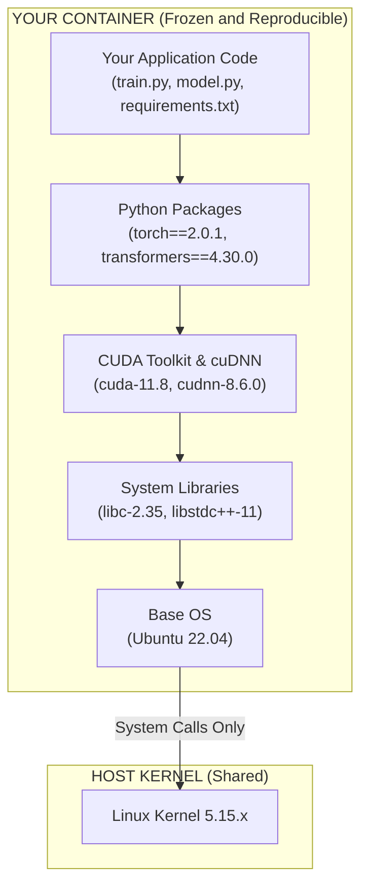
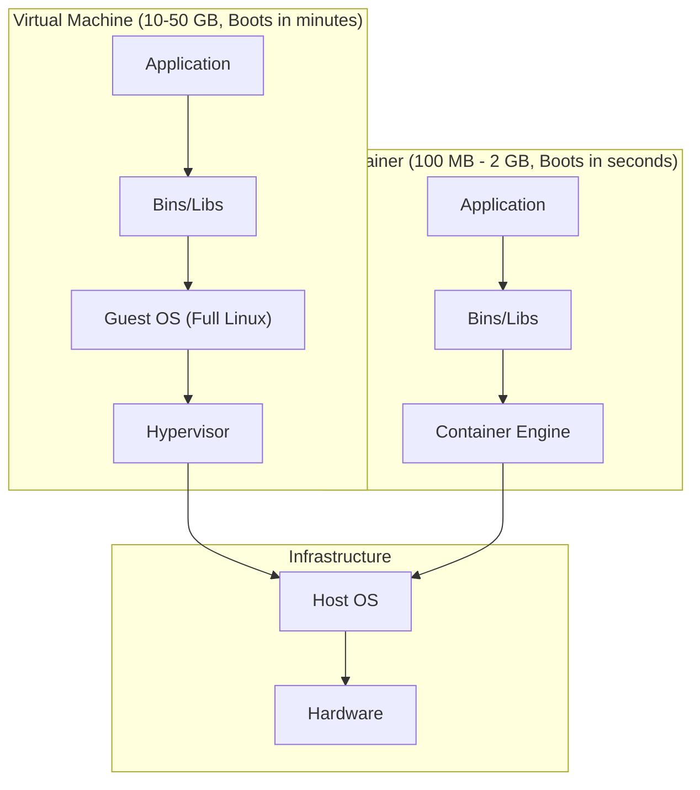
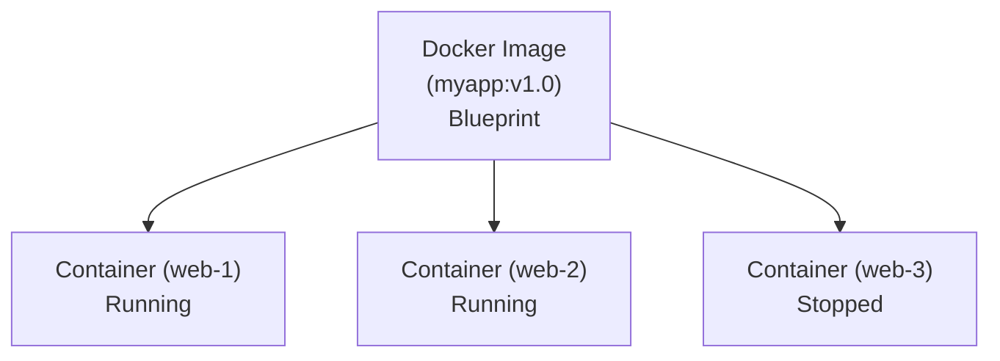
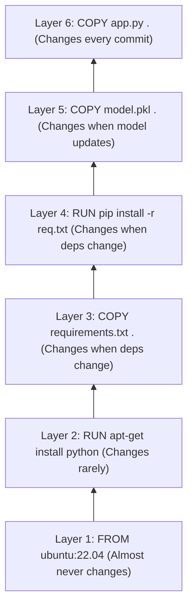
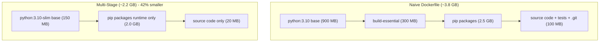
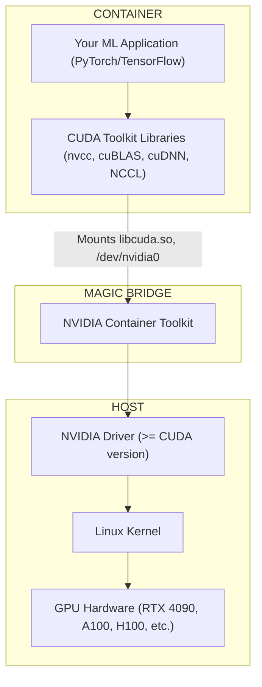
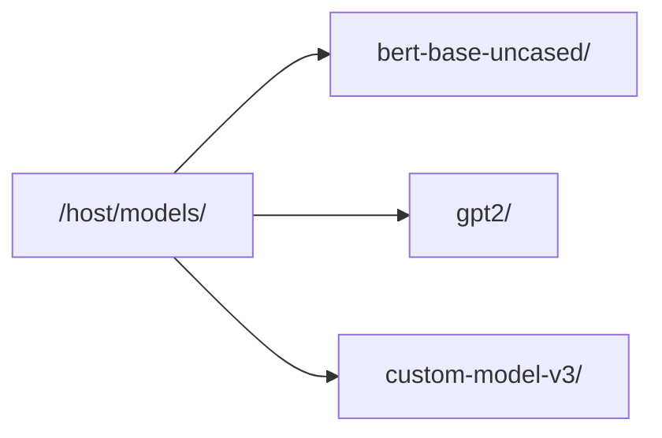
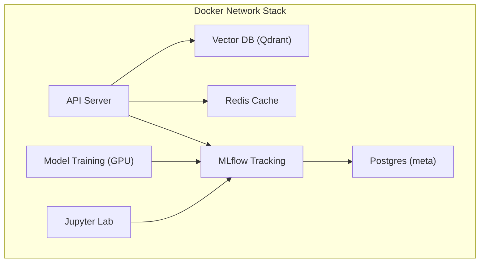
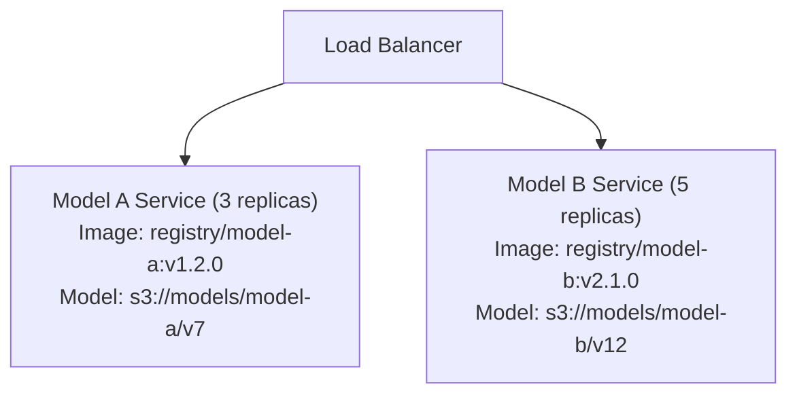

> **AI/ML Engineering Track** | Complexity: `[COMPLEX]` | Time: 5-6

## The $165 Million Bug That Containers Could Have Prevented

**NASA's Jet Propulsion Laboratory. September 23, 1999.**

The Mars Climate Orbiter had traveled 286 days and 416 million miles through space. As it approached Mars for orbital insertion, ground controllers sent the commands to slow down and enter orbit. Nine minutes of radio silence followed—normal for a maneuver behind the planet. The signal never returned. The spacecraft had approached Mars 100 kilometers too low, skipping off the atmosphere and burning up. The root cause? Lockheed Martin's navigation software produced thrust data in pound-force seconds. NASA's system expected newton-seconds. One team's environment assumed imperial units; another assumed metric. 

Chris Mattmann, now Chief Technology and Innovation Officer at NASA JPL and a long-time open source contributor, has spent years advocating for better software engineering practices in aerospace. He later wrote: "The Mars Climate Orbiter wasn't lost to physics. It was lost to environment assumptions. The code worked perfectly—in the environment it was written for." This miscalculation cost NASA a $165 million spacecraft and years of scientific research.

This is the "it works on my machine" problem at its most extreme. While your machine learning model probably won't crash a spacecraft into Mars, the same class of problem—code that works perfectly in one environment but fails catastrophically in another—costs organizations billions of dollars annually in debugging, downtime, and lost revenue. Containers act as the definitive solution to this problem. They package your code, dependencies, and environment assumptions into a single, immutable, and portable unit that behaves identically regardless of where it executes.

---

## What You'll Be Able to Do

By the end of this module, you will:
- **Diagnose** environment-related failures in machine learning pipelines using container isolation principles.
- **Design** optimized, multi-stage Dockerfiles that dramatically minimize image size and accelerate build times.
- **Implement** GPU-accelerated container environments using the NVIDIA Container Toolkit.
- **Evaluate** caching strategies and volume mounts to manage large machine learning artifacts without bloating images.
- **Debug** common orchestration issues using Docker Compose for local, multi-service machine learning development.

---

## Why This Module Matters

### The Reproducibility Crisis Nobody Talks About

Here is a difficult reality of machine learning: most machine learning research cannot be reproduced. This is rarely because researchers are careless; it is because machine learning has an environment configuration problem that is vastly more complex than traditional software engineering. 

**Did You Know?** In 2019, researchers Odd Erik Gundersen and Sigbjørn Kjensmo surveyed 400 machine learning papers and found that only 6% provided all the necessary information required to completely reproduce the documented results. The missing pieces were rarely the algorithms themselves—they were the environment specifications.

```text
THE "IT WORKS ON MY MACHINE" PROBLEM IN ML
==========================================

Your Laptop                     Production Server
-----------                     -----------------
Python 3.10.4                   Python 3.10.1      <- Minor version = different bytecode
PyTorch 2.0.1                   PyTorch 2.0.0      <- Different numerical precision
CUDA 11.8                       CUDA 11.7          <- Different kernel implementations
cuDNN 8.6.0                     cuDNN 8.5.0        <- Different convolution algorithms
Ubuntu 22.04                    Ubuntu 20.04       <- Different glibc, different syscalls
libc 2.35                       libc 2.31          <- Affects everything that uses C
numpy 1.24.0                    numpy 1.23.5       <- Different BLAS binding

Your model accuracy:            Production accuracy:
         94.2%                              91.7%

You: "But I didn't change anything!"
Reality: You changed EVERYTHING by moving machines.
```

### Why Virtual Environments Aren't Enough

Many practitioners rely on tools like `virtualenv`, `conda`, or `poetry`. While excellent for their specific use cases, these tools only isolate Python packages. They do not isolate system libraries (like `libc` or `OpenSSL`), the CUDA toolkit, cuDNN, system Python patches, operating system discrepancies, or the host file system structure.

**Did You Know?** Donald Stufft, a core maintainer of `pip` and PyPI, once traced a `pip install tensorflow` failure across 48 different system configurations. He discovered that the identical command produced over a dozen different outcomes depending on the OS, Python build, and installed system libraries. His conclusion was absolute: "pip install reproduces packages, not environments."

### What Containers Actually Solve

Containers give you something virtual environments cannot: a complete, isolated environment that encapsulates everything from the kernel user-space upward. 



Everything inside the container is frozen, versioned, and entirely reproducible. Moving this container to any Linux machine running a container engine guarantees identical behavior.

**Did You Know?** Solomon Hykes created Docker in 2013 while working at dotCloud, fundamentally shifting the industry from hardware virtualization to process-level isolation. The breakthrough was not the underlying Linux container technology (LXC existed since 2008), but the standard `Dockerfile` developer experience.

---

## Docker Fundamentals: The Mental Model

### Containers vs. Virtual Machines

Think of virtual machines as building custom houses, and containers as renting apartments in a larger complex. Virtual machines require a massive footprint because they duplicate the entire operating system stack. Containers share the host's kernel, making them exceptionally lightweight.



### Images vs. Containers

An **Image** is the immutable blueprint or recipe. It defines exactly what belongs in the environment but is not actively running. A **Container** is the running instance of that image. You can instantiate dozens of identical containers from a single image blueprint.



> **Stop and think**: If a container strictly isolates the file system and network, how can an application inside the container communicate with an NVIDIA GPU, which is a physical piece of hardware managed exclusively by the host kernel? We will explore this bridge shortly.

### The Layer System

Docker images are not monolithic blobs; they are composed of stacked, read-only layers. This layer caching mechanism allows Docker to reuse unmodified steps across builds, saving immense amounts of time. 

**Did You Know?** Jérôme Petazzoni designed the Docker layer caching system, a mechanism that now saves millions of compute hours daily globally. He realized that since most builds follow the same pattern (OS -> dependencies -> code), unchanged foundation layers could be infinitely reused.



If you change Layer 6, Docker only rebuilds Layer 6. The build takes 5 seconds. If you accidentally modify Layer 3, Docker throws away the cache for Layers 3, 4, 5, and 6, turning a 5-second build into a 10-minute ordeal.

### Essential Docker Commands

```bash
# ============================================================
# IMAGE COMMANDS (Working with blueprints)
# ============================================================
docker build -t myapp:v1 .              # Build image from Dockerfile
docker images                            # List all local images
docker pull pytorch/pytorch:2.0.0       # Download from registry
docker push myrepo/myapp:v1             # Upload to registry
docker rmi myapp:v1                     # Delete image
docker history myapp:v1                 # Show layer history
docker image prune                      # Remove unused images

# ============================================================
# CONTAINER COMMANDS (Working with running instances)
# ============================================================
docker run myapp:v1                     # Create + start container
docker run -it myapp:v1 bash            # Interactive mode with shell
docker run -d myapp:v1                  # Detached (background) mode
docker run --name mycontainer myapp:v1  # Named container
docker run -p 8000:8000 myapp:v1        # Map port 8000
docker run -v /host/path:/container/path myapp:v1  # Mount volume
docker run --gpus all myapp:v1          # Enable GPU access

docker ps                               # List running containers
docker ps -a                            # List ALL containers
docker stop mycontainer                 # Stop gracefully
docker kill mycontainer                 # Force stop
docker rm mycontainer                   # Remove stopped container
docker logs mycontainer                 # View stdout/stderr
docker logs -f mycontainer              # Follow logs (like tail -f)
docker exec -it mycontainer bash        # Shell into running container
docker inspect mycontainer              # Detailed JSON info
docker stats                            # Live resource usage

# ============================================================
# CLEANUP COMMANDS (Reclaim disk space)
# ============================================================
docker system df                        # Show disk usage
docker system prune                     # Remove all unused data
docker system prune -a                  # Remove everything unused
docker volume prune                     # Remove unused volumes
```

---

## Writing Dockerfiles for ML

### The Naive Approach

A typical beginner Dockerfile looks harmless but introduces massive technical debt:

```dockerfile
# NAIVE DOCKERFILE - Do not use this in production
FROM python:3.10

WORKDIR /app
COPY . .
RUN pip install -r requirements.txt

CMD ["python", "train.py"]
```

This functions, but suffers from bloated size (easily exceeding 4GB due to massive base layers), cache busting on every code change, missing GPU support, and severe security risks by executing everything as the root user.

### The Optimized Approach: Multi-Stage Builds

Multi-stage builds leverage a "builder" stage to compile dependencies, then port only the strictly necessary runtime artifacts into a pristine "production" stage.

```dockerfile
# OPTIMIZED ML DOCKERFILE

# ==============================================================
# STAGE 1: Builder
# Contains build tools, downloads deps, compiles wheels
# ==============================================================
FROM python:3.10-slim AS builder

WORKDIR /app

# Install build dependencies (only needed for compilation)
RUN apt-get update && apt-get install -y --no-install-recommends \
    build-essential \
    gcc \
    g++ \
    && rm -rf /var/lib/apt/lists/*

# Create virtual environment
RUN python -m venv /opt/venv
ENV PATH="/opt/venv/bin:$PATH"

# Install Python dependencies optimally
COPY requirements.txt .
RUN pip install --no-cache-dir --upgrade pip && \
    pip install --no-cache-dir -r requirements.txt

# ==============================================================
# STAGE 2: Production
# Clean, minimal image with only runtime requirements
# ==============================================================
FROM python:3.10-slim AS production

WORKDIR /app

# Copy virtual environment from builder (excluding raw build tools)
COPY --from=builder /opt/venv /opt/venv
ENV PATH="/opt/venv/bin:$PATH"

# Security: Create non-root user
RUN groupadd --gid 1000 appgroup && \
    useradd --uid 1000 --gid appgroup --shell /bin/bash appuser

# Copy only production code explicitly
COPY --chown=appuser:appgroup src/ ./src/
COPY --chown=appuser:appgroup models/ ./models/

USER appuser

ENV PYTHONUNBUFFERED=1 \
    PYTHONDONTWRITEBYTECODE=1 \
    PYTHONPATH=/app

EXPOSE 8000

HEALTHCHECK --interval=30s --timeout=10s --start-period=5s --retries=3 \
    CMD python -c "import urllib.request; urllib.request.urlopen('http://localhost:8000/health')" || exit 1

CMD ["python", "-m", "uvicorn", "src.main:app", "--host", "0.0.0.0", "--port", "8000"]
```

### The Dramatic Size Reduction



By discarding compilers and raw build layers, your deployment speeds up, container registry costs plummet, and your attack surface shrinks significantly.

---

## GPU Containers with NVIDIA Container Toolkit

### The GPU Problem and Architecture

Containers must share the host's kernel, yet GPUs require specific, kernel-level drivers. To solve this, the CUDA toolkit is packaged *inside* the container, while the NVIDIA driver remains *on the host*. The NVIDIA Container Toolkit dynamically bridges the two at runtime.



### GPU Dockerfile for ML Training

```dockerfile
# GPU-enabled ML Training Dockerfile
FROM nvidia/cuda:11.8.0-cudnn8-runtime-ubuntu22.04

ENV DEBIAN_FRONTEND=noninteractive

RUN apt-get update && apt-get install -y --no-install-recommends \
    python3.10 \
    python3-pip \
    python3.10-venv \
    python3.10-dev \
    curl \
    && rm -rf /var/lib/apt/lists/* \
    && ln -sf /usr/bin/python3.10 /usr/bin/python \
    && ln -sf /usr/bin/pip3 /usr/bin/pip

WORKDIR /app

# IMPORTANT: PyTorch CUDA version must explicitly match container CUDA version
RUN pip install --no-cache-dir \
    torch==2.0.1+cu118 \
    torchvision==0.15.2+cu118 \
    torchaudio==2.0.2+cu118 \
    --extra-index-url https://download.pytorch.org/whl/cu118

COPY requirements.txt .
RUN pip install --no-cache-dir -r requirements.txt

COPY src/ ./src/

ENV NVIDIA_VISIBLE_DEVICES=all
ENV NVIDIA_DRIVER_CAPABILITIES=compute,utility

VOLUME ["/data", "/output", "/checkpoints"]

ENTRYPOINT ["python", "-m", "src.train"]
```

### CUDA Version Compatibility: The Gotcha

The immutable rule of GPU containers: **The host driver must be greater than or equal to the container's CUDA toolkit version.**

```text
CUDA COMPATIBILITY MATRIX
=========================

Host Driver Version    Supports Container CUDA Versions
-------------------    ---------------------------------
550.x (newest)         CUDA 12.4 and ALL earlier versions
535.x                  CUDA 12.2 and ALL earlier versions
525.x                  CUDA 12.0 and ALL earlier versions
515.x                  CUDA 11.7 and ALL earlier versions
460.x                  CUDA 11.4 and ALL earlier versions

EXAMPLE:
- Host has driver 525.85 (supports up to CUDA 12.0)
- Container with CUDA 11.8   -> Works perfectly
- Container with CUDA 12.1   -> Fails: "CUDA driver version insufficient"
```

---

## Handling Large ML Artifacts

### The Model Size Problem

```text
MODEL SIZE HALL OF FAME (2024)
==============================
BERT-base-uncased:           440 MB
GPT-2:                       1.5 GB
Stable Diffusion v1.5:       4 GB
LLaMA-7B:                    13 GB
Mistral-7B:                  14 GB
LLaMA-70B:                   140 GB
gpt-5 (rumored):             ~1.7 TB (!)
```

Baking massive models directly into Docker images explodes registry storage costs, cripples deployment speeds, and breaks CI/CD workflows. 

### Strategy 1: Download at Runtime

```python
# download_model.py
"""Download model at container startup if not cached."""
import os
from pathlib import Path
from huggingface_hub import snapshot_download

MODEL_ID = os.environ.get("MODEL_ID", "bert-base-uncased")
CACHE_DIR = Path(os.environ.get("MODEL_CACHE", "/models"))

def download_if_needed():
    model_path = CACHE_DIR / MODEL_ID.replace("/", "--")
    if model_path.exists():
        print(f" Model {MODEL_ID} already cached at {model_path}")
        return model_path

    print(f" Downloading {MODEL_ID}...")
    path = snapshot_download(
        MODEL_ID,
        cache_dir=CACHE_DIR,
        local_dir=model_path,
    )
    print(f" Downloaded to {path}")
    return path

if __name__ == "__main__":
    download_if_needed()
```

### Strategy 2: Volume Mounts

For large local environments, manage the files on the host and mount them into the executing container:



```bash
docker run -v /host/models:/models myapp:v1
docker volume create ml-models
docker run -v ml-models:/models myapp:v1
```

### Strategy 3: Registry Integration

Fetch directly from an upstream service like MLflow during container execution:

```python
# src/serve.py
import os
import mlflow

MLFLOW_URI = os.environ["MLFLOW_TRACKING_URI"]
MODEL_NAME = os.environ["MODEL_NAME"]
MODEL_STAGE = os.environ.get("MODEL_STAGE", "Production")

mlflow.set_tracking_uri(MLFLOW_URI)
model_uri = f"models:/{MODEL_NAME}/{MODEL_STAGE}"
print(f"Loading model from {model_uri}")
model = mlflow.pyfunc.load_model(model_uri)
```

```bash
docker run \
    -e MLFLOW_TRACKING_URI=http://mlflow-server:5000 \
    -e MODEL_NAME=fraud-detector \
    -e MODEL_STAGE=Production \
    myapp:v1
```

> **Pause and predict**: If you use a persistent Docker volume mapping to cache large models downloaded at runtime, what happens to the cached model files when you stop and entirely remove the container using `docker rm -f mycontainer`? 

---

## Docker Compose for ML Development

Managing inter-dependent ML systems manually via standalone `docker run` commands rapidly becomes a nightmare. Docker Compose consolidates these networks.



### Complete ML Development docker-compose.yml

```yaml
# docker-compose.yml - ML Development Environment
version: '3.8'

services:
  api:
    build:
      context: .
      dockerfile: Dockerfile
    ports:
      - "8000:8000"
    volumes:
      - ./src:/app/src              # Hot reload during development
      - model-cache:/app/models     # Shared model cache
    environment:
      - MODEL_PATH=/app/models
      - QDRANT_HOST=qdrant
      - REDIS_HOST=redis
      - MLFLOW_TRACKING_URI=http://mlflow:5000
      - LOG_LEVEL=DEBUG
    depends_on:
      - redis
      - qdrant
    deploy:
      resources:
        reservations:
          devices:
            - driver: nvidia
              count: 1
              capabilities: [gpu]
    healthcheck:
      test: ["CMD", "curl", "-f", "http://localhost:8000/health"]
      interval: 30s
      timeout: 10s
      retries: 3

  qdrant:
    image: qdrant/qdrant:latest
    ports:
      - "6333:6333"
      - "6334:6334"
    volumes:
      - qdrant-data:/qdrant/storage
    environment:
      - QDRANT__SERVICE__GRPC_PORT=6334

  redis:
    image: redis:7-alpine
    ports:
      - "6379:6379"
    volumes:
      - redis-data:/data
    command: redis-server --appendonly yes

  mlflow:
    image: ghcr.io/mlflow/mlflow:v2.8.0
    ports:
      - "5000:5000"
    volumes:
      - mlflow-data:/mlflow
      - ./mlruns:/mlflow/mlruns
    environment:
      - MLFLOW_TRACKING_URI=sqlite:///mlflow/mlflow.db
    command: >
      mlflow server
      --host 0.0.0.0
      --port 5000
      --backend-store-uri sqlite:///mlflow/mlflow.db
      --default-artifact-root /mlflow/artifacts

  jupyter:
    build:
      context: .
      dockerfile: Dockerfile.jupyter
    ports:
      - "8888:8888"
    volumes:
      - ./notebooks:/app/notebooks
      - ./src:/app/src
      - model-cache:/app/models
    environment:
      - JUPYTER_TOKEN=dev-token-change-in-prod
      - MLFLOW_TRACKING_URI=http://mlflow:5000
    deploy:
      resources:
        reservations:
          devices:
            - driver: nvidia
              count: 1
              capabilities: [gpu]

  postgres:
    image: postgres:15-alpine
    ports:
      - "5432:5432"
    volumes:
      - postgres-data:/var/lib/postgresql/data
    environment:
      - POSTGRES_USER=mlflow
      - POSTGRES_PASSWORD=mlflow_password
      - POSTGRES_DB=mlflow

volumes:
  model-cache:
    name: ml-model-cache
  qdrant-data:
    name: ml-qdrant-data
  redis-data:
    name: ml-redis-data
  mlflow-data:
    name: ml-mlflow-data
  postgres-data:
    name: ml-postgres-data
```

### Development vs Production Environments

By layering your override files, you seamlessly toggle debugging context locally without sacrificing production rigor.

```yaml
# docker-compose.yml (base - always loaded)
version: '3.8'
services:
  api:
    build: .
    environment:
      - MODEL_PATH=/app/models

# docker-compose.override.yml (development - loaded automatically)
version: '3.8'
services:
  api:
    volumes:
      - ./src:/app/src                    # Live code reload
    environment:
      - LOG_LEVEL=DEBUG
      - RELOAD=true
    ports:
      - "8000:8000"                       # Expose for local access

# docker-compose.prod.yml (production - must specify explicitly)
version: '3.8'
services:
  api:
    image: myregistry/api:v1.0.0          # Use pre-built image
    environment:
      - LOG_LEVEL=WARNING
    deploy:
      replicas: 3
      resources:
        limits:
          memory: 8G
        reservations:
          memory: 4G
```

---

## Production Best Practices

### The .dockerignore File

Mirroring a `.gitignore`, your `.dockerignore` prohibits secret sprawl and massively accelerates your build context transfer.

```text
# .dockerignore for ML Projects
.git
.env*
docs/
tests/
.vscode/
notebooks/
__pycache__/
*.csv
*.pt
models/
mlruns/
Dockerfile*
```

### Health Checks That Actually Work

Kubernetes orchestration heavily relies on your application reporting accurate hardware health states. A proper liveness probe verifies the deep logic state, not just that the process exists.

```python
# src/health.py
"""Health check endpoints for container orchestration."""
from fastapi import FastAPI, Response, status
import torch
import psutil
import os

app = FastAPI()
model = None
model_ready = False

@app.get("/health")
async def health():
    return {"status": "healthy", "pid": os.getpid()}

@app.get("/ready")
async def ready(response: Response):
    checks = {
        "model_loaded": model is not None,
        "model_ready": model_ready,
        "memory_ok": psutil.virtual_memory().percent < 90,
    }

    if torch.cuda.is_available():
        checks["gpu_available"] = True
        checks["gpu_memory_ok"] = (
            torch.cuda.memory_allocated() / torch.cuda.max_memory_allocated() < 0.95
            if torch.cuda.max_memory_allocated() > 0
            else True
        )

    all_ready = all(checks.values())
    if not all_ready:
        response.status_code = status.HTTP_503_SERVICE_UNAVAILABLE

    return {"ready": all_ready, "checks": checks}

@app.get("/live")
async def live(response: Response):
    try:
        _ = 1 + 1  
        _ = os.getcwd()  
        if torch.cuda.is_available():
            _ = torch.cuda.current_device()  
        return {"live": True}
    except Exception as e:
        response.status_code = status.HTTP_503_SERVICE_UNAVAILABLE
        return {"live": False, "error": str(e)}
```

---

## Debugging and War Stories

### The Black Friday Meltdown

**Seattle. Major E-commerce retailer.** Everything was ready for the massive holiday rush. The ML team deployed their recommendation model achieving 94% accuracy. By 7:30 AM on launch day, pods were crashing and restarting every 2 minutes. The fallback static recommendations kicked in, resulting in a 23% plunge in conversion rates. 

**The post-mortem**: The team had developed locally on `python:3.10` but executed their CI/CD release using `python:3.10-slim`. The slim variant aggressively strips OS tooling and lacked `libgomp1`, an essential library that `numpy` demands for multi-threading operations. As load spiked, `numpy` parallelized and immediately faulted out.

The fix was a single line of code added back into the multi-stage layer:
```dockerfile
RUN apt-get install -y libgomp1
```

**Lesson**: Test your exact production images entirely. A difference of a single missing C-extension library can decimate revenue.

### The GPU Memory Leak That Took Down Production

**San Francisco. AI startup serving real-time image generation.** A heavily utilized Stable Diffusion cluster began cascading out-of-memory (OOM) errors. GPU utilization indicated 100%, yet absolutely no API requests returned successfully. After automated container restarts, the stack survived roughly four hours before freezing again.

**The root cause**: Model inference logic unintentionally captured gradient histories.
```python
# The bug: model wasn't being garbage collected 
async def generate_image(prompt: str):
    model = load_model()  # Called every request
    image = model(prompt)
    return image
```

**The fix**: Explicitly disable computational graphs during service execution.
```python
# Load model once at container startup
model = None
def get_model():
    global model
    if model is None:
        model = load_model()
        model.eval()  
        torch.cuda.empty_cache()
    return model

async def generate_image(prompt: str):
    with torch.no_grad():  # No gradient caching
        image = get_model()(prompt)
    return image
```

### Common Container Mistakes

| Mistake | Why It Happens | How to Fix |
|---------|----------------|------------|
| **Using `latest` tags** | Base layers change silently under your feet, causing intermittent failures. | Explicitly pin OS and tooling versions (e.g., `python:3.10.12-slim`). |
| **`COPY . .` too early** | Placing this instruction before package installations destroys layer cache hits entirely. | Copy `requirements.txt` first, compile dependencies, *then* copy source logic. |
| **Running as root** | Most containers default to `root`, posing a disastrous security pivot vulnerability. | Create an unprivileged user early in your build and execute `USER appuser`. |
| **Default `/dev/shm`** | Docker restricts shared memory to an abysmal 64MB, instantly crashing PyTorch parallel DataLoaders. | Always execute GPU operations with the `--shm-size=16g` flag configuration. |
| **Baking models in image** | Images swell beyond 15GB, making registry transfers agonising and rollbacks impossible. | Refactor containers to fetch large artifacts dynamically at runtime. |
| **Missing cache in CI** | CI pipelines execute fully isolated clean builds, burning tens of minutes per commit. | Inject `--cache-from` arguments into your pipeline builders. |

---

## System Design and Economics

### Economics of Containerization for ML

| Cost Component | Virtual Machines | Containers |
|----------------|-----------------|------------|
| Instance startup time | 30-60 seconds | < 1 second |
| Resource overhead | 10-20% CPU, 500MB+ RAM | < 1% CPU, < 10MB RAM |
| Disk per deployment | 10-50 GB | 1-5 GB |
| Deployment time | 5-15 minutes | 30 seconds - 2 minutes |
| Rollback time | 5-15 minutes | < 30 seconds |
| Environment setup | 4-8 hours per developer | 30 minutes |
| Dependency conflicts | Regular occurrence | Isolated perfectly |

### Containerized ML Platform Architecture

A resilient engineering platform heavily categorizes infrastructure responsibilities.



1. **Base Images (Registry):** High-cadence security patched layers rebuilt autonomously every week.
2. **Team Images (CI/CD):** Compiled on Pull Request merges, extending Base Images.
3. **Training (Slurm/K8s):** Distributed containers mounting massive network file storage arrays for persistent state.

---

## Hands-On Exercises

The following exercises must be executed iteratively. Each step builds upon the previous context. Ensure you have Docker desktop installed locally.

### Task 1: Create and Run a Naive ML Container

**Objective:** Build a basic FastAPI application serving a mock ML endpoint to observe the baseline image size.

<details>
<summary>Step-by-Step Solution</summary>

1. Create your application directory:
```bash
mkdir -p ml-labs && cd ml-labs
```

2. Create the `requirements.txt` manifest:
```text
fastapi==0.103.1
uvicorn==0.23.2
scikit-learn==1.3.0
```

3. Create the API logic in `app.py`:
```python
from fastapi import FastAPI
app = FastAPI()

@app.get("/predict")
def predict():
    return {"status": "success", "prediction": "mock_output"}
```

4. Create the naive `Dockerfile`:
```dockerfile
FROM python:3.10
WORKDIR /app
COPY . .
RUN pip install -r requirements.txt
CMD ["uvicorn", "app:app", "--host", "0.0.0.0", "--port", "8000"]
```

5. Build the image and inspect the unoptimized footprint:
```bash
docker build -t ml-naive:v1 .
docker image ls | grep ml-naive
```

**Verification:** The terminal output will show the image size severely bloated (often ~1.2GB) primarily due to the heavy `python:3.10` Debian OS layer.
</details>

### Task 2: Implement Multi-Stage Builds

**Objective:** Slash your image overhead by separating the build compilers from the execution binaries.

<details>
<summary>Step-by-Step Solution</summary>

1. Create a new file named `Dockerfile.multi`:
```dockerfile
# Stage 1: Build logic
FROM python:3.10-slim AS builder
WORKDIR /app
COPY requirements.txt .
RUN python -m venv /opt/venv
ENV PATH="/opt/venv/bin:$PATH"
RUN pip install --no-cache-dir -r requirements.txt

# Stage 2: Production execution
FROM python:3.10-slim
WORKDIR /app
COPY --from=builder /opt/venv /opt/venv
ENV PATH="/opt/venv/bin:$PATH"
COPY app.py .
CMD ["uvicorn", "app:app", "--host", "0.0.0.0", "--port", "8000"]
```

2. Compile and contrast the sizes:
```bash
docker build -f Dockerfile.multi -t ml-optimized:v1 .
docker image ls | grep ml-
```

**Verification:** The `ml-optimized:v1` architecture will drop the footprint downward drastically (typically hovering around ~250MB).
</details>

### Task 3: Compose an ML Environment

**Objective:** Form an internal Docker network linking your API inference engine directly to a persistent Redis backing cache.

<details>
<summary>Step-by-Step Solution</summary>

1. Generate `docker-compose.yml`:
```yaml
version: '3.8'
services:
  api:
    image: ml-optimized:v1
    ports:
      - "8000:8000"
    depends_on:
      - redis
  redis:
    image: redis:7-alpine
    ports:
      - "6379:6379"
```

2. Initialize and interact:
```bash
docker-compose up -d
curl http://localhost:8000/predict
```

3. Halt and cleanly purge the infrastructure:
```bash
docker-compose down
```

**Verification:** The `curl` command reliably returns `{"status":"success","prediction":"mock_output"}` verifying the container mapped its internal port correctly to your host.
</details>

### Task 4: GPU Execution via Docker Compose

**Objective:** Validate that the container runtime properly mounts host NVIDIA hardware mappings securely.

<details>
<summary>Step-by-Step Solution</summary>

1. Augment your compose orchestration config to reserve host devices:
```yaml
version: '3.8'
services:
  gpu-worker:
    image: nvidia/cuda:11.8.0-base-ubuntu22.04
    command: nvidia-smi
    deploy:
      resources:
        reservations:
          devices:
            - driver: nvidia
              count: 1
              capabilities: [gpu]
```

2. Command execution test:
```bash
docker-compose up gpu-worker
```

**Verification:** Your terminal will output the classic NVIDIA system metrics table directly from inside the isolated process wrapper. If it faults, verify your host NVIDIA drivers are running.
</details>

---

## Knowledge Check

<details>
<summary>1. Scenario: Your continuous integration pipeline agonizingly takes 12 minutes to build your ML Docker image for every commit, even when only a trivial Markdown document changes. What is the explicit architectural error occurring?</summary>

**Answer:**
The `COPY . .` instruction is almost certainly placed before the `RUN pip install` instruction in the Dockerfile stack. Because Docker invalidates the layer cache for all subsequent layers following an altered file, modifying a trivial document forces the dependency installation layer to rebuild dynamically. To rectify this, developers must copy only `requirements.txt`, run the package installation process, and *then* copy the sprawling source tree.
</details>

<details>
<summary>2. Scenario: A containerized PyTorch training script running on an extremely heavily provisioned GPU EC2 instance crashes immediately with a "bus error" during inference loop testing when utilizing multiple DataLoader workers. What is missing?</summary>

**Answer:**
The container entirely lacks sufficient shared memory capacities. By default, the Docker daemon violently restricts the `/dev/shm` partition allocation to a marginal 64MB. PyTorch DataLoader workers heavily leverage shared memory maps to rapidly pass multidimensional tensor data across threads. Executing the container with the `--shm-size=16g` argument explicitly resolves this throttle limit.
</details>

<details>
<summary>3. Scenario: An enterprise vulnerability scanner violently flags your production NLP serving container for possessing severe CVE exploits affecting `build-essential`, `gcc`, and `curl`, none of which are utilized whatsoever by your application payload at runtime. How should this be patched?</summary>

**Answer:**
The container blueprint requires an aggressive refactoring into a multi-stage execution model. Compilers and arbitrary network utilities belong explicitly within an isolated "builder" staging tier where Python dependencies are natively compiled. The final artifact pushes only the isolated virtual environment folder to a pristine, bare-metal "slim" runtime foundation, totally omitting the compromised tooling.
</details>

<details>
<summary>4. Scenario: A team attempts to deploy a highly sophisticated newly minted image mandating CUDA 12.1 to a legacy on-premise cluster. The application aggressively terminates reporting "CUDA driver version insufficient." What is the conflict matrix at fault?</summary>

**Answer:**
The bare-metal host machine's internal NVIDIA kernel module driver is outdated and fails to bridge support for the extremely modern CUDA toolkit version bundled inside the container. NVIDIA driver integrations are securely forward-compatible (ancient containers run properly on modern drivers), but they absolutely break if backwards-compatibility is attempted. The team must either patch the host environment or downgrade their container baseline.
</details>

<details>
<summary>5. Scenario: In the midst of a disastrous midnight incident, rolling back your monolithic deep learning API microservice to the prior stable deployment forces the platform off-line for 48 minutes simply because the orchestration platform struggles to rapidly ingress a 16GB image payload. What is the fundamental redesign required?</summary>

**Answer:**
The machine learning operational artifacts must be completely decoupled from the underlying software execution image. By leveraging robust dynamic mechanisms to pull deep learning models over external network calls during initialization, or mounting hardware volumes directly natively, the core container footprint collapses gracefully under a gigabyte, empowering near-instant horizontal scalability operations.
</details>

<details>
<summary>6. Scenario: Your deployed image generation endpoint processes initial requests seamlessly, but infrastructure graphs show the process memory consuming an extra 100MB per hour reliably until the OOM killer rips the process entirely out of memory. What PyTorch execution context is dangerously missing?</summary>

**Answer:**
The forward-pass inference logic is inadvertently retaining historical computational execution graphs because it lacks a `torch.no_grad()` context wrapper. PyTorch natively caches vast webs of multidimensional intermediate tensors because it aggressively assumes you may trigger retroactive gradient loss operations. By deliberately wrapping your production logic within this protective block, PyTorch skips constructing the massive trace logs and the leak evaporates.
</details>

---

## Next Steps

You now possess the technical capability to structurally design, deploy, and debug enterprise-grade ML environments natively inside containers. This operational baseline heavily dictates the reliability of modern scaling methodologies.

- **CI/CD pipelines** (Module 45) - Automate integration testing parameters.
- **Kubernetes deployments** (Modules 46-48) - Construct horizontally scaling, massively orchestrated container platforms.
- **MLOps experiment tracking** (Module 49) - Persist metric parameters perfectly natively.

**Up Next**: Module 45 - CI/CD for AI/ML Development

*Module Complete! You now have the containerization skills to ship ML code that executes identically everywhere.*