> **AI/ML Engineering Track** | Complexity: `[COMPLEX]` | Time: 5-6 hours | Prerequisites: Python packaging, basic Linux shell, HTTP APIs, and introductory ML workflow concepts

## Learning Outcomes

By the end of this module, you will be able to:

- **Diagnose** environment-related ML failures by comparing host, image, container, dependency, CUDA, and artifact boundaries.
- **Design** Dockerfiles that separate build-time and runtime concerns while preserving reproducibility, cache efficiency, and security posture.
- **Implement** GPU-capable ML containers that correctly align host drivers, container CUDA libraries, PyTorch wheels, and runtime device mounts.
- **Evaluate** model artifact strategies by choosing between baked images, runtime downloads, mounted volumes, and model registries.
- **Debug** local multi-service ML stacks with Docker Compose by tracing networking, health checks, shared memory, zombie processes, and persistent state.

## Why This Module Matters

A retail ML platform team once shipped a recommendation model that passed every notebook experiment, every unit test, and every offline evaluation gate. The model worked on the lead engineer's workstation, worked inside the training notebook, and worked during a short smoke test on a staging VM. Then production traffic arrived, the service began restarting, conversion metrics dropped, and the incident channel filled with people asking why a model that had already been "validated" could not survive real requests.

The failure was not a bad algorithm. The service had been trained and tested with one set of operating system libraries, built in CI with another base image, and deployed onto hosts with a different CUDA driver boundary. One missing OpenMP runtime only appeared when NumPy used parallel execution under load, and the production container had no readiness check capable of detecting the broken path before traffic arrived. The model was treated as the risky part, but the environment was the part that failed first.

Docker matters in ML because ML systems are not just Python code. They are Python code plus native libraries, numerical kernels, CUDA runtime libraries, CPU instruction sets, model files, preprocessing assets, environment variables, network services, process behavior, and storage assumptions. A virtual environment can pin Python packages, but it cannot freeze the operating system layer, GPU user-space libraries, `/dev/shm`, UID permissions, or the shape of the filesystem that your training and serving code expects.

This module teaches Docker as an engineering control for ML reproducibility rather than as a collection of commands. You will start with the basic image/container mental model, then move into Dockerfile design, GPU boundaries, model artifact handling, Compose-based development stacks, and production debugging. The goal is not to memorize `docker run` flags; the goal is to reason about what changed when an ML workload behaves differently across machines.

## Core Content

### 1. The ML Container Mental Model

Docker solves a specific class of failure: the application assumes an environment, but the runtime provides a different one. In traditional web services, that mismatch might be a missing package or an unexpected locale. In ML systems, the mismatch can be a different BLAS backend, a different CUDA minor version, a model cache path that is empty, a CPU without the expected instruction set, or a host driver that cannot support the CUDA libraries inside the image.

A useful mental model is to separate the system into four layers: code, dependencies, operating system user space, and host kernel resources. The image freezes the first three layers into a reproducible package. The host kernel, GPU driver, physical GPU, network stack, and mounted volumes remain outside the image and are injected at runtime. Most Docker confusion comes from forgetting which side of that boundary a problem belongs to.

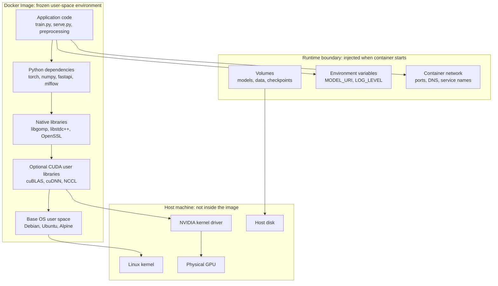

The image is the blueprint, while a container is one running instance created from that blueprint. This distinction matters during incidents. If a container's writable filesystem changes because a model downloads into `/tmp`, that change is not part of the image unless you rebuild and tag a new image. If you run ten containers from the same image, they begin with the same filesystem layers but can diverge through mounted volumes, environment variables, and runtime writes.

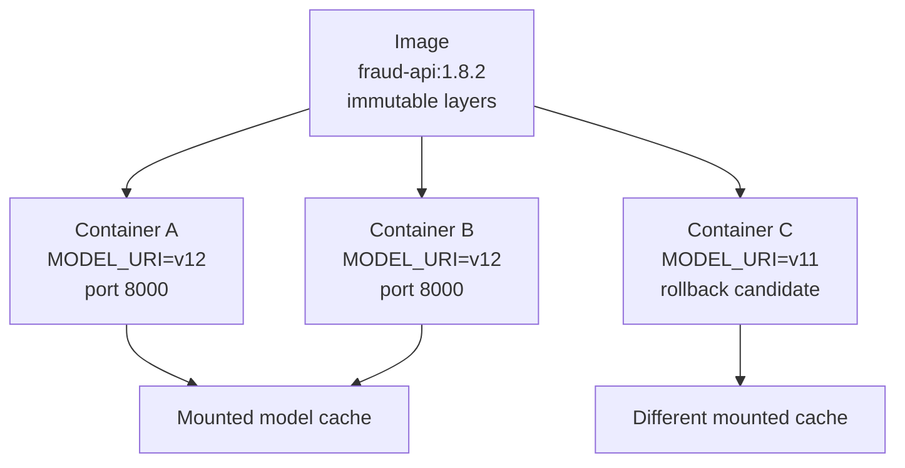

A container is not a virtual machine. It does not boot a separate kernel, and it does not magically include hardware drivers from the host. It starts one or more ordinary Linux processes with namespaces, cgroups, filesystem layers, and runtime configuration applied. That is why containers are fast to start, but it is also why kernel-level dependencies such as GPU drivers and some filesystem behavior remain host-sensitive.

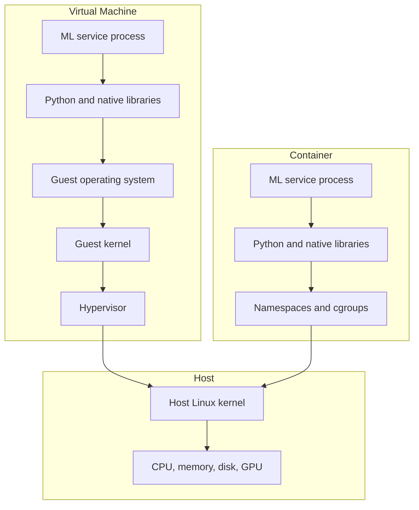

**Active learning prompt:** Before reading further, imagine a PyTorch service that works in a notebook but fails inside a container with `ImportError: libgomp.so.1: cannot open shared object file`. Which boundary is most likely broken: Python code, Python package dependencies, native operating system libraries, host kernel, or model artifacts? Write down your answer, because the next section shows why this exact failure appears in slim production images.

The practical value of this model is that it turns vague "Docker is broken" complaints into targeted questions. Does the failure happen during `docker build`, which points to build context, package resolution, or Dockerfile order? Does it happen during `docker run`, which points to runtime flags, environment variables, volumes, ports, or device mounts? Does it happen only under load, which points to memory limits, `/dev/shm`, worker processes, GPU memory, or readiness checks?

A beginner often treats Docker as a black box that either starts or fails. A senior practitioner treats Docker as an explicit contract: the image owns user-space dependencies, the runtime owns configuration and mounts, and the host owns kernel resources. When those responsibilities are clear, debugging becomes a matter of locating which contract was violated.

### 2. Images Are Layered, So Dockerfile Order Is Architecture

Docker images are built from layers, and each Dockerfile instruction usually creates a new layer. Docker caches layers by comparing the instruction and the files used by that instruction. If a layer changes, every later layer must be rebuilt because Docker cannot assume that downstream state remains valid. This is why a single misplaced `COPY . .` can make every small code or documentation change reinstall gigabytes of ML dependencies.

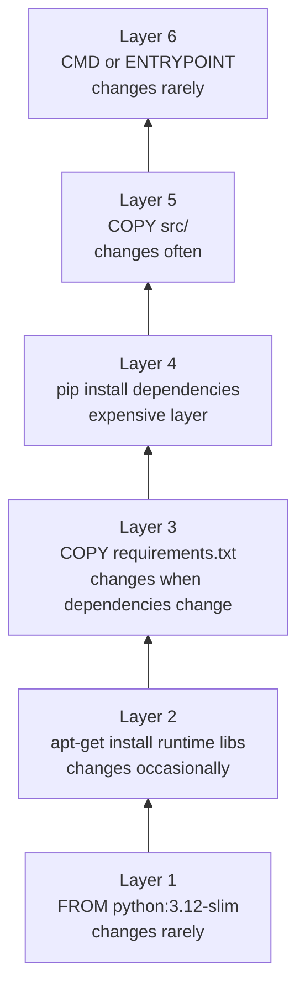

A naive Dockerfile often works during a demo and still creates long-term operational debt. It copies the entire repository before dependency installation, runs as root, includes test data and notebook outputs in the image, and leaves build tools in the runtime environment. That combination wastes registry storage, slows CI, increases vulnerability scanner noise, and makes cache reuse unpredictable.

```dockerfile
# Naive Dockerfile: useful for seeing the problems, not for production use.
FROM python:3.12

WORKDIR /app
COPY . .
RUN pip install -r requirements.txt

CMD ["python", "serve.py"]
```

The main error is not that the Dockerfile is short. The error is that it mixes concerns that should be separated. Dependency manifests should be copied before application source because dependencies change less frequently than source code. Build tools should exist only in a builder stage because compilers are not needed to serve requests. Runtime images should contain only the files required to execute the service.

A production-oriented Dockerfile starts by making the expensive, slow-changing layers stable. It installs dependencies after copying only dependency manifests, then copies application code after those dependencies are already cached. It also creates an unprivileged user, sets predictable Python behavior, and uses an explicit command that starts the intended application process.

```dockerfile
# Production-minded CPU serving image for a FastAPI ML service.
FROM python:3.12-slim AS builder

WORKDIR /build

RUN apt-get update && apt-get install -y --no-install-recommends \
    build-essential \
    gcc \
    libgomp1 \
    && rm -rf /var/lib/apt/lists/*

RUN python -m venv /opt/venv
ENV PATH="/opt/venv/bin:$PATH"

COPY requirements.txt .
RUN pip install --no-cache-dir --upgrade pip && \
    pip install --no-cache-dir -r requirements.txt

FROM python:3.12-slim AS runtime

WORKDIR /app

RUN apt-get update && apt-get install -y --no-install-recommends \
    libgomp1 \
    curl \
    && rm -rf /var/lib/apt/lists/*

COPY --from=builder /opt/venv /opt/venv
ENV PATH="/opt/venv/bin:$PATH"

RUN groupadd --gid 10001 appgroup && \
    useradd --uid 10001 --gid appgroup --create-home --shell /usr/sbin/nologin appuser

COPY --chown=appuser:appgroup src/ ./src/
COPY --chown=appuser:appgroup pyproject.toml ./pyproject.toml

USER appuser

ENV PYTHONUNBUFFERED=1 \
    PYTHONDONTWRITEBYTECODE=1 \
    PYTHONPATH=/app

EXPOSE 8000

HEALTHCHECK --interval=30s --timeout=5s --start-period=15s --retries=3 \
    CMD curl -fsS http://127.0.0.1:8000/ready || exit 1

CMD ["python", "-m", "uvicorn", "src.api:app", "--host", "0.0.0.0", "--port", "8000"]
```

The `builder` stage contains compilation tools because some Python packages still compile native extensions. The `runtime` stage receives only the virtual environment and the application files. Notice that `libgomp1` appears in the runtime stage too. That is intentional: if a compiled dependency links to a runtime library, removing compilers is safe but removing the runtime library is not.

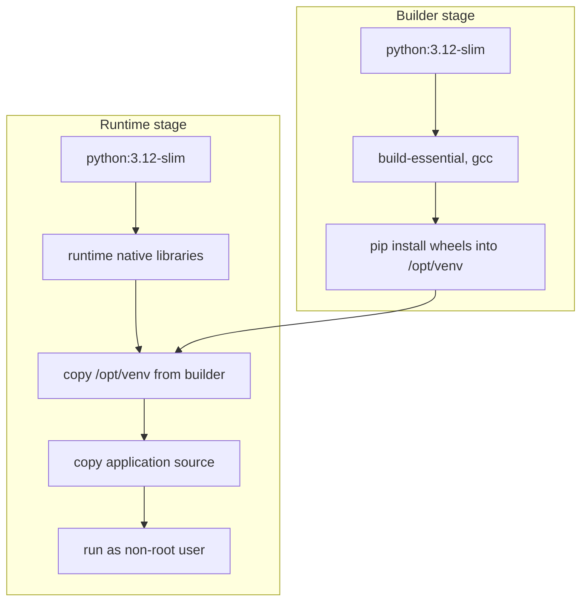

**Worked example:** Suppose CI rebuilds an image for every pull request, and the build takes twelve minutes even when the pull request changes only a README file. The likely Dockerfile has `COPY . .` before `RUN pip install`. The README change invalidates the `COPY` layer, which invalidates the dependency installation layer, which forces PyTorch and scikit-learn to reinstall. Moving dependency manifests above source copying turns a documentation-only change into a small rebuild instead of a full dependency rebuild.

The fix is architectural rather than cosmetic. You first copy `requirements.txt`, `pyproject.toml`, `poetry.lock`, or the equivalent dependency lock file. You install dependencies. Only after that do you copy `src/`, `configs/`, or other fast-changing project files. In ML repositories, this order is especially important because dependency layers may be gigabytes and may include slow native wheels.

**Active learning prompt:** In the optimized Dockerfile above, what would happen if `COPY src/ ./src/` were moved above `RUN pip install --no-cache-dir -r requirements.txt` in the builder stage? Predict the next CI symptom before checking the explanation. The symptom would be that application code changes invalidate dependency installation, so the build cache becomes fragile and ordinary feature work pays the cost of reinstalling the full ML stack.

A `.dockerignore` file is part of Dockerfile architecture because it controls what enters the build context before Docker even starts executing instructions. If your build context includes `.git`, local model files, notebooks, cached datasets, and `mlruns`, Docker must send those files to the daemon and may accidentally bake them into the image. That slows builds and can leak secrets or proprietary data.

```text
# .dockerignore for an ML application repository
.git
.env
.env.*
__pycache__/
.pytest_cache/
.mypy_cache/
.ruff_cache/
.ipynb_checkpoints/
notebooks/
data/
datasets/
models/
checkpoints/
mlruns/
outputs/
*.pt
*.pth
*.onnx
*.safetensors
*.csv
*.parquet
dist/
node_modules/
```

The rule is simple: the image should contain software, not local history or bulky operational state. Models, datasets, experiment outputs, and checkpoints usually belong in volumes, object storage, model registries, or artifact stores. When you intentionally bake a small model into an image, make that choice explicit and document why the faster cold start is worth the larger deployment artifact.

### 3. Debugging Environment Drift in ML Images

Environment drift is the gap between what the code assumes and what the runtime provides. In ML, drift is often subtle because the process may start successfully, import every package, and still compute different results or fail only under workload-specific paths. A service can pass `/health` while its first real prediction fails because the health endpoint never loads the model or touches the GPU.

```text
THE ENVIRONMENT DRIFT CHECKLIST
===============================

Training notebook            Containerized service             Risk
--------------------------   -------------------------------   --------------------------
Python 3.12.2                Python 3.12.1                     Wheel ABI or behavior drift
torch CPU wheel              torch CUDA wheel                  Device behavior changes
Ubuntu full image            Debian slim image                 Missing native runtime libs
Local model cache present    Empty container filesystem        Slow startup or model failure
Host path /mnt/models        Container path /models            Broken file assumptions
Large host /dev/shm          Docker default small /dev/shm     DataLoader bus errors
Interactive shell process    PID 1 service process             Signal handling and zombies
```

The fastest way to debug drift is to compare the environment from inside the running container, not from the host. Host commands tell you what the host has installed; container commands tell you what the process can actually see. That distinction is critical when the same machine has a working global CUDA installation but the container has a mismatched PyTorch wheel.

```bash
docker run --rm -it ml-api:v1 bash

python -V
python -c "import torch; print(torch.__version__); print(torch.cuda.is_available())"
python -c "import numpy; numpy.show_config()"
ldd "$(python -c 'import sklearn, pathlib; print(pathlib.Path(sklearn.__file__).parent / "__check_build" / "_check_build.cpython-312-x86_64-linux-gnu.so")')" || true
env | sort
id
pwd
ls -la /app
```

A senior debugging habit is to locate the first broken assumption instead of changing many variables at once. If an import fails, inspect native library links before rebuilding the image. If the model path is missing, inspect mounts and environment variables before changing Python code. If GPU availability is false, inspect host driver visibility and runtime device mounts before reinstalling PyTorch.

The following table gives a practical mapping from symptoms to boundaries. It is not a replacement for logs, but it prevents random changes during an incident.

| Symptom | Likely Boundary | First Diagnostic | High-Value Fix |
|---|---|---|---|
| `ModuleNotFoundError` inside container | Python dependency layer | `pip freeze` inside container | Rebuild from pinned dependency manifest |
| `libgomp.so.1` missing | Native OS runtime library | `ldd` on failing extension | Install runtime library in final stage |
| `torch.cuda.is_available()` is false | GPU runtime boundary | `nvidia-smi` inside container | Use NVIDIA runtime and matching wheel |
| `FileNotFoundError` for model path | Artifact or volume boundary | `ls -la` on container path | Mount volume or configure model URI |
| Slow rebuild after small source change | Layer cache boundary | `docker history` and Dockerfile order | Copy dependency files before source |
| Works in shell, fails in orchestrator | Entrypoint or process boundary | Inspect `CMD`, `ENTRYPOINT`, and logs | Run the same command the platform runs |

A common beginner mistake is to debug the image without recreating the runtime conditions. If production starts the container with `MODEL_URI`, a mounted `/models` volume, `--gpus all`, and a memory limit, then a local `docker run ml-api:v1` test is not equivalent. Your local reproduction should include the same environment variables, port mappings, mounted paths, shared memory, and device settings as the failing deployment.

```bash
docker run --rm \
  --name ml-api-debug \
  -p 8000:8000 \
  -e MODEL_URI=s3://company-models/fraud/v12 \
  -e LOG_LEVEL=DEBUG \
  -v "$(pwd)/models:/models:ro" \
  --shm-size=2g \
  ml-api:v1
```

Health checks should verify the behavior that matters to the platform. A liveness check answers, "Should this process be restarted?" A readiness check answers, "Should this process receive traffic?" For ML services, readiness should usually confirm that the model is loaded, required artifacts exist, dependency services are reachable, and the service has enough memory to handle requests.

```python
# src/health.py
from pathlib import Path

import psutil
import torch
from fastapi import FastAPI, Response, status

app = FastAPI()

MODEL_PATH = Path("/models/fraud-detector")
model_loaded = False


@app.get("/live")
def live():
    return {"live": True}


@app.get("/ready")
def ready(response: Response):
    checks = {
        "model_path_exists": MODEL_PATH.exists(),
        "memory_available": psutil.virtual_memory().available > 512 * 1024 * 1024,
        "cuda_visible_if_expected": torch.cuda.is_available(),
        "model_loaded": model_loaded,
    }

    if not all(checks.values()):
        response.status_code = status.HTTP_503_SERVICE_UNAVAILABLE

    return {"ready": all(checks.values()), "checks": checks}
```

This example deliberately separates `/live` from `/ready`. Restarting a process because an external model registry is temporarily slow can make an outage worse, but withholding traffic until the model is loaded is usually correct. Treat health checks as contracts with the orchestrator rather than as decorative endpoints.

### 4. GPU Containers: The Host Driver Is Still Outside the Box

GPU containers are powerful because they let you package CUDA user-space libraries with your application while relying on the host for the kernel driver and physical device. The host driver cannot be fully hidden inside the image because it is tied to the kernel. The container receives device files and driver libraries at runtime through the NVIDIA Container Toolkit.

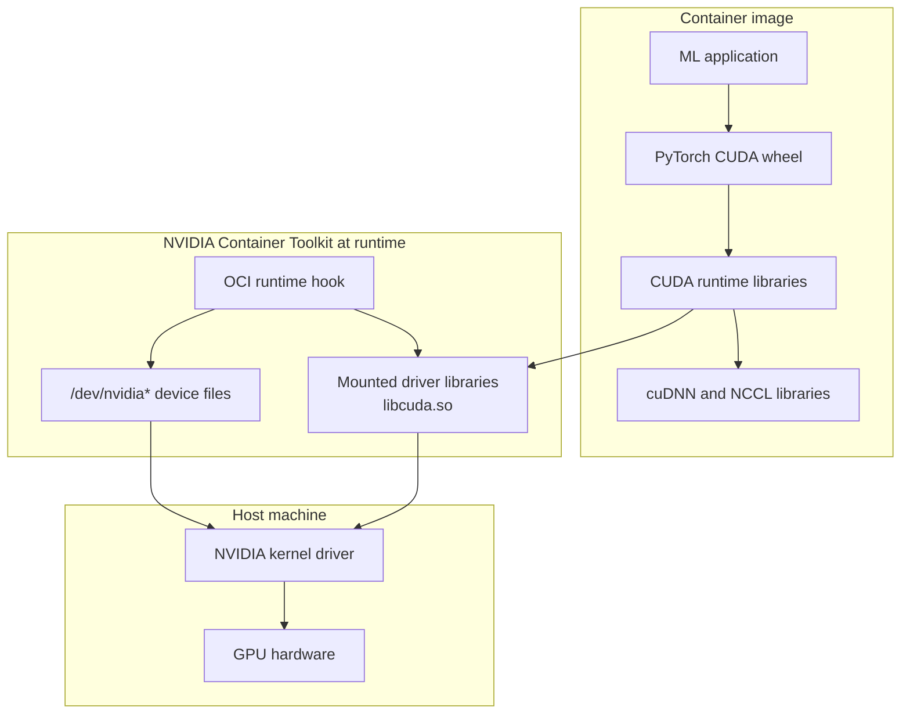

The compatibility rule is easier to remember if you think of the host driver as the ceiling. A newer host driver can usually run containers built with older CUDA user-space versions, but an older host driver cannot run a container that requires newer CUDA capabilities. If the container requires CUDA 12.4 behavior and the host driver only supports an older CUDA line, the application may fail with a driver version error even though the image itself built successfully.

```text
CUDA COMPATIBILITY REASONING
============================

Host driver capability        Container CUDA user space        Expected result
---------------------------   -----------------------------   ----------------------------
New enough for CUDA 12.4      CUDA 11.8                       Usually works
New enough for CUDA 12.4      CUDA 12.2                       Usually works
New enough for CUDA 12.0      CUDA 12.4                       Fails or behaves unsupported
No NVIDIA runtime mounted     Any CUDA image                  GPU invisible in container
CPU-only PyTorch wheel        CUDA libraries present          torch cannot use CUDA
```

A minimal GPU smoke test should prove three separate things: the host driver exists, the container can see the device, and your framework uses the expected CUDA build. Running `nvidia-smi` proves the first two in a coarse way, but it does not prove PyTorch was installed with CUDA support. A complete test checks both.

```bash
docker run --rm --gpus all nvidia/cuda:12.4.1-base-ubuntu22.04 nvidia-smi

docker run --rm --gpus all pytorch/pytorch:2.4.1-cuda12.4-cudnn9-runtime \
  python -c "import torch; print(torch.__version__); print(torch.cuda.is_available()); print(torch.cuda.get_device_name(0))"
```

A GPU training Dockerfile should start from a base image whose CUDA line matches the framework wheels you plan to install. Installing a CPU-only PyTorch wheel into a CUDA image is a surprisingly common mistake. The CUDA libraries may exist in the image, and `nvidia-smi` may work, but the Python framework still cannot schedule GPU kernels if the installed wheel was built for CPU execution.

```dockerfile
# GPU training image with explicit CUDA-aligned PyTorch installation.
FROM nvidia/cuda:12.4.1-cudnn-runtime-ubuntu22.04

ENV DEBIAN_FRONTEND=noninteractive

RUN apt-get update && apt-get install -y --no-install-recommends \
    python3.12 \
    python3-pip \
    python3.12-venv \
    libgomp1 \
    curl \
    tini \
    && rm -rf /var/lib/apt/lists/*

WORKDIR /app

RUN python3.12 -m venv /opt/venv
ENV PATH="/opt/venv/bin:$PATH"

RUN pip install --no-cache-dir --upgrade pip && \
    pip install --no-cache-dir \
      torch==2.4.1 \
      torchvision==0.19.1 \
      --index-url https://download.pytorch.org/whl/cu124

COPY requirements.txt .
RUN pip install --no-cache-dir -r requirements.txt

COPY src/ ./src/

ENV NVIDIA_VISIBLE_DEVICES=all \
    NVIDIA_DRIVER_CAPABILITIES=compute,utility \
    PYTHONUNBUFFERED=1

VOLUME ["/data", "/checkpoints", "/models"]

ENTRYPOINT ["tini", "--"]
CMD ["python", "-m", "src.train"]
```

The `tini` entrypoint is not cosmetic. Containers often run the application as process ID 1, and PID 1 has special signal-handling and child-reaping behavior on Linux. Training jobs that spawn data workers can leave zombie child processes if PID 1 does not reap them correctly. In long-running ML services, zombie accumulation can exhaust process table resources or make shutdown behavior unreliable during deployments.

**Active learning prompt:** Your container prints a valid `nvidia-smi` table, but `torch.cuda.is_available()` returns `False`. Which layer is now most suspicious? The host driver and runtime mount are probably working, so the next suspect is the Python framework installation: you may have installed a CPU-only PyTorch wheel, a wheel compiled for a different CUDA line, or a package set that overwrote the intended wheel.

GPU containers also need enough shared memory for workloads that use multiprocessing data loaders. Docker's default `/dev/shm` is small, and PyTorch workers can crash with bus errors when they pass tensors through shared memory. The fix is not to reduce model quality or remove workers blindly; the fix is to size shared memory for the workload and verify memory behavior under realistic batch sizes.

```bash
docker run --rm --gpus all \
  --shm-size=16g \
  -v "$(pwd)/data:/data:ro" \
  -v "$(pwd)/checkpoints:/checkpoints" \
  training-image:v1
```

In Kubernetes, the equivalent concerns become resource requests, GPU device plugins, shared memory volumes, and readiness behavior. Docker is still the right place to learn the mechanics because it lets you isolate the environment contract before adding scheduler complexity. When the container contract is clean locally, orchestration failures are easier to recognize.

### 5. Model Artifacts: Keep Images Portable Without Hiding State

ML containers differ from ordinary application containers because the model artifact can be larger than the application and dependencies combined. A small FastAPI service may be measured in megabytes, while a transformer checkpoint can be measured in many gigabytes. Baking that checkpoint into every image may improve cold start for one deployment, but it also slows builds, inflates registry storage, and makes rollback depend on transferring huge layers.

```text
MODEL ARTIFACT PLACEMENT OPTIONS
================================

Option                         Best fit
----------------------------   ------------------------------------------------------------
Bake into image                Small stable model, strict offline runtime, rare updates
Download at startup            Medium model, reliable network, acceptable warm-up time
Mount host or named volume     Local development, shared cache, repeated experiments
Use model registry             Production governance, versioning, approvals, rollbacks
Stream from object storage     Large artifacts, separate software and model release cycles
```

There is no universal answer because artifact strategy is an engineering trade-off. Baking a small preprocessing vocabulary into an image can be reasonable because the file is part of the software contract. Baking a large checkpoint into every image is usually harmful because each software patch becomes a model transfer event. Pulling from a registry at startup improves separation but requires readiness checks, retries, and observability around model loading.

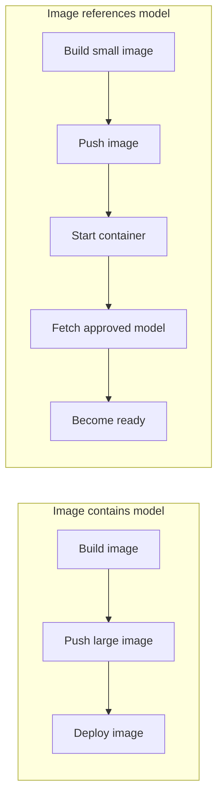

A robust runtime download path should be idempotent. The container may restart, multiple replicas may start at the same time, and a partially downloaded artifact may remain from a failed previous attempt. The application should download into a temporary path, verify the artifact, and then atomically promote it to the cache path. That pattern prevents serving a half-written model.

```python
# src/model_loader.py
from pathlib import Path
import os
import shutil
import tempfile

from huggingface_hub import snapshot_download

MODEL_ID = os.environ.get("MODEL_ID", "sentence-transformers/all-MiniLM-L6-v2")
CACHE_DIR = Path(os.environ.get("MODEL_CACHE_DIR", "/models"))


def local_model_dir(model_id: str) -> Path:
    return CACHE_DIR / model_id.replace("/", "--")


def ensure_model_present() -> Path:
    CACHE_DIR.mkdir(parents=True, exist_ok=True)
    target = local_model_dir(MODEL_ID)

    if target.exists() and any(target.iterdir()):
        return target

    with tempfile.TemporaryDirectory(dir=CACHE_DIR) as tmp_dir:
        downloaded = snapshot_download(
            repo_id=MODEL_ID,
            local_dir=tmp_dir,
            local_dir_use_symlinks=False,
        )
        if target.exists():
            shutil.rmtree(target)
        shutil.move(downloaded, target)

    return target
```

Volume mounts are useful because they decouple the container lifecycle from cached artifacts. Removing a container does not remove a named Docker volume unless you explicitly remove the volume. That is exactly what you want for repeated local experiments, but it can surprise learners who expect `docker rm` to clean every downloaded model file.

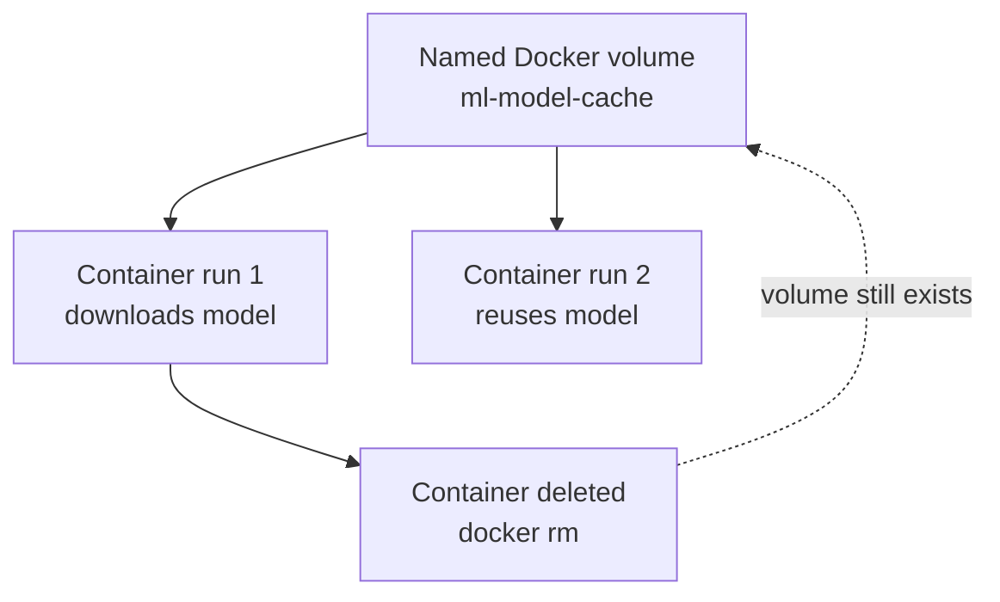

```bash
docker volume create ml-model-cache

docker run --rm \
  -e MODEL_CACHE_DIR=/models \
  -v ml-model-cache:/models \
  ml-api:v1

docker volume ls
docker volume inspect ml-model-cache
```

Model registries add governance that raw volume mounts do not provide. A registry can record who approved a model, which training data and metrics produced it, and which production stage it belongs to. The serving image can remain stable while `MODEL_NAME` and `MODEL_STAGE` select the model version at runtime, provided readiness checks fail closed when the requested model cannot be loaded.

```python
# src/serve_mlflow.py
import os

import mlflow.pyfunc

MLFLOW_TRACKING_URI = os.environ["MLFLOW_TRACKING_URI"]
MODEL_NAME = os.environ["MODEL_NAME"]
MODEL_STAGE = os.environ.get("MODEL_STAGE", "Production")


def load_model():
    mlflow.set_tracking_uri(MLFLOW_TRACKING_URI)
    model_uri = f"models:/{MODEL_NAME}/{MODEL_STAGE}"
    return mlflow.pyfunc.load_model(model_uri)
```

```bash
docker run --rm \
  -e MLFLOW_TRACKING_URI=http://mlflow:5000 \
  -e MODEL_NAME=fraud-detector \
  -e MODEL_STAGE=Production \
  -p 8000:8000 \
  ml-api:v1
```

The senior-level design question is whether software releases and model releases should be coupled. If the model format changes and the serving code must change with it, coupling may be appropriate for that release. If the model is updated daily but the serving code changes monthly, decoupling artifacts from images prevents unnecessary rebuilds and safer rollbacks.

### 6. Docker Compose for Local ML Systems

Real ML applications rarely run as one process. A local development environment may include an API server, a vector database, Redis, MLflow, Postgres, a notebook server, and a training worker. Running each service with a separate `docker run` command forces humans to remember networks, ports, environment variables, and startup order. Docker Compose captures those relationships in one file.

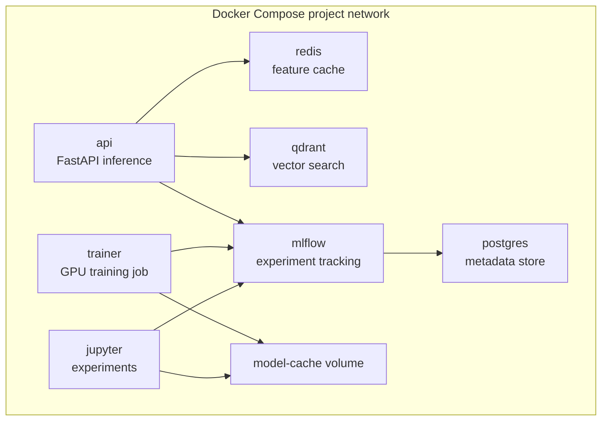

Compose gives each service a DNS name matching the service name. From the host, you might call `http://127.0.0.1:8000`. From another container in the same Compose network, the API should call `http://redis:6379` or `http://mlflow:5000`, not `127.0.0.1`, because each container has its own loopback interface. This is one of the most common networking mistakes in local containerized ML systems.

```yaml
services:
  api:
    build:
      context: .
      dockerfile: Dockerfile
    ports:
      - "8000:8000"
    environment:
      MODEL_CACHE_DIR: /models
      REDIS_URL: redis://redis:6379/0
      QDRANT_URL: http://qdrant:6333
      MLFLOW_TRACKING_URI: http://mlflow:5000
    volumes:
      - model-cache:/models
    depends_on:
      redis:
        condition: service_started
      qdrant:
        condition: service_started
      mlflow:
        condition: service_started
    healthcheck:
      test: ["CMD", "curl", "-fsS", "http://127.0.0.1:8000/ready"]
      interval: 30s
      timeout: 5s
      retries: 3

  redis:
    image: redis:7-alpine
    command: redis-server --appendonly yes
    volumes:
      - redis-data:/data

  qdrant:
    image: qdrant/qdrant:v1.12.5
    ports:
      - "6333:6333"
    volumes:
      - qdrant-data:/qdrant/storage

  mlflow:
    image: ghcr.io/mlflow/mlflow:v2.17.2
    ports:
      - "5000:5000"
    volumes:
      - mlflow-data:/mlflow
    command: >
      mlflow server
      --host 0.0.0.0
      --port 5000
      --backend-store-uri sqlite:////mlflow/mlflow.db
      --default-artifact-root /mlflow/artifacts

volumes:
  model-cache:
  redis-data:
  qdrant-data:
  mlflow-data:
```

Compose is a development tool, not a full production orchestrator. It can model service relationships and help teams reproduce a local stack, but it does not replace Kubernetes deployment policies, autoscaling, secret management, network policies, or production-grade storage. Its value is that it lets you debug the container contract before you add the complexity of a cluster.

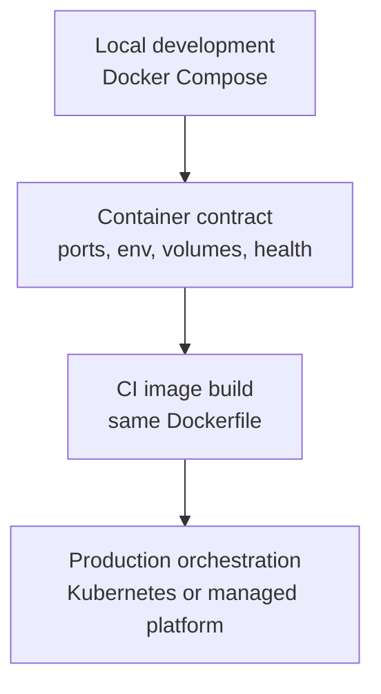

A useful Compose setup separates base configuration from local overrides. The base file describes services and environment contracts. The development override adds bind mounts, debug logging, and host ports. A production-like file uses prebuilt images and removes live source mounts so that the behavior matches deployment more closely.

```yaml
# docker-compose.yml
services:
  api:
    image: ml-api:${IMAGE_TAG:-dev}
    environment:
      MODEL_CACHE_DIR: /models
    volumes:
      - model-cache:/models

volumes:
  model-cache:
```

```yaml
# docker-compose.override.yml
services:
  api:
    build:
      context: .
      dockerfile: Dockerfile
    volumes:
      - ./src:/app/src
      - model-cache:/models
    ports:
      - "8000:8000"
    environment:
      LOG_LEVEL: DEBUG
      RELOAD: "true"
```

```yaml
# docker-compose.prod-like.yml
services:
  api:
    image: registry.example.com/ml-api:1.8.2
    ports:
      - "8000:8000"
    environment:
      LOG_LEVEL: INFO
      MODEL_URI: models:/fraud-detector/Production
```

When debugging Compose, inspect the actual generated configuration. Compose merges files, interpolates environment variables, and applies defaults, so the file you wrote is not always the configuration that runs. The `docker compose config` command is one of the fastest ways to find a missing variable, an unexpected image tag, or an accidental bind mount.

```bash
docker compose config
docker compose up -d
docker compose ps
docker compose logs -f api
docker compose exec api env | sort
docker compose exec api curl -fsS http://127.0.0.1:8000/ready
docker compose down
```

**Active learning prompt:** Your API container cannot connect to Redis, but `redis-cli` works from your host. The API uses `REDIS_URL=redis://127.0.0.1:6379/0`. What should you change, and why? Inside the API container, `127.0.0.1` points back to the API container itself, so the URL should use the Compose service name: `redis://redis:6379/0`.

### 7. Production Readiness: Security, Processes, and Economics

A production ML image must be reproducible, small enough to deploy quickly, observable enough to debug, and constrained enough to reduce blast radius. Those goals reinforce each other. Smaller images scan faster and deploy faster. Non-root users reduce the impact of application compromise. Clear entrypoints improve signal handling. Health checks prevent traffic from reaching containers that are alive but not ready.

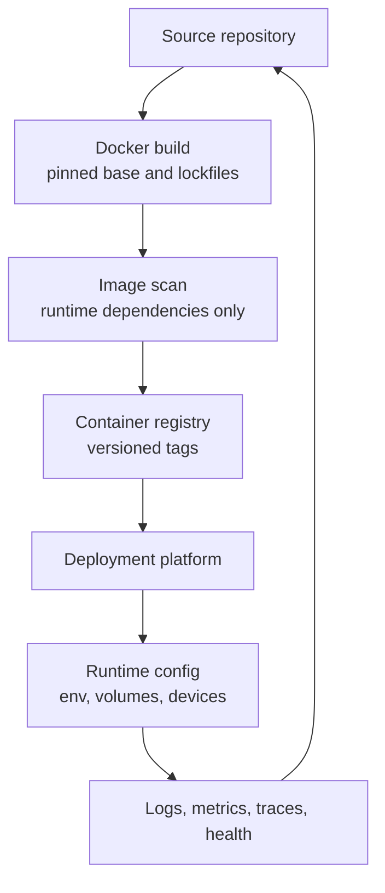

Running as root is rarely necessary for an ML API. A compromised root process inside a container is still constrained by container isolation, but it has more power over the container filesystem and any mounted volumes than an unprivileged user. If the service only needs to read model files and bind to a high port such as `8000`, an unprivileged UID is the better default.

Pinning image tags is another production control. The tag `latest` means the base image can change without a Dockerfile change, which makes rebuilds non-reproducible. A team might rebuild the same commit next week and unknowingly receive a different operating system patch set, different Python patch release, or different CUDA base. Security updates matter, but they should enter through deliberate rebuilds and tracked version changes.

```text
PRODUCTION IMAGE CONTRACT
=========================

Control                         Why it matters
-----------------------------   ----------------------------------------------------------
Pinned base image tag           Rebuilds are explainable and reviewable
Dependency lockfile             Python package graph stays stable
Non-root runtime user           Reduces write and privilege blast radius
Runtime-only final stage        Removes compilers and unused tools
Explicit health endpoints       Lets orchestrators route traffic safely
Tini or proper init behavior    Reaps child processes and handles signals
No baked secrets                Prevents credential leakage through image layers
Externalized large artifacts    Keeps deploys and rollbacks fast
```

The process model deserves special attention in ML containers. Training and serving code often starts subprocesses for data loading, tokenization, parallel inference, logging agents, or worker pools. If the container's PID 1 process does not handle `SIGTERM` and reap children, deployments can hang during shutdown or leave zombie processes behind. This is why a minimal init such as `tini` is often useful for Python ML containers.

```bash
docker run --rm ml-api:v1 ps -eo pid,ppid,stat,comm

docker exec ml-api ps -eo pid,ppid,stat,comm | awk '$3 ~ /Z/ { print }'
```

A zombie process is a child process that has exited but has not been reaped by its parent. It does not consume CPU, but it still occupies a process table entry and signals that process management is wrong. In ML services with worker pools, repeated worker crashes can create zombie accumulation that hides behind normal request logs until shutdown or process limits fail.

Resource limits should be tested with realistic workloads. An image that passes a single prediction can still fail when ten concurrent requests load tokenizers, allocate GPU memory, or fan out worker processes. For CPU services, inspect memory and thread behavior. For GPU services, inspect GPU memory allocation, batch sizing, and whether inference uses `torch.no_grad()` or `torch.inference_mode()`.

```python
# src/inference.py
import torch

model = None


def get_model():
    global model
    if model is None:
        model = load_model_from_registry()
        model.eval()
    return model


def predict(batch):
    with torch.inference_mode():
        return get_model()(batch)
```

The economic case for Docker in ML is not only developer convenience. Smaller, reproducible images reduce CI time, registry storage, node pull time, rollback duration, and incident ambiguity. The following comparison is approximate, but it captures why image design affects real operational cost.

| Cost Component | Poorly Designed ML Image | Well-Designed ML Image |
|---|---|---|
| CI rebuild time | Reinstalls dependencies after small source changes | Reuses dependency layers when manifests are unchanged |
| Registry storage | Stores repeated model and build-tool layers | Stores runtime software and references artifacts externally |
| Node pull time | Slow rollout because every node pulls huge layers | Faster rollout because layers are smaller and cached |
| Vulnerability noise | Flags compilers and unused tooling in runtime | Scans mostly runtime dependencies that actually ship |
| Rollback speed | Previous version requires pulling massive image | Previous software image and model pointer can roll back quickly |
| Incident diagnosis | Environment assumptions are scattered | Image, runtime config, and artifacts have clear boundaries |

A senior ML infrastructure engineer treats the image as one artifact in a larger release system. The image tag records the software environment. The model registry records the model artifact and evaluation metadata. Runtime configuration records which approved model the service should load. Observability records whether the running container actually loaded that model and is ready for traffic.

## Did You Know?

1. Docker popularized a developer-friendly image format and Dockerfile workflow in 2013, but the underlying Linux isolation primitives were already evolving through namespaces, cgroups, and earlier container tooling.

2. A Docker image can contain CUDA user-space libraries, but it does not contain the host's kernel-level NVIDIA driver; GPU access depends on runtime device injection and host driver compatibility.

3. Docker's default shared memory mount is often too small for multiprocessing-heavy ML workloads, which is why PyTorch DataLoader crashes can appear even when CPU, RAM, and GPU capacity look sufficient.

4. Removing a container with `docker rm` does not automatically delete named Docker volumes, so downloaded models can persist across container lifecycles until the volume itself is removed.

## Common Mistakes

| Mistake | Why It Happens | How to Fix |
|---|---|---|
| Using floating `latest` tags for base images | Rebuilds silently receive different operating system or framework layers, making incidents hard to reproduce. | Pin base images and upgrade them through reviewed dependency changes. |
| Placing `COPY . .` before dependency installation | Any source, notebook, or documentation change invalidates expensive dependency layers. | Copy lockfiles or requirement files first, install dependencies, then copy source. |
| Running ML services as root | The default container user is often root, and teams forget to change it after the prototype works. | Create a dedicated unprivileged user and use `USER` in the runtime stage. |
| Baking large model checkpoints into every image | It feels simple during the first deployment, but it couples software releases to artifact transfer. | Use a model registry, object storage download, or mounted cache unless the model is small and stable. |
| Assuming `nvidia-smi` proves PyTorch GPU support | `nvidia-smi` proves device visibility, not that the Python wheel was built with CUDA support. | Test both `nvidia-smi` and `torch.cuda.is_available()` inside the same container. |
| Ignoring `/dev/shm` for data loaders | Docker's default shared memory can be too small for tensor transfer across worker processes. | Set `--shm-size` or an equivalent orchestrator configuration and load-test worker behavior. |
| Leaving zombie worker processes unmanaged | Python training or serving code spawns children while PID 1 does not reap exited processes correctly. | Use `tini`, handle `SIGTERM`, inspect process state, and fix worker crash loops. |
| Treating Compose `127.0.0.1` as the host from inside containers | Each container has its own loopback interface, so localhost usually points to the same container. | Use Compose service DNS names such as `redis`, `qdrant`, or `mlflow` for container-to-container calls. |

## Quiz

<details>
<summary>1. Your team changes only `README.md`, but the CI image build still spends ten minutes reinstalling PyTorch and scikit-learn. What Dockerfile issue do you investigate first, and what change would you recommend?</summary>

The first issue to investigate is whether `COPY . .` appears before dependency installation. That order invalidates the dependency layer whenever any file in the build context changes. Recommend copying only dependency manifests first, installing dependencies in a cached layer, and copying source files afterward. Also add a `.dockerignore` so notebooks, datasets, checkpoints, and local outputs do not enter the build context.
</details>

<details>
<summary>2. A FastAPI model service starts successfully and returns `{"live": true}`, but the first real prediction fails because `/models/fraud-detector` is missing. How should the readiness design change?</summary>

The readiness check should verify the conditions required to serve traffic, not merely prove that the process is alive. Add a `/ready` endpoint that confirms the model path exists, the model is loaded, required memory is available, and any dependency services are reachable. Keep `/live` simple so the orchestrator does not restart a healthy process just because an external artifact store is temporarily slow.
</details>

<details>
<summary>3. Your GPU container prints a valid `nvidia-smi` table, but the application logs show `torch.cuda.is_available()` is `False`. What boundary has already been validated, and what do you check next?</summary>

The host driver and NVIDIA runtime device mount are at least partially validated because `nvidia-smi` can see the GPU from inside the container. The next boundary is the Python framework installation. Check whether the installed PyTorch wheel is CPU-only, whether it matches the intended CUDA line, and whether a later package installation replaced the GPU-capable wheel.
</details>

<details>
<summary>4. A training container crashes with a bus error only when `num_workers` is greater than zero in the PyTorch DataLoader. The host has plenty of RAM. What container setting is most likely missing?</summary>

The likely missing setting is a larger shared memory mount. PyTorch workers use shared memory to pass tensor data between processes, and Docker's default `/dev/shm` can be too small for that pattern. Run the container with a workload-appropriate `--shm-size`, then retest with the same batch size and worker count used in production.
</details>

<details>
<summary>5. A vulnerability scan flags `gcc`, `build-essential`, and other compilers in your production inference image. The service does not compile anything at runtime. How should the Dockerfile be redesigned?</summary>

Use a multi-stage build. Put compilers and build tools in a builder stage where Python wheels or native extensions are installed into a virtual environment. Copy only the resulting runtime environment and application source into a slim final stage. Keep runtime native libraries that compiled packages actually need, but omit compilers and build-only utilities from the final image.
</details>

<details>
<summary>6. Your Compose-based API service cannot reach Redis when configured with `redis://127.0.0.1:6379/0`, even though Redis is healthy and reachable from the host. What change fixes the service-to-service connection?</summary>

Inside the API container, `127.0.0.1` points to the API container itself, not the Redis container or the host. In Compose, services can reach each other by service name on the project network. Change the URL to `redis://redis:6379/0`, then verify with `docker compose exec api` from inside the API container.
</details>

<details>
<summary>7. A production image contains a large model checkpoint, and rollback during an incident takes too long because nodes must pull a huge image. What artifact strategy would you evaluate?</summary>

Evaluate decoupling the model artifact from the software image. The image can contain serving code and dependencies while loading an approved model from a registry, object storage location, or mounted cache at startup. This requires robust readiness checks and artifact verification, but it lets software rollbacks and model rollbacks happen without repeatedly transferring massive image layers.
</details>

<details>
<summary>8. A long-running inference container gradually accumulates zombie worker processes after request spikes, and deployments sometimes hang during shutdown. What container process concern should you address?</summary>

Address PID 1 behavior and child process reaping. Python applications that spawn workers need proper signal handling and a parent process that reaps exited children. Add a minimal init such as `tini`, ensure the application handles `SIGTERM`, inspect process states during load tests, and fix the worker crash path rather than only increasing process limits.
</details>

## Hands-On Exercise

In this exercise, you will build a small ML-style API container, improve its Dockerfile, run it with Compose, and debug the most common runtime boundaries. The goal is not to create a sophisticated model. The goal is to practice the same environment reasoning you will use for real training and inference systems.

### Task 1: Build a Naive ML API Image

Create a clean lab directory and a minimal API that behaves like an inference endpoint. This first image is intentionally naive so you can observe why it becomes expensive and fragile as the project grows.

```bash
mkdir -p ml-docker-lab/src
cd ml-docker-lab
```

```text
fastapi==0.115.6
uvicorn==0.34.0
scikit-learn==1.6.0
psutil==6.1.1
```

Save that dependency list as `requirements.txt`, then create the application file.

```python
# src/api.py
from fastapi import FastAPI

app = FastAPI()


@app.get("/live")
def live():
    return {"live": True}


@app.get("/ready")
def ready():
    return {"ready": True, "model_loaded": True}


@app.get("/predict")
def predict():
    return {"status": "success", "prediction": "mock_output"}
```

```dockerfile
# Dockerfile.naive
FROM python:3.12

WORKDIR /app
COPY . .
RUN pip install -r requirements.txt

CMD ["uvicorn", "src.api:app", "--host", "0.0.0.0", "--port", "8000"]
```

```bash
docker build -f Dockerfile.naive -t ml-naive:v1 .
docker image ls ml-naive:v1
docker run --rm -p 8000:8000 ml-naive:v1
```

Open a second terminal while the container is running and test the endpoint.

```bash
curl -fsS http://127.0.0.1:8000/predict
```

Success criteria:

- [ ] The image `ml-naive:v1` builds without dependency installation errors.
- [ ] `docker image ls ml-naive:v1` shows the image size so you can compare it later.
- [ ] The container starts and exposes the API on `127.0.0.1:8000`.
- [ ] The `/predict` endpoint returns `{"status":"success","prediction":"mock_output"}`.
- [ ] You can explain why changing any file in the directory can invalidate the dependency installation layer.

### Task 2: Replace the Naive Dockerfile with a Multi-Stage Runtime Image

Now create a more production-minded Dockerfile that separates dependency building from runtime execution. Keep the application behavior the same so the comparison focuses on image structure rather than feature changes.

```dockerfile
# Dockerfile
FROM python:3.12-slim AS builder

WORKDIR /build

RUN apt-get update && apt-get install -y --no-install-recommends \
    build-essential \
    gcc \
    libgomp1 \
    && rm -rf /var/lib/apt/lists/*

RUN python -m venv /opt/venv
ENV PATH="/opt/venv/bin:$PATH"

COPY requirements.txt .
RUN pip install --no-cache-dir --upgrade pip && \
    pip install --no-cache-dir -r requirements.txt

FROM python:3.12-slim AS runtime

WORKDIR /app

RUN apt-get update && apt-get install -y --no-install-recommends \
    libgomp1 \
    curl \
    tini \
    && rm -rf /var/lib/apt/lists/*

COPY --from=builder /opt/venv /opt/venv
ENV PATH="/opt/venv/bin:$PATH"

RUN groupadd --gid 10001 appgroup && \
    useradd --uid 10001 --gid appgroup --create-home --shell /usr/sbin/nologin appuser

COPY --chown=appuser:appgroup src/ ./src/

USER appuser

ENV PYTHONUNBUFFERED=1 \
    PYTHONDONTWRITEBYTECODE=1 \
    PYTHONPATH=/app

EXPOSE 8000

HEALTHCHECK --interval=30s --timeout=5s --start-period=10s --retries=3 \
    CMD curl -fsS http://127.0.0.1:8000/ready || exit 1

ENTRYPOINT ["tini", "--"]
CMD ["uvicorn", "src.api:app", "--host", "0.0.0.0", "--port", "8000"]
```

Create a `.dockerignore` file before building so the build context remains small and predictable.

```text
.git
.env
.env.*
__pycache__/
.pytest_cache/
.ruff_cache/
.ipynb_checkpoints/
notebooks/
data/
models/
checkpoints/
mlruns/
outputs/
*.pt
*.pth
*.onnx
*.safetensors
*.csv
*.parquet
```

```bash
docker build -t ml-api:v1 .
docker image ls ml-naive:v1 ml-api:v1
docker run --rm -p 8000:8000 ml-api:v1
```

Success criteria:

- [ ] The optimized image `ml-api:v1` builds successfully.
- [ ] The final image runs as a non-root user; verify with `docker run --rm ml-api:v1 id`.
- [ ] The final image includes runtime libraries but not unnecessary build compilers in the active runtime layer.
- [ ] The `/ready` endpoint returns a successful response.
- [ ] You can explain why `requirements.txt` is copied before `src/`.

### Task 3: Add Compose with Redis and Persistent Model Cache

Next, create a Compose stack that models a more realistic local ML environment. The API will run beside Redis and use a named volume for model cache state. This teaches service DNS names, persistent volumes, and the difference between host access and container-to-container access.

```yaml
# docker-compose.yml
services:
  api:
    image: ml-api:v1
    ports:
      - "8000:8000"
    environment:
      MODEL_CACHE_DIR: /models
      REDIS_URL: redis://redis:6379/0
    volumes:
      - model-cache:/models
    depends_on:
      redis:
        condition: service_started
    healthcheck:
      test: ["CMD", "curl", "-fsS", "http://127.0.0.1:8000/ready"]
      interval: 30s
      timeout: 5s
      retries: 3

  redis:
    image: redis:7-alpine
    command: redis-server --appendonly yes
    volumes:
      - redis-data:/data

volumes:
  model-cache:
  redis-data:
```

```bash
docker compose config
docker compose up -d
docker compose ps
docker compose logs api
curl -fsS http://127.0.0.1:8000/predict
docker compose exec api env | sort
docker compose down
docker volume ls | grep ml-docker-lab || true
```

Success criteria:

- [ ] `docker compose config` renders the expected service definitions without missing variables.
- [ ] Both `api` and `redis` services start successfully.
- [ ] The API is reachable from the host through `127.0.0.1:8000`.
- [ ] The API configuration uses `redis` as the service DNS name rather than `127.0.0.1`.
- [ ] After `docker compose down`, you can identify whether named volumes still exist.

### Task 4: Run a GPU Boundary Smoke Test When NVIDIA Hardware Is Available

Only run this task on a machine with an NVIDIA GPU, installed host drivers, and the NVIDIA Container Toolkit. If your machine does not have that hardware, read the commands and record which boundary each command validates.

```bash
docker run --rm --gpus all nvidia/cuda:12.4.1-base-ubuntu22.04 nvidia-smi
```

```bash
docker run --rm --gpus all pytorch/pytorch:2.4.1-cuda12.4-cudnn9-runtime \
  python -c "import torch; print(torch.__version__); print(torch.cuda.is_available()); print(torch.cuda.get_device_name(0))"
```

Create a GPU Compose smoke-test file if the direct Docker commands work.

```yaml
# docker-compose.gpu.yml
services:
  gpu-smoke:
    image: pytorch/pytorch:2.4.1-cuda12.4-cudnn9-runtime
    command: >
      python -c "import torch;
      print(torch.__version__);
      print(torch.cuda.is_available());
      print(torch.cuda.get_device_name(0))"
    deploy:
      resources:
        reservations:
          devices:
            - driver: nvidia
              count: 1
              capabilities: [gpu]
```

```bash
docker compose -f docker-compose.gpu.yml up --abort-on-container-exit
```

Success criteria:

- [ ] `nvidia-smi` runs inside a CUDA container, proving GPU device visibility.
- [ ] PyTorch reports `torch.cuda.is_available()` as `True` inside a PyTorch CUDA container.
- [ ] You can distinguish a host driver/runtime mount problem from a CPU-only PyTorch wheel problem.
- [ ] The Compose GPU smoke test exits successfully when NVIDIA hardware is available.
- [ ] If no NVIDIA hardware is available, you can explain which commands would validate each GPU boundary.

### Task 5: Debug Process and Shared Memory Behavior

Finally, inspect runtime process behavior and practice the checks that catch ML-specific container failures. This task is small, but it trains the habit of debugging the running container rather than guessing from the host.

```bash
docker run -d --name ml-api-debug -p 8000:8000 --shm-size=1g ml-api:v1
docker exec ml-api-debug ps -eo pid,ppid,stat,comm
docker exec ml-api-debug df -h /dev/shm
docker exec ml-api-debug curl -fsS http://127.0.0.1:8000/ready
docker logs ml-api-debug
docker stop ml-api-debug
docker rm ml-api-debug
```

Success criteria:

- [ ] You can identify the PID 1 process inside the container.
- [ ] `/dev/shm` reflects the shared-memory size you configured.
- [ ] The readiness endpoint works from inside the container.
- [ ] Container logs show the API startup path and shutdown path.
- [ ] You can explain why zombie processes and signal handling matter for ML services with worker pools.

## Next Module

Continue to [Module 1.3: CI/CD for AI/ML Development](./module-1.3-ci-cd-for-ai-ml-development.md) to turn reproducible containers into tested, versioned, and deployable ML delivery pipelines.

## Sources

- [Docker: What Is a Container?](https://www.docker.com/resources/what-container) — Good primary background for portability, shared-kernel isolation, and the container-vs-VM mental model.
- [OWASP Docker Security Cheat Sheet](https://cheatsheetseries.owasp.org/cheatsheets/Docker_Security_Cheat_Sheet.html) — Covers practical container hardening topics such as non-root users, capabilities, and runtime safety.
- [Sources of Irreproducibility in Machine Learning: A Review](https://arxiv.org/abs/2204.07610) — Provides a solid research-oriented framing for why environment control and reproducibility matter in ML workflows.
