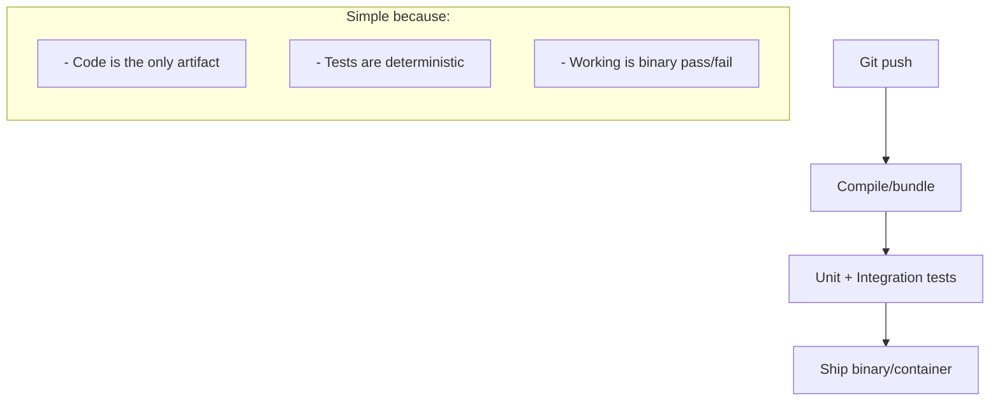
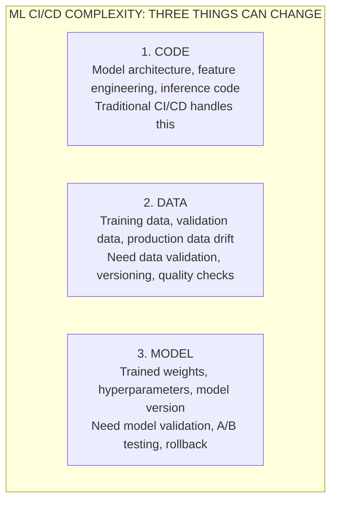
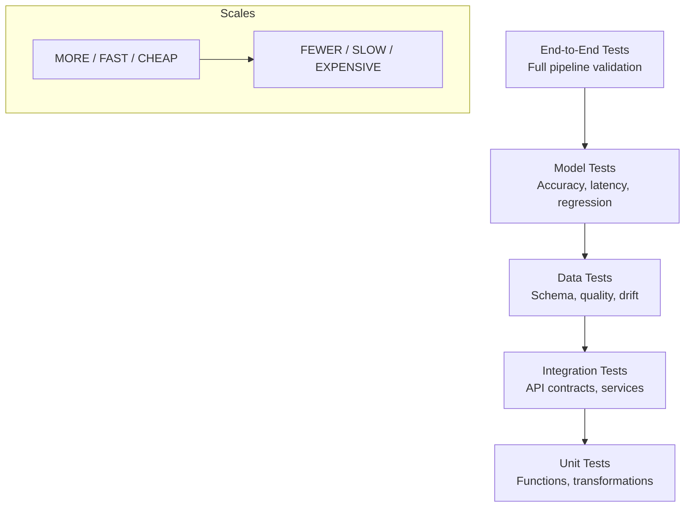
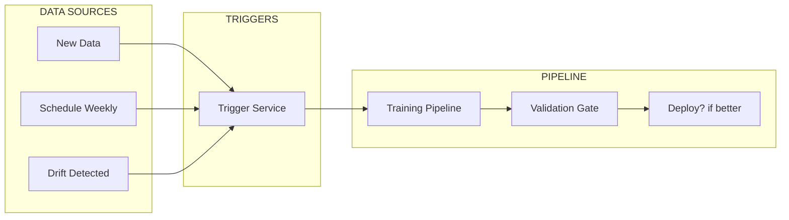
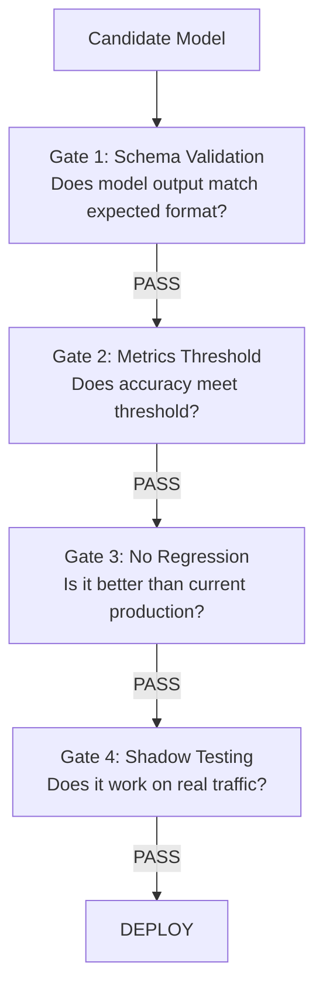
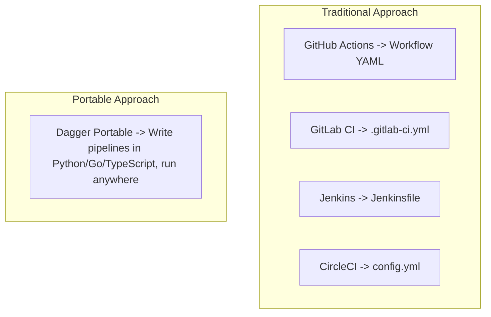

> **AI/ML Engineering Track** | Complexity: `[COMPLEX]` | Time: 5-6
---

A production recommendation system can fail at the worst possible time, which is why ML teams need automated checks before deployments reach users. 

A teammate retrained the model, checked offline accuracy, and deployed it without noticing that the new model was materially slower under production load.

Testing environments rarely capture the concurrency, latency, and edge-case behavior of production traffic, so teams need automated checks before a model can move safely from a developer laptop to production.

> "Traditional software can break in predictable ways: it compiles or it doesn't, tests pass or they don't. ML models break in subtle ways: they pass tests but give bad predictions, or good predictions but slowly, or fast predictions on training data but slow on production data. CI/CD for ML needs to catch all of it."
> Generalized from common production ML failure modes.

This module teaches you how to build the safety nets ML teams need before model changes reach production. By the end, you'll have CI/CD pipelines that catch bugs before production, validate models before deployment, and automatically retrain when data changes.

---

## Learning Outcomes

By the end of this module, you will be able to:
- **Diagnose** failure modes unique to Machine Learning pipelines that traditional software CI/CD misses.
- **Design** automated testing pipelines for data validation and model metric enforcement using GitHub Actions.
- **Implement** a Continuous Training (CT) workflow that safely handles automatic retraining when data drift occurs.
- **Evaluate** and construct strict Model Validation Gates to prevent regressions from reaching production environments.
- **Compare** vendor-specific YAML pipelines with portable execution strategies using Dagger.

---

## Why CI/CD for ML is Different

Before diving into the how, let's understand the why. CI/CD for ML isn't just "regular CI/CD with different tools." It's a fundamentally different problem with unique challenges.

Think of traditional software like building a house from blueprints. The blueprints (code) define exactly what the house will look like. If you follow them correctly, you get a predictable result. The house either matches the blueprints or it doesn't—there's no ambiguity.

ML is more like training a dog. You provide inputs (training data) and rewards (loss functions), and the dog (model) learns behaviors. But unlike blueprints, you can't perfectly predict what behaviors the dog will learn. Two dogs trained identically might behave slightly differently. And even a well-trained dog might behave unexpectedly in new situations.

### The Traditional CI/CD Pipeline

In standard software engineering, the artifacts are strictly deterministic code changes. 



### The ML CI/CD Challenge

The core challenge is that ML has THREE things that can change independently, and any of them can break your system. Traditional CI/CD only deals with code changes. ML CI/CD must handle code, data, AND model changes—each with its own testing requirements.



Any of these can trigger a pipeline! This is why CI/CD for ML is so complex—you're not just testing code. 

### Continuous X in ML

The continuous spectrum for ML introduces two entirely new paradigms:

```text
THE CONTINUOUS SPECTRUM
=======================

CI  (Continuous Integration)
    → Code changes trigger tests
    → Unit tests, linting, type checking
    → Same as traditional software

CD  (Continuous Delivery/Deployment)
    → Successful tests trigger deployment
    → Model packaging, container builds
    → Deploy to staging/production

CT  (Continuous Training) ← NEW FOR ML!
    → Data changes trigger retraining
    → Scheduled or event-driven
    → Automatic model updates

CM  (Continuous Monitoring) ← NEW FOR ML!
    → Track model performance in production
    → Detect data drift, model degradation
    → Trigger retraining when needed
```

> **Pause and predict**: If your model accuracy drops suddenly, but your code hasn't changed in three months, which component of the "Continuous X" spectrum should theoretically catch the drop and initiate a fix?

---

## GitHub Actions for ML

GitHub Actions is a common CI/CD option for ML projects because it is built into GitHub and supports hosted runners, schedules, and matrix workflows.

Think of GitHub Actions like a programmable robot assistant that watches your repository. When you push code, create a pull request, or on a schedule, the robot wakes up and follows the instructions you've given it. 

### Anatomy of a Workflow

Here is a standard foundational setup for an ML project workflow.

```yaml
# .github/workflows/ml-pipeline.yml
name: ML Pipeline

# Triggers
on:
  push:
    branches: [main, develop]
    paths:
      - 'src/**'
      - 'tests/**'
      - 'requirements.txt'
  pull_request:
    branches: [main]
  schedule:
    - cron: '0 0 * * 0'  # Weekly retraining
  workflow_dispatch:      # Manual trigger

# Environment variables
env:
  PYTHON_VERSION: '3.10'
  MODEL_REGISTRY: 'models'

# Jobs
jobs:
  test:
    runs-on: ubuntu-latest
    steps:
      - uses: actions/checkout@v4
      - uses: actions/setup-python@v5
        with:
          python-version: ${{ env.PYTHON_VERSION }}
      - run: pip install -r requirements.txt
      - run: pytest tests/
```

### ML-Specific Workflow Patterns

To address the complexity of ML testing, your jobs should be split systematically to validate the code, data, and model stages sequentially. 

```yaml
# Pattern 1: Code Quality + ML Tests
jobs:
  code-quality:
    runs-on: ubuntu-latest
    steps:
      - uses: actions/checkout@v4
      - name: Lint
        run: ruff check src/
      - name: Type Check
        run: mypy src/
      - name: Format Check
        run: black --check src/

  unit-tests:
    runs-on: ubuntu-latest
    steps:
      - uses: actions/checkout@v4
      - name: Run unit tests
        run: pytest tests/unit/ -v

  data-tests:
    runs-on: ubuntu-latest
    steps:
      - uses: actions/checkout@v4
      - name: Validate data schema
        run: python -m src.validate_data
      - name: Check data quality
        run: pytest tests/data/ -v

  model-tests:
    runs-on: ubuntu-latest
    needs: [unit-tests, data-tests]
    steps:
      - uses: actions/checkout@v4
      - name: Load model
        run: python -m src.load_model
      - name: Run model tests
        run: pytest tests/model/ -v
      - name: Check model metrics
        run: python -m src.validate_metrics
```

### Caching for ML Workflows

Because ML repositories often pull heavy dependencies and large model artifacts, caching is usually important for keeping CI runtimes practical.

```yaml
# Cache dependencies (saves 2-5 minutes)
- uses: actions/cache@v4
  with:
    path: ~/.cache/pip
    key: ${{ runner.os }}-pip-${{ hashFiles('requirements.txt') }}
    restore-keys: |
      ${{ runner.os }}-pip-

# Cache model artifacts (saves download time)
- uses: actions/cache@v4
  with:
    path: models/
    key: models-${{ hashFiles('models/config.json') }}

# Cache Hugging Face models
- uses: actions/cache@v4
  with:
    path: ~/.cache/huggingface
    key: hf-${{ hashFiles('requirements.txt') }}
```

---

## Testing Strategies for ML

Testing ML systems requires thinking in layers. Unlike traditional software where you're mainly checking "does this function return the right value?", ML testing asks questions like "is this data clean?", "is this model accurate enough?", "is this model fast enough?", and "did this model get worse since last week?"

### The ML Testing Pyramid



### Unit Tests for ML Code

Unit tests for ML code follow the same principles as traditional software, but focus on the data transformation functions rather than business logic. These are your bread-and-butter tests: fast, deterministic, and numerous.

```python
# tests/unit/test_preprocessing.py
import pytest
import numpy as np
from src.preprocessing import normalize, tokenize, extract_features

class TestNormalize:
    """Test normalization functions."""

    def test_normalize_zero_mean(self):
        """Output should have zero mean."""
        data = np.array([1, 2, 3, 4, 5])
        result = normalize(data)
        assert np.isclose(result.mean(), 0, atol=1e-7)

    def test_normalize_unit_variance(self):
        """Output should have unit variance."""
        data = np.array([1, 2, 3, 4, 5])
        result = normalize(data)
        assert np.isclose(result.std(), 1, atol=1e-7)

    def test_normalize_handles_constant(self):
        """Should handle constant arrays without division by zero."""
        data = np.array([5, 5, 5, 5, 5])
        result = normalize(data)
        assert not np.any(np.isnan(result))

    def test_normalize_empty_array(self):
        """Should raise on empty input."""
        with pytest.raises(ValueError):
            normalize(np.array([]))


class TestTokenize:
    """Test tokenization functions."""

    def test_tokenize_basic(self):
        """Basic tokenization should split on whitespace."""
        text = "Hello world"
        tokens = tokenize(text)
        assert tokens == ["hello", "world"]

    def test_tokenize_handles_punctuation(self):
        """Should remove punctuation."""
        text = "Hello, world!"
        tokens = tokenize(text)
        assert tokens == ["hello", "world"]

    def test_tokenize_max_length(self):
        """Should respect max_length parameter."""
        text = "one two three four five"
        tokens = tokenize(text, max_length=3)
        assert len(tokens) == 3
```

### Data Quality Tests

Data quality tests are the ML-specific layer that traditional software doesn't have. They answer questions like: Is the data schema correct? Are there unexpected nulls? Is the class distribution what we expected?

```python
# tests/data/test_data_quality.py
import pytest
import pandas as pd
from src.data import load_training_data

@pytest.fixture
def training_data():
    """Load training data for tests."""
    return load_training_data()

class TestDataSchema:
    """Verify data schema expectations."""

    def test_required_columns_exist(self, training_data):
        """All required columns must be present."""
        required = ['text', 'label', 'timestamp', 'source']
        missing = set(required) - set(training_data.columns)
        assert not missing, f"Missing columns: {missing}"

    def test_no_null_in_required_fields(self, training_data):
        """Required fields should not have nulls."""
        required = ['text', 'label']
        for col in required:
            null_count = training_data[col].isnull().sum()
            assert null_count == 0, f"{col} has {null_count} nulls"

    def test_label_values_valid(self, training_data):
        """Labels should be in expected set."""
        valid_labels = {0, 1, 2}  # negative, neutral, positive
        actual_labels = set(training_data['label'].unique())
        invalid = actual_labels - valid_labels
        assert not invalid, f"Invalid labels: {invalid}"


class TestDataQuality:
    """Verify data quality expectations."""

    def test_minimum_samples(self, training_data):
        """Should have minimum number of samples."""
        min_samples = 1000
        assert len(training_data) >= min_samples

    def test_class_balance(self, training_data):
        """Classes should be reasonably balanced."""
        label_counts = training_data['label'].value_counts()
        min_ratio = label_counts.min() / label_counts.max()
        assert min_ratio >= 0.1, f"Class imbalance ratio: {min_ratio}"

    def test_text_length_distribution(self, training_data):
        """Text lengths should be within expected range."""
        lengths = training_data['text'].str.len()
        assert lengths.min() >= 10, "Text too short"
        assert lengths.max() <= 10000, "Text too long"
        assert lengths.median() >= 50, "Median text length too short"

    def test_no_duplicate_texts(self, training_data):
        """Should not have duplicate texts."""
        duplicates = training_data['text'].duplicated().sum()
        duplicate_ratio = duplicates / len(training_data)
        assert duplicate_ratio < 0.01, f"Duplicate ratio: {duplicate_ratio:.2%}"
```

### Model Quality Tests

Model quality tests verify that your model actually does what it's supposed to do. These tests ensure predictions are within reasonable bounds, inference is fast enough, and the new model is at least as good as the old one.

```python
# tests/model/test_model_quality.py
import pytest
import time
import numpy as np
from src.model import load_model, predict

@pytest.fixture(scope="module")
def model():
    """Load model once for all tests."""
    return load_model("models/production/model.pt")

@pytest.fixture
def test_samples():
    """Sample inputs for testing."""
    return [
        "This product is amazing!",
        "Terrible experience, never again.",
        "It's okay, nothing special.",
    ]

class TestModelAccuracy:
    """Verify model accuracy thresholds."""

    def test_accuracy_above_threshold(self, model):
        """Model accuracy should meet minimum threshold."""
        from src.evaluate import evaluate_on_test_set
        metrics = evaluate_on_test_set(model)
        assert metrics['accuracy'] >= 0.85, f"Accuracy {metrics['accuracy']}"

    def test_f1_score_above_threshold(self, model):
        """F1 score should meet minimum threshold."""
        from src.evaluate import evaluate_on_test_set
        metrics = evaluate_on_test_set(model)
        assert metrics['f1'] >= 0.80, f"F1 {metrics['f1']}"

    def test_no_class_collapse(self, model, test_samples):
        """Model should predict multiple classes."""
        predictions = [predict(model, text) for text in test_samples * 10]
        unique_predictions = set(predictions)
        assert len(unique_predictions) >= 2, "Model collapsed to single class"


class TestModelLatency:
    """Verify model inference performance."""

    def test_single_inference_latency(self, model, test_samples):
        """Single inference should be fast."""
        text = test_samples[0]

        start = time.perf_counter()
        predict(model, text)
        latency_ms = (time.perf_counter() - start) * 1000

        assert latency_ms < 100, f"Latency {latency_ms:.1f}ms exceeds 100ms"

    def test_batch_inference_latency(self, model, test_samples):
        """Batch inference should scale efficiently."""
        batch = test_samples * 100  # 300 samples

        start = time.perf_counter()
        for text in batch:
            predict(model, text)
        total_ms = (time.perf_counter() - start) * 1000

        per_sample_ms = total_ms / len(batch)
        assert per_sample_ms < 50, f"Per-sample latency {per_sample_ms:.1f}ms"


class TestModelRegression:
    """Verify model doesn't regress from baseline."""

    def test_no_accuracy_regression(self, model):
        """New model should not be worse than baseline."""
        from src.evaluate import evaluate_on_test_set, load_baseline_metrics

        current = evaluate_on_test_set(model)
        baseline = load_baseline_metrics()

        # Allow 1% regression tolerance
        min_accuracy = baseline['accuracy'] * 0.99
        assert current['accuracy'] >= min_accuracy, (
            f"Regression: {current['accuracy']:.3f} < {min_accuracy:.3f}"
        )
```

---

## Continuous Training (CT)

Continuous Training is the ML-specific addition to the traditional CI/CD acronym soup. Why do we need this? Because ML models decay. The data they were trained on becomes stale. A model trained on 2022 data might make terrible predictions in 2026 because the underlying patterns have shifted.

### CT Architecture



### Scheduled Retraining Workflow

```yaml
# .github/workflows/continuous-training.yml
name: Continuous Training

on:
  schedule:
    - cron: '0 2 * * 0'  # Every Sunday at 2 AM
  workflow_dispatch:
    inputs:
      force_deploy:
        description: 'Deploy even if metrics are worse'
        required: false
        default: 'false'

jobs:
  fetch-data:
    runs-on: ubuntu-latest
    steps:
      - uses: actions/checkout@v4

      - name: Fetch latest training data
        run: |
          python -m src.data.fetch \
            --start-date $(date -d '7 days ago' +%Y-%m-%d) \
            --end-date $(date +%Y-%m-%d) \
            --output data/new/

      - name: Upload data artifact
        uses: actions/upload-artifact@v4
        with:
          name: training-data
          path: data/new/

  train:
    needs: fetch-data
    runs-on: ubuntu-latest
    steps:
      - uses: actions/checkout@v4

      - name: Download data
        uses: actions/download-artifact@v4
        with:
          name: training-data
          path: data/new/

      - name: Train model
        run: |
          python -m src.train \
            --data data/new/ \
            --output models/candidate/ \
            --experiment-name "weekly-retrain-${{ github.run_id }}"

      - name: Upload model
        uses: actions/upload-artifact@v4
        with:
          name: candidate-model
          path: models/candidate/

  validate:
    needs: train
    runs-on: ubuntu-latest
    outputs:
      should_deploy: ${{ steps.compare.outputs.should_deploy }}
    steps:
      - uses: actions/checkout@v4

      - name: Download candidate model
        uses: actions/download-artifact@v4
        with:
          name: candidate-model
          path: models/candidate/

      - name: Download production model
        run: |
          aws s3 cp s3://models/production/ models/production/ --recursive

      - name: Compare models
        id: compare
        run: |
          python -m src.evaluate.compare \
            --candidate models/candidate/ \
            --baseline models/production/ \
            --output metrics.json

          # Check if candidate is better
          BETTER=$(python -c "
          import json
          m = json.load(open('metrics.json'))
          print('true' if m['candidate']['accuracy'] > m['baseline']['accuracy'] else 'false')
          ")
          echo "should_deploy=$BETTER" >> $GITHUB_OUTPUT

  deploy:
    needs: validate
    if: needs.validate.outputs.should_deploy == 'true' || github.event.inputs.force_deploy == 'true'
    runs-on: ubuntu-latest
    steps:
      - uses: actions/checkout@v4

      - name: Download candidate model
        uses: actions/download-artifact@v4
        with:
          name: candidate-model
          path: models/candidate/

      - name: Deploy to production
        run: |
          # Upload to S3
          aws s3 cp models/candidate/ s3://models/production/ --recursive

          # Update Kubernetes deployment (requires v1.35+ cluster compatibility)
          kubectl set image deployment/model-server \
            model=myregistry/model:${{ github.sha }}

      - name: Notify
        run: |
          curl -X POST ${{ secrets.SLACK_WEBHOOK }} \
            -d '{"text": "New model deployed! Run: ${{ github.run_id }}"}'
```

---

## Model Validation Gates

Validation gates are automated checkpoints that a model must pass before deployment. 



### Implementation

```python
# src/validation/gates.py
from dataclasses import dataclass
from typing import Callable, Optional
from enum import Enum

class GateStatus(Enum):
    PASSED = "passed"
    FAILED = "failed"
    SKIPPED = "skipped"

@dataclass
class GateResult:
    gate_name: str
    status: GateStatus
    message: str
    metrics: dict = None

class ValidationGate:
    """Base class for validation gates."""

    def __init__(self, name: str, required: bool = True):
        self.name = name
        self.required = required

    def check(self, model, context: dict) -> GateResult:
        raise NotImplementedError


class MetricsThresholdGate(ValidationGate):
    """Check if model meets minimum metrics thresholds."""

    def __init__(
        self,
        thresholds: dict,
        name: str = "metrics_threshold",
    ):
        super().__init__(name)
        self.thresholds = thresholds

    def check(self, model, context: dict) -> GateResult:
        metrics = context.get('metrics', {})

        failures = []
        for metric, threshold in self.thresholds.items():
            value = metrics.get(metric, 0)
            if value < threshold:
                failures.append(
                    f"{metric}: {value:.3f} < {threshold:.3f}"
                )

        if failures:
            return GateResult(
                gate_name=self.name,
                status=GateStatus.FAILED,
                message=f"Thresholds not met: {', '.join(failures)}",
                metrics=metrics,
            )

        return GateResult(
            gate_name=self.name,
            status=GateStatus.PASSED,
            message="All thresholds met",
            metrics=metrics,
        )


class NoRegressionGate(ValidationGate):
    """Check that new model isn't worse than baseline."""

    def __init__(
        self,
        metric: str = "accuracy",
        tolerance: float = 0.01,
        name: str = "no_regression",
    ):
        super().__init__(name)
        self.metric = metric
        self.tolerance = tolerance

    def check(self, model, context: dict) -> GateResult:
        current = context.get('metrics', {}).get(self.metric, 0)
        baseline = context.get('baseline_metrics', {}).get(self.metric, 0)

        min_allowed = baseline * (1 - self.tolerance)

        if current < min_allowed:
            return GateResult(
                gate_name=self.name,
                status=GateStatus.FAILED,
                message=f"Regression: {current:.3f} < {min_allowed:.3f}",
                metrics={"current": current, "baseline": baseline},
            )

        return GateResult(
            gate_name=self.name,
            status=GateStatus.PASSED,
            message=f"No regression: {current:.3f} >= {min_allowed:.3f}",
            metrics={"current": current, "baseline": baseline},
        )


class ValidationPipeline:
    """Run model through validation gates."""

    def __init__(self, gates: list[ValidationGate]):
        self.gates = gates

    def validate(self, model, context: dict) -> tuple[bool, list[GateResult]]:
        results = []
        all_passed = True

        for gate in self.gates:
            result = gate.check(model, context)
            results.append(result)

            if result.status == GateStatus.FAILED and gate.required:
                all_passed = False
                break  # Stop on first required failure

        return all_passed, results
```

---

## Portable CI/CD with Dagger

Many CI systems use their own workflow definitions, which makes pipeline logic harder to move between platforms without adaptation. Dagger solves this problem by allowing you to [write your pipeline in Python/Go/TypeScript](https://github.com/dagger/dagger). 



### Dagger Pipeline Example

```python
# dagger/pipeline.py
import dagger
from dagger import dag, function, object_type

@object_type
class MLPipeline:
    """ML Pipeline with Dagger."""

    @function
    async def test(self, source: dagger.Directory) -> str:
        """Run tests on the ML code."""
        return await (
            dag.container()
            .from_("python:3.10-slim")
            .with_directory("/app", source)
            .with_workdir("/app")
            .with_exec(["pip", "install", "-r", "requirements.txt"])
            .with_exec(["pip", "install", "pytest"])
            .with_exec(["pytest", "tests/", "-v"])
            .stdout()
        )

    @function
    async def lint(self, source: dagger.Directory) -> str:
        """Lint the code."""
        return await (
            dag.container()
            .from_("python:3.10-slim")
            .with_directory("/app", source)
            .with_workdir("/app")
            .with_exec(["pip", "install", "ruff", "mypy"])
            .with_exec(["ruff", "check", "src/"])
            .with_exec(["mypy", "src/"])
            .stdout()
        )

    @function
    async def train(
        self,
        source: dagger.Directory,
        data: dagger.Directory,
        epochs: int = 10,
    ) -> dagger.Directory:
        """Train the model."""
        return await (
            dag.container()
            .from_("pytorch/pytorch:2.0.1-cuda11.8-cudnn8-runtime")
            .with_directory("/app", source)
            .with_directory("/data", data)
            .with_workdir("/app")
            .with_exec(["pip", "install", "-r", "requirements.txt"])
            .with_exec([
                "python", "-m", "src.train",
                "--data", "/data",
                "--output", "/models",
                "--epochs", str(epochs),
            ])
            .directory("/models")
        )

    @function
    async def build_image(
        self,
        source: dagger.Directory,
        model: dagger.Directory,
    ) -> str:
        """Build production Docker image."""
        container = (
            dag.container()
            .from_("python:3.10-slim")
            .with_directory("/app", source)
            .with_directory("/app/models", model)
            .with_workdir("/app")
            .with_exec(["pip", "install", "-r", "requirements.txt"])
            .with_entrypoint(["python", "-m", "src.serve"])
        )

        # Publish to registry
        address = await container.publish(
            f"myregistry/ml-model:latest"
        )
        return address

    @function
    async def full_pipeline(
        self,
        source: dagger.Directory,
        data: dagger.Directory,
    ) -> str:
        """Run the complete ML pipeline."""
        # Run tests and lint in parallel
        test_result = self.test(source)
        lint_result = self.lint(source)

        # Wait for both
        await test_result
        await lint_result

        # Train model
        model = await self.train(source, data)

        # Build and publish image
        image = await self.build_image(source, model)

        return f"Pipeline complete! Image: {image}"
```

### Running Dagger Locally

```bash
# Install Dagger CLI
curl -L https://dl.dagger.io/dagger/install.sh | sh

# Run pipeline locally
dagger call test --source=.

# Run full pipeline
dagger call full-pipeline --source=. --data=./data/

# Call from GitHub Actions
# .github/workflows/dagger.yml
name: Dagger Pipeline
on: push
jobs:
  build:
    runs-on: ubuntu-latest
    steps:
      - uses: actions/checkout@v4
      - uses: dagger/dagger-for-github@v5
        with:
          verb: call
          args: full-pipeline --source=. --data=./data/
```

---

## Workflow Patterns for ML

### Pattern 1: PR Validation

```yaml
# .github/workflows/pr-validation.yml
name: PR Validation

on:
  pull_request:
    branches: [main]

jobs:
  quick-checks:
    runs-on: ubuntu-latest
    steps:
      - uses: actions/checkout@v4
      - name: Lint & Format
        run: |
          pip install ruff black
          ruff check src/
          black --check src/

  unit-tests:
    runs-on: ubuntu-latest
    steps:
      - uses: actions/checkout@v4
      - name: Unit Tests
        run: |
          pip install -r requirements.txt pytest
          pytest tests/unit/ -v --tb=short

  model-smoke-test:
    runs-on: ubuntu-latest
    needs: unit-tests
    steps:
      - uses: actions/checkout@v4
      - name: Quick Model Test
        run: |
          pip install -r requirements.txt
          python -m src.test_model --quick
```

### Pattern 2: Release Pipeline

```yaml
# .github/workflows/release.yml
name: Release

on:
  push:
    tags:
      - 'v*'

jobs:
  build-and-test:
    runs-on: ubuntu-latest
    steps:
      - uses: actions/checkout@v4
      - name: Full Test Suite
        run: pytest tests/ -v

  build-image:
    needs: build-and-test
    runs-on: ubuntu-latest
    steps:
      - uses: actions/checkout@v4
      - name: Build Docker Image
        run: |
          docker build -t myapp:${{ github.ref_name }} .

      - name: Push to Registry
        run: |
          docker push myapp:${{ github.ref_name }}

  deploy-staging:
    needs: build-image
    runs-on: ubuntu-latest
    environment: staging
    steps:
      - name: Deploy to Staging
        run: |
          kubectl set image deployment/app app=myapp:${{ github.ref_name }}

  deploy-production:
    needs: deploy-staging
    runs-on: ubuntu-latest
    environment: production
    steps:
      - name: Deploy to Production
        run: |
          kubectl set image deployment/app app=myapp:${{ github.ref_name }}
```

### Pattern 3: Matrix Testing

```yaml
# Test across multiple Python versions and OS
jobs:
  test:
    runs-on: ${{ matrix.os }}
    strategy:
      matrix:
        os: [ubuntu-latest, macos-latest]
        python-version: ['3.9', '3.10', '3.11']
        exclude:
          - os: macos-latest
            python-version: '3.9'

    steps:
      - uses: actions/checkout@v4
      - uses: actions/setup-python@v5
        with:
          python-version: ${{ matrix.python-version }}
      - run: pytest tests/
```

> **Stop and think**: If your matrix tests pass on Linux but fail on macOS for a random seed generator, which part of the testing pyramid needs an enforced standard for OS-independent determinism? 

---

## Did You Know?

1. **TFX is a well-known example of a production ML pipeline framework.** It uses a component-based architecture for tasks such as data validation, transformation, training, evaluation, and serving.
2. **GitHub Actions includes free usage tiers** and standard GitHub-hosted runners are free for public repositories. The exact minutes available for private repositories depend on your GitHub plan, runner type, and how heavy your workflows are.
3. **Uber's Michelangelo is a well-known example of an internal ML platform at production scale.** It is often discussed as an example of why mature ML organizations invest in training, deployment, monitoring, and safety systems.
4. **Dagger emerged in the early 2020s as a portable, container-based CI/CD tool.** Its appeal is that the same pipeline logic can run more consistently across local machines and CI environments.

---

## Common Mistakes and How to Avoid Them

| Mistake | Why It Happens | How to Fix It |
| :--- | :--- | :--- |
| **Testing in Production Only** | "We'll catch issues in production anyway, it's faster to deploy." | Mirror production logic in CI. Use production data samples (anonymized) for local pipeline validation before merging. |
| **Manual Approval Bottlenecks** | Over-reliance on humans checking subjective metrics delays model delivery by days. | Build automated validation gates for objective criteria (latency, basic regression) and limit human intervention to major logic shifts. |
| **Not Versioning Data** | Code is in git, but models draw from a random `s3://bucket/data_latest.csv`. | Use tools like DVC. Commit `data.csv.dvc` alongside code so the git hash represents exact training states. |
| **Ignoring GPU Build Costs** | Running a full training epoch on every PR commit adds up to $100+ daily. | Apply path filters in GitHub Actions. Skip heavy model rebuilds if only a documentation or linting change occurred. |
| **Silent Failures on Corrupt Data** | A data pipeline injects NaN or Null randomly, and the model trains anyway. | Codify assumptions in schema tests. Hard-fail the pipeline if null counts exceed 0% on mandatory feature columns. |
| **Overfitting the "Happy Path" Test** | The test suite only evaluates samples the model historically predicted perfectly. | Implement "Failure Mode" tests utilizing adversarial or minority-demographic datasets to explicitly measure fairness drift. |

### Mistake Deep Dive: Not Versioning Data

Code is versioned in git. Models are versioned in MLflow. But data? Often it lives in a bucket and nobody tracks which version was used for which model.

**The problem:**
```python
# Which data did this model use?
model_v3.pt  # No idea. The S3 bucket was updated since training.
```

**The solution:**
```python
# DVC (Data Version Control) tracks data alongside code
dvc add data/training.csv
git add data/training.csv.dvc
git commit -m "Training data v3 - added October examples"
```

---

## Production War Stories: When CI/CD Fails

### The Model That Passed All Tests (But Was Wrong)

A model can pass conventional CI checks and still ship harmful behavior if the pipeline only verifies aggregate metrics and basic regression tests.

Teams sometimes discover after deployment that a model performs acceptably overall while still harming specific subgroups or proxy features they never tested explicitly.

**What went wrong?** Their tests validated accuracy but not fairness. The model performed well on aggregate metrics while discriminating against specific groups.

**The fix:**
1. Added fairness tests: disparate impact ratio, equalized odds
2. Slice-based evaluation: accuracy per demographic group
3. "Failure mode" test suite: adversarial examples designed to catch biases

### The Surprise GPU Bill

A misconfigured CI pipeline can accidentally trigger expensive retraining jobs on every pull request, especially when GPU stages are not gated by path filters, caching, or budget alerts.

**What went wrong?**
1. No cost alerts or budgets
2. Training jobs ran on A100s regardless of changes
3. No caching of unchanged model artifacts
4. PRs didn't distinguish "code that affects training" from "documentation changes"

**The fix:**
1. Path filters: only run expensive jobs when ML code changes
2. Smaller models for PR validation, full training only on merge
3. Cost alerts at $1000/day
4. Caching: skip training if data and code haven't changed

---

## The Economics of CI/CD for ML

Understanding costs helps you design efficient pipelines.

| Component | Typical Cost | Optimization Strategy |
|-----------|--------------|----------------------|
| Compute (CPU) | $0.05/minute | Use smaller instances for tests |
| Compute (GPU) | $0.50-3.00/minute | Run only when needed |
| Storage | $0.02/GB/month | Clean up old artifacts |
| Network transfer | $0.09/GB | Cache locally, minimize pulls |
| Secrets management | $0.40/10K calls | Batch secret reads |

### Benchmarks: What Teams Actually Spend

Based on industry surveys and published data:

| Team Size | Monthly CI/CD Cost | Cost per Deployment |
|-----------|-------------------|---------------------|
| Small (5 devs) | $200-500 | $5-20 |
| Medium (20 devs) | $1,000-5,000 | $10-50 |
| Large (100+ devs) | $10,000-50,000 | $20-100 |

---

## Hands-On Exercises: End-to-End Pipeline Assembly

In this lab, you will configure a realistic ML CI/CD environment spanning code checks, validation gates, and artifact deployment.

**Prerequisites:** A Linux/macOS shell, Python 3.10+, and a local Kubernetes v1.35 cluster (like minikube or kind).

### Task 1: Scaffold the Action Workflow
We need to block bad python code before it ever attempts to train a model. Create the YAML to lint the `src/` directory.

<details>
<summary>Solution & Commands</summary>

```bash
mkdir -p .github/workflows
cat << 'EOF' > .github/workflows/pr-check.yml
name: PR Code Check
on: [pull_request]
jobs:
  lint:
    runs-on: ubuntu-latest
    steps:
      - uses: actions/checkout@v4
      - name: Install dependencies
        run: pip install ruff black
      - name: Code Quality
        run: |
          black --check src/
          ruff check src/
EOF

# Verify file creation
ls -l .github/workflows/pr-check.yml
```
</details>

### Task 2: Implement the Data Quality Gate
Write a simple `pytest` script that fails if the dataset drops below a predefined sample threshold, so low-quality data is stopped before it reaches a downstream model pipeline.
The same quality-control lesson is developed in [Observability](../../prerequisites/modern-devops/module-1.4-observability/).
<!-- incident-xref: github-2021-08-mysql -->

<details>
<summary>Solution & Commands</summary>

```bash
mkdir -p tests/data
cat << 'EOF' > tests/data/test_data_gate.py
import pytest

def test_data_volume():
    # In a real environment, load pandas here
    simulated_row_count = 800
    minimum_required = 1000
    
    assert simulated_row_count >= minimum_required, f"Data starvation: Only {simulated_row_count} rows available."
EOF

# Install pytest and run it to observe the deliberate gate failure
pip install pytest
pytest tests/data/test_data_gate.py
```
</details>

### Task 3: Install and Verify Dagger
Install Dagger locally to prepare for portable CI/CD execution.

<details>
<summary>Solution & Commands</summary>

```bash
# Install the Dagger CLI
curl -L https://dl.dagger.io/dagger/install.sh | sh

# Verify installation
./bin/dagger version
```
</details>

### Task 4: Simulate a Kubernetes Deployment
Once your pipeline outputs an image, configure your cluster to update its active ML server. We strictly target v1.35 compatibility.

<details>
<summary>Solution & Commands</summary>

```bash
# Ensure you are on a v1.35 context
kubectl version

# Create a simulated deployment first
kubectl create deployment ml-inference-server --image=nginx:alpine

# Apply the new artifact directly to the deployment
kubectl set image deployment/ml-inference-server \
  nginx=myregistry/model:v2.0.1 \
  --record
  
# Verify the rollout status (will timeout due to fake registry)
kubectl rollout status deployment/ml-inference-server --timeout=10s || true
```
</details>

### Success Checklist
- [ ] You have a functional `.github/workflows` directory enforcing syntax limits.
- [ ] You observed a `pytest` validation gate reject an under-sampled dataset.
- [ ] You successfully installed and verified the Dagger CLI.
- [ ] You practiced a `kubectl set image` command suitable for a v1.35+ production environment.

---

## Quiz

<details>
<summary>1. Your team is migrating a fraud detection model to an automated CI/CD flow. During a recent pull request, a developer accidentally altered the feature scaling function, resulting in the model predicting exactly 0 for every transaction. Which layer of the testing pyramid should theoretically have caught this before the model ever trained?</summary>

The Unit Tests layer. The feature scaling logic is a deterministic code component. Validating that a normalization function correctly handles variations (or throws errors instead of outputting 0 uniformly) is the responsibility of unit tests, not data or model tests.
</details>

<details>
<summary>2. You notice that your monthly AWS bill for CI runners spiked to $4,000. Upon investigation, your workflow is downloading a 6GB PyTorch model artifact from an external registry every time a developer commits a formatting fix to the `README.md`. What specific CI feature and pattern should you implement to resolve this?</summary>

You must implement path filtering (only running the heavy model jobs when `src/` or `models/` changes) combined with dependency caching (using `actions/cache@v4`). This stores the 6GB artifact locally on the runner pool, drastically eliminating outbound network transfer and computation delay.
</details>

<details>
<summary>3. The new recommendation model passes its Schema Validation gate and its Metrics Threshold gate (scoring 92% accuracy). However, during a traffic simulation, the new model takes 400ms to return a response compared to the previous model's 80ms. Which specific Model Validation gate was omitted from the pipeline?</summary>

The pipeline lacked a comprehensive Performance/Regression test gate, specifically one targeting latency metrics. While it validated the accuracy thresholds, a latency regression gate ensures that inference speeds do not dramatically degrade compared to the existing baseline.
</details>

<details>
<summary>4. Your operations manager insists that the ML pipeline must wait for manual approval by a human reviewer before any model updates can be deployed. Over the next three months, model drift causes accuracy to plunge while updates sit in an approval queue for days. How would you architect a compromise using CT (Continuous Training) principles?</summary>

Implement Tiered Risk validation gates. For objective, routine retraining tasks where the new model strictly exceeds the baseline's accuracy and latency parameters without failing fairness checks, automate the deployment via Continuous Training. Reserve the manual human approval bottleneck strictly for structural code modifications or major UI changes.
</details>

<details>
<summary>5. You are managing an ML pipeline that processes financial data. The engineering team has written their pipeline logic deeply entrenched in a massive Jenkinsfile using Groovy DSL. They complain that they cannot reproduce Jenkins failures on their local MacBooks. What architectural shift solves this vendor lock-in?</summary>

Adopting a portable CI/CD engine like Dagger. By writing the pipeline logic in an executable language (like Python or Go) and running the operations inside containerized DAGs, developers can execute the exact same pipeline steps locally on their MacBooks as the CI runner executes in the cloud.
</details>

<details>
<summary>6. After successfully launching a continuous training pipeline, you realize the new models are becoming worse because the incoming training data stream is slowly accumulating corrupted inputs over time. Which component of the system failed to trigger an alert?</summary>

The Data Quality testing suite failed. Continuous Training relies entirely on the assumption that incoming data is clean and valid. If corrupt inputs are bypassing the data schema/distribution tests, the CT loop will confidently train and deploy degraded models.
</details>

---

## ⏭️ Next Steps

You now have a firm grasp of the complex ecosystem defining CI/CD for Machine Learning, from continuous retraining methodologies to data validation and deployment gates. You know why ML testing requires statistical boundary checking rather than simple pass/fail assertions.

**Up Next**: [Module 46 - Kubernetes Fundamentals for ML](./module-1.4-kubernetes-for-ml) — Learn how to package these validated models and deploy them resiliently using production-grade orchestration on v1.35 clusters!

## Sources

- [github.com: cache](https://github.com/actions/cache) — General lesson point for an illustrative rewrite.
- [github.com: dagger](https://github.com/dagger/dagger) — Dagger's upstream README states that it runs locally and in CI and provides native SDKs including Go, Python, and TypeScript.
- [MLOps: Continuous delivery and automation pipelines in machine learning](https://cloud.google.com/solutions/machine-learning/mlops-continuous-delivery-and-automation-pipelines-in-machine-learning) — Strong vendor reference for CI, CD, CT, validation, and automation patterns in production ML systems.
- [GitHub Actions](https://github.com/features/actions) — Useful for the module's GitHub Actions sections because it covers hosted runners, event triggers, and matrix workflows.
- [Continuous Training for Production ML in the TensorFlow Extended (TFX) Platform](https://www.usenix.org/conference/opml19/presentation/baylor) — A concise primary paper on continuous training for production ML and the operational reasons CT exists.
