## The Cyber Monday Meltdown

A retailer can enter a peak sales event with an ML recommendation service pinned to a small, fixed set of servers and then discover that a sudden traffic spike exceeds what those machines can handle.

A sudden traffic spike can overwhelm one inference node, push traffic onto the remaining nodes, and trigger a cascading failure if the service is running on a small fixed pool of servers.

When recovery depends on manual provisioning and configuration, an ML service can stay down far too long during a peak event and cause serious business damage. The operational lesson is that dynamic workloads need automated scaling, traffic management, and failure recovery.

## What You'll Be Able to Do

By the end of this comprehensive module, you will be deeply equipped to:
- **Design** highly scalable, resilient machine learning inference architectures using core Kubernetes primitives.
- **Implement** robust, fault-tolerant deployment strategies that guarantee absolute zero-downtime model updates.
- **Configure** precise, aggressive GPU scheduling and rigid resource management policies tailored specifically for deep learning workloads.
- **Evaluate** and select between diverse autoscaling mechanisms to perfectly optimize performance while strictly controlling infrastructure costs.
- **Diagnose** and permanently resolve complex, cascading production issues directly related to memory management, node exhaustion, and pod lifecycles.
- **Compare** the operational mechanics of Horizontal and Vertical Pod Autoscalers based on the specific volatility of the target workload.

## The Scaling Challenge

Deploying a machine learning model to a local development environment or a single standalone server is relatively straightforward. You load the model weights into memory, expose a simple API endpoint, and process incoming requests. However, this simplistic approach rapidly crumbles under the rigorous demands of a true production environment.

When your application requires high availability, fault tolerance, and the ability to process tens of thousands of requests per second, a single server becomes a catastrophic single point of failure. You must distribute the workload across multiple physical or virtual machines, ensure traffic is evenly balanced across those machines, and maintain the operational capacity to dynamically adjust computational resources based on fluctuating user demand.

This is the central orchestration challenge. Kubernetes provides a declarative, resilient framework to solve this. Instead of manually managing servers, you define the desired state of your application. Kubernetes continuously monitors the actual state of the system and automatically takes corrective action to ensure it matches your defined desired state.

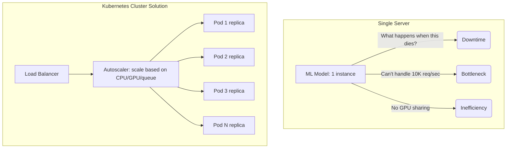

> **Did You Know?** Kubernetes was originally open-sourced by Google on June 6, 2014, [heavily inspired by their internal Borg system](https://kubernetes.io/blog/2015/04/borg-predecessor-to-kubernetes/). [Kubernetes is widely used for production workloads, including machine learning systems](https://kubernetes.io/case-studies/).

> **Stop and think**: If a Pod represents a single instance of your model, what happens to ongoing user requests if the node hosting that Pod suddenly loses power? How does the system recover without manual intervention?

### What Kubernetes Solves for ML

Kubernetes fundamentally addresses the core operational complexities of deploying machine learning models at massive scale by abstracting the underlying hardware into a unified compute fabric:

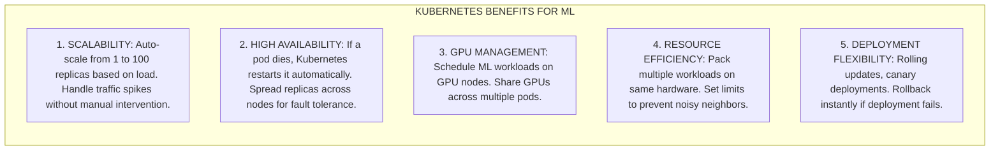

## Kubernetes Architecture

Understanding the foundational architecture of Kubernetes is absolutely essential for effective debugging and system design. A Kubernetes cluster is structurally divided into two primary sections: the Control Plane and the Worker Nodes.

### Core Components

The Control Plane acts as the central nervous system of the cluster. It meticulously maintains the global state, schedules workloads to available nodes, and responds to various cluster events. The API Server acts as the primary interface, receiving and validating all REST requests. The Scheduler evaluates specific resource requirements and assigns incoming workloads to appropriate Worker Nodes. The Controller Manager runs continuous background reconciliation loops. Finally, etcd is a highly available key-value database that serves as the ultimate, uncorrupted source of truth for all configuration data.

Worker Nodes execute your workloads. Each node runs a kubelet, a lightweight agent ensuring containers are running correctly within a Pod. The kube-proxy maintains the necessary network iptables or IPVS rules to facilitate communication. For ML, specialized GPU Nodes run additional components to safely expose hardware accelerators to the environment.

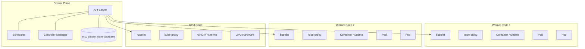

### Key Concepts

Kubernetes utilizes a highly specific set of abstractions to manage applications. These concepts form a clear operational hierarchy, starting from broad organizational boundaries down to the specific execution environments where your code runs.

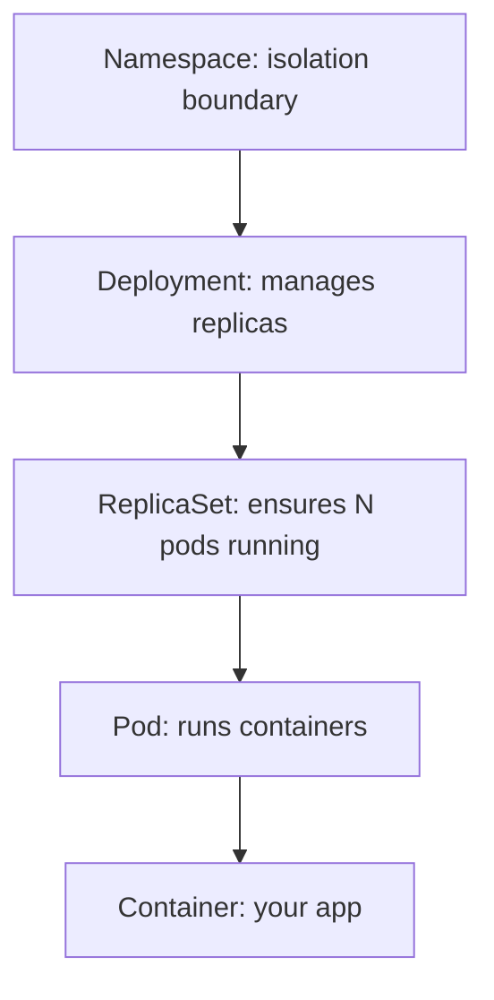

## Core Kubernetes Objects

To successfully deploy a machine learning model, you must perfectly translate your precise infrastructure requirements into Kubernetes objects using declarative YAML manifests.

### Pod

The Pod is the smallest atomic unit of execution in Kubernetes. It encapsulates one or more containers, providing them with shared storage volumes and a unique network IP. For machine learning inference, a Pod typically contains a single container running a serving framework like Triton or FastAPI.

```yaml
# pod.yaml - Basic ML inference pod
apiVersion: v1
kind: Pod
metadata:
  name: ml-inference
  labels:
    app: sentiment-classifier
spec:
  containers:
  - name: model
    image: myregistry/sentiment:v2.0.0
    ports:
    - containerPort: 8000
    resources:
      requests:
        memory: "1Gi"
        cpu: "500m"
      limits:
        memory: "2Gi"
        cpu: "1000m"
    env:
    - name: MODEL_PATH
      value: "/models/sentiment.pt"
    volumeMounts:
    - name: model-storage
      mountPath: /models
  volumes:
  - name: model-storage
    persistentVolumeClaim:
      claimName: model-pvc
```

### Deployment

Managing individual Pods manually is highly dangerous. If a node fails, naked Pods are permanently lost. A Deployment acts as a rigorous supervisory controller. You declare the desired number of replicas, and [the Deployment continuously monitors the cluster to guarantee that exact number of Pods is running](https://kubernetes.io/docs/concepts/workloads/). It also facilitates sophisticated rollout strategies.

```yaml
# deployment.yaml - ML inference deployment
apiVersion: apps/v1
kind: Deployment
metadata:
  name: sentiment-classifier
  labels:
    app: sentiment-classifier
spec:
  replicas: 3
  selector:
    matchLabels:
      app: sentiment-classifier
  strategy:
    type: RollingUpdate
    rollingUpdate:
      maxSurge: 1
      maxUnavailable: 0
  template:
    metadata:
      labels:
        app: sentiment-classifier
    spec:
      containers:
      - name: model
        image: myregistry/sentiment:v2.0.0
        ports:
        - containerPort: 8000
        resources:
          requests:
            memory: "1Gi"
            cpu: "500m"
          limits:
            memory: "2Gi"
            cpu: "1000m"
        readinessProbe:
          httpGet:
            path: /health
            port: 8000
          initialDelaySeconds: 30
          periodSeconds: 10
        livenessProbe:
          httpGet:
            path: /health
            port: 8000
          initialDelaySeconds: 60
          periodSeconds: 30
```

### Service

Because Pods are inherently ephemeral, their internal IP addresses change constantly. The Service object completely resolves this issue by [providing a persistent, perfectly stable network endpoint that actively distributes incoming requests evenly across healthy Pods](https://kubernetes.io/docs/concepts/services-networking/service/).

```yaml
# service.yaml - Expose deployment internally
apiVersion: v1
kind: Service
metadata:
  name: sentiment-service
spec:
  selector:
    app: sentiment-classifier
  ports:
  - port: 80
    targetPort: 8000
  type: ClusterIP  # Internal only
```

```yaml
# For external access
apiVersion: v1
kind: Service
metadata:
  name: sentiment-service-external
spec:
  selector:
    app: sentiment-classifier
  ports:
  - port: 80
    targetPort: 8000
  type: LoadBalancer  # Gets external IP
```

### Service Types

Different Service types strictly accommodate various internal and external network architecture patterns.

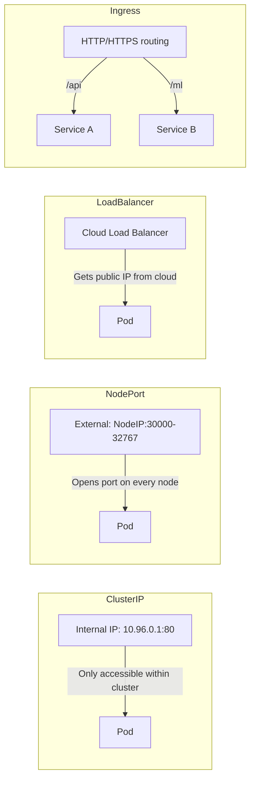

## GPU Scheduling for ML

Complex deep learning workloads fundamentally require immense hardware acceleration. Managing GPUs natively within Kubernetes requires robust drivers and strict scheduling enforcement.

### NVIDIA GPU Operator

The NVIDIA GPU Operator automatically installs all required device drivers, container toolkits, and critical device plugins across the cluster, seamlessly transforming a standard node into a fully accelerator-aware execution environment.

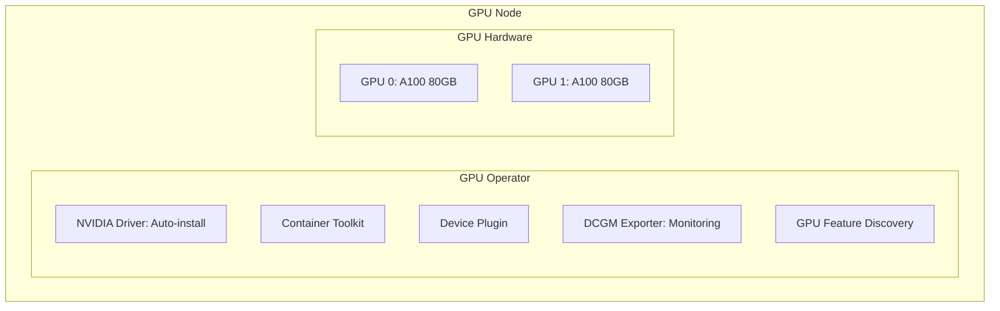

### Requesting GPUs

You must proactively leverage node selectors and tolerations to explicitly instruct the scheduler to assign the Pod strictly to specialized accelerator nodes, preventing standard CPU workloads from consuming expensive GPU capacity.

```yaml
# gpu-pod.yaml - Request GPU resources
apiVersion: v1
kind: Pod
metadata:
  name: gpu-training
spec:
  containers:
  - name: trainer
    image: pytorch/pytorch:2.0.1-cuda11.8-cudnn8-runtime
    resources:
      limits:
        nvidia.com/gpu: 1  # Request 1 GPU
    command: ["python", "train.py"]
  # Ensure scheduling on GPU node
  nodeSelector:
    accelerator: nvidia-tesla-a100
  tolerations:
  - key: nvidia.com/gpu
    operator: Exists
    effect: NoSchedule
```

### GPU Resource Types

Modern accelerators offer incredibly sophisticated partitioning mechanisms.

```yaml
# Different GPU configurations
resources:
  limits:
    # Whole GPU
    nvidia.com/gpu: 1

    # MIG (Multi-Instance GPU) - A100 only
    nvidia.com/mig-1g.5gb: 1   # 1/7 of A100
    nvidia.com/mig-2g.10gb: 1  # 2/7 of A100
    nvidia.com/mig-3g.20gb: 1  # 3/7 of A100

    # Time-slicing (shared GPU)
    # Configured via GPU Operator config
```

> **Did You Know?** Multi-Instance GPU (MIG) technology enables a single high-end A100 accelerator to be physically partitioned into up to seven isolated hardware instances. This provides rigid, hardware-level isolation for parallel inference workloads, maximizing utilization while preventing performance degradation.

### GPU Scheduling Strategy

For intensive batch processes, strictly utilize the Kubernetes Job resource. A Job actively manages execution until successful completion.

```yaml
# Training job - needs dedicated GPU
apiVersion: batch/v1
kind: Job
metadata:
  name: model-training
spec:
  template:
    spec:
      containers:
      - name: trainer
        image: myregistry/trainer:v2.0.0
        resources:
          limits:
            nvidia.com/gpu: 4  # 4 GPUs for distributed training
            memory: "64Gi"
            cpu: "16"
      restartPolicy: Never
      # Use GPU node pool
      nodeSelector:
        node-pool: gpu-training
      tolerations:
      - key: nvidia.com/gpu
        operator: Exists
        effect: NoSchedule
```

## Resource Management

Effective resource management is absolutely critical for cluster stability. The scheduler must precisely understand computational demands to prevent catastrophic out-of-memory events.

### Resource Requests vs Limits

A request represents the guaranteed minimum allocation used for scheduling. A limit is the unbreakable maximum ceiling. [CPU is compressible (the process is merely throttled), but memory is incompressible. Exceeding a memory limit can lead to an OOM kill when the kernel detects memory pressure.](https://kubernetes.io/docs/concepts/configuration/manage-resources-containers/)

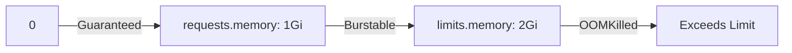

### QoS Classes

Kubernetes assigns strict Quality of Service classes based on these resource configurations, [dictating eviction priority during severe node pressure](https://kubernetes.io/docs/concepts/workloads/pods/pod-qos/).

```yaml
# Guaranteed QoS (highest priority)
# requests == limits for all containers
resources:
  requests:
    memory: "1Gi"
    cpu: "500m"
  limits:
    memory: "1Gi"
    cpu: "500m"

# Burstable QoS (medium priority)
# requests < limits
resources:
  requests:
    memory: "512Mi"
    cpu: "250m"
  limits:
    memory: "1Gi"
    cpu: "500m"

# BestEffort QoS (lowest priority, evicted first)
# No requests or limits specified
resources: {}
```

### Resource Quotas

To prevent a single team from exhausting cluster capacity, administrators enforce Resource Quotas.

```yaml
# Limit resources per namespace
apiVersion: v1
kind: ResourceQuota
metadata:
  name: ml-team-quota
  namespace: ml-team
spec:
  hard:
    requests.cpu: "100"
    requests.memory: "200Gi"
    limits.cpu: "200"
    limits.memory: "400Gi"
    requests.nvidia.com/gpu: "8"
    pods: "50"
    persistentvolumeclaims: "20"
```

## Autoscaling for ML

Autoscaling enables systems to react dynamically to unpredictable load, ensuring performance and strict economic efficiency.

### Horizontal Pod Autoscaler (HPA)

[The HPA periodically evaluates targeted metrics](https://kubernetes.io/docs/concepts/workloads/autoscaling/horizontal-pod-autoscale/). When thresholds are exceeded, it instructs the Deployment to systematically increase replica counts.

```yaml
# hpa.yaml - Scale based on CPU
apiVersion: autoscaling/v2
kind: HorizontalPodAutoscaler
metadata:
  name: sentiment-hpa
spec:
  scaleTargetRef:
    apiVersion: apps/v1
    kind: Deployment
    name: sentiment-classifier
  minReplicas: 2
  maxReplicas: 20
  metrics:
  - type: Resource
    resource:
      name: cpu
      target:
        type: Utilization
        averageUtilization: 70
  - type: Resource
    resource:
      name: memory
      target:
        type: Utilization
        averageUtilization: 80
  behavior:
    scaleDown:
      stabilizationWindowSeconds: 300  # Wait 5 min before scaling down
      policies:
      - type: Percent
        value: 10
        periodSeconds: 60
    scaleUp:
      stabilizationWindowSeconds: 0  # Scale up immediately
      policies:
      - type: Percent
        value: 100
        periodSeconds: 15
```

> **Pause and predict**: If you configure a Horizontal Pod Autoscaler to target high CPU load, but the underlying physical node has absolutely no free GPUs available, what operational state will the newly created Pods enter?

### Custom Metrics for ML

CPU utilization is often insufficient. Advanced configurations leverage custom metrics like inference queue depth.

```yaml
# Scale based on inference queue length
apiVersion: autoscaling/v2
kind: HorizontalPodAutoscaler
metadata:
  name: inference-hpa
spec:
  scaleTargetRef:
    apiVersion: apps/v1
    kind: Deployment
    name: inference-server
  minReplicas: 1
  maxReplicas: 50
  metrics:
  # Custom metric from Prometheus
  - type: Pods
    pods:
      metric:
        name: inference_queue_length
      target:
        type: AverageValue
        averageValue: "10"  # Scale when queue > 10 per pod
  # GPU utilization (requires DCGM)
  - type: External
    external:
      metric:
        name: dcgm_gpu_utilization
      target:
        type: AverageValue
        averageValue: "80"
```

### Vertical Pod Autoscaler (VPA)

While HPA aggressively adds Pods, [the VPA subtly adjusts core resource requests and limits of existing Pods](https://kubernetes.io/docs/concepts/workloads/autoscaling/vertical-pod-autoscale/). This is optimal for stateful workloads.

```yaml
# vpa.yaml - Auto-tune resources
apiVersion: autoscaling.k8s.io/v1
kind: VerticalPodAutoscaler
metadata:
  name: ml-inference-vpa
spec:
  targetRef:
    apiVersion: apps/v1
    kind: Deployment
    name: ml-inference
  updatePolicy:
    updateMode: "Auto"  # Or "Off" for recommendations only
  resourcePolicy:
    containerPolicies:
    - containerName: model
      minAllowed:
        cpu: "100m"
        memory: "256Mi"
      maxAllowed:
        cpu: "4"
        memory: "8Gi"
```

## Persistent Storage for ML

Complex deep learning models are massive data artifacts. Embedding them directly into container images results in bloated artifacts. Kubernetes safely allows containers to dynamically mount external volumes.

### Storage Architecture

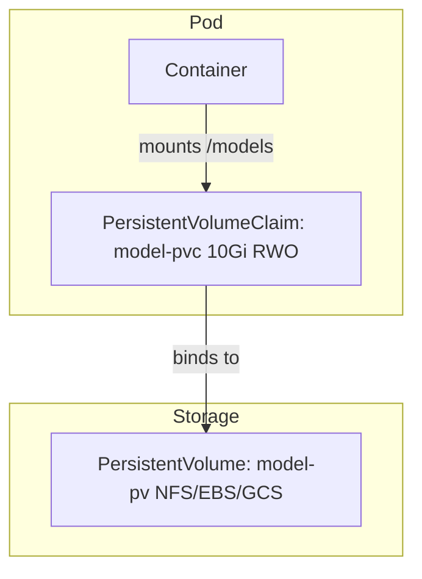

### PersistentVolumeClaim for Models

By fully isolating storage requests, you strictly decouple application logic from the underlying cloud provider.

```yaml
# pvc.yaml - Request storage for models
apiVersion: v1
kind: PersistentVolumeClaim
metadata:
  name: model-storage
spec:
  accessModes:
    - ReadWriteOnce  # RWO: Single node read-write
  resources:
    requests:
      storage: 50Gi
  storageClassName: fast-ssd  # SSD for fast model loading
```

```yaml
# For shared model access (multiple pods)
apiVersion: v1
kind: PersistentVolumeClaim
metadata:
  name: shared-models
spec:
  accessModes:
    - ReadOnlyMany  # ROX: Multiple nodes read-only
  resources:
    requests:
      storage: 100Gi
  storageClassName: nfs  # NFS for shared access
```

### Access Modes

The specific method by which a volume is attached fundamentally alters its utility for parallel operations.

```
ACCESS MODES
============

ReadWriteOnce (RWO):
- Single node can mount as read-write
- Use for: Training checkpoints, single-replica inference

ReadOnlyMany (ROX):
- Multiple nodes can mount as read-only
- Use for: Shared models across inference replicas

ReadWriteMany (RWX):
- Multiple nodes can mount as read-write
- Use for: Distributed training, shared logs
- Requires: NFS, CephFS, GlusterFS

ReadWriteOncePod (RWOP):
- Single pod can mount as read-write
- Supported in K8s v1.35+
```

> **Did You Know?** [Use `ReadWriteOncePod` when you need to guarantee single-Pod write access to a volume across the cluster.](https://kubernetes.io/docs/tasks/administer-cluster/change-pv-access-mode-readwriteoncepod/)

## ML Deployment Patterns

### Pattern 1: Simple Inference Service

This establishes a highly available API endpoint utilizing strict configuration maps to manage variables independently.

```yaml
# Complete inference deployment namespace and config
apiVersion: v1
kind: Namespace
metadata:
  name: ml-inference
```

```yaml
apiVersion: v1
kind: ConfigMap
metadata:
  name: model-config
  namespace: ml-inference
data:
  MODEL_NAME: "sentiment-classifier"
  MODEL_VERSION: "v2.0.0"
  MAX_BATCH_SIZE: "32"
```

```yaml
apiVersion: apps/v1
kind: Deployment
metadata:
  name: sentiment-api
  namespace: ml-inference
spec:
  replicas: 3
  selector:
    matchLabels:
      app: sentiment-api
  template:
    metadata:
      labels:
        app: sentiment-api
    spec:
      containers:
      - name: api
        image: myregistry/sentiment:v2.0.0
        ports:
        - containerPort: 8000
        envFrom:
        - configMapRef:
            name: model-config
        resources:
          requests:
            memory: "1Gi"
            cpu: "500m"
          limits:
            memory: "2Gi"
            cpu: "1000m"
        readinessProbe:
          httpGet:
            path: /health
            port: 8000
          initialDelaySeconds: 30
        livenessProbe:
          httpGet:
            path: /health
            port: 8000
          initialDelaySeconds: 60
```

```yaml
apiVersion: v1
kind: Service
metadata:
  name: sentiment-api
  namespace: ml-inference
spec:
  selector:
    app: sentiment-api
  ports:
  - port: 80
    targetPort: 8000
  type: LoadBalancer
```

### Pattern 2: GPU Training Job

For heavy processing, the Job resource ensures the compute-intensive workload executes successfully to completion.

```yaml
# Training job with GPU
apiVersion: batch/v1
kind: Job
metadata:
  name: bert-finetuning
  namespace: ml-training
spec:
  backoffLimit: 3
  template:
    spec:
      containers:
      - name: trainer
        image: myregistry/bert-trainer:v2.0.0
        command: ["python", "train.py"]
        args:
          - "--epochs=10"
          - "--batch-size=32"
          - "--learning-rate=2e-5"
        resources:
          limits:
            nvidia.com/gpu: 1
            memory: "16Gi"
            cpu: "4"
        volumeMounts:
        - name: data
          mountPath: /data
        - name: checkpoints
          mountPath: /checkpoints
      volumes:
      - name: data
        persistentVolumeClaim:
          claimName: training-data
      - name: checkpoints
        persistentVolumeClaim:
          claimName: checkpoints
      restartPolicy: OnFailure
      nodeSelector:
        accelerator: nvidia-tesla-v100
```

### Pattern 3: Model A/B Testing

Deploying entirely new models carries immense risk. A service mesh facilitates canary deployments, securely shifting a controlled percentage of traffic to evaluate performance.

```yaml
# Canary deployment with Istio
apiVersion: networking.istio.io/v1beta1
kind: VirtualService
metadata:
  name: sentiment-routing
spec:
  hosts:
  - sentiment-api
  http:
  - match:
    - headers:
        x-model-version:
          exact: "v2"
    route:
    - destination:
        host: sentiment-api-v2
  - route:
    - destination:
        host: sentiment-api-v1
        weight: 90
    - destination:
        host: sentiment-api-v2
        weight: 10  # 10% traffic to new model
```

## Networking Deep Dive for ML Services

### DNS Resolution: How Pods Find Each Other

Internal services discover one another using [built-in DNS](https://kubernetes.io/docs/concepts/services-networking/dns-pod-service/).

```python
# Inside your pod, use DNS names
import requests

# Same namespace - just use service name
response = requests.get("http://127.0.0.1:8080/features")

# Different namespace - use full DNS
# Format: <service>.<namespace>.svc.cluster.local
```

### Network Policies for ML Security

Network isolation is paramount for protecting proprietary model APIs.

```yaml
# Only allow traffic from the API gateway to inference pods
apiVersion: networking.k8s.io/v1
kind: NetworkPolicy
metadata:
  name: inference-isolation
  namespace: ml-production
spec:
  podSelector:
    matchLabels:
      app: inference-service
  policyTypes:
  - Ingress
  ingress:
  - from:
    - namespaceSelector:
        matchLabels:
          name: api-gateway
    - podSelector:
        matchLabels:
          role: gateway
    ports:
    - port: 8000
      protocol: TCP
```

### Latency Optimization Strategies

To aggressively shave milliseconds, configurations attempt to [tightly localize active traffic within the exact same availability zone](https://kubernetes.io/docs/concepts/services-networking/topology-aware-routing/).

```yaml
# Spread inference pods across zones for client proximity
affinity:
  podAntiAffinity:
    preferredDuringSchedulingIgnoredDuringExecution:
    - weight: 100
      podAffinityTerm:
        labelSelector:
          matchLabels:
            app: inference
        topologyKey: topology.kubernetes.io/zone
```

```yaml
# Route to pods in same zone first (reduces cross-zone latency)
apiVersion: v1
kind: Service
metadata:
  name: inference-local
spec:
  selector:
    app: inference
  topologyKeys:
  - "topology.kubernetes.io/zone"
  - "*"  # Fall back to any pod if none in zone
```

```python
# In your inference service, configure HTTP keep-alive
import httpx

# Create a client with connection pooling
client = httpx.Client(
    limits=httpx.Limits(
        max_keepalive_connections=100,
        max_connections=200,
        keepalive_expiry=30.0
    ),
    timeout=10.0
)

# Reuse connections across requests
response = client.post("http://127.0.0.1:8080/features", json=data)
```

## Essential kubectl Commands

Complete mastery of the CLI is mandatory for efficient cluster operation.

```bash
# CLUSTER INFO
kubectl cluster-info
kubectl get nodes
kubectl get nodes -o wide  # With IPs

# DEPLOYMENTS
kubectl get deployments
kubectl describe deployment <name>
kubectl scale deployment <name> --replicas=5
kubectl rollout status deployment <name>
kubectl rollout history deployment <name>
kubectl rollout undo deployment <name>

# PODS
kubectl get pods
kubectl get pods -o wide  # With node info
kubectl describe pod <name>
kubectl logs <pod-name>
kubectl logs <pod-name> -f  # Follow
kubectl logs <pod-name> --previous  # Previous container
kubectl exec -it <pod-name> -- bash  # Shell into pod

# SERVICES
kubectl get services
kubectl describe service <name>
kubectl port-forward service/<name> 8080:80  # Local access

# GPU NODES
kubectl get nodes -l accelerator=nvidia
kubectl describe node <gpu-node> | grep -A5 "Allocated resources"

# RESOURCES
kubectl top nodes
kubectl top pods
kubectl get resourcequota

# DEBUGGING
kubectl get events --sort-by='.lastTimestamp'
kubectl describe pod <pod-name>  # Check Events section
kubectl logs <pod-name> --all-containers
```

## Production War Stories: Kubernetes Lessons Learned

### The Pod That Wouldn't Die

A rollout can fail if an old Pod does not terminate cleanly and continues holding onto state or connections, leaving traffic on the previous version longer than expected.

```yaml
# The fix: Add proper termination handling
spec:
  terminationGracePeriodSeconds: 30
  containers:
  - name: model
    lifecycle:
      preStop:
        exec:
          command: ["/bin/sh", "-c", "sleep 5"]  # Allow connections to drain
```

### The GPU Scheduling Disaster

Autoscaling can create additional Pods that remain Pending if the cluster has no spare GPU capacity, so scaling signals need to reflect the real bottleneck and available hardware.

```yaml
   # Cluster Autoscaler config
   scaleDownEnabled: true
   scaleDownDelayAfterAdd: 10m
   scaleDownUnneededTime: 10m
   expanderName: priority  # Prefer GPU nodes for GPU workloads
```

```yaml
   - type: External
     external:
       metric:
         name: gpu_nodes_available
       target:
         type: Value
         value: "1"  # Only scale if GPUs are available
```

```yaml
   apiVersion: policy/v1
   kind: PodDisruptionBudget
   spec:
     minAvailable: 5  # Always keep at least 5 pods
```

### The Memory Leak That Killed Christmas

A memory leak or unexpectedly large in-memory data structure can trigger OOM kills and cascading instability in a recommendation workload.

```yaml
   resources:
     requests:
       memory: "2Gi"
     limits:
       memory: "8Gi"  # Increased headroom
```

```yaml
   - type: Resource
     resource:
       name: memory
       target:
         type: Utilization
         averageUtilization: 60  # Scale before hitting limits
   ```

```python
   @memory_guard(max_mb=4000)
   def generate_recommendations(user_history):
       if len(user_history) > 1000:
           user_history = user_history[-1000:]  # Truncate
       # ... process
   ```

## Economics of Kubernetes for ML

Transitioning to heavily orchestrated infrastructure drastically alters deep operational economics. Dynamic provisioning entirely eliminates the staggering inefficiency of maintaining massive idle capacity.

| Scenario | Manual Scaling | Kubernetes + HPA |
|----------|----------------|------------------|
| **Peak capacity provisioning** | | |
| Servers for peak load | Fixed-capacity setups must provision for expected peak demand | Autoscaled setups can add capacity as load rises |
| Monthly infrastructure cost | Often higher when capacity is fixed for peaks | Often lower when capacity can scale with demand, depending on workload and pricing |
| Utilization rate | Often lower when infrastructure is overprovisioned for peaks | Often higher when capacity can be packed and scaled more dynamically |
| **Operations** | | |
| On-call incidents (monthly) | Incident volume depends on workload design and operational maturity | Incident volume can improve with better automation, but exact outcomes vary |
| Engineer time responding | Manual operations can consume significant engineering time | Automation can reduce response effort, but the amount varies by team and system design |
| Deployment time | Manual releases can be slow and error-prone | Automated rollouts can be much faster, depending on the application and release process |
| **Annual Total** | | |
| Infrastructure | Annual spend is typically higher when systems are provisioned for peak load all the time | Annual spend can be lower when capacity is scaled and utilized more efficiently |
| Operations | Labor cost depends on staffing model, tooling, and incident volume | Automation can reduce operating effort, but exact labor savings vary widely |
| **Total** | Higher overall spend is common with fixed overprovisioning | Lower overall spend is possible with better utilization and automation |
| **Savings** | | Savings depend on workload shape, pricing, and operational maturity |

| Strategy | Without K8s | With K8s | Savings |
|----------|-------------|----------|---------|
| **GPU Utilization** | | | |
| Single-tenant VMs | Utilization is often lower when GPUs are dedicated to one workload | N/A | Baseline comparison |
| Kubernetes scheduling | N/A | Shared scheduling can improve utilization when workloads fit the cluster well | GPU savings depend on workload mix and bin-packing efficiency |
| **Spot/Preemptible** | | | |
| On-demand GPUs | On-demand accelerator pricing varies by cloud, region, and instance type | N/A | Baseline comparison |
| Spot or preemptible GPUs with interruption handling | N/A | Interruptible capacity can be much cheaper than on-demand capacity, but prices and availability vary | Savings depend on provider pricing and workload tolerance for interruption |
| **Right-sizing** | | | |
| Fixed instance types | Static sizing often leaves some workloads overprovisioned | VPA can help identify better-fit requests over time | Cost impact depends on workload behavior and how recommendations are applied |

| Provider | On-Demand | Spot (70% workload) | Annual Cost |
|----------|-----------|---------------------|-------------|
| GKE | Pricing varies by region and machine choice | Spot capacity can reduce spend when interruptions are acceptable | Annual cost is workload-dependent |
| EKS | Pricing varies by region and machine choice | Spot capacity can reduce spend when interruptions are acceptable | Annual cost is workload-dependent |
| AKS | Pricing varies by region and machine choice | Spot capacity can reduce spend when interruptions are acceptable | Annual cost is workload-dependent |

> **Did You Know?** Better scheduling and autoscaling can reduce wasted infrastructure spend, but the exact savings depend on workload shape, pricing, and operational maturity.

## System Design Interview: ML Inference Platform

**Prompt**: "Design a highly available machine learning inference platform capable of robustly serving multiple large-scale models to exactly 10,000 requests per second."

**Cluster Architecture**:
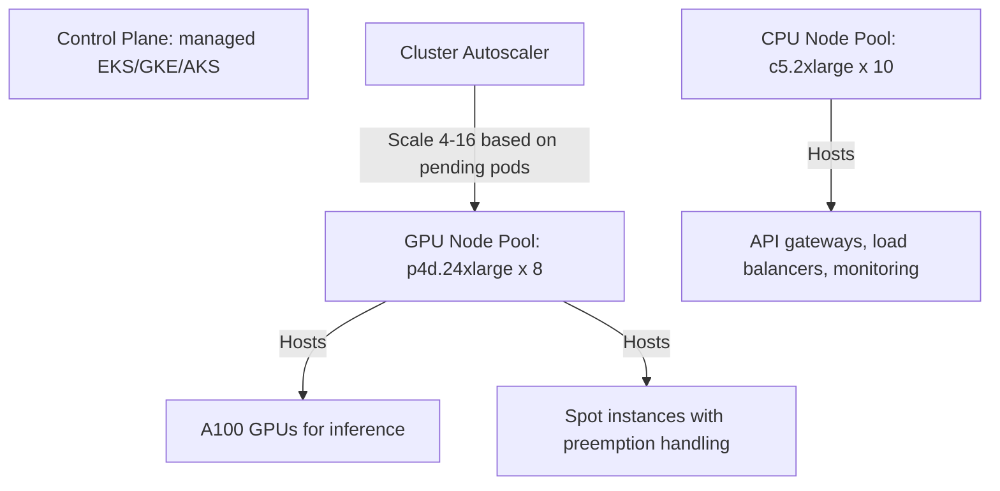

**Model Serving Layer**:
```yaml
# Per-model deployment
apiVersion: apps/v1
kind: Deployment
metadata:
  name: sentiment-model
spec:
  replicas: 4
  selector:
    matchLabels:
      app: sentiment-model
  template:
    spec:
      containers:
      - name: model
        image: registry/sentiment:v2.1.0
        resources:
          limits:
            nvidia.com/gpu: 1
            memory: "16Gi"
        readinessProbe:
          httpGet:
            path: /ready
            port: 8000
          initialDelaySeconds: 60
```

**Traffic Management**:
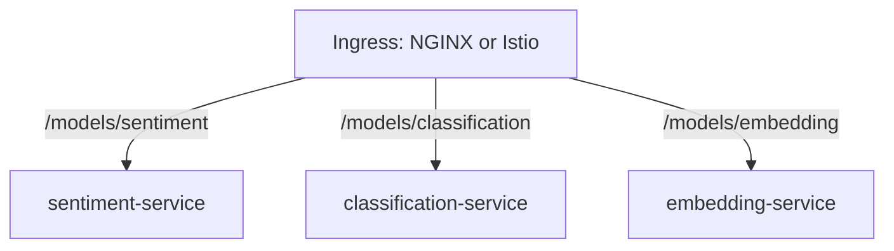

**Capacity Planning**:
```text
Per GPU: ~1,500 req/s (depends on model)
10K req/s ÷ 1,500 = ~7 GPUs active
With 70% utilization target: 10 GPUs
With headroom for spikes: 12-16 GPUs available

Node pool: 8 × p4d.24xlarge = 64 A100s total
Active pods: 12-16 (normal), up to 40 (peak)
```

**Observability Hierarchy**:
```text
Prometheus + Grafana
├── GPU utilization (DCGM exporter)
├── Request latency (p50, p95, p99)
├── Queue depth
└── Error rates

Alerts:
- GPU utilization > 85% for 5 min
- Latency p99 > 500ms
- Error rate > 1%
- Pods in Pending > 2 min
```

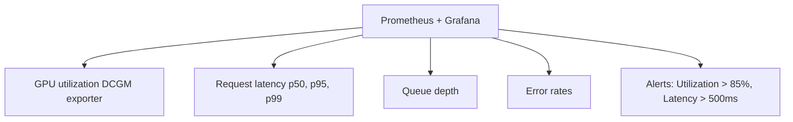

**Deployment Strategy**:
```yaml
strategy:
  type: RollingUpdate
  rollingUpdate:
    maxSurge: 1
    maxUnavailable: 0
```

```python
@app.get("/ready")
def ready():
    if not model_loaded:
        raise HTTPException(503)
    # Optional: run a warmup inference
    _ = model.predict(warmup_input)
    return {"ready": True}
```

## Common Mistakes

| Mistake | Why it Occurs | Correct Implementation |
|---------|--------------|------------------------|
| **Missing Limits** | Neglecting to firmly define strict resource constraints places the Pod in the lowest BestEffort QoS tier, maximizing the probability of sudden, unceremonious eviction during routine operations. | See snippet below. Always explicitly specify boundaries. |
| **Using Latest Tag** | The `latest` image tag is highly mutable. Attempting a rapid rollback may completely fail to revert to the desired state, and disparate nodes may cache deeply conflicting artifacts. | See snippet below. Utilize rigidly immutable version identifiers. |
| **Omitted Probes** | Without readiness probes, the overarching control plane cannot discern if a massive model is successfully loaded into active memory or if the process has entirely deadlocked. | See snippet below. Configure both liveness and readiness checks. |
| **No PDB** | Routine node maintenance or automated infrastructure updates can simultaneously evict all instances of an application if strict minimum availability thresholds are utterly undeclared. | See snippet below. Formally define a secure PodDisruptionBudget. |
| **Wrong Service Type** | Utilizing an expensive LoadBalancer type for strictly internal microservices generates unnecessary cloud infrastructure costs and heavily suboptimal routing paths. | See snippet below. Utilize ClusterIP strictly for internal communications. |
| **Ignoring Grace** | Applications abruptly terminated by the kernel blindly drop active connections, resulting in massive client-side errors and extremely poor user experience. | Define `terminationGracePeriodSeconds` properly. |
| **Blind Autoscaling** | Scaling solely based on general CPU usage when the specific workload is entirely bottlenecked by specialized hardware (GPUs) results in massive arrays of pending, unusable Pods. | Implement complex custom metrics targeting actual hardware availability. |

```yaml
# Mistake 1 Fix
containers:
- name: model
  image: mymodel:v2.0.0
  resources:
    requests:
      memory: "1Gi"
      cpu: "500m"
    limits:
      memory: "2Gi"
      cpu: "1000m"
```

```yaml
# Mistake 2 Fix
image: mymodel:v2.0.0-abc123
imagePullPolicy: IfNotPresent
```

```yaml
# Mistake 3 Fix
containers:
- name: model
  readinessProbe:
    httpGet:
      path: /ready
      port: 8000
    initialDelaySeconds: 30
    periodSeconds: 10
  livenessProbe:
    httpGet:
      path: /live
      port: 8000
    initialDelaySeconds: 60
    periodSeconds: 30
    failureThreshold: 3
```

```yaml
# Mistake 4 Fix
apiVersion: policy/v1
kind: PodDisruptionBudget
metadata:
  name: ml-inference-pdb
spec:
  minAvailable: 2  # Always keep at least 2 pods
  selector:
    matchLabels:
      app: ml-inference
```

```yaml
# Mistake 5 Fix
# For internal services
spec:
  type: ClusterIP
```

```yaml
# Mistake 5 Fix Continued
# For external APIs
spec:
  type: LoadBalancer
  annotations:
    service.beta.kubernetes.io/aws-load-balancer-internal: "true"  # Internal LB
```

## Knowledge Check

<details>
<summary>1. A machine learning inference Deployment is currently running, but live clients report highly intermittent 502 errors exclusively during rolling updates. Diagnose the probable root configuration deficiency.</summary>

**Answer**: The deployment is almost certainly missing a properly configured readinessProbe. Without it, the control plane can route high-volume traffic to the newly created Pods before the large model weights have fully initialized in memory. By implementing a strict readiness check that exclusively returns a success code only after the entire model is fully loaded, the load balancer will correctly wait before actively distributing requests to the new instance.
</details>

<details>
<summary>2. You urgently need to provision a heavily distributed training job that absolutely requires simultaneous access to a vast, shared dataset directory. Evaluate exactly which storage access mode must be utilized.</summary>

**Answer**: You must strictly utilize the `ReadWriteMany` (RWX) access mode. Distributed model training fundamentally necessitates that multiple discrete Pods, often scheduled far apart across disparate physical nodes, concurrently read and write to the exact same shared volume. While `ReadWriteOnce` is sufficient for isolated checkpoints, it explicitly prohibits the concurrent multi-node attachment demanded by this complex architecture.
</details>

<details>
<summary>3. During extreme peak hours, a configured autoscaler successfully requests more Pods, yet they persistently remain trapped in a Pending status. Compare this scenario with potential infrastructural root causes.</summary>

**Answer**: The cluster has entirely exhausted its available physical resources. The Horizontal Pod Autoscaler correctly detected massively increased load and forcefully instructed the Deployment to expand, but the Scheduler simply cannot locate a single node possessing the requisite unreserved CPU, memory, or specialized GPU capacity. Resolution mandates either manually provisioning additional worker nodes or verifying that the Cluster Autoscaler is correctly configured to expand the underlying infrastructure pool dynamically.
</details>

<details>
<summary>4. Design a robust operational strategy to firmly prioritize mission-critical inference Pods, guaranteeing they are the absolute last workloads to be forcibly evicted during severe cluster resource pressure.</summary>

**Answer**: The optimal, fail-safe strategy demands establishing a Guaranteed Quality of Service (QoS) class. This is typically achieved by ensuring that each container within the active Pod explicitly defines resource requests that match its resource limits. Kubernetes heavily prioritizes Guaranteed workloads, usually evicting BestEffort and Burstable Pods first to preserve the stability of highly critical inference processes.
</details>

<details>
<summary>5. Scenario: Your stateful model training workload requires gradually increasing memory over a 48-hour epoch, while your stateless inference API receives unpredictable massive daily traffic spikes. Evaluate and justify the autoscaling strategy required for each, explaining the fundamental operational difference between the mechanisms chosen.</summary>

**Answer**: The Horizontal Pod Autoscaler aggressively adjusts overall capacity by actively modifying the precise quantity of running Pod replicas to efficiently distribute massive load across a much broader cluster footprint. Conversely, the Vertical Pod Autoscaler directly modifies the highly specific resource allocations (such as CPU and memory requests and limits) actively assigned to individual running Pods. While horizontal scaling is vastly preferred for stateless inference APIs, vertical scaling is highly effective for stateful workloads or when meticulously optimizing baseline resource consumption over extended time periods.
</details>

<details>
<summary>6. How do you definitively instruct the central scheduler to guarantee that a heavily CPU-bound data preprocessing Pod is absolutely never accidentally placed onto a highly expensive GPU-accelerated node?</summary>

**Answer**: You efficiently employ a powerful combination of node taints and precise tolerations. The core infrastructure team must firmly apply a specific, highly restrictive taint to the GPU nodes (e.g., `accelerator=gpu:NoSchedule`). Subsequently, only workloads that explicitly declare a perfectly matching toleration within their YAML Pod manifest will be permitted execution on those specialized nodes, effectively and permanently repelling the standard CPU-bound processes.
</details>

## Hands-On Exercise: Runnable End-to-End Inference Mock

In this revised, fully executable lab, we will construct a simulated machine learning inference workload utilizing a lightweight NGINX server firmly configured to actively return a mock JSON prediction. This strategy guarantees you can safely practice complex deployment, service exposure, and autoscaling locally without encountering debilitating `ImagePullBackOff` errors associated with private enterprise registries.

**Task 1: Deploy the Simulated Inference Service**
We will create a specific ConfigMap to hold our mock inference response and deeply integrate it into our standard deployment container.

<details>
<summary>Solution: ConfigMap and Deployment</summary>

```yaml
# 1-mock-config.yaml
apiVersion: v1
kind: ConfigMap
metadata:
  name: ml-mock-config
data:
  default.conf: |
    server {
        listen 8000;
        location /predict {
            default_type application/json;
            return 200 '{"status": "success", "prediction": [0.92, 0.08]}';
        }
        location /health {
            return 200 'OK';
        }
        location /ready {
            return 200 'OK';
        }
    }
---
# 2-mock-deployment.yaml
apiVersion: apps/v1
kind: Deployment
metadata:
  name: ml-inference-mock
  labels:
    app: ml-inference-mock
spec:
  replicas: 2
  selector:
    matchLabels:
      app: ml-inference-mock
  template:
    metadata:
      labels:
        app: ml-inference-mock
    spec:
      containers:
      - name: inference
        image: nginx:1.27.0-alpine
        ports:
        - containerPort: 8000
        volumeMounts:
        - name: config-volume
          mountPath: /etc/nginx/conf.d
        resources:
          requests:
            cpu: "100m"
            memory: "128Mi"
          limits:
            cpu: "250m"
            memory: "256Mi"
        readinessProbe:
          httpGet:
            path: /ready
            port: 8000
          initialDelaySeconds: 2
          periodSeconds: 5
      volumes:
      - name: config-volume
        configMap:
          name: ml-mock-config
```

Execute the application:
```bash
kubectl apply -f 1-mock-config.yaml
kubectl apply -f 2-mock-deployment.yaml
kubectl get pods -w -l app=ml-inference-mock
```
</details>

**Task 2: Expose the Service for Load Generation**
<details>
<summary>Solution: Internal ClusterIP Service</summary>

For local load generation within the cluster framework, we utilize a strictly internal ClusterIP.

```yaml
# 3-mock-service.yaml
apiVersion: v1
kind: Service
metadata:
  name: ml-inference-svc
spec:
  type: ClusterIP
  selector:
    app: ml-inference-mock
  ports:
  - port: 8000
    targetPort: 8000
```

Execute the exposure:
```bash
kubectl apply -f 3-mock-service.yaml
kubectl get svc ml-inference-svc
```
</details>

**Task 3: Provision Persistent Storage for Mock Training**
<details>
<summary>Solution: Local PersistentVolumeClaims</summary>

```yaml
# 4-mock-pvc.yaml
apiVersion: v1
kind: PersistentVolumeClaim
metadata:
  name: mock-training-data-pvc
spec:
  accessModes:
    - ReadWriteOnce
  resources:
    requests:
      storage: 1Gi
---
apiVersion: v1
kind: PersistentVolumeClaim
metadata:
  name: mock-checkpoint-pvc
spec:
  accessModes:
    - ReadWriteOnce
  resources:
    requests:
      storage: 1Gi
```

Execute storage binding:
```bash
kubectl apply -f 4-mock-pvc.yaml
```
</details>

**Task 4: Execute a Mock Training Job**
<details>
<summary>Solution: Mock Job Execution</summary>

```yaml
# 5-mock-job.yaml
apiVersion: batch/v1
kind: Job
metadata:
  name: mock-training-job
spec:
  backoffLimit: 1
  template:
    spec:
      restartPolicy: OnFailure
      containers:
      - name: trainer
        image: python:3.12-slim
        command: ["/bin/sh", "-c"]
        args:
        - "echo 'Starting training...' && sleep 10 && echo 'Weights saved to /checkpoints/model.pt' > /checkpoints/model.pt && echo 'Done!'"
        volumeMounts:
        - name: training-data
          mountPath: /data
        - name: checkpoints
          mountPath: /checkpoints
      volumes:
      - name: training-data
        persistentVolumeClaim:
          claimName: mock-training-data-pvc
      - name: checkpoints
        persistentVolumeClaim:
          claimName: mock-checkpoint-pvc
```

Execute and observe completion:
```bash
kubectl apply -f 5-mock-job.yaml
kubectl logs -f job/mock-training-job
```
</details>

**Task 5: Trigger Expansion via Horizontal Pod Autoscaler**
<details>
<summary>Solution: HPA Application and Target Load Test</summary>

```yaml
# 6-mock-hpa.yaml
apiVersion: autoscaling/v2
kind: HorizontalPodAutoscaler
metadata:
  name: ml-inference-hpa
spec:
  scaleTargetRef:
    apiVersion: apps/v1
    kind: Deployment
    name: ml-inference-mock
  minReplicas: 2
  maxReplicas: 8
  metrics:
  - type: Resource
    resource:
      name: cpu
      target:
        type: Utilization
        averageUtilization: 50
```

Deploy the HPA and instantly trigger massive simulated load using the correct DNS endpoint:
```bash
kubectl apply -f 6-mock-hpa.yaml
kubectl get hpa ml-inference-hpa -w &

# Open a secondary terminal to generate active traffic directly to the service DNS
kubectl run -it --rm load-test --image=busybox -- /bin/sh -c "while true; do wget -q -O- http://ml-inference-svc:8000/predict; done"
```

Verify Pod replica expansion:
```bash
kubectl get pods -l app=ml-inference-mock -w
```
</details>

### Success Checklist
- [ ] Mock deployment running steadily without debilitating `ImagePullBackOff` interruptions.
- [ ] ConfigMap successfully mounted and correctly returning JSON payloads on `/predict`.
- [ ] PVCs structurally bound and the mock training job successfully executed to completion.
- [ ] Load test correctly targeting the `ml-inference-svc` endpoint and successfully triggering HPA cluster expansion.

## Production Reference Templates (Historical Archive)

The fully executable lab above prioritizes lightweight, widely available assets. However, in live production environments actively utilizing heavily guarded cloud registries, your manifests reflect significantly greater complexity. The structural templates below serve strictly as a reference for advanced implementation architecture.

```yaml
# inference-deployment.yaml
apiVersion: apps/v1
kind: Deployment
metadata:
  name: ml-inference
  labels:
    app: ml-inference
spec:
  replicas: 3
  selector:
    matchLabels:
      app: ml-inference
  template:
    metadata:
      labels:
        app: ml-inference
    spec:
      containers:
      - name: inference
        image: your-registry/ml-model:v2.0.0
        ports:
        - containerPort: 8000
        resources:
          requests:
            memory: "2Gi"
            cpu: "1000m"
          limits:
            memory: "4Gi"
            cpu: "2000m"
        livenessProbe:
          httpGet:
            path: /health
            port: 8000
          initialDelaySeconds: 30
          periodSeconds: 10
        readinessProbe:
          httpGet:
            path: /ready
            port: 8000
          initialDelaySeconds: 5
          periodSeconds: 5
        env:
        - name: MODEL_PATH
          value: "/models/latest"
        - name: WORKERS
          value: "4"
```

```yaml
apiVersion: v1
kind: Service
metadata:
  name: ml-inference-lb
spec:
  type: LoadBalancer
  selector:
    app: ml-inference
  ports:
  - port: 80
    targetPort: 8000
```

```bash
# Apply the deployment
kubectl apply -f inference-deployment.yaml

# Watch pods come up
kubectl get pods -w -l app=ml-inference

# Check service external IP
kubectl get svc ml-inference-lb

# Test the endpoint
curl http://203.0.113.50/predict -d '{"input": [1,2,3]}'
```

```yaml
# training-job.yaml
apiVersion: batch/v1
kind: Job
metadata:
  name: model-training-job
spec:
  backoffLimit: 3  # Retry up to 3 times on failure
  template:
    spec:
      restartPolicy: OnFailure
      containers:
      - name: trainer
        image: your-registry/trainer:v2.0.0
        command: ["python", "train.py"]
        args:
        - "--epochs=100"
        - "--batch-size=32"
        - "--checkpoint-dir=/checkpoints"
        resources:
          limits:
            nvidia.com/gpu: 1
            memory: "16Gi"
            cpu: "4000m"
        volumeMounts:
        - name: training-data
          mountPath: /data
        - name: checkpoints
          mountPath: /checkpoints
        env:
        - name: CUDA_VISIBLE_DEVICES
          value: "0"
        - name: WANDB_API_KEY
          valueFrom:
            secretKeyRef:
              name: wandb-secret
              key: api-key
      volumes:
      - name: training-data
        persistentVolumeClaim:
          claimName: training-data-pvc
      - name: checkpoints
        persistentVolumeClaim:
          claimName: checkpoint-pvc
      nodeSelector:
        gpu: "true"
      tolerations:
      - key: "nvidia.com/gpu"
        operator: "Exists"
        effect: "NoSchedule"
```

```bash
# Watch job progress
kubectl get jobs -w

# View training logs
kubectl logs -f job/model-training-job

# Check GPU utilization (if nvidia-smi available)
kubectl exec -it $(kubectl get pod -l job-name=model-training-job -o name) -- nvidia-smi
```

```yaml
# hpa.yaml
apiVersion: autoscaling/v2
kind: HorizontalPodAutoscaler
metadata:
  name: ml-inference-hpa
spec:
  scaleTargetRef:
    apiVersion: apps/v1
    kind: Deployment
    name: ml-inference
  minReplicas: 2
  maxReplicas: 10
  metrics:
  # CPU-based scaling
  - type: Resource
    resource:
      name: cpu
      target:
        type: Utilization
        averageUtilization: 70
  # Memory-based scaling
  - type: Resource
    resource:
      name: memory
      target:
        type: Utilization
        averageUtilization: 80
  behavior:
    scaleDown:
      stabilizationWindowSeconds: 300  # Wait 5 min before scaling down
      policies:
      - type: Percent
        value: 50
        periodSeconds: 60  # Scale down at most 50% per minute
    scaleUp:
      stabilizationWindowSeconds: 0  # Scale up immediately
      policies:
      - type: Percent
        value: 100
        periodSeconds: 15  # Can double every 15 seconds
      - type: Pods
        value: 4
        periodSeconds: 15  # Or add 4 pods every 15 seconds
```

```bash
# Apply HPA
kubectl apply -f hpa.yaml

# Watch HPA decisions
kubectl get hpa ml-inference-hpa -w

# Generate load for testing
kubectl run -it --rm load-test --image=busybox -- \
  /bin/sh -c "while true; do wget -q -O- http://127.0.0.1:8000/predict; done"

# Watch pods scale
kubectl get pods -l app=ml-inference -w
```

<details>
<summary>View the deployment configuration</summary>

```yaml
# inference-deployment.yaml
apiVersion: apps/v1
kind: Deployment
metadata:
  name: ml-inference
  labels:
    app: ml-inference
spec:
  replicas: 3
  selector:
    matchLabels:
      app: ml-inference
  template:
    metadata:
      labels:
        app: ml-inference
    spec:
      containers:
      - name: inference
        image: your-registry/ml-model:v2.0.0
        ports:
        - containerPort: 8000
        resources:
          requests:
            memory: "2Gi"
            cpu: "1000m"
          limits:
            memory: "4Gi"
            cpu: "2000m"
        livenessProbe:
          httpGet:
            path: /health
            port: 8000
          initialDelaySeconds: 30
          periodSeconds: 10
        readinessProbe:
          httpGet:
            path: /ready
            port: 8000
          initialDelaySeconds: 5
          periodSeconds: 5
        env:
        - name: MODEL_PATH
          value: "/models/latest"
        - name: WORKERS
          value: "4"
```
</details>

<details>
<summary>View the service configuration</summary>

```yaml
apiVersion: v1
kind: Service
metadata:
  name: ml-inference-lb
spec:
  type: LoadBalancer
  selector:
    app: ml-inference
  ports:
  - port: 80
    targetPort: 8000
```
</details>

<details>
<summary>View the execution commands</summary>

```bash
# Apply the deployment
kubectl apply -f inference-deployment.yaml

# Watch pods come up
kubectl get pods -w -l app=ml-inference

# Check service external IP
kubectl get svc ml-inference-lb

# Test the endpoint
curl http://203.0.113.50/predict -d '{"input": [1,2,3]}'
```
</details>

<details>
<summary>View the job configuration</summary>

```yaml
# training-job.yaml
apiVersion: batch/v1
kind: Job
metadata:
  name: model-training-job
spec:
  backoffLimit: 3  # Retry up to 3 times on failure
  template:
    spec:
      restartPolicy: OnFailure
      containers:
      - name: trainer
        image: your-registry/trainer:v2.0.0
        command: ["python", "train.py"]
        args:
        - "--epochs=100"
        - "--batch-size=32"
        - "--checkpoint-dir=/checkpoints"
        resources:
          limits:
            nvidia.com/gpu: 1
            memory: "16Gi"
            cpu: "4000m"
        volumeMounts:
        - name: training-data
          mountPath: /data
        - name: checkpoints
          mountPath: /checkpoints
        env:
        - name: CUDA_VISIBLE_DEVICES
          value: "0"
        - name: WANDB_API_KEY
          valueFrom:
            secretKeyRef:
              name: wandb-secret
              key: api-key
      volumes:
      - name: training-data
        persistentVolumeClaim:
          claimName: training-data-pvc
      - name: checkpoints
        persistentVolumeClaim:
          claimName: checkpoint-pvc
      nodeSelector:
        gpu: "true"
      tolerations:
      - key: "nvidia.com/gpu"
        operator: "Exists"
        effect: "NoSchedule"
```

```bash
# Watch job progress
kubectl get jobs -w

# View training logs
kubectl logs -f job/model-training-job

# Check GPU utilization (if nvidia-smi available)
kubectl exec -it $(kubectl get pod -l job-name=model-training-job -o name) -- nvidia-smi
```
</details>

<details>
<summary>View the autoscaler configuration</summary>

```yaml
# hpa.yaml
apiVersion: autoscaling/v2
kind: HorizontalPodAutoscaler
metadata:
  name: ml-inference-hpa
spec:
  scaleTargetRef:
    apiVersion: apps/v1
    kind: Deployment
    name: ml-inference
  minReplicas: 2
  maxReplicas: 10
  metrics:
  # CPU-based scaling
  - type: Resource
    resource:
      name: cpu
      target:
        type: Utilization
        averageUtilization: 70
  # Memory-based scaling
  - type: Resource
    resource:
      name: memory
      target:
        type: Utilization
        averageUtilization: 80
  behavior:
    scaleDown:
      stabilizationWindowSeconds: 300  # Wait 5 min before scaling down
      policies:
      - type: Percent
        value: 50
        periodSeconds: 60  # Scale down at most 50% per minute
    scaleUp:
      stabilizationWindowSeconds: 0  # Scale up immediately
      policies:
      - type: Percent
        value: 100
        periodSeconds: 15  # Can double every 15 seconds
      - type: Pods
        value: 4
        periodSeconds: 15  # Or add 4 pods every 15 seconds
```

```bash
# Apply HPA
kubectl apply -f hpa.yaml

# Watch HPA decisions
kubectl get hpa ml-inference-hpa -w

# Generate load for testing
kubectl run -it --rm load-test --image=busybox -- \
  /bin/sh -c "while true; do wget -q -O- http://127.0.0.1:8000/predict; done"

# Watch pods scale
kubectl get pods -l app=ml-inference -w
```
</details>

## Debugging and Troubleshooting

When serious incidents absolutely inevitably arise in your machine learning infrastructure, swift, precise diagnosis utilizing core primitives is paramount.

### Scenario 1: Pod Stuck in Pending

```bash
# Check pod status
kubectl describe pod <pod-name>

# Look for these messages:
# "0/3 nodes are available: 3 Insufficient nvidia.com/gpu"
# "0/3 nodes are available: 3 Insufficient memory"

# Solutions:
# 1. Check cluster capacity
kubectl describe nodes | grep -A5 "Allocated resources"

# 2. Check GPU availability
kubectl describe nodes | grep -A3 "nvidia.com/gpu"

# 3. Reduce resource requests or add nodes
```

### Scenario 2: OOMKilled - The Memory Assassin

```bash
# Check if pod was killed for memory
kubectl get pod <pod-name> -o jsonpath='{.status.containerStatuses[0].lastState}'

# If OOMKilled, increase limits:
# resources:
#   limits:
#     memory: "8Gi"  # Was 4Gi, model needs more

# Pro tip: Set memory request = limit for ML workloads
# This prevents overcommitment and makes OOM behavior predictable
```

### Scenario 3: Slow Model Loading

```yaml
# Increase initialDelaySeconds for probes
# livenessProbe:
#   initialDelaySeconds: 120  # Give model 2 min to load
#   periodSeconds: 30
# 
# readinessProbe:
#   initialDelaySeconds: 60
#   periodSeconds: 10
#   failureThreshold: 6  # Try 6 times before giving up
```

### The Kubernetes Debugging Cheat Sheet

```bash
# Pod won't start?
kubectl describe pod <name>
kubectl get events --sort-by='.lastTimestamp'

# Pod keeps restarting?
kubectl logs <pod> --previous  # Logs from crashed container

# Service not reachable?
kubectl get endpoints <service-name>  # Should show pod IPs

# Everything looks fine but still broken?
kubectl exec -it <pod> -- /bin/sh  # Get a shell and investigate
```

## ⏭️ Next Steps

You have now rigorously mastered the incredibly complex art of securely managing highly dynamic machine learning environments utilizing the foundational orchestration power of Kubernetes. By orchestrating heavily robust deployments, firmly enforcing meticulous hardware resource policies, and actively monitoring overall cluster health, your deep learning infrastructure is completely fortified for extreme scale.

**Up Next**: [Module 1.5 - Advanced Kubernetes](./module-1.5-advanced-kubernetes)

## Sources

## Sources

- [Borg: The Predecessor to Kubernetes](https://kubernetes.io/blog/2015/04/borg-predecessor-to-kubernetes/) — Explains how Borg influenced the design and operational model of Kubernetes.
- [Kubernetes Case Studies](https://kubernetes.io/case-studies/) — Shows real production uses of Kubernetes across industries, including data and ML-adjacent platforms.
- [Workloads](https://kubernetes.io/docs/concepts/workloads/) — Describes Pods and higher-level workload controllers such as Deployments and Jobs.
- [Service](https://kubernetes.io/docs/concepts/services-networking/service/) — Defines how Services provide stable access to changing sets of backend Pods.
- [Resource Management for Pods and Containers](https://kubernetes.io/docs/concepts/configuration/manage-resources-containers/) — Covers requests, limits, CPU throttling behavior, and memory-related OOM outcomes.
- [Pod Quality of Service Classes](https://kubernetes.io/docs/concepts/workloads/pods/pod-qos/) — Explains Guaranteed, Burstable, and BestEffort QoS and how they affect eviction behavior.
- [Horizontal Pod Autoscaling](https://kubernetes.io/docs/concepts/workloads/autoscaling/horizontal-pod-autoscale/) — Explains how HPA adjusts replica counts from observed metrics and is useful follow-on reading for the autoscaling examples.
- [Vertical Pod Autoscaling](https://kubernetes.io/docs/concepts/workloads/autoscaling/vertical-pod-autoscale/) — Describes how VPA recommends or updates Pod resource settings over time.
- [Change the Access Mode of a PersistentVolume to ReadWriteOncePod](https://kubernetes.io/docs/tasks/administer-cluster/change-pv-access-mode-readwriteoncepod/) — Explains the single-Pod write-access semantics of ReadWriteOncePod.
- [DNS for Services and Pods](https://kubernetes.io/docs/concepts/services-networking/dns-pod-service/) — Documents built-in DNS naming patterns such as `service.namespace.svc.cluster.local`.
- [Topology Aware Routing](https://kubernetes.io/docs/concepts/services-networking/topology-aware-routing/) — Explains same-zone routing preferences and when they improve performance, reliability, or cost.
- [Kubernetes Components](https://kubernetes.io/docs/concepts/overview/components/) — Best upstream overview of control plane and node components referenced throughout the module.
- [Schedule GPUs](https://kubernetes.io/docs/tasks/manage-gpus/scheduling-gpus/) — Covers the official Kubernetes model for requesting GPUs and scheduling workloads onto accelerator nodes.
- [Persistent Volumes](https://kubernetes.io/docs/concepts/storage/persistent-volumes/) — Explains persistent storage concepts and access modes referenced in the storage section.
