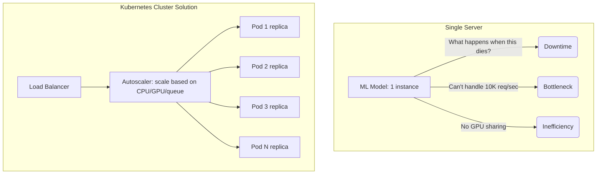
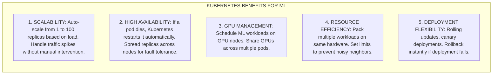
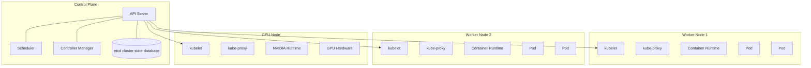
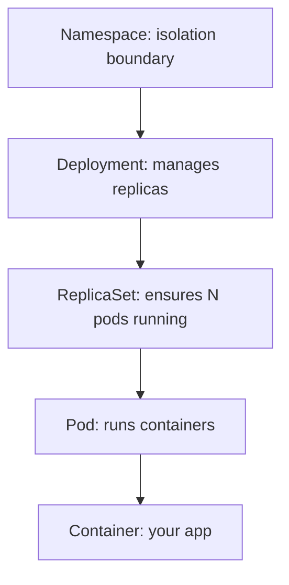
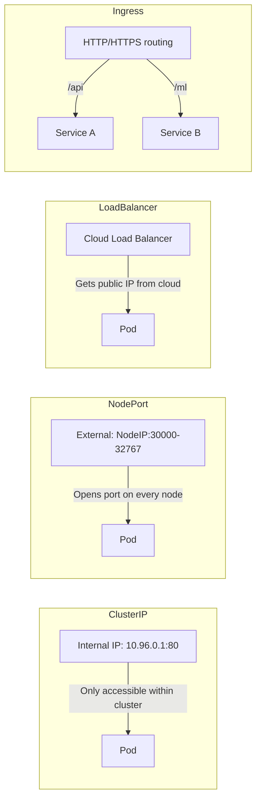
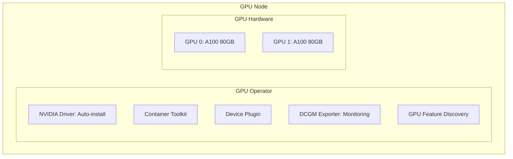
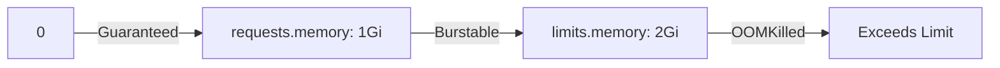
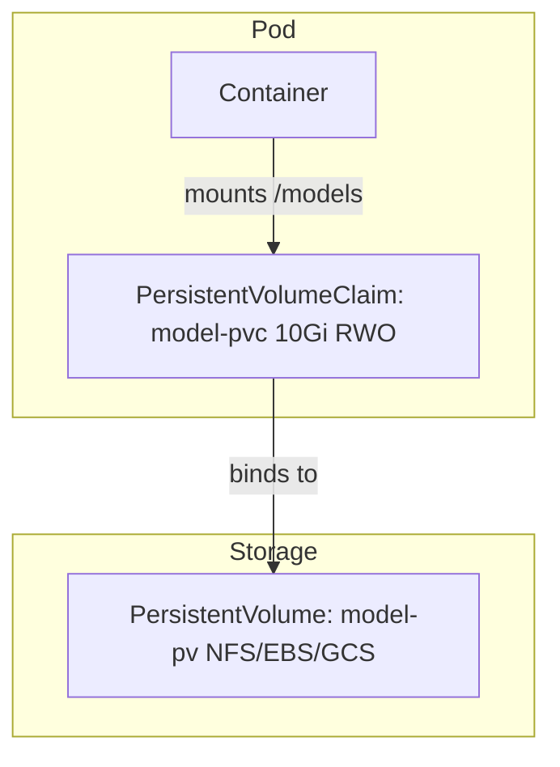
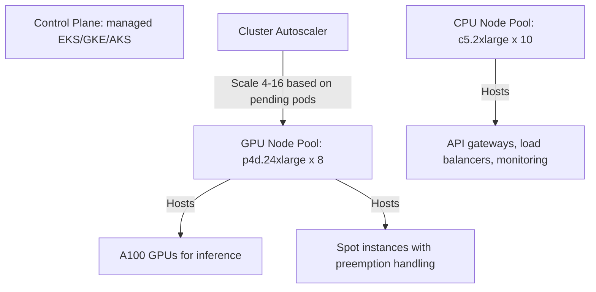
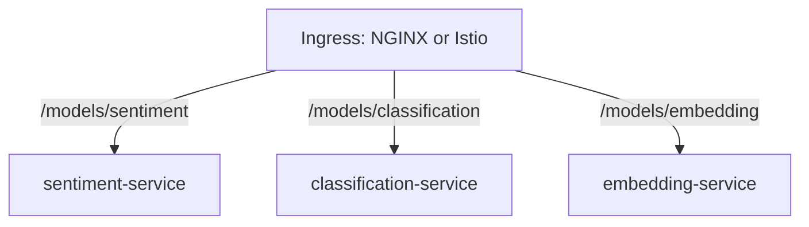

## The Cyber Monday Meltdown

In November 2025, TechFlow Inc., a mid-sized e-commerce platform, prepared for their biggest sales event of the year. Their real-time recommendation engine, powered by a sophisticated deep learning model, was deployed on three massive standalone virtual machines. They anticipated high load, but they did not anticipate the virality of a highly targeted marketing campaign that hit social media.

At exactly 9:00 AM, traffic surged to forty times their standard baseline. The first virtual machine, overwhelmed by the sudden influx of inference requests, exhausted its memory and crashed immediately. The load balancer, functioning exactly as designed, redirected all traffic to the remaining two machines. Within seconds, the cascade failure was complete. Both remaining servers collapsed under the weight of the redirected traffic, taking the entire recommendation pipeline offline.

The operations team scrambled to manually provision new servers, configure the environment, and download the massive model weights. The system remained down for nearly two hours during peak shopping hours. The financial impact was devastating: an estimated $2.5 million in lost revenue, coupled with severe damage to customer trust. The post-incident review yielded a single, undeniable conclusion: manual scaling and static infrastructure were entirely incompatible with the dynamic nature of machine learning workloads. They needed a system that could autonomously detect load, provision resources, distribute traffic, and handle node failures gracefully.

## What You'll Be Able to Do

By the end of this module, you will:
- **Design** scalable machine learning inference architectures using Kubernetes core primitives.
- **Implement** robust deployment strategies for zero-downtime model updates.
- **Configure** precise GPU scheduling and resource management policies for deep learning workloads.
- **Evaluate** different autoscaling mechanisms to optimize performance and control infrastructure costs.
- **Diagnose** and resolve complex production issues related to memory management and pod lifecycles.

## The Scaling Challenge

Deploying a machine learning model to a local development environment or a single standalone server is relatively straightforward. You load the model weights into memory, expose a simple API endpoint, and process incoming requests. However, this simplistic approach rapidly crumbles under the rigorous demands of a true production environment.

When your application requires high availability, fault tolerance, and the ability to process tens of thousands of requests per second, a single server becomes a catastrophic single point of failure. You must distribute the workload across multiple physical or virtual machines, ensure traffic is evenly balanced across those machines, and maintain the operational capacity to dynamically adjust computational resources based on fluctuating user demand.

This is the central orchestration challenge. Kubernetes provides a declarative, resilient framework to solve this. Instead of manually managing servers, you define the desired state of your application—for example, "I require five instances of this recommendation model, each with strict access to one GPU, and I want the system to automatically add more instances if CPU utilization exceeds seventy percent." Kubernetes continuously monitors the actual state of the system and automatically takes corrective action to ensure it matches your defined desired state.



> **Did You Know?** Google runs over two billion containers per week using their internal systems, which heavily inspired Kubernetes architecture. When Kubernetes was open-sourced, it brought over a decade of high-scale container orchestration experience to the broader software engineering community.

### What Kubernetes Solves for ML

Kubernetes fundamentally addresses the core operational complexities of deploying machine learning models at massive scale:



## Kubernetes Architecture

Understanding the foundational architecture of Kubernetes is absolutely essential for effective debugging and system design. A Kubernetes cluster is structurally divided into two primary sections: the Control Plane and the Worker Nodes.

### Core Components

The Control Plane acts as the brain of the cluster. It meticulously maintains the global state, schedules workloads to available nodes, and responds to various cluster events. The API Server acts as the primary interface, receiving and validating all REST requests. The Scheduler evaluates specific resource requirements and assigns incoming workloads to appropriate Worker Nodes. The Controller Manager runs continuous background processes that regulate the state of the cluster. Finally, etcd is a highly available key-value database that serves as the ultimate source of truth for all cluster configuration and state data.

Worker Nodes are the physical or virtual machines that actually execute your workloads. Each node runs a kubelet, a lightweight agent that ensures containers are running correctly within a Pod. The kube-proxy maintains the necessary network rules to facilitate communication. For machine learning, specialized GPU Nodes run additional software components, such as the NVIDIA Runtime, to safely expose hardware accelerators to the cluster environment.



### Key Concepts

Kubernetes utilizes a highly specific set of abstractions to manage applications. These concepts form a clear operational hierarchy, starting from broad organizational boundaries down to the specific execution environments where your code runs.



## Core Kubernetes Objects

To successfully deploy a machine learning model, you must translate your precise infrastructure requirements into Kubernetes objects using declarative YAML manifests. Let us examine the foundational objects required for an ML stack.

### Pod

The Pod is the smallest, most atomic unit of execution in Kubernetes. It encapsulates one or more containers, explicitly providing them with shared storage volumes, a unique network IP, and highly specific configuration options. For machine learning inference, a Pod typically contains a single container running your chosen model serving framework.

```yaml
# pod.yaml - Basic ML inference pod
apiVersion: v1
kind: Pod
metadata:
  name: ml-inference
  labels:
    app: sentiment-classifier
spec:
  containers:
  - name: model
    image: myregistry/sentiment:v2.0.0
    ports:
    - containerPort: 8000
    resources:
      requests:
        memory: "1Gi"
        cpu: "500m"
      limits:
        memory: "2Gi"
        cpu: "1000m"
    env:
    - name: MODEL_PATH
      value: "/models/sentiment.pt"
    volumeMounts:
    - name: model-storage
      mountPath: /models
  volumes:
  - name: model-storage
    persistentVolumeClaim:
      claimName: model-pvc
```

> **Stop and think**: If a Pod represents a single instance of your model, what happens to ongoing user requests if the node hosting that Pod suddenly loses power? How does the system recover without manual intervention?

### Deployment

Managing individual Pods manually is highly impractical and dangerous. If a Pod crashes or its underlying physical node fails, the Pod is permanently deleted. To achieve true resilience, we use Deployments. A Deployment acts as a rigorous supervisory controller. You declare the desired number of active replicas, and the Deployment continuously monitors the cluster to ensure that exact number of Pods is running at all times. Furthermore, Deployments facilitate sophisticated rollout strategies, allowing you to update your model version smoothly without causing service interruption.

```yaml
# deployment.yaml - ML inference deployment
apiVersion: apps/v1
kind: Deployment
metadata:
  name: sentiment-classifier
  labels:
    app: sentiment-classifier
spec:
  replicas: 3
  selector:
    matchLabels:
      app: sentiment-classifier
  strategy:
    type: RollingUpdate
    rollingUpdate:
      maxSurge: 1
      maxUnavailable: 0
  template:
    metadata:
      labels:
        app: sentiment-classifier
    spec:
      containers:
      - name: model
        image: myregistry/sentiment:v2.0.0
        ports:
        - containerPort: 8000
        resources:
          requests:
            memory: "1Gi"
            cpu: "500m"
          limits:
            memory: "2Gi"
            cpu: "1000m"
        readinessProbe:
          httpGet:
            path: /health
            port: 8000
          initialDelaySeconds: 30
          periodSeconds: 10
        livenessProbe:
          httpGet:
            path: /health
            port: 8000
          initialDelaySeconds: 60
          periodSeconds: 30
```

### Service

Because Pods are inherently ephemeral by design, their internal IP addresses change whenever they are recreated or moved. This creates a massive routing dilemma: how do external clients or other internal microservices reliably communicate with your model?

The Service object entirely resolves this issue by providing a persistent, perfectly stable network endpoint. A Service uses specific label selectors to intelligently identify a targeted group of Pods. When traffic arrives at the Service, it operates as a high-performance internal load balancer, actively distributing the incoming requests evenly across all currently healthy Pods that match the selector.

```yaml
# service.yaml - Expose deployment internally
apiVersion: v1
kind: Service
metadata:
  name: sentiment-service
spec:
  selector:
    app: sentiment-classifier
  ports:
  - port: 80
    targetPort: 8000
  type: ClusterIP  # Internal only
```

```yaml
# For external access
apiVersion: v1
kind: Service
metadata:
  name: sentiment-service-external
spec:
  selector:
    app: sentiment-classifier
  ports:
  - port: 80
    targetPort: 8000
  type: LoadBalancer  # Gets external IP
```

### Service Types

Kubernetes actively supports different Service types to strictly accommodate various internal and external network architecture patterns.



## GPU Scheduling for ML

Complex machine learning operations, particularly deep learning training cycles and large-scale parallel inference pipelines, require immense hardware acceleration. Scheduling these specific workloads onto GPU-equipped nodes involves highly complex coordination between the physical hardware, the host operating system, and the Kubernetes overarching control plane.

### NVIDIA GPU Operator

To manage GPUs natively and securely, modern clusters utilize the robust NVIDIA GPU Operator. This comprehensive, automated toolset automatically installs all required device drivers, container toolkits, and critical device plugins across the cluster. It seamlessly transforms a standard Kubernetes node into a fully accelerator-aware execution environment.



### Requesting GPUs

When defining a specialized Pod that absolutely requires hardware acceleration, you must specify the exact, integer number of GPUs required within the resources block. You must also proactively leverage node selectors and tolerations to explicitly instruct the Kubernetes scheduler to assign the Pod strictly to specialized accelerator nodes, thereby preventing standard CPU-bound workloads from accidentally monopolizing highly expensive GPU hardware.

```yaml
# gpu-pod.yaml - Request GPU resources
apiVersion: v1
kind: Pod
metadata:
  name: gpu-training
spec:
  containers:
  - name: trainer
    image: pytorch/pytorch:2.0.1-cuda11.8-cudnn8-runtime
    resources:
      limits:
        nvidia.com/gpu: 1  # Request 1 GPU
    command: ["python", "train.py"]
  # Ensure scheduling on GPU node
  nodeSelector:
    accelerator: nvidia-tesla-a100
  tolerations:
  - key: nvidia.com/gpu
    operator: Exists
    effect: NoSchedule
```

### GPU Resource Types

Hardware capabilities have evolved significantly over the last several release cycles. Modern accelerators offer incredibly sophisticated partitioning mechanisms, safely allowing a single physical device to serve multiple distinct workloads without any cross-contamination or measurable performance degradation.

```yaml
# Different GPU configurations
resources:
  limits:
    # Whole GPU
    nvidia.com/gpu: 1

    # MIG (Multi-Instance GPU) - A100 only
    nvidia.com/mig-1g.5gb: 1   # 1/7 of A100
    nvidia.com/mig-2g.10gb: 1  # 2/7 of A100
    nvidia.com/mig-3g.20gb: 1  # 3/7 of A100

    # Time-slicing (shared GPU)
    # Configured via GPU Operator config
```

> **Did You Know?** Multi-Instance GPU technology enables a high-end accelerator to be partitioned into up to seven isolated hardware instances. This provides rigid, hardware-level isolation for parallel inference workloads, aggressively maximizing utilization while completely preventing performance degradation from adjacent processes.

### GPU Scheduling Strategy

For highly intensive batch processes, such as distributed model training, you should strictly utilize the Kubernetes Job resource. A Job actively manages the execution of a Pod until its successful, verified completion, making it the ideal abstraction for computational processes that have a definitive end state, unlike long-running, continuous inference Deployments.

```yaml
# Training job - needs dedicated GPU
apiVersion: batch/v1
kind: Job
metadata:
  name: model-training
spec:
  template:
    spec:
      containers:
      - name: trainer
        image: myregistry/trainer:v2.0.0
        resources:
          limits:
            nvidia.com/gpu: 4  # 4 GPUs for distributed training
            memory: "64Gi"
            cpu: "16"
      restartPolicy: Never
      # Use GPU node pool
      nodeSelector:
        node-pool: gpu-training
      tolerations:
      - key: nvidia.com/gpu
        operator: Exists
        effect: NoSchedule
```

## Resource Management

Effective, disciplined resource management is highly critical for cluster stability. Kubernetes must precisely understand the specific computational demands of each running container to make the most optimal scheduling decisions and permanently prevent catastrophic out-of-memory events.

### Resource Requests vs Limits

You clearly define computational boundaries using the concepts of requests and limits. A request represents the guaranteed minimum allocation; the scheduler uses this exact value to determine node placement. A limit is the absolute, unbreakable maximum ceiling. If a container aggressively attempts to consume more memory than its explicitly specified limit, the kernel forcefully and immediately terminates it, resulting in an OOMKilled status.



### QoS Classes

Kubernetes implicitly assigns strict Quality of Service classes based heavily on your documented resource configurations. These classes fundamentally dictate the priority of pod eviction when a specific node experiences severe, unexpected resource pressure.

```yaml
# Guaranteed QoS (highest priority)
# requests == limits for all containers
resources:
  requests:
    memory: "1Gi"
    cpu: "500m"
  limits:
    memory: "1Gi"
    cpu: "500m"

# Burstable QoS (medium priority)
# requests < limits
resources:
  requests:
    memory: "512Mi"
    cpu: "250m"
  limits:
    memory: "1Gi"
    cpu: "500m"

# BestEffort QoS (lowest priority, evicted first)
# No requests or limits specified
resources: {}
```

### Resource Quotas

To properly maintain operational order in a large, multi-tenant environment, cluster administrators consistently enforce Resource Quotas. These powerful objects constrain the aggregate resource consumption permitted within a specific namespace, completely preventing a single team's experimental training run from exhausting the entire cluster's capacity.

```yaml
# Limit resources per namespace
apiVersion: v1
kind: ResourceQuota
metadata:
  name: ml-team-quota
  namespace: ml-team
spec:
  hard:
    requests.cpu: "100"
    requests.memory: "200Gi"
    limits.cpu: "200"
    limits.memory: "400Gi"
    requests.nvidia.com/gpu: "8"
    pods: "50"
    persistentvolumeclaims: "20"
```

## Autoscaling for ML

Autoscaling enables complex systems to react dynamically to variable, unpredictable load. Rather than statically provisioning massive infrastructure for maximum hypothetical peak traffic, the cluster continuously adjusts its footprint, ensuring both high performance and strict economic efficiency.

### Horizontal Pod Autoscaler (HPA)

The Horizontal Pod Autoscaler is the primary operational mechanism for scaling inference workloads. It periodically evaluates targeted metrics, such as average CPU utilization across all Pods grouped in a Deployment. When the chosen metric exceeds a firmly defined threshold, the HPA securely instructs the Deployment to systematically increase the replica count.

```yaml
# hpa.yaml - Scale based on CPU
apiVersion: autoscaling/v2
kind: HorizontalPodAutoscaler
metadata:
  name: sentiment-hpa
spec:
  scaleTargetRef:
    apiVersion: apps/v1
    kind: Deployment
    name: sentiment-classifier
  minReplicas: 2
  maxReplicas: 20
  metrics:
  - type: Resource
    resource:
      name: cpu
      target:
        type: Utilization
        averageUtilization: 70
  - type: Resource
    resource:
      name: memory
      target:
        type: Utilization
        averageUtilization: 80
  behavior:
    scaleDown:
      stabilizationWindowSeconds: 300  # Wait 5 min before scaling down
      policies:
      - type: Percent
        value: 10
        periodSeconds: 60
    scaleUp:
      stabilizationWindowSeconds: 0  # Scale up immediately
      policies:
      - type: Percent
        value: 100
        periodSeconds: 15
```

> **Pause and predict**: If you configure a Horizontal Pod Autoscaler to target high CPU load, but the underlying physical node has absolutely no free GPUs available, what operational state will the newly created Pods enter?

### Custom Metrics for ML

CPU utilization alone is often a highly insufficient indicator of machine learning workload stress. Advanced autoscaling configurations frequently leverage custom metrics, scaling intelligently based on domain-specific indicators like the depth of an inference request queue or the aggregate utilization of hardware GPU accelerators.

```yaml
# Scale based on inference queue length
apiVersion: autoscaling/v2
kind: HorizontalPodAutoscaler
metadata:
  name: inference-hpa
spec:
  scaleTargetRef:
    apiVersion: apps/v1
    kind: Deployment
    name: inference-server
  minReplicas: 1
  maxReplicas: 50
  metrics:
  # Custom metric from Prometheus
  - type: Pods
    pods:
      metric:
        name: inference_queue_length
      target:
        type: AverageValue
        averageValue: "10"  # Scale when queue > 10 per pod
  # GPU utilization (requires DCGM)
  - type: External
    external:
      metric:
        name: dcgm_gpu_utilization
      target:
        type: AverageValue
        averageValue: "80"
```

### Vertical Pod Autoscaler (VPA)

While the HPA aggressively adds more individual Pods, the Vertical Pod Autoscaler subtly adjusts the underlying, core resource requests and limits of existing Pods. This is particularly useful for continually optimizing workloads where resource consumption patterns change very gradually over extended periods of time.

```yaml
# vpa.yaml - Auto-tune resources
apiVersion: autoscaling.k8s.io/v1
kind: VerticalPodAutoscaler
metadata:
  name: ml-inference-vpa
spec:
  targetRef:
    apiVersion: apps/v1
    kind: Deployment
    name: ml-inference
  updatePolicy:
    updateMode: "Auto"  # Or "Off" for recommendations only
  resourcePolicy:
    containerPolicies:
    - containerName: model
      minAllowed:
        cpu: "100m"
        memory: "256Mi"
      maxAllowed:
        cpu: "4"
        memory: "8Gi"
```

## Persistent Storage for ML

Complex deep learning models are massive data artifacts. Embedding multi-gigabyte weight files directly into a container image undeniably results in bloated, exceptionally slow-to-transfer network artifacts. Kubernetes completely abstracts storage management, safely allowing containers to dynamically mount external volumes as needed.

### Storage Architecture

The overarching storage ecosystem securely relies on PersistentVolumes, which represent actual infrastructure resources, and PersistentVolumeClaims, which act as secure requests for that storage by specific workloads.



### PersistentVolumeClaim for Models

By fully isolating storage requests, you strictly decouple the application deployment logic from the underlying cloud infrastructure provider. The application merely asks for a cleanly defined capacity with specific, necessary access characteristics.

```yaml
# pvc.yaml - Request storage for models
apiVersion: v1
kind: PersistentVolumeClaim
metadata:
  name: model-storage
spec:
  accessModes:
    - ReadWriteOnce  # RWO: Single node read-write
  resources:
    requests:
      storage: 50Gi
  storageClassName: fast-ssd  # SSD for fast model loading
```

```yaml
# For shared model access (multiple pods)
apiVersion: v1
kind: PersistentVolumeClaim
metadata:
  name: shared-models
spec:
  accessModes:
    - ReadOnlyMany  # ROX: Multiple nodes read-only
  resources:
    requests:
      storage: 100Gi
  storageClassName: nfs  # NFS for shared access
```

### Access Modes

The specific method by which a volume is successfully attached to a node fundamentally alters its utility for highly parallel operations.

```
ACCESS MODES
============

ReadWriteOnce (RWO):
- Single node can mount as read-write
- Use for: Training checkpoints, single-replica inference

ReadOnlyMany (ROX):
- Multiple nodes can mount as read-only
- Use for: Shared models across inference replicas

ReadWriteMany (RWX):
- Multiple nodes can mount as read-write
- Use for: Distributed training, shared logs
- Requires: NFS, CephFS, GlusterFS

ReadWriteOncePod (RWOP):
- Single pod can mount as read-write
- Supported in K8s v1.35+
```

## ML Deployment Patterns

### Pattern 1: Simple Inference Service

This robust deployment pattern securely establishes a highly available API endpoint for real-time inference, utilizing strict configuration maps to confidently manage environment variables completely independently of the deployment specification.

```yaml
# Complete inference deployment namespace and config
apiVersion: v1
kind: Namespace
metadata:
  name: ml-inference
```

```yaml
apiVersion: v1
kind: ConfigMap
metadata:
  name: model-config
  namespace: ml-inference
data:
  MODEL_NAME: "sentiment-classifier"
  MODEL_VERSION: "v2.0.0"
  MAX_BATCH_SIZE: "32"
```

```yaml
apiVersion: apps/v1
kind: Deployment
metadata:
  name: sentiment-api
  namespace: ml-inference
spec:
  replicas: 3
  selector:
    matchLabels:
      app: sentiment-api
  template:
    metadata:
      labels:
        app: sentiment-api
    spec:
      containers:
      - name: api
        image: myregistry/sentiment:v2.0.0
        ports:
        - containerPort: 8000
        envFrom:
        - configMapRef:
            name: model-config
        resources:
          requests:
            memory: "1Gi"
            cpu: "500m"
          limits:
            memory: "2Gi"
            cpu: "1000m"
        readinessProbe:
          httpGet:
            path: /health
            port: 8000
          initialDelaySeconds: 30
        livenessProbe:
          httpGet:
            path: /health
            port: 8000
          initialDelaySeconds: 60
```

```yaml
apiVersion: v1
kind: Service
metadata:
  name: sentiment-api
  namespace: ml-inference
spec:
  selector:
    app: sentiment-api
  ports:
  - port: 80
    targetPort: 8000
  type: LoadBalancer
```

### Pattern 2: GPU Training Job

For heavy batch processing tasks such as comprehensively fine-tuning large language models, the Job resource accurately ensures the compute-intensive workload executes successfully to completion, reliably managing retries if sudden transient errors occur.

```yaml
# Training job with GPU
apiVersion: batch/v1
kind: Job
metadata:
  name: bert-finetuning
  namespace: ml-training
spec:
  backoffLimit: 3
  template:
    spec:
      containers:
      - name: trainer
        image: myregistry/bert-trainer:v2.0.0
        command: ["python", "train.py"]
        args:
          - "--epochs=10"
          - "--batch-size=32"
          - "--learning-rate=2e-5"
        resources:
          limits:
            nvidia.com/gpu: 1
            memory: "16Gi"
            cpu: "4"
        volumeMounts:
        - name: data
          mountPath: /data
        - name: checkpoints
          mountPath: /checkpoints
      volumes:
      - name: data
        persistentVolumeClaim:
          claimName: training-data
      - name: checkpoints
        persistentVolumeClaim:
          claimName: checkpoints
      restartPolicy: OnFailure
      nodeSelector:
        accelerator: nvidia-tesla-v100
```

### Pattern 3: Model A/B Testing

Deploying entirely new models directly to live production carries immense operational risk. A more highly sophisticated approach safely employs a service mesh to confidently execute canary deployments, shifting a meticulously controlled percentage of traffic to carefully evaluate performance before total commitment.

```yaml
# Canary deployment with Istio
apiVersion: networking.istio.io/v1beta1
kind: VirtualService
metadata:
  name: sentiment-routing
spec:
  hosts:
  - sentiment-api
  http:
  - match:
    - headers:
        x-model-version:
          exact: "v2"
    route:
    - destination:
        host: sentiment-api-v2
  - route:
    - destination:
        host: sentiment-api-v1
        weight: 90
    - destination:
        host: sentiment-api-v2
        weight: 10  # 10% traffic to new model
```

## Networking Deep Dive for ML Services

### Understanding How Traffic Reaches Your Model

Network topography has a strict, direct correlation to inference latency. An inefficient internal routing path introduces devastating milliseconds of delay, severely constraining maximum cluster throughput and severely degrading external user experience.

> **Did You Know?** The average target for inference latency in real-time systems is often strictly governed at 50ms. Approximately a quarter of that budget is frequently consumed entirely by internal network hops and proxy routing if the architecture is poorly configured.

### DNS Resolution: How Pods Find Each Other

Internal services cleanly discover one another using the cluster's built-in domain name system, easily allowing varied applications to communicate securely without relying on notoriously brittle, hardcoded IP addresses.

```python
# Inside your pod, use DNS names
import requests

# Same namespace - just use service name
response = requests.get("http://127.0.0.1:8080/features")

# Different namespace - use full DNS
# Format: <service>.<namespace>.svc.cluster.local
```

### Network Policies for ML Security

Network isolation is paramount for maintaining data integrity. Without explicit, restrictive policies, any active Pod can arbitrarily initiate communication with any other Pod, presenting an absolutely unacceptable vulnerability surface for critical models actively handling highly sensitive or valuable proprietary data.

```yaml
# Only allow traffic from the API gateway to inference pods
apiVersion: networking.k8s.io/v1
kind: NetworkPolicy
metadata:
  name: inference-isolation
  namespace: ml-production
spec:
  podSelector:
    matchLabels:
      app: inference-service
  policyTypes:
  - Ingress
  ingress:
  - from:
    - namespaceSelector:
        matchLabels:
          name: api-gateway
    - podSelector:
        matchLabels:
          role: gateway
    ports:
    - port: 8000
      protocol: TCP
```

### Latency Optimization Strategies

To aggressively shave absolutely critical milliseconds off raw response times, sophisticated cluster configurations attempt to tightly localize active traffic within the exact same availability zone, fully avoiding very expensive, high-latency cross-zone data transfer overhead.

```yaml
# Spread inference pods across zones for client proximity
affinity:
  podAntiAffinity:
    preferredDuringSchedulingIgnoredDuringExecution:
    - weight: 100
      podAffinityTerm:
        labelSelector:
          matchLabels:
            app: inference
        topologyKey: topology.kubernetes.io/zone
```

```yaml
# Route to pods in same zone first (reduces cross-zone latency)
apiVersion: v1
kind: Service
metadata:
  name: inference-local
spec:
  selector:
    app: inference
  topologyKeys:
  - "topology.kubernetes.io/zone"
  - "*"  # Fall back to any pod if none in zone
```

At the strict application level, establishing highly persistent connections drastically and measurably reduces the network handshake overhead strongly associated with continuous, repetitive request generation.

```python
# In your inference service, configure HTTP keep-alive
import httpx

# Create a client with connection pooling
client = httpx.Client(
    limits=httpx.Limits(
        max_keepalive_connections=100,
        max_connections=200,
        keepalive_expiry=30.0
    ),
    timeout=10.0
)

# Reuse connections across requests
response = client.post("http://127.0.0.1:8080/features", json=data)
```

## Essential kubectl Commands

Complete mastery of the command-line interface is absolutely mandatory for achieving highly efficient cluster operation and extremely rapid emergency incident response.

```bash
# CLUSTER INFO
kubectl cluster-info
kubectl get nodes
kubectl get nodes -o wide  # With IPs

# DEPLOYMENTS
kubectl get deployments
kubectl describe deployment <name>
kubectl scale deployment <name> --replicas=5
kubectl rollout status deployment <name>
kubectl rollout history deployment <name>
kubectl rollout undo deployment <name>

# PODS
kubectl get pods
kubectl get pods -o wide  # With node info
kubectl describe pod <name>
kubectl logs <pod-name>
kubectl logs <pod-name> -f  # Follow
kubectl logs <pod-name> --previous  # Previous container
kubectl exec -it <pod-name> -- bash  # Shell into pod

# SERVICES
kubectl get services
kubectl describe service <name>
kubectl port-forward service/<name> 8080:80  # Local access

# GPU NODES
kubectl get nodes -l accelerator=nvidia
kubectl describe node <gpu-node> | grep -A5 "Allocated resources"

# RESOURCES
kubectl top nodes
kubectl top pods
kubectl get resourcequota

# DEBUGGING
kubectl get events --sort-by='.lastTimestamp'
kubectl describe pod <pod-name>  # Check Events section
kubectl logs <pod-name> --all-containers
```

## Production War Stories: Kubernetes Lessons Learned

### The Pod That Wouldn't Die

In early 2024, a financial services platform urgently attempted to deploy an updated fraud detection model. Despite aggressively pushing the new deployment manifest, internal telemetry confirmed the system continued blindly utilizing the deprecated legacy model. The frustrating debugging process consumed a massive chunk of an entire afternoon. The obscure root cause was accurately traced to a severely locked data volume. Because the original application deployment utilized an improperly configured volume access mode, the outgoing, failing Pod locked the physical storage, completely preventing the incoming, healthy Pod from successfully mounting it. Simultaneously, the outgoing Pod was trapped in a relentless, infinite termination loop because the application fatally failed to cleanly sever its active network connections.

```yaml
# The fix: Add proper termination handling
spec:
  terminationGracePeriodSeconds: 30
  containers:
  - name: model
    lifecycle:
      preStop:
        exec:
          command: ["/bin/sh", "-c", "sleep 5"]  # Allow connections to drain
```

### The GPU Scheduling Disaster

A leading image generation startup encountered severe, unacceptable latency degradation during a massive peak traffic event. Their primary autoscaler successfully and repeatedly requested additional Pods, rapidly ballooning the replica count from 5 to 15. However, the cluster only contained sufficient, physical hardware to carefully accommodate 8 active GPU workloads. The remaining Pods languished indefinitely in a totally stalled Pending state. The autoscaler erroneously equated high internal CPU load with a hard mandate to scale, completely blind to the finite constraints of the specialized accelerator hardware.

The final, stable resolution demanded three interrelated architectural modifications. First, the infrastructure absolutely required explicit authorization to dynamically provision entirely new accelerator nodes:

```yaml
   # Cluster Autoscaler config
   scaleDownEnabled: true
   scaleDownDelayAfterAdd: 10m
   scaleDownUnneededTime: 10m
   expanderName: priority  # Prefer GPU nodes for GPU workloads
```

Second, the core scaling logic severely needed to incorporate a strict awareness of actual, current hardware availability:

```yaml
   - type: External
     external:
       metric:
         name: gpu_nodes_available
       target:
         type: Value
         value: "1"  # Only scale if GPUs are available
```

Finally, robust baseline protections were successfully established to absolutely prevent aggressive kernel evictions from compromising base service integrity:

```yaml
   apiVersion: policy/v1
   kind: PodDisruptionBudget
   spec:
     minAvailable: 5  # Always keep at least 5 pods
```

### The Memory Leak That Killed Christmas

A high-volume e-commerce recommendation engine experienced catastrophic, unending cascading failures just prior to a major holiday sales event. Deployed Pods were continuously targeted and destroyed by the kernel's Out-Of-Memory killer. Post-incident digital forensics starkly revealed that incredibly rare edge-case user profiles, heavily laden with extensive historical purchase data, caused completely unpredictable memory surges during real-time inference.

The internal engineering team rapidly implemented a highly multi-faceted mitigation strategy. They substantially increased the upper operational bounds across the board:

```yaml
   resources:
     requests:
       memory: "2Gi"
     limits:
       memory: "8Gi"  # Increased headroom
```

They actively implemented highly proactive scaling logic based purely on memory consumption trajectories:

```yaml
   - type: Resource
     resource:
       name: memory
       target:
         type: Utilization
         averageUtilization: 60  # Scale before hitting limits
   ```

Crucially, they successfully fortified the application code to heavily and defensively truncate entirely anomalous data structures before processing:

```python
   @memory_guard(max_mb=4000)
   def generate_recommendations(user_history):
       if len(user_history) > 1000:
           user_history = user_history[-1000:]  # Truncate
       # ... process
   ```

## Economics of Kubernetes for ML

Transitioning to heavily orchestrated infrastructure drastically and permanently alters deep operational economics. High-speed dynamic provisioning entirely eliminates the staggering, unnecessary inefficiency of maintaining massively idle capacity.

| Scenario | Manual Scaling | Kubernetes + HPA |
|----------|----------------|------------------|
| **Peak capacity provisioning** | | |
| Servers for peak load (100 req/s) | 20 servers | 5-20 servers (auto-scale) |
| Monthly infrastructure cost | $40,000 | $15,000 avg |
| Utilization rate | 25% avg | 70% avg |
| **Operations** | | |
| On-call incidents (monthly) | 8 | 2 |
| Engineer time responding | 16 hours | 4 hours |
| Deployment time | 2 hours | 5 minutes |
| **Annual Total** | | |
| Infrastructure | $480,000 | $180,000 |
| Operations (at $150/hr) | $28,800 | $7,200 |
| **Total** | **$508,800** | **$187,200** |
| **Savings** | | **$321,600 (63%)** |

| Strategy | Without K8s | With K8s | Savings |
|----------|-------------|----------|---------|
| **GPU Utilization** | | | |
| Single-tenant VMs | 30% avg utilization | N/A | Baseline |
| Kubernetes scheduling | N/A | 60% avg utilization | 50% fewer GPUs needed |
| **Spot/Preemptible** | | | |
| On-demand A100s | $4/hour each | N/A | Baseline |
| Spot + K8s preemption handling | N/A | $1.20/hour each | 70% savings |
| **Right-sizing** | | | |
| Fixed instance types | Oversized 40% of time | VPA recommendations | 25% cost reduction |

| Provider | On-Demand | Spot (70% workload) | Annual Cost |
|----------|-----------|---------------------|-------------|
| GKE | $367 | $161 | $4,092 |
| EKS | $410 | $179 | $4,572 |
| AKS | $395 | $173 | $4,404 |

> **Did You Know?** A prominent industry survey indicates that large-scale organizations intelligently employing dynamic container orchestration frequently realize a massive twenty percent overall reduction in aggregate infrastructure expenditure, largely attributed to highly enhanced cluster resource packing density.

## System Design Interview: ML Inference Platform

**Prompt**: "Design a highly available machine learning inference platform capable of robustly serving multiple large-scale models to exactly 10,000 requests per second."

An elite architectural response strictly mandates explicit definitions across multiple, deep abstraction layers.

**Cluster Architecture**:


**Model Serving Layer**:
```yaml
# Per-model deployment
apiVersion: apps/v1
kind: Deployment
metadata:
  name: sentiment-model
spec:
  replicas: 4
  selector:
    matchLabels:
      app: sentiment-model
  template:
    spec:
      containers:
      - name: model
        image: registry/sentiment:v2.1.0
        resources:
          limits:
            nvidia.com/gpu: 1
            memory: "16Gi"
        readinessProbe:
          httpGet:
            path: /ready
            port: 8000
          initialDelaySeconds: 60
```

**Traffic Management**:


**Capacity Planning**:
```text
Per GPU: ~1,500 req/s (depends on model)
10K req/s ÷ 1,500 = ~7 GPUs active
With 70% utilization target: 10 GPUs
With headroom for spikes: 12-16 GPUs available

Node pool: 8 × p4d.24xlarge = 64 A100s total
Active pods: 12-16 (normal), up to 40 (peak)
```

**Observability**:
```text
Prometheus + Grafana
├── GPU utilization (DCGM exporter)
├── Request latency (p50, p95, p99)
├── Queue depth
└── Error rates

Alerts:
- GPU utilization > 85% for 5 min
- Latency p99 > 500ms
- Error rate > 1%
- Pods in Pending > 2 min
```

For ensuring entirely zero-downtime updates, ensure the rollout strategy incorporates rigid, mathematically strict unavailability constraints:

```yaml
strategy:
  type: RollingUpdate
  rollingUpdate:
    maxSurge: 1
    maxUnavailable: 0
```

And explicitly validate internal model readiness at the root application level before confidently signaling availability to the wider cluster:

```python
@app.get("/ready")
def ready():
    if not model_loaded:
        raise HTTPException(503)
    # Optional: run a warmup inference
    _ = model.predict(warmup_input)
    return {"ready": True}
```

## Common Mistakes

| Mistake | Why it Occurs | Correct Implementation |
|---------|--------------|------------------------|
| **Missing Limits** | Neglecting to firmly define strict resource constraints places the Pod in the lowest BestEffort QoS tier, maximizing the probability of sudden, unceremonious eviction during routine operations. | See snippet below. Always explicitly specify boundaries. |
| **Using Latest Tag** | The `latest` image tag is highly mutable. Attempting a rapid rollback may completely fail to revert to the desired state, and disparate nodes may cache deeply conflicting artifacts. | See snippet below. Utilize rigidly immutable version identifiers. |
| **Omitted Probes** | Without readiness probes, the overarching control plane cannot discern if a massive model is successfully loaded into active memory or if the process has entirely deadlocked. | See snippet below. Configure both liveness and readiness checks. |
| **No PDB** | Routine node maintenance or automated infrastructure updates can simultaneously evict all instances of an application if strict minimum availability thresholds are utterly undeclared. | See snippet below. Formally define a secure PodDisruptionBudget. |
| **Wrong Service Type** | Utilizing an expensive LoadBalancer type for strictly internal microservices generates unnecessary cloud infrastructure costs and heavily suboptimal routing paths. | See snippet below. Utilize ClusterIP strictly for internal communications. |
| **Ignoring Grace** | Applications abruptly terminated by the kernel blindly drop active connections, resulting in massive client-side errors and extremely poor user experience. | Define `terminationGracePeriodSeconds` properly. |
| **Blind Autoscaling** | Scaling solely based on general CPU usage when the specific workload is entirely bottlenecked by specialized hardware (GPUs) results in massive arrays of pending, unusable Pods. | Implement complex custom metrics targeting actual hardware availability. |

```yaml
# Mistake 1 Fix
containers:
- name: model
  image: mymodel:v2.0.0
  resources:
    requests:
      memory: "1Gi"
      cpu: "500m"
    limits:
      memory: "2Gi"
      cpu: "1000m"
```

```yaml
# Mistake 2 Fix
image: mymodel:v2.0.0-abc123
imagePullPolicy: IfNotPresent
```

```yaml
# Mistake 3 Fix
containers:
- name: model
  readinessProbe:
    httpGet:
      path: /ready
      port: 8000
    initialDelaySeconds: 30
    periodSeconds: 10
  livenessProbe:
    httpGet:
      path: /live
      port: 8000
    initialDelaySeconds: 60
    periodSeconds: 30
    failureThreshold: 3
```

```yaml
# Mistake 4 Fix
apiVersion: policy/v1
kind: PodDisruptionBudget
metadata:
  name: ml-inference-pdb
spec:
  minAvailable: 2  # Always keep at least 2 pods
  selector:
    matchLabels:
      app: ml-inference
```

```yaml
# Mistake 5 Fix
# For internal services
spec:
  type: ClusterIP
```

```yaml
# Mistake 5 Fix Continued
# For external APIs
spec:
  type: LoadBalancer
  annotations:
    service.beta.kubernetes.io/aws-load-balancer-internal: "true"  # Internal LB
```

## Knowledge Check

<details>
<summary>1. A machine learning inference Deployment is currently running, but live clients report highly intermittent 502 errors exclusively during rolling updates. Diagnose the probable root configuration deficiency.</summary>

**Answer**: The deployment is almost certainly missing a properly configured readinessProbe. Without it, the control plane immediately routes high-volume traffic to the newly created Pods before the large model weights have fully initialized in memory. By implementing a strict readiness check that exclusively returns a success code only after the entire model is fully loaded, the load balancer will correctly wait before actively distributing requests to the new instance.
</details>

<details>
<summary>2. You urgently need to provision a heavily distributed training job that absolutely requires simultaneous access to a vast, shared dataset directory. Evaluate exactly which storage access mode must be utilized.</summary>

**Answer**: You must strictly utilize the `ReadWriteMany` (RWX) access mode. Distributed model training fundamentally necessitates that multiple discrete Pods, often scheduled far apart across disparate physical nodes, concurrently read and write to the exact same shared volume. While `ReadWriteOnce` is sufficient for isolated checkpoints, it explicitly prohibits the concurrent multi-node attachment demanded by this complex architecture.
</details>

<details>
<summary>3. During extreme peak hours, a configured autoscaler successfully requests more Pods, yet they persistently remain trapped in a Pending status. Compare this scenario with potential infrastructural root causes.</summary>

**Answer**: The cluster has entirely exhausted its available physical resources. The Horizontal Pod Autoscaler correctly detected massively increased load and forcefully instructed the Deployment to expand, but the Scheduler simply cannot locate a single node possessing the requisite unreserved CPU, memory, or specialized GPU capacity. Resolution mandates either manually provisioning additional worker nodes or verifying that the Cluster Autoscaler is correctly configured to expand the underlying infrastructure pool dynamically.
</details>

<details>
<summary>4. Design a robust operational strategy to firmly prioritize mission-critical inference Pods, guaranteeing they are the absolute last workloads to be forcibly evicted during severe cluster resource pressure.</summary>

**Answer**: The optimal, fail-safe strategy demands establishing a Guaranteed Quality of Service (QoS) class. This is flawlessly achieved by ensuring that every single container within the active Pod explicitly defines resource requests that are exactly mathematically identical to its rigid resource limits. The Kubernetes kernel heavily prioritizes Guaranteed workloads, immediately and subsequently evicting BestEffort and Burstable Pods to preserve the stability of the highly critical inference processes.
</details>

<details>
<summary>5. Explain the fundamental operational difference between the Horizontal Pod Autoscaler and the Vertical Pod Autoscaler.</summary>

**Answer**: The Horizontal Pod Autoscaler aggressively adjusts overall capacity by actively modifying the precise quantity of running Pod replicas to efficiently distribute massive load across a much broader cluster footprint. Conversely, the Vertical Pod Autoscaler directly modifies the highly specific resource allocations (such as CPU and memory requests and limits) actively assigned to individual running Pods. While horizontal scaling is vastly preferred for stateless inference APIs, vertical scaling is highly effective for stateful workloads or when meticulously optimizing baseline resource consumption over extended time periods.
</details>

<details>
<summary>6. How do you definitively instruct the central scheduler to guarantee that a heavily CPU-bound data preprocessing Pod is absolutely never accidentally placed onto a highly expensive GPU-accelerated node?</summary>

**Answer**: You efficiently employ a powerful combination of node taints and precise tolerations. The core infrastructure team must firmly apply a specific, highly restrictive taint to the GPU nodes (e.g., `accelerator=gpu:NoSchedule`). Subsequently, only workloads that explicitly declare a perfectly matching toleration within their YAML Pod manifest will be permitted execution on those specialized nodes, effectively and permanently repelling the standard CPU-bound processes.
</details>

## Hands-On Exercise

Strictly follow these progressive, escalating tasks to deploy, aggressively monitor, and successfully scale a machine learning model.

**Task 1: Deploy the Inference Service**
<details>
<summary>View the deployment configuration</summary>

```yaml
# inference-deployment.yaml
apiVersion: apps/v1
kind: Deployment
metadata:
  name: ml-inference
  labels:
    app: ml-inference
spec:
  replicas: 3
  selector:
    matchLabels:
      app: ml-inference
  template:
    metadata:
      labels:
        app: ml-inference
    spec:
      containers:
      - name: inference
        image: your-registry/ml-model:v2.0.0
        ports:
        - containerPort: 8000
        resources:
          requests:
            memory: "2Gi"
            cpu: "1000m"
          limits:
            memory: "4Gi"
            cpu: "2000m"
        livenessProbe:
          httpGet:
            path: /health
            port: 8000
          initialDelaySeconds: 30
          periodSeconds: 10
        readinessProbe:
          httpGet:
            path: /ready
            port: 8000
          initialDelaySeconds: 5
          periodSeconds: 5
        env:
        - name: MODEL_PATH
          value: "/models/latest"
        - name: WORKERS
          value: "4"
```
</details>

**Task 2: Expose the Service**
<details>
<summary>View the service configuration</summary>

```yaml
apiVersion: v1
kind: Service
metadata:
  name: ml-inference-lb
spec:
  type: LoadBalancer
  selector:
    app: ml-inference
  ports:
  - port: 80
    targetPort: 8000
```
</details>

**Task 3: Apply and Test**
<details>
<summary>View the execution commands</summary>

```bash
# Apply the deployment
kubectl apply -f inference-deployment.yaml

# Watch pods come up
kubectl get pods -w -l app=ml-inference

# Check service external IP
kubectl get svc ml-inference-lb

# Test the endpoint
curl http://203.0.113.50/predict -d '{"input": [1,2,3]}'
```
</details>

**Task 4: Provision a GPU Training Job**
<details>
<summary>View the job configuration</summary>

```yaml
# training-job.yaml
apiVersion: batch/v1
kind: Job
metadata:
  name: model-training-job
spec:
  backoffLimit: 3  # Retry up to 3 times on failure
  template:
    spec:
      restartPolicy: OnFailure
      containers:
      - name: trainer
        image: your-registry/trainer:v2.0.0
        command: ["python", "train.py"]
        args:
        - "--epochs=100"
        - "--batch-size=32"
        - "--checkpoint-dir=/checkpoints"
        resources:
          limits:
            nvidia.com/gpu: 1
            memory: "16Gi"
            cpu: "4000m"
        volumeMounts:
        - name: training-data
          mountPath: /data
        - name: checkpoints
          mountPath: /checkpoints
        env:
        - name: CUDA_VISIBLE_DEVICES
          value: "0"
        - name: WANDB_API_KEY
          valueFrom:
            secretKeyRef:
              name: wandb-secret
              key: api-key
      volumes:
      - name: training-data
        persistentVolumeClaim:
          claimName: training-data-pvc
      - name: checkpoints
        persistentVolumeClaim:
          claimName: checkpoint-pvc
      nodeSelector:
        gpu: "true"
      tolerations:
      - key: "nvidia.com/gpu"
        operator: "Exists"
        effect: "NoSchedule"
```

```bash
# Watch job progress
kubectl get jobs -w

# View training logs
kubectl logs -f job/model-training-job

# Check GPU utilization (if nvidia-smi available)
kubectl exec -it $(kubectl get pod -l job-name=model-training-job -o name) -- nvidia-smi
```
</details>

**Task 5: Implement Dynamic Autoscaling**
<details>
<summary>View the autoscaler configuration</summary>

```yaml
# hpa.yaml
apiVersion: autoscaling/v2
kind: HorizontalPodAutoscaler
metadata:
  name: ml-inference-hpa
spec:
  scaleTargetRef:
    apiVersion: apps/v1
    kind: Deployment
    name: ml-inference
  minReplicas: 2
  maxReplicas: 10
  metrics:
  # CPU-based scaling
  - type: Resource
    resource:
      name: cpu
      target:
        type: Utilization
        averageUtilization: 70
  # Memory-based scaling
  - type: Resource
    resource:
      name: memory
      target:
        type: Utilization
        averageUtilization: 80
  behavior:
    scaleDown:
      stabilizationWindowSeconds: 300  # Wait 5 min before scaling down
      policies:
      - type: Percent
        value: 50
        periodSeconds: 60  # Scale down at most 50% per minute
    scaleUp:
      stabilizationWindowSeconds: 0  # Scale up immediately
      policies:
      - type: Percent
        value: 100
        periodSeconds: 15  # Can double every 15 seconds
      - type: Pods
        value: 4
        periodSeconds: 15  # Or add 4 pods every 15 seconds
```

```bash
# Apply HPA
kubectl apply -f hpa.yaml

# Watch HPA decisions
kubectl get hpa ml-inference-hpa -w

# Generate load for testing
kubectl run -it --rm load-test --image=busybox -- \
  /bin/sh -c "while true; do wget -q -O- http://127.0.0.1:8000/predict; done"

# Watch pods scale
kubectl get pods -l app=ml-inference -w
```
</details>

### Success Checklist
- [ ] Core model deployment achieved fully active status.
- [ ] Complex API endpoint successfully responded to massive external client traffic via LoadBalancer.
- [ ] Heavy batch training job successfully secured hardware GPU resources and executed cleanly.
- [ ] Simulated massive load appropriately triggered the Horizontal Pod Autoscaler.

## Debugging and Troubleshooting

When serious incidents arise, swift, precise diagnosis is absolutely paramount.

### Scenario 1: Pod Stuck in Pending

```bash
# Check pod status
kubectl describe pod <pod-name>

# Look for these messages:
# "0/3 nodes are available: 3 Insufficient nvidia.com/gpu"
# "0/3 nodes are available: 3 Insufficient memory"

# Solutions:
# 1. Check cluster capacity
kubectl describe nodes | grep -A5 "Allocated resources"

# 2. Check GPU availability
kubectl describe nodes | grep -A3 "nvidia.com/gpu"

# 3. Reduce resource requests or add nodes
```

### Scenario 2: OOMKilled - The Memory Assassin

```bash
# Check if pod was killed for memory
kubectl get pod <pod-name> -o jsonpath='{.status.containerStatuses[0].lastState}'

# If OOMKilled, increase limits:
# resources:
#   limits:
#     memory: "8Gi"  # Was 4Gi, model needs more

# Pro tip: Set memory request = limit for ML workloads
# This prevents overcommitment and makes OOM behavior predictable
```

### Scenario 3: Slow Model Loading

```yaml
# Increase initialDelaySeconds for probes
# livenessProbe:
#   initialDelaySeconds: 120  # Give model 2 min to load
#   periodSeconds: 30
# 
# readinessProbe:
#   initialDelaySeconds: 60
#   periodSeconds: 10
#   failureThreshold: 6  # Try 6 times before giving up
```

### The Kubernetes Debugging Cheat Sheet

```bash
# Pod won't start?
kubectl describe pod <name>
kubectl get events --sort-by='.lastTimestamp'

# Pod keeps restarting?
kubectl logs <pod> --previous  # Logs from crashed container

# Service not reachable?
kubectl get endpoints <service-name>  # Should show pod IPs

# Everything looks fine but still broken?
kubectl exec -it <pod> -- /bin/sh  # Get a shell and investigate
```

## ⏭️ Next Steps

You have now securely mastered the incredibly complex art of managing dynamic machine learning environments utilizing the foundational orchestration power of Kubernetes. By orchestrating heavily robust deployments, firmly enforcing meticulous hardware resource policies, and actively monitoring overall cluster health, your deep learning infrastructure is deeply fortified for extreme scale.

**Up Next**: [Module 1.5 - Advanced Kubernetes](./module-1.5-advanced-kubernetes)
