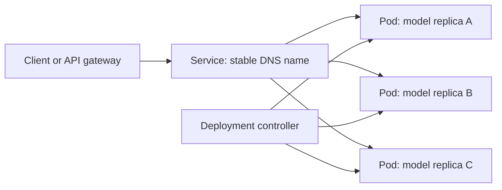
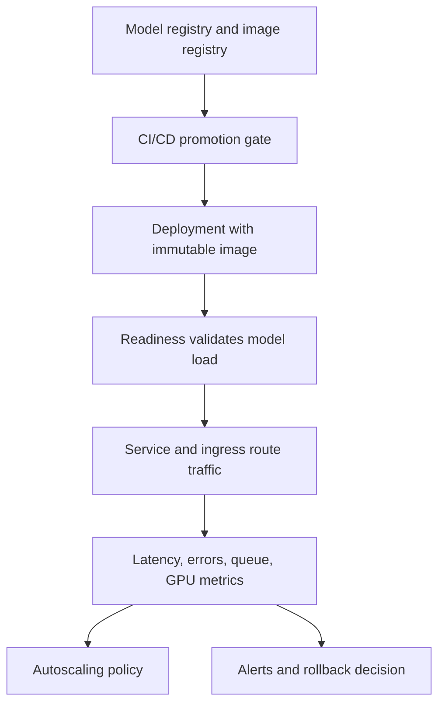

> **Complexity**: Intermediate
>
> **Time to Complete**: 90-120 minutes
>
> **Prerequisites**: [Module 1.1: MLOps Foundations](./module-1.1-ml-devops-foundations/), [Module 1.2: Docker for ML](./module-1.2-docker-for-ml/), [Module 1.3: CI/CD for ML](./module-1.3-cicd-for-ml/), basic YAML, container images, and command-line Kubernetes practice.

---

## What You'll Be Able to Do

- **Design** a Kubernetes-based inference architecture using Deployments, Services, probes, rollout strategy, and workload isolation.
- **Configure** CPU, memory, GPU, storage, and scheduling controls for machine learning services and training jobs.
- **Evaluate** Horizontal Pod Autoscaler, Vertical Pod Autoscaler, Cluster Autoscaler, and queue-based scaling choices for ML workloads.
- **Diagnose** Pending Pods, OOMKilled containers, slow model startup, failed rollouts, and GPU placement failures from Kubernetes evidence.
- **Implement** a runnable local inference mock with manifests, service exposure, rollout checks, autoscaling hooks, and cleanup steps.

## Why This Module Matters

Most machine learning models do not fail in production because the model file suddenly forgets statistics. They fail because the system around the model cannot keep up with traffic, memory pressure, rollout timing, hardware scarcity, or ordinary operational change. A classifier that behaves correctly in a notebook may still become unavailable when every replica loads a two-gigabyte model at the same time. A batch training job may be written correctly and still sit Pending for hours because no node matches its GPU request. An inference API may pass unit tests and still return errors during every deployment because readiness probes mark Pods healthy before the model is actually loaded.

Kubernetes is not a magic machine learning platform. It is a reconciliation system for running containerized workloads on shared infrastructure. That distinction matters because Kubernetes gives you durable primitives, not automatic judgment. Deployments keep replicas running, Services give stable network identities to changing Pods, probes tell traffic routers when a process is ready, resource requests help the scheduler place work, limits protect nodes from runaway processes, and autoscalers adjust capacity when metrics cross a policy boundary. A productive MLOps engineer learns how those primitives combine into a reliable serving or training workflow.

The ML-specific challenge is that model workloads put unusual stress on ordinary Kubernetes assumptions. Large model artifacts make startup slow, GPUs are scarce and expensive, training jobs can run for hours, inference traffic can spike quickly, and bad rollout behavior can create customer-visible errors even when the container process stays alive. The right design therefore starts from the workload question: is this stateless online inference, scheduled batch scoring, distributed training, feature generation, or asynchronous embedding work? The answer determines which Kubernetes objects are appropriate and which controls are dangerous distractions.

This module treats Kubernetes as an engineering substrate for ML, not as a collection of YAML recipes. You will learn how to reason from workload behavior to objects, requests, probes, autoscaling metrics, rollout policy, and debugging commands. The examples assume Kubernetes 1.35 or newer. Before using short commands, define the standard alias with `alias k=kubectl`; all `k` examples in this module assume that alias exists.

## Did You Know

- Kubernetes does not schedule containers directly; it schedules Pods, and the Pod is the unit that receives an IP address, lifecycle state, volumes, resource requests, and placement decisions.
- A Deployment is usually the right controller for stateless inference, while a Job is usually the right controller for finite training, migration, or batch scoring work that should run to completion.
- GPU scheduling depends on advertised extended resources such as `nvidia.com/gpu`; Kubernetes will not infer GPU needs from a Python package, CUDA image tag, or model framework.
- Readiness probes protect users from unfinished model startup, while liveness probes protect the cluster from processes that are stuck badly enough that restarting is better than waiting.

## 1. Map ML Workloads to Kubernetes Objects

The first design decision is not which YAML field to write. The first decision is what kind of workload you are operating. Online inference usually needs a Deployment because it should keep several interchangeable replicas alive behind a stable Service. Batch scoring often fits a Job because it should run until a finite dataset is processed. Scheduled retraining may fit a CronJob when the cadence is time-based. Distributed training may need a higher-level operator, but the underlying scheduling still depends on Pods, resource requests, volumes, and node placement. Treating every workload as a long-running Deployment creates systems that are harder to debug and easier to overprovision.

For ML serving, a Kubernetes Deployment gives you three important controls. The replica count defines how many interchangeable inference Pods should exist. The rollout strategy controls how old Pods are replaced by new Pods. The Pod template defines the runtime contract: image, ports, environment, probes, resource requests, limits, volumes, and security settings. If the model service is stateless and reads model artifacts from the image, object storage, or mounted volume, this controller is normally the simplest production starting point. If the service writes training state locally, a Deployment is probably the wrong abstraction.

The Service object solves a different problem. Pods are intentionally replaceable, so their IP addresses cannot be treated as stable dependencies. A Service gives clients a durable name and load-balances traffic to Pods selected by labels. For internal feature services, a `ClusterIP` Service is often enough. For public inference APIs, a cloud load balancer or ingress controller may sit in front of the Service. The Service does not know whether the backend is an ML model, a cache, or a normal API. It only knows which Pods match the selector and which Pods are ready to receive traffic.



The important operational lesson is that each object answers a separate question. A Deployment answers, "How many model-serving replicas should exist, and how should they roll forward?" A Service answers, "How do clients find whichever replicas are ready right now?" A Job answers, "How do I run this finite training or scoring task to completion?" A PersistentVolumeClaim answers, "How does this Pod receive storage without knowing the provider-specific disk identity?" Good Kubernetes design is mostly the discipline of matching the object to the workload instead of copying a generic manifest.

## 2. Build a Minimal Inference Deployment

A useful inference Deployment begins with a boring contract: immutable image, stable port, explicit resource requests, readiness probe, liveness probe, and labels that match a Service. The image should contain your server code and either the model artifact itself or the logic to fetch the artifact during startup. The request values should describe the resources needed for normal placement, while limits should describe the boundary beyond which the workload is allowed to be throttled or killed. This is not only about fairness; the scheduler cannot place a workload intelligently if the manifest hides the workload size.

```yaml
apiVersion: apps/v1
kind: Deployment
metadata:
  name: sentiment-inference
  labels:
    app: sentiment-inference
spec:
  replicas: 3
  selector:
    matchLabels:
      app: sentiment-inference
  strategy:
    type: RollingUpdate
    rollingUpdate:
      maxSurge: 1
      maxUnavailable: 0
  template:
    metadata:
      labels:
        app: sentiment-inference
    spec:
      containers:
        - name: model-server
          image: registry.example.com/sentiment-inference:v2.1.0
          ports:
            - containerPort: 8000
          resources:
            requests:
              cpu: "500m"
              memory: "1Gi"
            limits:
              cpu: "1"
              memory: "2Gi"
          readinessProbe:
            httpGet:
              path: /ready
              port: 8000
            initialDelaySeconds: 20
            periodSeconds: 5
            failureThreshold: 6
          livenessProbe:
            httpGet:
              path: /live
              port: 8000
            initialDelaySeconds: 60
            periodSeconds: 20
            failureThreshold: 3
```

The readiness probe is the ML-specific guardrail in this manifest. A generic web service may be ready as soon as the process binds a port, but a model server is not ready until weights are loaded, any tokenizer or feature metadata is initialized, and the first prediction path can complete. If readiness returns success too early, Kubernetes may send real traffic to a Pod that can only return errors. If readiness is too strict, the rollout may stall even though the process could serve. Your readiness endpoint should reflect the real user-facing condition: this replica can answer inference requests now.

The rollout policy also deserves explicit attention. `maxUnavailable: 0` tells Kubernetes not to intentionally remove old ready replicas before a replacement is available, which is a sensible default for low-replica inference services. `maxSurge: 1` allows one extra Pod during the rollout so capacity does not dip while new replicas start. These values are not free. If each Pod requires a large GPU or several gigabytes of memory, surging may be impossible without spare cluster capacity. A rollout strategy is therefore a contract between availability and available infrastructure, not a universal recipe.

```yaml
apiVersion: v1
kind: Service
metadata:
  name: sentiment-inference
spec:
  type: ClusterIP
  selector:
    app: sentiment-inference
  ports:
    - name: http
      port: 80
      targetPort: 8000
```

The Service selector must match the Pod labels created by the Deployment. If labels drift during a refactor, the Service may have zero endpoints even though Pods exist and appear healthy. This is a common failure during rushed model releases because engineers update the Deployment name, image, and labels but forget that Services select labels, not controller names. When traffic fails, always check both the Service and its endpoints before assuming the model container is broken.

## 3. Configure CPU, Memory, and Quality of Service

Resource requests are scheduling promises. When you request `1Gi` of memory and `500m` of CPU, the scheduler looks for a node with that much unreserved capacity. Limits are runtime boundaries. CPU limits usually throttle the process when it exceeds the limit, while memory limits can terminate the container when the process exceeds the allowed memory. For ML workloads, memory limits need careful testing because model loading can have temporary peaks that are higher than steady-state inference. A service that appears right-sized after warmup may still be killed during startup.

Kubernetes assigns each Pod a Quality of Service class based on its resource settings. Guaranteed Pods have requests equal to limits for every container and every relevant resource. Burstable Pods have at least one request but do not meet the strict Guaranteed rule. BestEffort Pods have no requests or limits. During node pressure, this class affects eviction decisions. Critical inference services should usually avoid BestEffort because they become the easiest workloads to evict when the node is unhealthy. That does not mean every ML workload must be Guaranteed; it means the choice should be deliberate.

```yaml
resources:
  requests:
    cpu: "2"
    memory: "4Gi"
  limits:
    cpu: "4"
    memory: "8Gi"
```

Right-sizing starts with measurement rather than guesses. Capture startup memory, warm inference memory, peak batch size memory, CPU during typical requests, and CPU during expensive requests. Then set requests near the stable amount needed for reliable placement and set limits high enough to tolerate normal bursts without hiding true leaks. If a model has a predictable memory footprint, tighter requests improve bin packing. If a workload has occasional large input outliers, pair memory limits with input validation so the API rejects unsafe payloads before the process is killed.

Namespaces and ResourceQuotas provide a second layer of control. In a shared ML platform, every team wants faster experiments, larger batch sizes, and more replicas. Without quotas, one experiment can consume the cluster capacity needed for production inference. A quota does not replace capacity planning, but it gives the platform team a clear boundary for each namespace. Pair quotas with LimitRanges so every Pod receives default requests and limits when a team forgets to specify them.

```yaml
apiVersion: v1
kind: ResourceQuota
metadata:
  name: ml-team-quota
  namespace: ml-team-a
spec:
  hard:
    requests.cpu: "40"
    requests.memory: 160Gi
    limits.cpu: "80"
    limits.memory: 320Gi
    pods: "80"
```

The operational habit is to read resource configuration as a scheduling story. A Pending Pod with a huge memory request may be perfectly valid, but the cluster may have no node large enough to place it. An OOMKilled Pod may have an application leak, an unexpectedly large payload, or a limit that ignores model startup behavior. A throttled CPU-bound model may meet availability targets but miss latency objectives. Kubernetes tells you what happened through Pod events, container state, and metrics; your job is to connect that evidence to model behavior.

## 4. Schedule GPU Workloads Deliberately

GPU workloads require explicit scheduling controls because GPUs are scarce, expensive, and unevenly distributed across node pools. Kubernetes represents GPUs as extended resources advertised by a device plugin, commonly `nvidia.com/gpu`. A container requests GPUs under `resources.limits`; requests are not written separately for the same extended resource. If the cluster has no node with the requested GPU resource free, the Pod remains Pending. Kubernetes will not inspect your Python dependencies, CUDA libraries, or image name to decide that a GPU is needed.

```yaml
apiVersion: batch/v1
kind: Job
metadata:
  name: embedding-trainer
spec:
  template:
    spec:
      restartPolicy: Never
      containers:
        - name: trainer
          image: registry.example.com/embedding-trainer:v1.8.0
          command: ["python", "train.py"]
          resources:
            limits:
              nvidia.com/gpu: 1
              cpu: "8"
              memory: "48Gi"
      nodeSelector:
        accelerator: nvidia-a100
      tolerations:
        - key: nvidia.com/gpu
          operator: Exists
          effect: NoSchedule
```

Node labels and taints create the placement boundary around accelerator nodes. Labels let GPU workloads select appropriate nodes, such as A100 nodes rather than T4 nodes. Taints repel ordinary workloads unless those workloads declare a matching toleration. This protects GPU capacity from accidental CPU-only Pods. A cluster that allows every preprocessing container onto GPU nodes will waste money even if the Pods never touch the accelerator. Good scheduling policy prevents expensive mistakes before a human has to notice a cloud bill.

GPU partitioning and sharing complicate the design. Some environments expose whole GPUs only. Others use Multi-Instance GPU profiles, time-slicing, or higher-level serving systems. Each option changes isolation and performance expectations. Whole GPUs are simpler and safer for training, while partitioned or shared GPUs can improve utilization for smaller inference models. Do not treat sharing as a free optimization. Measure latency, memory isolation, and noisy-neighbor behavior before putting multiple production models on the same physical accelerator.

Observability is mandatory for GPU operations because standard CPU metrics do not describe accelerator saturation. Queue depth, GPU memory usage, GPU utilization, request latency, and batch size distribution often matter more than Pod CPU. If an HPA scales only on CPU while the real bottleneck is GPU memory, the autoscaler may add replicas that cannot be scheduled or may fail to add replicas while latency rises. A GPU-aware platform publishes the metrics that match the bottleneck and keeps scheduling policy aligned with those metrics.

## 5. Choose the Right Autoscaling Mechanism

The Horizontal Pod Autoscaler adjusts the number of replicas for scalable controllers such as Deployments. It is usually appropriate for stateless inference when additional replicas can independently serve more traffic. CPU utilization can be a starting metric for simple services, but ML inference often needs custom or external metrics. Request rate, queue depth, p95 latency, GPU utilization, or in-flight requests may better describe user pain. The best metric is not the most sophisticated metric; it is the metric that moves before the service violates its objective.

```yaml
apiVersion: autoscaling/v2
kind: HorizontalPodAutoscaler
metadata:
  name: sentiment-inference
spec:
  scaleTargetRef:
    apiVersion: apps/v1
    kind: Deployment
    name: sentiment-inference
  minReplicas: 3
  maxReplicas: 20
  metrics:
    - type: Resource
      resource:
        name: cpu
        target:
          type: Utilization
          averageUtilization: 65
```

The Vertical Pod Autoscaler changes resource recommendations, and in some modes updates Pod requests. It is useful when teams do not know the right CPU or memory requests for a workload, or when a long-running service has stable traffic but poorly tuned resource settings. VPA is not a substitute for horizontal scaling of stateless inference under traffic spikes. If a service needs twice as much capacity during a promotion, adding replicas may be safer than trying to resize each existing Pod. VPA is best viewed as a right-sizing tool and HPA as a replica-count tool.

The Cluster Autoscaler changes the number of nodes when Pods cannot be scheduled because the cluster lacks capacity. This is a different layer from HPA. HPA may request more Pods, but those Pods still need somewhere to run. If the cluster autoscaler is not configured for the relevant node pool, additional inference replicas can remain Pending. For GPU workloads, the relationship is even more important because node provisioning may be slow and cloud providers may not have accelerator capacity available. Autoscaling policy should account for the time it takes to add nodes, pull images, and load models.

Queue-based scaling is often better for asynchronous ML workloads than CPU-based scaling. Embedding generation, offline scoring, document processing, and feature computation frequently receive work through a queue. In those systems, queue length, oldest message age, or work completion rate can describe demand more directly than CPU. Kubernetes Event-driven Autoscaling and similar controllers can scale consumers from queue metrics, including scaling to zero when no work exists. The tradeoff is cold-start delay, which may be unacceptable for interactive inference but useful for batch and background jobs.

## 6. Manage Model Artifacts and Storage

Model artifacts can be stored in images, mounted volumes, object storage, or a model registry pulled during startup. Embedding the model in the image makes deployments reproducible and avoids network startup dependencies, but it can create very large images and slow rollouts. Pulling from object storage keeps images smaller and lets teams update artifacts separately, but it moves failure risk into startup. Mounting a PersistentVolumeClaim can work for shared or cached artifacts, but the access mode must match the workload. Each option has a different failure mode, so choose it deliberately.

```yaml
apiVersion: v1
kind: PersistentVolumeClaim
metadata:
  name: model-cache
spec:
  accessModes:
    - ReadOnlyMany
  resources:
    requests:
      storage: 50Gi
```

Access modes are especially important in ML because teams often confuse "many replicas need the model" with "many replicas need to write the same files." Inference replicas usually need read access to the same artifact, not concurrent write access. Training jobs may need write access for checkpoints, but a single-writer checkpoint volume is safer than a shared writable directory unless the framework is designed for it. If multiple Pods write arbitrary files to the same path without coordination, the storage system can become the hidden source of corruption, latency, or inconsistent results.

Large artifacts also affect rollout behavior. If every new Pod downloads a model from remote storage at the same time, a rollout can overload the storage service or hit rate limits. Init containers, local node caches, image pre-pulling, and staggered rollouts can reduce that risk. Readiness probes should stay false until the artifact is present and validated. A common production mistake is treating a successful container start as proof that the model exists; a better server validates checksum, schema compatibility, and load success before reporting readiness.

## 7. Debug Kubernetes Evidence for ML Failures

Kubernetes debugging starts with state, events, and logs. A failing model service may produce Python stack traces, but Kubernetes tells you whether the Pod was scheduled, whether containers started, whether probes failed, whether the container was killed, and whether the Service has endpoints. Start broad, then narrow. Check the Deployment rollout, list Pods, describe the suspicious Pod, inspect events, inspect previous container logs after restarts, and then inspect metrics. This workflow prevents the common mistake of staring at application logs when the scheduler already explained the problem.

```bash
alias k=kubectl

k get deploy sentiment-inference
k rollout status deploy/sentiment-inference
k get pods -l app=sentiment-inference -o wide
k describe pod <pod-name>
k logs <pod-name> --previous
k get endpoints sentiment-inference
```

A Pending Pod is usually a scheduling problem rather than an application problem. `k describe pod` will often show events such as insufficient CPU, insufficient memory, untolerated taint, unmatched node selector, or unavailable GPU resources. For ML teams, this evidence is more useful than rerunning the training script. If the Pod requests `nvidia.com/gpu: 4` and every node has only one free GPU, the application cannot fix placement. The choices are to lower the request, change the node pool, wait for capacity, or redesign the distributed job.

An OOMKilled container is a memory contract problem until proven otherwise. It may be a leak, an unexpectedly large payload, a batch size that grew beyond testing, a model artifact loaded twice, or a limit below startup peak. The event proves that the kernel killed the process after memory pressure; it does not prove why the process used that memory. Compare startup memory, steady-state memory, request size, and model version. If the problem appears only after a new model release, validate artifact size and runtime loading behavior before increasing limits blindly.

A failed rollout is often a readiness or capacity problem. If new Pods never become ready, inspect readiness endpoint logs and probe configuration. If new Pods stay Pending, inspect scheduling events. If old Pods terminate before new Pods can serve, inspect rollout strategy and PodDisruptionBudget. If the Service has no endpoints, inspect labels and selectors. This systematic evidence chain is what separates Kubernetes operations from random YAML editing. The goal is not to memorize every error message; the goal is to ask which controller made the decision and what evidence it recorded.

## 8. Production Design Pattern

A production ML serving stack normally includes more than a Deployment and a Service. It includes immutable model versioning, CI/CD promotion gates, readiness that validates loaded artifacts, resource policy, autoscaling based on meaningful metrics, traffic management for gradual rollout, observability, and rollback. Kubernetes provides the substrate for many of those controls, while surrounding systems provide registry, monitoring, alerting, feature stores, and model evaluation. The platform design should make the safe path easy enough that product teams do not need to reinvent it for every model.



The pattern changes for training. Training jobs often need stronger data access controls, checkpoint storage, accelerator scheduling, retry policy, and experiment tracking. A failed inference Pod should usually restart quickly, while a failed training job may need careful inspection before retrying because rerunning can waste expensive accelerator hours. Kubernetes Jobs give you completion semantics, but the surrounding ML platform still needs dataset identity, run metadata, artifact registration, and reproducibility. Kubernetes can run the process; it does not automatically make the experiment scientifically meaningful.

The platform team should expose a small number of reviewed templates rather than letting every team assemble raw primitives from scratch. A standard inference template can require probes, resource requests, immutable image tags, labels, metrics annotations, and rollout settings. A standard training template can require explicit GPU requests, checkpoint volume policy, restart behavior, and namespace quota awareness. Templates do not eliminate engineering judgment, but they move repeated safety decisions into a shared baseline that reviewers and operators can understand.

## 9. Operate the Release Lifecycle

The release lifecycle for a Kubernetes-hosted model starts before the manifest is applied. A model image should be tied to a specific model artifact, training data lineage, dependency set, and evaluation record. If the image tag is mutable, rollback becomes guesswork because different nodes may pull different content at different times. If the manifest does not record the model version through labels, annotations, or environment variables, incident responders may not know which model is serving traffic. The platform should make release identity visible from both Kubernetes and the ML registry.

Promotion should happen through environments that test different risks. A local or ephemeral namespace can prove that the manifests apply, Pods become Ready, and the Service routes to the correct endpoints. A staging environment can prove that the model loads real artifacts, handles realistic payloads, emits metrics, and respects resource limits. Production rollout should then prove that the new model behaves under live traffic without replacing every replica at once. Each stage answers a different question, so skipping stages usually moves uncertainty into the most expensive environment.

Canary rollout is useful when model behavior and system behavior both carry risk. At the Kubernetes layer, a canary may be implemented with separate Deployments, labels, ingress routing, service mesh weights, or external traffic management. At the ML layer, the team also needs model-quality checks such as drift, prediction distribution, business metrics, or manual review. A rollout that is technically healthy can still be a model-quality failure. The Kubernetes operator should therefore expose deployment health while the ML owner validates prediction behavior from domain metrics.

Rollback should be rehearsed, not merely promised. Kubernetes can roll a Deployment back to a previous ReplicaSet when rollout history is available, but that is only safe if the previous image tag and model artifact are still retrievable. If the old model was deleted from the registry, if the old image tag was overwritten, or if the feature schema changed incompatibly, a rollback may restart Pods that cannot serve. The reliable pattern is to retain release artifacts, version feature contracts, and keep backward-compatible serving paths until the team has evidence that the new version is stable.

```bash
k rollout history deployment/sentiment-inference
k rollout undo deployment/sentiment-inference
k rollout status deployment/sentiment-inference
```

The release checklist should include Kubernetes evidence and ML evidence. Kubernetes evidence includes successful rollout, expected replica count, ready endpoints, stable restart count, acceptable probe behavior, and resource usage inside planned boundaries. ML evidence includes prediction latency, error rate, output distribution, feature freshness, and model-specific quality indicators. These signals should be reviewed together because either side can invalidate the release. A model can be accurate but unavailable, and a perfectly available service can return harmful or low-quality predictions.

## 10. Separate Online Inference from Batch and Training

Online inference is usually latency-sensitive and customer-facing. It benefits from multiple small replicas, fast readiness, conservative rollout, stable Services, and autoscaling that reacts before user-facing latency violates an objective. Batch scoring is usually throughput-sensitive and often reads from queues, object storage, or scheduled datasets. It benefits from Jobs, queue-based scaling, resumable work units, and idempotent output writes. Training is often accelerator-sensitive and expensive, so it benefits from deliberate GPU placement, checkpointing, retry control, and strong experiment metadata.

When teams collapse these workload types into one generic template, the template becomes unsafe for at least one of them. A Deployment template with aggressive liveness restarts can be harmful for a training job that needs time to checkpoint. A Job template without readiness probes is inadequate for an inference API. A queue worker that scales to zero may be efficient for embedding backfills but unacceptable for a low-latency user request path. The platform should expose different defaults because the controller semantics, failure tolerance, and cost profile are genuinely different.

Batch and training workloads also need stronger idempotency thinking. If a Job retries after a node failure, it may process the same input shard twice unless the application writes outputs with stable identifiers or commit markers. If a training process restarts from the beginning after every interruption, cheap spot capacity may become more expensive than reliable on-demand capacity. Kubernetes can retry a Pod, but it cannot infer whether the workload is safe to retry. The ML code and the storage contract must make retry behavior explicit.

For distributed training, Kubernetes placement becomes a coordination problem rather than a single-Pod problem. The job may need several Pods to start together, communicate over fast networking, and access shared or sharded data. Plain Jobs can handle simple single-Pod training, but distributed frameworks often need operators that understand worker roles, chief Pods, rendezvous, and failure policy. Even when an operator manages the framework-specific lifecycle, the underlying issues remain Kubernetes issues: resources, node pools, volumes, events, logs, and quotas.

## 11. Design Observability Around User Pain

A model-serving dashboard that only shows Pod count is not an operations dashboard. The service may have the correct number of replicas while every request times out because the model is waiting on a feature service. It may have low CPU while the GPU is saturated. It may have no restarts while readiness flaps under load. Observability should start from user pain: latency, error rate, availability, saturation, and prediction-path success. Kubernetes metrics explain infrastructure behavior, while application and model metrics explain serving behavior.

For online inference, useful metrics include request rate, p50 and p95 latency, error rate, in-flight requests, queue depth if batching is used, model load duration, cold-start count, and prediction payload size. For GPU inference, add GPU utilization, GPU memory, batch occupancy, and time waiting for accelerator work. For batch jobs, track items processed, oldest queued item, retry count, output failures, and completion lag. These metrics are not decoration. They determine autoscaling policy, alert thresholds, and whether a rollout is improving or damaging the system.

Logs should include model version, request identifier, important validation failures, and downstream dependency errors, but they should not leak sensitive input data. ML services often handle text, images, user behavior, or business records that are more sensitive than normal operational metadata. A Kubernetes log pipeline can centralize logs quickly, so application teams must decide what belongs in logs before an incident forces everyone to search them. The best debugging log is specific enough to explain the failure and restrained enough to avoid becoming a data-governance problem.

Tracing is valuable when inference depends on multiple services. A request may pass through an API gateway, feature service, model server, vector database, cache, and post-processing service. Kubernetes can tell you which Pod ran each component, but distributed tracing can show which hop consumed the time. This distinction matters during incidents because scaling the model Deployment will not fix a slow feature lookup. Trace attributes should include model version and safe workload identifiers so performance regressions can be tied to releases without exposing raw user data.

Alerts should be tied to action. An alert for "Pod restarted once" may create noise if the service has enough replicas and the restart was harmless. An alert for sustained error rate, empty Service endpoints, unavailable ready replicas, or queue age beyond an objective usually deserves attention. For ML systems, also alert when model load fails, when prediction latency changes sharply after rollout, or when resource saturation prevents scale-out. The alert should tell the operator where to look first: rollout, scheduler, probes, resource pressure, dependency, or model behavior.

## 12. Review Security and Multi-Tenancy

ML workloads often run in shared clusters because GPUs and data platforms are expensive. Shared infrastructure requires strict boundaries. Namespaces provide a naming and policy boundary, but they are not enough by themselves. Service accounts, role-based access control, NetworkPolicies, image provenance, secret handling, Pod security settings, and quotas all contribute to isolation. A model-serving Pod rarely needs broad cluster permissions. If it only serves HTTP and reads a model artifact, its service account should not be able to list secrets or modify Deployments.

NetworkPolicy is especially useful for feature and model systems. An inference service may need to receive traffic from an API gateway and call a feature service, but it probably should not accept traffic from every namespace or call the Kubernetes API server. Training jobs may need access to object storage or metadata services, but not to production inference backends. Default-allow networking is convenient during early experiments and dangerous in shared production clusters. A reviewed template should make required network paths explicit.

Secrets deserve careful design because ML services often need registry credentials, object-store credentials, database passwords, or API tokens. Kubernetes Secrets are not a license to spread credentials through every namespace. Prefer short-lived identity mechanisms from the cloud or platform when available, mount only the secrets required by the workload, and avoid printing secret-derived values in logs. If a model server pulls artifacts at startup, failure messages should identify the missing permission without revealing credentials or signed URLs.

Image and dependency control also matter. A model server image may include Python packages, native libraries, CUDA components, and serving frameworks. The platform should scan images, pin base images, and promote images through CI/CD rather than allowing ad hoc builds from laptops. Kubernetes will run the image you ask it to run; it will not decide whether the dependency tree is safe. MLOps teams need the same supply-chain discipline as application teams, with extra attention to native packages and accelerator runtime compatibility.

## 13. Capacity Planning and Cost Control

Autoscaling reduces manual work, but it does not remove the need for capacity planning. A service with a five-minute model startup time cannot react instantly to a sudden traffic surge, even if HPA detects the surge quickly. A GPU node pool may take several minutes to provision, and the cloud provider may have limited regional capacity. A large image may take time to pull on every new node. Capacity planning therefore includes warm replicas, spare node capacity, image pre-pulling, artifact caching, and realistic load tests, not only autoscaler configuration.

Cost control should be evaluated per workload type. Online inference usually pays for low latency and availability, so keeping a minimum number of replicas warm is often justified. Batch jobs can use cheaper interruptible capacity if they checkpoint and resume safely. Training may justify dedicated accelerator reservations when failed or delayed jobs cost more than idle time. Queue workers may scale to zero when latency is not user-facing. The same Kubernetes cluster can host all of these patterns, but the cost policy should not pretend they have the same business priority.

Resource efficiency comes from measuring both utilization and outcomes. A GPU at high utilization is not necessarily efficient if the model is serving low-value traffic, retrying failed work, or waiting on slow data access. A CPU service at low utilization may be deliberately overprovisioned to meet latency objectives. The platform team should report cost alongside workload owner, namespace, model version, request volume, and business purpose. Kubernetes labels and annotations make that accounting easier when teams use them consistently.

The final capacity question is operational maturity. A small team may prefer a simpler design with fewer moving parts even if it costs more, because the team cannot safely operate custom metrics, service mesh routing, and complex GPU sharing yet. A mature platform team may invest in those capabilities because the savings and reliability gains justify the complexity. Kubernetes gives you the mechanisms; engineering judgment decides when each mechanism is worth its operational burden.

## Common Mistakes

| Mistake | Why It Happens | What To Do Instead |
|---|---|---|
| Treating a Pod as a durable server | Teams familiar with virtual machines expect a Pod IP and local filesystem to survive replacement. | Put replicas behind a Service, store durable artifacts outside the Pod, and let controllers recreate Pods. |
| Reporting readiness too early | The process binds a port before model weights, tokenizers, or feature metadata are loaded. | Make readiness validate the actual inference path or a strong local model-load condition. |
| Scaling on CPU when the bottleneck is GPU or queue depth | CPU metrics are easy to collect, but they may not represent accelerator saturation or user wait time. | Use metrics that match the bottleneck, such as queue age, p95 latency, GPU utilization, or in-flight requests. |
| Forgetting resource requests | A container works in development, so the manifest omits scheduling information. | Set measured CPU and memory requests so the scheduler can place Pods predictably. |
| Using GPU nodes for ordinary CPU work | GPU node pools are not tainted, or CPU workloads tolerate too much by default. | Taint accelerator nodes and require explicit tolerations plus selectors for GPU workloads. |
| Rolling out large models without spare capacity | Surging new replicas requires memory, CPU, storage bandwidth, and sometimes GPUs that may not exist. | Match rollout settings to real capacity and pre-warm artifacts when startup is expensive. |
| Debugging only application logs | Engineers jump to Python errors even when Kubernetes events already show scheduling, probe, or OOM evidence. | Read rollout status, Pod events, container state, previous logs, metrics, and Service endpoints in order. |

## Knowledge Check

<details>
<summary>1. Design a Kubernetes inference architecture for a stateless model API that must survive Pod replacement without changing the client endpoint.</summary>

Use a Deployment to manage interchangeable model-serving replicas and a Service to provide a stable DNS name and load-balancing target. The Deployment should include immutable image tags, resource requests, readiness probes that wait for model load, liveness probes for stuck processes, and a rolling update strategy. The Service should select Pods by stable labels rather than by controller name, because Pods will be replaced during rollout and node failure.
</details>

<details>
<summary>2. Configure the core controls needed for a GPU training Job that should run only on accelerator nodes.</summary>

Use a Job rather than a Deployment because the training process should run to completion. Request the GPU as an extended resource such as `nvidia.com/gpu` under container limits, add a node selector for the accelerator node pool, and add a toleration that matches the GPU node taint. Also define CPU and memory limits, checkpoint storage, and a restart policy that matches the cost of retrying the training process.
</details>

<details>
<summary>3. Evaluate whether HPA, VPA, Cluster Autoscaler, or queue-based scaling best fits three different ML workloads.</summary>

For stateless online inference, HPA is usually the first fit because adding replicas increases request capacity. For poorly sized long-running services, VPA can recommend better CPU and memory requests, but it should not be treated as traffic scaling. For Pending Pods caused by insufficient nodes, Cluster Autoscaler addresses the infrastructure layer. For asynchronous embedding or batch scoring work, queue-based scaling often gives the clearest demand signal.
</details>

<details>
<summary>4. Diagnose a Deployment where the rollout hangs and new Pods never become ready after a model version update.</summary>

Start with `k rollout status`, then inspect new Pods with `k describe pod` and read readiness probe failures. If Pods are Running but not Ready, validate that the model artifact downloads successfully, the server loads the new model schema, and the readiness endpoint reflects load completion. If Pods are Pending, inspect scheduling events for insufficient memory, unavailable GPUs, node selectors, or taints.
</details>

<details>
<summary>5. Diagnose an OOMKilled inference container that only fails after larger request payloads arrive.</summary>

An OOMKilled state means the process exceeded its memory limit and was killed under memory pressure. Compare request size, batch size, model version, startup peak, and steady-state memory. The fix may involve input limits, smaller batch sizes, streaming, model optimization, or a higher memory limit. Raising the limit alone can hide a leak or move the failure to the node level.
</details>

<details>
<summary>6. Implement a safe local test workflow before promoting a Kubernetes model-serving manifest to a shared cluster.</summary>

Use a mock or lightweight model server locally, apply manifests in a disposable namespace, verify Pods, check Service endpoints, run a simple request, inspect rollout status, and delete the namespace afterward. The goal is not to prove the model is accurate; it is to prove the Kubernetes contract works before adding real model artifacts, cloud load balancers, and shared infrastructure constraints.
</details>

<details>
<summary>7. Explain why a Service can have no endpoints even when Pods exist in the namespace.</summary>

A Service routes only to Pods matching its selector and only to Pods considered ready. Label drift, selector mistakes, readiness failures, or Pods in a different namespace can all produce an empty endpoint list. The debugging path is to compare `k get pods --show-labels`, `k describe service`, and `k get endpoints` before changing application code.
</details>

## Hands-On Exercise: Deploy a Local Inference Mock

This exercise uses a lightweight HTTP container so you can practice Kubernetes operations without downloading a large model. The mock server returns static JSON, but the Kubernetes contract is the same one used by real inference services: a Deployment creates replicas, probes protect traffic, a Service exposes the replicas, and commands verify rollout behavior. Use a local cluster such as kind, minikube, Docker Desktop, or another disposable Kubernetes environment before applying similar manifests to shared infrastructure.

- [ ] Create a namespace and define `alias k=kubectl` for the remaining commands.
- [ ] Apply the ConfigMap, Deployment, Service, and optional HPA manifest.
- [ ] Verify Pods, readiness, Service endpoints, and rollout status from Kubernetes evidence.
- [ ] Send a request from inside the cluster and confirm the mock prediction response.
- [ ] Delete the namespace so no local resources remain after the exercise.

```bash
alias k=kubectl
k create namespace ml-k8s-lab
```

```yaml
apiVersion: v1
kind: ConfigMap
metadata:
  name: mock-model-config
  namespace: ml-k8s-lab
data:
  default.conf: |
    server {
      listen 8000;
      location /ready {
        return 200 "ready\n";
      }
      location /live {
        return 200 "live\n";
      }
      location /predict {
        default_type application/json;
        return 200 '{"label":"positive","score":0.91}';
      }
    }
---
apiVersion: apps/v1
kind: Deployment
metadata:
  name: mock-inference
  namespace: ml-k8s-lab
spec:
  replicas: 2
  selector:
    matchLabels:
      app: mock-inference
  template:
    metadata:
      labels:
        app: mock-inference
    spec:
      containers:
        - name: server
          image: nginx:1.27-alpine
          ports:
            - containerPort: 8000
          volumeMounts:
            - name: config
              mountPath: /etc/nginx/conf.d
          resources:
            requests:
              cpu: "50m"
              memory: "64Mi"
            limits:
              cpu: "250m"
              memory: "128Mi"
          readinessProbe:
            httpGet:
              path: /ready
              port: 8000
            periodSeconds: 5
          livenessProbe:
            httpGet:
              path: /live
              port: 8000
            periodSeconds: 10
      volumes:
        - name: config
          configMap:
            name: mock-model-config
---
apiVersion: v1
kind: Service
metadata:
  name: mock-inference
  namespace: ml-k8s-lab
spec:
  type: ClusterIP
  selector:
    app: mock-inference
  ports:
    - port: 80
      targetPort: 8000
```

```bash
k apply -f mock-inference.yaml
k rollout status deployment/mock-inference -n ml-k8s-lab
k get pods -n ml-k8s-lab -l app=mock-inference -o wide
k get endpoints mock-inference -n ml-k8s-lab
```

```bash
k run curl-test \
  -n ml-k8s-lab \
  --rm -it \
  --image=curlimages/curl:8.10.1 \
  --restart=Never \
  -- http://mock-inference/predict
```

If the request fails, debug from the Kubernetes layer before changing the mock server. Check whether Pods are Ready, whether the Service has endpoints, whether the selector matches Pod labels, and whether the container logs show NGINX configuration errors. That habit transfers directly to real model-serving failures because many incidents are caused by rollout, readiness, routing, and resource contracts rather than by model code.

```bash
k describe pod -n ml-k8s-lab -l app=mock-inference
k logs -n ml-k8s-lab -l app=mock-inference
k describe service mock-inference -n ml-k8s-lab
k delete namespace ml-k8s-lab
```

## Next Module

Next, continue to [Module 1.5: Advanced Kubernetes](./module-1.5-advanced-kubernetes/) to connect these workload primitives to deeper cluster operations, production policies, and advanced deployment patterns.

## Sources

- [Kubernetes: Pods](https://kubernetes.io/docs/concepts/workloads/pods/) — Defines the Pod abstraction, lifecycle context, networking model, and why Pods are the schedulable unit for containers.
- [Kubernetes: Deployments](https://kubernetes.io/docs/concepts/workloads/controllers/deployment/) — Documents rollout behavior, replica management, selectors, and Deployment status used for inference services.
- [Kubernetes: Services](https://kubernetes.io/docs/concepts/services-networking/service/) — Explains stable networking and Service selectors for changing sets of Pods.
- [Kubernetes: Configure Liveness, Readiness, and Startup Probes](https://kubernetes.io/docs/tasks/configure-pod-container/configure-liveness-readiness-startup-probes/) — Covers probe semantics used to protect model startup and traffic routing.
- [Kubernetes: Resource Management for Pods and Containers](https://kubernetes.io/docs/concepts/configuration/manage-resources-containers/) — Describes requests, limits, CPU throttling, memory behavior, and scheduling implications.
- [Kubernetes: Pod Quality of Service Classes](https://kubernetes.io/docs/concepts/workloads/pods/pod-qos/) — Explains Guaranteed, Burstable, and BestEffort classes and their relationship to eviction.
- [Kubernetes: Horizontal Pod Autoscaling](https://kubernetes.io/docs/concepts/workloads/autoscaling/horizontal-pod-autoscale/) — Documents HPA behavior and metrics-driven replica scaling.
- [Kubernetes: Schedule GPUs](https://kubernetes.io/docs/tasks/manage-gpus/scheduling-gpus/) — Describes the official GPU scheduling model and extended resource requests.
- [Kubernetes: Taints and Tolerations](https://kubernetes.io/docs/concepts/scheduling-eviction/taint-and-toleration/) — Explains how node taints and Pod tolerations shape placement decisions.
- [Kubernetes: Persistent Volumes](https://kubernetes.io/docs/concepts/storage/persistent-volumes/) — Covers PersistentVolumes, PersistentVolumeClaims, and access modes for model artifacts and checkpoints.
- [Kubernetes: Jobs](https://kubernetes.io/docs/concepts/workloads/controllers/job/) — Defines finite task execution semantics for training, batch scoring, and migration-style workloads.
- [KEDA Documentation: Concepts](https://keda.sh/docs/latest/concepts/) — Provides background on event-driven autoscaling patterns for queue-backed workloads.
