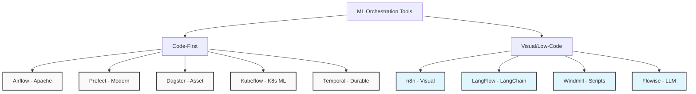
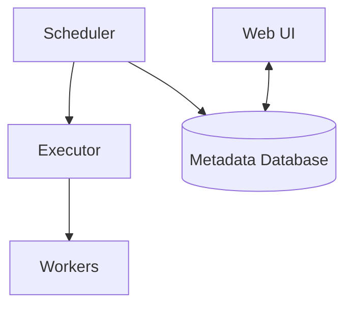
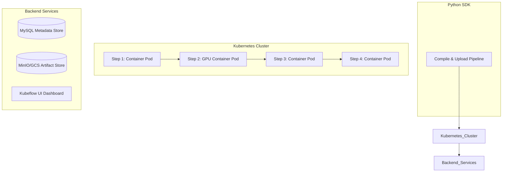
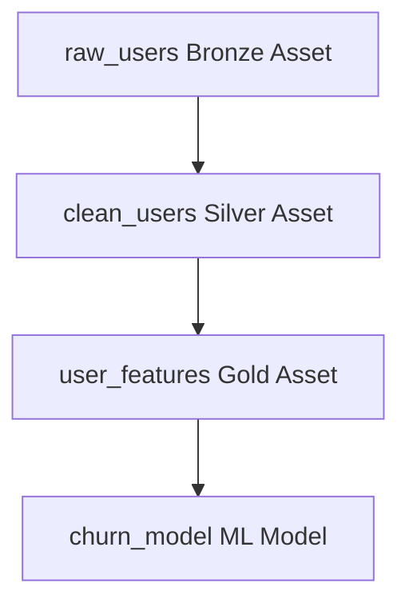
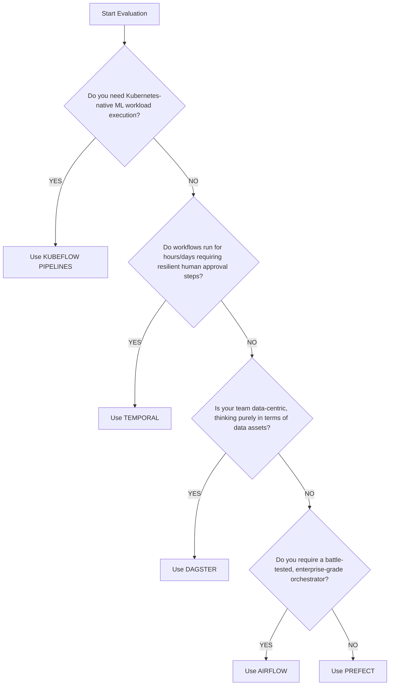
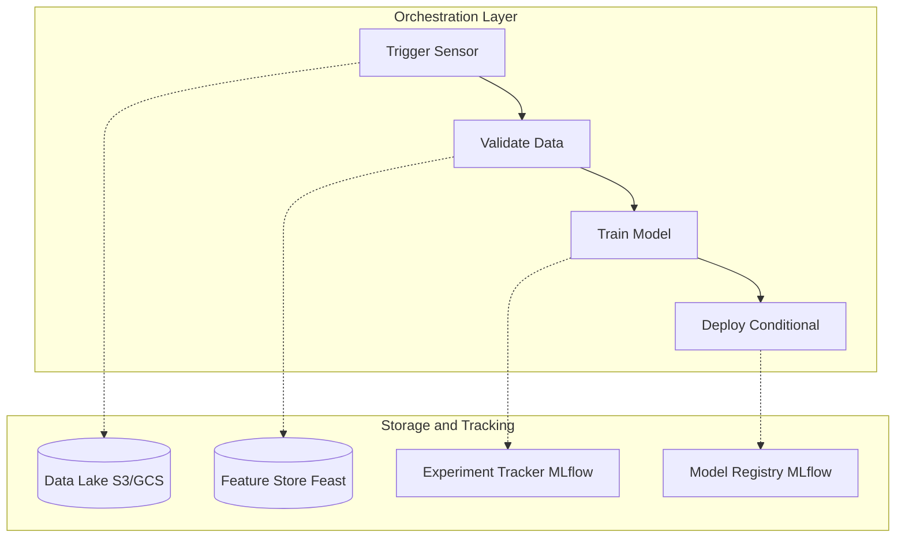

> **AI/ML Engineering Track** | Complexity: `[COMPLEX]` | Time: 6-8

**Prerequisites**: Module 49 (Data Versioning & Feature Stores)

San Francisco. October 3, 2014. 3:17 AM. Maxime Beauchemin's phone buzzed with yet another critical alert. Airbnb's core pricing data pipeline had failed again. This time it was a massive cascade: the daily pricing model had not retrained because the feature engineering pipeline died unexpectedly, which happened because the upstream data validation job timed out entirely, which happened because of a silent database schema change. No one could trace the root cause without spending hours digging through disconnected bash scripts and scattered log files.

Beauchemin dragged himself to his laptop and started manually tracing the failure graph. Four hours later, he had finally traced the failure to a single upstream task that had silently failed two days prior. The ad-hoc cron job had not reported the error properly. No one knew until everything downstream collapsed, costing the business significant revenue due to stale pricing algorithms. "We are running a billion-dollar company on bash scripts and hope," he realized.

Over the next few months, Beauchemin engineered a fundamentally different approach: a robust system where tasks explicitly declared their dependencies, where failures triggered immediate alerts, and where engineers could visualize the entire pipeline execution at a glance. He called it "Airflow," and Airbnb open-sourced it in 2015. Today, it orchestrates ML pipelines at scale across the industry. That 3 AM wake-up call spawned an entire discipline of workflow orchestration, proving that manual cron jobs are a liability when real financial impact is at stake.

---

## What You'll Be Able to Do

By the end of this module, you will be able to:
- **Design** end-to-end ML training pipelines that orchestrate data preparation, model training, and conditional deployment.
- **Implement** durable execution patterns for long-running machine learning workloads using Temporal workflows.
- **Diagnose** silent failures and pipeline cascading errors using log analysis and data health checks.
- **Evaluate** the trade-offs between asset-based orchestration (Dagster) and task-based DAGs (Airflow) for data-centric ML teams.
- **Compare** Kubernetes-native execution (Kubeflow) against traditional orchestrators for GPU-accelerated workloads.

---

## The History of ML Orchestration: From Cron to Cloud-Native

### The Cron Era (Pre-2014)

Before dedicated orchestration tools, teams ran ML pipelines with cron jobs and bash scripts. This worked for simple pipelines, but as companies grew, the limitations became painful. The lack of standardized dependency management meant scripts had to arbitrarily sleep and guess when upstream data would be ready.

> **Did You Know?** In 2013, LinkedIn's data team maintained over 10,000 cron jobs across dozens of servers. Engineers spent 30% of their time just debugging scheduling conflicts and mysterious failures.

The core problems of the cron era were universal across all engineering teams:
- **No dependency management**: Cron does not natively know that job A must finish successfully before job B starts.
- **No visibility**: You could not see what was running, what failed, or why without logging into servers.
- **No retries**: Failures meant manual intervention or complete data loss.
- **No auditing**: Who ran what? When? With what parameters? The answers were lost to history.

### The Birth of Modern Orchestration (2014-2016)

**Airflow emerges at Airbnb (2014)**. Maxime Beauchemin's frustration became the industry's solution. Key innovations included expressing DAGs as pure Python code, explicit dependency management, a rich UI visualization, and extensible operator classes. Airbnb open-sourced it in 2015, and it rapidly became the defacto industry standard.

> **Did You Know?** Airflow was named after the HVAC concept because Beauchemin saw pipelines like air ducts. It almost launched as "Dataflow" before Google trademarked the term.

**Oozie at Yahoo (2010-2014)**. The Hadoop ecosystem's answer to orchestration was Oozie. It was an XML-based, highly verbose orchestrator. While incredibly reliable at scale, the sheer pain of writing XML configurations made teams desperate for the elegance of Python-based tools like Airflow.

### The Kubernetes Revolution (2017-2020)

As ML workflows transitioned to containerized environments, orchestration tools had to adapt natively to Kubernetes primitives:

**Kubeflow (2017)**: Google open-sourced their internal ML toolkit for Kubernetes. Finally, data scientists could request GPUs without understanding node affinity or taints.

> **Did You Know?** The initial Kubeflow release required 40 YAML files to deploy a single model training job. By version 1.0 in 2020, a single decorator could achieve the same deployment.

**Argo Workflows (2017)**: YAML-native Kubernetes workflows gained massive popularity. By removing Python from the orchestration layer, infrastructure teams could define pipelines in the exact same language they used for their standard cluster deployments.

### The Modern Era (2020-Present)

The latest evolution of orchestration tools acknowledges that machine learning code is inherently different from standard web application code.

**Prefect**: Rewrote orchestration from scratch with a "Python-native" philosophy. Flows are just decorated Python functions—no strict DAG boilerplate is required.
**Dagster**: Introduced "Software-Defined Assets." Instead of thinking about what tasks you run, you think about what data you produce.
**n8n**: Visual workflow automation for the AI era. Non-programmers can build RAG pipelines by dragging and connecting nodes visually.

> **Did You Know?** n8n was created by Jan Oberhauser in Berlin in 2019. It raised $12 million in Series A funding in 2022 and has become the leading self-hosted visual automation tool.

---

## Why Pipeline Orchestration Matters

Every ML system in production strictly requires orchestration. Training a model once in a Jupyter notebook is trivial. Training it daily, implementing rigorous data validation, extracting new features, evaluating the model against a baseline, and deploying it securely—that is where orchestration becomes essential. 

Think of ML orchestration like an airport control tower. Individual planes (ML tasks) know how to fly perfectly well independently, but without central coordination, you would have catastrophic chaos. Planes would take off into each other, land on occupied runways, and fuel trucks would collide with baggage carts. The control tower (orchestrator) ensures everything happens in the exact right order, at the precise right time, using the correct resources.

The reality of operating Machine Learning in production environments is stark:

```text
WITHOUT ORCHESTRATION              WITH ORCHESTRATION
====================              ==================

Manual cron jobs                  Declarative DAGs
"It worked on my machine"         Reproducible pipelines
No visibility                     Full observability
Failures go unnoticed             Automatic retries + alerts
No dependency management          Clear task dependencies
Ad-hoc scheduling                 Intelligent scheduling
```

| Without Orchestration | With Airflow |
|-----------------------|--------------|
| 4 hours/week debugging cron | 1 hour/week pipeline maintenance |
| $50K/month in pricing errors | $5K/month (90% reduction) |
| 3 engineers on-call rotation | 1 engineer with auto-alerting |
| Manual retraining triggers | Automatic daily retraining |

> **Pause and predict**: If your feature engineering task is not strictly idempotent and fails halfway through, what specific data corruption occurs when the orchestrator automatically retries the task after a transient network failure?

---

## The Orchestration Landscape

To navigate the complex tooling environment, we must categorize orchestrators based on their core philosophy.

```text
┌─────────────────────────────────────────────────────────────────────────┐
│                    ML ORCHESTRATION TOOLS                                │
├─────────────────────────────────────────────────────────────────────────┤
│                                                                          │
│  CODE-FIRST                          VISUAL/LOW-CODE                     │
│  ──────────                          ──────────────                      │
│                                                                          │
│  ┌─────────────┐  ┌─────────────┐   ┌─────────────┐  ┌─────────────┐   │
│  │   AIRFLOW   │  │   PREFECT   │   │     n8n     │  │  LANGFLOW   │   │
│  │  (Apache)   │  │  (Modern)   │   │  (Visual)   │  │ (LangChain) │   │
│  │             │  │             │   │             │  │             │   │
│  │ Python DAGs │  │ Python-     │   │ Drag-drop   │  │ AI chains   │   │
│  │ Scheduling  │  │ native      │   │ 400+ nodes  │  │ Visual      │   │
│  │ Battle-     │  │ Dynamic     │   │ AI nodes    │  │ builder     │   │
│  │ tested      │  │ Hybrid      │   │ Self-host   │  │             │   │
│  └─────────────┘  └─────────────┘   └─────────────┘  └─────────────┘   │
│                                                                          │
│  ┌─────────────┐  ┌─────────────┐   ┌─────────────┐  ┌─────────────┐   │
│  │   DAGSTER   │  │  KUBEFLOW   │   │  WINDMILL   │  │   FLOWISE   │   │
│  │  (Asset)    │  │  (K8s ML)   │   │  (Scripts)  │  │  (LLM)      │   │
│  │             │  │             │   │             │  │             │   │
│  │ Data-aware  │  │ K8s-native  │   │ Any lang    │  │ Drag-drop   │   │
│  │ Typed       │  │ ML-focused  │   │ Visual +    │  │ LLM flows   │   │
│  │ Software-   │  │ Pipelines   │   │ code        │  │             │   │
│  │ defined     │  │             │   │             │  │             │   │
│  └─────────────┘  └─────────────┘   └─────────────┘  └─────────────┘   │
│                                                                          │
│  ┌─────────────┐                                                        │
│  │  TEMPORAL   │  WHEN TO USE WHAT:                                     │
│  │  (Durable)  │  ───────────────────                                   │
│  │             │  Complex ML Pipelines → Airflow, Kubeflow              │
│  │ Long-       │  Data Engineering    → Dagster, Airflow                │
│  │ running     │  Quick AI Prototypes → n8n, LangFlow                   │
│  │ Reliable    │  Production Agents   → n8n, Temporal                   │
│  │ workflows   │  Long-running Jobs   → Temporal                        │
│  └─────────────┘  K8s-native ML       → Kubeflow                        │
│                                                                          │
└─────────────────────────────────────────────────────────────────────────┘
```

Visualized as a dependency matrix:


---

## Apache Airflow Deep Dive

### What is Airflow?

Airflow is the industry standard for workflow orchestration. It lets you define workflows explicitly as code (DAGs - Directed Acyclic Graphs), schedule them dynamically, and monitor their execution via a comprehensive user interface.

```text
AIRFLOW ARCHITECTURE
====================

┌─────────────────────────────────────────────────────────────────┐
│                         AIRFLOW                                  │
├─────────────────────────────────────────────────────────────────┤
│                                                                  │
│   ┌─────────────┐    ┌─────────────┐    ┌─────────────┐        │
│   │  SCHEDULER  │───▶│   EXECUTOR  │───▶│   WORKERS   │        │
│   │             │    │             │    │             │        │
│   │ Triggers    │    │ Celery/K8s/ │    │ Run tasks   │        │
│   │ DAG runs    │    │ Local       │    │             │        │
│   └─────────────┘    └─────────────┘    └─────────────┘        │
│          │                                     │                │
│          ▼                                     ▼                │
│   ┌─────────────┐                      ┌─────────────┐        │
│   │  METADATA   │                      │  WEB UI     │        │
│   │  DATABASE   │◀────────────────────▶│             │        │
│   │  (Postgres) │                      │ Monitoring  │        │
│   └─────────────┘                      └─────────────┘        │
│                                                                  │
└─────────────────────────────────────────────────────────────────┘
```

Architectural Flow:


### DAG Basics

A DAG defines the workflow structure. Think of a DAG like a strict recipe with non-negotiable dependencies: you can chop vegetables and boil water in parallel, but you cannot add the vegetables until the water is boiling. The "acyclic" part guarantees you cannot create impossible circular dependencies.

```python
from airflow import DAG
from airflow.operators.python import PythonOperator
from airflow.operators.bash import BashOperator
from datetime import datetime, timedelta

# DAG definition
default_args = {
    'owner': 'ml_team',
    'depends_on_past': False,
    'start_date': datetime(2024, 1, 1),
    'retries': 3,
    'retry_delay': timedelta(minutes=5),
    'email_on_failure': True,
    'email': ['ml-team@company.com'],
}

with DAG(
    'ml_training_pipeline',
    default_args=default_args,
    description='Daily ML model training pipeline',
    schedule_interval='@daily',  # or '0 6 * * *' for 6 AM
    catchup=False,
    tags=['ml', 'training'],
) as dag:

    # Task 1: Extract data
    extract_data = PythonOperator(
        task_id='extract_data',
        python_callable=extract_from_database,
    )

    # Task 2: Validate data
    validate_data = PythonOperator(
        task_id='validate_data',
        python_callable=run_data_validation,
    )

    # Task 3: Feature engineering
    feature_engineering = PythonOperator(
        task_id='feature_engineering',
        python_callable=engineer_features,
    )

    # Task 4: Train model
    train_model = PythonOperator(
        task_id='train_model',
        python_callable=train_ml_model,
    )

    # Task 5: Evaluate model
    evaluate_model = PythonOperator(
        task_id='evaluate_model',
        python_callable=evaluate_model_performance,
    )

    # Task 6: Deploy if good
    deploy_model = PythonOperator(
        task_id='deploy_model',
        python_callable=deploy_to_production,
    )

    # Define dependencies (the DAG structure)
    extract_data >> validate_data >> feature_engineering
    feature_engineering >> train_model >> evaluate_model >> deploy_model
```

### ML-Specific Patterns in Airflow

Machine learning pipelines frequently require dynamic branching depending on the quality of a trained model. If the accuracy drops below an established threshold, the deployment task should be skipped. Airflow's TaskFlow API, introduced heavily in version 2.0, simplifies passing context between these dynamic branches.

```python
from airflow.decorators import dag, task
from airflow.operators.python import BranchPythonOperator
from airflow.utils.trigger_rule import TriggerRule

@dag(
    schedule_interval='@daily',
    start_date=datetime(2024, 1, 1),
    catchup=False,
)
def ml_pipeline_with_branching():
    """
    ML pipeline with conditional deployment based on metrics.
    """

    @task
    def extract_data():
        """Extract training data from source."""
        # Extract logic
        return {'rows': 10000, 'features': 50}

    @task
    def validate_data(data_info: dict):
        """Validate data quality."""
        if data_info['rows'] < 1000:
            raise ValueError("Insufficient data!")
        return {'valid': True, 'rows': data_info['rows']}

    @task
    def train_model(data_info: dict):
        """Train the ML model."""
        # Training logic
        return {
            'accuracy': 0.92,
            'f1_score': 0.89,
            'model_path': '/models/v1.0'
        }

    @task
    def evaluate_model(metrics: dict):
        """Evaluate model and decide deployment."""
        return {
            'deploy': metrics['accuracy'] > 0.90,
            'metrics': metrics
        }

    def choose_deployment_path(**context):
        """Branch based on model quality."""
        ti = context['ti']
        evaluation = ti.xcom_pull(task_ids='evaluate_model')

        if evaluation['deploy']:
            return 'deploy_to_production'
        else:
            return 'notify_failure'

    branch = BranchPythonOperator(
        task_id='branch_on_quality',
        python_callable=choose_deployment_path,
    )

    @task
    def deploy_to_production(evaluation: dict):
        """Deploy model to production."""
        print(f"Deploying model with accuracy: {evaluation['metrics']['accuracy']}")
        return {'deployed': True}

    @task
    def notify_failure(evaluation: dict):
        """Send notification about failed quality check."""
        print(f"Model did not meet threshold: {evaluation['metrics']['accuracy']}")
        return {'notified': True}

    @task(trigger_rule=TriggerRule.ONE_SUCCESS)
    def cleanup():
        """Cleanup temporary files."""
        print("Cleaning up...")

    # Build the DAG
    data = extract_data()
    validated = validate_data(data)
    model = train_model(validated)
    evaluation = evaluate_model(model)

    branch >> [deploy_to_production(evaluation), notify_failure(evaluation)]
    [deploy_to_production(evaluation), notify_failure(evaluation)] >> cleanup()

# Instantiate the DAG
ml_pipeline = ml_pipeline_with_branching()
```

---

## Kubeflow Pipelines

### Why This Module Matters

Kubeflow Pipelines is strictly designed for orchestrating ML workloads natively on Kubernetes. Think of Kubeflow like an automated factory assembly line where each independent station (container) has highly specialized hardware equipment. The data processing station has different tools than the massive GPU-enabled model training station, but they all connect seamlessly via shared artifact storage. 

Kubeflow is absolutely critical for:
- Massively distributed GPU-intensive training jobs.
- Reproducible, containerized data science experiments.
- Enabling multi-tenant ML platforms for large enterprise teams.

```text
KUBEFLOW PIPELINES ARCHITECTURE
===============================

┌─────────────────────────────────────────────────────────────────┐
│                    KUBEFLOW PIPELINES                            │
├─────────────────────────────────────────────────────────────────┤
│                                                                  │
│   PIPELINE DEFINITION (Python SDK)                               │
│   ┌─────────────────────────────────────────────────────────┐   │
│   │  pipeline.py → compile() → upload()                     │   │
│   └─────────────────────────────────────────────────────────┘   │
│                           │                                      │
│                           ▼                                      │
│   ┌─────────────────────────────────────────────────────────┐   │
│   │                 KUBERNETES CLUSTER                       │   │
│   │  ┌─────────┐  ┌─────────┐  ┌─────────┐  ┌─────────┐    │   │
│   │  │  Step 1 │─▶│  Step 2 │─▶│  Step 3 │─▶│  Step 4 │    │   │
│   │  │  (Pod)  │  │  (Pod)  │  │  (Pod)  │  │  (Pod)  │    │   │
│   │  │         │  │  +GPU   │  │         │  │         │    │   │
│   │  └─────────┘  └─────────┘  └─────────┘  └─────────┘    │   │
│   └─────────────────────────────────────────────────────────┘   │
│                           │                                      │
│                           ▼                                      │
│   ┌─────────────────────────────────────────────────────────┐   │
│   │  METADATA STORE  │  ARTIFACT STORE  │  UI DASHBOARD     │   │
│   │  (MySQL)         │  (MinIO/GCS)     │  (Runs, Metrics)  │   │
│   └─────────────────────────────────────────────────────────┘   │
│                                                                  │
└─────────────────────────────────────────────────────────────────┘
```

Kubeflow Execution Flow:


### Kubeflow Pipeline Definition

```python
from kfp import dsl
from kfp import compiler
from kfp.dsl import Dataset, Model, Metrics, Input, Output

# Define a component
@dsl.component(
    base_image='python:3.10',
    packages_to_install=['pandas', 'scikit-learn']
)
def preprocess_data(
    input_data: Input[Dataset],
    output_data: Output[Dataset],
    test_size: float = 0.2
):
    """Preprocess and split data."""
    import pandas as pd
    from sklearn.model_selection import train_test_split

    df = pd.read_csv(input_data.path)

    # Preprocessing
    df = df.dropna()
    df = df[df['value'] > 0]

    # Split
    train, test = train_test_split(df, test_size=test_size)

    # Save
    train.to_csv(output_data.path, index=False)


@dsl.component(
    base_image='python:3.10',
    packages_to_install=['pandas', 'scikit-learn', 'xgboost']
)
def train_model(
    training_data: Input[Dataset],
    model_output: Output[Model],
    metrics_output: Output[Metrics],
    n_estimators: int = 100,
    max_depth: int = 6
):
    """Train XGBoost model."""
    import pandas as pd
    import xgboost as xgb
    from sklearn.metrics import accuracy_score, f1_score
    import json

    df = pd.read_csv(training_data.path)
    X = df.drop('target', axis=1)
    y = df['target']

    # Train
    model = xgb.XGBClassifier(
        n_estimators=n_estimators,
        max_depth=max_depth
    )
    model.fit(X, y)

    # Evaluate
    predictions = model.predict(X)
    accuracy = accuracy_score(y, predictions)
    f1 = f1_score(y, predictions, average='weighted')

    # Save model
    model.save_model(model_output.path)

    # Log metrics
    metrics_output.log_metric('accuracy', accuracy)
    metrics_output.log_metric('f1_score', f1)


@dsl.component(base_image='python:3.10')
def deploy_model(
    model: Input[Model],
    metrics: Input[Metrics],
    endpoint: str
) -> str:
    """Deploy model if metrics pass threshold."""
    # Check metrics
    if metrics.metadata.get('accuracy', 0) < 0.85:
        return "Model did not meet accuracy threshold"

    # Deploy logic
    print(f"Deploying to {endpoint}")
    return f"Deployed to {endpoint}"


# Define the pipeline
@dsl.pipeline(
    name='ML Training Pipeline',
    description='End-to-end ML training with Kubeflow'
)
def ml_training_pipeline(
    input_data_path: str,
    test_size: float = 0.2,
    n_estimators: int = 100,
    max_depth: int = 6,
    deploy_endpoint: str = 'production'
):
    # Step 1: Preprocess
    preprocess_task = preprocess_data(
        input_data=dsl.importer(
            artifact_uri=input_data_path,
            artifact_class=Dataset
        ),
        test_size=test_size
    )

    # Step 2: Train (request GPU)
    train_task = train_model(
        training_data=preprocess_task.outputs['output_data'],
        n_estimators=n_estimators,
        max_depth=max_depth
    )
    train_task.set_gpu_limit(1)
    train_task.set_memory_limit('8G')

    # Step 3: Deploy
    deploy_task = deploy_model(
        model=train_task.outputs['model_output'],
        metrics=train_task.outputs['metrics_output'],
        endpoint=deploy_endpoint
    )


# Compile the pipeline
compiler.Compiler().compile(
    ml_training_pipeline,
    'ml_pipeline.yaml'
)
```

---

## n8n: Visual AI Workflows

### Why n8n?

n8n represents the pinnacle of visual workflow automation tools that have been explicitly adapted for artificial intelligence applications. Imagine n8n like building logic with complex LEGO blocks—each block (referred to as a node) performs a highly specific function, and you string them together visually to create massive AI workflow backends. Non-programmers, such as business analysts, can easily construct scalable RAG pipelines, internal chatbot backend systems, and extensive document processors by simply dragging and connecting these nodes. Meanwhile, developers can still write complex Python or JavaScript code inside custom logic blocks when specialized manipulation is required.

```text
n8n FOR AI WORKFLOWS
====================

┌─────────────────────────────────────────────────────────────────┐
│                        n8n WORKFLOW                              │
├─────────────────────────────────────────────────────────────────┤
│                                                                  │
│  ┌─────────┐    ┌─────────┐    ┌─────────┐    ┌─────────┐      │
│  │ TRIGGER │───▶│  FETCH  │───▶│   LLM   │───▶│  STORE  │      │
│  │         │    │  DATA   │    │ PROCESS │    │ RESULT  │      │
│  │ Webhook │    │  HTTP   │    │ OpenAI  │    │ Postgres│      │
│  │ Cron    │    │ DB      │    │ Claude  │    │ Vector  │      │
│  │ Email   │    │ S3      │    │ Ollama  │    │ Notion  │      │
│  └─────────┘    └─────────┘    └─────────┘    └─────────┘      │
│                                                                  │
│  AI-SPECIFIC NODES:                                              │
│  ─────────────────                                               │
│  • OpenAI (gpt-5, embeddings)                                    │
│  • Anthropic (Claude)                                            │
│  • Ollama (local models)                                         │
│  • Vector Stores (Pinecone, Qdrant, Supabase)                   │
│  • Document Loaders (PDF, web, etc.)                            │
│  • Text Splitters (chunk documents)                              │
│  • LangChain nodes                                               │
│                                                                  │
│  EXAMPLE RAG WORKFLOW:                                           │
│  ┌──────┐   ┌──────┐   ┌──────┐   ┌──────┐   ┌──────┐          │
│  │Webhook│─▶│Embed │─▶│Vector│─▶│ LLM  │─▶│Return│          │
│  │Query │   │Query │   │Search│   │Answer│   │Response│          │
│  └──────┘   └──────┘   └──────┘   └──────┘   └──────┘          │
│                                                                  │
└─────────────────────────────────────────────────────────────────┘
```

Visualizing the RAG node execution logic:


### n8n Workflow Example (JSON)

Behind the visual UI, n8n pipelines are natively stored as massive JSON documents. This makes them perfectly suited for standard Git version control.

```json
{
  "name": "AI Document Q&A",
  "nodes": [
    {
      "name": "Webhook",
      "type": "n8n-nodes-base.webhook",
      "parameters": {
        "path": "ask",
        "method": "POST"
      }
    },
    {
      "name": "Embed Question",
      "type": "@n8n/n8n-nodes-langchain.embeddingsOpenAi",
      "parameters": {
        "model": "text-embedding-3-small"
      }
    },
    {
      "name": "Vector Store Search",
      "type": "@n8n/n8n-nodes-langchain.vectorStoreQdrant",
      "parameters": {
        "operation": "search",
        "topK": 5
      }
    },
    {
      "name": "Generate Answer",
      "type": "@n8n/n8n-nodes-langchain.openAi",
      "parameters": {
        "model": "gpt-5",
        "prompt": "Based on the following context, answer the question.\n\nContext: {{$node['Vector Store Search'].json.results}}\n\nQuestion: {{$node['Webhook'].json.question}}"
      }
    },
    {
      "name": "Return Response",
      "type": "n8n-nodes-base.respondToWebhook",
      "parameters": {
        "responseBody": "={{$node['Generate Answer'].json.text}}"
      }
    }
  ],
  "connections": {
    "Webhook": { "main": [[{ "node": "Embed Question" }]] },
    "Embed Question": { "main": [[{ "node": "Vector Store Search" }]] },
    "Vector Store Search": { "main": [[{ "node": "Generate Answer" }]] },
    "Generate Answer": { "main": [[{ "node": "Return Response" }]] }
  }
}
```

---

## Modern Alternatives: Prefect & Dagster

### Prefect: Python-Native Workflows

Prefect represents a severe paradigm shift away from traditional orchestrators. It is architected to be completely Pythonic. You do not need to rewrite your data science logic to fit within specialized operator classes; instead, you merely decorate your standard Python functions with `@task` and `@flow`.

```python
from prefect import flow, task
from prefect.tasks import task_input_hash
from datetime import timedelta

@task(
    retries=3,
    retry_delay_seconds=60,
    cache_key_fn=task_input_hash,
    cache_expiration=timedelta(hours=1)
)
def extract_data(source: str) -> dict:
    """Extract data from source."""
    print(f"Extracting from {source}")
    return {"rows": 10000, "source": source}

@task
def transform_data(data: dict) -> dict:
    """Transform the data."""
    return {"rows": data["rows"], "transformed": True}

@task
def train_model(data: dict) -> dict:
    """Train ML model."""
    return {"accuracy": 0.95, "rows_used": data["rows"]}

@task
def deploy_if_good(metrics: dict) -> str:
    """Deploy model if metrics are good."""
    if metrics["accuracy"] > 0.90:
        return "Deployed to production!"
    return "Model not good enough"

@flow(name="ML Training Pipeline")
def ml_pipeline(source: str = "s3://data/training"):
    """Complete ML training pipeline."""
    # Extract
    raw_data = extract_data(source)

    # Transform
    clean_data = transform_data(raw_data)

    # Train
    metrics = train_model(clean_data)

    # Deploy
    result = deploy_if_good(metrics)

    return result

# Run the flow
if __name__ == "__main__":
    ml_pipeline()
```

**Prefect vs Airflow**:
```text
PREFECT                              AIRFLOW
───────                              ───────
Python-native                        DAG files in specific folder
Dynamic workflows                    Static DAG structure
Local-first                          Server-first
Hybrid execution                     Centralized execution
Built-in caching                     Manual caching
Modern UI                            Classic UI
```

### Dagster: Asset-Based Pipelines

Dagster takes an entirely different architectural approach: instead of explicitly defining tasks that mutate state, you strictly define "assets" (the data structures you aim to produce). Think of the functional difference like cooking food in a kitchen. Airflow operates like a highly sequential recipe that demands "chop the carrots, then aggressively sauté them, then serve them"—it focuses solely on the execution steps. Conversely, Dagster operates like declaring the finished meal—"we require chopped carrots, we require sautéed vegetables, we require a served dish"—and the orchestration engine automatically calculates and figures out the precise computational steps to construct each declared asset.

```python
from dagster import asset, AssetExecutionContext, Definitions
from dagster import MaterializeResult, MetadataValue
import pandas as pd

@asset(
    description="Raw user data from database",
    group_name="bronze"
)
def raw_users(context: AssetExecutionContext) -> pd.DataFrame:
    """Extract raw user data."""
    context.log.info("Extracting raw users...")
    return pd.DataFrame({
        'user_id': range(1000),
        'name': [f'User {i}' for i in range(1000)],
        'signup_date': pd.date_range('2024-01-01', periods=1000)
    })

@asset(
    description="Cleaned and validated user data",
    group_name="silver",
    deps=[raw_users]
)
def clean_users(context: AssetExecutionContext, raw_users: pd.DataFrame) -> pd.DataFrame:
    """Clean and validate user data."""
    # Remove duplicates
    df = raw_users.drop_duplicates()

    # Add derived columns
    df['days_since_signup'] = (pd.Timestamp.now() - df['signup_date']).dt.days

    context.log.info(f"Cleaned {len(df)} users")
    return df

@asset(
    description="User features for ML",
    group_name="gold",
    deps=[clean_users]
)
def user_features(context: AssetExecutionContext, clean_users: pd.DataFrame) -> MaterializeResult:
    """Engineer features for ML."""
    df = clean_users.copy()

    # Feature engineering
    df['is_new_user'] = df['days_since_signup'] < 30
    df['user_segment'] = pd.cut(
        df['days_since_signup'],
        bins=[0, 30, 90, 365, float('inf')],
        labels=['new', 'active', 'mature', 'veteran']
    )

    # Save
    df.to_parquet('/data/features/user_features.parquet')

    return MaterializeResult(
        metadata={
            'num_rows': MetadataValue.int(len(df)),
            'num_features': MetadataValue.int(len(df.columns)),
            'schema': MetadataValue.md(df.dtypes.to_markdown())
        }
    )

@asset(
    description="Trained churn prediction model",
    group_name="ml",
    deps=[user_features]
)
def churn_model(context: AssetExecutionContext) -> MaterializeResult:
    """Train churn prediction model."""
    # Load features
    features = pd.read_parquet('/data/features/user_features.parquet')

    # Train model (simplified)
    accuracy = 0.92

    return MaterializeResult(
        metadata={
            'accuracy': MetadataValue.float(accuracy),
            'training_rows': MetadataValue.int(len(features))
        }
    )

# Define the Dagster job
defs = Definitions(
    assets=[raw_users, clean_users, user_features, churn_model]
)
```

**Dagster's Asset Graph Visualization**:
```text
┌─────────────┐
│  raw_users  │ (Bronze)
└──────┬──────┘
       │
       ▼
┌─────────────┐
│ clean_users │ (Silver)
└──────┬──────┘
       │
       ▼
┌─────────────┐
│user_features│ (Gold)
└──────┬──────┘
       │
       ▼
┌─────────────┐
│ churn_model │ (ML)
└─────────────┘
```

Asset Dependency Graph:


---

## Temporal: Durable Execution

Temporal is profoundly different from typical task-based batch orchestrators. It is architected exclusively for long-running, highly reliable workloads that fundamentally must survive catastrophic infrastructure failures. Think of Temporal exactly like a legal notary that explicitly records every minuscule step of a complex business process into an append-only event log. If the data center completely loses power midway through processing a signature, when the servers come back online, the system parses the exact event log. The notary knows precisely which documents were signed and which were left blank—absolutely zero data is lost, and the execution engine resumes from the exact millisecond where it halted. This principle of "durable execution" is exactly why Temporal is utilized for mission-critical machine learning pipelines that cannot afford the financial cost of restarting a massive distributed training loop from scratch.

```python
from temporalio import activity, workflow
from temporalio.client import Client
from temporalio.worker import Worker
from dataclasses import dataclass
from datetime import timedelta

@dataclass
class TrainingConfig:
    dataset_path: str
    model_type: str
    hyperparameters: dict

@dataclass
class TrainingResult:
    model_path: str
    metrics: dict

# Activities (the actual work)
@activity.defn
async def download_dataset(path: str) -> str:
    """Download dataset (can take hours for large datasets)."""
    # Temporal handles retries, timeouts, heartbeats
    print(f"Downloading from {path}...")
    return "/local/data/training.parquet"

@activity.defn
async def train_model(local_path: str, config: TrainingConfig) -> dict:
    """Train model (can take hours/days)."""
    # Long-running training
    print(f"Training {config.model_type}...")
    return {"accuracy": 0.95, "path": "/models/v1"}

@activity.defn
async def deploy_model(model_path: str) -> str:
    """Deploy to production."""
    print(f"Deploying {model_path}...")
    return "https://api.company.com/model/v1"

# Workflow (the orchestration)
@workflow.defn
class MLTrainingWorkflow:
    """
    Durable ML training workflow.

    If this crashes mid-training, Temporal will resume
    from exactly where it left off!
    """

    @workflow.run
    async def run(self, config: TrainingConfig) -> TrainingResult:
        # Step 1: Download (with timeout and retries)
        local_path = await workflow.execute_activity(
            download_dataset,
            config.dataset_path,
            start_to_close_timeout=timedelta(hours=2),
            retry_policy=RetryPolicy(maximum_attempts=3)
        )

        # Step 2: Train (long-running, with heartbeat)
        training_result = await workflow.execute_activity(
            train_model,
            local_path,
            config,
            start_to_close_timeout=timedelta(days=7),
            heartbeat_timeout=timedelta(minutes=10),
        )

        # Step 3: Human approval (workflow waits!)
        approved = await workflow.execute_activity(
            wait_for_human_approval,
            training_result,
            start_to_close_timeout=timedelta(days=30),
        )

        if approved:
            # Step 4: Deploy
            endpoint = await workflow.execute_activity(
                deploy_model,
                training_result["path"],
                start_to_close_timeout=timedelta(minutes=30),
            )

            return TrainingResult(
                model_path=training_result["path"],
                metrics=training_result
            )
        else:
            raise Exception("Human rejected the model")

# Run the workflow
async def main():
    client = await Client.connect("localhost:7233")

    result = await client.execute_workflow(
        MLTrainingWorkflow.run,
        TrainingConfig(
            dataset_path="s3://data/training",
            model_type="xgboost",
            hyperparameters={"n_estimators": 100}
        ),
        id="ml-training-2024-01-15",
        task_queue="ml-training",
    )

    print(f"Training complete: {result}")
```

**When to Use Temporal**:
```text
USE TEMPORAL WHEN:
──────────────────
• Workflows can take hours/days/weeks
• Human approval steps are needed
• Workflows must survive infrastructure failures
• You need exactly-once execution guarantees
• Complex compensation/rollback logic

DON'T USE TEMPORAL WHEN:
────────────────────────
• Simple scheduled jobs (use Airflow)
• Quick data transformations (use Dagster)
• Real-time streaming (use Kafka/Flink)
```

> **Stop and think**: Temporal is exceptionally powerful, but why might an engineering team choose NOT to use its durable execution paradigm for a straightforward, nightly batch job that simply unloads a massive database table to an S3 bucket?

---

## Comparison Matrix

To objectively summarize the architectural differences between platforms:

```text
┌────────────────┬─────────────┬─────────────┬─────────────┬─────────────┬─────────────┐
│    Feature     │   AIRFLOW   │   PREFECT   │   DAGSTER   │  KUBEFLOW   │   TEMPORAL  │
├────────────────┼─────────────┼─────────────┼─────────────┼─────────────┼─────────────┤
│ Paradigm       │ Task-based  │ Task-based  │ Asset-based │ Container   │ Durable     │
│                │ DAGs        │ Flows       │ Assets      │ Pipelines   │ Workflows   │
├────────────────┼─────────────┼─────────────┼─────────────┼─────────────┼─────────────┤
│ Learning Curve │ Medium      │ Low         │ Medium      │ High        │ High        │
├────────────────┼─────────────┼─────────────┼─────────────┼─────────────┼─────────────┤
│ Best For       │ Data/ML     │ Modern      │ Data        │ K8s ML      │ Long-       │
│                │ Pipelines   │ Pipelines   │ Products    │ Training    │ running     │
├────────────────┼─────────────┼─────────────┼─────────────┼─────────────┼─────────────┤
│ Scheduling     │  Built-in │  Built-in │  Built-in │  Built-in │ ️ External │
├────────────────┼─────────────┼─────────────┼─────────────┼─────────────┼─────────────┤
│ Dynamic DAGs   │ ️ Limited  │  Native   │  Native   │ ️ Limited  │  Native   │
├────────────────┼─────────────┼─────────────┼─────────────┼─────────────┼─────────────┤
│ GPU Support    │ ️ Manual   │ ️ Manual   │ ️ Manual   │  Native   │ ️ Manual   │
├────────────────┼─────────────┼─────────────┼─────────────┼─────────────┼─────────────┤
│ Self-hosted    │  Yes      │  Yes      │  Yes      │  Yes      │  Yes      │
├────────────────┼─────────────┼─────────────┼─────────────┼─────────────┼─────────────┤
│ Managed Cloud  │  MWAA     │  Prefect  │  Dagster  │  Vertex   │  Temporal │
│                │   GCP       │   Cloud     │   Cloud     │   AI        │   Cloud     │
├────────────────┼─────────────┼─────────────┼─────────────┼─────────────┼─────────────┤
│ Community      │ ⭐⭐⭐⭐⭐  │ ⭐⭐⭐⭐    │ ⭐⭐⭐⭐    │ ⭐⭐⭐⭐    │ ⭐⭐⭐      │
└────────────────┴─────────────┴─────────────┴─────────────┴─────────────┴─────────────┘
```

| Feature | AIRFLOW | PREFECT | DAGSTER | KUBEFLOW | TEMPORAL |
|---|---|---|---|---|---|
| Paradigm | Task-based DAGs | Task-based Flows | Asset-based Assets | Container Pipelines | Durable Workflows |
| Learning Curve | Medium | Low | Medium | High | High |
| Best For | Data/ML Pipelines | Modern Pipelines | Data Products | K8s ML Training | Long-running |

---

## Production Patterns

### Pattern 1: Retry with Exponential Backoff

```python
# Airflow
from airflow.decorators import task

@task(
    retries=5,
    retry_delay=timedelta(minutes=1),
    retry_exponential_backoff=True,
    max_retry_delay=timedelta(hours=1)
)
def flaky_api_call():
    """Call external API with retries."""
    pass

# Prefect
from prefect import task

@task(
    retries=5,
    retry_delay_seconds=[60, 120, 240, 480, 960]  # Custom backoff
)
def flaky_api_call():
    pass
```

### Pattern 2: Conditional Branching

```python
# Airflow
from airflow.operators.python import BranchPythonOperator

def choose_path(**context):
    metrics = context['ti'].xcom_pull(task_ids='evaluate')
    if metrics['accuracy'] > 0.9:
        return 'deploy_production'
    elif metrics['accuracy'] > 0.8:
        return 'deploy_staging'
    else:
        return 'retrain'

branch = BranchPythonOperator(
    task_id='branch',
    python_callable=choose_path
)
```

### Pattern 3: Parallel Execution

```python
# Airflow - Dynamic Task Mapping
@task
def process_partition(partition_id: int):
    return f"Processed {partition_id}"

@dag
def parallel_processing():
    partitions = list(range(10))

    # This creates 10 parallel tasks!
    results = process_partition.expand(partition_id=partitions)

    aggregate_results(results)

# Prefect - Concurrent Execution
from prefect import flow, task
from prefect.futures import wait

@task
def process_item(item):
    return item * 2

@flow
def parallel_flow():
    items = range(100)
    futures = [process_item.submit(item) for item in items]
    results = [f.result() for f in futures]
    return results
```

### Pattern 4: Sensors and Triggers

```python
# Airflow - Wait for file
from airflow.sensors.filesystem import FileSensor

wait_for_data = FileSensor(
    task_id='wait_for_data',
    filepath='/data/daily/{{ ds }}/data.parquet',
    poke_interval=300,  # Check every 5 minutes
    timeout=3600 * 6,   # Timeout after 6 hours
    mode='reschedule'   # Don't block worker
)

# Airflow - Wait for external DAG
from airflow.sensors.external_task import ExternalTaskSensor

wait_for_upstream = ExternalTaskSensor(
    task_id='wait_for_upstream',
    external_dag_id='data_ingestion',
    external_task_id='load_complete',
    timeout=3600
)
```

---

## Decision Framework

```text
CHOOSING AN ORCHESTRATION TOOL
==============================

START HERE
    │
    ▼
┌─────────────────────────────────────┐
│ Do you need Kubernetes-native ML?   │
└─────────────────────────────────────┘
    │                    │
   YES                  NO
    │                    │
    ▼                    ▼
┌─────────┐    ┌─────────────────────────────┐
│KUBEFLOW │    │ Do workflows run for        │
│PIPELINES│    │ hours/days with human       │
└─────────┘    │ approval steps?             │
               └─────────────────────────────┘
                   │                    │
                  YES                  NO
                   │                    │
                   ▼                    ▼
              ┌─────────┐    ┌─────────────────────────────┐
              │TEMPORAL │    │ Is your team data-centric   │
              └─────────┘    │ (thinking in assets)?       │
                             └─────────────────────────────┘
                                 │                    │
                                YES                  NO
                                 │                    │
                                 ▼                    ▼
                            ┌─────────┐    ┌─────────────────────────────┐
                            │ DAGSTER │    │ Need battle-tested,         │
                            └─────────┘    │ enterprise-grade?           │
                                           └─────────────────────────────┘
                                               │                    │
                                              YES                  NO
                                               │                    │
                                               ▼                    ▼
                                          ┌─────────┐         ┌─────────┐
                                          │ AIRFLOW │         │ PREFECT │
                                          └─────────┘         └─────────┘

VISUAL/LOW-CODE NEEDS:
──────────────────────
• Quick AI prototypes      → n8n
• LangChain flows          → LangFlow
• LLM chat flows           → Flowise
• Multi-language scripts   → Windmill
```

Visualizing the decision tree matrix:


---

## Debugging ML Pipelines: A Practical Guide

When massive pipelines catastrophically fail at 3 AM, engineering teams require systematic debugging approaches. Randomly re-running jobs rarely fixes structural problems. Here is the rigorous methodology utilized by experienced MLOps engineers across the tech industry.

### Step 1: Identify the Failure Scope

First, determine precisely what component failed and how deeply the error cascaded:

```text
FAILURE SCOPE ASSESSMENT
========================

SINGLE TASK FAILURE:
- Check task logs first
- Usually: bad data, resource exhaustion, external dependency
- Fix: Patch and re-run from failed task

CASCADING FAILURE:
- Multiple downstream tasks failed
- Usually: upstream data issue or resource contention
- Fix: Fix root cause, clear downstream, re-run

SCHEDULER FAILURE:
- No tasks running at all
- Usually: orchestrator health issue
- Fix: Check scheduler logs, restart if needed

SILENT FAILURE:
- Pipeline "succeeded" but results are wrong
- Usually: data validation missing
- Fix: Add validation tasks, investigate data
```

### Step 2: Analyze Task Logs

Every professional orchestrator provides granular task logs. Engineers must know how to extract them efficiently:

**Airflow**: `airflow tasks logs <dag_id> <task_id> <execution_date>`

**Prefect**: Navigate via the Flow runs page, click the designated run, and open the Task logs panel.

**Dagster**: Open the specific Asset details view, explore the Materialization history, and review the deep Log viewer.

### Step 3: Reproduce Locally

The fastest debugging cycles happen entirely locally. To diagnose effectively, extract the isolated failing task's core logic and execute it as a standalone script:

```python
# Instead of running the whole pipeline
# Extract the function and test directly

def debug_failing_task():
    """Run the failing task logic locally."""
    # Copy the task's inputs from the failed run
    input_data = pd.read_parquet('/tmp/debug/input.parquet')

    # Run the transformation
    result = transform_data(input_data)

    # Inspect intermediate state
    print(f"Input shape: {input_data.shape}")
    print(f"Output shape: {result.shape}")
    print(f"Null counts: {result.isnull().sum()}")

if __name__ == "__main__":
    debug_failing_task()
```

### Step 4: Check Data Assumptions

Historically, the vast majority of ML pipeline failures are pure data issues. Aggressively validate assumptions:

```python
def data_health_check(df: pd.DataFrame, context: str) -> None:
    """Standard data health check for debugging."""
    print(f"\n=== Data Health Check: {context} ===")
    print(f"Shape: {df.shape}")
    print(f"Memory: {df.memory_usage(deep=True).sum() / 1e6:.1f} MB")
    print(f"\nNull counts:")
    print(df.isnull().sum())
    print(f"\nData types:")
    print(df.dtypes)
    print(f"\nNumeric statistics:")
    print(df.describe())
```

### Common Failure Patterns and Fixes

| Symptom | Likely Cause | Fix |
|---------|-------------|-----|
| OOM (Out of Memory) | Data larger than expected | Add chunking, increase memory, or sample |
| Timeout | Slow external dependency | Add timeout handling, use async, cache |
| Schema mismatch | Upstream data changed | Add schema validation, alert on drift |
| Empty results | Filter too aggressive | Add row count assertions, log filter stats |
| Duplicate data | Idempotency missing | Implement upsert pattern, add dedup |
| Stale data | Sensor misconfigured | Check sensor timeout and poke interval |

### Pro Tips from Production Engineers

**"The Log Line That Saved Us Hours"**

Always log context explicitly at task start:
```python
@task
def process_batch(batch_id: str):
    logger.info(f"Starting batch {batch_id} at {datetime.now()}")
    logger.info(f"Memory available: {psutil.virtual_memory().available / 1e9:.2f} GB")
    logger.info(f"CPU count: {os.cpu_count()}")
    # ... your logic
```

This exceptionally simple pattern has saved countless engineering hours. When something violently fails, you immediately know the raw resource state when it initially started. Senior engineers at major cloud companies explicitly swear by this approach—they estimate it cuts initial operational debugging time heavily because you never have to blindly guess what environment the task actually ran in or what limited resources were available during the failure.

**"The Checkpoint Pattern"**

For massive long-running training tasks, manually checkpoint progress continually so infrastructure retries do not restart entirely from epoch zero:
```python
@task
def train_model_with_checkpoints(config: dict):
    """Training with checkpoint support."""
    checkpoint_path = f"/checkpoints/{config['run_id']}.pt"

    # Resume if checkpoint exists
    if os.path.exists(checkpoint_path):
        model.load_state_dict(torch.load(checkpoint_path))
        logger.info(f"Resumed from checkpoint")

    for epoch in range(config['epochs']):
        # Training logic...

        # Save checkpoint every N epochs
        if epoch % 10 == 0:
            torch.save(model.state_dict(), checkpoint_path)
```

**"The Canary Test Pattern"**

Before blindly executing processing over terabytes of data, rapidly test on a minuscule sample:
```python
@task
def safe_transform(data_path: str):
    """Transform with canary testing."""
    df = pd.read_parquet(data_path)

    # Canary: run on 1% sample first
    sample = df.sample(frac=0.01)
    try:
        result_sample = transform(sample)
        assert len(result_sample) > 0, "Transform produced empty result"
        assert result_sample.isnull().sum().sum() == 0, "Transform produced nulls"
    except Exception as e:
        raise ValueError(f"Canary test failed: {e}")

    # Full run only if canary passes
    return transform(df)
```

---

## Production War Stories

### The Two Million Dollar Silent Failure (2019)

A major international fintech company executed their massive daily fraud detection model retraining exclusively on Apache Airflow. One day, the critical upstream data extraction task failed completely silently—it successfully returned an empty Pandas DataFrame without raising a Python exception. 

Because the orchestrator registered a successful zero-exit code, the pipeline continued merrily executing:
- The complex feature engineering task efficiently processed exactly zero rows (reporting zero errors).
- The model training algorithm brilliantly fit parameters on zero samples (technically a valid matrix operation).
- The deployment stage happily pushed the empty "model" artifact to the production inference cluster.

For exactly three days, the primary fraud model accurately predicted a 0% fraud probability for absolutely everyone. A catastrophic $2 million in deeply fraudulent transactions sailed through before a human engineer finally noticed the drastic anomaly.

**Lesson learned**: You must add strict, explicit data validation tasks with absolute row count checks and raise aggressive exceptions on empty data.

```python
@task
def validate_data(df: pd.DataFrame) -> pd.DataFrame:
    """Fail fast on bad data."""
    if len(df) == 0:
        raise ValueError("Empty DataFrame - data extraction likely failed!")
    if len(df) < 1000:
        raise ValueError(f"Suspiciously small dataset: {len(df)} rows")
    return df
```

### The Circular Dependency Nightmare (2020)

An ambitious ML team at a major logistics corporation meticulously built an elaborate Apache Airflow deployment containing over 50 different DAGs. Over time, different engineering teams added complex cross-DAG operational dependencies utilizing external sensors. Absolutely nobody comprehensively documented them.

One day, a seemingly completely unrelated parameter change broke everything catastrophically: DAG A waited endlessly for DAG B, which waited for DAG C, which waited for DAG A. Classic distributed deadlock. But because the strict dependencies spanned across multiple independent DAGs, the Airflow UI tragically showed everything as "running normally" while absolutely nothing was processing.

It required four days and a full pipeline source audit to untangle the mess. The company lost nearly $400,000 in critically delayed shipment logistics optimizations.

**Lesson learned**: Explicitly document all cross-DAG dependencies architecturally.

---

## Common Mistakes and How to Avoid Them

| Mistake | Why | Fix |
|---|---|---|
| Hardcoding absolute configurations | Requires full code deployments just to change basic hyperparameters | Use parameterized config dictionaries or external parameter stores |
| Refusing to implement idempotency | Retrying failed tasks corrupts the database by blindly duplicating writes | Implement strict upsert patterns and completely drop existing partitions before inserting new data |
| Passing large DataFrames through Airflow XCom | Bloats the metadata database enormously and causes violent worker memory exhaustion | Save data exclusively to object storage (S3) and pass only the lightweight file path URI string |
| Ignoring explicit timezone configurations | Causes sensitive tasks to silently run at unintended local times (e.g., during peak web traffic hours) | Standardize purely on UTC globally and explicitly define timezone aware executions |
| Severe lack of rigorous data quality gates | Upstream bad data silently trains and deploys garbage models into live production | Implement rigid row count, strict null check, and comprehensive schema validation tasks upfront |
| Infinite execution retries without backoff | Unintentionally slams recovering downstream APIs and severely exacerbates ongoing outages | Set explicit maximum task retries and enforce exponential backoff delays across all workers |

### Mistake 1: Hardcoding Configuration

```python
#  WRONG - Hardcoded values
@task
def train_model():
    model = XGBClassifier(
        n_estimators=100,       # Can't change without code deploy
        max_depth=6,            # A/B testing requires code changes
        learning_rate=0.1
    )
    data = pd.read_csv('/data/training.csv')  # Fixed path
    return model.fit(data)

#  RIGHT - Parameterized configuration
@task
def train_model(config: dict, data_path: str):
    """Train with configurable hyperparameters."""
    model = XGBClassifier(**config['hyperparameters'])
    data = pd.read_csv(data_path)
    return model.fit(data)

# Usage: Pass config via Airflow Variables or Prefect Blocks
```

### Mistake 2: Not Implementing Idempotency

```python
#  WRONG - Non-idempotent task
@task
def append_predictions():
    """Appends predictions to table - running twice doubles data!"""
    predictions = generate_predictions()
    db.execute("INSERT INTO predictions VALUES (?)", predictions)

#  RIGHT - Idempotent task
@task
def upsert_predictions(run_date: str):
    """Upserts predictions - safe to re-run."""
    predictions = generate_predictions()
    # Delete existing predictions for this run, then insert
    db.execute("DELETE FROM predictions WHERE run_date = ?", run_date)
    db.execute("INSERT INTO predictions VALUES (?)", predictions)
```

### Mistake 3: Passing Large Data Through XCom/Artifacts

```python
#  WRONG - Passing DataFrames through XCom
@task
def extract():
    return pd.read_csv('huge_file.csv')  # 10GB DataFrame in XCom!

@task
def transform(data):
    return data.transform(...)  # Serialization nightmare

#  RIGHT - Pass references, not data
@task
def extract() -> str:
    """Extract data and return path reference."""
    df = pd.read_csv('huge_file.csv')
    output_path = '/tmp/extracted_data.parquet'
    df.to_parquet(output_path)
    return output_path  # Just pass the path

@task
def transform(data_path: str) -> str:
    """Load from path, transform, save."""
    df = pd.read_parquet(data_path)
    df_transformed = df.transform(...)
    output_path = '/tmp/transformed_data.parquet'
    df_transformed.to_parquet(output_path)
    return output_path
```

---

## Interview Preparation

### Question 1: "How would you design an ML pipeline that needs to train on data arriving at different times?"

**Strong Answer**:
"I would implement a robust sensor-based approach utilizing aggressive watermarking. Here is the system design:

1. **Data arrival sensors**: Utilize isolated FileSensors or entirely custom API sensors that efficiently poll for data readiness. Each specific source has its own isolated sensor with a strictly configurable timeout.
2. **Watermark tracking**: Explicitly track the absolutely latest complete data timestamp for each given source. Ensure you do not start the intensive training loop until all sources cross the watermark.
3. **Graceful degradation**: If one singular source is extremely late but the others are perfectly ready, make a dynamic decision based on core business needs—either pause (prioritizing data quality) or forcefully proceed with yesterday's stale data (prioritizing rapid freshness).
4. **Alerting**: If any sensor violates the strict SLA, alert the primary on-call engineer instantly before the pipeline is allowed to auto-fail.

```python
from airflow.sensors.filesystem import FileSensor
from airflow.utils.dates import days_ago

# Define sensors for each data source
wait_for_transactions = FileSensor(
    task_id='wait_for_transactions',
    filepath='/data/transactions/{{ ds }}/*.parquet',
    timeout=3600 * 4,  # 4 hour SLA
    mode='reschedule'
)

wait_for_user_data = FileSensor(
    task_id='wait_for_user_data',
    filepath='/data/users/{{ ds }}/*.parquet',
    timeout=3600 * 2,  # 2 hour SLA
    mode='reschedule'
)

# Both must complete before training starts
[wait_for_transactions, wait_for_user_data] >> start_training
```

### Question 3: "How do you handle ML pipeline failures at 3 AM?"

**Strong Answer**:
"Production ML requires defense in depth architecture:

**Prevention (before failure)**:
- Implement data validation tasks that aggressively fail fast on unexpected bad input distributions.
- Apply strict resource limits (memory, execution timeout) to immediately prevent runaway zombie jobs.
- Design fully idempotent tasks that consistently handle orchestrator retries safely.

**Detection (catch failures quickly)**:
- Enable automatic retries with increasing exponential backoff intervals (e.g., 3 attempts, 5-10-20 minute delays).
- Trigger SLA alerts when executing tasks wildly exceed their historically expected duration.
- Enforce comprehensive data quality monitoring (total row counts, extreme null rates, unexpected value distributions).

```python
default_args = {
    'retries': 3,
    'retry_delay': timedelta(minutes=5),
    'retry_exponential_backoff': True,
    'email_on_failure': True,
    'email': ['ml-oncall@company.com'],
    'sla': timedelta(hours=2)  # Alert if task runs too long
}

@task(on_failure_callback=notify_pagerduty)
def train_model():
    # Training logic
    pass
```

The fundamental goal is never purely zero failures—it is extremely fast detection, reliable automatic recovery, and minimizing the necessity of manual human intervention at 3 AM."

---

## The Economics of ML Orchestration

### Build vs. Buy Analysis

| Approach | Monthly Cost | Hidden Costs | Best For |
|----------|-------------|--------------|----------|
| Managed Airflow (MWAA) | $500-2,000 | Low ops overhead | AWS shops, medium scale |
| Self-hosted Airflow | $200-500 (compute) | High ops overhead | Large teams, customization needs |
| Prefect Cloud | $0-1,200 | Minimal | Fast-moving teams |
| Dagster Cloud | $0-2,000 | Minimal | Data-centric teams |
| Kubeflow (self-hosted) | $300-1,000 | K8s expertise required | GPU-heavy ML teams |
| Temporal Cloud | $200-5,000 | Workflow complexity | Long-running workflows |

### The Real Cost Formula

```text
Total Cost = Infrastructure + Engineering Time + Failure Cost

Infrastructure:
- Managed service fees OR self-hosted compute
- Database (metadata store)
- Storage (logs, artifacts)

Engineering Time:
- Initial setup: 40-200 hours
- Ongoing maintenance: 4-20 hours/month
- Debugging failures: 10-40 hours/month (without orchestration: 3x more)

Failure Cost:
- Revenue loss per hour of downtime
- Data quality issues reaching customers
- Engineer time for manual recovery
```

---

## Building Your First Production Pipeline

### Architecture Reference

```text
PRODUCTION ML PIPELINE ARCHITECTURE
===================================

┌─────────────────────────────────────────────────────────────────────────────┐
│                            ORCHESTRATION LAYER                               │
│  ┌─────────────┐    ┌─────────────┐    ┌─────────────┐    ┌─────────────┐ │
│  │   TRIGGER   │───▶│  VALIDATE   │───▶│   TRAIN     │───▶│   DEPLOY    │ │
│  │   (Sensor)  │    │   (Data)    │    │   (Model)   │    │ (Conditional)│ │
│  └─────────────┘    └─────────────┘    └─────────────┘    └─────────────┘ │
│         │                  │                  │                  │          │
│         │                  │                  │                  │          │
└─────────┼──────────────────┼──────────────────┼──────────────────┼──────────┘
          │                  │                  │                  │
          ▼                  ▼                  ▼                  ▼
┌─────────────┐    ┌─────────────┐    ┌─────────────┐    ┌─────────────┐
│  DATA LAKE  │    │  FEATURE    │    │  EXPERIMENT │    │  MODEL      │
│   (S3/GCS)  │    │   STORE     │    │   TRACKER   │    │  REGISTRY   │
│             │    │  (Feast)    │    │  (MLflow)   │    │  (MLflow)   │
└─────────────┘    └─────────────┘    └─────────────┘    └─────────────┘
```

Visualizing the production deployment logic:


---

## Hands-On Exercises

### Exercise 1: Build an Executable Airflow ML DAG

**Goal**: Systematically implement a complete, executable machine learning training pipeline in Apache Airflow demonstrating linear dependencies and strict conditional branching logic.

**Task 1: Set Up Your Local Workspace**
Create an entirely isolated development workspace using Python's virtual environment module. Install Apache Airflow alongside critical ML libraries.
```bash
mkdir airflow-lab && cd airflow-lab
python3 -m venv venv
source venv/bin/activate
pip install apache-airflow==2.8.0 pandas scikit-learn
export AIRFLOW_HOME=$(pwd)/airflow
airflow db migrate
```

**Task 2: Generate the Core DAG Scaffold**
Construct a directory specifically named `dags` located deep inside your `airflow` directory. Create a new Python file named `ml_dag.py` and immediately insert the provided starter configuration structure:

```python
from airflow import DAG
from airflow.operators.python import PythonOperator, BranchPythonOperator
from datetime import datetime, timedelta

default_args = {
    'owner': 'ml_team',
    'retries': 3,
    'retry_delay': timedelta(minutes=5)
}

with DAG(
    'ml_training_exercise',
    default_args=default_args,
    schedule_interval='@daily',
    start_date=datetime(2024, 1, 1),
    catchup=False
) as dag:
    # Your tasks here
    pass
```

**Task 3: Develop the Core Python Callables**
At the exact top of your `ml_dag.py` (positioned below the absolute imports), write the functional Python logic required to extract a dataset, calculate a training iteration, and evaluate deployment thresholds.
```python
import pandas as pd
from sklearn.ensemble import RandomForestClassifier
from sklearn.metrics import accuracy_score

def extract_data(**kwargs):
    df = pd.DataFrame({'feature1': [1,2,3,4,5], 'target': [0,1,0,1,0]})
    df.to_csv('/tmp/data.csv', index=False)
    return '/tmp/data.csv'

def train_model(**kwargs):
    df = pd.read_csv('/tmp/data.csv')
    model = RandomForestClassifier(random_state=42)
    model.fit(df[['feature1']], df['target'])
    preds = model.predict(df[['feature1']])
    acc = accuracy_score(df['target'], preds)
    return acc

def decide_deployment(**kwargs):
    ti = kwargs['ti']
    accuracy = ti.xcom_pull(task_ids='train_model_task')
    if accuracy > 0.8:
        return 'deploy_task'
    return 'notify_task'
```

**Task 4: Interconnect the DAG Execution Dependencies**
Deep inside your `with DAG(...) as dag:` execution block, completely replace the placeholder `pass` statement with heavily structured `PythonOperator` configurations and establish the required dependency pipeline graph using the bitshift (`>>`) operator.

<details>
<summary>View Final Solution for Exercise 1</summary>

```python
from airflow import DAG
from airflow.operators.python import PythonOperator, BranchPythonOperator
from airflow.operators.empty import EmptyOperator
from datetime import datetime, timedelta
import pandas as pd
from sklearn.ensemble import RandomForestClassifier
from sklearn.metrics import accuracy_score

default_args = {
    'owner': 'ml_team',
    'retries': 3,
    'retry_delay': timedelta(minutes=5)
}

def extract_data(**kwargs):
    df = pd.DataFrame({'feature1': [1,2,3,4,5], 'target': [0,1,0,1,0]})
    df.to_csv('/tmp/data.csv', index=False)
    return '/tmp/data.csv'

def train_model(**kwargs):
    df = pd.read_csv('/tmp/data.csv')
    model = RandomForestClassifier(random_state=42)
    model.fit(df[['feature1']], df['target'])
    preds = model.predict(df[['feature1']])
    acc = accuracy_score(df['target'], preds)
    return acc

def decide_deployment(**kwargs):
    ti = kwargs['ti']
    accuracy = ti.xcom_pull(task_ids='train_model_task')
    if accuracy > 0.8:
        return 'deploy_task'
    return 'notify_task'

with DAG(
    'ml_training_exercise',
    default_args=default_args,
    schedule_interval='@daily',
    start_date=datetime(2024, 1, 1),
    catchup=False
) as dag:
    
    extract = PythonOperator(
        task_id='extract_task',
        python_callable=extract_data
    )
    
    train = PythonOperator(
        task_id='train_model_task',
        python_callable=train_model
    )
    
    branch = BranchPythonOperator(
        task_id='branch_task',
        python_callable=decide_deployment
    )
    
    deploy = EmptyOperator(task_id='deploy_task')
    notify = EmptyOperator(task_id='notify_task')
    
    extract >> train >> branch >> [deploy, notify]
```
</details>

**Success Checklist**:
- [ ] Airflow parses the DAG logic flawlessly without raising import errors.
- [ ] `airflow dags test ml_training_exercise` runs completely successfully.
- [ ] The dynamic branching operator strictly selects the correct deployment task path based on the generated XCom metrics.

### Exercise 2: Create a Prescriptive Prefect Flow

**Goal**: Systematically build an executable Prefect orchestration pipeline demonstrating modern Python-native asynchronous concurrency.

**Task 1: Set Up Prefect Dependencies**
While remaining directly inside your virtual environment, forcefully install the core Prefect libraries and modern HTTP clients.
```bash
pip install prefect httpx
```

**Task 2: Implement the Core Flow Script Scaffold**
Rapidly create a new file named `prefect_flow.py` and initialize the orchestration context with the provided structural block:

```python
from prefect import flow, task
from prefect.tasks import task_input_hash
from datetime import timedelta
import httpx

@task(cache_key_fn=task_input_hash, cache_expiration=timedelta(hours=1))
def fetch_data(user_id: int) -> dict:
    """Fetch user data from API."""
    response = httpx.get(f"https://jsonplaceholder.typicode.com/users/{user_id}")
    return response.json()

@flow(name="Parallel Data Processing")
def process_users(user_ids: list[int]):
    # Your implementation here
    pass
```

**Task 3: Execute and Complete the Orchestration Logic**
Systematically update the script to concurrently fetch multiple external datasets. Radically update the `process_users` flow execution layer to asynchronously iterate over multiple identification integers, strategically call `fetch_data`, and effectively aggregate the returning dictionaries.

<details>
<summary>View Final Solution for Exercise 2</summary>

```python
from prefect import flow, task
from prefect.tasks import task_input_hash
from datetime import timedelta
import httpx

@task(cache_key_fn=task_input_hash, cache_expiration=timedelta(hours=1))
def fetch_data(user_id: int) -> dict:
    """Fetch user data from API."""
    response = httpx.get(f"https://jsonplaceholder.typicode.com/users/{user_id}")
    return response.json()

@flow(name="Parallel Data Processing")
def process_users(user_ids: list[int]):
    results = []
    for uid in user_ids:
        # Submit allows concurrent execution
        future = fetch_data.submit(uid)
        results.append(future)
    
    # Wait for all futures to resolve
    data = [f.result() for f in results]
    names = [user.get('name', '') for user in data]
    print(f"Processed absolute users: {names}")
    return names

if __name__ == "__main__":
    process_users([1, 2, 3])
```
</details>

**Success Checklist**:
- [ ] The Python script officially executes cleanly without throwing syntax errors.
- [ ] You vividly see Prefect orchestration metadata logs aggressively outputting directly to your primary terminal.
- [ ] The application console explicitly prints the accurate string names of the processed structural users.

### Exercise 3: Design a Dagster Asset Graph

**Goal**: Rigorously construct a completely executable Dagster pipeline brilliantly demonstrating software-defined functional assets.

**Task 1: Set Up Dagster Libraries**
Immediately install Dagster execution frameworks alongside its integrated webserver ecosystem.
```bash
pip install dagster dagster-webserver pandas
```

**Task 2: Define Core Bronze Assets**
Instantiate the `dagster_assets.py` file utilizing the foundational starter asset configuration:

```python
from dagster import asset, AssetExecutionContext, Definitions
from dagster import MaterializeResult, MetadataValue
import pandas as pd

@asset(
    description="Raw event data from source system",
    group_name="bronze",
    metadata={"owner": "data_engineering"}
)
def raw_events(context: AssetExecutionContext) -> pd.DataFrame:
    """Simulate raw event data extraction."""
    context.log.info("Extracting raw events...")
    # Your implementation here
    pass

# Define silver, gold, and ml_model assets
```

**Task 3: Implement Strategic Silver, Gold, and ML Assets**
Immediately below the raw foundational asset, comprehensively write the remaining pipeline assets to construct a deep linear graph. Explicitly ensure you accurately use the `deps` parameter so Dagster functionally understands execution dependencies.

<details>
<summary>View Final Solution for Exercise 3</summary>

```python
from dagster import asset, AssetExecutionContext, Definitions
from dagster import MaterializeResult, MetadataValue
import pandas as pd

@asset(
    description="Raw event data from source system",
    group_name="bronze",
    metadata={"owner": "data_engineering"}
)
def raw_events(context: AssetExecutionContext) -> pd.DataFrame:
    """Simulate raw event data extraction."""
    context.log.info("Extracting raw events...")
    return pd.DataFrame({'user_id': [1,2,3], 'event_count': [10, 20, 30]})

@asset(
    description="Cleaned analytical data",
    group_name="silver",
    deps=[raw_events]
)
def clean_events(raw_events: pd.DataFrame) -> pd.DataFrame:
    return raw_events.dropna()

@asset(
    description="Feature engineered ML data",
    group_name="gold",
    deps=[clean_events]
)
def model_features(clean_events: pd.DataFrame) -> pd.DataFrame:
    clean_events['normalized_count'] = clean_events['event_count'] / 100
    return clean_events

@asset(
    description="Trained ML model binary representation",
    group_name="ml_model",
    deps=[model_features]
)
def trained_model(model_features: pd.DataFrame) -> MaterializeResult:
    return MaterializeResult(
        metadata={
            'accuracy': MetadataValue.float(0.95),
            'training_rows': MetadataValue.int(len(model_features))
        }
    )

defs = Definitions(
    assets=[raw_events, clean_events, model_features, trained_model]
)
```
</details>

**Success Checklist**:
- [ ] Executing `dagster dev -f dagster_assets.py` brilliantly launches the graphical UI seamlessly.
- [ ] Aggressively navigating to `localhost:3000` vividly displays the absolute complete asset lineage graph.
- [ ] Radically clicking the "Materialize All" execution button correctly operates the pipeline sequentially.

---

## Quiz

<details>
<summary>1. Scenario: You are managing a nightly batch ML job that systematically trains an XGBoost model on yesterday's sales data. The core data pipeline takes exactly 45 minutes to execute, and isolated failures are typically caused by missing upstream relational database partitions. Which orchestration platform is best suited for this task and why?</summary>

**Answer:** Apache Airflow or Prefect would be the absolute optimal choice for this exact operational scenario. The required task is a classically structured, relatively short-duration analytical batch job equipped with highly transparent file execution dependencies, which is profoundly what DAG-based orchestrators excel at natively. You fundamentally do not require the extraordinarily complex, extremely durable execution transaction guarantees embedded inside Temporal, nor do you strictly demand Kubernetes-native orchestrations like Kubeflow. Airflow's historically extensive sensor ecosystem makes it trivial to passively delay execution execution until database partitions formally arrive.
</details>

<details>
<summary>2. Scenario: Your core data science team forcefully complains that they repeatedly do not understand the Airflow DAG boilerplate code logic. They conceptually think purely in terms of "data artifacts" like raw tables, intelligently cleaned tables, and engineered analytical features. Which advanced tool should you immediately migrate to?</summary>

**Answer:** Dagster is overwhelmingly the ideal pipeline orchestrator for a deeply data-centric engineering team that thinks specifically in terms of persistent data assets. Unlike legacy systems like Airflow, which meticulously focuses heavily on the rigid operational execution tracking of transient tasks (the specific "how"), Dagster's Software-Defined Assets paradigm aggressively focuses completely on the actual data artifacts being mathematically produced (the absolute "what"). This profound structural paradigm shift allows specialized data scientists to rapidly write pure Python functions that elegantly return complex DataFrames, while the core orchestration engine magically infers the operational execution lineage graph automatically.
</details>

<details>
<summary>3. Scenario: You are rapidly engineering an orchestrator backend for an advanced LLM corporate chatbot. Strictly non-technical prompt designers fundamentally need to frequently modify the retrieval-augmented generation (RAG) execution flow, graphically swapping out various vector databases or inference API endpoints visually. What orchestrator system should you immediately deploy?</summary>

**Answer:** n8n or LangFlow would undoubtedly be the singularly most appropriate architectural choice here. These deeply visual, highly integrated low-code orchestrators proactively allow non-programmers to define overwhelmingly complex systemic workflows simply by dragging and structurally connecting intuitive nodes. Within n8n, prompt engineers can vividly connect a webhook trigger to an active vector search node and an LLM textual generation node without writing a single line of raw computational Python script. This effectively democratizes the operational maintenance of the AI inference pipeline and aggressively removes the central data engineering team as a critical operational bottleneck.
</details>

<details>
<summary>4. Scenario: Your highly-regulated machine learning verification pipeline inevitably involves a multi-day neural network training step explicitly followed by a mandatory manual human-in-the-loop compliance approval step. If the underlying Kubernetes bare-metal node randomly reboots during exactly day two, the critical workflow must aggressively resume exactly where it precipitously crashed. Which tool is strictly architecturally required?</summary>

**Answer:** Temporal is distinctly the only tool currently listed that consistently provides true durable computational execution uniquely capable of seamlessly handling this precise catastrophic scenario. Traditional operational orchestrators like Apache Airflow will predictably mark a running task as fatally failed if the underlying isolated worker suddenly dies, immediately requiring a devastating full execution retry of that specific massive task. Temporal deliberately saves the exact executing state of the complex workflow continuously into its highly resilient event history.
</details>

<details>
<summary>5. Why is it functionally incredibly dangerous to pass a massive 10GB Pandas DataFrame between two discrete Apache Airflow operational tasks using the XCom communication subsystem?</summary>

**Answer:** XCom (Cross-Communication) is architecturally designed exclusively to pass highly minimal structural metadata, such as unique execution IDs or tiny statistical metrics, persistently between separated execution tasks by storing this dense information deeply inside Airflow's core backend relational database (usually PostgreSQL). Attempting to aggressively pass an entire 10GB analytical DataFrame will reliably completely exhaust the volatile memory of the executing worker node and fatally crash the backend orchestration database by attempting to serialize and violently insert massive BLOB fragments.
</details>

<details>
<summary>6. What is the fundamental operational difference between an orchestrator's central scheduler and its executing workers?</summary>

**Answer:** The core scheduler is the intelligent "brain" of the entire orchestration architecture, heavily responsible for actively parsing complex workflow structural definitions, strictly determining precisely when a task is legitimately ready to formally run, and carefully submitting those ready tasks rapidly to an execution queue. The executor is strictly the operational "muscle," exclusively responsible for actively extracting those scheduled tasks dynamically from the execution queue and formally executing them aggressively on isolated compute resources.
</details>

---

## Summary

```text
ORCHESTRATION TOOLS SUMMARY
===========================

AIRFLOW:   Industry standard, battle-tested, large community
PREFECT:   Modern, Python-native, better developer experience
DAGSTER:   Asset-based, data-centric, great for analytics
KUBEFLOW:  Kubernetes-native, ML-focused, GPU support
TEMPORAL:  Durable execution, long-running, reliable
n8n:       Visual, low-code, AI-native nodes

WHEN TO USE:
────────────
Data Engineering     → Airflow, Dagster
ML Training          → Kubeflow, Airflow
Quick Prototypes     → n8n, Prefect
Long-running Jobs    → Temporal
Modern Teams         → Prefect, Dagster
```

---

## Next Steps

[Module 51](/ai-ml-engineering/mlops/module-1.9-model-serving/) will meticulously cover Model Deployment & Serving Patterns, aggressively including FastAPI endpoints, optimized gRPC servers, rolling canary deployments, and extensive A/B testing infrastructure designed explicitly for Kubernetes environments.