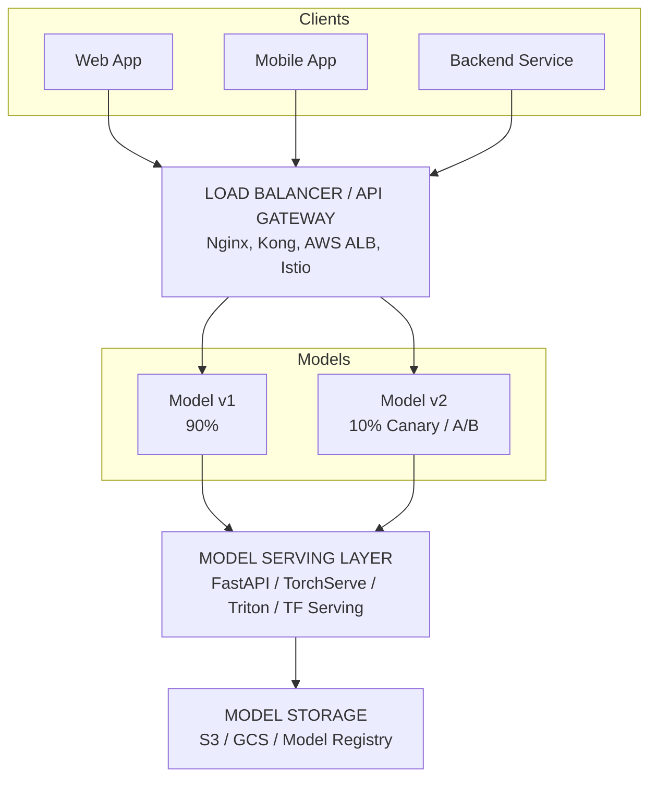
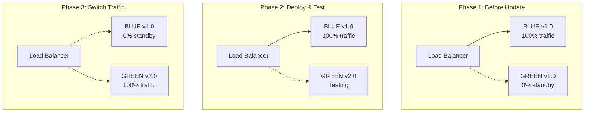
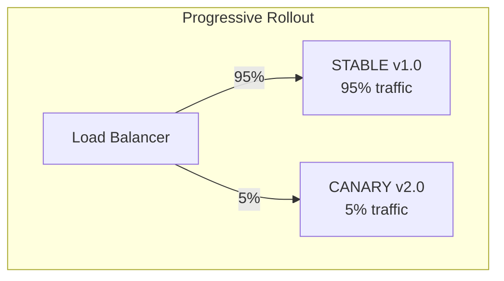

> **AI/ML Engineering Track** | Complexity: `[COMPLEX]` | Time: 5-6
---
**Prerequisites**: Module 50 (ML Pipeline Orchestration)

Seattle. November 2021. The Zillow Offers division, previously hailed as the vanguard of algorithmic real estate, was in systemic freefall. Their sophisticated home price prediction model—the foundational core of their iBuying business—was generating systematically flawed appraisals. The machine learning model failed to account for a rapid, unforeseen cooldown in the housing market, leading the company to dramatically overpay for thousands of properties across the country.

The catastrophic failure wasn't isolated to the model's statistical predictive capabilities; it was a fundamental breakdown of model serving, observability, and automated deployment guardrails. Zillow had deployed a powerful machine learning engine but completely lacked the rapid feedback loops and progressive canary deployment strategies required to safely throttle the system when real-world market conditions diverged from the training data distributions. 

Because the engineering teams could not quickly identify the severe data drift or safely roll back to a more conservative pricing algorithm without paralyzing their core operations, the financial losses cascaded uncontrollably. By the end of the quarter, Zillow lost over $500 million, shuttered the entire iBuying division, and laid off 2,000 employees. This incident perfectly illustrates that deploying a model to production without an escape hatch is an unacceptable existential risk to the business.

## What You'll Be Able to Do

By the end of this module, you will be able to:
- **Design** robust, scalable model serving architectures utilizing load balancers, API gateways, and specialized inference serving layers.
- **Implement** high-performance inference APIs using FastAPI for REST protocols and gRPC for high-throughput binary serialization.
- **Evaluate** and **compare** advanced, framework-specific serving solutions (Triton, TorchServe) against general-purpose web frameworks for production workloads.
- **Diagnose** production bottlenecks by implementing rigorous request validation, health checks, and graceful shutdown patterns.
- **Implement** progressive delivery strategies (Canary, Blue-Green) on Kubernetes v1.35+ to mitigate the risk of catastrophic model rollouts.

## 1. The Deployment Chasm

Training a highly accurate machine learning model is merely the starting line. Getting that model into a production environment, serving predictions reliably at a massive scale, and maintaining its integrity over time constitutes the vast majority of an ML engineer's workload. 

Think of training a machine learning model like engineering a prototype hypercar in a closed laboratory. It is blindingly fast, powerful, and performs beautifully on a meticulously controlled test track. However, deployment is akin to entering that exact car into a grueling 24-hour endurance race. Suddenly, you require a highly coordinated pit crew (DevOps), comprehensive telemetry (monitoring), race strategy (deployment patterns), and a backup vehicle for when catastrophic failures occur (rollback). Most laboratory prototypes never survive race day.

The stark contrast between the research phase and the production phase is often referred to as the deployment gap:

```text
RESEARCH                           PRODUCTION
========                           ==========

Jupyter notebooks                  REST/gRPC APIs
Single GPU                         Distributed serving
Batch predictions                  Real-time (<100ms)
"Works on my machine"              99.9% uptime SLA
Manual updates                     Automated rollouts
No monitoring                      Full observability
```

> **Did You Know?** According to a 2022 Gartner report, only 54% of machine learning models ever make it to a production environment, primarily due to extreme deployment complexity and a lack of mature MLOps pipelines within organizations.

## 2. Serving Architecture and Web Frameworks

A robust model serving architecture decouples the client applications from the raw inference engines. This decoupling allows engineers to route traffic, split loads for A/B testing, and scale the inference hardware independently of the front-end clients.



### Building with FastAPI

FastAPI has emerged as the premier framework for writing custom ML model serving layers in Python. It offers asynchronous execution by default and strict type validation out of the box, ensuring that malformed tensors do not crash your backend inference engines.

```python
from fastapi import FastAPI, HTTPException
from pydantic import BaseModel, Field
from typing import List, Optional
import numpy as np

app = FastAPI(
    title="ML Model API",
    description="Production model serving API",
    version="1.0.0"
)

# Request/Response Models
class PredictionRequest(BaseModel):
    features: List[float] = Field(..., min_items=1, max_items=100)
    model_version: Optional[str] = "latest"

    class Config:
        schema_extra = {
            "example": {
                "features": [0.5, 0.3, 0.8, 0.2],
                "model_version": "v1.2.0"
            }
        }

class PredictionResponse(BaseModel):
    prediction: float
    confidence: float
    model_version: str
    latency_ms: float

# Load model (in production, use proper model registry)
model = None  # Your trained model

@app.on_event("startup")
async def load_model():
    global model
    model = load_trained_model("models/production/model.pkl")

@app.post("/predict", response_model=PredictionResponse)
async def predict(request: PredictionRequest):
    """
    Generate prediction for input features.
    """
    import time
    start = time.time()

    try:
        # Preprocess
        features = np.array(request.features).reshape(1, -1)

        # Predict
        prediction = model.predict(features)[0]
        confidence = model.predict_proba(features).max()

        latency = (time.time() - start) * 1000

        return PredictionResponse(
            prediction=float(prediction),
            confidence=float(confidence),
            model_version=request.model_version,
            latency_ms=latency
        )

    except Exception as e:
        raise HTTPException(status_code=500, detail=str(e))

@app.get("/health")
async def health():
    """Health check endpoint."""
    return {"status": "healthy", "model_loaded": model is not None}

@app.get("/model/info")
async def model_info():
    """Get model metadata."""
    return {
        "name": "churn_predictor",
        "version": "1.2.0",
        "framework": "sklearn",
        "features": 4,
        "classes": ["no_churn", "churn"]
    }
```

### Implementing Batch Predictions

Hardware accelerators like GPUs are drastically underutilized when processing single, sequential requests. To maximize throughput and justify the high hardware costs, you must implement batch predictions. FastAPI handles this elegantly using its asynchronous background tasks capabilities.

```python
from fastapi import BackgroundTasks
from typing import List
import asyncio

class BatchRequest(BaseModel):
    instances: List[List[float]]
    async_mode: bool = False

class BatchResponse(BaseModel):
    predictions: List[float]
    batch_size: int
    total_latency_ms: float

@app.post("/predict/batch", response_model=BatchResponse)
async def predict_batch(request: BatchRequest):
    """
    Batch prediction for multiple instances.
    More efficient than individual calls.
    """
    start = time.time()

    features = np.array(request.instances)
    predictions = model.predict(features).tolist()

    return BatchResponse(
        predictions=predictions,
        batch_size=len(request.instances),
        total_latency_ms=(time.time() - start) * 1000
    )

# Async batch processing
@app.post("/predict/async")
async def predict_async(
    request: BatchRequest,
    background_tasks: BackgroundTasks
):
    """
    Submit batch for async processing.
    Returns job_id to check status later.
    """
    job_id = generate_job_id()
    background_tasks.add_task(
        process_batch_async,
        job_id,
        request.instances
    )
    return {"job_id": job_id, "status": "processing"}
```

## 3. High-Performance Serving with gRPC

As your service scales, the overhead of parsing JSON text payloads becomes a significant bottleneck. Think of REST and gRPC like sending a hand-written letter versus utilizing an automated binary Morse code transmission. REST sends human-readable JSON, which is excellent for debugging but slow for machines. gRPC uses Protocol Buffers—a strictly typed, heavily compressed binary format that allows machines to parse complex multi-dimensional tensors almost instantly.

```text
REST vs gRPC
============

REST (JSON):
┌─────────────────────────────────────────┐
│ {"features": [0.5, 0.3, 0.8], "id": 1}  │
│ ~50 bytes, text parsing required        │
└─────────────────────────────────────────┘

gRPC (Protobuf):
┌─────────────────────────────────────────┐
│ 0x0a0c0d0000003f15cdcc4c3e1d...        │
│ ~20 bytes, binary, no parsing           │
└─────────────────────────────────────────┘

Latency comparison:
REST:  ~10-50ms overhead
gRPC:  ~1-5ms overhead
```

> **Pause and predict**: If your gRPC service is receiving 10,000 requests per second, how would adding a dynamic batching layer of 50ms alter your P99 latency and overall throughput?

*Answer: It would increase the P99 latency by a maximum of 50ms (plus inference time) but would exponentially increase your throughput by allowing the GPU to process thousands of requests simultaneously in a single forward pass, preventing the server from collapsing under the sheer volume of sequential connections.*

### Protocol Buffer Definitions

To utilize gRPC, you define your data structures strictly. This definition acts as a binding contract between the client and the serving cluster.

```protobuf
// model_service.proto

syntax = "proto3";

package ml_serving;

service ModelService {
    // Unary prediction
    rpc Predict(PredictRequest) returns (PredictResponse);

    // Streaming predictions (for real-time data)
    rpc PredictStream(stream PredictRequest) returns (stream PredictResponse);

    // Batch prediction
    rpc PredictBatch(BatchRequest) returns (BatchResponse);

    // Model info
    rpc GetModelInfo(Empty) returns (ModelInfo);
}

message PredictRequest {
    repeated float features = 1;
    string model_version = 2;
}

message PredictResponse {
    float prediction = 1;
    float confidence = 2;
    string model_version = 3;
    float latency_ms = 4;
}

message BatchRequest {
    repeated PredictRequest instances = 1;
}

message BatchResponse {
    repeated PredictResponse predictions = 1;
    int32 batch_size = 2;
    float total_latency_ms = 3;
}

message ModelInfo {
    string name = 1;
    string version = 2;
    string framework = 3;
    int32 num_features = 4;
    repeated string classes = 5;
}

message Empty {}
```

### Implementing the gRPC Servicer

```python
import grpc
from concurrent import futures
import model_service_pb2
import model_service_pb2_grpc
import numpy as np
import time

class ModelServicer(model_service_pb2_grpc.ModelServiceServicer):
    def __init__(self, model):
        self.model = model

    def Predict(self, request, context):
        """Single prediction."""
        start = time.time()

        features = np.array(request.features).reshape(1, -1)
        prediction = self.model.predict(features)[0]
        confidence = self.model.predict_proba(features).max()

        return model_service_pb2.PredictResponse(
            prediction=float(prediction),
            confidence=float(confidence),
            model_version=request.model_version or "v1.0",
            latency_ms=(time.time() - start) * 1000
        )

    def PredictStream(self, request_iterator, context):
        """Streaming predictions - process as they arrive."""
        for request in request_iterator:
            features = np.array(request.features).reshape(1, -1)
            prediction = self.model.predict(features)[0]

            yield model_service_pb2.PredictResponse(
                prediction=float(prediction),
                confidence=0.95,
                model_version="v1.0",
                latency_ms=1.0
            )

    def PredictBatch(self, request, context):
        """Batch prediction."""
        start = time.time()

        responses = []
        for instance in request.instances:
            features = np.array(instance.features).reshape(1, -1)
            prediction = self.model.predict(features)[0]

            responses.append(model_service_pb2.PredictResponse(
                prediction=float(prediction),
                confidence=0.95,
                model_version="v1.0"
            ))

        return model_service_pb2.BatchResponse(
            predictions=responses,
            batch_size=len(responses),
            total_latency_ms=(time.time() - start) * 1000
        )

def serve():
    server = grpc.server(futures.ThreadPoolExecutor(max_workers=10))
    model_service_pb2_grpc.add_ModelServiceServicer_to_server(
        ModelServicer(model), server
    )
    server.add_insecure_port('[::]:50051')
    server.start()
    server.wait_for_termination()
```

## 4. Production Serving Frameworks

When your traffic volume outgrows custom FastAPI scripts, you must migrate to specialized production frameworks. 

### TorchServe

Developed by AWS and Meta, TorchServe provides a robust, standardized environment for serving PyTorch models without writing boilerplate code. It natively supports dynamic batching, metrics logging, and multi-model serving.

```python
# TorchServe handler example
# Save as model_handler.py

from ts.torch_handler.base_handler import BaseHandler
import torch
import json

class ModelHandler(BaseHandler):
    def __init__(self):
        super().__init__()
        self.model = None

    def initialize(self, context):
        """Load the model."""
        self.manifest = context.manifest
        model_dir = context.system_properties.get("model_dir")

        # Load model
        model_path = f"{model_dir}/model.pt"
        self.model = torch.jit.load(model_path)
        self.model.eval()

    def preprocess(self, data):
        """Preprocess input data."""
        inputs = []
        for row in data:
            input_data = row.get("data") or row.get("body")
            if isinstance(input_data, (bytes, bytearray)):
                input_data = json.loads(input_data.decode('utf-8'))
            inputs.append(torch.tensor(input_data["features"]))
        return torch.stack(inputs)

    def inference(self, inputs):
        """Run model inference."""
        with torch.no_grad():
            outputs = self.model(inputs)
        return outputs

    def postprocess(self, outputs):
        """Format outputs for response."""
        predictions = outputs.numpy().tolist()
        return [{"prediction": p} for p in predictions]
```

### Triton Inference Server

NVIDIA's Triton is the pinnacle of high-performance serving. It supports concurrent model execution, dynamic batching, and highly efficient ensemble scheduling. Ensemble scheduling is incredibly powerful because it allows you to chain preprocessing models directly to inference models completely within GPU memory, avoiding any costly network hops.

```python
# Triton model configuration
# config.pbtxt

name: "ensemble_model"
platform: "ensemble"
max_batch_size: 64

input [
  {
    name: "INPUT"
    data_type: TYPE_FP32
    dims: [ -1, 128 ]  # Dynamic batch, 128 features
  }
]

output [
  {
    name: "OUTPUT"
    data_type: TYPE_FP32
    dims: [ -1, 1 ]
  }
]

ensemble_scheduling {
  step [
    {
      model_name: "preprocessing"
      model_version: -1
      input_map {
        key: "INPUT"
        value: "INPUT"
      }
      output_map {
        key: "PROCESSED"
        value: "preprocessed"
      }
    },
    {
      model_name: "main_model"
      model_version: -1
      input_map {
        key: "preprocessed"
        value: "PROCESSED"
      }
      output_map {
        key: "OUTPUT"
        value: "OUTPUT"
      }
    }
  ]
}
```

### Framework Comparison

| Feature | FastAPI | TorchServe | Triton | TF Serving |
|---|---|---|---|---|
| Framework | Any | PyTorch | Multi | TensorFlow |
| Protocol | REST | REST/gRPC | REST/gRPC | REST/gRPC |
| Batching | Manual | Dynamic | Dynamic | Dynamic |
| GPU Support | Manual | Built-in | Built-in | Built-in |
| Model Format | Any | TorchScript | ONNX/TRT | SavedModel |
| Complexity | Low | Medium | High | Medium |
| Use Case | Simple APIs | PyTorch models | High perf multi-model | TF models |

## 5. Deployment Patterns

Advanced deployment patterns are non-negotiable for enterprise ML platforms. They provide the safety nets required to deploy models confidently.

### Blue-Green Deployment

Blue-Green routing provisions an entirely identical production environment alongside your current one. You perform the deployment to the hidden environment, run extensive smoke tests, and then instruct the load balancer to switch traffic instantaneously. The rollback is equally instantaneous.



### Canary Deployment

Canary deployments gradually expose the new model version to a tiny subset of real production traffic, slowly increasing the percentage as confidence grows.



Automatic rollback occurs immediately if error rates spike, latency breaches P99 thresholds, or downstream systems report anomalies.

### A/B Testing

A/B testing is fundamentally different from a Canary rollout. While Canary is designed to validate system stability and minimize the blast radius of bugs, A/B testing is a rigorous statistical framework used to determine which model drives better business metrics.

```python
class ABTestRouter:
    """
    Route requests to different model versions for A/B testing.
    """

    def __init__(self):
        self.experiments = {}

    def create_experiment(
        self,
        experiment_id: str,
        control_model: str,
        treatment_model: str,
        traffic_split: float = 0.5
    ):
        """Create new A/B experiment."""
        self.experiments[experiment_id] = {
            "control": control_model,
            "treatment": treatment_model,
            "split": traffic_split,
            "metrics": {"control": [], "treatment": []}
        }

    def route_request(self, experiment_id: str, user_id: str) -> str:
        """
        Deterministically route user to model variant.
        Same user always gets same variant (for consistency).
        """
        experiment = self.experiments[experiment_id]

        # Hash user_id for deterministic assignment
        hash_value = hash(f"{experiment_id}:{user_id}") % 100
        is_treatment = hash_value < (experiment["split"] * 100)

        return experiment["treatment"] if is_treatment else experiment["control"]

    def record_outcome(
        self,
        experiment_id: str,
        variant: str,
        prediction: float,
        actual: float
    ):
        """Record prediction outcome for analysis."""
        self.experiments[experiment_id]["metrics"][variant].append({
            "prediction": prediction,
            "actual": actual,
            "correct": (prediction > 0.5) == (actual > 0.5)
        })

    def analyze_experiment(self, experiment_id: str) -> dict:
        """
        Statistical analysis of A/B test results.
        """
        from scipy import stats

        exp = self.experiments[experiment_id]
        control = exp["metrics"]["control"]
        treatment = exp["metrics"]["treatment"]

        control_accuracy = sum(m["correct"] for m in control) / len(control)
        treatment_accuracy = sum(m["correct"] for m in treatment) / len(treatment)

        # Statistical significance test
        control_correct = [m["correct"] for m in control]
        treatment_correct = [m["correct"] for m in treatment]

        t_stat, p_value = stats.ttest_ind(control_correct, treatment_correct)

        return {
            "control_accuracy": control_accuracy,
            "treatment_accuracy": treatment_accuracy,
            "improvement": treatment_accuracy - control_accuracy,
            "p_value": p_value,
            "significant": p_value < 0.05,
            "recommendation": "deploy_treatment" if (
                treatment_accuracy > control_accuracy and p_value < 0.05
            ) else "keep_control"
        }
```

> **Stop and think**: When implementing A/B testing for a recommendation engine, why is deterministic routing based on a hash of the user ID critical for the validity of your statistical results?

*Answer: If routing isn't deterministic, a single user refreshing the page might randomly bounce between the control and treatment models. This obliterates user experience and completely invalidates the statistical independence required for an accurate hypothesis test.*

## 6. Model Optimization

To scale massively without burning through capital, models must be heavily optimized post-training.

> **Did You Know?** The ONNX format was announced at the 2017 Neural Information Processing Systems (NeurIPS) conference and within two years, it had support from over 30 frameworks and hardware platforms.

### ONNX format conversion

```python
import onnx
import onnxruntime as ort
import torch

# Export PyTorch model to ONNX
def export_to_onnx(model, sample_input, output_path):
    """Export PyTorch model to ONNX format."""
    model.eval()

    torch.onnx.export(
        model,
        sample_input,
        output_path,
        export_params=True,
        opset_version=14,
        do_constant_folding=True,
        input_names=['input'],
        output_names=['output'],
        dynamic_axes={
            'input': {0: 'batch_size'},
            'output': {0: 'batch_size'}
        }
    )

    # Verify the model
    onnx_model = onnx.load(output_path)
    onnx.checker.check_model(onnx_model)
    print(f"Model exported to {output_path}")

# Run inference with ONNX Runtime
class ONNXPredictor:
    def __init__(self, model_path: str):
        # Use GPU if available
        providers = ['CUDAExecutionProvider', 'CPUExecutionProvider']
        self.session = ort.InferenceSession(model_path, providers=providers)

        # Get input/output names
        self.input_name = self.session.get_inputs()[0].name
        self.output_name = self.session.get_outputs()[0].name

    def predict(self, features: np.ndarray) -> np.ndarray:
        """Run inference."""
        return self.session.run(
            [self.output_name],
            {self.input_name: features.astype(np.float32)}
        )[0]

    def benchmark(self, features: np.ndarray, iterations: int = 100) -> dict:
        """Benchmark inference performance."""
        import time

        # Warmup
        for _ in range(10):
            self.predict(features)

        # Benchmark
        latencies = []
        for _ in range(iterations):
            start = time.time()
            self.predict(features)
            latencies.append((time.time() - start) * 1000)

        return {
            "mean_ms": np.mean(latencies),
            "p50_ms": np.percentile(latencies, 50),
            "p95_ms": np.percentile(latencies, 95),
            "p99_ms": np.percentile(latencies, 99),
            "throughput_qps": 1000 / np.mean(latencies)
        }
```

### TensorRT

Converting to TensorRT yields exponential gains on NVIDIA hardware by fusing kernel operations and quantizing weights.

```python
# TensorRT for NVIDIA GPU optimization
import tensorrt as trt

def optimize_with_tensorrt(onnx_path: str, engine_path: str):
    """
    Convert ONNX model to TensorRT engine.
    Can provide 2-5x speedup on NVIDIA GPUs.
    """
    logger = trt.Logger(trt.Logger.WARNING)
    builder = trt.Builder(logger)
    network = builder.create_network(
        1 << int(trt.NetworkDefinitionCreationFlag.EXPLICIT_BATCH)
    )
    parser = trt.OnnxParser(network, logger)

    # Parse ONNX
    with open(onnx_path, 'rb') as f:
        if not parser.parse(f.read()):
            for error in range(parser.num_errors):
                print(parser.get_error(error))
            raise RuntimeError("ONNX parsing failed")

    # Configure builder
    config = builder.create_builder_config()
    config.max_workspace_size = 1 << 30  # 1GB

    # Enable FP16 for faster inference (with minimal accuracy loss)
    if builder.platform_has_fast_fp16:
        config.set_flag(trt.BuilderFlag.FP16)

    # Build engine
    engine = builder.build_engine(network, config)

    # Save
    with open(engine_path, 'wb') as f:
        f.write(engine.serialize())

    print(f"TensorRT engine saved to {engine_path}")
```

**Optimization Impact:**

| Framework | Latency (ms) | Throughput (QPS) |
|---|---|---|
| PyTorch (eager) | 15.2 | 66 |
| PyTorch (compiled) | 8.5 | 118 |
| ONNX Runtime | 6.2 | 161 |
| TensorRT FP32 | 4.1 | 244 |
| TensorRT FP16 | 2.3 | 435 |
| TensorRT INT8 | 1.5 | 667 |

## 7. Best Practices for Reliability

Model serving operates in a hostile environment where networks drop packets and downstream services constantly fail. Defensive programming is required.

### Health Checks and Kubernetes Probes

```python
@app.get("/health")
async def health():
    """Liveness check."""
    return {"status": "alive"}

@app.get("/ready")
async def ready():
    """Readiness check - is the model loaded?"""
    if model is None:
        raise HTTPException(503, "Model not loaded")
    return {"status": "ready", "model_version": model.version}
```

### Graceful Shutdowns

```python
import signal

class GracefulShutdown:
    def __init__(self):
        self.shutdown = False
        signal.signal(signal.SIGTERM, self._handler)
        signal.signal(signal.SIGINT, self._handler)

    def _handler(self, signum, frame):
        print("Shutdown signal received")
        self.shutdown = True

    async def wait_for_requests(self, timeout: int = 30):
        """Wait for in-flight requests to complete."""
        start = time.time()
        while active_requests > 0 and (time.time() - start) < timeout:
            await asyncio.sleep(0.1)
```

### Aggressive Request Validation

```python
from pydantic import validator

class PredictionRequest(BaseModel):
    features: List[float]

    @validator('features')
    def validate_features(cls, v):
        if len(v) != 10:
            raise ValueError(f"Expected 10 features, got {len(v)}")
        if any(not (-100 <= f <= 100) for f in v):
            raise ValueError("Features must be in range [-100, 100]")
        return v
```

### Model Versioning

A centralized model registry serves as the system of record. Reverting to a previous state must be a fast, automated API call, not an archaeological expedition through an S3 bucket.

```python
class ModelRegistry:
    """
    Simple model registry for version management.
    """

    def __init__(self, storage_path: str):
        self.storage_path = Path(storage_path)
        self.storage_path.mkdir(parents=True, exist_ok=True)
        self.registry_file = self.storage_path / "registry.json"
        self.registry = self._load_registry()

    def _load_registry(self) -> dict:
        if self.registry_file.exists():
            return json.loads(self.registry_file.read_text())
        return {"models": {}, "production": {}}

    def _save_registry(self):
        self.registry_file.write_text(json.dumps(self.registry, indent=2))

    def register_model(
        self,
        model_name: str,
        version: str,
        model_path: str,
        metrics: dict,
        metadata: dict = None
    ):
        """Register a new model version."""
        if model_name not in self.registry["models"]:
            self.registry["models"][model_name] = {}

        self.registry["models"][model_name][version] = {
            "path": model_path,
            "metrics": metrics,
            "metadata": metadata or {},
            "registered_at": datetime.now().isoformat(),
            "stage": "staging"
        }

        self._save_registry()
        return f"Registered {model_name}:{version}"

    def promote_to_production(self, model_name: str, version: str):
        """Promote a model version to production."""
        if model_name not in self.registry["models"]:
            raise ValueError(f"Model {model_name} not found")
        if version not in self.registry["models"][model_name]:
            raise ValueError(f"Version {version} not found")

        # Demote current production
        if model_name in self.registry["production"]:
            old_version = self.registry["production"][model_name]
            self.registry["models"][model_name][old_version]["stage"] = "archived"

        # Promote new version
        self.registry["models"][model_name][version]["stage"] = "production"
        self.registry["production"][model_name] = version

        self._save_registry()
        return f"Promoted {model_name}:{version} to production"

    def rollback(self, model_name: str, to_version: str):
        """Rollback to a previous version."""
        return self.promote_to_production(model_name, to_version)

    def get_production_model(self, model_name: str) -> dict:
        """Get current production model info."""
        if model_name not in self.registry["production"]:
            raise ValueError(f"No production model for {model_name}")

        version = self.registry["production"][model_name]
        return {
            "version": version,
            **self.registry["models"][model_name][version]
        }
```

## 8. War Stories

**The Latency Cliff: Uber's Surge Pricing Incident (2017)**
Uber's dynamic pricing model was critical for matching supply and demand. When traffic spiked on New Year's Eve, predictions that normally took 50ms surged to 3 seconds. The batch processing logic was tuned for average load, not peak load. The buffer filled faster than the model could process, creating cascading delays. The fix involved adaptive batching and circuit breakers that return cached predictions under extreme duress.

**The Feature Store Disaster: Stripe (2021)**
Stripe's fraud model suddenly flagged 40% of legitimate transactions. A routine feature store update changed how a core feature was computed. The training data had the old format; production utilized the new computation. Training/serving skew resulted in catastrophic false positives. The resolution forced strict schema versioning alongside the models themselves.

**The Cold Start Problem: Netflix Recommendations**
Netflix's models suffered a 15-second latency delay on the first prediction due to heavy GPU allocation and model initialization inside freshly scaled pods. They reduced the ensemble from 50 to 23 models and implemented aggressive pre-warming scripts to execute dummy inferences before signaling Kubernetes that the pod was healthy.

## 9. Common Mistakes and The Economics of Inference

> **Did You Know?** OpenAI reportedly spends over $700,000 per day on inference compute for ChatGPT as of early 2023, which is why a mere 1% optimization in model serving can save over $2.5 million annually.

If you don't track your serving costs, your successful model will bankrupt the engineering department.

| Component | Typical Cost | Notes |
|-----------|--------------|-------|
| Compute (CPU) | $0.05-0.10/hour/vCPU | For preprocessing, lightweight models |
| Compute (GPU) | $0.50-4.00/hour | A10G: $0.50, A100: $3-4 |
| Load balancer | $0.025/hour + $0.008/GB | Often overlooked fixed cost |
| Storage (model artifacts) | $0.02/GB/month | Minimal unless you keep many versions |
| Network egress | $0.09/GB | Can add up with high throughput |
| Model registry | $0-500/month | Free tiers available, enterprise costs more |

| Scale | Monthly Cost | Cost per 1M Predictions |
|-------|-------------|-------------------------|
| Small (100K/day) | $500-2,000 | $15-60 |
| Medium (10M/day) | $5,000-20,000 | $1.50-6 |
| Large (1B/day) | $100,000-500,000 | $0.10-0.50 |

### Critical Anti-Patterns

| Mistake | Why it Happens | Fix |
|---|---|---|
| Deploying Without Rollback | Teams prioritize speed over safety, assuming the model is "perfect." | Automate versioned deployments and keep old versions on standby. |
| Ignoring P99 Latency | P50 looks fine, but tail latency affects your most active/important users. | Set alerts based on P95/P99 metrics and optimize tail latency. |
| Testing with Stale Data | Production data drifts; models overfit to historical distributions. | Use shadow deployments or replay recent production traffic. |
| Missing Load Tests | "Works on my machine" mentality; lack of simulated peak traffic. | Run soak tests at 2-5x expected peak load. |
| Hardcoding Model Paths | Model paths are baked into the container, requiring full rebuilds to swap. | Use dynamic loading from a Model Registry or environmental variables. |
| Training/Serving Skew | Re-implementing feature engineering in serving differently than training. | Utilize a centralized Feature Store for both training and inference. |

The most inexcusable error is overwriting active files directly in production without a versioned escape hatch:

```text
# BAD: Overwriting the production model
cp new_model.pt /models/production/model.pt
# There is no old model anymore. Rollback = find it on someone's laptop.

# GOOD: Versioned deployment
cp new_model.pt /models/v2.1.0/model.pt
ln -sf /models/v2.1.0 /models/current
# Rollback = ln -sf /models/v2.0.0 /models/current
```

## Summary

```text
MODEL DEPLOYMENT PATTERNS
=========================

SERVING OPTIONS:
FastAPI        - Simple, flexible, Python-native
gRPC           - High performance, strong typing
TorchServe     - PyTorch-native, dynamic batching
Triton         - Multi-framework, GPU optimized
TF Serving     - TensorFlow models

DEPLOYMENT PATTERNS:
Blue-Green     - Instant rollback, zero downtime
Canary         - Progressive rollout, risk mitigation
A/B Testing    - Statistical comparison, data-driven

OPTIMIZATION:
ONNX           - Universal format, cross-platform
TensorRT       - NVIDIA GPU optimization (2-5x speedup)
Quantization   - INT8 for smaller models, faster inference

KEY METRICS:
Latency        - P50, P95, P99
Throughput     - Queries per second
Availability   - 99.9% uptime target
```

---

## Quiz

<details>
<summary>1. Scenario: You are tasked with serving a massive Deep Learning model where requests contain high-dimensional image tensors. The current REST API is saturating network bandwidth and CPU parsing cycles. Which protocol should you migrate to and why?</summary>
gRPC is the optimal choice. It uses Protocol Buffers, a compact binary format that drastically reduces payload size compared to JSON's text-based serialization. This minimizes network overhead and serialization latency, critical for massive high-dimensional tensor data.
</details>

<details>
<summary>2. Scenario: Your new fraud detection model is ready for production. A false positive blocks a legitimate user's transaction, which is highly disruptive. Which deployment strategy minimizes operational risk while validating the model against real traffic?</summary>
Canary deployment. By routing only a strictly limited percentage (e.g., 5%) of live traffic to the new model, you can empirically validate its real-world performance. If metrics degrade, you automatically halt the rollout and revert, strictly capping the blast radius.
</details>

<details>
<summary>3. What is the primary architectural purpose of exporting a PyTorch model to the ONNX format?</summary>
ONNX provides a universal, framework-agnostic mathematical format for model weights and execution graphs. Exporting to ONNX decouples the training framework from the serving infrastructure, allowing the model to be optimized and deployed across diverse hardware and high-performance execution engines like TensorRT.
</details>

<details>
<summary>4. Scenario: A recommendation model's initialization takes 15 seconds due to heavy GPU allocation routines. During traffic spikes, Kubernetes autoscales the pods, but users routed to these new pods experience extreme timeouts. How do you resolve this architectural flaw?</summary>
Implement a pre-warming and readiness strategy. The container should execute a dummy inference payload during startup to comprehensively initialize the GPU memory before the `/ready` Kubernetes probe returns an HTTP 200 OK. This ensures Kubernetes only routes traffic to fully warmed instances.
</details>

<details>
<summary>5. Why does dynamic batching significantly improve GPU utilization during model serving compared to handling requests sequentially?</summary>
GPUs are specifically designed for massive parallel processing. Processing a batch of 64 requests simultaneously takes only fractionally longer than processing a single request. Dynamic batching accumulates incoming network requests for a brief time window (e.g., 10ms) and processes them in a single forward pass, dramatically increasing aggregate throughput.
</details>

<details>
<summary>6. Scenario: You need to deploy multiple iterations of a pricing model to measure which one generates higher overall user conversion rates over a 2-week period. Should you use Canary deployment or A/B testing?</summary>
A/B testing. Canary deployment focuses strictly on operational system safety by gradually shifting traffic. A/B testing is explicitly designed to measure long-term business outcomes by splitting traffic deterministically (via hashing) and statistically comparing the resulting engagement metrics.
</details>

<details>
<summary>7. What occurs if a deployed serving container lacks a configured liveness probe in its Kubernetes Pod specification?</summary>
If the serving application deadlocks or crashes silently without exiting the main process, Kubernetes has no mechanism to detect the failure state. The dead container will continue to receive traffic from the Service, resulting in dropped requests and severely degraded system availability until manual intervention occurs.
</details>

---

## Hands-On Exercise: Full-Stack Model Deployment

In this progressive lab, you will build, containerize, and safely deploy a machine learning API to a Kubernetes v1.35+ cluster using modern rollout practices.

### Task 1: Train a Classifier Locally

First, create the model artifact that we will eventually serve.

<details>
<summary>Solution & Checkpoint</summary>

Create a file named `train.py`:
```python
import joblib
from sklearn.ensemble import RandomForestClassifier
from sklearn.datasets import make_classification

# Generate dummy churn data
X, y = make_classification(n_samples=1000, n_features=4, random_state=42)

# Train model
clf = RandomForestClassifier(n_estimators=10, random_state=42)
clf.fit(X, y)

# Save artifact
joblib.dump(clf, 'model.joblib')
print("Model saved to model.joblib")
```

**Execution:**
```bash
pip install scikit-learn joblib
python train.py
```

- [ ] Checkpoint: Verify `model.joblib` exists in your working directory.
</details>

### Task 2: Build the FastAPI Serving Layer

Create the REST interface that implements liveness and readiness logic.

<details>
<summary>Solution & Checkpoint</summary>

Create a file named `server.py`:
```python
from fastapi import FastAPI, HTTPException
from pydantic import BaseModel
import joblib
import numpy as np

app = FastAPI()
model = None

class PredictRequest(BaseModel):
    features: list[float]

@app.on_event("startup")
async def load_model():
    global model
    model = joblib.load('model.joblib')

@app.post("/predict")
async def predict(req: PredictRequest):
    if len(req.features) != 4:
        raise HTTPException(status_code=400, detail="Require exactly 4 features")
    pred = model.predict(np.array([req.features]))
    return {"prediction": int(pred[0])}

@app.get("/health")
async def health():
    return {"status": "alive"}

@app.get("/ready")
async def ready():
    if model is None:
        raise HTTPException(status_code=503, detail="Model loading")
    return {"status": "ready"}
```

**Execution:**
```bash
pip install fastapi uvicorn
uvicorn server:app --host 0.0.0.0 --port 8000 &
```

- [ ] Checkpoint: Run `curl http://localhost:8000/health` and ensure it returns `{"status": "alive"}`. Stop the background process (`kill %1`) before proceeding.
</details>

### Task 3: Containerize the Application

Package the model and API into an immutable, versioned container artifact.

<details>
<summary>Solution & Checkpoint</summary>

Create a file named `Dockerfile`:
```dockerfile
FROM python:3.11-slim

WORKDIR /app
COPY requirements.txt .
RUN pip install --no-cache-dir -r requirements.txt

COPY model.joblib .
COPY server.py .

EXPOSE 8000
CMD ["uvicorn", "server:app", "--host", "0.0.0.0", "--port", "8000"]
```

Create `requirements.txt`:
```text
fastapi==0.103.1
uvicorn==0.23.2
scikit-learn==1.3.0
joblib==1.3.2
```

**Execution:**
```bash
docker build -t local-registry/churn-api:v1 .
```

- [ ] Checkpoint: Run `docker image ls | grep churn-api` to confirm the image is built and tagged locally.
</details>

### Task 4: Deploy to Kubernetes

Deploy the container using standard Kubernetes v1.35 resource definitions, ensuring readiness probes are properly defined.

<details>
<summary>Solution & Checkpoint</summary>

Create a file named `deployment.yaml`:
```yaml
apiVersion: apps/v1
kind: Deployment
metadata:
  name: churn-api-v1
spec:
  replicas: 2
  selector:
    matchLabels:
      app: churn-api
      version: v1
  template:
    metadata:
      labels:
        app: churn-api
        version: v1
    spec:
      containers:
      - name: api
        image: local-registry/churn-api:v1
        imagePullPolicy: Never # For local testing
        ports:
        - containerPort: 8000
        readinessProbe:
          httpGet:
            path: /ready
            port: 8000
          initialDelaySeconds: 2
          periodSeconds: 5
---
apiVersion: v1
kind: Service
metadata:
  name: churn-api-service-v1
spec:
  selector:
    app: churn-api
    version: v1
  ports:
  - port: 80
    targetPort: 8000
```

**Execution:**
```bash
kubectl apply -f deployment.yaml
```

- [ ] Checkpoint: Run `kubectl get pods -l app=churn-api` and verify both replicas reach the `Running` state and `1/1` readiness.
</details>

### Task 5: Implement Nginx Canary Routing

Simulate a risky rollout of v2 by routing precisely 10% of traffic to a new canary deployment utilizing standard Ingress annotations.

<details>
<summary>Solution & Checkpoint</summary>

Create a file named `ingress-canary.yaml`:
```yaml
apiVersion: networking.k8s.io/v1
kind: Ingress
metadata:
  name: churn-api-ingress-canary
  annotations:
    nginx.ingress.kubernetes.io/canary: "true"
    nginx.ingress.kubernetes.io/canary-weight: "10"
spec:
  ingressClassName: nginx
  rules:
  - host: api.example.com
    http:
      paths:
      - path: /predict
        pathType: Prefix
        backend:
          service:
            name: churn-api-service-v2 # Assume v2 service is deployed
            port:
              number: 80
```

**Execution:**
```bash
kubectl apply -f ingress-canary.yaml
```

- [ ] Checkpoint: Use a bash loop `for i in {1..100}; do curl -H "Host: api.example.com" http://<ingress-ip>/predict -s; done` to validate that exactly ~10% of the traffic routes to the canary pods while the rest hits the stable v1 service.
</details>

---

## Next Steps

Now that you have established robust, scalable deployment patterns for serving predictions, you must ensure you have visibility into their behavior. Proceed to [Module 1.10: ML Monitoring](./module-1.10-ml-monitoring), where we dive into establishing latency telemetry, alert fatigue, and detecting statistical model drift.
