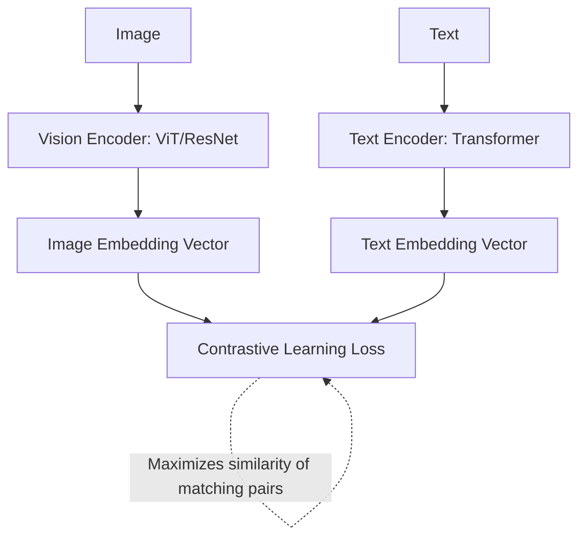
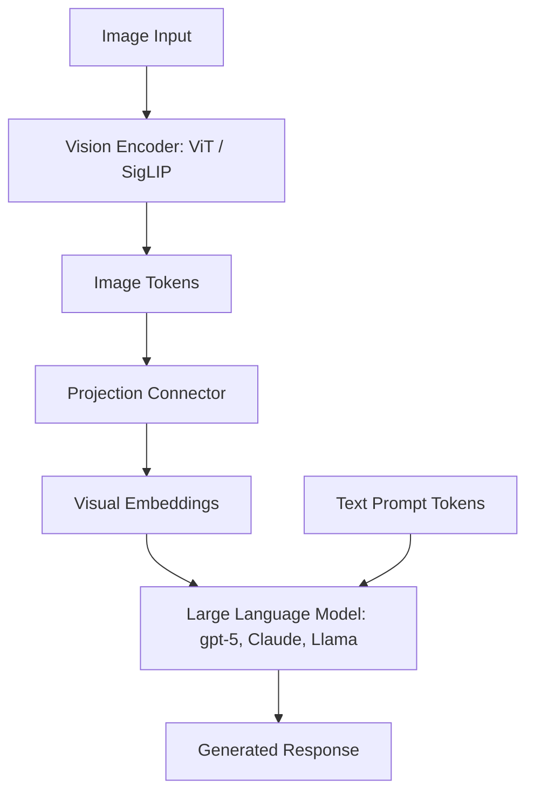
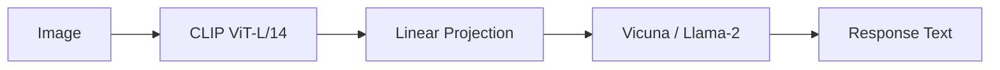

> **AI/ML Engineering Track** | Complexity: `[COMPLEX]` | Time: 5-6
---
**Reading Time**: 7-8 hours
**Prerequisites**: Module 22
---

## Why This Module Matters

San Francisco. October 2023. A Cruise autonomous vehicle was navigating a city street when a human-driven car struck a pedestrian, throwing them directly into the Cruise vehicle's path. The robotaxi executed a hard emergency brake, coming to a stop directly over the critically injured pedestrian. It was at this moment that the multimodal vision AI system made a catastrophic semantic error. Analyzing the scene from its undercarriage and external cameras, the model classified the space under the car as "clear" and initiated a maneuver to pull over to the side of the road, dragging the pedestrian for 20 feet.

The financial and reputational impact was immediate and devastating. The California DMV immediately suspended Cruise's deployment permits, forcing the company to ground its entire nationwide fleet of 400 autonomous vehicles. Within weeks, the CEO resigned, the company laid off 24 percent of its workforce, and General Motors slashed Cruise's internal valuation by more than half, erasing billions of dollars in enterprise value overnight. 

This incident underscores a critical reality for AI and ML engineers: vision AI is no longer a research novelty constrained to ImageNet benchmarks. It is actively deployed in safety-critical, high-stakes production environments where the semantic gap between "detecting pixels" and "understanding physical context" can cost lives and billions of dollars. Mastering multimodal AI means understanding not just how to process image tensors, but how these models reason about the visual world, where their mathematical blind spots lie, and how to architect rigorous safety boundaries against their inevitable hallucinations.

## Learning Outcomes

By the end of this module, you will be able to:
- **Design** multimodal architectures that efficiently fuse visual encoders with large language models for complex spatial reasoning tasks.
- **Implement** contrastive learning pipelines (like CLIP) to enable zero-shot image classification and semantic visual search across unstructured image datasets.
- **Diagnose** failure modes and edge cases in vision-language models, including spatial hallucination, focal degradation, and OCR misalignments.
- **Evaluate** the cost-performance tradeoffs of various Vision-Language Model APIs and open-weight models to optimize production deployment economics.

---

## Part 1: The Evolution of Vision Transformers (ViT)

Before diving into complex multimodal models, we must understand how transformers learned to process visual data. The history of teaching computers to "see" is a story of persistent mathematical evolution, transitioning from rigid hand-crafted rules to highly generalized attention mechanisms.

### The Limitations of Convolutional Neural Networks

Convolutional Neural Networks (CNNs) dominated computer vision for a decade (2012-2020). They operate by sliding mathematical filters across an image to detect hierarchical patterns: edges in the first layer, textures in the second, and complex shapes in the deeper layers. While groundbreaking, CNNs suffer from fundamental architectural limitations:

- **Fixed Receptive Field**: CNNs process local patterns first and global patterns later. They struggle to immediately understand the relationship between a pixel in the top-left corner and a pixel in the bottom-right corner.
- **Lack of Global Attention**: Every pixel is initially treated with equal mathematical weight, making it computationally inefficient to focus solely on the most contextually relevant parts of an image.
- **Scaling Bottlenecks**: As datasets grew to billions of images, researchers found that larger CNNs did not yield proportionally better results. Their architectural rigidity created an asymptotic limit on performance.

### ViT: An Image is Worth 16x16 Words

In October 2020, researchers at Google Brain published a paper that fundamentally altered the trajectory of computer vision. Their core insight was elegantly simple: instead of sliding filters over an image, treat the image exactly like a sequence of text tokens.

```text
Traditional approach:   Image → CNN → Features → Classifier
ViT approach:          Image → Patches → Transformer → Classification
```

To achieve this, the Vision Transformer (ViT) architecture completely discards convolutions. Instead, it slices the image into a grid of non-overlapping patches. 

### The Mathematics of Patching

Consider a standard 224x224 pixel image with 3 color channels (RGB). ViT slices this image into 16x16 pixel patches. This results in exactly 196 patches (14 rows by 14 columns). Each patch contains 16 * 16 * 3 = 768 pixels. This 3D tensor is mathematically flattened into a 1D vector of length 768. 

Because transformers are permutation invariant (they have no inherent concept of order), a positional embedding is added to each vector so the model knows where the patch originated. Finally, a special learnable token called the `[CLS]` (classification) token is prepended to the sequence. The entire sequence is then fed into a standard transformer encoder stack.

```python
# Conceptual ViT forward pass
def vit_forward(image):
    # 1. Patchify: [B, 3, 224, 224] → [B, 196, 768]
    patches = split_into_patches(image, patch_size=16)
    patch_embeddings = linear_projection(patches)

    # 2. Add position embeddings
    patch_embeddings += position_embeddings  # [B, 196, 768]

    # 3. Prepend [CLS] token
    cls_token = learnable_cls_token.expand(batch_size, 1, 768)
    tokens = torch.cat([cls_token, patch_embeddings], dim=1)  # [B, 197, 768]

    # 4. Transformer encoder
    for layer in transformer_layers:
        tokens = layer(tokens)  # Self-attention + FFN

    # 5. Classification from [CLS]
    cls_output = tokens[:, 0]  # [B, 768]
    logits = classification_head(cls_output)  # [B, num_classes]

    return logits
```

> **Pause and predict**: If we increase the ViT patch size from 16x16 to 32x32, what happens to the sequence length fed into the transformer? How does this impact the computational cost of the self-attention mechanism?

The Vision Transformer proved that with sufficient data, global self-attention easily outperforms local convolutions. It established a new taxonomy of model sizes:

| Model | Patch Size | Layers | Hidden Dim | Params | ImageNet Acc |
|-------|------------|--------|------------|--------|--------------|
| ViT-B/16 | 16 | 12 | 768 | 86M | 77.9% |
| ViT-L/16 | 16 | 24 | 1024 | 307M | 79.7% |
| ViT-H/14 | 14 | 32 | 1280 | 632M | 80.9% |
| ViT-G/14 | 14 | 40 | 1408 | 1.8B | 83.3% |

---

## Part 2: CLIP - Connecting Vision and Language

While ViT revolutionized how models process images, it was still just a classification model. It required manually labeled datasets to learn specific categories. The true multimodal revolution began when OpenAI introduced CLIP (Contrastive Language-Image Pre-training) in January 2021, solving the "semantic gap" between pixels and text.

### The CLIP Architecture

CLIP consists of two entirely separate neural networks trained in parallel: a Vision Encoder (typically a ViT) and a Text Encoder (a standard text Transformer).

```text
         Image               Text
           ↓                   ↓
    ┌─────────────┐    ┌─────────────┐
    │ Vision      │    │ Text        │
    │ Encoder     │    │ Encoder     │
    │ (ViT/ResNet)│    │ (Transformer)│
    └─────────────┘    └─────────────┘
           ↓                   ↓
    Image Embedding    Text Embedding
           ↓                   ↓
    ┌───────────────────────────────┐
    │      Contrastive Learning     │
    │  (Match images with captions) │
    └───────────────────────────────┘
```

For better maintainability and visual clarity, here is the architecture represented as a native flowchart:



### Contrastive Learning: The Key Innovation

Instead of predicting a specific class label, CLIP was trained on 400 million unstructured image-text pairs scraped from the internet. The objective function is known as Contrastive Loss. 

During training, the model takes a batch of N images and their corresponding N captions. It computes a similarity matrix by multiplying the image embeddings by the text embeddings. The goal is to maximize the values on the diagonal of this matrix (the correct pairs) while minimizing all off-diagonal values (the incorrect pairs).

```python
# Simplified CLIP training step
def clip_training_step(images, captions):
    # Encode both modalities
    image_embeddings = vision_encoder(images)  # [N, 512]
    text_embeddings = text_encoder(captions)   # [N, 512]

    # Normalize embeddings
    image_embeddings = F.normalize(image_embeddings, dim=-1)
    text_embeddings = F.normalize(text_embeddings, dim=-1)

    # Compute similarity matrix
    logits = image_embeddings @ text_embeddings.T  # [N, N]
    logits = logits * temperature  # Learnable temperature parameter

    # Contrastive loss: diagonal should be highest
    labels = torch.arange(N)
    loss_i2t = F.cross_entropy(logits, labels)      # Image → Text
    loss_t2i = F.cross_entropy(logits.T, labels)    # Text → Image

    return (loss_i2t + loss_t2i) / 2
```

### Zero-Shot Image Classification

Because CLIP embeds images and text into the exact same mathematical latent space, it enables "zero-shot" classification. You do not need to train a new classification head. You simply encode your image, encode a list of text prompts describing your target categories, and find the text embedding with the highest cosine similarity to the image embedding.

```python
def zero_shot_classify(image, class_names):
    # Create text prompts
    prompts = [f"a photo of a {name}" for name in class_names]

    # Encode image and texts
    image_embedding = vision_encoder(image)
    text_embeddings = text_encoder(prompts)

    # Normalize
    image_embedding = F.normalize(image_embedding, dim=-1)
    text_embeddings = F.normalize(text_embeddings, dim=-1)

    # Compute similarities
    similarities = image_embedding @ text_embeddings.T

    # Return class with highest similarity
    predicted_class = class_names[similarities.argmax()]
    return predicted_class
```

> **Stop and think**: Why does a model trained via contrastive learning (like CLIP) perform significantly better on zero-shot tasks than a model trained purely on cross-entropy classification over a fixed set of labels?

### CLIP Variants and Successors

The success of CLIP spawned an entire ecosystem of contrastive visual models, optimizing for larger scales, better loss functions, or open-source availability.

| Model | Organization | Key Innovation |
|-------|-------------|----------------|
| CLIP | OpenAI | Original contrastive learning |
| OpenCLIP | LAION | Open-source reproduction |
| SigLIP | Google | Sigmoid loss (better than softmax) |
| BLIP | Salesforce | Added image captioning |
| BLIP-2 | Salesforce | Frozen LLM + Q-Former bridge |
| EVA-CLIP | BAAI | Largest open CLIP (18B params) |

---

## Part 3: Vision-Language Models (VLMs)

While CLIP can match images to text, it cannot *generate* novel text. The modern era of multimodal AI is defined by Vision-Language Models (VLMs), which stitch a powerful vision encoder directly onto a Large Language Model, enabling complex visual reasoning, OCR, and spatial analysis.

### The VLM Architecture

A standard VLM consists of three heavily engineered components: the vision encoder, the projection connector, and the generative language model.

```text
                Image
                  ↓
         ┌────────────────┐
         │ Vision Encoder │
         │ (ViT / SigLIP) │
         └────────────────┘
                  ↓
           Image Tokens
                  ↓
         ┌────────────────┐
         │   Projection   │
         │   (Connector)  │
         └────────────────┘
                  ↓
         Visual Embeddings
                  ↓
┌──────────────────────────────────┐
│                                  │
│   [Visual] [Text Prompt Tokens]  │
│                                  │
│        Large Language Model      │
│       (gpt-5, Claude, Llama)     │
│                                  │
└──────────────────────────────────┘
                  ↓
         Generated Response
```

Translated to a flowchart for clearer documentation:



The Projection Connector is the unsung hero of this architecture. Its sole purpose is to translate the high-dimensional visual features output by the Vision Encoder into the precise embedding dimension expected by the Language Model, acting as a universal translator between the two neural networks.

### Major Vision-Language Models in Production

#### GPT-5 Vision (OpenAI)

OpenAI continues to iterate heavily on their proprietary multimodal architecture. It remains the industry standard for complex visual logic, robust OCR, and multi-image spatial reasoning.

```python
from openai import OpenAI

client = OpenAI()

response = client.chat.completions.create(
    model="gpt-5",
    messages=[
        {
            "role": "user",
            "content": [
                {"type": "text", "text": "What's in this image?"},
                {
                    "type": "image_url",
                    "image_url": {"url": "https://example.com/image.jpg"}
                }
            ]
        }
    ]
)
```

#### Claude 3 Vision (Anthropic)

Anthropic's Claude family excels at safety-critical detailed analysis, particularly concerning data-dense charts, graphs, and highly technical diagrams. It accepts images directly as base64 encoded strings.

```python
import anthropic
import base64

client = anthropic.Anthropic()

# Load image as base64
with open("image.jpg", "rb") as f:
    image_data = base64.standard_b64encode(f.read()).decode("utf-8")

response = client.messages.create(
    model="claude-4.6-opus-20240229",
    max_tokens=1024,
    messages=[
        {
            "role": "user",
            "content": [
                {
                    "type": "image",
                    "source": {
                        "type": "base64",
                        "media_type": "image/jpeg",
                        "data": image_data
                    }
                },
                {
                    "type": "text",
                    "text": "Describe this image in detail."
                }
            ]
        }
    ]
)
```

#### Gemini Vision (Google)

Google's Gemini models are natively multimodal from the ground up, meaning they were not bolted together post-training. This grants them exceptional long-context visual reasoning and the ability to process raw video frames continuously.

```python
import google.generativeai as genai
from PIL import Image

genai.configure(api_key="YOUR_API_KEY")
model = genai.GenerativeModel('gemini-3.5-pro')

image = Image.open("image.jpg")
response = model.generate_content([
    "What's happening in this image?",
    image
])
```

#### LLaVA (Open Source)

The Large Language and Vision Assistant (LLaVA) proved that open-source models could compete with proprietary giants. By combining a frozen CLIP encoder with a LLaMA model, it demonstrated that highly capable VLMs could be assembled and fine-tuned on modest hardware.

```text
Image → CLIP ViT-L/14 → Linear Projection → Vicuna/Llama-2
                                                   ↓
                                           Response Text
```



### Comparing VLMs

Choosing the correct model is an exercise in balancing latency, financial cost, and analytical depth.

| Model | Best For | Limitations |
|-------|----------|-------------|
| GPT-4V | General vision tasks, complex reasoning | Cost, API-only |
| Claude 3 | Detailed analysis, safety-critical | API-only |
| Gemini | Video, long context | Regional availability |
| LLaVA | Local deployment, customization | Lower quality than closed models |

---

## Part 4: Multimodal Prompting Techniques

Just as text-only LLMs require careful prompt engineering, visual models respond dramatically differently based on how their text constraints are formulated. The text prompt directs the model's attention mechanism across the visual patches.

### Basic Visual Prompting

A simple description prompt often yields a generic, high-level summary:

```text
User: What's in this image?
```

Adding specific focus forces the attention mechanism to drill down into localized patches:

```text
User: How many people are in this image? What are they doing?
```

Applying an expert persona calibrates the output vocabulary:

```text
User: As an art historian, analyze the composition and technique in this painting.
```

### Chain-of-Thought for Vision

Visual reasoning improves significantly when the model is forced to explicitly outline its visual observations before executing logic. Without Chain-of-Thought (CoT), the model may skip critical visual details.

**Without CoT**:
```text
User: [Image of a math problem]
What is the answer?
```

**With CoT**:
```text
User: [Image of a math problem]
Look at this problem carefully. First, identify what type of math problem it is.
Then, list out all the given information.
Finally, solve it step by step and show your work.
```

### Multi-Image Reasoning

Modern APIs allow for multi-image inputs. This is highly effective for comparative analysis and quality control checks.

```text
User: [Image 1: Product listing photo]
      [Image 2: Actual product received]

Compare these two images. Is the product as advertised?
List any differences you notice.
```

### Document and Diagram Understanding

For heavily structured data, explicit output formatting requests ensure the VLM does not summarize away critical granular data.

```text
User: [Image of invoice]

Extract all of the following information in JSON format:
- Invoice number
- Date
- Vendor name
- Line items (product, quantity, price)
- Total amount
- Tax amount
```

For complex technical topology:

```text
User: [Architecture diagram]

Analyze this system architecture diagram:
1. Identify all components and services
2. Trace the data flow from user request to response
3. Identify potential bottlenecks or single points of failure
4. Suggest improvements for scalability
```

---

## Part 5: Building with Vision-Language Models

Bridging the gap between a notebook script and a production system requires wrapping these models in robust, error-handled application logic. Below are three foundational archetypes for multimodal applications.

### Application 1: Image Search with CLIP

Building a semantic search engine requires calculating embeddings offline and querying them dynamically at runtime.

```python
from transformers import CLIPProcessor, CLIPModel
import torch
from PIL import Image
import numpy as np

class CLIPImageSearch:
    def __init__(self, model_name="openai/clip-vit-base-patch32"):
        self.model = CLIPModel.from_pretrained(model_name)
        self.processor = CLIPProcessor.from_pretrained(model_name)
        self.image_embeddings = []
        self.image_paths = []

    def index_images(self, image_paths):
        """Create embeddings for all images."""
        self.image_paths = image_paths

        for path in image_paths:
            image = Image.open(path)
            inputs = self.processor(images=image, return_tensors="pt")

            with torch.no_grad():
                embedding = self.model.get_image_features(**inputs)
                embedding = embedding / embedding.norm(dim=-1, keepdim=True)

            self.image_embeddings.append(embedding.numpy())

        self.image_embeddings = np.vstack(self.image_embeddings)

    def search(self, query: str, top_k: int = 5):
        """Search images using natural language query."""
        inputs = self.processor(text=[query], return_tensors="pt")

        with torch.no_grad():
            text_embedding = self.model.get_text_features(**inputs)
            text_embedding = text_embedding / text_embedding.norm(dim=-1, keepdim=True)

        # Compute similarities
        similarities = (text_embedding.numpy() @ self.image_embeddings.T)[0]

        # Get top results
        top_indices = np.argsort(similarities)[::-1][:top_k]

        results = [
            {"path": self.image_paths[i], "score": similarities[i]}
            for i in top_indices
        ]

        return results

# Usage
search = CLIPImageSearch()
search.index_images(["cat.jpg", "dog.jpg", "car.jpg", "house.jpg"])
results = search.search("a furry pet playing")
```

### Application 2: Visual QA System

Integrating base64 encoding with a prompt wrapper yields a robust question-answering utility.

```python
from openai import OpenAI
import base64

class VisualQA:
    def __init__(self):
        self.client = OpenAI()

    def encode_image(self, image_path: str) -> str:
        """Encode image to base64."""
        with open(image_path, "rb") as f:
            return base64.b64encode(f.read()).decode("utf-8")

    def ask(self, image_path: str, question: str) -> str:
        """Ask a question about an image."""
        image_data = self.encode_image(image_path)

        response = self.client.chat.completions.create(
            model="gpt-5",
            messages=[
                {
                    "role": "user",
                    "content": [
                        {
                            "type": "text",
                            "text": f"Look at this image carefully and answer: {question}"
                        },
                        {
                            "type": "image_url",
                            "image_url": {
                                "url": f"data:image/jpeg;base64,{image_data}"
                            }
                        }
                    ]
                }
            ],
            max_tokens=500
        )

        return response.choices[0].message.content

# Usage
vqa = VisualQA()
answer = vqa.ask("diagram.png", "What components are shown in this architecture?")
```

### Application 3: Image Captioning Pipeline

A robust pipeline extracts multiple variations of textual analysis from a single expensive API call.

```python
from openai import OpenAI
import base64
from dataclasses import dataclass
from typing import List

@dataclass
class Caption:
    short: str
    detailed: str
    keywords: List[str]
    alt_text: str

class ImageCaptioner:
    def __init__(self):
        self.client = OpenAI()

    def caption(self, image_path: str) -> Caption:
        """Generate multiple caption styles for an image."""
        with open(image_path, "rb") as f:
            image_data = base64.b64encode(f.read()).decode("utf-8")

        prompt = """Analyze this image and provide:
        1. SHORT: A one-sentence caption (max 15 words)
        2. DETAILED: A detailed description (2-3 sentences)
        3. KEYWORDS: 5-10 relevant keywords, comma-separated
        4. ALT_TEXT: Accessibility-friendly alt text

        Format your response exactly as:
        SHORT: [caption]
        DETAILED: [description]
        KEYWORDS: [keywords]
        ALT_TEXT: [alt text]"""

        response = self.client.chat.completions.create(
            model="gpt-5",
            messages=[
                {
                    "role": "user",
                    "content": [
                        {"type": "text", "text": prompt},
                        {
                            "type": "image_url",
                            "image_url": {"url": f"data:image/jpeg;base64,{image_data}"}
                        }
                    ]
                }
            ]
        )

        # Parse response
        text = response.choices[0].message.content
        lines = text.strip().split("\n")

        result = {}
        for line in lines:
            if line.startswith("SHORT:"):
                result["short"] = line.replace("SHORT:", "").strip()
            elif line.startswith("DETAILED:"):
                result["detailed"] = line.replace("DETAILED:", "").strip()
            elif line.startswith("KEYWORDS:"):
                keywords = line.replace("KEYWORDS:", "").strip()
                result["keywords"] = [k.strip() for k in keywords.split(",")]
            elif line.startswith("ALT_TEXT:"):
                result["alt_text"] = line.replace("ALT_TEXT:", "").strip()

        return Caption(**result)
```

---

## Part 6: Production Considerations and Economics

Vision API calls are significantly more expensive than text-only operations. Deploying a VLM without strict guardrails on payload size is a guaranteed path to massive cost overruns.

### Pricing Comparison

| Provider | Model | Image Cost | Notes |
|----------|-------|------------|-------|
| OpenAI | gpt-5 | $0.00255 per 512x512 tile | Multiple tiles for larger images |
| OpenAI | gpt-5-mini | $0.000638 per 512x512 tile | 4x cheaper, slightly lower quality |
| Anthropic | Claude 3 Opus | ~$0.024 per 1000 input tokens | Images count as ~1500 tokens |
| Anthropic | Claude 3 Sonnet | ~$0.003 per image | Much cheaper for most uses |
| Anthropic | Claude 3 Haiku | ~$0.0005 per image | Best value for simple tasks |
| Google | Gemini Pro Vision | Free tier, then $0.0025/image | Generous free quota |

### Cost Optimization Strategies

#### 1. Pre-API Image Resizing
Never send raw 4K images to a VLM API. The provider will downsample or chunk the image anyway, billing you for discarded pixels. Implement client-side logic to constrain dimensions.

```python
   from PIL import Image

   def resize_for_api(image_path, max_size=1024):
       img = Image.open(image_path)
       img.thumbnail((max_size, max_size))
       return img
```

Implement task-specific dynamic resizing to ensure optimal bandwidth and cost:

```python
def optimize_for_api(image_path, task_type="general"):
    """Resize images based on task requirements."""
    from PIL import Image

    img = Image.open(image_path)

    # Task-specific optimal sizes
    sizes = {
        "general": 1024,      # Good balance
        "ocr": 2048,          # Need text clarity
        "classification": 512, # Usually sufficient
        "thumbnail": 256       # Quick checks
    }

    max_dim = sizes.get(task_type, 1024)

    if max(img.size) > max_dim:
        img.thumbnail((max_dim, max_dim), Image.LANCZOS)

    return img
```

#### 2. Implement Hashing and Caching
Repeated API calls for identical imagery are wasteful. Generate an MD5 or SHA256 hash of the image bytes and cache the response text.

```python
   import hashlib

   def hash_image(image_bytes):
       return hashlib.md5(image_bytes).hexdigest()
```

Coupled with a local cache decorator:

```python
import hashlib
from functools import lru_cache

def hash_image(image_bytes):
    return hashlib.sha256(image_bytes).hexdigest()

@lru_cache(maxsize=10000)
def cached_analyze(image_hash, prompt):
    # Actual API call only on cache miss
    return vlm.analyze(image_hash, prompt)
```

#### 3. Tiered Model Cascades
Route easy classifications to fast, cheap models (like Claude Haiku or a local LLaVA deployment), and escalate to expensive flagship models only if the confidence score is low.

```python
def smart_analyze(image):
    # First pass: cheap model for classification
    result = haiku_classify(image)

    if result.confidence > 0.9:
        return result  # Easy case, done

    # Second pass: expensive model for hard cases
    return opus_analyze(image)
```

---

## Part 7: Production War Stories & Pitfalls

### Pitfall 1: Expecting OCR Perfection

Vision-Language Models are impressive at OCR, but they are not deterministic structural parsers. They will occasionally transpose digits or hallucinate characters that fit the linguistic context rather than the visual pixels.

**Bad Approach**: Assuming the output is perfectly clean and structurally sound.
```python
# Trust VLM output directly
text = vlm.extract_text(document)
process_invoice(text)  # May have errors!
```

**Robust Approach**: Implement secondary validation and sanity checks.
```python
# Validate and verify
text = vlm.extract_text(document)
text = spell_check(text)
if not validate_invoice_format(text):
    flag_for_human_review()
```

### Pitfall 2: Ignoring Image Quality

Garbage in, garbage out. If you send heavily compressed thumbnails to save bandwidth, the model will fall back on language priors and guess the contents based on statistics rather than vision.

**Bad Approach**: Blindly sending any file.
```python
# Send tiny thumbnail
analyze(thumbnail_50x50.jpg)
```

**Robust Approach**: Enforce minimum thresholds for visual acuity.
```python
# Ensure adequate resolution
if image.size[0] < 512 or image.size[1] < 512:
    raise ValueError("Image too small for reliable analysis")
```

### Pitfall 3: Single-Shot Complex Tasks

Providing one giant, sprawling prompt forces the model to divide its attention excessively, resulting in dropped instructions and superficial visual scans.

**Bad Approach**: Overloading the prompt context.
```python
# One giant prompt
response = vlm.analyze("Count all objects, describe relationships,
    identify brands, extract text, and determine location")
```

**Robust Approach**: Orchestrate multiple, focused, discrete queries.
```python
# Break into focused tasks
objects = vlm.analyze("List all objects visible")
relationships = vlm.analyze("Describe spatial relationships between objects")
text = vlm.analyze("Extract any visible text")
# Combine results
```

---

## Did You Know?

1. In September 2012, Alex Krizhevsky's AlexNet architecture won the ImageNet Large Scale Visual Recognition Challenge by achieving a top-5 error rate of 15.3 percent, which was 10.8 percentage points lower than the runner-up, effectively launching the deep learning era.
2. The original OpenAI CLIP model was trained on a private dataset of exactly 400 million image-text pairs scraped from the internet in January 2021.
3. The open-source LAION-5B dataset, released to the public in March 2022, contains precisely 5.85 billion image-text pairs and required over 10,000 GPU hours strictly to compute the embedding metrics for filtering.
4. Tesla's Autopilot hardware stack processes video streams from 8 simultaneous cameras at 36 frames per second, generating over 1.5 gigabytes of raw visual data per second per vehicle to feed its distributed fleet learning networks.

---

## Common Mistakes

| Mistake | Why It Happens | Fix |
|---------|----------------|-----|
| Sending 4K images to APIs without resizing | APIs downsample or tile images into fixed grids (e.g., 512x512 blocks). You pay for pixels the model instantly discards. | Implement a client-side resize function to constrain the maximum dimension before making the network request. |
| Using Vision-Language Models for exact spatial coordinates | LLM architectures lack inherent spatial geometry; they process flattened 1D sequences of tokens. | Utilize dedicated object detection models (like YOLOv8) for bounding boxes, or explicitly overlay a visible coordinate grid on the image. |
| Trusting native OCR capabilities for structural data | Text in complex layouts (invoices, forms) gets serialized linearly, destroying the implicit column and row relationships. | Employ a hybrid approach: use a specialized OCR engine for coordinate extraction and the VLM strictly for semantic reasoning. |
| Providing zero-shot prompts for complex reasoning | Vision tokens compete with text tokens for attention. Without intermediate steps, the model overlooks critical visual details. | Enforce Chain-of-Thought prompting. Command the model to list visible objects first, then reason about their interactions. |
| Assuming consistent color perception across models | Image compression artifacts and varying color spaces (RGB vs BGR) fundamentally alter the pixel values fed into the vision encoder. | Standardize image preprocessing pipelines, explicitly converting all inputs to RGB and applying standardized normalization vectors. |
| Ignoring base rate probability in security imagery | Models trained on web data expect images to contain highly engaging subjects of interest, leading to massive false-positive rates on normal scenes. | Calibrate the output logits and provide negative baseline examples (images with nothing happening) in the few-shot prompt context. |

---

## Hands-On Exercises

To master Multimodal AI, you must build operational pipelines locally. The following labs have been engineered to run end-to-end on your local machine.

### Step 0: Lab Infrastructure Setup

Before beginning the exercises, you must provision your local workspace, instantiate a clean Python environment, and acquire the necessary public domain assets. Execute the following bash commands in your terminal:

```bash
# 1. Create project workspace
mkdir -p ~/vision-ai-lab/my_photos
cd ~/vision-ai-lab

# 2. Setup Python virtual environment
python3 -m venv .venv
source .venv/bin/activate

# 3. Install core dependencies
pip install transformers torch pillow pdf2image anthropic openai matplotlib numpy requests

# 4. Download sample visual assets
echo "Downloading test images..."
wget -qO my_photos/cat.jpg "https://upload.wikimedia.org/wikipedia/commons/4/4d/Cat_November_2010-1a.jpg"
wget -qO my_photos/dog.jpg "https://upload.wikimedia.org/wikipedia/commons/d/d4/Labrador_Retriever_%281210559%29.jpg"
wget -qO my_photos/bird.jpg "https://upload.wikimedia.org/wikipedia/commons/4/45/Eopsaltria_australis_-_Mogo_Campground.jpg"
wget -qO my_photos/car.jpg "https://upload.wikimedia.org/wikipedia/commons/a/a6/Automobile_car_gear_shift_pictures_free_public_domain_car_pictures_-_0323.jpg"
wget -qO my_photos/house.jpg "https://upload.wikimedia.org/wikipedia/commons/3/30/Small_house_in_snow.jpg"
wget -qO test_image.jpg "https://upload.wikimedia.org/wikipedia/commons/4/4d/Cat_November_2010-1a.jpg"
wget -qO test.jpg "https://upload.wikimedia.org/wikipedia/commons/d/d4/Labrador_Retriever_%281210559%29.jpg"
wget -qO diagram.png "https://upload.wikimedia.org/wikipedia/commons/thumb/1/10/Basic_architecture_of_a_microprocessor.png/500px-Basic_architecture_of_a_microprocessor.png"
wget -qO sample.pdf "https://www.w3.org/WAI/ER/tests/xhtml/testfiles/resources/pdf/dummy.pdf"
wget -qO product1.jpg "https://upload.wikimedia.org/wikipedia/commons/4/4d/Cat_November_2010-1a.jpg"
wget -qO product2.jpg "https://upload.wikimedia.org/wikipedia/commons/d/d4/Labrador_Retriever_%281210559%29.jpg"

# 5. Verify local state
echo "Verifying lab state..."
ls -la my_photos/ test_image.jpg diagram.png sample.pdf
```
**Checkpoint Verification**: Ensure all 11 files downloaded successfully and your `.venv` is actively sourced in your shell.

### Exercise 1: Build Zero-Shot Image Classifier

**Goal**: Construct a robust classification script utilizing the Hugging Face `transformers` implementation of OpenAI's CLIP model. Understand how prompt templating impacts classification accuracy.

<details>
<summary>View Solution and Code</summary>

Ensure your environment is prepared (this should be handled by your setup script):
```bash
pip install transformers torch pillow
```

Create a file named `zero_shot.py` and implement the classifier logic:
```python
from transformers import CLIPProcessor, CLIPModel
from PIL import Image
import torch

class ZeroShotClassifier:
    def __init__(self):
        self.model = CLIPModel.from_pretrained("openai/clip-vit-base-patch32")
        self.processor = CLIPProcessor.from_pretrained("openai/clip-vit-base-patch32")

    def classify(self, image_path, categories, prompt_template="a photo of a {}"):
        image = Image.open(image_path)
        prompts = [prompt_template.format(cat) for cat in categories]

        inputs = self.processor(
            text=prompts,
            images=image,
            return_tensors="pt",
            padding=True
        )

        with torch.no_grad():
            outputs = self.model(**inputs)
            logits = outputs.logits_per_image
            probs = logits.softmax(dim=1)

        results = {cat: prob.item() for cat, prob in zip(categories, probs[0])}
        return dict(sorted(results.items(), key=lambda x: x[1], reverse=True))

# Usage
classifier = ZeroShotClassifier()
categories = ["dog", "cat", "bird", "car", "house"]
results = classifier.classify("test_image.jpg", categories)
print(results)
```

Append the following logic to test prompt engineering variance:
```python
templates = [
    "a photo of a {}",
    "a picture of a {}",
    "an image containing a {}",
    "a {} in a photograph"
]

for template in templates:
    results = classifier.classify("test.jpg", categories, template)
    print(f"{template}: {list(results.keys())[0]}")
```
Execute the script using `python3 zero_shot.py`.
</details>

### Exercise 2: Create Image Search Engine

**Goal**: Develop a local semantic search engine capable of indexing a directory of unstructured images and returning the highest confidence matches based on natural language string queries.

<details>
<summary>View Solution and Code</summary>

Create a file named `search_engine.py` to ingest your `my_photos` directory:
```python
import os
import numpy as np
from pathlib import Path

class ImageSearchEngine:
    def __init__(self):
        self.model = CLIPModel.from_pretrained("openai/clip-vit-base-patch32")
        self.processor = CLIPProcessor.from_pretrained("openai/clip-vit-base-patch32")
        self.image_paths = []
        self.embeddings = None

    def index_folder(self, folder_path):
        """Index all images in a folder."""
        image_files = []
        for ext in ['*.jpg', '*.jpeg', '*.png', '*.webp']:
            image_files.extend(Path(folder_path).glob(f'**/{ext}'))

        embeddings = []
        for img_path in image_files:
            try:
                image = Image.open(img_path).convert('RGB')
                inputs = self.processor(images=image, return_tensors="pt")

                with torch.no_grad():
                    emb = self.model.get_image_features(**inputs)
                    emb = emb / emb.norm(dim=-1, keepdim=True)

                embeddings.append(emb.numpy())
                self.image_paths.append(str(img_path))
            except Exception as e:
                print(f"Error processing {img_path}: {e}")

        self.embeddings = np.vstack(embeddings)
        print(f"Indexed {len(self.image_paths)} images")

    def search(self, query, top_k=5):
        """Search images with natural language."""
        inputs = self.processor(text=[query], return_tensors="pt")

        with torch.no_grad():
            text_emb = self.model.get_text_features(**inputs)
            text_emb = text_emb / text_emb.norm(dim=-1, keepdim=True)

        similarities = (text_emb.numpy() @ self.embeddings.T)[0]
        top_indices = np.argsort(similarities)[::-1][:top_k]

        return [
            {"path": self.image_paths[i], "score": float(similarities[i])}
            for i in top_indices
        ]

# Usage
engine = ImageSearchEngine()
engine.index_folder("./my_photos")
results = engine.search("sunset over the ocean")
```

Integrate `matplotlib` to render the outputs visually:
```python
import matplotlib.pyplot as plt

def show_results(results, query):
    fig, axes = plt.subplots(1, len(results), figsize=(15, 5))
    fig.suptitle(f"Query: {query}")

    for ax, result in zip(axes, results):
        img = Image.open(result["path"])
        ax.imshow(img)
        ax.set_title(f"Score: {result['score']:.3f}")
        ax.axis('off')

    plt.tight_layout()
    plt.show()
```
</details>

### Exercise 3: Document Understanding Pipeline

**Goal**: Engineer a multimodal Retrieval-Augmented Generation (RAG) prototype that paginates a PDF, generates visual summaries using an Anthropic VLM, and answers queries contextually. *(Requires a valid Anthropic API key exported to your environment).*

<details>
<summary>View Solution and Code</summary>

Create a file named `document_qa.py`. Establish the image conversion utilities:
```python
from pdf2image import convert_from_path
import anthropic
import base64
from io import BytesIO

def pdf_to_images(pdf_path, dpi=150):
    """Convert PDF pages to images."""
    return convert_from_path(pdf_path, dpi=dpi)

def image_to_base64(image):
    """Convert PIL image to base64."""
    buffer = BytesIO()
    image.save(buffer, format='PNG')
    return base64.b64encode(buffer.getvalue()).decode()
```

Implement the hierarchical summarization logic:
```python
class DocumentQA:
    def __init__(self):
        self.client = anthropic.Anthropic()
        self.pages = []
        self.page_summaries = []

    def load_document(self, pdf_path):
        """Load and summarize each page."""
        self.pages = pdf_to_images(pdf_path)

        for i, page in enumerate(self.pages):
            summary = self._summarize_page(page, i)
            self.page_summaries.append(summary)

    def _summarize_page(self, image, page_num):
        """Get summary of a single page."""
        response = self.client.messages.create(
            model="claude-4.5-haiku-20240307",
            max_tokens=500,
            messages=[{
                "role": "user",
                "content": [
                    {"type": "image", "source": {
                        "type": "base64",
                        "media_type": "image/png",
                        "data": image_to_base64(image)
                    }},
                    {"type": "text", "text":
                        f"Page {page_num + 1}. Summarize key information in 2-3 sentences."}
                ]
            }]
        )
        return response.content[0].text

    def ask(self, question):
        """Answer a question about the document."""
        # First, find relevant pages
        context = "\n".join([
            f"Page {i+1}: {summary}"
            for i, summary in enumerate(self.page_summaries)
        ])

        # Then, answer with relevant page images
        response = self.client.messages.create(
            model="claude-4.6-sonnet-20240229",
            max_tokens=1000,
            messages=[{
                "role": "user",
                "content": [
                    {"type": "text", "text": f"Document context:\n{context}\n\nQuestion: {question}"}
                ]
            }]
        )
        return response.content[0].text
```
</details>

### Exercise 4: Multi-Image Comparison Tool

**Goal**: Implement a competitive evaluation script that feeds multiple images sequentially into OpenAI's API to extract structured differences and business recommendations. *(Requires a valid OpenAI API key exported to your environment).*

<details>
<summary>View Solution and Code</summary>

Create a file named `comparator.py` and implement the structured prompt logic:
```python
from openai import OpenAI
import base64
from dataclasses import dataclass
from typing import List

@dataclass
class ComparisonResult:
    similarities: List[str]
    differences: List[str]
    recommendation: str
    confidence: float

class ProductComparator:
    def __init__(self):
        self.client = OpenAI()

    def compare(self, image1_path: str, image2_path: str) -> ComparisonResult:
        """Compare two product images."""

        with open(image1_path, "rb") as f:
            img1_b64 = base64.b64encode(f.read()).decode()
        with open(image2_path, "rb") as f:
            img2_b64 = base64.b64encode(f.read()).decode()

        response = self.client.chat.completions.create(
            model="gpt-5",
            messages=[{
                "role": "user",
                "content": [
                    {"type": "text", "text": """
Compare these two products. Provide:
1. SIMILARITIES: List 3-5 things they have in common
2. DIFFERENCES: List 3-5 key differences
3. RECOMMENDATION: Which would you recommend and why?
4. CONFIDENCE: How confident are you (0-100)?

Format your response as:
SIMILARITIES:
- [item]
DIFFERENCES:
- [item]
RECOMMENDATION: [text]
CONFIDENCE: [number]
"""},
                    {"type": "image_url", "image_url": {
                        "url": f"data:image/jpeg;base64,{img1_b64}"
                    }},
                    {"type": "image_url", "image_url": {
                        "url": f"data:image/jpeg;base64,{img2_b64}"
                    }}
                ]
            }],
            max_tokens=1000
        )

        return self._parse_response(response.choices[0].message.content)

    def _parse_response(self, text):
        # Parse structured output
        # ... parsing logic ...
        pass
```
</details>

**Success Checklist**:
- [ ] Validated local `venv` and package installations.
- [ ] Successfully indexed `my_photos` directory using CLIP text embeddings.
- [ ] Confirmed Document QA processes the PDF pages into base64 payload cleanly.
- [ ] Extracted multi-image comparison vectors.

---

## Knowledge Check

<details>
<summary><strong>Question 1</strong>: You are deploying a visual QA system for a real estate platform. Users upload photos of living rooms, and the system must identify the flooring material. To save costs, you pass a heavily compressed 150x150 pixel thumbnail to the VLM. The model repeatedly hallucinates "carpet" on hardwood floors. Why does this occur?</summary>
<br>
The heavy compression introduces aggressive visual artifacts that blur the distinct grain and specular highlights of the hardwood. In the absence of sharp visual features at the patch level, the VLM is forced to rely heavily on its language prior. It guesses "carpet" simply because it is a statistically common living room flooring in its internet-scraped training data. You must provide an image resolution of at least 512x512 for accurate texture recognition.
</details>

<details>
<summary><strong>Question 2</strong>: Your team is attempting to build an autonomous inventory drone. You feed the raw camera stream into an open-source LLaVA model to detect empty shelf space. The system runs at 0.5 frames per second, which is far too slow for real-time navigation. How should you re-architect the system?</summary>
<br>
A massive Vision-Language Model is the wrong architectural choice for real-time spatial detection. You should deploy a lightweight, specialized Convolutional Neural Network (like YOLO) or a dedicated edge model optimized purely for bounding box object detection. You should reserve the expensive, high-latency VLM strictly for complex, low-frequency reasoning tasks, such as reading a specific, damaged shipping label upon request.
</details>

<details>
<summary><strong>Question 3</strong>: During a contrastive learning training run for a new custom CLIP variant, you notice that the loss plateaus quickly and the model fails to learn fine-grained distinctions between dog breeds. Your batch size is 64. What is the fundamental issue?</summary>
<br>
The batch size is far too small for effective contrastive learning. The model relies entirely on the off-diagonal elements in the similarity matrix as negative examples. A batch of 64 provides only 63 negative examples per image, which are too easily distinguished by the model. You must scale the batch size into the thousands to consistently expose the model to "hard negatives" that mathematically force it to learn nuanced, fine-grained features.
</details>

<details>
<summary><strong>Question 4</strong>: A legal tech startup uses a VLM API to analyze scanned contracts. When analyzing a page with a faint, low-contrast "CONFIDENTIAL" watermark, the model consistently fails to mention it, even when explicitly prompted: "Is there a watermark?" What is the most robust mitigation strategy?</summary>
<br>
The vision encoder's patch projection logic often washes out low-contrast, low-frequency visual signals before they even reach the language model component. To mitigate this blind spot, you should apply classical computer vision preprocessing to the image prior to the API request. Implementing histogram equalization or adaptive contrast enhancement locally will amplify the watermark's pixel variance, allowing the VLM to detect it.
</details>

<details>
<summary><strong>Question 5</strong>: You are designing a pipeline to compare two product images (e.g., a listing photo vs. a customer upload). You programmatically concatenate both images into a single wide image horizontally and prompt the model to "spot the differences." The model performs poorly, hallucinating features from the left side onto the right side. Why does this happen?</summary>
<br>
By combining the images into one large tensor, you rely entirely on the model's positional embeddings to segregate the contexts. The global cross-attention mechanism allows patches from the left image to attend directly to patches on the right, leading to severe feature entanglement. You should pass the images as separate, distinct inputs in the API request payload, allowing the model to process their tokens independently before reasoning across them.
</details>

<details>
<summary><strong>Question 6</strong>: To optimize costs for an invoice processing pipeline, you decide to use a lightweight text-only LLM alongside a separate open-source OCR engine. You extract the text and send it to the LLM, but it consistently fails to associate prices with the correct line items. Why might a native multimodal VLM solve this more effectively?</summary>
<br>
A native VLM processes the visual layout and structural geometry of the document concurrently with the embedded text. The separate OCR engine flattens the two-dimensional spatial layout into a one-dimensional string, entirely destroying the visual proximity cues (like horizontal alignment or dashed leader lines) that indicate a price belongs to a specific item. The VLM retains this spatial context throughout its attention layers.
</details>

---

## Essential References

- [OpenAI Vision API](https://platform.openai.com/docs/guides/vision)
- [Claude Vision](https://docs.anthropic.com/claude/docs/vision)
- [Google Gemini Vision](https://ai.google.dev/gemini-api/docs/vision)
- [HuggingFace CLIP](https://huggingface.co/docs/transformers/model_doc/clip)
- [Building with GPT-4V](https://cookbook.openai.com/articles/introducing_vision)
- [CLIP for Image Search](https://rom1504.medium.com/image-search-with-clip-f2a8daf8a5f5)
- [Running LLaVA Locally](https://llava-vl.github.io/)

---

_Next: [Module 24 - Video AI & Generation](./module-1.3-video-ai) — Learn how to extend spatial reasoning into the temporal dimension by architecting continuous frame pipelines and dealing with the massive data requirements of video streams._