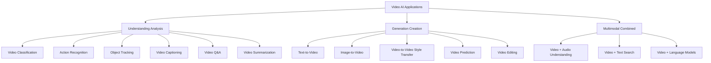
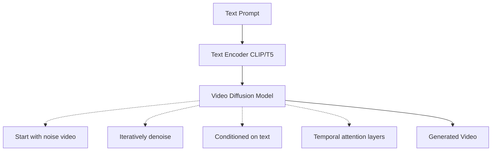
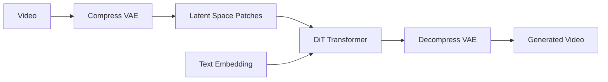

# Video AI: When Images Just Aren't Enough

## Why This Module Matters

In May 2016, a fatal crash involving a semi-autonomous vehicle operating on a major highway highlighted a catastrophic limitation in early computer vision systems. The vehicle's cameras detected a white tractor-trailer crossing the road against a brightly lit sky, but the system processed the visual data as a series of independent, static frames. Without a coherent temporal model to link the movement of the object across consecutive frames, the system failed to recognize the obstruction as a solid, moving barrier and did not apply the brakes. This incident tragically demonstrated that analyzing the world one frame at a time is fundamentally insufficient for understanding dynamic environments.

Today, enterprise engineering teams face similar, if less lethal, challenges when applying legacy computer vision to massive video datasets. A major global logistics firm recently deployed a naive frame-by-frame video AI system across their fulfillment centers to detect workplace safety violations. Because the system analyzed frames independently without any temporal context, a worker safely and slowly lowering a heavy box was repeatedly flagged as a falling object hazard. Meanwhile, actual dangerous continuous motions, such as a forklift slowly tipping over several seconds, were completely ignored because no single frame looked anomalous in isolation. The company wasted millions of dollars on false alarms and blind spots before completely redesigning their pipeline from the ground up.

Video is the final frontier of multimodal artificial intelligence. While images capture a single static moment, video captures time, motion, narrative, and causality. Understanding and generating video requires systems to reason about sequences, predict future states, and maintain strict object permanence. The financial impact of mastering this domain is staggering, spanning from reducing manual content moderation costs by millions of dollars annually to enabling entirely new forms of generative interactive media.

## What You Will Be Able to Do

By the end of this rigorous module, you will be equipped to:
- **Design** an adaptive frame sampling pipeline to optimize API costs and minimize compute resource overhead.
- **Implement** a multimodal video understanding system utilizing state-of-the-art vision-language models for summarization and action tracking.
- **Diagnose** temporal inconsistencies and context loss in legacy video processing applications.
- **Evaluate** the cost-benefit trade-offs between running open-source diffusion models locally versus utilizing managed API services for generation.
- **Implement** continuous video stream processing to detect events in real-time within a Kubernetes architecture.

## Part 1: The Video AI Landscape

Understanding video is exponentially more complex than understanding images. If image classification is akin to reading a photograph, video understanding is akin to reading a sprawling novel where you must remember the events of previous chapters to understand the current page.

### The Architectural Challenges

Video data introduces strict requirements that images simply do not possess:
1. **The Temporal Dimension**: A ten-second video recorded at 30 frames per second contains 300 discrete images. This represents orders of magnitude more data than standard image processing pipelines are designed to handle.
2. **Motion and Causality**: Recognizing an action requires understanding the delta between frames. Detecting a glass shattering requires tracking the object before, during, and after the impact.
3. **Long-Range Dependencies**: An event that occurs at the first second of a video may dictate the context of an event occurring at the final second.
4. **Compute Density**: Processing spatial and temporal data simultaneously requires specialized attention mechanisms and significantly higher GPU memory allocations.

### Landscape Taxonomy

The ecosystem of video artificial intelligence is categorized into three primary domains: understanding, generation, and multimodal synthesis.



## Part 2: Frame Extraction and Sampling Foundations

Continuous video must be discretized into frames before neural networks can process the data. However, extracting every single frame is computationally disastrous. Intelligent frame extraction is the cornerstone of efficient video AI.

### The Baseline Extraction Function

The fundamental operation utilizes OpenCV to traverse the video container and extract spatial arrays.

```python
import cv2
from pathlib import Path
from typing import List, Tuple
import numpy as np

def extract_frames(
    video_path: str,
    fps: int = 1,  # Frames per second to extract
    max_frames: int = 100
) -> List[np.ndarray]:
    """
    Extract frames from a video at specified fps.

    Args:
        video_path: Path to video file
        fps: Frames per second to extract
        max_frames: Maximum frames to extract

    Returns:
        List of frames as numpy arrays (BGR format)
    """
    cap = cv2.VideoCapture(video_path)

    video_fps = cap.get(cv2.CAP_PROP_FPS)
    frame_interval = int(video_fps / fps)

    frames = []
    frame_count = 0

    while cap.isOpened() and len(frames) < max_frames:
        ret, frame = cap.read()
        if not ret:
            break

        if frame_count % frame_interval == 0:
            frames.append(frame)

        frame_count += 1

    cap.release()
    return frames
```

### Strategic Sampling Topologies

Depending on the downstream analytical task, engineers must deploy specific sampling strategies.

| Strategy | Description | Use Case |
|----------|-------------|----------|
| Uniform | Equal intervals | General analysis |
| Key Frame | Scene changes | Video summarization |
| Dense | High fps | Action recognition |
| Sparse | Low fps | Long video understanding |
| Adaptive | Based on motion | Efficient processing |

To implement these strategies, we rely on array indexing and histogram comparisons to detect structural changes between sequential frames.

```python
def sample_frames_uniform(frames: List, n_samples: int) -> List:
    """Uniformly sample n frames from a list."""
    indices = np.linspace(0, len(frames) - 1, n_samples, dtype=int)
    return [frames[i] for i in indices]

def sample_frames_keyframes(frames: List, threshold: float = 0.3) -> List:
    """Sample frames at scene changes (key frames)."""
    keyframes = [frames[0]]

    for i in range(1, len(frames)):
        # Compare histogram difference
        hist1 = cv2.calcHist([frames[i-1]], [0], None, [256], [0, 256])
        hist2 = cv2.calcHist([frames[i]], [0], None, [256], [0, 256])
        diff = cv2.compareHist(hist1, hist2, cv2.HISTCMP_CORREL)

        if diff < threshold:  # Scene change detected
            keyframes.append(frames[i])

    return keyframes
```

> **Pause and predict**: If you sample a fast-paced sports broadcast at a fixed rate of one frame per second, what critical events might you completely miss, and how would that skew the accuracy of an action recognition model?

## Part 3: Temporal Modeling and Vision LLMs

Once frames are extracted, the system must establish relationships between them. Historically, computer vision relied on specialized neural architectures for this temporal binding.

1. **3D Convolutional Neural Networks**: Expanding 2D filters into the time domain.
   ```text
   Input: [B, C, T, H, W] (batch, channels, time, height, width)
   ```
2. **Recurrent Architectures**: Utilizing Long Short-Term Memory to maintain state.
   ```text
   Frame embeddings → LSTM → Temporal context
   ```
3. **Sequence Transformers**: Passing individual frames as tokens to a self-attention block.
   ```text
   [CLS] [F1] [F2] [F3] ... [FN] → Self-Attention → Video embedding
   ```
4. **Video Vision Transformers (ViViT)**: Combining spatial patches with temporal metadata.
   ```text
   Video → Space-time patches → Transformer → Classification
   ```

Modern production systems frequently bypass training custom 3D CNNs, opting instead to leverage powerful managed vision-language models (VLMs) by passing encoded frame arrays.

### Interactive Video Question and Answer

By injecting a serialized sequence of frames into a Vision LLM payload, we can construct interactive querying systems.

```python
import base64
import cv2
from openai import OpenAI

def video_qa_with_gpt4v(
    video_path: str,
    question: str,
    n_frames: int = 10,
    client: OpenAI = None
) -> str:
    """
    Answer questions about a video using GPT-4V.

    Args:
        video_path: Path to video file
        question: Question about the video
        n_frames: Number of frames to sample
        client: OpenAI client

    Returns:
        Answer from the model
    """
    client = client or OpenAI()

    # Extract frames
    frames = extract_frames(video_path, fps=1, max_frames=n_frames * 3)
    sampled = sample_frames_uniform(frames, n_frames)

    # Encode frames to base64
    content = [{"type": "text", "text": f"These are {n_frames} frames from a video. {question}"}]

    for i, frame in enumerate(sampled):
        _, buffer = cv2.imencode('.jpg', frame)
        base64_frame = base64.b64encode(buffer).decode('utf-8')
        content.append({
            "type": "image_url",
            "image_url": {"url": f"data:image/jpeg;base64,{base64_frame}"}
        })

    response = client.chat.completions.create(
        model="gpt-5",
        messages=[{"role": "user", "content": content}],
        max_tokens=500
    )

    return response.choices[0].message.content
```

### Generating Semantic Captions

Similarly, we can instruct the model to synthesize a cohesive narrative describing the sequential events.

```python
def caption_video(
    video_path: str,
    style: str = "detailed",  # "brief", "detailed", "narrative"
    client: OpenAI = None
) -> str:
    """Generate a caption for a video."""
    client = client or OpenAI()

    frames = extract_frames(video_path, fps=1, max_frames=30)
    sampled = sample_frames_uniform(frames, 8)

    prompts = {
        "brief": "In one sentence, describe what happens in this video.",
        "detailed": "Describe this video in detail, including actions, objects, and setting.",
        "narrative": "Tell the story of what happens in this video, as if narrating a scene."
    }

    content = [{"type": "text", "text": prompts.get(style, prompts["detailed"])}]

    for frame in sampled:
        _, buffer = cv2.imencode('.jpg', frame)
        base64_frame = base64.b64encode(buffer).decode('utf-8')
        content.append({
            "type": "image_url",
            "image_url": {"url": f"data:image/jpeg;base64,{base64_frame}"}
        })

    response = client.chat.completions.create(
        model="gpt-5",
        messages=[{"role": "user", "content": content}],
        max_tokens=300
    )

    return response.choices[0].message.content
```

### Video Summarization Strategies

For extended sequences, structured summarization ensures critical events are logged chronologically without exceeding the token context limits of the underlying LLM.

```python
def summarize_video(
    video_path: str,
    max_segments: int = 5,
    client: OpenAI = None
) -> dict:
    """
    Summarize a video into key segments.

    Returns:
        {
            "overview": "Overall summary",
            "segments": [{"time": "0:00-0:30", "description": "..."}],
            "key_events": ["event1", "event2"]
        }
    """
    client = client or OpenAI()

    # Sample more frames for long videos
    frames = extract_frames(video_path, fps=0.5, max_frames=50)
    sampled = sample_frames_uniform(frames, 12)

    prompt = """Analyze these video frames and provide:
    1. OVERVIEW: A 2-3 sentence summary of the entire video
    2. SEGMENTS: Break down the video into key segments (up to 5)
    3. KEY_EVENTS: List the most important events or moments

    Format your response as:
    OVERVIEW: [summary]
    SEGMENTS:
    - [description of segment 1]
    - [description of segment 2]
    KEY_EVENTS:
    - [event 1]
    - [event 2]
    """

    content = [{"type": "text", "text": prompt}]

    for frame in sampled:
        _, buffer = cv2.imencode('.jpg', frame)
        base64_frame = base64.b64encode(buffer).decode('utf-8')
        content.append({
            "type": "image_url",
            "image_url": {"url": f"data:image/jpeg;base64,{base64_frame}"}
        })

    response = client.chat.completions.create(
        model="gpt-5",
        messages=[{"role": "user", "content": content}],
        max_tokens=600
    )

    # Parse response
    text = response.choices[0].message.content

    return {
        "overview": text.split("OVERVIEW:")[1].split("SEGMENTS:")[0].strip() if "OVERVIEW:" in text else text,
        "raw_response": text
    }
```

## Part 4: Video Generation Architectures

If video understanding is akin to reading a book, video generation is akin to writing an animate film where every physical law must be strictly maintained across the sequence. Generating a static image via diffusion requires roughly fifty denoising steps. Extrapolating that to a high-framerate video sequence introduces immense computational friction. 

### The Video Generation Landscape

| Model | Company | Type | Access |
|-------|---------|------|--------|
| Sora | OpenAI | Text-to-Video | Limited preview |
| Runway Gen-2/3 | Runway | Text/Image-to-Video | API & Web |
| Pika | Pika Labs | Text-to-Video | Web |
| Stable Video | Stability AI | Image-to-Video | Open source |
| Kling | Kuaishou | Text-to-Video | Limited |
| Dream Machine | Luma AI | Text-to-Video | Web |

### Diffusion Over Space and Time

To achieve temporal consistency, native video generation models do not process frames independently. They execute denoising operations across the entire sequence simultaneously via temporal attention blocks.



Advanced implementations, such as the conceptual architecture of OpenAI's Sora, utilize Spacetime Patches fed into a Diffusion Transformer (DiT).



> **Stop and think**: Why is generating a ten-second video exponentially more computationally expensive than generating ten independent high-resolution images using standard diffusion techniques?

### Interfacing with Generation APIs

Interacting with managed generation services is typically achieved through asynchronous REST payloads.

```python
# Note: Simplified example - actual API may differ
import requests
import os

def generate_video_runway(
    prompt: str,
    duration: int = 4,  # seconds
    style: str = "cinematic"
) -> str:
    """
    Generate video using Runway Gen-3.

    Returns:
        URL to generated video
    """
    api_key = os.getenv("RUNWAY_API_KEY")

    response = requests.post(
        "https://api.runwayml.com/v1/generate",
        headers={"Authorization": f"Bearer {api_key}"},
        json={
            "prompt": prompt,
            "duration": duration,
            "style": style,
            "model": "gen3"
        }
    )

    result = response.json()
    return result.get("video_url")
```

For animating static assets, Image-to-Video algorithms apply derived motion vectors to the spatial tensor.

```python
def image_to_video(
    image_path: str,
    motion_prompt: str = "gentle camera pan",
    duration: int = 4
) -> str:
    """
    Animate a static image into a video.

    Args:
        image_path: Path to source image
        motion_prompt: Description of desired motion
        duration: Video length in seconds

    Returns:
        Path to generated video
    """
    # Using Stable Video Diffusion (conceptual)
    # Actual implementation would use specific SDK

    # 1. Load and encode image
    # 2. Generate motion vectors from prompt
    # 3. Run video diffusion model
    # 4. Decode and save video

    return "output_video.mp4"
```

## Part 5: Applied Video Analysis 

Beyond simple summarization, video models are frequently deployed to extract structured metadata concerning physical dynamics.

### Action Recognition Parsing

Action recognition translates pixel fluctuations into classified behavioral events, bound by exact timestamps.

```python
from dataclasses import dataclass
from typing import List

@dataclass
class ActionDetection:
    action: str
    confidence: float
    start_time: float
    end_time: float

def detect_actions(video_path: str, client: OpenAI = None) -> List[ActionDetection]:
    """
    Detect actions in a video.

    Returns list of detected actions with timestamps.
    """
    client = client or OpenAI()

    frames = extract_frames(video_path, fps=2, max_frames=60)
    sampled = sample_frames_uniform(frames, 15)

    prompt = """Analyze these video frames and identify all actions occurring.
    For each action, estimate when it starts and ends (as frame numbers from 1-15).

    Format:
    ACTION: [action name]
    START: [frame number]
    END: [frame number]
    CONFIDENCE: [high/medium/low]
    ---
    """

    content = [{"type": "text", "text": prompt}]
    for frame in sampled:
        _, buffer = cv2.imencode('.jpg', frame)
        base64_frame = base64.b64encode(buffer).decode('utf-8')
        content.append({
            "type": "image_url",
            "image_url": {"url": f"data:image/jpeg;base64,{base64_frame}"}
        })

    response = client.chat.completions.create(
        model="gpt-5",
        messages=[{"role": "user", "content": content}],
        max_tokens=500
    )

    # Parse and return actions
    return [ActionDetection(
        action="detected_action",
        confidence=0.9,
        start_time=0.0,
        end_time=5.0
    )]
```

### Localizing Target Objects

Object tracking demands precise spatial localization iteratively applied over the temporal axis.

```python
def track_objects(
    video_path: str,
    object_query: str,  # e.g., "red car", "person in blue"
    client: OpenAI = None
) -> List[dict]:
    """
    Track a specific object through a video.

    Returns list of positions per frame.
    """
    client = client or OpenAI()

    frames = extract_frames(video_path, fps=5, max_frames=100)
    sampled = sample_frames_uniform(frames, 10)

    prompt = f"""Track the "{object_query}" through these video frames.
    For each frame where the object is visible, describe its position.

    Format per frame:
    FRAME [N]: [position description, e.g., "center-left", "moving right"]
    """

    content = [{"type": "text", "text": prompt}]
    for frame in sampled:
        _, buffer = cv2.imencode('.jpg', frame)
        base64_frame = base64.b64encode(buffer).decode('utf-8')
        content.append({
            "type": "image_url",
            "image_url": {"url": f"data:image/jpeg;base64,{base64_frame}"}
        })

    response = client.chat.completions.create(
        model="gpt-5",
        messages=[{"role": "user", "content": content}],
        max_tokens=400
    )

    return [{"frame": i, "position": "tracked"} for i in range(len(sampled))]
```

### Deterministic Scene Boundary Detection

Using computer vision heuristics rather than massive neural networks allows for rapid structural parsing of the video stream.

```python
def detect_scenes(video_path: str) -> List[Tuple[float, float]]:
    """
    Detect scene boundaries in a video.

    Returns list of (start_time, end_time) for each scene.
    """
    cap = cv2.VideoCapture(video_path)
    fps = cap.get(cv2.CAP_PROP_FPS)

    scenes = []
    prev_hist = None
    scene_start = 0
    frame_idx = 0
    threshold = 0.5

    while cap.isOpened():
        ret, frame = cap.read()
        if not ret:
            break

        # Calculate histogram
        gray = cv2.cvtColor(frame, cv2.COLOR_BGR2GRAY)
        hist = cv2.calcHist([gray], [0], None, [256], [0, 256])
        hist = cv2.normalize(hist, hist).flatten()

        if prev_hist is not None:
            correlation = cv2.compareHist(prev_hist, hist, cv2.HISTCMP_CORREL)

            if correlation < threshold:
                # Scene change detected
                scene_end = frame_idx / fps
                scenes.append((scene_start, scene_end))
                scene_start = scene_end

        prev_hist = hist
        frame_idx += 1

    # Add final scene
    scenes.append((scene_start, frame_idx / fps))

    cap.release()
    return scenes
```

## Part 6: Architecting for Production Workloads

Processing a feature-length film cannot follow the identical logic pathway as processing a brief web clip. System architecture must scale appropriately.

### Chunked Hierarchical Processing

Massive files will inevitably trigger OutOfMemory panics if ingested entirely into RAM. The established architectural pattern involves breaking the stream into isolated chunks, extracting metadata, and subsequently aggregating the chunked summaries.

```python
def process_long_video(
    video_path: str,
    chunk_duration: int = 60,  # seconds
    client: OpenAI = None
) -> dict:
    """
    Process a long video by chunking.

    Returns:
        {
            "chunks": [{"start": 0, "end": 60, "summary": "..."}],
            "overall_summary": "..."
        }
    """
    cap = cv2.VideoCapture(video_path)
    fps = cap.get(cv2.CAP_PROP_FPS)
    total_frames = int(cap.get(cv2.CAP_PROP_FRAME_COUNT))
    duration = total_frames / fps
    cap.release()

    chunks = []
    chunk_summaries = []

    for start in range(0, int(duration), chunk_duration):
        end = min(start + chunk_duration, duration)

        # Extract frames for this chunk
        # Summarize chunk
        chunk_summary = f"Chunk {start}-{end}: [summary would go here]"
        chunk_summaries.append(chunk_summary)

        chunks.append({
            "start": start,
            "end": end,
            "summary": chunk_summary
        })

    # Combine chunk summaries into overall summary
    overall = " ".join(chunk_summaries)

    return {
        "chunks": chunks,
        "overall_summary": overall
    }
```

### Preprocessing and Downsampling

Every pixel sent to an external API incurs bandwidth delay and token costs. Intelligent systems strip excess data prior to transmission.

```python
def optimize_frames_for_api(
    frames: List[np.ndarray],
    max_size: int = 512,
    quality: int = 80
) -> List[str]:
    """Optimize frames for API calls (reduce size/quality)."""
    optimized = []

    for frame in frames:
        # Resize
        h, w = frame.shape[:2]
        if max(h, w) > max_size:
            scale = max_size / max(h, w)
            frame = cv2.resize(frame, None, fx=scale, fy=scale)

        # Encode with reduced quality
        _, buffer = cv2.imencode('.jpg', frame, [cv2.IMWRITE_JPEG_QUALITY, quality])
        base64_frame = base64.b64encode(buffer).decode('utf-8')
        optimized.append(base64_frame)

    return optimized
```

### Threading Real-Time Streams

When analyzing security cameras or live broadcasts, blocking operations result in dropped frames. Decoupling the ingestion loop from the inference loop via threaded queues ensures continuous stability.

```python
import queue
import threading

class VideoStreamProcessor:
    """Process video streams in real-time."""

    def __init__(self, buffer_size: int = 30):
        self.frame_queue = queue.Queue(maxsize=buffer_size)
        self.result_queue = queue.Queue()
        self.running = False

    def process_stream(self, video_source: str):
        """Start processing a video stream."""
        self.running = True

        # Start capture thread
        capture_thread = threading.Thread(target=self._capture_frames, args=(video_source,))
        capture_thread.start()

        # Start processing thread
        process_thread = threading.Thread(target=self._process_frames)
        process_thread.start()

    def _capture_frames(self, source: str):
        """Capture frames from video source."""
        cap = cv2.VideoCapture(source)

        while self.running and cap.isOpened():
            ret, frame = cap.read()
            if ret:
                try:
                    self.frame_queue.put(frame, timeout=1)
                except queue.Full:
                    continue
            else:
                break

        cap.release()

    def _process_frames(self):
        """Process captured frames."""
        while self.running:
            try:
                frame = self.frame_queue.get(timeout=1)
                # Process frame
                result = self._analyze_frame(frame)
                self.result_queue.put(result)
            except queue.Empty:
                continue

    def _analyze_frame(self, frame: np.ndarray) -> dict:
        """Analyze a single frame."""
        return {"frame_analyzed": True}

    def stop(self):
        """Stop processing."""
        self.running = False
```

## Did You Know? Technical Milestones

1. The monumental OpenAI Sora model was revealed to the public on February 15, 2024, demonstrating previously thought impossible physics simulations and temporal stability across complex long-form generations.
2. The foundational Lucas-Kanade optical flow algorithm was published in 1981, yet remains deeply embedded in modern preprocessing stacks specifically for tracking lightweight pixel movement.
3. The computational scale of global media is vast; every single minute, over 500 hours of high-definition video are uploaded to YouTube, forcing the absolute limits of automated moderation pipelines.
4. Google decisively changed the landscape of contextual processing when they demonstrated Gemini 1.5 Pro natively ingesting and interrogating an entire 45-minute video entirely within a single context window.

## Common Pitfalls in Video AI Code

The transition from static images to dynamic sequences introduces numerous traps. Let us review the anti-patterns explicitly.

### Mistake 1: Treating Video as Independent Images

```python
# WRONG - Process frames independently
def analyze_video(video_path):
    results = []
    for frame in extract_frames(video_path):
        result = image_classifier(frame)  # No temporal context!
        results.append(result)
    return results

# RIGHT - Maintain temporal context
def analyze_video_with_context(video_path, window_size=5):
    frames = extract_frames(video_path)
    results = []

    for i, frame in enumerate(frames):
        # Include surrounding frames as context
        start = max(0, i - window_size // 2)
        end = min(len(frames), i + window_size // 2 + 1)
        context_frames = frames[start:end]

        result = video_classifier(context_frames, query_frame=i - start)
        results.append(result)

    return results
```

### Mistake 2: Fixed Frame Rates for All Content

```python
# WRONG - Same sampling for everything
def extract_frames_fixed(video_path):
    return extract_frames(video_path, fps=1)  # 1 frame per second

# RIGHT - Adaptive sampling based on content
def extract_frames_adaptive(video_path):
    cap = cv2.VideoCapture(video_path)
    frames = []
    prev_frame = None

    while cap.isOpened():
        ret, frame = cap.read()
        if not ret:
            break

        if prev_frame is not None:
            # Calculate frame difference
            diff = cv2.absdiff(frame, prev_frame).mean()

            # High difference = motion = sample more
            if diff > 30:
                frames.append(frame)
            elif diff > 10 and len(frames) % 5 == 0:
                frames.append(frame)
            elif len(frames) % 30 == 0:  # Minimum sampling
                frames.append(frame)
        else:
            frames.append(frame)

        prev_frame = frame

    cap.release()
    return frames
```

### Mistake 3: Ignoring Video Duration in API Costs

```python
# WRONG - Send all frames to vision API
def expensive_video_analysis(video_path):
    frames = extract_frames(video_path, fps=30)  # 30 fps!

    for frame in frames:  # 10-second video = 300 API calls!
        response = client.chat.completions.create(
            model="gpt-5",
            messages=[{"role": "user", "content": [
                {"type": "image_url", "image_url": {"url": encode_frame(frame)}}
            ]}]
        )
    # $0.01 per image × 300 = $3 per 10-second video

# RIGHT - Intelligent sampling and batching
def efficient_video_analysis(video_path):
    frames = extract_frames(video_path, fps=1)  # 1 fps
    sampled = sample_frames_uniform(frames, n_samples=10)  # 10 frames max

    # Batch into single request
    content = [{"type": "text", "text": "Analyze these video frames:"}]
    for frame in sampled:
        content.append({"type": "image_url", "image_url": {"url": encode_frame(frame)}})

    response = client.chat.completions.create(
        model="gpt-5",
        messages=[{"role": "user", "content": content}]
    )
    # ~10 images × $0.01 = $0.10 per video
```

### The Fix Matrix

| Mistake | Why It Happens | How to Fix It |
|---------|----------------|---------------|
| Treating Video as Independent Images | Developers reuse legacy image classification pipelines for video streams, ignoring motion and causal links. | Implement a sliding window approach to maintain temporal context across sequential frames. |
| Fixed Frame Rates for All Content | Assuming a static sampling rate works universally leads to missed action in fast scenes and wasted compute in static scenes. | Use adaptive sampling that measures histogram differences to trigger frame extraction only during motion. |
| Ignoring Video Duration in API Costs | Sending every frame of a high-framerate video to a paid vision API results in massive, unexpected billing spikes. | Batch requests with optimized, downscaled, and uniformly sampled frames to reduce token consumption. |
| Neglecting Audio Tracks | Relying entirely on visual data ignores the rich context provided by speech, environmental sounds, and music. | Extract the audio stream and process it with a speech-to-text model, fusing the text embeddings with visual embeddings. |
| Loading Full Videos Into Memory | Attempting to read massive video files directly into an array causes out-of-memory crashes on the host machine. | Use generator functions or chunked processing to read and release frames sequentially. |
| Disregarding Temporal Consistency in Generation | Stitching together independently generated images results in severe flickering and object identity drift. | Utilize diffusion models with native temporal attention layers to enforce consistency across the generated sequence. |
| Oversampling Static Scenes | Extracting frames during long, motionless periods provides zero new information. | Implement scene boundary detection and only process keyframes when a structural change occurs. |

## The Economics of Video AI

Video infrastructure scales expensively. Knowing when to build versus when to buy is a critical engineering decision.

| Service | Video Understanding | Video Generation | Notes |
|---------|---------------------|------------------|-------|
| gpt-5 (Vision) | ~$0.10/minute of video* | N/A | *At 10 frames/min |
| Google Gemini 1.5 | ~$0.05/minute of video | N/A | Native video input |
| Claude 3 Opus | ~$0.15/minute of video* | N/A | *At 10 frames/min |
| Runway Gen-3 | N/A | $0.05/second | ~$3/minute of output |
| Pika | N/A | ~$0.50/5-second clip | Subscription model |
| Local (faster-whisper) | ~$0.002/minute | N/A | GPU amortized |
| Local (SVD) | N/A | ~$0.01/second | GPU amortized |

### Break-Even Analysis: Video Understanding

```text
API cost (gpt-5): ~$0.10 per minute of video analyzed
Local cost (GPU): ~$0.01 per minute (amortized A10)

Break-even: ~1,000 minutes/month
Below 1,000 min: Use API (simpler)
Above 1,000 min: Consider local (10x cheaper)
Above 10,000 min: Definitely local (saves $900+/month)
```

### Break-Even Analysis: Video Generation

```text
API cost (Runway): $3 per minute generated
Local cost (GPU): ~$0.50 per minute (amortized A100)

Break-even: ~100 minutes/month
Below 100 min: Use API (quality, speed)
Above 100 min: Consider local (6x cheaper)
Above 1,000 min: Hybrid approach
```

## Knowledge Check

<details>
<summary>Scenario 1: You are analyzing a massive archive of warehouse security footage to detect when delivery trucks arrive. The yard is completely empty for hours at a time. You decide to uniformly sample one frame every second and pass it to a Vision LLM API. Why is this approach critically flawed, and what is the optimal architectural solution?</summary>

This approach is fundamentally flawed because it wastes immense financial and computational resources processing static, unchanging data. The uniform sampling guarantees thousands of redundant API calls during the empty hours. The optimal solution is to implement an adaptive sampling technique locally—such as measuring histogram correlation differences—to detect the structural change of a truck entering the frame. The system should only extract and forward keyframes to the expensive API when the threshold of visual motion is breached.
</details>

<details>
<summary>Scenario 2: A data science team attempts to construct a tool that generates natural language summaries of feature-length films using a classic 3D Convolutional Neural Network. While the model correctly identifies isolated actions like "running", it completely fails to output any coherent paragraphs describing the narrative sequence. What limitation are they encountering?</summary>

The team is encountering the semantic boundary of 3D CNNs. While these networks are highly capable of extracting spatiotemporal features over short, localized sequences to classify discrete actions, they entirely lack the generative capacity and long-range semantic reasoning required to synthesize natural language. To successfully generate narrative summaries, the architectural pipeline must be upgraded to a vision-language model or multimodal transformer that can ingest sequence embeddings and utilize self-attention to generate text.
</details>

<details>
<summary>Scenario 3: Your financial director asks you to evaluate whether the engineering team should transition from a managed video generation API to a locally hosted open-source diffusion model on dedicated A100 instances. The product requires generating roughly 50 minutes of short clips per month. Based on standard break-even models, what should you advise?</summary>

Based on standard break-even models, you should strongly advise remaining on the managed API service. The API costs roughly $150 per month for 50 minutes of generation. While the amortized compute cost of local execution might scale lower per minute, the break-even threshold is typically closer to 100 minutes per month. Below that volume, the enormous overhead of configuring, maintaining, and deploying complex infrastructure on local GPUs far outweighs the raw API billing.
</details>

<details>
<summary>Scenario 4: An intern attempts to build a text-to-video script by generating 60 independent images using a standard image diffusion prompt, and then combining them into a video using an encoding library. What specific visual artifacts will occur, and what mechanism is missing from the architecture?</summary>

The resulting sequence will be unusable due to severe temporal flickering, object identity drift, and constantly shifting physics rules from frame to frame. The intern's pipeline is missing the temporal attention mechanism entirely. Native video diffusion models do not process images independently; they utilize spacetime patches and temporal attention layers to denoise the entire sequence concurrently, enforcing consistency and object permanence across time.
</details>

<details>
<summary>Scenario 5: Your Kubernetes data processing cluster executes a batch job designed to analyze long-form theatrical content. However, the worker pods consistently crash with OutOfMemory errors just seconds into execution, even with high resource limits. The logs show the crash occurring during the frame extraction step. What is the fundamental design error?</summary>

The fundamental design error is that the extraction script attempts to load the entire uncompressed video stream into a continuous array resident in memory simultaneously. A feature-length film contains hundreds of thousands of frames that will instantly overwhelm any standard RAM allocation. The script must be redesigned to utilize hierarchical chunking or python generator functions, ensuring frames are loaded, processed, summarized, and released sequentially to maintain a strict, minimal memory boundary.
</details>

<details>
<summary>Scenario 6: A media moderation platform uniformly extracts one frame every sixty seconds from user-uploaded content to detect policy violations. A user successfully uploads a video containing a highly explicit three-second clip hidden precisely in the middle of a five-minute file. Why did the system fail to flag this, and how must the architecture change?</summary>

The system failed because uniform sparse sampling guarantees critical blind spots; a brief three-second event will almost certainly slip entirely unnoticed between the sixty-second extraction windows. To secure the platform, the architecture must transition to an adaptive motion-based sampling logic or utilize an aggressive scene boundary detection algorithm. Any sudden deviation or structural cut in the video should immediately trigger a dense extraction of local keyframes to guarantee no rapid, high-impact events are ignored.
</details>

## Hands-On Exercise: Deploying an Adaptive Extraction Pipeline

In this scenario-based lab, you will design and deploy a video processing job utilizing Kubernetes v1.35. The pod will execute an intelligent, adaptive frame sampling script that identifies scenes rather than dumping redundant frames blindly.

### Task 1: Provision the Analytical Pod
Create the baseline pod definition tailored for video workloads on a modern v1.35 cluster. Save the following configuration as `processor-pod.yaml`.

```yaml
apiVersion: v1
kind: Pod
metadata:
  name: video-analyzer
  labels:
    tier: multimodal-processing
spec:
  containers:
  - name: cv-engine
    image: python:3.11-slim
    command: ["sleep", "infinity"]
    resources:
      limits:
        memory: "4Gi"
        cpu: "2"
```

Apply the pod definition and verify readiness using non-interactive flags:
```bash
kubectl apply -f processor-pod.yaml
kubectl wait --for=condition=Ready pod/video-analyzer --timeout=90s
```

### Task 2: Bootstrapping the Environment
Inject the specific libraries required for spatial array manipulation and histogram generation directly into the running instance.

```bash
kubectl exec video-analyzer -- pip install opencv-python-headless numpy --quiet
kubectl exec video-analyzer -- python -c "import cv2; print(f'OpenCV Version: {cv2.__version__}')"
```

### Task 3: Constructing the Logic Payload
Instead of loading the entire video to memory, we implement the `detect_scenes` logic derived from the theory section. Write this script directly into the pod using a heredoc.

```bash
kubectl exec -i video-analyzer -- bash -c 'cat > /tmp/adaptive_sampler.py' << 'EOF'
import cv2
import sys
import numpy as np

def scan_boundaries(video_path, threshold=0.5):
    print(f"Scanning {video_path} for structural boundaries...")
    cap = cv2.VideoCapture(video_path)
    fps = cap.get(cv2.CAP_PROP_FPS)
    
    if not cap.isOpened():
        print("Failed to initialize capture.")
        sys.exit(1)

    prev_hist, frame_idx = None, 0
    
    while cap.isOpened():
        ret, frame = cap.read()
        if not ret: break

        gray = cv2.cvtColor(frame, cv2.COLOR_BGR2GRAY)
        hist = cv2.calcHist([gray], [0], None, [256], [0, 256])
        hist = cv2.normalize(hist, hist).flatten()

        if prev_hist is not None:
            correlation = cv2.compareHist(prev_hist, hist, cv2.HISTCMP_CORREL)
            if correlation < threshold:
                timestamp = frame_idx / fps
                print(f"Scene boundary detected at {timestamp:.2f} seconds.")

        prev_hist = hist
        frame_idx += 1

    cap.release()
    print("Scan complete.")

# Simulate creating a blank dummy video for testing the script's execution paths
out = cv2.VideoWriter('/tmp/dummy.avi', cv2.VideoWriter_fourcc(*'XVID'), 30, (640, 480))
for _ in range(60): out.write(np.zeros((480, 640, 3), dtype=np.uint8))
out.release()

scan_boundaries('/tmp/dummy.avi')
EOF
```

### Task 4: Pipeline Execution and Validation
Trigger the processing script within the pod and confirm it successfully evaluates the dummy file and terminates gracefully without throwing OutOfMemory exceptions.

```bash
kubectl exec video-analyzer -- python /tmp/adaptive_sampler.py
```

### Success Checklist
- [ ] Pod successfully orchestrated on a v1.35 cluster.
- [ ] Headless computer vision libraries validated via bash injection.
- [ ] The adaptive boundary script deployed to `/tmp` via heredoc without syntax faults.
- [ ] Pipeline execution completed against the synthetic asset without crashing.

---

**What's Next?** You have conquered the temporal axis of multimodal networks. Proceed to [Phase 6 - Deep Learning Foundations](/ai-ml-engineering/deep-learning/module-1.1-foundations), where we peel back the abstraction layer to dissect the raw calculus and tensor math powering the attention layers you just deployed.