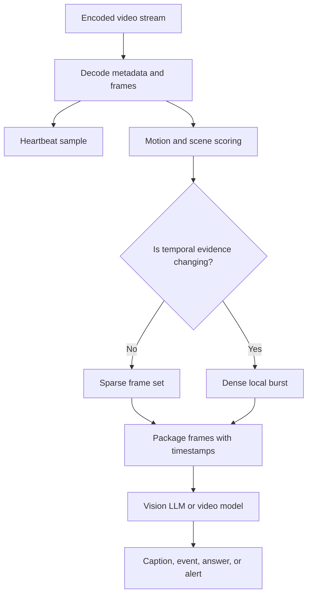
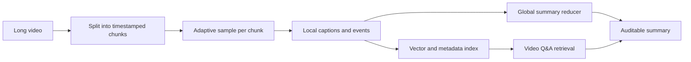
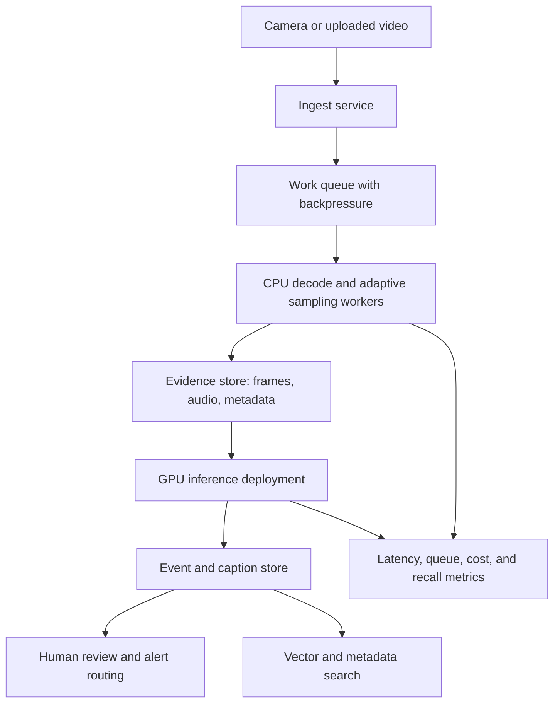

> **AI/ML Engineering Track** | Complexity: `[COMPLEX]` | Time: 4-5 hours | Prerequisites: [Vision AI](../module-1.2-vision-ai/), transformer attention, API cost awareness, and basic Kubernetes batch processing

## Learning Outcomes

By the end of this module, you will be able to connect video-specific modeling choices to production architecture decisions instead of treating video as a folder of still images with a higher storage bill.

- **Design** adaptive frame extraction and sampling policies that balance recall, latency, and API spend for slow scenes, fast actions, and long archives. Sections: Frame Extraction and Sampling; Knowledge Check 1.
- **Explain** how temporal video models, video transformers, and Vision LLM payloads represent multiple frames, temporal order, and long-range context. Sections: Temporal Modeling and Vision LLMs; Knowledge Check 2.
- **Build** a long-video understanding workflow that separates captioning, action detection, summarization, video question answering, and map-reduce aggregation. Sections: Video Understanding Workflows; Knowledge Check 3.
- **Evaluate** generation providers, adapter capability tables, generated-video provenance, and video job tradeoffs without turning volatile vendor claims into durable teaching material. Sections: Video Generation: Concepts and Constraints; Knowledge Checks 4 and 7.
- **Operate** a Kubernetes-oriented video AI pipeline that uses queues, chunking, GPU batching, adaptive extraction, and observability boundaries for real-time event detection. Sections: Production Video AI on Kubernetes; Knowledge Checks 5-6.

## Why This Module Matters

At 4:36 p.m. eastern daylight time on May 7, 2016, a Tesla Model S operating with an automated vehicle control system struck a tractor-semitrailer near Williston, Florida. The National Transportation Safety Board investigation is not a "video AI benchmark," and it should not be reduced to one simplistic model-failure slogan. It is still a useful reminder for engineers because the incident involved a dynamic scene where perception, driver attention, system boundaries, and timing all mattered at once. A single static frame rarely contains the whole operational truth.

Video AI matters because time changes the meaning of pixels. A still image can tell you that a person is standing near a doorway; a video can tell you whether the person just entered, is leaving, is waiting, dropped a package, or is being followed. A still frame can show a forklift near a pallet; a video can reveal whether the forklift paused safely, clipped a corner, or reversed into a blind spot. The hard part is not merely more data. The hard part is preserving the right temporal evidence while discarding enough redundant frames to make the system affordable.

Hypothetical scenario: a retail operations team wants to audit thousands of hours of checkout-area footage for process bottlenecks. The first prototype samples one frame every second, sends each frame to a vision model, and asks whether the frame contains a queue. The demo works on a short clip, but production results are unreliable. A short rush of customers between sampled frames is missed, static scenes generate repeated API calls, and the summary says "busy counter" without identifying when the line formed, how long it lasted, or what event cleared it.

That failure is common because image pipelines encourage the wrong abstraction. Video should be treated less like a bag of pictures and more like a compressed event stream. The engineering question is always, "Which temporal evidence must survive into the model context?" Sometimes the answer is a uniform sample across the whole clip. Sometimes it is a dense burst around motion, a keyframe at each scene boundary, a sliding window around a suspected action, or a hierarchical summary where short chunks are analyzed first and then merged.

The analogy to remember is a security guard reviewing a long hallway camera. A guard does not stare with equal attention at every identical second of an empty hallway. They scrub faster through quiet periods, slow down when a door opens, rewind around suspicious movement, and write a report that separates observed evidence from inference. A good video AI system does the same thing mechanically: it samples, scores, chunks, reasons, and reports with explicit uncertainty.

## Frame Extraction and Sampling

Video ingestion begins before any neural network sees a tensor. A file container holds encoded video streams, audio streams, timestamps, keyframes, metadata, and compression artifacts. The model usually cannot consume that container directly, so the pipeline must decode some representation of the stream into frames, frame embeddings, audio snippets, transcripts, or native video payloads supported by a managed model. The first major design decision is therefore not "which model?" but "which evidence should we extract?"

A naive extractor reads every frame and forwards it downstream. That seems faithful, but it is almost always wasteful. A ten-second clip at thirty frames per second contains three hundred frames, many of which may be nearly identical. If you send all three hundred frames to a paid Vision LLM, the dominant cost driver is no longer reasoning; it is the number, size, and resolution of images placed into the model context. If you run a local detector, the same over-extraction inflates GPU queues, storage writes, and memory pressure.

Uniform sampling is the simplest countermeasure. You choose a fixed interval, such as one frame every second, and preserve a steady view across the clip. Uniform sampling is useful for high-level summarization because it gives the model a broad overview without making any local decision about what matters. It also has an obvious failure mode: events shorter than the interval can disappear completely. If a safety violation lasts three tenths of a second and your sampler looks once per second, there is no downstream prompt clever enough to recover evidence that was never extracted.

Dense sampling does the opposite. It preserves many frames around regions where small motion matters, such as sports analysis, manufacturing inspection, gesture recognition, medical procedure review, or driver-assistance logs. Dense sampling improves recall for fast events because consecutive frames reveal motion direction and timing. It also multiplies cost. A dense clip may be the right input for an action recognition model, but it is a poor default for a quiet storage-room camera where nothing changes for long periods.

Keyframe sampling uses video structure rather than wall-clock time. Modern video codecs already distinguish between independently decodable keyframes and frames that depend on nearby frames. Scene detection tools can also detect cuts, fades, or large visual changes. A keyframe sampler is valuable for summarization because it captures boundaries in visual narrative: a slide changes, a camera angle cuts, a truck enters a yard, or a user switches from screen share to webcam. The limitation is that keyframes describe changes in appearance, not necessarily changes in semantic importance.

Adaptive sampling is the production pattern that joins these ideas. The pipeline keeps a minimum heartbeat sample so long periods are not ignored, then raises the sampling rate when local signals suggest useful change. Signals can include histogram difference, optical flow magnitude, object detector deltas, audio energy, speech activity, scene boundary scores, camera motion, or an upstream event such as "door sensor opened." Adaptive sampling is not magic; it is a policy that trades false negatives against cost. Lower thresholds catch more events and spend more compute, while higher thresholds save money and miss subtle motion.


```mermaid
flowchart TD
    Video[Encoded video stream] --> Decode[Decode metadata and frames]
    Decode --> Baseline[Heartbeat sample]
    Decode --> Motion[Motion and scene scoring]
    Motion --> Decision{Is temporal evidence changing?}
    Decision -->|No| Sparse[Sparse frame set]
    Decision -->|Yes| Burst[Dense local burst]
    Sparse --> Pack[Package frames with timestamps]
    Burst --> Pack
    Pack --> Model[Vision LLM or video model]
    Model --> Result[Caption, event, answer, or alert]
```

The timestamp is as important as the image. A frame without time is only evidence of appearance. A frame with a timestamp can support claims such as "the person entered at 00:12," "the spill appears after the cart passes," or "the alert was raised two seconds after motion began." If you sample ten frames from a two-minute clip, store the original frame index, the time range each frame represents, and the sampling reason. Those fields let reviewers understand whether a summary is based on uniform coverage, a motion-triggered burst, or a scene boundary.

Cost-aware sampling should be designed backward from the product decision. A moderation system that must catch short harmful inserts needs higher recall than a meeting summarizer that only needs agenda-level themes. A warehouse arrival detector can tolerate a few seconds of delay if it avoids analyzing empty pavement all night. A robot perception system cannot tolerate that delay because the physical world has already changed. The same video may need different samplers for archive search, real-time alerting, legal review, and generative editing.

The practical rule is to write the sampling policy down as a contract. Include the minimum sample rate, maximum burst rate, trigger thresholds, maximum frames per clip, allowed image resolution, and escalation path for uncertain cases. If the model output is wrong, the first debugging question is whether the frame evidence contained the event. If the answer is no, you have a sampling failure, not a reasoning failure. If the answer is yes, you can debug prompt framing, model choice, temporal ordering, and assessment logic.

Sampling contracts also make cost review concrete. Without a contract, a team debates video AI in vague terms such as "too expensive" or "not accurate enough." With a contract, the team can calculate how many candidate frames a one-hour source produces under normal conditions, how many more are produced during high-motion bursts, and how many model calls are required after batching. Those numbers can be reviewed against the product risk. A low-risk archive search tool might accept sparse evidence and cheaper summaries, while a safety-critical event detector might deliberately spend more on local dense windows before escalating only the most important frames to a managed model.

The contract should include a fallback for ambiguity. If two adjacent selected frames imply that something important may have happened between them, the system should be able to request a local replay with a denser window instead of forcing the model to guess. This is similar to how a human reviewer scrubs backward and forward around a suspicious moment. The first pass finds likely regions cheaply; the second pass spends more compute only where uncertainty justifies it. That two-pass design is often a better product fit than either sampling everything or trusting one sparse pass.

## Temporal Modeling and Vision LLMs

Temporal modeling is the difference between identifying objects and understanding events. A model looking at one frame can label a ball, a hand, and a table. A temporal model can reason that the hand pushed the ball, the ball rolled, the ball struck a glass, and the glass fell. The objects are not enough. The system must preserve order, motion, persistence, and causality across the sequence.

Classic video models extended image architectures into time. A 3D convolution applies filters across height, width, and time, so it can detect local spatiotemporal patterns such as a hand moving upward or a person turning. Recurrent models encode frames one after another and maintain hidden state. Optical-flow pipelines compute apparent pixel motion between frames and pass motion fields into a classifier. These approaches remain useful for constrained tasks, especially when the label set is narrow and latency must be predictable.

Transformers changed the shape of video modeling by treating space and time as token dimensions. A video transformer can divide frames into patches or tubelets, attach positional information, and let attention connect patches across time. ViViT explored pure-transformer video classification with spatiotemporal tokens and factorized variants to reduce sequence cost. TimeSformer studied attention schemes for video and popularized the idea that spatial attention and temporal attention can be separated inside blocks. The durable lesson is not one paper's benchmark; it is that the token count grows quickly when you multiply patches by frames.

That token growth explains why long videos remain hard. If one image becomes hundreds of visual tokens, then eight frames become thousands, and a long clip becomes more than a context window can reasonably carry. A Vision LLM that accepts multiple images is therefore not automatically a full video reasoner. It may see representative frames and answer well about visible objects, yet fail on timing-sensitive questions because the decisive transition happened between frames or because frame order was weakly represented in the prompt.

Modern video-language models use several strategies to handle this pressure. Some pool frame features before passing them into the language model. Some sample a fixed number of frames and rely on temporal position embeddings. Some use dedicated video encoders that compress motion into fewer tokens. Some managed services accept video files directly and perform internal segmentation, transcription, frame extraction, and multimodal encoding. As an application engineer, you still need to know what evidence was likely preserved, because model convenience does not remove temporal blind spots.

Frame ordering should be explicit whenever you build the payload yourself. Do not upload eight JPEGs and ask, "What happened?" without telling the model that frame 1 is earliest and frame 8 is latest. Include timestamps or ranges in the text surrounding each frame, and ask for uncertainty when the frames are too sparse. A good prompt says, "These frames are sampled from a 40-second clip at the listed timestamps; infer only what is supported by visible evidence and say when motion between samples is ambiguous."

Temporal consistency failures appear in both understanding and generation. In understanding, a model may reverse cause and effect, merge two similar objects, miss a brief state change, or describe an action as continuous when it was only visible once. In generation, a model may drift object identity, change clothing between frames, violate physics, flicker lighting, or lose track of where an object should be after occlusion. Both classes of failure come from the same pressure: maintaining stable state over time is harder than describing a single image.

The debugging workflow should separate evidence, ordering, and reasoning. First, inspect the sampled frames and confirm the event is visible. Second, confirm timestamps and frame order are correct after preprocessing, resizing, batching, and retry logic. Third, ask whether the model's answer requires information between frames. Fourth, test a denser local window around the disputed event. If a denser window fixes the answer, the model may be adequate and the sampler was too sparse. If the denser window still fails, you likely need a task-specific detector, a stronger video model, or a human review path.

## Video Understanding Workflows

Video understanding is not one task. Captioning, action detection, object tracking, visual question answering, summarization, moderation, retrieval, and anomaly detection each demand a different evidence shape. A captioning pipeline wants enough frames to describe the scene coherently. An action detector wants short windows with motion continuity. A retrieval pipeline wants embeddings that map visual, audio, and textual evidence into a searchable index. A compliance workflow wants auditable timestamps, confidence, and conservative claims.

Captioning turns sampled evidence into language. A brief caption might be enough for search indexing, while a detailed caption might name objects, setting, actions, and visible text. The risk is over-narration. If a model sees a person holding a box in one frame and an empty shelf later, it may say the person stocked the shelf even if the transfer happened off camera. For operational systems, captions should distinguish direct observation from inference: "a person is visible near the shelf" is safer than "the person replenishes inventory" unless the motion sequence supports it.

Event and action detection should be windowed. An action label such as "falling," "opening," "turning," or "handing over" depends on change across adjacent frames. The pipeline should create overlapping windows, score each window, and then merge adjacent positive windows into time ranges. This is more reliable than classifying isolated frames and trying to reconstruct action afterward. It also creates useful review artifacts because a human can inspect the exact window that triggered the event.

Video question answering adds another layer because the user's question determines which evidence matters. "What color is the truck?" may need one clear frame. "Did the truck stop before entering the loading bay?" needs temporal context around entry. "How many times did the operator scan a package?" needs counting across a sequence and may require chunking. A VQA system should therefore route questions by evidence need: static visual, local temporal, global summary, audio-transcript, or cross-modal comparison.

Long-video summarization is usually a map-reduce problem. The map step splits the video into chunks, extracts representative evidence for each chunk, and asks for structured local summaries. The reduce step combines those local summaries into a global answer, preserving timestamps and contradictions. This approach is not only about context-window limits. It also improves debuggability because every global statement can point back to the chunk that produced it.


```mermaid
flowchart LR
    Long[Long video] --> Split[Split into timestamped chunks]
    Split --> Sample[Adaptive sample per chunk]
    Sample --> Local[Local captions and events]
    Local --> Index[Vector and metadata index]
    Local --> Reduce[Global summary reducer]
    Index --> QA[Video Q&A retrieval]
    Reduce --> Report[Auditable summary]
    QA --> Report
```

The reducer should not simply concatenate local summaries. It should normalize time, collapse repeated events, preserve uncertainty, and detect conflicts. For example, one chunk might say "the operator leaves the station," while the next chunk says "the operator is already absent." A useful global summary becomes "the operator appears to leave between 03:20 and 03:40, after which the station remains unattended." This phrasing communicates the evidence boundary more honestly than pretending the exact departure moment was observed.

Audio often changes the answer. A silent security clip may be understood visually, but meetings, lectures, support calls, manufacturing alarms, sports broadcasts, and medical recordings often require speech or environmental sound. A practical pipeline extracts audio, transcribes speech when appropriate, segments the transcript by timestamp, and aligns transcript spans with visual chunks. The model can then answer questions such as "What was being demonstrated when the alarm sounded?" or "Which slide was visible when the speaker mentioned rollback?"

Retrieval is the durable pattern for large archives. Store chunk-level metadata, captions, transcript spans, embeddings, thumbnails, and event labels in a searchable system. At query time, retrieve candidate chunks before invoking an expensive model. This prevents a user question about a two-minute segment from causing an hour-long video to be reprocessed. It also lets you update the summarizer or question-answering model without re-decoding every source video, as long as your stored evidence is rich enough.

The output schema matters as much as the model prompt. Free-form prose is convenient for humans, but production systems need fields such as `start_time`, `end_time`, `evidence_frames`, `observed_objects`, `inferred_action`, `confidence`, `requires_review`, and `model_version`. A schema forces the model to expose the difference between a visible event and a guessed explanation. It also gives downstream systems stable hooks for alerting, search, dashboards, and human review queues.

Evaluation should be designed around the same schema. A video summarizer can be fluent while still being operationally weak if it fails to preserve timestamps, collapses repeated events, or invents a causal link. Build small review sets where the expected output is not just a paragraph but a set of event ranges, evidence frames, and allowed uncertainty. Then measure whether the pipeline selected the right evidence, whether the model described that evidence correctly, and whether the reducer preserved the timing. This separates sampler recall from model reasoning and prevents the team from blaming the wrong component.

Human review is not an afterthought in serious video systems. Reviewers need thumbnails, short replay clips, transcript snippets, sampling reasons, and model explanations in one place. If the review interface only shows the final caption, reviewers cannot tell whether the model saw enough evidence. If it only shows raw video, reviewers cannot efficiently audit thousands of events. The review product should expose the model's evidence trail so humans can correct labels, mark uncertain cases, and feed those corrections back into sampler thresholds or evaluation datasets.

## Video Generation: Concepts and Constraints

Video generation reverses the understanding problem. Instead of compressing a sequence into labels or text, the system expands text, images, video references, or editing instructions into a temporally coherent clip. The model must create objects, preserve identity, move a virtual camera, maintain lighting, respect prompt constraints, and produce plausible motion across frames. That is substantially harder than producing a still image because every generated frame must agree with surrounding frames.

Diffusion-based generation starts from noise and iteratively denoises toward a sample that matches conditioning information. Latent diffusion reduces cost by operating in a compressed representation rather than directly on pixels. Video diffusion extends this idea into time by adding temporal layers, temporal attention, or 3D latent representations so the model denoises a sequence rather than independent images. Transformer-based video diffusion uses attention over spacetime tokens, which is conceptually close to treating a clip as a sequence of visual patches across both space and time.

Text-to-video starts from a prompt. It is useful for ideation, storyboards, synthetic examples, creative previews, advertising drafts, and simulation-like visualizations where exact factual fidelity is not required. Image-to-video starts from a still image and asks the model to animate it, which can preserve composition better than pure text but still requires careful prompting around motion. Video-to-video and editing workflows use an existing clip as a reference, enabling changes to style, background, motion, or objects while attempting to preserve some source structure.

The hard failure modes are temporal. A character may change face shape across frames. A logo may bend or mutate. Hands may merge with tools. A camera may move in an impossible way. Text may flicker. An object hidden behind another object may reappear in a different place. These failures are not merely aesthetic; they matter when generated clips are used for product mockups, training data, educational media, or decision support. Generated video should be labeled, reviewed, and kept out of evidence workflows unless provenance is explicit.

Latency and cost realities should shape product design. Video generation usually runs asynchronously because rendering a clip involves many model evaluations and postprocessing steps. A user experience that expects a synchronous chat-style response will feel broken. A better design creates a job, stores the prompt and references, displays progress, supports cancellation, and records the generated asset with metadata. For batch workloads, queue depth, retry policy, content review, and storage lifecycle become part of the product rather than infrastructure afterthoughts.

> **Landscape snapshot — as of 2026-06. This changes fast; verify against vendor docs before relying on specifics.**
>
> | Surface | Publicly documented shape in this snapshot | Engineering implication |
> |---|---|---|
> | OpenAI Sora Videos API | OpenAI developer docs describe Sora 2 video models and state that the Videos API and listed Sora 2 models are deprecated with a September 24, 2026 shutdown date. | Treat Sora-specific integrations as migration-sensitive and isolate provider adapters. |
> | Google Veo on Google Cloud | Google Cloud docs list Veo 3.1 generation model IDs with text/image inputs and video outputs, with documented short clip lengths and fixed output formats. | Use the docs as a capability contract, not a general promise about arbitrary long generation. |
> | Runway API | Runway's developer docs expose video generation and editing APIs and show current model examples such as Gen-4.5 and Aleph 2.0. | Model names are product-surface details; keep them in configuration. |
> | Pika API | Pika's official API page directs developers to fal.ai for API access to Pika video models. | Confirm the actual integration surface and terms before designing around it. |
> | Kling AI API | Kling's developer/API pages document image and video generation surfaces, including text-to-video and image-to-video endpoints. | Account for asynchronous job handling and provider-specific parameter maps. |
> | Luma Dream Machine API | Luma docs describe video generation through request IDs, polling, and Ray model parameters for text-to-video and image-to-video workflows. | Design generation as queued work with durable task IDs and output download handling. |
> | Gemini video understanding | Google Cloud docs list Gemini video-understanding support, including documented media limits for selected model families. | For long input, still design chunking and retrieval because limits and model rosters change. |
>
> This snapshot is illustrative, not a leaderboard or endorsement. The durable lesson is to isolate provider specifics behind adapters and keep model names, durations, prices, regions, and deprecation dates out of core business logic.

The adapter boundary is the production control point. A clean generation service accepts a normalized job with prompt, source assets, safety settings, target aspect ratio, duration intent, output policy, and callback destination. Provider adapters translate that normalized job into a specific API call. When a provider changes model IDs, deprecates an endpoint, adds a watermark rule, or alters supported durations, the blast radius should be one adapter and one capability table, not every product workflow.

Generation should also be separated from understanding in system design. A generated clip may be fed into an understanding model for validation, but that validation is not proof of real-world truth. It is a consistency check on generated media. For example, a product team might generate a training clip, then ask a video-understanding model whether the target object appears, whether motion roughly follows the prompt, and whether captions match the intended lesson. That loop can improve creative workflows, but it should never be confused with analyzing real footage.

A useful generation job record is more like a build artifact than a chat response. It should preserve the normalized request, provider adapter, source assets, policy checks, output URI, review state, and failure reason if the provider rejects or times out. That record lets the product retry safely, compare providers, and explain why two clips from similar prompts are not identical. It also lets finance and operations teams attribute cost to product features without embedding vendor-specific billing logic in the creative workflow.

The prompt itself should be treated as an instruction set with testable constraints. A prompt that says "show a worker safely stopping a forklift before a crossing" carries different risk from a prompt that says "show a forklift near a crossing." If the generated clip will be used in training material, the validation loop should check whether the stop is visible, whether the crossing is clear, whether the timing supports the safety lesson, and whether any generated signage or text is misleading. Video generation is powerful, but it still needs product-specific acceptance criteria.

## Production Video AI on Kubernetes

Production video AI pipelines are data pipelines before they are model pipelines. The ingestion layer receives files, live streams, webhooks, or object-storage events. The preprocessing layer extracts metadata, audio, frames, scene boundaries, thumbnails, and chunks. The inference layer runs local detectors, managed model calls, or GPU-served models. The aggregation layer writes summaries, events, embeddings, and review tasks. Kubernetes is useful because each layer has different scaling pressure and failure behavior.

A common batch architecture uses object storage for source video, a queue for work items, CPU workers for decoding and sampling, GPU workers for local inference, and a database or search index for structured outputs. CPU workers should do as much cheap filtering as possible before GPU work begins. For example, a scene detector can reduce hours of quiet footage into a small number of candidate windows. That lets the GPU process meaningful windows instead of acting as a very expensive video decoder.

Real-time streams add backpressure requirements. A camera or live broadcast does not stop producing frames because inference is slow. The pipeline needs a bounded buffer, a drop policy, and a priority rule. Some systems drop old frames and keep the newest view because freshness matters. Others preserve every frame around a triggered event because forensic completeness matters. A generic unbounded queue is the worst option because it hides overload until latency grows beyond the product's purpose.

GPU batching is different for video understanding than for ordinary image classification. Batches can vary by frame count, resolution, and window length. If your model supports fixed shapes, preprocessing may need to pad, crop, resize, or bucket requests so the serving engine can combine compatible work. NVIDIA Triton documents dynamic batching for combining requests and sequence batching for stateful sequences; the distinction matters because some video workloads are stateless clips while others maintain stream-level state over time.

Kubernetes exposes GPUs through device plugins and schedulable extended resources. That scheduling layer is necessary but not sufficient. A pod that requests a GPU can still waste it with tiny single-frame calls, unbatched work, slow downloads, or CPU-bound decoding. Good deployments separate CPU decode pools from GPU inference pools, monitor queue wait separately from inference time, and use autoscaling signals that reflect actual bottlenecks. Scaling GPU pods because object storage downloads are slow is an expensive misdiagnosis.


```mermaid
flowchart TD
    Camera[Camera or uploaded video] --> Ingest[Ingest service]
    Ingest --> Queue[Work queue with backpressure]
    Queue --> CPU[CPU decode and adaptive sampling workers]
    CPU --> Evidence[Evidence store: frames, audio, metadata]
    Evidence --> GPU[GPU inference deployment]
    GPU --> Events[Event and caption store]
    Events --> Review[Human review and alert routing]
    Events --> Search[Vector and metadata search]
    GPU --> Metrics[Latency, queue, cost, and recall metrics]
    CPU --> Metrics
```

Observe the sampler, not just the model. A video AI service can appear healthy while silently missing events because the sampler is too sparse. Track how many frames were decoded, how many were selected, which triggers selected them, how many bursts occurred, and how often human reviewers found important events outside selected windows. Model latency, GPU utilization, and API spend are necessary metrics, but they do not tell you whether the right evidence reached the model.

The operational runbook should include replay. When an alert is disputed, engineers need to replay the exact source chunk, sampling policy, model configuration, prompt, and reducer version that produced it. Store enough metadata to reproduce the decision without relying on mutable vendor defaults. For managed APIs, record provider, model identifier, request parameters, input checksums, and response IDs. For local models, record container image, model weights checksum, preprocessing code version, and GPU batch settings.

Security and privacy boundaries are also sharper with video. A frame may contain faces, screens, license plates, badges, medical information, or children. Redaction can happen before model calls, after detection, or during review, but it must be part of the architecture. If a managed service receives frames, the data handling terms matter. If a local cluster stores extracted frames, retention and access controls matter. The cheap choice is not always the safe choice, and the safe choice must be enforced in storage, logs, prompts, and review tools.

Failure handling should assume partial progress. A long video may decode successfully, fail on one corrupted segment, produce summaries for several chunks, and time out during the final reduce step. Throwing away all partial work makes retries expensive and hides useful evidence. A better controller stores chunk state independently, retries failed chunks with bounded attempts, and lets the reducer operate only when required chunks reach a valid terminal state. This is the same reason Kubernetes jobs, queues, and object stores fit video AI well: they let you make large media workflows resumable rather than fragile.

Autoscaling should be based on stage-specific signals. CPU decode workers can scale on queue age and decode throughput. GPU inference workers can scale on batch queue wait, model latency, and device memory pressure. Reducers can scale on pending chunk summaries. Review queues can scale on human backlog and alert severity. A single "number of videos waiting" metric is too coarse because it cannot distinguish a storage bottleneck from an inference bottleneck. Separate signals keep teams from buying GPUs to solve a queue policy problem.

## Did You Know?

- **Frame math changes cost quickly**: a ten-second video at thirty frames per second contains three hundred frame positions, so a "send every frame" policy can turn a tiny clip into hundreds of visual inputs before the model does any reasoning.
- **ViViT treated video as spatiotemporal tokens**: the paper's durable contribution for practitioners is the framing that video transformers must manage both spatial patches and temporal sequence length rather than simply reuse an image encoder unchanged.
- **TimeSformer separated space and time attention**: the architecture study is useful because it makes the engineering tradeoff visible, showing that attention can be organized differently across frames and within frames.
- **Scene detection can be deterministic**: FFmpeg and PySceneDetect expose scene-change style signals that can cheaply identify candidate boundaries before an expensive multimodal model is invoked.

## Common Mistakes

| Mistake | Why it happens | How to fix |
|---|---|---|
| Sampling every frame by default | It feels faithful, and early demos are small enough that the cost is hidden. | Start with a written sampling contract that caps frames, resolution, and burst behavior per use case. |
| Sampling one frame per second for every workload | Uniform sampling is easy to explain, so it becomes the default even when events are brief. | Use adaptive bursts around motion, scene changes, or external triggers when recall matters. |
| Losing timestamps during preprocessing | Frame arrays move through code more easily than evidence records with metadata. | Store original frame index, timestamp, chunk ID, and sampling reason beside every selected frame. |
| Asking a Vision LLM timing questions from sparse frames | The model may answer fluently even when the decisive transition happened between samples. | Prompt for uncertainty and rerun a denser local window for timing-sensitive questions. |
| Treating generated video as factual evidence | Generated clips look like recordings, so downstream users may over-trust them. | Keep provenance metadata, labels, review states, and storage paths separate from real footage. |
| Scaling GPU pods before measuring decode and queue time | GPU symptoms are visible, while CPU decode, storage reads, and queue contention are less glamorous. | Instrument ingestion, decode, sampling, inference, and aggregation as separate latency stages. |
| Hard-coding provider model names across product code | Vendor video surfaces change quickly and examples become stale. | Place model IDs, durations, regions, and deprecation notes in a dated adapter capability table. |

## Knowledge Check

<details>
<summary>1. Your team samples a sports clip at one frame per second and asks a Vision LLM whether a player touched the ball before it crossed a line. The answer is confident but wrong. What failed first?</summary>

The first failure is the sampling policy, not the language model. A one-frame-per-second sample can easily omit the short interval where contact occurred, so the model is asked to infer a timing-sensitive event from missing evidence. The fix is to preserve a denser local window around fast motion, include timestamps, and ask the model to separate visible contact from uncertain motion between frames.
</details>

<details>
<summary>2. A prototype sends eight unordered JPEGs from a long clip to a vision model and asks, "What happened before the alarm?" The model describes the alarm but reverses the sequence of two events. What should change in the payload?</summary>

The payload should make temporal order explicit. Each frame should include its timestamp or time range, and the prompt should state that the images are ordered from earliest to latest. If the event depends on transitions between sparse frames, the system should retrieve a denser window around the alarm instead of expecting the model to reconstruct exact order from weak evidence.
</details>

<details>
<summary>3. You need to summarize a two-hour maintenance video while preserving auditable evidence. Why is a map-reduce workflow better than one giant prompt?</summary>

A map-reduce workflow respects context limits and improves traceability. The map step summarizes timestamped chunks with selected frames, transcript spans, and local events. The reduce step combines those structured outputs into a global summary while retaining links back to the chunks. A giant prompt is more likely to exceed limits, bury contradictions, and produce claims that cannot be traced to evidence.
</details>

<details>
<summary>4. A product manager wants to swap video generation providers every month to compare text-to-video, image-to-video, and video-editing quality. Why should model names and duration limits live outside core business logic?</summary>

Video generation providers change quickly. Model IDs, supported durations, regions, prices, deprecations, and input modes are volatile product facts. Keeping provider details in adapters and dated capability tables lets the application preserve a stable video job schema while each adapter translates that schema to the current provider API. This reduces migration risk and avoids stale assumptions scattered through product code.
</details>

<details>
<summary>5. A Kubernetes GPU deployment shows low utilization, but event-detection latency is high. Why might adding more GPU pods fail to help?</summary>

The bottleneck may be outside GPU inference. CPU decoding, object-storage reads, frame extraction, queue wait, image resizing, or unbatched tiny requests can dominate end-to-end latency. Adding GPU pods only helps when inference capacity is the limiting stage. The correct response is to instrument each stage separately and scale the stage that is actually saturated.
</details>

<details>
<summary>6. A live camera pipeline uses an unbounded queue between ingestion and inference. It never drops frames, but alerts arrive minutes late during busy periods. What design decision is missing?</summary>

The pipeline is missing an explicit backpressure and drop policy. Real-time systems need bounded buffers and a rule for overload, such as preserving the newest frame for freshness or preserving dense windows around triggered events for review. An unbounded queue protects completeness only superficially because it destroys the latency budget that made the stream useful.
</details>

<details>
<summary>7. A generated training clip is passed through a video-understanding model, which says the intended object is visible. Can the team treat the clip as evidence that the event happened in the real world?</summary>

No. The understanding model can validate consistency between the generated clip and the prompt, but it cannot turn synthetic media into real-world evidence. Generated video should carry provenance metadata and remain separate from recordings. The validation result is useful for creative quality control, not for factual claims about events outside the generation system.
</details>

## Hands-On Exercise

This exercise builds a deterministic adaptive sampler over synthetic frame metadata. It does not require OpenCV, a GPU, or a vendor API, which is intentional: the goal is to practice the production policy that decides which frames deserve expensive model attention. You will create a small dataset with quiet periods, scene changes, and a short fast event, then run a sampler that preserves heartbeat frames plus dense bursts around motion or scene changes.

Run the commands from the repository root so the exercise uses the project virtual environment explicitly.

```bash
REPO_ROOT="$(pwd)"
WORKDIR="${TMPDIR:-/tmp}/kubedojo-video-ai"
mkdir -p "$WORKDIR"

cat > "$WORKDIR/frames.csv" <<'CSV'
frame,timestamp,motion_score,scene_score,label
0,0.0,0.01,0.01,empty hallway
1,0.5,0.01,0.01,empty hallway
2,1.0,0.02,0.02,empty hallway
3,1.5,0.03,0.02,empty hallway
4,2.0,0.78,0.12,door opens
5,2.5,0.85,0.20,person enters
6,3.0,0.64,0.10,person crosses frame
7,3.5,0.20,0.04,person exits
8,4.0,0.03,0.02,empty hallway
9,4.5,0.02,0.02,empty hallway
10,5.0,0.04,0.70,camera cuts to loading dock
11,5.5,0.06,0.08,truck parked
12,6.0,0.07,0.07,truck parked
13,6.5,0.72,0.09,worker runs past truck
14,7.0,0.69,0.08,worker leaves frame
15,7.5,0.05,0.04,truck parked
16,8.0,0.03,0.02,truck parked
CSV

cat > "$WORKDIR/adaptive_sampler.py" <<'PY'
import csv
import json
import sys
from pathlib import Path


def load_rows(path):
    with Path(path).open(newline="", encoding="utf-8") as handle:
        rows = list(csv.DictReader(handle))
    for row in rows:
        row["frame"] = int(row["frame"])
        row["timestamp"] = float(row["timestamp"])
        row["motion_score"] = float(row["motion_score"])
        row["scene_score"] = float(row["scene_score"])
    return rows


def select_frames(
    rows,
    heartbeat_seconds=4.5,
    motion_threshold=0.72,
    scene_threshold=0.65,
    motion_context_frames=1,
):
    selected = {}
    last_heartbeat = None

    for idx, row in enumerate(rows):
        trigger_reasons = []
        if last_heartbeat is None or row["timestamp"] - last_heartbeat >= heartbeat_seconds:
            frame = row["frame"]
            selected.setdefault(frame, set()).add("heartbeat")
            last_heartbeat = row["timestamp"]
        if row["motion_score"] >= motion_threshold:
            trigger_reasons.append("motion")
        if row["scene_score"] >= scene_threshold:
            frame = row["frame"]
            selected.setdefault(frame, set()).add("scene")

        if trigger_reasons:
            start = max(0, idx - motion_context_frames)
            end = min(len(rows), idx + motion_context_frames + 1)
            for neighbor in range(start, end):
                if 0 <= neighbor < len(rows):
                    frame = rows[neighbor]["frame"]
                    selected.setdefault(frame, set()).update(
                        trigger_reasons if neighbor == idx else {"context"}
                    )

    output = []
    for row in rows:
        reasons = selected.get(row["frame"])
        if reasons:
            output.append(
                {
                    "frame": row["frame"],
                    "timestamp": row["timestamp"],
                    "label": row["label"],
                    "reasons": sorted(reasons),
                }
            )
    return output


def main():
    if len(sys.argv) != 2:
        raise SystemExit("usage: adaptive_sampler.py frames.csv")
    rows = load_rows(sys.argv[1])
    selected = select_frames(rows)
    result = {
        "input_frames": len(rows),
        "selected_frames": len(selected),
        "reduction_ratio": round(1 - (len(selected) / len(rows)), 3),
        "selected": selected,
    }
    print(json.dumps(result, indent=2))


if __name__ == "__main__":
    main()
PY

"$REPO_ROOT/.venv/bin/python" "$WORKDIR/adaptive_sampler.py" "$WORKDIR/frames.csv" > "$WORKDIR/selected_frames.json"
cat "$WORKDIR/selected_frames.json"
```

The expected result is not a single magic frame count; it is a defensible evidence set. With these defaults, the sample should cut the candidate frame set by roughly 40-60% while preserving heartbeat coverage through quiet periods, adding context around the door opening, including the scene cut to the loading dock, and keeping dense evidence around the worker running past the truck. If the sampler drops the "worker runs past truck" frames, recall is too low. If it selects nearly every quiet frame, cost control is too weak.

### Success Checklist

- [ ] The script runs with `.venv/bin/python` from the repository root and writes `selected_frames.json` under the temporary work directory.
- [ ] The run reduces the input by roughly 40-60% instead of forwarding nearly every quiet frame.
- [ ] The selected output includes context around the `door opens`, `person enters`, and `worker runs past truck` labels.
- [ ] The selected output includes at least one heartbeat frame from a quiet period so the summary can still say which scene was inactive.
- [ ] You can explain which threshold you would lower for a safety-critical detector and which threshold you would raise for a low-cost archive summarizer.

To extend this into Kubernetes, place the sampler behind a queue consumer and split responsibilities. CPU workers decode streams and compute motion or scene scores. GPU workers receive only selected windows or embeddings. A reducer service writes structured summaries and evidence links. The same policy you tested locally becomes a ConfigMap or service configuration, while the thresholds become observable production knobs rather than hidden constants in a notebook.

## Next Module

Next, continue to [Module 1.4: Multimodal-First AI Design](../module-1.4-multimodal-first-design/), where the focus shifts from video-specific pipelines to native multimodal architectures that reason across video, audio, images, and text in one interaction design.

## Sources

- [NTSB Williston, Florida Automated Vehicle Crash Investigation](https://www.ntsb.gov/investigations/Pages/HWY16FH018.aspx) — Primary investigation page for the real 2016 crash used in the module opener.
- [OpenCV VideoCapture Documentation](https://docs.opencv.org/4.x/d8/dfe/classcv_1_1VideoCapture.html) — Official OpenCV reference for reading video files, image sequences, and camera streams.
- [FFmpeg Filters Documentation](https://ffmpeg.org/ffmpeg-filters.html) — Official filter reference documenting scene-change metadata and related video filtering primitives.
- [PySceneDetect Detector Documentation](https://www.scenedetect.com/docs/latest/api/detectors.html) — Upstream documentation for content, adaptive, threshold, and histogram-based scene detection.
- [ViViT: A Video Vision Transformer](https://arxiv.org/abs/2103.15691) — Primary paper for spatiotemporal tokenization and transformer-based video classification.
- [Is Space-Time Attention All You Need for Video Understanding?](https://arxiv.org/abs/2102.05095) — Primary TimeSformer paper for space-time attention design tradeoffs.
- [Video-ChatGPT: Towards Detailed Video Understanding via Large Vision and Language Models](https://arxiv.org/abs/2306.05424) — Primary paper connecting video encoders with LLM-style video dialogue.
- [Video-LLaVA: Learning United Visual Representation by Alignment Before Projection](https://arxiv.org/abs/2311.10122) — Primary paper for a video-language baseline that unifies image and video representation.
- [Google Cloud Gemini Video Understanding](https://docs.cloud.google.com/gemini-enterprise-agent-platform/models/capabilities/video-understanding) — Vendor documentation for current managed video-understanding inputs and limits.
- [OpenAI Images and Vision Guide](https://developers.openai.com/api/docs/guides/images-vision) — Official OpenAI guide for image inputs used when video is represented as sampled frames.
- [OpenAI Video Generation with Sora](https://developers.openai.com/api/docs/guides/video-generation) — Official OpenAI documentation for the Sora Videos API and its current deprecation status.
- [OpenAI Video Generation Models as World Simulators](https://openai.com/index/video-generation-models-as-world-simulators/) — Technical report describing Sora concepts such as unified visual representations and spacetime patches.
- [Google Cloud Veo 3.1 Documentation](https://docs.cloud.google.com/gemini-enterprise-agent-platform/models/veo/3-1-generate) — Vendor documentation for current Veo generation model IDs, inputs, outputs, and short-video constraints.
- [Runway API Documentation](https://docs.dev.runwayml.com/) — Vendor documentation for Runway generation and editing API surfaces.
- [Pika API Page](https://pika.art/api) — Official Pika page directing developers to the current API access route.
- [Kling AI API Overview](https://kling.ai/document-api/quickStart%2FproductIntroduction%2Foverview) — Official Kling API overview for image and video generation surfaces.
- [Luma Dream Machine API Documentation](https://docs.lumalabs.ai/docs/api) — Vendor documentation for request-ID based image and video generation workflows.
- [Stable Video Diffusion: Scaling Latent Video Diffusion Models to Large Datasets](https://arxiv.org/abs/2311.15127) — Primary paper on latent video diffusion training and image-to-video generation.
- [Kubernetes Device Plugins](https://kubernetes.io/docs/concepts/extend-kubernetes/compute-storage-net/device-plugins/) — Official Kubernetes documentation for advertising GPUs and other special hardware to kubelet.
- [NVIDIA Triton Dynamic Batching](https://docs.nvidia.com/deeplearning/triton-inference-server/user-guide/docs/user_guide/batcher.html) — Official Triton documentation for dynamic and sequence batching concepts relevant to video inference serving.
