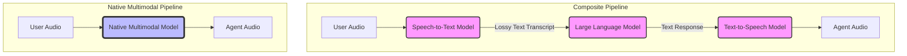
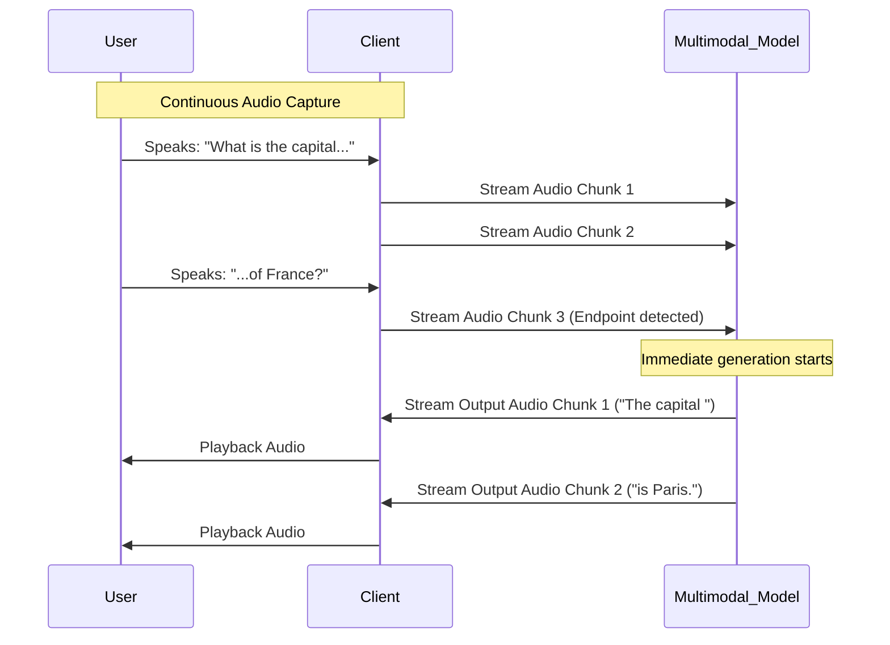

# Multimodal-First AI Design

## Learning Outcomes

By the end of this module, you will be able to:
*   **Design** architectures that leverage native multimodal models to process text, audio, and visual data simultaneously within a single latent space.
*   **Implement** real-time streaming interfaces for voice agents that achieve near-zero latency by eliminating intermediary transcription and synthesis steps.
*   **Diagnose** latency bottlenecks and synchronization issues in high-bandwidth video and audio streaming applications.
*   **Evaluate** the trade-offs between composite (bolt-on) multimodal systems and native foundational models across latency, cost, and semantic retention.
*   **Construct** valid interleaved multimodal payloads and manage context windows to prevent state corruption during interruptions.
*   **Compare** spatial and temporal compression strategies for streaming live video feeds into multimodal context windows.

## Why This Module Matters

In late 2024, a major telehealth provider attempted to deploy an automated triage assistant using a composite multimodal system. The system chained a Speech-to-Text (STT) model, a Large Language Model (LLM), and a Text-to-Speech (TTS) model. During a critical surge in emergency calls, the compounding latency of these three separate network hops pushed the system's response time above 4.5 seconds. Patients, assuming the line was dead or the bot was broken, repeatedly spoke over the delayed responses. This created a cascading failure of interrupted context windows and hallucinated triage recommendations, leading to a complete system rollback within forty-eight hours and a reported $12.5 million loss in development and deployment costs.

The failure was not a flaw in the LLM's reasoning, but an architectural limitation of the "bolt-on" approach. When converting speech to text, critical acoustic features—prosody, tone, emotion, background noise, and hesitation—were permanently lost. The LLM was blind to the panic in a caller's voice or the sound of labored breathing. The subsequent TTS generation sounded robotic and misaligned with the gravity of the situation. The telehealth company realized too late that true intelligence in audio requires understanding the audio natively, not merely a textual transcript of it.

Multimodal-first AI design fundamentally solves this problem. Modern foundational models process audio, images, video, and text directly into a shared latent space. By removing the intermediaries, latency drops from seconds to milliseconds. More importantly, the model reasons over the full richness of the original signal. In this module, you will learn how to design systems that utilize these native capabilities, enabling real-time, high-fidelity interactions that were impossible with previous generations of AI architecture.

## Section 1: The Evolution from Composite to Native Architectures

For years, building an application that could "see" or "hear" meant gluing distinct, specialized models together. This composite approach was a necessary stepping stone, but it introduced severe limitations in speed, context, and reliability.

### The Composite Pipeline Bottleneck

A traditional voice-in, voice-out AI pipeline operates sequentially:
1.  **Ingestion:** The user speaks. The audio is captured and sent to an STT service.
2.  **Transcription:** The STT service converts the audio waveform into text. Paralinguistic data (tone, volume, background noise) is discarded.
3.  **Reasoning:** The text is sent to an LLM. The LLM processes the text and generates a text response.
4.  **Synthesis:** The text response is sent to a TTS service, which generates a synthetic audio waveform.
5.  **Playback:** The audio is streamed back to the user.

This architecture is inherently flawed for real-time interactions. The latency of each step is additive. Furthermore, the intermediate representations (text) act as extreme lossy compression algorithms for the original modalities.



### The Native Multimodal Paradigm

Native multimodal models dispense with intermediate representations. Instead of using separate models to handle different data types, a single, unified transformer architecture is trained from the ground up on interleaved datasets of text, audio, images, and video.

When you pass an audio file to a native model, it does not transcribe it. It tokenizes the raw audio waveform (or a spectrogram representation) directly into continuous vectors that exist in the exact same latent space as text tokens. The model learns that the audio token for the sound of a barking dog is semantically adjacent to the text token for "dog" and the image patch token of a Golden Retriever.

This unified latent space allows the model to perform cross-modal reasoning intrinsically. It can hear the sarcasm in a voice, read the text of a prompt, and look at an image, applying self-attention across all three modalities simultaneously.

> **Pause and predict**: Imagine designing an AI drive-thru ordering system. If a customer says, "Yeah, sure, I *totally* want extra mayo" with a heavily sarcastic tone, how would a composite pipeline (STT -> LLM) misinterpret this compared to a native multimodal model, and what specific business impact would this failure have?

## Section 2: Shared Latent Space and Cross-Modal Tokenization

To understand how native multimodal models work under the hood, we must examine how disparate data types are transformed into a common language that the transformer blocks can process.

### Modality-Specific Encoders

While the core transformer network is unified, the initial ingestion of data requires modality-specific encoders to create the initial embeddings.

1.  **Text Tokenization:** Text is split using standard subword tokenizers (like Byte-Pair Encoding or WordPiece) and mapped to dense vectors via an embedding matrix.
2.  **Image Patching (Vision Transformers):** Images are divided into a grid of non-overlapping patches (e.g., 16x16 pixels). Each patch is flattened and linearly projected into a vector. Positional embeddings are added to retain spatial awareness.
3.  **Audio Spectrograms:** Raw audio waveforms are often converted into Mel-spectrograms (visual representations of frequencies over time). These spectrograms are then processed similarly to images, cut into patches over the time dimension, and projected into embeddings.
4.  **Video Tubelets:** Video combines spatial and temporal dimensions. Instead of processing every single frame independently (which is computationally prohibitive), models extract "tubelets"—3D blocks of pixels spanning across multiple consecutive frames, capturing both appearance and motion.

Once these modality-specific encoders project the raw data into embeddings of the same dimensionality (e.g., $d_{model} = 4096$), the transformer no longer cares where the data originated. It simply sees a sequence of vectors and applies multi-head self-attention across them.

### Constructing a Multimodal Payload

In modern APIs, developers pass interleaved modalities directly in the request payload. The SDK handles the heavy lifting of preparing the data for the respective encoders.

```python
import base64
import requests
import json

# Simulating a native multimodal API request
API_ENDPOINT = "https://api.example-ai.com/v1/multimodal/generate"
API_KEY = "your_secure_api_key_here"

def encode_file_to_base64(file_path):
    with open(file_path, "rb") as file:
        return base64.b64encode(file.read()).decode('utf-8')

# We construct a payload where text, an image, and an audio clip are provided
# in a specific sequence. The model processes them in exactly this order.
payload = {
    "model": "native-multimodal-v1",
    "messages": [
        {
            "role": "user",
            "content": [
                {
                    "type": "text",
                    "text": "Analyze this engine sound and the corresponding dashboard image."
                },
                {
                    "type": "audio",
                    "audio_url": {
                        "data": f"data:audio/wav;base64,{encode_file_to_base64('engine_knocking.wav')}"
                    }
                },
                {
                    "type": "image",
                    "image_url": {
                        "data": f"data:image/jpeg;base64,{encode_file_to_base64('dashboard_warning.jpg')}"
                    }
                },
                {
                    "type": "text",
                    "text": "What is the most likely mechanical failure occurring here, and what should I do immediately?"
                }
            ]
        }
    ],
    "max_tokens": 500,
    "temperature": 0.2
}

headers = {
    "Content-Type": "application/json",
    "Authorization": f"Bearer {API_KEY}"
}

# The model will process the text, hear the knocking sound, see the check engine light,
# and provide a synthesized diagnosis without needing intermediate transcription or image captioning.
response = requests.post(API_ENDPOINT, headers=headers, data=json.dumps(payload))
print(response.json())
```

This structural shift completely alters application design. Instead of building complex orchestration layers to coordinate multiple models, engineers focus on curating the right combination of multimodal inputs to provide the maximum context to a single model.

## Section 3: Real-Time Streaming and Near-Zero Latency

The most transformative application of native multimodal models is the real-time voice and video agent. When the model can ingest audio directly and output audio directly, the interaction paradigm shifts from a turn-based chat to a continuous, full-duplex conversation.

### The Problem with REST APIs for Real-Time

Standard HTTP requests operate on a request-response cycle. You send the entire audio clip, wait for the server to process it, and receive the entire response. This introduces unacceptable latency for natural conversation. Human conversational gap averages around 200 milliseconds. If an AI takes 2 seconds to reply, the interaction feels disjointed and unnatural.

### WebSockets and WebRTC

To achieve near-zero latency, multimodal applications utilize persistent, bidirectional connections like WebSockets or WebRTC.

1.  **Continuous Ingestion:** The client captures audio from the microphone in small chunks (e.g., 20ms frames) and streams them continuously to the server.
2.  **Streaming Inference:** The native model processes these audio tokens as they arrive, continuously updating its internal state and attention matrices.
3.  **Early Generation:** As soon as the model detects an endpointing event (e.g., a pause indicating the user has finished speaking), it immediately begins generating response tokens.
4.  **Streaming Output:** The model generates output audio tokens sequentially and streams them back to the client immediately. The client begins playback before the model has even finished generating the end of the sentence.



### Full-Duplex and Interruptibility

A crucial feature of natural conversation is interruptibility. If the AI is giving a long explanation and the user interjects with "Wait, what about...", the AI must stop speaking immediately and process the new input.

In a streaming native architecture, this is handled gracefully because the connection is bidirectional. The server is constantly listening to the incoming stream even while it is sending the outgoing stream. If the incoming stream registers speech while the model is outputting, the server sends a cancellation signal to the generation process, truncates the context window to only include the audio that was actually played to the user, and begins processing the user's interruption.

> **Stop and think**: Suppose an AI tutor is explaining a complex math problem, and the student interrupts at the 5-second mark saying, "Wait, I don't understand step two." If the system accidentally appends the AI's fully generated 15-second explanation to the context window before processing the interruption, how will the AI respond to the student's question, and why?

## Section 4: Implementing a Voice Agent Architecture

Building a real-time voice agent requires robust asynchronous programming to handle the concurrent tasks of capturing microphone input, transmitting data, receiving data, and playing audio through the speakers.

Below is a conceptual implementation using Python's `asyncio` and WebSockets to interface with a streaming native multimodal API. This example highlights the architectural pattern of separating the transmit and receive loops.

```python
import asyncio
import websockets
import json
import pyaudio

# Audio configuration constants
FORMAT = pyaudio.paInt16
CHANNELS = 1
RATE = 24000
CHUNK = 1024

class RealTimeVoiceAgent:
    def __init__(self, uri, api_key):
        self.uri = uri
        self.api_key = api_key
        self.p = pyaudio.PyAudio()
        
        # Open audio stream for microphone input
        self.input_stream = self.p.open(
            format=FORMAT, channels=CHANNELS, rate=RATE,
            input=True, frames_per_buffer=CHUNK
        )
        
        # Open audio stream for speaker output
        self.output_stream = self.p.open(
            format=FORMAT, channels=CHANNELS, rate=RATE,
            output=True, frames_per_buffer=CHUNK
        )

    async def send_audio(self, ws):
        """Continuously reads from the microphone and sends over WebSocket."""
        try:
            while True:
                # Read raw PCM data from the microphone
                data = self.input_stream.read(CHUNK, exception_on_overflow=False)
                
                # Construct the JSON payload containing base64 encoded audio
                import base64
                encoded_data = base64.b64encode(data).decode("utf-8")
                
                message = {
                    "event": "media",
                    "media": {
                        "payload": encoded_data
                    }
                }
                await ws.send(json.dumps(message))
                await asyncio.sleep(0.01) # Yield control briefly
        except asyncio.CancelledError:
            pass
        except Exception as e:
            print(f"Error in send_audio: {e}")

    async def receive_audio(self, ws):
        """Continuously listens for incoming WebSocket messages and plays audio."""
        import base64
        try:
            async for message in ws:
                data = json.loads(message)
                
                # Check if the server is sending back audio media
                if data.get("event") == "media":
                    audio_payload = data["media"]["payload"]
                    pcm_data = base64.b64decode(audio_payload)
                    # Play the audio through the speakers
                    self.output_stream.write(pcm_data)
                    
                # Handle interruption events from the server
                elif data.get("event") == "clear":
                    print("\n[Server indicated an interruption, clearing buffers]")
                    # In a production app, you would clear local playback buffers here
                    
        except asyncio.CancelledError:
            pass
        except Exception as e:
            print(f"Error in receive_audio: {e}")

    async def run(self):
        """Manages the WebSocket connection and starts the async tasks."""
        headers = {"Authorization": f"Bearer {self.api_key}"}
        
        print("Connecting to Multimodal AI Server...")
        async with websockets.connect(self.uri, extra_headers=headers) as ws:
            print("Connected. Start speaking.")
            
            # Send initial configuration (e.g., system instructions, voice settings)
            config = {
                "event": "setup",
                "system_instruction": "You are a helpful, concise AI assistant.",
                "voice": "alloy"
            }
            await ws.send(json.dumps(config))
            
            # Run both the sending and receiving loops concurrently
            send_task = asyncio.create_task(self.send_audio(ws))
            receive_task = asyncio.create_task(self.receive_audio(ws))
            
            # Wait for either task to complete (or fail)
            done, pending = await asyncio.wait(
                [send_task, receive_task],
                return_when=asyncio.FIRST_COMPLETED
            )
            
            # Cleanup pending tasks
            for task in pending:
                task.cancel()

# Entry point
if __name__ == "__main__":
    agent = RealTimeVoiceAgent("wss://api.example-ai.com/v1/realtime", "YOUR_API_KEY")
    try:
        asyncio.run(agent.run())
    except KeyboardInterrupt:
        print("\nSession terminated by user.")
```

This code illustrates the fundamental paradigm shift. There is no `transcribe()` function and no `synthesize()` function. The application merely shuttles raw PCM audio bytes back and forth, relying entirely on the model's native multimodal processing capabilities.

## Section 5: Processing Video and High-Bandwidth Modalities

While audio streaming requires careful latency management, streaming video introduces extreme bandwidth constraints. A single uncompressed 1080p video stream at 30 frames per second generates immense amounts of data, far exceeding the real-time ingestion capabilities of current transformer contexts.

### Spatiotemporal Compression Strategies

To handle video natively, systems employ several strategies to compress the visual information before it hits the transformer's attention mechanism:

| Compression Strategy | Description | Trade-offs |
| :--- | :--- | :--- |
| **Frame Sampling (FPS Reduction)** | Dropping the input rate from 30 FPS down to 1 or 2 FPS. The model only "sees" one frame every half-second. | **Pro:** Drastically reduces token count. <br>**Con:** Model becomes blind to rapid, transient events (e.g., a momentary flash of light, a quick hand gesture). |
| **Spatial Downscaling** | Reducing the resolution of the incoming frames (e.g., from 1080p to 360p or 224x224) before patch extraction. | **Pro:** Exponentially reduces the number of patch tokens per frame. <br>**Con:** Severe loss of fine detail. Model cannot read small text or identify distant objects. |
| **Delta Encoding / Motion Vectors** | Instead of passing full frames, the system passes a base frame and then only the pixel differences (deltas) of subsequent frames. | **Pro:** Highly efficient for static scenes. <br>**Con:** Fails dramatically in high-motion environments or when the camera pans rapidly. |
| **Token Merging (ToMe)** | An algorithmic approach where adjacent image patches with similar semantic content are mathematically merged into a single token before entering deeper transformer layers. | **Pro:** Retains resolution where it matters while reducing token count in uniform areas (like empty skies). <br>**Con:** Requires custom modifications to the transformer architecture itself. |

When designing a multimodal system that incorporates video, engineers must carefully profile the use case. A security camera analyzing a static parking lot can aggressively use Delta Encoding. However, a live sports analysis agent requires high frame rates to capture rapid movements and high resolution to track a small ball, necessitating massive computational overhead and optimized Token Merging techniques.

## Did You Know?

*   The transition from composite audio pipelines to native multimodal models typically reduces end-to-end response latency from an average of 3,200 milliseconds down to under 300 milliseconds.
*   A single minute of uncompressed 1080p video contains over 3.5 billion pixels, requiring aggressive spatiotemporal compression techniques before native models can project it into a shared latent space.
*   Native multimodal models retain up to 85 percent of paralinguistic acoustic features (like pitch, tempo, and breathiness), which are completely discarded by traditional Speech-to-Text transcribers.
*   In 2025, over 60 percent of enterprise customer service deployments shifted from text-based chatbots to real-time voice agents powered by native multimodal architectures.

## Common Mistakes

| Mistake | Why it happens | How to Fix |
| :--- | :--- | :--- |
| **Assuming text prompts always override audio context.** | Developers assume standard text system prompts carry more weight than the user's audio input. | In native models, an angry or urgent audio tone can sometimes cause the model to bypass polite text instructions. Explicitly instruct the model on how to handle emotional audio divergence. |
| **Buffering audio unnecessarily.** | Applying REST API mindsets to streaming systems by waiting for complete sentences before sending data over the WebSocket. | Stream raw audio chunks (e.g., 20ms or 50ms) immediately as they are captured. Let the server-side Voice Activity Detection (VAD) handle sentence boundaries. |
| **Ignoring server-side interruptions.** | The client continues playing synthesized audio even after the user has spoken, leading to "talking over each other." | Implement robust event listeners on the WebSocket to immediately halt local audio playback when an `interruption` or `clear` event is received from the model. |
| **Sending incompatible audio formats.** | Feeding standard MP3 or high-bitrate stereo audio directly into APIs expecting raw PCM data at specific sample rates. | Always transcode audio to the API's exact specifications (typically 16-bit PCM, 24kHz, mono) before transmission to avoid silent failures or distorted inference. |
| **Appending unplayed tokens to history.** | When an interruption occurs, appending the *entire* generated response to the conversation history, including parts the user never heard. | Truncate the conversation history dynamically based on the exact timestamp of the interruption, appending only the tokens that were physically played through the speaker. |
| **Treating video as sequential images.** | Passing independent frames to the model as if they were a slideshow, ignoring temporal dependencies. | Use APIs that support native video embeddings or temporal tubelets, allowing the model to understand motion and causality across time, not just static snapshots. |

## Quiz

<details>
<summary>1. A financial services firm replaces their STT -> LLM -> TTS pipeline with a native multimodal model. Their primary goal is reducing latency for their automated phone banking system. Why does the native model achieve this?</summary>
<br>
The native model achieves lower latency because it eliminates the intermediary conversion steps. In the composite pipeline, the system must wait for transcription to finish before reasoning begins, and reasoning to finish before synthesis begins. A native model projects the raw audio into its latent space, reasons, and generates audio tokens directly, cutting out the computational overhead and network hops of the STT and TTS services.
</details>

<details>
<summary>2. Scenario: You are building an AI driving instructor that watches a live dashboard camera feed. When a car ahead suddenly brakes, the AI needs to alert the driver instantly. Which video compression strategy is LEAST appropriate for this use case?</summary>
<br>
Frame Sampling (FPS Reduction) is the least appropriate strategy here. Dropping the frame rate to 1 or 2 frames per second means the system might be completely blind to rapid, transient events like the sudden illumination of brake lights. By the time the next frame is sampled, it may be too late to issue a warning. Strategies that preserve temporal resolution, even at the cost of spatial fidelity, are better suited for collision avoidance.
</details>

<details>
<summary>3. Scenario: A hospital deploys an emergency response AI. A caller says "I'm fine, just a small cut" but their voice is trembling, they are gasping for air, and there are loud crashes in the background. If the system uses a composite STT -> LLM pipeline versus a native multimodal model, how will the triage decisions differ and why?</summary>
<br>
In a composite pipeline, the STT model outputs only the text "I'm fine, just a small cut." The LLM, seeing only this text, will classify the triage priority as low. Conversely, a native multimodal model processes the raw audio waveform directly in its latent space. It detects the paralinguistic features—the trembling voice, the gasping, and the background crashes—which are semantically mapped alongside the text. This allows the native model to recognize the acute distress and prioritize the call as a high emergency, demonstrating how intermediate text representations fatally strip critical context.
</details>

<details>
<summary>4. Scenario: A user is interacting with your real-time voice agent. The agent starts explaining a complex concept. Ten seconds in, the user interrupts and says, "Skip to the summary." If you append the agent's full intended response to the context window, what problem will occur?</summary>
<br>
If you append the full intended response, the model's context window will contain information that the user never actually heard. In future turns, the model might reference details from the skipped portion, assuming the user possesses that knowledge. This leads to profound confusion and a breakdown in conversational coherence. You must truncate the context to match reality.
</details>

<details>
<summary>5. Scenario: Your engineering team is expanding a native multimodal model to support a new input type: tactile sensor data from a robotic hand. The core transformer network is already trained. What specific architectural component must your team build first to allow the transformer to understand this new tactile data alongside text and video, and why?</summary>
<br>
Your team must build a modality-specific encoder for the tactile sensor data. The core transformer network can only process data as sequences of vectors (embeddings) of a specific dimensionality (e.g., 4096). The new encoder's job is to take the raw, multi-dimensional time-series data from the tactile sensors and project it into that exact same latent space. Once the tactile data is converted into these standardized embeddings, the existing transformer blocks can seamlessly apply cross-modal attention between the touch data, text instructions, and visual feeds without requiring any changes to the core network itself.
</details>

<details>
<summary>6. Scenario: You are debugging a voice agent using WebSockets. The model receives audio perfectly, but the client-side playback sounds choppy, metallic, and occasionally plays out of order. What is the most likely architectural flaw in your client code?</summary>
<br>
The client is likely failing to manage the asynchronous audio output buffer correctly. In a streaming architecture, audio tokens arrive in chunks over the WebSocket. If the client attempts to play them synchronously or doesn't buffer them into a continuous stream, the audio hardware will starve, resulting in choppy playback. Additionally, network jitter can cause chunks to arrive out of order; the client must sequence them properly before pushing them to the audio interface.
</details>

## Hands-On Exercise: Building a Multimodal Context Payload

In this exercise, you will construct a valid JSON payload for a native multimodal API that interleaved text, images, and audio, simulating a real-world diagnostic scenario.

**Scenario:** You are building an AI mechanic assistant. The user provides a picture of an engine bay, an audio clip of a strange rattling sound, and a text question.

**Task 1: Prepare the assets**
*   Create a dummy text file named `rattle.wav`. (You don't need real audio, just the file).
*   Create a dummy text file named `engine.jpg`.

**Task 2: Write the encoding script**
*   Write a Python script that reads both files and encodes them into Base64 strings.
*   **Verification:** Add a print statement to output the first 20 characters of each Base64 string to verify successful encoding before proceeding.

<details>
<summary>Show Solution for Task 1 & 2</summary>

```python
import base64

# Create dummy files
with open("rattle.wav", "wb") as f: f.write(b"dummy audio data")
with open("engine.jpg", "wb") as f: f.write(b"dummy image data")

def encode_file(filepath):
    with open(filepath, "rb") as f:
        return base64.b64encode(f.read()).decode("utf-8")

audio_b64 = encode_file("rattle.wav")
image_b64 = encode_file("engine.jpg")

print(f"Audio start: {audio_b64[:20]}")
print(f"Image start: {image_b64[:20]}")
```
</details>

**Task 3: Construct the Payload**
*   Create a Python dictionary representing the API payload.
*   The `messages` array must contain a single `user` role message.
*   The `content` array must interleave the modalities in this specific order:
    1. Text: "I hear this sound coming from the area shown in the image."
    2. The Audio data.
    3. The Image data.
    4. Text: "Is it safe to drive to the nearest shop?"
*   **Verification:** Run the script and verify it outputs the complete JSON payload without serialization errors.

<details>
<summary>Show Solution for Task 3</summary>

```python
import json

payload = {
    "model": "native-multimodal-latest",
    "messages": [
        {
            "role": "user",
            "content": [
                {
                    "type": "text",
                    "text": "I hear this sound coming from the area shown in the image."
                },
                {
                    "type": "audio",
                    "audio_url": {
                        "data": f"data:audio/wav;base64,{audio_b64}"
                    }
                },
                {
                    "type": "image",
                    "image_url": {
                        "data": f"data:image/jpeg;base64,{image_b64}"
                    }
                },
                {
                    "type": "text",
                    "text": "Is it safe to drive to the nearest shop?"
                }
            ]
        }
    ]
}

print(json.dumps(payload, indent=2))
```
</details>

**Task 4: Implement Context Truncation Logic (Mental Exercise)**
*   Write a pseudo-code function that takes a list of generated audio chunks and an `interruption_timestamp`. The function should return only the chunks that were generated *before* the interruption occurred, preventing the context window from being polluted with unplayed audio.

<details>
<summary>Show Solution for Task 4</summary>

```python
def truncate_context(generated_chunks, interruption_timestamp):
    played_chunks = []
    current_time = 0.0
    
    for chunk in generated_chunks:
        # Assuming each chunk has a known duration (e.g., 20ms)
        chunk_duration = chunk.length / sample_rate
        
        if current_time + chunk_duration <= interruption_timestamp:
            played_chunks.append(chunk)
            current_time += chunk_duration
        else:
            # We reached the point of interruption. Stop appending.
            break
            
    return played_chunks
```
</details>

### Success Checklist
- [ ] Base64 encoding properly formats the binary data into strings.
- [ ] The JSON payload correctly formats the `data` URIs (e.g., `data:audio/wav;base64,...`).
- [ ] The sequence of the `content` array matches the logical flow of the user's prompt.
- [ ] You understand why context truncation is mandatory for interruptible voice agents.

## Next Module

Now that you understand the architectural foundations of native multimodal processing and real-time streaming, you are ready to tackle the complexities of spatial reasoning. In [Module 8.5: Spatial and Embodied AI](/ai-ml-engineering/multimodal-ai/module-1.4-multimodal-first-design/), we will explore how these models are integrated with robotic systems and 3D environments, translating multimodal understanding into physical action in the real world.